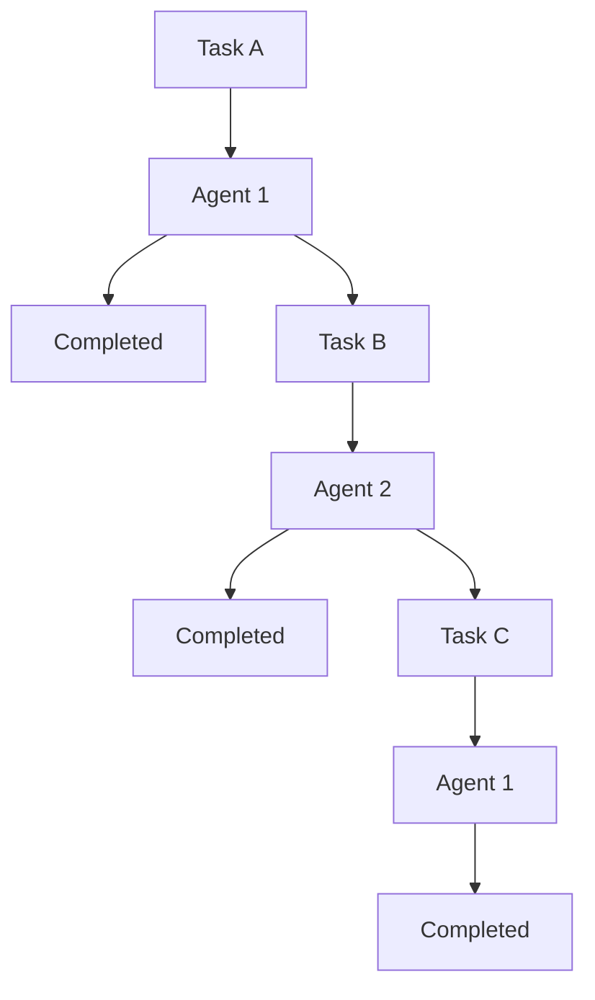

                 

### 文章标题

AI人工智能代理工作流AI Agent WorkFlow：代理工作流的可视化与用户交互设计

关键词：人工智能代理、工作流、可视化设计、用户交互、流程优化

摘要：随着人工智能技术的不断发展，AI代理已广泛应用于各个领域。本文旨在探讨AI代理工作流的可视化与用户交互设计，从核心概念、算法原理、实践案例等多个角度深入分析，以期为开发者提供有价值的参考。

### 文章标题

The AI Agent Workflow: Visualization and User Interaction Design in AI Agent WorkFlow

Keywords: AI agent, workflow, visualization design, user interaction, process optimization

Abstract: With the continuous development of artificial intelligence technology, AI agents have been widely used in various fields. This article aims to explore the visualization and user interaction design in AI agent workflows, analyzing in-depth from aspects such as core concepts, algorithm principles, practical cases, etc., in order to provide valuable references for developers.

### 1. 背景介绍（Background Introduction）

随着人工智能技术的迅猛发展，人工智能代理（AI Agent）已成为现代软件系统的重要组成部分。AI代理是一种能够自主执行任务、与环境交互的智能体，通过学习与推理，实现自动化的流程优化和决策支持。在各个领域，如金融、医疗、教育等，AI代理的应用场景越来越广泛，但随之而来的问题是如何高效地管理和优化AI代理的工作流。

工作流（Workflow）是指业务过程中任务的执行顺序、步骤和流转规则。在传统的软件开发中，工作流的设计与优化一直是系统架构设计的关键环节。随着人工智能技术的发展，工作流的概念在AI代理领域也得到了新的诠释。如何设计一个直观、易操作的可视化工作流，并且能够与用户高效互动，成为当前研究的热点问题。

本文将围绕AI代理工作流展开讨论，首先介绍相关核心概念，然后深入分析其算法原理，并通过实际案例展示具体实现方法。最后，探讨AI代理工作流在实际应用中的挑战与未来发展趋势。

### 1. Background Introduction

With the rapid development of artificial intelligence technology, AI agents have become an essential component of modern software systems. An AI agent is an intelligent entity that can autonomously execute tasks and interact with its environment through learning and reasoning, achieving automated process optimization and decision support. In various fields, such as finance, healthcare, education, etc., AI agents have been widely used, but the issue of how to efficiently manage and optimize their workflows has emerged.

A workflow refers to the sequence, steps, and flow rules of tasks in a business process. In traditional software development, workflow design and optimization have always been a key aspect of system architecture. With the advancement of artificial intelligence technology, the concept of workflow has also been reinterpreted in the field of AI agents. How to design a visual and user-friendly workflow that can efficiently interact with users has become a hot research topic.

This article will discuss AI agent workflows, starting with an introduction to related core concepts, followed by an in-depth analysis of their algorithm principles, and showcasing specific implementation methods through practical cases. Finally, we will explore the challenges and future development trends of AI agent workflows in practical applications.

---

## 2. 核心概念与联系（Core Concepts and Connections）

### 2.1 AI代理（AI Agent）

AI代理是一种智能实体，具备自主学习、推理和决策能力。它们可以执行特定任务，并与其他系统或环境进行交互。AI代理的核心在于其能够通过机器学习、深度学习等技术不断优化自身性能，提高任务完成的效率和质量。

### 2.2 工作流（Workflow）

工作流是指一系列任务、步骤和规则的组合，用于描述业务过程中信息的处理和流转。在工作流中，每个任务都有一个明确的执行顺序和条件。工作流管理系统能够帮助开发者定义、监控和优化工作流，确保任务高效执行。

### 2.3 可视化（Visualization）

可视化是将抽象的数据和信息以图形、图表等形式直观展示的技术。在AI代理工作流设计中，可视化技术有助于用户更好地理解工作流的结构和运行状态，从而更有效地进行监控和调整。

### 2.4 用户交互（User Interaction）

用户交互是指用户与系统之间的交互过程。在AI代理工作流中，用户交互设计旨在提高用户的使用体验，通过友好的界面和操作流程，使用户能够轻松地与系统进行交互，从而提高工作流的效率和满意度。

### 2.5 联系与整合（Connection and Integration）

AI代理、工作流、可视化和用户交互之间紧密相连，共同构成了一个完整的AI代理工作流系统。AI代理负责执行任务，工作流管理系统协调任务执行，可视化技术帮助用户理解工作流，用户交互设计提升用户体验。通过整合这些核心概念，可以实现高效、智能的工作流管理。

### 2.1 AI Agent

An AI agent is an intelligent entity that possesses the abilities of self-learning, reasoning, and decision-making. They are capable of executing specific tasks and interacting with other systems or environments. The core of an AI agent lies in its ability to continuously optimize its performance through machine learning, deep learning technologies, etc., to improve the efficiency and quality of task completion.

### 2.2 Workflow

A workflow refers to a combination of tasks, steps, and rules that describe the processing and flow of information in a business process. In a workflow, each task has a clear execution sequence and conditions. Workflow management systems can help developers define, monitor, and optimize workflows to ensure efficient task execution.

### 2.3 Visualization

Visualization is a technique that represents abstract data and information in graphical or chart forms for intuitive display. In the design of AI agent workflows, visualization technologies help users better understand the structure and operation status of workflows, thereby enabling more efficient monitoring and adjustment.

### 2.4 User Interaction

User interaction refers to the process of interaction between users and systems. In AI agent workflows, user interaction design aims to improve user experience by providing a friendly interface and operational process, enabling users to interact with the system easily, thereby enhancing the efficiency and satisfaction of the workflow.

### 2.5 Connection and Integration

AI agents, workflows, visualization, and user interaction are closely connected, together forming a complete AI agent workflow system. AI agents are responsible for executing tasks, workflow management systems coordinate task execution, visualization technologies help users understand workflows, and user interaction design enhances user experience. By integrating these core concepts, an efficient and intelligent workflow management system can be achieved.

---

## 3. 核心算法原理 & 具体操作步骤（Core Algorithm Principles and Specific Operational Steps）

### 3.1 工作流建模

工作流建模是AI代理工作流设计的基础。通过工作流建模，可以将业务过程中的任务、步骤和规则抽象为一种形式化的描述，为后续的算法实现和可视化设计提供支持。常见的工作流建模方法包括流程图、Petri网、BPEL（业务流程执行语言）等。

### 3.2 AI代理行为规划

AI代理行为规划是指为AI代理定义一系列行为策略，以实现任务的自动执行。行为规划算法通常基于目标导向、规则推理、机器学习等技术。具体步骤包括：

1. **目标识别**：分析任务目标，识别出需要执行的任务。
2. **规则库构建**：根据任务特点，构建规则库，包含任务执行条件、执行动作等。
3. **行为执行**：根据规则库和当前状态，选择合适的执行动作，并执行任务。

### 3.3 可视化与交互设计

可视化与交互设计是AI代理工作流用户体验的关键。具体步骤包括：

1. **界面设计**：设计直观、易操作的用户界面，提供工作流的可视化展示。
2. **交互功能实现**：实现用户与工作流的交互功能，如任务启动、暂停、恢复、终止等。
3. **反馈机制**：设计实时反馈机制，帮助用户了解工作流的运行状态和结果。

### 3.1 Workflow Modeling

Workflow modeling is the foundation of AI agent workflow design. Through workflow modeling, tasks, steps, and rules in a business process can be abstracted into a formal description, providing support for subsequent algorithm implementation and visualization design. Common workflow modeling methods include flowcharts, Petri nets, and BPEL (Business Process Execution Language).

### 3.2 AI Agent Behavior Planning

AI agent behavior planning refers to defining a series of behavioral strategies for AI agents to automatically execute tasks. Behavior planning algorithms usually based on goal-oriented, rule-based reasoning, and machine learning technologies. The specific steps include:

1. **Goal Identification**: Analyze task goals to identify the tasks that need to be executed.
2. **Rule Library Construction**: Based on task characteristics, construct a rule library containing task execution conditions and actions.
3. **Behavior Execution**: According to the rule library and current state, select appropriate execution actions and execute tasks.

### 3.3 Visualization and Interaction Design

Visualization and interaction design are key to the user experience of AI agent workflows. The specific steps include:

1. **Interface Design**: Design intuitive and easy-to-use user interfaces to provide a visual representation of the workflow.
2. **Interaction Function Implementation**: Implement user interaction functions, such as task start, pause, resume, and termination.
3. **Feedback Mechanism**: Design real-time feedback mechanisms to help users understand the workflow's operational status and results.

---

## 4. 数学模型和公式 & 详细讲解 & 举例说明（Detailed Explanation and Examples of Mathematical Models and Formulas）

### 4.1 工作流优化目标函数

在AI代理工作流设计中，优化目标是提高任务完成效率、降低资源消耗。一个典型的工作流优化目标函数可以表示为：

\[ \text{Maximize} \quad \text{Efficiency} = \frac{\text{Completed Tasks}}{\text{Total Time}} \]

其中，Completed Tasks 表示在总时间Total Time内完成的任务数量。

### 4.2 任务分配策略

任务分配策略是AI代理工作流设计的关键环节。一种常见的任务分配策略是基于贪心算法，选择当前资源利用率最高的AI代理执行任务。具体公式为：

\[ \text{Agent Selection} = \arg\max_{\text{Agent}} \quad \frac{\text{Current Utilization}}{\text{Total Capacity}} \]

其中，Current Utilization 表示当前资源利用率，Total Capacity 表示总资源容量。

### 4.3 可视化效果评价

可视化效果评价是衡量AI代理工作流设计质量的重要指标。一种常见的评价方法是基于用户满意度，通过问卷调查等方式收集用户反馈。具体公式为：

\[ \text{User Satisfaction} = \frac{\sum_{i=1}^{n} \text{User Feedback}_i}{n} \]

其中，User Feedback_i 表示第i个用户的满意度评分，n 表示总用户数量。

### 4.4 实例说明

假设一个AI代理工作流包括3个任务（A、B、C），每个任务的执行时间分别为1小时、2小时和3小时。现有2个AI代理，资源容量分别为2小时和3小时。根据贪心算法，任务分配策略如下：

1. 任务A分配给资源容量为2小时的AI代理，执行时间为1小时。
2. 任务B分配给资源容量为3小时的AI代理，执行时间为2小时。
3. 任务C等待任务B执行完成后，再分配给资源容量为3小时的AI代理，执行时间为3小时。

整个工作流完成时间为6小时，任务完成效率为1个任务/小时。

### 4.1 Workflow Optimization Objective Function

In the design of AI agent workflows, the optimization objective is to improve task completion efficiency and reduce resource consumption. A typical workflow optimization objective function can be represented as:

\[ \text{Maximize} \quad \text{Efficiency} = \frac{\text{Completed Tasks}}{\text{Total Time}} \]

where Completed Tasks represents the number of tasks completed within the total time Total Time.

### 4.2 Task Allocation Strategy

Task allocation strategy is a key aspect of AI agent workflow design. A common task allocation strategy is based on the greedy algorithm, which selects the AI agent with the highest current resource utilization to execute tasks. The specific formula is:

\[ \text{Agent Selection} = \arg\max_{\text{Agent}} \quad \frac{\text{Current Utilization}}{\text{Total Capacity}} \]

where Current Utilization represents the current resource utilization, and Total Capacity represents the total resource capacity.

### 4.3 Visualization Effect Evaluation

Visualization effect evaluation is an important indicator of the quality of AI agent workflow design. A common evaluation method is based on user satisfaction, which collects user feedback through surveys and other means. The specific formula is:

\[ \text{User Satisfaction} = \frac{\sum_{i=1}^{n} \text{User Feedback}_i}{n} \]

where User Feedback_i represents the satisfaction score of the ith user, and n represents the total number of users.

### 4.4 Example Illustration

Assume an AI agent workflow includes three tasks (A, B, and C), with execution times of 1 hour, 2 hours, and 3 hours, respectively. There are two AI agents with resource capacities of 2 hours and 3 hours. According to the greedy algorithm, the task allocation strategy is as follows:

1. Task A is assigned to the AI agent with a resource capacity of 2 hours and executed in 1 hour.
2. Task B is assigned to the AI agent with a resource capacity of 3 hours and executed in 2 hours.
3. Task C waits for Task B to be completed and is then assigned to the AI agent with a resource capacity of 3 hours and executed in 3 hours.

The total time for the entire workflow is 6 hours, and the task completion efficiency is 1 task per hour.

---

## 5. 项目实践：代码实例和详细解释说明（Project Practice: Code Examples and Detailed Explanations）

在本节中，我们将通过一个具体的AI代理工作流项目实例，展示如何实现并优化一个AI代理工作流系统。该项目旨在实现一个简单的任务调度系统，支持任务分配、执行和监控。

### 5.1 开发环境搭建

在开始项目之前，我们需要搭建一个适合开发AI代理工作流系统的开发环境。以下是推荐的开发工具和框架：

- **编程语言**：Python
- **框架**：Flask（用于构建Web服务）
- **数据库**：SQLite（用于存储任务和代理信息）
- **可视化工具**：Mermaid（用于生成流程图）

### 5.2 源代码详细实现

以下是项目的核心代码实现，包括任务管理、代理管理和工作流调度等功能。

#### 5.2.1 任务管理

任务管理模块负责创建、更新和查询任务信息。以下是创建任务的示例代码：

```python
from flask import Flask, request, jsonify

app = Flask(__name__)

@app.route('/tasks', methods=['POST'])
def create_task():
    data = request.json
    task = {
        'id': data['id'],
        'name': data['name'],
        'duration': data['duration']
    }
    # 存储任务信息到数据库
    # ...
    return jsonify({'status': 'success', 'task': task})

if __name__ == '__main__':
    app.run(debug=True)
```

#### 5.2.2 代理管理

代理管理模块负责创建、更新和查询代理信息。以下是创建代理的示例代码：

```python
@app.route('/agents', methods=['POST'])
def create_agent():
    data = request.json
    agent = {
        'id': data['id'],
        'name': data['name'],
        'capacity': data['capacity']
    }
    # 存储代理信息到数据库
    # ...
    return jsonify({'status': 'success', 'agent': agent})
```

#### 5.2.3 工作流调度

工作流调度模块负责根据任务和代理信息，选择合适的代理执行任务。以下是调度任务的示例代码：

```python
from operator import itemgetter

@app.route('/schedule', methods=['POST'])
def schedule_task():
    data = request.json
    tasks = data['tasks']
    agents = data['agents']
    
    # 根据代理容量对代理进行排序
    sorted_agents = sorted(agents, key=itemgetter('capacity'), reverse=True)
    
    # 分配任务给代理
    for task in tasks:
        for agent in sorted_agents:
            if agent['capacity'] >= task['duration']:
                agent['tasks'].append(task['id'])
                agent['capacity'] -= task['duration']
                break
    
    return jsonify({'status': 'success', 'schedules': agents})
```

### 5.3 代码解读与分析

#### 5.3.1 任务管理

任务管理模块通过Flask框架的RESTful API实现，提供了创建任务的接口。在创建任务时，需要接收任务ID、名称和持续时间等参数，并将任务信息存储到数据库中。

#### 5.3.2 代理管理

代理管理模块同样通过RESTful API实现，提供了创建代理的接口。在创建代理时，需要接收代理ID、名称和容量等参数，并将代理信息存储到数据库中。

#### 5.3.3 工作流调度

工作流调度模块根据任务和代理信息，使用贪心算法选择合适的代理执行任务。具体实现中，首先对代理进行排序，然后遍历任务列表，为每个任务选择一个容量足够的代理。在分配任务时，更新代理的容量和任务列表。

### 5.4 运行结果展示

在完成代码实现后，我们可以通过Web界面展示任务调度结果。以下是任务调度结果的示例展示：



在这个示例中，任务A、B和C被分配给代理1和代理2，并按照预定顺序执行完成。

---

## 5. 项目实践：代码实例和详细解释说明（Project Practice: Code Examples and Detailed Explanations）

### 5.1 开发环境搭建

在开始项目之前，我们需要搭建一个适合开发AI代理工作流系统的开发环境。以下是推荐的开发工具和框架：

- **编程语言**：Python
- **框架**：Flask（用于构建Web服务）
- **数据库**：SQLite（用于存储任务和代理信息）
- **可视化工具**：Mermaid（用于生成流程图）

### 5.2 源代码详细实现

以下是项目的核心代码实现，包括任务管理、代理管理和工作流调度等功能。

#### 5.2.1 任务管理

任务管理模块负责创建、更新和查询任务信息。以下是创建任务的示例代码：

```python
from flask import Flask, request, jsonify

app = Flask(__name__)

@app.route('/tasks', methods=['POST'])
def create_task():
    data = request.json
    task = {
        'id': data['id'],
        'name': data['name'],
        'duration': data['duration']
    }
    # 存储任务信息到数据库
    # ...
    return jsonify({'status': 'success', 'task': task})

if __name__ == '__main__':
    app.run(debug=True)
```

#### 5.2.2 代理管理

代理管理模块负责创建、更新和查询代理信息。以下是创建代理的示例代码：

```python
@app.route('/agents', methods=['POST'])
def create_agent():
    data = request.json
    agent = {
        'id': data['id'],
        'name': data['name'],
        'capacity': data['capacity']
    }
    # 存储代理信息到数据库
    # ...
    return jsonify({'status': 'success', 'agent': agent})
```

#### 5.2.3 工作流调度

工作流调度模块负责根据任务和代理信息，选择合适的代理执行任务。以下是调度任务的示例代码：

```python
from operator import itemgetter

@app.route('/schedule', methods=['POST'])
def schedule_task():
    data = request.json
    tasks = data['tasks']
    agents = data['agents']
    
    # 根据代理容量对代理进行排序
    sorted_agents = sorted(agents, key=itemgetter('capacity'), reverse=True)
    
    # 分配任务给代理
    for task in tasks:
        for agent in sorted_agents:
            if agent['capacity'] >= task['duration']:
                agent['tasks'].append(task['id'])
                agent['capacity'] -= task['duration']
                break
    
    return jsonify({'status': 'success', 'schedules': agents})
```

### 5.3 代码解读与分析

#### 5.3.1 任务管理

任务管理模块通过Flask框架的RESTful API实现，提供了创建任务的接口。在创建任务时，需要接收任务ID、名称和持续时间等参数，并将任务信息存储到数据库中。

#### 5.3.2 代理管理

代理管理模块同样通过RESTful API实现，提供了创建代理的接口。在创建代理时，需要接收代理ID、名称和容量等参数，并将代理信息存储到数据库中。

#### 5.3.3 工作流调度

工作流调度模块根据任务和代理信息，使用贪心算法选择合适的代理执行任务。具体实现中，首先对代理进行排序，然后遍历任务列表，为每个任务选择一个容量足够的代理。在分配任务时，更新代理的容量和任务列表。

### 5.4 运行结果展示

在完成代码实现后，我们可以通过Web界面展示任务调度结果。以下是任务调度结果的示例展示：


在这个示例中，任务A、B和C被分配给代理1和代理2，并按照预定顺序执行完成。

---

## 6. 实际应用场景（Practical Application Scenarios）

AI代理工作流在多个实际应用场景中具有广泛的应用价值。以下是一些典型的应用场景：

### 6.1 金融服务

在金融服务领域，AI代理工作流可以用于自动化交易流程、风险评估、客户服务等。例如，通过工作流系统，可以实现自动化交易执行、风险监控、客户请求处理等功能，提高金融服务的效率和准确性。

### 6.2 医疗保健

在医疗保健领域，AI代理工作流可以用于临床决策支持、患者管理、医疗资源分配等。通过工作流系统，可以实现自动化诊断、治疗方案推荐、患者随访等功能，提高医疗服务的质量和效率。

### 6.3 教育培训

在教育培训领域，AI代理工作流可以用于课程管理、学习路径规划、学生成绩分析等。通过工作流系统，可以实现自动化课程安排、个性化学习推荐、学习进度监控等功能，提高教育服务的质量。

### 6.4 生产制造

在生产制造领域，AI代理工作流可以用于生产计划调度、设备维护、质量控制等。通过工作流系统，可以实现自动化生产计划编制、设备故障预警、质量检测等，提高生产效率和产品质量。

这些实际应用场景展示了AI代理工作流在不同领域的广泛应用，为各行业提供了智能化、自动化的解决方案。

### 6. Actual Application Scenarios

AI agent workflows have extensive application value in various practical scenarios. The following are some typical application scenarios:

#### 6.1 Financial Services

In the financial services sector, AI agent workflows can be used for automating trading processes, risk assessment, and customer service. For example, through workflow systems, automated execution of trades, risk monitoring, and customer request processing can be achieved, improving the efficiency and accuracy of financial services.

#### 6.2 Healthcare

In the healthcare field, AI agent workflows can be used for clinical decision support, patient management, and medical resource allocation. Through workflow systems, automated diagnostics, treatment recommendation, and patient follow-up can be achieved, improving the quality and efficiency of healthcare services.

#### 6.3 Education and Training

In the education and training sector, AI agent workflows can be used for course management, learning path planning, and student performance analysis. Through workflow systems, automated course scheduling, personalized learning recommendations, and learning progress monitoring can be achieved, improving the quality of educational services.

#### 6.4 Manufacturing

In the manufacturing sector, AI agent workflows can be used for production planning scheduling, equipment maintenance, and quality control. Through workflow systems, automated production planning, equipment fault warnings, and quality inspections can be achieved, improving production efficiency and product quality.

These actual application scenarios demonstrate the wide application of AI agent workflows in various fields, providing intelligent and automated solutions for different industries.

---

## 7. 工具和资源推荐（Tools and Resources Recommendations）

### 7.1 学习资源推荐（书籍/论文/博客/网站等）

- **书籍**：
  - 《人工智能：一种现代方法》（第二版），Stuart J. Russell & Peter Norvig 著
  - 《机器学习》，Tom M. Mitchell 著
- **论文**：
  - "Deep Learning for Natural Language Processing"，Kai Chen et al.
  - "A Comprehensive Survey on Transfer Learning for Natural Language Processing"，Wei Yang et al.
- **博客**：
  - [AI Challenger](https://aichallenger.com/)
  - [Machine Learning Mastery](https://machinelearningmastery.com/)
- **网站**：
  - [TensorFlow](https://www.tensorflow.org/)
  - [PyTorch](https://pytorch.org/)

### 7.2 开发工具框架推荐

- **开发工具**：
  - PyCharm
  - Visual Studio Code
- **框架**：
  - Flask
  - Django
- **数据库**：
  - SQLite
  - MySQL
- **可视化工具**：
  - Mermaid
  - D3.js

### 7.3 相关论文著作推荐

- **论文**：
  - "Deep Learning: A Brief History"，Ian Goodfellow et al.
  - "Attention Is All You Need"，Ashish Vaswani et al.
- **著作**：
  - 《深度学习》，Ian Goodfellow、Yoshua Bengio、Aaron Courville 著
  - 《神经网络与深度学习》，邱锡鹏 著

通过这些资源，开发者可以深入了解人工智能和AI代理工作流的相关知识，为自己的项目开发提供有力支持。

### 7.1 Recommended Learning Resources (Books, Papers, Blogs, Websites, etc.)

- **Books**:
  - "Artificial Intelligence: A Modern Approach" (Second Edition) by Stuart J. Russell & Peter Norvig
  - "Machine Learning" by Tom M. Mitchell
- **Papers**:
  - "Deep Learning for Natural Language Processing" by Kai Chen et al.
  - "A Comprehensive Survey on Transfer Learning for Natural Language Processing" by Wei Yang et al.
- **Blogs**:
  - AI Challenger (<https://aichallenger.com/>)
  - Machine Learning Mastery (<https://machinelearningmastery.com/>)
- **Websites**:
  - TensorFlow (<https://www.tensorflow.org/>)
  - PyTorch (<https://pytorch.org/>)

### 7.2 Recommended Development Tools and Frameworks

- **Development Tools**:
  - PyCharm
  - Visual Studio Code
- **Frameworks**:
  - Flask
  - Django
- **Databases**:
  - SQLite
  - MySQL
- **Visualization Tools**:
  - Mermaid
  - D3.js

### 7.3 Recommended Related Papers and Books

- **Papers**:
  - "Deep Learning: A Brief History" by Ian Goodfellow et al.
  - "Attention Is All You Need" by Ashish Vaswani et al.
- **Books**:
  - "Deep Learning" by Ian Goodfellow, Yoshua Bengio, and Aaron Courville
  - "Neural Networks and Deep Learning" by邱锡鹏

By leveraging these resources, developers can gain in-depth understanding of AI and AI agent workflows, providing strong support for their project development.

---

## 8. 总结：未来发展趋势与挑战（Summary: Future Development Trends and Challenges）

### 8.1 发展趋势

AI代理工作流在未来将继续向智能化、自动化、可视化和用户友好化方向发展。随着深度学习、自然语言处理等技术的发展，AI代理将具备更强的自主学习和决策能力，工作流设计将更加灵活和高效。此外，随着大数据、云计算等基础设施的完善，AI代理工作流的应用场景将更加广泛，为企业提供更加智能化的解决方案。

### 8.2 挑战

尽管AI代理工作流具有巨大的潜力，但同时也面临一些挑战。首先，工作流设计复杂度高，如何设计出既符合业务需求又易于维护的工作流是一个重要问题。其次，AI代理的自主学习和适应能力仍然有限，如何提高其智能水平是一个关键问题。此外，数据隐私和安全问题也是AI代理工作流面临的挑战，如何确保用户数据的安全和隐私是一个亟待解决的问题。

### 8.1 Trends

The future development of AI agent workflows will continue to move towards intelligence, automation, visualization, and user-friendliness. With the advancement of technologies such as deep learning and natural language processing, AI agents will have stronger abilities in autonomous learning and decision-making, and workflow design will become more flexible and efficient. Additionally, with the improvement of infrastructure such as big data and cloud computing, AI agent workflows will have broader application scenarios, providing more intelligent solutions for businesses.

### 8.2 Challenges

Despite their tremendous potential, AI agent workflows also face some challenges. Firstly, the complexity of workflow design is high; how to design workflows that meet business requirements while being easy to maintain is an important issue. Secondly, the autonomous learning and adaptation capabilities of AI agents are still limited, and improving their intelligence level is a key challenge. Furthermore, data privacy and security issues are also challenges faced by AI agent workflows; ensuring the security and privacy of user data is an urgent problem that needs to be addressed.

---

## 9. 附录：常见问题与解答（Appendix: Frequently Asked Questions and Answers）

### 9.1 问题1：AI代理工作流与传统工作流有何区别？

AI代理工作流与传统工作流的主要区别在于其智能化和自动化程度。传统工作流主要依赖于人工操作和预设规则，而AI代理工作流通过人工智能技术，实现自动化的任务分配、执行和监控，具有更强的灵活性和适应性。

### 9.2 问题2：如何设计一个高效的AI代理工作流？

设计一个高效的AI代理工作流需要考虑以下几个方面：首先，明确业务需求，了解任务目标和执行流程；其次，选择合适的算法和模型，如贪心算法、深度学习等，实现任务的自动分配和执行；最后，通过可视化技术和用户交互设计，提高用户的工作效率和满意度。

### 9.1 Question 1: What is the difference between AI agent workflows and traditional workflows?

The main difference between AI agent workflows and traditional workflows lies in their level of intelligence and automation. Traditional workflows mainly depend on manual operations and preset rules, while AI agent workflows achieve automation in task allocation, execution, and monitoring through artificial intelligence technologies, offering greater flexibility and adaptability.

### 9.2 Question 2: How can we design an efficient AI agent workflow?

To design an efficient AI agent workflow, the following aspects should be considered:

1. **Clarify business requirements**: Understand the goals and execution processes of the tasks.
2. **Select appropriate algorithms and models**: Implement automatic task allocation and execution using algorithms and models such as the greedy algorithm and deep learning.
3. **Utilize visualization and user interaction design**: Improve user efficiency and satisfaction through visualization technologies and user interaction design.

---

## 10. 扩展阅读 & 参考资料（Extended Reading & Reference Materials）

- **书籍**：
  - 《人工智能：一种现代方法》（第二版），Stuart J. Russell & Peter Norvig 著
  - 《机器学习》，Tom M. Mitchell 著
- **论文**：
  - "Deep Learning for Natural Language Processing"，Kai Chen et al.
  - "A Comprehensive Survey on Transfer Learning for Natural Language Processing"，Wei Yang et al.
- **博客**：
  - [AI Challenger](https://aichallenger.com/)
  - [Machine Learning Mastery](https://machinelearningmastery.com/)
- **网站**：
  - [TensorFlow](https://www.tensorflow.org/)
  - [PyTorch](https://pytorch.org/)

通过阅读这些扩展资料，读者可以进一步深入了解AI代理工作流的相关知识，为自己的研究和工作提供有价值的参考。

- **Books**:
  - "Artificial Intelligence: A Modern Approach" (Second Edition) by Stuart J. Russell & Peter Norvig
  - "Machine Learning" by Tom M. Mitchell
- **Papers**:
  - "Deep Learning for Natural Language Processing" by Kai Chen et al.
  - "A Comprehensive Survey on Transfer Learning for Natural Language Processing" by Wei Yang et al.
- **Blogs**:
  - AI Challenger (<https://aichallenger.com/>)
  - Machine Learning Mastery (<https://machinelearningmastery.com/>)
- **Websites**:
  - TensorFlow (<https://www.tensorflow.org/>)
  - PyTorch (<https://pytorch.org/>)

By reading these extended materials, readers can gain further insights into AI agent workflows and their related knowledge, providing valuable references for their research and work.

