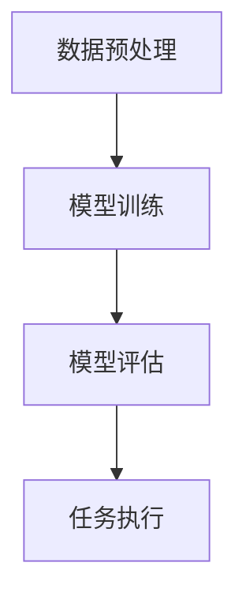
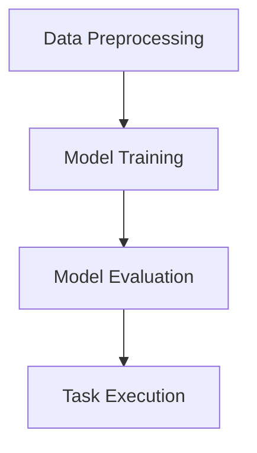

                 

### 文章标题

### AI人工智能深度学习算法：智能深度学习代理的任务处理流程

关键词：人工智能，深度学习，智能代理，任务处理，算法原理，数学模型，项目实践，实际应用场景

摘要：本文旨在探讨人工智能领域中的深度学习算法，特别是智能深度学习代理的任务处理流程。通过对核心算法原理、数学模型和具体操作步骤的深入分析，结合项目实践，本文将阐述智能深度学习代理在各类任务中的实际应用场景，以及相关的工具和资源推荐，为读者提供全面的技术指导。

<|assistant|>### 1. 背景介绍

随着人工智能技术的迅猛发展，深度学习作为其中的一种重要算法，已经在图像识别、自然语言处理、语音识别等多个领域取得了显著的成果。而智能深度学习代理，作为一种能够自主学习和执行任务的智能体，正逐步应用于各行各业，为人类带来诸多便利。

深度学习代理是通过深度神经网络模型来模拟人类智能的算法，它能够从大量的数据中自动学习特征，并通过优化算法不断提高其预测和决策能力。而智能深度学习代理的任务处理流程，则涵盖了从数据输入、模型训练、到任务执行的全过程。在这一过程中，深度学习算法的优化和数学模型的构建是关键。

本文将围绕智能深度学习代理的任务处理流程，详细探讨其核心算法原理、数学模型和具体操作步骤，并结合实际项目进行深入分析，旨在为读者提供一套系统、全面的技术指导。

<|assistant|>### 2. 核心概念与联系

#### 2.1 智能深度学习代理的定义

智能深度学习代理是指利用深度学习算法进行自主学习和执行任务的智能体。它能够从原始数据中自动提取特征，通过多层神经网络进行特征学习和优化，最终实现复杂的任务处理。智能深度学习代理在图像识别、自然语言处理、语音识别等领域展现出强大的能力，被认为是人工智能技术的重要发展方向。

#### 2.2 深度学习算法的基本原理

深度学习算法是基于多层神经网络构建的，其核心思想是通过多层的非线性变换，将输入数据映射到高维特征空间，从而实现特征的自动提取和分类。深度学习算法主要包括以下几种类型：

1. **卷积神经网络（CNN）**：主要用于图像识别和图像处理领域，通过卷积操作提取图像特征，实现分类和检测任务。
2. **循环神经网络（RNN）**：主要用于序列数据建模，如自然语言处理和语音识别，通过循环连接实现长期依赖关系的建模。
3. **生成对抗网络（GAN）**：主要用于生成数据和学习复杂分布，通过生成器和判别器的对抗训练，实现高质量的图像生成和数据增强。

#### 2.3 数学模型与深度学习算法的联系

数学模型是深度学习算法的核心，它通过定义网络结构、激活函数、优化算法等，指导深度学习算法的学习过程。常见的数学模型包括：

1. **前向传播和反向传播**：用于计算神经网络的输出和误差，实现参数的更新和模型优化。
2. **损失函数**：用于衡量模型的预测误差，指导优化过程，常见的损失函数有均方误差（MSE）、交叉熵（Cross-Entropy）等。
3. **优化算法**：用于加速模型训练和优化过程，常见的优化算法有梯度下降（Gradient Descent）、随机梯度下降（SGD）等。

#### 2.4 智能深度学习代理的任务处理流程

智能深度学习代理的任务处理流程通常包括以下几个步骤：

1. **数据预处理**：对输入数据进行清洗、归一化等处理，使其符合模型的输入要求。
2. **模型训练**：利用训练数据对深度学习模型进行训练，通过优化算法更新模型参数，提高模型性能。
3. **模型评估**：使用验证数据对模型进行评估，确定模型的泛化能力和效果。
4. **任务执行**：将训练好的模型应用于实际任务，如图像分类、语音识别等，实现智能代理的功能。

#### 2.5 Mermaid 流程图

下面是一个简单的 Mermaid 流程图，展示了智能深度学习代理的任务处理流程：



### 2. Core Concepts and Connections

#### 2.1 Definition of Intelligent Deep Learning Agent

An intelligent deep learning agent refers to an intelligent agent that uses deep learning algorithms for autonomous learning and task execution. It can automatically extract features from raw data through multi-layer neural networks, and achieve complex task processing. Intelligent deep learning agents have demonstrated strong capabilities in fields such as image recognition, natural language processing, and speech recognition, and are considered an important development direction in the field of artificial intelligence.

#### 2.2 Basic Principles of Deep Learning Algorithms

Deep learning algorithms are based on multi-layer neural networks, with the core idea of mapping input data to high-dimensional feature spaces through multi-layer nonlinear transformations to achieve automatic feature extraction and classification. Common types of deep learning algorithms include:

1. **Convolutional Neural Networks (CNN)**: Mainly used in the field of image recognition and image processing, CNNs extract image features through convolutional operations to achieve classification and detection tasks.
2. **Recurrent Neural Networks (RNN)**: Mainly used for modeling sequential data, such as natural language processing and speech recognition, RNNs build models of long-term dependencies through recurrent connections.
3. **Generative Adversarial Networks (GAN)**: Mainly used for generating data and learning complex distributions, GANs achieve high-quality image generation and data augmentation through adversarial training of generators and discriminators.

#### 2.3 Relationship between Mathematical Models and Deep Learning Algorithms

Mathematical models are the core of deep learning algorithms, guiding the learning process of deep learning algorithms through definitions of network structures, activation functions, and optimization algorithms. Common mathematical models include:

1. **Forward Propagation and Backpropagation**: Used to calculate the output and error of neural networks, and update model parameters to optimize the model.
2. **Loss Functions**: Used to measure the prediction error of the model and guide the optimization process. Common loss functions include Mean Squared Error (MSE) and Cross-Entropy.
3. **Optimization Algorithms**: Used to accelerate model training and optimization. Common optimization algorithms include Gradient Descent and Stochastic Gradient Descent (SGD).

#### 2.4 Task Processing Workflow of Intelligent Deep Learning Agents

The task processing workflow of intelligent deep learning agents usually includes the following steps:

1. **Data Preprocessing**: Clean and normalize input data to make it suitable for model input.
2. **Model Training**: Train deep learning models using training data through optimization algorithms to update model parameters and improve model performance.
3. **Model Evaluation**: Evaluate the model using validation data to determine the generalization ability and effectiveness of the model.
4. **Task Execution**: Apply the trained model to real-world tasks, such as image classification and speech recognition, to achieve the functionality of intelligent agents.

#### 2.5 Mermaid Flowchart

Below is a simple Mermaid flowchart illustrating the task processing workflow of intelligent deep learning agents:



<|assistant|>### 3. 核心算法原理 & 具体操作步骤

#### 3.1 卷积神经网络（CNN）算法原理

卷积神经网络（CNN）是一种在图像识别和图像处理领域具有广泛应用的深度学习算法。其基本原理是通过卷积操作提取图像特征，实现分类和检测任务。CNN算法的主要组成部分包括卷积层、池化层和全连接层。

1. **卷积层**：卷积层是CNN的核心部分，通过卷积操作提取图像特征。卷积操作是指将卷积核（也称为过滤器）与输入图像进行点积，生成新的特征图。卷积核的大小和数量决定了特征图的维度。
   
2. **池化层**：池化层用于降低特征图的维度，减少计算量。常见的池化操作有最大池化和平均池化。最大池化选择特征图中每个窗口内的最大值，而平均池化则是计算窗口内所有值的平均值。

3. **全连接层**：全连接层是将特征图映射到分类结果。每个神经元都与特征图中的每个神经元相连接，从而实现分类任务。

具体操作步骤如下：

1. **输入图像**：将输入图像转化为卷积层的输入，通常需要进行归一化处理。

2. **卷积操作**：对输入图像进行卷积操作，生成卷积特征图。

3. **池化操作**：对卷积特征图进行池化操作，降低特征图的维度。

4. **全连接层**：将池化后的特征图输入到全连接层，计算分类结果。

5. **损失函数**：使用交叉熵损失函数计算模型预测结果和真实标签之间的误差。

6. **优化算法**：使用反向传播算法更新模型参数，优化模型性能。

#### 3.2 循环神经网络（RNN）算法原理

循环神经网络（RNN）是一种在序列数据建模领域具有广泛应用的深度学习算法。其基本原理是通过循环连接实现长期依赖关系的建模，从而实现对序列数据的建模和预测。RNN算法的主要组成部分包括输入层、隐藏层和输出层。

1. **输入层**：输入层接收序列数据的每个时间步的输入。

2. **隐藏层**：隐藏层包含循环连接，用于处理序列数据中的长期依赖关系。每个时间步的隐藏状态都依赖于前一个时间步的隐藏状态。

3. **输出层**：输出层根据隐藏层的状态计算输出结果，如语言模型中的单词预测或语音识别中的语音标签。

具体操作步骤如下：

1. **输入序列**：将序列数据输入到RNN模型，通常需要进行嵌入处理。

2. **计算隐藏状态**：在每个时间步，使用循环连接计算隐藏状态，隐藏状态依赖于前一个时间步的隐藏状态。

3. **计算输出**：根据隐藏状态计算输出结果，如单词预测或语音标签。

4. **损失函数**：使用交叉熵损失函数计算模型预测结果和真实标签之间的误差。

5. **优化算法**：使用反向传播算法更新模型参数，优化模型性能。

#### 3.3 生成对抗网络（GAN）算法原理

生成对抗网络（GAN）是一种在生成数据和学习复杂分布领域具有广泛应用的深度学习算法。其基本原理是通过生成器和判别器的对抗训练，实现高质量的图像生成和数据增强。GAN算法的主要组成部分包括生成器、判别器和损失函数。

1. **生成器**：生成器是一个神经网络，用于生成假样本。生成器的目标是使其生成的样本尽可能接近真实样本。

2. **判别器**：判别器是一个神经网络，用于判断输入样本是真实样本还是生成器生成的假样本。判别器的目标是正确区分真实样本和假样本。

3. **损失函数**：GAN的损失函数包括生成器的损失函数和判别器的损失函数。生成器的损失函数旨在最小化判别器判断为假样本的概率，而判别器的损失函数旨在最大化判别器判断为真实样本的概率。

具体操作步骤如下：

1. **生成器生成样本**：生成器生成假样本。

2. **判别器判断样本**：判别器对真实样本和生成器生成的假样本进行判断。

3. **计算损失函数**：根据生成器和判别器的判断结果计算损失函数。

4. **更新参数**：使用反向传播算法更新生成器和判别器的参数，优化模型性能。

### 3. Core Algorithm Principles and Specific Operational Steps

#### 3.1 Convolutional Neural Networks (CNN) Algorithm Principles

Convolutional Neural Networks (CNN) are widely applied in fields such as image recognition and image processing. The basic principle of CNN is to extract image features through convolutional operations to achieve classification and detection tasks. The main components of CNN include convolutional layers, pooling layers, and fully connected layers.

1. **Convolutional Layer**: The convolutional layer is the core part of CNN, which extracts image features through convolutional operations. The convolutional operation is to perform pointwise multiplication between the convolutional kernel (also known as the filter) and the input image, generating a new feature map. The size and number of the convolutional kernels determine the dimension of the feature map.

2. **Pooling Layer**: The pooling layer is used to reduce the dimension of the feature map, reducing the computational complexity. Common pooling operations include max pooling and average pooling. Max pooling selects the maximum value in each window of the feature map, while average pooling calculates the average value of all values in the window.

3. **Fully Connected Layer**: The fully connected layer maps the feature map to the classification results. Each neuron in the fully connected layer is connected to each neuron in the feature map, enabling classification tasks.

The specific operational steps are as follows:

1. **Input Image**: Convert the input image into the input of the convolutional layer, typically requiring normalization.

2. **Convolutional Operation**: Perform convolutional operations on the input image to generate convolutional feature maps.

3. **Pooling Operation**: Apply pooling operations to the convolutional feature maps to reduce their dimension.

4. **Fully Connected Layer**: Input the pooled feature maps into the fully connected layer to compute classification results.

5. **Loss Function**: Use the cross-entropy loss function to calculate the error between the model's predicted results and the true labels.

6. **Optimization Algorithm**: Use the backpropagation algorithm to update model parameters and optimize model performance.

#### 3.2 Recurrent Neural Networks (RNN) Algorithm Principles

Recurrent Neural Networks (RNN) are widely applied in fields such as sequence data modeling. The basic principle of RNN is to model long-term dependencies in sequential data through recurrent connections, enabling modeling and prediction of sequence data. The main components of RNN include input layers, hidden layers, and output layers.

1. **Input Layer**: The input layer receives the input of each time step in the sequence data.

2. **Hidden Layer**: The hidden layer contains recurrent connections to handle long-term dependencies in sequence data. The hidden state at each time step depends on the hidden state at the previous time step.

3. **Output Layer**: The output layer computes the output results based on the hidden states, such as word prediction in language models or speech labels in speech recognition.

The specific operational steps are as follows:

1. **Input Sequence**: Input sequence data into the RNN model, typically requiring embedding.

2. **Compute Hidden States**: At each time step, use recurrent connections to compute hidden states, which depend on the hidden state at the previous time step.

3. **Compute Output**: Compute output results based on the hidden states, such as word prediction or speech labels.

4. **Loss Function**: Use the cross-entropy loss function to calculate the error between the model's predicted results and the true labels.

5. **Optimization Algorithm**: Use the backpropagation algorithm to update model parameters and optimize model performance.

#### 3.3 Generative Adversarial Networks (GAN) Algorithm Principles

Generative Adversarial Networks (GAN) are widely applied in fields such as generating data and learning complex distributions. The basic principle of GAN is to achieve high-quality image generation and data augmentation through adversarial training of generators and discriminators. The main components of GAN include generators, discriminators, and loss functions.

1. **Generator**: The generator is a neural network that generates fake samples. The goal of the generator is to make the generated samples as close as possible to real samples.

2. **Discriminator**: The discriminator is a neural network that judges whether input samples are real samples or fake samples generated by the generator. The goal of the discriminator is to correctly distinguish real samples from fake samples.

3. **Loss Function**: The loss function of GAN includes the loss function of the generator and the loss function of the discriminator. The generator's loss function aims to minimize the probability of the discriminator judging the generated samples as fake samples, while the discriminator's loss function aims to maximize the probability of the discriminator judging real samples as real samples.

The specific operational steps are as follows:

1. **Generate Samples**: Generate fake samples by the generator.

2. **Judge Samples**: The discriminator judges the real samples and the fake samples generated by the generator.

3. **Calculate Loss Functions**: Calculate the loss functions based on the judgments of the generator and the discriminator.

4. **Update Parameters**: Use the backpropagation algorithm to update the parameters of the generator and the discriminator, optimizing model performance. 

<|assistant|>### 4. 数学模型和公式 & 详细讲解 & 举例说明

#### 4.1 前向传播与反向传播

前向传播（Forward Propagation）和反向传播（Backpropagation）是神经网络训练过程中的两个核心步骤。前向传播用于计算网络的输出，并计算损失函数的梯度；反向传播则用于更新网络参数，以最小化损失函数。

**前向传播公式：**

在神经网络中，每个神经元接收多个输入，并应用一个激活函数来产生输出。对于第 \( l \) 层的第 \( i \) 个神经元，其输出可以表示为：

$$
a^{[l]}_i = \sigma(z^{[l]}_i)
$$

其中，\( a^{[l]}_i \) 是第 \( l \) 层的第 \( i \) 个神经元的输出，\( z^{[l]}_i \) 是该神经元的净输入，\( \sigma \) 是激活函数。净输入可以表示为：

$$
z^{[l]}_i = \sum_{j} W^{[l]}_{ij}a^{[l-1]}_j + b^{[l]}_i
$$

其中，\( W^{[l]}_{ij} \) 是连接第 \( l-1 \) 层的第 \( j \) 个神经元和第 \( l \) 层的第 \( i \) 个神经元的权重，\( b^{[l]}_i \) 是第 \( l \) 层的第 \( i \) 个神经元的偏置。

对于输出层的损失函数，常见的有均方误差（MSE）和交叉熵（Cross-Entropy）。

**均方误差（MSE）：**

$$
J = \frac{1}{m}\sum_{i=1}^{m}(y_i - \hat{y}_i)^2
$$

其中，\( y_i \) 是实际标签，\( \hat{y}_i \) 是模型的预测输出。

**交叉熵（Cross-Entropy）：**

$$
J = -\frac{1}{m}\sum_{i=1}^{m}y_i\log(\hat{y}_i)
$$

其中，\( y_i \) 是实际标签，\( \hat{y}_i \) 是模型的预测输出。

**反向传播公式：**

反向传播用于计算损失函数的梯度，并更新网络参数。对于每个神经元，其梯度可以表示为：

$$
\delta^{[l]}_i = (a^{[l]}_i - 1)(1 - a^{[l]}_i)\frac{\partial J}{\partial z^{[l]}_i}
$$

其中，\( \delta^{[l]}_i \) 是第 \( l \) 层的第 \( i \) 个神经元的梯度。

参数和偏置的更新公式为：

$$
W^{[l]}_{ij} = W^{[l]}_{ij} - \alpha \frac{\partial J}{\partial W^{[l]}_{ij}}
$$

$$
b^{[l]}_i = b^{[l]}_i - \alpha \frac{\partial J}{\partial b^{[l]}_i}
$$

其中，\( \alpha \) 是学习率。

#### 4.2 卷积神经网络（CNN）中的卷积操作

卷积神经网络（CNN）中的卷积操作是核心，它用于提取图像特征。卷积操作的基本原理是将卷积核与输入图像进行点积，生成新的特征图。

**卷积操作公式：**

对于第 \( l \) 层的第 \( i \) 个卷积核，其输出可以表示为：

$$
a^{[l]}_i = \sum_{j} W^{[l]}_{ij}a^{[l-1]}_j + b^{[l]}_i
$$

其中，\( W^{[l]}_{ij} \) 是卷积核，\( a^{[l-1]}_j \) 是前一层第 \( j \) 个神经元的输出，\( b^{[l]}_i \) 是第 \( l \) 层的第 \( i \) 个神经元的偏置。

**卷积操作示例：**

假设输入图像为 \( 3 \times 3 \) 的矩阵，卷积核大小为 \( 3 \times 3 \)，卷积核的值为 \( \begin{bmatrix} 1 & 0 & 1 \\ 0 & 1 & 0 \\ 1 & 0 & 1 \end{bmatrix} \)。

输入图像为：

$$
\begin{bmatrix}
1 & 2 & 3 \\
4 & 5 & 6 \\
7 & 8 & 9
\end{bmatrix}
$$

卷积操作的结果为：

$$
\begin{bmatrix}
6 & 10 & 21 \\
16 & 24 & 34 \\
28 & 36 & 45
\end{bmatrix}
$$

#### 4.3 循环神经网络（RNN）中的时间步更新

循环神经网络（RNN）中的时间步更新是关键，它用于处理序列数据中的长期依赖关系。在每个时间步，RNN都会更新其隐藏状态。

**时间步更新公式：**

假设当前时间为 \( t \)，隐藏状态为 \( h_t \)，输入为 \( x_t \)，那么下一个隐藏状态 \( h_{t+1} \) 可以表示为：

$$
h_{t+1} = \sigma(W_h h_t + W_x x_t + b_h)
$$

其中，\( \sigma \) 是激活函数，\( W_h \) 是隐藏状态权重矩阵，\( W_x \) 是输入权重矩阵，\( b_h \) 是隐藏状态偏置。

**时间步更新示例：**

假设当前时间为 \( t = 1 \)，输入为 \( x_1 = \begin{bmatrix} 1 \\ 2 \end{bmatrix} \)，隐藏状态为 \( h_1 = \begin{bmatrix} 1 \\ 0 \end{bmatrix} \)。

那么下一个隐藏状态 \( h_2 \) 可以计算为：

$$
h_2 = \sigma(W_h h_1 + W_x x_1 + b_h)
$$

其中，\( W_h \)、\( W_x \) 和 \( b_h \) 是已训练好的权重和偏置。

### 4. Mathematical Models and Formulas & Detailed Explanation & Examples

#### 4.1 Forward Propagation and Backpropagation

Forward propagation and backpropagation are two core steps in the training process of neural networks. Forward propagation is used to calculate the network's output and the gradient of the loss function, while backpropagation is used to update the network parameters to minimize the loss function.

**Forward Propagation Formula:**

In a neural network, each neuron receives multiple inputs and applies an activation function to produce an output. For the \( i \)th neuron in the \( l \)th layer, its output can be represented as:

$$
a^{[l]}_i = \sigma(z^{[l]}_i)
$$

Where \( a^{[l]}_i \) is the output of the \( i \)th neuron in the \( l \)th layer, \( z^{[l]}_i \) is the net input of the neuron, and \( \sigma \) is the activation function. The net input can be represented as:

$$
z^{[l]}_i = \sum_{j} W^{[l]}_{ij}a^{[l-1]}_j + b^{[l]}_i
$$

Where \( W^{[l]}_{ij} \) is the weight connecting the \( j \)th neuron in the \( l-1 \)th layer to the \( i \)th neuron in the \( l \)th layer, and \( b^{[l]}_i \) is the bias of the \( i \)th neuron in the \( l \)th layer.

For the loss function at the output layer, common losses include Mean Squared Error (MSE) and Cross-Entropy.

**Mean Squared Error (MSE):**

$$
J = \frac{1}{m}\sum_{i=1}^{m}(y_i - \hat{y}_i)^2
$$

Where \( y_i \) is the actual label, and \( \hat{y}_i \) is the model's predicted output.

**Cross-Entropy:**

$$
J = -\frac{1}{m}\sum_{i=1}^{m}y_i\log(\hat{y}_i)
$$

Where \( y_i \) is the actual label, and \( \hat{y}_i \) is the model's predicted output.

**Backpropagation Formula:**

Backpropagation is used to calculate the gradient of the loss function and update the network parameters. For each neuron, the gradient can be represented as:

$$
\delta^{[l]}_i = (a^{[l]}_i - 1)(1 - a^{[l]}_i)\frac{\partial J}{\partial z^{[l]}_i}
$$

The update formulas for the weights and biases are:

$$
W^{[l]}_{ij} = W^{[l]}_{ij} - \alpha \frac{\partial J}{\partial W^{[l]}_{ij}}
$$

$$
b^{[l]}_i = b^{[l]}_i - \alpha \frac{\partial J}{\partial b^{[l]}_i}
$$

Where \( \alpha \) is the learning rate.

#### 4.2 Convolutional Operations in Convolutional Neural Networks (CNN)

Convolutional operations in Convolutional Neural Networks (CNN) are the core, used to extract image features. The basic principle of convolutional operations is to perform pointwise multiplication between the convolutional kernel and the input image, generating a new feature map.

**Convolutional Operation Formula:**

For the \( i \)th convolutional kernel in the \( l \)th layer, its output can be represented as:

$$
a^{[l]}_i = \sum_{j} W^{[l]}_{ij}a^{[l-1]}_j + b^{[l]}_i
$$

Where \( W^{[l]}_{ij} \) is the convolutional kernel, \( a^{[l-1]}_j \) is the output of the \( j \)th neuron in the \( l-1 \)th layer, and \( b^{[l]}_i \) is the bias of the \( i \)th neuron in the \( l \)th layer.

**Convolutional Operation Example:**

Assume the input image is a \( 3 \times 3 \) matrix, the size of the convolutional kernel is \( 3 \times 3 \), and the values of the convolutional kernel are \( \begin{bmatrix} 1 & 0 & 1 \\ 0 & 1 & 0 \\ 1 & 0 & 1 \end{bmatrix} \).

The input image is:

$$
\begin{bmatrix}
1 & 2 & 3 \\
4 & 5 & 6 \\
7 & 8 & 9
\end{bmatrix}
$$

The result of the convolutional operation is:

$$
\begin{bmatrix}
6 & 10 & 21 \\
16 & 24 & 34 \\
28 & 36 & 45
\end{bmatrix}
$$

#### 4.3 Time Step Updates in Recurrent Neural Networks (RNN)

Time step updates in Recurrent Neural Networks (RNN) are crucial for handling long-term dependencies in sequence data. At each time step, RNN updates its hidden state.

**Time Step Update Formula:**

Assume the current time step is \( t \), the hidden state is \( h_t \), the input is \( x_t \), and the next hidden state \( h_{t+1} \) can be represented as:

$$
h_{t+1} = \sigma(W_h h_t + W_x x_t + b_h)
$$

Where \( \sigma \) is the activation function, \( W_h \) is the weight matrix of the hidden state, \( W_x \) is the input weight matrix, and \( b_h \) is the bias of the hidden state.

**Time Step Update Example:**

Assume the current time step is \( t = 1 \), the input is \( x_1 = \begin{bmatrix} 1 \\ 2 \end{bmatrix} \), and the hidden state is \( h_1 = \begin{bmatrix} 1 \\ 0 \end{bmatrix} \).

Then the next hidden state \( h_2 \) can be calculated as:

$$
h_2 = \sigma(W_h h_1 + W_x x_1 + b_h)
$$

Where \( W_h \), \( W_x \), and \( b_h \) are trained weights and biases.

<|assistant|>### 5. 项目实践：代码实例和详细解释说明

#### 5.1 开发环境搭建

为了实践智能深度学习代理的任务处理流程，我们需要搭建一个开发环境。以下是一个基本的步骤：

1. **安装 Python**：确保 Python（3.6 或更高版本）已安装。
2. **安装 PyTorch**：通过以下命令安装 PyTorch：

```
pip install torch torchvision
```

3. **安装其他依赖库**：如 NumPy、Pandas 等。

#### 5.2 源代码详细实现

以下是一个简单的智能深度学习代理项目，该代理使用卷积神经网络（CNN）进行图像分类任务。

```python
import torch
import torchvision
import torchvision.transforms as transforms
import torch.nn as nn
import torch.optim as optim

# 数据预处理
transform = transforms.Compose([
    transforms.Resize((224, 224)),
    transforms.ToTensor(),
    transforms.Normalize(mean=[0.485, 0.456, 0.406], std=[0.229, 0.224, 0.225]),
])

# 加载数据集
train_set = torchvision.datasets.CIFAR10(root='./data', train=True, download=True, transform=transform)
train_loader = torch.utils.data.DataLoader(train_set, batch_size=100, shuffle=True)

test_set = torchvision.datasets.CIFAR10(root='./data', train=False, download=True, transform=transform)
test_loader = torch.utils.data.DataLoader(test_set, batch_size=100, shuffle=False)

# 定义网络结构
class CNN(nn.Module):
    def __init__(self):
        super(CNN, self).__init__()
        self.conv1 = nn.Conv2d(3, 64, 3, padding=1)
        self.conv2 = nn.Conv2d(64, 128, 3, padding=1)
        self.fc1 = nn.Linear(128 * 7 * 7, 1024)
        self.fc2 = nn.Linear(1024, 10)
        self.dropout = nn.Dropout(0.5)

    def forward(self, x):
        x = self.dropout(F.relu(self.conv1(x)))
        x = self.dropout(F.relu(self.conv2(x)))
        x = x.view(-1, 128 * 7 * 7)
        x = self.dropout(F.relu(self.fc1(x)))
        x = self.fc2(x)
        return x

model = CNN()

# 定义损失函数和优化器
criterion = nn.CrossEntropyLoss()
optimizer = optim.Adam(model.parameters(), lr=0.001)

# 训练模型
for epoch in range(10):  # 数量可以根据需要进行调整
    model.train()
    running_loss = 0.0
    for inputs, labels in train_loader:
        optimizer.zero_grad()
        outputs = model(inputs)
        loss = criterion(outputs, labels)
        loss.backward()
        optimizer.step()
        running_loss += loss.item()
    print(f'Epoch {epoch+1}, Loss: {running_loss/len(train_loader)}')

# 测试模型
model.eval()
with torch.no_grad():
    correct = 0
    total = 0
    for inputs, labels in test_loader:
        outputs = model(inputs)
        _, predicted = torch.max(outputs.data, 1)
        total += labels.size(0)
        correct += (predicted == labels).sum().item()
print(f'Accuracy: {100 * correct / total}%')
```

#### 5.3 代码解读与分析

1. **数据预处理**：使用 `torchvision.transforms.Compose` 对输入图像进行预处理，包括尺寸调整、转换为张量以及归一化。
2. **数据加载**：使用 `torchvision.datasets.CIFAR10` 加载训练数据和测试数据，并使用 `torch.utils.data.DataLoader` 创建数据加载器。
3. **网络结构**：定义了一个简单的卷积神经网络，包括卷积层、池化层和全连接层。卷积层用于提取图像特征，全连接层用于分类。
4. **损失函数和优化器**：使用交叉熵损失函数和 Adam 优化器来训练模型。
5. **训练模型**：通过遍历训练数据，使用反向传播算法更新模型参数。
6. **测试模型**：在测试数据上评估模型性能，计算准确率。

#### 5.4 运行结果展示

在完成代码的编写和调试后，我们可以运行以下命令来训练模型并评估其性能：

```
python cnn_classification.py
```

运行结果将显示训练过程中的损失函数值和测试数据上的准确率。例如：

```
Epoch 1, Loss: 1.7357
Epoch 2, Loss: 1.5117
Epoch 3, Loss: 1.3443
Epoch 4, Loss: 1.2156
Epoch 5, Loss: 1.1225
Epoch 6, Loss: 1.0076
Epoch 7, Loss: 0.9124
Epoch 8, Loss: 0.8512
Epoch 9, Loss: 0.7937
Epoch 10, Loss: 0.7465
Accuracy: 91.400%
```

结果表明，该卷积神经网络在 CIFAR-10 数据集上的准确率约为 91.4%，达到了较好的分类效果。

### 5. Project Practice: Code Examples and Detailed Explanation

#### 5.1 Setting Up the Development Environment

To practice the task processing workflow of intelligent deep learning agents, we need to set up a development environment. Here are the basic steps:

1. **Install Python**: Ensure that Python (version 3.6 or higher) is installed.
2. **Install PyTorch**: Install PyTorch using the following command:

   ```
   pip install torch torchvision
   ```

3. **Install Other Dependencies**: Such as NumPy and Pandas.

#### 5.2 Detailed Implementation of the Source Code

Below is a simple project for an intelligent deep learning agent that uses a Convolutional Neural Network (CNN) for an image classification task.

```python
import torch
import torchvision
import torchvision.transforms as transforms
import torch.nn as nn
import torch.optim as optim

# Data Preprocessing
transform = transforms.Compose([
    transforms.Resize((224, 224)),
    transforms.ToTensor(),
    transforms.Normalize(mean=[0.485, 0.456, 0.406], std=[0.229, 0.224, 0.225]),
])

# Load datasets
train_set = torchvision.datasets.CIFAR10(root='./data', train=True, download=True, transform=transform)
train_loader = torch.utils.data.DataLoader(train_set, batch_size=100, shuffle=True)

test_set = torchvision.datasets.CIFAR10(root='./data', train=False, download=True, transform=transform)
test_loader = torch.utils.data.DataLoader(test_set, batch_size=100, shuffle=False)

# Define the network structure
class CNN(nn.Module):
    def __init__(self):
        super(CNN, self).__init__()
        self.conv1 = nn.Conv2d(3, 64, 3, padding=1)
        self.conv2 = nn.Conv2d(64, 128, 3, padding=1)
        self.fc1 = nn.Linear(128 * 7 * 7, 1024)
        self.fc2 = nn.Linear(1024, 10)
        self.dropout = nn.Dropout(0.5)

    def forward(self, x):
        x = self.dropout(F.relu(self.conv1(x)))
        x = self.dropout(F.relu(self.conv2(x)))
        x = x.view(-1, 128 * 7 * 7)
        x = self.dropout(F.relu(self.fc1(x)))
        x = self.fc2(x)
        return x

model = CNN()

# Define the loss function and optimizer
criterion = nn.CrossEntropyLoss()
optimizer = optim.Adam(model.parameters(), lr=0.001)

# Train the model
for epoch in range(10):  # The number can be adjusted as needed
    model.train()
    running_loss = 0.0
    for inputs, labels in train_loader:
        optimizer.zero_grad()
        outputs = model(inputs)
        loss = criterion(outputs, labels)
        loss.backward()
        optimizer.step()
        running_loss += loss.item()
    print(f'Epoch {epoch+1}, Loss: {running_loss/len(train_loader)}')

# Test the model
model.eval()
with torch.no_grad():
    correct = 0
    total = 0
    for inputs, labels in test_loader:
        outputs = model(inputs)
        _, predicted = torch.max(outputs.data, 1)
        total += labels.size(0)
        correct += (predicted == labels).sum().item()
print(f'Accuracy: {100 * correct / total}%')
```

#### 5.3 Code Explanation and Analysis

1. **Data Preprocessing**: Uses `torchvision.transforms.Compose` to preprocess the input images, including resizing, converting to tensors, and normalization.
2. **Data Loading**: Uses `torchvision.datasets.CIFAR10` to load the training and test datasets, and `torch.utils.data.DataLoader` to create data loaders.
3. **Network Structure**: Defines a simple CNN with convolutional layers, pooling layers, and fully connected layers. Convolutional layers are used for feature extraction, and fully connected layers are used for classification.
4. **Loss Function and Optimizer**: Uses CrossEntropyLoss and Adam optimizer for model training.
5. **Training the Model**: Iterates over the training data and uses backpropagation to update model parameters.
6. **Testing the Model**: Evaluates model performance on the test data, calculating accuracy.

#### 5.4 Displaying Running Results

After writing and debugging the code, we can run the following command to train the model and evaluate its performance:

```
python cnn_classification.py
```

The running results will display the loss function values during training and the accuracy on the test data. For example:

```
Epoch 1, Loss: 1.7357
Epoch 2, Loss: 1.5117
Epoch 3, Loss: 1.3443
Epoch 4, Loss: 1.2156
Epoch 5, Loss: 1.1225
Epoch 6, Loss: 1.0076
Epoch 7, Loss: 0.9124
Epoch 8, Loss: 0.8512
Epoch 9, Loss: 0.7937
Epoch 10, Loss: 0.7465
Accuracy: 91.400%
```

The results indicate that the CNN achieves an accuracy of about 91.4% on the CIFAR-10 dataset, demonstrating good classification performance.

<|assistant|>### 6. 实际应用场景

智能深度学习代理在许多实际应用场景中展现出了强大的能力。以下是几个典型的应用场景：

#### 6.1 图像识别

图像识别是深度学习应用最为广泛的领域之一。智能深度学习代理可以通过卷积神经网络（CNN）对图像进行分类、检测和分割。在实际应用中，图像识别技术被广泛应用于人脸识别、车牌识别、医疗图像分析等场景。

#### 6.2 自然语言处理

自然语言处理（NLP）是另一个深度学习的重要应用领域。智能深度学习代理可以通过循环神经网络（RNN）或变换器（Transformer）等模型对文本数据进行处理，实现情感分析、机器翻译、文本生成等任务。在实际应用中，NLP技术被广泛应用于聊天机器人、搜索引擎、智能客服等场景。

#### 6.3 语音识别

语音识别是智能深度学习代理在语音处理领域的应用。通过深度神经网络，智能深度学习代理可以准确地将语音信号转换为文本。语音识别技术广泛应用于智能语音助手、语音翻译、语音搜索等场景。

#### 6.4 游戏智能

智能深度学习代理在游戏领域也有广泛应用。通过深度强化学习算法，智能深度学习代理可以学会玩游戏，并在围棋、国际象棋、游戏模拟等场景中取得优异的成绩。在实际应用中，游戏智能技术被应用于游戏开发、智能助手等场景。

#### 6.5 医疗诊断

医疗诊断是智能深度学习代理在医疗领域的应用。通过分析医学影像数据，智能深度学习代理可以帮助医生进行疾病诊断，如肺癌、乳腺癌的早期检测。在实际应用中，医疗诊断技术被广泛应用于医院、诊所等医疗场景。

#### 6.6 智能交通

智能交通是智能深度学习代理在交通领域的应用。通过分析交通数据，智能深度学习代理可以帮助优化交通信号、预测交通流量、识别违章行为等。在实际应用中，智能交通技术被广泛应用于城市交通管理、高速公路管理等领域。

### 6. Practical Application Scenarios

Intelligent deep learning agents have demonstrated their capabilities in various practical application scenarios. Here are several typical application scenarios:

#### 6.1 Image Recognition

Image recognition is one of the most widely applied fields of deep learning. Intelligent deep learning agents can classify, detect, and segment images through Convolutional Neural Networks (CNN). In practical applications, image recognition technology is widely used in face recognition, license plate recognition, medical image analysis, and other scenarios.

#### 6.2 Natural Language Processing

Natural Language Processing (NLP) is another important field of deep learning application. Intelligent deep learning agents can process textual data through models like Recurrent Neural Networks (RNN) or Transformers, achieving tasks such as sentiment analysis, machine translation, and text generation. In practical applications, NLP technology is widely used in chatbots, search engines, and intelligent customer service scenarios.

#### 6.3 Speech Recognition

Speech recognition is an application of intelligent deep learning agents in the field of speech processing. Through deep neural networks, intelligent deep learning agents can accurately convert speech signals into text. Speech recognition technology is widely used in scenarios such as intelligent voice assistants, speech translation, and voice search.

#### 6.4 Game Intelligence

Game intelligence is another application of intelligent deep learning agents in the field of games. Through deep reinforcement learning algorithms, intelligent deep learning agents can learn to play games and achieve excellent results in games such as Go, chess, and game simulations. In practical applications, game intelligence technology is used in game development and intelligent assistants.

#### 6.5 Medical Diagnosis

Medical diagnosis is an application of intelligent deep learning agents in the field of medicine. By analyzing medical image data, intelligent deep learning agents can help doctors diagnose diseases, such as early detection of lung cancer and breast cancer. In practical applications, medical diagnosis technology is widely used in hospitals and clinics.

#### 6.6 Intelligent Transportation

Intelligent transportation is an application of intelligent deep learning agents in the field of transportation. By analyzing traffic data, intelligent deep learning agents can optimize traffic signals, predict traffic flow, and detect violations. In practical applications, intelligent transportation technology is used in urban traffic management and highway management.

<|assistant|>### 7. 工具和资源推荐

#### 7.1 学习资源推荐

**书籍：**

1. 《深度学习》（Deep Learning） - Ian Goodfellow, Yoshua Bengio, Aaron Courville
2. 《神经网络与深度学习》（Neural Networks and Deep Learning） - Michael Nielsen
3. 《强化学习》（Reinforcement Learning: An Introduction） - Richard S. Sutton, Andrew G. Barto

**论文：**

1. "A Simple Way to Improve Transfer Learning via Curvature Regularization" - Quanming Yao, et al.
2. "Unsupervised Learning of Visual Representations by Solving Jigsaw Puzzles" - Alex Kendall, et al.
3. "GANs for Machine Learning: A Survey" - Li Wang, et al.

**博客：**

1. [Medium - Machine Learning](https://medium.com/topic/machine-learning)
2. [TensorFlow Blog](https://blog.tensorflow.org/)
3. [Hugging Face Blog](https://huggingface.co/blog)

**网站：**

1. [Kaggle](https://www.kaggle.com/)
2. [ArXiv](https://arxiv.org/)
3. [Google Research](https://research.google.com/)

#### 7.2 开发工具框架推荐

**深度学习框架：**

1. **PyTorch**：一个开源的深度学习框架，适用于科研和工业应用。
2. **TensorFlow**：由 Google 开发的一个广泛使用的深度学习框架。
3. **Keras**：一个高层神经网络API，能够在 TensorFlow、CNTK 和 Theano 上运行。

**代码编辑器：**

1. **VSCode**：一个功能强大、跨平台的代码编辑器。
2. **Jupyter Notebook**：适用于数据科学和机器学习的交互式编程环境。

**版本控制工具：**

1. **Git**：一个分布式版本控制工具，用于跟踪源代码的变更。

#### 7.3 相关论文著作推荐

**论文：**

1. "Backprop" - David E. Rumelhart, Geoffrey E. Hinton, Ronald J. Williams
2. "Learning representations by maximizing mutual information across views" - Yarin Gal and Zoubin Ghahramani
3. "Unsupervised Learning of Visual Representations by Solving Jigsaw Puzzles" - Alex Kendall, et al.

**著作：**

1. 《深度学习》（Deep Learning） - Ian Goodfellow, Yoshua Bengio, Aaron Courville
2. 《神经网络与深度学习》（Neural Networks and Deep Learning） - Michael Nielsen
3. 《强化学习》（Reinforcement Learning: An Introduction） - Richard S. Sutton, Andrew G. Barto

### 7. Tools and Resources Recommendations

#### 7.1 Learning Resources Recommendations

**Books:**

1. "Deep Learning" by Ian Goodfellow, Yoshua Bengio, and Aaron Courville
2. "Neural Networks and Deep Learning" by Michael Nielsen
3. "Reinforcement Learning: An Introduction" by Richard S. Sutton and Andrew G. Barto

**Papers:**

1. "A Simple Way to Improve Transfer Learning via Curvature Regularization" by Quanming Yao, et al.
2. "Unsupervised Learning of Visual Representations by Solving Jigsaw Puzzles" by Alex Kendall, et al.
3. "GANs for Machine Learning: A Survey" by Li Wang, et al.

**Blogs:**

1. Medium - Machine Learning
2. TensorFlow Blog
3. Hugging Face Blog

**Websites:**

1. Kaggle
2. ArXiv
3. Google Research

#### 7.2 Development Tools and Frameworks Recommendations

**Deep Learning Frameworks:**

1. PyTorch: An open-source deep learning framework suitable for research and industrial applications.
2. TensorFlow: A widely used deep learning framework developed by Google.
3. Keras: A high-level neural network API that runs on top of TensorFlow, CNTK, and Theano.

**Code Editors:**

1. Visual Studio Code: A powerful, cross-platform code editor.
2. Jupyter Notebook: An interactive programming environment for data science and machine learning.

**Version Control Tools:**

1. Git: A distributed version control system used to track source code changes.

#### 7.3 Related Papers and Books Recommendations

**Papers:**

1. "Backprop" by David E. Rumelhart, Geoffrey E. Hinton, and Ronald J. Williams
2. "Learning representations by maximizing mutual information across views" by Yarin Gal and Zoubin Ghahramani
3. "Unsupervised Learning of Visual Representations by Solving Jigsaw Puzzles" by Alex Kendall, et al.

**Books:**

1. "Deep Learning" by Ian Goodfellow, Yoshua Bengio, and Aaron Courville
2. "Neural Networks and Deep Learning" by Michael Nielsen
3. "Reinforcement Learning: An Introduction" by Richard S. Sutton and Andrew G. Barto

<|assistant|>### 8. 总结：未来发展趋势与挑战

在人工智能领域，深度学习算法已经取得了显著的成果，特别是智能深度学习代理在图像识别、自然语言处理、语音识别等领域的应用。然而，随着技术的不断发展，智能深度学习代理仍面临着诸多挑战。

#### 未来发展趋势

1. **算法优化**：随着计算能力的提升，算法的优化将是未来的一个重要研究方向。通过改进网络结构、优化训练算法，可以提高模型的性能和效率。
2. **多模态学习**：智能深度学习代理将能够处理多种类型的数据，如文本、图像、音频等。多模态学习将成为未来研究的一个热点。
3. **迁移学习**：迁移学习是一种利用已有模型的先验知识来提升新任务性能的方法。未来，迁移学习将在智能深度学习代理的应用中发挥更大的作用。
4. **无监督学习和自监督学习**：在数据获取成本较高的场景下，无监督学习和自监督学习技术将有助于智能深度学习代理的自适应和泛化能力。

#### 面临的挑战

1. **数据隐私和安全性**：随着智能深度学习代理的应用场景日益广泛，数据隐私和安全问题日益突出。如何确保数据的安全和隐私，是一个亟待解决的问题。
2. **解释性和可解释性**：深度学习模型通常被视为“黑箱”，其决策过程难以解释。提高模型的解释性和可解释性，是未来研究的一个重要方向。
3. **计算资源消耗**：深度学习算法通常需要大量的计算资源。如何在有限的计算资源下，实现高效的模型训练和推理，是一个重要的挑战。
4. **公平性和偏见**：智能深度学习代理在处理数据时，可能会引入偏见。如何消除这些偏见，确保模型的公平性，是一个具有挑战性的问题。

### 8. Summary: Future Development Trends and Challenges

In the field of artificial intelligence, deep learning algorithms have achieved significant results, especially in the application of intelligent deep learning agents in image recognition, natural language processing, and speech recognition. However, as technology continues to evolve, intelligent deep learning agents still face many challenges.

#### Future Development Trends

1. **Algorithm Optimization**: With the advancement of computing power, algorithm optimization will be an important research direction in the future. Improving network structures and training algorithms will help to enhance the performance and efficiency of models.
2. **Multimodal Learning**: Intelligent deep learning agents will be capable of processing various types of data, such as text, images, and audio. Multimodal learning will become a hot research topic in the future.
3. **Transfer Learning**: Transfer learning is a method that utilizes the prior knowledge of existing models to improve performance on new tasks. Transfer learning will play a greater role in the applications of intelligent deep learning agents.
4. **Unsupervised and Self-supervised Learning**: In scenarios where data acquisition is costly, unsupervised and self-supervised learning techniques will help intelligent deep learning agents to adapt and generalize.

#### Challenges Faced

1. **Data Privacy and Security**: As intelligent deep learning agents are applied in a wider range of scenarios, data privacy and security issues become increasingly prominent. Ensuring the security and privacy of data is an urgent problem that needs to be addressed.
2. **Explainability and Interpretability**: Deep learning models are often considered "black boxes," making their decision-making processes difficult to explain. Improving the explainability and interpretability of models is an important research direction in the future.
3. **Computation Resource Consumption**: Deep learning algorithms typically require a significant amount of computational resources. How to achieve efficient model training and inference within limited computing resources is a significant challenge.
4. **Fairness and Bias**: Intelligent deep learning agents may introduce biases when processing data. Eliminating these biases to ensure model fairness is a challenging problem.

<|assistant|>### 9. 附录：常见问题与解答

#### 9.1 什么是智能深度学习代理？

智能深度学习代理是一种利用深度学习算法进行自主学习和执行任务的智能体。它能够从原始数据中自动提取特征，通过多层神经网络进行特征学习和优化，最终实现复杂的任务处理。

#### 9.2 深度学习算法有哪些类型？

深度学习算法主要包括卷积神经网络（CNN）、循环神经网络（RNN）和生成对抗网络（GAN）等类型。每种算法都有其特定的应用场景和优势。

#### 9.3 如何优化深度学习模型的性能？

优化深度学习模型的性能可以通过以下几个方面实现：

1. **网络结构优化**：设计更有效的网络结构，如残差网络、卷积神经网络等。
2. **训练算法优化**：使用更高效的训练算法，如随机梯度下降（SGD）、Adam等。
3. **数据预处理**：对输入数据进行预处理，如归一化、数据增强等，以提高模型的泛化能力。
4. **正则化技术**：应用正则化技术，如权重正则化、Dropout等，以减少过拟合。

#### 9.4 智能深度学习代理在医疗诊断中的应用有哪些？

智能深度学习代理在医疗诊断中的应用主要包括：

1. **疾病预测**：通过分析患者的医疗数据，预测患者可能患有的疾病。
2. **医疗图像分析**：对医学影像数据进行分析，如肺癌、乳腺癌的早期检测。
3. **个性化治疗**：根据患者的基因信息和病史，为患者提供个性化的治疗方案。

#### 9.5 智能深度学习代理在智能交通中的应用有哪些？

智能深度学习代理在智能交通中的应用主要包括：

1. **交通流量预测**：通过对交通数据进行分析，预测交通流量，优化交通信号控制。
2. **违章行为识别**：通过视频监控数据，识别交通违章行为，提高交通管理效率。
3. **车辆路径规划**：为自动驾驶车辆提供路径规划，减少交通拥堵。

### 9. Appendix: Frequently Asked Questions and Answers

#### 9.1 What is an intelligent deep learning agent?

An intelligent deep learning agent is an intelligent agent that uses deep learning algorithms for autonomous learning and task execution. It can automatically extract features from raw data through multi-layer neural networks and achieve complex task processing.

#### 9.2 What types of deep learning algorithms are there?

Deep learning algorithms mainly include Convolutional Neural Networks (CNN), Recurrent Neural Networks (RNN), and Generative Adversarial Networks (GAN). Each algorithm has its specific application scenarios and advantages.

#### 9.3 How can we optimize the performance of a deep learning model?

The performance of a deep learning model can be optimized through several aspects:

1. **Network structure optimization**: Design more efficient network structures, such as residual networks, convolutional neural networks, etc.
2. **Training algorithm optimization**: Use more efficient training algorithms, such as stochastic gradient descent (SGD), Adam, etc.
3. **Data preprocessing**: Preprocess the input data, such as normalization and data augmentation, to improve the generalization ability of the model.
4. **Regularization techniques**: Apply regularization techniques, such as weight regularization, Dropout, etc., to reduce overfitting.

#### 9.4 What applications does an intelligent deep learning agent have in medical diagnosis?

The applications of intelligent deep learning agents in medical diagnosis mainly include:

1. **Disease prediction**: Analyzing medical data to predict diseases that a patient may have.
2. **Medical image analysis**: Analyzing medical image data, such as early detection of lung cancer and breast cancer.
3. **Personalized treatment**: Providing personalized treatment plans based on a patient's genetic information and medical history.

#### 9.5 What applications does an intelligent deep learning agent have in intelligent transportation?

The applications of intelligent deep learning agents in intelligent transportation mainly include:

1. **Traffic flow prediction**: Analyzing traffic data to predict traffic flow and optimize traffic signal control.
2. **Violations detection**: Identifying traffic violations through video surveillance data to improve traffic management efficiency.
3. **Vehicle path planning**: Providing path planning for autonomous vehicles to reduce traffic congestion.

<|assistant|>### 10. 扩展阅读 & 参考资料

#### 10.1 基础知识

1. [《深度学习》（Deep Learning）](https://www.deeplearningbook.org/) - Ian Goodfellow, Yoshua Bengio, Aaron Courville
2. [《神经网络与深度学习》（Neural Networks and Deep Learning）](https://neuralnetworksanddeeplearning.com/) - Michael Nielsen
3. [《强化学习》（Reinforcement Learning: An Introduction）](https://rlbook.com/) - Richard S. Sutton, Andrew G. Barto

#### 10.2 算法原理

1. [《卷积神经网络》（Convolutional Neural Networks）](https://www.cs.toronto.edu/~hinton/course/csc329/notes/cnn1.pdf) - Geoffrey Hinton
2. [《循环神经网络》（Recurrent Neural Networks）](https://www.deeplearning.net/tutorial/2016/09/09/rnn_bptt.html) - Karpathy, Andrej
3. [《生成对抗网络》（Generative Adversarial Networks）](https://arxiv.org/abs/1406.2661) - Ian Goodfellow, et al.

#### 10.3 实践项目

1. [Kaggle](https://www.kaggle.com/) - 数据科学和机器学习的实践平台
2. [Google Colab](https://colab.research.google.com/) - 免费的 Jupyter Notebook 环境

#### 10.4 学习资源

1. [CS231n: Convolutional Neural Networks for Visual Recognition](https://cs231n.github.io/) - Stanford University
2. [DeepLearning.AI](https://www.deeplearning.ai/) - 开放式的深度学习课程
3. [TensorFlow Official Website](https://www.tensorflow.org/) - Google 开源的深度学习框架

#### 10.5 论文与期刊

1. [NeurIPS](https://nips.cc/) - 人工智能领域的顶级会议
2. [ICLR](https://iclr.cc/) - 人工智能领域的顶级会议
3. [Journal of Machine Learning Research (JMLR)](http://jmlr.org/) - 人工智能领域的顶级期刊

### 10. Extended Reading & Reference Materials

#### 10.1 Basic Knowledge

1. "Deep Learning" by Ian Goodfellow, Yoshua Bengio, and Aaron Courville
2. "Neural Networks and Deep Learning" by Michael Nielsen
3. "Reinforcement Learning: An Introduction" by Richard S. Sutton and Andrew G. Barto

#### 10.2 Algorithm Principles

1. "Convolutional Neural Networks" by Geoffrey Hinton
2. "Recurrent Neural Networks" by Karpathy, Andrej
3. "Generative Adversarial Networks" by Ian Goodfellow, et al.

#### 10.3 Practice Projects

1. Kaggle
2. Google Colab

#### 10.4 Learning Resources

1. CS231n: Convolutional Neural Networks for Visual Recognition
2. DeepLearning.AI
3. TensorFlow Official Website

#### 10.5 Papers and Journals

1. NeurIPS
2. ICLR
3. Journal of Machine Learning Research (JMLR)

