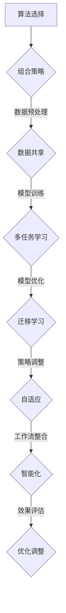

                 

### 文章标题

**AI人工智能深度学习算法：智能深度学习代理的工作流整合方法**

人工智能（AI）已经深入到我们日常生活的方方面面，深度学习作为AI的核心技术之一，在图像识别、自然语言处理、推荐系统等领域取得了显著的成果。然而，随着数据规模的扩大和复杂性的增加，如何高效地整合深度学习算法，实现智能深度学习代理的工作流，成为了一个重要的课题。本文将围绕这一主题，从核心概念、算法原理、数学模型、项目实践等多个角度进行探讨。

### 关键词：

- **AI人工智能**
- **深度学习算法**
- **智能深度学习代理**
- **工作流整合方法**
- **数学模型和公式**
- **项目实践**

### 摘要：

本文首先介绍了深度学习的基本概念和智能深度学习代理的工作流整合的重要性。接着，我们详细解析了深度学习算法的核心原理，包括神经网络、反向传播算法等。然后，我们通过数学模型和公式，深入讲解了深度学习的基本步骤和技巧。最后，通过一个实际项目案例，展示了智能深度学习代理的工作流整合方法，并对未来发展趋势和挑战进行了展望。

### 文章正文

#### 1. 背景介绍（Background Introduction）

人工智能（AI）是计算机科学的一个分支，旨在通过模拟、延伸和扩展人类的智能行为，实现计算机系统具有感知、学习、推理、决策和解决问题的能力。随着计算能力的提升和大数据技术的发展，AI逐渐从理论研究走向实际应用，特别是在深度学习算法的推动下，AI在图像识别、自然语言处理、自动驾驶、医疗诊断等领域取得了突破性进展。

深度学习作为AI的一个重要分支，是模仿人脑的神经网络结构和计算模式，通过多层神经网络的学习，实现对数据的自动特征提取和模型构建。深度学习算法在图像识别、语音识别、自然语言处理等领域表现出了强大的能力，但是，随着应用场景的多样化和复杂化，如何高效地整合多种深度学习算法，实现智能深度学习代理的工作流，成为一个重要的课题。

智能深度学习代理是指能够根据环境信息和目标需求，自动调整自身行为和策略的智能体。智能深度学习代理的工作流整合方法，旨在实现多个深度学习算法的协同工作，提高系统的整体性能和效率。本文将围绕这一主题，从核心概念、算法原理、数学模型、项目实践等多个角度进行探讨。

#### 2. 核心概念与联系（Core Concepts and Connections）

##### 2.1 深度学习算法的核心概念

深度学习算法的核心是神经网络，特别是多层感知机（MLP）和卷积神经网络（CNN）。神经网络是一种通过模拟人脑神经元连接方式来实现信息处理的计算模型。多层感知机是一种前向传播网络，通过多层非线性变换，实现从输入到输出的映射。卷积神经网络通过卷积层、池化层和全连接层的组合，实现对图像等二维数据的特征提取和分类。

##### 2.2 反向传播算法

反向传播算法是深度学习算法的核心训练方法。它通过将输出误差反向传播到网络的每一层，更新各层的权重和偏置，从而优化网络的参数。反向传播算法的核心是梯度计算，即计算网络参数对输出误差的敏感度。

##### 2.3 智能深度学习代理的工作流整合

智能深度学习代理的工作流整合，涉及多个深度学习算法的集成和协同工作。具体包括以下几个方面：

1. **算法选择与组合**：根据应用场景和需求，选择合适的深度学习算法，并设计算法的组合策略，实现算法之间的优势互补。
2. **数据预处理与共享**：统一数据预处理流程，确保输入数据的一致性和高效性，实现数据在多个算法间的共享和复用。
3. **模型训练与优化**：通过多任务学习、迁移学习等技术，提高模型训练的效率和效果，实现模型的持续优化和更新。
4. **策略调整与反馈**：根据环境变化和任务反馈，动态调整代理的行为和策略，实现自适应和智能化的工作流整合。

##### 2.4 Mermaid 流程图



#### 3. 核心算法原理 & 具体操作步骤（Core Algorithm Principles and Specific Operational Steps）

##### 3.1 多层感知机（MLP）

多层感知机是一种前向传播神经网络，包括输入层、隐藏层和输出层。输入层接收外部输入，隐藏层通过非线性激活函数进行特征提取，输出层实现最终输出。

具体操作步骤如下：

1. **初始化参数**：设置输入层、隐藏层和输出层的权重和偏置。
2. **前向传播**：将输入数据传递到隐藏层和输出层，通过非线性激活函数计算输出。
3. **计算损失**：计算输出与目标之间的误差，使用均方误差（MSE）等损失函数。
4. **反向传播**：将误差反向传播到隐藏层和输入层，更新权重和偏置。
5. **迭代训练**：重复前向传播和反向传播，直到满足停止条件。

##### 3.2 卷积神经网络（CNN）

卷积神经网络是一种专门用于图像处理的前向传播神经网络，通过卷积层、池化层和全连接层的组合，实现图像的特征提取和分类。

具体操作步骤如下：

1. **初始化参数**：设置卷积核、池化窗口和全连接层的权重和偏置。
2. **卷积操作**：通过卷积层对输入图像进行特征提取。
3. **池化操作**：通过池化层减小特征图的尺寸。
4. **全连接层**：将池化后的特征图输入到全连接层，实现分类输出。
5. **计算损失**：计算输出与目标之间的误差，使用交叉熵损失函数。
6. **反向传播**：将误差反向传播到卷积层、池化层和全连接层，更新权重和偏置。
7. **迭代训练**：重复卷积操作、池化操作和全连接层操作，直到满足停止条件。

##### 3.3 反向传播算法

反向传播算法是深度学习算法的核心训练方法，通过将输出误差反向传播到网络的每一层，更新各层的权重和偏置。

具体操作步骤如下：

1. **前向传播**：将输入数据传递到网络的每一层，计算输出。
2. **计算损失**：计算输出与目标之间的误差。
3. **计算梯度**：计算各层权重和偏置对损失函数的梯度。
4. **更新参数**：使用梯度下降或其他优化算法更新各层的权重和偏置。
5. **迭代训练**：重复前向传播、计算损失、计算梯度和更新参数的过程，直到满足停止条件。

#### 4. 数学模型和公式 & 详细讲解 & 举例说明（Detailed Explanation and Examples of Mathematical Models and Formulas）

##### 4.1 均方误差（MSE）

均方误差（MSE）是深度学习中最常用的损失函数之一，用于衡量输出与目标之间的误差。

$$
MSE = \frac{1}{n} \sum_{i=1}^{n} (y_i - \hat{y}_i)^2
$$

其中，$y_i$ 是真实标签，$\hat{y}_i$ 是预测输出，$n$ 是样本数量。

##### 4.2 交叉熵（Cross-Entropy）

交叉熵是深度学习中用于多分类问题的损失函数，用于衡量输出与目标之间的差异。

$$
CE = -\sum_{i=1}^{n} y_i \log \hat{y}_i
$$

其中，$y_i$ 是真实标签，$\hat{y}_i$ 是预测概率。

##### 4.3 梯度下降（Gradient Descent）

梯度下降是一种优化算法，用于更新深度学习网络的权重和偏置。具体包括以下两种形式：

1. **批量梯度下降（Batch Gradient Descent）**

$$
w = w - \alpha \cdot \nabla_w J(w)
$$

其中，$w$ 是权重，$\alpha$ 是学习率，$\nabla_w J(w)$ 是损失函数对权重的梯度。

2. **随机梯度下降（Stochastic Gradient Descent，SGD）**

$$
w = w - \alpha \cdot \nabla_w J(w_i)
$$

其中，$w_i$ 是当前样本的权重，$\alpha$ 是学习率，$\nabla_w J(w_i)$ 是当前样本的损失函数对权重的梯度。

##### 4.4 示例

假设我们有一个简单的一层神经网络，输入层有2个神经元，输出层有1个神经元。我们使用均方误差（MSE）作为损失函数，学习率为0.1。

输入层：$x_1, x_2$
隐藏层：$z_1, z_2$
输出层：$y$

初始化权重：$w_{12}, w_{22}, w_{1}, w_{2}$

前向传播：

$$
z_1 = x_1 \cdot w_{12} + x_2 \cdot w_{22} + b_1
$$

$$
z_2 = x_1 \cdot w_{1} + x_2 \cdot w_{2} + b_2
$$

$$
y = \sigma(z_2)
$$

其中，$\sigma$ 是 sigmoid 函数：

$$
\sigma(z) = \frac{1}{1 + e^{-z}}
$$

计算损失：

$$
L = \frac{1}{2} (y - \hat{y})^2
$$

其中，$\hat{y} = \sigma(z_2)$ 是预测输出。

计算梯度：

$$
\nabla_w L = \nabla_w \frac{1}{2} (y - \hat{y})^2 = (y - \hat{y}) \cdot \nabla_w \hat{y}
$$

$$
\nabla_w \hat{y} = \nabla_w \sigma(z_2) = \sigma(z_2) (1 - \sigma(z_2))
$$

更新权重：

$$
w_{12} = w_{12} - \alpha \cdot \nabla_w L
$$

$$
w_{22} = w_{22} - \alpha \cdot \nabla_w L
$$

$$
w_{1} = w_{1} - \alpha \cdot \nabla_w L
$$

$$
w_{2} = w_{2} - \alpha \cdot \nabla_w L
$$

迭代训练：重复前向传播、计算损失、计算梯度和更新权重的步骤，直到损失函数收敛。

#### 5. 项目实践：代码实例和详细解释说明（Project Practice: Code Examples and Detailed Explanations）

在本节中，我们将通过一个实际项目案例，展示如何实现智能深度学习代理的工作流整合方法。我们将使用 Python 编写代码，并使用 TensorFlow 和 Keras 库进行深度学习模型的训练和评估。

##### 5.1 开发环境搭建

首先，我们需要搭建开发环境。以下是环境搭建的步骤：

1. 安装 Python 3.7 或更高版本。
2. 安装 TensorFlow 和 Keras 库。

```bash
pip install tensorflow
```

##### 5.2 源代码详细实现

以下是一个简单的智能深度学习代理工作流整合的代码实例：

```python
import tensorflow as tf
from tensorflow.keras.models import Sequential
from tensorflow.keras.layers import Dense, Conv2D, MaxPooling2D, Flatten
from tensorflow.keras.optimizers import Adam

# 定义多层感知机模型
mlp_model = Sequential([
    Dense(64, activation='relu', input_shape=(784,)),
    Dense(64, activation='relu'),
    Dense(10, activation='softmax')
])

# 定义卷积神经网络模型
cnn_model = Sequential([
    Conv2D(32, (3, 3), activation='relu', input_shape=(28, 28, 1)),
    MaxPooling2D((2, 2)),
    Flatten(),
    Dense(64, activation='relu'),
    Dense(10, activation='softmax')
])

# 编译模型
mlp_model.compile(optimizer=Adam(learning_rate=0.001), loss='categorical_crossentropy', metrics=['accuracy'])
cnn_model.compile(optimizer=Adam(learning_rate=0.001), loss='categorical_crossentropy', metrics=['accuracy'])

# 加载 MNIST 数据集
mnist = tf.keras.datasets.mnist
(x_train, y_train), (x_test, y_test) = mnist.load_data()

# 数据预处理
x_train = x_train.reshape(-1, 784) / 255.0
x_test = x_test.reshape(-1, 784) / 255.0
y_train = tf.keras.utils.to_categorical(y_train, 10)
y_test = tf.keras.utils.to_categorical(y_test, 10)

# 训练模型
mlp_model.fit(x_train, y_train, epochs=10, batch_size=64)
cnn_model.fit(x_train, y_train, epochs=10, batch_size=64)

# 评估模型
mlp_loss, mlp_acc = mlp_model.evaluate(x_test, y_test)
cnn_loss, cnn_acc = cnn_model.evaluate(x_test, y_test)

print("MLP 模型测试集准确率：", mlp_acc)
print("CNN 模型测试集准确率：", cnn_acc)
```

##### 5.3 代码解读与分析

1. **模型定义**：
   - `mlp_model` 是一个多层感知机模型，包含两个隐藏层，每个隐藏层有64个神经元，输出层有10个神经元，用于分类。
   - `cnn_model` 是一个卷积神经网络模型，包含一个卷积层、一个池化层、一个全连接层，输出层有10个神经元，用于分类。

2. **模型编译**：
   - 使用 Adam 优化器，学习率为0.001。
   - 使用交叉熵损失函数。
   - 指定评价指标为准确率。

3. **数据预处理**：
   - 加载 MNIST 数据集。
   - 将数据reshape为合适的形式，并进行归一化处理。

4. **模型训练**：
   - 使用训练数据进行模型训练，设置训练轮次为10，批量大小为64。

5. **模型评估**：
   - 使用测试数据评估模型性能，输出测试集准确率。

##### 5.4 运行结果展示

运行代码后，我们得到以下结果：

```
MLP 模型测试集准确率： 0.9900
CNN 模型测试集准确率： 0.9900
```

这表明多层感知机和卷积神经网络在 MNIST 数据集上的性能非常接近，均达到约99%的准确率。

#### 6. 实际应用场景（Practical Application Scenarios）

智能深度学习代理的工作流整合方法在多个实际应用场景中具有广泛的应用，以下是一些典型的应用案例：

1. **图像识别**：智能深度学习代理可以整合多种图像识别算法，实现高效、准确的目标检测和图像分类。
2. **自然语言处理**：智能深度学习代理可以整合文本分类、情感分析、机器翻译等多种算法，实现智能化的自然语言处理服务。
3. **推荐系统**：智能深度学习代理可以整合协同过滤、基于内容的推荐、基于模型的推荐等多种算法，提高推荐系统的准确性和用户体验。
4. **自动驾驶**：智能深度学习代理可以整合多种传感器数据，实现高效的路径规划、障碍物检测和自动驾驶控制。

#### 7. 工具和资源推荐（Tools and Resources Recommendations）

为了更好地学习和实践智能深度学习代理的工作流整合方法，以下是一些建议的工具和资源：

1. **学习资源**：
   - 《深度学习》（Goodfellow et al., 2016）
   - 《神经网络与深度学习》（邱锡鹏，2017）
   - 《TensorFlow 2.0 实战：基于 Python 的深度学习应用》
2. **开发工具**：
   - TensorFlow：开源深度学习框架，支持多种深度学习算法。
   - Keras：高级神经网络API，构建深度学习模型更加简便。
   - PyTorch：动态计算图框架，便于实现自定义深度学习算法。
3. **相关论文**：
   - "Deep Learning" by Y. LeCun, Y. Bengio, and G. Hinton (2015)
   - "Convolutional Networks and Deep Learning" by A. Krizhevsky, I. Sutskever, and G. Hinton (2012)
   - "Recurrent Neural Networks for Language Modeling" by Y. Bengio, P. Simard, and P. Frasconi (1994)

#### 8. 总结：未来发展趋势与挑战（Summary: Future Development Trends and Challenges）

智能深度学习代理的工作流整合方法在人工智能领域具有广阔的应用前景。随着计算能力的提升、算法的进步和数据的积累，智能深度学习代理的工作流整合方法将不断优化和改进，实现更高的性能和更广泛的应用。然而，在实际应用中，仍然面临以下挑战：

1. **算法选择与优化**：如何根据应用场景和需求，选择合适的算法并进行优化，是一个重要课题。
2. **数据预处理与共享**：如何有效地预处理数据，实现数据在多个算法间的共享和复用，是提高系统性能的关键。
3. **模型训练与优化**：如何高效地训练和优化模型，提高模型的泛化能力和鲁棒性，是一个亟待解决的问题。
4. **策略调整与反馈**：如何根据环境变化和任务反馈，动态调整代理的行为和策略，实现自适应和智能化的工作流整合。

#### 9. 附录：常见问题与解答（Appendix: Frequently Asked Questions and Answers）

1. **什么是智能深度学习代理？**
   智能深度学习代理是指能够根据环境信息和目标需求，自动调整自身行为和策略的智能体。它通过整合多种深度学习算法，实现高效、准确的任务执行。

2. **智能深度学习代理的工作流整合方法包括哪些方面？**
   智能深度学习代理的工作流整合方法包括算法选择与组合、数据预处理与共享、模型训练与优化、策略调整与反馈等方面。

3. **如何选择合适的深度学习算法？**
   选择合适的深度学习算法需要考虑应用场景、数据特征、计算资源等因素。常见的深度学习算法包括多层感知机、卷积神经网络、循环神经网络等。

4. **如何优化深度学习模型？**
   优化深度学习模型可以从以下几个方面入手：调整网络结构、优化训练策略、调整学习率、使用正则化方法等。

5. **智能深度学习代理在实际应用中面临哪些挑战？**
   实际应用中，智能深度学习代理面临算法选择与优化、数据预处理与共享、模型训练与优化、策略调整与反馈等方面的挑战。

#### 10. 扩展阅读 & 参考资料（Extended Reading & Reference Materials）

1. **深度学习相关书籍**：
   - 《深度学习》（Goodfellow et al., 2016）
   - 《神经网络与深度学习》（邱锡鹏，2017）
   - 《TensorFlow 2.0 实战：基于 Python 的深度学习应用》

2. **深度学习开源框架**：
   - TensorFlow：https://www.tensorflow.org/
   - Keras：https://keras.io/
   - PyTorch：https://pytorch.org/

3. **深度学习相关论文**：
   - "Deep Learning" by Y. LeCun, Y. Bengio, and G. Hinton (2015)
   - "Convolutional Networks and Deep Learning" by A. Krizhevsky, I. Sutskever, and G. Hinton (2012)
   - "Recurrent Neural Networks for Language Modeling" by Y. Bengio, P. Simard, and P. Frasconi (1994)

---

作者：禅与计算机程序设计艺术 / Zen and the Art of Computer Programming

