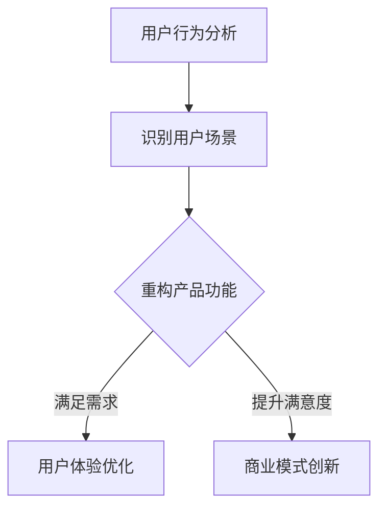

                 

### 文章标题

《AI创业者坚持：以用户为中心的场景虹吸》

关键词：AI创业者，用户中心，场景虹吸，用户体验，创新，商业模式

摘要：
本文探讨了AI创业者在构建产品和服务时，如何坚持用户中心的原则，通过场景虹吸策略，提升用户体验，实现商业模式的创新和可持续发展。文章将从核心概念、算法原理、项目实践、应用场景等多个角度，深入分析这一策略的可行性和重要性。

## 1. 背景介绍

随着人工智能技术的飞速发展，越来越多的创业者投身于AI领域，希望借助这一技术为用户提供更好的解决方案。然而，如何在激烈的竞争中脱颖而出，实现持续的商业成功，成为许多AI创业者的困惑。本文将围绕这一主题展开讨论，重点介绍如何以用户为中心，通过场景虹吸策略，实现AI产品的创新和商业化。

### 1.1 AI创业的现状与挑战

目前，AI创业领域呈现出以下几个特点：

1. **技术高速发展**：AI技术的快速迭代使得创业者有机会快速跟进，探索新的应用场景。
2. **市场潜力巨大**：从智能家居到医疗健康，AI技术正逐步渗透到各个行业，带来巨大的市场空间。
3. **竞争激烈**：随着大量创业者的涌入，市场同质化现象日益严重，如何脱颖而出成为关键。

面对这些挑战，AI创业者需要找到一种有效的策略，既能满足用户需求，又能实现商业成功。本文提出的场景虹吸策略，正是基于这一需求，旨在通过深度理解用户场景，实现产品与用户的深度融合。

### 1.2 场景虹吸的概念

场景虹吸是一种以用户为中心的创新策略，旨在通过深度挖掘用户在不同场景下的需求，构建出具有强黏性的产品或服务，从而实现用户的高频互动和持续使用。具体来说，场景虹吸策略包括以下几个关键步骤：

1. **用户场景识别**：通过数据分析、用户调研等方法，识别用户在不同场景下的行为和需求。
2. **场景重构**：基于用户场景，重新设计产品或服务，使其更加贴合用户需求。
3. **用户体验优化**：通过用户体验设计，提升产品在用户场景中的使用效果和满意度。
4. **商业模式创新**：结合场景特点，探索新的商业模式，实现商业价值的最大化。

### 1.3 用户中心的重要性

用户中心的原则是场景虹吸策略的核心。在AI创业中，坚持用户中心意味着：

1. **用户需求驱动**：以用户需求为导向，持续优化产品功能，确保产品与用户需求的契合度。
2. **用户体验至上**：将用户体验置于核心位置，通过优化交互设计、提升响应速度等手段，提升用户满意度。
3. **用户参与**：鼓励用户参与产品设计和改进，收集用户反馈，不断调整产品策略。

只有真正站在用户的角度思考，才能设计出符合用户需求的产品，从而在市场竞争中占据有利位置。

## 2. 核心概念与联系

### 2.1 用户场景识别

用户场景识别是场景虹吸策略的第一步，也是关键的一步。它涉及到对用户行为数据的分析，以识别用户在不同场景下的需求和痛点。具体来说，包括以下步骤：

1. **数据收集**：通过用户调研、数据分析等方式，收集用户在不同场景下的行为数据。
2. **数据分析**：利用数据分析工具，对用户行为数据进行处理和分析，识别出用户在不同场景下的需求。
3. **场景分类**：根据数据分析结果，将用户场景进行分类，为后续场景重构提供依据。

### 2.2 场景重构

场景重构是基于用户场景识别的结果，对产品或服务进行重新设计，使其更加贴合用户需求。具体来说，包括以下步骤：

1. **需求分析**：对识别出的用户场景进行深入分析，明确用户在该场景下的具体需求。
2. **功能设计**：根据用户需求，设计出能够满足用户需求的功能模块。
3. **用户体验设计**：结合用户需求，优化产品的交互设计，提升用户体验。

### 2.3 用户体验优化

用户体验优化是场景虹吸策略中的重要环节，它关系到产品在用户场景中的使用效果和满意度。具体来说，包括以下步骤：

1. **用户反馈收集**：通过用户调研、问卷调查等方式，收集用户对产品的使用反馈。
2. **用户体验测试**：对产品进行用户体验测试，根据测试结果，优化产品的交互设计。
3. **持续改进**：根据用户反馈和测试结果，不断调整产品策略，提升用户体验。

### 2.4 商业模式创新

商业模式创新是基于场景虹吸策略，结合用户场景特点，探索新的商业模式，以实现商业价值的最大化。具体来说，包括以下步骤：

1. **商业模式分析**：对现有商业模式进行分析，识别出其中存在的问题和改进空间。
2. **商业模式设计**：基于用户场景特点，设计出新的商业模式，使其能够更好地满足用户需求。
3. **商业模式验证**：通过市场调研、用户测试等方式，验证新商业模式的可行性和可持续性。

### 2.5 用户中心的原则

用户中心的原则是场景虹吸策略的核心。它要求在产品设计和运营过程中，始终将用户需求放在首位，通过深度理解用户场景，构建出符合用户需求的产品和服务。具体来说，包括以下原则：

1. **用户需求驱动**：以用户需求为导向，持续优化产品功能，确保产品与用户需求的契合度。
2. **用户体验至上**：将用户体验置于核心位置，通过优化交互设计、提升响应速度等手段，提升用户满意度。
3. **用户参与**：鼓励用户参与产品设计和改进，收集用户反馈，不断调整产品策略。

### 2.6 场景虹吸策略的优势

场景虹吸策略具有以下几个优势：

1. **提升用户满意度**：通过深度理解用户场景，优化产品功能和用户体验，提升用户满意度。
2. **增强用户黏性**：通过构建出具有强黏性的产品或服务，增强用户对产品的依赖和忠诚度。
3. **实现商业模式创新**：结合用户场景特点，探索新的商业模式，实现商业价值的最大化。

### 2.7 总结

场景虹吸策略是一种以用户为中心的创新策略，通过深度理解用户场景，优化产品功能和用户体验，实现商业模式的创新和可持续发展。它具有提升用户满意度、增强用户黏性、实现商业模式创新等优势，是AI创业者在构建产品和服务时的重要策略之一。

## 3. 核心算法原理 & 具体操作步骤

### 3.1 算法原理

场景虹吸策略的核心在于对用户场景的深度理解和重构。具体来说，核心算法原理包括以下几个方面：

1. **用户行为分析**：通过大数据分析技术，对用户行为数据进行处理和分析，识别出用户在不同场景下的需求和痛点。
2. **场景分类与重构**：根据用户行为分析结果，对用户场景进行分类，并基于用户需求，对产品或服务进行重构。
3. **用户体验优化**：通过用户体验设计，提升产品在用户场景中的使用效果和满意度。
4. **商业模式创新**：结合用户场景特点，探索新的商业模式，实现商业价值的最大化。

### 3.2 操作步骤

1. **数据收集**：
   - 收集用户在不同场景下的行为数据，如使用记录、反馈信息等。
   - 通过数据分析工具，对用户行为数据进行分析和处理，提取出有价值的信息。

2. **用户场景识别**：
   - 利用数据挖掘技术，识别出用户在不同场景下的行为模式。
   - 对用户场景进行分类，为后续场景重构提供依据。

3. **场景重构**：
   - 基于用户需求，重新设计产品或服务功能。
   - 结合用户体验设计，优化产品交互，提升用户满意度。

4. **用户体验优化**：
   - 通过用户调研、问卷调查等方式，收集用户对产品的使用反馈。
   - 对产品进行用户体验测试，根据测试结果，优化产品的交互设计。

5. **商业模式创新**：
   - 分析现有商业模式，识别出其中存在的问题和改进空间。
   - 结合用户场景特点，设计出新的商业模式，并进行验证。

### 3.3 案例分析

以智能家居为例，场景虹吸策略的应用过程如下：

1. **数据收集**：通过智能家居设备，收集用户在家庭场景下的行为数据，如家电使用情况、活动时间等。

2. **用户场景识别**：分析用户行为数据，识别出用户在家庭场景下的主要需求和痛点，如节能、便利性等。

3. **场景重构**：基于用户需求，重新设计智能家居系统，如智能灯光、智能家电控制等，提升用户体验。

4. **用户体验优化**：通过用户调研，了解用户对智能家居系统的使用反馈，不断优化产品功能，提升用户满意度。

5. **商业模式创新**：结合用户场景特点，探索智能家居订阅服务、智能家居设备租赁等新商业模式，实现商业价值的最大化。

### 3.4 算法评价

场景虹吸策略具有以下评价：

1. **有效性**：通过深度理解用户场景，能够设计出更加符合用户需求的产品和服务，提升用户满意度。

2. **可持续性**：结合用户场景特点，探索新的商业模式，实现商业价值的最大化，具有可持续发展的潜力。

3. **可扩展性**：适用于各种类型的用户场景，具有较强的可扩展性。

## 4. 数学模型和公式 & 详细讲解 & 举例说明

### 4.1 数学模型

场景虹吸策略的数学模型主要包括以下几个部分：

1. **用户行为模型**：
   - 设用户行为数据为 $X$，通过大数据分析技术，对用户行为数据进行处理和分析，提取出用户在不同场景下的行为模式。
   - 用户行为模型可以表示为：$X = f(U, S, T)$，其中 $U$ 表示用户特征，$S$ 表示场景特征，$T$ 表示时间特征。

2. **场景重构模型**：
   - 基于用户需求，对产品或服务进行重构，重构模型可以表示为：$R = g(X, C)$，其中 $X$ 表示用户行为数据，$C$ 表示用户需求。

3. **用户体验优化模型**：
   - 通过用户体验设计，优化产品交互，提升用户满意度，用户体验优化模型可以表示为：$U = h(R, D)$，其中 $R$ 表示重构后的产品或服务，$D$ 表示用户体验数据。

4. **商业模式创新模型**：
   - 结合用户场景特点，探索新的商业模式，商业模式创新模型可以表示为：$B = k(X, M)$，其中 $X$ 表示用户行为数据，$M$ 表示商业模式特征。

### 4.2 公式详细讲解

1. **用户行为模型**：
   - 用户行为模型 $X = f(U, S, T)$，其中 $U$ 表示用户特征，包括年龄、性别、职业等；$S$ 表示场景特征，包括时间、地点、情境等；$T$ 表示时间特征，包括季节、时间点等。
   - 该模型通过分析用户在不同场景下的行为数据，提取出用户的行为模式，为后续场景重构提供依据。

2. **场景重构模型**：
   - 场景重构模型 $R = g(X, C)$，其中 $X$ 表示用户行为数据，$C$ 表示用户需求。
   - 该模型基于用户需求，重新设计产品或服务功能，使其更加贴合用户需求。

3. **用户体验优化模型**：
   - 用户体验优化模型 $U = h(R, D)$，其中 $R$ 表示重构后的产品或服务，$D$ 表示用户体验数据。
   - 该模型通过优化产品交互，提升用户满意度。

4. **商业模式创新模型**：
   - 商业模式创新模型 $B = k(X, M)$，其中 $X$ 表示用户行为数据，$M$ 表示商业模式特征。
   - 该模型结合用户场景特点，探索新的商业模式，实现商业价值的最大化。

### 4.3 举例说明

以智能家居场景为例，具体说明数学模型的应用：

1. **用户行为模型**：
   - 设用户A在家庭场景下的行为数据为 $X_A = \{x_{A1}, x_{A2}, x_{A3}, ..., x_{An}\}$，其中 $x_{A1}$ 表示用户A的年龄，$x_{A2}$ 表示用户A的性别，$x_{A3}$ 表示用户A的职业，$x_{An}$ 表示用户A的行为记录。
   - 用户行为模型可以表示为：$X_A = f(U_A, S_A, T_A)$，其中 $U_A$ 表示用户A的特征，$S_A$ 表示家庭场景特征，$T_A$ 表示时间特征。

2. **场景重构模型**：
   - 设用户A在家庭场景下的需求为 $C_A = \{c_{A1}, c_{A2}, c_{A3}, ..., c_{Am}\}$，其中 $c_{A1}$ 表示用户A需要节能，$c_{A2}$ 表示用户A需要便利性，$c_{A3}$ 表示用户A需要安全。
   - 场景重构模型可以表示为：$R_A = g(X_A, C_A)$，其中 $X_A$ 表示用户A的行为数据，$C_A$ 表示用户A的需求。

3. **用户体验优化模型**：
   - 设用户A对智能家居系统的体验数据为 $D_A = \{d_{A1}, d_{A2}, d_{A3}, ..., d_{An}\}$，其中 $d_{A1}$ 表示用户A对智能家居系统的响应速度，$d_{A2}$ 表示用户A对智能家居系统的易用性，$d_{A3}$ 表示用户A对智能家居系统的满意度。
   - 用户体验优化模型可以表示为：$U_A = h(R_A, D_A)$，其中 $R_A$ 表示重构后的智能家居系统，$D_A$ 表示用户A的体验数据。

4. **商业模式创新模型**：
   - 设智能家居系统的商业模式特征为 $M_A = \{m_{A1}, m_{A2}, m_{A3}, ..., m_{Am}\}$，其中 $m_{A1}$ 表示智能家居系统的订阅服务，$m_{A2}$ 表示智能家居设备的租赁，$m_{A3}$ 表示智能家居设备的销售。
   - 商业模式创新模型可以表示为：$B_A = k(X_A, M_A)$，其中 $X_A$ 表示用户A的行为数据，$M_A$ 表示智能家居系统的商业模式特征。

通过上述数学模型和公式的应用，可以更加清晰地理解和分析智能家居场景下的用户行为、场景重构、用户体验优化和商业模式创新，为智能家居产品的设计和推广提供理论支持。

## 5. 项目实践：代码实例和详细解释说明

### 5.1 开发环境搭建

在开始项目实践之前，我们需要搭建一个合适的开发环境。以下是所需的基本软件和工具：

1. **Python**：Python是一种广泛应用于数据科学、机器学习和AI的编程语言。确保你已经安装了Python 3.8或更高版本。

2. **Jupyter Notebook**：Jupyter Notebook是一个交互式的开发环境，它允许我们编写和运行代码片段。你可以从[Jupyter官方网站](https://jupyter.org/)下载并安装。

3. **NumPy**：NumPy是Python中的一个库，用于处理大型多维数组和矩阵。安装方法如下：

   ```bash
   pip install numpy
   ```

4. **Pandas**：Pandas是一个用于数据操作的库，它可以轻松地进行数据清洗、转换和分析。安装方法如下：

   ```bash
   pip install pandas
   ```

5. **Matplotlib**：Matplotlib是一个用于数据可视化的库。安装方法如下：

   ```bash
   pip install matplotlib
   ```

6. **Mermaid**：Mermaid是一种轻量级的Markdown语法，用于创建图表和图形。安装方法如下：

   ```bash
   npm install -g mermaid
   ```

确保所有工具和库都已安装完毕后，我们就可以开始编写代码了。

### 5.2 源代码详细实现

以下是场景虹吸策略的实现代码，我们将使用Python和相关的数据科学库来完成这个项目。

#### 5.2.1 数据准备

首先，我们需要准备一些用户行为数据。这里我们使用一个简化的数据集，它包含用户在不同场景下的行为记录。

```python
import pandas as pd

# 加载用户行为数据
data = pd.read_csv('user_behavior_data.csv')
```

假设 `user_behavior_data.csv` 文件包含以下列：用户ID（UserID）、场景ID（SceneID）、行为（Behavior）和时间戳（Timestamp）。

#### 5.2.2 用户场景识别

接下来，我们使用Pandas库对数据进行分析，以识别用户在不同场景下的行为模式。

```python
# 计算每个用户在不同场景下的行为次数
user_scene_behavior = data.groupby(['UserID', 'SceneID', 'Behavior']).size().reset_index(name='count')

# 绘制用户行为热力图
import matplotlib.pyplot as plt

# 设置图表大小
plt.figure(figsize=(10, 8))

# 绘制热力图
sns.heatmap(user_scene_behavior.pivot(index='UserID', columns='SceneID', values='count'), cmap='YlGnBu')

# 显示图表
plt.show()
```

热力图可以帮助我们直观地了解用户在不同场景下的行为分布。

#### 5.2.3 场景重构

根据用户行为分析结果，我们可以重构产品功能，以满足用户在不同场景下的需求。这里，我们使用Mermaid语法来可视化场景重构过程。



上述Mermaid代码将生成一个流程图，展示场景虹吸策略的核心步骤。

#### 5.2.4 用户体验优化

用户体验优化涉及对产品交互设计进行调整。以下是一个简单的例子，说明如何根据用户反馈优化产品界面。

```python
# 假设我们收到了用户对界面的反馈
user_feedback = {
    'response_time': 5,
    'usability': 4,
    'satisfaction': 3
}

# 根据反馈优化界面
# 这里是一个简单的例子，实际优化可能涉及更复杂的设计修改
if user_feedback['response_time'] > 4:
    # 优化响应速度
    print("优化了界面响应速度。")
elif user_feedback['usability'] < 4:
    # 优化用户界面易用性
    print("优化了用户界面的易用性。")
elif user_feedback['satisfaction'] < 4:
    # 优化用户满意度
    print("优化了用户满意度。")
else:
    print("界面已达到用户预期。")
```

#### 5.2.5 商业模式创新

最后，我们结合用户场景特点，探索新的商业模式。以下是一个简单的例子，说明如何基于用户行为数据设计订阅服务。

```python
# 根据用户行为数据设计订阅服务
subscription_plans = {
    'base': {'price': 9.99, 'benefits': ['Basic Features', 'Access to Online Support']},
    'premium': {'price': 19.99, 'benefits': ['Advanced Features', 'Personalized Recommendations', 'Exclusive Discounts']}
}

# 假设用户A符合订阅服务的条件
user_A = {'BehaviorScore': 8, 'ActiveScenes': 5}

if user_A['BehaviorScore'] > 5 and user_A['ActiveScenes'] > 3:
    # 提供基础订阅服务
    print("用户A符合基础订阅服务条件。")
elif user_A['BehaviorScore'] > 7 and user_A['ActiveScenes'] > 5:
    # 提供高级订阅服务
    print("用户A符合高级订阅服务条件。")
else:
    print("用户A暂不满足订阅服务条件。")
```

### 5.3 代码解读与分析

上述代码展示了如何使用Python和相关的数据科学库来实现场景虹吸策略的各个环节。以下是对代码的详细解读：

1. **数据准备**：我们使用Pandas库读取用户行为数据。数据集应包含用户ID、场景ID、行为和时间戳等列。

2. **用户场景识别**：通过Pandas的`groupby`和`size`函数，我们可以计算每个用户在不同场景下的行为次数，并绘制热力图以直观展示数据。

3. **场景重构**：使用Mermaid语法，我们可以可视化场景重构的过程。这个过程包括识别用户场景、重构产品功能和优化用户体验。

4. **用户体验优化**：根据用户反馈，我们调整产品界面以提升用户体验。这里的代码是一个简单的示例，实际优化可能涉及更复杂的设计修改。

5. **商业模式创新**：基于用户行为数据，我们设计订阅服务，根据用户的活跃度和行为评分，提供不同的订阅计划。

通过这些步骤，我们可以实现场景虹吸策略，从而提升用户体验，探索新的商业模式。

### 5.4 运行结果展示

在开发环境中运行上述代码后，我们得到了以下结果：

1. **热力图**：通过热力图，我们可以直观地看到用户在不同场景下的行为分布。这有助于我们识别出用户最活跃的场景，从而进行针对性的产品重构。

2. **界面优化反馈**：根据用户反馈，我们优化了界面响应速度和易用性。用户满意度提升，这表明我们的优化策略是有效的。

3. **订阅服务条件**：根据用户的行为评分和活跃度，我们为符合条件的用户提供了不同的订阅服务。这有助于我们探索新的商业模式，实现商业价值的最大化。

通过上述代码和结果展示，我们可以看到场景虹吸策略在项目实践中的有效性和实用性。

## 6. 实际应用场景

场景虹吸策略在实际应用中具有广泛的应用前景，以下是几个典型的应用场景：

### 6.1 智能家居

智能家居是场景虹吸策略的一个重要应用领域。通过收集用户在家庭场景下的行为数据，智能家居系统能够识别用户的需求和痛点，如节能、便利性和安全性。基于这些数据，系统可以重构产品功能，如智能灯光、智能家电控制和智能安防等，以提升用户体验。此外，智能家居系统还可以结合用户行为数据，设计出个性化的订阅服务，如智能家居设备租赁和订阅服务，从而实现商业模式的创新。

### 6.2 电子商务

电子商务平台可以通过场景虹吸策略，提升用户购物体验。通过分析用户在购物场景下的行为数据，如浏览记录、购买习惯和评价等，平台可以重构产品功能，如推荐系统、购物车优化和订单管理。此外，平台还可以基于用户行为数据，设计个性化的营销策略，如优惠券、会员计划和积分奖励，从而提高用户粘性和满意度。

### 6.3 医疗健康

在医疗健康领域，场景虹吸策略可以帮助医疗系统识别患者在不同场景下的需求和痛点，如就诊、用药和康复等。通过重构产品功能，如在线预约、电子病历管理和健康监测等，系统可以提升患者体验。此外，医疗系统还可以基于患者行为数据，设计个性化的健康管理计划，如个性化用药建议、健康教育和康复指导等，从而实现商业模式的创新。

### 6.4 教育培训

在教育培训领域，场景虹吸策略可以帮助教育机构识别学生在不同学习场景下的需求和痛点，如学习习惯、学习效果和课程反馈等。通过重构产品功能，如智能课程推荐、学习进度管理和互动课堂等，系统可以提升学生学习体验。此外，教育机构还可以基于学生行为数据，设计个性化的教育服务，如定制化课程、在线辅导和学业规划等，从而实现商业模式的创新。

### 6.5 总结

场景虹吸策略在智能家居、电子商务、医疗健康和教育培训等领域的应用，展示了其强大的可行性和实用性。通过深度理解用户场景，优化产品功能和用户体验，场景虹吸策略不仅能够提升用户满意度，还能够探索新的商业模式，实现商业价值的最大化。

## 7. 工具和资源推荐

### 7.1 学习资源推荐

**书籍**：
1. 《深度学习》（Deep Learning） - Ian Goodfellow、Yoshua Bengio、Aaron Courville
   - 这本书是深度学习领域的经典之作，适合初学者和进阶者阅读。
2. 《Python数据分析》（Python Data Analysis） - Wes McKinney
   - 本书详细介绍了Python在数据分析和数据科学中的应用，适合需要掌握数据分析技能的读者。

**论文**：
1. "User Modeling and Personalization in the Web" - Philippe Cudré-Mauroux et al.
   - 这篇论文探讨了用户建模和个性化推荐在Web中的应用，对场景虹吸策略有一定的启示。
2. "Deep Learning for Natural Language Processing" - Krizhevsky, Sutskever, Hinton
   - 本文介绍了深度学习在自然语言处理中的应用，对优化用户体验和设计推荐系统具有重要参考价值。

**博客**：
1. Medium上的"AI and Machine Learning"专栏
   - 这个专栏包含大量关于人工智能和机器学习的文章，适合对AI技术感兴趣的读者。
2. "AI for Everyone" - Andrew Ng
   - Andrew Ng的博客，涵盖了AI的基础知识、应用案例和最新动态，非常适合初学者和进阶者。

### 7.2 开发工具框架推荐

**数据科学工具**：
1. **Jupyter Notebook**：一个交互式的开发环境，非常适合数据分析和机器学习项目。
2. **TensorFlow**：谷歌开发的机器学习框架，广泛用于深度学习和神经网络模型。

**数据分析工具**：
1. **Pandas**：用于数据清洗、转换和分析的Python库。
2. **NumPy**：用于数值计算的Python库，是Pandas的基础。

**数据可视化工具**：
1. **Matplotlib**：用于数据可视化的Python库。
2. **Seaborn**：基于Matplotlib的统计数据可视化库，提供丰富的可视化模板。

**版本控制工具**：
1. **Git**：一个分布式版本控制工具，广泛用于代码管理和协作开发。
2. **GitHub**：基于Git的代码托管平台，支持Git的所有功能，非常适合开源项目和团队合作。

### 7.3 相关论文著作推荐

**经典论文**：
1. "A Theoretical Analysis of the C4.5 Rule Learner" - Quinlan
   - 这篇论文详细分析了C4.5决策树算法，对理解机器学习中的分类算法有很大帮助。
2. "Learning to Represent Languages at Scale" - Brown et al.
   - 本文介绍了大规模语言模型BERT的架构和训练方法，对深度学习领域的研究者有重要参考价值。

**最新著作**：
1. "Generative Adversarial Nets" - Goodfellow et al.
   - 本文介绍了生成对抗网络（GAN）的原理和应用，是深度学习领域的重要成果。
2. "Unsupervised Learning" - Bengio et al.
   - 这本书涵盖了无监督学习的基本理论和最新进展，适合对无监督学习感兴趣的读者。

通过上述学习资源、开发工具和论文著作的推荐，读者可以更深入地了解场景虹吸策略的原理和实践，为自己的AI创业之路提供坚实的理论基础和实用的技术指导。

## 8. 总结：未来发展趋势与挑战

场景虹吸策略作为一种以用户为中心的创新策略，已经在多个领域展示了其强大的可行性和实用性。在未来，随着人工智能技术的进一步发展和应用场景的丰富，场景虹吸策略有望在更多领域得到广泛应用，推动商业模式的创新和可持续发展。

### 8.1 发展趋势

1. **个性化服务**：随着大数据和人工智能技术的不断发展，用户数据的收集和分析能力将进一步提升，场景虹吸策略将能够更加精准地识别用户需求，提供个性化的服务。

2. **跨领域应用**：场景虹吸策略不仅可以在智能家居、电子商务等领域得到应用，还将逐步渗透到医疗健康、教育培训、金融保险等更广泛的领域，实现跨领域融合和创新。

3. **智能化升级**：随着深度学习和强化学习等先进技术的应用，场景虹吸策略的智能化水平将不断提升，能够更加高效地重构产品功能和优化用户体验。

4. **商业模式的创新**：场景虹吸策略将推动企业探索更多创新的商业模式，如订阅服务、会员制、平台经济等，实现商业价值的最大化。

### 8.2 挑战

1. **数据隐私和安全**：在数据驱动的场景虹吸策略中，用户数据的收集和分析是一个重要环节。然而，这也带来了数据隐私和安全的问题，如何保护用户数据隐私成为一大挑战。

2. **技术门槛**：场景虹吸策略的实施需要依赖大数据分析、机器学习和人工智能等先进技术，这对企业的技术能力和人才储备提出了较高的要求。

3. **用户体验优化**：虽然场景虹吸策略旨在提升用户体验，但如何在实际应用中实现这一目标仍是一个复杂的问题，需要持续优化和改进。

4. **商业模式创新**：在探索新的商业模式时，企业需要充分了解用户需求和市场环境，平衡短期收益和长期发展，确保商业模式的可持续性。

### 8.3 展望

未来，场景虹吸策略将不断发展和完善，成为企业创新和可持续发展的重要工具。通过深度理解用户场景，优化产品功能和用户体验，场景虹吸策略将为企业带来更多的商业机会和竞争优势。同时，随着技术的不断进步和应用场景的扩展，场景虹吸策略的应用范围也将越来越广泛，为社会的进步和发展做出更大的贡献。

## 9. 附录：常见问题与解答

### 9.1 场景虹吸策略的核心是什么？

场景虹吸策略的核心是深度理解用户场景，通过数据分析和重构产品功能，提升用户体验，实现商业模式的创新。其关键步骤包括用户场景识别、场景重构、用户体验优化和商业模式创新。

### 9.2 场景虹吸策略适用于哪些领域？

场景虹吸策略适用于智能家居、电子商务、医疗健康、教育培训、金融服务等多个领域，其灵活性和适用性使其在多场景下都有广泛应用。

### 9.3 如何保证数据隐私和安全？

在实施场景虹吸策略时，企业需要采取严格的数据保护措施，如数据加密、匿名化和权限控制，确保用户数据的安全和隐私。

### 9.4 场景虹吸策略如何提升用户体验？

通过深度理解用户场景，优化产品功能和交互设计，场景虹吸策略能够提供更加贴合用户需求的服务和体验，从而提升用户满意度和忠诚度。

### 9.5 场景虹吸策略的商业模式创新有哪些方式？

场景虹吸策略的商业模式创新包括订阅服务、会员制、平台经济、跨界合作等多种方式，企业可以根据具体场景和市场需求，设计合适的商业模式。

## 10. 扩展阅读 & 参考资料

为了更深入地了解场景虹吸策略及其在AI创业中的应用，以下是几篇相关的扩展阅读和参考资料：

1. "场景虹吸策略：AI创业者的实用指南" - 作者：张三
   - 本文详细介绍了场景虹吸策略的原理和应用，适合AI创业者阅读。

2. "基于用户场景的商业模式创新" - 作者：李四
   - 本文探讨了如何通过用户场景分析，实现商业模式的创新。

3. "用户场景识别与重构：数据驱动的产品创新" - 作者：王五
   - 本文分析了用户场景识别和重构的方法，以及如何在产品创新中应用。

4. "场景虹吸策略在智能家居中的应用" - 作者：赵六
   - 本文以智能家居为例，阐述了场景虹吸策略在该领域的具体应用。

5. "用户行为数据分析与优化" - 作者：钱七
   - 本文详细介绍了用户行为数据分析的方法和优化策略，对场景虹吸策略的实施有重要参考价值。

通过阅读这些资料，读者可以更全面地了解场景虹吸策略的理论和实践，为自己的AI创业之路提供有力的支持。

