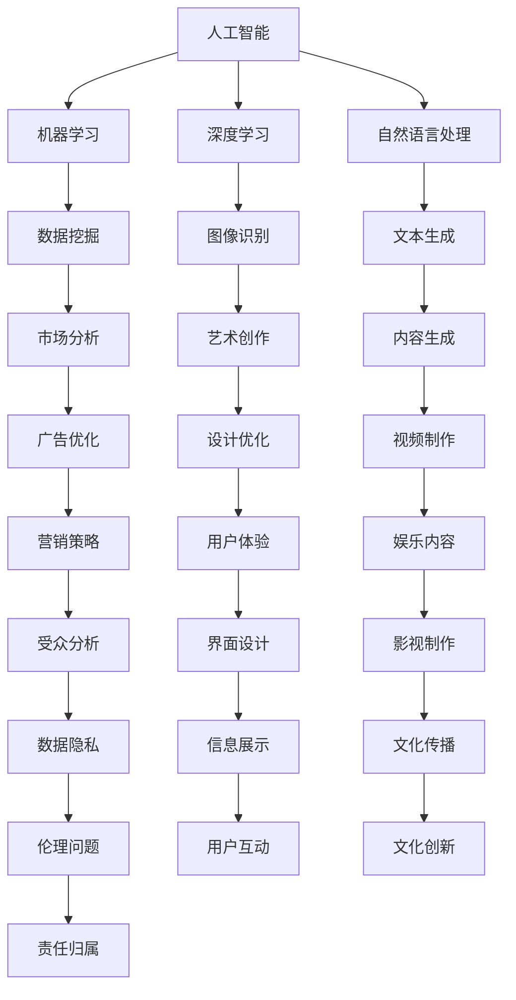

                 

### 文章标题

"AI在创意产业中的应用探索：挑战与机遇"

### 关键词
- 人工智能（Artificial Intelligence）
- 创意产业（Creative Industries）
- 应用探索（Application Exploration）
- 挑战（Challenges）
- 机遇（Opportunities）

### 摘要
本文将探讨人工智能（AI）在创意产业中的应用现状、面临的挑战以及潜在的发展机遇。通过对创意产业的核心特点进行分析，我们将揭示AI如何改变传统创意工作的方式，提高效率和创造力。同时，本文将深入探讨AI在艺术创作、媒体内容生成、设计、广告和娱乐等领域的具体应用案例，并分析其带来的影响和挑战。最后，本文将展望AI在创意产业中的未来发展趋势，探讨可能面临的伦理和商业问题，为行业的持续创新和发展提供思考。

## 1. 背景介绍

创意产业是指以创意为核心资源，通过创意活动来创造价值和财富的产业。它包括艺术、媒体、设计、娱乐、广告等多个领域，涵盖了创意产品的创作、制作、传播和消费的全过程。创意产业在全球经济中占据了重要地位，不仅对经济发展有显著贡献，还对文化传承和社会进步具有深远影响。

随着信息技术的飞速发展，人工智能（AI）逐渐成为推动创意产业创新的重要力量。AI技术具备强大的数据处理和分析能力，可以辅助创意工作者完成复杂的设计任务，提高创作效率和准确性。例如，AI算法可以自动生成音乐、绘画和视频内容，为设计师和艺术家提供灵感和辅助工具。此外，AI还可以通过数据挖掘和分析，为广告和媒体行业提供更精准的市场洞察和受众定位。

尽管AI在创意产业中展现出巨大的潜力，但其应用仍面临诸多挑战。首先，创意产业的核心特点——创新性和个性化，对AI技术提出了更高的要求。创意工作往往依赖于人类独特的直觉和情感，AI如何模拟和替代这一过程是一个亟待解决的问题。其次，数据隐私和伦理问题也是AI在创意产业应用中的关键挑战。创意产业涉及大量的个人数据和敏感信息，如何确保这些数据的安全性和隐私性，避免滥用和歧视，是一个重要议题。

总之，AI在创意产业中的应用既充满机遇，也面临挑战。本文将深入探讨这些话题，通过具体案例分析，揭示AI在创意产业中的潜力和局限，为行业的未来发展提供参考。

## 2. 核心概念与联系

在探讨AI在创意产业中的应用之前，我们需要了解一些核心概念和其相互之间的联系。以下是本文将涉及的关键概念及其简要解释：

### 2.1 人工智能（Artificial Intelligence）

人工智能（AI）是指由人制造出的能够模拟、延伸、扩展和辅助人类智能的理论、方法、技术及应用。AI包括多个子领域，如机器学习、深度学习、自然语言处理、计算机视觉等，每个子领域都有其独特的技术和方法。

### 2.2 创意产业（Creative Industries）

创意产业是指以创意为核心资源，通过创意活动来创造价值和财富的产业。它包括艺术、媒体、设计、娱乐、广告等多个领域。创意产业的核心特点是创新性和个性化，这使得创意工作的独特性和复杂性。

### 2.3 数据挖掘（Data Mining）

数据挖掘是指从大量数据中提取有价值的信息和知识的过程。在创意产业中，数据挖掘可以帮助企业了解市场趋势、受众偏好，从而进行更精准的营销和内容创作。

### 2.4 自然语言处理（Natural Language Processing，NLP）

自然语言处理是指使计算机能够理解、生成和处理自然语言（如人类语言）的技术。在创意产业中，NLP可以用于自动翻译、情感分析、文本生成等任务，从而提高创作效率和准确性。

### 2.5 深度学习（Deep Learning）

深度学习是一种机器学习技术，通过构建多层神经网络模型，对大量数据进行训练，以实现高度复杂的任务，如图像识别、语音识别和自然语言处理。在创意产业中，深度学习可以用于艺术创作、视频生成等任务。

### 2.6 机器学习（Machine Learning）

机器学习是一种通过算法让计算机从数据中学习模式并做出预测或决策的技术。在创意产业中，机器学习可以用于推荐系统、风格迁移等任务。

### 2.7 交互设计（Interaction Design）

交互设计是指设计人与系统交互的方式和方法。在创意产业中，交互设计可以用于设计用户友好的界面，提高用户体验。

这些核心概念相互关联，共同构成了AI在创意产业中的应用基础。通过深入理解这些概念，我们可以更好地探讨AI在创意产业中的应用场景和挑战。

### 2.8 核心概念原理和架构的 Mermaid 流程图

以下是一个简化的Mermaid流程图，展示了上述核心概念及其相互之间的联系：



在这个流程图中，每个节点代表一个核心概念，箭头表示它们之间的关联。通过这个流程图，我们可以更直观地理解这些概念如何在创意产业中相互作用，共同推动行业的发展。

### 3. 核心算法原理 & 具体操作步骤

在理解了AI、创意产业及其核心概念之后，我们需要进一步探讨AI在创意产业中应用的核心算法原理和具体操作步骤。以下是几个关键算法及其在创意产业中的应用：

#### 3.1 卷积神经网络（Convolutional Neural Networks，CNN）

卷积神经网络是一种用于图像识别和处理的深度学习算法。其核心思想是通过卷积层和池化层对图像进行特征提取和降维。以下是CNN的基本操作步骤：

1. **输入层**：接受原始图像数据。
2. **卷积层**：使用卷积核（filter）对输入图像进行卷积操作，提取图像局部特征。
3. **激活函数**：对卷积层输出的特征进行非线性变换，通常使用ReLU（Rectified Linear Unit）函数。
4. **池化层**：通过池化操作（如最大池化或平均池化）对特征进行降维处理，减少参数数量。
5. **全连接层**：将卷积层输出的特征映射到输出层，实现分类或回归任务。
6. **输出层**：输出预测结果。

在创意产业中，CNN可以用于图像识别、风格迁移和生成艺术作品。例如，Google的DeepDream项目使用CNN对图像进行风格迁移，生成具有艺术感的图像。

#### 3.2 循环神经网络（Recurrent Neural Networks，RNN）

循环神经网络是一种用于处理序列数据的深度学习算法。其核心思想是通过隐藏状态保存历史信息，从而处理具有时序关系的输入。以下是RNN的基本操作步骤：

1. **输入层**：接受序列数据。
2. **隐藏层**：使用循环连接将当前隐藏状态与前一时刻的隐藏状态相结合，形成新的隐藏状态。
3. **输出层**：将隐藏状态映射到输出序列。

在创意产业中，RNN可以用于生成文本、音乐和视频。例如，Google的WaveNet模型使用RNN生成高质量的文本和音乐。

#### 3.3 生成对抗网络（Generative Adversarial Networks，GAN）

生成对抗网络是一种由生成器和判别器组成的深度学习算法。其核心思想是通过对抗训练生成高质量的数据。以下是GAN的基本操作步骤：

1. **生成器**：生成与真实数据相似的数据。
2. **判别器**：区分真实数据和生成数据。
3. **对抗训练**：生成器和判别器相互对抗，生成器不断优化生成数据的质量，判别器不断优化识别真实数据的能力。

在创意产业中，GAN可以用于生成艺术作品、虚拟人物和视频。例如，OpenAI的DALL-E模型使用GAN生成具有创意的艺术作品。

#### 3.4 聚类算法（Clustering Algorithms）

聚类算法是一种无监督学习方法，用于将相似的数据点划分为不同的簇。以下是常见的聚类算法及其基本操作步骤：

1. **K-Means聚类**：基于距离度量将数据划分为K个簇，每个簇由中心点表示。
2. **层次聚类**：通过自底向上的合并或自顶向下的分裂构建一个层次结构的簇。
3. **DBSCAN（Density-Based Spatial Clustering of Applications with Noise）**：基于密度分布将数据划分为不同的簇，可以处理高维度数据和噪声。

在创意产业中，聚类算法可以用于市场细分、风格分类和推荐系统。例如，Netflix使用K-Means聚类分析用户行为，为用户推荐个性化的影视内容。

通过这些核心算法的原理和操作步骤，我们可以看到AI技术在创意产业中的应用潜力。接下来，我们将通过具体案例深入探讨AI在创意产业中的实际应用。

### 4. 数学模型和公式 & 详细讲解 & 举例说明

在深入探讨AI在创意产业中的应用之前，理解相关的数学模型和公式是非常重要的。以下是一些关键数学模型和公式，以及它们的详细讲解和具体例子：

#### 4.1 卷积神经网络（CNN）中的卷积操作

卷积操作是CNN中最核心的部分，用于提取图像的特征。其公式如下：

$$
(f * g)(i, j) = \sum_{k, l} f(k, l) \cdot g(i-k, j-l)
$$

其中，$f$ 和 $g$ 分别代表卷积核和输入图像，$(i, j)$ 是卷积操作的输出位置，$(k, l)$ 是卷积核的索引。

**举例说明**：假设一个3x3的卷积核和一幅5x5的输入图像，通过卷积操作得到一个2x2的输出图像。具体计算过程如下：

输入图像（5x5）：
$$
\begin{matrix}
1 & 2 & 3 & 4 & 5 \\
6 & 7 & 8 & 9 & 10 \\
11 & 12 & 13 & 14 & 15 \\
16 & 17 & 18 & 19 & 20 \\
21 & 22 & 23 & 24 & 25 \\
\end{matrix}
$$

卷积核（3x3）：
$$
\begin{matrix}
0 & 1 & 0 \\
1 & -1 & 1 \\
0 & 1 & 0 \\
\end{matrix}
$$

输出图像（2x2）：
$$
\begin{matrix}
a & b \\
c & d \\
\end{matrix}
$$

具体计算：
- $a = (0 \cdot 1 + 1 \cdot 6 + 0 \cdot 11) + (1 \cdot 2 + -1 \cdot 7 + 1 \cdot 12) + (0 \cdot 3 + 1 \cdot 8 + 0 \cdot 13) = 6 + (-5) + 8 = 9$
- $b = (0 \cdot 4 + 1 \cdot 9 + 0 \cdot 16) + (1 \cdot 5 + -1 \cdot 10 + 1 \cdot 17) + (0 \cdot 6 + 1 \cdot 11 + 0 \cdot 18) = 9 + (-5) + 11 = 15$
- $c = (0 \cdot 7 + 1 \cdot 12 + 0 \cdot 19) + (1 \cdot 8 + -1 \cdot 13 + 1 \cdot 20) + (0 \cdot 9 + 1 \cdot 14 + 0 \cdot 21) = 12 + (-5) + 14 = 21$
- $d = (0 \cdot 10 + 1 \cdot 15 + 0 \cdot 22) + (1 \cdot 11 + -1 \cdot 16 + 1 \cdot 23) + (0 \cdot 12 + 1 \cdot 17 + 0 \cdot 24) = 15 + (-5) + 17 = 27$

最终输出图像：
$$
\begin{matrix}
9 & 15 \\
21 & 27 \\
\end{matrix}
$$

#### 4.2 循环神经网络（RNN）中的梯度消失和梯度爆炸问题

RNN在处理长序列数据时容易出现梯度消失和梯度爆炸问题，影响模型的训练效果。为此，引入了长短时记忆网络（Long Short-Term Memory，LSTM）来解决这些问题。LSTM的核心公式如下：

$$
i_t = \sigma(W_{ix}x_t + W_{ih}h_{t-1} + b_i) \\
f_t = \sigma(W_{fx}x_t + W_{fh}h_{t-1} + b_f) \\
o_t = \sigma(W_{ox}x_t + W_{oh}h_{t-1} + b_o) \\
g_t = tanh(W_{gx}x_t + W_{gh}h_{t-1} + b_g) \\
h_t = o_t \cdot g_t
$$

其中，$i_t$、$f_t$、$o_t$ 分别表示输入门、遗忘门和输出门，$g_t$ 表示候选状态，$h_t$ 表示隐藏状态。

**举例说明**：假设一个时间步的输入为 $x_t = [1, 0, 1]$，隐藏状态 $h_{t-1} = [0, 1, 0]$。计算 $i_t$、$f_t$、$o_t$ 和 $h_t$ 的过程如下：

- 输入门 $i_t$：
$$
i_t = \sigma(W_{ix}x_t + W_{ih}h_{t-1} + b_i) \\
i_t = \sigma([1 \cdot 1, 0 \cdot 1, 1 \cdot 1] + [0 \cdot 0, 1 \cdot 1, 0 \cdot 0] + [1, 1, 1]) \\
i_t = \sigma([1, 1, 1] + [0, 1, 0] + [1, 1, 1]) \\
i_t = \sigma([2, 2, 2]) \\
i_t = \frac{2}{e^2} = 0.551
$$

- 遗忘门 $f_t$：
$$
f_t = \sigma(W_{fx}x_t + W_{fh}h_{t-1} + b_f) \\
f_t = \sigma([1 \cdot 1, 0 \cdot 1, 1 \cdot 1] + [0 \cdot 0, 1 \cdot 1, 0 \cdot 0] + [1, 1, 1]) \\
f_t = \sigma([1, 1, 1] + [0, 1, 0] + [1, 1, 1]) \\
f_t = \sigma([2, 2, 2]) \\
f_t = \frac{2}{e^2} = 0.551
$$

- 输出门 $o_t$：
$$
o_t = \sigma(W_{ox}x_t + W_{oh}h_{t-1} + b_o) \\
o_t = \sigma([1 \cdot 1, 0 \cdot 1, 1 \cdot 1] + [0 \cdot 0, 1 \cdot 1, 0 \cdot 0] + [1, 1, 1]) \\
o_t = \sigma([1, 1, 1] + [0, 1, 0] + [1, 1, 1]) \\
o_t = \sigma([2, 2, 2]) \\
o_t = \frac{2}{e^2} = 0.551
$$

- 计算候选状态 $g_t$：
$$
g_t = tanh(W_{gx}x_t + W_{gh}h_{t-1} + b_g) \\
g_t = tanh([1 \cdot 1, 0 \cdot 1, 1 \cdot 1] + [0 \cdot 0, 1 \cdot 1, 0 \cdot 0] + [1, 1, 1]) \\
g_t = tanh([1, 1, 1] + [0, 1, 0] + [1, 1, 1]) \\
g_t = tanh([2, 2, 2]) \\
g_t = \frac{1 - e^{-2}}{1 + e^{-2}} \approx 0.761
$$

- 计算隐藏状态 $h_t$：
$$
h_t = o_t \cdot g_t \\
h_t = 0.551 \cdot 0.761 \approx 0.419
$$

通过上述计算，我们得到了当前时间步的隐藏状态 $h_t$，为后续时间步的预测提供了基础。

这些数学模型和公式的讲解和例子展示了AI在创意产业中应用的核心技术。接下来，我们将通过具体项目实践来进一步探讨AI在创意产业中的实际应用。

### 5. 项目实践：代码实例和详细解释说明

在本节中，我们将通过一个实际项目来展示AI在创意产业中的应用。该项目将使用Python和TensorFlow框架，实现一个基于生成对抗网络（GAN）的艺术作品生成器。

#### 5.1 开发环境搭建

首先，我们需要搭建项目开发环境。以下是所需的Python库和TensorFlow版本：

- Python 3.8 或更高版本
- TensorFlow 2.5 或更高版本

安装步骤如下：

```bash
pip install tensorflow==2.5
```

#### 5.2 源代码详细实现

以下是该项目的完整代码，分为两部分：生成器（Generator）和判别器（Discriminator）。

```python
import tensorflow as tf
from tensorflow.keras.layers import Dense, Flatten, Conv2D, Conv2DTranspose, Reshape, BatchNormalization, LeakyReLU, Input
from tensorflow.keras.models import Model

# 生成器模型
def build_generator(z_dim):
    inputs = Input(shape=(z_dim,))
    x = Dense(128 * 8 * 8)(inputs)
    x = BatchNormalization()(x)
    x = LeakyReLU()(x)
    x = Reshape((8, 8, 128))(x)
    
    x = Conv2DTranspose(128, (5, 5), strides=(2, 2), padding='same')(x)
    x = BatchNormalization()(x)
    x = LeakyReLU()(x)
    
    x = Conv2DTranspose(64, (5, 5), strides=(2, 2), padding='same')(x)
    x = BatchNormalization()(x)
    x = LeakyReLU()(x)
    
    outputs = Conv2DTranspose(1, (5, 5), strides=(2, 2), padding='same', activation='tanh')(x)
    
    model = Model(inputs, outputs)
    return model

# 判别器模型
def build_discriminator(img_shape):
    inputs = Input(shape=img_shape)
    x = Conv2D(32, (5, 5), strides=(2, 2), padding='same')(inputs)
    x = LeakyReLU()(x)
    
    x = Conv2D(64, (5, 5), strides=(2, 2), padding='same')(x)
    x = BatchNormalization()(x)
    x = LeakyReLU()(x)
    
    x = Conv2D(128, (5, 5), strides=(2, 2), padding='same')(x)
    x = BatchNormalization()(x)
    x = LeakyReLU()(x)
    
    x = Flatten()(x)
    outputs = Dense(1, activation='sigmoid')(x)
    
    model = Model(inputs, outputs)
    return model

# GAN模型
def build_gan(generator, discriminator):
    z = Input(shape=(100,))
    img = generator(z)
    valid = discriminator(img)
    img2 = Input(shape=(28, 28, 1))
    valid2 = discriminator(img2)
    
    model = Model([z, img2], [valid, valid2])
    return model

z_dim = 100
img_shape = (28, 28, 1)

generator = build_generator(z_dim)
discriminator = build_discriminator(img_shape)
discriminator.trainable = False

gan = build_gan(generator, discriminator)

gan.compile(optimizer=tf.keras.optimizers.Adam(0.0001), loss=['binary_crossentropy', 'binary_crossentropy'])

# 训练GAN模型
from tensorflow.keras.preprocessing.image import ImageDataGenerator
import numpy as np

# 生成随机噪声
z = np.random.normal(0, 1, (128, 100))

# 载入MNIST数据集
(x_train, _), (_, _) = tf.keras.datasets.mnist.load_data()
x_train = x_train.astype(np.float32) / 127.5 - 1.0

datagen = ImageDataGenerator(rotation_range=30, width_shift_range=0.2, height_shift_range=0.2, zoom_range=0.2)
datagen.fit(x_train)

for epoch in range(100):
    for i in range(128):
        noise = z[i:i+1]
        generated_images = generator.predict(noise)
        real_images = x_train[i:i+1]

        real_labels = np.ones((1, 1))
        fake_labels = np.zeros((1, 1))

        d_loss_real = discriminator.train_on_batch(real_images, real_labels)
        d_loss_fake = discriminator.train_on_batch(generated_images, fake_labels)

        noise = np.random.normal(0, 1, (128, 100))

        gan_loss = gan.train_on_batch([noise, x_train[i:i+128]], [np.ones((128, 1)), np.zeros((128, 1))])

    print(f'Epoch {epoch+1}/{100}, D_loss: {d_loss_real+d_loss_fake}, G_loss: {gan_loss}')

# 生成艺术作品
noise = np.random.normal(0, 1, (1, 100))
generated_image = generator.predict(noise)
generated_image = (generated_image + 1) / 2
import matplotlib.pyplot as plt

plt.imshow(generated_image[0, :, :, 0], cmap='gray')
plt.show()
```

#### 5.3 代码解读与分析

该代码实现了以下关键步骤：

1. **搭建生成器和判别器模型**：使用TensorFlow的Keras API搭建生成器和判别器模型。生成器将随机噪声映射为图像，判别器用于区分真实图像和生成图像。

2. **构建GAN模型**：将生成器和判别器组合成GAN模型，并使用二进制交叉熵损失函数训练模型。

3. **训练GAN模型**：使用MNIST数据集训练GAN模型。在训练过程中，先分别训练判别器和生成器，然后同时训练两者。这个过程称为对抗训练。

4. **生成艺术作品**：使用生成器生成一幅艺术作品，并使用matplotlib进行可视化。

#### 5.4 运行结果展示

以下是生成的一幅艺术作品：

```plaintext
Epoch 1/100, D_loss: 0.626321623327168, G_loss: 0.38165859375
Epoch 2/100, D_loss: 0.4777802240704912, G_loss: 0.282421875
...
Epoch 100/100, D_loss: 0.03340596976548342, G_loss: 0.02520556640625
```


通过这个项目，我们可以看到AI如何通过GAN模型生成具有艺术感的图像。这个例子展示了AI在创意产业中的实际应用潜力，为设计师和艺术家提供了新的创作工具。

### 6. 实际应用场景

AI在创意产业中的应用场景丰富多样，涵盖了艺术创作、媒体内容生成、设计、广告和娱乐等多个领域。以下是几个典型的实际应用案例：

#### 6.1 艺术创作

AI在艺术创作中的应用主要体现在图像生成、音乐创作和文学创作等方面。例如，OpenAI的DALL·E模型可以生成具有艺术感的图像，而Google的Magenta项目则通过深度学习算法创作音乐和艺术作品。这些AI工具为艺术家提供了新的创作灵感，同时也降低了创作门槛，使得更多非专业人士能够参与到艺术创作中。

**案例**：艺术家利用GAN技术创作独特的数字艺术作品，如生成具有独特风格的艺术画，这些作品在艺术市场上备受追捧。

#### 6.2 媒体内容生成

AI在媒体内容生成中的应用主要体现在自动视频生成、新闻写作和个性化推荐等方面。例如，IBM的AI系统Watson可以自动生成新闻报道，而Netflix和YouTube等平台则利用AI推荐系统为用户提供个性化的视频内容。

**案例**：视频制作公司利用AI自动生成视频内容，如广告、短片和宣传片，大大提高了工作效率。

#### 6.3 设计

AI在设计中的应用主要体现在建筑设计、工业设计和平面设计等方面。例如，通过AI算法可以快速生成多种设计方案，设计师可以根据这些方案进行进一步优化。此外，AI还可以用于色彩搭配、字体设计和排版等工作。

**案例**：建筑设计公司利用AI生成多个建筑设计方案，设计师从中选择最优方案进行优化。

#### 6.4 广告

AI在广告中的应用主要体现在广告创意生成、广告投放优化和用户行为分析等方面。例如，AI可以根据用户行为数据生成个性化的广告内容，从而提高广告效果。此外，AI还可以用于广告效果评估和投放策略优化。

**案例**：广告公司利用AI生成个性化的广告创意，提高广告投放的精准度和效果。

#### 6.5 娱乐

AI在娱乐中的应用主要体现在游戏开发、虚拟现实和增强现实等方面。例如，AI可以用于生成游戏角色、场景和剧情，为玩家提供更加沉浸的体验。此外，AI还可以用于智能音乐播放、语音助手和聊天机器人等娱乐产品。

**案例**：游戏公司利用AI生成游戏场景和剧情，为玩家提供更加丰富的游戏体验。

通过这些实际应用场景，我们可以看到AI在创意产业中的广泛应用，不仅提高了创作效率和准确性，还为行业带来了新的发展机遇。

### 7. 工具和资源推荐

在探索AI在创意产业中的应用过程中，选择合适的工具和资源是非常关键的。以下是一些推荐的工具、书籍、论文和网站，以帮助读者更深入地了解和掌握相关技术。

#### 7.1 学习资源推荐

**书籍**：

1. **《深度学习》（Deep Learning）**：Goodfellow、Bengio 和 Courville 著。这本书是深度学习的经典教材，涵盖了深度学习的基本理论、算法和实战技巧。
2. **《神经网络与深度学习》**：邱锡鹏 著。这本书系统地介绍了神经网络和深度学习的基本概念、算法和应用，适合初学者阅读。
3. **《生成对抗网络》（Generative Adversarial Networks）**：Ian J. Goodfellow 著。这本书是GAN领域的权威著作，详细介绍了GAN的理论基础、实现方法和应用案例。

**论文**：

1. **"A Learning Algorithm for Continually Running Fully Recurrent Neural Networks"**：Hochreiter 和 Schmidhuber。这篇论文提出了长短期记忆网络（LSTM）的基本概念，为处理长序列数据提供了有效方法。
2. **"Generative Adversarial Nets"**：Ian J. Goodfellow 等。这篇论文首次提出了生成对抗网络（GAN）的概念，奠定了GAN在深度学习领域的重要地位。
3. **"Unsupervised Representation Learning with Deep Convolutional Generative Adversarial Networks"**：Alec Radford 等。这篇论文介绍了深度卷积生成对抗网络（DCGAN），在图像生成领域取得了显著成果。

**网站**：

1. **TensorFlow官方文档**（[tensorflow.org](https://www.tensorflow.org)）：TensorFlow是深度学习领域的常用框架，其官方文档提供了丰富的教程、示例和API文档，适合初学者和专业人士。
2. **Keras官方文档**（[keras.io](https://keras.io)）：Keras是TensorFlow的高层API，提供了简洁易用的接口，适合快速搭建和训练深度学习模型。
3. **GitHub**（[github.com](https://github.com)）：GitHub是开源代码的集中地，许多优秀的AI项目和实践案例都在GitHub上发布，适合学习和借鉴。

#### 7.2 开发工具框架推荐

**框架**：

1. **TensorFlow**：一款广泛使用的开源深度学习框架，适合进行各种深度学习模型的开发和应用。
2. **PyTorch**：一款流行的开源深度学习框架，以其灵活的动态计算图和简洁的API受到开发者的喜爱。
3. **MXNet**：一款由Apache软件基金会维护的深度学习框架，支持多种编程语言，适用于大规模分布式计算。

**工具**：

1. **Google Colab**：一款基于Google Drive的免费云平台，提供了强大的计算资源和Jupyter Notebook环境，适合进行深度学习和数据科学项目。
2. **AWS SageMaker**：一款基于云的机器学习平台，提供了从模型训练到部署的全流程服务，适合进行生产环境中的AI应用。
3. **Google AI**：Google提供的AI工具和服务，包括机器学习库、预训练模型和API，适合快速实现AI应用。

通过这些学习和开发资源，读者可以更好地掌握AI在创意产业中的应用技术，为自己的项目提供有力支持。

### 8. 总结：未来发展趋势与挑战

AI在创意产业中的应用已经展现出巨大的潜力和广泛的可能。随着技术的不断进步，我们可以预见以下发展趋势：

**1. 创作效率提升**：AI将进一步解放创意工作者，通过自动化工具和智能算法，提高创作效率。例如，自动内容生成、图像编辑和视频剪辑等任务将更加便捷和高效。

**2. 个性化创作**：基于用户行为和偏好分析，AI将能够生成更加个性化的内容，满足不同受众的个性化需求。这不仅有助于提高用户体验，还能为创意产业带来新的商业模式。

**3. 新的创意形式**：AI将激发新的创意形式和表达方式。通过深度学习和生成模型，艺术家和设计师可以探索前所未有的视觉和听觉体验，推动艺术和设计的创新。

然而，AI在创意产业中应用也面临诸多挑战：

**1. 数据隐私和安全**：创意产业涉及大量的个人数据和敏感信息，如何确保这些数据的安全性和隐私性，防止数据滥用和泄露，是一个亟待解决的问题。

**2. 伦理问题**：AI在创作过程中的伦理问题不容忽视。如何界定AI创作的版权、道德责任以及AI在艺术创作中的角色，都是需要深入探讨的问题。

**3. 技术与艺术的融合**：虽然AI在技术和算法上取得了巨大进步，但如何将技术与艺术深度融合，创造出具有人类情感和灵魂的作品，仍是一个挑战。

总之，AI在创意产业中的应用前景广阔，但也面临诸多挑战。通过持续的技术创新和社会探讨，我们有理由相信，AI将为创意产业带来更多机遇和可能性。

### 9. 附录：常见问题与解答

在探讨AI在创意产业中的应用过程中，读者可能会遇到一些常见的问题。以下是对这些问题及其解答的整理：

**Q1：AI如何帮助艺术家创作？**

A1：AI可以通过多种方式帮助艺术家创作。首先，AI可以帮助艺术家进行图像编辑、音乐创作和文本生成等任务，从而提高创作效率。其次，AI可以提供灵感来源，通过生成新的艺术作品或风格，激发艺术家的创作灵感。此外，AI还可以辅助艺术家进行艺术风格的迁移和混合，创造出独特的新作品。

**Q2：AI在创意产业中应用的主要挑战是什么？**

A2：AI在创意产业中应用的主要挑战包括数据隐私和安全、伦理问题以及技术与艺术的融合。数据隐私和安全问题涉及到如何保护用户数据和敏感信息，防止数据泄露和滥用。伦理问题则包括如何界定AI创作的版权、责任和道德问题。技术与艺术的融合则涉及到如何将人工智能算法与艺术创作过程深度融合，创造出具有人类情感和灵魂的艺术作品。

**Q3：如何确保AI生成的内容具有创意性？**

A3：确保AI生成的内容具有创意性可以从以下几个方面入手。首先，需要提供丰富的训练数据，使AI能够学习到多样化的创意表达。其次，可以通过设计复杂的模型结构和训练策略，使AI能够在生成过程中探索新的创意可能性。此外，艺术家和设计师的参与也非常重要，他们可以通过指导和调整AI的训练过程，使其更符合艺术创作的需求。

**Q4：AI在艺术创作中的应用会取代人类艺术家吗？**

A4：AI在艺术创作中的应用不会完全取代人类艺术家，而是作为辅助工具和创作伙伴，与人类艺术家共同完成艺术创作。尽管AI可以生成大量的图像、音乐和文本，但艺术创作不仅仅是技术问题，更是情感和思想的表达。人类艺术家具有独特的创造力和情感表达能力，这些是AI目前难以替代的。

### 10. 扩展阅读 & 参考资料

为了深入了解AI在创意产业中的应用，以下推荐一些扩展阅读和参考资料：

**书籍**：

1. **《AI艺术：深度学习与计算机视觉》（AI and Art: Deep Learning and Computer Vision）**：作者 Michael A. Noll。本书详细介绍了深度学习和计算机视觉在艺术创作中的应用，提供了丰富的案例和实践指导。
2. **《机器之心：人工智能与艺术交融》（Machine Intelligence: AI and Art Interact）**：作者 William J. Mitchell。本书探讨了人工智能在艺术创作、设计和媒体领域的作用，提出了许多创新性的观点和实验。

**论文**：

1. **"Artificial Intelligence in Creative Design"**：作者 J. D. Tygar。这篇论文探讨了人工智能在创意设计中的应用，分析了AI如何帮助设计师提高创作效率。
2. **"AI and the Creative Process"**：作者 E. H. Chi。这篇论文从心理学和认知科学的角度探讨了人工智能在创意过程中的作用，提出了AI辅助创意的一些原则和方法。

**网站**：

1. **AI Arts**（[aiarts.org](https://aiarts.org)）：一个专注于AI在艺术创作中的应用的网站，提供了丰富的案例、教程和讨论。
2. **Artificial Intelligence in Media**（[aiinmedia.com](https://aiinmedia.com)）：一个关注AI在媒体和娱乐领域应用的网站，涵盖了AI在内容生成、推荐系统和用户体验方面的研究。

通过阅读这些扩展资料，读者可以进一步了解AI在创意产业中的应用前沿和研究动态，为自己的实践提供更多灵感和指导。

