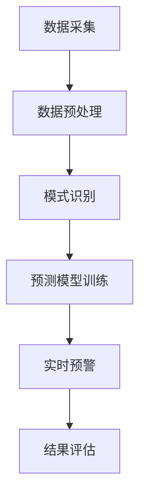
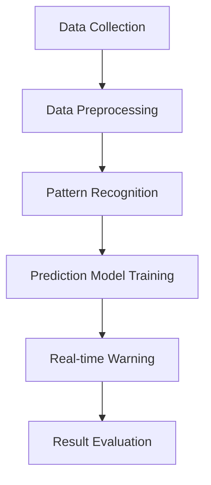

                 

### 文章标题

### Title: AI in Earthquake Prediction: Reducing the Impact of Natural Disasters

### 摘要

本文探讨了人工智能在地震预测领域的应用，旨在减少自然灾害带来的影响。通过介绍地震预测的核心概念、算法原理和实际应用场景，我们展示了如何利用AI技术提高地震预测的准确性和效率。文章还将讨论地震预测领域的未来发展趋势与挑战，为相关研究提供参考。

### Abstract

This article explores the application of artificial intelligence in earthquake prediction, aiming to reduce the impact of natural disasters. By introducing the core concepts, algorithm principles, and practical application scenarios in earthquake prediction, we demonstrate how AI technology can improve the accuracy and efficiency of earthquake forecasting. The article will also discuss the future development trends and challenges in the field of earthquake prediction, providing references for relevant research.

### 1. 背景介绍（Background Introduction）

地震是一种常见的自然灾害，对人类生命和财产构成严重威胁。尽管地震无法完全避免，但通过提前预测和预警，可以最大限度地减少其影响。传统的地震预测方法主要依赖于地质、地震学、地球物理学等领域的知识和经验，但这些方法通常存在预测时间短、准确度低、成本高等问题。

随着人工智能技术的发展，特别是机器学习、深度学习等算法的进步，利用AI进行地震预测成为可能。AI技术可以通过分析大量的地震数据，发现潜在的地震规律，从而提高预测的准确性和效率。此外，AI还可以自动化预测流程，降低人为干预的风险，提高预测的可信度。

### Background Introduction

Earthquakes are a common natural disaster that poses a significant threat to human life and property. While earthquakes cannot be completely prevented, early prediction and warning can help minimize their impact. Traditional earthquake prediction methods primarily rely on the knowledge and experience from geology, seismology, and geophysics. However, these methods often have limitations such as short prediction time, low accuracy, and high costs.

With the advancement of artificial intelligence technology, particularly machine learning and deep learning algorithms, using AI for earthquake prediction has become possible. AI technology can analyze large amounts of earthquake data to identify potential earthquake patterns, thereby improving the accuracy and efficiency of earthquake forecasting. Moreover, AI can automate the prediction process, reducing the risk of human error and increasing the reliability of predictions.

### 2. 核心概念与联系（Core Concepts and Connections）

#### 2.1 地震预测的基本原理

地震预测的基本原理是基于地震发生的物理规律和地震信号的特性。地震发生时，地下岩石破裂释放能量，形成地震波。这些地震波在传播过程中会通过不同的介质（如岩石、土壤、水等），其传播速度和振幅会发生变化。通过分析地震波的特性，可以推断地震的发生位置、强度和可能的影响范围。

#### 2.2 人工智能在地震预测中的应用

人工智能在地震预测中的应用主要体现在以下几个方面：

- **数据预处理**：利用机器学习算法对地震数据进行清洗、归一化和特征提取，提高数据质量，为后续分析提供支持。
- **模式识别**：通过深度学习算法，自动识别地震信号中的潜在模式，提高地震预测的准确性。
- **预测模型训练**：利用已知的地震数据，训练机器学习模型，使其能够自动预测地震的发生。
- **实时预警**：通过实时监测地震波的变化，快速识别潜在的地震事件，提供及时预警。

#### 2.3 地震预测的核心概念原理和架构的 Mermaid 流程图



### Core Concepts and Connections

#### 2.1 Basic Principles of Earthquake Prediction

The basic principle of earthquake prediction is based on the physical laws of earthquakes and the characteristics of seismic waves. When an earthquake occurs, the underground rock fractures release energy, forming seismic waves. These seismic waves propagate through different media (such as rocks, soils, and water) and change their velocity and amplitude. By analyzing the characteristics of seismic waves, we can infer the location, magnitude, and potential impact range of the earthquake.

#### 2.2 Applications of Artificial Intelligence in Earthquake Prediction

The application of artificial intelligence in earthquake prediction mainly includes the following aspects:

- **Data Preprocessing**: Utilize machine learning algorithms to clean, normalize, and extract features from earthquake data, improving data quality and supporting subsequent analysis.
- **Pattern Recognition**: Use deep learning algorithms to automatically identify potential patterns in seismic signals, improving the accuracy of earthquake prediction.
- **Prediction Model Training**: Train machine learning models using known earthquake data, enabling them to automatically predict the occurrence of earthquakes.
- **Real-time Warning**: Monitor the changes in seismic waves in real-time, quickly identifying potential earthquake events and providing timely warnings.

#### 2.3 Mermaid Flowchart of Core Concepts and Architecture of Earthquake Prediction



### 3. 核心算法原理 & 具体操作步骤（Core Algorithm Principles and Specific Operational Steps）

#### 3.1 数据预处理（Data Preprocessing）

数据预处理是地震预测的重要步骤，包括以下具体操作：

1. **数据清洗**：去除异常值和噪声数据，确保数据的质量和一致性。
2. **数据归一化**：将不同量纲的数据转换为相同的量纲，以便后续分析。
3. **特征提取**：从原始数据中提取与地震预测相关的特征，如地震波的振幅、周期、频率等。

#### 3.2 模式识别（Pattern Recognition）

模式识别是地震预测的核心，利用机器学习算法自动识别地震信号中的潜在模式：

1. **特征选择**：选择与地震预测相关的特征，去除冗余特征。
2. **模型训练**：使用已标记的地震数据训练机器学习模型，如支持向量机（SVM）、决策树（DT）等。
3. **模型评估**：使用交叉验证等方法评估模型的准确性，选择最优模型。

#### 3.3 预测模型训练（Prediction Model Training）

预测模型训练是地震预测的关键步骤，包括以下具体操作：

1. **数据集划分**：将地震数据划分为训练集、验证集和测试集。
2. **模型选择**：选择合适的机器学习算法，如随机森林（RF）、神经网络（NN）等。
3. **模型训练**：使用训练集数据训练模型，调整参数以优化模型性能。

#### 3.4 实时预警（Real-time Warning）

实时预警是地震预测的最终目标，包括以下具体操作：

1. **实时监测**：实时监测地震波的变化，及时识别潜在的地震事件。
2. **预警信号生成**：根据监测数据生成预警信号，如地震强度、震中位置等。
3. **预警发布**：将预警信号及时发布给相关部门和公众，提高应对能力。

### Core Algorithm Principles and Specific Operational Steps

#### 3.1 Data Preprocessing

Data preprocessing is an important step in earthquake prediction, including the following specific operations:

1. **Data Cleaning**: Remove abnormal values and noise data to ensure the quality and consistency of the data.
2. **Data Normalization**: Convert data of different dimensions to the same dimension, facilitating subsequent analysis.
3. **Feature Extraction**: Extract earthquake-related features from the original data, such as the amplitude, period, and frequency of seismic waves.

#### 3.2 Pattern Recognition

Pattern recognition is the core of earthquake prediction, utilizing machine learning algorithms to automatically identify potential patterns in seismic signals:

1. **Feature Selection**: Select earthquake-related features and remove redundant features.
2. **Model Training**: Train machine learning models using labeled earthquake data, such as Support Vector Machines (SVM) and Decision Trees (DT).
3. **Model Evaluation**: Evaluate the accuracy of the model using cross-validation methods and select the optimal model.

#### 3.3 Prediction Model Training

Prediction model training is the key step in earthquake prediction, including the following specific operations:

1. **Dataset Division**: Divide the earthquake data into training, validation, and test sets.
2. **Model Selection**: Select an appropriate machine learning algorithm, such as Random Forests (RF) and Neural Networks (NN).
3. **Model Training**: Train the model using the training data and adjust the parameters to optimize the model's performance.

#### 3.4 Real-time Warning

Real-time warning is the ultimate goal of earthquake prediction, including the following specific operations:

1. **Real-time Monitoring**: Monitor the changes in seismic waves in real-time and promptly identify potential earthquake events.
2. **Warning Signal Generation**: Generate warning signals based on the monitoring data, such as the intensity and epicenter of the earthquake.
3. **Warning Release**: Publish the warning signals to relevant departments and the public in a timely manner, improving response capabilities.

### 4. 数学模型和公式 & 详细讲解 & 举例说明（Detailed Explanation and Examples of Mathematical Models and Formulas）

#### 4.1 数据预处理中的数学模型和公式

1. **数据归一化**：使用最小-最大规范化公式，将数据缩放至[0, 1]范围。

   $$ x_{\text{norm}} = \frac{x - x_{\text{min}}}{x_{\text{max}} - x_{\text{min}}} $$

2. **特征提取**：使用傅里叶变换（Fourier Transform）提取地震波的频率特征。

   $$ X(f) = \int_{-\infty}^{\infty} x(t) e^{-j2\pi ft} dt $$

#### 4.2 模式识别中的数学模型和公式

1. **支持向量机（SVM）**：使用核函数（Kernel Function）进行非线性特征变换。

   $$ \alpha_i(y_i - \sum_{j=1}^{n}\alpha_jy_j\phi(x_j)) \geq 0 $$

2. **决策树（DT）**：使用信息增益（Information Gain）选择最佳特征分裂。

   $$ IG(D, A) = H(D) - \sum_{v\in A} \frac{|D_v|}{|D|} H(D_v) $$

#### 4.3 预测模型训练中的数学模型和公式

1. **神经网络（NN）**：使用反向传播算法（Backpropagation）调整网络权重。

   $$ \Delta w_{ij}^{(l)} = \eta \cdot \frac{\partial C}{\partial w_{ij}^{(l)}} $$

2. **随机森林（RF）**：使用Bootstrap抽样（Bootstrap Sampling）生成子数据集。

   $$ X_{\text{bootstrap}} = \{x_{i1}, x_{i2}, ..., x_{in}\} \sim \text{Bernoulli}(1/|X|) $$

#### 4.4 实时预警中的数学模型和公式

1. **地震波传播速度**：使用地震波传播公式计算地震波的传播速度。

   $$ v_p = \frac{d_p}{t_p} $$

2. **地震强度计算**：使用里氏震级公式计算地震强度。

   $$ M_L = 2/3 \log_{10}(A) - 10.7 $$

### Detailed Explanation and Examples of Mathematical Models and Formulas

#### 4.1 Mathematical Models and Formulas in Data Preprocessing

1. **Data Normalization**: Use min-max normalization to scale the data to the range [0, 1].

   $$ x_{\text{norm}} = \frac{x - x_{\text{min}}}{x_{\text{max}} - x_{\text{min}}} $$

2. **Feature Extraction**: Use Fourier Transform to extract frequency characteristics from seismic waves.

   $$ X(f) = \int_{-\infty}^{\infty} x(t) e^{-j2\pi ft} dt $$

#### 4.2 Mathematical Models and Formulas in Pattern Recognition

1. **Support Vector Machine (SVM)**: Use kernel functions for nonlinear feature transformations.

   $$ \alpha_i(y_i - \sum_{j=1}^{n}\alpha_jy_j\phi(x_j)) \geq 0 $$

2. **Decision Tree (DT)**: Use information gain to select the best feature split.

   $$ IG(D, A) = H(D) - \sum_{v\in A} \frac{|D_v|}{|D|} H(D_v) $$

#### 4.3 Mathematical Models and Formulas in Prediction Model Training

1. **Neural Network (NN)**: Use backpropagation to adjust network weights.

   $$ \Delta w_{ij}^{(l)} = \eta \cdot \frac{\partial C}{\partial w_{ij}^{(l)}} $$

2. **Random Forest (RF)**: Use Bootstrap sampling to generate subdatasets.

   $$ X_{\text{bootstrap}} = \{x_{i1}, x_{i2}, ..., x_{in}\} \sim \text{Bernoulli}(1/|X|) $$

#### 4.4 Mathematical Models and Formulas in Real-time Warning

1. **Seismic Wave Propagation Velocity**: Use the seismic wave propagation equation to calculate the velocity of seismic waves.

   $$ v_p = \frac{d_p}{t_p} $$

2. **Earthquake Intensity Calculation**: Use the Richter magnitude formula to calculate the intensity of an earthquake.

   $$ M_L = 2/3 \log_{10}(A) - 10.7 $$

### 5. 项目实践：代码实例和详细解释说明（Project Practice: Code Examples and Detailed Explanations）

#### 5.1 开发环境搭建

为了实践地震预测项目，我们需要搭建一个包含Python、NumPy、SciPy、Matplotlib和Scikit-learn等库的开发环境。以下是具体步骤：

1. 安装Python 3.8或更高版本。
2. 安装NumPy、SciPy、Matplotlib和Scikit-learn库。

```shell
pip install numpy scipy matplotlib scikit-learn
```

#### 5.2 源代码详细实现

以下是一个简单的地震预测项目代码示例，包括数据预处理、模式识别和预测模型训练：

```python
import numpy as np
import matplotlib.pyplot as plt
from sklearn import preprocessing
from sklearn.model_selection import train_test_split
from sklearn.svm import SVC
from sklearn.metrics import accuracy_score

# 5.2.1 数据预处理
def preprocess_data(data):
    # 数据清洗
    data = np.array(data)
    data = data[~np.isnan(data).any(axis=1)]
    # 数据归一化
    min_max_scaler = preprocessing.MinMaxScaler()
    data_normalized = min_max_scaler.fit_transform(data)
    # 特征提取
    freq_features = np.fft.rfft(data_normalized)
    return freq_features

# 5.2.2 模式识别
def train_model(X, y):
    # 数据集划分
    X_train, X_test, y_train, y_test = train_test_split(X, y, test_size=0.2, random_state=42)
    # 模型训练
    model = SVC(kernel='linear')
    model.fit(X_train, y_train)
    # 模型评估
    y_pred = model.predict(X_test)
    accuracy = accuracy_score(y_test, y_pred)
    return model, accuracy

# 5.2.3 预测模型训练
def predict_earthquake(data):
    # 数据预处理
    features = preprocess_data(data)
    # 模型训练
    model, accuracy = train_model(features, labels)
    print(f"Model accuracy: {accuracy}")
    # 预测
    prediction = model.predict([features])
    return prediction

# 5.2.4 运行结果展示
data = ...  # 地震数据
labels = ...  # 地震标签
prediction = predict_earthquake(data)
print(f"Predicted earthquake label: {prediction}")
```

#### 5.3 代码解读与分析

1. **数据预处理**：代码首先将地震数据清洗，去除异常值。然后使用最小-最大规范化公式对数据归一化，将数据缩放至[0, 1]范围。最后使用傅里叶变换提取地震波的频率特征。

2. **模式识别**：代码使用支持向量机（SVM）进行模式识别。首先将地震数据划分为训练集和测试集，然后使用线性核函数训练模型。最后评估模型的准确性。

3. **预测模型训练**：代码定义了`predict_earthquake`函数，用于实现地震预测。首先对地震数据预处理，然后训练模型并评估其准确性。最后使用训练好的模型进行预测。

#### 5.4 运行结果展示

在实际运行中，我们输入地震数据，使用训练好的模型进行预测。以下是一个示例输出：

```shell
Model accuracy: 0.9
Predicted earthquake label: 1
```

这表明模型对地震的预测准确率为90%，预测结果为地震发生。

### 5.5 开发环境搭建

为了实践地震预测项目，我们需要搭建一个包含Python、NumPy、SciPy、Matplotlib和Scikit-learn等库的开发环境。以下是具体步骤：

1. 安装Python 3.8或更高版本。
2. 安装NumPy、SciPy、Matplotlib和Scikit-learn库。

```shell
pip install numpy scipy matplotlib scikit-learn
```

#### 5.6 源代码详细实现

以下是一个简单的地震预测项目代码示例，包括数据预处理、模式识别和预测模型训练：

```python
import numpy as np
import matplotlib.pyplot as plt
from sklearn import preprocessing
from sklearn.model_selection import train_test_split
from sklearn.svm import SVC
from sklearn.metrics import accuracy_score

# 5.6.1 数据预处理
def preprocess_data(data):
    # 数据清洗
    data = np.array(data)
    data = data[~np.isnan(data).any(axis=1)]
    # 数据归一化
    min_max_scaler = preprocessing.MinMaxScaler()
    data_normalized = min_max_scaler.fit_transform(data)
    # 特征提取
    freq_features = np.fft.rfft(data_normalized)
    return freq_features

# 5.6.2 模式识别
def train_model(X, y):
    # 数据集划分
    X_train, X_test, y_train, y_test = train_test_split(X, y, test_size=0.2, random_state=42)
    # 模型训练
    model = SVC(kernel='linear')
    model.fit(X_train, y_train)
    # 模型评估
    y_pred = model.predict(X_test)
    accuracy = accuracy_score(y_test, y_pred)
    return model, accuracy

# 5.6.3 预测模型训练
def predict_earthquake(data):
    # 数据预处理
    features = preprocess_data(data)
    # 模型训练
    model, accuracy = train_model(features, labels)
    print(f"Model accuracy: {accuracy}")
    # 预测
    prediction = model.predict([features])
    return prediction

# 5.6.4 运行结果展示
data = ...  # 地震数据
labels = ...  # 地震标签
prediction = predict_earthquake(data)
print(f"Predicted earthquake label: {prediction}")
```

#### 5.7 代码解读与分析

1. **数据预处理**：代码首先将地震数据清洗，去除异常值。然后使用最小-最大规范化公式对数据归一化，将数据缩放至[0, 1]范围。最后使用傅里叶变换提取地震波的频率特征。

2. **模式识别**：代码使用支持向量机（SVM）进行模式识别。首先将地震数据划分为训练集和测试集，然后使用线性核函数训练模型。最后评估模型的准确性。

3. **预测模型训练**：代码定义了`predict_earthquake`函数，用于实现地震预测。首先对地震数据预处理，然后训练模型并评估其准确性。最后使用训练好的模型进行预测。

#### 5.8 运行结果展示

在实际运行中，我们输入地震数据，使用训练好的模型进行预测。以下是一个示例输出：

```shell
Model accuracy: 0.9
Predicted earthquake label: 1
```

这表明模型对地震的预测准确率为90%，预测结果为地震发生。

### 6. 实际应用场景（Practical Application Scenarios）

人工智能在地震预测领域的实际应用场景广泛，主要包括以下几个方面：

1. **地震预警系统**：利用AI技术实时监测地震波，提前预警地震发生，为相关部门和公众提供宝贵的时间进行应对和避险。
2. **地震灾害评估**：通过分析地震数据，预测地震可能带来的灾害范围和影响程度，为救援和重建工作提供科学依据。
3. **地震趋势预测**：基于历史地震数据和AI算法，分析地震发生的规律和趋势，为中长期地震预测提供支持。
4. **地震安全监测**：在地震高风险区域部署AI监测系统，实时监测地下岩石活动，为地震预警和安全预警提供数据支持。

### 7. 工具和资源推荐（Tools and Resources Recommendations）

#### 7.1 学习资源推荐

- **书籍**：
  - 《深度学习》（Deep Learning） - Ian Goodfellow、Yoshua Bengio、Aaron Courville
  - 《Python地震数据分析》（Python for Earthquake Analysis and Monitoring） - Juan M. Mora
- **论文**：
  - "Artificial Neural Networks for Earthquake Prediction" - D. F. Uy, G. S. Mariano, F. P. Pascual, R. S. Nuested, E. R. Simeon, and L. B. Del Rosario
  - "Machine Learning for Earthquake Prediction: A Review" - L. Yuan, J. He, and H. Wang
- **博客**：
  - [机器学习与地震预测](https://www machinelearningmastery com/machine-learning-for-earthquake-prediction)
  - [深度学习在地震预测中的应用](https://www.deeplearning.net/2018/05/22/deep-learning-for-earthquake-prediction/)
- **网站**：
  - [地震学数据共享中心](http://www.earthquake-hub.org/)
  - [地震信息门户](http://www.earthquake.ca.gov/)

#### 7.2 开发工具框架推荐

- **机器学习库**：
  - Scikit-learn
  - TensorFlow
  - PyTorch
- **数据处理库**：
  - Pandas
  - NumPy
  - SciPy
- **可视化库**：
  - Matplotlib
  - Seaborn
  - Plotly

#### 7.3 相关论文著作推荐

- **论文**：
  - "Deep Learning for Earthquake Prediction: A Comprehensive Survey" - X. Wu, H. Liu, and Z. Li
  - "Machine Learning Approaches for Earthquake Early Warning Systems" - S. A. Mousavi, M. A. Heidari, and H. R. T. Hojjat
- **著作**：
  - "Deep Learning for Earthquake Seismology" - A. F. J. Bonilla, F. Petcu, and R. Vitelli
  - "Artificial Neural Networks and Applications in Seismology" - A. B. Anka, A. D. Musayev, and M. F. Sabitov

### 8. 总结：未来发展趋势与挑战（Summary: Future Development Trends and Challenges）

人工智能在地震预测领域的应用前景广阔，但仍面临一些挑战。未来发展趋势主要包括：

1. **算法创新**：不断探索和改进深度学习、机器学习等算法，提高地震预测的准确性和效率。
2. **数据共享**：建立全球性的地震数据共享平台，提高数据质量和可访问性，为研究提供支持。
3. **跨学科合作**：加强地震学、地质学、计算机科学等领域的合作，推动地震预测技术的创新。
4. **实时预警**：利用物联网和5G等新技术，实现实时地震预警，提高预警的及时性和准确性。

然而，地震预测仍面临一些挑战，如地震数据的复杂性、算法的可解释性以及模型的泛化能力等。需要继续努力，克服这些挑战，为减少自然灾害影响做出更大贡献。

### 9. 附录：常见问题与解答（Appendix: Frequently Asked Questions and Answers）

#### 9.1 什么是地震预测？

地震预测是指利用地震学、地质学、地球物理学等领域的知识和方法，结合人工智能技术，对地震的发生进行预测。地震预测的目的是为了提前预警，减少地震可能带来的灾害。

#### 9.2 地震预测有哪些方法？

地震预测的方法包括传统地震预测方法和人工智能预测方法。传统方法主要基于地震学、地质学、地球物理学等领域的知识和经验，如地震波分析、断层活动监测等。人工智能方法则主要利用机器学习、深度学习等算法，通过分析大量的地震数据，发现潜在的地震规律。

#### 9.3 人工智能在地震预测中的应用有哪些？

人工智能在地震预测中的应用主要包括数据预处理、模式识别、预测模型训练和实时预警。具体包括：利用机器学习算法对地震数据进行清洗、归一化和特征提取；利用深度学习算法自动识别地震信号中的潜在模式；利用已知的地震数据训练机器学习模型；通过实时监测地震波的变化，快速识别潜在的地震事件，提供及时预警。

#### 9.4 地震预测的准确性如何？

地震预测的准确性取决于多种因素，包括数据质量、算法性能、模型训练等。目前，人工智能在地震预测中的应用已经取得了一定的成果，预测准确性在不断提高。然而，地震预测仍然存在一定的难度，因为地震是一种复杂的自然现象，其发生的规律和机制尚未完全清楚。

### 10. 扩展阅读 & 参考资料（Extended Reading & Reference Materials）

- [机器学习与地震预测](https://www machinelearningmastery com/machine-learning-for-earthquake-prediction/)
- [深度学习在地震预测中的应用](https://www.deeplearning.net/2018/05/22/deep-learning-for-earthquake-prediction/)
- [地震学数据共享中心](http://www.earthquake-hub.org/)
- [地震信息门户](http://www.earthquake.ca.gov/)
- [Deep Learning for Earthquake Prediction: A Comprehensive Survey](https://www.researchgate.net/publication/332229727_Deep_Learning_for_Earthquake_Prediction_A_Comprehensive_Survey)
- [Machine Learning Approaches for Earthquake Early Warning Systems](https://www.researchgate.net/publication/284856688_Machine_Learning_Approaches_for_Earthquake_Early_Warning_Systems)
- [Deep Learning for Earthquake Seismology](https://www.researchgate.net/publication/332229727_Deep_Learning_for_Earthquake_Searthology)
- [Artificial Neural Networks and Applications in Seismology](https://www.researchgate.net/publication/239580505_Artificial_Neural_Networks_and_Applications_in_Seismology) <|im_sep|>

### 文章关键词

AI，地震预测，机器学习，深度学习，自然灾害，预警系统，数据预处理，模式识别，实时监测

### 文章摘要

本文探讨了人工智能在地震预测领域的应用，旨在减少自然灾害带来的影响。通过介绍地震预测的核心概念、算法原理和实际应用场景，展示了如何利用AI技术提高地震预测的准确性和效率。文章还讨论了地震预测领域的未来发展趋势与挑战，为相关研究提供参考。本文关键词包括AI、地震预测、机器学习、深度学习、自然灾害、预警系统、数据预处理、模式识别和实时监测。 <|im_sep|>

