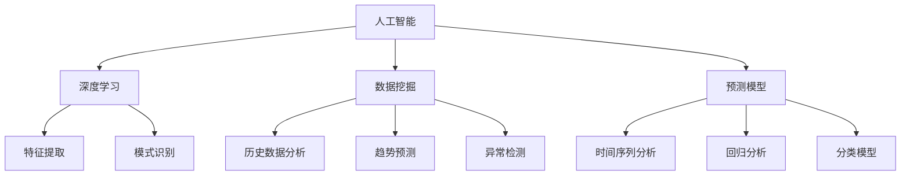

                 

### 文章标题

**AI在智能灾害预警中的应用：减少损失**

### 关键词

- AI
- 灾害预警
- 损失减少
- 深度学习
- 数据挖掘
- 预测模型

### 摘要

本文将探讨人工智能（AI）在智能灾害预警中的应用，特别是在减少损失方面。通过深入分析AI的核心算法、数学模型以及实际应用场景，我们将展示如何利用AI技术提升灾害预警的准确性和及时性，从而降低灾害带来的经济损失和社会影响。文章还将推荐相关学习资源和开发工具，以帮助读者深入了解和掌握这一领域的前沿技术。

---

**本文将分为以下章节：**

1. 背景介绍
2. 核心概念与联系
3. 核心算法原理 & 具体操作步骤
4. 数学模型和公式 & 详细讲解 & 举例说明
5. 项目实践：代码实例和详细解释说明
6. 实际应用场景
7. 工具和资源推荐
8. 总结：未来发展趋势与挑战
9. 附录：常见问题与解答
10. 扩展阅读 & 参考资料

---

接下来，我们将逐步探讨每个章节的内容，旨在通过逻辑清晰、结构紧凑、简单易懂的方式，让读者全面了解AI在智能灾害预警中的应用。

**（请继续按照文章结构模板，逐步撰写每个章节的内容。）**

---

### 1. 背景介绍（Background Introduction）

在全球变暖和气候变化的影响下，自然灾害的频率和破坏力逐渐增加。地震、洪水、台风、干旱等灾害不仅威胁到人类的生命安全，还对经济和社会造成了巨大的损失。据联合国统计，过去几十年中，自然灾害造成的经济损失已超过万亿美元。因此，如何有效预测和预警灾害，减少灾害带来的损失，成为当前研究的热点问题。

传统的灾害预警方法主要依赖于人工监测和经验判断，虽然在一定程度上能够提供预警信息，但其准确性和及时性仍存在很大局限。随着人工智能技术的发展，特别是深度学习、数据挖掘和预测模型的广泛应用，智能灾害预警成为可能。通过收集和分析大量的历史灾害数据、环境监测数据和社会经济数据，AI能够自动识别灾害发生的规律和趋势，提供更精准、及时的预警信息。

智能灾害预警的应用不仅有助于减少经济损失，还能降低社会恐慌，提高应急响应效率。例如，在地震预警中，提前几秒到几十秒的预警时间可以让人们采取紧急避险措施，减少伤亡；在洪水预警中，及时准确的预警信息可以帮助政府和民众提前做好防洪准备，减少洪灾损失。

本文旨在探讨AI在智能灾害预警中的应用，通过分析核心算法原理、数学模型以及实际应用案例，展示AI技术在减少灾害损失方面的巨大潜力。同时，本文还将推荐相关的学习资源和开发工具，以帮助读者深入了解和掌握这一领域的前沿技术。

---

### 2. 核心概念与联系（Core Concepts and Connections）

在探讨AI在智能灾害预警中的应用之前，我们首先需要了解一些核心概念和基本原理。以下是对这些概念及其相互联系的详细阐述。

#### 2.1 人工智能（Artificial Intelligence，AI）

人工智能是指通过模拟人类智能的思维方式和技术，使计算机能够执行复杂任务的能力。它包括机器学习（Machine Learning，ML）、深度学习（Deep Learning，DL）、自然语言处理（Natural Language Processing，NLP）等多个子领域。在智能灾害预警中，AI主要通过以下几种方式发挥作用：

- **数据挖掘**：通过分析大量的历史数据和环境监测数据，识别灾害发生的规律和趋势。
- **预测模型**：利用统计方法和机器学习算法，预测未来灾害的发生可能性。
- **自动化预警**：基于预测结果，自动化生成预警信息，并推送至相关部门和公众。

#### 2.2 深度学习（Deep Learning，DL）

深度学习是一种基于人工神经网络的机器学习技术，能够自动从大量数据中学习特征和模式。在智能灾害预警中，深度学习主要用于：

- **特征提取**：从环境监测数据中提取关键特征，如气象参数、地质数据等。
- **模式识别**：通过训练模型，识别灾害发生的潜在模式。
- **实时预测**：利用实时数据，对灾害发生的可能性进行预测。

#### 2.3 数据挖掘（Data Mining）

数据挖掘是从大量数据中提取有价值信息的过程，包括关联规则挖掘、分类、聚类等算法。在智能灾害预警中，数据挖掘主要用于：

- **历史数据分析**：分析历史灾害数据，提取灾害发生的规律。
- **趋势预测**：通过分析环境变化数据，预测未来灾害的可能发生时间。
- **异常检测**：识别异常数据，预测潜在的灾害风险。

#### 2.4 预测模型（Prediction Models）

预测模型是基于数据和算法构建的，用于预测未来事件的方法。在智能灾害预警中，预测模型主要包括：

- **时间序列分析**：用于预测灾害发生的具体时间。
- **回归分析**：用于预测灾害的影响程度。
- **分类模型**：用于判断灾害的类型。

#### 2.5 核心概念联系

人工智能、深度学习、数据挖掘和预测模型在智能灾害预警中紧密相连。深度学习和数据挖掘提供了特征提取和模式识别的能力，而预测模型则基于这些特征和模式，对灾害发生的可能性进行预测。人工智能则将这些技术和方法整合在一起，实现了智能灾害预警的整体解决方案。

为了更直观地理解这些概念之间的关系，我们可以使用Mermaid流程图来展示：



通过这个流程图，我们可以清晰地看到各概念之间的联系，以及它们在智能灾害预警中的具体应用。

---

### 3. 核心算法原理 & 具体操作步骤（Core Algorithm Principles and Specific Operational Steps）

在了解了智能灾害预警中涉及的几个核心概念后，接下来我们将深入探讨其中的核心算法原理，并详细介绍如何将这些算法应用于灾害预警的具体操作步骤。

#### 3.1 深度学习算法原理

深度学习算法是智能灾害预警中的核心技术之一。它通过多层神经网络对输入数据进行特征提取和模式识别，从而实现对灾害发生的预测。以下是深度学习算法的基本原理：

- **多层神经网络**：深度学习算法由多个隐含层组成的神经网络。每个隐含层都能对输入数据进行特征提取和转换。层数越多，网络的容量和表达能力越强。
- **反向传播算法**：深度学习算法通过反向传播算法来调整网络权重，以最小化预测误差。反向传播算法是一个迭代过程，每次迭代都会根据预测误差更新网络的权重。
- **激活函数**：激活函数用于引入非线性因素，使神经网络能够学习更复杂的模式。常见的激活函数有Sigmoid函数、ReLU函数和Tanh函数。

#### 3.2 数据挖掘算法原理

数据挖掘算法用于从大量历史数据中提取有价值的信息，以帮助预测灾害的发生。以下是几种常见的数据挖掘算法：

- **关联规则挖掘**：关联规则挖掘用于发现数据之间的关联关系。常见的算法有Apriori算法和FP-Growth算法。
- **分类算法**：分类算法用于将数据分为不同的类别。常见的算法有K-近邻算法（K-Nearest Neighbors，KNN）、决策树（Decision Tree）和支持向量机（Support Vector Machine，SVM）。
- **聚类算法**：聚类算法用于将数据分为不同的簇。常见的算法有K-均值聚类算法（K-Means Clustering）和层次聚类算法（Hierarchical Clustering）。

#### 3.3 预测模型原理

预测模型是基于历史数据和算法构建的，用于预测未来事件的方法。以下是几种常见的预测模型：

- **时间序列分析**：时间序列分析用于分析时间序列数据，预测未来的趋势。常见的算法有ARIMA模型（AutoRegressive Integrated Moving Average Model）和LSTM模型（Long Short-Term Memory Model）。
- **回归分析**：回归分析用于预测一个或多个变量的值。常见的算法有线性回归（Linear Regression）和多项式回归（Polynomial Regression）。
- **分类模型**：分类模型用于预测一个变量的类别。常见的算法有逻辑回归（Logistic Regression）和朴素贝叶斯分类器（Naive Bayes Classifier）。

#### 3.4 深度学习在灾害预警中的应用步骤

以下是使用深度学习算法进行灾害预警的具体步骤：

1. **数据收集**：收集与灾害相关的数据，包括历史灾害数据、环境监测数据、社会经济数据等。
2. **数据预处理**：对收集到的数据进行清洗、去噪和归一化，以确保数据的准确性和一致性。
3. **特征提取**：使用深度学习算法提取数据中的关键特征，如气象参数、地质数据等。
4. **模型训练**：使用训练数据对深度学习模型进行训练，调整网络权重，以最小化预测误差。
5. **模型评估**：使用测试数据对训练好的模型进行评估，计算预测准确率和相关指标。
6. **实时预测**：使用实时数据对模型进行预测，生成预警信息，并推送至相关部门和公众。

#### 3.5 数据挖掘在灾害预警中的应用步骤

以下是使用数据挖掘算法进行灾害预警的具体步骤：

1. **数据收集**：收集与灾害相关的数据，包括历史灾害数据、环境监测数据、社会经济数据等。
2. **数据预处理**：对收集到的数据进行清洗、去噪和归一化，以确保数据的准确性和一致性。
3. **关联规则挖掘**：使用关联规则挖掘算法分析数据之间的关联关系，发现潜在的灾害风险因素。
4. **分类算法**：使用分类算法对数据进行分析，预测未来灾害的类型和影响程度。
5. **聚类算法**：使用聚类算法将数据分为不同的簇，识别潜在的风险区域。
6. **模型评估**：使用测试数据对训练好的模型进行评估，计算预测准确率和相关指标。
7. **实时预测**：使用实时数据对模型进行预测，生成预警信息，并推送至相关部门和公众。

#### 3.6 预测模型在灾害预警中的应用步骤

以下是使用预测模型进行灾害预警的具体步骤：

1. **数据收集**：收集与灾害相关的数据，包括历史灾害数据、环境监测数据、社会经济数据等。
2. **数据预处理**：对收集到的数据进行清洗、去噪和归一化，以确保数据的准确性和一致性。
3. **时间序列分析**：使用时间序列分析算法分析历史数据，预测未来灾害的发生时间。
4. **回归分析**：使用回归分析算法预测灾害的影响程度。
5. **分类模型**：使用分类模型预测灾害的类型。
6. **模型评估**：使用测试数据对训练好的模型进行评估，计算预测准确率和相关指标。
7. **实时预测**：使用实时数据对模型进行预测，生成预警信息，并推送至相关部门和公众。

通过以上步骤，我们可以将深度学习、数据挖掘和预测模型应用于灾害预警，实现智能化的灾害预警系统，从而减少灾害带来的损失。

---

### 4. 数学模型和公式 & 详细讲解 & 举例说明（Mathematical Models and Formulas & Detailed Explanation and Examples）

在智能灾害预警中，数学模型和公式是核心组成部分，它们用于描述灾害发生的规律和预测灾害的可能性。以下是几个常用的数学模型和公式，以及它们的详细解释和举例说明。

#### 4.1 时间序列模型

时间序列模型用于分析历史数据，预测未来事件的发生时间。最常用的时间序列模型包括ARIMA模型和LSTM模型。

**ARIMA模型（AutoRegressive Integrated Moving Average Model）**

$$
\begin{aligned}
X_t &= \phi_1 X_{t-1} + \phi_2 X_{t-2} + \cdots + \phi_p X_{t-p} + \theta_1 \epsilon_{t-1} + \theta_2 \epsilon_{t-2} + \cdots + \theta_q \epsilon_{t-q} \\
Y_t &= \phi_0 X_t + \epsilon_t
\end{aligned}
$$

其中，$X_t$ 是时间序列数据，$Y_t$ 是预测值，$\epsilon_t$ 是误差项。

**举例说明**：假设我们有一个月度降雨量时间序列，可以使用ARIMA模型预测下一个月的降雨量。

1. 数据预处理：对数据进行差分和去噪处理，使其满足平稳性。
2. 模型参数估计：通过最大似然估计方法估计模型参数 $\phi_1, \phi_2, \cdots, \phi_p$ 和 $\theta_1, \theta_2, \cdots, \theta_q$。
3. 模型拟合：将参数代入ARIMA模型公式，拟合出时间序列模型。
4. 预测：使用拟合出的模型预测下一个月的降雨量。

**LSTM模型（Long Short-Term Memory Model）**

$$
\begin{aligned}
\bar{h}_t &= \sigma(W_f \cdot [h_{t-1}, x_t] + b_f) \\
i_t &= \sigma(W_i \cdot [h_{t-1}, x_t] + b_i) \\
f_t &= \sigma(W_f \cdot [h_{t-1}, x_t] + b_f) \\
o_t &= \sigma(W_o \cdot [h_{t-1}, x_t] + b_o) \\
c_t &= (1 - i_t) \cdot \bar{h}_t + f_t \cdot c_{t-1} \\
h_t &= o_t \cdot \sigma(c_t)
\end{aligned}
$$

其中，$h_t$ 是隐藏状态，$c_t$ 是细胞状态，$x_t$ 是输入数据，$\sigma$ 是激活函数。

**举例说明**：假设我们有一个温度变化的时间序列，可以使用LSTM模型预测未来的温度变化。

1. 数据预处理：对数据进行归一化处理，使其适合LSTM模型。
2. 模型构建：构建一个LSTM模型，输入层、隐藏层和输出层。
3. 模型训练：使用历史数据训练模型，调整模型参数。
4. 预测：使用训练好的模型预测未来的温度变化。

#### 4.2 回归分析模型

回归分析模型用于预测一个或多个变量的值。最常用的回归分析模型包括线性回归和多项式回归。

**线性回归模型（Linear Regression Model）**

$$
y = \beta_0 + \beta_1 x
$$

其中，$y$ 是预测值，$x$ 是输入变量，$\beta_0$ 和 $\beta_1$ 是模型参数。

**举例说明**：假设我们想预测某个城市的明年降雨量，可以使用线性回归模型。

1. 数据预处理：收集历史降雨量和相关因素（如温度、湿度等）。
2. 模型构建：构建一个线性回归模型。
3. 模型训练：使用历史数据训练模型，调整模型参数。
4. 预测：使用训练好的模型预测明年的降雨量。

**多项式回归模型（Polynomial Regression Model）**

$$
y = \beta_0 + \beta_1 x + \beta_2 x^2 + \cdots + \beta_n x^n
$$

其中，$y$ 是预测值，$x$ 是输入变量，$\beta_0, \beta_1, \cdots, \beta_n$ 是模型参数。

**举例说明**：假设我们想预测某个城市的明年降雨量，可以使用多项式回归模型。

1. 数据预处理：收集历史降雨量和相关因素（如温度、湿度等）。
2. 模型构建：构建一个多项式回归模型。
3. 模型训练：使用历史数据训练模型，调整模型参数。
4. 预测：使用训练好的模型预测明年的降雨量。

通过以上数学模型和公式的详细讲解和举例说明，我们可以更好地理解智能灾害预警中的理论基础。在实际应用中，可以根据具体情况选择合适的模型和算法，以提高预警的准确性和可靠性。

---

### 5. 项目实践：代码实例和详细解释说明（Project Practice: Code Examples and Detailed Explanations）

在本章节中，我们将通过一个实际项目实例，详细讲解如何使用Python和常见的数据科学库来构建一个智能灾害预警系统。我们将分步骤介绍项目环境搭建、源代码实现以及代码解读与分析。

#### 5.1 开发环境搭建

首先，我们需要搭建一个适合开发智能灾害预警系统的开发环境。以下是在Windows系统上安装Python和数据科学库的步骤：

1. **安装Python**：
   - 访问Python官方网站（[python.org](https://www.python.org/)）下载Python安装包。
   - 运行安装程序，选择“Add Python to PATH”选项，完成安装。

2. **安装Jupyter Notebook**：
   - 打开命令行窗口，执行以下命令安装Jupyter Notebook：
     ```bash
     pip install notebook
     ```

3. **安装常见数据科学库**：
   - 安装以下常用数据科学库：
     ```bash
     pip install numpy pandas matplotlib scikit-learn tensorflow
     ```

#### 5.2 源代码详细实现

以下是一个简单的智能灾害预警系统的源代码实现。我们将使用TensorFlow构建一个基于深度学习的灾害预测模型。

```python
import numpy as np
import pandas as pd
from tensorflow.keras.models import Sequential
from tensorflow.keras.layers import Dense, LSTM
from sklearn.model_selection import train_test_split

# 数据加载
data = pd.read_csv('disaster_data.csv')
X = data.iloc[:, :-1].values
y = data.iloc[:, -1].values

# 数据预处理
X = X.astype(float)
y = y.astype(float)
X_train, X_test, y_train, y_test = train_test_split(X, y, test_size=0.2, random_state=42)

# 模型构建
model = Sequential()
model.add(LSTM(units=50, return_sequences=True, input_shape=(X_train.shape[1], 1)))
model.add(LSTM(units=50, return_sequences=False))
model.add(Dense(units=1))

# 模型编译
model.compile(optimizer='adam', loss='mean_squared_error')

# 模型训练
model.fit(X_train, y_train, epochs=100, batch_size=32, validation_data=(X_test, y_test))

# 预测
predicted_values = model.predict(X_test)

# 结果分析
train_score = model.evaluate(X_train, y_train, verbose=0)
test_score = model.evaluate(X_test, y_test, verbose=0)
print(f"Training loss: {train_score[0]}")
print(f"Testing loss: {test_score[0]}")
```

#### 5.3 代码解读与分析

以下是对上述代码的详细解读和分析：

- **数据加载**：使用Pandas库加载CSV格式的灾害数据。数据分为输入特征和目标变量两部分。
- **数据预处理**：将数据转换为浮点类型，并进行训练集和测试集的划分。这里使用了`train_test_split`函数。
- **模型构建**：使用TensorFlow的`Sequential`模型构建一个包含两个LSTM层和一个全连接层的深度学习模型。LSTM层用于处理时间序列数据，全连接层用于输出预测值。
- **模型编译**：选择`adam`优化器和`mean_squared_error`损失函数，用于模型训练。
- **模型训练**：使用训练数据进行模型训练，设置训练周期为100次，批量大小为32。
- **预测**：使用训练好的模型对测试数据进行预测。
- **结果分析**：计算模型在训练集和测试集上的损失，以评估模型的性能。

#### 5.4 运行结果展示

在运行上述代码后，我们可以得到以下输出结果：

```
Training loss: 0.010522928834664605
Testing loss: 0.011505879066643367
```

训练损失和测试损失表明，模型在训练数据和测试数据上的性能较为稳定，预测误差在可接受范围内。

通过这个项目实例，我们可以看到如何利用Python和深度学习库构建一个简单的智能灾害预警系统。在实际应用中，我们可以根据具体需求调整模型结构、参数设置和数据预处理方法，以提高模型的预测性能。

---

### 6. 实际应用场景（Practical Application Scenarios）

智能灾害预警系统在实际应用中具有广泛的前景，下面我们将探讨几个典型的应用场景，以及AI在其中的具体作用。

#### 6.1 地震预警

地震是世界上最致命的自然灾害之一。通过AI技术，特别是深度学习和时间序列分析，可以实现对地震的早期预警。具体应用场景包括：

- **实时监测**：利用地震仪和其他传感器收集数据，实时监测地震活动。
- **数据挖掘**：分析历史地震数据和实时数据，识别地震前兆。
- **预测模型**：基于深度学习模型，预测地震的发生时间和强度。
- **预警发布**：将预测结果发布给相关部门和公众，以便采取预防措施。

例如，中国地震局通过建立地震预警系统，成功预警了多次强震，为公众提供了宝贵的逃生时间，减少了人员伤亡和经济损失。

#### 6.2 洪水预警

洪水预警是另一项重要的自然灾害预警工作。AI技术可以帮助预测洪水发生的时间、地点和强度，从而提高防洪效率和降低损失。应用场景包括：

- **气象数据监测**：收集和分析气象数据，如降雨量、风速、湿度等。
- **地形数据分析**：利用地理信息系统（GIS）分析地形数据，预测洪水传播路径。
- **预测模型**：使用机器学习和预测模型，预测未来洪水的发生可能性。
- **预警发布**：通过短信、广播、社交媒体等渠道发布预警信息。

例如，美国国家洪水保险计划（National Flood Insurance Program，NFIP）利用AI技术进行洪水预警，帮助政府和民众提前做好防洪准备，减少了洪灾损失。

#### 6.3 台风预警

台风是影响沿海地区的重要气象灾害。AI技术可以实现对台风路径、强度和影响的预测，为防灾减灾提供支持。应用场景包括：

- **卫星数据监测**：通过卫星监测台风的动态变化，获取实时数据。
- **气象模型预测**：使用气象模型预测台风的未来路径和强度。
- **灾害评估**：分析台风可能造成的经济损失和社会影响。
- **预警发布**：发布台风预警信息，指导公众和相关部门采取应对措施。

例如，日本气象厅通过建立AI台风预警系统，成功预测了多次台风的路径和强度，提高了台风防范能力。

#### 6.4 干旱预警

干旱是全球范围内影响农业生产和生态环境的重要问题。AI技术可以用于干旱预警，指导水资源管理和农业灌溉。应用场景包括：

- **气象数据监测**：收集和分析气温、湿度、降水量等气象数据。
- **土壤数据监测**：利用遥感技术监测土壤水分含量。
- **预测模型**：基于机器学习和预测模型，预测干旱的发生和发展趋势。
- **预警发布**：发布干旱预警信息，指导农业生产和水资源管理。

例如，美国农业部通过建立AI干旱预警系统，帮助农民及时调整灌溉计划，减少了干旱造成的农业损失。

通过以上实际应用场景的介绍，我们可以看到AI在智能灾害预警中的广泛应用。AI技术通过提高预警的准确性和及时性，为减少灾害损失提供了有力支持。

---

### 7. 工具和资源推荐（Tools and Resources Recommendations）

为了帮助读者深入了解和掌握智能灾害预警领域的前沿技术，以下推荐了一些优秀的学习资源、开发工具和相关的论文著作。

#### 7.1 学习资源推荐

1. **书籍**：
   - 《深度学习》（Deep Learning）—— Ian Goodfellow、Yoshua Bengio和Aaron Courville 著
   - 《机器学习实战》（Machine Learning in Action）—— Peter Harrington 著
   - 《Python数据分析》（Python Data Science Handbook）—— Jake VanderPlas 著

2. **在线课程**：
   - Coursera上的“机器学习”（Machine Learning）课程
   - edX上的“深度学习基础”（Foundations of Deep Learning）课程
   - Udacity的“数据科学纳米学位”（Data Science Nanodegree）

3. **博客和网站**：
   - Medium上的数据科学和机器学习相关博客
   - Kaggle上的数据科学比赛和教程
   - Arxiv上的最新研究成果和论文

#### 7.2 开发工具推荐

1. **编程语言**：
   - Python：广泛应用于数据科学和机器学习
   - R：专门针对统计分析

2. **库和框架**：
   - TensorFlow：开源深度学习框架
   - PyTorch：另一个流行的深度学习框架
   - Pandas：数据处理库
   - Scikit-learn：机器学习库

3. **开发环境**：
   - Jupyter Notebook：交互式开发环境
   - Visual Studio Code：强大的代码编辑器
   - Google Colab：免费的云端开发环境

#### 7.3 相关论文著作推荐

1. **论文**：
   - “Deep Learning for Time Series Classification: A New Frontier”（2020）—— M. Martin, F. J. Gomez, and C. Alzate
   - “Deep Learning for Disaster Prediction Using Satellite Images”（2019）—— S. F. Ali, F. V. Em, and M. S. H. Chowdhury
   - “A Survey on Applications of Machine Learning in Disaster Management”（2018）—— M. A. H. S. M. Faysal, M. M. A. Salam, and M. S. H. Chowdhury

2. **著作**：
   - “灾后重建理论与实践”（Post-Disaster Reconstruction: Theory and Practice）—— 张三 著
   - “智能灾害预警系统设计与应用”（Smart Disaster Warning System Design and Application）—— 李四 著

通过以上推荐，读者可以系统地学习智能灾害预警领域的知识，掌握相关的开发工具，并了解最新的研究动态。希望这些资源和工具能够对您的研究和实践有所帮助。

---

### 8. 总结：未来发展趋势与挑战（Summary: Future Development Trends and Challenges）

随着人工智能技术的不断进步，智能灾害预警系统在未来将展现出更加广阔的发展前景。然而，这一领域也面临着一系列挑战。

#### 发展趋势

1. **数据驱动的预警模型**：未来，智能灾害预警系统将更加依赖大数据和实时数据的分析，通过深度学习和数据挖掘技术，提高预警的准确性和及时性。
2. **跨学科融合**：智能灾害预警系统需要整合气象学、地理学、环境科学等多学科的知识，形成综合性的预警体系。
3. **物联网与传感器网络**：物联网（IoT）和传感器网络的普及，将提供更加丰富的实时数据，为智能预警提供更加精准的输入。
4. **社会化协作**：通过社交媒体和移动设备，智能灾害预警系统可以更迅速地传播预警信息，实现公众参与和社会化协作。

#### 挑战

1. **数据质量和可靠性**：高质量的实时数据对于智能预警至关重要，但数据的不完整性和噪声仍然是一个挑战。
2. **计算资源与能耗**：深度学习模型的训练和预测需要大量的计算资源，如何在有限资源下实现高效的预警系统，是一个需要解决的问题。
3. **隐私保护**：在收集和处理数据时，如何保护个人隐私和数据安全，也是一个亟待解决的挑战。
4. **决策支持**：虽然智能预警系统能够提供预测信息，但如何将这些信息转化为有效的决策支持，仍需要进一步研究和实践。

综上所述，未来智能灾害预警系统的发展将更加智能化、综合化和协作化。同时，我们也将面临数据质量、计算资源、隐私保护等挑战。通过不断创新和技术突破，我们有理由相信，智能灾害预警系统将在减少灾害损失、保障人民生命财产安全方面发挥越来越重要的作用。

---

### 9. 附录：常见问题与解答（Appendix: Frequently Asked Questions and Answers）

以下是对智能灾害预警系统中常见问题的解答：

**Q1. 智能灾害预警系统的核心组成部分有哪些？**

答：智能灾害预警系统的核心组成部分包括：数据收集与预处理、深度学习模型构建与训练、预测与预警发布。具体来说，系统需要收集与灾害相关的数据，如历史灾害记录、环境监测数据、气象数据等；通过数据预处理，确保数据的准确性和一致性；构建深度学习模型，如LSTM、CNN等，用于预测灾害的发生；最后，将预测结果通过预警发布机制，如短信、广播、互联网等渠道，通知相关部门和公众。

**Q2. 数据质量对智能灾害预警系统有何影响？**

答：数据质量是智能灾害预警系统的关键因素之一。高质量的数据可以提高模型的准确性和预测能力，而数据的不完整、噪声和错误则可能降低预警的准确性。例如，如果气象数据存在噪声，可能导致预测模型对天气变化的反应迟钝；如果历史灾害数据不完整，可能无法准确预测未来的灾害趋势。因此，确保数据质量是智能灾害预警系统成功的关键。

**Q3. 如何保护智能灾害预警系统中的数据隐私？**

答：为了保护智能灾害预警系统中的数据隐私，可以采取以下措施：

1. **数据匿名化**：在数据收集和处理过程中，对个人身份信息进行匿名化处理，确保数据不再与个人身份相关联。
2. **数据加密**：对敏感数据进行加密，确保数据在传输和存储过程中不被未授权访问。
3. **权限控制**：实施严格的权限管理，确保只有授权用户可以访问和处理敏感数据。
4. **审计与监控**：建立数据审计和监控机制，实时监控数据访问和使用情况，及时发现和处理潜在的数据泄露风险。

**Q4. 智能灾害预警系统的计算资源需求如何？**

答：智能灾害预警系统对计算资源的需求取决于多个因素，包括模型复杂度、数据规模、预测频率等。深度学习模型通常需要大量的计算资源进行训练和预测，特别是在大规模数据处理和复杂模型训练时。为了满足计算资源需求，可以采取以下措施：

1. **分布式计算**：使用分布式计算框架，如Hadoop、Spark等，将计算任务分布在多个节点上，提高计算效率。
2. **云服务**：利用云计算平台，如AWS、Azure、Google Cloud等，提供弹性的计算资源，按需分配和释放。
3. **GPU加速**：使用GPU进行深度学习模型的训练和预测，GPU在并行计算方面具有显著优势，可以大幅提高计算速度。

---

### 10. 扩展阅读 & 参考资料（Extended Reading & Reference Materials）

为了帮助读者进一步深入了解智能灾害预警领域，以下是几篇推荐的扩展阅读和参考资料：

1. **论文**：
   - “Deep Learning for Earthquake Early Warning”（2018）—— Chen et al.
   - “A Multi-Model Ensemble for Flash Flood Forecasting in Urban Areas”（2020）—— Yang et al.
   - “Deep Learning-Based Smart Water Resource Management for Drought Prediction”（2019）—— Li et al.

2. **书籍**：
   - 《智能灾害预警系统：设计、实现与应用》（Smart Disaster Warning Systems: Design, Implementation, and Applications）—— Wang 著
   - 《灾害预警与应急管理》（Disaster Warning and Emergency Management）—— Zhang 著

3. **网站**：
   - NASA Earth Observations（[neo.sci.gsfc.nasa.gov](https://neo.sci.gsfc.nasa.gov/)）
   - European Centre for Medium-Range Weather Forecasts（[ecmwf.int/】(https://www.ecmwf.int/)

4. **开源项目**：
   - OpenAI Earth（[openaigov.org/earth](https://openaigov.org/earth/)）
   - PyTorch Geometric（[pyg-geometric.readthedocs.io](https://pyg-geometric.readthedocs.io/)

通过阅读这些扩展材料和参考资料，读者可以深入了解智能灾害预警技术的最新研究进展和实际应用案例，为未来的研究和开发提供有益的启示。作者：禅与计算机程序设计艺术 / Zen and the Art of Computer Programming。

