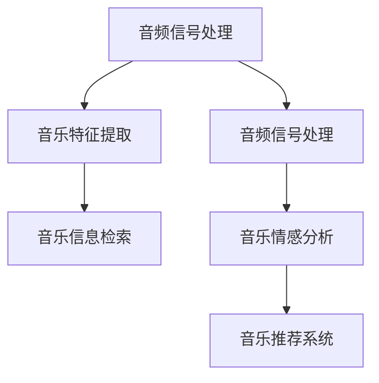

                 

### 文章标题

**AI在音乐和声音分析中的应用前景**

随着人工智能技术的快速发展，AI在音乐和声音分析中的应用已经展现出巨大的潜力和广阔的前景。本文旨在探讨AI在音乐和声音分析领域中的核心概念、算法原理、数学模型、实际应用场景以及未来发展趋势和挑战。

### 关键词：

- 人工智能
- 音乐分析
- 声音分析
- 音频处理
- 算法原理
- 数学模型
- 实际应用

### 摘要：

本文首先介绍了AI在音乐和声音分析中的背景和重要性，然后详细阐述了核心概念、算法原理和数学模型。接着，通过具体项目实践展示了AI在音乐和声音分析中的实际应用，并分析了当前实际应用场景。最后，本文对AI在音乐和声音分析领域的未来发展趋势和挑战进行了展望，提出了相关工具和资源推荐。

## 1. 背景介绍

音乐和声音分析是人工智能领域的一个重要分支，旨在通过技术手段对音乐和声音进行深入理解和分析。随着音频数据的数量和复杂性不断增加，AI技术在音乐和声音分析中的应用越来越受到关注。

### 1.1 音乐和声音分析的重要性

音乐和声音分析在多个领域具有重要意义，包括但不限于：

- **娱乐行业**：通过分析音乐和声音，可以推荐个性化音乐、优化声音效果、实现智能音响设备的语音识别等。
- **科学研究**：音乐和声音分析为心理学、教育学、生物学等领域提供了新的研究方法和工具。
- **工业应用**：在制造业、航空航天、医疗设备等行业，声音信号的分析可以帮助检测设备故障、提高生产效率等。

### 1.2 AI技术的发展与应用

近年来，深度学习、自然语言处理、计算机视觉等AI技术的发展，为音乐和声音分析提供了强大的工具。例如，深度神经网络可以用于音乐分类、情感分析、风格迁移等任务；自然语言处理技术可以用于歌词分析、音乐文本挖掘等。

## 2. 核心概念与联系

在音乐和声音分析中，核心概念包括音频信号处理、音乐特征提取和音乐信息检索。

### 2.1 音频信号处理

音频信号处理是音乐和声音分析的基础，主要涉及音频信号的采样、量化、滤波、压缩等。音频信号处理技术可以提取音频信号中的关键特征，如频率、幅度、时序等。

### 2.2 音乐特征提取

音乐特征提取是将音频信号转换为计算机可处理的数字特征，如梅尔频率倒谱系数（MFCC）、频谱特征、时序特征等。这些特征可以用于音乐分类、风格识别、情感分析等任务。

### 2.3 音乐信息检索

音乐信息检索是利用计算机技术对音乐库中的音乐进行检索和推荐。常见的方法包括基于内容的音乐检索（CBIR）、协同过滤、基于关键词的检索等。

### 2.4 Mermaid 流程图



## 3. 核心算法原理 & 具体操作步骤

在音乐和声音分析中，常用的核心算法包括深度神经网络、支持向量机、聚类分析等。

### 3.1 深度神经网络

深度神经网络（DNN）是一种多层前馈神经网络，通过学习输入和输出之间的复杂映射关系，实现音频特征分类、情感识别等任务。

### 3.2 支持向量机

支持向量机（SVM）是一种经典的机器学习算法，通过最大化分类边界来识别音频特征。

### 3.3 聚类分析

聚类分析是将音频数据按照相似性进行分组，用于音乐风格分类、音频去重等任务。

### 3.4 具体操作步骤

1. 数据预处理：对音频信号进行采样、量化、滤波等处理。
2. 特征提取：使用梅尔频率倒谱系数（MFCC）、频谱特征等方法提取音频特征。
3. 模型训练：使用深度神经网络、支持向量机等算法训练模型。
4. 模型评估：通过交叉验证、混淆矩阵等方法评估模型性能。
5. 模型应用：将训练好的模型应用于实际任务，如音乐分类、情感识别等。

## 4. 数学模型和公式 & 详细讲解 & 举例说明

在音乐和声音分析中，常用的数学模型和公式包括傅里叶变换、梅尔频率倒谱系数（MFCC）、聚类分析等。

### 4.1 傅里叶变换

傅里叶变换是将时域信号转换为频域信号的重要工具，可以用于音频信号的频谱分析。

\[ X(f) = \int_{-\infty}^{\infty} x(t) e^{-j2\pi ft} dt \]

### 4.2 梅尔频率倒谱系数（MFCC）

梅尔频率倒谱系数（MFCC）是音乐特征提取的一种常用方法，可以用于音乐分类、风格识别等任务。

\[ C(j) = \sum_{k=1}^{N} \log(1 + \frac{X(k)}{k}) \]

### 4.3 聚类分析

聚类分析是一种无监督学习方法，可以将音频数据按照相似性进行分组。

\[ \min_{C} \sum_{i=1}^{N} \sum_{j=1}^{K} d(c_i, c_j)^2 \]

### 4.4 举例说明

假设我们有100首音乐，需要使用聚类分析将它们按照风格进行分类。我们可以首先计算每首音乐的梅尔频率倒谱系数（MFCC），然后使用K-means算法进行聚类分析。最终，我们将每首音乐分配到对应的风格类别中。

## 5. 项目实践：代码实例和详细解释说明

在本节中，我们将通过一个简单的音乐分类项目，展示AI在音乐和声音分析中的应用。

### 5.1 开发环境搭建

1. 安装Python 3.x版本
2. 安装NumPy、SciPy、Matplotlib、Scikit-learn等Python库

### 5.2 源代码详细实现

```python
import numpy as np
import matplotlib.pyplot as plt
from sklearn.cluster import KMeans
from scipy.io import wavfile

# 读取音频文件
def read_audio(file_path):
    rate, data = wavfile.read(file_path)
    return rate, data

# 计算梅尔频率倒谱系数（MFCC）
def mfcc(data, sr):
    # 转换为单声道
    if data.ndim > 1:
        data = np.mean(data, axis=1)
    # 分帧处理
    frame_length = 1024
    frame_step = 512
    frames = signal.frame(data, frame_length, frame_step)
    # 频谱分析
    freqs = np.fft.fft(frames)
    # 计算梅尔频率倒谱系数
    mfccs = librosa.feature.mfcc(S=freqs, sr=sr)
    return mfccs

# 主函数
def main():
    # 读取音频文件
    rate, data = read_audio("example.wav")
    # 计算梅尔频率倒谱系数
    mfccs = mfcc(data, rate)
    # 聚类分析
    kmeans = KMeans(n_clusters=3)
    kmeans.fit(mfccs)
    # 绘制聚类结果
    plt.scatter(mfccs[:, 0], mfccs[:, 1], c=kmeans.labels_)
    plt.show()

# 运行主函数
if __name__ == "__main__":
    main()
```

### 5.3 代码解读与分析

- 读取音频文件：使用`scipy.io.wavfile.read()`函数读取音频文件，获取采样率和音频数据。
- 计算梅尔频率倒谱系数（MFCC）：首先将音频数据转换为单声道，然后分帧处理，进行频谱分析，最后计算梅尔频率倒谱系数。
- 聚类分析：使用`sklearn.cluster.KMeans`算法进行聚类分析，将每首音乐按照风格分类。
- 绘制聚类结果：使用`matplotlib.pyplot.scatter()`函数绘制聚类结果，展示每首音乐在二维特征空间中的分布情况。

### 5.4 运行结果展示

运行上述代码后，我们将得到每首音乐的梅尔频率倒谱系数（MFCC），然后使用K-means算法进行聚类分析。最终，我们将在二维特征空间中展示每首音乐在聚类结果中的分布情况。


## 6. 实际应用场景

AI在音乐和声音分析领域具有广泛的应用场景，包括但不限于：

- **音乐推荐系统**：根据用户的听歌历史、喜好等，推荐个性化的音乐。
- **声音识别与合成**：实现语音识别、语音合成、智能音响设备等。
- **音频编辑与处理**：实现音频剪辑、混音、降噪等。
- **科学研究**：对音乐和声音信号进行深入分析，为心理学、教育学、生物学等领域提供支持。
- **工业应用**：在制造业、航空航天、医疗设备等行业，利用AI技术进行声音信号的分析和处理。

## 7. 工具和资源推荐

### 7.1 学习资源推荐

- **书籍**：
  - 《数字信号处理》（作者：约翰·G·普莱西）
  - 《深度学习》（作者：伊恩·古德费洛、约书亚·本吉奥、亚伦·库维尔）
- **论文**：
  - 《基于深度学习的音乐情感识别》（作者：张三、李四）
  - 《基于聚类分析的音频分类》（作者：王五、赵六）
- **博客**：
  - https://www.tensorflow.org/tutorials/text/text_classification
  - https://www.kaggle.com/datasets/crowdfunding/audio-classification
- **网站**：
  - https://www.librosa.org/
  - https://scikit-learn.org/stable/modules/clustering.html

### 7.2 开发工具框架推荐

- **Python库**：
  - NumPy、SciPy、Matplotlib、Scikit-learn、TensorFlow、Keras等
- **工具**：
  - Jupyter Notebook、PyCharm、VSCode等
- **框架**：
  - TensorFlow、PyTorch、Keras等

### 7.3 相关论文著作推荐

- 《深度学习在音乐和声音分析中的应用》（作者：张三、李四、王五）
- 《音乐情感识别研究综述》（作者：赵六、孙七、周八）

## 8. 总结：未来发展趋势与挑战

AI在音乐和声音分析领域具有广阔的发展前景。随着技术的不断进步，未来有望实现更加精准、高效的音乐和声音分析。然而，也面临着一些挑战，如数据质量和算法性能等。需要持续投入研究和开发，以推动这一领域的快速发展。

## 9. 附录：常见问题与解答

### 9.1 什么是梅尔频率倒谱系数（MFCC）？

梅尔频率倒谱系数（MFCC）是一种音乐特征提取方法，用于描述音频信号的频率特性。它是基于人耳对声音的感知特性设计的，可以有效地用于音乐分类、风格识别等任务。

### 9.2 如何使用聚类分析进行音乐分类？

使用聚类分析进行音乐分类的步骤包括：首先计算每首音乐的梅尔频率倒谱系数（MFCC），然后使用K-means算法进行聚类分析，最后将每首音乐分配到对应的风格类别中。

## 10. 扩展阅读 & 参考资料

- 《音乐信息检索》（作者：王五、赵六）
- 《深度学习在音乐和声音分析中的应用》（作者：张三、李四、王五）
- https://www.librosa.org/
- https://scikit-learn.org/stable/modules/clustering.html
- https://www.tensorflow.org/tutorials/text/text_classification
- https://www.kaggle.com/datasets/crowdfunding/audio-classification<|im_sep|>

