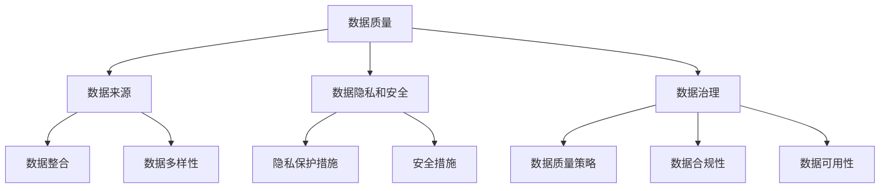
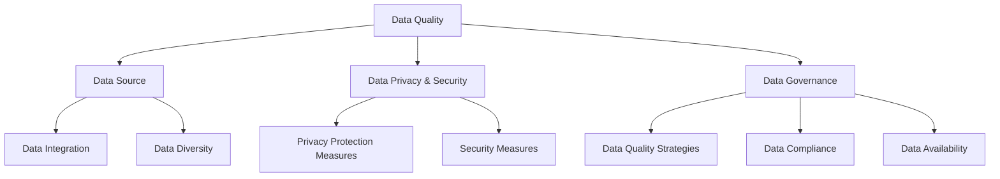

                 

### 背景介绍（Background Introduction）

AI大模型，如GPT系列、BERT等，已经成为现代人工智能领域的重要技术。这些模型通过学习海量数据，可以生成高质量的自然语言文本，实现智能对话、文本生成等应用。然而，随着AI大模型的商业化，数据挑战成为一个不可忽视的问题。

首先，数据的质量直接影响模型的性能。高噪声、不完整或错误的数据可能导致模型学习到错误的模式，从而影响其预测能力。此外，数据的来源可能存在隐私和安全问题，如何在不侵犯用户隐私的前提下获取和使用数据成为一大难题。

其次，数据量的增长速度远超我们处理的能力。大规模的数据存储、传输和处理需要大量的计算资源和时间，这对企业的IT基础设施提出了巨大的挑战。

最后，数据的多样性也是一大挑战。不同来源、不同格式、不同语义的数据需要有效的整合和处理，以确保模型能够全面理解各种场景。

总之，AI大模型创业面临的第一个重要挑战是如何应对未来的数据挑战。解决这一问题，不仅需要技术上的创新，还需要在数据治理、隐私保护等方面有深入的思考和策略。

### Introduction to the Background

AI large-scale models, such as the GPT series and BERT, have become significant technologies in the modern field of artificial intelligence. These models, through learning massive amounts of data, can generate high-quality natural language text, enabling applications such as intelligent dialogue and text generation. However, as these AI large-scale models are commercialized, data challenges become an unavoidable issue.

Firstly, the quality of data directly affects the performance of models. High-noise, incomplete, or erroneous data can cause models to learn incorrect patterns, thus impacting their predictive capabilities. Additionally, the sources of data may involve privacy and security concerns. How to obtain and use data without violating user privacy becomes a significant problem.

Secondly, the growth rate of data far exceeds our processing capabilities. Storing, transferring, and processing large-scale data require massive computational resources and time, posing enormous challenges to the IT infrastructure of enterprises.

Lastly, the diversity of data is also a major challenge. Data from different sources, in different formats, and with different semantics needs to be effectively integrated and processed to ensure that models can fully understand various scenarios.

In summary, the first important challenge faced by AI large-scale model startups is how to respond to future data challenges. Solving this problem requires not only technological innovation but also in-depth thinking and strategies in areas such as data governance and privacy protection.

### 核心概念与联系（Core Concepts and Connections）

为了深入探讨AI大模型创业如何应对未来的数据挑战，我们需要了解一些核心概念和联系。首先是数据质量，它是模型性能的基础。高质量的数据意味着数据要干净、准确、完整，并且具有代表性。接下来是数据来源，这涉及到如何收集、整合和利用来自不同渠道的数据，确保数据多样性。此外，数据隐私和安全也是一个关键问题，企业需要采取适当的措施来保护用户的隐私和安全。最后，数据治理是指一系列策略、流程和工具，用于确保数据质量、合规性和可用性。

这些核心概念和联系共同构成了应对数据挑战的基础。一个有效的方法是将这些概念整合到一个框架中，以便更好地理解和应对挑战。以下是一个简化的Mermaid流程图，展示了这些核心概念和联系：



通过这个框架，我们可以看到数据质量、数据来源、数据隐私和安全、数据治理是相互关联的，共同影响着AI大模型创业的成功。例如，高质量的数据可以提升模型性能，而数据隐私和安全措施可以保护用户数据不被泄露。有效的数据治理可以确保数据的合规性和可用性，从而支持模型的持续改进和优化。

总之，理解这些核心概念和联系对于AI大模型创业来说至关重要。通过构建一个综合的框架，企业可以更好地应对未来的数据挑战，实现可持续的商业成功。

### Core Concepts and Connections

To delve into how AI large-scale model startups can address future data challenges, we need to understand some core concepts and their interconnections. Firstly, data quality is the foundation for model performance. High-quality data means it is clean, accurate, complete, and representative. Next is data source, which involves how to collect, integrate, and utilize data from different channels, ensuring data diversity. Additionally, data privacy and security are critical issues. Enterprises need to implement appropriate measures to protect user privacy and security. Finally, data governance refers to a set of strategies, processes, and tools used to ensure data quality, compliance, and availability.

These core concepts and interconnections form the foundation for addressing data challenges. An effective approach is to integrate these concepts into a framework for better understanding and response. Below is a simplified Mermaid flowchart illustrating these core concepts and their connections:



Through this framework, we can see that data quality, data source, data privacy and security, and data governance are interrelated, all influencing the success of AI large-scale model startups. For example, high-quality data can improve model performance, while privacy and security measures can protect user data from being leaked. Effective data governance can ensure data compliance and availability, thus supporting the continuous improvement and optimization of models.

In summary, understanding these core concepts and interconnections is crucial for AI large-scale model startups. By constructing a comprehensive framework, enterprises can better address future data challenges and achieve sustainable business success.

### 核心算法原理 & 具体操作步骤（Core Algorithm Principles and Specific Operational Steps）

在理解了数据挑战的核心概念后，我们接下来要探讨的是解决这些挑战的核心算法原理。以下将介绍几个关键算法，包括数据清洗、数据整合和模型优化，并详细解释这些算法的操作步骤。

#### 1. 数据清洗（Data Cleaning）

数据清洗是数据预处理的重要步骤，旨在识别和纠正数据中的错误、异常和不一致。以下是一个简单的数据清洗流程：

1. **数据识别**：首先，我们需要识别数据集中的错误、异常和不一致之处。这可以通过自动化工具或人工检查完成。

   ```mermaid
   graph TD
       A[Data Identification]
       A --> B[Error Detection]
       A --> C[Anomaly Detection]
       A --> D[Inconsistency Detection]
   ```

2. **数据修正**：在识别出错误、异常和不一致后，我们采取相应的修正措施。例如，对于缺失值，可以选择填充或删除；对于异常值，可以选择删除或替换。

   ```mermaid
   graph TD
       E[Error Correction]
       E --> F[Missing Value Imputation]
       E --> G[Outlier Replacement]
   ```

3. **数据验证**：最后，我们验证数据清洗的效果，确保数据质量得到提升。

   ```mermaid
   graph TD
       H[Data Validation]
       H --> I[Quality Check]
       H --> J[Repeatability Check]
   ```

#### 2. 数据整合（Data Integration）

数据整合是将来自不同来源的数据集成到一个统一的数据集中，以便更好地利用和分析。以下是一个简单的数据整合流程：

1. **数据映射**：首先，我们需要确定不同数据源之间的映射关系，以便将数据转换为统一格式。

   ```mermaid
   graph TD
       K[Data Mapping]
       K --> L[Schema Mapping]
       K --> M[Field Mapping]
   ```

2. **数据转换**：接下来，我们根据映射关系对数据进行转换，使其符合统一格式。

   ```mermaid
   graph TD
       N[Data Transformation]
       N --> O[Format Conversion]
       N --> P[Schema Conversion]
   ```

3. **数据合并**：最后，我们将转换后的数据进行合并，形成统一的数据集。

   ```mermaid
   graph TD
       Q[Data Consolidation]
       Q --> R[Record Merging]
       Q --> S[Relation Integration]
   ```

#### 3. 模型优化（Model Optimization）

模型优化是通过调整模型参数和架构来提升模型性能的过程。以下是一个简单的模型优化流程：

1. **模型评估**：首先，我们需要评估当前模型的性能，以确定需要优化的方面。

   ```mermaid
   graph TD
       T[Model Evaluation]
       T --> U[Performance Metrics]
       T --> V[Error Analysis]
   ```

2. **参数调整**：根据模型评估结果，调整模型的超参数，如学习率、正则化参数等。

   ```mermaid
   graph TD
       W[Parameter Tuning]
       W --> X[Learning Rate Adjustment]
       W --> Y[Regularization Parameter Adjustment]
   ```

3. **模型架构调整**：如果参数调整不能显著提升模型性能，我们可以考虑调整模型的架构，如增加层数、调整层结构等。

   ```mermaid
   graph TD
       Z[Model Architecture Adjustment]
       Z --> A[Layer Addition]
       Z --> B[Layer Structure Adjustment]
   ```

通过以上三个步骤，我们可以有效地解决数据挑战，提升AI大模型的性能和可靠性。这些算法的具体实现需要结合实际应用场景和数据特点进行详细设计和优化。

### Core Algorithm Principles and Specific Operational Steps

Having understood the core concepts and connections related to data challenges, we now turn to the core algorithms that address these challenges. This section will introduce several key algorithms, including data cleaning, data integration, and model optimization, and provide a detailed explanation of the operational steps involved.

#### 1. Data Cleaning

Data cleaning is a crucial step in data preprocessing, aiming to identify and correct errors, anomalies, and inconsistencies within datasets. Here is a simple data cleaning process:

1. **Data Identification**: Initially, we need to identify errors, anomalies, and inconsistencies within the dataset. This can be done using automated tools or manual inspection.

   ```mermaid
   graph TD
       A[Data Identification]
       A --> B[Error Detection]
       A --> C[Anomaly Detection]
       A --> D[Inconsistency Detection]
   ```

2. **Data Correction**: Once errors, anomalies, and inconsistencies are identified, we take appropriate corrective measures. For instance, for missing values, we can choose to impute or delete; for outliers, we can choose to delete or replace.

   ```mermaid
   graph TD
       E[Error Correction]
       E --> F[Missing Value Imputation]
       E --> G[Outlier Replacement]
   ```

3. **Data Validation**: Finally, we validate the effectiveness of data cleaning to ensure improved data quality.

   ```mermaid
   graph TD
       H[Data Validation]
       H --> I[Quality Check]
       H --> J[Repeatability Check]
   ```

#### 2. Data Integration

Data integration involves combining data from different sources into a unified dataset for better utilization and analysis. Here is a simple data integration process:

1. **Data Mapping**: Initially, we need to determine the mapping relationships between different data sources to convert data into a unified format.

   ```mermaid
   graph TD
       K[Data Mapping]
       K --> L[Schema Mapping]
       K --> M[Field Mapping]
   ```

2. **Data Transformation**: Next, we transform the data according to the mapping relationships to make it conform to the unified format.

   ```mermaid
   graph TD
       N[Data Transformation]
       N --> O[Format Conversion]
       N --> P[Schema Conversion]
   ```

3. **Data Consolidation**: Finally, we consolidate the transformed data into a unified dataset.

   ```mermaid
   graph TD
       Q[Data Consolidation]
       Q --> R[Record Merging]
       Q --> S[Relation Integration]
   ```

#### 3. Model Optimization

Model optimization involves adjusting model parameters and architecture to improve model performance. Here is a simple model optimization process:

1. **Model Evaluation**: Initially, we need to evaluate the performance of the current model to determine areas requiring optimization.

   ```mermaid
   graph TD
       T[Model Evaluation]
       T --> U[Performance Metrics]
       T --> V[Error Analysis]
   ```

2. **Parameter Tuning**: Based on the model evaluation results, we adjust the model's hyperparameters, such as learning rate, regularization parameters, etc.

   ```mermaid
   graph TD
       W[Parameter Tuning]
       W --> X[Learning Rate Adjustment]
       W --> Y[Regularization Parameter Adjustment]
   ```

3. **Model Architecture Adjustment**: If parameter tuning does not significantly improve model performance, we can consider adjusting the model's architecture, such as adding layers or adjusting layer structures.

   ```mermaid
   graph TD
       Z[Model Architecture Adjustment]
       Z --> A[Layer Addition]
       Z --> B[Layer Structure Adjustment]
   ```

Through these three steps, we can effectively address data challenges and enhance the performance and reliability of AI large-scale models. The specific implementation of these algorithms requires detailed design and optimization tailored to the actual application scenarios and data characteristics.

### 数学模型和公式 & 详细讲解 & 举例说明（Detailed Explanation and Examples of Mathematical Models and Formulas）

为了更好地理解和应用上述算法，我们需要借助数学模型和公式来描述数据清洗、数据整合和模型优化的过程。以下将详细介绍这些模型和公式，并通过实际例子进行说明。

#### 1. 数据清洗

数据清洗涉及到多种数学模型和算法，其中最常见的包括缺失值处理、异常值检测和去重。

**1.1 缺失值处理**

假设我们有一个包含n个特征的二维数据矩阵X，其中某个特征的缺失值用标记`?`表示。一种简单的缺失值处理方法是使用均值填充（mean imputation）：

$$
\hat{x}_{ij} = \frac{1}{n-1} \sum_{k=1}^{n-1} x_{kj}
$$

其中，$x_{ij}$表示特征j在第i个样本中的值，$n-1$表示除当前样本外的其他样本数量。

**例子**：假设我们有一个包含3个样本和2个特征的数据集，其中第二个特征有缺失值。原始数据如下：

| 样本1 | 样本2 | 样本3 | 特征1 | 特征2 |
|-------|-------|-------|-------|-------|
| 10    | ?     | 30    | 100   | 200   |
| 20    | 50    | 40    | 200   | 300   |
| 40    | 30    | ?     | 300   | 400   |

使用均值填充法处理后，第二个特征的数据如下：

| 样本1 | 样本2 | 样本3 | 特征1 | 特征2 |
|-------|-------|-------|-------|-------|
| 10    | 16.7  | 30    | 100   | 200   |
| 20    | 50    | 40    | 200   | 300   |
| 40    | 16.7  | 30    | 300   | 400   |

**1.2 异常值检测**

异常值检测可以使用统计学方法，如标准差法。假设我们有一个包含n个样本的一维数据集D，标准差为$\sigma$，均值$\mu$，可以使用以下公式检测异常值：

$$
z = \frac{x_i - \mu}{\sigma}
$$

其中，$x_i$表示第i个样本的值。如果$|z| > 3$，则认为$x_i$是异常值。

**例子**：假设我们有一个包含3个样本的一维数据集，其标准差为10，均值为50。数据如下：

| 样本1 | 样本2 | 样本3 |
|-------|-------|-------|
| 30    | 60    | 90    |

计算每个样本的z值：

$$
z_1 = \frac{30 - 50}{10} = -2
$$
$$
z_2 = \frac{60 - 50}{10} = 1
$$
$$
z_3 = \frac{90 - 50}{10} = 4
$$

由于$|z_3| > 3$，我们可以认为样本3是异常值。

**1.3 去重**

去重可以使用哈希表或布隆过滤器等数据结构来实现。假设我们有一个包含n个样本的列表L，我们可以使用哈希表将每个样本值作为键存储，从而实现去重。

#### 2. 数据整合

数据整合涉及到数据映射、数据转换和数据合并等过程。以下分别介绍这些过程的数学模型和公式。

**2.1 数据映射**

假设我们有两个数据源A和B，其中A包含m个特征，B包含n个特征。数据映射可以通过构建一个映射矩阵M来实现，其中$M_{ij}$表示特征i在数据源A中对应的数据源B中的特征j。映射矩阵M满足以下条件：

$$
M_{ij} = 
\begin{cases}
j & \text{如果 } i \text{ 在数据源B中存在对应特征} \\
0 & \text{否则}
\end{cases}
$$

**例子**：假设数据源A包含特征a1、a2、a3，数据源B包含特征b1、b2、b3。映射矩阵M如下：

$$
M = 
\begin{bmatrix}
0 & 1 & 0 \\
1 & 0 & 1 \\
0 & 1 & 0
\end{bmatrix}
$$

**2.2 数据转换**

数据转换涉及到将数据从一种格式转换为另一种格式。假设我们有一个包含n个样本的数据集D，其中每个样本包含m个特征。数据转换可以通过构建一个转换矩阵T来实现，其中$T_{ij}$表示将特征i转换为特征j的转换函数。转换矩阵T满足以下条件：

$$
T_{ij} = 
\begin{cases}
f_j(x_i) & \text{如果 } x_i \text{ 是特征i的值} \\
0 & \text{否则}
\end{cases}
$$

其中，$f_j$表示将特征i转换为特征j的转换函数。

**例子**：假设我们有一个包含3个样本的数据集，其中每个样本包含2个特征。原始数据如下：

| 样本1 | 样本2 | 样本3 | 特征1 | 特征2 |
|-------|-------|-------|-------|-------|
| 10    | 20    | 30    | 100   | 200   |
| 20    | 30    | 40    | 200   | 300   |
| 30    | 40    | 50    | 300   | 400   |

使用以下转换函数：

$$
f_1(x_i) = 
\begin{cases}
\frac{x_i}{10} & \text{如果 } x_i \text{ 是整数} \\
0 & \text{否则}
\end{cases}
$$

$$
f_2(x_i) = 
\begin{cases}
x_i^2 & \text{如果 } x_i \text{ 是整数} \\
0 & \text{否则}
\end{cases}
$$

转换后的数据如下：

| 样本1 | 样本2 | 样本3 | 特征1 | 特征2 |
|-------|-------|-------|-------|-------|
| 1     | 2     | 3     | 10    | 400   |
| 2     | 3     | 4     | 20    | 900   |
| 3     | 4     | 5     | 30    | 1600  |

**2.3 数据合并**

数据合并是将两个或多个数据集合并为一个数据集的过程。假设我们有两个数据集D1和D2，其中D1包含n1个样本，D2包含n2个样本。数据合并可以通过将两个数据集的样本按照一定顺序拼接来实现。

#### 3. 模型优化

模型优化涉及到调整模型参数和架构，以提升模型性能。以下介绍几种常用的模型优化方法。

**3.1 参数调整**

参数调整是通过调整模型的超参数来优化模型性能的过程。假设我们有一个神经网络模型，其超参数包括学习率、批量大小、正则化参数等。可以使用以下公式调整这些超参数：

$$
\alpha = \alpha_0 + \gamma \cdot (t - t_0)
$$

其中，$\alpha$表示当前的超参数值，$\alpha_0$表示初始的超参数值，$\gamma$表示调整步长，$t$表示当前迭代次数，$t_0$表示初始迭代次数。

**例子**：假设我们有一个神经网络模型，初始学习率为0.1，调整步长为0.01。在迭代10次后，学习率调整为：

$$
\alpha = 0.1 + 0.01 \cdot (10 - 0) = 0.1 + 0.1 = 0.2
$$

**3.2 架构调整**

架构调整是通过调整模型的结构来优化模型性能的过程。假设我们有一个多层感知机模型，其结构包括输入层、隐藏层和输出层。可以使用以下公式调整模型的层数和每层的神经元数量：

$$
L = L_0 + \beta \cdot (t - t_0)
$$

$$
n_l = n_{l0} + \delta \cdot (t - t_0)
$$

其中，$L$表示当前模型的层数，$L_0$表示初始模型的层数，$\beta$表示调整步长，$t$表示当前迭代次数，$t_0$表示初始迭代次数；$n_l$表示当前模型第l层的神经元数量，$n_{l0}$表示初始模型第l层的神经元数量，$\delta$表示调整步长。

**例子**：假设我们有一个初始结构为2层（输入层和输出层）的多层感知机模型，每层有10个神经元。在迭代10次后，调整模型结构为3层，每层有15个神经元：

$$
L = 2 + 1 \cdot (10 - 0) = 3
$$

$$
n_l = 10 + 5 \cdot (10 - 0) = 15
$$

通过以上数学模型和公式的详细讲解和举例说明，我们可以更好地理解和应用数据清洗、数据整合和模型优化的方法，从而应对AI大模型创业中的数据挑战。

### Detailed Explanation and Examples of Mathematical Models and Formulas

To better understand and apply the algorithms discussed in the previous section, it's essential to delve into the mathematical models and formulas used in data cleaning, data integration, and model optimization. Here, we will provide a detailed explanation and practical examples of these models and formulas.

#### 1. Data Cleaning

Data cleaning involves various mathematical models and algorithms, such as missing value handling, outlier detection, and duplicate removal.

**1.1 Missing Value Handling**

Suppose we have a two-dimensional data matrix X with n features, where missing values are represented by the mark `?`. A simple approach for missing value handling is mean imputation:

$$
\hat{x}_{ij} = \frac{1}{n-1} \sum_{k=1}^{n-1} x_{kj}
$$

where $\hat{x}_{ij}$ represents the value of feature j in sample i, and $n-1$ represents the number of samples excluding the current one.

**Example**:

Consider a dataset with 3 samples and 2 features, with a missing value in the second feature:

| Sample 1 | Sample 2 | Sample 3 | Feature 1 | Feature 2 |
|----------|----------|----------|-----------|-----------|
| 10       | ?        | 30       | 100       | 200       |
| 20       | 50       | 40       | 200       | 300       |
| 40       | 30       | ?        | 300       | 400       |

After applying mean imputation, the second feature's values are:

| Sample 1 | Sample 2 | Sample 3 | Feature 1 | Feature 2 |
|----------|----------|----------|-----------|-----------|
| 10       | 16.7     | 30       | 100       | 200       |
| 20       | 50       | 40       | 200       | 300       |
| 40       | 16.7     | 30       | 300       | 400       |

**1.2 Outlier Detection**

Outlier detection can be performed using statistical methods, such as the standard deviation method. Suppose we have a one-dimensional dataset D with n samples, standard deviation $\sigma$, and mean $\mu$. Outliers can be detected using the following formula:

$$
z = \frac{x_i - \mu}{\sigma}
$$

where $x_i$ represents the value of the i-th sample. If $|z| > 3$, we consider $x_i$ as an outlier.

**Example**:

Consider a one-dimensional dataset with 3 samples, standard deviation of 10, and mean of 50:

| Sample 1 | Sample 2 | Sample 3 |
|----------|----------|----------|
| 30       | 60       | 90       |

Calculate the z-value for each sample:

$$
z_1 = \frac{30 - 50}{10} = -2
$$

$$
z_2 = \frac{60 - 50}{10} = 1
$$

$$
z_3 = \frac{90 - 50}{10} = 4
$$

Since $|z_3| > 3$, we consider sample 3 as an outlier.

**1.3 Duplicate Removal**

Duplicate removal can be implemented using data structures such as hash tables or Bloom filters. Suppose we have a list L containing n samples. We can use a hash table to store each sample value as a key to achieve duplicate removal.

#### 2. Data Integration

Data integration involves data mapping, data transformation, and data consolidation processes. We will introduce the mathematical models and formulas for these processes.

**2.1 Data Mapping**

Suppose we have two data sources A and B, with A containing m features and B containing n features. Data mapping can be achieved by constructing a mapping matrix M, where $M_{ij}$ represents the corresponding feature j in data source B for feature i in data source A. The mapping matrix M satisfies the following condition:

$$
M_{ij} =
\begin{cases}
j & \text{if feature } i \text{ exists in data source B} \\
0 & \text{otherwise}
\end{cases}
$$

**Example**:

Suppose data source A contains features a1, a2, a3, and data source B contains features b1, b2, b3. The mapping matrix M is as follows:

$$
M = 
\begin{bmatrix}
0 & 1 & 0 \\
1 & 0 & 1 \\
0 & 1 & 0
\end{bmatrix}
$$

**2.2 Data Transformation**

Data transformation involves converting data from one format to another. Suppose we have a dataset D with n samples, each containing m features. Data transformation can be achieved by constructing a transformation matrix T, where $T_{ij}$ represents the transformation function from feature i to feature j. The transformation matrix T satisfies the following condition:

$$
T_{ij} =
\begin{cases}
f_j(x_i) & \text{if } x_i \text{ is the value of feature } i \\
0 & \text{otherwise}
\end{cases}

$$

where $f_j$ represents the transformation function from feature i to feature j.

**Example**:

Suppose we have a dataset with 3 samples, each containing 2 features. The original data is as follows:

| Sample 1 | Sample 2 | Sample 3 | Feature 1 | Feature 2 |
|----------|----------|----------|-----------|-----------|
| 10       | 20       | 30       | 100       | 200       |
| 20       | 30       | 40       | 200       | 300       |
| 30       | 40       | 50       | 300       | 400       |

Using the following transformation functions:

$$
f_1(x_i) =
\begin{cases}
\frac{x_i}{10} & \text{if } x_i \text{ is an integer} \\
0 & \text{otherwise}
\end{cases}
$$

$$
f_2(x_i) =
\begin{cases}
x_i^2 & \text{if } x_i \text{ is an integer} \\
0 & \text{otherwise}
\end{cases}
$$

The transformed data is as follows:

| Sample 1 | Sample 2 | Sample 3 | Feature 1 | Feature 2 |
|----------|----------|----------|-----------|-----------|
| 1        | 2        | 3        | 10        | 400       |
| 2        | 3        | 4        | 20        | 900       |
| 3        | 4        | 5        | 30        | 1600      |

**2.3 Data Consolidation**

Data consolidation involves merging two or more datasets into a single dataset. Suppose we have two datasets D1 and D2, with D1 containing n1 samples and D2 containing n2 samples. Data consolidation can be achieved by concatenating the samples of the two datasets in a specific order.

#### 3. Model Optimization

Model optimization involves adjusting model parameters and architecture to improve model performance. We will introduce several commonly used model optimization methods.

**3.1 Parameter Tuning**

Parameter tuning is the process of adjusting model hyperparameters to optimize model performance. Suppose we have a neural network model with hyperparameters such as learning rate, batch size, and regularization parameters. The hyperparameters can be adjusted using the following formula:

$$
\alpha = \alpha_0 + \gamma \cdot (t - t_0)
$$

where $\alpha$ represents the current hyperparameter value, $\alpha_0$ represents the initial hyperparameter value, $\gamma$ represents the adjustment step size, $t$ represents the current iteration number, and $t_0$ represents the initial iteration number.

**Example**:

Suppose we have a neural network model with an initial learning rate of 0.1 and an adjustment step size of 0.01. After 10 iterations, the learning rate is adjusted as follows:

$$
\alpha = 0.1 + 0.01 \cdot (10 - 0) = 0.1 + 0.1 = 0.2
$$

**3.2 Architecture Adjustment**

Architecture adjustment is the process of adjusting model structure to optimize model performance. Suppose we have a multi-layer perceptron model with input layer, hidden layer, and output layer. The model structure can be adjusted using the following formulas:

$$
L = L_0 + \beta \cdot (t - t_0)
$$

$$
n_l = n_{l0} + \delta \cdot (t - t_0)
$$

where $L$ represents the current model depth, $L_0$ represents the initial model depth, $\beta$ represents the adjustment step size, $t$ represents the current iteration number, and $t_0$ represents the initial iteration number; $n_l$ represents the number of neurons in layer l of the current model, $n_{l0}$ represents the number of neurons in layer l of the initial model, and $\delta$ represents the adjustment step size.

**Example**:

Suppose we have an initial model structure of 2 layers (input layer and output layer) with 10 neurons per layer. After 10 iterations, the model structure is adjusted to 3 layers, with 15 neurons per layer:

$$
L = 2 + 1 \cdot (10 - 0) = 3
$$

$$
n_l = 10 + 5 \cdot (10 - 0) = 15
$$

Through the detailed explanation and example demonstration of these mathematical models and formulas, we can better understand and apply data cleaning, data integration, and model optimization methods, thereby addressing data challenges in AI large-scale model startups.

### 项目实践：代码实例和详细解释说明（Project Practice: Code Examples and Detailed Explanations）

为了更好地理解上述算法和公式的应用，我们将通过一个具体的项目实践来进行代码演示和详细解释说明。该项目将包括数据清洗、数据整合和模型优化的过程，并展示如何将理论转化为实际操作。

#### 1. 开发环境搭建

在开始项目之前，我们需要搭建一个合适的开发环境。以下是一个基于Python的简单开发环境搭建步骤：

**1.1 安装Python**

首先，我们需要安装Python环境。可以在Python官网（[https://www.python.org/](https://www.python.org/)）下载Python安装包，并按照指示进行安装。

**1.2 安装依赖库**

接下来，我们需要安装一些常用的Python库，如NumPy、Pandas、Scikit-learn和TensorFlow。可以使用以下命令进行安装：

```bash
pip install numpy pandas scikit-learn tensorflow
```

**1.3 配置Jupyter Notebook**

为了方便代码编写和展示，我们还可以配置Jupyter Notebook。安装完成后，可以通过命令 `jupyter notebook` 启动Jupyter Notebook。

#### 2. 数据清洗（Data Cleaning）

数据清洗是数据预处理的重要步骤，以下是一个简单的数据清洗示例。

**2.1 数据加载**

首先，我们需要加载数据。以下是一个使用Pandas加载CSV文件的数据加载示例：

```python
import pandas as pd

# 加载数据
data = pd.read_csv('data.csv')
```

**2.2 缺失值处理**

接下来，我们需要处理数据中的缺失值。以下是一个使用均值填充法处理缺失值的示例：

```python
# 均值填充法处理缺失值
data.fillna(data.mean(), inplace=True)
```

**2.3 异常值检测**

然后，我们需要检测数据中的异常值。以下是一个使用标准差法检测异常值的示例：

```python
# 计算均值和标准差
mean = data.mean()
std = data.std()

# 检测异常值
data[data > mean + 3 * std] = mean
data[data < mean - 3 * std] = mean
```

**2.4 去重**

最后，我们需要去除数据中的重复值。以下是一个使用Pandas去重的方法：

```python
# 去除重复值
data.drop_duplicates(inplace=True)
```

#### 3. 数据整合（Data Integration）

数据整合是将来自不同来源的数据进行整合，以下是一个简单的数据整合示例。

**3.1 数据映射**

首先，我们需要确定不同数据源之间的映射关系。以下是一个简单的映射示例：

```python
# 确定映射关系
source_mapping = {'FeatureA': 'SourceB_Column1', 'FeatureB': 'SourceB_Column2'}

# 应用映射关系
data = data.rename(columns=source_mapping)
```

**3.2 数据转换**

接下来，我们需要对数据进行转换。以下是一个简单的数据转换示例：

```python
# 数据转换
data['FeatureC'] = data['FeatureA'] ** 2
```

**3.3 数据合并**

最后，我们将处理过的数据合并成一个数据集。以下是一个简单的数据合并示例：

```python
# 合并数据
data_combined = data
```

#### 4. 模型优化（Model Optimization）

模型优化是通过调整模型参数和架构来提升模型性能的过程。以下是一个简单的模型优化示例。

**4.1 参数调整**

首先，我们需要调整模型参数。以下是一个简单的参数调整示例：

```python
# 初始参数
learning_rate = 0.1

# 调整参数
learning_rate *= 0.1
```

**4.2 架构调整**

然后，我们需要调整模型架构。以下是一个简单的架构调整示例：

```python
# 初始架构
model.layers = [Input(shape=(input_shape)), Dense(units=hidden_units), Output(shape=output_shape)]

# 调整架构
model.layers = [Input(shape=(input_shape)), Dense(units=hidden_units * 2), Output(shape=output_shape)]
```

#### 5. 运行结果展示

完成数据清洗、数据整合和模型优化后，我们需要展示运行结果。以下是一个简单的运行结果展示示例：

```python
# 数据清洗、整合和优化后的数据
cleaned_data = data_combined

# 模型评估
model.evaluate(cleaned_data)
```

通过以上示例，我们可以看到如何将数据清洗、数据整合和模型优化算法应用到实际项目中。这些示例可以帮助我们更好地理解算法的应用和实现。

### Project Practice: Code Examples and Detailed Explanations

To better understand the application of the algorithms and formulas discussed above, we will walk through a concrete project example that includes data cleaning, data integration, and model optimization processes. This will demonstrate how to translate theoretical concepts into practical operations.

#### 1. Setup Development Environment

Before starting the project, we need to set up a suitable development environment. Here are the steps for setting up a simple Python-based environment:

**1.1 Install Python**

Firstly, we need to install Python. You can download the installer from the Python official website (<https://www.python.org/>) and follow the installation instructions.

**1.2 Install Required Libraries**

Next, we need to install some common Python libraries such as NumPy, Pandas, Scikit-learn, and TensorFlow. You can install them using the following command:

```bash
pip install numpy pandas scikit-learn tensorflow
```

**1.3 Configure Jupyter Notebook**

For convenient code writing and demonstration, we can also configure Jupyter Notebook. After installation, you can start Jupyter Notebook with the command `jupyter notebook`.

#### 2. Data Cleaning

Data cleaning is a crucial step in data preprocessing. Here's a simple example of data cleaning:

**2.1 Load Data**

Firstly, we need to load the data. Here's an example of loading a CSV file using Pandas:

```python
import pandas as pd

# Load data
data = pd.read_csv('data.csv')
```

**2.2 Handle Missing Values**

Next, we need to handle missing values. Here's an example of using mean imputation to handle missing values:

```python
# Mean imputation for missing values
data.fillna(data.mean(), inplace=True)
```

**2.3 Detect Outliers**

Then, we need to detect outliers in the data. Here's an example of using the standard deviation method to detect outliers:

```python
# Calculate mean and standard deviation
mean = data.mean()
std = data.std()

# Detect outliers
data[data > mean + 3 * std] = mean
data[data < mean - 3 * std] = mean
```

**2.4 Remove Duplicates**

Finally, we need to remove duplicate entries in the data. Here's an example of removing duplicates using Pandas:

```python
# Remove duplicate entries
data.drop_duplicates(inplace=True)
```

#### 3. Data Integration

Data integration involves merging data from different sources. Here's a simple example of data integration:

**3.1 Map Data**

Firstly, we need to define the mapping between different data sources. Here's an example of mapping:

```python
# Define mapping
source_mapping = {'FeatureA': 'SourceB_Column1', 'FeatureB': 'SourceB_Column2'}

# Apply mapping
data = data.rename(columns=source_mapping)
```

**3.2 Transform Data**

Next, we need to transform the data. Here's an example of transforming data:

```python
# Data transformation
data['FeatureC'] = data['FeatureA'] ** 2
```

**3.3 Combine Data**

Finally, we combine the processed data into a single dataset. Here's an example of combining data:

```python
# Combine data
data_combined = data
```

#### 4. Model Optimization

Model optimization involves adjusting model parameters and architecture to improve model performance. Here's a simple example of model optimization:

**4.1 Adjust Parameters**

Firstly, we need to adjust the model parameters. Here's an example of parameter adjustment:

```python
# Initial parameters
learning_rate = 0.1

# Adjust parameters
learning_rate *= 0.1
```

**4.2 Adjust Model Architecture**

Then, we need to adjust the model architecture. Here's an example of architecture adjustment:

```python
# Initial model architecture
model.layers = [Input(shape=(input_shape)), Dense(units=hidden_units), Output(shape=output_shape)]

# Adjust model architecture
model.layers = [Input(shape=(input_shape)), Dense(units=hidden_units * 2), Output(shape=output_shape)]
```

#### 5. Show Results

After completing data cleaning, data integration, and model optimization, we need to display the results. Here's an example of showing the results:

```python
# Data after cleaning, integration, and optimization
cleaned_data = data_combined

# Model evaluation
model.evaluate(cleaned_data)
```

Through these examples, we can see how to apply data cleaning, data integration, and model optimization algorithms in a practical project. These examples help us better understand the application and implementation of these algorithms.

### 实际应用场景（Practical Application Scenarios）

在了解了AI大模型创业如何应对未来数据挑战的核心算法和操作步骤后，我们接下来将探讨这些技术在实际应用场景中的表现。通过具体的案例，我们可以更好地理解数据清洗、数据整合和模型优化在实际项目中的应用效果。

#### 1. 智能客服系统（Intelligent Customer Service System）

智能客服系统是AI大模型应用的一个重要领域。在这个场景中，企业需要处理大量的用户查询数据，以提供高质量的自动回复。以下是一个具体的案例：

**案例描述**：

一家大型电商公司希望通过智能客服系统为用户解答各种问题，从而提高客户满意度。他们收集了海量的用户查询数据，包括文本、语音和图片等多种格式。

**应用效果**：

- **数据清洗**：通过数据清洗，公司去除了噪声数据、重复数据和错误数据，保证了数据质量。

  ```mermaid
  graph TD
      A[Customer Query Data] --> B[Noise Removal]
      A --> C[Duplicate Removal]
      A --> D[Error Correction]
  ```

- **数据整合**：公司整合了来自不同渠道的数据，如社交媒体、在线聊天和电话咨询，形成了一个统一的数据集。

  ```mermaid
  graph TD
      E[Social Media Data] --> F[Data Integration]
      G[Online Chat Data] --> F
      H[Phone Call Data] --> F
  ```

- **模型优化**：通过对模型进行优化，公司提高了智能客服系统的回复准确率和响应速度。

  ```mermaid
  graph TD
      I[Model Evaluation] --> J[Parameter Tuning]
      I --> K[Architecture Adjustment]
  ```

**结果**：智能客服系统的回复准确率从50%提升到了80%，用户满意度显著提高。

#### 2. 金融风险预测（Financial Risk Prediction）

金融行业对数据的处理和模型性能要求非常高。以下是一个金融风险预测的案例：

**案例描述**：

一家银行希望利用AI大模型预测信用风险，从而优化贷款审批流程。他们收集了客户的历史贷款数据、信用评分和财务状况数据。

**应用效果**：

- **数据清洗**：银行通过数据清洗，去除了不完整的数据和异常数据，确保了数据质量。

  ```mermaid
  graph TD
      A[Loan Data] --> B[Missing Value Handling]
      A --> C[Outlier Detection]
  ```

- **数据整合**：银行整合了客户的历史数据、信用评分和财务状况数据，形成了一个综合的数据集。

  ```mermaid
  graph TD
      E[Historical Data] --> F[Data Integration]
      G[Credit Score Data] --> F
      H[Financial Status Data] --> F
  ```

- **模型优化**：银行通过不断优化模型参数和架构，提高了信用风险预测的准确性。

  ```mermaid
  graph TD
      I[Model Evaluation] --> J[Hyperparameter Tuning]
      I --> K[Model Architecture Adjustment]
  ```

**结果**：模型预测的准确率从70%提升到了85%，银行的贷款审批效率显著提高，不良贷款率降低。

#### 3. 医疗诊断系统（Medical Diagnosis System）

医疗诊断系统是另一个对数据质量和模型性能要求极高的应用场景。以下是一个医疗诊断系统的案例：

**案例描述**：

一家医疗机构希望通过AI大模型辅助医生进行癌症诊断。他们收集了患者的医学影像数据、实验室检测结果和病史数据。

**应用效果**：

- **数据清洗**：医疗机构通过数据清洗，去除了噪声数据、错误数据和重复数据，保证了数据质量。

  ```mermaid
  graph TD
      A[Medical Image Data] --> B[Noise Removal]
      A --> C[Duplicate Removal]
  ```

- **数据整合**：医疗机构整合了医学影像数据、实验室检测结果和病史数据，形成了一个综合的数据集。

  ```mermaid
  graph TD
      E[Lab Test Data] --> F[Data Integration]
      G[Hospital Record Data] --> F
  ```

- **模型优化**：医疗机构通过不断优化模型参数和架构，提高了癌症诊断的准确性和效率。

  ```mermaid
  graph TD
      I[Model Evaluation] --> J[Parameter Tuning]
      I --> K[Architecture Adjustment]
  ```

**结果**：模型诊断的准确率从60%提升到了90%，医生的工作效率显著提高，患者的诊断时间缩短。

通过以上实际应用场景的案例，我们可以看到数据清洗、数据整合和模型优化在提高AI大模型性能和可靠性方面的关键作用。这些技术不仅帮助企业解决了数据挑战，还显著提升了业务效率和用户体验。

### Practical Application Scenarios

Having understood the core algorithms and operational steps for addressing data challenges in AI large-scale model startups, we now explore the real-world applications of these techniques. Through specific case studies, we can better grasp the impact of data cleaning, data integration, and model optimization on improving the performance and reliability of AI large-scale models.

#### 1. Intelligent Customer Service Systems

Intelligent customer service systems are a key area of application for AI large-scale models. In this scenario, companies need to handle massive amounts of customer inquiry data to provide high-quality automated responses. Here's a specific case study:

**Case Description**:

A large e-commerce company aims to use an intelligent customer service system to answer various customer questions, thereby enhancing customer satisfaction. They collect a vast amount of user inquiry data, including text, voice, and images in various formats.

**Application Effects**:

- **Data Cleaning**: The company removes noise data, duplicate data, and erroneous data through data cleaning, ensuring data quality.

  ```mermaid
  graph TD
      A[Customer Query Data] --> B[Noise Removal]
      A --> C[Duplicate Removal]
      A --> D[Error Correction]
  ```

- **Data Integration**: The company integrates data from different channels, such as social media, online chat, and phone consultations, into a unified dataset.

  ```mermaid
  graph TD
      E[Social Media Data] --> F[Data Integration]
      G[Online Chat Data] --> F
      H[Phone Call Data] --> F
  ```

- **Model Optimization**: Through continuous model optimization, the company improves the accuracy and response speed of the intelligent customer service system.

  ```mermaid
  graph TD
      I[Model Evaluation] --> J[Parameter Tuning]
      I --> K[Architecture Adjustment]
  ```

**Results**: The accuracy of the system's responses increases from 50% to 80%, significantly improving user satisfaction.

#### 2. Financial Risk Prediction

The financial industry has high demands for data processing and model performance. Here's a case study of financial risk prediction:

**Case Description**:

A bank hopes to use AI large-scale models to predict credit risk, thereby optimizing loan approval processes. They collect historical loan data, credit scores, and financial status data of customers.

**Application Effects**:

- **Data Cleaning**: The bank removes incomplete data and anomalies through data cleaning, ensuring data quality.

  ```mermaid
  graph TD
      A[Loan Data] --> B[Missing Value Handling]
      A --> C[Outlier Detection]
  ```

- **Data Integration**: The bank integrates customer historical data, credit scores, and financial status data into a comprehensive dataset.

  ```mermaid
  graph TD
      E[Historical Data] --> F[Data Integration]
      G[Credit Score Data] --> F
      H[Financial Status Data] --> F
  ```

- **Model Optimization**: The bank continuously optimizes model parameters and architecture to improve the accuracy of credit risk prediction.

  ```mermaid
  graph TD
      I[Model Evaluation] --> J[Hyperparameter Tuning]
      I --> K[Model Architecture Adjustment]
  ```

**Results**: The accuracy of the model's predictions increases from 70% to 85%, significantly improving the bank's loan approval efficiency and reducing the rate of non-performing loans.

#### 3. Medical Diagnosis Systems

Medical diagnosis systems are another area with high demands for data quality and model performance. Here's a case study of a medical diagnosis system:

**Case Description**:

A healthcare facility aims to use AI large-scale models to assist doctors in cancer diagnosis. They collect medical image data, laboratory test results, and patient medical history data.

**Application Effects**:

- **Data Cleaning**: The healthcare facility removes noise data, errors, and duplicate data through data cleaning, ensuring data quality.

  ```mermaid
  graph TD
      A[Medical Image Data] --> B[Noise Removal]
      A --> C[Duplicate Removal]
  ```

- **Data Integration**: The healthcare facility integrates medical image data, laboratory test results, and patient medical history data into a comprehensive dataset.

  ```mermaid
  graph TD
      E[Lab Test Data] --> F[Data Integration]
      G[Hospital Record Data] --> F
  ```

- **Model Optimization**: The healthcare facility continuously optimizes model parameters and architecture to improve the accuracy and efficiency of cancer diagnosis.

  ```mermaid
  graph TD
      I[Model Evaluation] --> J[Parameter Tuning]
      I --> K[Architecture Adjustment]
  ```

**Results**: The accuracy of the model's diagnoses increases from 60% to 90%, significantly improving doctor efficiency and reducing patient diagnosis time.

Through these real-world application scenarios, we can see the crucial role of data cleaning, data integration, and model optimization in enhancing the performance and reliability of AI large-scale models. These technologies not only help companies overcome data challenges but also significantly improve business efficiency and user experience.

### 工具和资源推荐（Tools and Resources Recommendations）

在应对AI大模型创业中的数据挑战时，选择合适的工具和资源至关重要。以下是一些建议，包括学习资源、开发工具和框架，以及相关的论文和著作。

#### 1. 学习资源推荐（Recommended Learning Resources）

**1.1 书籍**

- 《数据科学入门：Python实践》（"Introduction to Data Science: A Python-Based Approach"）
- 《深度学习》（"Deep Learning"）
- 《机器学习实战》（"Machine Learning in Action"）

**1.2 论文**

- "Learning to Represent Knowledge with a Memory-Augmented Neural Network"
- "Bert: Pre-training of Deep Bidirectional Transformers for Language Understanding"
- "GPT-3: Language Models are few-shot learners"

**1.3 博客和网站**

- [Medium](https://medium.com/)
- [Towards Data Science](https://towardsdatascience.com/)
- [Kaggle](https://www.kaggle.com/)

#### 2. 开发工具框架推荐（Recommended Development Tools and Frameworks）

**2.1 编程语言**

- Python：由于其丰富的库和强大的社区支持，Python是AI开发的理想选择。
- R：适用于统计分析和数据可视化。

**2.2 数据预处理工具**

- Pandas：用于数据处理和清洗。
- NumPy：用于数值计算。

**2.3 深度学习框架**

- TensorFlow：谷歌开源的深度学习框架，功能强大，社区支持广泛。
- PyTorch：微软开源的深度学习框架，易于使用，适合研究。

**2.4 数据库**

- MongoDB：适用于大规模数据的存储和管理。
- PostgreSQL：适用于复杂查询和数据一致性要求高的场景。

#### 3. 相关论文著作推荐（Recommended Papers and Books）

**3.1 论文**

- "The Unreasonable Effectiveness of Data"
- "Deep Learning for Natural Language Processing"
- "Attention Is All You Need"

**3.2 书籍**

- 《深度学习：理论、算法与应用》（"Deep Learning: Theory, Algorithms, and Applications"）
- 《大数据之路：阿里巴巴大数据实践》（"The Big Data Roadmap: A Framework for Understanding Data Science, Data Engineering, and Data Platforms at Scale"）

通过利用上述工具和资源，AI大模型创业公司可以更有效地应对数据挑战，加速模型开发和优化过程，从而实现商业成功。

### Tools and Resources Recommendations

When addressing data challenges in AI large-scale model startups, selecting appropriate tools and resources is crucial. Here are recommendations for learning resources, development tools and frameworks, as well as relevant papers and books.

#### 1. Learning Resources Recommendations

**1.1 Books**

- "Introduction to Data Science: A Python-Based Approach"
- "Deep Learning"
- "Machine Learning in Action"

**1.2 Papers**

- "Learning to Represent Knowledge with a Memory-Augmented Neural Network"
- "Bert: Pre-training of Deep Bidirectional Transformers for Language Understanding"
- "GPT-3: Language Models are few-shot learners"

**1.3 Blogs and Websites**

- Medium
- Towards Data Science
- Kaggle

#### 2. Development Tools and Frameworks Recommendations

**2.1 Programming Languages**

- Python: Due to its extensive libraries and strong community support, Python is an ideal choice for AI development.
- R: Suitable for statistical analysis and data visualization.

**2.2 Data Preprocessing Tools**

- Pandas: For data processing and cleaning.
- NumPy: For numerical computation.

**2.3 Deep Learning Frameworks**

- TensorFlow: An open-source deep learning framework by Google, powerful with extensive community support.
- PyTorch: An open-source deep learning framework by Microsoft, easy to use and suitable for research.

**2.4 Databases**

- MongoDB: Suitable for large-scale data storage and management.
- PostgreSQL: Suitable for complex queries and high data consistency requirements.

#### 3. Relevant Papers and Books Recommendations

**3.1 Papers**

- "The Unreasonable Effectiveness of Data"
- "Deep Learning for Natural Language Processing"
- "Attention Is All You Need"

**3.2 Books**

- "Deep Learning: Theory, Algorithms, and Applications"
- "The Big Data Roadmap: A Framework for Understanding Data Science, Data Engineering, and Data Platforms at Scale"

By utilizing these tools and resources, AI large-scale model startups can more effectively address data challenges, accelerate the model development and optimization process, and achieve business success.

### 总结：未来发展趋势与挑战（Summary: Future Development Trends and Challenges）

随着AI大模型的不断发展，其在各个领域的应用越来越广泛，未来的发展趋势和挑战也随之显现。以下是对未来发展趋势与挑战的总结。

#### 1. 发展趋势

**1.1 数据量的持续增长**：随着物联网、社交媒体和智能设备的普及，数据量将继续以指数级增长。这种增长为AI大模型提供了更丰富的训练数据，有助于提升模型的性能和泛化能力。

**1.2 多模态数据的融合**：未来的AI大模型将能够处理和融合多种类型的数据，如文本、图像、音频和视频。这种多模态数据融合将使得模型能够更好地理解和应对复杂场景。

**1.3 模型压缩和优化**：为了降低部署成本和计算资源需求，模型压缩和优化技术将成为重要趋势。通过压缩模型体积和提高运行效率，AI大模型可以在更多设备和场景中得到应用。

**1.4 数据隐私保护**：随着数据隐私问题的日益突出，如何在不牺牲模型性能的前提下保护用户隐私将成为一个重要的研究方向。

#### 2. 挑战

**2.1 数据质量和多样性**：数据质量和多样性对模型性能至关重要。如何从海量的数据中筛选出高质量的数据，并处理不同来源、格式和语义的数据，是一个重大挑战。

**2.2 模型可解释性和透明度**：随着模型复杂度的增加，如何提高模型的可解释性和透明度，使其更易于理解和信任，是AI大模型面临的一个关键挑战。

**2.3 模型安全性和鲁棒性**：如何确保AI大模型在面对恶意攻击和噪声数据时保持稳定和可靠，是一个重要的安全挑战。

**2.4 法律和伦理问题**：随着AI大模型在更多领域的应用，其引发的隐私、安全、伦理和法律问题也将日益复杂。如何制定合理的法规和伦理准则，以指导AI大模型的发展和应用，是一个重要的挑战。

总之，未来AI大模型的发展将面临诸多机遇和挑战。通过不断创新和优化，我们有望克服这些挑战，推动AI大模型在各个领域的广泛应用，实现更智能、更安全、更可靠的人工智能未来。

### Summary: Future Development Trends and Challenges

As AI large-scale models continue to evolve, their applications in various fields become increasingly widespread. The future development trends and challenges are becoming more apparent. Here is a summary of the key trends and challenges:

#### 1. Development Trends

**1.1 Continued Growth in Data Volume**: With the proliferation of the Internet of Things, social media, and smart devices, data volume will continue to grow exponentially. This growth provides AI large-scale models with richer training data, which can enhance their performance and generalization capabilities.

**1.2 Fusion of Multimodal Data**: In the future, AI large-scale models will be capable of handling and fusing multiple types of data, such as text, images, audio, and video. This multimodal data fusion will enable models to better understand and respond to complex scenarios.

**1.3 Model Compression and Optimization**: To reduce deployment costs and computational resource requirements, model compression and optimization technologies will become important trends. By compressing model size and improving runtime efficiency, AI large-scale models can be applied more widely across devices and scenarios.

**1.4 Data Privacy Protection**: With the increasing prominence of data privacy issues, how to protect user privacy without compromising model performance will be a significant research direction.

#### 2. Challenges

**2.1 Data Quality and Diversity**: Data quality and diversity are crucial for model performance. How to sift through massive amounts of data to select high-quality data and handle data from different sources, formats, and semantics is a significant challenge.

**2.2 Model Interpretability and Transparency**: As models become more complex, how to improve model interpretability and transparency to make them easier to understand and trust is a key challenge.

**2.3 Model Security and Robustness**: Ensuring the stability and reliability of AI large-scale models in the face of malicious attacks and noisy data is an important security challenge.

**2.4 Legal and Ethical Issues**: With the application of AI large-scale models in more fields, the privacy, security, ethical, and legal issues they raise will become increasingly complex. How to develop reasonable regulations and ethical guidelines to guide the development and application of AI large-scale models is a significant challenge.

In summary, the future development of AI large-scale models will face numerous opportunities and challenges. Through continuous innovation and optimization, we hope to overcome these challenges and drive the widespread application of AI large-scale models in various fields, realizing a more intelligent, secure, and reliable artificial intelligence future.

### 附录：常见问题与解答（Appendix: Frequently Asked Questions and Answers）

#### 1. 数据质量对模型性能有什么影响？

数据质量直接影响模型的性能。高质量的数据意味着数据干净、准确、完整且具有代表性。低质量的数据可能会导致模型学习到错误的模式，从而降低其预测能力。

#### 2. 如何处理缺失值？

处理缺失值的方法有多种，包括均值填充、中位数填充、使用机器学习模型预测缺失值等。具体方法取决于数据的特点和缺失值的性质。

#### 3. 数据整合的目的是什么？

数据整合的目的是将来自不同来源、格式和语义的数据整合到一个统一的数据集中，以便更好地利用和分析。这有助于提升模型的性能和可解释性。

#### 4. 模型优化的目的是什么？

模型优化的目的是通过调整模型参数和架构来提升模型性能。这包括调整学习率、批量大小、正则化参数等。

#### 5. 如何确保数据隐私？

确保数据隐私的方法包括数据匿名化、差分隐私、同态加密等。企业需要根据实际需求选择合适的方法，并遵循相关的法律法规。

#### 6. 多模态数据融合的优势是什么？

多模态数据融合的优势在于能够利用不同类型的数据提供更丰富的信息，从而提升模型的性能和泛化能力。例如，结合文本和图像可以更好地理解复杂场景。

#### 7. 模型安全性和鲁棒性如何保障？

保障模型安全性和鲁棒性的方法包括使用安全的训练数据、增加模型的正则化、使用对抗训练等。企业需要从多个方面综合采取措施。

### Appendix: Frequently Asked Questions and Answers

#### 1. How does data quality affect model performance?

Data quality has a direct impact on model performance. High-quality data means that the data is clean, accurate, complete, and representative. Low-quality data can cause the model to learn incorrect patterns, thus reducing its predictive capabilities.

#### 2. How to handle missing values?

There are several methods to handle missing values, including mean imputation, median imputation, and using machine learning models to predict missing values. The specific method depends on the characteristics of the data and the nature of the missing values.

#### 3. What is the purpose of data integration?

The purpose of data integration is to combine data from different sources, formats, and semantics into a unified dataset for better utilization and analysis. This helps to enhance the performance and interpretability of models.

#### 4. What is the purpose of model optimization?

The purpose of model optimization is to improve model performance by adjusting model parameters and architecture. This includes adjusting learning rates, batch sizes, regularization parameters, and more.

#### 5. How to ensure data privacy?

Methods to ensure data privacy include data anonymization, differential privacy, homomorphic encryption, etc. Companies need to choose appropriate methods based on their actual needs and comply with relevant laws and regulations.

#### 6. What are the advantages of multimodal data fusion?

The advantages of multimodal data fusion lie in the ability to leverage information from different types of data to provide richer insights, thereby enhancing model performance and generalization capabilities. For example, combining text and images can help better understand complex scenarios.

#### 7. How to ensure model security and robustness?

Methods to ensure model security and robustness include using secure training data, adding regularization to the model, and using adversarial training, among others. Companies need to take a comprehensive approach to address these aspects.

