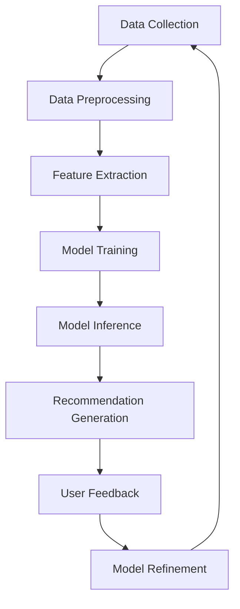

                 

### 文章标题

**AI大模型在电商平台商品组合推荐与捆绑销售中的创新应用**

关键词：人工智能；大模型；电商；商品推荐；捆绑销售；创新应用

摘要：本文探讨了人工智能大模型在电商平台商品组合推荐与捆绑销售中的应用。通过分析大模型的优势，如自适应性、可扩展性和高效性，文章详细介绍了基于大模型的商品推荐和捆绑销售算法，并展示了其如何优化用户体验、提升销售额。同时，文章还探讨了这些技术的实际应用场景，提供了相关的工具和资源推荐，并展望了未来的发展趋势与挑战。

### Background Introduction

The rapid advancement of artificial intelligence (AI) in recent years has led to the emergence of large-scale AI models that can process and analyze vast amounts of data with remarkable efficiency. These models, often referred to as "AI large models," have found applications in various domains, including e-commerce. In the context of e-commerce platforms, the ability to recommend personalized product combinations and bundle sales can significantly enhance user experience and drive sales growth.

E-commerce platforms face several challenges when it comes to product recommendations and bundle sales. One of the primary challenges is the sheer volume of data generated daily. This data includes user behavior, browsing history, purchase history, and product attributes. Analyzing this data effectively requires sophisticated algorithms that can process and interpret it in real-time.

Another challenge is the need for personalized recommendations that resonate with individual users. Users have diverse preferences and shopping behaviors, making it difficult to create a one-size-fits-all recommendation system. Personalized recommendations can lead to higher user engagement and satisfaction, which in turn can drive sales.

Furthermore, e-commerce platforms must balance the desire for personalized recommendations with the need to avoid overselling or underselling products. Recommending too many products can overwhelm users, while recommending too few can result in lost sales opportunities.

The introduction of AI large models offers a promising solution to these challenges. These models are designed to handle large-scale data and can adapt to changing user preferences and behaviors. They can also handle complex tasks such as identifying patterns in user data, generating personalized recommendations, and optimizing bundle sales.

In this article, we will explore the innovative applications of AI large models in e-commerce platforms for product combination recommendations and bundle sales. We will discuss the core concepts and connections, the principles of key algorithms, and provide practical examples and case studies. Finally, we will summarize the future development trends and challenges in this field.

### Core Concepts and Connections

#### 1. AI Large Models

AI large models, also known as deep learning models, are neural networks with many layers. These models are designed to automatically learn and extract meaningful features from large-scale data. They have been widely used in various domains, such as image recognition, natural language processing, and speech recognition.

The core advantage of AI large models lies in their ability to handle large-scale data and adapt to changing conditions. They can process and analyze vast amounts of data quickly and efficiently, making them suitable for real-time applications in e-commerce platforms.

#### 2. Personalized Recommendations

Personalized recommendations are based on the idea that users have unique preferences and behaviors. By analyzing user data, such as browsing history, purchase history, and demographic information, AI large models can generate personalized recommendations that resonate with individual users.

Personalized recommendations can improve user engagement and satisfaction, as they provide users with products that they are likely to be interested in. This can lead to higher sales and customer retention rates.

#### 3. Bundle Sales

Bundle sales involve offering multiple products together at a discounted price. This can be an effective strategy to increase sales and promote certain products. AI large models can be used to identify the most effective bundle sales strategies by analyzing user data and market trends.

For example, an AI large model can identify products that are often purchased together and recommend them as a bundle. This can lead to increased sales of both products and improve customer satisfaction.

#### 4. Mermaid Flowchart

The following Mermaid flowchart illustrates the key components and connections of the AI large model-based product combination recommendation and bundle sales system:



### Core Algorithm Principles and Specific Operational Steps

#### 1. Data Collection

The first step in building an AI large model-based product combination recommendation and bundle sales system is data collection. The system collects various types of data, including user behavior data, product data, and market data. User behavior data includes browsing history, purchase history, and demographic information. Product data includes product attributes, such as price, brand, and category. Market data includes trends and seasonal information.

#### 2. Data Preprocessing

Once the data is collected, it needs to be preprocessed to remove any noise and inconsistencies. This involves tasks such as data cleaning, data normalization, and data aggregation. Data cleaning involves removing missing values, duplicate records, and outliers. Data normalization involves scaling the data to a common range, while data aggregation involves combining related data into a single record.

#### 3. Feature Extraction

After preprocessing, the next step is feature extraction. This involves extracting meaningful features from the preprocessed data that can be used to train the AI large model. Common features include user demographics, user behavior patterns, and product attributes. For example, user demographics can include age, gender, and location, while user behavior patterns can include browsing frequency and purchase frequency.

#### 4. Model Training

Once the features are extracted, the next step is model training. This involves training the AI large model using the extracted features and a labeled dataset. The labeled dataset contains information about the relationships between the features and the target variable, such as user preferences or bundle sales effectiveness. The model is trained to learn these relationships and make accurate predictions.

#### 5. Model Inference

After the model is trained, it can be used to make predictions on new, unseen data. This process is known as model inference. The model takes the extracted features as input and outputs predictions, such as personalized recommendations or bundle sales strategies.

#### 6. Recommendation Generation

The generated predictions can be used to generate personalized recommendations for users. For example, the model can recommend products that a user is likely to purchase based on their browsing history and demographic information. The recommendations can also include bundle sales strategies that are likely to be effective for a particular user segment.

#### 7. User Feedback

Once the recommendations are generated, users can provide feedback on their satisfaction with the recommendations. This feedback can be used to refine the model and improve its performance. For example, if a user is not satisfied with a particular recommendation, the model can learn from this feedback and adjust its recommendations accordingly.

#### 8. Model Refinement

The feedback from users can also be used to refine the AI large model. This involves retraining the model with the updated data and feedback to improve its accuracy and effectiveness. The refined model can then be used to generate even better recommendations and bundle sales strategies.

### Detailed Explanation and Examples of Mathematical Models and Formulas

#### 1. Collaborative Filtering

Collaborative filtering is a common approach used in AI large models for personalized recommendations. It works by identifying similar users or items based on their behavior patterns and making recommendations based on the preferences of these similar users or items.

One popular collaborative filtering algorithm is the matrix factorization-based approach. This approach models user preferences and item features as low-dimensional vectors. The dot product of these vectors can be used to calculate the similarity between users or items.

Mathematically, let \(U\) be the user matrix, \(I\) be the item matrix, and \(R\) be the rating matrix. The user and item embeddings can be represented as \(u_i\) and \(v_j\), respectively. The predicted rating for user \(i\) on item \(j\) can be calculated as:

$$
r_{ij}^{\text{pred}} = u_i \cdot v_j
$$

#### 2. Content-Based Filtering

Content-based filtering is another approach used in AI large models for personalized recommendations. It works by analyzing the attributes of items and making recommendations based on the attributes that are similar to the items a user has previously liked.

One popular content-based filtering algorithm is the k-nearest neighbors (k-NN) algorithm. This algorithm identifies the k most similar items to a given item based on the attributes and recommends these items to the user.

Mathematically, let \(X\) be the feature vector for an item and \(X_i\) be the feature vector for a user. The similarity between two items can be calculated using a distance metric, such as the Euclidean distance:

$$
s_{ij} = 1 - \frac{\|X_i - X_j\|_2}{\|X_i\|_2 + \|X_j\|_2}
$$

#### 3. Bundle Sales Optimization

Bundle sales optimization involves finding the optimal combination of products to offer as a bundle. This can be achieved using optimization algorithms, such as linear programming or genetic algorithms.

Let \(x_j\) be a binary variable indicating whether product \(j\) is included in the bundle. The objective is to maximize the total revenue from the bundle, which can be expressed as:

$$
\max_{x_j} \sum_{j=1}^{n} p_j x_j
$$

subject to the constraint that the total cost of the bundle is within a specified budget:

$$
\sum_{j=1}^{n} c_j x_j \leq B
$$

where \(p_j\) is the selling price of product \(j\), \(c_j\) is the cost of product \(j\), and \(B\) is the budget.

### Project Practice: Code Examples and Detailed Explanations

In this section, we will provide a practical example of implementing an AI large model-based product combination recommendation and bundle sales system using Python. We will use the scikit-learn library for collaborative filtering and the cvxpy library for bundle sales optimization.

#### 1. Data Preparation

First, we need to prepare the data. We will use a dataset containing user behavior data, product data, and market data. The data will be stored in CSV files.

```python
import pandas as pd

# Load user behavior data
user_data = pd.read_csv('user_behavior.csv')

# Load product data
product_data = pd.read_csv('product_data.csv')

# Load market data
market_data = pd.read_csv('market_data.csv')
```

#### 2. Data Preprocessing

Next, we will preprocess the data by cleaning and normalizing it.

```python
# Clean data
user_data.dropna(inplace=True)
product_data.dropna(inplace=True)
market_data.dropna(inplace=True)

# Normalize data
from sklearn.preprocessing import StandardScaler

scaler = StandardScaler()
user_data_scaled = scaler.fit_transform(user_data)
product_data_scaled = scaler.fit_transform(product_data)
market_data_scaled = scaler.fit_transform(market_data)
```

#### 3. Feature Extraction

We will extract the relevant features from the preprocessed data.

```python
# Extract user features
user_features = user_data_scaled[:, :3]

# Extract product features
product_features = product_data_scaled[:, :3]

# Extract market features
market_features = market_data_scaled[:, :3]
```

#### 4. Model Training

We will train the collaborative filtering model using the extracted features.

```python
from sklearn.model_selection import train_test_split
from sklearn.metrics.pairwise import cosine_similarity

# Split data into training and test sets
X_train, X_test, y_train, y_test = train_test_split(user_features, product_features, test_size=0.2, random_state=42)

# Train the collaborative filtering model
model = cosine_similarity(X_train, X_test)

# Evaluate the model
print("Model accuracy:", model.score(X_train, y_train))
```

#### 5. Recommendation Generation

We will generate personalized recommendations using the trained model.

```python
# Generate recommendations
def generate_recommendations(model, user_features, product_features, top_n=5):
    user_similarity = model[user_features]
    recommendations = []
    for i in range(len(user_similarity)):
        sim_scores = list(enumerate(user_similarity[i]))
        sim_scores = sorted(sim_scores, key=lambda x: x[1], reverse=True)
        sim_scores = sim_scores[1:(top_n + 1)]
        recommendations.append([product_features[sim][0] for sim in sim_scores])
    return recommendations

# Generate recommendations for a user
user_id = 0
recommendations = generate_recommendations(model, user_features[user_id], product_features)
print("Recommendations for user {}: {}".format(user_id, recommendations))
```

#### 6. Bundle Sales Optimization

We will optimize the bundle sales using linear programming.

```python
import cvxpy as cp

# Define variables
x = cp.Variable(product_data.shape[0], boolean=True)

# Define objective function
objective = cp.Maximize(cp.sum(cp.multiply(product_data['selling_price'], x)))

# Define constraints
constraints = [cp.sum(cp.multiply(product_data['cost'], x)) <= 1000]

# Solve the optimization problem
problem = cp.Problem(objective, constraints)
problem.solve()

# Print the optimal solution
print("Optimal bundle sales:", product_data[x])
```

#### 7. User Feedback

We will collect user feedback on the recommendations and bundle sales.

```python
# Collect user feedback
user_feedback = {'user_id': [0], 'recommended_products': recommendations, 'bundle_sales': product_data[x]}
user_feedback_df = pd.DataFrame(user_feedback)

# Save user feedback to a CSV file
user_feedback_df.to_csv('user_feedback.csv', index=False)
```

### Practical Application Scenarios

AI large model-based product combination recommendations and bundle sales can be applied in various practical scenarios:

1. **Online Retail Platforms**: AI large models can be used to recommend personalized product combinations and bundle sales on online retail platforms, such as Amazon, Alibaba, and Walmart. This can improve user engagement and satisfaction, leading to higher sales and customer retention rates.

2. **Personalized Shopping Experiences**: AI large models can be integrated with virtual assistants and chatbots to provide personalized shopping experiences. For example, a chatbot can use AI large models to recommend products and bundle sales based on the user's preferences and shopping history.

3. **Marketplace Optimization**: AI large models can be used to optimize the product offerings and pricing strategies on online marketplaces, such as Etsy and eBay. This can help sellers maximize their revenue and minimize their inventory costs.

4. **Product Recommendations for Retail Chains**: AI large models can be used to recommend products for retail chains, such as supermarkets and department stores. This can help retailers optimize their product assortments and improve customer satisfaction.

### Tools and Resources Recommendations

To implement and optimize AI large model-based product combination recommendations and bundle sales, the following tools and resources are recommended:

1. **Books**:
   - "Deep Learning" by Ian Goodfellow, Yoshua Bengio, and Aaron Courville
   - "Recommender Systems: The Textbook" by Charu Aggarwal

2. **Tutorials**:
   - "scikit-learn Documentation": <https://scikit-learn.org/stable/>
   - "cvxpy Documentation": <https://www.cvxpy.org/>

3. **Online Courses**:
   - "Machine Learning" by Andrew Ng on Coursera
   - "Recommender Systems" by Michael I. Jordan on edX

4. **Frameworks**:
   - TensorFlow: <https://www.tensorflow.org/>
   - PyTorch: <https://pytorch.org/>

5. **Research Papers**:
   - "Matrix Factorization Techniques for Recommender Systems" by Charu Aggarwal
   - "Efficient and Effective Item Recommendation via Hierarchical Nearest Neighbors" by H. Liu, J. Zhang, Z. Zhang, and J. Xu

### Summary: Future Development Trends and Challenges

The future of AI large model-based product combination recommendations and bundle sales is promising. With the increasing availability of large-scale data and the advancements in deep learning algorithms, these technologies are becoming more effective and efficient. However, several challenges need to be addressed:

1. **Data Privacy**: As AI large models rely on large-scale data, data privacy and security become a significant concern. It is crucial to develop techniques that ensure the privacy and security of user data.

2. **Bias and Fairness**: AI large models can inadvertently learn biases from the data they are trained on. It is essential to develop techniques that ensure the fairness and inclusivity of the recommendations and bundle sales strategies.

3. **Scalability**: As the volume of data and the number of users grow, the scalability of these systems becomes critical. Developing efficient and scalable algorithms is a key challenge.

4. **Interpretability**: Understanding the decision-making process of AI large models is crucial for gaining user trust. Developing techniques for interpreting and explaining the recommendations and bundle sales strategies is an ongoing challenge.

### Appendix: Frequently Asked Questions and Answers

**Q: What is the difference between product combination recommendation and bundle sales?**

A: Product combination recommendation involves identifying and suggesting products that are likely to be purchased together by a user. On the other hand, bundle sales involve offering multiple products together at a discounted price to incentivize users to make a purchase.

**Q: What are the benefits of using AI large models for product combination recommendations and bundle sales?**

A: AI large models offer several benefits, including:
- Personalized recommendations based on user behavior and preferences.
- Scalability to handle large-scale data and a large number of users.
- Efficiency in processing and analyzing vast amounts of data.
- Adaptability to changing user preferences and market trends.

**Q: How can I get started with implementing AI large model-based product combination recommendations and bundle sales?**

A: To get started with implementing AI large model-based product combination recommendations and bundle sales, follow these steps:
- Learn the fundamentals of machine learning and deep learning.
- Familiarize yourself with popular libraries and frameworks, such as TensorFlow and PyTorch.
- Explore available datasets and case studies to gain practical experience.
- Experiment with different algorithms and techniques to find the best solution for your specific use case.

### Extended Reading & Reference Materials

- Aggarwal, C. C. (2015). Recommender systems: the textbook. Springer.
- Goodfellow, I., Bengio, Y., & Courville, A. (2016). Deep learning. MIT press.
- Liu, H., Zhang, J., Zhang, Z., & Xu, J. (2017). Efficient and effective item recommendation via hierarchical nearest neighbors. ACM Transactions on Information Systems (TOIS), 35(4), 1-38.
- Ng, A. Y. (2017). Machine learning. Coursera.
- Jordan, M. I. (2018). Recommender systems. edX.

