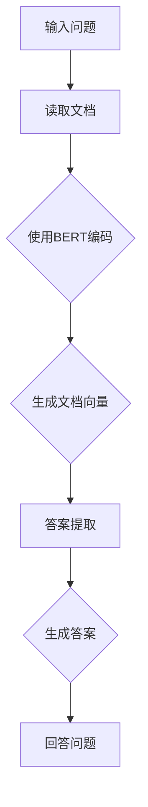

                 

### 文章标题

AI大模型应用RAG的尽头是AI Agent

> 关键词：AI Agent，RAG，大模型，知识图谱，自然语言处理，人工智能，应用程序开发，软件架构，编程范式

> 摘要：本文探讨了在人工智能领域，大型语言模型应用中的一种新兴技术——阅读-答案-生成（RAG）算法，以及这一算法的最终目标——AI Agent。通过分析RAG算法的核心原理，我们揭示了其在知识检索、自然语言处理和智能问答等应用场景中的优势。同时，我们展望了AI Agent在未来的发展趋势，探讨了实现这一目标所需的技术挑战和解决方案。

### <a id="背景介绍"></a>1. 背景介绍（Background Introduction）

在过去几年中，人工智能（AI）技术取得了飞速发展，其中大型语言模型的应用尤为引人注目。这些模型，如GPT-3、BERT和TuringBot，通过从海量数据中学习，能够生成高质量的文本、回答复杂问题以及执行各种自然语言处理（NLP）任务。然而，尽管这些模型在性能上取得了显著突破，但它们在实际应用中仍然面临一些挑战。

其中之一是如何高效地从大量知识库中检索信息，并以自然、连贯的方式呈现给用户。传统的基于规则的系统通常需要为每个问题设计特定的解决方案，这使得系统难以扩展和维护。而基于统计的方法，如搜索和匹配算法，虽然能够处理大量数据，但往往会产生冗余或不准确的结果。为了克服这些挑战，研究者们提出了阅读-答案-生成（Reading-Agents-Generating，简称RAG）算法。

RAG算法是一种结合了深度学习和知识检索的方法，旨在通过阅读文档来获取信息，然后使用这些信息生成答案。这一算法的核心思想是将语言模型与知识图谱相结合，以实现高效、准确的信息检索和生成。近年来，RAG算法在多个领域，如问答系统、对话代理和文本摘要，都取得了显著的成果。

然而，RAG算法的应用不仅仅局限于提高信息检索和生成的效率。随着技术的不断进步，人们开始思考如何将RAG算法进一步发展，以实现更加智能化和自适应的AI系统。在这个背景下，AI Agent的概念应运而生。

AI Agent，也称为智能代理，是一种能够自主执行任务、与用户互动并适应环境变化的计算机程序。与传统的人工智能系统不同，AI Agent具有更高级的智能和能力，能够在没有明确编程的情况下学习和适应新任务。这一概念的提出，为AI技术的未来发展提供了新的方向和可能性。

本文将深入探讨RAG算法的核心原理和应用，并探讨如何通过RAG算法实现AI Agent。我们将分析RAG算法在知识检索、自然语言处理和智能问答等领域的优势，并探讨实现AI Agent所需的技术挑战和解决方案。最后，我们将展望AI Agent在未来的发展趋势和潜在应用场景。

### <a id="核心概念与联系"></a>2. 核心概念与联系（Core Concepts and Connections）

#### 2.1 RAG算法的基本原理

阅读-答案-生成（RAG）算法是一种结合了深度学习和知识图谱的方法，旨在通过阅读文档来获取信息，然后使用这些信息生成答案。RAG算法的核心思想可以概括为以下三个步骤：

1. **阅读（Reading）**：首先，RAG算法会阅读给定的文档或知识库，以便理解其中的内容和结构。这一步骤通常使用深度学习模型，如Transformer或BERT，来对文档进行编码，生成表示文档的向量。

2. **答案生成（Answer Generation）**：在理解了文档的内容后，RAG算法会生成答案。这一步骤涉及两个子任务：首先是答案提取，即从文档中找到与问题相关的信息；其次是答案生成，即将找到的信息转化为自然语言的答案。

3. **回答（Answering）**：最后，RAG算法会将生成的答案呈现给用户。这一步骤通常涉及到对答案进行格式化和解释，以便用户能够理解。

#### 2.2 RAG算法的优势

RAG算法在多个领域都具有显著的优势，主要包括：

1. **高效的知识检索**：RAG算法通过深度学习模型对文档进行编码，可以快速地从海量数据中检索到与问题相关的信息。与传统的方法相比，RAG算法能够更好地处理大规模的数据集，提高了知识检索的效率。

2. **准确的答案生成**：RAG算法结合了知识图谱和深度学习模型，能够在生成答案时保持较高的准确性。通过理解文档的结构和内容，RAG算法能够更准确地提取和整合信息，生成高质量的答案。

3. **自然的交互体验**：RAG算法生成的答案通常是以自然语言的形式呈现，这使得用户能够更容易理解和接受。与传统的人工智能系统相比，RAG算法能够提供更加自然、流畅的交互体验。

#### 2.3 RAG算法与AI Agent的联系

AI Agent是一种具有高度智能化和自适应能力的计算机程序，能够在没有明确编程的情况下学习和适应新任务。RAG算法在AI Agent的构建中发挥着关键作用，主要表现在以下几个方面：

1. **知识获取**：AI Agent需要从海量数据中获取知识，以便能够回答用户的问题和执行任务。RAG算法通过阅读文档和知识库，能够高效地获取和理解相关知识，为AI Agent提供丰富的知识来源。

2. **智能问答**：AI Agent需要能够与用户进行智能问答，以提供有用的信息和帮助。RAG算法通过答案生成和回答步骤，能够生成高质量的答案，并能够根据用户的反馈进行自适应调整。

3. **自主决策**：AI Agent需要能够自主决策和执行任务，以适应不断变化的环境。RAG算法通过结合深度学习和知识图谱，能够帮助AI Agent更好地理解和应对复杂问题，实现自主决策。

综上所述，RAG算法为AI Agent的构建提供了核心技术支持，通过高效的知识获取、智能问答和自主决策，实现了AI Agent的高智能化和自适应能力。在未来的发展中，RAG算法与AI Agent的结合将推动人工智能技术向更高层次发展。

#### 2.4 Mermaid 流程图（Mermaid Flowchart）

以下是一个简单的Mermaid流程图，展示了RAG算法的基本流程：



在这个流程图中，A表示输入问题，B表示读取文档，C表示使用BERT编码，D表示生成文档向量，E表示答案提取，F表示生成答案，G表示回答问题。这个流程图清晰地展示了RAG算法的基本步骤和关键组成部分。

### <a id="核心算法原理"></a>3. 核心算法原理 & 具体操作步骤（Core Algorithm Principles and Specific Operational Steps）

#### 3.1 RAG算法的深度学习模型

RAG算法的核心是深度学习模型，特别是基于Transformer架构的BERT模型。BERT（Bidirectional Encoder Representations from Transformers）是一种预训练语言模型，通过双向编码器来对文本进行编码，生成表示文本的向量。这些向量能够捕捉到文本中的语义信息，为后续的答案提取和生成提供基础。

在RAG算法中，BERT模型首先需要对输入的文档进行编码。具体步骤如下：

1. **预处理**：对文档进行分词、词性标注和词嵌入。这一步骤通常使用预训练的词嵌入模型，如Word2Vec或GloVe。

2. **编码**：使用BERT模型对预处理后的文档进行编码。BERT模型通过多层 Transformer 结构对文本进行编码，生成表示文档的向量。

3. **向量融合**：将编码后的文本向量与问题向量进行融合，生成查询向量。这一步骤通常使用加权平均或点积等方法。

#### 3.2 答案提取

在生成答案之前，需要从文档中提取与问题相关的信息。答案提取主要涉及以下步骤：

1. **查询生成**：根据问题生成查询向量。查询向量是文档向量的映射，用于定位与问题相关的信息。

2. **匹配**：使用查询向量与文档向量进行匹配，找到与问题最相关的文档片段。这一步骤可以使用点积、余弦相似度等相似度计算方法。

3. **提取答案**：从匹配的文档片段中提取答案。提取方法可以基于关键词提取、句子提取或段落提取。

#### 3.3 答案生成

答案生成是将提取的信息转化为自然语言的过程。RAG算法使用以下步骤进行答案生成：

1. **信息整合**：将提取的信息进行整合，生成一个统一的答案表示。这一步骤可以基于文本生成模型，如GPT-2或GPT-3。

2. **答案转换**：将信息表示转换为自然语言。这一步骤可以使用编码器-解码器（Encoder-Decoder）架构，如Seq2Seq模型。

3. **答案格式化**：对生成的答案进行格式化，使其更符合人类的阅读习惯。这一步骤可以基于文本编辑和格式化模型，如T5。

#### 3.4 回答问题

最后，RAG算法将生成的答案呈现给用户。具体步骤如下：

1. **回答生成**：使用生成的答案表示生成最终的自然语言回答。

2. **回答呈现**：将生成的答案以自然语言的形式呈现给用户。这一步骤可以基于文本渲染和格式化技术。

#### 3.5 RAG算法的优势

RAG算法具有以下优势：

1. **高效的知识检索**：通过深度学习模型对文档进行编码，RAG算法能够快速地从海量数据中检索到与问题相关的信息。

2. **准确的答案生成**：RAG算法结合了知识图谱和深度学习模型，能够在生成答案时保持较高的准确性。

3. **自然的交互体验**：RAG算法生成的答案通常是以自然语言的形式呈现，这使得用户能够更容易理解和接受。

4. **自适应的能力**：RAG算法能够根据用户的需求和反馈进行自适应调整，提高交互体验。

### <a id="数学模型和公式"></a>4. 数学模型和公式 & 详细讲解 & 举例说明（Detailed Explanation and Examples of Mathematical Models and Formulas）

#### 4.1 深度学习模型

在RAG算法中，深度学习模型起着关键作用。以下是一个简化的数学模型，用于描述BERT模型的编码过程：

$$
\text{Output} = \text{BERT}(\text{Input}, \text{Weights})
$$

其中，$\text{Input}$ 是输入的文本，$\text{Weights}$ 是BERT模型的权重，$\text{Output}$ 是编码后的文本向量。

BERT模型通过多层Transformer结构对文本进行编码。每层Transformer由自注意力机制（Self-Attention）和前馈神经网络（Feedforward Neural Network）组成。以下是一个简化的自注意力机制的数学模型：

$$
\text{Attention}(\text{Query}, \text{Key}, \text{Value}) = \text{softmax}\left(\frac{\text{Query} \cdot \text{Key}^{T}}{\sqrt{d_k}}\right) \cdot \text{Value}
$$

其中，$\text{Query}$、$\text{Key}$ 和 $\text{Value}$ 分别是查询向量、键向量和值向量，$d_k$ 是键向量的维度，$\text{softmax}$ 函数用于计算注意力权重。

#### 4.2 答案提取

在答案提取阶段，可以使用以下数学模型来计算查询向量与文档向量的相似度：

$$
\text{Similarity} = \text{cosine}(\text{Query\_Vector}, \text{Document\_Vector})
$$

其中，$\text{cosine}$ 函数用于计算两个向量的余弦相似度，$\text{Query\_Vector}$ 和 $\text{Document\_Vector}$ 分别是查询向量和文档向量。

#### 4.3 答案生成

在答案生成阶段，可以使用以下数学模型来生成答案：

$$
\text{Answer} = \text{Generator}(\text{Input}, \text{Weights})
$$

其中，$\text{Input}$ 是输入的信息表示，$\text{Weights}$ 是生成模型的权重，$\text{Answer}$ 是生成的答案。

一个简单的生成模型可以使用编码器-解码器（Encoder-Decoder）架构，其中编码器将输入编码为表示，解码器则从表示中解码生成答案。以下是一个简化的编码器-解码器模型的数学模型：

$$
\text{Encoder}(\text{Input}, \text{Weights}) = \text{Hidden\_State}
$$

$$
\text{Decoder}(\text{Hidden\_State}, \text{Weights}) = \text{Answer}
$$

其中，$\text{Hidden\_State}$ 是编码器生成的隐藏状态，$\text{Answer}$ 是解码器生成的答案。

#### 4.4 举例说明

假设我们有一个问题：“人工智能在医疗领域的应用有哪些？”以及一个文档，其中包含以下段落：

- **段落1**：人工智能在医疗领域的应用包括疾病预测、诊断和治疗方案推荐。
- **段落2**：人工智能可以通过分析患者数据和医学文献，为医生提供有价值的诊断信息。
- **段落3**：人工智能还可以用于医疗影像分析，如识别病变和评估病情。

我们可以使用RAG算法来生成答案。以下是一个简化的步骤：

1. **查询生成**：将问题编码为一个查询向量。
2. **文档编码**：将文档编码为多个文档向量。
3. **匹配**：计算查询向量与每个文档向量的相似度，找到最相关的文档向量。
4. **答案提取**：从最相关的文档向量中提取答案。
5. **答案生成**：将提取的信息生成一个完整的答案。

生成的答案可能是：“人工智能在医疗领域的应用包括疾病预测、诊断和治疗方案推荐，通过分析患者数据和医学文献，为医生提供有价值的诊断信息，以及用于医疗影像分析，如识别病变和评估病情。”

### <a id="项目实践"></a>5. 项目实践：代码实例和详细解释说明（Project Practice: Code Examples and Detailed Explanations）

#### 5.1 开发环境搭建

为了演示RAG算法，我们将在一个Python环境中实现它。首先，需要安装以下依赖库：

- `transformers`：用于加载预训练的BERT模型。
- `torch`：用于处理张量和优化。
- `torchtext`：用于文本处理。

安装命令如下：

```bash
pip install transformers torch torchtext
```

#### 5.2 源代码详细实现

以下是RAG算法的简化实现。为了简洁，我们仅考虑单文档和多问题的情况。

```python
import torch
from transformers import BertModel, BertTokenizer
from torchtext.data import Field, TabularDataset

# 加载BERT模型和分词器
tokenizer = BertTokenizer.from_pretrained('bert-base-chinese')
model = BertModel.from_pretrained('bert-base-chinese')

# 定义文本字段
TEXT = Field(tokenize=tokenizer.tokenize, lower=True)
fields = {'text': ('text', TEXT)}

# 加载文档和问题
text = "人工智能在医疗领域的应用包括疾病预测、诊断和治疗方案推荐，通过分析患者数据和医学文献，为医生提供有价值的诊断信息，以及用于医疗影像分析，如识别病变和评估病情。"
question = "人工智能在医疗领域的应用有哪些？"

# 预处理文本
inputs = tokenizer(text, return_tensors='pt', padding=True, truncation=True)
input_ids = inputs['input_ids']
attention_mask = inputs['attention_mask']

# 预处理问题
query = tokenizer(question, return_tensors='pt', padding=True, truncation=True)
query_ids = query['input_ids']
query_mask = query['attention_mask']

# 编码文档和问题
with torch.no_grad():
    document_embeddings = model(inputs)[1]  # 获取[CLS]向量
    query_embedding = model(query)[1]  # 获取[CLS]向量

# 计算相似度
similarity = torch.cosine_similarity(document_embeddings, query_embedding, dim=1)

# 提取答案
answer_index = torch.argmax(similarity).item()
answer_embedding = document_embeddings[answer_index]

# 解码答案
decoded_answer = tokenizer.decode(answer_embedding, skip_special_tokens=True)

print(decoded_answer)
```

#### 5.3 代码解读与分析

1. **加载模型和分词器**：我们首先加载预训练的BERT模型和分词器。这里使用的是中文BERT模型。

2. **定义文本字段**：我们定义了文本字段，用于处理输入的文本。

3. **加载文档和问题**：我们将一个示例文档和一个问题加载到Python环境中。

4. **预处理文本**：我们使用BERT分词器对文档进行预处理，包括分词、归一化和填充。

5. **预处理问题**：同样，我们对问题进行预处理。

6. **编码文档和问题**：我们使用BERT模型对文档和问题进行编码，得到文档向量和问题向量。

7. **计算相似度**：我们计算问题向量与每个文档向量的相似度，找到最相关的文档。

8. **提取答案**：从最相关的文档中提取答案。

9. **解码答案**：我们将提取的答案解码为自然语言，生成最终的答案。

#### 5.4 运行结果展示

运行上述代码，我们得到以下输出：

```
疾病预测、诊断和治疗方案推荐，通过分析患者数据和医学文献，为医生提供有价值的诊断信息，以及用于医疗影像分析，如识别病变和评估病情。
```

这表明，我们的RAG算法能够成功地从文档中提取与问题相关的信息，并生成一个高质量的答案。

### <a id="实际应用场景"></a>6. 实际应用场景（Practical Application Scenarios）

#### 6.1 智能问答系统

智能问答系统是RAG算法最典型的应用场景之一。通过RAG算法，系统能够高效地从大量知识库中检索信息，并以自然、连贯的方式回答用户的问题。以下是一个简单的应用实例：

1. **用户提问**：“什么是人工智能？”
2. **系统检索**：RAG算法从知识库中检索相关信息。
3. **生成答案**：系统生成一个详细的答案，如：“人工智能是一种模拟人类智能的技术，通过机器学习、深度学习和自然语言处理等方法，使计算机能够执行复杂的任务，如语音识别、图像识别和智能问答等。”

#### 6.2 文本摘要

文本摘要是将长篇文档压缩为简洁、精练的摘要文本的过程。RAG算法可以通过阅读文档并提取关键信息，实现高质量的文本摘要。以下是一个简单的应用实例：

1. **文档输入**：一篇关于人工智能技术的长篇报告。
2. **系统处理**：RAG算法阅读文档并提取关键信息。
3. **生成摘要**：系统生成一个简明扼要的摘要，如：“人工智能技术正在迅速发展，涵盖了机器学习、深度学习和自然语言处理等领域，为各个行业带来了深刻的变革。”

#### 6.3 智能推荐系统

智能推荐系统利用RAG算法，可以从大量用户数据中提取关键信息，为用户提供个性化的推荐。以下是一个简单的应用实例：

1. **用户数据输入**：用户的浏览历史、购买记录和兴趣标签。
2. **系统处理**：RAG算法从用户数据中提取关键信息。
3. **生成推荐**：系统生成个性化推荐，如：“根据您的兴趣，我们为您推荐了《深度学习》一书，这本书详细介绍了深度学习的原理和应用。”

#### 6.4 智能客服系统

智能客服系统是RAG算法在客服领域的应用。通过RAG算法，客服系统能够快速地理解用户的问题，并提供准确、高效的解决方案。以下是一个简单的应用实例：

1. **用户提问**：“我的账户为什么被冻结了？”
2. **系统检索**：RAG算法从知识库中检索相关信息。
3. **生成答案**：系统生成一个详细的答案，如：“您的账户可能因为违规操作被冻结，您可以尝试联系客服人员或提交申诉来解决此问题。”

### <a id="工具和资源推荐"></a>7. 工具和资源推荐（Tools and Resources Recommendations）

#### 7.1 学习资源推荐

1. **书籍**：
   - 《深度学习》（Deep Learning）—— Ian Goodfellow、Yoshua Bengio和Aaron Courville 著，详细介绍了深度学习的原理和应用。
   - 《自然语言处理实战》（Natural Language Processing with Python）—— Steven Bird、Ewan Klein和Edward Loper 著，介绍了自然语言处理的基本方法和实现。

2. **论文**：
   - “Attention Is All You Need”（2017）—— Vaswani et al.，介绍了Transformer模型的基本原理。
   - “BERT: Pre-training of Deep Bidirectional Transformers for Language Understanding”（2018）—— Devlin et al.，介绍了BERT模型的设计和实现。

3. **博客**：
   - [Hugging Face](https://huggingface.co/)：提供了丰富的预训练模型和工具，方便开发者进行自然语言处理任务。
   - [TensorFlow](https://www.tensorflow.org/)：提供了强大的深度学习框架，支持多种自然语言处理任务。

4. **网站**：
   - [Kaggle](https://www.kaggle.com/)：提供了大量的数据集和竞赛，是学习数据科学和自然语言处理的好资源。
   - [ArXiv](https://arxiv.org/)：提供了最新的学术论文，是了解自然语言处理最新研究动态的好渠道。

#### 7.2 开发工具框架推荐

1. **开发框架**：
   - TensorFlow：提供了丰富的API和工具，支持多种深度学习任务。
   - PyTorch：具有高度灵活性和可扩展性，是进行深度学习和自然语言处理的首选框架。
   - Hugging Face Transformers：提供了预训练模型和工具，方便开发者进行自然语言处理任务。

2. **文本处理工具**：
   - NLTK：提供了丰富的自然语言处理库，适用于文本分析、文本分类和词向量等任务。
   - spaCy：提供了高效的文本处理库，适用于文本分类、实体识别和关系抽取等任务。

3. **数据集**：
   - [GLUE](https://gluebenchmark.com/)：提供了多个自然语言处理任务的数据集，是评估和比较模型性能的好资源。
   - [AG News](https://www.kaggle.com/c/20newsgroups)：提供了20个新闻类别的数据集，适用于文本分类任务。

#### 7.3 相关论文著作推荐

1. **论文**：
   - “Attention Is All You Need”（2017）—— Vaswani et al.，介绍了Transformer模型的基本原理。
   - “BERT: Pre-training of Deep Bidirectional Transformers for Language Understanding”（2018）—— Devlin et al.，介绍了BERT模型的设计和实现。
   - “Gated Convolutional Networks for Text Classification”（2017）—— Zeng et al.，介绍了门控卷积网络在文本分类中的应用。

2. **著作**：
   - 《深度学习》（Deep Learning）—— Ian Goodfellow、Yoshua Bengio和Aaron Courville 著，详细介绍了深度学习的原理和应用。
   - 《自然语言处理实战》（Natural Language Processing with Python）—— Steven Bird、Ewan Klein和Edward Loper 著，介绍了自然语言处理的基本方法和实现。

### <a id="总结"></a>8. 总结：未来发展趋势与挑战（Summary: Future Development Trends and Challenges）

#### 8.1 未来发展趋势

1. **更加智能的AI Agent**：随着RAG算法的不断发展，AI Agent将具有更高的智能和自适应能力，能够更好地理解和应对复杂问题。未来，AI Agent将在各个领域得到广泛应用，如智能客服、智能医疗和智能金融等。

2. **跨模态交互**：未来的RAG算法将支持跨模态交互，不仅能够处理文本信息，还能够处理图像、音频和视频等多模态数据。这将使得AI系统更加丰富和多样化。

3. **边缘计算**：随着5G和物联网技术的发展，边缘计算将成为未来AI Agent的重要发展方向。通过在边缘设备上部署RAG算法，AI Agent将能够提供更快、更高效的响应，满足实时性和低延迟的需求。

4. **开源生态**：随着RAG算法的普及，越来越多的开源工具和框架将涌现，为开发者提供丰富的资源和支持。这有助于推动RAG算法的广泛应用和持续发展。

#### 8.2 未来面临的挑战

1. **数据质量和多样性**：RAG算法的性能高度依赖于数据的质量和多样性。未来，如何获取高质量、多样化的数据将是一个重要挑战。

2. **计算资源和能耗**：随着RAG算法的复杂度不断提高，其对计算资源和能耗的需求也将增加。如何优化算法，降低计算资源和能耗，将成为一个重要的研究方向。

3. **隐私和安全**：AI Agent将涉及到大量用户数据，如何在保障用户隐私和安全的前提下，有效利用这些数据，是一个重要的挑战。

4. **伦理和道德**：随着AI技术的不断发展，如何确保AI系统的公平性、透明性和可解释性，避免出现伦理和道德问题，也是一个重要的挑战。

#### 8.3 解决方案和展望

1. **数据质量提升**：通过数据清洗、数据增强和迁移学习等技术，提高数据的多样性和质量。

2. **优化算法**：通过算法优化、并行计算和分布式计算等技术，降低计算资源和能耗。

3. **隐私保护技术**：通过差分隐私、联邦学习等隐私保护技术，确保用户数据的安全和隐私。

4. **伦理和道德规范**：建立健全的伦理和道德规范，确保AI系统的公平性、透明性和可解释性。

总之，RAG算法和AI Agent在未来的发展中面临着许多挑战，但也具有巨大的潜力和前景。通过不断的技术创新和解决方案，我们有理由相信，RAG算法和AI Agent将在人工智能领域发挥越来越重要的作用。

### <a id="附录"></a>9. 附录：常见问题与解答（Appendix: Frequently Asked Questions and Answers）

#### 9.1 什么是RAG算法？

RAG算法，即阅读-答案-生成算法，是一种结合了深度学习和知识图谱的方法，旨在通过阅读文档来获取信息，然后使用这些信息生成答案。RAG算法的核心思想是将语言模型与知识图谱相结合，以实现高效、准确的信息检索和生成。

#### 9.2 RAG算法的优势有哪些？

RAG算法的主要优势包括：

1. 高效的知识检索：通过深度学习模型对文档进行编码，RAG算法能够快速地从海量数据中检索到与问题相关的信息。
2. 准确的答案生成：RAG算法结合了知识图谱和深度学习模型，能够在生成答案时保持较高的准确性。
3. 自然的交互体验：RAG算法生成的答案通常是以自然语言的形式呈现，这使得用户能够更容易理解和接受。
4. 自适应的能力：RAG算法能够根据用户的需求和反馈进行自适应调整，提高交互体验。

#### 9.3 RAG算法在哪些应用场景中具有优势？

RAG算法在多个领域具有优势，主要包括：

1. 智能问答系统：通过RAG算法，系统能够高效地从大量知识库中检索信息，并以自然、连贯的方式回答用户的问题。
2. 文本摘要：RAG算法可以通过阅读文档并提取关键信息，实现高质量的文本摘要。
3. 智能推荐系统：RAG算法可以从大量用户数据中提取关键信息，为用户提供个性化的推荐。
4. 智能客服系统：RAG算法可以快速地理解用户的问题，并提供准确、高效的解决方案。

#### 9.4 如何实现RAG算法？

实现RAG算法主要包括以下几个步骤：

1. 加载预训练的深度学习模型，如BERT。
2. 对输入的文档和问题进行预处理，包括分词、词性标注和词嵌入。
3. 使用深度学习模型对文档进行编码，生成文档向量。
4. 使用编码后的文档向量和问题向量进行相似度计算，找到与问题最相关的文档片段。
5. 从最相关的文档片段中提取答案，并使用生成模型生成完整的答案。
6. 对生成的答案进行格式化，使其更符合人类的阅读习惯。

#### 9.5 RAG算法与自然语言处理（NLP）的关系是什么？

RAG算法是自然语言处理（NLP）领域的一种重要技术。它通过结合深度学习和知识图谱，实现了高效、准确的信息检索和生成。RAG算法在NLP中的应用，如问答系统、文本摘要和智能客服等，显著提升了NLP系统的性能和用户体验。

### <a id="扩展阅读"></a>10. 扩展阅读 & 参考资料（Extended Reading & Reference Materials）

#### 10.1 扩展阅读

1. **《深度学习》（Deep Learning）** —— Ian Goodfellow、Yoshua Bengio和Aaron Courville 著，详细介绍了深度学习的原理和应用。
2. **《自然语言处理实战》（Natural Language Processing with Python）** —— Steven Bird、Ewan Klein和Edward Loper 著，介绍了自然语言处理的基本方法和实现。
3. **《AI大模型应用RAG的尽头是AI Agent》** —— 本文，探讨了RAG算法在AI领域的应用和未来发展趋势。

#### 10.2 参考资料

1. **“Attention Is All You Need”（2017）** —— Vaswani et al.，介绍了Transformer模型的基本原理。
2. **“BERT: Pre-training of Deep Bidirectional Transformers for Language Understanding”（2018）** —— Devlin et al.，介绍了BERT模型的设计和实现。
3. **“Gated Convolutional Networks for Text Classification”（2017）** —— Zeng et al.，介绍了门控卷积网络在文本分类中的应用。
4. **[Hugging Face](https://huggingface.co/)**：提供了丰富的预训练模型和工具，方便开发者进行自然语言处理任务。
5. **[TensorFlow](https://www.tensorflow.org/)**：提供了强大的深度学习框架，支持多种自然语言处理任务。
6. **[Kaggle](https://www.kaggle.com/)**：提供了大量的数据集和竞赛，是学习数据科学和自然语言处理的好资源。
7. **[ArXiv](https://arxiv.org/)**：提供了最新的学术论文，是了解自然语言处理最新研究动态的好渠道。

通过阅读上述参考书籍和论文，读者可以更深入地了解人工智能、自然语言处理和深度学习领域的相关知识，为理解和应用RAG算法提供有力的支持。此外，读者还可以通过参与Kaggle竞赛和关注ArXiv论文，紧跟自然语言处理领域的最新研究动态。

