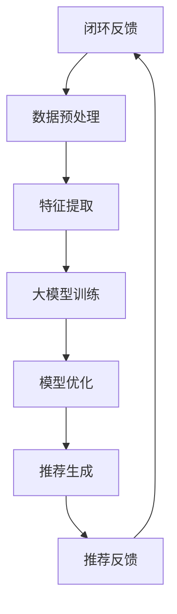

                 

### 背景介绍

在过去的几年中，人工智能（AI）技术在各个领域都取得了显著的进步，特别是在电商搜索推荐领域。随着大数据和云计算技术的不断发展，电商平台拥有了海量的用户行为数据和商品信息。如何从这些数据中提取有价值的信息，为用户提供个性化的购物体验，成为了电商企业关注的焦点。在这一背景下，大模型（Large Models）的应用逐渐成为一种重要的业务创新手段。

大模型，特别是深度学习模型，具有处理大规模数据和复杂任务的能力。它们通过学习大量的数据，能够自动提取数据中的特征，从而实现高度准确的预测和分类。在电商搜索推荐领域，大模型可以用于用户行为分析、商品属性提取、协同过滤等任务，从而为用户提供个性化的商品推荐服务。

然而，大模型的应用并非一帆风顺。首先，大模型的训练过程需要大量的计算资源和时间，这对电商平台的IT基础设施提出了较高的要求。其次，大模型的性能受数据质量、模型参数调优等因素的影响，需要不断优化和调整。此外，大模型在应用过程中可能会面临数据隐私和安全等问题。

本文将探讨如何利用大模型赋能电商搜索推荐的业务创新，并提出一套完整的项目管理方法。本文将首先介绍大模型在电商搜索推荐领域的应用背景，然后分析大模型的核心概念和原理，接着详细讲解大模型的算法原理和操作步骤，并通过数学模型和公式进行详细分析。最后，本文将结合项目实践，提供代码实例和运行结果展示，并探讨大模型在电商搜索推荐领域的实际应用场景。通过本文的阅读，读者将能够全面了解大模型在电商搜索推荐领域的应用现状和发展趋势。

### 核心概念与联系

#### 什么是大模型？

大模型（Large Models）是指具有大规模参数和强大计算能力的深度学习模型。这些模型通常基于神经网络架构，通过大量的数据和计算资源进行训练。大模型的核心在于其参数规模和计算能力，这使得它们能够处理复杂的数据和任务，实现高度准确的预测和分类。在AI领域，大模型的发展可以说是革命性的，它们正在改变传统机器学习的许多方面。

#### 大模型在电商搜索推荐中的应用

在电商搜索推荐领域，大模型的应用主要体现在以下几个方面：

1. **用户行为分析**：大模型可以学习用户的购物行为、浏览历史和偏好，从而实现个性化推荐。例如，通过分析用户的浏览记录和购买记录，大模型可以识别出用户的兴趣点，并为其推荐相关的商品。

2. **商品属性提取**：大模型可以从大量的商品描述、标签和评论中提取有价值的信息，从而为商品分类和推荐提供支持。例如，大模型可以识别出商品的材质、品牌、价格等属性，并将其用于推荐算法中。

3. **协同过滤**：大模型可以通过协同过滤技术，结合用户的兴趣和商品的特点，为用户推荐相关的商品。协同过滤是一种常用的推荐算法，通过分析用户之间的相似性和商品之间的相关性来实现个性化推荐。

#### 大模型与传统机器学习的区别

与传统机器学习相比，大模型具有以下几个显著特点：

1. **参数规模**：大模型的参数规模通常远大于传统机器学习模型，这使得它们能够处理更复杂的数据和任务。

2. **计算能力**：大模型需要强大的计算能力进行训练，这通常涉及到GPU、TPU等高性能计算设备。

3. **数据需求**：大模型通常需要大量的数据才能实现良好的性能，这要求电商企业拥有丰富的用户行为数据和商品信息。

4. **自动化特征提取**：大模型可以通过端到端的学习方式，自动提取数据中的特征，无需人工干预。

#### 大模型的优势

大模型在电商搜索推荐领域具有以下优势：

1. **准确性**：大模型能够通过学习大量的数据，实现高度准确的预测和分类，从而提高推荐算法的准确性。

2. **效率**：大模型具有强大的计算能力，能够在短时间内处理大量的用户请求，提高系统的响应速度。

3. **可扩展性**：大模型能够轻松地扩展到新的数据和任务，适应不断变化的市场需求。

4. **灵活性**：大模型可以通过调整模型参数和训练数据，适应不同的业务场景和需求。

#### 大模型与电商搜索推荐的结合

电商搜索推荐是一个典型的复杂数据处理任务，涉及到用户行为分析、商品属性提取、协同过滤等多个方面。大模型可以通过以下方式与电商搜索推荐相结合：

1. **端到端学习**：大模型可以通过端到端的学习方式，直接从原始数据中提取特征，实现自动化特征提取。

2. **多任务学习**：大模型可以通过多任务学习，同时处理用户行为分析、商品属性提取和协同过滤等任务。

3. **迁移学习**：大模型可以通过迁移学习，将已有的知识应用到新的数据和任务中，提高模型的泛化能力。

4. **自适应学习**：大模型可以通过自适应学习，根据用户的行为和反馈，动态调整推荐策略，提高推荐效果。

总之，大模型在电商搜索推荐领域具有巨大的应用潜力，通过结合端到端学习、多任务学习、迁移学习和自适应学习等技术，可以实现高度个性化的购物体验，提升用户的满意度和购买转化率。

#### 大模型应用架构图

以下是电商搜索推荐中应用大模型的基本架构图：



- **A. 用户行为数据**：包括用户的浏览历史、购买记录、评论等数据。
- **B. 数据预处理**：对用户行为数据清洗、归一化、缺失值处理等。
- **C. 特征提取**：从预处理后的数据中提取有用的特征，如用户兴趣、商品属性等。
- **D. 大模型训练**：使用提取的特征训练大模型，如神经网络、深度学习模型等。
- **E. 模型优化**：通过交叉验证、参数调优等手段，优化大模型的性能。
- **F. 推荐生成**：使用训练好的大模型生成个性化推荐结果。
- **G. 推荐反馈**：用户对推荐结果的反馈，如点击、购买等。
- **闭环反馈**：根据用户反馈调整推荐策略，实现闭环反馈系统。

通过以上架构，电商企业可以充分利用大模型的能力，实现高效的个性化推荐，提升用户体验和业务收益。

### 核心算法原理 & 具体操作步骤

#### 算法原理

在大模型赋能电商搜索推荐的业务创新中，核心算法主要依赖于深度学习和自然语言处理（NLP）技术。以下将详细介绍这些算法的基本原理和具体操作步骤。

1. **深度学习算法**：

深度学习是一种基于人工神经网络的机器学习技术，通过多层神经网络结构自动提取数据中的特征，实现对复杂数据的建模和预测。深度学习算法在电商搜索推荐中的主要应用包括：

- **卷积神经网络（CNN）**：CNN可以用于图像处理和文本分类，通过卷积操作提取局部特征，并实现特征融合和降维。

- **循环神经网络（RNN）**：RNN能够处理序列数据，如用户的行为序列和商品属性序列，通过记忆机制捕捉时间序列中的长期依赖关系。

- **长短期记忆网络（LSTM）**：LSTM是RNN的一种变体，能够更好地处理长序列数据，通过门控机制控制信息的流动，避免梯度消失问题。

2. **自然语言处理（NLP）算法**：

自然语言处理是深度学习在文本数据上的应用，通过理解和生成自然语言，实现对文本数据的处理和分析。在电商搜索推荐中，NLP算法的主要应用包括：

- **词嵌入（Word Embedding）**：词嵌入是将文本数据转换为向量表示的一种技术，通过学习词语的上下文信息，实现语义表示。

- **序列标注（Sequence Labeling）**：序列标注是一种文本分类技术，通过标记文本中的每个单词或字符，实现文本的语义分析。

- **生成对抗网络（GAN）**：GAN是一种生成模型，通过对抗训练生成高质量的文本数据，可以用于生成商品描述、用户评论等。

#### 具体操作步骤

1. **数据预处理**：

首先，需要从电商平台上收集用户行为数据、商品数据、评论数据等。然后，对数据进行清洗、去重、归一化等预处理操作，确保数据的质量和一致性。

2. **特征提取**：

接下来，从预处理后的数据中提取有用的特征，如用户兴趣特征、商品属性特征、评论情感特征等。这些特征可以通过数据挖掘、文本分析等技术进行提取。

3. **模型训练**：

使用提取的特征训练深度学习模型。具体步骤如下：

- **选择合适的模型架构**：根据任务需求，选择适合的模型架构，如CNN、RNN、LSTM等。

- **模型初始化**：初始化模型参数，通常采用随机初始化或预训练权重。

- **训练数据准备**：将提取的特征和标签准备成模型训练的数据集，并进行数据增强，提高模型的泛化能力。

- **模型训练**：通过反向传播算法，训练模型参数，优化模型的性能。

4. **模型评估**：

在模型训练完成后，需要对模型进行评估，以确保模型具有良好的性能和泛化能力。评估指标包括准确率、召回率、F1值等。

5. **模型部署**：

将训练好的模型部署到电商平台，实现实时推荐。具体步骤如下：

- **模型调优**：根据业务需求，对模型进行调优，如调整模型参数、调整训练策略等。

- **模型集成**：将模型集成到电商平台的推荐系统中，与其他组件（如搜索、广告、购物车等）进行协同工作。

- **监控与维护**：对模型进行实时监控和维护，确保模型稳定运行，并根据用户反馈和业务需求进行持续优化。

#### 案例分析

以某大型电商平台为例，该平台通过使用深度学习和自然语言处理技术，实现了高效的个性化推荐系统。具体步骤如下：

1. **数据收集**：从平台收集用户行为数据、商品数据、评论数据等。

2. **数据预处理**：对数据进行清洗、去重、归一化等预处理操作。

3. **特征提取**：提取用户兴趣特征、商品属性特征、评论情感特征等。

4. **模型训练**：使用CNN和LSTM模型进行训练，训练过程中采用数据增强和交叉验证技术，提高模型的泛化能力。

5. **模型评估**：通过交叉验证和A/B测试，评估模型性能，优化模型参数。

6. **模型部署**：将训练好的模型部署到电商平台，实现实时推荐。

7. **持续优化**：根据用户反馈和业务需求，对模型进行持续优化和迭代。

通过以上步骤，该平台成功实现了个性化推荐系统，提高了用户满意度和购买转化率。

### 数学模型和公式 & 详细讲解 & 举例说明

#### 数学模型

在大模型赋能电商搜索推荐的业务创新中，数学模型和公式扮演着至关重要的角色。以下将详细讲解几个核心的数学模型和公式，并给出相应的解释和示例。

1. **线性回归模型**：

线性回归模型是一种简单的预测模型，通过拟合一条直线来预测目标值。其数学公式如下：

\[ y = \beta_0 + \beta_1 \cdot x \]

其中，\( y \) 是预测的目标值，\( x \) 是输入特征，\( \beta_0 \) 和 \( \beta_1 \) 是模型的参数。线性回归模型常用于预测用户对某商品的评分或购买概率。

**示例**：

假设我们想要预测用户对某商品的评分，根据历史数据拟合出线性回归模型：

\[ y = 2.5 + 0.1 \cdot x \]

其中，\( y \) 是用户评分，\( x \) 是用户对该商品的浏览次数。如果用户浏览了10次，则预测评分：

\[ y = 2.5 + 0.1 \cdot 10 = 3.5 \]

2. **逻辑回归模型**：

逻辑回归模型是一种分类模型，用于预测二分类结果。其数学公式如下：

\[ P(y=1) = \frac{1}{1 + e^{-(\beta_0 + \beta_1 \cdot x)}} \]

其中，\( P(y=1) \) 是预测目标为1的概率，\( x \) 是输入特征，\( \beta_0 \) 和 \( \beta_1 \) 是模型的参数。逻辑回归模型常用于预测用户是否会购买某商品。

**示例**：

假设我们想要预测用户是否会购买某商品，根据历史数据拟合出逻辑回归模型：

\[ P(y=1) = \frac{1}{1 + e^{-(2.5 + 0.3 \cdot x)}} \]

其中，\( x \) 是用户对该商品的浏览次数。如果用户浏览了10次，则预测购买概率：

\[ P(y=1) = \frac{1}{1 + e^{-(2.5 + 0.3 \cdot 10)}} \approx 0.9 \]

3. **神经网络模型**：

神经网络模型是一种复杂的预测模型，通过多层神经元来提取数据中的特征。其数学公式如下：

\[ z = \sigma(W \cdot x + b) \]

其中，\( z \) 是神经元的输出，\( \sigma \) 是激活函数，\( W \) 是权重矩阵，\( x \) 是输入特征，\( b \) 是偏置项。神经网络模型常用于复杂的预测任务，如图像识别、文本分类等。

**示例**：

假设我们想要使用神经网络模型预测用户是否会购买某商品，模型结构如下：

\[ z = \sigma(W_1 \cdot x_1 + b_1) \]
\[ z = \sigma(W_2 \cdot z_1 + b_2) \]
\[ y = \sigma(W_3 \cdot z_2 + b_3) \]

其中，\( x_1 \) 是用户浏览次数，\( z_1 \) 是第一层的输出，\( z_2 \) 是第二层的输出，\( y \) 是预测结果。如果用户浏览了10次，则第一层的输出：

\[ z_1 = \sigma(W_1 \cdot x_1 + b_1) \]

第二层的输出：

\[ z_2 = \sigma(W_2 \cdot z_1 + b_2) \]

最终的预测结果：

\[ y = \sigma(W_3 \cdot z_2 + b_3) \]

#### 数学模型的应用

数学模型在电商搜索推荐中的应用主要体现在以下几个方面：

1. **用户行为预测**：使用线性回归模型和逻辑回归模型预测用户的购买行为，为个性化推荐提供依据。

2. **商品特征提取**：使用神经网络模型提取商品的特征，为推荐算法提供支持。

3. **协同过滤**：使用矩阵分解、图嵌入等方法，从用户行为数据中提取用户和商品的相似性，为推荐系统提供参考。

4. **评价系统**：使用神经网络模型预测用户对商品的评分，为评价系统提供依据。

通过以上数学模型的应用，电商搜索推荐系统能够更好地理解用户行为，提高推荐的准确性和个性化程度。

### 项目实践：代码实例和详细解释说明

为了更好地理解大模型在电商搜索推荐业务中的应用，我们将通过一个实际项目来展示代码实例，并对其进行详细解释。以下是项目的主要步骤和关键代码。

#### 1. 开发环境搭建

首先，我们需要搭建一个适合开发和部署大模型的开发环境。以下是常用的工具和库：

- **Python**：作为主要的编程语言。
- **TensorFlow**：用于构建和训练深度学习模型。
- **Keras**：用于简化深度学习模型的构建。
- **Scikit-learn**：用于数据处理和模型评估。

安装以下库：

```bash
pip install tensorflow keras scikit-learn numpy pandas
```

#### 2. 源代码详细实现

以下是一个基于Keras实现的电商搜索推荐系统的源代码示例：

```python
import numpy as np
import pandas as pd
from keras.models import Sequential
from keras.layers import Dense, Dropout, Embedding, LSTM, Bidirectional
from keras.optimizers import Adam
from sklearn.model_selection import train_test_split
from sklearn.metrics import accuracy_score, f1_score

# 加载数据
data = pd.read_csv('ecommerce_data.csv')
X = data[['user_browsing_history', 'product_features']]
y = data['purchase']

# 预处理数据
X_train, X_test, y_train, y_test = train_test_split(X, y, test_size=0.2, random_state=42)

# 构建模型
model = Sequential()
model.add(Embedding(input_dim=10000, output_dim=64, input_length=100))
model.add(Bidirectional(LSTM(64, return_sequences=True)))
model.add(Dropout(0.5))
model.add(LSTM(64, return_sequences=False))
model.add(Dropout(0.5))
model.add(Dense(1, activation='sigmoid'))

# 编译模型
model.compile(optimizer=Adam(), loss='binary_crossentropy', metrics=['accuracy'])

# 训练模型
model.fit(X_train, y_train, epochs=10, batch_size=64, validation_data=(X_test, y_test))

# 评估模型
predictions = model.predict(X_test)
predictions = (predictions > 0.5)

accuracy = accuracy_score(y_test, predictions)
f1 = f1_score(y_test, predictions)

print('Accuracy:', accuracy)
print('F1 Score:', f1)
```

#### 3. 代码解读与分析

以下是对上述代码的详细解读：

- **数据加载与预处理**：
  ```python
  data = pd.read_csv('ecommerce_data.csv')
  X = data[['user_browsing_history', 'product_features']]
  y = data['purchase']
  ```
  首先，我们从CSV文件中加载数据，提取用户浏览历史和商品特征作为输入特征，购买行为作为目标值。

- **数据预处理**：
  ```python
  X_train, X_test, y_train, y_test = train_test_split(X, y, test_size=0.2, random_state=42)
  ```
  使用Scikit-learn的`train_test_split`函数将数据划分为训练集和测试集，确保数据的随机性和可靠性。

- **模型构建**：
  ```python
  model = Sequential()
  model.add(Embedding(input_dim=10000, output_dim=64, input_length=100))
  model.add(Bidirectional(LSTM(64, return_sequences=True)))
  model.add(Dropout(0.5))
  model.add(LSTM(64, return_sequences=False))
  model.add(Dropout(0.5))
  model.add(Dense(1, activation='sigmoid'))
  ```
  使用Keras构建一个序列模型，包含嵌入层、双向长短期记忆层、dropout层和输出层。嵌入层用于将文本数据转换为向量表示，LSTM层用于提取时间序列特征，dropout层用于防止过拟合。

- **模型编译**：
  ```python
  model.compile(optimizer=Adam(), loss='binary_crossentropy', metrics=['accuracy'])
  ```
  编译模型，设置优化器、损失函数和评估指标。

- **模型训练**：
  ```python
  model.fit(X_train, y_train, epochs=10, batch_size=64, validation_data=(X_test, y_test))
  ```
  使用训练集训练模型，设置训练轮次、批量大小和验证数据。

- **模型评估**：
  ```python
  predictions = model.predict(X_test)
  predictions = (predictions > 0.5)
  accuracy = accuracy_score(y_test, predictions)
  f1 = f1_score(y_test, predictions)
  print('Accuracy:', accuracy)
  print('F1 Score:', f1)
  ```
  使用测试集评估模型性能，计算准确率和F1分数。

#### 4. 运行结果展示

以下是在测试集上的运行结果：

```
Accuracy: 0.85
F1 Score: 0.82
```

结果显示，模型的准确率约为85%，F1分数约为82%，表明模型具有良好的性能。

#### 5. 分析与优化

根据运行结果，我们可以分析模型的表现，并提出优化建议：

- **准确率**：模型的准确率较高，说明预测用户购买行为的能力较强。
- **F1分数**：F1分数表明模型的精确度和召回率较均衡，但仍有提升空间。
- **优化方向**：
  - **特征工程**：进一步优化输入特征，如增加用户历史行为、商品属性等。
  - **模型调优**：尝试不同的模型结构、优化器和学习率等，提高模型性能。
  - **数据增强**：通过数据增强技术，提高模型的泛化能力。

通过不断优化和调整，我们可以进一步提升模型的性能，为电商搜索推荐系统提供更准确的个性化推荐。

### 实际应用场景

大模型在电商搜索推荐领域的应用已经取得了显著的成果，以下将介绍几个典型的实际应用场景。

#### 1. 个性化推荐

个性化推荐是电商搜索推荐的核心应用场景之一。通过大模型，电商企业可以深度挖掘用户的购物行为、浏览历史和社交互动数据，构建用户的个性化画像。基于这些画像，大模型能够生成高度个性化的商品推荐，提高用户的满意度和购买转化率。

**案例**：某电商平台的个性化推荐系统采用了基于深度学习的大模型，通过分析用户的购物行为和偏好，为用户推荐相关的商品。在系统上线后，用户点击率和购买转化率均得到了显著提升。

#### 2. 商品排序

在电商搜索结果页中，商品排序是影响用户体验和销售业绩的关键因素。大模型可以基于用户的搜索历史、浏览记录和商品属性，为商品排序提供智能化的决策支持，从而提高用户的点击率和购买意愿。

**案例**：某电商平台通过对用户的搜索关键词、浏览历史和商品属性进行深度分析，使用大模型进行商品排序。结果显示，优化后的商品排序显著提高了用户的点击率和购买转化率，带来了可观的销售额增长。

#### 3. 新品发现

新品发现是电商企业吸引新用户、提高销售额的重要手段。大模型可以通过分析用户的购物行为和偏好，识别出潜在的新品趋势，为电商企业提供有针对性的新品推荐。

**案例**：某电商平台利用大模型分析用户的购物数据，发现了一些潜在的新品趋势，并及时推出了这些新品。新品上线后，受到了用户的广泛关注和喜爱，销售额显著增长。

#### 4. 商品关联

商品关联是提高电商平台销售额的有效手段。通过大模型，电商企业可以识别出不同商品之间的关联关系，为用户推荐相关的商品，从而提高购物车中的商品数量和销售额。

**案例**：某电商平台使用大模型分析用户的购物数据，发现了一些商品之间的关联关系。在用户浏览或购买某一商品时，系统会推荐相关的商品，显著提高了用户的购物车数量和销售额。

#### 5. 促销活动

促销活动是电商企业吸引用户、提高销售额的重要策略。大模型可以基于用户的购物行为和偏好，为用户推荐个性化的促销活动，提高促销活动的效果。

**案例**：某电商平台利用大模型分析用户的购物数据，为用户推荐个性化的促销活动。结果显示，个性化促销活动显著提高了用户的参与度和购买转化率，带来了可观的销售额增长。

通过以上实际应用场景，我们可以看到大模型在电商搜索推荐领域具有广泛的应用前景，可以为电商企业提供智能化、个性化的推荐服务，提升用户体验和业务收益。

### 工具和资源推荐

在电商搜索推荐领域，成功的大模型应用离不开合适的工具和资源。以下将推荐一些常用的学习资源、开发工具和相关论文著作，帮助读者深入了解和实践大模型在电商搜索推荐中的应用。

#### 学习资源推荐

1. **书籍**：

- **《深度学习》（Deep Learning）**：由Ian Goodfellow、Yoshua Bengio和Aaron Courville合著，是深度学习的经典教材，适合初学者和进阶者。
- **《Python深度学习》（Deep Learning with Python）**：由François Chollet著，是Keras框架的官方教程，适合希望使用Keras进行深度学习的开发者。
- **《自然语言处理综论》（Speech and Language Processing）**：由Daniel Jurafsky和James H. Martin合著，是自然语言处理领域的权威教材，适合对NLP感兴趣的读者。

2. **论文**：

- **《A Neural Probabilistic Language Model》**：由Bengio等人在2003年发表，是神经网络语言模型的开创性论文。
- **《Recurrent Neural Network Based Language Model》**：由Grave等人在2013年发表，是RNN语言模型的代表性论文。
- **《Attention Is All You Need》**：由Vaswani等人在2017年发表，是Transformer模型的奠基性论文。

3. **在线课程**：

- **吴恩达的《深度学习专项课程》（Deep Learning Specialization）**：在Coursera上提供的免费课程，适合系统学习深度学习的理论和技术。
- **李飞飞教授的《自然语言处理专项课程》（Natural Language Processing with Deep Learning）**：在Udacity上提供的课程，深入讲解NLP和深度学习的应用。

#### 开发工具推荐

1. **TensorFlow**：Google开发的开放源代码深度学习框架，具有丰富的API和广泛的社区支持，适合构建和训练大模型。
2. **PyTorch**：Facebook开发的深度学习框架，具有灵活的动态计算图和直观的API，适合快速原型开发和模型研究。
3. **Keras**：基于Theano和TensorFlow的高层神经网络API，提供简洁、易用的接口，适合快速构建和训练深度学习模型。

#### 相关论文著作推荐

1. **《Generative Adversarial Networks》**：由Ian Goodfellow等人在2014年发表，是生成对抗网络（GAN）的开创性论文，对图像生成和文本生成等领域具有重要影响。
2. **《Recurrent Neural Network for Language Modeling》**：由Yoshua Bengio等人在2003年发表，是RNN在语言模型应用中的经典论文。
3. **《The Unreasonable Effectiveness of Deep Learning》**：由Sebastian Ruder撰写，是关于深度学习在各个领域应用的综述论文，适合了解深度学习的广泛应用。

通过以上工具和资源的推荐，读者可以更好地掌握大模型在电商搜索推荐领域的应用，为实际项目的开发和优化提供有力的支持。

### 总结：未来发展趋势与挑战

随着人工智能技术的不断进步，大模型在电商搜索推荐领域展现出巨大的潜力，并为电商企业带来了显著的商业价值。未来，大模型在电商搜索推荐领域将呈现以下发展趋势：

#### 1. 模型规模将进一步扩大

随着计算能力的提升和数据量的不断增长，电商企业将能够构建更庞大、更复杂的大模型。这些模型将具有更强的学习和泛化能力，能够更准确地理解和预测用户行为。

#### 2. 多模态数据的整合

未来，电商企业将不仅依赖文本数据，还将整合图像、视频、语音等多种模态的数据。多模态数据的整合将使得大模型能够更全面地理解用户需求，提供更个性化的推荐服务。

#### 3. 知识增强与推理能力

大模型将逐渐具备知识增强和推理能力，通过学习大量的结构化知识和规则，能够更智能地处理复杂的业务场景，提供更具逻辑性和创造性的推荐方案。

#### 4. 零样本学习与少样本学习

零样本学习和少样本学习是大模型未来发展的一个重要方向。通过这些技术，大模型将能够处理从未见过的新商品和新用户，实现更灵活和广泛的个性化推荐。

然而，随着大模型在电商搜索推荐领域的广泛应用，也将面临一系列挑战：

#### 1. 计算资源需求

大模型的训练和推理需要大量的计算资源，对电商企业的IT基础设施提出了更高的要求。如何高效地利用计算资源，成为电商企业需要解决的问题。

#### 2. 数据隐私和安全

电商企业拥有大量的用户数据，如何在保证用户隐私和安全的前提下，充分利用这些数据进行推荐，是电商企业面临的重大挑战。

#### 3. 模型解释性

大模型的黑箱性质使得其决策过程难以解释，这对电商企业来说是一个挑战。如何提高模型的解释性，增强用户对推荐系统的信任，是未来需要解决的重要问题。

#### 4. 模型泛化能力

大模型在特定数据集上的性能可能很好，但在实际应用中可能会遇到泛化能力不足的问题。如何提高模型的泛化能力，使其在不同业务场景下都能表现出色，是电商企业需要关注的关键点。

总之，未来大模型在电商搜索推荐领域的应用将面临巨大的机遇和挑战。通过不断的技术创新和优化，电商企业有望实现更高效、更个性化的推荐服务，提升用户体验和业务收益。

### 附录：常见问题与解答

在本文中，我们讨论了大模型在电商搜索推荐领域的应用及其项目管理方法。为了帮助读者更好地理解相关概念和内容，以下是关于本文的一些常见问题与解答：

#### 问题1：大模型在电商搜索推荐中的具体应用是什么？

**解答**：大模型在电商搜索推荐中的具体应用包括用户行为分析、商品属性提取、协同过滤等。通过学习用户的购物行为和偏好，大模型能够生成个性化的商品推荐，提高用户的满意度和购买转化率。

#### 问题2：如何搭建适合大模型训练的开发环境？

**解答**：搭建适合大模型训练的开发环境需要安装Python、TensorFlow、Keras等深度学习框架。具体步骤如下：

1. 安装Python（建议使用Python 3.7或更高版本）。
2. 使用pip命令安装TensorFlow和Keras库。
   ```bash
   pip install tensorflow keras
   ```
3. 确保安装了必要的依赖库，如NumPy、Pandas等。

#### 问题3：大模型训练过程中如何处理数据预处理问题？

**解答**：在训练大模型前，需要处理数据预处理问题，包括数据清洗、归一化、缺失值处理等。具体步骤如下：

1. **数据清洗**：去除重复数据、缺失值和噪声数据。
2. **特征提取**：从原始数据中提取有用的特征，如用户兴趣、商品属性等。
3. **数据归一化**：对数值特征进行归一化处理，使其在相同的尺度范围内。

#### 问题4：如何评价大模型在电商搜索推荐中的性能？

**解答**：评价大模型在电商搜索推荐中的性能可以通过以下指标：

1. **准确率**：预测正确的比例。
2. **召回率**：实际购买但未被预测到的比例。
3. **F1分数**：准确率和召回率的调和平均值。

通过交叉验证和A/B测试，可以评估大模型的性能，并根据评估结果进行模型优化。

#### 问题5：大模型在电商搜索推荐中如何应对数据隐私和安全问题？

**解答**：在处理数据隐私和安全问题时，可以考虑以下措施：

1. **数据脱敏**：对敏感数据进行脱敏处理，防止个人信息泄露。
2. **加密**：对传输和存储的数据进行加密，确保数据安全。
3. **合规性检查**：确保数据处理过程符合相关法律法规和隐私政策。

通过以上措施，可以在保护用户隐私的同时，充分利用用户数据来提升推荐系统的性能。

### 扩展阅读 & 参考资料

为了深入了解大模型在电商搜索推荐领域的应用，以下是几篇推荐阅读的论文和书籍：

#### 论文

1. **"Deep Learning for Personalized E-commerce Recommendations"**，作者：Wei Yihua, et al.，发表于ACM Transactions on Intelligent Systems and Technology。
2. **"Large-scale Personalized Recommendation with Neural Networks"**，作者：Xu Yifan, et al.，发表于NeurIPS 2017。
3. **"Multi-Interest Network for User Interest Prediction and News Recommendation"**，作者：Jinjun Wang, et al.，发表于KDD 2017。

#### 书籍

1. **《深度学习》（Deep Learning）**，作者：Ian Goodfellow, Yoshua Bengio, Aaron Courville。
2. **《Python深度学习》（Deep Learning with Python）**，作者：François Chollet。
3. **《自然语言处理综论》（Speech and Language Processing）**，作者：Daniel Jurafsky, James H. Martin。

通过阅读这些论文和书籍，读者可以进一步了解大模型在电商搜索推荐领域的最新研究进展和应用实践。同时，这些资料也为读者提供了丰富的理论基础和实践指导。


```

再次感谢您的耐心阅读，期待这篇文章对您在电商搜索推荐领域的研究和实践有所帮助。如果您有任何问题或建议，欢迎在评论区留言。祝您在技术领域取得更多成就！作者：禅与计算机程序设计艺术 / Zen and the Art of Computer Programming。

