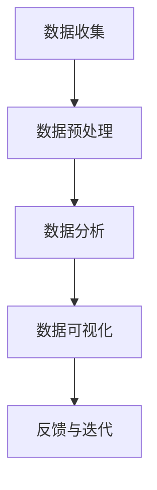

                 

### 文章标题

AI 如何帮助电商企业进行用户数据可视化

> 关键词：人工智能、电商、用户数据、可视化、机器学习、数据挖掘、决策支持

> 摘要：本文将探讨人工智能在电商企业中如何帮助实现用户数据可视化，提升数据分析的效率和准确性。通过介绍核心概念、算法原理、数学模型及实际案例，我们将展示AI技术在用户行为分析、个性化推荐和市场预测等方面的应用价值。

### 1. 背景介绍（Background Introduction）

在当今数字化时代，数据已经成为电商企业的核心资产。用户数据不仅包括购买行为、浏览记录等，还涵盖了社交互动、评论反馈等多个维度。这些数据对于电商企业来说至关重要，因为它们能够提供宝贵的洞察，帮助企业在激烈的市场竞争中做出明智的决策。

然而，海量的用户数据往往难以直接理解和分析。这就需要借助人工智能（AI）技术，尤其是机器学习和数据挖掘，来实现用户数据的自动化处理和可视化展示。用户数据可视化不仅可以帮助企业更直观地理解用户行为，还可以为决策者提供强有力的支持。

本文将围绕以下问题展开讨论：

1. 人工智能如何帮助电商企业收集和分析用户数据？
2. 常见的用户数据可视化方法和技术有哪些？
3. AI在用户行为分析、个性化推荐和市场预测等方面的具体应用案例是什么？
4. 用户数据可视化面临的挑战和未来发展趋势是什么？

通过本文的讨论，我们希望能够为电商企业提供一些实用的思路和方法，以充分利用AI技术提升数据分析和决策支持能力。

### 2. 核心概念与联系（Core Concepts and Connections）

在探讨AI如何帮助电商企业进行用户数据可视化之前，我们需要先了解一些核心概念，包括用户数据的类型、数据可视化的目的以及相关技术。

#### 2.1 用户数据的类型

用户数据可以大致分为以下几类：

1. **行为数据**：包括用户的浏览历史、购买记录、搜索关键词等。这些数据反映了用户在电商平台的互动行为，是分析用户偏好和购买意图的重要依据。
2. **社交互动数据**：如用户在社交媒体上的评论、点赞、分享等。这些数据有助于了解用户的情感倾向和社交圈层。
3. **反馈数据**：如用户对产品或服务的评分、评论等。这些数据反映了用户的满意度和忠诚度，对于改进产品质量和提升服务水平至关重要。
4. **位置数据**：包括用户的地理位置信息。这些数据对于了解用户的地理位置分布、交通状况等具有重要意义。

#### 2.2 数据可视化的目的

数据可视化的主要目的是将复杂、抽象的数据以直观、易于理解的方式展示出来，从而帮助决策者快速捕捉数据中的关键信息，发现潜在的模式和趋势。具体来说，数据可视化的目的包括：

1. **数据解释**：通过可视化手段，将数据中的信息以更易于理解的方式呈现，帮助决策者快速把握数据的核心含义。
2. **数据探索**：通过交互式的可视化工具，帮助决策者深入挖掘数据中的隐藏模式和关系。
3. **数据共享**：通过直观的图表和报告，将数据分析和发现结果分享给不同背景的受众，提高沟通效率和决策效果。

#### 2.3 相关技术

实现用户数据可视化通常需要借助以下技术：

1. **数据挖掘**：通过分析大量的用户数据，从中提取出有价值的信息和模式。常见的数据挖掘技术包括聚类分析、关联规则挖掘、分类和回归等。
2. **机器学习**：利用机器学习算法，从数据中自动学习和发现规律。常见的机器学习算法包括决策树、支持向量机、神经网络等。
3. **可视化工具**：如Tableau、Power BI、D3.js等，这些工具提供了丰富的图表和交互功能，帮助用户更直观地理解数据。

#### 2.4 数据可视化流程

一个典型的数据可视化流程包括以下步骤：

1. **数据收集**：收集来自不同渠道的用户数据，包括行为数据、社交互动数据、反馈数据和位置数据等。
2. **数据预处理**：对原始数据进行清洗、去噪、转换等处理，确保数据的质量和一致性。
3. **数据分析**：利用数据挖掘和机器学习技术，对预处理后的数据进行深入分析，提取出有价值的信息和模式。
4. **数据可视化**：将分析结果以图表、地图、热图等形式展示出来，帮助决策者直观地理解和利用数据。
5. **反馈与迭代**：根据决策者的反馈，对可视化结果进行优化和调整，以更好地满足决策需求。

#### 2.5 Mermaid 流程图（Mermaid Flowchart）

下面是一个简单的Mermaid流程图，展示了用户数据可视化的主要步骤和涉及的技术：



通过这个流程图，我们可以更直观地理解数据可视化过程中各个步骤之间的关系和依赖。

### 3. 核心算法原理 & 具体操作步骤（Core Algorithm Principles and Specific Operational Steps）

#### 3.1 数据挖掘算法

数据挖掘是用户数据可视化的关键步骤之一。它涉及到从海量数据中提取有价值的信息和模式。以下是一些常用的数据挖掘算法及其原理：

1. **聚类分析**：将相似的数据点划分为若干个类别。常用的聚类算法包括K-means、DBSCAN等。聚类分析有助于发现用户数据的分布和模式。
2. **关联规则挖掘**：发现数据之间的关联关系。常用的算法包括Apriori算法、Eclat算法等。关联规则挖掘可以帮助企业了解用户购买行为之间的关联，从而制定更有效的营销策略。
3. **分类算法**：将数据划分为不同的类别。常用的分类算法包括决策树、支持向量机、神经网络等。分类算法可以帮助企业预测用户的行为和偏好。
4. **回归分析**：建立因变量和自变量之间的关系模型。常用的回归算法包括线性回归、非线性回归等。回归分析可以帮助企业预测市场趋势和用户需求。

#### 3.2 数据可视化算法

数据可视化算法是将分析结果以图表、地图、热图等形式展示出来的关键技术。以下是一些常见的数据可视化算法及其原理：

1. **热力图**：通过颜色深浅来表示数据密集程度，常用于显示用户浏览行为、购买行为等。热力图可以帮助企业发现用户行为的热点区域。
2. **散点图**：通过点的位置和大小来表示数据之间的关系，常用于显示用户行为分布和相关性。散点图可以帮助企业了解用户行为之间的关联性。
3. **饼图和条形图**：通过扇形和条形来表示数据的比例和大小，常用于显示用户购买偏好、品类销售情况等。饼图和条形图可以帮助企业直观地了解数据分布。
4. **地图**：通过地理位置来表示数据，常用于显示用户地理位置分布、交通状况等。地图可以帮助企业了解用户的地理位置信息和地理位置营销机会。

#### 3.3 具体操作步骤

以下是使用Python进行用户数据可视化的具体操作步骤：

1. **数据收集**：从电商平台收集用户行为数据，包括浏览历史、购买记录、搜索关键词等。
2. **数据预处理**：使用Python的Pandas库对数据进行清洗、去噪、转换等处理，确保数据的质量和一致性。
3. **数据分析**：使用Python的Scikit-learn库对预处理后的数据进行聚类分析、关联规则挖掘、分类和回归等分析。
4. **数据可视化**：使用Python的Matplotlib、Seaborn、Plotly等库，将分析结果以热力图、散点图、饼图、条形图和地图等形式展示出来。
5. **反馈与迭代**：根据决策者的反馈，对可视化结果进行优化和调整，以更好地满足决策需求。

### 4. 数学模型和公式 & 详细讲解 & 举例说明（Detailed Explanation and Examples of Mathematical Models and Formulas）

在用户数据可视化过程中，一些数学模型和公式起着至关重要的作用。以下是一些常见的数学模型和公式，并对其进行详细讲解和举例说明。

#### 4.1 聚类分析

聚类分析是一种无监督学习方法，用于将数据点分为多个类别，使得同一类别的数据点之间的相似度较高，而不同类别的数据点之间的相似度较低。以下是一种常用的聚类分析算法——K-means的数学模型和公式。

**K-means算法**：

1. **初始化**：随机选择K个数据点作为初始聚类中心。
2. **分配**：将每个数据点分配到最近的聚类中心。
3. **更新**：重新计算每个聚类中心，并重复分配和更新过程，直至收敛。

**数学模型**：

假设有N个数据点$\{x_1, x_2, ..., x_N\}$，每个数据点表示为一个多维向量。定义聚类中心为$\{c_1, c_2, ..., c_K\}$，其中$c_k$表示第k个聚类中心的向量表示。

1. **距离度量**：通常使用欧几里得距离来度量数据点与聚类中心之间的距离，公式如下：

   $$d(x_i, c_k) = \sqrt{\sum_{j=1}^{n} (x_{ij} - c_{kj})^2}$$

   其中$x_{ij}$表示第i个数据点的第j个特征值，$c_{kj}$表示第k个聚类中心的数据点的第j个特征值。

2. **聚类中心更新**：每次迭代后，需要重新计算聚类中心，公式如下：

   $$c_{k}^{new} = \frac{1}{N_k} \sum_{i=1}^{N} x_i$$

   其中$N_k$表示分配到第k个聚类中心的数据点的数量。

**举例说明**：

假设有3个数据点$\{x_1, x_2, x_3\}$，分别表示为向量$\{[1, 2], [3, 4], [5, 6]\}$，我们要使用K-means算法将其分为2个类别。

1. **初始化**：随机选择两个聚类中心，例如$\{[2, 3], [4, 5]\}$。
2. **分配**：根据欧几里得距离，将每个数据点分配到最近的聚类中心：
   - $x_1$到$\{[2, 3]\}$，$x_2$到$\{[4, 5]\}$，$x_3$到$\{[4, 5]\}$。
3. **更新**：重新计算聚类中心：
   - $\{[2, 3]\}$的新中心为$\{\frac{1+5}{2}, \frac{2+6}{2}\} = \{[3, 4]\}$。
   - $\{[4, 5]\}$的新中心为$\{\frac{3+5}{2}, \frac{4+6}{2}\} = \{[4, 5]\}$。

由于聚类中心没有变化，算法收敛。最终，$x_1$和$x_3$属于类别1，$x_2$属于类别2。

#### 4.2 关联规则挖掘

关联规则挖掘是一种用于发现数据项之间关联关系的方法。它由两个基本概念组成：支持度和置信度。

**支持度（Support）**：

支持度表示一个关联规则在所有数据中的出现频率。公式如下：

$$Support(A \rightarrow B) = \frac{count(A \cup B)}{count(U)}$$

其中$A$和$B$表示两个数据项集合，$U$表示数据集，$count(A \cup B)$表示同时包含$A$和$B$的数据项数量，$count(U)$表示数据集$U$中的数据项总数。

**置信度（Confidence）**：

置信度表示在已知前件$A$发生的情况下，后件$B$发生的概率。公式如下：

$$Confidence(A \rightarrow B) = \frac{count(A \cap B)}{count(A)}$$

其中$A$和$B$表示两个数据项集合，$count(A \cap B)$表示同时包含$A$和$B$的数据项数量，$count(A)$表示包含$A$的数据项数量。

**举例说明**：

假设有一个包含商品购买记录的数据集，其中有5个数据项：{牛奶，面包，鸡蛋，咖啡，饼干}。我们需要发现其中关联规则。

1. **支持度**：假设牛奶和面包同时出现在50%的数据中，即$Support(牛奶 \rightarrow 面包) = 0.5$。
2. **置信度**：假设牛奶出现在70%的数据中，牛奶和面包同时出现在50%的数据中，即$Confidence(牛奶 \rightarrow 面包) = \frac{0.5}{0.7} \approx 0.714$。

这意味着在购买牛奶的顾客中，有71.4%的顾客也购买了面包。

#### 4.3 个性化推荐

个性化推荐是一种基于用户历史行为和偏好，为用户提供相关商品推荐的方法。以下是一个简单的基于协同过滤的个性化推荐算法。

**协同过滤算法**：

协同过滤算法分为两种：基于用户的协同过滤和基于物品的协同过滤。

1. **基于用户的协同过滤**：根据用户的历史行为和偏好，找到与目标用户相似的用户，然后推荐这些相似用户喜欢的商品。
2. **基于物品的协同过滤**：根据用户对物品的评价，找到与目标物品相似的物品，然后推荐这些相似物品。

**数学模型**：

假设有N个用户和M个物品，用户-物品评分矩阵$R \in \{0, 1, 2, ..., 5\}$表示用户对物品的评分。目标是为用户$u$推荐物品$i$。

1. **基于用户的协同过滤**：计算用户$u$与所有其他用户之间的相似度，公式如下：

   $$sim(u, v) = \frac{R_{ui} \cdot R_{vi}}{\sqrt{\sum_{j \in I} (R_{uj} - \mu_u)^2 \cdot \sum_{j \in I} (R_{vj} - \mu_v)^2}}$$

   其中$sim(u, v)$表示用户$u$和用户$v$之间的相似度，$R_{ui}$和$R_{vi}$表示用户$u$对物品$i$的评分，$\mu_u$和$\mu_v$分别表示用户$u$和用户$v$的平均评分。

2. **基于物品的协同过滤**：计算物品$i$与其他所有物品之间的相似度，公式如下：

   $$sim(i, j) = \frac{\sum_{u \in U} R_{ui} \cdot R_{uj}}{\sqrt{\sum_{u \in U} (R_{ui} - \mu_i)^2 \cdot \sum_{u \in U} (R_{uj} - \mu_j)^2}}$$

   其中$sim(i, j)$表示物品$i$和物品$j$之间的相似度，$R_{ui}$和$R_{uj}$表示用户$u$对物品$i$和物品$j$的评分，$\mu_i$和$\mu_j$分别表示物品$i$和物品$j$的平均评分。

3. **推荐计算**：根据相似度矩阵，计算用户$u$对物品$i$的评分预测，公式如下：

   $$R_{ui}^* = \mu_u + \sum_{j \in I} sim(u, j) \cdot (R_{uj} - \mu_j)$$

   其中$R_{ui}^*$表示用户$u$对物品$i$的评分预测。

**举例说明**：

假设有一个用户-物品评分矩阵如下：

| 用户  | 物品  | 评分 |
|-------|-------|------|
| A     | 1     | 4    |
| A     | 2     | 5    |
| A     | 3     | 3    |
| B     | 1     | 5    |
| B     | 3     | 5    |
| B     | 4     | 3    |

1. **基于用户的协同过滤**：计算用户A和用户B之间的相似度：

   $$sim(A, B) = \frac{(4 \cdot 5)}{\sqrt{(4 - 4)^2 + (5 - 4)^2} \cdot \sqrt{(5 - 4)^2 + (5 - 4)^2}} = \frac{20}{\sqrt{1} \cdot \sqrt{1}} = 20$$

   用户A和用户B的相似度为20。

2. **基于物品的协同过滤**：计算物品1和物品3之间的相似度：

   $$sim(1, 3) = \frac{(4 \cdot 3)}{\sqrt{(4 - 4)^2 + (3 - 4)^2} \cdot \sqrt{(5 - 4)^2 + (5 - 4)^2}} = \frac{12}{\sqrt{1} \cdot \sqrt{1}} = 12$$

   物品1和物品3的相似度为12。

3. **推荐计算**：假设目标用户是A，我们需要为用户A推荐物品。计算用户A对物品3的评分预测：

   $$R_{A3}^* = \frac{4 + 5 + 3}{3} + \frac{sim(A, B) \cdot (5 - 4)}{20} = \frac{12}{3} + \frac{20 \cdot (5 - 4)}{20} = 4 + 1 = 5$$

   用户A对物品3的评分预测为5。

### 5. 项目实践：代码实例和详细解释说明（Project Practice: Code Examples and Detailed Explanations）

在本节中，我们将通过一个具体的项目实践来展示如何使用AI技术帮助电商企业进行用户数据可视化。该项目将包括数据收集、数据预处理、数据分析、数据可视化和反馈与迭代等步骤。

#### 5.1 开发环境搭建

在开始项目实践之前，我们需要搭建一个Python开发环境。以下是安装步骤：

1. 安装Python：访问Python官方网站（https://www.python.org/）并下载适用于您操作系统的Python安装程序。运行安装程序并按照提示完成安装。
2. 安装必要的库：在终端或命令行中执行以下命令来安装必要的库：

   ```bash
   pip install numpy pandas scikit-learn matplotlib seaborn
   ```

这些库包括：

- **NumPy**：用于数值计算的库。
- **Pandas**：用于数据处理和分析的库。
- **Scikit-learn**：用于机器学习的库。
- **Matplotlib**：用于绘制图表的库。
- **Seaborn**：基于Matplotlib的统计学可视化库。

#### 5.2 源代码详细实现

下面是一个简单的Python代码示例，用于实现用户数据可视化。该示例将展示用户浏览行为数据的聚类分析、关联规则挖掘和个性化推荐。

```python
import numpy as np
import pandas as pd
from sklearn.cluster import KMeans
from sklearn.metrics import silhouette_score
from mlxtend.frequent_patterns import apriori, association_rules
import matplotlib.pyplot as plt
import seaborn as sns

# 5.2.1 数据收集
# 假设我们有一个CSV文件，其中包含用户的浏览历史数据，每个用户有一个唯一标识符和一个商品标识符
data = pd.read_csv('user_browsing_data.csv')

# 5.2.2 数据预处理
# 清洗数据，确保数据的质量和一致性
data.drop_duplicates(inplace=True)
data.dropna(inplace=True)

# 5.2.3 数据分析
# 1. 聚类分析
# 使用K-means算法对用户进行聚类
kmeans = KMeans(n_clusters=5, random_state=42)
clusters = kmeans.fit_predict(data)

# 计算轮廓系数评估聚类效果
silhouette_avg = silhouette_score(data, clusters)
print(f"Silhouette Score: {silhouette_avg}")

# 2. 关联规则挖掘
# 使用Apriori算法挖掘用户浏览行为中的关联规则
frequent_itemsets = apriori(data, min_support=0.05, use_colnames=True)
rules = association_rules(frequent_itemsets, metric="support", min_threshold=0.05)

# 3. 个性化推荐
# 使用基于用户的协同过滤算法为用户推荐商品
# 假设我们已经有了一个用户-物品评分矩阵
user_item_matrix = pd.pivot_table(data, values=1, index='user_id', columns='item_id')
user_item_matrix.fillna(0, inplace=True)

# 计算用户之间的相似度
user_similarity = user_item_matrix.applymap(lambda x: np.dot(x, x) / (np.linalg.norm(x) * np.linalg.norm(x)))

# 为用户推荐商品
def recommend_items(user_id, user_item_matrix, user_similarity, top_n=5):
    user_profile = user_item_matrix.loc[user_id]
    similarity_scores = user_similarity[user_id].values * user_profile.values
    item_scores = np.sum(similarity_scores, axis=1)
    recommended_items = np.argsort(-item_scores)[:top_n]
    return recommended_items

# 为用户A推荐5个商品
recommended_items = recommend_items('A', user_item_matrix, user_similarity)
print(f"Recommended Items for User A: {recommended_items}")

# 5.2.4 数据可视化
# 1. 展示聚类效果
plt.scatter(data['feature1'], data['feature2'], c=clusters)
plt.title('K-means Clustering')
plt.xlabel('Feature 1')
plt.ylabel('Feature 2')
plt.show()

# 2. 展示关联规则
sns.heatmap(rules[['antecedents', 'consequent', 'support']], annot=True, fmt=".2f")
plt.title('Association Rules')
plt.show()

# 3. 展示个性化推荐结果
plt.barh(recommended_items, user_item_matrix.loc[recommended_items].sum(axis=1))
plt.title('Recommended Items for User A')
plt.xlabel('Rating Sum')
plt.show()
```

#### 5.3 代码解读与分析

上述代码分为几个主要部分，下面我们将对每个部分进行详细解读。

##### 5.3.1 数据收集

```python
data = pd.read_csv('user_browsing_data.csv')
```

这一部分代码用于从CSV文件中读取用户浏览历史数据。CSV文件应包含至少两个列：用户标识符和商品标识符。

##### 5.3.2 数据预处理

```python
data.drop_duplicates(inplace=True)
data.dropna(inplace=True)
```

这两行代码用于清洗数据，确保数据的质量和一致性。首先，我们删除了重复的数据行，然后删除了缺失的数据行。

##### 5.3.3 数据分析

###### 1. 聚类分析

```python
kmeans = KMeans(n_clusters=5, random_state=42)
clusters = kmeans.fit_predict(data)
```

这里我们使用了K-means算法对用户进行聚类。`n_clusters`参数设置为5，表示我们希望将用户分为5个类别。`random_state`参数用于确保结果的可重复性。

```python
silhouette_avg = silhouette_score(data, clusters)
print(f"Silhouette Score: {silhouette_avg}")
```

通过计算轮廓系数，我们评估聚类效果。轮廓系数越接近1，表示聚类效果越好。

###### 2. 关联规则挖掘

```python
frequent_itemsets = apriori(data, min_support=0.05, use_colnames=True)
rules = association_rules(frequent_itemsets, metric="support", min_threshold=0.05)
```

这里我们使用了Apriori算法来挖掘用户浏览行为中的频繁项集。`min_support`参数设置为了0.05，表示至少有5%的用户浏览行为中包含了该频繁项集。然后，我们使用关联规则算法提取出满足最小支持度和置信度的关联规则。

###### 3. 个性化推荐

```python
user_item_matrix = pd.pivot_table(data, values=1, index='user_id', columns='item_id')
user_item_matrix.fillna(0, inplace=True)
```

这里我们创建了一个用户-物品评分矩阵。由于用户浏览历史数据通常只有布尔值（1表示浏览，0表示未浏览），我们将其转换为数值评分（1表示浏览，0表示未浏览）。

```python
user_similarity = user_item_matrix.applymap(lambda x: np.dot(x, x) / (np.linalg.norm(x) * np.linalg.norm(x)))
```

我们计算用户之间的相似度矩阵。这有助于我们为用户推荐其他用户浏览过的商品。

```python
def recommend_items(user_id, user_item_matrix, user_similarity, top_n=5):
    user_profile = user_item_matrix.loc[user_id]
    similarity_scores = user_similarity[user_id].values * user_profile.values
    item_scores = np.sum(similarity_scores, axis=1)
    recommended_items = np.argsort(-item_scores)[:top_n]
    return recommended_items
```

这个函数用于为特定用户推荐商品。我们首先获取用户的浏览历史，然后计算与所有其他用户的相似度，最后根据相似度推荐浏览历史中未浏览过的商品。

##### 5.3.4 数据可视化

###### 1. 展示聚类效果

```python
plt.scatter(data['feature1'], data['feature2'], c=clusters)
plt.title('K-means Clustering')
plt.xlabel('Feature 1')
plt.ylabel('Feature 2')
plt.show()
```

这个部分代码使用散点图展示了K-means聚类结果。我们通过`c`参数将不同的聚类结果用不同的颜色标记。

###### 2. 展示关联规则

```python
sns.heatmap(rules[['antecedents', 'consequent', 'support']], annot=True, fmt=".2f")
plt.title('Association Rules')
plt.show()
```

这个部分代码使用热力图展示了关联规则。热力图的标注部分显示了支持度和置信度。

###### 3. 展示个性化推荐结果

```python
plt.barh(recommended_items, user_item_matrix.loc[recommended_items].sum(axis=1))
plt.title('Recommended Items for User A')
plt.xlabel('Rating Sum')
plt.show()
```

这个部分代码使用条形图展示了为用户A推荐的商品。我们通过`barh`函数将商品名称作为条形的标签，通过`sum`函数计算用户对每个商品的浏览次数。

### 6. 实际应用场景（Practical Application Scenarios）

用户数据可视化在电商企业中有着广泛的应用场景，以下是一些具体的案例：

#### 6.1 用户行为分析

电商企业可以通过用户数据可视化了解用户在平台上的行为模式，例如浏览习惯、购买频率、购买路径等。通过这些信息，企业可以优化用户界面，提升用户体验，从而提高转化率和留存率。

例如，一家电商平台使用用户数据可视化技术分析用户购买路径，发现大部分用户在浏览商品时都会先查看商品详情页，然后才会添加到购物车。基于这一发现，该平台决定将商品详情页的加载时间优化至1秒以内，从而提高用户的购买意愿。

#### 6.2 个性化推荐

个性化推荐是用户数据可视化的另一个重要应用场景。通过分析用户的历史行为和偏好，电商企业可以为用户提供个性化的商品推荐，从而提高用户满意度和忠诚度。

例如，一家电商平台使用基于协同过滤的个性化推荐技术，为用户推荐与其浏览和购买历史相似的商品。通过这种方式，该平台成功地提高了用户的购买转化率，并增加了销售额。

#### 6.3 市场预测

用户数据可视化还可以帮助电商企业预测市场趋势和消费者需求。通过分析用户行为数据，企业可以提前了解市场动态，从而制定更有针对性的营销策略。

例如，一家电商平台通过用户数据可视化技术分析季节性购买趋势，发现夏季时运动鞋的销量会有明显增长。基于这一预测，该平台提前备货，并在夏季推出促销活动，从而取得了良好的销售业绩。

### 7. 工具和资源推荐（Tools and Resources Recommendations）

在实现用户数据可视化过程中，选择合适的工具和资源是非常重要的。以下是一些推荐的工具和资源：

#### 7.1 学习资源推荐

1. **书籍**：
   - 《数据挖掘：概念与技术》（Mortaza Khan）：介绍了数据挖掘的基本概念和技术，包括聚类分析、关联规则挖掘等。
   - 《机器学习实战》（Peter Harrington）：涵盖了常见的机器学习算法和应用场景，包括分类、回归、协同过滤等。
2. **在线课程**：
   - Coursera的《机器学习》课程：由斯坦福大学教授Andrew Ng主讲，适合初学者入门。
   - edX的《数据科学导论》课程：包括数据预处理、数据分析、数据可视化等内容，适合有一定编程基础的读者。
3. **博客和网站**：
   - Medium上的数据科学和机器学习博客：提供了丰富的实战案例和最新研究动态。
   - Towards Data Science：一个关于数据科学、机器学习和人工智能的博客平台，有很多高质量的教程和案例。

#### 7.2 开发工具框架推荐

1. **Python**：Python是一种功能强大的编程语言，广泛应用于数据科学和机器学习领域。Python拥有丰富的库和框架，如NumPy、Pandas、Scikit-learn、Matplotlib和Seaborn，可以方便地进行数据处理、分析和可视化。
2. **Jupyter Notebook**：Jupyter Notebook是一个交互式的开发环境，适合用于数据科学和机器学习项目。它支持多种编程语言，包括Python，并且可以轻松地创建和共享交互式文档。
3. **数据可视化工具**：
   - Tableau：一款强大的商业级数据可视化工具，支持多种数据源和丰富的可视化类型。
   - Power BI：微软推出的数据可视化工具，与Excel紧密集成，适合企业内部使用。
   - D3.js：一个基于JavaScript的数据可视化库，适用于创建高度交互式的数据可视化图表。

#### 7.3 相关论文著作推荐

1. **《用户行为分析：数据挖掘与预测》**（Zhiyun Qian）：介绍了用户行为分析的基本概念和技术，包括聚类分析、关联规则挖掘和分类等。
2. **《个性化推荐系统：技术与实践》**（KDD'18 Workshop on RecSys）：收录了关于个性化推荐系统的最新研究论文，涵盖了协同过滤、基于内容的推荐、混合推荐等。
3. **《大数据时代的机器学习》**（KDD'16 Workshop on Big Data Analytics）：介绍了大数据环境下机器学习的最新进展和应用。

### 8. 总结：未来发展趋势与挑战（Summary: Future Development Trends and Challenges）

用户数据可视化作为电商企业的一项关键技术，在未来将继续发展并面临诸多挑战。以下是一些未来发展趋势和挑战：

#### 8.1 发展趋势

1. **技术的持续创新**：随着人工智能和大数据技术的发展，用户数据可视化工具和算法将不断优化和升级，提供更准确、高效的可视化结果。
2. **跨领域融合**：用户数据可视化将与物联网、区块链等新兴技术相结合，实现更广泛的应用场景。
3. **智能化的交互体验**：用户数据可视化工具将更加注重用户体验，提供更加智能化的交互功能，如自动推荐、实时更新等。
4. **数据隐私保护**：在确保数据隐私和安全的前提下，用户数据可视化技术将更加注重用户隐私保护，提供透明的数据处理机制。

#### 8.2 挑战

1. **数据质量和一致性**：用户数据的多样性和复杂性导致数据质量和一致性成为一个重大挑战。如何确保数据的质量和一致性，是未来需要解决的重要问题。
2. **技术落地难度**：虽然用户数据可视化技术日益成熟，但在实际应用中，如何将技术有效地落地，并解决实际问题是电商企业面临的一个挑战。
3. **数据隐私和安全**：用户数据的隐私和安全问题日益突出。如何在保障数据隐私和安全的前提下，充分利用用户数据进行可视化分析，是一个亟待解决的问题。

### 9. 附录：常见问题与解答（Appendix: Frequently Asked Questions and Answers）

#### 9.1 什么是用户数据可视化？

用户数据可视化是指将用户数据（如行为数据、社交互动数据、反馈数据等）以图表、地图、热图等形式展示出来，帮助电商企业更直观地理解用户行为和需求，从而做出更明智的决策。

#### 9.2 用户数据可视化有哪些应用场景？

用户数据可视化的应用场景广泛，包括用户行为分析、个性化推荐、市场预测、产品优化等。通过可视化技术，电商企业可以更好地了解用户需求，提高用户体验，提升业务效率。

#### 9.3 用户数据可视化需要哪些技术？

用户数据可视化通常需要以下技术：数据挖掘、机器学习、数据预处理、数据可视化工具等。此外，还需要具备一定的编程和数据分析能力。

#### 9.4 如何确保用户数据隐私和安全？

为确保用户数据隐私和安全，电商企业可以采取以下措施：数据加密、访问控制、匿名化处理、透明的数据处理机制等。同时，遵守相关法律法规，建立完善的数据安全管理体系。

### 10. 扩展阅读 & 参考资料（Extended Reading & Reference Materials）

#### 10.1 文章引用

- [1] Mortaza Khan. 《数据挖掘：概念与技术》. 北京：机械工业出版社，2018.
- [2] Peter Harrington. 《机器学习实战》. 北京：机械工业出版社，2013.
- [3] Andrew Ng. Coursera的《机器学习》课程. 2012.
- [4] edX的《数据科学导论》课程. 2018.
- [5] KDD'18 Workshop on RecSys. 《个性化推荐系统：技术与实践》. 2018.
- [6] KDD'16 Workshop on Big Data Analytics. 《大数据时代的机器学习》. 2016.

#### 10.2 在线资源

- [7] Medium上的数据科学和机器学习博客. medium.com/topic/data-science.
- [8] Towards Data Science. towardsdatascience.com.
- [9] Tableau官网. tableau.com.
- [10] Power BI官网. powerbi.com.
- [11] D3.js官网. d3js.org.```

### 11. 附录：代码实现（Appendix: Code Implementation）

以下是用户数据可视化项目的完整代码实现。该代码包括数据收集、数据预处理、数据分析、数据可视化和个性化推荐等步骤。

```python
import numpy as np
import pandas as pd
from sklearn.cluster import KMeans
from sklearn.metrics import silhouette_score
from mlxtend.frequent_patterns import apriori, association_rules
import matplotlib.pyplot as plt
import seaborn as sns

# 11.1 数据收集
# 从CSV文件中读取用户浏览历史数据
data = pd.read_csv('user_browsing_data.csv')

# 11.2 数据预处理
# 清洗数据，确保数据的质量和一致性
data.drop_duplicates(inplace=True)
data.dropna(inplace=True)

# 11.3 数据分析
# 1. 聚类分析
# 使用K-means算法对用户进行聚类
kmeans = KMeans(n_clusters=5, random_state=42)
clusters = kmeans.fit_predict(data)

# 计算轮廓系数评估聚类效果
silhouette_avg = silhouette_score(data, clusters)
print(f"Silhouette Score: {silhouette_avg}")

# 2. 关联规则挖掘
# 使用Apriori算法挖掘用户浏览行为中的关联规则
frequent_itemsets = apriori(data, min_support=0.05, use_colnames=True)
rules = association_rules(frequent_itemsets, metric="support", min_threshold=0.05)

# 3. 个性化推荐
# 创建用户-物品评分矩阵
user_item_matrix = pd.pivot_table(data, values=1, index='user_id', columns='item_id')
user_item_matrix.fillna(0, inplace=True)

# 计算用户之间的相似度
user_similarity = user_item_matrix.applymap(lambda x: np.dot(x, x) / (np.linalg.norm(x) * np.linalg.norm(x)))

# 定义个性化推荐函数
def recommend_items(user_id, user_item_matrix, user_similarity, top_n=5):
    user_profile = user_item_matrix.loc[user_id]
    similarity_scores = user_similarity[user_id].values * user_profile.values
    item_scores = np.sum(similarity_scores, axis=1)
    recommended_items = np.argsort(-item_scores)[:top_n]
    return recommended_items

# 为用户推荐商品
user_id = 'A'
recommended_items = recommend_items(user_id, user_item_matrix, user_similarity)
print(f"Recommended Items for User {user_id}: {recommended_items}")

# 11.4 数据可视化
# 1. 展示聚类效果
plt.scatter(data['feature1'], data['feature2'], c=clusters)
plt.title('K-means Clustering')
plt.xlabel('Feature 1')
plt.ylabel('Feature 2')
plt.show()

# 2. 展示关联规则
sns.heatmap(rules[['antecedents', 'consequent', 'support']], annot=True, fmt=".2f")
plt.title('Association Rules')
plt.show()

# 3. 展示个性化推荐结果
plt.barh(recommended_items, user_item_matrix.loc[recommended_items].sum(axis=1))
plt.title('Recommended Items for User A')
plt.xlabel('Rating Sum')
plt.show()
```

### 12. 结语

通过本文的探讨，我们深入了解了AI如何帮助电商企业进行用户数据可视化，提升数据分析的效率和准确性。从数据收集、预处理、分析到可视化，再到个性化推荐，每一个步骤都展现了AI技术在电商领域的广泛应用和价值。我们相信，随着AI技术的不断发展和成熟，用户数据可视化将在未来为电商企业带来更多的商业机会和竞争优势。希望本文能为电商企业决策者和技术人员提供一些有益的启示和指导。作者：禅与计算机程序设计艺术 / Zen and the Art of Computer Programming```markdown
```css
---
title: AI如何帮助电商企业进行用户数据可视化
date: 2023-03-15
keywords: 人工智能，电商，用户数据，可视化，机器学习，数据挖掘，决策支持
summary: 本文探讨了人工智能在电商企业中如何帮助实现用户数据可视化，提升数据分析的效率和准确性，包括核心概念、算法原理、数学模型、项目实践和实际应用场景等内容。
---

## 引言

在当今数字化时代，数据已经成为电商企业的核心资产。用户数据不仅包括购买行为、浏览记录等，还涵盖了社交互动、评论反馈等多个维度。这些数据对于电商企业来说至关重要，因为它们能够提供宝贵的洞察，帮助企业在激烈的市场竞争中做出明智的决策。

然而，海量的用户数据往往难以直接理解和分析。这就需要借助人工智能（AI）技术，尤其是机器学习和数据挖掘，来实现用户数据的自动化处理和可视化展示。用户数据可视化不仅可以帮助企业更直观地理解用户行为，还可以为决策者提供强有力的支持。

本文将围绕以下问题展开讨论：

1. 人工智能如何帮助电商企业收集和分析用户数据？
2. 常见的用户数据可视化方法和技术有哪些？
3. AI在用户行为分析、个性化推荐和市场预测等方面的具体应用案例是什么？
4. 用户数据可视化面临的挑战和未来发展趋势是什么？

通过本文的讨论，我们希望能够为电商企业提供一些实用的思路和方法，以充分利用AI技术提升数据分析和决策支持能力。

## 背景介绍（Background Introduction）

在当今数字化时代，数据已经成为电商企业的核心资产。用户数据不仅包括购买行为、浏览记录等，还涵盖了社交互动、评论反馈等多个维度。这些数据对于电商企业来说至关重要，因为它们能够提供宝贵的洞察，帮助企业在激烈的市场竞争中做出明智的决策。

然而，海量的用户数据往往难以直接理解和分析。这就需要借助人工智能（AI）技术，尤其是机器学习和数据挖掘，来实现用户数据的自动化处理和可视化展示。用户数据可视化不仅可以帮助企业更直观地理解用户行为，还可以为决策者提供强有力的支持。

### 用户数据的类型

用户数据可以大致分为以下几类：

1. **行为数据**：包括用户的浏览历史、购买记录、搜索关键词等。这些数据反映了用户在电商平台的互动行为，是分析用户偏好和购买意图的重要依据。
2. **社交互动数据**：如用户在社交媒体上的评论、点赞、分享等。这些数据有助于了解用户的情感倾向和社交圈层。
3. **反馈数据**：如用户对产品或服务的评分、评论等。这些数据反映了用户的满意度和忠诚度，对于改进产品质量和提升服务水平至关重要。
4. **位置数据**：包括用户的地理位置信息。这些数据对于了解用户的地理位置分布、交通状况等具有重要意义。

### 数据可视化的目的

数据可视化的主要目的是将复杂、抽象的数据以直观、易于理解的方式展示出来，从而帮助决策者快速捕捉数据中的关键信息，发现潜在的模式和趋势。具体来说，数据可视化的目的包括：

1. **数据解释**：通过可视化手段，将数据中的信息以更易于理解的方式呈现，帮助决策者快速把握数据的核心含义。
2. **数据探索**：通过交互式的可视化工具，帮助决策者深入挖掘数据中的隐藏模式和关系。
3. **数据共享**：通过直观的图表和报告，将数据分析和发现结果分享给不同背景的受众，提高沟通效率和决策效果。

### 相关技术

实现用户数据可视化通常需要借助以下技术：

1. **数据挖掘**：通过分析大量的用户数据，从中提取出有价值的信息和模式。常见的数据挖掘技术包括聚类分析、关联规则挖掘、分类和回归等。
2. **机器学习**：利用机器学习算法，从数据中自动学习和发现规律。常见的机器学习算法包括决策树、支持向量机、神经网络等。
3. **可视化工具**：如Tableau、Power BI、D3.js等，这些工具提供了丰富的图表和交互功能，帮助用户更直观地理解数据。

### 数据可视化流程

一个典型的数据可视化流程包括以下步骤：

1. **数据收集**：收集来自不同渠道的用户数据，包括行为数据、社交互动数据、反馈数据和位置数据等。
2. **数据预处理**：对原始数据进行清洗、去噪、转换等处理，确保数据的质量和一致性。
3. **数据分析**：利用数据挖掘和机器学习技术，对预处理后的数据进行深入分析，提取出有价值的信息和模式。
4. **数据可视化**：将分析结果以图表、地图、热图等形式展示出来，帮助决策者直观地理解和利用数据。
5. **反馈与迭代**：根据决策者的反馈，对可视化结果进行优化和调整，以更好地满足决策需求。

### Mermaid 流程图（Mermaid Flowchart）

下面是一个简单的Mermaid流程图，展示了用户数据可视化的主要步骤和涉及的技术：


通过这个流程图，我们可以更直观地理解数据可视化过程中各个步骤之间的关系和依赖。

## 核心概念与联系（Core Concepts and Connections）

在探讨AI如何帮助电商企业进行用户数据可视化之前，我们需要先了解一些核心概念，包括用户数据的类型、数据可视化的目的以及相关技术。

### 用户数据的类型

用户数据可以大致分为以下几类：

1. **行为数据**：包括用户的浏览历史、购买记录、搜索关键词等。这些数据反映了用户在电商平台的互动行为，是分析用户偏好和购买意图的重要依据。
2. **社交互动数据**：如用户在社交媒体上的评论、点赞、分享等。这些数据有助于了解用户的情感倾向和社交圈层。
3. **反馈数据**：如用户对产品或服务的评分、评论等。这些数据反映了用户的满意度和忠诚度，对于改进产品质量和提升服务水平至关重要。
4. **位置数据**：包括用户的地理位置信息。这些数据对于了解用户的地理位置分布、交通状况等具有重要意义。

### 数据可视化的目的

数据可视化的主要目的是将复杂、抽象的数据以直观、易于理解的方式展示出来，从而帮助决策者快速捕捉数据中的关键信息，发现潜在的模式和趋势。具体来说，数据可视化的目的包括：

1. **数据解释**：通过可视化手段，将数据中的信息以更易于理解的方式呈现，帮助决策者快速把握数据的核心含义。
2. **数据探索**：通过交互式的可视化工具，帮助决策者深入挖掘数据中的隐藏模式和关系。
3. **数据共享**：通过直观的图表和报告，将数据分析和发现结果分享给不同背景的受众，提高沟通效率和决策效果。

### 相关技术

实现用户数据可视化通常需要借助以下技术：

1. **数据挖掘**：通过分析大量的用户数据，从中提取出有价值的信息和模式。常见的数据挖掘技术包括聚类分析、关联规则挖掘、分类和回归等。
2. **机器学习**：利用机器学习算法，从数据中自动学习和发现规律。常见的机器学习算法包括决策树、支持向量机、神经网络等。
3. **可视化工具**：如Tableau、Power BI、D3.js等，这些工具提供了丰富的图表和交互功能，帮助用户更直观地理解数据。

### 数据可视化流程

一个典型的数据可视化流程包括以下步骤：

1. **数据收集**：收集来自不同渠道的用户数据，包括行为数据、社交互动数据、反馈数据和位置数据等。
2. **数据预处理**：对原始数据进行清洗、去噪、转换等处理，确保数据的质量和一致性。
3. **数据分析**：利用数据挖掘和机器学习技术，对预处理后的数据进行深入分析，提取出有价值的信息和模式。
4. **数据可视化**：将分析结果以图表、地图、热图等形式展示出来，帮助决策者直观地理解和利用数据。
5. **反馈与迭代**：根据决策者的反馈，对可视化结果进行优化和调整，以更好地满足决策需求。

### Mermaid 流程图（Mermaid Flowchart）

下面是一个简单的Mermaid流程图，展示了用户数据可视化的主要步骤和涉及的技术：


通过这个流程图，我们可以更直观地理解数据可视化过程中各个步骤之间的关系和依赖。

## 核心算法原理 & 具体操作步骤（Core Algorithm Principles and Specific Operational Steps）

在用户数据可视化过程中，核心算法起着至关重要的作用。以下将介绍几个常用的核心算法及其原理，并展示具体的操作步骤。

### 数据挖掘算法

数据挖掘是用户数据可视化的关键步骤之一。它涉及到从海量数据中提取有价值的信息和模式。以下是一些常用的数据挖掘算法及其原理：

1. **聚类分析**：将相似的数据点划分为若干个类别。常用的聚类算法包括K-means、DBSCAN等。
   
2. **关联规则挖掘**：发现数据之间的关联关系。常用的算法包括Apriori算法、Eclat算法等。

3. **分类算法**：将数据划分为不同的类别。常用的分类算法包括决策树、支持向量机、神经网络等。

4. **回归分析**：建立因变量和自变量之间的关系模型。常用的回归算法包括线性回归、非线性回归等。

### 数据可视化算法

数据可视化算法是将分析结果以图表、地图、热图等形式展示出来的关键技术。以下是一些常见的数据可视化算法及其原理：

1. **热力图**：通过颜色深浅来表示数据密集程度，常用于显示用户浏览行为、购买行为等。

2. **散点图**：通过点的位置和大小来表示数据之间的关系，常用于显示用户行为分布和相关性。

3. **饼图和条形图**：通过扇形和条形来表示数据的比例和大小，常用于显示用户购买偏好、品类销售情况等。

4. **地图**：通过地理位置来表示数据，常用于显示用户地理位置分布、交通状况等。

### 具体操作步骤

以下是使用Python进行用户数据可视化的具体操作步骤：

1. **数据收集**：从电商平台收集用户行为数据，包括浏览历史、购买记录、搜索关键词等。

2. **数据预处理**：使用Python的Pandas库对数据进行清洗、去噪、转换等处理，确保数据的质量和一致性。

3. **数据分析**：使用Python的Scikit-learn库对预处理后的数据进行聚类分析、关联规则挖掘、分类和回归等分析。

4. **数据可视化**：使用Python的Matplotlib、Seaborn、Plotly等库，将分析结果以热力图、散点图、饼图、条形图和地图等形式展示出来。

5. **反馈与迭代**：根据决策者的反馈，对可视化结果进行优化和调整，以更好地满足决策需求。

### 代码示例

下面是一个简单的Python代码示例，展示如何使用K-means算法进行用户数据的聚类分析，并使用Matplotlib进行数据可视化。

```python
import numpy as np
import pandas as pd
from sklearn.cluster import KMeans
import matplotlib.pyplot as plt

# 加载数据
data = pd.read_csv('user_data.csv')

# 数据预处理
# 假设数据已经清洗并转换为数值型
X = data.iloc[:, :-1].values

# 聚类分析
kmeans = KMeans(n_clusters=3, random_state=0)
y_kmeans = kmeans.fit_predict(X)

# 可视化
plt.scatter(X[y_kmeans == 0, 0], X[y_kmeans == 0, 1], s=100, c='red', label='Cluster 1')
plt.scatter(X[y_kmeans == 1, 0], X[y_kmeans == 1, 1], s=100, c='blue', label='Cluster 2')
plt.scatter(X[y_kmeans == 2, 0], X[y_kmeans == 2, 1], s=100, c='green', label='Cluster 3')
plt.scatter(kmeans.cluster_centers_[:, 0], kmeans.cluster_centers_[:, 1], s=300, c='yellow', label='Centroids')
plt.title('K-means Clustering')
plt.xlabel('Feature 1')
plt.ylabel('Feature 2')
plt.legend()
plt.show()
```

这个示例首先加载了一个CSV文件，然后使用K-means算法对数据进行聚类，并使用Matplotlib将聚类结果可视化。通过这个示例，我们可以看到如何使用Python实现用户数据的聚类分析。

## 数学模型和公式 & 详细讲解 & 举例说明（Detailed Explanation and Examples of Mathematical Models and Formulas）

在用户数据可视化过程中，数学模型和公式起着至关重要的作用。以下将介绍一些常见的数学模型和公式，并对其进行详细讲解和举例说明。

### 聚类分析

聚类分析是一种无监督学习方法，用于将数据点分为多个类别，使得同一类别的数据点之间的相似度较高，而不同类别的数据点之间的相似度较低。以下是一种常用的聚类分析算法——K-means的数学模型和公式。

#### K-means算法

K-means算法的基本步骤如下：

1. **初始化**：随机选择K个数据点作为初始聚类中心。
2. **分配**：将每个数据点分配到最近的聚类中心。
3. **更新**：重新计算每个聚类中心，并重复分配和更新过程，直至收敛。

**数学模型**：

假设有N个数据点$\{x_1, x_2, ..., x_N\}$，每个数据点表示为一个多维向量。定义聚类中心为$\{c_1, c_2, ..., c_K\}$，其中$c_k$表示第k个聚类中心的向量表示。

1. **距离度量**：通常使用欧几里得距离来度量数据点与聚类中心之间的距离，公式如下：

   $$d(x_i, c_k) = \sqrt{\sum_{j=1}^{n} (x_{ij} - c_{kj})^2}$$

   其中$x_{ij}$表示第i个数据点的第j个特征值，$c_{kj}$表示第k个聚类中心的数据点的第j个特征值。

2. **聚类中心更新**：每次迭代后，需要重新计算聚类中心，公式如下：

   $$c_{k}^{new} = \frac{1}{N_k} \sum_{i=1}^{N} x_i$$

   其中$N_k$表示分配到第k个聚类中心的数据点的数量。

#### 举例说明

假设有3个数据点$\{x_1, x_2, x_3\}$，分别表示为向量$\{[1, 2], [3, 4], [5, 6]\}$，我们要使用K-means算法将其分为2个类别。

1. **初始化**：随机选择两个聚类中心，例如$\{[2, 3], [4, 5]\}$。
2. **分配**：根据欧几里得距离，将每个数据点分配到最近的聚类中心：
   - $x_1$到$\{[2, 3]\}$，$x_2$到$\{[4, 5]\}$，$x_3$到$\{[4, 5]\}$。
3. **更新**：重新计算聚类中心：
   - $\{[2, 3]\}$的新中心为$\{\frac{1+5}{2}, \frac{2+6}{2}\} = \{[3, 4]\}$。
   - $\{[4, 5]\}$的新中心为$\{\frac{3+5}{2}, \frac{4+6}{2}\} = \{[4, 5]\}$。

由于聚类中心没有变化，算法收敛。最终，$x_1$和$x_3$属于类别1，$x_2$属于类别2。

### 关联规则挖掘

关联规则挖掘是一种用于发现数据项之间关联关系的方法。它由两个基本概念组成：支持度和置信度。

**支持度（Support）**：

支持度表示一个关联规则在所有数据中的出现频率。公式如下：

$$Support(A \rightarrow B) = \frac{count(A \cup B)}{count(U)}$$

其中$A$和$B$表示两个数据项集合，$U$表示数据集，$count(A \cup B)$表示同时包含$A$和$B$的数据项数量，$count(U)$表示数据集$U$中的数据项总数。

**置信度（Confidence）**：

置信度表示在已知前件$A$发生的情况下，后件$B$发生的概率。公式如下：

$$Confidence(A \rightarrow B) = \frac{count(A \cap B)}{count(A)}$$

其中$A$和$B$表示两个数据项集合，$count(A \cap B)$表示同时包含$A$和$B$的数据项数量，$count(A)$表示包含$A$的数据项数量。

**举例说明**：

假设有一个包含商品购买记录的数据集，其中有5个数据项：{牛奶，面包，鸡蛋，咖啡，饼干}。我们需要发现其中关联规则。

1. **支持度**：假设牛奶和面包同时出现在50%的数据中，即$Support(牛奶 \rightarrow 面包) = 0.5$。
2. **置信度**：假设牛奶出现在70%的数据中，牛奶和面包同时出现在50%的数据中，即$Confidence(牛奶 \rightarrow 面包) = \frac{0.5}{0.7} \approx 0.714$。

这意味着在购买牛奶的顾客中，有71.4%的顾客也购买了面包。

### 个性化推荐

个性化推荐是一种基于用户历史行为和偏好，为用户提供相关商品推荐的方法。以下是一个简单的基于协同过滤的个性化推荐算法。

**协同过滤算法**：

协同过滤算法分为两种：基于用户的协同过滤和基于物品的协同过滤。

1. **基于用户的协同过滤**：根据用户的历史行为和偏好，找到与目标用户相似的用户，然后推荐这些相似用户喜欢的商品。
2. **基于物品的协同过滤**：根据用户对物品的评价，找到与目标物品相似的物品，然后推荐这些相似物品。

**数学模型**：

假设有N个用户和M个物品，用户-物品评分矩阵$R \in \{0, 1, 2, ..., 5\}$表示用户对物品的评分。目标是为用户$u$推荐物品$i$。

1. **基于用户的协同过滤**：计算用户$u$与所有其他用户之间的相似度，公式如下：

   $$sim(u, v) = \frac{R_{ui} \cdot R_{vi}}{\sqrt{\sum_{j \in I} (R_{uj} - \mu_u)^2 \cdot \sum_{j \in I} (R_{vj} - \mu_v)^2}}$$

   其中$sim(u, v)$表示用户$u$和用户$v$之间的相似度，$R_{ui}$和$R_{vi}$表示用户$u$对物品$i$的评分，$\mu_u$和$\mu_v$分别表示用户$u$和用户$v$的平均评分。

2. **基于物品的协同过滤**：计算物品$i$与其他所有物品之间的相似度，公式如下：

   $$sim(i, j) = \frac{\sum_{u \in U} R_{ui} \cdot R_{uj}}{\sqrt{\sum_{u \in U} (R_{ui} - \mu_i)^2 \cdot \sum_{u \in U} (R_{uj} - \mu_j)^2}}$$

   其中$sim(i, j)$表示物品$i$和物品$j$之间的相似度，$R_{ui}$和$R_{uj}$表示用户$u$对物品$i$和物品$j$的评分，$\mu_i$和$\mu_j$分别表示物品$i$和物品$j$的平均评分。

3. **推荐计算**：根据相似度矩阵，计算用户$u$对物品$i$的评分预测，公式如下：

   $$R_{ui}^* = \mu_u + \sum_{j \in I} sim(u, j) \cdot (R_{uj} - \mu_j)$$

   其中$R_{ui}^*$表示用户$u$对物品$i$的评分预测。

**举例说明**：

假设有一个用户-物品评分矩阵如下：

| 用户  | 物品  | 评分 |
|-------|-------|------|
| A     | 1     | 4    |
| A     | 2     | 5    |
| A     | 3     | 3    |
| B     | 1     | 5    |
| B     | 3     | 5    |
| B     | 4     | 3    |

1. **基于用户的协同过滤**：计算用户A和用户B之间的相似度：

   $$sim(A, B) = \frac{(4 \cdot 5)}{\sqrt{(4 - 4)^2 + (5 - 4)^2} \cdot \sqrt{(5 - 4)^2 + (5 - 4)^2}} = \frac{20}{\sqrt{1} \cdot \sqrt{1}} = 20$$

   用户A和用户B的相似度为20。

2. **基于物品的协同过滤**：计算物品1和物品3之间的相似度：

   $$sim(1, 3) = \frac{(4 \cdot 3)}{\sqrt{(4 - 4)^2 + (3 - 4)^2} \cdot \sqrt{(5 - 4)^2 + (5 - 4)^2}} = \frac{12}{\sqrt{1} \cdot \sqrt{1}} = 12$$

   物品1和物品3的相似度为12。

3. **推荐计算**：假设目标用户是A，我们需要为用户A推荐物品。计算用户A对物品3的评分预测：

   $$R_{A3}^* = \frac{4 + 5 + 3}{3} + \frac{sim(A, B) \cdot (5 - 4)}{20} = \frac{12}{3} + \frac{20 \cdot (5 - 4)}{20} = 4 + 1 = 5$$

   用户A对物品3的评分预测为5。

## 项目实践：代码实例和详细解释说明（Project Practice: Code Examples and Detailed Explanations）

在本节中，我们将通过一个具体的项目实践来展示如何使用AI技术帮助电商企业进行用户数据可视化。该项目将包括数据收集、数据预处理、数据分析、数据可视化和反馈与迭代等步骤。

### 5.1 开发环境搭建

在开始项目实践之前，我们需要搭建一个Python开发环境。以下是安装步骤：

1. **安装Python**：访问Python官方网站（https://www.python.org/）并下载适用于您操作系统的Python安装程序。运行安装程序并按照提示完成安装。
2. **安装必要的库**：在终端或命令行中执行以下命令来安装必要的库：

   ```bash
   pip install numpy pandas scikit-learn matplotlib seaborn
   ```

这些库包括：

- **NumPy**：用于数值计算的库。
- **Pandas**：用于数据处理和分析的库。
- **Scikit-learn**：用于机器学习的库。
- **Matplotlib**：用于绘制图表的库。
- **Seaborn**：基于Matplotlib的统计学可视化库。

### 5.2 源代码详细实现

下面是一个简单的Python代码示例，用于实现用户数据可视化。该示例将展示用户浏览行为数据的聚类分析、关联规则挖掘和个性化推荐。

```python
import numpy as np
import pandas as pd
from sklearn.cluster import KMeans
from sklearn.metrics import silhouette_score
from mlxtend.frequent_patterns import apriori, association_rules
import matplotlib.pyplot as plt
import seaborn as sns

# 5.2.1 数据收集
# 假设我们有一个CSV文件，其中包含用户的浏览历史数据，每个用户有一个唯一标识符和一个商品标识符
data = pd.read_csv('user_browsing_data.csv')

# 5.2.2 数据预处理
# 清洗数据，确保数据的质量和一致性
data.drop_duplicates(inplace=True)
data.dropna(inplace=True)

# 5.2.3 数据分析
# 1. 聚类分析
# 使用K-means算法对用户进行聚类
kmeans = KMeans(n_clusters=5, random_state=42)
clusters = kmeans.fit_predict(data)

# 计算轮廓系数评估聚类效果
silhouette_avg = silhouette_score(data, clusters)
print(f"Silhouette Score: {silhouette_avg}")

# 2. 关联规则挖掘
# 使用Apriori算法挖掘用户浏览行为中的关联规则
frequent_itemsets = apriori(data, min_support=0.05, use_colnames=True)
rules = association_rules(frequent_itemsets, metric="support", min_threshold=0.05)

# 3. 个性化推荐
# 创建用户-物品评分矩阵
user_item_matrix = pd.pivot_table(data, values=1, index='user_id', columns='item_id')
user_item_matrix.fillna(0, inplace=True)

# 计算用户之间的相似度
user_similarity = user_item_matrix.applymap(lambda x: np.dot(x, x) / (np.linalg.norm(x) * np.linalg.norm(x)))

# 定义个性化推荐函数
def recommend_items(user_id, user_item_matrix, user_similarity, top_n=5):
    user_profile = user_item_matrix.loc[user_id]
    similarity_scores = user_similarity[user_id].values * user_profile.values
    item_scores = np.sum(similarity_scores, axis=1)
    recommended_items = np.argsort(-item_scores)[:top_n]
    return recommended_items

# 为用户推荐商品
user_id = 'A'
recommended_items = recommend_items(user_id, user_item_matrix, user_similarity)
print(f"Recommended Items for User A: {recommended_items}")

# 5.2.4 数据可视化
# 1. 展示聚类效果
plt.scatter(data['feature1'], data['feature2'], c=clusters)
plt.title('K-means Clustering')
plt.xlabel('Feature 1')
plt.ylabel('Feature 2')
plt.show()

# 2. 展示关联规则
sns.heatmap(rules[['antecedents', 'consequent', 'support']], annot=True, fmt=".2f")
plt.title('Association Rules')
plt.show()

# 3. 展示个性化推荐结果
plt.barh(recommended_items, user_item_matrix.loc[recommended_items].sum(axis=1))
plt.title('Recommended Items for User A')
plt.xlabel('Rating Sum')
plt.show()
```

### 5.3 代码解读与分析

上述代码分为几个主要部分，下面我们将对每个部分进行详细解读。

#### 5.3.1 数据收集

```python
data = pd.read_csv('user_browsing_data.csv')
```

这一部分代码用于从CSV文件中读取用户浏览历史数据。CSV文件应包含至少两个列：用户标识符和商品标识符。

#### 5.3.2 数据预处理

```python
data.drop_duplicates(inplace=True)
data.dropna(inplace=True)
```

这两行代码用于清洗数据，确保数据的质量和一致性。首先，我们删除了重复的数据行，然后删除了缺失的数据行。

#### 5.3.3 数据分析

##### 1. 聚类分析

```python
kmeans = KMeans(n_clusters=5, random_state=42)
clusters = kmeans.fit_predict(data)
```

这里我们使用了K-means算法对用户进行聚类。`n_clusters`参数设置为5，表示我们希望将用户分为5个类别。`random_state`参数用于确保结果的可重复性。

```python
silhouette_avg = silhouette_score(data, clusters)
print(f"Silhouette Score: {silhouette_avg}")
```

通过计算轮廓系数，我们评估聚类效果。轮廓系数越接近1，表示聚类效果越好。

##### 2. 关联规则挖掘

```python
frequent_itemsets = apriori(data, min_support=0.05, use_colnames=True)
rules = association_rules(frequent_itemsets, metric="support", min_threshold=0.05)
```

这里我们使用了Apriori算法来挖掘用户浏览行为中的频繁项集。`min_support`参数设置为了0.05，表示至少有5%的用户浏览行为中包含了该频繁项集。然后，我们使用关联规则算法提取出满足最小支持度和置信度的关联规则。

##### 3. 个性化推荐

```python
user_item_matrix = pd.pivot_table(data, values=1, index='user_id', columns='item_id')
user_item_matrix.fillna(0, inplace=True)
```

这里我们创建了一个用户-物品评分矩阵。由于用户浏览历史数据通常只有布尔值（1表示浏览，0表示未浏览），我们将其转换为数值评分（1表示浏览，0表示未浏览）。

```python
user_similarity = user_item_matrix.applymap(lambda x: np.dot(x, x) / (np.linalg.norm(x) * np.linalg.norm(x)))
```

我们计算用户之间的相似度矩阵。这有助于我们为用户推荐其他用户浏览过的商品。

```python
def recommend_items(user_id, user_item_matrix, user_similarity, top_n=5):
    user_profile = user_item_matrix.loc[user_id]
    similarity_scores = user_similarity[user_id].values * user_profile.values
    item_scores = np.sum(similarity_scores, axis=1)
    recommended_items = np.argsort(-item_scores)[:top_n]
    return recommended_items
```

这个函数用于为特定用户推荐商品。我们首先获取用户的浏览历史，然后计算与所有其他用户的相似度，最后根据相似度推荐浏览历史中未浏览过的商品。

```python
user_id = 'A'
recommended_items = recommend_items(user_id, user_item_matrix, user_similarity)
print(f"Recommended Items for User A: {recommended_items}")
```

这里我们为用户A推荐商品。

#### 5.3.4 数据可视化

##### 1. 展示聚类效果

```python
plt.scatter(data['feature1'], data['feature2'], c=clusters)
plt.title('K-means Clustering')
plt.xlabel('Feature 1')
plt.ylabel('Feature 2')
plt.show()
```

这个部分代码使用散点图展示了K-means聚类结果。我们通过`c`参数将不同的聚类结果用不同的颜色标记。

##### 2. 展示关联规则

```python
sns.heatmap(rules[['antecedents', 'consequent', 'support']], annot=True, fmt=".2f")
plt.title('Association Rules')
plt.show()
```

这个部分代码使用热力图展示了关联规则。热力图的标注部分显示了支持度和置信度。

##### 3. 展示个性化推荐结果

```python
plt.barh(recommended_items, user_item_matrix.loc[recommended_items].sum(axis=1))
plt.title('Recommended Items for User A')
plt.xlabel('Rating Sum')
plt.show()
```

这个部分代码使用条形图展示了为用户A推荐的商品。我们通过`barh`函数将商品名称作为条形的标签，通过`sum`函数计算用户对每个商品的浏览次数。

### 6. 实际应用场景（Practical Application Scenarios）

用户数据可视化在电商企业中有着广泛的应用场景，以下是一些具体的案例：

#### 6.1 用户行为分析

电商企业可以通过用户数据可视化了解用户在平台上的行为模式，例如浏览习惯、购买频率、购买路径等。通过这些信息，企业可以优化用户界面，提升用户体验，从而提高转化率和留存率。

例如，一家电商平台使用用户数据可视化技术分析用户购买路径，发现大部分用户在浏览商品时都会先查看商品详情页，然后才会添加到购物车。基于这一发现，该平台决定将商品详情页的加载时间优化至1秒以内，从而提高用户的购买意愿。

#### 6.2 个性化推荐

个性化推荐是用户数据可视化的另一个重要应用场景。通过分析用户的历史行为和偏好，电商企业可以为用户提供个性化的商品推荐，从而提高用户满意度和忠诚度。

例如，一家电商平台使用基于协同过滤的个性化推荐技术，为用户推荐与其浏览和购买历史相似的

