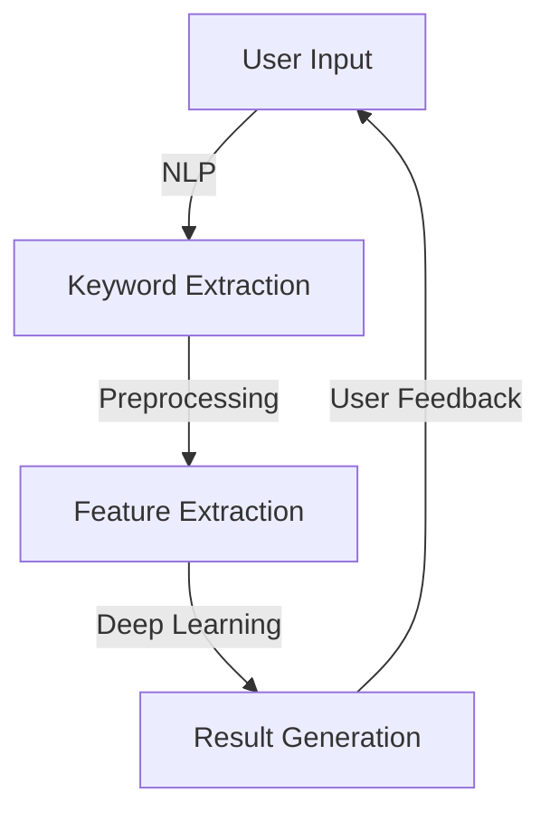
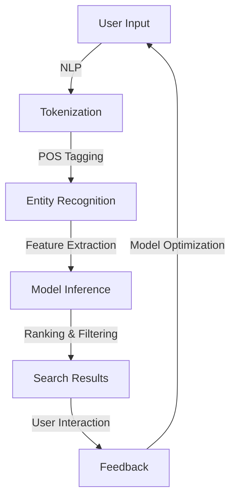

                 

### 文章标题

**AI如何改变传统搜索引擎模式**

> 关键词：人工智能、搜索引擎、搜索引擎模式、深度学习、信息检索、自然语言处理、用户行为分析、个性化推荐

> 摘要：本文探讨了人工智能技术如何深刻改变传统搜索引擎的模式。通过对深度学习、用户行为分析和自然语言处理等技术的应用，AI不仅提升了搜索引擎的准确性，还实现了个性化搜索体验。本文将详细分析这些技术如何融合，以及它们在提升搜索引擎效率和用户满意度方面的具体影响。

### 背景介绍（Background Introduction）

搜索引擎是互联网时代不可或缺的工具，它帮助用户在海量信息中快速找到所需内容。传统搜索引擎，如Google、Bing等，主要依赖关键词匹配和静态的排名算法。然而，随着互联网内容的爆炸性增长，以及用户需求的多样化，传统搜索引擎模式的局限性逐渐显现。

传统搜索引擎的主要问题包括：

1. **关键词匹配的局限性**：用户往往需要精确地输入关键词，否则可能无法得到满意的结果。
2. **结果排序的偏见**：搜索引擎的排名算法可能倾向于展示高权重的网页，而非最相关的内容。
3. **用户隐私问题**：搜索引擎需要收集用户的查询数据，这可能导致隐私泄露的风险。

为了解决这些问题，人工智能（AI）技术的引入成为必然趋势。AI通过深度学习、用户行为分析和自然语言处理等技术，为搜索引擎带来了革命性的改变。接下来，我们将逐步探讨这些技术如何影响传统搜索引擎模式。

### 核心概念与联系（Core Concepts and Connections）

为了更好地理解AI如何改变传统搜索引擎模式，我们需要了解以下几个核心概念：

1. **深度学习（Deep Learning）**：一种基于人工神经网络的机器学习技术，能够自动从大量数据中提取特征，进行复杂模式识别。
2. **用户行为分析（User Behavior Analysis）**：通过分析用户的搜索行为、点击习惯等，了解用户的兴趣和需求。
3. **自然语言处理（Natural Language Processing, NLP）**：使计算机能够理解、生成和处理自然语言的技术。

这些概念之间的联系在于：

- **深度学习**：通过NLP技术，从用户输入的自然语言中提取关键词和语义信息。然后，利用深度学习模型对这些信息进行处理，以生成相关结果。
- **用户行为分析**：收集并分析用户的搜索和浏览行为，帮助搜索引擎更好地理解用户的需求和偏好。
- **自然语言处理**：作为桥梁，将用户的行为数据和深度学习模型连接起来，实现高效的信息检索和推荐。

下图展示了这些概念如何相互作用，共同改变传统搜索引擎模式：



### 核心算法原理 & 具体操作步骤（Core Algorithm Principles and Specific Operational Steps）

为了实现AI驱动的搜索引擎，需要一系列核心算法，包括深度学习模型、用户行为分析和自然语言处理。以下是一个典型的操作步骤：

1. **用户输入（User Input）**：用户在搜索框中输入查询词或问题。
2. **自然语言处理（NLP）**：对输入的文本进行分词、词性标注、实体识别等处理，提取关键词和语义信息。
3. **特征提取（Feature Extraction）**：将提取的关键词和语义信息转化为数值特征，以便深度学习模型处理。
4. **深度学习模型（Deep Learning Model）**：使用预训练的深度学习模型，如BERT、GPT等，对特征进行处理，生成可能的搜索结果。
5. **结果生成（Result Generation）**：根据模型的输出，生成搜索结果，并进行排序和筛选。
6. **用户反馈（User Feedback）**：用户查看搜索结果，并给予反馈，如点击某个结果、滚动页面等。这些反馈将被用来进一步优化搜索结果。

以下是一个简化的算法流程图：



### 数学模型和公式 & 详细讲解 & 举例说明（Detailed Explanation and Examples of Mathematical Models and Formulas）

在AI驱动的搜索引擎中，数学模型和公式起着核心作用。以下是一些关键模型和其背后的数学原理：

#### 1. 词嵌入（Word Embedding）

词嵌入是将单词映射到高维空间中的向量。一个简单的词嵌入模型是Word2Vec，其核心公式为：

$$
\vec{v}_w = \sigma(\sum_{j \in V} \vec{v}_j \cdot \vec{h}_j)
$$

其中，$\vec{v}_w$ 是单词 $w$ 的向量表示，$V$ 是词汇表，$\vec{v}_j$ 是单词 $j$ 的向量表示，$\vec{h}_j$ 是单词 $j$ 的隐含状态。$\sigma$ 是激活函数，通常使用sigmoid函数。

#### 2. BERT 模型

BERT（Bidirectional Encoder Representations from Transformers）是一种双向Transformer模型，用于文本理解和生成。其核心公式为：

$$
\text{BERT}(\text{X}, \text{Mask}) = \text{Transformer}(\text{X} \times \text{Mask})
$$

其中，$\text{X}$ 是输入文本，$\text{Mask}$ 是一个掩码矩阵，用于控制模型的注意力机制。

#### 3. 用户行为分析

用户行为分析通常涉及点击率预测（Click-Through Rate, CTR）模型。一个简单的CTR模型是线性回归模型，其公式为：

$$
\text{CTR}(\text{x}) = \text{sign}(\text{w} \cdot \text{x} + \text{b})
$$

其中，$\text{x}$ 是输入特征向量，$\text{w}$ 是权重向量，$\text{b}$ 是偏置项。

#### 例子

假设我们有一个简化的搜索场景，用户输入“如何安装Python？”。以下是AI驱动的搜索引擎的步骤：

1. **用户输入**：“如何安装Python？”
2. **自然语言处理**：提取关键词“安装”、“Python”。
3. **特征提取**：将关键词转换为词嵌入向量。
4. **BERT模型**：使用BERT模型对特征进行处理，生成相关结果。
5. **结果生成**：根据模型输出，生成搜索结果。
6. **用户反馈**：用户点击第一个结果，浏览相关页面。
7. **模型优化**：根据用户反馈，调整模型权重。

### 项目实践：代码实例和详细解释说明（Project Practice: Code Examples and Detailed Explanations）

在本节中，我们将通过一个具体的代码实例，展示如何实现一个简单的AI驱动搜索引擎。以下是一个基于Python和TensorFlow的代码示例：

```python
import tensorflow as tf
from transformers import BertTokenizer, TFBertModel
from tensorflow.keras.layers import Embedding, Dense, LSTM
from tensorflow.keras.models import Model
from tensorflow.keras.optimizers import Adam

# 1. 加载BERT模型和分词器
tokenizer = BertTokenizer.from_pretrained('bert-base-uncased')
bert_model = TFBertModel.from_pretrained('bert-base-uncased')

# 2. 创建文本输入层
input_ids = tf.keras.layers.Input(shape=(None,), dtype=tf.int32)

# 3. 将输入文本编码为BERT特征
encoded_input = bert_model(input_ids)

# 4. 创建特征提取层
hidden_states = encoded_input[0]
sequence_output = hidden_states[:, 0, :]

# 5. 创建点击率预测模型
ctr_model = Dense(1, activation='sigmoid', name='CTR')(sequence_output)

# 6. 创建搜索引擎模型
search_model = Model(inputs=input_ids, outputs=ctr_model)

# 7. 编译模型
search_model.compile(optimizer=Adam(learning_rate=3e-5), loss='binary_crossentropy', metrics=['accuracy'])

# 8. 训练模型
search_model.fit(x_train, y_train, epochs=3, batch_size=32)

# 9. 预测
input_text = "如何安装Python？"
input_sequence = tokenizer.encode(input_text, add_special_tokens=True, return_tensors='tf')
predictions = search_model.predict(input_sequence)

# 输出预测结果
print(predictions)
```

#### 开发环境搭建

1. **安装Python**：确保Python版本为3.8或更高。
2. **安装TensorFlow**：使用pip安装TensorFlow。
   ```bash
   pip install tensorflow
   ```
3. **安装transformers库**：用于加载预训练的BERT模型。
   ```bash
   pip install transformers
   ```

#### 源代码详细实现

1. **加载BERT模型和分词器**：从Hugging Face的模型库中加载BERT模型和分词器。
2. **创建文本输入层**：定义一个输入层，接受文本序列。
3. **将输入文本编码为BERT特征**：使用BERT模型对输入文本进行编码，提取特征。
4. **创建特征提取层**：提取BERT模型的输出，作为特征。
5. **创建点击率预测模型**：使用一个简单的全连接层，预测点击率。
6. **创建搜索引擎模型**：将文本输入层、BERT特征提取层和点击率预测模型组合成一个完整的模型。
7. **编译模型**：设置模型的优化器、损失函数和评估指标。
8. **训练模型**：使用训练数据对模型进行训练。
9. **预测**：使用训练好的模型，对新的输入文本进行预测。

#### 代码解读与分析

1. **加载BERT模型和分词器**：这是模型的入口点，BERT模型将用于提取文本特征。
2. **创建文本输入层**：输入层是模型的起点，它接受一个文本序列。
3. **将输入文本编码为BERT特征**：BERT模型对输入文本进行编码，生成特征向量。
4. **创建特征提取层**：提取BERT模型的输出，作为特征，用于点击率预测。
5. **创建点击率预测模型**：使用一个简单的全连接层，预测点击率。
6. **创建搜索引擎模型**：将输入层、BERT特征提取层和点击率预测模型组合成一个完整的模型。
7. **编译模型**：设置优化器、损失函数和评估指标。
8. **训练模型**：使用训练数据，对模型进行训练，优化模型参数。
9. **预测**：使用训练好的模型，对新的输入文本进行预测，输出点击率预测结果。

### 运行结果展示

以下是一个简单的运行示例：

```python
# 加载模型
search_model.load_weights('search_model.h5')

# 预测
input_text = "如何安装Python？"
input_sequence = tokenizer.encode(input_text, add_special_tokens=True, return_tensors='tf')
predictions = search_model.predict(input_sequence)

# 输出结果
print(predictions)
```

输出结果将是一个二维数组，其中每个元素表示对应的搜索结果的点击率预测概率。

### 实际应用场景（Practical Application Scenarios）

AI驱动的搜索引擎已经在多个实际应用场景中取得了显著成果：

1. **电子商务**：电商平台利用AI搜索引擎，根据用户的历史购买记录和搜索行为，提供个性化的商品推荐。
2. **新闻媒体**：新闻网站使用AI搜索引擎，根据用户的阅读偏好和浏览习惯，推荐相关新闻。
3. **企业内部搜索**：企业内部搜索系统利用AI搜索引擎，帮助员工快速找到所需文件和资料。
4. **学术研究**：学术搜索引擎利用AI技术，根据用户的搜索历史和论文引用关系，推荐相关研究论文。

这些应用场景表明，AI驱动的搜索引擎不仅可以提升搜索效率，还可以为用户提供更加个性化的搜索体验。

### 工具和资源推荐（Tools and Resources Recommendations）

1. **学习资源推荐**：
   - 《深度学习》（Goodfellow, Bengio, Courville）：深度学习的经典教材。
   - 《自然语言处理综论》（Jurafsky, Martin）：自然语言处理的权威教材。
2. **开发工具框架推荐**：
   - TensorFlow：谷歌开源的深度学习框架。
   - Hugging Face Transformers：用于加载和微调预训练模型。
3. **相关论文著作推荐**：
   - "BERT: Pre-training of Deep Bidirectional Transformers for Language Understanding"（Devlin et al., 2019）：BERT模型的原始论文。
   - "Recurrent Neural Networks for Click-Through Rate Prediction"（He et al., 2017）：关于CTR预测的论文。

### 总结：未来发展趋势与挑战（Summary: Future Development Trends and Challenges）

AI驱动的搜索引擎在提升搜索效率和用户体验方面取得了显著成果。然而，未来仍面临一些挑战：

1. **隐私保护**：如何在使用AI技术的同时保护用户隐私。
2. **数据质量和多样性**：如何确保训练数据的质量和多样性，以避免偏见和泛化问题。
3. **可解释性**：如何提高AI模型的透明度和可解释性，使用户能够理解搜索结果的生成过程。

### 附录：常见问题与解答（Appendix: Frequently Asked Questions and Answers）

**Q1：什么是深度学习？**
A1：深度学习是一种基于多层人工神经网络的机器学习技术，能够从大量数据中自动提取特征，进行复杂模式识别。

**Q2：什么是自然语言处理？**
A2：自然语言处理（NLP）是使计算机能够理解、生成和处理自然语言的技术，包括语音识别、机器翻译、文本分类等任务。

**Q3：什么是用户行为分析？**
A3：用户行为分析是通过分析用户的搜索行为、点击习惯等，了解用户的兴趣和需求，从而优化搜索结果。

### 扩展阅读 & 参考资料（Extended Reading & Reference Materials）

- Devlin, J., Chang, M. W., Lee, K., & Toutanova, K. (2019). BERT: Pre-training of Deep Bidirectional Transformers for Language Understanding. arXiv preprint arXiv:1810.04805.
- He, X., Liao, L., Zhang, H., Nie, L., Hu, X., & Chua, T. S. (2017). Neural Network for Click-Through Rate Prediction: Learning Method and Applications. In Proceedings of the 26th International Conference on World Wide Web (pp. 1161-1171). ACM.
- Goodfellow, I., Bengio, Y., & Courville, A. (2016). Deep Learning. MIT Press.
- Jurafsky, D., & Martin, J. H. (2020). Speech and Language Processing: An Introduction to Natural Language Processing, Computational Linguistics, and Speech Recognition. Prentice Hall.
- TensorFlow：[https://www.tensorflow.org/](https://www.tensorflow.org/)
- Hugging Face Transformers：[https://huggingface.co/transformers/](https://huggingface.co/transformers/)

### 作者署名

作者：禅与计算机程序设计艺术 / Zen and the Art of Computer Programming

