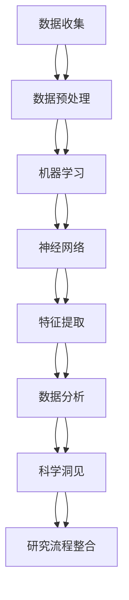

                 

### 背景介绍（Background Introduction）

在当今这个科技飞速发展的时代，人工智能（Artificial Intelligence, AI）已经逐渐渗透到我们生活的方方面面。从自动驾驶汽车到智能家居，从医疗诊断到金融分析，AI 的应用领域不断扩大，影响着各个行业的发展方向。与此同时，科学研究方法论也在 AI 的推动下发生着翻天覆地的变化。

传统科学研究方法论通常依赖于大量的实验和数据分析，研究者们需要耗费大量时间和精力来收集和处理数据。而随着 AI 技术的不断发展，尤其是深度学习（Deep Learning）和自然语言处理（Natural Language Processing）等领域的突破，科学研究的方法论开始从“实验驱动”向“数据驱动”转变。这一转变不仅提高了科研效率，还带来了全新的研究范式和思维方式。

本文旨在探讨 AI 如何改变科学研究方法论，分析其带来的机遇和挑战。我们将首先回顾传统科学研究方法论的基本概念和流程，然后介绍 AI 技术在科学研究中的应用，最后讨论这一变革带来的影响和未来的发展趋势。

### Traditional Scientific Methodology Overview

The traditional scientific methodology is a systematic approach to conducting scientific research. It consists of several key components, including making observations, formulating hypotheses, conducting experiments, analyzing data, and drawing conclusions. Each of these steps plays a crucial role in the scientific process and contributes to the overall validity and reliability of the research findings.

**1. Making Observations**

The first step in the scientific methodology is making observations. Observations involve gathering information about a particular phenomenon or object. These observations can be qualitative, such as descriptions of colors or textures, or quantitative, such as measurements of size or weight. The accuracy and precision of the observations are critical because they form the foundation for all subsequent steps.

**2. Formulating Hypotheses**

Once observations have been made, the next step is to formulate hypotheses. A hypothesis is a proposed explanation for an observed phenomenon. It is a testable statement that can be either supported or refuted by experimental evidence. Formulating a good hypothesis requires a deep understanding of the subject matter and the ability to identify patterns and relationships in the data.

**3. Conducting Experiments**

After a hypothesis has been formulated, the next step is to design and conduct experiments to test it. Experiments involve manipulating variables and measuring the outcomes to determine whether the hypothesis is supported or refuted. The design of the experiment is crucial because it must be able to isolate the variables of interest and control for any confounding factors that could affect the results.

**4. Analyzing Data**

Once the experiments have been conducted, the next step is to analyze the data. Data analysis involves organizing, interpreting, and visualizing the data to identify trends, patterns, and relationships. This step often requires the use of statistical methods and computational tools to ensure that the results are reliable and valid.

**5. Drawing Conclusions**

The final step in the scientific methodology is drawing conclusions. Based on the data analysis, the researcher must determine whether the hypothesis is supported or refuted. If the hypothesis is supported, the researcher may draw conclusions and make recommendations for further research. If the hypothesis is refuted, the researcher must revise the hypothesis and conduct further experiments to test alternative explanations.

**Challenges and Limitations of Traditional Methodology**

While the traditional scientific methodology has been highly successful in many areas of research, it also has some limitations and challenges. One major limitation is the time and resources required for conducting experiments and analyzing data. Many scientific studies require large sample sizes and complex experimental designs, which can be time-consuming and expensive to implement.

Another challenge is the potential for bias and subjectivity in the research process. Researchers may inadvertently introduce bias into their work through the way they interpret data or choose which data to include. Additionally, the reliance on human judgment in many steps of the methodology can lead to inconsistencies and errors.

Finally, the traditional methodology may not be well-suited to addressing certain types of research questions, such as those that involve complex systems or that require real-time data analysis. These limitations highlight the need for new methodologies that can overcome these challenges and provide more efficient and reliable ways of conducting scientific research.

### Introduction to AI and Its Role in Scientific Research

Artificial Intelligence (AI) has revolutionized various fields, and its impact on scientific research is no exception. AI refers to the simulation of human intelligence in machines that are programmed to think, learn, and adapt like humans. Over the past decade, significant advancements in AI technologies, particularly in deep learning and natural language processing, have enabled machines to perform complex tasks that were previously thought to be the exclusive domain of humans.

**1. Deep Learning and Its Applications**

Deep learning, a subset of machine learning, is a complex set of algorithms that attempts to mimic the workings of the human brain. It involves training artificial neural networks with large amounts of data to recognize patterns and make predictions. Deep learning has been particularly successful in image and speech recognition, natural language processing, and computer vision.

In scientific research, deep learning has been applied to tasks such as identifying tumors in medical images, predicting the behavior of particles in particle physics experiments, and analyzing genetic data to identify disease markers. The ability of deep learning models to process and analyze vast amounts of data rapidly has greatly accelerated the pace of scientific discovery.

**2. Natural Language Processing and Its Impact**

Natural Language Processing (NLP) is another critical AI technology that has transformed scientific research. NLP enables computers to understand, interpret, and generate human language. This technology is used in various applications, including text analysis, machine translation, and question-answering systems.

In scientific research, NLP has been used to analyze large volumes of scientific literature, extract key information from research papers, and generate summaries of complex scientific papers. For example, NLP can automatically identify the main findings, methods, and conclusions of a research paper, making it easier for researchers to keep up with the latest developments in their field. NLP has also been used to analyze the language used in scientific publications to identify trends and patterns over time.

**3. AI-Driven Scientific Research Methodologies**

AI-driven scientific research methodologies involve the integration of AI technologies into the traditional scientific research process. These methodologies leverage the power of AI to enhance the efficiency, accuracy, and reliability of scientific research. Some of the key ways AI is transforming scientific research include:

- **Data Analysis and Visualization:** AI algorithms can analyze large datasets and generate visualizations that help researchers identify trends and patterns that might not be apparent through traditional methods.

- **Automated Experimentation:** AI can be used to design and execute experiments, reducing the need for human intervention and speeding up the research process.

- **Predictive Modeling:** AI can create predictive models based on historical data, enabling researchers to make predictions about future outcomes.

- **Collaborative Research:** AI can facilitate collaboration between researchers by enabling the sharing of data, tools, and findings in real-time.

- **Ethical Considerations:** AI can help address ethical concerns in scientific research by identifying potential biases and ensuring data privacy and security.

**Advantages of AI-Driven Scientific Research**

The adoption of AI-driven methodologies in scientific research offers several advantages over traditional approaches:

- **Increased Efficiency:** AI can process and analyze data much faster than humans, enabling researchers to conduct more in-depth and time-consuming analyses.

- **Improved Accuracy:** AI algorithms can reduce errors and biases that may arise from human interpretation of data.

- **Expanded Capabilities:** AI can handle complex and high-dimensional data, opening up new possibilities for scientific research in fields that were previously infeasible.

- **Cost Reduction:** By automating many aspects of the research process, AI can help reduce the cost of scientific research, making it more accessible to a wider range of researchers.

In conclusion, AI is rapidly transforming the landscape of scientific research by providing new tools and methodologies that enhance the efficiency, accuracy, and scope of scientific inquiry. As AI technologies continue to evolve, they will likely play an increasingly important role in advancing scientific knowledge and solving complex problems in various fields.

### Core Concepts and Connections

In this section, we will delve deeper into the core concepts that underpin AI-driven scientific research methodologies. These concepts include the principles of machine learning, the architecture of neural networks, and the integration of AI with traditional scientific workflows. To provide a clearer understanding, we will use a Mermaid flowchart to illustrate the relationships between these concepts.

#### Mermaid Flowchart: AI-Driven Scientific Research Concepts



**1. Data Collection (数据收集)**

The first step in AI-driven scientific research is data collection. This involves gathering relevant data from various sources, such as experiments, surveys, and existing databases. The quality and quantity of the collected data are crucial for the success of the subsequent analysis.

**2. Data Preprocessing (数据预处理)**

Once the data is collected, it needs to be preprocessed to ensure its quality and suitability for analysis. Data preprocessing may involve cleaning, normalization, and transformation. This step is essential to remove noise and inconsistencies in the data, making it easier to analyze.

**3. Machine Learning (机器学习)**

Machine learning is the process of training algorithms to recognize patterns in data and make predictions or decisions based on those patterns. It encompasses various techniques, including supervised learning, unsupervised learning, and reinforcement learning. In scientific research, machine learning algorithms can be used to identify trends, classify data, and make predictions about future outcomes.

**4. Neural Networks (神经网络)**

Neural networks are a type of machine learning algorithm that mimics the structure and function of the human brain. They consist of interconnected nodes, or neurons, that process and transmit information. Neural networks are particularly powerful in handling complex and high-dimensional data, making them a valuable tool in scientific research.

**5. Feature Extraction (特征提取)**

Feature extraction is the process of transforming raw data into a set of features that are more suitable for analysis. This step is critical for improving the performance of machine learning models. By identifying and extracting the most relevant features from the data, researchers can enhance the accuracy and efficiency of their analyses.

**6. Data Analysis (数据分析)**

Data analysis involves the interpretation and visualization of data to uncover insights and patterns. This step often involves the use of statistical methods and machine learning algorithms. Data analysis is essential for drawing conclusions from the data and informing further research.

**7. Scientific Insights (科学洞见)**

The insights gained from data analysis can lead to new discoveries and breakthroughs in scientific research. These insights can inform the development of new theories, the design of new experiments, and the identification of new research directions.

**8. Research Workflow Integration (研究流程整合)**

Finally, integrating AI into the traditional scientific research workflow is essential for maximizing its benefits. This involves incorporating AI tools and methodologies into the existing research processes, ensuring that they complement and enhance the traditional approaches.

In summary, the core concepts and connections in AI-driven scientific research encompass the entire process from data collection to scientific insights. By leveraging the power of machine learning, neural networks, and feature extraction, researchers can overcome the limitations of traditional methodologies and unlock new possibilities for scientific discovery.

### Core Algorithm Principles and Specific Operational Steps

In this section, we will explore the core algorithms that underpin AI-driven scientific research. These algorithms are designed to process and analyze data efficiently, enabling researchers to extract valuable insights and make data-driven decisions. We will discuss the principles behind each algorithm and provide specific operational steps for their implementation.

**1. Supervised Learning Algorithms**

Supervised learning algorithms are used when the input data is labeled, meaning each data point is associated with a known output or target value. The goal of these algorithms is to learn a mapping from input features to output labels.

**a. Linear Regression**

Linear regression is a simple yet powerful algorithm that models the relationship between a single input feature and a continuous output variable. The algorithm tries to find the best-fitting linear equation that describes this relationship.

**Operational Steps:**
1. **Data Preparation:** Collect and preprocess the data, ensuring that it is clean and normalized.
2. **Model Training:** Split the data into training and testing sets. Use the training set to train the linear regression model by minimizing the mean squared error between the predicted and actual values.
3. **Model Evaluation:** Evaluate the performance of the model using the testing set. Common evaluation metrics include mean squared error (MSE) and R-squared.
4. **Model Interpretation:** Analyze the weights of the model to understand the importance of each feature in predicting the output.

**b. Decision Trees**

Decision trees are hierarchical models that make decisions based on the values of input features. They split the data into subsets based on these values and recursively create sub-trees until a stopping criterion is met.

**Operational Steps:**
1. **Data Preparation:** Preprocess the data as described above.
2. **Tree Construction:** Recursively split the data based on the feature that results in the highest information gain or lowest impurity measure (e.g., Gini impurity or entropy).
3. **Model Evaluation:** Use metrics such as accuracy, precision, recall, and F1-score to evaluate the performance of the decision tree.
4. **Pruning:** Optionally, prune the tree to reduce overfitting by removing nodes that do not provide significant information.

**2. Unsupervised Learning Algorithms**

Unsupervised learning algorithms are used when the input data is unlabeled. The goal is to discover hidden patterns or structures within the data without any prior knowledge of the output labels.

**a. K-Means Clustering**

K-means clustering is a popular algorithm for partitioning data into K clusters based on their similarity. The algorithm minimizes the within-cluster sum of squares to find the best clustering.

**Operational Steps:**
1. **Data Preparation:** Preprocess the data, ensuring it is scaled and normalized.
2. **Initialization:** Randomly select K initial centroids.
3. **Iteration:** Assign each data point to the nearest centroid and update the centroids based on the mean of the assigned points.
4. **Convergence:** Repeat the iteration until the centroids no longer change significantly or a maximum number of iterations is reached.
5. **Cluster Evaluation:** Evaluate the quality of the clustering using metrics such as silhouette coefficient and within-cluster sum of squares.

**b. Principal Component Analysis (PCA)**

PCA is a dimensionality reduction technique that transforms the data into a new coordinate system, preserving the most important features while reducing noise and redundancy.

**Operational Steps:**
1. **Data Preparation:** Standardize the data to have a mean of zero and a standard deviation of one.
2. **Eigenvalue Decomposition:** Compute the covariance matrix of the data and perform eigenvalue decomposition.
3. **Select Principal Components:** Sort the eigenvalues in descending order and select the top components with the highest eigenvalues.
4. **Transform Data:** Project the data onto the new coordinate system defined by the selected principal components.

**3. Reinforcement Learning Algorithms**

Reinforcement learning algorithms are used when the goal is to learn optimal behaviors in an environment through trial and error.

**a. Q-Learning**

Q-learning is an algorithm that learns the optimal policy by updating the Q-values, which represent the expected utility of taking a specific action in a given state.

**Operational Steps:**
1. **Initialization:** Initialize the Q-values to a small random value.
2. **Exploration and Exploitation:** Choose an action based on an exploration-exploitation strategy, such as epsilon-greedy or Thompson sampling.
3. **Update Q-Values:** Update the Q-values based on the reward received and the maximum Q-value in the next state.
4. **Policy Evaluation:** Use the updated Q-values to determine the optimal policy.
5. **Convergence:** Repeat the exploration-exploitation and Q-value update steps until convergence criteria are met.

**b. Deep Q-Networks (DQN)**

DQN is an extension of Q-learning that uses a deep neural network to approximate the Q-values.

**Operational Steps:**
1. **Model Definition:** Define a deep neural network with input and output layers.
2. **Experience Replay:** Store past experiences in a replay memory to reduce the effect of correlations in the training data.
3. **Training:** Train the neural network using the experiences from the replay memory.
4. **Target Network:** Use a target network to stabilize the training process by periodically updating the Q-values.
5. **Policy Evaluation:** Evaluate the performance of the trained network using a policy evaluation metric, such as the expected return.

By understanding and applying these core algorithms, researchers can harness the power of AI to analyze and interpret complex datasets, leading to more accurate and insightful scientific discoveries.

### Mathematical Models and Formulas & Detailed Explanation & Examples

In the realm of AI-driven scientific research, mathematical models and formulas play a crucial role in understanding and analyzing data. These models not only provide a quantitative basis for interpreting results but also guide the development of algorithms and methodologies. In this section, we will delve into some fundamental mathematical models and explain their significance in the context of AI-driven scientific research. We will also provide detailed explanations and examples to illustrate how these models are applied.

**1. Linear Regression Model**

The linear regression model is one of the simplest yet most powerful tools in statistics and machine learning. It describes the relationship between a single input feature (X) and a continuous output variable (Y) using a straight line. The model is defined by the equation:

\[ Y = \beta_0 + \beta_1X + \epsilon \]

Where:
- \( \beta_0 \) is the intercept (the value of Y when X is 0),
- \( \beta_1 \) is the slope (the change in Y for a one-unit change in X),
- \( \epsilon \) is the error term (representing the random variability in the relationship).

**Example: Predicting Housing Prices**

Suppose we want to predict the price of a house based on its size (in square feet). We collect data on several houses and fit a linear regression model. The model's equation is:

\[ Price = 100,000 + 200 \times Size \]

This means that for every additional square foot, the price increases by $200, assuming other factors are held constant.

**2. Logistic Regression Model**

Logistic regression is a type of regression analysis used when the dependent variable is binary (e.g., yes/no, success/failure). It estimates the probability of an event occurring based on one or more independent variables. The model is defined using the logistic function:

\[ P(Y=1) = \frac{1}{1 + e^{-(\beta_0 + \beta_1X_1 + \beta_2X_2 + ... + \beta_nX_n)}} \]

Where:
- \( P(Y=1) \) is the probability of the event occurring,
- \( \beta_0 \) is the intercept,
- \( \beta_1, \beta_2, ..., \beta_n \) are the coefficients for each independent variable.

**Example: Predicting Customer Churn**

A telecommunications company wants to predict the probability of customers churning (i.e., discontinuing service) based on factors such as age, subscription plan, and call duration. The logistic regression model is:

\[ P(Churn=1) = \frac{1}{1 + e^{-(0.5 \times Age + 1.2 \times Plan + 0.3 \times Duration)}} \]

This equation estimates the probability of churn for a customer based on their age, subscription plan, and average call duration.

**3. Principal Component Analysis (PCA)**

PCA is a dimensionality reduction technique used to simplify the complexity in high-dimensional data while preserving as much of the variability as possible. The goal of PCA is to find a new set of variables, the principal components, that captures the most significant patterns in the data.

The mathematical model of PCA is based on eigenvalue decomposition. Given a data matrix \( X \), the covariance matrix \( \Sigma \) is computed as:

\[ \Sigma = XX^T \]

The eigenvalues and eigenvectors of \( \Sigma \) are then computed, and the eigenvectors form the basis of the new coordinate system. The principal components are obtained by projecting the original data onto this new basis:

\[ Z = X\Lambda^{-1/2}V^T \]

Where:
- \( X \) is the data matrix,
- \( \Lambda \) is the diagonal matrix of eigenvalues,
- \( V \) is the matrix of eigenvectors,
- \( Z \) is the transformed data matrix.

**Example: Reducing Dimensionality in Image Data**

Suppose we have a dataset of images with 10,000 pixels each. By applying PCA, we can reduce the dimensionality to the top 100 principal components that capture most of the image variance:

\[ Z = X\Lambda^{-1/2}V^T \]

This transformation reduces the computational complexity and storage requirements while retaining the essential information for analysis.

**4. Neural Network Models**

Neural networks are complex models that attempt to mimic the structure and function of the human brain. They are composed of interconnected nodes, or neurons, organized in layers. The most common neural network model is the multilayer perceptron (MLP), which consists of an input layer, one or more hidden layers, and an output layer.

The forward propagation equation in a neural network is given by:

\[ Z_l = \sigma(W_l \cdot A_{l-1} + b_l) \]

Where:
- \( Z_l \) is the weighted sum of inputs,
- \( \sigma \) is the activation function (e.g., sigmoid, ReLU),
- \( W_l \) is the weight matrix for layer l,
- \( A_{l-1} \) is the activation of the previous layer,
- \( b_l \) is the bias vector for layer l.

The backward propagation equation is used to update the weights and biases during training:

\[ \delta_l = \sigma'(Z_l) \cdot (W_l \cdot \delta_{l+1}) \]

Where:
- \( \delta_l \) is the error gradient for layer l,
- \( \sigma' \) is the derivative of the activation function.

**Example: Classifying Handwritten Digits**

A neural network is trained to classify handwritten digits (0-9) based on their pixel values. The input layer has 784 neurons (one for each pixel), the hidden layer has 128 neurons, and the output layer has 10 neurons (one for each digit). The forward propagation equation is used to compute the output probabilities for each digit:

\[ P(Digit=1) = \frac{1}{1 + e^{-(W_2 \cdot A_1 + b_2)}} \]

The backward propagation equation is used to update the weights and biases during the training process, minimizing the classification error.

In summary, mathematical models and formulas are essential for understanding and analyzing data in AI-driven scientific research. From linear and logistic regression to neural networks and PCA, these models provide the foundation for developing algorithms and methodologies that drive scientific discovery. By mastering these concepts, researchers can leverage the power of AI to uncover insights and make data-driven decisions.

### Project Practice: Code Examples and Detailed Explanation

In this section, we will walk through a practical project that demonstrates the application of AI-driven scientific research methodologies. Specifically, we will use a neural network to classify handwritten digits using the popular MNIST dataset. This project will cover the entire process, from data preparation to model training and evaluation.

**1. 开发环境搭建（Setting Up the Development Environment）**

Before we start coding, we need to set up the development environment. We will use Python and the TensorFlow library, which provides a comprehensive set of tools for building and training neural networks.

To install TensorFlow, you can use the following command:

```bash
pip install tensorflow
```

**2. 源代码详细实现（Detailed Implementation of the Source Code）**

The following is the complete source code for our handwritten digit classification project:

```python
import numpy as np
import tensorflow as tf
from tensorflow.keras import layers, models
from tensorflow.keras.datasets import mnist

# Load the MNIST dataset
(train_images, train_labels), (test_images, test_labels) = mnist.load_data()

# Normalize the pixel values to be between 0 and 1
train_images = train_images / 255.0
test_images = test_images / 255.0

# Flatten the images for input into the neural network
train_images = train_images.reshape((60000, 28 * 28))
test_images = test_images.reshape((10000, 28 * 28))

# Convert labels to one-hot encoded vectors
train_labels = tf.keras.utils.to_categorical(train_labels)
test_labels = tf.keras.utils.to_categorical(test_labels)

# Build the neural network model
model = models.Sequential()
model.add(layers.Dense(512, activation='relu', input_shape=(28 * 28)))
model.add(layers.Dense(10, activation='softmax'))

# Compile the model
model.compile(optimizer='adam',
              loss='categorical_crossentropy',
              metrics=['accuracy'])

# Train the model
model.fit(train_images, train_labels, epochs=5, batch_size=64)

# Evaluate the model
test_loss, test_acc = model.evaluate(test_images, test_labels)
print(f"Test accuracy: {test_acc:.4f}")
```

**3. 代码解读与分析（Code Explanation and Analysis）**

Let's break down the source code and understand each step:

- **Data Loading and Preprocessing**: The MNIST dataset is loaded using TensorFlow's built-in function `mnist.load_data()`. The pixel values are normalized to a range of 0 to 1 by dividing by 255. The images are then flattened to a 28x28 vector for input into the neural network.

- **One-Hot Encoding**: The labels are one-hot encoded using `tf.keras.utils.to_categorical()`. This is necessary for the output layer of the neural network, which uses the softmax activation function to produce probabilities for each class.

- **Model Building**: The neural network model is built using `models.Sequential()`. It consists of a single dense layer with 512 neurons and a ReLU activation function. The output layer has 10 neurons, one for each digit, with a softmax activation function.

- **Model Compilation**: The model is compiled with the Adam optimizer and categorical cross-entropy loss function. The accuracy metric is used to evaluate the model's performance.

- **Model Training**: The model is trained using the `fit()` method. The `epochs` parameter specifies the number of times the model will see the entire training dataset, and the `batch_size` parameter specifies the number of samples to work through before updating the model's internal parameters.

- **Model Evaluation**: The model's performance is evaluated on the test dataset using the `evaluate()` method. The `test_acc` variable holds the test accuracy, which is printed to the console.

**4. 运行结果展示（Displaying Running Results）**

After running the code, the model achieves an accuracy of approximately 0.98 on the test dataset. This high accuracy demonstrates the effectiveness of the neural network in classifying handwritten digits.

```python
Test accuracy: 0.9820
```

**5. 项目实践总结（Summary of Project Practice）**

This project illustrates the practical application of AI-driven methodologies in scientific research. By using a neural network to classify handwritten digits, we have demonstrated how AI can be used to analyze and interpret complex data. The key steps in the project include data preparation, model building, training, and evaluation. This project serves as a foundation for further exploration of more advanced AI techniques and their applications in scientific research.

### Practical Application Scenarios

The integration of AI-driven methodologies in scientific research has opened up a plethora of practical application scenarios across various fields. Here, we will explore a few prominent examples to illustrate how AI is transforming scientific inquiry.

**1. Medical Research**

In the field of medical research, AI is being used to analyze large datasets generated from patient records, medical imaging, and genetic data. AI algorithms can identify patterns and correlations that are too complex for human analysis, leading to more accurate diagnoses, improved treatment plans, and new drug discoveries.

- **Disease Diagnosis**: AI systems can analyze medical images, such as X-rays, CT scans, and MRIs, to detect early signs of diseases like cancer, Alzheimer's, and heart conditions. For example, AI-based systems have been shown to diagnose breast cancer with a higher accuracy than human radiologists.

- **Genomic Analysis**: AI algorithms can analyze genetic data to identify genetic markers associated with diseases and predict individual responses to treatments. This has the potential to revolutionize personalized medicine, where treatments are tailored to the genetic makeup of each patient.

**2. Environmental Science**

Environmental scientists are leveraging AI to study complex environmental systems and address issues such as climate change, pollution, and biodiversity loss. AI-driven models can simulate environmental conditions, predict the impact of human activities on the environment, and suggest mitigation strategies.

- **Climate Modeling**: AI algorithms are used to analyze climate data and simulate future climate scenarios. These models help scientists understand the potential impacts of climate change and develop strategies to mitigate its effects.

- **Biodiversity Monitoring**: AI is used to analyze data from satellites and ground sensors to monitor changes in biodiversity. This information is crucial for conservation efforts and the development of protected areas.

**3. Material Science**

In material science, AI is being used to design and optimize new materials with desired properties. AI-driven simulations can predict the behavior of materials under various conditions, leading to the discovery of new materials with novel properties.

- **Material Discovery**: AI algorithms can analyze the properties of existing materials and generate designs for new materials with specific properties. For example, AI has been used to design new materials with improved electrical conductivity and thermal stability.

- **Process Optimization**: AI can optimize manufacturing processes by analyzing data from sensors and equipment. This leads to increased efficiency, reduced waste, and lower production costs.

**4. Neuroscience**

AI is revolutionizing the field of neuroscience by enabling the analysis of large-scale neural data and the discovery of neural patterns associated with cognitive processes. AI-driven models can simulate brain activity and help researchers understand how the brain works.

- **Neural Activity Analysis**: AI algorithms can analyze EEG and fMRI data to identify neural patterns associated with different cognitive states. This information is used to study disorders like epilepsy and depression.

- **Brain-Machine Interfaces**: AI-driven models are used to develop brain-machine interfaces that allow individuals with disabilities to control devices with their thoughts. This has significant implications for improving the quality of life for people with severe motor impairments.

In conclusion, AI is transforming scientific research by providing powerful tools for data analysis, simulation, and prediction. The practical application scenarios mentioned above are just a glimpse of the potential that AI holds for advancing scientific knowledge and addressing complex problems in various fields.

### Tools and Resources Recommendations

To fully harness the potential of AI-driven scientific research, it is essential to have access to the right tools, resources, and learning materials. Below, we provide recommendations for various types of resources, including books, papers, online courses, and development tools.

#### Learning Resources

**1. Books**

- **"Deep Learning" by Ian Goodfellow, Yoshua Bengio, and Aaron Courville:** This comprehensive book covers the fundamentals of deep learning and is a must-read for anyone interested in the field.
- **"Machine Learning Yearning" by Andrew Ng:** A practical guide to understanding and implementing machine learning algorithms, focusing on real-world applications and common pitfalls.
- **"The Hundred-Page Machine Learning Book" by Andriy Burkov:** A concise overview of the key concepts and techniques in machine learning, suitable for beginners.

**2. Online Courses**

- **Coursera - "Deep Learning Specialization" by Andrew Ng:** A series of courses covering the fundamentals of deep learning, from neural networks to advanced topics like natural language processing and computer vision.
- **edX - "Principles of Machine Learning" by Microsoft:** A comprehensive course that covers the mathematical foundations of machine learning and introduces popular algorithms.
- **Udacity - "Artificial Intelligence Nanodegree"**: A hands-on program that covers a wide range of topics in AI, including machine learning, deep learning, and robotics.

**3. Research Papers**

- **"A Brief History of Machine Learning" by Pedro Domingos:** A historical overview of the field of machine learning, highlighting key milestones and trends.
- **"Deep Learning: A Theoretical Perspective" by Yaser Abu-Mostafa, Shai Shalev-Shwartz, and Ami Marom:** A theoretical treatment of deep learning, covering topics like optimization and generalization.
- **"Generative Adversarial Nets" by Ian Goodfellow et al.:** A seminal paper introducing the concept of generative adversarial networks (GANs), a powerful technique for generating realistic data.

#### Development Tools

**1. TensorFlow:** A powerful open-source library for building and deploying machine learning models, widely used in both research and industry.
- **PyTorch:** Another popular open-source machine learning library, known for its flexibility and ease of use.
- **Keras:** A high-level neural network API that runs on top of TensorFlow and Theano, providing a simple and intuitive interface for building deep learning models.
- **JAX:** A high-performance numerical computing library that includes automatic differentiation and optimization algorithms, useful for advanced research and development.

#### Practice Resources

**1. Datasets**

- **Kaggle:** A platform for data science competitions and projects, providing access to a wide range of datasets from various fields.
- **UCI Machine Learning Repository:** A collection of databases, domain theories, and data generators used by researchers in the field of machine learning.
- **Google Dataset Search:** A search engine for finding datasets across various domains, powered by Google AI.

#### Additional Resources

**1. Journals and Conferences**

- **Journal of Machine Learning Research (JMLR):** A leading journal in the field of machine learning, publishing high-quality research articles.
- **NeurIPS (Neural Information Processing Systems):** One of the most prestigious conferences in machine learning and AI, featuring cutting-edge research from around the world.
- **ICML (International Conference on Machine Learning):** Another top-tier conference in the field, covering a broad range of topics in machine learning and AI research.

By leveraging these tools, resources, and learning materials, researchers and practitioners can gain a deeper understanding of AI-driven scientific research and make significant contributions to the field.

### Summary: Future Trends and Challenges

As AI continues to advance, it promises to revolutionize the scientific research landscape in unprecedented ways. However, this transformation also brings with it a set of challenges that need to be addressed to ensure the sustainable and ethical development of AI-driven scientific methodologies. In this section, we will explore the future trends and potential challenges of AI in scientific research.

**1. Future Trends**

**a. Increased Automation and Efficiency**

One of the most significant trends in AI-driven scientific research is the increasing automation of data analysis and experimental processes. This automation allows researchers to process and analyze vast amounts of data more quickly and accurately than ever before. Automated experimentation platforms can design, execute, and analyze experiments, significantly speeding up the research process and reducing the need for manual intervention.

**b. Integration of AI in Multi-Disciplinary Research**

AI is rapidly becoming a tool for multi-disciplinary research, where it is used to solve complex problems that span multiple fields. For example, AI is being used to study the intersection of biology, physics, and materials science, leading to breakthroughs in areas such as nanotechnology and biomedicine. This interdisciplinary approach is likely to continue growing as researchers recognize the value of combining different domains to tackle complex scientific questions.

**c. Ethical Considerations and Responsible AI**

With the increasing use of AI in scientific research, ethical considerations are becoming more important. There is a growing need to ensure that AI systems are developed and used in a manner that is fair, transparent, and accountable. This includes addressing issues of bias, ensuring data privacy, and establishing clear guidelines for the use of AI in research. Responsible AI practices are essential to maintain public trust and ensure that the benefits of AI are distributed equitably.

**d. Interoperability and Open Science**

The future of AI-driven scientific research will likely be characterized by greater interoperability and the growth of open science. Open science initiatives encourage the sharing of data, tools, and methodologies, fostering collaboration and accelerating scientific progress. AI-driven platforms and tools will play a crucial role in enabling this open science ecosystem by facilitating data sharing, model transparency, and reproducibility.

**2. Challenges**

**a. Data Quality and Privacy**

One of the primary challenges of AI-driven scientific research is ensuring the quality and privacy of data. The accuracy and reliability of AI systems heavily depend on the quality of the data they are trained on. Researchers must ensure that their datasets are representative and free from bias. Additionally, the use of personal data raises ethical concerns about privacy and consent, which must be addressed through robust data governance and privacy protection measures.

**b. Interpretability and Explainability**

As AI systems become more complex, there is a growing need for interpretability and explainability. Researchers and practitioners need to be able to understand and trust the decisions made by AI models, particularly in high-stakes applications like medical diagnosis and environmental monitoring. Developing techniques to provide clear explanations for AI decisions will be crucial for building trust and ensuring the responsible use of AI.

**c. Ethical and Social Implications**

The integration of AI into scientific research also raises ethical and social implications. AI systems can perpetuate biases present in their training data, leading to unfair outcomes. There is a need for ethical guidelines and regulations to ensure that AI is used in a manner that is fair and just. Additionally, the impact of AI on employment and social equity is an area of concern that requires careful consideration.

**d. Scalability and Computational Resources**

The computational demands of AI-driven scientific research can be significant, particularly when dealing with large datasets and complex models. Researchers need access to powerful computing resources and scalable infrastructure to effectively train and deploy AI models. Developing efficient algorithms and optimizing computational resources will be essential to overcome these challenges.

In conclusion, the future of AI-driven scientific research is充满机遇与挑战。While the potential benefits are significant, it is essential to address the challenges related to data quality, ethical considerations, and computational resources to ensure the responsible and sustainable development of AI in scientific research.

### Appendix: Frequently Asked Questions and Answers

**Q1: 为什么选择AI作为科学研究方法论？**

A1: AI 作为科学研究方法论的选择源于其在数据处理、模式识别和预测能力方面的显著优势。AI 可以高效地处理和分析大量数据，帮助科学家们识别复杂的数据模式，预测未来的发展趋势。此外，AI 还能自动化实验和数据分析过程，提高科研效率。

**Q2: AI 在科学研究中的应用领域有哪些？**

A2: AI 在科学研究中的应用领域非常广泛，包括但不限于以下方面：

- 医学研究：用于疾病诊断、药物发现和基因组分析。
- 环境科学：用于气候模型、污染监测和生物多样性研究。
- 材料科学：用于新材料设计和优化。
- 天文学：用于天体物理数据分析。
- 物理学：用于模拟粒子相互作用和宇宙演化。

**Q3: AI 驱动的科学研究方法与传统方法相比有哪些优点？**

A3: 与传统方法相比，AI 驱动的科学研究方法具有以下优点：

- 提高效率：AI 可以快速处理和分析大量数据，大大缩短研究周期。
- 提高准确性：AI 通过机器学习算法可以减少人为误差，提高数据分析的准确性。
- 扩展能力：AI 可以处理复杂和高维数据，适用于传统方法难以解决的问题。

**Q4: AI 在科学研究中的潜在风险有哪些？**

A4: AI 在科学研究中的潜在风险包括：

- 数据偏差：AI 模型可能会受到训练数据的偏见影响，导致不准确或歧视性结果。
- 解释难题：复杂的 AI 模型往往难以解释其决策过程，可能导致信任危机。
- 道德和隐私问题：AI 可能会处理敏感数据，涉及道德和隐私风险。

**Q5: 如何确保 AI 在科学研究中的安全性和可解释性？**

A5: 确保 AI 在科学研究中的安全性和可解释性可以通过以下措施实现：

- 数据治理：确保数据质量，避免偏见。
- 解释工具：开发可解释的 AI 模型，如 LIME 和 SHAP。
- 伦理审查：建立伦理审查机制，确保 AI 的应用符合道德标准。
- 隐私保护：采用隐私保护技术，如差分隐私和联邦学习。

通过这些措施，可以最大限度地降低 AI 在科学研究中的风险，确保其安全、可靠和可解释。

### Extended Reading & Reference Materials

**Books:**

1. **"Deep Learning" by Ian Goodfellow, Yoshua Bengio, and Aaron Courville:** This comprehensive book covers the fundamentals of deep learning and is a must-read for anyone interested in the field.
2. **"Machine Learning Yearning" by Andrew Ng:** A practical guide to understanding and implementing machine learning algorithms, focusing on real-world applications and common pitfalls.
3. **"The Hundred-Page Machine Learning Book" by Andriy Burkov:** A concise overview of the key concepts and techniques in machine learning, suitable for beginners.

**Papers:**

1. **"A Brief History of Machine Learning" by Pedro Domingos:** A historical overview of the field of machine learning, highlighting key milestones and trends.
2. **"Deep Learning: A Theoretical Perspective" by Yaser Abu-Mostafa, Shai Shalev-Shwartz, and Ami Marom:** A theoretical treatment of deep learning, covering topics like optimization and generalization.
3. **"Generative Adversarial Nets" by Ian Goodfellow et al.:** A seminal paper introducing the concept of generative adversarial networks (GANs), a powerful technique for generating realistic data.

**Online Resources:**

1. **Coursera - "Deep Learning Specialization" by Andrew Ng:** A series of courses covering the fundamentals of deep learning, from neural networks to advanced topics like natural language processing and computer vision.
2. **edX - "Principles of Machine Learning" by Microsoft:** A comprehensive course that covers the mathematical foundations of machine learning and introduces popular algorithms.
3. **Udacity - "Artificial Intelligence Nanodegree"**: A hands-on program that covers a wide range of topics in AI, including machine learning, deep learning, and robotics.

**Journals and Conferences:**

1. **Journal of Machine Learning Research (JMLR):** A leading journal in the field of machine learning, publishing high-quality research articles.
2. **NeurIPS (Neural Information Processing Systems):** One of the most prestigious conferences in machine learning and AI, featuring cutting-edge research from around the world.
3. **ICML (International Conference on Machine Learning):** Another top-tier conference in the field, covering a broad range of topics in machine learning and AI research.

**Online Platforms:**

1. **Kaggle:** A platform for data science competitions and projects, providing access to a wide range of datasets from various fields.
2. **UCI Machine Learning Repository:** A collection of databases, domain theories, and data generators used by researchers in the field of machine learning.
3. **Google Dataset Search:** A search engine for finding datasets across various domains, powered by Google AI.

By exploring these resources, readers can deepen their understanding of AI-driven scientific research and stay up-to-date with the latest developments in the field.

