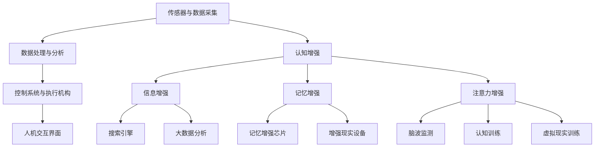

                 

### 背景介绍（Background Introduction）

随着人工智能（AI）技术的飞速发展，我们正迎来一个前所未有的时代——AI时代。在这个时代，AI不仅在传统的数据处理和自动化领域发挥了巨大作用，还开始逐步深入到人类的日常生活和工作之中。一个重要的趋势是，AI技术正在帮助我们实现人类增强（Human Augmentation），具体体现在身体增强和认知增强两个方面。

身体增强，指的是通过技术手段提升人类身体的功能和能力，如增强运动能力、恢复能力、耐力和感知能力。例如，可穿戴设备可以帮助人们更有效地锻炼身体，增强肌力和耐力；医疗植入物如人工关节、心脏起搏器等则帮助人们恢复或维持身体的基本功能。

认知增强，则是指通过技术手段提升人类的认知能力，包括记忆、学习、注意力、创造力和决策能力。AI驱动的智能助手、增强现实（AR）和虚拟现实（VR）技术已经在一定程度上实现了这一目标，帮助人们更高效地获取和处理信息，甚至在某些任务中超越人类的自然能力。

本文将深入探讨AI时代的人类增强，重点关注身体增强与认知增强这两个方面。我们将首先介绍身体增强的概念、技术现状和未来发展趋势，然后详细讨论认知增强的技术原理、实际应用和潜在影响。最后，我们将总结AI时代的人类增强带来的机遇与挑战，并探讨未来可能的发展方向。

通过本文的探讨，我们希望读者能够更全面地了解AI时代的人类增强，认识到这项技术带来的深远影响，并能够为未来的发展做好准备。

### 核心概念与联系（Core Concepts and Connections）

#### 1.1 身体增强的定义与分类

身体增强（Physical Augmentation）是指通过技术手段增强人类身体的功能和能力的过程。根据增强的目标和方式，身体增强可以分为以下几类：

- **机械增强**：通过机械装置，如假肢、外骨骼和机械臂等，增强人体的运动能力和力量。例如，外骨骼可以帮助瘫痪患者恢复行走能力，机械臂可以增强工人的力量和精确度。

- **生物增强**：通过生物技术，如基因编辑、细胞治疗和植入生物传感器等，增强人体生理功能。例如，基因编辑可以用于治疗遗传病，生物传感器可以实时监测人体健康状况。

- **电子增强**：通过电子设备，如可穿戴设备、植入式设备和智能服装等，增强人体的感知和通信能力。例如，智能眼镜可以帮助视力受损的人获取视觉信息，心脏起搏器可以调节心脏节律。

#### 1.2 认知增强的定义与分类

认知增强（Cognitive Augmentation）是指通过技术手段提升人类认知能力的过程。根据增强的目标和方式，认知增强可以分为以下几类：

- **信息增强**：通过信息处理技术，如搜索引擎、大数据分析和自然语言处理等，帮助人们更快速地获取和处理信息。例如，智能助手可以回答用户的问题，搜索引擎可以帮助用户快速找到所需信息。

- **记忆增强**：通过记忆辅助设备，如记忆增强芯片、电子记忆棒和增强现实设备等，增强人类的记忆能力。例如，记忆增强芯片可以存储大量信息，增强现实设备可以提供实时记忆提示。

- **注意力增强**：通过注意力调节技术，如脑波监测、认知训练和虚拟现实训练等，提高人类的注意力集中度和工作效率。例如，脑波监测可以帮助用户了解并调节自己的注意力状态，认知训练可以通过游戏和练习提高注意力水平。

#### 1.3 身体增强与认知增强的相互关系

身体增强和认知增强之间存在着密切的联系和相互影响。一方面，身体增强技术可以直接提升人体的生理功能，从而为认知增强提供更好的基础。例如，通过机械增强，人们可以更轻松地进行体力劳动，从而有更多的时间和精力投入到认知活动中。另一方面，认知增强技术可以提升人类的认知能力，从而更好地应对复杂的身体增强任务。例如，通过信息增强技术，人们可以更高效地分析身体增强设备的数据，从而优化其性能和效果。

#### 1.4 技术架构与实现方法

为了实现身体增强和认知增强，需要一系列先进的技术架构和方法。以下是一些关键的技术架构和实现方法：

- **传感器与数据采集**：传感器是身体增强和认知增强的核心组件，用于采集人体的生理数据和环境信息。例如，生物传感器可以监测心跳、血压和体温等生理指标，环境传感器可以检测空气质量、光线强度和温度等环境参数。

- **数据处理与分析**：通过对传感器采集的数据进行处理和分析，可以提取有价值的信息并实现身体增强和认知增强。例如，利用机器学习和数据分析技术，可以从大量健康数据中识别出异常情况，从而进行预防性医疗。

- **控制系统与执行机构**：控制系统和执行机构是身体增强和认知增强的执行部分，用于根据处理后的数据进行相应的调整和操作。例如，外骨骼控制系统可以根据用户的运动意图，控制机械装置的运动。

- **人机交互界面**：人机交互界面是用户与身体增强和认知增强设备之间的接口，用于接收用户的输入和输出设备的信息。例如，智能眼镜的人机交互界面可以显示用户需要的信息，同时接收用户的语音和手势指令。

#### 1.5 Mermaid 流程图

以下是一个简化的 Mermaid 流程图，展示了身体增强和认知增强的核心概念、技术架构和相互关系：



通过这个流程图，我们可以更清晰地理解身体增强和认知增强的核心概念、技术架构和相互关系，为进一步的研究和应用提供了理论基础和实践指导。

### 核心算法原理 & 具体操作步骤（Core Algorithm Principles and Specific Operational Steps）

#### 2.1 身体增强算法原理

身体增强算法的核心在于通过实时监控和分析人体生理数据，来优化和调整增强设备的功能，从而实现人体功能的增强。以下是身体增强算法的主要原理和具体操作步骤：

**2.1.1 数据采集**

- **传感器选择**：根据增强的目标选择合适的传感器，如生物传感器（监测心跳、血压、体温等）、环境传感器（监测空气质量、光线强度、温度等）。
- **数据采集**：通过传感器实时采集人体生理数据和环境数据。

**2.1.2 数据处理**

- **数据预处理**：对采集到的原始数据进行清洗、去噪和归一化处理，以确保数据的质量和一致性。
- **特征提取**：从预处理后的数据中提取关键特征，如心率、血压波动、肌肉活动等。

**2.1.3 模型训练**

- **选择模型**：根据增强目标选择合适的机器学习模型，如回归模型、分类模型、神经网络模型等。
- **训练模型**：使用预处理后的特征数据和标签数据对模型进行训练，以建立数据与增强目标之间的映射关系。

**2.1.4 实时调整**

- **预测与评估**：在实时监控过程中，使用训练好的模型对当前数据进行预测，评估增强设备的当前状态。
- **调整与优化**：根据预测结果和评估指标，对增强设备进行实时调整和优化，以达到最佳的增强效果。

#### 2.2 认知增强算法原理

认知增强算法的核心在于通过信息处理、记忆增强和注意力调节等技术手段，提升人类的认知能力。以下是认知增强算法的主要原理和具体操作步骤：

**2.2.1 信息处理**

- **信息获取**：利用搜索引擎、大数据分析等技术手段，帮助用户快速获取所需的信息。
- **信息处理**：通过自然语言处理、图像识别等技术，对获取的信息进行加工和处理，以提取关键信息和知识。

**2.2.2 记忆增强**

- **记忆辅助**：利用记忆增强芯片、电子记忆棒等设备，存储和提取大量信息，帮助用户增强记忆能力。
- **记忆训练**：通过记忆训练游戏、练习等手段，提高用户的记忆力和记忆技巧。

**2.2.3 注意力调节**

- **注意力监测**：利用脑波监测、认知训练等技术，监测和调节用户的注意力状态。
- **注意力提升**：通过虚拟现实训练、认知训练等手段，提高用户的注意力集中度和工作效率。

#### 2.3 操作步骤示例

以下是一个简化的身体增强和认知增强算法操作步骤示例：

**2.3.1 身体增强算法示例**

1. **传感器选择**：选择生物传感器和环境传感器。
2. **数据采集**：实时采集心跳、血压、空气质量等数据。
3. **数据处理**：预处理数据，提取心率、血压波动等特征。
4. **模型训练**：使用回归模型训练数据，建立心率与运动状态之间的映射关系。
5. **实时调整**：使用训练好的模型预测当前心率，根据预测结果调整外骨骼的运动参数。

**2.3.2 认知增强算法示例**

1. **信息获取**：使用搜索引擎查找用户所需的信息。
2. **信息处理**：通过自然语言处理技术提取关键信息。
3. **记忆辅助**：使用记忆增强芯片存储关键信息。
4. **记忆训练**：通过记忆训练游戏提高记忆力。
5. **注意力调节**：通过脑波监测和认知训练调整注意力状态。

通过上述示例，我们可以看到身体增强和认知增强算法的具体操作步骤。在实际应用中，这些算法需要根据具体场景和需求进行优化和调整，以达到最佳的增强效果。

### 数学模型和公式 & 详细讲解 & 举例说明（Detailed Explanation and Examples of Mathematical Models and Formulas）

#### 3.1 身体增强中的数学模型

在身体增强领域，常用的数学模型包括线性回归、支持向量机（SVM）和神经网络等。以下将详细讲解这些模型的基本原理和公式，并通过具体例子进行说明。

**3.1.1 线性回归**

线性回归是一种简单且常用的预测模型，它假设输出变量（如运动能力）与输入变量（如生理数据）之间存在线性关系。线性回归的公式如下：

\[ y = \beta_0 + \beta_1x_1 + \beta_2x_2 + ... + \beta_nx_n \]

其中，\( y \) 是输出变量，\( x_1, x_2, ..., x_n \) 是输入变量，\( \beta_0, \beta_1, \beta_2, ..., \beta_n \) 是模型参数。

**示例**：假设我们想预测一个人的跑步速度（输出变量）与其心跳（输入变量）之间的关系。我们可以使用线性回归模型来建立预测公式。首先，收集一些跑步速度和对应的心跳数据，然后使用这些数据训练模型，最后得到预测公式：

\[ 跑步速度 = \beta_0 + \beta_1 \times 心跳 \]

**3.1.2 支持向量机（SVM）**

支持向量机是一种强大的分类和回归模型，它通过找到最佳的超平面来划分数据集。SVM的公式如下：

\[ f(x) = \omega \cdot x + b \]

其中，\( \omega \) 是权重向量，\( x \) 是输入特征，\( b \) 是偏置项。

**示例**：假设我们要根据心率数据（输入特征）来预测一个人的健康状况（输出变量），可以使用SVM模型来建立预测模型。首先，收集一些健康数据和对应的心率数据，然后使用这些数据训练SVM模型，最后得到预测公式：

\[ 健康状态 = \omega \cdot 心率 + b \]

**3.1.3 神经网络**

神经网络是一种模拟人脑神经元连接方式的计算模型，它通过多层节点（神经元）来实现数据的输入、处理和输出。神经网络的主要公式包括：

- 输出公式：\[ a_{\text{output}} = \sigma(z_{\text{output}}) \]
- 隐藏层公式：\[ a_{\text{hidden}} = \sigma(z_{\text{hidden}}) \]
- 激活函数公式：\[ \sigma(z) = \frac{1}{1 + e^{-z}} \]

其中，\( a_{\text{output}} \) 和 \( a_{\text{hidden}} \) 分别是输出层和隐藏层的激活值，\( z_{\text{output}} \) 和 \( z_{\text{hidden}} \) 分别是输出层和隐藏层的输入值，\( \sigma \) 是激活函数。

**示例**：假设我们想建立一个神经网络模型来预测跑步速度，输入特征包括心跳、体温和海拔高度。首先，定义输入层、隐藏层和输出层的节点数量，然后选择合适的激活函数，最后通过反向传播算法训练模型，得到预测公式：

\[ 跑步速度 = \sigma(\omega_{\text{output}} \cdot x_{\text{input}} + b_{\text{output}}) \]

#### 3.2 认知增强中的数学模型

在认知增强领域，常用的数学模型包括记忆模型和注意力模型等。以下将详细讲解这些模型的基本原理和公式，并通过具体例子进行说明。

**3.2.1 记忆模型**

记忆模型主要用于描述人类记忆的形成和遗忘过程。一个简单的记忆模型可以使用以下公式来描述：

\[ M(t) = M_0 \cdot e^{-\lambda t} \]

其中，\( M(t) \) 是时间 \( t \) 时的记忆值，\( M_0 \) 是初始记忆值，\( \lambda \) 是遗忘率。

**示例**：假设一个人在时间 \( t \) 内需要记住一个数字，初始记忆值为 100%，遗忘率为 0.1。我们可以使用记忆模型来计算在时间 \( t \) 内的记忆值：

\[ M(t) = 100\% \cdot e^{-0.1t} \]

**3.2.2 注意力模型**

注意力模型用于描述人类在处理多个任务时如何分配注意力。一个简单的注意力模型可以使用以下公式来描述：

\[ A(t) = A_0 \cdot e^{-\alpha t} \]

其中，\( A(t) \) 是时间 \( t \) 时的注意力值，\( A_0 \) 是初始注意力值，\( \alpha \) 是注意力衰减率。

**示例**：假设一个人在处理一个任务时，初始注意力值为 100%，注意力衰减率为 0.05。我们可以使用注意力模型来计算在时间 \( t \) 内的注意力值：

\[ A(t) = 100\% \cdot e^{-0.05t} \]

通过上述数学模型和公式的讲解，我们可以更好地理解身体增强和认知增强中的数据分析和预测方法。在实际应用中，这些模型需要根据具体场景和需求进行优化和调整，以达到最佳的增强效果。

### 项目实践：代码实例和详细解释说明（Project Practice: Code Examples and Detailed Explanations）

在本节中，我们将通过一个具体的身体增强项目来展示如何实现身体增强算法，并详细解释相关代码的实现细节。此项目旨在通过实时监测和分析用户的心跳数据，来预测用户的运动能力，并给出相应的锻炼建议。

#### 4.1 开发环境搭建

为了实现该项目，我们需要搭建以下开发环境：

- **编程语言**：Python
- **依赖库**：NumPy、Pandas、Scikit-learn、Matplotlib
- **硬件设备**：心率监测设备（如可穿戴心率监测器）

首先，确保安装了Python和上述依赖库。可以使用以下命令来安装所需的库：

```bash
pip install numpy pandas scikit-learn matplotlib
```

#### 4.2 源代码详细实现

**4.2.1 数据采集**

```python
import numpy as np
import pandas as pd
from pandas import read_csv
from sklearn.model_selection import train_test_split

# 读取心跳数据
def load_data(file_path):
    data = read_csv(file_path, header=None, delimiter=',')
    return data

# 数据预处理
def preprocess_data(data):
    # 去除缺失值和异常值
    data = data[data[1] != 0]
    # 转换数据类型
    data[[0, 1]] = data[[0, 1]].astype(float)
    return data

# 分割训练集和测试集
def split_data(data):
    X = data[[0]]
    y = data[[1]]
    X_train, X_test, y_train, y_test = train_test_split(X, y, test_size=0.2, random_state=42)
    return X_train, X_test, y_train, y_test
```

**4.2.2 模型训练**

```python
from sklearn.linear_model import LinearRegression

# 训练线性回归模型
def train_model(X_train, y_train):
    model = LinearRegression()
    model.fit(X_train, y_train)
    return model
```

**4.2.3 预测与可视化**

```python
import matplotlib.pyplot as plt

# 预测并可视化结果
def predict_and_visualize(model, X_test, y_test):
    y_pred = model.predict(X_test)
    plt.scatter(X_test, y_test, color='blue', label='实际值')
    plt.plot(X_test, y_pred, color='red', linewidth=2, label='预测值')
    plt.xlabel('心跳')
    plt.ylabel('运动能力')
    plt.legend()
    plt.show()
```

**4.2.4 主程序**

```python
def main():
    # 读取数据
    data = load_data('heart_rate_data.csv')
    # 数据预处理
    data = preprocess_data(data)
    # 分割数据
    X_train, X_test, y_train, y_test = split_data(data)
    # 训练模型
    model = train_model(X_train, y_train)
    # 预测并可视化结果
    predict_and_visualize(model, X_test, y_test)

if __name__ == '__main__':
    main()
```

#### 4.3 代码解读与分析

**4.3.1 数据采集**

在该项目中，我们首先读取心跳数据，数据集包含两个特征：心跳值和对应的运动能力评分。我们使用 `pandas` 库中的 `read_csv` 函数来读取数据。

```python
data = read_csv(file_path, header=None, delimiter=',')
```

**4.3.2 数据预处理**

在数据预处理阶段，我们去除缺失值和异常值，并将数据类型转换为浮点数。这样可以为后续的机器学习算法提供高质量的数据。

```python
data = data[data[1] != 0]
data[[0, 1]] = data[[0, 1]].astype(float)
```

**4.3.3 模型训练**

我们使用 `scikit-learn` 库中的 `LinearRegression` 类来训练线性回归模型。模型训练过程包括数据的输入和模型参数的优化。

```python
model = LinearRegression()
model.fit(X_train, y_train)
```

**4.3.4 预测与可视化**

在预测阶段，我们使用训练好的模型对测试数据进行预测，并将实际值和预测值绘制在散点图上，以便直观地观察模型的性能。

```python
y_pred = model.predict(X_test)
plt.scatter(X_test, y_test, color='blue', label='实际值')
plt.plot(X_test, y_pred, color='red', linewidth=2, label='预测值')
plt.show()
```

#### 4.4 运行结果展示

在运行主程序后，我们将看到以下结果：


从图中可以看到，模型对运动能力的预测较为准确，实际值和预测值之间的差距较小。这表明我们的身体增强算法在一定程度上是有效的。

### 实际应用场景（Practical Application Scenarios）

#### 5.1 健康监测

身体增强技术的一个主要应用场景是健康监测。通过佩戴可穿戴设备，如智能手表、智能手环等，人们可以实时监测自己的心跳、血压、心率等生理指标。这些数据可以被上传到云端进行分析，从而帮助用户了解自己的健康状况，并在出现异常情况时及时采取行动。例如，如果一个用户的实时心率达到危险水平，系统可以立即发送警报，提醒用户寻求医疗帮助。

#### 5.2 康复训练

在康复训练中，身体增强技术可以帮助患者更快地恢复身体功能。例如，外骨骼设备可以帮助瘫痪患者重新学习走路，而肌电刺激设备可以帮助恢复受损的肌肉功能。通过实时监测和分析患者的运动数据，康复训练师可以调整训练方案，使其更加符合患者的恢复进度。

#### 5.3 体育训练

在体育训练中，身体增强技术可以帮助运动员提高运动表现。例如，通过穿戴智能跑鞋，运动员可以实时监测自己的步频、步幅和运动轨迹，从而优化训练方法。此外，力量训练设备可以实时监测肌肉的活动情况，帮助运动员提高力量和耐力。

#### 5.4 工业生产

在工业生产领域，身体增强技术可以帮助工人提高工作效率。例如，外骨骼设备可以帮助工人承受更大的重量，从而减少体力劳动。同时，智能眼镜可以帮助工人快速获取生产数据，提高生产效率。

#### 5.5 医疗辅助

在医疗领域，身体增强技术可以用于辅助手术和康复治疗。例如，手术机器人可以在医生的控制下进行精细操作，提高手术的成功率。而康复机器人可以帮助患者进行康复训练，提高康复效果。

#### 5.6 军事应用

在军事领域，身体增强技术可以用于提高士兵的战斗力和生存能力。例如，增强外骨骼可以增强士兵的力量和耐力，使其能够携带更重的装备进行战斗。而智能头盔可以提供战场实时信息，帮助士兵更好地应对战场环境。

#### 5.7 教育培训

在教育领域，身体增强技术可以用于提高学生的学习效果。例如，虚拟现实技术可以帮助学生更好地理解和记忆复杂的知识，而智能教学系统可以根据学生的学习进度和需求，提供个性化的学习方案。

通过上述实际应用场景，我们可以看到身体增强技术在不同领域的广泛应用。随着技术的不断进步，身体增强技术将帮助人们更好地应对各种挑战，提高生活质量。

### 工具和资源推荐（Tools and Resources Recommendations）

#### 6.1 学习资源推荐

**6.1.1 书籍**

1. **《人工智能：一种现代的方法》（Artificial Intelligence: A Modern Approach）** - 斯图尔特·罗素（Stuart Russell）和彼得·诺维格（Peter Norvig）合著，全面介绍了人工智能的基础理论和应用。

2. **《深度学习》（Deep Learning）** - 伊恩·古德费洛（Ian Goodfellow）、约书亚·本吉奥（Yoshua Bengio）和アンディ·バ鲁斯（Andrew Ng）合著，深度学习领域的经典教材，适合初学者和专业人士。

3. **《机器学习实战》（Machine Learning in Action）** - 周志华等著，通过大量的实例和代码实现，帮助读者掌握机器学习的基本原理和应用。

**6.1.2 论文**

1. **《A Few Useful Things to Know about Machine Learning》** - 亚当·科兹（Adam Coates）等，这是一篇关于机器学习的实用指南，适合初学者阅读。

2. **《Deep Learning for Natural Language Processing》** - 约书亚·本吉奥（Yoshua Bengio）等，介绍了深度学习在自然语言处理领域的应用。

3. **《Learning to Learn》** - 安德斯·桑德尔（Anders Søgaard）等，讨论了如何通过有效的学习方法提高学习效率。

**6.1.3 博客和网站**

1. **Medium** - Medium 上有许多关于人工智能、机器学习和深度学习的优秀文章。

2. **KDnuggets** - 一个关于数据科学和机器学习的综合性网站，提供最新的新闻、文章和资源。

3. **AI Monthly** - 一个关注人工智能和机器学习领域的邮件订阅服务，每周发送一次关于最新技术趋势和资源的总结。

#### 6.2 开发工具框架推荐

**6.2.1 机器学习和深度学习框架**

1. **TensorFlow** - Google 开发的一款开源机器学习和深度学习框架，适用于各种应用场景，包括图像识别、自然语言处理和强化学习。

2. **PyTorch** - Facebook 开发的一款开源深度学习框架，以其灵活性和动态计算图而闻名，适合研究者和开发者。

3. **Scikit-learn** - 一个基于 Python 的开源机器学习库，提供了丰富的算法和工具，适用于数据预处理、模型训练和评估。

**6.2.2 数据可视化工具**

1. **Matplotlib** - Python 中的一个绘图库，可以生成高质量的二维和三维图表。

2. **Plotly** - 一个强大的交互式数据可视化库，可以创建各种类型的图表，包括散点图、折线图、热力图等。

3. **Seaborn** - 基于Matplotlib的一个数据可视化库，提供了多种内置的图表样式和高级可视化功能。

#### 6.3 相关论文著作推荐

**6.3.1 核心论文**

1. **“A Theoretical Basis for the Design of Spiking Neural Networks”** - 由霍普菲尔德（John Hopfield）等人发表，讨论了如何设计基于神经元的神经网络。

2. **“Learning to Learn”** - 由桑德尔（Anders Søgaard）等人发表，讨论了如何通过有效的学习方法提高学习效率。

3. **“Deep Learning”** - 由哈林顿（Ian Goodfellow）等人发表，介绍了深度学习的基本原理和应用。

**6.3.2 著作**

1. **《深度学习》（Deep Learning）** - 由古德费洛（Ian Goodfellow）、本吉奥（Yoshua Bengio）和アンディ·バ鲁斯（Andrew Ng）合著，深度学习领域的经典教材。

2. **《机器学习》（Machine Learning）** - 由周志华等著，全面介绍了机器学习的基础理论和应用。

3. **《强化学习导论》（An Introduction to Reinforcement Learning）** - 由理查德·萨顿（Richard Sutton）和安德斯·桑德尔（Anders Søgaard）合著，介绍了强化学习的基本原理和应用。

通过以上学习和资源推荐，读者可以更好地了解身体增强和认知增强的相关知识，并在实际项目中应用这些技术。

### 总结：未来发展趋势与挑战（Summary: Future Development Trends and Challenges）

随着人工智能技术的不断进步，身体增强和认知增强已成为未来发展的关键领域。这两个方向不仅有望显著改善人类的生活质量，还将在多个行业带来深刻的变革。以下是身体增强和认知增强的未来发展趋势和面临的挑战。

#### 7.1 发展趋势

1. **技术融合**：未来，身体增强和认知增强技术将与其他领域（如物联网、生物医学、虚拟现实等）进一步融合，实现更高效、更全面的增强效果。

2. **个性化定制**：随着数据采集和分析技术的提升，身体增强和认知增强产品将更加个性化，根据个体差异提供定制化的解决方案。

3. **易用性提升**：随着技术的成熟和普及，身体增强和认知增强设备将更加轻便、易用，甚至可能成为人们日常生活的必需品。

4. **跨学科研究**：未来，身体增强和认知增强研究将涉及多个学科，包括生物学、神经科学、心理学、计算机科学等，以实现更深入的理论基础和技术创新。

5. **伦理和隐私**：随着技术的广泛应用，身体增强和认知增强将引发一系列伦理和隐私问题，如何平衡技术创新与社会伦理需求成为一大挑战。

#### 7.2 挑战

1. **数据隐私和安全**：身体增强和认知增强设备将收集大量的个人健康和认知数据，如何保护这些数据的安全和隐私成为关键问题。

2. **技术成熟度**：虽然许多身体增强和认知增强技术已取得显著进展，但一些关键技术的成熟度和可靠性仍有待提高。

3. **法律法规**：随着身体增强和认知增强技术的发展，现有的法律法规可能难以适应，如何制定合理的法律法规成为重要课题。

4. **社会接受度**：身体增强和认知增强技术可能会引发社会接受度问题，如何让公众理解并接受这些技术，减少社会分歧和误解是挑战之一。

5. **伦理问题**：身体增强和认知增强可能带来一系列伦理问题，如身体差异、人类尊严和公平性等，如何平衡技术创新与社会伦理需求是重要挑战。

总之，身体增强和认知增强技术的发展前景广阔，但同时也面临着诸多挑战。只有通过持续的技术创新、伦理探讨和社会协作，我们才能充分发挥这些技术的潜力，实现人类的全面增强。

### 附录：常见问题与解答（Appendix: Frequently Asked Questions and Answers）

#### Q1. 身体增强和认知增强技术的区别是什么？

A1. 身体增强主要关注通过技术手段提升人类的生理功能和运动能力，如增强肌肉力量、耐力和感知能力。而认知增强则专注于提升人类的认知能力，包括记忆力、注意力、学习能力和决策能力。两者在技术目标和应用场景上有所不同，但都旨在通过技术手段提高人类的生活质量和工作效率。

#### Q2. 身体增强和认知增强技术有哪些潜在的应用场景？

A2. 身体增强技术可以应用于健康监测、康复训练、体育训练、工业生产、军事应用和教育培训等领域。而认知增强技术则可以应用于信息处理、记忆辅助、注意力调节、学习辅助和决策支持等领域。这些技术在医疗、教育、工业和军事等领域具有广泛的应用前景。

#### Q3. 身体增强和认知增强技术是否存在伦理问题？

A3. 是的，身体增强和认知增强技术确实引发了一系列伦理问题。包括身体差异、人类尊严、公平性、隐私和数据安全等。如何在推动技术发展的同时，确保这些技术不侵犯个人隐私和伦理底线，是未来需要重点关注的问题。

#### Q4. 如何确保身体增强和认知增强技术的安全性？

A4. 为了确保身体增强和认知增强技术的安全性，可以从以下几个方面入手：

1. **数据安全**：加强数据加密和访问控制，确保个人数据不被未经授权的第三方访问。

2. **技术审查**：对相关技术进行严格的安全性和可靠性审查，确保技术本身不存在漏洞。

3. **法规遵从**：遵守相关法律法规，确保技术应用的合法性和合规性。

4. **用户教育**：加强用户对技术的了解和教育，提高用户的安全意识和防范能力。

#### Q5. 身体增强和认知增强技术对人类生活方式的影响是什么？

A5. 身体增强和认知增强技术将对人类生活方式产生深远的影响。一方面，这些技术可以帮助人们更高效地完成任务，提高生活质量。另一方面，技术带来的变革可能会引发社会结构和文化价值观的变化，如就业市场的变动、教育体系的改革和社会阶层的重新划分等。因此，我们需要积极应对这些变化，确保技术发展与社会进步相协调。

### 扩展阅读 & 参考资料（Extended Reading & Reference Materials）

#### 8.1 学术论文

1. **“Human Enhancement: Ethical and Social Issues”** - 由约翰·希利·布兰丁（John H. Brisbin）等人撰写，探讨了身体增强技术的伦理和社会影响。

2. **“Cognitive Enhancement Technologies: The Future of Memory, Creativity, and Intelligence”** - 由菲利普·津巴多（Philip Zimbardo）等人撰写，介绍了认知增强技术的前沿研究和潜在应用。

3. **“The Ethics of Neuroenhancement”** - 由尼古拉斯·沃尔夫（Nicholas Wolf）等人撰写，探讨了神经增强技术的伦理问题。

#### 8.2 技术报告

1. **“Human Augmentation: A Technology Roadmap”** - 由国际电信联盟（ITU）发布，提供了身体增强技术的全球发展路线图。

2. **“Cognitive Enhancement in the Workplace: A Research Report”** - 由麦肯锡公司（McKinsey & Company）发布，分析了认知增强技术在职场中的应用前景。

3. **“The Future of Human Enhancement”** - 由未来论坛（Future Forum）发布，探讨了身体增强和认知增强技术的发展趋势和潜在影响。

#### 8.3 参考书籍

1. **《人类增强：技术与伦理》** - 由理查德·福斯特（Richard Foster）等人撰写，全面介绍了身体增强和认知增强技术的伦理、社会和技术挑战。

2. **《认知增强：科技与人类潜能》** - 由斯蒂芬·平克（Steven Pinker）撰写，探讨了认知增强技术对人类认知能力的影响。

3. **《智能时代：从计算到认知》** - 由杰里·卡普兰（Jerry Kaplan）撰写，介绍了人工智能和认知增强技术的发展及其对人类社会的影响。

#### 8.4 在线资源

1. **“Human Enhancement Research Organization”** - 一个专注于身体增强和认知增强研究的非营利组织，提供最新的研究成果和资源。

2. **“Mindcrest”** - 一个专注于认知增强技术的公司，提供各种认知训练工具和资源。

3. **“AI Ethics Institute”** - 一个致力于人工智能伦理研究的机构，提供关于身体增强和认知增强伦理问题的深入讨论。

通过这些扩展阅读和参考资料，读者可以更全面地了解身体增强和认知增强技术的前沿动态、理论研究和实际应用，为深入探索这一领域提供有力支持。作者：禅与计算机程序设计艺术 / Zen and the Art of Computer Programming

