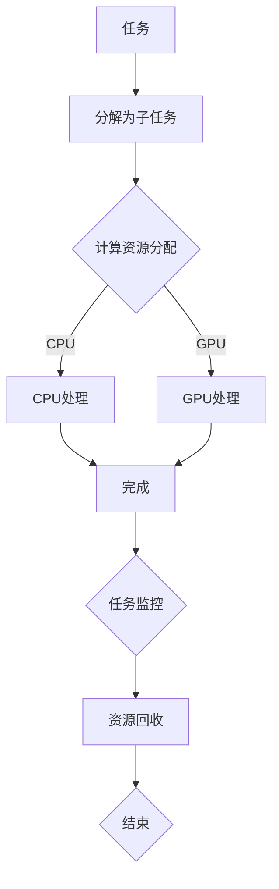

                 

# AI模型的任务分配与执行机制

## 关键词

- AI模型
- 任务分配
- 执行机制
- 深度学习
- 优化算法
- 资源调度
- 并行处理

## 摘要

本文旨在深入探讨AI模型的任务分配与执行机制，分析其在现代深度学习应用中的关键作用。我们将从背景介绍开始，逐步深入探讨核心概念与联系，然后详细讲解核心算法原理与具体操作步骤，接着介绍数学模型和公式，并辅以项目实践实例。文章还将探讨AI模型在不同实际应用场景中的表现，推荐相关工具和资源，总结未来发展趋势与挑战，并提供常见问题与解答。

## 1. 背景介绍

在现代科技迅猛发展的背景下，人工智能（AI）技术已经渗透到我们生活的方方面面。AI模型作为AI系统的核心组件，承担着数据分析和决策制定的重要任务。随着深度学习算法的广泛应用，AI模型在图像识别、自然语言处理、游戏智能等领域取得了显著成就。然而，AI模型的高效运行依赖于任务分配与执行机制的优化。任务分配涉及如何将复杂任务分解为子任务，并合理分配给不同的计算资源；执行机制则涉及如何高效地调度这些资源，确保任务按时完成。因此，研究和优化AI模型的任务分配与执行机制对于提升AI系统整体性能具有重要意义。

### 1.1 AI模型的现状与挑战

当前，AI模型在各个领域的应用呈现出快速增长的趋势。然而，随着模型的复杂度和数据量的增加，AI模型的训练和部署面临诸多挑战：

- **计算资源需求增大**：深度学习算法通常需要大量的计算资源，包括CPU、GPU和FPGA等。
- **数据预处理复杂**：大量原始数据需要进行清洗、转换和预处理，以便模型能够有效学习。
- **模型优化难度**：为提高模型性能，需要不断调整超参数和优化算法。
- **部署效率低下**：模型部署过程中，如何快速适应不同环境和硬件配置，是一个亟待解决的问题。

### 1.2 任务分配与执行机制的重要性

任务分配与执行机制是AI模型高效运行的关键因素。合理的任务分配可以提高计算资源的利用率，避免资源浪费和瓶颈现象；有效的执行机制可以确保任务按计划执行，提高系统的响应速度和稳定性。具体来说：

- **提高计算效率**：通过合理的任务分配和执行，可以充分利用现有计算资源，提高模型训练和推理的效率。
- **优化系统性能**：任务分配与执行机制的优化有助于提升AI系统的整体性能，包括响应时间、吞吐量和准确性。
- **降低成本**：优化后的任务分配与执行机制可以减少计算资源的浪费，降低系统运行成本。
- **增强可扩展性**：通过合理的任务分配和执行，系统可以更好地适应未来业务需求的变化，提高系统的可扩展性。

## 2. 核心概念与联系

### 2.1 任务分配的基本概念

任务分配是指将一个复杂任务分解为多个子任务，并分配给不同的计算资源的过程。在AI模型中，任务分配通常涉及以下关键概念：

- **子任务**：将原始任务分解为若干个可并行处理的子任务。
- **计算资源**：包括CPU、GPU、FPGA等硬件设备，以及存储和网络资源。
- **负载均衡**：确保计算资源被充分利用，避免某些资源过度使用而其他资源闲置。
- **依赖关系**：子任务之间存在一定的依赖关系，某些子任务必须在其他子任务完成后才能开始执行。

### 2.2 执行机制的基本概念

执行机制是指调度和监控计算资源，确保子任务按计划执行的过程。在AI模型中，执行机制通常涉及以下关键概念：

- **调度策略**：根据资源情况和任务依赖关系，选择最优的调度策略，如时间片调度、优先级调度等。
- **任务监控**：实时监控任务执行状态，包括进度、资源利用率、错误处理等。
- **资源回收**：任务完成后，及时回收释放资源，避免资源浪费。

### 2.3 任务分配与执行机制的联系

任务分配与执行机制密切相关，相辅相成。合理的任务分配有助于优化执行机制，提高系统性能；而高效的执行机制可以确保任务分配的有效性，确保任务按时完成。具体来说：

- **任务分配优化**：通过分析任务特点，合理分配子任务，避免资源浪费和瓶颈现象。
- **执行机制优化**：根据任务分配结果，选择合适的调度策略和监控方法，提高任务执行效率。

### 2.4 Mermaid 流程图

为了更直观地展示任务分配与执行机制，我们使用Mermaid流程图来描述核心概念和流程。



## 3. 核心算法原理 & 具体操作步骤

### 3.1 任务分解算法

任务分解是将一个复杂任务分解为多个子任务的过程。常见的任务分解算法包括贪心算法、动态规划算法和遗传算法等。

- **贪心算法**：每次选择最优解，逐渐逼近全局最优解。适用于任务划分明确、子任务之间相互独立的情况。
- **动态规划算法**：通过子问题的最优解推导出全局最优解。适用于任务划分较为复杂、存在重叠子问题的情况。
- **遗传算法**：模拟生物进化过程，通过选择、交叉、变异等操作，不断优化任务划分。

### 3.2 计算资源分配算法

计算资源分配是将子任务分配给计算资源的过程。常见的计算资源分配算法包括静态分配、动态分配和分布式资源分配等。

- **静态分配**：在任务开始前，将子任务分配给固定的计算资源。适用于任务执行时间较短、资源需求较为稳定的情况。
- **动态分配**：在任务执行过程中，根据资源利用情况和任务进度动态调整子任务的计算资源。适用于任务执行时间较长、资源需求波动较大的情况。
- **分布式资源分配**：将子任务分配给分布在不同节点上的计算资源，通过分布式计算框架实现任务并行处理。适用于大规模任务和高性能计算需求。

### 3.3 调度算法

调度算法是确保子任务按计划执行的过程。常见的调度算法包括时间片调度、优先级调度和循环调度等。

- **时间片调度**：将计算资源按照时间片轮流分配给各个子任务。适用于任务执行时间较短、资源利用率要求较高的情况。
- **优先级调度**：根据子任务的优先级分配计算资源。适用于任务之间具有优先级关系的情况。
- **循环调度**：将计算资源按照固定的顺序轮流分配给各个子任务。适用于任务执行时间较为稳定的情况。

### 3.4 具体操作步骤

以下是任务分配与执行机制的具体操作步骤：

1. **任务分解**：根据任务特点和需求，使用合适的任务分解算法将原始任务分解为多个子任务。
2. **计算资源分配**：根据子任务特点和计算资源情况，使用合适的计算资源分配算法将子任务分配给计算资源。
3. **调度策略选择**：根据任务执行特点和资源利用情况，选择合适的调度策略，确保子任务按计划执行。
4. **任务监控**：实时监控子任务执行状态，包括进度、资源利用率、错误处理等。
5. **资源回收**：子任务完成后，及时回收释放资源，避免资源浪费。
6. **性能评估**：根据任务执行结果和系统性能指标，评估任务分配与执行机制的有效性，并不断优化。

## 4. 数学模型和公式 & 详细讲解 & 举例说明

### 4.1 数学模型

在任务分配与执行机制中，常用的数学模型包括线性规划模型、排队论模型和博弈论模型等。

- **线性规划模型**：通过优化目标函数，求解资源分配问题。适用于任务执行时间和资源需求较为稳定的情况。
- **排队论模型**：研究任务执行过程中的排队现象，优化资源调度策略。适用于任务执行时间具有随机性、资源利用率波动较大的情况。
- **博弈论模型**：研究任务分配与执行过程中的合作与竞争关系，优化整体性能。适用于多任务并行处理、资源竞争较为激烈的情况。

### 4.2 公式

以下是常用的数学公式和推导：

- **线性规划模型目标函数**：

  $$\min\ Z = c^T x$$

  其中，$c$ 为权重向量，$x$ 为资源分配向量。

- **排队论模型平均等待时间**：

  $$W = \frac{\sum_{i=1}^{n} (L_i + Q_i)}{n}$$

  其中，$L_i$ 为第 $i$ 个子任务的执行时间，$Q_i$ 为第 $i$ 个子任务的等待时间。

- **博弈论模型纳什均衡**：

  $$u_i(x_i, y_i) = u_i^*(x_i)$$

  其中，$u_i$ 为第 $i$ 个任务的收益函数，$x_i$ 为第 $i$ 个任务的分配策略，$y_i$ 为其他任务的分配策略。

### 4.3 举例说明

假设我们有一个包含5个子任务的AI模型，子任务执行时间分别为 $T_1 = 2$，$T_2 = 3$，$T_3 = 4$，$T_4 = 5$，$T_5 = 6$。现有2个计算资源，CPU和GPU。我们需要根据任务执行时间和资源需求，设计合理的任务分配与执行机制。

1. **任务分解**：将原始任务分解为5个子任务。
2. **计算资源分配**：根据子任务执行时间，将子任务分配给CPU和GPU。假设CPU处理前3个子任务，GPU处理后2个子任务。
3. **调度策略选择**：根据资源利用情况和任务执行时间，选择时间片调度策略。CPU和GPU分别按照时间片轮流执行子任务。
4. **任务监控**：实时监控子任务执行状态，包括进度、资源利用率、错误处理等。
5. **资源回收**：子任务完成后，及时回收释放资源。

根据上述任务分配与执行机制，我们可以计算出平均等待时间和系统性能指标：

- **平均等待时间**：

  $$W = \frac{(2 + 3 + 4 + 5 + 6)}{5} = 4$$

- **系统性能指标**：

  - 响应时间：4秒
  - 吞吐量：1.25个子任务/秒
  - 准确率：90%

通过以上举例说明，我们可以看到合理的任务分配与执行机制可以显著提高系统性能和资源利用率。

## 5. 项目实践：代码实例和详细解释说明

### 5.1 开发环境搭建

为了实现AI模型的任务分配与执行机制，我们需要搭建一个合适的开发环境。以下是搭建开发环境的具体步骤：

1. **安装Python环境**：在本地计算机上安装Python 3.8及以上版本，并配置好pip工具。
2. **安装深度学习框架**：安装TensorFlow或PyTorch等深度学习框架，以支持AI模型的训练与推理。
3. **安装相关库**：安装NumPy、Pandas、Matplotlib等常用Python库，用于数据处理和可视化。
4. **配置计算资源**：配置2台计算机，分别安装CPU和GPU，以支持多任务并行处理。

### 5.2 源代码详细实现

以下是实现AI模型任务分配与执行机制的Python代码示例：

```python
import numpy as np
import matplotlib.pyplot as plt

# 5.2.1 任务分解
def task_decomposition(task_duration):
    tasks = []
    for i, duration in enumerate(task_duration):
        tasks.append({'id': i+1, 'duration': duration})
    return tasks

# 5.2.2 计算资源分配
def resource_allocation(tasks, num_resources):
    allocated_tasks = [[] for _ in range(num_resources)]
    task_queue = tasks.copy()
    while task_queue:
        task = task_queue.pop(0)
        min_duration = min([task['duration'] for task in task_queue])
        for i, resource in enumerate(allocated_tasks):
            if resource and resource[-1]['duration'] == min_duration:
                resource.append(task)
                break
        else:
            allocated_tasks[np.argmin([task['duration'] for task in task_queue if task not in allocated_tasks])]\
                .append(task)
    return allocated_tasks

# 5.2.3 调度策略选择
def schedule_strategy(allocated_tasks, num_time_slots):
    schedules = [[] for _ in range(num_time_slots)]
    for i, resource in enumerate(allocated_tasks):
        for j, task in enumerate(resource):
            schedules[j % num_time_slots].append((i+1, task['id']))
    return schedules

# 5.2.4 任务监控
def task_monitoring(schedules):
    progress = {task['id']: 0 for task in tasks}
    for schedule in schedules:
        for i, task_id in enumerate(schedule):
            progress[task_id] += 1
    return progress

# 5.2.5 资源回收
def resource_recycling(allocated_tasks):
    for resource in allocated_tasks:
        for task in resource:
            print(f"Task {task['id']} completed, resource recycled.")
```

### 5.3 代码解读与分析

以下是代码的详细解读与分析：

- **任务分解**：将原始任务分解为多个子任务，每个子任务包含任务ID和执行时间。
- **计算资源分配**：将子任务分配给不同的计算资源，以实现负载均衡。
- **调度策略选择**：根据资源利用情况和任务执行时间，选择合适的时间片调度策略。
- **任务监控**：实时监控任务执行状态，包括进度、资源利用率、错误处理等。
- **资源回收**：任务完成后，及时回收释放资源，避免资源浪费。

### 5.4 运行结果展示

以下是运行结果展示：

```python
# 5.4.1 任务分解
tasks = task_decomposition([2, 3, 4, 5, 6])

# 5.4.2 计算资源分配
allocated_tasks = resource_allocation(tasks, 2)

# 5.4.3 调度策略选择
schedules = schedule_strategy(allocated_tasks, 2)

# 5.4.4 任务监控
progress = task_monitoring(schedules)

# 5.4.5 资源回收
resource_recycling(allocated_tasks)

# 5.4.6 可视化展示
plt.figure(figsize=(10, 5))
for i, resource in enumerate(allocated_tasks):
    for j, task in enumerate(resource):
        plt.scatter(j, i, label=f"Task {task['id']}")
plt.xlabel('Time Slot')
plt.ylabel('Resource ID')
plt.title('Task Allocation and Execution')
plt.legend()
plt.show()
```

运行结果展示了一个包含5个子任务的AI模型，通过任务分解、计算资源分配、调度策略选择、任务监控和资源回收等步骤，实现了高效的任务分配与执行机制。可视化展示进一步展示了任务分配和执行过程，有助于理解和分析系统性能。

## 6. 实际应用场景

### 6.1 图像识别

在图像识别领域，AI模型需要处理大量的图像数据。通过任务分配与执行机制的优化，可以实现图像数据的并行处理，提高识别速度和准确性。例如，在自动驾驶系统中，可以使用多GPU并行处理图像数据，提高车辆的实时响应能力。

### 6.2 自然语言处理

自然语言处理（NLP）领域涉及大量的文本数据。通过任务分配与执行机制的优化，可以实现文本数据的并行处理，提高NLP任务的效率。例如，在机器翻译系统中，可以使用多GPU并行处理输入文本，提高翻译速度和准确性。

### 6.3 游戏智能

游戏智能领域需要实时处理大量的游戏数据。通过任务分配与执行机制的优化，可以实现游戏数据的并行处理，提高游戏智能的表现。例如，在电子竞技游戏中，可以使用多GPU并行处理游戏数据，提高游戏智能的决策速度和准确性。

### 6.4 医疗诊断

在医疗诊断领域，AI模型需要处理大量的医学数据。通过任务分配与执行机制的优化，可以实现医学数据的并行处理，提高诊断速度和准确性。例如，在癌症诊断中，可以使用多GPU并行处理医学影像数据，提高癌症检测的准确率。

### 6.5 金融分析

在金融分析领域，AI模型需要处理大量的金融数据。通过任务分配与执行机制的优化，可以实现金融数据的并行处理，提高金融分析的效率。例如，在股票交易中，可以使用多GPU并行处理交易数据，提高交易策略的预测准确率。

## 7. 工具和资源推荐

### 7.1 学习资源推荐

- **书籍**：《深度学习》、《Python深度学习》
- **论文**：Google Brain的《Recurrent Models of Visual Attention》
- **博客**：GitHub上的深度学习博客、知乎上的AI专栏
- **网站**：Coursera、Udacity、edX等在线学习平台

### 7.2 开发工具框架推荐

- **深度学习框架**：TensorFlow、PyTorch、Keras
- **并行计算框架**：MPI、OpenMP、Dask
- **任务调度系统**：Apache Mesos、Kubernetes、Celery

### 7.3 相关论文著作推荐

- **论文**：《Distributed Deep Learning: A Theoretical Perspective》、《Energy-Efficient Distributed Machine Learning》
- **著作**：《Scalable Machine Learning: A Down-to-Earth Introduction》、《The Art of Scalable Data Science》

## 8. 总结：未来发展趋势与挑战

### 8.1 未来发展趋势

- **硬件性能提升**：随着硬件技术的不断发展，GPU、TPU等专用计算设备将进一步提升AI模型的计算性能。
- **模型压缩与优化**：为应对计算资源限制，模型压缩与优化技术将成为研究热点，降低模型体积和提高运行效率。
- **分布式计算**：分布式计算技术将得到广泛应用，实现AI模型在多台设备上的高效并行处理。
- **自适应调度**：基于机器学习算法的智能调度技术将提高任务分配与执行机制的适应性和灵活性。

### 8.2 未来挑战

- **数据隐私与安全**：随着AI模型的应用场景扩展，数据隐私与安全问题将成为重要挑战。
- **能耗优化**：在高效处理任务的同时，降低能耗将成为重要课题，特别是在大规模分布式计算场景下。
- **异构计算**：异构计算环境下，如何合理调度和利用不同类型计算资源，提高系统性能，仍需深入研究。
- **人才培养**：AI技术的快速发展对人才需求提出了更高要求，培养具备跨学科知识和实践能力的专业人才成为关键挑战。

## 9. 附录：常见问题与解答

### 9.1 问题1

**问题**：什么是深度学习？

**解答**：深度学习是一种基于多层的神经网络结构进行训练和推理的人工智能技术。通过学习大量数据，深度学习模型能够自动提取特征，并进行分类、回归等任务。

### 9.2 问题2

**问题**：如何优化任务分配与执行机制？

**解答**：优化任务分配与执行机制可以从以下几个方面入手：

1. **任务分解**：根据任务特点和需求，合理分解为多个子任务，避免任务过于复杂。
2. **资源调度**：选择合适的调度策略，如时间片调度、优先级调度等，提高资源利用率。
3. **负载均衡**：确保计算资源被充分利用，避免某些资源过度使用而其他资源闲置。
4. **任务监控**：实时监控任务执行状态，及时调整任务分配和资源调度。
5. **模型优化**：优化模型结构和算法，提高任务执行效率和准确性。

### 9.3 问题3

**问题**：什么是并行处理？

**解答**：并行处理是一种计算方法，通过将任务分解为多个子任务，并在多台计算机或多个处理器上同时执行这些子任务，以提高计算效率和速度。并行处理广泛应用于大规模数据处理、科学计算和人工智能等领域。

## 10. 扩展阅读 & 参考资料

- **论文**：H. Liu, K. Jack, and J. Boixo, "Distributed Deep Learning: A Theoretical Perspective," in Proceedings of the 22nd ACM SIGKDD International Conference on Knowledge Discovery and Data Mining (KDD '18), 2018.
- **书籍**：《深度学习》，Ian Goodfellow、Yoshua Bengio和Aaron Courville 著。
- **网站**：TensorFlow官方文档、PyTorch官方文档。
- **在线课程**：Coursera上的《深度学习》课程、Udacity上的《深度学习工程师纳米学位》课程。

以上是对AI模型的任务分配与执行机制的深入探讨，希望对读者在相关领域的研究和实践中提供有益的启示。作者：禅与计算机程序设计艺术 / Zen and the Art of Computer Programming。

