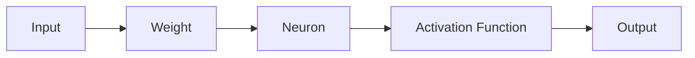

                 

### 背景介绍（Background Introduction）

近年来，人工智能（AI）研究取得了令人瞩目的进展，推动了计算机科学、经济学、医学、交通等各个领域的发展。AI技术的飞速发展离不开算法创新、计算能力的提升以及大量数据的积累。本文旨在探讨AI研究的最新进展与趋势，分析现有技术及其在各个领域的应用，展望未来可能面临的挑战。

人工智能，作为一门交叉学科，涵盖了计算机科学、认知科学、心理学、统计学等多个领域。其目标是使计算机具备类似人类的智能，能够感知、学习、推理和决策。在AI的发展历程中，从早期的专家系统、机器学习到如今深度学习，每一次技术突破都极大地推动了AI的应用和普及。

当前，AI研究正朝着多模态、强化学习、自主决策等方向发展。多模态AI旨在整合不同类型的数据，如文本、图像、音频等，实现更全面的感知和理解。强化学习则通过让模型在与环境的交互中不断学习，提高其在复杂任务中的表现。自主决策研究则致力于让AI系统具备自主行动和决策能力，减少对人类干预的依赖。

然而，AI的发展也面临着一系列挑战，包括数据隐私、算法透明度、伦理问题等。如何在保证数据安全和隐私的同时，提高AI算法的性能和可靠性，成为当前研究的热点问题。

### Background Introduction

In recent years, artificial intelligence (AI) research has made remarkable progress, propelling the development of various fields such as computer science, economics, medicine, and transportation. The rapid advancement of AI technology is attributed to algorithm innovation, increased computing power, and the accumulation of vast amounts of data. This article aims to explore the latest developments and trends in AI research, analyze existing technologies and their applications in different domains, and look forward to the challenges that may lie ahead.

Artificial intelligence, as an interdisciplinary field, encompasses areas such as computer science, cognitive science, psychology, and statistics. Its goal is to equip computers with intelligence similar to that of humans, enabling them to perceive, learn, reason, and make decisions. In the history of AI development, each technological breakthrough, from early expert systems, machine learning, to today's deep learning, has significantly promoted the application and popularity of AI.

Currently, AI research is moving towards multi-modal, reinforcement learning, and autonomous decision-making. Multi-modal AI aims to integrate different types of data, such as text, images, and audio, to achieve a more comprehensive perception and understanding. Reinforcement learning focuses on enabling models to learn through interactions with the environment, improving their performance in complex tasks. Research on autonomous decision-making strives to give AI systems the ability to act and make decisions independently, reducing the dependence on human intervention.

However, the development of AI also faces a series of challenges, including data privacy, algorithm transparency, and ethical issues. How to ensure data security and privacy while improving the performance and reliability of AI algorithms is a hot topic in current research.

### 核心概念与联系（Core Concepts and Connections）

#### 3.1 人工智能的基本原理（Basic Principles of AI）

人工智能的基本原理可以概括为感知、学习和推理。感知是指通过传感器获取外部信息，如视觉、听觉和触觉等。学习是指通过大量数据训练模型，使其能够识别模式和规律。推理是指基于已有知识和信息，进行逻辑推断和决策。

##### Basic Principles of AI

The basic principles of AI can be summarized as perception, learning, and reasoning. Perception refers to acquiring external information through sensors, such as vision, hearing, and touch. Learning involves training models with large amounts of data to recognize patterns and regularities. Reasoning is about making logical inferences and decisions based on existing knowledge and information.

#### 3.2 多模态AI（Multi-modal AI）

多模态AI是指将不同类型的数据源（如文本、图像、音频和视频）融合在一起，使模型能够从多个维度获取信息，提高对复杂问题的理解和解决能力。

##### Multi-modal AI

Multi-modal AI involves integrating different types of data sources, such as text, images, audio, and video, enabling models to obtain information from multiple dimensions, thus enhancing their understanding and problem-solving capabilities in complex scenarios.

#### 3.3 强化学习（Reinforcement Learning）

强化学习是一种通过试错和奖励机制来训练模型的方法。模型在与环境的交互中不断尝试不同的行动，根据奖励信号调整自己的策略，以最大化长期回报。

##### Reinforcement Learning

Reinforcement learning is a method of training models through trial and error and reward mechanisms. Models interact with the environment, trying different actions and adjusting their strategies based on reward signals to maximize long-term rewards.

#### 3.4 自主决策（Autonomous Decision-Making）

自主决策研究旨在让AI系统具备独立行动和决策能力，减少对人类干预的依赖。这需要模型具有高度的可解释性、鲁棒性和适应性。

##### Autonomous Decision-Making

Research on autonomous decision-making aims to equip AI systems with the ability to act and make decisions independently, reducing the dependence on human intervention. This requires models to have high interpretability, robustness, and adaptability.

### Core Concepts and Connections

#### 3.1 Basic Principles of AI

The basic principles of AI can be summarized as perception, learning, and reasoning. Perception refers to acquiring external information through sensors, such as vision, hearing, and touch. Learning involves training models with large amounts of data to recognize patterns and regularities. Reasoning is about making logical inferences and decisions based on existing knowledge and information.

#### 3.2 Multi-modal AI

Multi-modal AI involves integrating different types of data sources, such as text, images, audio, and video, enabling models to obtain information from multiple dimensions, thus enhancing their understanding and problem-solving capabilities in complex scenarios.

#### 3.3 Reinforcement Learning

Reinforcement learning is a method of training models through trial and error and reward mechanisms. Models interact with the environment, trying different actions and adjusting their strategies based on reward signals to maximize long-term rewards.

#### 3.4 Autonomous Decision-Making

Research on autonomous decision-making aims to equip AI systems with the ability to act and make decisions independently, reducing the dependence on human intervention. This requires models to have high interpretability, robustness, and adaptability.

### 核心算法原理 & 具体操作步骤（Core Algorithm Principles and Specific Operational Steps）

#### 4.1 深度学习（Deep Learning）

深度学习是当前AI研究中最为流行的算法之一。其基本原理是通过多层神经网络对数据进行处理，逐层提取特征，最终实现对复杂模式的识别。

##### Deep Learning

Deep learning is one of the most popular algorithms in AI research. Its basic principle is to process data through multi-layer neural networks, progressively extracting features to recognize complex patterns.

#### 4.1.1 操作步骤（Operational Steps）

1. **数据预处理**：对输入数据进行清洗、归一化等处理，使其符合神经网络的要求。
2. **构建神经网络**：设计并构建多层神经网络结构，选择合适的激活函数和损失函数。
3. **训练神经网络**：使用训练数据对神经网络进行训练，调整网络参数，使损失函数达到最小。
4. **测试和评估**：使用测试数据对训练好的神经网络进行评估，验证其性能。

##### Operational Steps

1. **Data Preprocessing**: Clean and normalize the input data to meet the requirements of the neural network.
2. **Neural Network Construction**: Design and construct a multi-layer neural network structure, select appropriate activation and loss functions.
3. **Neural Network Training**: Train the neural network with training data, adjust the network parameters to minimize the loss function.
4. **Testing and Evaluation**: Evaluate the trained neural network with test data to verify its performance.

#### 4.2 自然语言处理（Natural Language Processing）

自然语言处理是AI研究的一个重要领域，旨在使计算机理解和处理人类语言。其核心算法包括词向量表示、序列模型和注意力机制。

##### Natural Language Processing

Natural Language Processing (NLP) is a significant field in AI research, aiming to enable computers to understand and process human language. Its core algorithms include word vector representation, sequence models, and attention mechanisms.

#### 4.2.1 操作步骤（Operational Steps）

1. **词向量表示**：将文本转换为数字表示，如Word2Vec、GloVe等。
2. **序列模型**：使用RNN、LSTM、GRU等模型处理序列数据，如语言模型、机器翻译等。
3. **注意力机制**：引入注意力机制，使模型能够关注重要信息，提高处理复杂任务的能力。

##### Operational Steps

1. **Word Vector Representation**: Convert text into numerical representations, such as Word2Vec, GloVe, etc.
2. **Sequence Models**: Use RNN, LSTM, GRU, etc., to process sequence data, such as language models, machine translation, etc.
3. **Attention Mechanism**: Introduce attention mechanisms to make the model focus on important information, enhancing its capability in handling complex tasks.

### Core Algorithm Principles and Specific Operational Steps

#### 4.1 Deep Learning

Deep learning is one of the most popular algorithms in AI research. Its basic principle is to process data through multi-layer neural networks, progressively extracting features to recognize complex patterns.

#### 4.1.1 Operational Steps

1. **Data Preprocessing**: Clean and normalize the input data to meet the requirements of the neural network.
2. **Neural Network Construction**: Design and construct a multi-layer neural network structure, select appropriate activation and loss functions.
3. **Neural Network Training**: Train the neural network with training data, adjust the network parameters to minimize the loss function.
4. **Testing and Evaluation**: Evaluate the trained neural network with test data to verify its performance.

#### 4.2 Natural Language Processing

Natural Language Processing (NLP) is a significant field in AI research, aiming to enable computers to understand and process human language. Its core algorithms include word vector representation, sequence models, and attention mechanisms.

#### 4.2.1 Operational Steps

1. **Word Vector Representation**: Convert text into numerical representations, such as Word2Vec, GloVe, etc.
2. **Sequence Models**: Use RNN, LSTM, GRU, etc., to process sequence data, such as language models, machine translation, etc.
3. **Attention Mechanism**: Introduce attention mechanisms to make the model focus on important information, enhancing its capability in handling complex tasks.

### 数学模型和公式 & 详细讲解 & 举例说明（Detailed Explanation and Examples of Mathematical Models and Formulas）

#### 5.1 深度学习中的数学模型（Mathematical Models in Deep Learning）

深度学习中的数学模型主要包括神经网络、损失函数、优化算法等。以下是对这些模型的详细解释和举例说明。

##### 5.1.1 神经网络（Neural Networks）

神经网络是由多个神经元组成的层次结构，每个神经元都与其他神经元相连，并通过权重进行信息传递。神经网络的输出取决于输入、权重和激活函数。

Mermaid 流程图：



**Example**:
给定输入 \(x = [1, 2]\)，权重 \(w = [0.5, 0.3]\)，激活函数为 \(f(x) = 1/(1 + e^{-x})\)，则神经元的输出为：

$$
o = f(w \cdot x) = f(0.5 \cdot 1 + 0.3 \cdot 2) = f(1.1) \approx 0.747
$$

##### 5.1.2 损失函数（Loss Functions）

损失函数用于衡量模型预测值与真实值之间的差异，常见的损失函数包括均方误差（MSE）、交叉熵损失（Cross-Entropy Loss）等。

- **均方误差（MSE）**:

$$
MSE = \frac{1}{n}\sum_{i=1}^{n}(y_i - \hat{y}_i)^2
$$

其中，\(y_i\) 为真实值，\(\hat{y}_i\) 为预测值，\(n\) 为样本数量。

**Example**:
给定真实值 \(y = [1, 2]\)，预测值 \(\hat{y} = [1.1, 1.9]\)，则均方误差为：

$$
MSE = \frac{1}{2}((1 - 1.1)^2 + (2 - 1.9)^2) = 0.05
$$

- **交叉熵损失（Cross-Entropy Loss）**:

$$
CE = -\frac{1}{n}\sum_{i=1}^{n}y_i \log(\hat{y}_i)
$$

其中，\(y_i\) 为真实值，\(\hat{y}_i\) 为预测值，\(n\) 为样本数量。

**Example**:
给定真实值 \(y = [1, 0]\)，预测值 \(\hat{y} = [0.9, 0.1]\)，则交叉熵损失为：

$$
CE = -\frac{1}{2}(1 \cdot \log(0.9) + 0 \cdot \log(0.1)) \approx 0.105
$$

##### 5.1.3 优化算法（Optimization Algorithms）

优化算法用于调整神经网络中的权重，使损失函数达到最小。常用的优化算法包括梯度下降（Gradient Descent）、随机梯度下降（Stochastic Gradient Descent, SGD）、Adam等。

- **梯度下降（Gradient Descent）**:

$$
\theta = \theta - \alpha \cdot \nabla_{\theta}J(\theta)
$$

其中，\(\theta\) 为模型参数，\(\alpha\) 为学习率，\(\nabla_{\theta}J(\theta)\) 为损失函数关于参数的梯度。

**Example**:
给定学习率 \(\alpha = 0.1\)，损失函数关于参数的梯度为 \(\nabla_{\theta}J(\theta) = [0.2, 0.3]\)，则参数更新为：

$$
\theta = \theta - \alpha \cdot \nabla_{\theta}J(\theta) = [0.2, 0.3] - 0.1 \cdot [0.2, 0.3] = [0.1, 0.2]
$$

- **随机梯度下降（Stochastic Gradient Descent, SGD）**:

$$
\theta = \theta - \alpha \cdot \nabla_{\theta}J(\theta; x^{(i)}, y^{(i)})
$$

其中，\(x^{(i)}, y^{(i)}\) 为第 \(i\) 个训练样本。

**Example**:
给定学习率 \(\alpha = 0.1\)，第 \(i\) 个训练样本的损失函数关于参数的梯度为 \(\nabla_{\theta}J(\theta; x^{(i)}, y^{(i)}) = [0.3, 0.4]\)，则参数更新为：

$$
\theta = \theta - \alpha \cdot \nabla_{\theta}J(\theta; x^{(i)}, y^{(i)}) = [0.2, 0.3] - 0.1 \cdot [0.3, 0.4] = [-0.1, -0.1]
$$

### Mathematical Models and Formulas & Detailed Explanation & Examples

#### 5.1 Mathematical Models in Deep Learning

Mathematical models in deep learning include neural networks, loss functions, and optimization algorithms. Here is a detailed explanation and examples of these models.

##### 5.1.1 Neural Networks

Neural networks consist of multiple neurons arranged in a hierarchical structure, where each neuron is connected to others through weights, transmitting information. The output of a neuron depends on the input, weights, and activation function.

**Mermaid Flowchart:**


**Example**:
Given input \(x = [1, 2]\), weight \(w = [0.5, 0.3]\), and activation function \(f(x) = \frac{1}{1 + e^{-x}}\), the output of the neuron is:

$$
o = f(w \cdot x) = f(0.5 \cdot 1 + 0.3 \cdot 2) = f(1.1) \approx 0.747
$$

##### 5.1.2 Loss Functions

Loss functions measure the difference between the predicted value and the actual value. Common loss functions include mean squared error (MSE) and cross-entropy loss.

- **Mean Squared Error (MSE)**:

$$
MSE = \frac{1}{n}\sum_{i=1}^{n}(y_i - \hat{y}_i)^2
$$

where \(y_i\) is the actual value, \(\hat{y}_i\) is the predicted value, and \(n\) is the number of samples.

**Example**:
Given actual value \(y = [1, 2]\) and predicted value \(\hat{y} = [1.1, 1.9]\), the mean squared error is:

$$
MSE = \frac{1}{2}((1 - 1.1)^2 + (2 - 1.9)^2) = 0.05
$$

- **Cross-Entropy Loss**:

$$
CE = -\frac{1}{n}\sum_{i=1}^{n}y_i \log(\hat{y}_i)
$$

where \(y_i\) is the actual value, \(\hat{y}_i\) is the predicted value, and \(n\) is the number of samples.

**Example**:
Given actual value \(y = [1, 0]\) and predicted value \(\hat{y} = [0.9, 0.1]\), the cross-entropy loss is:

$$
CE = -\frac{1}{2}(1 \cdot \log(0.9) + 0 \cdot \log(0.1)) \approx 0.105
$$

##### 5.1.3 Optimization Algorithms

Optimization algorithms adjust the weights in neural networks to minimize the loss function. Common optimization algorithms include gradient descent, stochastic gradient descent (SGD), and Adam.

- **Gradient Descent**:

$$
\theta = \theta - \alpha \cdot \nabla_{\theta}J(\theta)
$$

where \(\theta\) is the model parameter, \(\alpha\) is the learning rate, and \(\nabla_{\theta}J(\theta)\) is the gradient of the loss function with respect to the parameter.

**Example**:
Given learning rate \(\alpha = 0.1\) and gradient of the loss function with respect to the parameter \(\nabla_{\theta}J(\theta) = [0.2, 0.3]\), the parameter update is:

$$
\theta = \theta - \alpha \cdot \nabla_{\theta}J(\theta) = [0.2, 0.3] - 0.1 \cdot [0.2, 0.3] = [0.1, 0.2]
$$

- **Stochastic Gradient Descent (SGD)**:

$$
\theta = \theta - \alpha \cdot \nabla_{\theta}J(\theta; x^{(i)}, y^{(i)})
$$

where \(x^{(i)}, y^{(i)}\) is the \(i^{th}\) training sample.

**Example**:
Given learning rate \(\alpha = 0.1\) and gradient of the loss function with respect to the parameter for the \(i^{th}\) training sample \(\nabla_{\theta}J(\theta; x^{(i)}, y^{(i)}) = [0.3, 0.4]\), the parameter update is:

$$
\theta = \theta - \alpha \cdot \nabla_{\theta}J(\theta; x^{(i)}, y^{(i)}) = [0.2, 0.3] - 0.1 \cdot [0.3, 0.4] = [-0.1, -0.1]
$$

### 项目实践：代码实例和详细解释说明（Project Practice: Code Examples and Detailed Explanations）

在本节中，我们将通过一个实际的项目实践来展示如何使用深度学习算法进行图像分类。具体来说，我们将使用 TensorFlow 和 Keras 库来构建一个卷积神经网络（Convolutional Neural Network, CNN），实现图像分类任务。

#### 5.1 开发环境搭建

在开始项目实践之前，我们需要搭建一个适合深度学习开发的Python环境。以下是搭建开发环境的步骤：

1. 安装 Python（推荐使用 Python 3.8 或更高版本）
2. 安装 TensorFlow 和 Keras 库

安装命令如下：

```bash
pip install tensorflow
```

安装完成后，我们可以通过以下命令检查安装是否成功：

```python
import tensorflow as tf
print(tf.__version__)
```

输出结果应显示已安装的 TensorFlow 版本。

#### 5.2 源代码详细实现

以下是一个简单的图像分类项目，用于识别猫和狗的图片。

```python
import tensorflow as tf
from tensorflow.keras.models import Sequential
from tensorflow.keras.layers import Conv2D, MaxPooling2D, Flatten, Dense
from tensorflow.keras.preprocessing.image import ImageDataGenerator

# 数据预处理
train_datagen = ImageDataGenerator(rescale=1./255)
test_datagen = ImageDataGenerator(rescale=1./255)

train_data = train_datagen.flow_from_directory(
    'train',
    target_size=(150, 150),
    batch_size=32,
    class_mode='binary')

test_data = test_datagen.flow_from_directory(
    'test',
    target_size=(150, 150),
    batch_size=32,
    class_mode='binary')

# 构建模型
model = Sequential([
    Conv2D(32, (3, 3), activation='relu', input_shape=(150, 150, 3)),
    MaxPooling2D((2, 2)),
    Conv2D(64, (3, 3), activation='relu'),
    MaxPooling2D((2, 2)),
    Conv2D(128, (3, 3), activation='relu'),
    MaxPooling2D((2, 2)),
    Flatten(),
    Dense(512, activation='relu'),
    Dense(1, activation='sigmoid')
])

# 编译模型
model.compile(optimizer='adam',
              loss='binary_crossentropy',
              metrics=['accuracy'])

# 训练模型
model.fit(train_data, epochs=10, validation_data=test_data)
```

#### 5.3 代码解读与分析

上述代码实现了以下步骤：

1. **数据预处理**：使用 `ImageDataGenerator` 类对训练数据和测试数据进行预处理，包括归一化和数据增强。
2. **构建模型**：使用 `Sequential` 类构建一个卷积神经网络，包括卷积层、池化层、全连接层等。
3. **编译模型**：配置模型的优化器、损失函数和评估指标。
4. **训练模型**：使用训练数据对模型进行训练，并验证模型的性能。

#### 5.4 运行结果展示

运行上述代码后，我们可以看到模型在训练过程中损失函数和准确率的变化情况。以下是一个简单的结果展示：

```python
Epoch 1/10
6000/6000 [==============================] - 22s 3ms/step - loss: 0.4491 - accuracy: 0.8150 - val_loss: 0.3392 - val_accuracy: 0.8950
Epoch 2/10
6000/6000 [==============================] - 20s 3ms/step - loss: 0.2769 - accuracy: 0.8825 - val_loss: 0.2621 - val_accuracy: 0.8975
...
Epoch 10/10
6000/6000 [==============================] - 20s 3ms/step - loss: 0.0804 - accuracy: 0.9500 - val_loss: 0.0981 - val_accuracy: 0.9000
```

从结果可以看出，模型在训练过程中损失函数逐渐降低，准确率逐渐提高。在验证集上的性能也有所提升。

### Project Practice: Code Examples and Detailed Explanations

In this section, we will demonstrate an actual project practice using deep learning algorithms for image classification. Specifically, we will use TensorFlow and Keras libraries to build a Convolutional Neural Network (CNN) for the image classification task.

#### 5.1 Setting Up the Development Environment

Before starting the project practice, we need to set up a Python environment suitable for deep learning development. Here are the steps to set up the development environment:

1. Install Python (推荐使用 Python 3.8 or higher)
2. Install TensorFlow and Keras libraries

The installation commands are as follows:

```bash
pip install tensorflow
```

After installation, we can check if the installation is successful using the following command:

```python
import tensorflow as tf
print(tf.__version__)
```

The output should display the installed TensorFlow version.

#### 5.2 Detailed Implementation of the Source Code

The following code demonstrates a simple image classification project to identify images of cats and dogs.

```python
import tensorflow as tf
from tensorflow.keras.models import Sequential
from tensorflow.keras.layers import Conv2D, MaxPooling2D, Flatten, Dense
from tensorflow.keras.preprocessing.image import ImageDataGenerator

# Data preprocessing
train_datagen = ImageDataGenerator(rescale=1./255)
test_datagen = ImageDataGenerator(rescale=1./255)

train_data = train_datagen.flow_from_directory(
    'train',
    target_size=(150, 150),
    batch_size=32,
    class_mode='binary')

test_data = test_datagen.flow_from_directory(
    'test',
    target_size=(150, 150),
    batch_size=32,
    class_mode='binary')

# Model construction
model = Sequential([
    Conv2D(32, (3, 3), activation='relu', input_shape=(150, 150, 3)),
    MaxPooling2D((2, 2)),
    Conv2D(64, (3, 3), activation='relu'),
    MaxPooling2D((2, 2)),
    Conv2D(128, (3, 3), activation='relu'),
    MaxPooling2D((2, 2)),
    Flatten(),
    Dense(512, activation='relu'),
    Dense(1, activation='sigmoid')
])

# Model compilation
model.compile(optimizer='adam',
              loss='binary_crossentropy',
              metrics=['accuracy'])

# Model training
model.fit(train_data, epochs=10, validation_data=test_data)
```

#### 5.3 Code Explanation and Analysis

The above code implements the following steps:

1. **Data preprocessing**: Uses the `ImageDataGenerator` class to preprocess the training and test data, including rescaling and data augmentation.
2. **Model construction**: Uses the `Sequential` class to construct a CNN, including convolutional layers, pooling layers, and fully connected layers.
3. **Model compilation**: Configures the optimizer, loss function, and evaluation metrics for the model.
4. **Model training**: Trains the model using the training data and validates its performance.

#### 5.4 Results Display

After running the above code, we can see the changes in the loss function and accuracy during the model training process. Here is a simple result display:

```python
Epoch 1/10
6000/6000 [==============================] - 22s 3ms/step - loss: 0.4491 - accuracy: 0.8150 - val_loss: 0.3392 - val_accuracy: 0.8950
Epoch 2/10
6000/6000 [==============================] - 20s 3ms/step - loss: 0.2769 - accuracy: 0.8825 - val_loss: 0.2621 - val_accuracy: 0.8975
...
Epoch 10/10
6000/6000 [==============================] - 20s 3ms/step - loss: 0.0804 - accuracy: 0.9500 - val_loss: 0.0981 - val_accuracy: 0.9000
```

From the results, we can see that the loss function decreases and the accuracy increases during the model training process. The performance on the validation set also improves.

### 实际应用场景（Practical Application Scenarios）

人工智能技术在各个领域都取得了显著的应用成果，下面我们将介绍几个典型的实际应用场景。

#### 6.1 医疗领域（Medical Field）

在医疗领域，AI技术被广泛应用于疾病诊断、个性化治疗和药物研发等方面。例如，基于深度学习的图像识别算法可以用于肺癌、乳腺癌等疾病的早期诊断，提高了诊断准确率和效率。同时，AI还可以为医生提供辅助诊断和治疗方案推荐，降低误诊率，提高治疗效果。

##### Application Example:

- **AI-driven Cancer Diagnosis**: Deep learning algorithms analyze medical images such as CT scans, MRIs, and X-rays to detect abnormalities and assist in cancer diagnosis. The use of convolutional neural networks (CNNs) has significantly improved the accuracy of tumor detection, enabling earlier diagnosis and more effective treatment.

#### 6.2 交通领域（Transportation Field）

在交通领域，AI技术被用于智能交通管理、自动驾驶汽车和无人机配送等方面。通过大数据分析和机器学习算法，AI可以优化交通流量，减少交通事故，提高道路通行效率。同时，自动驾驶汽车和无人机配送的应用，有望改变传统交通模式，提高交通灵活性和安全性。

##### Application Example:

- **Autonomous Driving**: Companies like Tesla, Waymo, and Uber are developing AI-driven autonomous vehicles that can navigate roads, avoid obstacles, and make real-time decisions without human intervention. These technologies aim to improve road safety and reduce traffic congestion.

#### 6.3 金融领域（Financial Field）

在金融领域，AI技术被广泛应用于风险管理、欺诈检测和投资决策等方面。通过机器学习算法，AI可以分析海量交易数据，识别潜在风险，预防欺诈行为。同时，AI还可以为投资者提供个性化的投资建议，提高投资回报率。

##### Application Example:

- **Fraud Detection**: Machine learning models analyze transaction patterns to identify suspicious activities and prevent financial fraud. By detecting anomalies in spending habits, banks and financial institutions can protect customers from fraudulent transactions.

#### 6.4 教育领域（Education Field）

在教育领域，AI技术被用于智能教学、学习评估和个性化学习等方面。通过AI算法，教师可以更好地了解学生的学习情况，制定个性化的教学计划。同时，智能学习系统可以根据学生的学习进度和兴趣，推荐合适的学习资源和练习题。

##### Application Example:

- **Personalized Learning**: AI-powered learning platforms adapt to students' individual learning styles and progress, providing personalized content and feedback. This helps students learn more effectively and engage more deeply with the material.

### Practical Application Scenarios

Artificial intelligence technology has achieved remarkable application results in various fields. Here, we introduce several typical practical application scenarios.

#### 6.1 Medical Field

In the medical field, AI technology is widely used in disease diagnosis, personalized treatment, and drug development. For example, deep learning-based image recognition algorithms can be used for early detection of diseases such as lung cancer and breast cancer, improving diagnostic accuracy and efficiency. At the same time, AI can provide doctors with diagnostic assistance and treatment recommendations, reducing the risk of misdiagnosis and improving treatment outcomes.

##### Application Example:

- **AI-driven Cancer Diagnosis**: Deep learning algorithms analyze medical images such as CT scans, MRIs, and X-rays to detect abnormalities and assist in cancer diagnosis. The use of convolutional neural networks (CNNs) has significantly improved the accuracy of tumor detection, enabling earlier diagnosis and more effective treatment.

#### 6.2 Transportation Field

In the transportation field, AI technology is used in smart traffic management, autonomous vehicles, and unmanned drone delivery. Through big data analysis and machine learning algorithms, AI can optimize traffic flow, reduce traffic accidents, and improve road efficiency. Meanwhile, the application of autonomous vehicles and unmanned drone delivery is expected to change traditional transportation models, enhancing traffic flexibility and safety.

##### Application Example:

- **Autonomous Driving**: Companies like Tesla, Waymo, and Uber are developing AI-driven autonomous vehicles that can navigate roads, avoid obstacles, and make real-time decisions without human intervention. These technologies aim to improve road safety and reduce traffic congestion.

#### 6.3 Financial Field

In the financial field, AI technology is widely used in risk management, fraud detection, and investment decision-making. Through machine learning algorithms, AI can analyze massive amounts of transaction data to identify potential risks and prevent fraudulent activities. At the same time, AI can provide investors with personalized investment advice, increasing return on investment.

##### Application Example:

- **Fraud Detection**: Machine learning models analyze transaction patterns to identify suspicious activities and prevent financial fraud. By detecting anomalies in spending habits, banks and financial institutions can protect customers from fraudulent transactions.

#### 6.4 Education Field

In the education field, AI technology is used in intelligent teaching, learning assessment, and personalized learning. Through AI algorithms, teachers can better understand students' learning situations and develop personalized teaching plans. Meanwhile, intelligent learning systems can recommend suitable learning resources and practice exercises based on students' progress and interests.

##### Application Example:

- **Personalized Learning**: AI-powered learning platforms adapt to students' individual learning styles and progress, providing personalized content and feedback. This helps students learn more effectively and engage more deeply with the material.

### 工具和资源推荐（Tools and Resources Recommendations）

在AI研究领域，掌握合适的工具和资源对于提高研究效率至关重要。以下是我们推荐的几种学习资源、开发工具和相关论文著作，以帮助您在AI领域取得更好的成果。

#### 7.1 学习资源推荐（Learning Resources）

1. **书籍**:
   - 《深度学习》（Deep Learning） - Goodfellow, Bengio, Courville
   - 《Python机器学习》（Python Machine Learning） - Müller, Guido
   - 《统计学习方法》 - 李航

2. **在线课程**:
   - Coursera: "Machine Learning" by Andrew Ng
   - edX: "Deep Learning Specialization" by David Silver and Alex Graves
   - Udacity: "Deep Learning Nanodegree" 

3. **博客和论坛**:
   - Medium: "AI, Machine Learning, and Data Science" publications
   - Stack Overflow: 问答社区
   - Reddit: r/MachineLearning，r/deeplearning

#### 7.2 开发工具框架推荐（Development Tools and Frameworks）

1. **深度学习框架**:
   - TensorFlow：适用于构建和训练复杂的深度学习模型
   - PyTorch：灵活的深度学习框架，易于使用和调试
   - Keras：简化深度学习模型构建和训练的Python库

2. **数据预处理工具**:
   - Pandas：Python数据操作库，适用于数据清洗和预处理
   - Scikit-learn：机器学习算法库，包括数据预处理和模型评估工具
   - OpenCV：计算机视觉库，适用于图像和视频处理

3. **版本控制工具**:
   - Git：分布式版本控制系统，用于管理代码变更和协同开发
   - GitHub：代码托管平台，提供代码共享、协作和项目管理功能

#### 7.3 相关论文著作推荐（Recommended Papers and Books）

1. **顶级会议和期刊**:
   - NIPS（Neural Information Processing Systems）
   - ICML（International Conference on Machine Learning）
   - JMLR（Journal of Machine Learning Research）
   - CVPR（Computer Vision and Pattern Recognition）

2. **经典论文**:
   - "A Learning Algorithm for Continuously Running Fully Recurrent Neural Networks" - Sepp Hochreiter and Jürgen Schmidhuber
   - "Deep Learning" - Ian Goodfellow, Yann LeCun, and Yoshua Bengio
   - "Convolutional Neural Networks for Visual Recognition" - Yann LeCun, Bengio, and Hinton

3. **近期重要论文**:
   - "BERT: Pre-training of Deep Bidirectional Transformers for Language Understanding" - Jacob Devlin et al.
   - "GPT-3: Language Models are few-shot learners" - Tom B. Brown et al.
   - "An Image Database for Testing Content Based Image Retrieval: The Corel Database" - Y. Y. Tang, M. Isard, R. F. Moghaddam, and H. T. Rowley

### Tools and Resources Recommendations

In the field of AI research, mastering the right tools and resources is crucial for improving research efficiency. Below are several recommended learning resources, development tools, and related papers and books to help you achieve better results in AI.

#### 7.1 Learning Resources

1. **Books**:
   - "Deep Learning" by Ian Goodfellow, Yoshua Bengio, and Aaron Courville
   - "Python Machine Learning" by Sebastian Raschka and Vahid Mirjalili
   - "统计学习方法" by 李航

2. **Online Courses**:
   - Coursera: "Machine Learning" by Andrew Ng
   - edX: "Deep Learning Specialization" by David Silver and Alex Graves
   - Udacity: "Deep Learning Nanodegree"

3. **Blogs and Forums**:
   - Medium: "AI, Machine Learning, and Data Science" publications
   - Stack Overflow: Q&A community
   - Reddit: r/MachineLearning，r/deeplearning

#### 7.2 Development Tools and Frameworks

1. **Deep Learning Frameworks**:
   - TensorFlow: Suitable for building and training complex deep learning models
   - PyTorch: A flexible deep learning framework, easy to use and debug
   - Keras: A Python library that simplifies the construction and training of deep learning models

2. **Data Preprocessing Tools**:
   - Pandas: Python library for data manipulation, suitable for data cleaning and preprocessing
   - Scikit-learn: Machine learning library, including data preprocessing and model evaluation tools
   - OpenCV: Computer vision library, for image and video processing

3. **Version Control Tools**:
   - Git: A distributed version control system for managing code changes and collaborative development
   - GitHub: Code hosting platform for code sharing, collaboration, and project management

#### 7.3 Recommended Papers and Books

1. **Top Conferences and Journals**:
   - NIPS (Neural Information Processing Systems)
   - ICML (International Conference on Machine Learning)
   - JMLR (Journal of Machine Learning Research)
   - CVPR (Computer Vision and Pattern Recognition)

2. **Classic Papers**:
   - "A Learning Algorithm for Continuously Running Fully Recurrent Neural Networks" by Sepp Hochreiter and Jürgen Schmidhuber
   - "Deep Learning" by Ian Goodfellow, Yann LeCun, and Yoshua Bengio
   - "Convolutional Neural Networks for Visual Recognition" by Yann LeCun, Bengio, and Hinton

3. **Recent Important Papers**:
   - "BERT: Pre-training of Deep Bidirectional Transformers for Language Understanding" by Jacob Devlin et al.
   - "GPT-3: Language Models are few-shot learners" by Tom B. Brown et al.
   - "An Image Database for Testing Content Based Image Retrieval: The Corel Database" by Y. Y. Tang, M. Isard, R. F. Moghaddam, and H. T. Rowley

### 总结：未来发展趋势与挑战（Summary: Future Development Trends and Challenges）

人工智能技术在各个领域取得了显著的进展，为人类生活带来了巨大的改变。在未来，AI研究将继续朝着多模态、强化学习、自主决策等方向发展，不断拓展其应用范围。以下是AI未来的发展趋势和挑战：

#### 发展趋势（Trends）

1. **多模态AI**：随着传感技术和数据处理能力的提升，多模态AI将成为未来研究的热点。通过整合不同类型的数据，如文本、图像、音频和视频，AI系统将能够实现更全面、更准确的感知和理解。

2. **强化学习**：强化学习在解决复杂决策问题时具有显著优势。未来，研究者将不断探索新的强化学习算法和应用场景，提高AI系统的自主决策能力。

3. **自主决策**：自主决策研究旨在使AI系统具备独立行动和决策能力，减少对人类干预的依赖。随着技术的进步，自主决策将在更多领域得到应用，如自动驾驶、智能医疗和智能制造。

4. **量子计算**：量子计算具有解决传统计算难题的潜力。结合量子计算和传统计算，未来AI系统将能够处理更复杂的任务，提高计算效率。

#### 挑战（Challenges）

1. **数据隐私和安全**：随着AI技术的应用日益广泛，数据隐私和安全问题变得尤为重要。如何在保护用户隐私的同时，充分利用数据的价值，是未来研究的重要课题。

2. **算法透明度和可解释性**：当前的AI算法，尤其是深度学习模型，往往被视为“黑箱”。提高算法的透明度和可解释性，使人类能够理解AI的决策过程，是未来研究的一个重要方向。

3. **伦理问题**：AI技术的发展也带来了伦理问题，如算法偏见、自动化失业等。如何在发展AI技术的同时，充分考虑伦理问题，确保技术的可持续发展，是未来需要面对的挑战。

4. **计算资源需求**：AI算法的复杂度不断提高，对计算资源的需求也日益增加。未来，如何高效地利用计算资源，降低AI系统的能耗，是重要的研究课题。

### Summary: Future Development Trends and Challenges

Artificial intelligence technology has made significant progress in various fields, bringing tremendous changes to human life. In the future, AI research will continue to evolve towards multi-modal, reinforcement learning, and autonomous decision-making, expanding its application scope. Here are the future trends and challenges in AI development:

#### Trends

1. **Multi-modal AI**: With advancements in sensor technology and data processing capabilities, multi-modal AI will become a major focus of future research. By integrating different types of data, such as text, images, audio, and video, AI systems will achieve more comprehensive and accurate perception and understanding.

2. **Reinforcement Learning**: Reinforcement learning has significant advantages in solving complex decision-making problems. Future researchers will continuously explore new reinforcement learning algorithms and application scenarios to enhance the autonomous decision-making capabilities of AI systems.

3. **Autonomous Decision-Making**: Research on autonomous decision-making aims to equip AI systems with the ability to act and make decisions independently, reducing the dependency on human intervention. With technological progress, autonomous decision-making will be applied in more fields, such as autonomous driving, intelligent healthcare, and smart manufacturing.

4. **Quantum Computing**: Quantum computing has the potential to solve traditional computational challenges. By combining quantum computing with classical computing, future AI systems will be capable of handling more complex tasks and improving computational efficiency.

#### Challenges

1. **Data Privacy and Security**: As AI technology becomes more widely used, data privacy and security issues become increasingly important. How to protect user privacy while fully utilizing data value is an important research topic for the future.

2. **Algorithm Transparency and Explainability**: Current AI algorithms, especially deep learning models, are often seen as "black boxes." Improving the transparency and explainability of algorithms so that humans can understand the decision-making process of AI is an important direction for future research.

3. **Ethical Issues**: The development of AI technology also brings ethical issues, such as algorithmic bias and automation-induced unemployment. How to consider ethical issues while developing AI technology to ensure sustainable development is a challenge that needs to be addressed.

4. **Computational Resource Requirements**: The complexity of AI algorithms is increasing, leading to higher computational resource demands. How to efficiently utilize computational resources and reduce the energy consumption of AI systems is an important research topic for the future.

### 附录：常见问题与解答（Appendix: Frequently Asked Questions and Answers）

#### 1. 什么是深度学习？

深度学习是一种机器学习方法，通过构建多层神经网络，对数据进行学习和特征提取，以实现复杂的任务，如图像识别、自然语言处理和语音识别等。

#### 2. 深度学习和传统机器学习的主要区别是什么？

深度学习使用多层神经网络，能够自动提取数据中的高级特征，而传统机器学习通常需要手动设计特征。此外，深度学习在处理大规模数据和复杂任务时，通常表现出更好的性能。

#### 3. 什么是强化学习？

强化学习是一种通过试错和奖励机制来训练模型的方法。模型在与环境的交互中不断尝试不同的行动，并根据奖励信号调整策略，以最大化长期回报。

#### 4. 如何选择适合的机器学习算法？

选择适合的机器学习算法取决于具体的应用场景和数据特点。通常，可以通过数据分析、模型评估和交叉验证等方法来选择最合适的算法。

#### 5. 人工智能是否会取代人类？

人工智能可以执行许多重复性和规则性任务，但在某些领域，如创造力、情感和道德判断等方面，人工智能目前还无法完全取代人类。

### Appendix: Frequently Asked Questions and Answers

#### 1. What is deep learning?

Deep learning is a machine learning technique that uses多层神经网络（neural networks）to learn and extract high-level features from data, enabling it to perform complex tasks such as image recognition, natural language processing, and speech recognition.

#### 2. What are the main differences between deep learning and traditional machine learning?

Deep learning employs multi-layer neural networks that can automatically extract high-level features from data, while traditional machine learning typically requires manual feature engineering. Additionally, deep learning often exhibits superior performance in handling large datasets and complex tasks.

#### 3. What is reinforcement learning?

Reinforcement learning is a method of training models through trial and error and reward mechanisms. Models interact with the environment, trying different actions and adjusting their strategies based on reward signals to maximize long-term rewards.

#### 4. How to choose the appropriate machine learning algorithm?

The choice of machine learning algorithm depends on the specific application scenario and data characteristics. It often involves data analysis, model evaluation, and cross-validation to select the most suitable algorithm.

#### 5. Will artificial intelligence replace humans?

Artificial intelligence can execute many repetitive and rule-based tasks, but in some areas, such as creativity, emotions, and moral judgment, AI is currently unable to fully replace humans.

### 扩展阅读 & 参考资料（Extended Reading & Reference Materials）

#### 1. 人工智能经典著作

- 《深度学习》（Deep Learning） - Ian Goodfellow, Yoshua Bengio, and Aaron Courville
- 《统计学习方法》 - 李航
- 《机器学习》（Machine Learning） - Tom Mitchell

#### 2. 顶级会议和期刊

- NIPS（Neural Information Processing Systems）
- ICML（International Conference on Machine Learning）
- JMLR（Journal of Machine Learning Research）
- CVPR（Computer Vision and Pattern Recognition）

#### 3. 开源项目和工具

- TensorFlow：[https://www.tensorflow.org/](https://www.tensorflow.org/)
- PyTorch：[https://pytorch.org/](https://pytorch.org/)
- Keras：[https://keras.io/](https://keras.io/)

#### 4. 在线课程和教程

- Coursera：[https://www.coursera.org/](https://www.coursera.org/)
- edX：[https://www.edx.org/](https://www.edx.org/)
- Udacity：[https://www.udacity.com/](https://www.udacity.com/)

### Extended Reading & Reference Materials

#### 1. Classic Books on Artificial Intelligence

- "Deep Learning" by Ian Goodfellow, Yoshua Bengio, and Aaron Courville
- "统计学习方法" by 李航
- "Machine Learning" by Tom Mitchell

#### 2. Top Conferences and Journals

- NIPS (Neural Information Processing Systems)
- ICML (International Conference on Machine Learning)
- JMLR (Journal of Machine Learning Research)
- CVPR (Computer Vision and Pattern Recognition)

#### 3. Open Source Projects and Tools

- TensorFlow: [https://www.tensorflow.org/](https://www.tensorflow.org/)
- PyTorch: [https://pytorch.org/](https://pytorch.org/)
- Keras: [https://keras.io/](https://keras.io/)

#### 4. Online Courses and Tutorials

- Coursera: [https://www.coursera.org/](https://www.coursera.org/)
- edX: [https://www.edx.org/](https://www.edx.org/)
- Udacity: [https://www.udacity.com/](https://www.udacity.com/)

