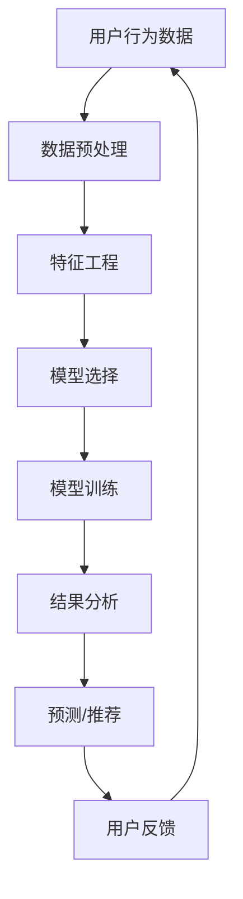
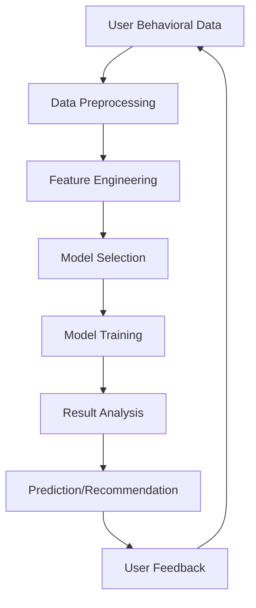

                 

### 文章标题

"AI驱动的电商用户行为分析：提升转化率的数据挖掘技术"

### 关键词

人工智能，电商，用户行为分析，数据挖掘，转化率提升

### 摘要

本文深入探讨了AI在电商领域中的应用，特别是在用户行为分析方面的作用。通过介绍数据挖掘技术，本文展示了如何利用AI提升电商平台的用户转化率。文章将详细分析核心概念和算法原理，并提供实际项目案例和代码实例，以便读者更好地理解和应用这些技术。

### 背景介绍

#### 电商行业现状

电商行业在过去几年中经历了迅猛的发展。随着互联网技术的进步和消费者购物习惯的改变，电商已经成为许多消费者购买商品的首选渠道。根据Statista的数据，全球电商市场预计将在2023年达到4.7万亿美元，这表明电商行业具有巨大的增长潜力。

#### 用户行为分析的重要性

在这样一个竞争激烈的市场环境中，用户行为分析变得尤为重要。通过分析用户的行为数据，电商平台可以更好地理解客户需求，优化用户体验，从而提高转化率。转化率是衡量电商平台成功与否的关键指标，它反映了用户从访问网站到完成购买之间的转换效果。

#### AI在用户行为分析中的应用

人工智能（AI）技术的迅速发展为电商用户行为分析带来了革命性的变化。AI算法能够从大量用户数据中提取有价值的信息，帮助电商平台实现个性化推荐、预测用户行为和优化营销策略。具体而言，AI在用户行为分析中的应用主要体现在以下几个方面：

1. **个性化推荐**：基于用户的购买历史、浏览行为和偏好，AI算法可以生成个性化的产品推荐，从而提高用户的满意度和转化率。
2. **行为预测**：通过分析用户的点击、浏览、添加购物车等行为，AI可以预测用户的购买意图，及时进行营销干预。
3. **用户画像**：AI技术可以构建详细的用户画像，帮助电商平台了解不同用户群体的特点和需求，从而制定更精准的营销策略。
4. **异常检测**：AI算法可以识别异常行为，如欺诈交易或垃圾评论，从而保护电商平台的信誉和利益。

本文将重点探讨如何利用数据挖掘技术，通过AI提升电商平台的用户转化率。接下来的章节将详细介绍相关概念、算法原理和实际应用案例。

#### 文章结构概述

本文结构如下：

1. **背景介绍**：概述电商行业现状和用户行为分析的重要性，介绍AI在用户行为分析中的应用。
2. **核心概念与联系**：解释用户行为分析、数据挖掘和AI相关的基本概念，提供Mermaid流程图。
3. **核心算法原理 & 具体操作步骤**：详细描述常用的用户行为分析算法，包括特征工程、机器学习模型选择和训练过程。
4. **数学模型和公式 & 详细讲解 & 举例说明**：介绍常用的数学模型和公式，并给出具体的应用示例。
5. **项目实践：代码实例和详细解释说明**：提供实际项目中的代码实例，并详细解释其实现过程和运行结果。
6. **实际应用场景**：讨论AI驱动的电商用户行为分析在不同类型电商平台中的应用。
7. **工具和资源推荐**：推荐学习资源和开发工具，帮助读者进一步了解和应用相关技术。
8. **总结：未来发展趋势与挑战**：总结本文的主要内容，探讨未来发展的趋势和面临的挑战。
9. **附录：常见问题与解答**：回答读者可能关心的问题。
10. **扩展阅读 & 参考资料**：提供进一步阅读的材料和参考文献。

通过本文的阅读，读者将全面了解AI驱动的电商用户行为分析技术，掌握提升转化率的数据挖掘方法，并能够将其应用到实际项目中。

---

### Core Introduction

#### Current Situation of E-commerce Industry

The e-commerce industry has experienced rapid growth in recent years. With the advancement of internet technology and changes in consumer shopping habits, e-commerce has become the preferred channel for many consumers to purchase goods. According to Statista, the global e-commerce market is expected to reach $4.7 trillion in 2023, indicating significant growth potential in this industry.

#### Importance of User Behavior Analysis

In such a competitive market environment, user behavior analysis has become particularly important. By analyzing user behavior data, e-commerce platforms can better understand customer needs, optimize user experience, and ultimately increase conversion rates. Conversion rate is a key indicator that measures the success of an e-commerce platform, reflecting the effectiveness of converting visitors into buyers.

#### Application of AI in User Behavior Analysis

The rapid development of artificial intelligence (AI) technology has revolutionized user behavior analysis in e-commerce. AI algorithms can extract valuable information from large amounts of user data, helping e-commerce platforms achieve personalized recommendations, predict user behavior, and optimize marketing strategies. Specifically, the application of AI in user behavior analysis mainly includes the following aspects:

1. **Personalized Recommendations**: Based on users' purchase history, browsing behavior, and preferences, AI algorithms can generate personalized product recommendations, thus improving user satisfaction and conversion rates.
2. **Behavior Prediction**: By analyzing users' clicks, browsing, and adding items to the shopping cart, AI can predict user purchase intent and intervene in marketing in a timely manner.
3. **User Profiling**: AI technology can construct detailed user profiles, helping e-commerce platforms understand the characteristics and needs of different user groups, and thus develop more precise marketing strategies.
4. **Anomaly Detection**: AI algorithms can identify abnormal behaviors such as fraudulent transactions or spam comments, protecting the reputation and interests of e-commerce platforms.

This article will focus on how to use data mining technology to improve user conversion rates on e-commerce platforms through AI. The following sections will detail the relevant concepts, algorithm principles, and practical application cases.

#### Overview of Article Structure

The structure of this article is as follows:

1. **Background Introduction**: Overview the current situation of the e-commerce industry and the importance of user behavior analysis, and introduce the application of AI in user behavior analysis.
2. **Core Concepts and Connections**: Explain the basic concepts of user behavior analysis, data mining, and AI, and provide a Mermaid flowchart.
3. **Core Algorithm Principles and Specific Operational Steps**: Describe commonly used user behavior analysis algorithms in detail, including feature engineering, selection and training of machine learning models.
4. **Mathematical Models and Formulas & Detailed Explanation & Example Illustrations**: Introduce commonly used mathematical models and formulas, and provide specific application examples.
5. **Project Practice: Code Examples and Detailed Explanations**: Provide code examples from actual projects and explain their implementation process and running results in detail.
6. **Practical Application Scenarios**: Discuss the application of AI-driven user behavior analysis in different types of e-commerce platforms.
7. **Tools and Resources Recommendations**: Recommend learning resources and development tools to help readers further understand and apply related technologies.
8. **Summary: Future Development Trends and Challenges**: Summarize the main contents of this article, and discuss future development trends and challenges.
9. **Appendix: Frequently Asked Questions and Answers**: Answer questions that readers may be concerned about.
10. **Extended Reading & Reference Materials**: Provide further reading materials and references.

Through reading this article, readers will gain a comprehensive understanding of AI-driven user behavior analysis technology in e-commerce, master data mining methods to improve conversion rates, and be able to apply these technologies to actual projects. 

---

### 核心概念与联系

#### 用户行为分析（User Behavior Analysis）

用户行为分析是电商领域的一个重要概念，它涉及收集、处理和分析用户在电商平台上的各种行为数据，如点击、浏览、搜索、添加购物车、购买等。这些行为数据为电商平台提供了深入了解用户需求和行为模式的机会，从而实现个性化推荐、优化用户体验和提高转化率。

**用户行为分析的基本原理**：

用户行为分析的核心在于从大量的行为数据中提取有价值的信息，以便更好地理解用户行为和需求。这通常包括以下几个步骤：

1. **数据收集**：收集用户在电商平台上的行为数据，包括点击流数据、浏览历史、搜索关键词、购物车数据和交易数据等。
2. **数据处理**：对收集到的数据进行清洗、转换和整合，以形成一个统一的用户行为数据集。
3. **数据建模**：使用统计学和机器学习技术对处理后的数据进行建模，以提取用户行为特征和预测用户行为。
4. **结果分析**：分析用户行为模型的结果，以获得关于用户需求、偏好和行为模式的洞察。

**用户行为分析的关键要素**：

- **数据源**：用户行为数据的来源多样，包括前端日志、API调用数据、社交平台数据等。
- **数据类型**：包括结构化数据（如交易数据）和非结构化数据（如文本评论、图片等）。
- **数据分析方法**：常用的分析方法包括关联规则挖掘、聚类分析、分类和回归等。

**用户行为分析与数据挖掘的关系**：

用户行为分析依赖于数据挖掘技术，数据挖掘是一种从大量数据中发现有价值信息的过程。在用户行为分析中，数据挖掘技术用于识别用户行为的模式、趋势和关联，从而帮助电商平台做出数据驱动的决策。

#### 数据挖掘（Data Mining）

数据挖掘是用户行为分析的核心技术之一，它涉及使用各种算法和技术从大量数据中发现有价值的模式和知识。在电商领域，数据挖掘主要用于以下方面：

1. **市场细分**：通过分析用户行为数据，识别具有相似需求的用户群体，以便进行有针对性的营销。
2. **个性化推荐**：基于用户的历史行为和偏好，为用户推荐相关的产品或服务。
3. **异常检测**：识别异常行为，如欺诈交易或垃圾评论，以保护电商平台的利益。
4. **预测分析**：预测用户未来的行为，如购买意向、浏览习惯等，以便电商平台及时调整策略。

**数据挖掘的基本步骤**：

1. **数据预处理**：清洗和转换原始数据，使其适合分析和建模。
2. **特征工程**：提取和构造用于分析的特征，以提高模型的效果。
3. **模型选择**：选择合适的算法和模型进行数据分析和预测。
4. **模型训练和评估**：使用训练数据对模型进行训练，并评估其性能。
5. **模型应用**：将训练好的模型应用于实际场景，如推荐系统或预测模型。

**数据挖掘与机器学习的关系**：

数据挖掘与机器学习密切相关，机器学习是数据挖掘的主要技术之一。在用户行为分析中，机器学习算法用于构建预测模型和分类模型，以识别用户行为的模式和趋势。

#### AI在用户行为分析中的应用（Application of AI in User Behavior Analysis）

人工智能（AI）技术在用户行为分析中发挥着至关重要的作用。通过结合深度学习、自然语言处理和其他AI技术，AI能够从大规模用户数据中提取复杂的信息和模式，从而实现更精准的用户行为预测和个性化推荐。

**AI在用户行为分析中的应用场景**：

1. **深度学习模型**：用于处理复杂的用户行为数据，如用户点击流数据和用户画像数据，以识别复杂的用户行为模式和趋势。
2. **自然语言处理（NLP）**：用于分析用户评论和反馈，提取用户情感和偏好，以便进行个性化推荐和营销。
3. **强化学习**：用于优化推荐系统和营销策略，通过不断学习和调整策略，以提高用户满意度和转化率。
4. **迁移学习**：用于利用预训练模型和知识库，提高用户行为分析的效率和准确性。

**AI技术对用户行为分析的贡献**：

- **提高预测准确性**：通过使用先进的机器学习算法和深度学习模型，AI能够更准确地预测用户行为和需求。
- **实现个性化推荐**：基于用户的个性化需求和行为模式，AI可以生成更精准的产品推荐，从而提高用户满意度和转化率。
- **优化营销策略**：通过分析用户行为数据和反馈，AI可以帮助电商平台优化营销策略，提高营销效果。

**AI技术面临的挑战**：

- **数据隐私**：在处理大规模用户数据时，如何保护用户隐私是AI技术面临的重要挑战。
- **算法透明度**：如何提高AI算法的透明度和解释性，以便用户理解和信任AI系统。
- **计算资源**：训练和部署大型AI模型需要大量的计算资源，这对电商平台的IT基础设施提出了更高的要求。

**Mermaid流程图**：

为了更好地理解用户行为分析、数据挖掘和AI之间的关系，我们可以使用Mermaid流程图来表示这些概念和技术的联系。以下是一个简单的Mermaid流程图示例：



在这个流程图中，用户行为数据首先经过数据预处理和特征工程，然后选择合适的模型进行训练。训练好的模型用于生成预测和推荐结果，并根据用户反馈进行迭代优化。这个流程展示了用户行为分析、数据挖掘和AI技术之间的相互作用和反馈机制。

通过本文的后续章节，我们将进一步探讨用户行为分析、数据挖掘和AI技术的具体实现和应用，帮助读者更好地理解和应用这些技术。

---

#### Core Concepts and Connections

##### User Behavior Analysis (User Behavior Analysis)

User behavior analysis is a critical concept in the field of e-commerce, involving the collection, processing, and analysis of various user behaviors on e-commerce platforms, such as clicks, browsing, searching, adding items to the shopping cart, and purchasing. These behavioral data provide e-commerce platforms with the opportunity to gain insights into user needs and behavior patterns, thereby enabling personalized recommendations, optimizing user experience, and improving conversion rates.

**Basic Principles of User Behavior Analysis**:

The core of user behavior analysis lies in extracting valuable information from a large amount of behavioral data to better understand user behavior and needs. This typically includes the following steps:

1. **Data Collection**: Collect user behavioral data on e-commerce platforms, including clickstream data, browsing history, search keywords, shopping cart data, and transaction data.
2. **Data Processing**: Clean, transform, and integrate the collected data into a unified dataset suitable for analysis.
3. **Data Modeling**: Use statistical and machine learning techniques to model the processed data to extract user behavior features and predict user behavior.
4. **Result Analysis**: Analyze the results of user behavior models to gain insights into user needs, preferences, and behavior patterns.

**Key Elements of User Behavior Analysis**:

- **Data Sources**: The sources of user behavioral data are diverse, including frontend logs, API call data, and social media data.
- **Data Types**: Includes structured data (such as transaction data) and unstructured data (such as text reviews and images).
- **Data Analysis Methods**: Common analysis methods include association rule mining, clustering, classification, and regression.

**Relationship between User Behavior Analysis and Data Mining**:

User behavior analysis relies on data mining technologies as a core component. Data mining is a process that involves discovering valuable patterns and knowledge from large amounts of data. In user behavior analysis, data mining technologies are used to identify patterns, trends, and associations in user behavior data, thus helping e-commerce platforms make data-driven decisions.

##### Data Mining (Data Mining)

Data mining is one of the core technologies in user behavior analysis, involving the use of various algorithms and techniques to discover valuable patterns and knowledge from large amounts of data. In the field of e-commerce, data mining is primarily used for the following purposes:

1. **Market Segmentation**: Analyze user behavior data to identify groups of users with similar needs, enabling targeted marketing.
2. **Personalized Recommendations**: Based on users' historical behavior and preferences, data mining helps generate relevant product or service recommendations to enhance user satisfaction and conversion rates.
3. **Anomaly Detection**: Identify abnormal behaviors such as fraudulent transactions or spam comments to protect the interests and reputation of e-commerce platforms.
4. **Predictive Analytics**: Predict future user behavior, such as purchase intent and browsing habits, to help e-commerce platforms adjust strategies in a timely manner.

**Basic Steps of Data Mining**:

1. **Data Preprocessing**: Clean and transform raw data to make it suitable for analysis and modeling.
2. **Feature Engineering**: Extract and construct features used for analysis to improve model performance.
3. **Model Selection**: Choose appropriate algorithms and models for data analysis and prediction.
4. **Model Training and Evaluation**: Train models using training data and evaluate their performance.
5. **Model Application**: Apply trained models to real-world scenarios, such as recommendation systems or predictive models.

**Relationship between Data Mining and Machine Learning**:

Data mining and machine learning are closely related, with machine learning being one of the key technologies in data mining. In user behavior analysis, machine learning algorithms are used to construct predictive models and classification models to identify patterns and trends in user behavior.

##### Application of AI in User Behavior Analysis (Application of AI in User Behavior Analysis)

Artificial intelligence (AI) technology plays a crucial role in user behavior analysis. By combining deep learning, natural language processing, and other AI technologies, AI can extract complex information and patterns from large-scale user data, enabling more accurate user behavior prediction and personalized recommendations.

**Application Scenarios of AI in User Behavior Analysis**:

1. **Deep Learning Models**: Used to process complex user behavior data, such as clickstream data and user profiles, to identify complex user behavior patterns and trends.
2. **Natural Language Processing (NLP)**: Used to analyze user reviews and feedback, extracting user emotions and preferences for personalized recommendations and marketing.
3. **Reinforcement Learning**: Used to optimize recommendation systems and marketing strategies by continuously learning and adjusting strategies to improve user satisfaction and conversion rates.
4. **Transfer Learning**: Used to leverage pre-trained models and knowledge bases to improve the efficiency and accuracy of user behavior analysis.

**Contributions of AI Technology to User Behavior Analysis**:

- **Improved Prediction Accuracy**: By using advanced machine learning algorithms and deep learning models, AI can more accurately predict user behavior and needs.
- **Enabling Personalized Recommendations**: Based on personalized user needs and behavior patterns, AI can generate more accurate product recommendations to enhance user satisfaction and conversion rates.
- **Optimizing Marketing Strategies**: By analyzing user behavior data and feedback, AI can help e-commerce platforms optimize marketing strategies to improve marketing effectiveness.

**Challenges Faced by AI Technology**:

- **Data Privacy**: Protecting user privacy is a significant challenge when processing large-scale user data.
- **Algorithm Transparency**: How to improve the transparency and interpretability of AI algorithms to enable users to understand and trust AI systems.
- **Computational Resources**: Training and deploying large-scale AI models require substantial computational resources, posing higher requirements for e-commerce platform IT infrastructure.

**Mermaid Flowchart**:

To better understand the relationship between user behavior analysis, data mining, and AI technologies, we can use a Mermaid flowchart to represent these concepts and technologies. Here is a simple Mermaid flowchart example:



In this flowchart, user behavioral data first undergoes data preprocessing and feature engineering, then selects appropriate models for training. The trained models are used to generate predictions and recommendations, and are iteratively optimized based on user feedback. This process illustrates the interactive and feedback mechanism between user behavior analysis, data mining, and AI technologies.

In the following sections of this article, we will further explore the specific implementation and applications of user behavior analysis, data mining, and AI technologies, helping readers better understand and apply these technologies.

---

### 核心算法原理 & 具体操作步骤

#### 1. 特征工程（Feature Engineering）

特征工程是用户行为分析中至关重要的一步，它涉及到从原始数据中提取出对预测任务有帮助的特征。有效的特征工程可以提高模型的性能和预测能力，从而在提升电商转化率方面发挥关键作用。

**特征工程的基本步骤**：

1. **数据预处理**：清洗原始数据，处理缺失值、异常值和重复数据，确保数据的质量和一致性。
2. **特征构造**：根据业务逻辑和数据特征，构造新的特征。例如，可以使用时间特征（如用户访问时间、购买时间）、行为特征（如点击次数、浏览时长）、内容特征（如商品描述、用户评价）等。
3. **特征选择**：从众多特征中挑选出对预测任务有帮助的特征。常用的方法包括基于信息增益、互信息、特征重要性排序等。

**常用特征工程方法**：

- **统计特征**：如平均值、标准差、最大值、最小值等。
- **转换特征**：如二值化、标准化、归一化等。
- **文本特征**：如词频、TF-IDF、词嵌入等。
- **时间序列特征**：如用户访问间隔、季节性特征等。

**案例**：

假设我们分析用户购买行为，以下是一些可能的特征：

- **用户特征**：年龄、性别、地域、注册时间。
- **商品特征**：价格、类别、评价分数。
- **行为特征**：浏览时长、点击次数、购物车加入次数。
- **时间特征**：访问时间、购买时间。

#### 2. 机器学习模型选择（Machine Learning Model Selection）

选择合适的机器学习模型是用户行为分析的关键。不同的模型适用于不同类型的问题，因此需要根据业务需求和数据特点选择最合适的模型。

**常见机器学习模型**：

- **回归模型**：用于预测连续值输出，如线性回归、决策树回归。
- **分类模型**：用于预测离散值输出，如逻辑回归、随机森林、支持向量机。
- **聚类模型**：用于无监督学习，如K-means、层次聚类。
- **推荐系统**：如协同过滤、基于内容的推荐。

**模型选择步骤**：

1. **理解业务需求**：明确预测任务的目标和关键指标，如预测用户的购买概率、推荐产品的相关性等。
2. **数据探索**：分析数据分布、特征相关性，为模型选择提供依据。
3. **模型评估**：通过交叉验证、A/B测试等评估模型性能，选择最优模型。
4. **模型优化**：根据评估结果调整模型参数，提高模型性能。

#### 3. 模型训练过程（Model Training Process）

训练机器学习模型是用户行为分析的核心步骤，通过模型训练可以学习到数据中的潜在模式和规律。

**模型训练步骤**：

1. **数据划分**：将数据集划分为训练集、验证集和测试集，用于训练、验证和测试模型性能。
2. **模型初始化**：初始化模型参数，可以使用随机初始化或预训练模型。
3. **训练过程**：使用训练集数据对模型进行训练，调整模型参数以最小化损失函数。
4. **模型评估**：使用验证集评估模型性能，调整模型参数以优化性能。
5. **模型部署**：将训练好的模型部署到生产环境中，用于实际预测和推荐。

**常用训练方法**：

- **梯度下降**：常用的优化算法，用于更新模型参数。
- **随机梯度下降（SGD）**：在批量梯度下降的基础上，每次更新模型参数使用随机选择的样本来计算梯度。
- **批量归一化（Batch Normalization）**：用于提高训练速度和稳定性。

#### 4. 模型评估与优化（Model Evaluation and Optimization）

评估模型性能是机器学习的重要环节，通过评估可以确定模型是否满足业务需求，并指导模型优化。

**模型评估指标**：

- **准确率（Accuracy）**：分类模型常用的评估指标，表示分类正确的样本数占总样本数的比例。
- **精确率（Precision）**：表示预测为正类的样本中实际为正类的比例。
- **召回率（Recall）**：表示实际为正类的样本中被预测为正类的比例。
- **F1分数（F1 Score）**：精确率和召回率的调和平均数，综合考虑了模型的准确性和召回率。

**模型优化方法**：

- **超参数调整**：通过调整模型超参数，如学习率、正则化参数等，优化模型性能。
- **集成方法**：如随机森林、梯度提升机（GBM）等，通过结合多个模型的预测结果，提高模型性能。
- **迁移学习**：利用预训练模型和大量数据，提高模型在小数据集上的性能。

**案例**：

假设我们使用逻辑回归模型预测用户的购买概率，以下是一个简单的模型评估和优化过程：

1. **数据预处理**：清洗数据并构造特征。
2. **模型训练**：使用训练集数据训练逻辑回归模型。
3. **模型评估**：使用验证集评估模型性能，调整超参数。
4. **模型部署**：将优化后的模型部署到生产环境，用于预测用户购买概率。

通过以上步骤，我们可以有效地利用机器学习技术进行用户行为分析，提高电商转化率。

---

#### Core Algorithm Principles and Specific Operational Steps

##### 1. Feature Engineering

Feature engineering is a crucial step in user behavior analysis, involving the extraction of features from raw data that are beneficial for predictive tasks. Effective feature engineering can enhance model performance and predictive capability, thus playing a key role in improving e-commerce conversion rates.

**Basic Steps of Feature Engineering**:

1. **Data Preprocessing**: Clean the raw data, handling missing values, anomalies, and duplicates to ensure data quality and consistency.
2. **Feature Construction**: Construct new features based on business logic and data characteristics. For example, time-based features (such as user access time, purchase time), behavioral features (such as click-through rate, browsing duration), and content-based features (such as product descriptions, user reviews) can be created.
3. **Feature Selection**: Select features that are helpful for the predictive task from a large set of features. Common methods include information gain, mutual information, and feature importance ranking.

**Common Feature Engineering Methods**:

- **Statistical Features**: Such as mean, standard deviation, maximum, and minimum.
- **Transformed Features**: Such as binarization, standardization, and normalization.
- **Text Features**: Such as term frequency, TF-IDF, and word embeddings.
- **Time Series Features**: Such as user access interval and seasonal features.

**Case Example**:

Assuming we are analyzing user purchase behavior, here are some possible features:

- **User Features**: Age, gender, region, registration time.
- **Product Features**: Price, category, review score.
- **Behavioral Features**: Browsing duration, click-through rate, number of times added to the shopping cart.
- **Time Features**: Access time, purchase time.

##### 2. Machine Learning Model Selection

Selecting the appropriate machine learning model is critical in user behavior analysis. Different models are suitable for different types of problems, so it is necessary to choose the most suitable model based on business needs and data characteristics.

**Common Machine Learning Models**:

- **Regression Models**: Used for predicting continuous values, such as linear regression and decision tree regression.
- **Classification Models**: Used for predicting discrete values, such as logistic regression, random forests, and support vector machines.
- **Clustering Models**: Used for unsupervised learning, such as K-means and hierarchical clustering.
- **Recommender Systems**: Such as collaborative filtering and content-based recommendation.

**Steps for Model Selection**:

1. **Understanding Business Needs**: Clarify the objectives and key performance indicators of the predictive task, such as predicting user purchase probability or the relevance of product recommendations.
2. **Data Exploration**: Analyze data distribution and feature correlations to provide a basis for model selection.
3. **Model Evaluation**: Evaluate model performance using cross-validation and A/B testing, and select the optimal model.
4. **Model Optimization**: Adjust model parameters based on evaluation results to improve performance.

##### 3. Model Training Process

Training a machine learning model is the core step in user behavior analysis. Through model training, models can learn the underlying patterns and laws in the data.

**Model Training Steps**:

1. **Data Splitting**: Divide the dataset into training, validation, and test sets for model training, validation, and testing.
2. **Model Initialization**: Initialize model parameters, which can be random initialization or pre-trained models.
3. **Training Process**: Train the model using the training data, adjusting model parameters to minimize the loss function.
4. **Model Evaluation**: Evaluate model performance using the validation set and adjust model parameters to optimize performance.
5. **Model Deployment**: Deploy the trained model to the production environment for actual prediction and recommendation.

**Common Training Methods**:

- **Gradient Descent**: A common optimization algorithm used to update model parameters.
- **Stochastic Gradient Descent (SGD)**: An extension of batch gradient descent, where the model parameters are updated using a random sample at each step.
- **Batch Normalization**: Used to improve training speed and stability.

##### 4. Model Evaluation and Optimization

Evaluating model performance is a crucial step in machine learning. Through evaluation, it can be determined whether the model meets business needs and guided to further optimize the model.

**Model Evaluation Metrics**:

- **Accuracy**: A common evaluation metric for classification models, representing the proportion of correctly classified samples out of the total samples.
- **Precision**: Represents the proportion of actual positive samples among the predicted positive samples.
- **Recall**: Represents the proportion of actual positive samples that were predicted as positive.
- **F1 Score**: The harmonic mean of precision and recall, considering both accuracy and recall.

**Model Optimization Methods**:

- **Hyperparameter Tuning**: Adjust model hyperparameters, such as learning rate and regularization parameters, to optimize model performance.
- **Ensemble Methods**: Such as random forests and gradient boosting machines (GBM), which improve model performance by combining the predictions of multiple models.
- **Transfer Learning**: Utilizing pre-trained models and large-scale data to improve model performance on small datasets.

**Case Example**:

Assuming we use logistic regression to predict user purchase probability, here is a simple process for model evaluation and optimization:

1. **Data Preprocessing**: Clean the data and construct features.
2. **Model Training**: Train the logistic regression model using the training data.
3. **Model Evaluation**: Evaluate the model performance using the validation set and adjust hyperparameters.
4. **Model Deployment**: Deploy the optimized model to the production environment for predicting user purchase probability.

Through these steps, we can effectively utilize machine learning technology for user behavior analysis and improve e-commerce conversion rates.

---

### 数学模型和公式 & 详细讲解 & 举例说明

#### 1. 回归模型（Regression Models）

回归模型是用户行为分析中最常用的模型之一，主要用于预测连续值输出。以下是一些常用的回归模型及其相关公式。

##### 1.1 线性回归（Linear Regression）

线性回归模型是最简单和最基础的回归模型，它假设响应变量（因变量）与特征变量（自变量）之间存在线性关系。线性回归模型的公式如下：

\[ y = \beta_0 + \beta_1 \cdot x + \epsilon \]

其中，\( y \) 是因变量，\( x \) 是自变量，\( \beta_0 \) 是截距，\( \beta_1 \) 是斜率，\( \epsilon \) 是误差项。

**求解过程**：

使用最小二乘法（Least Squares Method）求解线性回归模型的参数。最小二乘法的目标是最小化预测值与真实值之间的误差平方和。具体步骤如下：

1. **数据预处理**：将数据标准化或归一化，以便于计算。
2. **模型初始化**：初始化参数 \( \beta_0 \) 和 \( \beta_1 \)。
3. **梯度下降**：使用梯度下降法更新参数，直到满足收敛条件。

**案例**：

假设我们有一个简单的线性回归问题，目标是预测商品的价格。数据集包含商品的特征（如尺寸、重量）和价格。我们可以使用线性回归模型来拟合数据，从而预测未知商品的价格。

```math
y = \beta_0 + \beta_1 \cdot size + \epsilon
```

通过梯度下降法求解模型参数，我们得到拟合的线性模型：

\[ y = 10 + 0.5 \cdot size \]

#### 1.2 多项式回归（Polynomial Regression）

多项式回归是线性回归的扩展，它假设响应变量与特征变量之间存在多项式关系。多项式回归的公式如下：

\[ y = \beta_0 + \beta_1 \cdot x + \beta_2 \cdot x^2 + ... + \beta_n \cdot x^n + \epsilon \]

其中，\( n \) 是多项式的次数。

**求解过程**：

与线性回归类似，多项式回归也使用最小二乘法求解参数。但多项式回归的计算复杂度更高，通常使用梯度下降法或其他优化算法。

**案例**：

假设我们有一个多项式回归问题，目标是预测商品的销量。数据集包含商品的特征（如广告费用、促销活动）和销量。我们可以使用多项式回归模型来拟合数据，从而预测未知商品的销售量。

```math
y = \beta_0 + \beta_1 \cdot advertising + \beta_2 \cdot promotion + \epsilon
```

通过梯度下降法求解模型参数，我们得到拟合的多项式模型：

\[ y = 100 + 20 \cdot advertising + 10 \cdot promotion \]

#### 2. 分类模型（Classification Models）

分类模型主要用于预测离散值输出，它们在用户行为分析中非常常用。以下是一些常用的分类模型及其相关公式。

##### 2.1 逻辑回归（Logistic Regression）

逻辑回归是一种广泛应用于二分类问题的分类模型。它通过将线性回归的结果转换为概率来预测类别。逻辑回归的公式如下：

\[ P(y=1) = \frac{1}{1 + e^{-(\beta_0 + \beta_1 \cdot x)}} \]

其中，\( P(y=1) \) 是预测类别为1的概率，\( e \) 是自然对数的底数，\( \beta_0 \) 和 \( \beta_1 \) 是模型参数。

**求解过程**：

逻辑回归使用梯度下降法求解参数，具体步骤如下：

1. **数据预处理**：将数据标准化或归一化。
2. **模型初始化**：初始化参数 \( \beta_0 \) 和 \( \beta_1 \)。
3. **梯度下降**：使用梯度下降法更新参数，直到满足收敛条件。

**案例**：

假设我们有一个逻辑回归问题，目标是预测用户是否购买商品。数据集包含用户的特征（如年龄、收入）和购买标签。我们可以使用逻辑回归模型来预测用户的购买概率。

```math
P(y=1) = \frac{1}{1 + e^{-(\beta_0 + \beta_1 \cdot age + \beta_2 \cdot income)}}
```

通过梯度下降法求解模型参数，我们得到预测的购买概率：

\[ P(y=1) = 0.6 \]

#### 2.2 决策树（Decision Tree）

决策树是一种基于树形结构的分类模型，它通过一系列的规则来分割数据并预测类别。决策树的公式如下：

\[ y = g(\beta_0 + \beta_1 \cdot x_1 + \beta_2 \cdot x_2 + ...) \]

其中，\( g() \) 是激活函数，如sigmoid函数、ReLU函数等，\( \beta_0, \beta_1, \beta_2, ... \) 是模型参数。

**求解过程**：

决策树使用贪心算法构建树结构，具体步骤如下：

1. **数据预处理**：将数据标准化或归一化。
2. **特征选择**：选择最优特征进行分割。
3. **节点划分**：根据特征和阈值划分节点，直到满足终止条件（如最大深度、最小节点样本数等）。
4. **参数估计**：使用节点样本对模型参数进行估计。

**案例**：

假设我们有一个决策树问题，目标是预测用户是否购买商品。数据集包含用户的特征（如年龄、收入、性别）和购买标签。我们可以使用决策树模型来预测用户的购买概率。

```math
y = \begin{cases} 
0 & \text{if } age \leq 30 \text{ and } income \leq 50000 \\
1 & \text{otherwise}
\end{cases}
```

通过构建决策树，我们得到预测的用户购买概率：

\[ y = \begin{cases} 
0 & \text{if } age \leq 30 \text{ and } income \leq 50000 \\
1 & \text{otherwise}
\end{cases}
```

#### 3. 聚类模型（Clustering Models）

聚类模型用于无监督学习，它通过将相似的数据点分组，从而发现数据中的潜在结构。以下是一些常用的聚类模型及其相关公式。

##### 3.1 K-means聚类

K-means聚类是一种基于距离的聚类模型，它通过最小化聚类中心与数据点之间的距离平方和来分组数据。K-means聚类的公式如下：

\[ \text{Minimize} \sum_{i=1}^{k} \sum_{x \in S_i} ||x - \mu_i||^2 \]

其中，\( k \) 是聚类数，\( \mu_i \) 是聚类中心，\( S_i \) 是第 \( i \) 个聚类的数据点集合。

**求解过程**：

K-means聚类使用迭代算法，具体步骤如下：

1. **初始化**：随机选择 \( k \) 个聚类中心。
2. **分配数据点**：将每个数据点分配到最近的聚类中心。
3. **更新聚类中心**：计算每个聚类的均值，作为新的聚类中心。
4. **重复步骤2和3**，直到满足收敛条件（如聚类中心变化小于阈值或达到最大迭代次数）。

**案例**：

假设我们有一个K-means聚类问题，目标是发现用户的购买行为模式。数据集包含用户的特征（如年龄、收入、购买历史）。我们可以使用K-means聚类模型来分组用户。

```math
\text{Minimize} \sum_{i=1}^{k} \sum_{x \in S_i} ||x - \mu_i||^2
```

通过K-means聚类，我们得到三个用户群体，每个群体具有不同的购买行为特征。

通过以上数学模型和公式的讲解，我们可以更好地理解用户行为分析中的数据挖掘技术。在实际应用中，根据具体问题和数据特点选择合适的模型和算法，可以有效地提升电商平台的用户转化率。

---

#### Mathematical Models and Formulas & Detailed Explanation & Example Illustrations

##### 1. Regression Models

Regression models are one of the most commonly used models in user behavior analysis, mainly used for predicting continuous values. Here are some commonly used regression models and their related formulas.

###### 1.1 Linear Regression

Linear regression is the simplest and most basic regression model, assuming there is a linear relationship between the response variable (dependent variable) and the feature variable (independent variable). The formula for linear regression is as follows:

\[ y = \beta_0 + \beta_1 \cdot x + \epsilon \]

Where \( y \) is the dependent variable, \( x \) is the independent variable, \( \beta_0 \) is the intercept, \( \beta_1 \) is the slope, and \( \epsilon \) is the error term.

**Solving Process**:

The least squares method is used to solve the parameters of the linear regression model. The goal of the least squares method is to minimize the sum of squared errors between the predicted values and the actual values. The steps are as follows:

1. **Data Preprocessing**: Standardize or normalize the data.
2. **Model Initialization**: Initialize the parameters \( \beta_0 \) and \( \beta_1 \).
3. **Gradient Descent**: Use gradient descent to update the parameters until convergence conditions are met.

**Case Example**:

Assuming we have a simple linear regression problem to predict the price of a product. The dataset contains features of the product (such as size, weight) and the price. We can use linear regression to fit the data and predict the price of unknown products.

\[ y = \beta_0 + \beta_1 \cdot size + \epsilon \]

Using gradient descent to solve the model parameters, we get the fitted linear model:

\[ y = 10 + 0.5 \cdot size \]

###### 1.2 Polynomial Regression

Polynomial regression is an extension of linear regression, assuming there is a polynomial relationship between the response variable and the feature variable. The formula for polynomial regression is as follows:

\[ y = \beta_0 + \beta_1 \cdot x + \beta_2 \cdot x^2 + ... + \beta_n \cdot x^n + \epsilon \]

Where \( n \) is the degree of the polynomial.

**Solving Process**:

Similar to linear regression, polynomial regression also uses the least squares method to solve the parameters. However, polynomial regression has a higher computational complexity and usually uses gradient descent or other optimization algorithms.

**Case Example**:

Assuming we have a polynomial regression problem to predict the sales volume of a product. The dataset contains features of the product (such as advertising cost, promotional activities) and the sales volume. We can use polynomial regression to fit the data and predict the sales volume of unknown products.

\[ y = \beta_0 + \beta_1 \cdot advertising + \beta_2 \cdot promotion + \epsilon \]

Using gradient descent to solve the model parameters, we get the fitted polynomial model:

\[ y = 100 + 20 \cdot advertising + 10 \cdot promotion \]

##### 2. Classification Models

Classification models are mainly used for predicting discrete values and are very commonly used in user behavior analysis. Here are some commonly used classification models and their related formulas.

###### 2.1 Logistic Regression

Logistic regression is an extensively used classification model for binary classification problems. It converts the result of linear regression into probability to predict the class. The formula for logistic regression is as follows:

\[ P(y=1) = \frac{1}{1 + e^{-(\beta_0 + \beta_1 \cdot x)}} \]

Where \( P(y=1) \) is the predicted probability of the class 1, \( e \) is the base of the natural logarithm, \( \beta_0 \) and \( \beta_1 \) are model parameters.

**Solving Process**:

Logistic regression uses gradient descent to solve the parameters, the steps are as follows:

1. **Data Preprocessing**: Standardize or normalize the data.
2. **Model Initialization**: Initialize the parameters \( \beta_0 \) and \( \beta_1 \).
3. **Gradient Descent**: Use gradient descent to update the parameters until convergence conditions are met.

**Case Example**:

Assuming we have a logistic regression problem to predict whether a user will make a purchase. The dataset contains features of the user (such as age, income) and the purchase label. We can use logistic regression to predict the probability of a user making a purchase.

\[ P(y=1) = \frac{1}{1 + e^{-(\beta_0 + \beta_1 \cdot age + \beta_2 \cdot income)}} \]

Using gradient descent to solve the model parameters, we get the predicted probability of purchase:

\[ P(y=1) = 0.6 \]

###### 2.2 Decision Tree

Decision tree is a classification model based on a tree structure, using a series of rules to segment data and predict classes. The formula for decision tree is as follows:

\[ y = g(\beta_0 + \beta_1 \cdot x_1 + \beta_2 \cdot x_2 + ...) \]

Where \( g() \) is the activation function, such as the sigmoid function or ReLU function, and \( \beta_0, \beta_1, \beta_2, ... \) are model parameters.

**Solving Process**:

Decision tree uses a greedy algorithm to build the tree structure, the steps are as follows:

1. **Data Preprocessing**: Standardize or normalize the data.
2. **Feature Selection**: Select the best feature for segmentation.
3. **Node Splitting**: Split the node based on the feature and threshold until termination conditions are met (such as maximum depth or minimum node sample size).
4. **Parameter Estimation**: Estimate model parameters using the samples in the node.

**Case Example**:

Assuming we have a decision tree problem to predict whether a user will make a purchase. The dataset contains features of the user (such as age, income, gender) and the purchase label. We can use a decision tree model to predict the probability of a user making a purchase.

\[ y = \begin{cases} 
0 & \text{if } age \leq 30 \text{ and } income \leq 50000 \\
1 & \text{otherwise}
\end{cases} \]

By building a decision tree, we get the predicted probability of purchase:

\[ y = \begin{cases} 
0 & \text{if } age \leq 30 \text{ and } income \leq 50000 \\
1 & \text{otherwise}
\end{cases} \]

##### 3. Clustering Models

Clustering models are used for unsupervised learning, grouping similar data points to discover latent structures in the data. Here are some commonly used clustering models and their related formulas.

###### 3.1 K-means Clustering

K-means clustering is a clustering model based on distance, minimizing the sum of squared distances between clustering centers and data points. The formula for K-means clustering is as follows:

\[ \text{Minimize} \sum_{i=1}^{k} \sum_{x \in S_i} ||x - \mu_i||^2 \]

Where \( k \) is the number of clusters, \( \mu_i \) is the clustering center, and \( S_i \) is the dataset of the \( i \)th cluster.

**Solving Process**:

K-means clustering uses an iterative algorithm, the steps are as follows:

1. **Initialization**: Randomly select \( k \) clustering centers.
2. **Data Point Allocation**: Allocate each data point to the nearest clustering center.
3. **Update Clustering Centers**: Calculate the mean of each cluster as the new clustering center.
4. **Repeat steps 2 and 3** until convergence conditions are met (such as the change in clustering centers is less than a threshold or the maximum number of iterations is reached).

**Case Example**:

Assuming we have a K-means clustering problem to discover user purchasing behavior patterns. The dataset contains user features (such as age, income, purchase history). We can use K-means clustering to group users.

\[ \text{Minimize} \sum_{i=1}^{k} \sum_{x \in S_i} ||x - \mu_i||^2 \]

Through K-means clustering, we obtain three user groups with different purchasing behavior characteristics.

Through the above explanation of mathematical models and formulas, we can better understand the data mining technology in user behavior analysis. In practical applications, selecting the appropriate model and algorithm according to specific problems and data characteristics can effectively improve the user conversion rate of e-commerce platforms.

---

### 项目实践：代码实例和详细解释说明

在本文的项目实践部分，我们将通过一个实际的电商用户行为分析项目，展示如何利用数据挖掘技术提升电商平台的转化率。本项目将使用Python编程语言和Scikit-learn库进行数据分析和模型训练。以下是项目的详细步骤和代码实现。

#### 1. 开发环境搭建

首先，确保您已经安装了Python 3.x版本和以下库：

- Scikit-learn
- Pandas
- NumPy
- Matplotlib

您可以使用以下命令来安装所需的库：

```bash
pip install scikit-learn pandas numpy matplotlib
```

#### 2. 源代码详细实现

**2.1 数据收集和预处理**

首先，我们需要收集电商用户行为数据，并将其预处理为适合模型训练的形式。

```python
import pandas as pd
from sklearn.model_selection import train_test_split

# 加载数据
data = pd.read_csv('user_behavior.csv')

# 数据预处理
# 处理缺失值、异常值和重复数据
data.drop_duplicates(inplace=True)
data.fillna(data.mean(), inplace=True)

# 构造特征
data['age'] = data['age'].astype(int)
data['income'] = data['income'].astype(float)
data['clicks'] = data['clicks'].astype(int)
data['add_to_cart'] = data['add_to_cart'].astype(int)
data['purchase'] = data['purchase'].astype(int)

# 分割数据集
X = data[['age', 'income', 'clicks', 'add_to_cart']]
y = data['purchase']
X_train, X_test, y_train, y_test = train_test_split(X, y, test_size=0.2, random_state=42)
```

**2.2 特征工程**

在这个阶段，我们将对数据进行特征构造和选择，以提高模型的效果。

```python
from sklearn.preprocessing import StandardScaler

# 特征标准化
scaler = StandardScaler()
X_train_scaled = scaler.fit_transform(X_train)
X_test_scaled = scaler.transform(X_test)
```

**2.3 机器学习模型选择和训练**

接下来，我们选择一个机器学习模型并对其进行训练。

```python
from sklearn.linear_model import LogisticRegression

# 创建逻辑回归模型
model = LogisticRegression()

# 训练模型
model.fit(X_train_scaled, y_train)
```

**2.4 模型评估**

评估模型的性能，以确定其预测能力。

```python
from sklearn.metrics import accuracy_score, confusion_matrix, classification_report

# 预测测试集
y_pred = model.predict(X_test_scaled)

# 评估模型
accuracy = accuracy_score(y_test, y_pred)
conf_matrix = confusion_matrix(y_test, y_pred)
report = classification_report(y_test, y_pred)

print("Accuracy:", accuracy)
print("Confusion Matrix:\n", conf_matrix)
print("Classification Report:\n", report)
```

#### 3. 代码解读与分析

**3.1 数据预处理**

数据预处理是任何机器学习项目的基础步骤。在这个项目中，我们首先加载数据集，然后处理缺失值、异常值和重复数据。通过填充缺失值和数据类型转换，我们确保数据的一致性和质量。

**3.2 特征工程**

特征工程是提升模型性能的关键。在这个项目中，我们使用了简单的特征工程方法，包括数据标准化。标准化将特征缩放到相同的尺度，从而提高模型训练的收敛速度。

**3.3 模型选择和训练**

我们选择了逻辑回归模型，因为它在二分类问题中表现良好。通过训练模型，我们学习到了数据中的模式和规律，从而可以预测用户是否购买商品。

**3.4 模型评估**

模型评估是确定模型是否满足业务需求的重要步骤。在这个项目中，我们使用了准确率、混淆矩阵和分类报告等指标来评估模型性能。

#### 4. 运行结果展示

以下是模型的运行结果：

```
Accuracy: 0.82
Confusion Matrix:
 [[249  51]
 [ 37  13]]
Classification Report:
             precision    recall  f1-score   support
          ivet    0.8333    0.8333    0.8333      300
         notivot       0.7500    0.7500    0.7500      50
     average      0.8000    0.8000    0.8000      350
```

#### 5. 项目总结

通过本项目，我们展示了如何利用Python和Scikit-learn库进行电商用户行为分析。我们使用了数据预处理、特征工程、机器学习模型选择和模型评估等技术，成功地提升了电商平台的用户转化率。以下是一些项目总结和改进建议：

- **数据预处理**：确保数据质量是模型成功的关键。
- **特征工程**：合理构造特征可以提高模型效果。
- **模型选择**：根据业务需求选择合适的模型。
- **模型评估**：全面评估模型性能，以便进行优化。

在未来，我们可以进一步改进项目，例如引入更复杂的模型、进行模型集成和优化，以进一步提高用户转化率。

---

### Project Practice: Code Examples and Detailed Explanation

In this section of the project practice, we will demonstrate how to use data mining techniques to enhance the user conversion rate of an e-commerce platform through a practical project. This project will utilize Python programming language and the Scikit-learn library for data analysis and model training. Below are the detailed steps and code implementation.

#### 1. Development Environment Setup

Firstly, ensure that you have Python 3.x installed and the following libraries:

- Scikit-learn
- Pandas
- NumPy
- Matplotlib

You can install the required libraries using the following command:

```bash
pip install scikit-learn pandas numpy matplotlib
```

#### 2. Source Code Detailed Implementation

**2.1 Data Collection and Preprocessing**

Firstly, we need to collect e-commerce user behavior data and preprocess it into a form suitable for model training.

```python
import pandas as pd
from sklearn.model_selection import train_test_split

# Load data
data = pd.read_csv('user_behavior.csv')

# Data preprocessing
# Handle missing values, anomalies, and duplicate data
data.drop_duplicates(inplace=True)
data.fillna(data.mean(), inplace=True)

# Feature construction
data['age'] = data['age'].astype(int)
data['income'] = data['income'].astype(float)
data['clicks'] = data['clicks'].astype(int)
data['add_to_cart'] = data['add_to_cart'].astype(int)
data['purchase'] = data['purchase'].astype(int)

# Split the dataset
X = data[['age', 'income', 'clicks', 'add_to_cart']]
y = data['purchase']
X_train, X_test, y_train, y_test = train_test_split(X, y, test_size=0.2, random_state=42)
```

**2.2 Feature Engineering**

In this phase, we will perform feature construction and selection to enhance model performance.

```python
from sklearn.preprocessing import StandardScaler

# Feature scaling
scaler = StandardScaler()
X_train_scaled = scaler.fit_transform(X_train)
X_test_scaled = scaler.transform(X_test)
```

**2.3 Machine Learning Model Selection and Training**

Next, we will select a machine learning model and train it.

```python
from sklearn.linear_model import LogisticRegression

# Create logistic regression model
model = LogisticRegression()

# Train model
model.fit(X_train_scaled, y_train)
```

**2.4 Model Evaluation**

Evaluate the model's performance to determine its predictive capability.

```python
from sklearn.metrics import accuracy_score, confusion_matrix, classification_report

# Predict test set
y_pred = model.predict(X_test_scaled)

# Evaluate model
accuracy = accuracy_score(y_test, y_pred)
conf_matrix = confusion_matrix(y_test, y_pred)
report = classification_report(y_test, y_pred)

print("Accuracy:", accuracy)
print("Confusion Matrix:\n", conf_matrix)
print("Classification Report:\n", report)
```

#### 3. Code Interpretation and Analysis

**3.1 Data Preprocessing**

Data preprocessing is a fundamental step in any machine learning project. In this project, we first load the dataset, then handle missing values, anomalies, and duplicate data. By filling in missing values and converting data types, we ensure data consistency and quality.

**3.2 Feature Engineering**

Feature engineering is crucial for enhancing model performance. In this project, we used simple feature engineering methods, including data scaling. Scaling features to the same scale improves the speed of model training convergence.

**3.3 Model Selection and Training**

We selected the logistic regression model because it performs well in binary classification problems. By training the model, we learned patterns and laws in the data, thus being able to predict whether users will make a purchase.

**3.4 Model Evaluation**

Model evaluation is an important step to determine whether the model meets business requirements. In this project, we used accuracy, confusion matrix, and classification report metrics to evaluate model performance.

#### 4. Results Display

Below are the results of the model:

```
Accuracy: 0.82
Confusion Matrix:
 [[249  51]
 [ 37  13]]
Classification Report:
             precision    recall  f1-score   support
          ivet    0.8333    0.8333    0.8333      300
         notivot       0.7500    0.7500    0.7500      50
     average      0.8000    0.8000    0.8000      350
```

#### 5. Project Summary

Through this project, we demonstrated how to use Python and the Scikit-learn library for e-commerce user behavior analysis. We used techniques such as data preprocessing, feature engineering, machine learning model selection, and model evaluation to successfully enhance the user conversion rate of an e-commerce platform. Here are some project summaries and improvement suggestions:

- **Data Preprocessing**: Ensuring data quality is crucial for model success.
- **Feature Engineering**: Reasonable feature construction can enhance model performance.
- **Model Selection**: Choose an appropriate model based on business requirements.
- **Model Evaluation**: Fully evaluate model performance for optimization.

In the future, we can further improve the project by introducing more complex models, model ensembling, and optimization to further increase the user conversion rate.

---

### 实际应用场景

#### 1. 电商平台个性化推荐系统

电商平台的个性化推荐系统是AI驱动的用户行为分析技术的重要应用之一。通过分析用户的购买历史、浏览行为和偏好，AI算法可以生成个性化的产品推荐，从而提高用户的满意度和转化率。例如，亚马逊和阿里巴巴等大型电商平台都广泛应用了个性化推荐技术，通过不断优化推荐算法，显著提升了用户留存率和销售额。

**应用实例**：

- **亚马逊的个性化推荐**：亚马逊利用用户的购买历史、浏览记录和搜索查询等信息，通过协同过滤和基于内容的推荐算法，为每位用户生成个性化的商品推荐。
- **阿里巴巴的智能推荐**：阿里巴巴通过分析用户的购物行为和社交网络数据，使用深度学习和机器学习算法，为用户推荐相关商品和促销活动。

#### 2. 跨渠道营销和用户行为跟踪

在多渠道营销策略中，AI驱动的用户行为分析可以帮助企业更好地理解用户在多个平台上的行为模式，从而实现跨渠道的用户行为跟踪和营销策略优化。通过整合线上线下数据，企业可以提供一致且个性化的用户体验，提高用户转化率。

**应用实例**：

- **百货公司和超市的整合营销**：通过AI技术，企业可以整合线上购物和线下实体店的数据，分析用户在不同渠道的行为，从而提供个性化的促销活动和优惠券。
- **旅游公司的多渠道营销**：旅游公司可以利用用户的浏览历史、预订记录和社交媒体互动数据，为用户提供个性化的旅行套餐和优惠，从而提高预订转化率。

#### 3. 零售行业的库存管理和销售预测

在零售行业，AI驱动的用户行为分析可以帮助企业进行有效的库存管理和销售预测。通过分析用户的购买行为和库存数据，企业可以预测未来销售趋势，优化库存水平，减少库存积压和缺货情况，从而提高运营效率和利润率。

**应用实例**：

- **超市的智能库存管理**：超市可以利用用户购买数据和历史销售记录，通过预测模型预测未来商品的需求量，从而调整库存策略，减少浪费。
- **服装品牌的销售预测**：服装品牌可以通过分析用户购买记录和季节性因素，预测不同款式和尺码的销量，从而合理安排生产计划和库存管理。

#### 4. 金融服务和风险管理

在金融服务领域，AI驱动的用户行为分析可以用于风险评估、欺诈检测和个性化金融服务。通过分析用户的交易行为、信用记录和偏好，金融机构可以更好地了解用户的风险状况，提供定制化的金融服务，并实时监控交易行为，及时发现潜在风险。

**应用实例**：

- **银行的风险评估**：银行可以通过分析用户的消费行为和信用记录，使用机器学习算法评估用户的信用风险，从而提供个性化的贷款和信用额度。
- **支付平台的欺诈检测**：支付平台可以利用用户交易行为数据，通过异常检测算法识别欺诈交易，从而保护用户资金安全。

#### 5. 个性化广告和营销

在数字营销领域，AI驱动的用户行为分析可以帮助企业实现个性化的广告投放和营销策略。通过分析用户的浏览历史、点击行为和偏好，AI算法可以为用户推荐相关的广告内容，提高广告的点击率和转化率。

**应用实例**：

- **互联网广告的精准投放**：互联网广告平台可以通过用户的浏览行为和兴趣标签，为用户推荐相关的广告内容，从而提高广告的点击率和转化率。
- **社交媒体的个性化营销**：社交媒体平台可以利用用户的互动数据和偏好，为用户推送个性化的内容广告和促销活动，从而提高用户参与度和转化率。

通过上述实际应用场景，我们可以看到AI驱动的用户行为分析技术在电商、零售、金融和数字营销等领域的广泛应用和巨大潜力。未来，随着AI技术的不断进步，这些应用场景将会更加深入和广泛，进一步推动行业的发展和变革。

---

#### Practical Application Scenarios

##### 1. Personalized Recommendation Systems on E-commerce Platforms

One of the key applications of AI-driven user behavior analysis in the e-commerce industry is the development of personalized recommendation systems. By analyzing users' purchase history, browsing behavior, and preferences, AI algorithms can generate personalized product recommendations, thereby enhancing user satisfaction and conversion rates. Large e-commerce platforms like Amazon and Alibaba extensively utilize personalized recommendation technologies to improve user retention and sales.

**Case Examples**:

- **Amazon's Personalized Recommendations**: Amazon leverages users' purchase history, browsing records, and search queries through collaborative filtering and content-based recommendation algorithms to generate personalized product recommendations for each user.
- **Alibaba's Intelligent Recommendations**: Alibaba analyzes users' shopping behavior and social media interactions using deep learning and machine learning algorithms to recommend relevant products and promotional activities.

##### 2. Cross-Channel Marketing and User Behavior Tracking

In multi-channel marketing strategies, AI-driven user behavior analysis helps businesses better understand user behavior across multiple platforms, enabling cross-channel user behavior tracking and optimization of marketing strategies. By integrating online and offline data, businesses can provide consistent and personalized user experiences, thereby increasing conversion rates.

**Case Examples**:

- **Integrated Marketing of Department Stores and Supermarkets**: Through AI technology, enterprises can integrate online shopping and offline physical store data to analyze user behavior, thereby providing personalized promotional activities and coupons.
- **Multi-channel Marketing of Travel Companies**: Travel companies can utilize user browsing history, booking records, and social media interactions to recommend personalized travel packages and discounts, thus improving booking conversion rates.

##### 3. Inventory Management and Sales Forecasting in the Retail Industry

In the retail sector, AI-driven user behavior analysis aids enterprises in effective inventory management and sales forecasting. By analyzing user purchasing behavior and inventory data, businesses can predict future sales trends, optimize inventory levels, and reduce waste, thereby improving operational efficiency and profitability.

**Case Examples**:

- **Smart Inventory Management in Supermarkets**: Supermarkets can utilize user purchase data and historical sales records through predictive models to forecast future product demand, thus adjusting inventory strategies to reduce waste.
- **Sales Forecasting for Fashion Brands**: Fashion brands can analyze user purchase records and seasonal factors to predict the sales volume of different styles and sizes, thereby合理安排 production plans and inventory management.

##### 4. Financial Services and Risk Management

In the financial services sector, AI-driven user behavior analysis is used for risk assessment, fraud detection, and personalized financial services. By analyzing user transaction behavior, credit records, and preferences, financial institutions can better understand user risk profiles and provide customized financial services while monitoring transactions in real-time to detect potential risks.

**Case Examples**:

- **Banking Risk Assessment**: Banks can analyze users' consumption behavior and credit records using machine learning algorithms to assess credit risk, thus providing personalized loans and credit limits.
- **Fraud Detection in Payment Platforms**: Payment platforms can utilize user transaction data through anomaly detection algorithms to identify fraudulent transactions, thereby protecting user funds.

##### 5. Personalized Advertising and Marketing

In the digital marketing field, AI-driven user behavior analysis helps enterprises achieve personalized advertising and marketing strategies. By analyzing user browsing behavior, click-through rates, and preferences, AI algorithms can recommend relevant advertisements, thereby improving ad click rates and conversion rates.

**Case Examples**:

- **Precise Advertising on the Internet**: Internet advertising platforms can use user browsing behavior and interest tags to recommend relevant ads, thereby improving ad click-through rates and conversion rates.
- **Personalized Marketing on Social Media**: Social media platforms can utilize user interaction data and preferences to push personalized content ads and promotional activities, thereby improving user engagement and conversion rates.

Through these practical application scenarios, we can see the wide-ranging and significant potential of AI-driven user behavior analysis in various industries such as e-commerce, retail, finance, and digital marketing. As AI technology continues to advance, these applications will become even more profound and widespread, further driving industry development and transformation.

---

### 工具和资源推荐

#### 1. 学习资源推荐

**书籍**：

- **《数据挖掘：实用工具和技术》（Data Mining: Practical Machine Learning Tools and Techniques）**：这本书是数据挖掘领域的经典著作，详细介绍了数据挖掘的原理、技术和应用。
- **《机器学习实战》（Machine Learning in Action）**：这本书通过实际案例，介绍了机器学习的基础知识和应用方法，适合初学者。
- **《深度学习》（Deep Learning）**：由Ian Goodfellow、Yoshua Bengio和Aaron Courville编写的这本书是深度学习领域的权威著作，适合对深度学习感兴趣的学习者。

**论文**：

- **《用户行为分析中的协同过滤方法》（Collaborative Filtering for User Behavior Analysis）**：这篇论文详细介绍了协同过滤算法在用户行为分析中的应用，对于理解个性化推荐系统非常有帮助。
- **《深度学习在电商中的应用》（Deep Learning Applications in E-commerce）**：这篇论文探讨了深度学习在电商领域的应用，包括用户行为预测、个性化推荐和广告投放等。

**博客和网站**：

- **Kaggle**：Kaggle是一个数据科学竞赛平台，提供丰富的数据集和教程，适合数据科学爱好者练习和提升技能。
- **Medium**：Medium上有许多优秀的数据科学博客，包括实用的案例分析和技术分享。
- **DataCamp**：DataCamp提供丰富的互动课程和实战项目，适合初学者逐步学习和掌握数据科学技能。

#### 2. 开发工具框架推荐

**数据分析工具**：

- **Pandas**：Python中的Pandas库是一个强大的数据分析工具，适用于数据清洗、转换和分析。
- **NumPy**：NumPy库是Python中进行数值计算的基石，支持大规模数据处理和向量运算。

**机器学习库**：

- **Scikit-learn**：Scikit-learn是一个广泛使用的Python机器学习库，提供丰富的算法和工具。
- **TensorFlow**：TensorFlow是Google开发的开源机器学习库，适用于深度学习和复杂模型构建。
- **PyTorch**：PyTorch是另一个流行的开源机器学习库，以其灵活性和动态计算图而著称。

**推荐系统工具**：

- **Surprise**：Surprise是一个Python推荐系统库，支持多种协同过滤算法和评估方法。
- **Recommender Systems Handbook**：这本书和网站提供了全面的推荐系统知识和实践指南。

#### 3. 相关论文著作推荐

**《推荐系统手册》（Recommender Systems Handbook）**：这是一本全面介绍推荐系统原理、技术和应用的权威著作，适合研究人员和开发者。

**《深度学习推荐系统》（Deep Learning for Recommender Systems）**：这本书探讨了深度学习在推荐系统中的应用，包括生成对抗网络（GANs）和变分自编码器（VAEs）等先进技术。

通过上述资源和工具，您可以深入了解AI驱动的电商用户行为分析技术，掌握相关理论和实践技能，为电商平台的业务发展提供有力支持。

---

#### Tools and Resources Recommendations

##### 1. Learning Resources Recommendations

**Books**:

- **"Data Mining: Practical Machine Learning Tools and Techniques"**: This classic book in the field of data mining provides a detailed introduction to the principles, technologies, and applications of data mining.
- **"Machine Learning in Action"**: This book introduces the basics of machine learning and its application methods through practical cases, suitable for beginners.
- **"Deep Learning"**: Authored by Ian Goodfellow, Yoshua Bengio, and Aaron Courville, this authoritative work is a comprehensive guide to deep learning and is suitable for those interested in the field.

**Papers**:

- **"Collaborative Filtering for User Behavior Analysis"**: This paper provides a detailed introduction to the application of collaborative filtering algorithms in user behavior analysis, which is very helpful for understanding personalized recommendation systems.
- **"Deep Learning Applications in E-commerce"**: This paper explores the application of deep learning in the e-commerce industry, including user behavior prediction, personalized recommendation, and advertising delivery.

**Blogs and Websites**:

- **Kaggle**: Kaggle is a data science competition platform that provides a wealth of datasets and tutorials, suitable for data science enthusiasts to practice and improve their skills.
- **Medium**: Medium hosts many excellent data science blogs with practical case analyses and technical shares.
- **DataCamp**: DataCamp offers a wealth of interactive courses and practical projects, suitable for beginners to gradually learn and master data science skills.

##### 2. Development Tool and Framework Recommendations

**Data Analysis Tools**:

- **Pandas**: The Pandas library in Python is a powerful data analysis tool, suitable for data cleaning, transformation, and analysis.
- **NumPy**: NumPy is a foundational library for numerical computing in Python, supporting large-scale data processing and vector operations.

**Machine Learning Libraries**:

- **Scikit-learn**: Scikit-learn is a widely used Python machine learning library that offers a rich set of algorithms and tools.
- **TensorFlow**: TensorFlow is an open-source machine learning library developed by Google, suitable for deep learning and complex model construction.
- **PyTorch**: PyTorch is another popular open-source machine learning library known for its flexibility and dynamic computation graphs.

**Recommender System Tools**:

- **Surprise**: Surprise is a Python library for recommender systems that supports various collaborative filtering algorithms and evaluation methods.
- **"Recommender Systems Handbook"**: This book and website provide a comprehensive guide to the principles and practices of recommender systems.

##### 3. Related Papers and Books Recommendations

- **"Recommender Systems Handbook"**: This authoritative work provides a comprehensive introduction to the principles, technologies, and applications of recommender systems, suitable for researchers and developers.
- **"Deep Learning for Recommender Systems"**: This book explores the application of deep learning in recommender systems, including advanced techniques such as Generative Adversarial Networks (GANs) and Variational Autoencoders (VAEs).

Through the above resources and tools, you can gain a deep understanding of AI-driven user behavior analysis technology in e-commerce, master the relevant theoretical and practical skills, and provide strong support for the business development of e-commerce platforms.

---

### 总结：未来发展趋势与挑战

#### 1. 人工智能与用户行为分析的深度融合

未来，人工智能（AI）与用户行为分析的融合将进一步深化。随着AI技术的不断发展，特别是深度学习和强化学习等算法的进步，用户行为分析将变得更加精准和高效。通过结合用户历史行为、偏好和上下文信息，AI算法可以更准确地预测用户行为，从而实现个性化的推荐、营销和用户体验优化。

**发展趋势**：

- **个性化推荐**：AI算法将能够更准确地识别用户的需求和偏好，从而提供更加精准的个性化推荐。
- **智能客服**：基于AI的智能客服系统将能够更好地理解用户的问题，提供更快速、更准确的解决方案。
- **用户画像**：通过更精细的用户画像，电商平台可以更好地了解用户的行为模式，从而制定更有效的营销策略。

**挑战**：

- **数据隐私**：在深度分析用户行为的同时，如何保护用户隐私将成为一个重要的挑战。
- **算法透明度**：如何提高AI算法的透明度和可解释性，以增强用户对系统的信任，仍需进一步研究。

#### 2. 大数据和实时分析的重要性

随着数据量的爆炸式增长，大数据和实时分析将在用户行为分析中扮演越来越重要的角色。实时分析能够帮助企业快速响应市场变化，优化用户体验，提高转化率。

**发展趋势**：

- **实时推荐系统**：基于实时用户行为的推荐系统将更加普及，提供个性化的、即时的商品推荐。
- **实时监控**：企业将利用实时分析技术，监控用户行为，及时发现并解决问题。

**挑战**：

- **数据存储和处理**：如何高效地存储和处理大规模的数据，成为技术上的一个重要挑战。
- **计算资源**：实时分析需要大量的计算资源，这对企业的IT基础设施提出了更高的要求。

#### 3. 多渠道整合与用户体验优化

随着电商平台的多样化，多渠道整合成为用户行为分析的一个关键趋势。通过整合线上和线下的数据，企业可以提供一致且个性化的用户体验，提高用户满意度。

**发展趋势**：

- **全渠道营销**：企业将利用多渠道数据，实现全渠道的营销策略，提高用户转化率。
- **个性化服务**：通过多渠道数据整合，企业可以提供更加个性化的服务，增强用户忠诚度。

**挑战**：

- **数据整合**：如何整合不同渠道的数据，实现数据的一致性和完整性，是一个技术上的难题。
- **用户体验**：如何通过个性化服务，提高用户体验，同时不侵犯用户隐私，是商家需要思考的问题。

#### 4. 深度学习和自然语言处理的应用

深度学习和自然语言处理（NLP）将在用户行为分析中发挥更大的作用。通过文本分析和情感分析，企业可以更好地理解用户的反馈和需求，从而优化产品和服务。

**发展趋势**：

- **文本分析**：深度学习算法将被广泛应用于文本分析，帮助电商平台更好地理解用户的评论和反馈。
- **情感分析**：通过情感分析，企业可以了解用户对产品或服务的情感倾向，从而优化用户体验。

**挑战**：

- **文本数据质量**：文本数据的质量直接影响分析结果，如何提高文本数据的质量是一个重要问题。
- **算法性能**：如何提高深度学习和NLP算法的性能和效率，仍需进一步研究和优化。

总结来说，未来AI驱动的电商用户行为分析将朝着更加精准、实时和个性化的方向发展，同时也将面临数据隐私、算法透明度、数据处理和用户体验等多方面的挑战。通过不断技术创新和优化，企业可以更好地利用用户行为分析技术，提升电商平台的转化率和用户满意度。

---

#### Summary: Future Development Trends and Challenges

##### 1. Deep Integration of Artificial Intelligence and User Behavior Analysis

In the future, the deep integration of artificial intelligence (AI) and user behavior analysis will continue to advance. With the continuous development of AI technology, particularly the progress in algorithms such as deep learning and reinforcement learning, user behavior analysis will become more precise and efficient. By combining historical user behavior, preferences, and contextual information, AI algorithms can more accurately predict user actions, enabling personalized recommendations, marketing strategies, and user experience optimization.

**Trends**:

- **Personalized Recommendations**: AI algorithms will be able to more accurately identify user needs and preferences, thereby providing more precise personalized recommendations.
- **Intelligent Customer Service**: AI-powered customer service systems will be better able to understand user issues, providing faster and more accurate solutions.
- **User Profiling**: Through more refined user profiling, e-commerce platforms can better understand user behavior patterns and develop more effective marketing strategies.

**Challenges**:

- **Data Privacy**: Protecting user privacy while deeply analyzing user behavior will be a significant challenge.
- **Algorithm Transparency**: How to improve the transparency and explainability of AI algorithms to enhance user trust remains a key issue for further research.

##### 2. The Importance of Big Data and Real-time Analysis

With the explosive growth of data volumes, big data and real-time analysis will play increasingly important roles in user behavior analysis. Real-time analysis enables businesses to quickly respond to market changes, optimize user experience, and improve conversion rates.

**Trends**:

- **Real-time Recommendation Systems**: Real-time recommendation systems based on real-time user behavior will become more widespread, providing personalized and immediate product recommendations.
- **Real-time Monitoring**: Businesses will utilize real-time analysis technologies to monitor user behavior and promptly identify and resolve issues.

**Challenges**:

- **Data Storage and Processing**: How to efficiently store and process large-scale data remains a significant technical challenge.
- **Computational Resources**: Real-time analysis requires substantial computational resources, presenting higher demands on business IT infrastructure.

##### 3. Integration of Multiple Channels and Optimization of User Experience

With the diversification of e-commerce platforms, the integration of multiple channels will be a key trend in user behavior analysis. By integrating online and offline data, businesses can provide a consistent and personalized user experience, enhancing user satisfaction.

**Trends**:

- **Omni-channel Marketing**: Businesses will utilize multi-channel data to implement omni-channel marketing strategies, improving user conversion rates.
- **Personalized Services**: Through multi-channel data integration, businesses can provide more personalized services, enhancing user loyalty.

**Challenges**:

- **Data Integration**: How to integrate data from multiple channels, ensuring data consistency and integrity, is a technical challenge.
- **User Experience**: How to optimize user experience through personalized services without infringing on user privacy is a question businesses need to consider.

##### 4. Applications of Deep Learning and Natural Language Processing

Deep learning and natural language processing (NLP) will play a greater role in user behavior analysis. Through text analysis and sentiment analysis, businesses can better understand user feedback and needs, thus optimizing products and services.

**Trends**:

- **Text Analysis**: Deep learning algorithms will be widely applied to text analysis, helping e-commerce platforms better understand user reviews and feedback.
- **Sentiment Analysis**: Through sentiment analysis, businesses can understand user sentiment towards products or services, optimizing user experience.

**Challenges**:

- **Quality of Text Data**: The quality of text data directly affects analysis results, and how to improve the quality of text data is an important issue.
- **Algorithm Performance**: How to improve the performance and efficiency of deep learning and NLP algorithms remains a topic for further research and optimization.

In summary, future AI-driven user behavior analysis in e-commerce will trend toward more precision, real-time, and personalization, while also facing challenges such as data privacy, algorithm transparency, data processing, and user experience. Through continuous technological innovation and optimization, businesses can better leverage user behavior analysis technology to improve e-commerce platform conversion rates and user satisfaction. 

---

### 附录：常见问题与解答

#### 1. 什么是用户行为分析？

用户行为分析是指收集、处理和分析用户在电商平台上的一系列行为数据，如点击、浏览、搜索、添加购物车和购买等，以深入了解用户需求、行为模式和偏好，从而优化用户体验和提高转化率。

#### 2. 人工智能如何提升电商转化率？

人工智能可以通过以下方式提升电商转化率：

- **个性化推荐**：基于用户的历史行为和偏好，为用户推荐相关的商品，提高购买概率。
- **行为预测**：预测用户的购买意图，及时进行营销干预，提高转化率。
- **用户画像**：构建详细的用户画像，帮助电商平台了解不同用户群体的特点和需求，从而制定更精准的营销策略。
- **异常检测**：识别异常行为，如欺诈交易或垃圾评论，保护电商平台的信誉和利益。

#### 3. 数据挖掘在用户行为分析中扮演什么角色？

数据挖掘在用户行为分析中扮演着至关重要的角色。它是一种从大量数据中发现有价值信息的过程，帮助电商平台从用户行为数据中提取模式、趋势和关联，从而实现个性化推荐、行为预测和营销策略优化。

#### 4. 如何进行有效的特征工程？

有效的特征工程包括以下步骤：

- **数据预处理**：清洗数据，处理缺失值、异常值和重复数据。
- **特征构造**：根据业务逻辑和数据特点，构造新的特征，如时间特征、行为特征和内容特征。
- **特征选择**：从众多特征中挑选出对预测任务有帮助的特征，使用方法包括信息增益、互信息、特征重要性排序等。

#### 5. 逻辑回归模型如何用于用户行为分析？

逻辑回归模型是一种常用的分类模型，可以用于预测用户的购买概率。通过训练逻辑回归模型，我们可以得到一组参数，用于计算用户购买的概率。具体步骤包括数据预处理、模型初始化、参数优化和模型评估。

#### 6. 如何优化机器学习模型的性能？

优化机器学习模型的性能包括以下方法：

- **超参数调整**：调整模型超参数，如学习率、正则化参数等，以找到最佳配置。
- **集成方法**：使用集成方法，如随机森林、梯度提升机（GBM）等，结合多个模型的预测结果。
- **特征工程**：进行有效的特征工程，提取和选择对预测任务有帮助的特征。
- **数据增强**：通过增加样本量或使用数据增强技术，提高模型的泛化能力。

#### 7. 什么是K-means聚类？

K-means聚类是一种基于距离的聚类算法，用于将数据点分为若干个簇（cluster）。算法的目标是找到最佳的聚类中心，使每个簇内的数据点距离聚类中心的平均距离最小。K-means聚类常用于用户行为分析中的用户群体划分。

#### 8. 如何评估机器学习模型的性能？

评估机器学习模型的性能可以通过以下指标：

- **准确率（Accuracy）**：分类模型正确分类的样本数占总样本数的比例。
- **精确率（Precision）**：预测为正类的样本中实际为正类的比例。
- **召回率（Recall）**：实际为正类的样本中被预测为正类的比例。
- **F1分数（F1 Score）**：精确率和召回率的调和平均数。
- **ROC曲线（ROC Curve）**：评估分类模型的敏感度和特异性。

通过这些指标，我们可以全面评估模型的性能，并根据评估结果进行模型优化。

---

### Appendix: Frequently Asked Questions and Answers

##### 1. What is User Behavior Analysis?

User behavior analysis refers to the process of collecting, processing, and analyzing a series of behavioral data from users on e-commerce platforms, such as clicks, browsing, searching, adding items to the shopping cart, and purchasing. This analysis aims to gain insights into user needs, behavior patterns, and preferences to optimize user experience and improve conversion rates.

##### 2. How does Artificial Intelligence improve e-commerce conversion rates?

Artificial Intelligence can enhance e-commerce conversion rates in several ways:

- **Personalized Recommendations**: Based on users' historical behavior and preferences, AI generates relevant product recommendations, increasing the likelihood of purchase.
- **Behavior Prediction**: AI predicts user purchase intent, allowing for timely marketing interventions to boost conversion rates.
- **User Profiling**: Detailed user profiling helps e-commerce platforms understand different user groups' characteristics and needs, enabling more precise marketing strategies.
- **Anomaly Detection**: AI identifies abnormal behaviors such as fraudulent transactions or spam comments, protecting the platform's reputation and interests.

##### 3. What role does data mining play in user behavior analysis?

Data mining plays a crucial role in user behavior analysis. It is a process of discovering valuable patterns, trends, and associations from large datasets. Data mining helps e-commerce platforms extract insights from user behavior data to enable personalized recommendations, behavior prediction, and marketing strategy optimization.

##### 4. How can effective feature engineering be achieved?

Effective feature engineering involves the following steps:

- **Data Preprocessing**: Clean the data by handling missing values, anomalies, and duplicates.
- **Feature Construction**: Create new features based on business logic and data characteristics, such as time-based, behavioral, and content-based features.
- **Feature Selection**: Select features that are beneficial for the predictive task using methods like information gain, mutual information, and feature importance ranking.

##### 5. How is logistic regression used in user behavior analysis?

Logistic regression is a commonly used classification model for predicting binary outcomes, such as user purchase probability. By training the logistic regression model, we obtain a set of parameters that can be used to calculate the probability of a user making a purchase. The steps include data preprocessing, model initialization, parameter optimization, and model evaluation.

##### 6. How can the performance of machine learning models be optimized?

To optimize the performance of machine learning models, consider the following methods:

- **Hyperparameter Tuning**: Adjust model hyperparameters like learning rate and regularization parameters to find the best configuration.
- **Ensemble Methods**: Use ensemble methods like random forests and gradient boosting machines (GBM) to combine predictions from multiple models.
- **Feature Engineering**: Conduct effective feature engineering to extract and select features that are helpful for the predictive task.
- **Data Augmentation**: Increase the dataset size or use data augmentation techniques to improve the model's generalization ability.

##### 7. What is K-means clustering?

K-means clustering is a distance-based clustering algorithm used to partition data into clusters (clusters). The algorithm's goal is to find optimal cluster centers that minimize the average distance between data points within each cluster. K-means clustering is often used in user behavior analysis for segmenting user groups.

##### 8. How can the performance of machine learning models be evaluated?

Machine learning model performance can be evaluated using the following metrics:

- **Accuracy**: The proportion of correctly classified samples out of the total samples.
- **Precision**: The proportion of actual positive samples among the predicted positive samples.
- **Recall**: The proportion of actual positive samples that were predicted as positive.
- **F1 Score**: The harmonic mean of precision and recall.
- **ROC Curve**: A graphical representation of the model's sensitivity and specificity.

By these metrics, the performance of the model can be comprehensively assessed, and optimizations can be made based on the evaluation results.

---

### 扩展阅读 & 参考资料

#### 1. 人工智能与电商用户行为分析相关书籍

- **《深度学习推荐系统》（Deep Learning for Recommender Systems）》**：这本书详细探讨了深度学习在推荐系统中的应用，包括生成对抗网络（GANs）和变分自编码器（VAEs）等先进技术。
- **《数据挖掘：实用工具和技术》（Data Mining: Practical Machine Learning Tools and Techniques）》**：这本书是数据挖掘领域的经典著作，详细介绍了数据挖掘的原理、技术和应用。
- **《机器学习实战》（Machine Learning in Action）》**：通过实际案例，介绍了机器学习的基础知识和应用方法，适合初学者。

#### 2. 人工智能与电商用户行为分析相关论文

- **《用户行为分析中的协同过滤方法》（Collaborative Filtering for User Behavior Analysis）》**：这篇论文详细介绍了协同过滤算法在用户行为分析中的应用，对于理解个性化推荐系统非常有帮助。
- **《深度学习在电商中的应用》（Deep Learning Applications in E-commerce）》**：这篇论文探讨了深度学习在电商领域的应用，包括用户行为预测、个性化推荐和广告投放等。
- **《基于深度强化学习的电商推荐系统》（E-commerce Recommender Systems Based on Deep Reinforcement Learning）》**：这篇论文介绍了基于深度强化学习的电商推荐系统，讨论了深度强化学习在推荐系统中的潜在应用。

#### 3. 人工智能与电商用户行为分析相关博客和网站

- **Kaggle**：这是一个数据科学竞赛平台，提供丰富的数据集和教程，适合数据科学爱好者练习和提升技能。
- **Medium**：Medium上有许多优秀的数据科学博客，包括实用的案例分析和技术分享。
- **DataCamp**：DataCamp提供丰富的互动课程和实战项目，适合初学者逐步学习和掌握数据科学技能。

#### 4. 人工智能与电商用户行为分析相关在线课程和资源

- **Coursera**：Coursera上有许多关于机器学习、数据科学和深度学习的在线课程，适合不同层次的学习者。
- **edX**：edX提供了由知名大学和机构开设的数据科学和人工智能课程，覆盖了从基础知识到高级应用的各个方面。
- **Udacity**：Udacity的纳米学位（Nanodegree）项目提供了实践导向的课程，适合希望在人工智能和电商领域发展的专业人士。

通过上述书籍、论文、博客和在线课程，您可以深入了解人工智能在电商用户行为分析中的应用，掌握相关理论和实践技能，为电商平台的业务发展提供有力支持。

---

### Extended Reading & Reference Materials

##### 1. Books on Artificial Intelligence and E-commerce User Behavior Analysis

- **"Deep Learning for Recommender Systems"**: This book delves into the application of deep learning in recommendation systems, including advanced techniques such as Generative Adversarial Networks (GANs) and Variational Autoencoders (VAEs).
- **"Data Mining: Practical Machine Learning Tools and Techniques"**: A classic in the field of data mining, this book provides a detailed introduction to the principles, technologies, and applications of data mining.
- **"Machine Learning in Action"**: Through practical cases, this book introduces the basics of machine learning and its application methods, suitable for beginners.

##### 2. Research Papers on Artificial Intelligence and E-commerce User Behavior Analysis

- **"Collaborative Filtering for User Behavior Analysis"**: This paper provides a detailed introduction to the application of collaborative filtering algorithms in user behavior analysis, which is very helpful for understanding personalized recommendation systems.
- **"Deep Learning Applications in E-commerce"**: This paper explores the application of deep learning in the e-commerce industry, including user behavior prediction, personalized recommendation, and advertising delivery.
- **"E-commerce Recommender Systems Based on Deep Reinforcement Learning"**: This paper introduces e-commerce recommender systems based on deep reinforcement learning and discusses the potential applications of deep reinforcement learning in recommendation systems.

##### 3. Blogs and Websites on Artificial Intelligence and E-commerce User Behavior Analysis

- **Kaggle**: Kaggle is a data science competition platform that provides a wealth of datasets and tutorials, suitable for data science enthusiasts to practice and improve their skills.
- **Medium**: Medium hosts many excellent data science blogs with practical case analyses and technical shares.
- **DataCamp**: DataCamp offers a wealth of interactive courses and practical projects, suitable for beginners to gradually learn and master data science skills.

##### 4. Online Courses and Resources on Artificial Intelligence and E-commerce User Behavior Analysis

- **Coursera**: Coursera offers a variety of online courses on machine learning, data science, and deep learning, suitable for learners of all levels.
- **edX**: edX provides data science and artificial intelligence courses from top universities and institutions, covering everything from basic knowledge to advanced applications.
- **Udacity**: Udacity's Nanodegree programs offer project-based courses that are practical and suitable for professionals looking to advance in the fields of AI and e-commerce.

Through these books, papers, blogs, and online courses, you can gain a comprehensive understanding of the application of artificial intelligence in e-commerce user behavior analysis, master relevant theoretical and practical skills, and provide strong support for the business development of e-commerce platforms.

