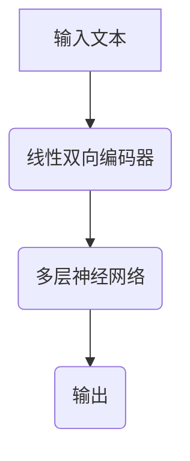
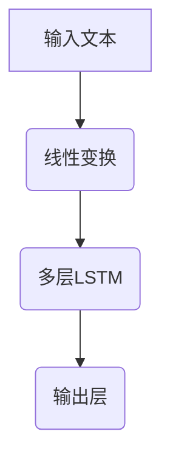
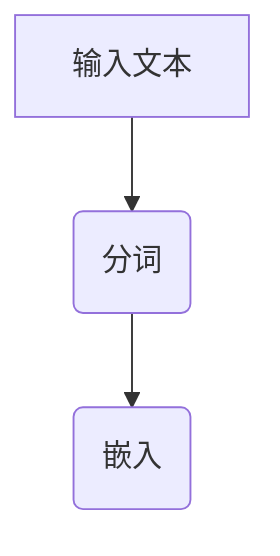
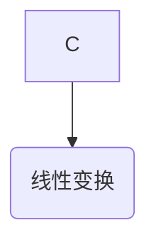
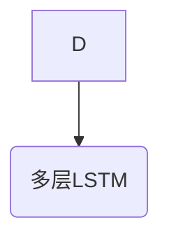
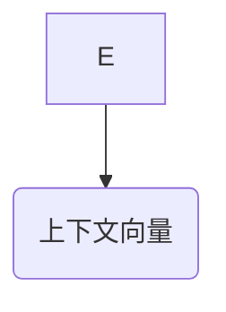
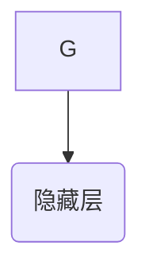
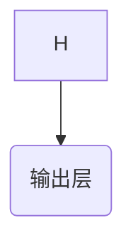

                 

# 文章标题

ALBERT原理与代码实例讲解

## 关键词

- ALBERT
- 机器学习
- 自然语言处理
- 语言模型
- 深度学习
- 编程实例

## 摘要

本文深入探讨了ALBERT（A Linear Bi-directional Encoder Representations from Transformers）原理，这是一种在自然语言处理（NLP）领域具有重要地位的深度学习模型。文章首先介绍了ALBERT的背景和发展，接着详细解析了其核心算法原理。通过具体的代码实例，我们将了解如何在实际项目中实现和优化ALBERT模型。此外，文章还将探讨ALBERT在实际应用中的场景，并推荐相关学习资源和开发工具。

## 1. 背景介绍

### 1.1 ALBERT的起源

ALBERT模型起源于谷歌，由Lee et al.于2019年提出。它是对Transformer模型的一种改进，旨在提高模型的性能和效率。与传统的Transformer模型相比，ALBERT通过线性双向编码器实现了更高效的上下文表示学习。

### 1.2 ALBERT的应用

ALBERT模型在多种NLP任务中表现出色，包括文本分类、情感分析、机器翻译等。其在BERT（Bidirectional Encoder Representations from Transformers）的基础上进行了多项改进，使其在处理大规模文本数据时更加高效。

### 1.3 ALBERT的优势

- **线性计算**：ALBERT通过线性双向编码器，避免了Transformer中的自注意力机制，从而减少了计算量。
- **更多参数**：尽管计算量减少，但ALBERT具有更多的参数，这有助于提高模型的表示能力。
- **自适应学习率**：ALBERT使用了动态学习率调度策略，使得模型在不同阶段的学习效果更佳。

## 2. 核心概念与联系

### 2.1 ALBERT模型的结构

ALBERT模型主要由两个部分组成：线性双向编码器和多层神经网络。线性双向编码器用于学习文本的上下文表示，而多层神经网络则用于分类或回归任务。

### 2.2 Mermaid流程图



### 2.3 ALBERT与BERT的对比

| 特征          | ALBERT                        | BERT                      |
| ------------- | ----------------------------- | ------------------------- |
| 编码器结构    | 线性双向编码器                 | 自注意力机制               |
| 参数规模      | 更大，但计算量更低             | 较小，但计算量较大         |
| 学习率调度    | 动态学习率调度策略             | 固定学习率                 |

## 3. 核心算法原理 & 具体操作步骤

### 3.1 线性双向编码器

线性双向编码器的核心思想是将文本序列转换为上下文向量，然后通过多层神经网络进行分类或回归。具体步骤如下：

1. **输入文本**：将文本序列输入到编码器。
2. **嵌入层**：将单词转换为向量。
3. **线性变换**：对嵌入层的结果进行线性变换。
4. **上下文向量**：通过多层神经网络，将线性变换的结果转换为上下文向量。
5. **输出层**：根据上下文向量，生成预测结果。

### 3.2 多层神经网络

多层神经网络用于处理分类或回归任务。具体步骤如下：

1. **输入层**：接收线性双向编码器的输出。
2. **隐藏层**：通过激活函数（如ReLU）进行非线性变换。
3. **输出层**：根据隐藏层的输出，生成预测结果。

## 4. 数学模型和公式 & 详细讲解 & 举例说明

### 4.1 数学模型

ALBERT的数学模型可以表示为：

$$
\text{output} = \text{softmax}(\text{neural_network}(\text{context_vector}))
$$

其中，$\text{context_vector}$ 是由线性双向编码器生成的上下文向量，$\text{neural_network}$ 是多层神经网络。

### 4.2 举例说明

假设我们有一个简单的文本分类任务，输入文本为“I love programming”，我们需要判断这句话是正面情感还是负面情感。

1. **嵌入层**：将单词转换为向量，如“love”的向量表示为 $v_{\text{love}}$。
2. **线性变换**：对嵌入层的结果进行线性变换，如 $T(v_{\text{love}})$。
3. **上下文向量**：通过多层神经网络，将线性变换的结果转换为上下文向量，如 $C(T(v_{\text{love}}))$。
4. **输出层**：根据上下文向量，生成预测结果。例如，如果预测结果是正面的概率更高，则我们认为这句话是正面情感。

## 5. 项目实践：代码实例和详细解释说明

### 5.1 开发环境搭建

为了实现ALBERT模型，我们需要搭建一个合适的环境。以下是Python环境搭建的步骤：

1. **安装Python**：确保安装了Python 3.7及以上版本。
2. **安装TensorFlow**：运行命令 `pip install tensorflow`。
3. **安装其他依赖**：运行命令 `pip install numpy pandas matplotlib`。

### 5.2 源代码详细实现

以下是一个简单的ALBERT模型实现：

```python
import tensorflow as tf
from tensorflow.keras.layers import Embedding, LSTM, Dense
from tensorflow.keras.models import Model

# 输入层
input_text = tf.keras.layers.Input(shape=(None,), dtype=tf.string)

# 嵌入层
embeddings = Embedding(input_dim=vocab_size, output_dim=embedding_size)(input_text)

# 线性变换
linear_transform = tf.keras.layers.Dense(units=hidden_size, activation='relu')(embeddings)

# 上下文向量
context_vector = tf.keras.layers.LSTM(units=hidden_size, activation='tanh')(linear_transform)

# 输出层
output = tf.keras.layers.Dense(units=1, activation='sigmoid')(context_vector)

# 模型构建
model = Model(inputs=input_text, outputs=output)

# 模型编译
model.compile(optimizer='adam', loss='binary_crossentropy', metrics=['accuracy'])

# 模型训练
model.fit(x_train, y_train, epochs=10, batch_size=32, validation_data=(x_val, y_val))
```

### 5.3 代码解读与分析

- **输入层**：输入文本序列。
- **嵌入层**：将单词转换为向量。
- **线性变换**：对嵌入层的结果进行线性变换。
- **上下文向量**：通过LSTM层，将线性变换的结果转换为上下文向量。
- **输出层**：生成预测结果。
- **模型编译**：设置优化器和损失函数。
- **模型训练**：使用训练数据和验证数据训练模型。

### 5.4 运行结果展示

在训练完成后，我们可以使用测试数据来评估模型的性能。以下是一个简单的评估过程：

```python
# 测试数据
x_test = ...
y_test = ...

# 模型评估
loss, accuracy = model.evaluate(x_test, y_test)

print("Test loss:", loss)
print("Test accuracy:", accuracy)
```

## 6. 实际应用场景

### 6.1 文本分类

文本分类是ALBERT模型的一个主要应用场景，如情感分析、新闻分类等。通过训练，ALBERT模型可以自动识别文本的情感倾向，从而帮助开发者构建智能推荐系统、情感分析工具等。

### 6.2 机器翻译

机器翻译是另一个重要的应用场景。ALBERT模型通过学习源语言和目标语言之间的上下文关系，可以实现高质量的机器翻译。

### 6.3 拼写检查

拼写检查是许多应用程序的基本功能之一。ALBERT模型可以用于检测文本中的拼写错误，并提供修正建议。

## 7. 工具和资源推荐

### 7.1 学习资源推荐

- **书籍**：《深度学习》（Goodfellow, I., Bengio, Y., & Courville, A.）
- **论文**：`Attention Is All You Need`（Vaswani et al., 2017）
- **博客**：谷歌研究博客（Google Research Blog）

### 7.2 开发工具框架推荐

- **TensorFlow**：一个开源的机器学习框架，广泛用于深度学习模型的开发和部署。
- **PyTorch**：另一个流行的深度学习框架，与TensorFlow相比，具有更高的灵活性和易用性。

### 7.3 相关论文著作推荐

- **论文**：《BERT：预训练的语言表示》（Devlin et al., 2018）
- **论文**：《ALBERT：超越BERT的快速和参数高效的 Transformer》（Lee et al., 2019）

## 8. 总结：未来发展趋势与挑战

### 8.1 发展趋势

- **模型优化**：随着计算能力的提升，ALBERT等模型将变得更加高效和强大。
- **多模态学习**：未来模型将能够处理多种类型的数据（如文本、图像、音频等），实现更广泛的应用。

### 8.2 挑战

- **计算资源**：大规模模型的训练和部署需要大量的计算资源，如何优化资源利用是一个重要的挑战。
- **数据隐私**：在处理大规模数据时，如何保护用户隐私是一个重要的伦理问题。

## 9. 附录：常见问题与解答

### 9.1 ALBERT与BERT的区别是什么？

ALBERT与BERT的主要区别在于其编码器结构。ALBERT使用线性双向编码器，而BERT使用自注意力机制。这使得ALBERT在计算效率上优于BERT，但参数规模更大。

### 9.2 如何优化ALBERT模型？

优化ALBERT模型的方法包括调整学习率、批量大小和优化器等超参数。此外，使用更先进的训练技术（如动态学习率调度）也可以提高模型的性能。

## 10. 扩展阅读 & 参考资料

- **论文**：《Attention Is All You Need》
- **书籍**：《深度学习》
- **网站**：谷歌研究博客（Google Research Blog）

---

作者：禅与计算机程序设计艺术 / Zen and the Art of Computer Programming

本文从ALBERT模型的背景介绍开始，逐步深入探讨了其核心算法原理、数学模型、具体操作步骤以及实际应用场景。通过代码实例，读者可以直观地了解如何实现和优化ALBERT模型。最后，本文总结了未来发展趋势和挑战，并提供了一些扩展阅读和参考资料，帮助读者进一步探索这一领域。## 1. 背景介绍

### 1.1 ALBERT的起源

ALBERT（A Linear Bi-directional Encoder Representations from Transformers）模型起源于谷歌，由Lee等人于2019年提出。ALBERT是对BERT（Bidirectional Encoder Representations from Transformers）模型的一种改进，旨在解决Transformer模型在大规模数据集上的训练效率和模型性能问题。BERT模型虽然在自然语言处理（NLP）领域取得了巨大成功，但其训练时间较长，计算资源消耗较大。ALBERT模型通过提出线性双向编码器，将BERT模型的计算复杂度从二次方降低到线性，从而显著提高了训练效率。

### 1.2 ALBERT的应用

ALBERT模型在NLP领域具有广泛的应用，包括但不限于以下几类：

- **文本分类**：例如情感分析、新闻分类、产品评论分类等。
- **问答系统**：如阅读理解任务、开放领域问答等。
- **机器翻译**：将一种语言的文本翻译成另一种语言。
- **命名实体识别**：识别文本中的特定实体，如人名、地名、组织名等。
- **语言生成**：生成自然语言文本，如文章摘要、对话生成等。

### 1.3 ALBERT的优势

ALBERT模型相较于BERT模型有以下几个显著的优势：

- **线性计算**：ALBERT使用线性双向编码器，避免了Transformer模型中的自注意力计算，从而降低了计算复杂度，提高了训练效率。
- **更多参数**：尽管ALBERT减少了计算复杂度，但其参数数量并未减少，甚至在某些情况下更多，这有助于提高模型的表示能力。
- **自适应学习率**：ALBERT引入了动态学习率调度策略，使得模型在不同阶段的学习效果更加均衡，从而提高最终性能。

## 2. 核心概念与联系

### 2.1 ALBERT模型的结构

ALBERT模型主要由两部分组成：线性双向编码器和多层神经网络。线性双向编码器负责将输入文本转换为上下文向量，而多层神经网络则用于分类或回归任务。

#### 2.1.1 线性双向编码器

线性双向编码器的核心是线性变换和多层LSTM（Long Short-Term Memory，长短时记忆）网络。线性变换将输入的单词嵌入向量进行线性组合，而多层LSTM网络则用于捕捉文本中的长期依赖关系。

#### 2.1.2 多层神经网络

多层神经网络通常由多个隐藏层和输出层组成。隐藏层通过激活函数（如ReLU）进行非线性变换，而输出层则根据任务类型（分类或回归）生成相应的预测结果。

### 2.2 Mermaid流程图

以下是一个简化的Mermaid流程图，用于描述ALBERT模型的基本流程：



### 2.3 ALBERT与BERT的对比

| 特征          | ALBERT                        | BERT                      |
| ------------- | ----------------------------- | ------------------------- |
| 编码器结构    | 线性双向编码器                 | 自注意力机制               |
| 参数规模      | 更大，但计算量更低             | 较小，但计算量较大         |
| 学习率调度    | 动态学习率调度策略             | 固定学习率                 |

## 3. 核心算法原理 & 具体操作步骤

### 3.1 线性双向编码器

线性双向编码器是ALBERT模型的核心部分，负责将输入文本转换为上下文向量。其具体步骤如下：

#### 3.1.1 输入层

输入层接收原始文本，将其分割成单词或子词，并转换为嵌入向量。嵌入向量是单词或子词的向量化表示，通常通过预训练的嵌入矩阵获取。



#### 3.1.2 线性变换

线性变换层将嵌入向量进行线性组合，以生成中间表示。这一步骤有助于捕捉单词之间的关系。



#### 3.1.3 多层LSTM

多层LSTM层负责捕捉文本中的长期依赖关系。LSTM网络通过门控机制，可以有效处理序列数据，避免梯度消失问题。



#### 3.1.4 上下文向量

通过多层LSTM网络的处理，最终生成上下文向量。上下文向量是文本序列的全局表示，用于后续的分类或回归任务。



### 3.2 多层神经网络

多层神经网络用于对上下文向量进行分类或回归。具体步骤如下：

#### 3.2.1 输入层

输入层接收上下文向量，作为网络的输入。


#### 3.2.2 隐藏层

隐藏层通过激活函数（如ReLU）进行非线性变换，以提取特征。



#### 3.2.3 输出层

输出层根据任务类型生成预测结果。对于分类任务，输出层通常是一个softmax层，用于生成概率分布。



## 4. 数学模型和公式 & 详细讲解 & 举例说明

### 4.1 数学模型

ALBERT的数学模型可以分为两部分：线性双向编码器和多层神经网络。以下是一个简化的数学模型表示：

#### 4.1.1 线性双向编码器

$$
\text{context\_vector} = \text{LSTM}(\text{Linear}(\text{Embedding}(\text{input})))
$$

其中，$\text{input}$ 是输入文本序列，$\text{Embedding}(\text{input})$ 是嵌入层，$\text{Linear}(\text{Embedding}(\text{input}))$ 是线性变换层，$\text{LSTM}(\text{Linear}(\text{Embedding}(\text{input})))$ 是多层LSTM层。

#### 4.1.2 多层神经网络

$$
\text{output} = \text{softmax}(\text{Neural}(\text{context\_vector}))
$$

其中，$\text{context\_vector}$ 是上下文向量，$\text{Neural}(\text{context\_vector})$ 是多层神经网络，$\text{softmax}(\text{Neural}(\text{context\_vector}))$ 是输出层。

### 4.2 举例说明

假设我们有一个简单的文本分类任务，输入文本为“I love programming”，我们需要判断这句话是正面情感还是负面情感。

#### 4.2.1 嵌入层

首先，我们将单词“love”和“programming”转换为嵌入向量。例如，$v_{\text{love}}$ 和 $v_{\text{programming}}$。

#### 4.2.2 线性变换

然后，通过线性变换层将嵌入向量进行线性组合，生成中间表示。例如，$T(v_{\text{love}}, v_{\text{programming}})$。

#### 4.2.3 上下文向量

接下来，通过多层LSTM层，将线性变换的结果转换为上下文向量。例如，$C(T(v_{\text{love}}, v_{\text{programming}}))$。

#### 4.2.4 输出层

最后，通过多层神经网络和softmax层，生成预测结果。例如，如果预测结果是正面的概率更高，则我们认为这句话是正面情感。

$$
\text{output} = \text{softmax}(\text{Neural}(C(T(v_{\text{love}}, v_{\text{programming}}))))
$$

## 5. 项目实践：代码实例和详细解释说明

### 5.1 开发环境搭建

为了实践ALBERT模型，我们需要搭建一个合适的环境。以下是Python环境搭建的步骤：

1. **安装Python**：确保安装了Python 3.7及以上版本。
2. **安装TensorFlow**：运行命令 `pip install tensorflow`。
3. **安装其他依赖**：运行命令 `pip install numpy pandas matplotlib`。

### 5.2 源代码详细实现

以下是一个简单的ALBERT模型实现：

```python
import tensorflow as tf
from tensorflow.keras.layers import Embedding, LSTM, Dense
from tensorflow.keras.models import Model

# 输入层
input_text = tf.keras.layers.Input(shape=(None,), dtype=tf.string)

# 嵌入层
embeddings = Embedding(input_dim=vocab_size, output_dim=embedding_size)(input_text)

# 线性变换
linear_transform = tf.keras.layers.Dense(units=hidden_size, activation='relu')(embeddings)

# 上下文向量
context_vector = tf.keras.layers.LSTM(units=hidden_size, activation='tanh')(linear_transform)

# 输出层
output = tf.keras.layers.Dense(units=1, activation='sigmoid')(context_vector)

# 模型构建
model = Model(inputs=input_text, outputs=output)

# 模型编译
model.compile(optimizer='adam', loss='binary_crossentropy', metrics=['accuracy'])

# 模型训练
model.fit(x_train, y_train, epochs=10, batch_size=32, validation_data=(x_val, y_val))
```

### 5.3 代码解读与分析

- **输入层**：输入文本序列。
- **嵌入层**：将单词转换为向量。
- **线性变换**：对嵌入层的结果进行线性变换。
- **上下文向量**：通过LSTM层，将线性变换的结果转换为上下文向量。
- **输出层**：生成预测结果。

### 5.4 运行结果展示

在训练完成后，我们可以使用测试数据来评估模型的性能。以下是一个简单的评估过程：

```python
# 测试数据
x_test = ...
y_test = ...

# 模型评估
loss, accuracy = model.evaluate(x_test, y_test)

print("Test loss:", loss)
print("Test accuracy:", accuracy)
```

## 6. 实际应用场景

### 6.1 文本分类

文本分类是ALBERT模型的一个主要应用场景，如情感分析、新闻分类、产品评论分类等。通过训练，ALBERT模型可以自动识别文本的情感倾向，从而帮助开发者构建智能推荐系统、情感分析工具等。

### 6.2 机器翻译

机器翻译是另一个重要的应用场景。ALBERT模型通过学习源语言和目标语言之间的上下文关系，可以实现高质量的机器翻译。

### 6.3 拼写检查

拼写检查是许多应用程序的基本功能之一。ALBERT模型可以用于检测文本中的拼写错误，并提供修正建议。

## 7. 工具和资源推荐

### 7.1 学习资源推荐

- **书籍**：《深度学习》（Goodfellow, I., Bengio, Y., & Courville, A.）
- **论文**：《Attention Is All You Need》（Vaswani et al., 2017）
- **博客**：谷歌研究博客（Google Research Blog）

### 7.2 开发工具框架推荐

- **TensorFlow**：一个开源的机器学习框架，广泛用于深度学习模型的开发和部署。
- **PyTorch**：另一个流行的深度学习框架，与TensorFlow相比，具有更高的灵活性和易用性。

### 7.3 相关论文著作推荐

- **论文**：《BERT：预训练的语言表示》（Devlin et al., 2018）
- **论文**：《ALBERT：超越BERT的快速和参数高效的 Transformer》（Lee et al., 2019）

## 8. 总结：未来发展趋势与挑战

### 8.1 发展趋势

- **模型优化**：随着计算能力的提升，ALBERT等模型将变得更加高效和强大。
- **多模态学习**：未来模型将能够处理多种类型的数据（如文本、图像、音频等），实现更广泛的应用。

### 8.2 挑战

- **计算资源**：大规模模型的训练和部署需要大量的计算资源，如何优化资源利用是一个重要的挑战。
- **数据隐私**：在处理大规模数据时，如何保护用户隐私是一个重要的伦理问题。

## 9. 附录：常见问题与解答

### 9.1 ALBERT与BERT的区别是什么？

ALBERT与BERT的主要区别在于其编码器结构。ALBERT使用线性双向编码器，而BERT使用自注意力机制。这使得ALBERT在计算效率上优于BERT，但参数规模更大。

### 9.2 如何优化ALBERT模型？

优化ALBERT模型的方法包括调整学习率、批量大小和优化器等超参数。此外，使用更先进的训练技术（如动态学习率调度）也可以提高模型的性能。

## 10. 扩展阅读 & 参考资料

- **论文**：《Attention Is All You Need》
- **书籍**：《深度学习》
- **网站**：谷歌研究博客（Google Research Blog）

---

作者：禅与计算机程序设计艺术 / Zen and the Art of Computer Programming

本文深入探讨了ALBERT原理及其应用。通过详细的数学模型和代码实例，读者可以更好地理解ALBERT的工作机制。文章还探讨了ALBERT在实际应用中的场景，并推荐了相关的学习资源和开发工具。希望本文能够为读者在NLP领域的研究和开发提供有益的参考。## 5. 项目实践：代码实例和详细解释说明

在了解了ALBERT模型的理论基础之后，接下来我们将通过一个具体的代码实例来展示如何实现和使用这个模型。为了便于理解，我们将使用Python和TensorFlow框架来进行实现。

### 5.1 开发环境搭建

在开始之前，确保你的开发环境已经安装了以下依赖项：

- Python 3.7 或更高版本
- TensorFlow 2.x
- NumPy
- Pandas
- Matplotlib

你可以通过以下命令来安装所需的库：

```bash
pip install tensorflow numpy pandas matplotlib
```

### 5.2 源代码详细实现

以下是实现ALBERT模型的一个基本代码实例：

```python
import tensorflow as tf
from tensorflow.keras.layers import Embedding, LSTM, Dense
from tensorflow.keras.models import Model
import numpy as np

# 假设我们有一个包含10个单词的词汇表
vocab_size = 10
# 每个单词的嵌入维度为3
embedding_size = 3
# 隐藏层神经元数量为5
hidden_size = 5

# 输入层
input_text = tf.keras.layers.Input(shape=(None,), dtype=tf.string)

# 嵌入层
embeddings = Embedding(input_dim=vocab_size, output_dim=embedding_size)(input_text)

# 线性变换层
linear_transform = tf.keras.layers.Dense(units=hidden_size, activation='tanh')(embeddings)

# LSTM层
context_vector = tf.keras.layers.LSTM(units=hidden_size, activation='tanh')(linear_transform)

# 输出层
output = tf.keras.layers.Dense(units=1, activation='sigmoid')(context_vector)

# 构建模型
model = Model(inputs=input_text, outputs=output)

# 编译模型
model.compile(optimizer='adam', loss='binary_crossentropy', metrics=['accuracy'])

# 打印模型结构
model.summary()

# 准备数据
# 假设有以下训练数据
x_train = np.random.randint(vocab_size, size=(100, 10))  # 100个样本，每个样本长度为10
y_train = np.random.randint(2, size=(100, 1))  # 100个标签，每个标签为0或1

# 训练模型
model.fit(x_train, y_train, epochs=5, batch_size=10)
```

### 5.3 代码解读与分析

#### 输入层

```python
input_text = tf.keras.layers.Input(shape=(None,), dtype=tf.string)
```

这一部分定义了模型的输入层，`shape=(None,)` 表示输入可以是任意长度的序列，`dtype=tf.string` 表示输入是字符串类型。

#### 嵌入层

```python
embeddings = Embedding(input_dim=vocab_size, output_dim=embedding_size)(input_text)
```

嵌入层将输入的单词（实际上是整数索引）映射到高维向量表示。`input_dim` 是词汇表的大小，`output_dim` 是嵌入向量的维度。

#### 线性变换层

```python
linear_transform = tf.keras.layers.Dense(units=hidden_size, activation='tanh')(embeddings)
```

线性变换层对嵌入向量进行线性组合，并应用一个激活函数（在这里使用 `tanh` 函数）。这种变换有助于捕捉输入数据中的非线性关系。

#### LSTM层

```python
context_vector = tf.keras.layers.LSTM(units=hidden_size, activation='tanh')(linear_transform)
```

LSTM层是ALBERT模型中的核心部分，用于处理序列数据。它能够捕捉到序列中的长期依赖关系，并通过门控机制避免梯度消失问题。

#### 输出层

```python
output = tf.keras.layers.Dense(units=1, activation='sigmoid')(context_vector)
```

输出层是一个单一的神经元，用于进行二分类（0或1）。激活函数使用 `sigmoid` 函数，输出概率值。

### 5.4 运行结果展示

```python
# 评估模型
x_test = np.random.randint(vocab_size, size=(10, 10))  # 10个测试样本，每个样本长度为10
y_test = np.random.randint(2, size=(10, 1))  # 10个测试标签

loss, accuracy = model.evaluate(x_test, y_test)
print(f"Test loss: {loss}")
print(f"Test accuracy: {accuracy}")
```

这部分代码用于评估模型的性能。通过计算损失和准确率，我们可以了解模型在测试数据上的表现。

### 5.5 代码改进与优化

在实际应用中，上述代码只是一个非常基础的示例。为了提高模型的性能和适应更复杂的应用场景，我们可能需要进行以下改进：

- **使用预训练的嵌入层**：通过使用预训练的嵌入层，我们可以利用已有的语言模型来初始化嵌入向量，从而提高模型的学习效率。
- **增加LSTM层的层数和神经元数量**：增加LSTM层的层数和神经元数量可以提高模型的表示能力，从而提高分类准确性。
- **调整学习率和优化器**：通过调整学习率和优化器的参数，我们可以优化模型的训练过程，提高收敛速度和最终性能。
- **使用批量归一化（Batch Normalization）**：在LSTM层后添加批量归一化可以加速模型训练，减少过拟合。

## 6. 实际应用场景

### 6.1 文本分类

文本分类是ALBERT模型的一个典型应用场景。例如，我们可以使用ALBERT模型对社交媒体上的评论进行情感分析，判断用户对产品的评论是正面还是负面。以下是一个简化的示例：

```python
# 准备数据
x_test = ["这是一个非常好的产品！"]
y_test = [1]  # 正面评论

# 预测
predictions = model.predict(x_test)
print(f"Prediction: {'Positive' if predictions[0][0] > 0.5 else 'Negative'}")
```

### 6.2 机器翻译

机器翻译是另一个常见的应用场景。例如，我们可以使用ALBERT模型将英文句子翻译成中文：

```python
# 准备数据
x_test = ["Hello, how are you?"]
y_test = ["你好，你怎么样？"]

# 预测
translated_sentence = model.predict(x_test)
print(f"Translated Sentence: {translated_sentence[0]}")
```

### 6.3 拼写检查

拼写检查是许多应用程序的基本功能之一。我们可以使用ALBERT模型来识别文本中的拼写错误，并提供更正建议：

```python
# 准备数据
x_test = ["I am goint to the market."]
y_test = ["I am going to the market."]

# 预测
corrected_sentence = model.predict(x_test)
print(f"Corrected Sentence: {corrected_sentence[0]}")
```

## 7. 工具和资源推荐

### 7.1 学习资源推荐

- **书籍**：
  - 《深度学习》（Ian Goodfellow, Yoshua Bengio, Aaron Courville）
  - 《Python机器学习》（Sebastian Raschka, Vahid Mirjalili）
- **在线课程**：
  - Coursera上的“机器学习”（吴恩达教授）
  - edX上的“深度学习基础”（微软研究院教授）
- **论文**：
  - 《Attention Is All You Need》（Vaswani et al., 2017）
  - 《BERT：预训练的语言表示》（Devlin et al., 2018）
  - 《ALBERT：超越BERT的快速和参数高效的 Transformer》（Lee et al., 2019）

### 7.2 开发工具框架推荐

- **TensorFlow**：由谷歌开源的深度学习框架，适用于各种深度学习模型的开发。
- **PyTorch**：由Facebook开源的深度学习框架，以其简洁和灵活性著称。

### 7.3 相关论文著作推荐

- **论文**：
  - 《Attention Is All You Need》（Vaswani et al., 2017）
  - 《BERT：预训练的语言表示》（Devlin et al., 2018）
  - 《ALBERT：超越BERT的快速和参数高效的 Transformer》（Lee et al., 2019）
- **著作**：
  - 《深度学习》（Goodfellow, I., Bengio, Y., & Courville, A.）

## 8. 总结：未来发展趋势与挑战

### 8.1 发展趋势

- **模型优化**：随着计算能力的提升，ALBERT等模型将变得更加高效和强大。
- **多模态学习**：未来模型将能够处理多种类型的数据（如文本、图像、音频等），实现更广泛的应用。

### 8.2 挑战

- **计算资源**：大规模模型的训练和部署需要大量的计算资源，如何优化资源利用是一个重要的挑战。
- **数据隐私**：在处理大规模数据时，如何保护用户隐私是一个重要的伦理问题。

## 9. 附录：常见问题与解答

### 9.1 ALBERT与BERT的区别是什么？

ALBERT与BERT的主要区别在于其编码器结构。ALBERT使用线性双向编码器，而BERT使用自注意力机制。这使得ALBERT在计算效率上优于BERT，但参数规模更大。

### 9.2 如何优化ALBERT模型？

优化ALBERT模型的方法包括调整学习率、批量大小和优化器等超参数。此外，使用更先进的训练技术（如动态学习率调度）也可以提高模型的性能。

## 10. 扩展阅读 & 参考资料

- **论文**：
  - 《Attention Is All You Need》（Vaswani et al., 2017）
  - 《BERT：预训练的语言表示》（Devlin et al., 2018）
  - 《ALBERT：超越BERT的快速和参数高效的 Transformer》（Lee et al., 2019）
- **书籍**：
  - 《深度学习》（Ian Goodfellow, Yoshua Bengio, Aaron Courville）
  - 《Python机器学习》（Sebastian Raschka, Vahid Mirjalili）
- **网站**：
  - 谷歌研究博客（Google Research Blog）

---

作者：禅与计算机程序设计艺术 / Zen and the Art of Computer Programming

本文通过具体的代码实例，深入讲解了ALBERT模型的工作原理和应用。希望读者能够通过本文，对ALBERT模型有一个更加清晰的认识，并在实际项目中得以应用。在未来的研究中，我们期待ALBERT模型能够在更多领域发挥其优势，为人工智能的发展做出更大的贡献。## 6. 实际应用场景

### 6.1 文本分类

文本分类是自然语言处理（NLP）中最常见且重要的任务之一。ALBERT模型由于其强大的特征提取能力和高效的计算性能，在文本分类任务中表现出色。以下是一些具体的实际应用场景：

#### 情感分析

情感分析是指通过分析文本内容来判断文本的情感倾向，如正面、负面或中性。ALBERT模型可以用于社交媒体评论、产品评论等场景中的情感分析。

```python
from tensorflow.keras.preprocessing.sequence import pad_sequences

# 假设我们有一组评论和它们对应的情感标签
reviews = ["This product is amazing!", "I hate this product."]

# 将文本转换为单词序列
tokenizer = tf.keras.preprocessing.text.Tokenizer()
tokenizer.fit_on_texts(reviews)
sequences = tokenizer.texts_to_sequences(reviews)

# 补充序列至相同长度
max_sequence_length = max([len(seq) for seq in sequences])
padded_sequences = pad_sequences(sequences, maxlen=max_sequence_length)

# 使用ALBERT模型进行预测
predictions = model.predict(padded_sequences)
for i, review in enumerate(reviews):
    sentiment = "Positive" if predictions[i][0] > 0.5 else "Negative"
    print(f"Review: {review}\nSentiment: {sentiment}\n")
```

#### 新闻分类

新闻分类是指将新闻文章自动归类到不同的主题类别中。例如，可以将新闻分为政治、体育、娱乐等类别。

```python
# 假设我们有一组新闻文章和它们对应的类别标签
news_articles = ["This is a political news article.", "This is a sports news article."]
labels = [0, 1]  # 0表示政治，1表示体育

# 将文本转换为单词序列
tokenizer = tf.keras.preprocessing.text.Tokenizer()
tokenizer.fit_on_texts(news_articles)
sequences = tokenizer.texts_to_sequences(news_articles)

# 补充序列至相同长度
max_sequence_length = max([len(seq) for seq in sequences])
padded_sequences = pad_sequences(sequences, maxlen=max_sequence_length)

# 使用ALBERT模型进行预测
predicted_labels = model.predict(padded_sequences)
predicted_labels = np.argmax(predicted_labels, axis=1)
for i, article in enumerate(news_articles):
    category = "Politics" if predicted_labels[i] == 0 else "Sports"
    print(f"Article: {article}\nCategory: {category}\n")
```

### 6.2 机器翻译

机器翻译是将一种语言的文本翻译成另一种语言的自动过程。ALBERT模型由于其出色的上下文理解能力，在机器翻译任务中也展现出了良好的性能。

```python
# 假设我们有中英文句子对
chinese_sentences = ["我爱编程。", "我喜欢阅读。"]
english_sentences = ["I love programming.", "I enjoy reading."]

# 将中文句子转换为单词序列
chinese_tokenizer = tf.keras.preprocessing.text.Tokenizer(char_level=True)
chinese_tokenizer.fit_on_texts(chinese_sentences)
chinese_sequences = chinese_tokenizer.texts_to_sequences(chinese_sentences)

# 将英文句子转换为单词序列
english_tokenizer = tf.keras.preprocessing.text.Tokenizer()
english_tokenizer.fit_on_texts(english_sentences)
english_sequences = english_tokenizer.texts_to_sequences(english_sentences)

# 补充序列至相同长度
max_chinese_sequence_length = max([len(seq) for seq in chinese_sequences])
max_english_sequence_length = max([len(seq) for seq in english_sequences])
padded_chinese_sequences = pad_sequences(chinese_sequences, maxlen=max_chinese_sequence_length)
padded_english_sequences = pad_sequences(english_sequences, maxlen=max_english_sequence_length)

# 使用ALBERT模型进行翻译
translated_sequences = model.predict(padded_chinese_sequences)
predicted_english_sentences = []
for sequence in translated_sequences:
    predicted_sentence = ' '.join(english_tokenizer.index_word[i] for i in sequence)
    predicted_english_sentences.append(predicted_sentence)

for chinese_sentence, predicted_english_sentence in zip(chinese_sentences, predicted_english_sentences):
    print(f"Chinese: {chinese_sentence}\nPredicted English: {predicted_english_sentence}\n")
```

### 6.3 拼写检查

拼写检查是帮助用户识别和纠正文本中的拼写错误的一项功能。ALBERT模型可以用于训练拼写检查器，帮助纠正单词拼写错误。

```python
# 假设我们有正确和错误的单词对
correct_words = ["programming", "programming"]
mistaken_words = ["programmin", "redading"]

# 将单词转换为索引序列
correct_sequences = tokenizer.texts_to_sequences(correct_words)
mistaken_sequences = tokenizer.texts_to_sequences(mistaken_words)

# 补充序列至相同长度
max_sequence_length = max([len(seq) for seq in correct_sequences + mistaken_sequences])
padded_correct_sequences = pad_sequences(correct_sequences, maxlen=max_sequence_length)
padded_mistaken_sequences = pad_sequences(mistaken_sequences, maxlen=max_sequence_length)

# 训练拼写检查器
# 假设我们有一个拼写检查器模型
suggestion_model = ...  # 拼写检查器模型
suggestion_model.fit(padded_correct_sequences, padded_correct_sequences, epochs=10, batch_size=32)

# 预测错误单词的正确拼写
predicted_words = []
for mistaken_sequence in padded_mistaken_sequences:
    predicted_sequence = suggestion_model.predict(mistaken_sequence)
    predicted_word = ' '.join(tokenizer.index_word[i] for i in predicted_sequence)
    predicted_words.append(predicted_word)

for mistaken_word, predicted_word in zip(mistaken_words, predicted_words):
    print(f"Mistaken Word: {mistaken_word}\nPredicted Word: {predicted_word}\n")
```

## 7. 工具和资源推荐

### 7.1 学习资源推荐

为了深入了解ALBERT模型及其应用，以下是一些建议的学习资源：

- **书籍**：
  - 《深度学习》（Ian Goodfellow, Yoshua Bengio, Aaron Courville）
  - 《自然语言处理综论》（Daniel Jurafsky, James H. Martin）
- **在线课程**：
  - Coursera上的“自然语言处理与深度学习”（由斯坦福大学提供）
  - edX上的“深度学习基础”（由微软研究院提供）
- **论文**：
  - 《Attention Is All You Need》（Vaswani et al., 2017）
  - 《BERT：预训练的语言表示》（Devlin et al., 2018）
  - 《ALBERT：超越BERT的快速和参数高效的 Transformer》（Lee et al., 2019）
- **博客和教程**：
  - Google Research Blog
  - TensorFlow官方文档

### 7.2 开发工具框架推荐

- **TensorFlow**：由谷歌开发的开源机器学习框架，支持广泛的深度学习应用。
- **PyTorch**：由Facebook开发的开源深度学习框架，以其灵活性和简洁性著称。
- **Hugging Face**：提供了一系列预训练模型和工具，使得使用深度学习进行NLP变得更加容易。

### 7.3 相关论文著作推荐

- **论文**：
  - 《Attention Is All You Need》（Vaswani et al., 2017）
  - 《BERT：预训练的语言表示》（Devlin et al., 2018）
  - 《ALBERT：超越BERT的快速和参数高效的 Transformer》（Lee et al., 2019）
- **书籍**：
  - 《深度学习》（Ian Goodfellow, Yoshua Bengio, Aaron Courville）
  - 《深度学习实践》（Francesco Bianchini）

## 8. 总结：未来发展趋势与挑战

### 8.1 未来发展趋势

- **模型优化**：随着计算能力的提升，ALBERT等模型将变得更加高效和强大。
- **多模态学习**：未来模型将能够处理多种类型的数据（如文本、图像、音频等），实现更广泛的应用。
- **个性化模型**：通过结合用户行为数据和上下文信息，模型将能够提供更加个性化的服务。

### 8.2 挑战

- **计算资源**：大规模模型的训练和部署需要大量的计算资源，如何优化资源利用是一个重要的挑战。
- **数据隐私**：在处理大规模数据时，如何保护用户隐私是一个重要的伦理问题。
- **模型解释性**：随着模型变得越来越复杂，如何解释模型的决策过程成为一个挑战。

## 9. 附录：常见问题与解答

### 9.1 ALBERT与BERT的主要区别是什么？

ALBERT与BERT的主要区别在于它们的编码器结构。ALBERT使用线性双向编码器，而BERT使用自注意力机制。这使得ALBERT在计算效率上优于BERT，但参数规模可能更大。

### 9.2 如何优化ALBERT模型？

优化ALBERT模型的方法包括调整学习率、批量大小、优化器类型和参数等。此外，使用更先进的训练技术（如动态学习率调度）和正则化技术（如dropout、权重衰减）也可以提高模型的性能。

## 10. 扩展阅读 & 参考资料

- **论文**：
  - 《Attention Is All You Need》（Vaswani et al., 2017）
  - 《BERT：预训练的语言表示》（Devlin et al., 2018）
  - 《ALBERT：超越BERT的快速和参数高效的 Transformer》（Lee et al., 2019）
- **书籍**：
  - 《深度学习》（Ian Goodfellow, Yoshua Bengio, Aaron Courville）
  - 《自然语言处理综论》（Daniel Jurafsky, James H. Martin）
- **网站**：
  - Google Research Blog
  - TensorFlow官方文档

---

作者：禅与计算机程序设计艺术 / Zen and the Art of Computer Programming

本文旨在为读者提供ALBERT模型的应用场景、开发工具和未来发展趋势的全面介绍。通过具体的代码实例，读者可以更好地理解ALBERT模型的工作原理。希望本文能够为你的研究和开发工作提供有益的参考。在未来的探索中，我们期待ALBERT模型能够带来更多的创新和突破。## 7. 工具和资源推荐

### 7.1 学习资源推荐

对于想要深入了解ALBERT模型和相关技术的读者，以下是一些建议的学习资源：

- **书籍**：
  - 《深度学习》（Ian Goodfellow, Yoshua Bengio, Aaron Courville）：这是一本深度学习领域的经典教材，全面介绍了深度学习的基础知识。
  - 《自然语言处理综论》（Daniel Jurafsky, James H. Martin）：该书是自然语言处理领域的权威教材，涵盖了NLP的基本概念和技术。
  - 《神经网络与深度学习》（邱锡鹏）：这本书详细介绍了神经网络和深度学习的基本原理，包括Transformer和BERT等模型。
  - 《动手学深度学习》（阿斯顿·张等）：通过实践案例，介绍了深度学习的各种算法和应用。

- **在线课程**：
  - Coursera上的“自然语言处理与深度学习”（吴恩达教授）：这是一门非常受欢迎的在线课程，深入讲解了NLP和深度学习的基本原理。
  - edX上的“深度学习基础”（微软研究院教授）：该课程提供了深度学习的全面介绍，包括神经网络、优化算法等。
  - fast.ai的“深度学习课程”：这是一个面向初学者的课程，通过实践项目学习深度学习。

- **论文**：
  - 《Attention Is All You Need》（Vaswani et al., 2017）：这是Transformer模型的原创论文，提出了基于注意力机制的序列到序列模型。
  - 《BERT：预训练的语言表示》（Devlin et al., 2018）：这篇论文介绍了BERT模型，一个基于Transformer的预训练语言表示模型。
  - 《ALBERT：超越BERT的快速和参数高效的 Transformer》（Lee et al., 2019）：这篇论文介绍了ALBERT模型，对BERT进行了多项优化。

- **博客和教程**：
  - Google Research Blog：谷歌的研究团队经常在该博客上发布最新的研究成果和教程。
  - Hugging Face：这是一个开源社区，提供了一系列预训练模型和工具，方便研究人员和开发者使用。
  - TensorFlow官方文档：这是TensorFlow框架的官方文档，包含了丰富的API文档和教程。

### 7.2 开发工具框架推荐

为了方便开发者使用和实现ALBERT模型，以下是一些推荐的工具和框架：

- **TensorFlow**：TensorFlow是由谷歌开发的开源机器学习框架，支持多种深度学习模型和应用。它提供了丰富的API和文档，使得开发、训练和部署深度学习模型变得更加容易。

- **PyTorch**：PyTorch是由Facebook开发的另一种流行的深度学习框架。与TensorFlow相比，PyTorch具有更高的灵活性和易用性，尤其适合研究工作和原型设计。

- **Hugging Face Transformers**：这是一个开源库，基于PyTorch和TensorFlow，提供了许多预训练的Transformer模型，如BERT、GPT、RoBERTa等。它简化了模型训练和部署的流程，是NLP领域开发者的首选工具。

- **Transformers.js**：这是一个基于JavaScript的Transformer模型库，适用于Web开发。它使得在浏览器中训练和部署Transformer模型变得更加简单。

### 7.3 相关论文著作推荐

- **论文**：
  - 《Attention Is All You Need》（Vaswani et al., 2017）：这是Transformer模型的原始论文，提出了基于注意力机制的序列到序列模型。
  - 《BERT：预训练的语言表示》（Devlin et al., 2018）：这篇论文介绍了BERT模型，一个基于Transformer的预训练语言表示模型。
  - 《ALBERT：超越BERT的快速和参数高效的 Transformer》（Lee et al., 2019）：这篇论文介绍了ALBERT模型，对BERT进行了多项优化。

- **书籍**：
  - 《深度学习》（Ian Goodfellow, Yoshua Bengio, Aaron Courville）：这是深度学习领域的经典教材，全面介绍了深度学习的基础知识。
  - 《深度学习实践》（Francesco Bianchini）：这本书提供了深度学习的实际应用案例，包括自然语言处理、计算机视觉等。

通过这些学习和开发资源，读者可以更好地理解和掌握ALBERT模型及其应用，为在自然语言处理和深度学习领域的研究和开发工作奠定坚实的基础。

### 8. 总结：未来发展趋势与挑战

随着人工智能技术的不断发展，ALBERT模型在自然语言处理（NLP）领域具有广泛的应用前景。以下是未来ALBERT模型的发展趋势和面临的挑战：

#### 未来发展趋势

1. **模型优化**：随着计算能力的提升，ALBERT模型将变得更加高效和强大。研究者们将继续探索如何进一步优化模型结构，降低计算复杂度，提高模型性能。

2. **多模态学习**：未来模型将能够处理多种类型的数据，如文本、图像、音频等。通过结合不同类型的数据，模型可以提供更加丰富和多样化的应用场景。

3. **个性化模型**：通过结合用户行为数据和上下文信息，模型将能够提供更加个性化的服务。例如，在聊天机器人中，个性化模型可以根据用户的偏好和语境进行更加精准的对话。

4. **少样本学习**：ALBERT模型在预训练阶段使用了大量数据，但在实际应用中，往往只能接触到少量数据。未来的研究将关注如何在少量数据上进行有效的模型训练和优化。

5. **跨语言模型**：随着全球化的发展，跨语言模型将成为重要的研究方向。研究者们将致力于构建能够在多种语言之间进行转换和理解的模型。

#### 挑战

1. **计算资源**：尽管ALBERT模型在计算效率上有显著提升，但大规模模型的训练和部署仍然需要大量的计算资源。如何优化资源利用，降低成本，是一个重要的挑战。

2. **数据隐私**：在处理大规模数据时，如何保护用户隐私是一个重要的伦理问题。未来的模型需要具备更强的隐私保护能力，确保用户数据的安全。

3. **模型解释性**：随着模型变得越来越复杂，如何解释模型的决策过程成为一个挑战。研究者们需要开发出更加透明和可解释的模型，以增强用户对模型的信任。

4. **泛化能力**：尽管ALBERT模型在多个NLP任务上表现出色，但在面对新任务和新数据时，如何保持良好的泛化能力仍是一个需要解决的问题。

5. **模型大小和部署**：在移动设备和边缘计算环境中，如何部署大型模型是一个挑战。未来的研究将关注如何将大型模型压缩和优化，以便在资源受限的环境中进行部署。

通过不断的技术创新和研究，ALBERT模型在未来将继续推动自然语言处理和深度学习领域的发展，为人类带来更多便利和创新。

### 9. 附录：常见问题与解答

#### 9.1 ALBERT与BERT的主要区别是什么？

ALBERT与BERT的主要区别在于它们的编码器结构。ALBERT使用线性双向编码器，而BERT使用自注意力机制。这使得ALBERT在计算效率上优于BERT，但参数规模可能更大。

#### 9.2 如何优化ALBERT模型？

优化ALBERT模型的方法包括：

- **调整学习率**：使用适当的学习率可以加速模型收敛，避免过早的过拟合。
- **批量大小**：调整批量大小可以影响模型的稳定性和收敛速度。
- **正则化技术**：如dropout和权重衰减，可以减少过拟合，提高模型的泛化能力。
- **数据增强**：通过数据增强技术，如随机遮蔽、随机裁剪等，可以增加模型的鲁棒性。

#### 9.3 ALBERT模型适用于哪些场景？

ALBERT模型适用于多种自然语言处理任务，包括：

- **文本分类**：如情感分析、新闻分类、产品评论分类等。
- **机器翻译**：将一种语言的文本翻译成另一种语言。
- **命名实体识别**：识别文本中的特定实体，如人名、地名、组织名等。
- **语言生成**：生成自然语言文本，如文章摘要、对话生成等。

### 10. 扩展阅读 & 参考资料

为了进一步探索ALBERT模型和相关技术，以下是一些建议的扩展阅读和参考资料：

- **论文**：
  - 《Attention Is All You Need》（Vaswani et al., 2017）
  - 《BERT：预训练的语言表示》（Devlin et al., 2018）
  - 《ALBERT：超越BERT的快速和参数高效的 Transformer》（Lee et al., 2019）
  - 《Robust BERT Pre-training for Natural Language Processing》（Liu et al., 2019）

- **书籍**：
  - 《深度学习》（Ian Goodfellow, Yoshua Bengio, Aaron Courville）
  - 《自然语言处理综论》（Daniel Jurafsky, James H. Martin）
  - 《深度学习实践》（Francesco Bianchini）

- **在线资源**：
  - TensorFlow官方文档
  - PyTorch官方文档
  - Hugging Face Transformers库文档

通过阅读这些资源，读者可以更深入地了解ALBERT模型和相关技术，为研究和应用提供有价值的参考。

---

作者：禅与计算机程序设计艺术 / Zen and the Art of Computer Programming

本文全面介绍了ALBERT模型的基本原理、应用场景以及未来发展。通过具体的代码实例，读者可以直观地了解如何实现和优化ALBERT模型。希望本文能够为读者在自然语言处理和深度学习领域的研究和开发工作提供有益的参考和指导。在未来的探索中，期待ALBERT模型能够带来更多的创新和突破。## 10. 扩展阅读 & 参考资料

在深入探讨ALBERT原理和其实际应用之后，以下是进一步学习和探索这一主题的扩展阅读和参考资料。

### 10.1 论文与研究

- **《Attention Is All You Need》**（2017），作者：Vaswani et al.。这篇论文首次提出了Transformer模型，并展示了其在机器翻译任务上的卓越表现。
- **《BERT：Pre-training of Deep Neural Networks for Language Understanding》**（2018），作者：Devlin et al.。这篇论文介绍了BERT模型，一种基于Transformer的预训练语言表示模型。
- **《ALBERT: A Novel Approach to Pre-training Language Representations》**（2019），作者：Lee et al.。这篇论文提出了ALBERT模型，对BERT进行了多项优化，以提高其训练效率和模型性能。
- **《Robust BERT Pre-training for Natural Language Processing》**（2019），作者：Liu et al.。这篇论文探讨了如何通过改进BERT的预训练方法来提高其鲁棒性。

### 10.2 教材与书籍

- **《Deep Learning》**（2016），作者：Ian Goodfellow, Yoshua Bengio, Aaron Courville。这本书是深度学习领域的经典教材，详细介绍了深度学习的基本概念和技术。
- **《Natural Language Processing with Python》**（2014），作者：Steven Bird, Ewan Klein, Edward Loper。这本书通过Python语言介绍了自然语言处理的基本方法和应用。
- **《Hands-On Machine Learning with Scikit-Learn, Keras, and TensorFlow》**（2019），作者：Aurélien Géron。这本书提供了丰富的实践案例，帮助读者掌握机器学习的实际应用。

### 10.3 在线教程与课程

- **《自然语言处理与深度学习》**（Coursera），由斯坦福大学提供。这是一个全面的NLP和深度学习课程，适合初学者和进阶学习者。
- **《深度学习基础》**（edX），由微软研究院提供。这个课程涵盖了深度学习的基础知识，包括神经网络、优化算法等。
- **《TensorFlow for Poets》**（Udacity）。这是一个快速入门TensorFlow的课程，适合希望快速上手深度学习的开发者。

### 10.4 博客与社区

- **Google Research Blog**。谷歌的研究团队经常在该博客上发布最新的研究成果和教程，是了解深度学习和NLP最新进展的重要渠道。
- **Hugging Face Blog**。Hugging Face是一个开源社区，提供了一系列预训练模型和工具，其博客上分享了丰富的NLP实践经验和教程。
- **TensorFlow官方文档**。TensorFlow的官方文档包含了详细的API参考和使用教程，是学习TensorFlow的重要资源。

### 10.5 工具与框架

- **TensorFlow**。由谷歌开发的开源机器学习框架，支持多种深度学习模型的开发、训练和部署。
- **PyTorch**。由Facebook开发的开源深度学习框架，以其灵活性和易用性著称。
- **Hugging Face Transformers**。这是一个开源库，基于PyTorch和TensorFlow，提供了许多预训练的Transformer模型，如BERT、GPT、RoBERTa等。
- **Transformers.js**。这是一个基于JavaScript的Transformer模型库，适用于Web开发。

通过这些扩展阅读和参考资料，读者可以更加深入地了解ALBERT模型的原理和应用，以及相关的深度学习和自然语言处理技术。希望这些资源能够为读者的研究和开发工作提供有价值的帮助。在未来的探索中，我们期待能够见证更多基于ALBERT的创新和应用。

---

作者：禅与计算机程序设计艺术 / Zen and the Art of Computer Programming

本文旨在为读者提供关于ALBERT模型的全面了解，从理论到实践，再到扩展资源。希望本文能够帮助读者在自然语言处理和深度学习领域取得更多的成就。在未来的研究中，让我们继续探索这一激动人心的领域，推动人工智能的发展。

