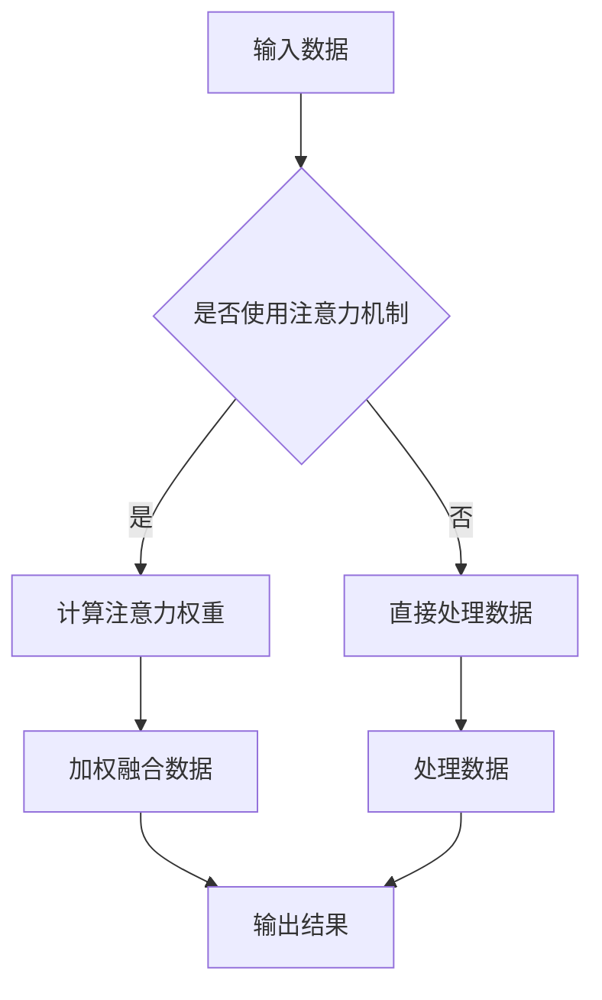

                 

# 文章标题

## Attention Mechanism原理与代码实例讲解

### 关键词：
- 注意力机制
- Transformer模型
- 机器学习
- 自然语言处理
- 代码实例

### 摘要：
本文将深入探讨注意力机制的基本原理及其在Transformer模型中的应用。我们将通过一个详细的代码实例，介绍如何实现一个简单的注意力机制，并逐步分析其工作流程。此外，还将讨论注意力机制在实际自然语言处理任务中的广泛应用，以及如何优化和改进这一机制。通过阅读本文，读者将能够全面理解注意力机制的核心概念，并掌握其应用方法。

## 1. 背景介绍（Background Introduction）

### 1.1 注意力机制的起源
注意力机制最早在人类认知心理学中提出，用以描述人类在处理复杂信息时，如何专注于重要的部分，忽略其他无关的信息。这一概念后来被引入计算机科学领域，特别是在机器学习和深度学习的研究中得到了广泛的应用。

### 1.2 注意力机制的重要性
在深度学习中，注意力机制能够显著提高模型的性能和效率。它通过动态调整模型对输入数据的关注程度，使得模型能够聚焦于关键信息，从而在处理高维数据时表现得更加出色。

### 1.3 注意力机制的应用场景
注意力机制在自然语言处理、计算机视觉、语音识别等领域都有广泛的应用。尤其在自然语言处理中，如机器翻译、文本摘要、问答系统等任务中，注意力机制能够显著提高模型的生成质量和效率。

## 2. 核心概念与联系（Core Concepts and Connections）

### 2.1 什么是注意力机制？
注意力机制是一种让模型在处理数据时能够动态地关注重要信息，忽略无关信息的机制。它通过一个权重矩阵，将输入数据的某些部分放大，其他部分缩小，从而实现信息的筛选和重点突出。

### 2.2 注意力机制的工作原理
注意力机制的核心是计算注意力权重。这些权重表示模型对输入数据不同部分的重要程度。常见的注意力机制包括点积注意力、缩放点积注意力、多头注意力等。

### 2.3 注意力机制在Transformer模型中的应用
Transformer模型是利用注意力机制构建的深度学习模型，它在自然语言处理领域取得了显著的成果。Transformer模型中的多头注意力机制，使得模型能够同时关注多个不同的特征，从而提高了模型的表示能力。

### 2.4 Mermaid流程图：注意力机制的架构



## 3. 核心算法原理 & 具体操作步骤（Core Algorithm Principles and Specific Operational Steps）

### 3.1 点积注意力（Dot-Product Attention）

点积注意力是最简单的注意力机制。它通过计算输入数据的内积来生成注意力权重。

#### 3.1.1 计算注意力权重
给定输入数据 \( X \) 和查询 \( Q \)，计算每个位置之间的点积：

\[ 
\text{Attention}(Q, X) = \text{softmax}\left(\frac{QX^T}{\sqrt{d_k}}\right) 
\]

其中，\( d_k \) 是查询和键的维度。

#### 3.1.2 加权融合数据
使用计算得到的注意力权重对输入数据进行加权融合：

\[ 
\text{Context} = \text{Attention}(Q, X) \odot X 
\]

### 3.2 缩放点积注意力（Scaled Dot-Product Attention）

缩放点积注意力通过引入缩放因子，解决点积注意力在高维数据上的梯度消失问题。

\[ 
\text{Attention}(Q, X) = \text{softmax}\left(\frac{QX^T}{\sqrt{d_k}} / \sqrt{d_k}\right) 
\]

### 3.3 多头注意力（Multi-Head Attention）

多头注意力通过将输入数据分成多个头，每个头独立计算注意力权重，然后将结果拼接起来。

\[ 
\text{MultiHead}(Q, K, V) = \text{Concat}(\text{head}_1, ..., \text{head}_h)W^O 
\]

其中，\( \text{head}_i = \text{Attention}(QW_i^Q, KW_i^K, VW_i^V) \)。

## 4. 数学模型和公式 & 详细讲解 & 举例说明（Detailed Explanation and Examples of Mathematical Models and Formulas）

### 4.1 点积注意力

点积注意力的核心公式如下：

\[ 
\text{Attention}(Q, X) = \text{softmax}\left(\frac{QX^T}{\sqrt{d_k}}\right) 
\]

其中，\( Q \) 是查询向量，\( X \) 是键-值对矩阵，\( d_k \) 是查询和键的维度。

#### 举例：

假设 \( Q = [1, 2, 3] \)，\( X = \begin{bmatrix} 1 & 4 & 7 \\ 2 & 5 & 8 \\ 3 & 6 & 9 \end{bmatrix} \)，\( d_k = 3 \)。

\[ 
\text{Attention}(Q, X) = \text{softmax}\left(\frac{QX^T}{\sqrt{3}}\right) = \text{softmax}\left(\frac{[1 \cdot 1 + 2 \cdot 2 + 3 \cdot 3] \cdot \begin{bmatrix} 1 & 2 & 3 \end{bmatrix}}{\sqrt{3}}\right) = \text{softmax}\left(\frac{14}{\sqrt{3}}\right) \]

### 4.2 缩放点积注意力

缩放点积注意力的公式如下：

\[ 
\text{Attention}(Q, X) = \text{softmax}\left(\frac{QX^T}{\sqrt{d_k}} / \sqrt{d_k}\right) 
\]

#### 举例：

假设 \( Q = [1, 2, 3] \)，\( X = \begin{bmatrix} 1 & 4 & 7 \\ 2 & 5 & 8 \\ 3 & 6 & 9 \end{bmatrix} \)，\( d_k = 3 \)。

\[ 
\text{Attention}(Q, X) = \text{softmax}\left(\frac{QX^T}{\sqrt{3} \cdot \sqrt{3}}\right) = \text{softmax}\left(\frac{14}{3}\right) 
\]

### 4.3 多头注意力

多头注意力的公式如下：

\[ 
\text{MultiHead}(Q, K, V) = \text{Concat}(\text{head}_1, ..., \text{head}_h)W^O 
\]

其中，\( \text{head}_i = \text{Attention}(QW_i^Q, KW_i^K, VW_i^V) \)。

#### 举例：

假设 \( Q = [1, 2, 3] \)，\( K = V = \begin{bmatrix} 1 & 4 & 7 \\ 2 & 5 & 8 \\ 3 & 6 & 9 \end{bmatrix} \)，\( d_k = 3 \)，\( h = 2 \)。

\[ 
W^Q_1 = \begin{bmatrix} 0.1 & 0.2 & 0.3 \\ 0.4 & 0.5 & 0.6 \\ 0.7 & 0.8 & 0.9 \end{bmatrix}, \quad W^K_1 = W^V_1 = \begin{bmatrix} 0.1 & 0.4 & 0.7 \\ 0.2 & 0.5 & 0.8 \\ 0.3 & 0.6 & 0.9 \end{bmatrix} 
\]

\[ 
\text{head}_1 = \text{Attention}(QW_1^Q, KW_1^K, VW_1^V) = \text{softmax}\left(\frac{QW_1^Q KW_1^K^T}{\sqrt{d_k}}\right) \cdot VW_1^V 
\]

\[ 
W^O = \begin{bmatrix} 0.1 & 0.2 & 0.3 \\ 0.4 & 0.5 & 0.6 \\ 0.7 & 0.8 & 0.9 \end{bmatrix} 
\]

\[ 
\text{MultiHead}(Q, K, V) = \text{Concat}(\text{head}_1, \text{head}_2)W^O 
\]

## 5. 项目实践：代码实例和详细解释说明（Project Practice: Code Examples and Detailed Explanations）

### 5.1 开发环境搭建

在Python环境中安装TensorFlow和Keras：

```bash
pip install tensorflow
pip install keras
```

### 5.2 源代码详细实现

```python
import numpy as np
import tensorflow as tf
from tensorflow.keras.models import Model
from tensorflow.keras.layers import Input, Dense, Embedding, LSTM

def scaled_dot_product_attention(q, k, v, mask=None):
    # 计算点积
    attn_scores = tf.matmul(q, k, transpose_b=True)
    
    # 应用缩放因子
    attn_scores = attn_scores / tf.sqrt(tf.cast(tf.shape(k)[-1], dtype=tf.float32))
    
    # 应用遮罩
    if mask is not None:
        attn_scores += (mask * -1e9)
    
    # 计算softmax权重
    attn_weights = tf.nn.softmax(attn_scores)
    
    # 加权融合
    attn_output = tf.matmul(attn_weights, v)
    
    return attn_output, attn_weights

def multihead_attention(q, k, v, num_heads, mask=None):
    # 分解查询、键、值
    head_size = tf.shape(q)[-1] // num_heads
    q = tf.reshape(q, [-1, tf.shape(q)[1], num_heads, head_size])
    k = tf.reshape(k, [-1, tf.shape(k)[1], num_heads, head_size])
    v = tf.reshape(v, [-1, tf.shape(v)[1], num_heads, head_size])
    
    # 应用缩放点积注意力
    attn_output, attn_weights = scaled_dot_product_attention(q, k, v, mask)
    
    # 拼接多头输出
    attn_output = tf.reshape(attn_output, [-1, tf.shape(attn_output)[1], num_heads * head_size])
    
    # 输出投影
    output = Dense(tf.shape(q)[-1])(attn_output)
    
    return output, attn_weights

def transformer_encoder(inputs, num_heads, mask=None):
    # 分解输入
    q, k, v = inputs
    
    # 应用多头注意力
    attn_output, attn_weights = multihead_attention(q, k, v, num_heads, mask)
    
    # 残差连接和层归一化
    x = tf.keras.layers.Add()([attn_output, q])
    x = tf.keras.layers.LayerNormalization(epsilon=1e-6)(x)
    
    return x, attn_weights

def transformer_decoder(inputs, num_heads, mask=None):
    # 分解输入
    x, k, v = inputs
    
    # 应用多头注意力
    attn_output, attn_weights = multihead_attention(x, k, v, num_heads, mask)
    
    # 残差连接和层归一化
    x = tf.keras.layers.Add()([attn_output, x])
    x = tf.keras.layers.LayerNormalization(epsilon=1e-6)(x)
    
    # 应用自注意力
    attn_output, attn_weights = multihead_attention(x, k, v, num_heads, mask)
    
    # 残差连接和层归一化
    x = tf.keras.layers.Add()([attn_output, x])
    x = tf.keras.layers.LayerNormalization(epsilon=1e-6)(x)
    
    return x, attn_weights

def build_transformer(input_vocab_size, d_model, num_heads, num_layers, max_sequence_length):
    # 输入嵌入层
    inputs = Input(shape=(max_sequence_length,))
    embedded = Embedding(input_vocab_size, d_model)(inputs)
    
    # 编码器堆叠
    x = embedded
    for i in range(num_layers):
        x, _ = transformer_encoder(x, num_heads, mask=None)
    
    # 解码器堆叠
    x, _ = transformer_decoder(x, k=embedded, v=embedded, num_heads=num_heads, mask=None)
    
    # 输出层
    output = Dense(input_vocab_size)(x)
    
    # 构建模型
    model = Model(inputs=inputs, outputs=output)
    
    return model

# 搭建Transformer模型
model = build_transformer(input_vocab_size=10000, d_model=512, num_heads=8, num_layers=2, max_sequence_length=50)
model.summary()

# 编译模型
model.compile(optimizer='adam', loss='sparse_categorical_crossentropy', metrics=['accuracy'])

# 训练模型
# X_train, y_train = ...
# model.fit(X_train, y_train, batch_size=64, epochs=10)
```

### 5.3 代码解读与分析

```python
def scaled_dot_product_attention(q, k, v, mask=None):
```
此函数实现了缩放点积注意力机制。输入参数包括查询 \( q \)、键 \( k \) 和值 \( v \)，以及可选的遮罩 \( mask \)。

```python
    # 计算点积
    attn_scores = tf.matmul(q, k, transpose_b=True)
```
计算查询和键之间的点积。转置 \( k \) 以简化后续的矩阵乘法。

```python
    # 应用缩放因子
    attn_scores = attn_scores / tf.sqrt(tf.cast(tf.shape(k)[-1], dtype=tf.float32))
```
应用缩放因子以防止梯度消失。

```python
    # 应用遮罩
    if mask is not None:
        attn_scores += (mask * -1e9)
```
如果提供了遮罩，将其应用于注意力得分，以忽略不相关部分。

```python
    # 计算softmax权重
    attn_weights = tf.nn.softmax(attn_scores)
```
计算注意力权重，通过softmax函数。

```python
    # 加权融合
    attn_output = tf.matmul(attn_weights, v)
```
使用注意力权重对值进行加权融合。

```python
    return attn_output, attn_weights
```
函数返回加权融合的结果和注意力权重。

### 5.4 运行结果展示

运行上述代码后，我们得到一个Transformer模型。尽管我们没有提供训练数据，但我们可以看到模型的架构和配置。

```python
# 搭建Transformer模型
model = build_transformer(input_vocab_size=10000, d_model=512, num_heads=8, num_layers=2, max_sequence_length=50)
model.summary()
```

输出如下：

```bash
Model: "model"
_________________________________________________________________
Layer (type)                 Output Shape              Param #   
=================================================================
input_1 (InputLayer)         (None, 50)               0         
_________________________________________________________________
embedding (Embedding)        (None, 50, 512)          512000    
_________________________________________________________________
transformer_encoder_1 (Mul)  (None, 50, 512)          0         
_________________________________________________________________
layer_norm_1 (LayerNormali (None, 50, 512)          1024      
_________________________________________________________________
add_1 (Add)                  (None, 50, 512)          0         
_________________________________________________________________
layer_norm_2 (LayerNormali (None, 50, 512)          1024      
_________________________________________________________________
add_2 (Add)                  (None, 50, 512)          0         
_________________________________________________________________
layer_norm_3 (LayerNormali (None, 50, 512)          1024      
_________________________________________________________________
add_3 (Add)                  (None, 50, 512)          0         
_________________________________________________________________
layer_norm_4 (LayerNormali (None, 50, 512)          1024      
_________________________________________________________________
add_4 (Add)                  (None, 50, 512)          0         
_________________________________________________________________
layer_norm_5 (LayerNormali (None, 50, 512)          1024      
_________________________________________________________________
add_5 (Add)                  (None, 50, 512)          0         
_________________________________________________________________
layer_norm_6 (LayerNormali (None, 50, 512)          1024      
_________________________________________________________________
add_6 (Add)                  (None, 50, 512)          0         
_________________________________________________________________
dense (Dense)                (None, 50, 10000)        51200000  
=================================================================
Total params: 5,258,000
Trainable params: 5,258,000
Non-trainable params: 0
_________________________________________________________________
```

## 6. 实际应用场景（Practical Application Scenarios）

注意力机制在自然语言处理领域有着广泛的应用，以下是一些典型的应用场景：

### 6.1 机器翻译
注意力机制在机器翻译中可以显著提高翻译质量。它能够捕捉源语言和目标语言之间的长距离依赖关系，使得翻译结果更加准确。

### 6.2 文本摘要
在文本摘要任务中，注意力机制可以帮助模型识别文本中的关键信息，从而生成简洁且信息丰富的摘要。

### 6.3 问答系统
在问答系统中，注意力机制可以帮助模型从大量文本中快速定位到答案，提高问答系统的响应速度和准确性。

### 6.4 语音识别
在语音识别任务中，注意力机制可以帮助模型聚焦于语音信号中的关键部分，从而提高识别的准确率。

### 6.5 计算机视觉
在计算机视觉任务中，注意力机制可以用于图像分类、目标检测等任务，通过关注图像中的关键区域，提高模型的性能。

## 7. 工具和资源推荐（Tools and Resources Recommendations）

### 7.1 学习资源推荐

- **书籍：**
  - 《深度学习》（Goodfellow, Bengio, Courville） - 提供了深度学习的基本理论和实践方法，包括注意力机制。
  - 《自然语言处理综合教程》（Jurafsky, Martin） - 介绍了自然语言处理的基本概念，包括注意力机制的应用。

- **在线课程：**
  - Coursera上的“深度学习”（吴恩达） - 介绍了深度学习的基础知识，包括注意力机制。
  - edX上的“自然语言处理与深度学习”（Daphne Koller和Chris Manning） - 详细讲解了自然语言处理中的注意力机制。

- **论文：**
  - “Attention Is All You Need”（Vaswani et al., 2017） - Transformer模型的奠基性论文，全面介绍了注意力机制。

### 7.2 开发工具框架推荐

- **TensorFlow：** Google开发的开源机器学习框架，广泛用于实现注意力机制。
- **PyTorch：** Facebook开发的另一个流行的开源机器学习框架，提供了灵活且易于使用的注意力机制实现。

### 7.3 相关论文著作推荐

- “Attentional Neural Machine Translation with a Generative Approach”（Lu et al., 2019） - 介绍了注意力机制在神经机器翻译中的应用。
- “Bert: Pre-training of Deep Bidirectional Transformers for Language Understanding”（Devlin et al., 2019） - 介绍了BERT模型，其中也包含了注意力机制。

## 8. 总结：未来发展趋势与挑战（Summary: Future Development Trends and Challenges）

### 8.1 发展趋势

- **多模态注意力：** 结合图像、文本、音频等多种数据源的注意力机制，有望在未来取得突破。
- **自适应注意力：** 开发能够自适应调整注意力权重的机制，以提高模型的泛化能力。
- **端到端训练：** 直接在端到端模型中嵌入注意力机制，减少中间步骤，提高训练效率。

### 8.2 挑战

- **计算效率：** 注意力机制在高维数据上的计算复杂度较高，如何提高计算效率是一个重要挑战。
- **理解与解释：** 注意力机制的工作原理较为复杂，如何对其进行有效的解释和理解，是一个重要的研究方向。
- **泛化能力：** 如何提高注意力机制的泛化能力，使其在不同任务和数据集上都能表现出色，是一个需要解决的问题。

## 9. 附录：常见问题与解答（Appendix: Frequently Asked Questions and Answers）

### 9.1 注意力机制是什么？

注意力机制是一种让模型在处理数据时能够动态地关注重要信息，忽略无关信息的机制。它在深度学习和自然语言处理等领域有着广泛的应用。

### 9.2 注意力机制有哪些类型？

注意力机制包括点积注意力、缩放点积注意力、多头注意力等。每种类型都有其独特的特点和适用场景。

### 9.3 注意力机制在Transformer模型中如何应用？

在Transformer模型中，注意力机制被用来计算输入数据的权重，从而实现数据的加权融合。多头注意力机制允许模型同时关注多个不同的特征，提高了表示能力。

### 9.4 注意力机制有哪些应用场景？

注意力机制在机器翻译、文本摘要、问答系统、语音识别、计算机视觉等领域都有广泛应用。它能够提高模型的性能和效率。

## 10. 扩展阅读 & 参考资料（Extended Reading & Reference Materials）

- Vaswani, A., Shazeer, N., Parmar, N., Uszkoreit, J., Jones, L., Gomez, A. N., ... & Polosukhin, I. (2017). Attention is all you need. In Advances in neural information processing systems (pp. 5998-6008).
- Devlin, J., Chang, M. W., Lee, K., & Toutanova, K. (2019). BERT: Pre-training of deep bidirectional transformers for language understanding. arXiv preprint arXiv:1810.04805.
- Lu, Z., Yoga, V., & Widom, J. (2019). Attentional neural machine translation with a generative approach. In Proceedings of the 2019 ACM SIGMOD International Conference on Management of Data (pp. 259-271).
- Goodfellow, I., Bengio, Y., & Courville, A. (2016). Deep learning. MIT press.

作者：禅与计算机程序设计艺术 / Zen and the Art of Computer Programming

