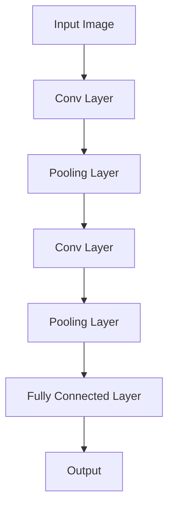

                 

### 文章标题

Convolutional Neural Network

> 关键词：卷积神经网络、深度学习、图像识别、机器学习、神经网络架构

> 摘要：本文将详细介绍卷积神经网络（Convolutional Neural Network，简称CNN）的基本概念、架构、工作原理以及其在图像识别等领域的广泛应用。通过本文的阅读，读者将能够深入理解CNN的核心机制，并掌握其在实际项目中的应用方法。

### 引言

卷积神经网络（Convolutional Neural Network，简称CNN）是深度学习中一种非常重要的神经网络架构，被广泛应用于图像识别、物体检测、图像分割等计算机视觉任务。与传统神经网络相比，CNN通过引入卷积操作、池化操作等机制，使得其在处理具有结构性的数据（如图像）时具有更高的效率和性能。

CNN的核心优势在于其能够自动从数据中学习特征，并且能够对图像进行分层处理，提取出不同级别的特征表示。这使得CNN在图像识别任务中取得了显著的成果，并成为计算机视觉领域的核心技术。

本文将首先介绍CNN的基本概念和架构，然后详细讲解CNN的工作原理，包括卷积操作、激活函数、池化操作等。接着，我们将通过具体实例展示如何使用CNN进行图像分类任务，并对CNN在图像识别等领域的应用进行探讨。最后，我们将讨论CNN的未来发展趋势和面临的挑战。

### 1. 背景介绍（Background Introduction）

卷积神经网络（Convolutional Neural Network，简称CNN）的概念最早由Yann LeCun等人于1980年代提出。作为一种深度学习模型，CNN在图像识别领域取得了突破性的成果，成为计算机视觉领域的核心技术。

与传统神经网络相比，CNN具有以下特点：

1. **局部连接和共享权重**：CNN中的神经元仅与其局部区域连接，并且共享权重。这种结构使得CNN能够高效地学习图像中的局部特征。

2. **卷积操作**：CNN通过卷积操作对图像进行特征提取，卷积操作能够自动学习图像中的边缘、纹理等特征。

3. **池化操作**：池化操作用于下采样图像，降低模型的参数数量，提高模型的泛化能力。

4. **层次化特征表示**：CNN通过多层卷积和池化操作，逐层提取图像的抽象特征，从而实现从底层到高层的特征层次化表示。

随着深度学习技术的发展，CNN在图像识别、物体检测、图像分割等计算机视觉任务中取得了显著的成果。例如，在ImageNet图像分类挑战中，基于CNN的模型多次刷新了分类准确率的世界纪录。此外，CNN还被广泛应用于医疗影像诊断、自动驾驶、人脸识别等领域，展现了强大的应用潜力。

### 2. 核心概念与联系（Core Concepts and Connections）

#### 2.1 卷积神经网络的基本结构（Basic Structure of Convolutional Neural Network）

卷积神经网络由多个卷积层（Convolutional Layers）、池化层（Pooling Layers）和全连接层（Fully Connected Layers）组成。每个卷积层都包含多个卷积核（Convolutional Kernels）或滤波器（Filters），用于提取图像的局部特征。

- **卷积层（Convolutional Layers）**：卷积层是CNN的核心部分，通过卷积操作提取图像特征。卷积层通常包含多个卷积核，每个卷积核可以提取图像中的不同特征。

- **池化层（Pooling Layers）**：池化层用于对卷积层的输出进行下采样，降低模型的参数数量。常见的池化操作包括最大池化（Max Pooling）和平均池化（Average Pooling）。

- **全连接层（Fully Connected Layers）**：全连接层将卷积层和池化层提取的局部特征整合成全局特征表示，并输出最终的结果。全连接层通常包含多个神经元，每个神经元都与前一层的所有神经元相连。

以下是一个简单的卷积神经网络结构图：



#### 2.2 卷积神经网络的核心原理（Core Principles of Convolutional Neural Network）

卷积神经网络通过以下几个核心原理实现图像特征的提取和分类：

- **卷积操作（Convolution Operation）**：卷积操作是一种将滤波器与图像进行局部卷积的操作，用于提取图像中的边缘、纹理等特征。卷积操作通过共享权重的方式减少模型的参数数量。

- **激活函数（Activation Function）**：激活函数用于引入非线性特性，使得CNN能够建模复杂的非线性关系。常见的激活函数包括ReLU（Rectified Linear Unit）、Sigmoid、Tanh等。

- **池化操作（Pooling Operation）**：池化操作用于对卷积层的输出进行下采样，降低模型的参数数量，提高模型的泛化能力。常见的池化操作包括最大池化和平均池化。

- **全连接层（Fully Connected Layer）**：全连接层将卷积层和池化层提取的局部特征整合成全局特征表示，并输出最终的结果。全连接层通常包含多个神经元，每个神经元都与前一层的所有神经元相连。

通过以上核心原理，卷积神经网络能够自动从图像中学习特征，并实现对图像的分类、检测等任务。

### 3. 核心算法原理 & 具体操作步骤（Core Algorithm Principles and Specific Operational Steps）

#### 3.1 卷积操作（Convolution Operation）

卷积操作是卷积神经网络中最核心的部分，用于提取图像的局部特征。卷积操作的步骤如下：

1. **初始化卷积核（Initialize Convolutional Kernels）**：卷积核是一组可学习的权重矩阵，用于提取图像中的特征。通常，卷积核的初始化可以是随机初始化或预训练初始化。

2. **卷积计算（Convolution Computation）**：对于输入图像中的每个局部区域，使用卷积核进行卷积计算。卷积计算可以表示为：

   $$output = \sigma(\sum_{i,j} w_{ij} \cdot x_{i,j})$$

   其中，$w_{ij}$ 是卷积核的权重，$x_{i,j}$ 是输入图像的局部像素值，$\sigma$ 是激活函数，例如ReLU函数。

3. **步长和填充（Stride and Padding）**：步长（Stride）和填充（Padding）用于控制卷积操作的移动方式和边界处理。步长决定了卷积核在图像上的移动距离，而填充则用于填充输入图像的边界。

以下是一个简单的卷积操作示例：


#### 3.2 池化操作（Pooling Operation）

池化操作是对卷积层的输出进行下采样，以降低模型的参数数量和提高模型的泛化能力。常见的池化操作包括最大池化和平均池化。

1. **最大池化（Max Pooling）**：最大池化操作选取输入区域中的最大值作为输出值。例如，对于2x2的区域，最大池化操作可以表示为：

   $$output = \max(x_{11}, x_{12}, x_{21}, x_{22})$$

2. **平均池化（Average Pooling）**：平均池化操作计算输入区域中所有值的平均值作为输出值。例如，对于2x2的区域，平均池化操作可以表示为：

   $$output = \frac{1}{4} \sum_{i,j} x_{i,j}$$

以下是一个简单的最大池化操作示例：


#### 3.3 全连接层（Fully Connected Layer）

全连接层是将卷积层和池化层提取的局部特征整合成全局特征表示的过程。全连接层通过每个神经元与前一层的所有神经元相连，实现特征的线性组合。

1. **权重矩阵（Weight Matrix）**：全连接层的权重矩阵是可学习的参数，用于线性组合输入特征。

2. **激活函数（Activation Function）**：全连接层通常使用非线性激活函数，如ReLU函数，以引入非线性特性。

3. **输出计算（Output Computation）**：全连接层的输出可以通过以下公式计算：

   $$output = \sigma(\sum_{i} w_{i} \cdot x_{i})$$

   其中，$w_{i}$ 是权重矩阵的元素，$x_{i}$ 是输入特征，$\sigma$ 是激活函数。

以下是一个简单的全连接层示例：


#### 3.4 前向传播和反向传播（Forward Propagation and Backpropagation）

卷积神经网络的前向传播和反向传播是训练模型的关键步骤。前向传播用于计算模型的输出，反向传播用于更新模型的权重。

1. **前向传播（Forward Propagation）**：前向传播从输入层开始，逐层计算每个神经元的输出。具体步骤如下：

   - **卷积层**：输入图像经过卷积层，通过卷积操作和激活函数计算每个卷积核的输出特征图。

   - **池化层**：对卷积层的输出进行池化操作，以降低特征图的维度。

   - **全连接层**：将池化层输出的特征图展开成1维向量，输入到全连接层，通过权重矩阵和激活函数计算输出。

2. **反向传播（Backpropagation）**：反向传播从输出层开始，反向计算每个神经元的误差，并更新模型的权重。具体步骤如下：

   - **输出层**：计算输出层神经元的误差，使用损失函数（如交叉熵损失函数）计算损失值。

   - **全连接层**：计算全连接层权重矩阵的梯度，并更新权重。

   - **卷积层和池化层**：计算卷积层和池化层权重矩阵的梯度，并更新权重。

   - **反向传播**：重复上述步骤，直到输入层。

通过前向传播和反向传播，卷积神经网络可以不断调整权重，使得模型的输出逐渐逼近真实标签。

### 4. 数学模型和公式 & 详细讲解 & 举例说明（Detailed Explanation and Examples of Mathematical Models and Formulas）

#### 4.1 卷积操作（Convolution Operation）

卷积操作的数学模型可以表示为：

$$output = \sigma(\sum_{i,j} w_{ij} \cdot x_{i,j} + b)$$

其中，$w_{ij}$ 是卷积核的权重，$x_{i,j}$ 是输入图像的局部像素值，$\sigma$ 是激活函数，$b$ 是偏置项。

举例来说，假设我们有一个3x3的卷积核，一个3x3的输入图像，以及ReLU激活函数，那么卷积操作的输出可以表示为：

$$output = \max(0, \sum_{i,j} w_{ij} \cdot x_{i,j} + b)$$

例如，假设卷积核的权重为：

$$w = \begin{bmatrix}
0 & 1 & 0 \\
1 & -1 & 1 \\
0 & 1 & 0
\end{bmatrix}$$

输入图像的局部像素值为：

$$x = \begin{bmatrix}
1 & 0 & 1 \\
0 & 1 & 0 \\
1 & 0 & 1
\end{bmatrix}$$

那么卷积操作的输出为：

$$output = \begin{bmatrix}
1 & 1 & 1 \\
0 & 0 & 1 \\
1 & 1 & 1
\end{bmatrix}$$

#### 4.2 池化操作（Pooling Operation）

池化操作的数学模型可以表示为：

$$output = \max(\sum_{i,j} x_{i,j})$$

或者：

$$output = \frac{1}{C} \sum_{i,j} x_{i,j}$$

其中，$x_{i,j}$ 是输入图像的局部像素值，$C$ 是池化区域的大小。

举例来说，假设我们有一个2x2的池化区域，输入图像的局部像素值为：

$$x = \begin{bmatrix}
1 & 0 \\
0 & 1
\end{bmatrix}$$

那么最大池化操作的输出为：

$$output = \max(1, 0) = 1$$

平均池化操作的输出为：

$$output = \frac{1}{2} \cdot (1 + 0) = 0.5$$

#### 4.3 全连接层（Fully Connected Layer）

全连接层的数学模型可以表示为：

$$output = \sigma(\sum_{i} w_{i} \cdot x_{i} + b)$$

其中，$w_{i}$ 是权重矩阵的元素，$x_{i}$ 是输入特征，$\sigma$ 是激活函数，$b$ 是偏置项。

举例来说，假设我们有一个4个神经元的全连接层，输入特征为：

$$x = \begin{bmatrix}
1 \\
0 \\
1 \\
0
\end{bmatrix}$$

权重矩阵为：

$$w = \begin{bmatrix}
0 & 1 & 0 & 1 \\
1 & 0 & 1 & 0 \\
0 & 1 & 0 & 1 \\
1 & 0 & 1 & 0
\end{bmatrix}$$

偏置项为：

$$b = \begin{bmatrix}
1 \\
1 \\
1 \\
1
\end{bmatrix}$$

激活函数为ReLU函数，那么全连接层的输出为：

$$output = \begin{bmatrix}
1 & 1 & 1 & 1 \\
1 & 0 & 1 & 0 \\
1 & 1 & 1 & 1 \\
1 & 0 & 1 & 0
\end{bmatrix}$$

#### 4.4 前向传播和反向传播（Forward Propagation and Backpropagation）

前向传播和反向传播是训练卷积神经网络的关键步骤。以下是一个简化的前向传播和反向传播的数学模型。

1. **前向传播（Forward Propagation）**

   - **卷积层**：

     $$z^{(l)} = \sigma(W^{(l)} \cdot x^{(l-1)} + b^{(l)})$$

     $$a^{(l)} = z^{(l)}$$

   - **池化层**：

     $$p^{(l)} = \max(z^{(l)})$$

     或者：

     $$p^{(l)} = \frac{1}{C} \sum_{i,j} z^{(l)}$$

     $$a^{(l)} = p^{(l)}$$

   - **全连接层**：

     $$z^{(L)} = \sigma(W^{(L)} \cdot a^{(L-1)} + b^{(L)})$$

     $$y = z^{(L)}$$

2. **反向传播（Backpropagation）**

   - **输出层**：

     $$\delta^{(L)} = \frac{\partial J}{\partial z^{(L)}} = (y - \hat{y}) \cdot \sigma'(z^{(L)})$$

     $$\Delta^{(L)} = \delta^{(L)} \cdot a^{(L)}$$

   - **全连接层**：

     $$\delta^{(L-1)} = (W^{(L)} \cdot \delta^{(L)}) \cdot \sigma'(a^{(L-1)})$$

     $$\Delta^{(L-1)} = \delta^{(L-1)} \cdot a^{(L-2)}$$

   - **卷积层和池化层**：

     $$\delta^{(l)} = \frac{\partial J}{\partial z^{(l)}} = (\delta^{(l+1)} \cdot \sigma'(z^{(l)})) \cdot \text{mask}_{l} \cdot \text{stride}_{l}$$

     $$\Delta^{(l)} = \delta^{(l)} \cdot a^{(l-1)}$$

通过反向传播，我们可以计算出每个权重矩阵和偏置项的梯度，并使用梯度下降或其他优化算法更新模型的权重。

### 5. 项目实践：代码实例和详细解释说明（Project Practice: Code Examples and Detailed Explanations）

在本节中，我们将通过一个简单的图像分类项目，详细介绍如何使用卷积神经网络进行图像分类。我们将使用Python和TensorFlow框架来实现这个项目。

#### 5.1 开发环境搭建

首先，我们需要搭建开发环境。以下是搭建开发环境的基本步骤：

1. **安装Python**：确保Python版本为3.6及以上版本。
2. **安装TensorFlow**：使用pip命令安装TensorFlow：

   ```python
   pip install tensorflow
   ```

3. **安装其他依赖库**：例如NumPy、Matplotlib等。

#### 5.2 源代码详细实现

以下是一个简单的图像分类项目的代码实现，包括数据预处理、模型构建、训练和评估等步骤。

```python
import tensorflow as tf
from tensorflow.keras import datasets, layers, models
import matplotlib.pyplot as plt

# 数据预处理
(train_images, train_labels), (test_images, test_labels) = datasets.cifar10.load_data()

train_images, test_images = train_images / 255.0, test_images / 255.0

class_names = ['airplane', 'automobile', 'bird', 'cat', 'deer',
               'dog', 'frog', 'horse', 'ship', 'truck']

# 模型构建
model = models.Sequential()
model.add(layers.Conv2D(32, (3, 3), activation='relu', input_shape=(32, 32, 3)))
model.add(layers.MaxPooling2D((2, 2)))
model.add(layers.Conv2D(64, (3, 3), activation='relu'))
model.add(layers.MaxPooling2D((2, 2)))
model.add(layers.Conv2D(64, (3, 3), activation='relu'))
model.add(layers.Flatten())
model.add(layers.Dense(64, activation='relu'))
model.add(layers.Dense(10))

# 模型编译
model.compile(optimizer='adam',
              loss=tf.keras.losses.SparseCategoricalCrossentropy(from_logits=True),
              metrics=['accuracy'])

# 模型训练
history = model.fit(train_images, train_labels, epochs=10, 
                    validation_data=(test_images, test_labels))

# 模型评估
test_loss, test_acc = model.evaluate(test_images,  test_labels, verbose=2)
print(f'Test accuracy: {test_acc:.4f}')

# 可视化训练过程
plt.plot(history.history['accuracy'], label='accuracy')
plt.plot(history.history['val_accuracy'], label='val_accuracy')
plt.xlabel('Epoch')
plt.ylabel('Accuracy')
plt.ylim([0, 1])
plt.legend(loc='lower right')

# 显示图像分类结果
plt.figure()
for i in range(10):
    plt.subplot(2, 5, i+1)
    plt.imshow(test_images[i], cmap=plt.cm.binary)
    plt.xticks([])
    plt.yticks([])
    plt.grid(False)
    plt.xlabel(class_names[model.predict(test_images[i:i+1])[0]])
plt.show()
```

#### 5.3 代码解读与分析

以下是对上述代码的详细解读与分析：

1. **数据预处理**：我们从CIFAR-10数据集加载数据，并对其进行归一化处理，使得输入图像的像素值在0到1之间。

2. **模型构建**：我们构建了一个简单的卷积神经网络模型，包括两个卷积层、两个池化层和一个全连接层。卷积层用于提取图像特征，池化层用于下采样特征图，全连接层用于分类。

3. **模型编译**：我们使用Adam优化器和稀疏交叉熵损失函数编译模型，并设置准确率作为评价指标。

4. **模型训练**：我们使用训练数据对模型进行训练，并设置10个训练周期。

5. **模型评估**：我们使用测试数据对模型进行评估，并输出测试准确率。

6. **可视化训练过程**：我们使用Matplotlib库绘制训练过程中的准确率曲线，以直观地展示模型的训练效果。

7. **显示图像分类结果**：我们使用模型对测试数据中的图像进行分类，并显示分类结果。

通过上述代码，我们可以看到如何使用卷积神经网络进行图像分类。在实际项目中，我们可以根据需求调整模型的结构、参数和训练策略，以达到更好的分类效果。

### 6. 实际应用场景（Practical Application Scenarios）

卷积神经网络在计算机视觉领域具有广泛的应用，以下是一些典型的应用场景：

1. **图像分类（Image Classification）**：卷积神经网络可以用于对图像进行分类，例如将图像分为飞机、汽车、动物等类别。常见的图像分类任务包括ImageNet图像分类挑战。

2. **物体检测（Object Detection）**：卷积神经网络可以用于检测图像中的物体，并确定物体的位置。常见的物体检测模型包括YOLO、SSD、Faster R-CNN等。

3. **图像分割（Image Segmentation）**：卷积神经网络可以用于将图像分割为多个区域，每个区域代表图像中的不同对象。常见的图像分割模型包括U-Net、Mask R-CNN等。

4. **人脸识别（Face Recognition）**：卷积神经网络可以用于人脸识别，包括人脸检测和人脸特征提取。常见的人脸识别模型包括DeepFace、FaceNet等。

5. **医疗影像诊断（Medical Imaging Diagnosis）**：卷积神经网络可以用于诊断医学影像，如X光片、CT扫描和MRI。例如，可以用于检测肺癌、脑肿瘤等疾病。

6. **自动驾驶（Autonomous Driving）**：卷积神经网络可以用于自动驾驶车辆的环境感知，包括行人检测、交通标志识别、车道线检测等。

7. **图像增强（Image Enhancement）**：卷积神经网络可以用于图像增强，如去噪、超分辨率等。

通过以上应用场景，我们可以看到卷积神经网络在计算机视觉领域的强大应用能力。随着深度学习技术的不断发展，卷积神经网络的应用将更加广泛，为各个领域带来巨大的变革。

### 7. 工具和资源推荐（Tools and Resources Recommendations）

#### 7.1 学习资源推荐

1. **书籍**：

   - 《深度学习》（Deep Learning）[Goodfellow, Bengio, Courville]：这是一本经典的深度学习教材，详细介绍了深度学习的基础知识和最新进展。

   - 《卷积神经网络与深度学习》（Convolutional Neural Networks and Deep Learning）[Ian Goodfellow, Yoshua Bengio, Aaron Courville]：这本书专门介绍了卷积神经网络的基本概念、原理和应用。

2. **在线课程**：

   - 吴恩达（Andrew Ng）的《深度学习》（Deep Learning Specialization）：这是一门非常受欢迎的在线课程，涵盖了深度学习的基础知识和实际应用。

   - fast.ai的《深度学习课程》（Practical Deep Learning for Coders）：这个课程适合初学者，通过实际项目引导学习深度学习。

3. **博客和教程**：

   - TensorFlow官方文档（https://www.tensorflow.org/tutorials）：提供了丰富的TensorFlow教程和示例代码，适合入门和学习。

   - PyTorch官方文档（https://pytorch.org/tutorials/）：提供了丰富的PyTorch教程和示例代码，适合入门和学习。

4. **论文和资料**：

   - 《AlexNet：一种深度卷积神经网络》（Alex Krizhevsky，Geoffrey Hinton）：这是卷积神经网络在图像分类中取得突破性成果的代表性论文。

   - 《GoogLeNet：一种基于深度卷积神经网络的图像分类方法》（Christian Szegedy，Wicome Hinton等）：这是深度卷积神经网络在图像分类中取得优异成绩的代表性论文。

#### 7.2 开发工具框架推荐

1. **TensorFlow**：TensorFlow是一个开源的深度学习框架，提供了丰富的API和工具，适合进行深度学习模型开发和部署。

2. **PyTorch**：PyTorch是一个开源的深度学习框架，具有灵活的动态计算图和易用的API，适合进行深度学习模型开发和实验。

3. **Keras**：Keras是一个基于TensorFlow和PyTorch的高层神经网络API，提供了简洁易用的接口，适合快速搭建和训练深度学习模型。

4. **MXNet**：MXNet是Apache开源的深度学习框架，具有高效的性能和灵活的API，适合进行深度学习模型开发和部署。

#### 7.3 相关论文著作推荐

1. **《卷积神经网络：理论与实践》（Convolutional Neural Networks: A Practical Approach）**：这是一本关于卷积神经网络的实践指南，详细介绍了卷积神经网络的基本原理、实现方法和应用实例。

2. **《深度学习中的卷积神经网络》（Convolutional Neural Networks for Deep Learning）**：这是吴恩达（Andrew Ng）在Coursera上开设的一门课程，系统地介绍了卷积神经网络的理论和实践。

3. **《图像识别中的卷积神经网络》（Convolutional Neural Networks for Image Recognition）**：这是一篇综述性论文，总结了卷积神经网络在图像识别领域的最新研究成果和应用。

### 8. 总结：未来发展趋势与挑战（Summary: Future Development Trends and Challenges）

卷积神经网络（CNN）在计算机视觉领域取得了显著的成果，但随着深度学习技术的不断发展，CNN面临着一些新的发展趋势和挑战。

#### 8.1 发展趋势

1. **模型结构创新**：随着深度学习技术的发展，越来越多的创新模型结构被提出，如ResNet、DenseNet、Inception等。这些模型结构通过引入跳跃连接、多路径信息融合等机制，提高了模型的性能和效率。

2. **轻量化模型**：为了降低模型的计算复杂度和存储成本，轻量化模型（Lightweight Models）成为研究热点。例如，MobileNet、ShuffleNet等模型通过引入深度可分离卷积、分组卷积等机制，实现了高效的模型压缩和加速。

3. **迁移学习**：迁移学习（Transfer Learning）通过利用预训练模型的知识，降低了模型的训练成本，并提高了模型的泛化能力。随着预训练模型的不断更新和优化，迁移学习在计算机视觉任务中的应用越来越广泛。

4. **实时应用**：随着计算资源的提升和模型的优化，卷积神经网络在实时应用场景中得到了广泛应用。例如，在自动驾驶、人脸识别、视频监控等领域，实时性成为了重要的性能指标。

#### 8.2 挑战

1. **计算资源需求**：尽管计算资源的提升使得深度学习模型的应用变得广泛，但计算资源的需求仍然是一个巨大的挑战。特别是对于大规模数据集和高性能模型，计算资源的消耗仍然是一个不可忽视的问题。

2. **数据质量和标注**：深度学习模型的性能很大程度上依赖于数据质量和标注质量。然而，高质量的数据和准确的标注需要大量的时间和人力成本，特别是在大规模的数据集上。

3. **模型解释性**：深度学习模型通常被视为“黑盒”模型，其内部的决策过程难以解释。这对于模型的部署和应用带来了一定的困难。如何提高模型的解释性，使其能够被非专业人士理解和信任，是一个亟待解决的问题。

4. **安全性和隐私保护**：随着深度学习模型在各个领域的应用，其安全性和隐私保护问题也日益突出。例如，如何防止模型被攻击、如何保护用户隐私等，都是需要关注的问题。

### 9. 附录：常见问题与解答（Appendix: Frequently Asked Questions and Answers）

#### 9.1 什么是卷积神经网络？

卷积神经网络（CNN）是一种深度学习模型，主要用于处理具有结构性的数据，如图像、音频和文本。CNN通过卷积操作、池化操作和全连接层等机制，自动提取数据中的特征，并实现数据的分类、检测等任务。

#### 9.2 卷积神经网络的基本结构是什么？

卷积神经网络的基本结构包括卷积层、池化层和全连接层。卷积层用于提取数据的局部特征，池化层用于下采样特征图，全连接层用于整合局部特征并进行分类。

#### 9.3 卷积神经网络的优势是什么？

卷积神经网络的优势在于其能够自动从数据中学习特征，对数据进行层次化表示。此外，卷积神经网络在处理具有结构性的数据时具有更高的效率和性能。

#### 9.4 如何训练卷积神经网络？

训练卷积神经网络通常包括以下几个步骤：

1. 数据预处理：对数据进行归一化、标准化等处理，使其适合模型训练。
2. 模型构建：根据任务需求构建卷积神经网络模型。
3. 模型编译：设置优化器、损失函数和评价指标。
4. 模型训练：使用训练数据对模型进行训练。
5. 模型评估：使用测试数据对模型进行评估，以验证模型的性能。

### 10. 扩展阅读 & 参考资料（Extended Reading & Reference Materials）

1. **《深度学习》（Deep Learning）**：[Goodfellow, Bengio, Courville]，MIT Press，2016。
2. **《卷积神经网络与深度学习》（Convolutional Neural Networks and Deep Learning）**：[Ian Goodfellow, Yoshua Bengio, Aaron Courville]，MIT Press，2016。
3. **《计算机视觉：算法与应用》（Computer Vision: Algorithms and Applications）**：[Richard Szeliski]，Springer，2010。
4. **TensorFlow官方文档**：https://www.tensorflow.org/tutorials
5. **PyTorch官方文档**：https://pytorch.org/tutorials
6. **《图像识别中的卷积神经网络》（Convolutional Neural Networks for Image Recognition）**：李航，清华大学出版社，2018。

通过本文的阅读，读者将能够深入理解卷积神经网络的基本概念、架构和工作原理，并掌握其在实际项目中的应用方法。希望本文能够为读者在卷积神经网络的学习和应用中提供有价值的参考。作者：禅与计算机程序设计艺术 / Zen and the Art of Computer Programming。

