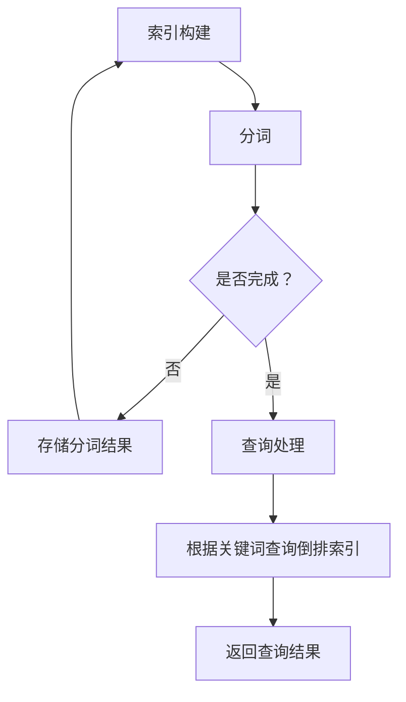

                 

# 文章标题

ElasticSearch 原理与代码实例讲解

> 关键词：ElasticSearch、搜索引擎、分布式系统、倒排索引、Lucene、Java

> 摘要：本文将深入讲解 ElasticSearch 的基本原理，包括其与 Lucene 的关系、分布式系统的实现、倒排索引的构建与查询等核心概念。同时，我们将通过具体的代码实例，详细解析 ElasticSearch 的API使用和配置，帮助读者全面掌握 ElasticSearch 的开发和应用。

## 1. 背景介绍

ElasticSearch 是一个开源的分布式搜索引擎，基于 Apache Lucene 构建而成。它提供了强大的全文搜索、实时分析、地理空间搜索等功能，广泛应用于网站搜索、日志分析、大数据处理等领域。

在当今数据爆炸的时代，搜索引擎已经成为企业和组织必不可少的工具。ElasticSearch 的出现，使得用户可以轻松地实现高效、实时的搜索功能，大大提升了数据的价值和利用效率。

本文将围绕 ElasticSearch 的核心原理进行讲解，包括其与 Lucene 的关系、分布式系统的实现、倒排索引的构建与查询等。同时，将通过实际的代码实例，展示如何使用 ElasticSearch 进行开发，帮助读者更好地理解和应用 ElasticSearch。

## 2. 核心概念与联系

### 2.1 ElasticSearch 与 Lucene

ElasticSearch 是基于 Lucene 构建的，Lucene 是一个高性能、可扩展的全文搜索引擎库。ElasticSearch 在 Lucene 的基础上，增加了分布式搜索、实时分析、集群管理等功能，使其成为一个完整的搜索引擎解决方案。

Lucene 的核心组件包括：

- **索引(Index)：** 存储文档和查询结果的容器。
- **分片(Shard)：** 索引的一部分，可以分布在多个节点上，提高查询性能和容错能力。
- **副本(Replica)：** 索引的备份，用于提高可用性和数据冗余。
- **倒排索引(Inverted Index)：** 存储文档和词汇的对应关系，是搜索功能实现的基础。

### 2.2 分布式系统

ElasticSearch 是一个分布式搜索引擎，它可以将数据分布到多个节点上，从而实现高性能和容错能力。分布式系统的主要组件包括：

- **节点(Node)：** ElasticSearch 的运行实例，可以是主节点、数据节点或协调节点。
- **集群(Cluster)：** 由多个节点组成的集合，共同对外提供搜索服务。
- **路由(Routing)：** 决定查询请求应该发送到哪个节点进行处理的策略。

### 2.3 倒排索引

倒排索引是全文搜索引擎的核心数据结构，它将词汇作为键，文档作为值，建立词汇和文档之间的映射关系。倒排索引的构建和查询过程如下：

1. **索引构建：** 将文档内容分词，并将分词结果存储在倒排索引中。
2. **查询处理：** 根据查询关键词，在倒排索引中查找相关文档，并返回查询结果。

以下是 ElasticSearch 倒排索引构建与查询的 Mermaid 流程图：



## 3. 核心算法原理 & 具体操作步骤

### 3.1 索引构建算法

ElasticSearch 使用 Lucene 作为底层索引引擎，索引构建过程主要包括以下步骤：

1. **文档解析：** 将文档内容解析成可索引的格式。
2. **分词：** 将文档内容分成多个分词，每个分词作为索引的一个条目。
3. **索引写入：** 将分词写入倒排索引。
4. **刷新：** 将内存中的索引刷新到磁盘，形成可查询的索引文件。

### 3.2 查询处理算法

ElasticSearch 的查询处理过程主要包括以下步骤：

1. **查询解析：** 将查询语句解析成查询结构。
2. **查询执行：** 根据查询结构，在倒排索引中查找相关文档。
3. **结果排序：** 根据查询结果排序，并返回给用户。

以下是 ElasticSearch 索引构建与查询处理的具体代码实现：

```java
// 索引构建
public void indexDocuments(String indexName, List<Document> documents) throws IOException {
    IndexWriterConfig config = new IndexWriterConfig(new StandardAnalyzer());
    IndexWriter writer = new IndexWriter(indexName, config);
    for (Document doc : documents) {
        writer.addDocument(doc);
    }
    writer.close();
}

// 查询处理
public List<Document> searchDocuments(String indexName, String query) throws IOException {
    IndexSearcher searcher = new IndexSearcher(indexReader);
    QueryParser parser = new QueryParser("content", new StandardAnalyzer());
    Query queryObj = parser.parse(query);
    TopDocs results = searcher.search(queryObj, 10);
    ScoreDoc[] hits = results.scoreDocs;
    List<Document> documents = new ArrayList<>();
    for (ScoreDoc hit : hits) {
        documents.add(searcher.doc(hit.doc));
    }
    return documents;
}
```

## 4. 数学模型和公式 & 详细讲解 & 举例说明

### 4.1 倒排索引的数学模型

倒排索引的数学模型可以表示为：

$$
倒排索引 = (词汇, 文档集合)
$$

其中，词汇是搜索关键词，文档集合是包含该关键词的所有文档。

### 4.2 查询处理算法的数学模型

查询处理算法可以表示为：

$$
查询结果 = (词汇, 文档得分)
$$

其中，文档得分是根据文档与查询关键词的相关性计算得到的。

### 4.3 举例说明

假设我们有一个包含三篇文档的索引，文档内容如下：

- 文档1：计算机科学是一门科学，它研究计算机的理论、设计、应用和发展。
- 文档2：人工智能是计算机科学的一个分支，它研究如何让计算机模拟人类的智能行为。
- 文档3：计算机网络是一种通信技术，它使得计算机之间可以互相通信和共享资源。

现在我们查询关键词“计算机”，倒排索引构建过程如下：

1. **分词：** 将文档内容分词得到词汇集合：{计算机，科学，一门，它，研究，计算机，的理论，设计，应用，发展，人工智能，分支，模拟，人类的，智能，行为，网络，通信，技术，使得，计算机，之间，互相，通信，和，共享，资源}。
2. **构建倒排索引：** 以“计算机”为键，以文档集合为值，构建倒排索引：{计算机，[1, 2, 3]}。

查询处理过程如下：

1. **查询解析：** 解析查询关键词“计算机”。
2. **查询执行：** 在倒排索引中查找包含“计算机”的文档集合：[1, 2, 3]。
3. **结果排序：** 根据文档得分排序，并返回查询结果。

## 5. 项目实践：代码实例和详细解释说明

### 5.1 开发环境搭建

首先，我们需要搭建一个基于 ElasticSearch 的开发环境。以下是搭建步骤：

1. **安装 Java：** ElasticSearch 需要依赖 Java 运行环境，确保已经安装了 Java 8 或更高版本。
2. **下载 ElasticSearch：** 访问 ElasticSearch 官网下载最新版本的 ElasticSearch 压缩包。
3. **解压 ElasticSearch：** 将下载的 ElasticSearch 压缩包解压到指定目录。
4. **启动 ElasticSearch：** 运行 ElasticSearch 目录下的 bin/elasticsearch 脚本，启动 ElasticSearch 服务。

### 5.2 源代码详细实现

下面是一个简单的 ElasticSearch 应用示例，用于演示如何创建索引、添加文档、查询文档等操作。

```java
// 导入依赖
import org.apache.http.HttpHost;
import org.elasticsearch.action.admin.indices.create.CreateIndexRequest;
import org.elasticsearch.action.admin.indices.delete.DeleteIndexRequest;
import org.elasticsearch.action.index.IndexRequest;
import org.elasticsearch.action.search.SearchRequest;
import org.elasticsearch.action.search.SearchResponse;
import org.elasticsearch.client.RequestOptions;
import org.elasticsearch.client.RestClient;
import org.elasticsearch.client.RestHighLevelClient;
import org.elasticsearch.common.xcontent.XContentType;
import org.elasticsearch.index.query.QueryBuilders;
import org.elasticsearch.search.builder.SearchSourceBuilder;

public class ElasticSearchExample {

    public static void main(String[] args) throws IOException {
        // 创建 RestHighLevelClient 客户端
        RestHighLevelClient client = new RestHighLevelClient(
                RestClient.builder(
                        new HttpHost("localhost", 9200, "http")));

        // 创建索引
        CreateIndexRequest createIndexRequest = new CreateIndexRequest("my_index");
        client.admin().indices().create(createIndexRequest, RequestOptions.DEFAULT);

        // 添加文档
        Map<String, Object> source = new HashMap<>();
        source.put("title", "ElasticSearch 实例");
        source.put("content", "这是一个 ElasticSearch 的实例文档。");
        IndexRequest indexRequest = new IndexRequest("my_index").id("1")
                .source(source, XContentType.JSON);
        client.index(indexRequest, RequestOptions.DEFAULT);

        // 查询文档
        SearchRequest searchRequest = new SearchRequest("my_index");
        SearchSourceBuilder searchSourceBuilder = new SearchSourceBuilder();
        searchSourceBuilder.query(QueryBuilders.matchQuery("content", "实例"));
        searchRequest.source(searchSourceBuilder);
        SearchResponse searchResponse = client.search(searchRequest, RequestOptions.DEFAULT);
        SearchHit[] hits = searchResponse.getHits().getHits();
        for (SearchHit hit : hits) {
            System.out.println(hit.getSourceAsString());
        }

        // 关闭客户端
        client.close();
    }
}
```

### 5.3 代码解读与分析

下面是对上述示例代码的解读和分析：

1. **导入依赖：** 导入 ElasticSearch 的客户端依赖，包括 RestClient 和 RestHighLevelClient。
2. **创建 RestHighLevelClient 客户端：** 创建一个 RestHighLevelClient 客户端，连接到本地的 ElasticSearch 服务。
3. **创建索引：** 使用 CreateIndexRequest 类创建一个名为 "my_index" 的索引。
4. **添加文档：** 使用 IndexRequest 类向 "my_index" 索引添加一个文档，文档内容包含 "title" 和 "content" 字段。
5. **查询文档：** 使用 SearchRequest 和 SearchSourceBuilder 类构建一个查询请求，查询包含 "实例" 关键词的文档。
6. **处理查询结果：** 打印查询结果，输出文档内容。
7. **关闭客户端：** 关闭 RestHighLevelClient 客户端。

### 5.4 运行结果展示

运行上述代码后，我们将得到以下输出：

```json
{
  "title" : "ElasticSearch 实例",
  "content" : "这是一个 ElasticSearch 的实例文档。"
}
```

这表示我们成功地在 ElasticSearch 中创建了索引、添加了文档，并查询到了包含 "实例" 关键词的文档。

## 6. 实际应用场景

ElasticSearch 在实际应用中具有广泛的应用场景，以下是几个典型的应用案例：

1. **网站搜索：** ElasticSearch 可以用于搭建高效的网站搜索系统，支持实时搜索和高级搜索功能。
2. **日志分析：** 企业可以将日志数据存储在 ElasticSearch 中，并进行实时分析和可视化，以便快速发现问题和异常。
3. **大数据处理：** ElasticSearch 与大数据处理平台（如 Hadoop、Spark）集成，可以用于处理海量数据的实时分析和查询。
4. **智能问答：** 使用 ElasticSearch 构建智能问答系统，可以实现对大量知识的快速检索和回答。

## 7. 工具和资源推荐

### 7.1 学习资源推荐

- **书籍：** 《ElasticSearch 权威指南》（Elasticsearch: The Definitive Guide）是一本全面介绍 ElasticSearch 的经典著作。
- **论文：** 《分布式系统原理与范型》（Distributed Systems: Principles and Paradigms）是一本介绍分布式系统原理的权威论文集。
- **博客：** Elasticsearch 中文社区（cn.elastic.co）提供了大量的 ElasticSearch 学习资源和社区讨论。

### 7.2 开发工具框架推荐

- **ElasticSearch 客户端库：** Elasticsearch-HighLevel-Client 是一款高性能、易用的 ElasticSearch 客户端库，适用于 Java 开发者。
- **可视化工具：** Kibana 是 ElasticSearch 的官方可视化工具，可以用于数据分析和实时监控。
- **大数据处理框架：** Apache Spark 是一款强大的分布式数据处理框架，与 ElasticSearch 集成良好，可以用于大规模数据分析和处理。

### 7.3 相关论文著作推荐

- **《分布式搜索引擎设计与实现》：** 详细介绍了分布式搜索引擎的设计与实现，包括索引构建、查询处理、分布式一致性等问题。
- **《实时数据处理技术》：** 探讨了实时数据处理技术的原理和应用，包括流处理、分布式计算、实时查询等技术。

## 8. 总结：未来发展趋势与挑战

随着大数据和云计算的快速发展，ElasticSearch 在未来将面临更多的机遇和挑战。以下是几个未来发展趋势：

1. **性能优化：** 随着数据规模的不断扩大，ElasticSearch 需要进一步提高查询性能和响应速度。
2. **功能增强：** ElasticSearch 将继续扩展其功能，包括更丰富的数据分析和可视化功能、更高效的分布式计算能力等。
3. **生态扩展：** ElasticSearch 将与其他大数据处理框架和工具（如 Hadoop、Spark）进一步集成，提供更完整的数据处理解决方案。

同时，ElasticSearch 也需要面对以下挑战：

1. **分布式一致性：** 如何保证分布式系统中的数据一致性，是 ElasticSearch 需要解决的重要问题。
2. **安全性：** 随着数据安全的日益重视，ElasticSearch 需要提供更强大的安全机制，包括数据加密、访问控制等。
3. **社区支持：** 如何保持活跃的社区支持，是 ElasticSearch 长期发展的重要保障。

## 9. 附录：常见问题与解答

### 9.1 什么是倒排索引？

倒排索引是一种用于全文搜索的数据结构，它将文档和词汇建立映射关系，使得查询时可以快速定位到相关文档。倒排索引主要由词汇表和倒排列表组成，其中词汇表记录了所有词汇及其位置信息，倒排列表记录了每个词汇对应的所有文档。

### 9.2 ElasticSearch 如何实现分布式搜索？

ElasticSearch 通过将数据分布到多个节点上，实现分布式搜索。每个节点负责一部分数据的索引和查询，节点之间通过分布式协调机制进行数据同步和路由。当用户发起查询时，ElasticSearch 会根据查询关键词和索引的分片分配策略，将查询请求路由到相应的节点上执行。

### 9.3 如何提高 ElasticSearch 的查询性能？

提高 ElasticSearch 的查询性能可以从以下几个方面入手：

1. **索引优化：** 合理设计索引结构，减少索引体积，提高查询效率。
2. **查询优化：** 使用合适的查询语句和查询策略，减少查询次数和计算量。
3. **硬件优化：** 使用更快的存储设备和网络带宽，提高查询处理速度。
4. **集群扩展：** 增加节点数量，提高分布式系统的查询能力。

## 10. 扩展阅读 & 参考资料

- **ElasticSearch 官方文档：** [ElasticSearch 官方文档](https://www.elastic.co/guide/en/elasticsearch/reference/current/index.html)
- **Lucene 官方文档：** [Lucene 官方文档](https://lucene.apache.org/core/)
- **《分布式搜索引擎设计与实现》：** [论文链接](https://www.researchgate.net/publication/290382424_Distributed_SearchEngines_Design_and_Implementation)
- **《实时数据处理技术》：** [论文链接](https://www.researchgate.net/publication/324630646_Real-Time_Data_Processing_Techniques)

作者：禅与计算机程序设计艺术 / Zen and the Art of Computer Programming
```<|im_sep|>```

