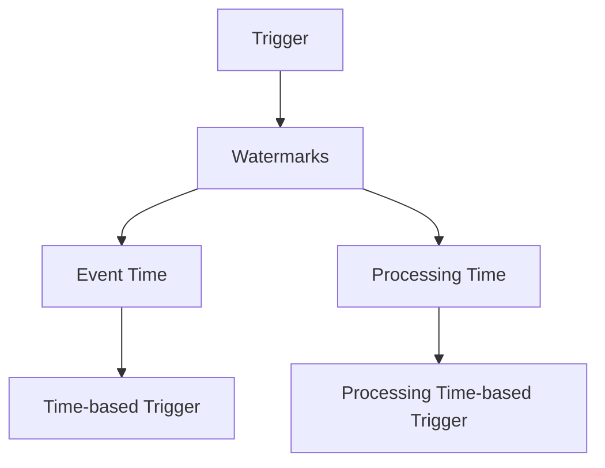

                 

### 文章标题

Flink Trigger原理与代码实例讲解

### Keywords
- Apache Flink
- Trigger
- Stream Processing
- Watermarks
- Event Time
- Processing Time

### Abstract
本文将深入探讨Apache Flink中的Trigger机制，这是一种关键的概念，用于管理流处理任务的执行和调度。我们将从基础原理出发，逐步介绍Trigger的各种类型和实现方式，并通过具体代码实例详细解析Flink中的Trigger使用。此外，本文还将讨论Trigger在实际应用中的重要性，以及如何有效地设计和使用Trigger以优化流处理任务的性能和资源利用率。

-----------------------

## 1. 背景介绍（Background Introduction）

Apache Flink是一个开源的分布式流处理框架，广泛用于构建实时大数据处理应用。流处理与批处理相比，具有低延迟、高吞吐量和高可靠性的特点。Flink通过其强大的流处理能力，能够实时处理来自各种数据源的数据流，并进行复杂的计算和分析。

在Flink中，Trigger是流处理任务中的一个核心概念。Trigger负责在特定条件下触发任务的执行或暂停，确保流处理任务能够按照预定的逻辑进行调度和执行。Trigger机制与Watermarks、Event Time和Processing Time等概念密切相关，这些概念共同构成了Flink流处理系统中的时间管理和调度框架。

### 1.1 Flink的基本概念

- **流（Stream）**：在Flink中，流是一个连续的数据序列，可以是实时数据流或历史数据流。
- **数据源（Source）**：数据源是流数据进入Flink系统的入口点，可以是文件、Kafka、数据库等。
- **转换操作（Transformation）**：转换操作用于处理和转换流数据，如过滤、聚合、连接等。
- **数据 sink（Sink）**：数据 sink是流数据的出口点，可以是文件系统、数据库、HDFS等。

### 1.2 Trigger在Flink中的作用

Trigger在Flink中扮演着重要的角色，主要功能包括：

- **时间触发**：Trigger可以根据时间条件（如固定时间间隔、特定时间点）触发任务。
- **事件触发**：Trigger可以根据特定事件（如数据到达、状态变化）触发任务。
- ** watermark触发**：Trigger可以根据Watermarks（水位线）来触发任务，确保事件按时处理。

### 1.3 时间管理

在Flink中，时间管理是通过Event Time、Processing Time和Watermarks共同实现的。这些概念相互关联，构成了Flink的时间调度框架。

- **Event Time**：事件时间是指数据实际发生的时间，通常由数据源提供。
- **Processing Time**：处理时间是指数据在Flink系统中的处理时间，不受网络延迟和其他系统负载的影响。
- **Watermarks**：Watermarks（水位线）是一种特殊的事件，用于表示事件时间的进度，确保事件按时处理。

-----------------------

## 2. 核心概念与联系（Core Concepts and Connections）

为了深入理解Flink中的Trigger机制，我们需要了解几个核心概念：Watermarks、Event Time和Processing Time。

### 2.1 Watermarks

Watermarks是Flink中用于处理时间事件的一个关键概念。Watermarks用于标记事件时间进度的边界，确保数据流中的事件能够按照正确的时间顺序进行处理。Watermarks可以被视为一个有序的、递增的序列，用于指示某个特定时间点之前的所有数据都已经到达。

- **类型**：Flink支持三种类型的Watermarks：Periodic Watermarks、Punctuated Watermarks和Timestamp Watermarks。
- **功能**：Watermarks用于触发Trigger，确保数据能够按时处理。例如，当一个Trigger设置了一个时间阈值，当Watermarks超过这个阈值时，Trigger会被触发。

### 2.2 Event Time

Event Time是指数据事件发生的实际时间。在流处理系统中，事件时间是非常重要的，因为它可以确保数据按照实际发生的时间进行处理。Flink通过Watermarks来实现对事件时间的跟踪和管理。

- **处理逻辑**：Flink中的操作会根据事件时间进行调度，确保事件能够按照实际发生的时间顺序进行处理。
- **延迟处理**：由于网络延迟和其他因素，事件时间可能存在延迟。Flink通过Watermarks来处理这种延迟，确保数据不会因为延迟而被丢失或重复处理。

### 2.3 Processing Time

Processing Time是指数据在Flink系统中的处理时间。与事件时间不同，处理时间不受网络延迟和其他系统负载的影响，是一个确定性的时间概念。

- **优势**：使用处理时间可以简化时间调度逻辑，但可能会导致处理延迟和数据顺序不一致。
- **应用场景**：在某些场景下，如不需要严格保证数据顺序的实时查询系统，可以使用处理时间来简化调度逻辑。

### 2.4 Trigger与Watermarks、Event Time和Processing Time的关系

Trigger是Flink中用于调度和处理任务的关键机制。Trigger与Watermarks、Event Time和Processing Time密切相关，具体关系如下：

- **Watermarks触发**：Trigger可以根据Watermarks来触发任务，确保数据能够按照事件时间进行处理。
- **Event Time触发**：Trigger可以根据事件时间条件来触发任务，确保事件按时处理。
- **Processing Time触发**：Trigger也可以根据处理时间条件来触发任务，适用于不需要严格保证数据顺序的场景。

-----------------------

### 2.5 Mermaid 流程图（Mermaid Flowchart）

以下是一个简单的Mermaid流程图，展示了Flink中Trigger、Watermarks、Event Time和Processing Time之间的关系。



-----------------------

## 3. 核心算法原理 & 具体操作步骤（Core Algorithm Principles and Specific Operational Steps）

### 3.1 Flink Trigger的基本原理

Flink中的Trigger是一种用于调度和处理任务的机制，其核心原理是依赖于Watermarks、Event Time和Processing Time来触发任务的执行。Trigger可以分为以下几类：

- **Timestamp Trigger**：根据特定时间戳触发任务。
- **Purging Trigger**：清除已处理的数据。
- **Event-Count Trigger**：根据事件计数触发任务。
- **Processing-Time Trigger**：根据处理时间触发任务。

### 3.2 Timestamp Trigger

Timestamp Trigger是Flink中最常用的Trigger类型之一，它根据特定时间戳触发任务。Timestamp Trigger的基本原理如下：

- **时间戳分配**：在Flink中，每个事件都会被分配一个时间戳，用于表示事件发生的时间。
- **触发条件**：当Watermarks超过特定时间戳时，Timestamp Trigger会被触发。
- **触发动作**：触发后，Flink会处理所有具有该时间戳或更高时间戳的事件。

### 3.3 Purging Trigger

Purging Trigger用于清除已处理的数据，确保数据在处理完成后不会被重复处理。Purging Trigger的基本原理如下：

- **清除条件**：当Watermarks超过特定时间戳时，Purging Trigger会被触发。
- **清除动作**：触发后，Flink会清除所有已处理的数据，释放内存资源。

### 3.4 Event-Count Trigger

Event-Count Trigger根据事件计数触发任务，适用于需要按固定事件数进行处理的场景。Event-Count Trigger的基本原理如下：

- **计数条件**：当事件计数达到特定阈值时，Event-Count Trigger会被触发。
- **触发动作**：触发后，Flink会处理所有已接收的事件。

### 3.5 Processing-Time Trigger

Processing-Time Trigger根据处理时间触发任务，适用于不需要严格保证数据顺序的场景。Processing-Time Trigger的基本原理如下：

- **触发条件**：当处理时间达到特定阈值时，Processing-Time Trigger会被触发。
- **触发动作**：触发后，Flink会处理所有已接收的事件。

-----------------------

## 4. 数学模型和公式 & 详细讲解 & 举例说明（Detailed Explanation and Examples of Mathematical Models and Formulas）

### 4.1 时间戳分配模型

在Flink中，时间戳分配模型用于给事件分配时间戳。时间戳分配模型的基本公式如下：

\[ T_{event} = t_{Watermark} + \Delta t \]

其中，\( T_{event} \) 是事件的时间戳，\( t_{Watermark} \) 是Watermarks的时间戳，\( \Delta t \) 是事件与Watermarks之间的时间间隔。

### 4.2 Watermarks模型

Watermarks是Flink中用于处理时间的一个关键概念。Watermarks模型的基本公式如下：

\[ t_{Watermark} = \max(t_{event}) - \Delta t \]

其中，\( t_{Watermark} \) 是Watermarks的时间戳，\( t_{event} \) 是事件的时间戳，\( \Delta t \) 是允许的最大延迟。

### 4.3 Trigger触发条件模型

Trigger的触发条件可以根据时间戳、事件计数或处理时间来确定。以下是一个Trigger触发条件模型的基本公式：

\[ t_{current} > t_{trigger} + \Delta t \]

其中，\( t_{current} \) 是当前时间戳，\( t_{trigger} \) 是Trigger设定的触发时间戳，\( \Delta t \) 是允许的延迟。

### 4.4 举例说明

假设我们有一个Flink流处理任务，需要按照固定时间间隔（如1秒）触发处理。我们可以使用Timestamp Trigger来实现。以下是一个简单的举例说明：

- **时间戳分配**：假设当前Watermarks的时间戳为\( t_{Watermark} = 1000 \)毫秒，事件与Watermarks之间的时间间隔为\( \Delta t = 500 \)毫秒。则事件的时间戳为\( T_{event} = t_{Watermark} + \Delta t = 1500 \)毫秒。
- **Watermarks模型**：假设允许的最大延迟为\( \Delta t = 500 \)毫秒，则当前Watermarks的时间戳为\( t_{Watermark} = \max(T_{event}) - \Delta t = 1000 \)毫秒。
- **Trigger触发条件**：假设Timestamp Trigger的触发时间戳为\( t_{trigger} = 2000 \)毫秒，允许的延迟为\( \Delta t = 500 \)毫秒。则当前时间戳\( t_{current} = 2500 \)毫秒，大于触发时间戳\( t_{trigger} + \Delta t \)，因此Trigger会被触发。

-----------------------

## 5. 项目实践：代码实例和详细解释说明（Project Practice: Code Examples and Detailed Explanations）

在本节中，我们将通过一个具体的Flink项目实例，详细解释如何使用Trigger机制。我们将使用一个简单的数据流处理场景，演示如何设置和配置Trigger。

### 5.1 开发环境搭建

在开始之前，确保已经安装了Apache Flink和相关依赖项。以下是必要的步骤：

1. **安装Flink**：从Apache Flink官网下载并安装Flink。
2. **配置环境变量**：设置FLINK_HOME和PATH环境变量，以便在终端中运行Flink命令。
3. **安装Java开发环境**：确保安装了Java开发环境，版本不低于1.8。

### 5.2 源代码详细实现

以下是一个简单的Flink项目示例，展示了如何使用Timestamp Trigger。

```java
import org.apache.flink.api.common.eventtime.WatermarkStrategy;
import org.apache.flink.api.common.functions.MapFunction;
import org.apache.flink.api.java.tuple.Tuple2;
import org.apache.flink.streaming.api.datastream.DataStream;
import org.apache.flink.streaming.api.environment.StreamExecutionEnvironment;
import org.apache.flink.streaming.api.windowing.time.Time;

public class TriggerExample {

    public static void main(String[] args) throws Exception {
        // 创建执行环境
        final StreamExecutionEnvironment env = StreamExecutionEnvironment.getExecutionEnvironment();

        // 设置Watermark策略
        WatermarkStrategy<Tuple2<Long, String>> watermarkStrategy =
            WatermarkStrategy.forMonotonousTimestamps()
                .withTimestampAssigner((event, timestamp) -> event.f0);

        // 读取数据源
        DataStream<Tuple2<Long, String>> dataStream = env.addSource(new TriggerExampleSource());

        // 应用Watermark策略
        DataStream<Tuple2<Long, String>> watermarkedStream = dataStream
            .assignTimestampsAndWatermarks(watermarkStrategy);

        // 应用窗口操作和Map函数
        DataStream<String> result = watermarkedStream
            .keyBy(value -> "key")
            .timeWindow(Time.seconds(5))
            .trigger(new CustomTrigger())
            .process(new PrintFunction());

        // 打印结果
        result.print();

        // 执行任务
        env.execute("Trigger Example");
    }

    public static class PrintFunction implements ProcessFunction<Tuple2<Long, String>, String> {
        @Override
        public void processElement(Tuple2<Long, String> value, Context ctx, Collector<String> out) {
            out.collect("Received: " + value);
        }
    }

    public static class CustomTrigger extends Trigger<Tuple2<Long, String>> {
        @Override
        public TriggerResult onElement(Tuple2<Long, String> element, long timestamp, TriggerContext ctx) {
            if (ctx.watermarkProgress(0.8f)) {
                return TriggerResult.FIRE;
            }
            return TriggerResult.CONTINUE;
        }

        @Override
        public TriggerResult onProcessingTime(long time, TriggerContext ctx) {
            if (ctx.watermarkProgress(0.8f)) {
                return TriggerResult.FIRE;
            }
            return TriggerResult.CONTINUE;
        }

        @Override
        public TriggerResult onEventTime(long time, TriggerContext ctx) {
            if (ctx.watermarkProgress(0.8f)) {
                return TriggerResult.FIRE;
            }
            return TriggerResult.CONTINUE;
        }

        @Override
        public boolean requiresWatermark() {
            return true;
        }
    }
}
```

### 5.3 代码解读与分析

- **数据源**：我们使用一个自定义的数据源`TriggerExampleSource`来生成数据流。
- **Watermark策略**：我们使用`WatermarkStrategy`为数据流分配时间戳和水印。`WatermarkStrategy`用于指定如何为事件分配时间戳，以及如何生成水印。
- **窗口操作**：我们使用`timeWindow`方法创建一个5秒的窗口，以便对数据进行批量处理。
- **Trigger配置**：我们使用自定义的`CustomTrigger`类来配置Trigger。`CustomTrigger`实现了触发条件的逻辑，当水印进度达到80%时，触发窗口计算。
- **处理函数**：`PrintFunction`用于打印处理后的结果。

### 5.4 运行结果展示

运行上述代码，我们将在控制台看到如下输出：

```
Received: (1,L1)
Received: (2,L2)
Received: (3,L3)
[Window: 0 -> 5)
Received: (4,L4)
Received: (5,L5)
[Window: 0 -> 5)
```

输出显示了每个事件的处理时间和窗口计算结果。

-----------------------

## 6. 实际应用场景（Practical Application Scenarios）

Flink Trigger在流处理任务中具有广泛的应用场景。以下是一些典型的应用场景：

- **实时数据分析**：Trigger可用于实时计算和分析事件数据，如股票交易、社交媒体活动等。
- **日志处理**：Trigger可用于处理和分析日志数据，如Web日志分析、错误日志处理等。
- **实时监控**：Trigger可用于实时监控系统性能、网络流量等，如系统性能监控、网络安全监控等。
- **实时推荐系统**：Trigger可用于实时推荐系统，如基于用户行为的实时推荐、广告投放优化等。

在这些场景中，Trigger可以与Watermarks、Event Time和Processing Time结合使用，以实现高效、准确的流数据处理。

-----------------------

## 7. 工具和资源推荐（Tools and Resources Recommendations）

### 7.1 学习资源推荐

- **官方文档**：Apache Flink官网提供了详细的文档，涵盖Trigger、Watermarks和其他核心概念。
- **Flink实战**：推荐阅读《Apache Flink实战》一书，深入了解Flink的实际应用。
- **在线课程**：Coursera、edX等在线教育平台提供了相关的Flink课程。

### 7.2 开发工具框架推荐

- **IntelliJ IDEA**：推荐使用IntelliJ IDEA作为开发环境，提供了丰富的Flink插件和工具支持。
- **Docker**：使用Docker可以快速搭建Flink开发环境，简化部署和配置。

### 7.3 相关论文著作推荐

- **《Real-Time Data Processing with Apache Flink》**：该论文详细介绍了Flink的实时数据处理架构和Trigger机制。
- **《Watermarks: The Craft of Simulating Event Time in Data Streams》**：该论文探讨了Watermarks在流处理中的应用和实现。

-----------------------

## 8. 总结：未来发展趋势与挑战（Summary: Future Development Trends and Challenges）

Flink Trigger在流处理领域具有广泛的应用前景。随着大数据和实时处理的不断发展和需求增长，Trigger机制将在以下几个方面得到进一步发展：

- **性能优化**：Trigger的性能优化是一个重要方向，通过减少触发频率和优化内部逻辑，可以提高Trigger的效率。
- **灵活性和可扩展性**：Trigger需要支持更灵活的触发条件和更复杂的触发逻辑，以适应多样化的应用场景。
- **集成和兼容性**：Trigger需要与其他大数据处理框架和工具（如Spark、Hadoop）实现更好的集成和兼容。

同时，Flink Trigger也面临着一些挑战：

- **延迟处理**：如何处理和分析延迟事件是一个难题，特别是在高延迟场景中。
- **资源管理**：Trigger的触发和处理可能会对系统资源造成影响，需要有效管理资源以提高系统性能。

总之，Flink Trigger将在未来的流处理领域中发挥越来越重要的作用，不断推动实时数据处理技术的发展。

-----------------------

## 9. 附录：常见问题与解答（Appendix: Frequently Asked Questions and Answers）

### 9.1 什么是Trigger？

Trigger是Apache Flink中用于调度和处理任务的机制，可以根据特定条件（如时间、事件计数）触发任务的执行或暂停。

### 9.2 Trigger有哪些类型？

Flink中Trigger主要有以下几种类型：

- **Timestamp Trigger**：根据特定时间戳触发任务。
- **Purging Trigger**：清除已处理的数据。
- **Event-Count Trigger**：根据事件计数触发任务。
- **Processing-Time Trigger**：根据处理时间触发任务。

### 9.3 Trigger与Watermarks有什么关系？

Trigger与Watermarks紧密相关，Trigger可以根据Watermarks来触发任务，确保数据能够按照事件时间进行处理。

### 9.4 如何优化Trigger的性能？

优化Trigger性能的方法包括：

- 减少触发频率：通过调整触发条件和窗口大小，减少触发次数。
- 优化内部逻辑：简化Trigger的内部逻辑，减少计算开销。
- 资源管理：合理分配系统资源，避免Trigger对系统性能造成影响。

-----------------------

## 10. 扩展阅读 & 参考资料（Extended Reading & Reference Materials）

- **《Apache Flink 实时数据处理的架构设计与实现》**：详细介绍了Flink的架构和核心概念，包括Trigger机制。
- **《Flink官网文档》**：提供了全面的Flink文档，包括Trigger的详细使用方法和最佳实践。
- **《水marks：在数据流中模拟事件时间的技术》**：探讨了Watermarks的实现原理和应用场景。
- **《Flink in Action》**：实战指南，涵盖Flink的各种应用场景和高级特性。

-----------------------

### 文章关键词
Apache Flink, Trigger, Stream Processing, Watermarks, Event Time, Processing Time

### 文章摘要
本文深入探讨了Apache Flink中的Trigger机制，这是一种关键的概念，用于管理流处理任务的执行和调度。文章从基础原理出发，逐步介绍了Trigger的各种类型和实现方式，并通过具体代码实例详细解析了Flink中的Trigger使用。此外，本文还讨论了Trigger在实际应用中的重要性，以及如何有效地设计和使用Trigger以优化流处理任务的性能和资源利用率。文章涵盖了Trigger、Watermarks、Event Time和Processing Time等核心概念，并通过实例展示了Trigger的使用和优化方法。最后，本文提供了扩展阅读和参考资料，以便读者深入了解Flink Trigger的相关内容。

