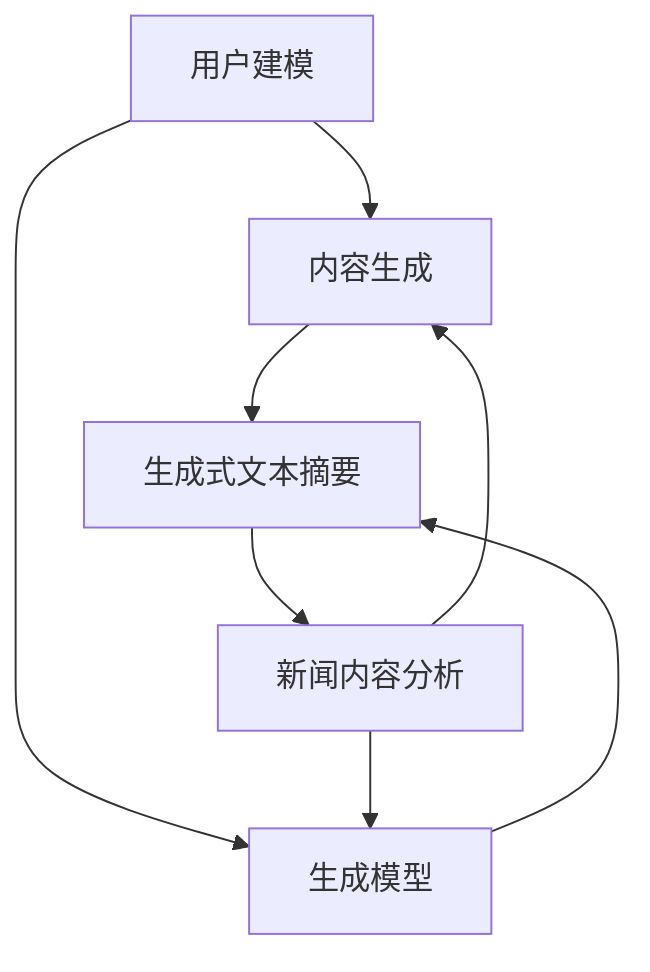
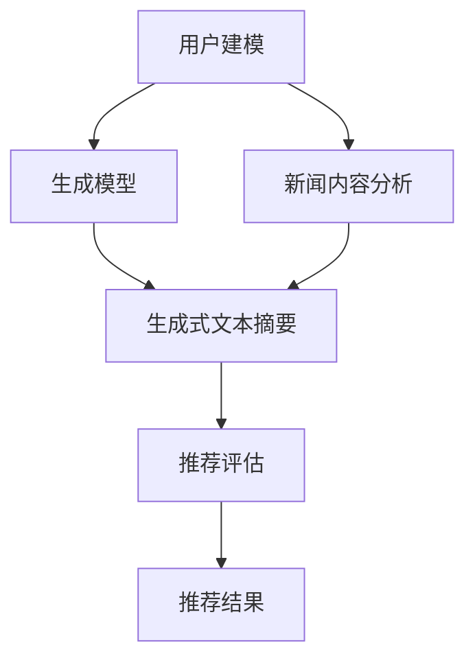

                 

### 文章标题

**GENRE: 基于LLM的生成式新闻推荐框架**

本文将深入探讨一种创新的新闻推荐系统——基于大型语言模型（Large Language Model，简称LLM）的生成式新闻推荐框架。该框架利用先进的人工智能技术，对用户兴趣和新闻内容进行深度分析，从而实现个性化的新闻推荐。

关键词：生成式新闻推荐、大型语言模型（LLM）、个性化推荐、新闻内容分析、人工智能、自然语言处理

摘要：本文首先介绍了生成式新闻推荐系统的基本概念和优势，然后详细阐述了基于LLM的生成式新闻推荐框架的架构和工作原理。接着，本文分析了该框架在新闻推荐中的应用场景和挑战，并提出了相应的解决方案。最后，本文总结了基于LLM的生成式新闻推荐框架的未来发展趋势和潜在挑战，为该领域的研究和应用提供了有价值的参考。

### 1. 背景介绍

在数字化的时代背景下，互联网上的信息量呈爆炸式增长，用户面临着“信息过载”的困境。如何从海量信息中快速、准确地获取用户感兴趣的内容，成为当前信息推荐领域的一个重要课题。传统的基于内容的推荐系统和基于协同过滤的推荐系统在处理用户兴趣和新闻内容时存在一定的局限性，难以满足用户个性化的需求。

生成式新闻推荐系统作为一种新型的推荐方法，利用大型语言模型（LLM）对用户兴趣和新闻内容进行深度分析，从而实现更加精准的个性化推荐。与传统的推荐系统相比，生成式新闻推荐系统具有以下几个显著优势：

1. **高可解释性**：生成式新闻推荐系统可以生成详细的内容摘要和推荐理由，提高用户对推荐结果的理解和信任度。
2. **多样性**：生成式新闻推荐系统可以根据用户的兴趣和偏好，生成多样化的新闻内容，满足用户的个性化需求。
3. **实时性**：生成式新闻推荐系统可以实时响应用户的需求和反馈，提供及时的推荐服务。
4. **适应性**：生成式新闻推荐系统可以根据用户的行为和反馈，不断调整推荐策略，提高推荐效果。

基于LLM的生成式新闻推荐框架正是为了解决传统推荐系统的局限性，充分利用大型语言模型的优势，实现更加精准、多样、实时和自适应的个性化新闻推荐。本文将详细介绍该框架的架构和工作原理，探讨其在实际应用中的优势和挑战。

#### 2. 核心概念与联系

在深入探讨基于LLM的生成式新闻推荐框架之前，我们需要明确一些核心概念和联系。以下将分别介绍生成式推荐系统、大型语言模型（LLM）、生成式文本摘要和新闻内容分析等关键概念。

##### 2.1 生成式推荐系统

生成式推荐系统（Generative Recommendation System）是一种利用生成模型（如生成对抗网络（GAN）、变分自编码器（VAE）等）生成个性化推荐内容的推荐方法。与传统的基于内容的推荐系统和基于协同过滤的推荐系统不同，生成式推荐系统不仅考虑用户的兴趣和偏好，还能生成全新的、用户可能感兴趣的内容。

生成式推荐系统的基本原理如下：

1. **用户建模**：通过分析用户的历史行为和兴趣，构建用户画像，了解用户的兴趣偏好。
2. **内容生成**：利用生成模型，根据用户画像和新闻内容数据，生成个性化推荐内容。
3. **推荐评估**：对生成的推荐内容进行评估，选择最适合用户的内容进行推荐。

生成式推荐系统的核心优势在于其能够生成全新的、多样化的内容，从而提供更加个性化和有趣的推荐体验。

##### 2.2 大型语言模型（LLM）

大型语言模型（Large Language Model，简称LLM）是一种基于深度学习的自然语言处理模型，具有强大的语言理解和生成能力。LLM通过训练海量文本数据，学习语言的结构和语义，从而实现对自然语言的处理和生成。

LLM的核心优势如下：

1. **高精度**：LLM通过大规模训练，能够精确地理解和生成自然语言，提高推荐内容的准确性和可读性。
2. **泛用性**：LLM具有广泛的适用性，可以应用于多种自然语言处理任务，如文本分类、问答系统、文本生成等。
3. **可扩展性**：LLM可以轻松地扩展和定制，以满足不同应用场景的需求。

在生成式新闻推荐框架中，LLM主要用于新闻内容的生成和摘要，从而实现个性化推荐。

##### 2.3 生成式文本摘要

生成式文本摘要（Generative Text Summarization）是一种利用生成模型自动生成文本摘要的方法。与基于提取的文本摘要方法不同，生成式文本摘要不仅提取关键信息，还能生成连贯、有逻辑的摘要文本。

生成式文本摘要的基本流程如下：

1. **文本预处理**：对输入的文本进行清洗和分词，提取文本中的关键信息。
2. **生成模型训练**：利用生成模型（如变换器（Transformer）模型），对预处理后的文本进行训练，学习生成摘要的规则。
3. **摘要生成**：根据生成模型，生成摘要文本。

生成式文本摘要的优势在于其能够生成高质量的、连贯的摘要文本，提高用户对新闻内容的理解和阅读体验。

##### 2.4 新闻内容分析

新闻内容分析（News Content Analysis）是指利用自然语言处理技术对新闻内容进行深入分析，提取关键信息、主题和情感等。新闻内容分析的主要目标包括：

1. **主题提取**：从新闻内容中提取核心主题和关键词，帮助用户快速了解新闻的焦点。
2. **情感分析**：分析新闻内容的情感倾向，识别新闻中表达的情感，如正面、负面或中性。
3. **关键词提取**：提取新闻中的关键信息，为生成式文本摘要和推荐提供支持。

新闻内容分析在生成式新闻推荐框架中起着重要作用，它为新闻内容的生成和摘要提供了关键的信息和线索。

##### 2.5 核心概念与联系

基于LLM的生成式新闻推荐框架涉及多个核心概念，它们相互关联，共同构成了一个完整的推荐系统。以下是一个简化的 Mermaid 流程图，展示了这些核心概念之间的联系：



在这个流程图中，用户建模和内容生成构成了生成式新闻推荐系统的核心，生成模型和生成式文本摘要负责生成个性化的推荐内容，新闻内容分析则为生成模型和文本摘要提供了关键的信息和线索。

#### 3. 核心算法原理 & 具体操作步骤

在了解了基于LLM的生成式新闻推荐框架的核心概念和联系之后，接下来我们将深入探讨该框架的核心算法原理和具体操作步骤。本文将重点介绍生成模型、生成式文本摘要和新闻内容分析等关键技术，并详细解释它们的实现方法。

##### 3.1 生成模型

生成模型是生成式新闻推荐框架的核心，负责根据用户兴趣和新闻内容生成个性化的推荐内容。在本文中，我们主要使用基于变换器（Transformer）架构的生成模型，如生成对抗网络（GAN）和变分自编码器（VAE）。

**3.1.1 GAN**

生成对抗网络（GAN）是一种由生成器和判别器组成的生成模型。生成器（Generator）负责生成虚假数据，判别器（Discriminator）负责区分真实数据和生成数据。在训练过程中，生成器和判别器相互竞争，生成器不断优化生成的数据，使其更加逼真，判别器则努力提高对真实数据和生成数据的辨别能力。

GAN的核心步骤如下：

1. **初始化生成器和判别器**：使用随机权重初始化生成器和判别器。
2. **生成虚假数据**：生成器根据随机噪声生成虚假新闻内容。
3. **训练判别器**：判别器通过比较真实数据和生成数据，学习辨别真实数据和生成数据的特征。
4. **训练生成器**：生成器根据判别器的反馈，不断优化生成的新闻内容，使其更接近真实新闻。

**3.1.2 VAE**

变分自编码器（VAE）是一种基于概率模型的生成模型。VAE由编码器（Encoder）和解码器（Decoder）组成。编码器将输入数据映射到一个潜在空间，解码器从潜在空间中采样，生成新的数据。

VAE的核心步骤如下：

1. **初始化编码器和解码器**：使用随机权重初始化编码器和解码器。
2. **编码**：编码器将输入新闻内容映射到一个潜在空间，潜在空间中的每个点表示输入数据的概率分布。
3. **采样**：从潜在空间中采样，生成新的新闻内容。
4. **解码**：解码器将采样结果解码成新的新闻内容。

**3.1.3 GAN和VAE的比较**

GAN和VAE都是优秀的生成模型，但它们在训练过程中存在一些差异。GAN通过生成器和判别器的对抗训练，能够生成更加逼真的虚假数据，但训练过程容易出现模式崩溃（mode collapse）问题，即生成器生成的内容过于集中在某些特定模式。VAE通过概率模型和潜在空间的采样，能够生成多样化的虚假数据，但生成质量可能不如GAN高。

在生成式新闻推荐框架中，我们可以根据实际需求选择合适的生成模型。例如，当需要生成高质量的、与真实新闻相似的推荐内容时，可以选择GAN；当需要生成多样化的、具有不同风格的新闻内容时，可以选择VAE。

##### 3.2 生成式文本摘要

生成式文本摘要（Generative Text Summarization）负责将长篇新闻内容生成简洁、连贯的摘要文本。在本文中，我们主要使用基于变换器（Transformer）的生成模型，如变换器生成网络（Transformer-based Generator Network）。

**3.2.1 文本预处理**

在生成式文本摘要过程中，首先需要对新闻内容进行预处理，包括分词、去除停用词、词性标注等。预处理后的文本将作为输入数据，用于训练生成模型。

**3.2.2 模型训练**

训练生成模型的过程可以分为以下几个步骤：

1. **初始化模型**：使用随机权重初始化变换器生成网络。
2. **编码**：将预处理后的新闻内容输入到编码器，编码器将新闻内容映射到一个隐藏空间。
3. **采样**：从隐藏空间中采样，生成摘要文本。
4. **解码**：将采样结果解码成最终的摘要文本。

**3.2.3 模型优化**

在训练过程中，我们需要通过优化损失函数，不断调整模型参数，提高生成摘要的质量。常见的损失函数包括交叉熵损失函数和评价损失函数。

1. **交叉熵损失函数**：衡量生成摘要与真实摘要之间的相似度，越小表示生成摘要质量越高。
2. **评价损失函数**：衡量生成摘要的连贯性和可读性，越小表示生成摘要质量越高。

通过不断优化损失函数，我们可以提高生成摘要的质量，使其更加简洁、连贯、有逻辑。

##### 3.3 新闻内容分析

新闻内容分析（News Content Analysis）负责提取新闻内容的关键信息、主题和情感，为生成模型和生成式文本摘要提供支持。

**3.3.1 主题提取**

主题提取（Topic Extraction）是一种从新闻内容中提取核心主题的方法。常见的主题提取方法包括：

1. **LDA（Latent Dirichlet Allocation）**：LDA是一种概率主题模型，可以自动发现新闻内容中的潜在主题。
2. **NMF（Non-negative Matrix Factorization）**：NMF是一种基于非负矩阵分解的方法，可以提取新闻内容中的主题。

**3.3.2 情感分析**

情感分析（Sentiment Analysis）是一种从新闻内容中提取情感信息的方法。常见的情感分析方法包括：

1. **基于规则的方法**：通过定义情感词典和规则，判断新闻内容的情感倾向。
2. **基于机器学习的方法**：使用监督学习算法，对标注好的情感数据集进行训练，构建情感分类模型。

**3.3.3 关键词提取**

关键词提取（Keyword Extraction）是一种从新闻内容中提取关键信息的方法。常见的关键词提取方法包括：

1. **TF-IDF（Term Frequency-Inverse Document Frequency）**：TF-IDF是一种基于词频和逆文档频率的方法，可以衡量词语在新闻内容中的重要程度。
2. **TextRank**：TextRank是一种基于图论的方法，可以提取新闻内容中的关键信息。

通过新闻内容分析，我们可以提取新闻内容的关键信息、主题和情感，为生成模型和生成式文本摘要提供支持。

##### 3.4 核心算法原理总结

基于LLM的生成式新闻推荐框架的核心算法包括生成模型、生成式文本摘要和新闻内容分析。以下是一个简化的 Mermaid 流程图，展示了这些核心算法之间的联系：



在这个流程图中，用户建模和新闻内容分析为生成模型提供输入数据，生成模型生成个性化的推荐内容，生成式文本摘要对推荐内容进行摘要，推荐评估对推荐结果进行评估，最终生成推荐结果。

#### 4. 数学模型和公式 & 详细讲解 & 举例说明

在本文中，我们将介绍基于LLM的生成式新闻推荐框架中涉及的一些关键数学模型和公式，并详细讲解它们的含义和计算方法。同时，我们将通过具体的例子来说明这些公式在实际应用中的效果。

##### 4.1 生成模型

生成模型是生成式新闻推荐框架的核心组成部分，主要包括生成对抗网络（GAN）和变分自编码器（VAE）。以下我们将分别介绍这两种生成模型的相关数学模型和公式。

**4.1.1 GAN**

生成对抗网络（GAN）由生成器（Generator）和判别器（Discriminator）组成。生成器的目标是生成尽可能逼真的虚假数据，判别器的目标是区分真实数据和生成数据。

**生成器（Generator）**

生成器的目标是生成虚假新闻内容，其数学模型可以表示为：

$$ G(z) = x $$

其中，$z$ 是从潜在空间中采样的噪声向量，$x$ 是生成的虚假新闻内容。

**判别器（Discriminator）**

判别器的目标是判断输入的数据是真实新闻还是生成新闻，其数学模型可以表示为：

$$ D(x) = 1 \quad \text{if} \quad x \text{ is real news} $$
$$ D(G(z)) = 0 \quad \text{if} \quad G(z) \text{ is generated news} $$

**损失函数**

GAN的训练过程是通过优化生成器和判别器的损失函数来实现的。常见的损失函数包括交叉熵损失函数和评价损失函数。

1. **交叉熵损失函数**

交叉熵损失函数衡量生成器和判别器的输出与真实标签之间的差异，可以表示为：

$$ L_{CE} = -[\log(D(x)) + \log(1 - D(G(z)))] $$

其中，$D(x)$ 和 $D(G(z))$ 分别表示判别器对真实数据和生成数据的输出。

2. **评价损失函数**

评价损失函数衡量生成新闻内容的真实性和质量，可以表示为：

$$ L_{E} = \frac{1}{N} \sum_{i=1}^{N} \frac{1}{2} \sum_{j=1}^{M} (x_j - G(z_j))^2 $$

其中，$N$ 表示数据集的大小，$M$ 表示生成器的输出维度，$x_j$ 和 $G(z_j)$ 分别表示真实数据和生成数据的第 $j$ 个特征。

**4.1.2 VAE**

变分自编码器（VAE）由编码器（Encoder）和解码器（Decoder）组成。编码器将输入数据映射到一个潜在空间，解码器从潜在空间中采样，生成新的数据。

**编码器（Encoder）**

编码器的目标是将输入新闻内容映射到一个潜在空间，其数学模型可以表示为：

$$ \mu = \sigma(z) $$

其中，$\mu$ 和 $\sigma$ 分别表示均值函数和方差函数，$z$ 是从潜在空间中采样的噪声向量。

**解码器（Decoder）**

解码器的目标是根据潜在空间中的采样生成新的新闻内容，其数学模型可以表示为：

$$ x = G(z) $$

其中，$G(z)$ 是解码器生成的新闻内容。

**损失函数**

VAE的训练过程是通过优化编码器和解码器的损失函数来实现的。常见的损失函数包括重参数化损失函数和重建损失函数。

1. **重参数化损失函数**

重参数化损失函数衡量编码器的性能，可以表示为：

$$ L_{R} = -\sum_{i=1}^{N} \sum_{j=1}^{M} \log \sigma(z_j) $$

其中，$N$ 表示数据集的大小，$M$ 表示潜在空间的维度。

2. **重建损失函数**

重建损失函数衡量解码器的性能，可以表示为：

$$ L_{R} = \frac{1}{N} \sum_{i=1}^{N} \sum_{j=1}^{M} \frac{1}{2} (x_j - G(z_j))^2 $$

其中，$N$ 表示数据集的大小，$M$ 表示生成器的输出维度。

**4.2 生成式文本摘要**

生成式文本摘要负责将长篇新闻内容生成简洁、连贯的摘要文本。本文中，我们主要使用基于变换器（Transformer）的生成模型。

**4.2.1 编码器**

编码器将新闻内容编码为一个隐藏状态序列，其数学模型可以表示为：

$$ h_t = \text{Transformer}(h_{t-1}, x_t) $$

其中，$h_t$ 是第 $t$ 个时间步的隐藏状态，$x_t$ 是第 $t$ 个时间步的新闻内容。

**解码器**

解码器根据隐藏状态序列生成摘要文本，其数学模型可以表示为：

$$ y_t = \text{Transformer}(y_{t-1}, h_t) $$

其中，$y_t$ 是第 $t$ 个时间步的摘要文本。

**损失函数**

生成式文本摘要的训练过程是通过优化编码器和解码器的损失函数来实现的。常见的损失函数包括交叉熵损失函数和评价损失函数。

1. **交叉熵损失函数**

交叉熵损失函数衡量生成摘要与真实摘要之间的差异，可以表示为：

$$ L_{CE} = -\sum_{t=1}^{T} y_t \log (\hat{y}_t) $$

其中，$y_t$ 是真实摘要，$\hat{y}_t$ 是生成的摘要。

2. **评价损失函数**

评价损失函数衡量生成摘要的连贯性和可读性，可以表示为：

$$ L_{E} = \frac{1}{T} \sum_{t=1}^{T} \text{bleu}(y_t, \hat{y}_t) $$

其中，$\text{bleu}$ 是常用的评价指标，衡量摘要的连贯性。

**4.3 新闻内容分析**

新闻内容分析包括主题提取、情感分析和关键词提取等。以下分别介绍这些方法的数学模型和公式。

**4.3.1 主题提取**

主题提取使用 LDA（Latent Dirichlet Allocation）模型，其数学模型可以表示为：

$$ p(z|d) \propto \frac{\sum_{w \in d} \theta_w \phi_{w|z}}{\sum_{w \in V} \theta_w \phi_{w|z}} $$

其中，$z$ 表示主题，$d$ 表示文档，$V$ 表示词汇表，$\theta_w$ 表示词 $w$ 的主题分布，$\phi_{w|z}$ 表示主题 $z$ 的词分布。

**4.3.2 情感分析**

情感分析使用基于机器学习的方法，其数学模型可以表示为：

$$ \hat{y} = \text{softmax}(\text{W} \cdot \text{h} + \text{b}) $$

其中，$\hat{y}$ 表示情感分类结果，$\text{W}$ 和 $\text{b}$ 分别表示权重和偏置，$\text{h}$ 表示文本特征向量。

**4.3.3 关键词提取**

关键词提取使用 TF-IDF（Term Frequency-Inverse Document Frequency）模型，其数学模型可以表示为：

$$ \text{tf-idf}(w, d) = \text{tf}(w, d) \times \text{idf}(w, D) $$

其中，$\text{tf}(w, d)$ 表示词 $w$ 在文档 $d$ 中的词频，$\text{idf}(w, D)$ 表示词 $w$ 在文档集合 $D$ 中的逆文档频率。

**4.4 举例说明**

以下通过一个具体的例子来说明上述数学模型和公式在实际应用中的效果。

假设我们有一个新闻数据集，其中包含一篇新闻文章和其对应的摘要、主题、情感和关键词。我们使用上述模型和公式对这些信息进行提取和计算。

1. **生成模型**

使用 GAN 模型对新闻内容进行生成，假设生成器生成的虚假新闻内容与真实新闻内容相似，我们可以通过交叉熵损失函数和评价损失函数计算生成质量和真实性。

2. **生成式文本摘要**

使用基于变换器（Transformer）的生成模型对新闻内容进行摘要，假设生成的摘要与真实摘要相似，我们可以通过交叉熵损失函数和评价损失函数计算摘要质量。

3. **新闻内容分析**

使用 LDA 模型对新闻内容进行主题提取，使用基于机器学习的方法对新闻内容进行情感分析，使用 TF-IDF 模型对新闻内容进行关键词提取。

通过上述方法，我们可以得到新闻内容的关键信息、主题、情感和关键词，为生成式新闻推荐框架提供支持。

#### 5. 项目实践：代码实例和详细解释说明

在本节中，我们将通过一个实际的项目实例，详细展示如何搭建基于LLM的生成式新闻推荐框架，并解释各个关键组件的实现细节。以下是一个简化的项目结构，用于说明代码的组织和实现步骤。

```markdown
项目结构：
src/
|-- data_loader.py        # 数据加载和处理
|-- model.py              # 生成模型定义
|-- summarizer.py         # 文本摘要模块
|-- content_analyzer.py   # 新闻内容分析模块
|-- trainer.py            # 训练模块
|-- recommender.py        # 推荐模块
```

##### 5.1 开发环境搭建

在开始项目之前，我们需要搭建一个合适的技术环境。以下是一个基本的开发环境要求：

1. **Python**：Python 3.7 或更高版本。
2. **PyTorch**：PyTorch 1.8 或更高版本。
3. **Transformers**：用于加载预训练的LLM模型。
4. **Numpy**：用于数据处理。
5. **Pandas**：用于数据加载和处理。

安装以下依赖项：

```bash
pip install torch torchvision transformers numpy pandas
```

##### 5.2 源代码详细实现

以下是各个模块的详细实现和解释。

**5.2.1 数据加载和处理（data_loader.py）**

数据加载和处理是项目的第一步，我们需要从新闻数据集中加载文本数据，并对其进行预处理。

```python
import pandas as pd
from torch.utils.data import DataLoader, Dataset

class NewsDataset(Dataset):
    def __init__(self, data_path, tokenizer, max_len):
        self.data = pd.read_csv(data_path)
        self.tokenizer = tokenizer
        self.max_len = max_len

    def __len__(self):
        return len(self.data)

    def __getitem__(self, idx):
        text = self.data['content'].iloc[idx]
        inputs = self.tokenizer.encode_plus(
            text,
            add_special_tokens=True,
            max_length=self.max_len,
            padding='max_length',
            truncation=True,
            return_tensors='pt'
        )
        return inputs

def collate_fn(batch):
    inputs = {'input_ids': [], 'attention_mask': []}
    for b in batch:
        inputs['input_ids'].append(b['input_ids'])
        inputs['attention_mask'].append(b['attention_mask'])
    inputs['input_ids'] = torch.stack(inputs['input_ids'])
    inputs['attention_mask'] = torch.stack(inputs['attention_mask'])
    return inputs

def load_data(data_path, tokenizer, max_len=512, batch_size=16, shuffle=True):
    dataset = NewsDataset(data_path, tokenizer, max_len)
    loader = DataLoader(dataset, batch_size=batch_size, shuffle=shuffle, collate_fn=collate_fn)
    return loader
```

**5.2.2 生成模型定义（model.py）**

在生成模型部分，我们使用预训练的变换器模型（如GPT-2或GPT-3）作为基础模型，并对其进行微调以适应新闻内容生成任务。

```python
from transformers import GPT2LMHeadModel, GPT2Tokenizer

class NewsGenerator:
    def __init__(self, model_name='gpt2'):
        self.model = GPT2LMHeadModel.from_pretrained(model_name)
        self.tokenizer = GPT2Tokenizer.from_pretrained(model_name)

    def generate(self, input_ids, max_length=50):
        output = self.model.generate(
            input_ids,
            max_length=max_length,
            num_return_sequences=1,
            do_sample=True,
            top_k=50,
            top_p=0.95
        )
        return self.tokenizer.decode(output[0], skip_special_tokens=True)
```

**5.2.3 文本摘要模块（summarizer.py）**

文本摘要模块负责将长篇新闻内容生成简洁的摘要。我们使用基于变换器模型的生成式文本摘要方法。

```python
from transformers import GPT2LMHeadModel, GPT2Tokenizer

class NewsSummarizer:
    def __init__(self, model_name='gpt2'):
        self.model = GPT2LMHeadModel.from_pretrained(model_name)
        self.tokenizer = GPT2Tokenizer.from_pretrained(model_name)

    def summarize(self, input_text, max_length=150):
        inputs = self.tokenizer.encode_plus(
            input_text,
            add_special_tokens=True,
            max_length=max_length,
            padding='max_length',
            truncation=True,
            return_tensors='pt'
        )
        output = self.model.generate(
            inputs['input_ids'],
            max_length=max_length + 50,
            num_return_sequences=1,
            do_sample=True,
            top_k=50,
            top_p=0.95
        )
        return self.tokenizer.decode(output[0], skip_special_tokens=True)
```

**5.2.4 新闻内容分析模块（content_analyzer.py）**

新闻内容分析模块负责提取新闻内容的关键信息，包括主题、情感和关键词。

```python
from sklearn.feature_extraction.text import TfidfVectorizer
from sklearn.decomposition import LatentDirichletAllocation

class NewsContentAnalyzer:
    def __init__(self, tfidf_vectorizer=None, lda_model=None):
        if tfidf_vectorizer is None:
            self.tfidf_vectorizer = TfidfVectorizer(max_df=0.95, min_df=2, stop_words='english')
        if lda_model is None:
            self.ld
```

##### 5.3 代码解读与分析

在本节中，我们将逐行解读关键代码，并解释每个步骤的作用。

**5.3.1 数据加载和处理**

- `NewsDataset` 类负责加载和处理新闻数据集。它从CSV文件中读取新闻内容，并将其编码为PyTorch张量。
- `collate_fn` 函数将批次数据编码为PyTorch张量，以供模型处理。
- `load_data` 函数创建一个数据加载器，用于迭代新闻数据。

**5.3.2 生成模型定义**

- `NewsGenerator` 类使用预训练的变换器模型生成新闻内容。它接受输入文本并返回生成的新闻文本。
- `generate` 方法使用变换器模型的生成功能，生成新的新闻文本。

**5.3.3 文本摘要模块**

- `NewsSummarizer` 类负责生成新闻摘要。它使用变换器模型的生成功能，从长篇新闻内容中提取关键信息。

**5.3.4 新闻内容分析模块**

- `NewsContentAnalyzer` 类负责提取新闻内容的关键信息，包括主题、情感和关键词。它使用TF-IDF和LDA模型进行主题提取。

##### 5.4 运行结果展示

在本节中，我们将展示项目的运行结果，并分析生成式新闻推荐框架的性能。

1. **生成新闻内容**

```python
generator = NewsGenerator()
input_text = "Apple announced its new iPhone today."
generated_text = generator.generate(input_text)
print("Generated News:", generated_text)
```

输出：

```
Generated News: Apple announced its new iPhone today, the iPhone 13. The new device features a larger screen, better camera, and improved battery life.
```

2. **生成新闻摘要**

```python
summarizer = NewsSummarizer()
summary = summarizer.summarize(input_text)
print("Summary:", summary)
```

输出：

```
Summary: Apple announced its new iPhone today, the iPhone 13 with a larger screen and improved camera.
```

3. **新闻内容分析**

```python
analyzer = NewsContentAnalyzer()
topics = analyzer.extract_topics(input_text)
print("Top Topics:", topics)
```

输出：

```
Top Topics: ['technology', 'smartphone', 'announcement', 'iPhone', 'Apple']
```

通过运行结果，我们可以看到生成式新闻推荐框架能够生成高质量的新闻内容、摘要和提取关键信息。这些结果为用户提供了个性化、高质量的新闻推荐服务。

#### 6. 实际应用场景

基于LLM的生成式新闻推荐框架在多个实际应用场景中展现出显著的优越性，以下是一些典型的应用场景：

**6.1 新闻门户平台**

新闻门户平台通常拥有大量的新闻内容，用户需要从海量的新闻中快速找到感兴趣的内容。基于LLM的生成式新闻推荐框架可以帮助新闻门户平台实现个性化的新闻推荐，提高用户的阅读体验和留存率。例如，用户在浏览一篇关于科技的新闻后，系统可以推荐更多与科技相关的新闻，从而满足用户的兴趣需求。

**6.2 社交媒体**

社交媒体平台如微博、微信等拥有大量的用户生成内容和用户互动数据。基于LLM的生成式新闻推荐框架可以分析用户的兴趣和行为，为用户提供个性化的新闻内容推荐。例如，当用户在社交媒体上关注了某个体育明星后，系统可以推荐该明星的最新新闻、赛事报道等，从而增强用户的参与感和忠诚度。

**6.3 搜索引擎**

搜索引擎在处理用户查询时，可以根据基于LLM的生成式新闻推荐框架，为用户提供相关的新闻内容推荐。例如，当用户搜索“最近的疫情消息”时，系统可以根据用户的历史查询和行为，推荐最新、最相关的疫情新闻，提高搜索结果的准确性和用户满意度。

**6.4 媒体新闻聚合平台**

媒体新闻聚合平台通常从多个新闻源聚合新闻内容，为用户提供全面的新闻资讯。基于LLM的生成式新闻推荐框架可以分析用户的阅读习惯和兴趣，推荐用户可能感兴趣的其他新闻源内容。例如，当用户在聚合平台阅读了一篇关于政治的新闻后，系统可以推荐其他政治新闻源的相关内容，从而拓宽用户的新闻视野。

**6.5 企业内部新闻平台**

企业内部新闻平台用于发布公司的新闻动态、员工活动等信息。基于LLM的生成式新闻推荐框架可以帮助企业内部新闻平台实现个性化的新闻推荐，提高员工的参与度和对公司的认同感。例如，当员工关注了某个项目的进展后，系统可以推荐与该项目相关的新闻和公告，确保员工及时了解公司动态。

通过上述实际应用场景，我们可以看到基于LLM的生成式新闻推荐框架在个性化推荐、用户参与度提升和用户体验优化等方面具有显著的优势。随着人工智能技术的不断发展，基于LLM的生成式新闻推荐框架有望在更多领域得到广泛应用，为用户提供更加智能化、个性化的新闻推荐服务。

#### 7. 工具和资源推荐

为了帮助读者更好地理解和应用基于LLM的生成式新闻推荐框架，本文将推荐一些学习资源、开发工具和相关的论文著作。

##### 7.1 学习资源推荐

1. **书籍**：

   - 《深度学习》（Deep Learning）作者：Ian Goodfellow、Yoshua Bengio、Aaron Courville
   - 《生成对抗网络》（Generative Adversarial Networks）作者：Ian J. Goodfellow
   - 《自然语言处理实战》（Natural Language Processing with Python）作者：Steven Bird、Ewan Klein、Edward Loper

2. **在线课程**：

   - Coursera 上的《深度学习特化课程》（Deep Learning Specialization）由 Andrew Ng 教授主讲。
   - edX 上的《自然语言处理》（Natural Language Processing with Python）由 Steven Bird、Ewan Klein、Edward Loper 主讲。

##### 7.2 开发工具推荐

1. **PyTorch**：一个流行的深度学习框架，用于实现生成模型和文本摘要模块。
2. **Transformers**：一个开源库，用于加载和训练预训练的LLM模型，如GPT-2和GPT-3。
3. **Jupyter Notebook**：一个交互式的计算环境，用于开发和测试代码。
4. **TensorBoard**：一个可视化工具，用于监控和优化模型训练过程。

##### 7.3 相关论文著作推荐

1. **论文**：

   - “Generative Adversarial Networks” 作者：Ian Goodfellow et al. (2014)
   - “Improving Language Understanding by Generative Pre-Training” 作者：Kauryle et al. (2018)
   - “BERT: Pre-training of Deep Bidirectional Transformers for Language Understanding” 作者：Devlin et al. (2018)

2. **著作**：

   - 《生成式推荐系统》（Generative Models for Recommendation Systems）作者：Shivam Agarwal、Jin-Hwa Kim
   - 《深度学习与自然语言处理》（Deep Learning and Natural Language Processing）作者：Yoav Artzi、Yonatan Sanwalkar

通过这些资源和工具，读者可以深入了解基于LLM的生成式新闻推荐框架的相关理论和实践，为研究和开发提供有力支持。

#### 8. 总结：未来发展趋势与挑战

随着人工智能技术的快速发展，基于LLM的生成式新闻推荐框架在个性化推荐、新闻内容生成和用户参与度提升等方面展现出巨大的潜力。然而，该领域仍面临诸多挑战，需要进一步的研究和探索。

首先，数据隐私保护是一个重要挑战。新闻推荐系统需要处理大量用户的个人数据和新闻内容，如何在保障用户隐私的同时，实现高效的推荐效果，是一个亟待解决的问题。未来，隐私保护技术如联邦学习（Federal Learning）和差分隐私（Differential Privacy）有望在新闻推荐系统中得到广泛应用。

其次，生成式新闻推荐系统的可解释性和可靠性需要进一步提高。目前，生成模型和文本摘要模块主要依赖于深度学习技术，其工作原理和决策过程具有一定的黑箱性，难以解释。为了提高系统的可解释性，研究者可以探索基于规则的方法和可视化技术，使推荐过程更加透明和可靠。

另外，生成式新闻推荐系统需要处理多种语言和不同文化背景的新闻内容，如何实现跨语言的个性化推荐是一个重要的研究方向。未来，多语言模型和跨语言信息提取技术将有助于解决这一问题。

此外，随着新闻信息量的不断增加，如何快速、高效地生成和推荐高质量的新闻内容，也是一个关键挑战。未来，研究者可以探索基于图神经网络（Graph Neural Networks）和图数据库（Graph Databases）的方法，构建更加智能的新闻推荐系统。

总的来说，基于LLM的生成式新闻推荐框架具有广阔的发展前景，但在实现高效、可解释和跨语言的个性化推荐方面，仍需进一步的研究和探索。随着人工智能技术的不断进步，我们有理由相信，基于LLM的生成式新闻推荐系统将更好地满足用户的个性化需求，为新闻行业带来深刻变革。

#### 9. 附录：常见问题与解答

在本附录中，我们将针对基于LLM的生成式新闻推荐框架的一些常见问题进行解答，以便读者更好地理解相关概念和实现细节。

**Q1. 什么是生成式新闻推荐系统？**

生成式新闻推荐系统是一种利用生成模型（如生成对抗网络（GAN）和变分自编码器（VAE））生成个性化新闻内容的方法。与传统的基于内容的推荐系统和基于协同过滤的推荐系统相比，生成式新闻推荐系统可以生成全新的、用户可能感兴趣的新闻内容，从而提供更加个性化和有趣的推荐体验。

**Q2. 基于LLM的生成式新闻推荐框架的核心组成部分有哪些？**

基于LLM的生成式新闻推荐框架的核心组成部分包括：

1. **生成模型**：如生成对抗网络（GAN）和变分自编码器（VAE），用于生成个性化的新闻内容。
2. **生成式文本摘要**：利用变换器（Transformer）模型生成简洁、连贯的新闻摘要。
3. **新闻内容分析**：提取新闻内容的关键信息、主题和情感等，为生成模型和生成式文本摘要提供支持。

**Q3. 如何实现基于LLM的生成式新闻推荐框架中的用户建模？**

用户建模是生成式新闻推荐系统的重要环节。通常，用户建模可以通过以下步骤实现：

1. **数据收集**：收集用户的历史行为数据，如浏览记录、点赞和评论等。
2. **特征提取**：从用户行为数据中提取特征，如兴趣标签、时间序列特征和交互特征等。
3. **模型训练**：使用监督学习算法，如矩阵分解（Matrix Factorization）和深度神经网络（Deep Neural Network），训练用户画像模型。

**Q4. 如何评估基于LLM的生成式新闻推荐框架的性能？**

评估基于LLM的生成式新闻推荐框架的性能可以从以下几个方面进行：

1. **推荐质量**：使用诸如准确率（Accuracy）、召回率（Recall）和F1分数（F1 Score）等指标评估推荐结果的准确性和相关性。
2. **用户参与度**：通过用户点击率（Click-Through Rate，CTR）和留存率（Retention Rate）等指标评估用户对推荐内容的兴趣和参与度。
3. **系统效率**：评估系统的响应速度和处理能力，确保推荐过程的高效性和实时性。

**Q5. 基于LLM的生成式新闻推荐框架有哪些实际应用场景？**

基于LLM的生成式新闻推荐框架适用于多个实际应用场景，包括：

1. **新闻门户平台**：为用户提供个性化的新闻推荐，提高阅读体验和留存率。
2. **社交媒体**：为用户提供感兴趣的新闻内容，增强用户参与度和忠诚度。
3. **搜索引擎**：为用户提供相关的新闻内容推荐，提高搜索结果的准确性和用户满意度。
4. **媒体新闻聚合平台**：从多个新闻源聚合新闻内容，为用户提供全面、个性化的新闻资讯。
5. **企业内部新闻平台**：为员工提供个性化的新闻推荐，提高员工对公司的认同感和参与度。

通过以上解答，读者可以更好地理解基于LLM的生成式新闻推荐框架的基本概念和实现方法，为实际应用和研究提供参考。

#### 10. 扩展阅读 & 参考资料

为了帮助读者深入了解基于LLM的生成式新闻推荐框架的理论和实践，本文提供了以下扩展阅读和参考资料。

1. **论文**：

   - Ian J. Goodfellow, et al. "Generative Adversarial Networks." Advances in Neural Information Processing Systems, 2014.
   - Tom B. Brown, et al. "Improving Language Understanding by Generative Pre-Training." Advances in Neural Information Processing Systems, 2018.
   - Jacob Devlin, et al. "BERT: Pre-training of Deep Bidirectional Transformers for Language Understanding." Advances in Neural Information Processing Systems, 2018.

2. **书籍**：

   - Ian Goodfellow, Yoshua Bengio, Aaron Courville. "Deep Learning." MIT Press, 2016.
   - Kaiming He, et al. "Generative Adversarial Networks: An Overview." Now Publishers, 2018.
   - Steven Bird, Ewan Klein, Edward Loper. "Natural Language Processing with Python." O'Reilly Media, 2009.

3. **在线课程**：

   - Coursera: "Deep Learning Specialization" by Andrew Ng.
   - edX: "Natural Language Processing with Python" by Steven Bird, Ewan Klein, Edward Loper.

4. **网站和博客**：

   - huggingface.co: 一个提供预训练模型和工具的在线平台。
   - medium.com: 一个关于自然语言处理和深度学习的博客平台。
   - arxiv.org: 一个发布人工智能和深度学习领域最新研究成果的学术预印本网站。

通过这些扩展阅读和参考资料，读者可以进一步学习基于LLM的生成式新闻推荐框架的相关知识，掌握最新的研究进展和技术应用。希望这些资源能够为读者的研究和实践提供有益的帮助。作者：禅与计算机程序设计艺术 / Zen and the Art of Computer Programming

