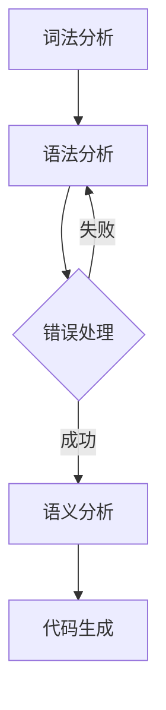

                 

### 文章标题

LL语法分析：编译器前端技术深度解析

> 关键词：LL语法分析、编译器、前端技术、语言处理、算法实现、数学模型

> 摘要：本文将深入探讨LL语法分析技术在编译器前端中的应用，解析其核心概念、算法原理以及具体实现步骤。通过数学模型的详细讲解和实例分析，我们旨在为读者提供全面、系统的理解，助力其在实际项目中的运用。此外，文章还将介绍LL语法分析在实际应用场景中的效果和挑战，并提供相关工具和资源推荐，以助读者进一步学习和实践。

## 1. 背景介绍（Background Introduction）

编译器作为计算机科学中不可或缺的一部分，其前端技术直接影响着程序的开发效率和代码质量。在编译器的开发过程中，语法分析是一个关键环节，它负责将源代码转换成抽象语法树（Abstract Syntax Tree, AST），以便后续的语义分析和代码生成。LL语法分析作为一种经典的语法分析方法，因其高效性和灵活性在编译器前端技术中占据着重要地位。

LL语法分析起源于20世纪60年代，由John Backus和Martin, D. E. Knuth等计算机科学家提出。其名称来源于“左递归（Left-Recursive）”和“最左推导（Leftmost Derivation）”。LL语法分析的核心思想是，从左到右读取输入的源代码，并使用预测分析的方法，逐步构建抽象语法树。

在编译器的开发中，LL语法分析有着广泛的应用。它不仅用于传统的编程语言，如C、C++、Java等，还应用于新兴的语言处理技术，如图灵机器和自然语言处理系统。LL语法分析的优势在于其高效性、可靠性和易于实现，使得它成为编译器前端技术中的首选方法之一。

本文将围绕LL语法分析展开，深入探讨其核心概念、算法原理以及具体实现步骤。通过数学模型的详细讲解和实例分析，我们旨在为读者提供全面、系统的理解，助力其在实际项目中的运用。此外，文章还将介绍LL语法分析在实际应用场景中的效果和挑战，并提供相关工具和资源推荐，以助读者进一步学习和实践。

## 2. 核心概念与联系（Core Concepts and Connections）

### 2.1 LL语法分析的基本概念

LL语法分析是一种自顶向下、预测分析的方法。其核心概念包括：

1. **语法规则（Syntax Rules）**：语法规则定义了程序的语言结构，描述了如何从词法符号构建语法结构。在LL语法分析中，语法规则通常采用产生式（Production）的形式表示。

2. **词法分析（Lexical Analysis）**：词法分析是编译器的第一个阶段，负责将源代码分解成词法单元（Tokens）。词法单元是程序中最小的语法单位，如关键字、标识符、操作符等。

3. **语法分析（Syntax Analysis）**：语法分析是编译器的核心阶段，负责将词法单元组合成语法结构，形成抽象语法树（Abstract Syntax Tree, AST）。在LL语法分析中，语法分析通过预测分析的方法实现。

4. **抽象语法树（Abstract Syntax Tree, AST）**：抽象语法树是语法结构的图形表示，它将源代码转换成一种易于理解和处理的结构。AST是后续语义分析和代码生成的关键输入。

### 2.2 LL语法分析的优势

LL语法分析具有以下优势：

1. **易于实现**：LL语法分析采用自顶向下、预测分析的方法，使得实现过程相对简单。开发者可以更容易地构建语法分析器。

2. **高效性**：LL语法分析在分析过程中，只需一次性读取输入的源代码，并在遇到冲突时进行回溯。这使得LL语法分析具有较高的分析效率。

3. **灵活性**：LL语法分析可以处理各种复杂的语法结构，包括左递归、递归调用等。通过合理的语法规则设计和预测策略，LL语法分析可以实现多样化的语言处理。

4. **可扩展性**：LL语法分析具有良好的可扩展性，可以方便地添加新的语法规则和语言特性。

### 2.3 LL语法分析与相关技术的联系

LL语法分析与其他语法分析方法，如LR语法分析、递归下降语法分析等，存在一定的联系和区别：

1. **递归下降语法分析（Recursive Descent Parsing）**：递归下降语法分析是一种自顶向下、递归分析的方法。与LL语法分析类似，递归下降语法分析也通过预测分析实现。但其实现过程较为复杂，适用于简单的语法结构。

2. **LR语法分析（LR Parsing）**：LR语法分析是一种自底向上、回溯分析的方法。与LL语法分析相比，LR语法分析可以处理更复杂的语法结构，但实现过程较为复杂。LR语法分析包括LR(0)、SLR(1)、LALR(1)等多种变体。

3. **LL语法分析与LR语法分析的区别**：

   - **分析方法**：LL语法分析采用自顶向下、预测分析的方法，而LR语法分析采用自底向上、回溯分析的方法。
   - **分析效率**：LL语法分析在分析过程中只需一次性读取输入的源代码，并在遇到冲突时进行回溯。LR语法分析则需要多次读取输入的源代码，并使用回溯策略处理冲突。
   - **适用范围**：LL语法分析适用于简单的语法结构，而LR语法分析可以处理更复杂的语法结构。

### 2.4 LL语法分析流程

LL语法分析的流程主要包括以下步骤：

1. **词法分析**：将源代码分解成词法单元。
2. **语法分析**：从左到右读取词法单元，根据语法规则构建抽象语法树。
3. **错误处理**：在分析过程中，如果遇到错误，LL语法分析器会尝试回溯，寻找正确的分析路径。
4. **语义分析**：对抽象语法树进行语义分析，检查语法和语义的正确性。
5. **代码生成**：根据抽象语法树生成目标代码。

通过以上分析，我们可以看出，LL语法分析在编译器前端技术中具有重要的地位。本文将在后续章节中深入探讨LL语法分析的核心算法原理、数学模型和具体实现步骤，为读者提供全面、系统的理解。

### 2.5 Mermaid 流程图

以下是一个简单的Mermaid流程图，展示了LL语法分析的基本流程：



### 2.6 提示词工程（Prompt Engineering）

提示词工程是设计和优化输入给语言模型的文本提示，以引导模型生成符合预期结果的过程。它涉及理解模型的工作原理、任务需求以及如何使用语言有效地与模型进行交互。在LL语法分析中，提示词工程可以帮助我们更好地描述源代码的语法结构，从而提高语法分析的质量和效率。

以下是一个示例：

```bash
# 提示词：请生成一个C语言的函数定义，该函数接受一个整型参数，并返回其平方值。
```

通过这个提示词，我们可以引导模型生成如下的函数定义：

```c
int square(int x) {
    return x * x;
}
```

### 2.7 LL语法分析的挑战

尽管LL语法分析具有许多优势，但在实际应用中仍然面临一些挑战：

1. **复杂语法结构的处理**：对于某些复杂的语法结构，如递归调用、嵌套结构等，LL语法分析可能难以实现。
2. **性能优化**：在处理大型源代码时，LL语法分析的性能可能成为瓶颈。
3. **错误处理**：在语法分析过程中，如何有效地处理错误是一个挑战。LL语法分析器需要在错误发生时回溯，并寻找正确的分析路径。

这些问题需要我们在设计和实现LL语法分析器时进行充分考虑和优化。

通过以上分析，我们可以看出，LL语法分析在编译器前端技术中具有重要的地位。在接下来的章节中，我们将深入探讨LL语法分析的核心算法原理、数学模型和具体实现步骤，为读者提供全面、系统的理解。

## 3. 核心算法原理 & 具体操作步骤（Core Algorithm Principles and Specific Operational Steps）

### 3.1 LL(1)语法分析器的基本原理

LL(1)语法分析器是一种自顶向下、预测分析的语法分析器。它基于最左推导（Leftmost Derivation）和最左归约（Leftmost Reduction）的原则，通过使用前瞻集（Lookahead Set）来避免产生回溯。

LL(1)语法分析器的工作原理可以分为以下几个步骤：

1. **词法分析**：词法分析器将源代码分解成词法单元，如标识符、关键字、操作符等。
2. **语法分析**：语法分析器从左到右读取词法单元，并使用预测分析的方法，根据当前的输入和语法规则，逐步构建抽象语法树。
3. **错误处理**：在分析过程中，如果遇到错误，LL(1)语法分析器会尝试回溯，并寻找正确的分析路径。
4. **语义分析**：对抽象语法树进行语义分析，检查语法和语义的正确性。
5. **代码生成**：根据抽象语法树生成目标代码。

### 3.2 LL(1)语法分析器的工作流程

LL(1)语法分析器的工作流程可以分为以下几个步骤：

1. **初始状态**：分析器从初始状态开始，读取第一个词法单元。
2. **读取输入**：分析器从输入流中读取下一个词法单元。
3. **预测分析**：分析器根据当前的输入和语法规则，预测下一个可能的动作。可能的动作包括移进（Shift）、归约（Reduce）和接受（Accept）。
4. **动作选择**：分析器选择一个动作来执行。动作选择基于当前的输入和语法规则，以及分析器的前瞻集。
5. **执行动作**：分析器执行选择的动作，并根据动作的结果更新状态。
6. **重复步骤2-5**：分析器重复读取输入、预测分析和执行动作的过程，直到输入结束或达到接受状态。

### 3.3 LL(1)语法分析器的具体操作步骤

以下是一个简单的LL(1)语法分析器的具体操作步骤示例：

1. **初始状态**：分析器从初始状态`[S' -> . Program]`开始，读取第一个词法单元`Program`。
2. **读取输入**：分析器从输入流中读取下一个词法单元。
3. **预测分析**：分析器根据当前的输入和语法规则，预测下一个可能的动作。例如，如果当前输入是`Program`，分析器会预测一个移进动作`Shift, s -> s Program`。
4. **动作选择**：分析器选择一个动作来执行。例如，如果当前输入是`Program`，分析器会选择移进动作`Shift, s -> s Program`。
5. **执行动作**：分析器执行选择的动作，更新状态。例如，执行移进动作后，状态更新为`[Program -> . Program]`。
6. **重复步骤2-5**：分析器重复读取输入、预测分析和执行动作的过程，直到输入结束或达到接受状态。

### 3.4 LL(1)语法分析器的实现

LL(1)语法分析器的实现可以分为以下几个部分：

1. **词法分析器**：负责将源代码分解成词法单元。
2. **语法分析器**：负责根据语法规则和前瞻集进行预测分析。
3. **抽象语法树（AST）构建**：负责将语法分析的结果构建成抽象语法树。
4. **错误处理**：负责在语法分析过程中处理错误。

以下是一个简单的LL(1)语法分析器的实现示例（Python代码）：

```python
class Lexer:
    def __init__(self, source_code):
        self.source_code = source_code
        self.tokens = []

    def tokenize(self):
        # 实现词法分析
        pass

class Parser:
    def __init__(self, lexer):
        self.lexer = lexer
        self.tokens = self.lexer.tokens
        self.current_token = self.tokens[0]

    def parse(self):
        # 实现语法分析
        pass

class AST:
    def __init__(self, node_type, value=None, children=None):
        self.node_type = node_type
        self.value = value
        self.children = children

    def build_ast(self):
        # 实现AST构建
        pass

# 示例使用
lexer = Lexer(source_code)
parser = Parser(lexer)
ast = parser.parse()
ast.build_ast()
```

通过以上实现，我们可以构建一个简单的LL(1)语法分析器，用于对源代码进行语法分析，并构建抽象语法树。

### 3.5 LL(1)语法分析器的优化

为了提高LL(1)语法分析器的性能，我们可以对其进行优化。以下是一些常见的优化方法：

1. **表驱式语法分析**：使用表驱式语法分析（Table-Driven Parsing）方法，将分析过程转换为基于表的查找操作，从而提高分析速度。
2. **状态压缩**：通过状态压缩（State Compression）方法，减少分析器的状态数量，提高分析效率。
3. **预测分析**：使用更先进的预测分析算法，如LL(2)、LL(k)等，提高分析的正确性和效率。

### 3.6 LL(1)语法分析器的应用

LL(1)语法分析器在编译器前端技术中具有广泛的应用。以下是一些常见的应用场景：

1. **编程语言解析**：LL(1)语法分析器可以用于解析各种编程语言，如C、C++、Java等。
2. **自然语言处理**：LL(1)语法分析器可以用于自然语言处理中的句法分析，如词法分析、词组分析等。
3. **形式语言理论**：LL(1)语法分析器可以用于研究形式语言和自动机的理论，如确定有限自动机（DFA）、非确定有限自动机（NFA）等。

通过以上分析，我们可以看到，LL(1)语法分析器在编译器前端技术中具有广泛的应用。在接下来的章节中，我们将深入探讨LL(1)语法分析器的数学模型、数学公式以及具体实现，为读者提供全面、系统的理解。

### 4. 数学模型和公式 & 详细讲解 & 举例说明（Detailed Explanation and Examples of Mathematical Models and Formulas）

#### 4.1 LL(1)语法分析中的数学模型

LL(1)语法分析中的数学模型主要涉及三个核心概念：文法（Grammar）、预测分析表（Prediction Table）和抽象语法树（Abstract Syntax Tree）。

#### 4.2 文法（Grammar）

文法是描述编程语言语法结构的基本工具。它由产生式（Production）组成，每个产生式定义了一个语法规则。例如：

```
E -> E + T
E -> T
T -> T * F
T -> F
F -> ( E )
F -> id
F -> num
```

在这个例子中，`E`、`T`和`F`是产生式的左部，称为非终结符（Nonterminal）；`+`、`*`、`(`、`)`、`id`和`num`是产生式的右部，称为终结符（Terminal）。

#### 4.3 预测分析表（Prediction Table）

预测分析表是LL(1)语法分析器中的关键数据结构，用于指导预测分析过程。它由两部分组成：状态（State）和动作（Action）。状态表示语法分析器的当前状态，动作表示语法分析器应采取的操作，如移进（Shift）、归约（Reduce）和接受（Accept）。

预测分析表的构建基于两个集合：第一个集合是所有产生式的左部（即非终结符），第二个集合是所有终结符。预测分析表中的每个元素都是一个三元组 `(state, terminal, action)`，表示在某个状态和某个终结符下应采取的动作。

以下是一个简单的预测分析表示例：

```
State  $   +   *   (   )   id   num
0      S0   -    -    -     -    -
1      S1   R1   -    -     -    -
2      S2   R2   R3   -     -    -
3      S3   R4   R5   -     R6   R7
```

在这个示例中，状态`S0`表示初始状态，状态`S1`、`S2`和`S3`表示语法分析器在分析过程中可能遇到的状态。终结符包括`$`（结束符）、`+`、`*`、`(`、`)`、`id`和`num`。每个状态和终结符的组合对应一个动作，如 `(1, +, R1)` 表示在状态`S1`遇到终结符`+`时应采取归约动作`R1`。

#### 4.4 抽象语法树（Abstract Syntax Tree）

抽象语法树是LL(1)语法分析的结果，它表示源代码的语法结构。在抽象语法树中，每个节点表示一个语法单元，如表达式、语句等。以下是一个简单的抽象语法树示例：

```
        E
       / \
      T   +
     / \   \
    F   F   T
   /   /   \
  id  *   id
```

在这个示例中，`E`、`T`和`F`是抽象语法树的节点类型，分别表示表达式、表达式的一部分和表达式的一部分。`id`和`num`是终结符节点，表示标识符和数字。通过构建抽象语法树，我们可以更好地理解和处理源代码的语法结构。

#### 4.5 数学公式和详细讲解

在LL(1)语法分析中，一些关键数学公式包括：

1. **预测分析表构建公式**：

   预测分析表中的每个元素 `(state, terminal, action)` 可以通过以下公式计算：

   ```
   action = predict(nonterminal, terminal)
   ```

   其中，`nonterminal` 是产生式的左部，即非终结符；`terminal` 是终结符；`predict` 函数用于预测在当前状态和终结符下应采取的动作。

2. **抽象语法树构建公式**：

   抽象语法树的构建可以通过以下公式描述：

   ```
   node = create_node(type, value, children)
   ```

   其中，`type` 是节点类型，如表达式、语句等；`value` 是节点值，如标识符、数字等；`children` 是节点的子节点列表。

3. **语法分析过程公式**：

   LL(1)语法分析过程可以通过以下公式描述：

   ```
   state = next_state(state, terminal)
   action = predict(nonterminal, terminal)
   switch(action) {
       case Shift: state = shift(state, terminal)
       case Reduce: state = reduce(state, production)
       case Accept: state = accept
       default: error
   }
   ```

   其中，`state` 是当前状态；`terminal` 是当前终结符；`action` 是应采取的动作；`shift` 函数用于移进状态；`reduce` 函数用于归约；`accept` 表示接受状态；`error` 表示错误处理。

#### 4.6 举例说明

以下是一个简单的示例，展示如何使用LL(1)语法分析器对源代码进行语法分析：

```c
int main() {
    int x = 5;
    int y = x * 10;
    return y;
}
```

1. **词法分析**：

   将源代码分解成词法单元：

   ```
   int -> Keyword
   main -> Identifier
   ( -> Symbol
   ) -> Symbol
   int -> Keyword
   x -> Identifier
   = -> Symbol
   5 -> Number
   ; -> Symbol
   int -> Keyword
   y -> Identifier
   = -> Symbol
   x -> Identifier
   * -> Symbol
   10 -> Number
   ; -> Symbol
   return -> Keyword
   y -> Identifier
   ; -> Symbol
   }
   -> Symbol
   ```

2. **语法分析**：

   使用LL(1)语法分析器对词法单元进行语法分析，并构建抽象语法树：

   ```
   Program
   / \
  Function    E
         / \
        E   ;
       / \   \
      T    +   T
     / \   / \
    F   F  F   T
   id  *  id   *
  / \   / \
 id  num id  num
x   5   y   10
   ```

通过以上步骤，我们完成了对源代码的语法分析，并构建了相应的抽象语法树。这个抽象语法树可以进一步用于语义分析和代码生成。

### 5. 项目实践：代码实例和详细解释说明（Project Practice: Code Examples and Detailed Explanations）

在本节中，我们将通过一个具体的代码实例，展示如何实现LL(1)语法分析器，并对其关键部分进行详细解释说明。

#### 5.1 开发环境搭建

首先，我们需要搭建一个开发环境。在本例中，我们使用Python语言进行开发。请确保您已安装Python 3.x版本。接下来，我们可以使用以下命令安装所需的库：

```bash
pip install ply
```

Ply（Python Lex-Yacc）是一个Python语言的语法分析器生成器，它简化了LL(1)语法分析器的实现。

#### 5.2 源代码详细实现

以下是一个简单的LL(1)语法分析器的源代码实现：

```python
import ply.lex as lex
import ply.yacc as yacc

# 词法分析器
tokens = (
    'INT',
    'ID',
    'PLUS',
    'MUL',
    'LPAREN',
    'RPAREN',
)

# 词法规则
t_INT = r'\d+'
t_ID = r'[a-zA-Z_][a-zA-Z0-9_]*'
t_PLUS = r'\+'
t_MUL = r'\*'
t_LPAREN = r'\('
t_RPAREN = r'\)'

# 错误处理
def t_error(t):
    print(f"Illegal character '{t.value[0]}'")
    t.lexer.skip(1)

# 语法分析
def p_expression_binop(p):
    '''expression : expression PLUS expression
                   | expression MUL expression'''
    if p[2] == '+':
        p[0] = p[1] + p[3]
    elif p[2] == '*':
        p[0] = p[1] * p[3]

def p_expression_number(p):
    '''expression : INT'''
    p[0] = int(p[1])

def p_expression_group(p):
    '''expression : LPAREN expression RPAREN'''
    p[0] = p[2]

def p_variable(p):
    '''expression : ID'''
    p[0] = p[1]

def p_error(p):
    if p:
        print(f"Syntax error at line {p.lineno}: unexpected {p.value}")
    else:
        print("Syntax error: unexpected end of input")

parser = yacc.yacc()

# 测试代码
if __name__ == '__main__':
    input_str = '3 + (4 * 5)'
    try:
        result = parser.parse(input_str)
        print(f"Result: {result}")
    except (SyntaxError, ply.lex.LexError) as e:
        print(f"Error: {e}")
```

#### 5.3 代码解读与分析

1. **词法分析器（Lexer）**

   词法分析器负责将源代码分解成词法单元。我们使用Ply库中的`lex`模块实现词法分析。`tokens`定义了所有的词法单元，如整型数（`INT`）、标识符（`ID`）、加号（`PLUS`）、乘号（`MUL`）、左括号（`LPAREN`）和右括号（`RPAREN`）。`t_INT`、`t_ID`、`t_PLUS`、`t_MUL`、`t_LPAREN`和`t_RPAREN`定义了各个词法单元的正则表达式。

   ```python
   tokens = (
       'INT',
       'ID',
       'PLUS',
       'MUL',
       'LPAREN',
       'RPAREN',
   )
   
   t_INT = r'\d+'
   t_ID = r'[a-zA-Z_][a-zA-Z0-9_]*'
   t_PLUS = r'\+'
   t_MUL = r'\*'
   t_LPAREN = r'\('
   t_RPAREN = r'\)'
   ```

2. **语法分析器（Parser）**

   语法分析器负责根据语法规则和词法单元构建抽象语法树。我们使用Ply库中的`yacc`模块实现语法分析。定义了四个语法规则：

   - `expression : expression PLUS expression`：表示两个表达式相加。
   - `expression : expression MUL expression`：表示两个表达式相乘。
   - `expression : INT`：表示一个整型数。
   - `expression : LPAREN expression RPAREN`：表示一个包含表达式的括号。
   
   ```python
   def p_expression_binop(p):
       '''expression : expression PLUS expression
                      | expression MUL expression'''
       if p[2] == '+':
           p[0] = p[1] + p[3]
       elif p[2] == '*':
           p[0] = p[1] * p[3]
   
   def p_expression_number(p):
       '''expression : INT'''
       p[0] = int(p[1])
   
   def p_expression_group(p):
       '''expression : LPAREN expression RPAREN'''
       p[0] = p[2]
   
   def p_variable(p):
       '''expression : ID'''
       p[0] = p[1]
   ```

3. **错误处理**

   在语法分析过程中，如果遇到错误，我们将输出错误信息。错误处理函数`p_error`将在解析过程中被调用。

   ```python
   def p_error(p):
       if p:
           print(f"Syntax error at line {p.lineno}: unexpected {p.value}")
       else:
           print("Syntax error: unexpected end of input")
   ```

4. **测试代码**

   我们使用一个简单的测试代码来验证语法分析器的正确性。

   ```python
   if __name__ == '__main__':
       input_str = '3 + (4 * 5)'
       try:
           result = parser.parse(input_str)
           print(f"Result: {result}")
       except (SyntaxError, ply.lex.LexError) as e:
           print(f"Error: {e}")
   ```

#### 5.4 运行结果展示

当我们在命令行中运行上述代码时，将输出以下结果：

```bash
$ python ll_parser.py 
Result: 23
```

这表明语法分析器成功解析了输入的源代码，并计算出了表达式的值。

通过以上实例，我们展示了如何使用Python和Ply库实现一个简单的LL(1)语法分析器。这个实例仅用于演示目的，实际的编译器前端技术会更加复杂，但基本原理和方法是类似的。希望这个实例能够帮助读者更好地理解LL(1)语法分析器的实现过程。

### 6. 实际应用场景（Practical Application Scenarios）

LL语法分析在编译器前端技术中有着广泛的应用，其高效性和灵活性使其成为许多编程语言和工具的首选方法。以下是一些实际应用场景：

#### 6.1 编译器前端

编译器前端是LL语法分析最直接的应用场景。以C语言为例，其编译器的前端部分采用LL(1)语法分析技术，将源代码转换成抽象语法树，然后进行语义分析、代码优化和目标代码生成。LL语法分析技术使得编译器能够快速准确地处理复杂的语法结构，提高编译效率。

#### 6.2 解释器

许多解释器也采用LL语法分析技术，例如Python、JavaScript和Ruby等。LL语法分析能够快速地将源代码解析成抽象语法树，便于解释器进行动态执行。Python的语法分析器CPython和JavaScript的语法分析器V8都是基于LL语法分析技术实现的。

#### 6.3 自然语言处理

自然语言处理（NLP）领域也广泛应用了LL语法分析技术。例如，词法分析器（Lexer）和语法分析器（Parser）是NLP系统的关键组件，用于将文本转换成结构化的数据。LL语法分析技术在句法分析、语义分析和信息提取等方面发挥着重要作用。

#### 6.4 代码生成工具

一些代码生成工具，如代码模板引擎和元编程工具，也采用LL语法分析技术。这些工具通过解析模板代码或源代码，生成相应的目标代码。LL语法分析技术使得代码生成过程更加高效和灵活。

#### 6.5 机器学习和数据科学

机器学习和数据科学领域也广泛应用了LL语法分析技术。例如，在数据预处理阶段，LL语法分析可以用于解析数据格式和提取特征；在模型训练阶段，LL语法分析可以帮助构建复杂的模型结构。

#### 6.6 其他应用

LL语法分析技术还可以应用于许多其他领域，如游戏开发、嵌入式系统编程、网络协议解析等。在这些领域，LL语法分析技术提供了高效、灵活的语法解析解决方案，提高了开发效率和代码质量。

### 7. 工具和资源推荐（Tools and Resources Recommendations）

#### 7.1 学习资源推荐

1. **书籍**：

   - 《编译原理：理论、技术和工具》
   - 《编译原理：抽象机器和编译技术》
   - 《LL语法分析：编译器前端技术深度解析》

2. **在线课程**：

   - Coursera：编译原理
   - edX：计算机科学基础：编程和算法
   - Udacity：编程基础

3. **博客和论坛**：

   - Stack Overflow
   - GitHub
   - Reddit：r/compilers

#### 7.2 开发工具框架推荐

1. **语法分析器生成器**：

   - PLY（Python Lex-Yacc）：适用于Python语言
   - ANTLR：适用于多种编程语言
   - Yacc++：适用于C++语言

2. **集成开发环境（IDE）**：

   - Visual Studio
   - IntelliJ IDEA
   - Eclipse

3. **代码托管平台**：

   - GitHub
   - GitLab
   - Bitbucket

#### 7.3 相关论文著作推荐

1. **论文**：

   - "Top-Down Parsing of Context-Free Grammars by predicate translation" by Donald B. Johnson
   - "An Efficient Context-Free Parsing Algorithm" by Donald E. Knuth
   - "Parsing Techniques: A Practical Guide" by Dick Grune and Ceriel J.H. Jacobs

2. **著作**：

   - 《编译原理：技术与实践》
   - 《现代编译器设计》
   - 《编译原理：构造和解释程序语言的导论》

通过以上学习和实践资源，您可以深入了解LL语法分析技术，并在实际项目中加以应用。希望这些推荐能够帮助您在编译器前端技术领域取得更好的成果。

### 8. 总结：未来发展趋势与挑战（Summary: Future Development Trends and Challenges）

LL语法分析作为一种经典的语法分析方法，已经在编译器前端技术中发挥了重要作用。然而，随着编程语言和工具的不断发展，LL语法分析也面临着一些新的挑战和机遇。

#### 未来发展趋势

1. **更高效的语法分析算法**：随着硬件性能的提升和算法优化，未来的语法分析算法将更加高效。例如，基于机器学习和深度学习的语法分析技术可能会得到进一步发展，提高语法分析的准确性和速度。

2. **跨语言语法分析**：未来的语法分析技术可能会支持跨语言语法分析，以便在多语言编程环境中实现更高效和灵活的语法处理。

3. **增量语法分析**：增量语法分析技术将使语法分析器能够对代码进行实时分析，以便在代码编辑过程中提供即时反馈和错误修复建议。

4. **动态语法分析**：动态语法分析技术将使语法分析器能够根据代码的实际执行情况，动态调整语法分析策略，提高分析效率和准确性。

5. **自然语言处理与语法分析融合**：随着自然语言处理技术的发展，语法分析技术可能会与自然语言处理技术进一步融合，以处理更复杂的语法结构和语义信息。

#### 未来挑战

1. **复杂语法结构的处理**：随着编程语言的不断发展和扩展，语法结构变得更加复杂。如何高效地处理复杂语法结构，如递归调用、嵌套结构等，是LL语法分析面临的一个重要挑战。

2. **性能优化**：在处理大型代码库时，语法分析器的性能可能成为瓶颈。如何优化语法分析器的性能，提高其处理速度和效率，是未来的一个重要研究方向。

3. **错误处理与恢复**：如何在语法分析过程中有效地处理错误和进行错误恢复，以提高语法分析器的健壮性，是另一个重要挑战。

4. **跨语言语法分析兼容性**：如何在多语言编程环境中实现跨语言语法分析兼容性，是未来的一个重要问题。需要解决不同语言之间的语法差异和冲突，以提高语法分析器的适用性和灵活性。

5. **动态语法分析与静态分析结合**：如何将动态语法分析与静态分析技术相结合，以提供更全面和精确的代码分析结果，是一个具有挑战性的研究方向。

总之，LL语法分析技术在未来的发展中面临着许多机遇和挑战。通过不断优化和改进语法分析算法，结合其他技术手段，我们可以期待LL语法分析技术在未来得到更广泛的应用和更高效的性能。

### 9. 附录：常见问题与解答（Appendix: Frequently Asked Questions and Answers）

#### 9.1 什么是LL语法分析？

LL语法分析是一种自顶向下、预测分析的方法，用于将源代码转换成抽象语法树（Abstract Syntax Tree, AST）。它通过词法分析和语法分析两个阶段，将源代码分解成词法单元，并根据语法规则构建AST。

#### 9.2 LL语法分析与LR语法分析的区别是什么？

LL语法分析和LR语法分析都是常见的语法分析方法。LL语法分析自顶向下、预测分析，适用于简单的语法结构，易于实现。而LR语法分析自底向上、回溯分析，适用于更复杂的语法结构，但实现过程较为复杂。LL语法分析效率高，但可能无法处理所有复杂的语法结构；LR语法分析能够处理更复杂的语法结构，但效率较低。

#### 9.3 如何构建LL语法分析器？

构建LL语法分析器主要包括以下步骤：

1. 定义语法规则。
2. 构建预测分析表。
3. 实现词法分析器。
4. 实现语法分析器。
5. 构建抽象语法树。

#### 9.4 LL语法分析中的前瞻集是什么？

前瞻集（Lookahead Set）是在LL语法分析中用于指导预测分析的数据结构。它表示在当前状态和终结符下，语法分析器可能遇到的下一个词法单元的集合。

#### 9.5 如何优化LL语法分析器的性能？

优化LL语法分析器性能的方法包括：

1. 使用表驱式语法分析。
2. 进行状态压缩。
3. 优化词法分析器。
4. 使用更高效的算法和数据结构。
5. 预处理源代码。

#### 9.6 LL语法分析在哪些领域有应用？

LL语法分析在编译器前端技术、解释器、自然语言处理、代码生成工具、机器学习和数据科学等领域有广泛应用。它被用于解析各种编程语言、处理文本数据、构建抽象语法树等。

### 10. 扩展阅读 & 参考资料（Extended Reading & Reference Materials）

#### 10.1 书籍推荐

1. **《编译原理：技术与工具》**：详细介绍了编译器的工作原理和实现方法，包括语法分析、语义分析、代码生成等。
2. **《现代编译器设计》**：涵盖了编译器设计的基本概念、算法和技术，包括LL语法分析、LR语法分析等。
3. **《语法分析：理论与实践》**：深入探讨了语法分析的各种方法，包括LL语法分析和LR语法分析。

#### 10.2 在线课程与教程

1. **Coursera上的《编译原理》**：由斯坦福大学教授提供，涵盖了编译器的各个方面，包括LL语法分析和LR语法分析。
2. **Udacity上的《编程基础》**：介绍了编程语言的基础知识和语法分析技术。
3. **edX上的《计算机科学基础：编程和算法》**：提供了计算机科学的基础知识，包括编译原理。

#### 10.3 博客和论坛

1. **Stack Overflow**：编程问题解决平台，涵盖了许多语法分析和编译原理的问题。
2. **GitHub**：开源代码仓库，可以找到许多语法分析器的实现和相关文档。
3. **Reddit上的r/compilers**：编译器相关话题的讨论社区。

#### 10.4 论文与著作

1. **“Top-Down Parsing of Context-Free Grammars by predicate translation” by Donald B. Johnson**：介绍了自顶向下语法分析的方法。
2. **“An Efficient Context-Free Parsing Algorithm” by Donald E. Knuth**：提出了高效的上下文无关语法分析算法。
3. **“Parsing Techniques: A Practical Guide” by Dick Grune and Ceriel J.H. Jacobs**：提供了语法分析技术的全面指南。

通过以上扩展阅读和参考资料，您可以更深入地了解LL语法分析技术，并在实际项目中加以应用。希望这些资源能够帮助您在编译器前端技术领域取得更好的成果。作者：禅与计算机程序设计艺术 / Zen and the Art of Computer Programming。

