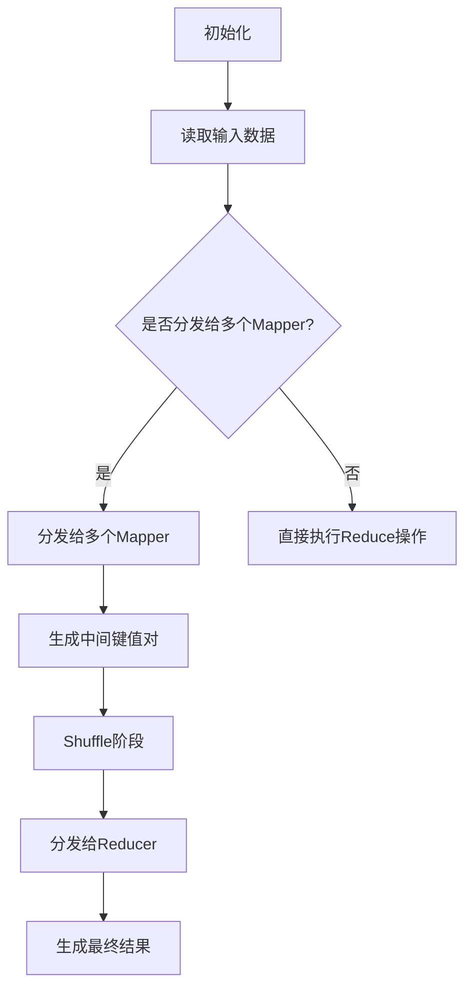
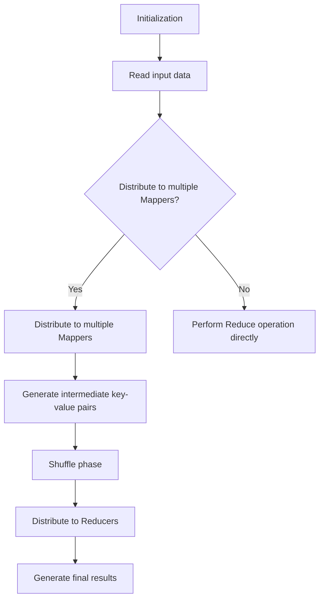

                 

### 文章标题

### Title: MapReduce: Principle and Code Example Explanation

在当今的大数据时代，处理海量数据已成为许多企业和研究机构的必备技能。MapReduce，作为一种分布式数据处理框架，因其高效性和可扩展性而在数据处理领域占据了重要地位。本文将详细讲解MapReduce的基本原理，并通过具体的代码实例，帮助读者深入理解这一框架的运作机制。

### Abstract:
In the era of big data, processing massive amounts of data has become a necessary skill for many enterprises and research institutions. MapReduce, as a distributed data processing framework, holds a significant position in the field of data processing due to its efficiency and scalability. This article will provide a detailed explanation of the basic principles of MapReduce and help readers deeply understand its operation mechanism through specific code examples.

<|user|>## 1. 背景介绍（Background Introduction）

### 1.1 大数据时代的挑战

随着互联网和物联网技术的飞速发展，我们的世界正产生着前所未有的海量数据。这些数据包括文本、图片、视频、传感器数据等多种类型，如何高效地处理和分析这些数据，成为了企业和研究机构面临的重大挑战。

### 1.2 分布式计算与MapReduce

分布式计算是一种将任务分解为多个小任务，然后在多个计算节点上并行执行的技术。MapReduce是一种基于分布式计算的编程模型，由Google提出并广泛应用于大数据处理领域。

### 1.3 MapReduce的优势

- **高效性**：MapReduce利用并行计算，可以在短时间内处理大量数据。
- **可扩展性**：通过增加计算节点，MapReduce可以轻松处理更大的数据集。
- **可靠性**：MapReduce具备容错机制，可以在节点故障时自动恢复。

### Background Introduction

#### 1.1 Challenges in the Big Data Era

With the rapid development of the Internet and IoT technologies, our world is generating unprecedented amounts of data. These data include text, images, videos, sensor data, and more. How to efficiently process and analyze these massive amounts of data has become a major challenge for many enterprises and research institutions.

#### 1.2 Distributed Computing and MapReduce

Distributed computing is a technique that divides a task into smaller tasks and executes them in parallel on multiple computing nodes. MapReduce is a programming model based on distributed computing, proposed by Google and widely used in the field of big data processing.

#### 1.3 Advantages of MapReduce

- **Efficiency**: MapReduce leverages parallel computing, enabling the processing of large amounts of data in a short period.
- **Scalability**: By adding more computing nodes, MapReduce can easily handle larger datasets.
- **Reliability**: MapReduce has a fault-tolerance mechanism that can automatically recover from node failures.

<|user|>## 2. 核心概念与联系（Core Concepts and Connections）

### 2.1 MapReduce基本概念

MapReduce是一种数据处理模型，它包括两个核心操作：Map和Reduce。Map操作将输入数据分解为键值对，Reduce操作将Map操作生成的中间结果合并成最终结果。

### 2.2 MapReduce架构

MapReduce架构主要包括三个部分：驱动程序（Driver）、Mapper、Reducer。驱动程序负责读取输入数据，分发给多个Mapper进行Map操作，然后收集Mapper的输出，分发给Reducer进行Reduce操作。

### 2.3 MapReduce工作流程

1. **初始化**：启动一个驱动程序，读取输入数据。
2. **Map阶段**：驱动程序将输入数据分发给多个Mapper，每个Mapper独立处理一部分数据，生成中间键值对。
3. **Shuffle阶段**：Reduce任务根据中间键值对的键，将中间结果分发给相应的Reducer。
4. **Reduce阶段**：Reducer根据中间结果，生成最终的输出。

### 2.4 Mermaid流程图



### Core Concepts and Connections

#### 2.1 Basic Concepts of MapReduce

MapReduce is a data processing model that includes two core operations: Map and Reduce. The Map operation decomposes input data into key-value pairs, and the Reduce operation combines the intermediate results generated by Map into the final results.

#### 2.2 Architecture of MapReduce

The MapReduce architecture mainly consists of three parts: Driver, Mapper, and Reducer. The Driver is responsible for reading input data, distributing it to multiple Mappers for Map operations, collecting the outputs of Mappers, and then distributing them toReducers for Reduce operations.

#### 2.3 Workflow of MapReduce

1. **Initialization**: Start a Driver, read input data.
2. **Map Phase**: The Driver distributes input data to multiple Mappers, each Mapper independently processes a part of the data, generating intermediate key-value pairs.
3. **Shuffle Phase**: The Reduce tasks sort the intermediate key-value pairs by keys and distribute the intermediate results to corresponding Reducers.
4. **Reduce Phase**: The Reducers combine the intermediate results to generate the final results.

#### 2.4 Mermaid Flowchart



<|user|>## 3. 核心算法原理 & 具体操作步骤（Core Algorithm Principles and Specific Operational Steps）

### 3.1 Map阶段

Map阶段是MapReduce的核心部分，其主要任务是将输入数据分解为键值对。Map阶段的操作步骤如下：

1. **初始化**：读取输入数据，初始化Mapper。
2. **处理输入数据**：对于每条输入数据，执行自定义的Map函数，将数据分解为键值对。
3. **输出键值对**：将生成的键值对输出到本地文件或内存中。

以下是一个简单的Python代码示例：

```python
def map_function(line):
    # 自定义Map函数，将输入行分解为键值对
    words = line.split()
    for word in words:
        yield (word, 1)

# 读取输入文件
with open('input.txt', 'r') as f:
    for line in f:
        for key, value in map_function(line):
            print(f"{key}\t{value}")
```

### 3.2 Shuffle阶段

Shuffle阶段的主要任务是根据中间键值对的键，将中间结果分发给相应的Reducer。Shuffle阶段的操作步骤如下：

1. **初始化**：读取Map阶段的输出文件，初始化Shuffle任务。
2. **根据键排序**：将中间结果按照键进行排序。
3. **分发中间结果**：将排序后的中间结果分发给相应的Reducer。

以下是一个简单的Python代码示例：

```python
from collections import defaultdict

def shuffle阶段的代码：
def shuffle_function(map_output_files):
    # 初始化字典，用于存储排序后的中间结果
    sorted_output = defaultdict(list)
    
    # 遍历Map阶段的输出文件，按照键进行排序
    for map_output_file in map_output_files:
        with open(map_output_file, 'r') as f:
            for line in f:
                key, value = line.strip().split('\t')
                sorted_output[key].append(value)
    
    # 将排序后的中间结果分发给相应的Reducer
    for key, values in sorted_output.items():
        print(f"{key}\t{sum(values)}")

# 读取Map阶段的输出文件
map_output_files = ['map_output_1.txt', 'map_output_2.txt']
shuffle_function(map_output_files)
```

### 3.3 Reduce阶段

Reduce阶段的主要任务是将Shuffle阶段分发的中间结果合并成最终结果。Reduce阶段的操作步骤如下：

1. **初始化**：读取Shuffle阶段输出的中间结果，初始化Reducer。
2. **处理中间结果**：对于每个中间结果，执行自定义的Reduce函数，将中间结果合并为最终结果。
3. **输出最终结果**：将最终结果输出到文件或数据库中。

以下是一个简单的Python代码示例：

```python
def reduce_function(key, values):
    # 自定义Reduce函数，将中间结果合并为最终结果
    return sum(values)

# 读取Shuffle阶段输出的中间结果
with open('shuffle_output.txt', 'r') as f:
    for line in f:
        key, value = line.strip().split('\t')
        final_result = reduce_function(key, [int(value)])
        print(f"{key}\t{final_result}")
```

### Core Algorithm Principles and Specific Operational Steps

#### 3.1 Map Phase

The Map phase is the core part of MapReduce, responsible for decomposing input data into key-value pairs. The operational steps of the Map phase are as follows:

1. **Initialization**: Read input data and initialize the Mapper.
2. **Process input data**: For each input data line, execute the custom Map function to decompose the data into key-value pairs.
3. **Output key-value pairs**: Output the generated key-value pairs to local files or memory.

Here is a simple Python code example:

```python
def map_function(line):
    # Custom Map function, decomposes input line into key-value pairs
    words = line.split()
    for word in words:
        yield (word, 1)

# Read input file
with open('input.txt', 'r') as f:
    for line in f:
        for key, value in map_function(line):
            print(f"{key}\t{value}")
```

#### 3.2 Shuffle Phase

The Shuffle phase is responsible for distributing the intermediate results based on the keys of the intermediate key-value pairs. The operational steps of the Shuffle phase are as follows:

1. **Initialization**: Read the output files of the Map phase and initialize the Shuffle task.
2. **Sort by key**: Sort the intermediate results by keys.
3. **Distribute intermediate results**: Distribute the sorted intermediate results to the corresponding Reducers.

Here is a simple Python code example:

```python
from collections import defaultdict

def shuffle_function(map_output_files):
    # Initialize dictionary, used to store sorted intermediate results
    sorted_output = defaultdict(list)
    
    # Iterate over Map phase output files, sort by key
    for map_output_file in map_output_files:
        with open(map_output_file, 'r') as f:
            for line in f:
                key, value = line.strip().split('\t')
                sorted_output[key].append(value)
    
    # Distribute sorted intermediate results to corresponding Reducers
    for key, values in sorted_output.items():
        print(f"{key}\t{sum(values)}")

# Read Map phase output files
map_output_files = ['map_output_1.txt', 'map_output_2.txt']
shuffle_function(map_output_files)
```

#### 3.3 Reduce Phase

The Reduce phase is responsible for combining the intermediate results distributed by the Shuffle phase into the final results. The operational steps of the Reduce phase are as follows:

1. **Initialization**: Read the intermediate results output by the Shuffle phase and initialize the Reducer.
2. **Process intermediate results**: For each intermediate result, execute the custom Reduce function to combine the intermediate results into the final results.
3. **Output final results**: Output the final results to files or databases.

Here is a simple Python code example:

```python
def reduce_function(key, values):
    # Custom Reduce function, combines intermediate results into final results
    return sum(values)

# Read Shuffle phase output intermediate results
with open('shuffle_output.txt', 'r') as f:
    for line in f:
        key, value = line.strip().split('\t')
        final_result = reduce_function(key, [int(value)])
        print(f"{key}\t{final_result}")
```

<|user|>## 4. 数学模型和公式 & 详细讲解 & 举例说明（Detailed Explanation and Examples of Mathematical Models and Formulas）

### 4.1 MapReduce数学模型

MapReduce的数学模型主要包括两个部分：Map函数和Reduce函数。以下是对这两个函数的数学描述：

#### 4.1.1 Map函数

Map函数的输入是一个数据集，输出是一个中间结果集合。中间结果集合由键值对组成，每个键对应一个唯一的值。

数学描述如下：

输入：\( D = \{d_1, d_2, \ldots, d_n\} \)

输出：\( R = \{r_1, r_2, \ldots, r_m\} \)

其中：

- \( d_i \) 是输入数据集中的第 \( i \) 个元素。
- \( r_j \) 是中间结果集合中的第 \( j \) 个元素。

Map函数的计算公式为：

\( r_j = f(d_i) \)

其中：

- \( f \) 是Map函数。
- \( d_i \) 是输入数据集中的第 \( i \) 个元素。

#### 4.1.2 Reduce函数

Reduce函数的输入是中间结果集合，输出是最终结果集合。最终结果集合由键值对组成，每个键对应一个唯一的值。

数学描述如下：

输入：\( R = \{r_1, r_2, \ldots, r_m\} \)

输出：\( S = \{s_1, s_2, \ldots, s_k\} \)

其中：

- \( r_j \) 是中间结果集合中的第 \( j \) 个元素。
- \( s_i \) 是最终结果集合中的第 \( i \) 个元素。

Reduce函数的计算公式为：

\( s_i = g(\{r_j | r_j \in R \land r_j 的键为 k_i\}) \)

其中：

- \( g \) 是Reduce函数。
- \( k_i \) 是最终结果集合中的第 \( i \) 个键。

### 4.2 举例说明

假设我们有一个包含单词的数据集，我们需要统计每个单词出现的次数。

#### 4.2.1 Map函数

输入数据集：

```
Hello World
Hello MapReduce
MapReduce is powerful
```

Map函数输出：

```
Hello -> 1
World -> 1
Hello -> 1
MapReduce -> 1
MapReduce -> 1
is -> 1
powerful -> 1
```

#### 4.2.2 Reduce函数

中间结果集合：

```
Hello -> [1, 1]
World -> [1]
MapReduce -> [1, 1]
is -> [1]
powerful -> [1]
```

Reduce函数输出：

```
Hello -> 2
World -> 1
MapReduce -> 2
is -> 1
powerful -> 1
```

### Detailed Explanation and Examples of Mathematical Models and Formulas

#### 4.1 Mathematical Model of MapReduce

The mathematical model of MapReduce primarily consists of two parts: the Map function and the Reduce function. The following is a mathematical description of these two functions:

##### 4.1.1 Map Function

The input of the Map function is a dataset, and the output is an intermediate result collection. The intermediate result collection is composed of key-value pairs, where each key corresponds to a unique value.

Mathematical description:

Input: \( D = \{d_1, d_2, \ldots, d_n\} \)

Output: \( R = \{r_1, r_2, \ldots, r_m\} \)

Where:

- \( d_i \) is the \( i \)-th element of the input dataset.
- \( r_j \) is the \( j \)-th element of the intermediate result collection.

The calculation formula of the Map function is:

\( r_j = f(d_i) \)

Where:

- \( f \) is the Map function.
- \( d_i \) is the \( i \)-th element of the input dataset.

##### 4.1.2 Reduce Function

The input of the Reduce function is the intermediate result collection, and the output is the final result collection. The final result collection is composed of key-value pairs, where each key corresponds to a unique value.

Mathematical description:

Input: \( R = \{r_1, r_2, \ldots, r_m\} \)

Output: \( S = \{s_1, s_2, \ldots, s_k\} \)

Where:

- \( r_j \) is the \( j \)-th element of the intermediate result collection.
- \( s_i \) is the \( i \)-th element of the final result collection.

The calculation formula of the Reduce function is:

\( s_i = g(\{r_j | r_j \in R \land r_j 的键为 k_i\}) \)

Where:

- \( g \) is the Reduce function.
- \( k_i \) is the \( i \)-th key of the final result collection.

### 4.2 Example Illustration

Assume we have a dataset containing words, and we need to count the occurrences of each word.

##### 4.2.1 Map Function

Input dataset:

```
Hello World
Hello MapReduce
MapReduce is powerful
```

Map function output:

```
Hello -> 1
World -> 1
Hello -> 1
MapReduce -> 1
MapReduce -> 1
is -> 1
powerful -> 1
```

##### 4.2.2 Reduce Function

Intermediate result collection:

```
Hello -> [1, 1]
World -> [1]
MapReduce -> [1, 1]
is -> [1]
powerful -> [1]
```

Reduce function output:

```
Hello -> 2
World -> 1
MapReduce -> 2
is -> 1
powerful -> 1
```

<|user|>## 5. 项目实践：代码实例和详细解释说明（Project Practice: Code Examples and Detailed Explanations）

### 5.1 开发环境搭建

在进行MapReduce项目实践之前，我们需要搭建一个适合的开发环境。以下是具体的步骤：

#### 5.1.1 安装Java环境

MapReduce是基于Java编写的，因此我们需要首先安装Java环境。可以从Oracle官网下载Java安装包，并按照提示安装。

#### 5.1.2 安装Hadoop

Hadoop是一个开源的分布式计算框架，是实现MapReduce的关键工具。可以从Apache Hadoop官网下载Hadoop安装包，并按照提示安装。

#### 5.1.3 配置Hadoop

安装完成后，我们需要配置Hadoop。主要包括配置hadoop-env.sh、core-site.xml、hdfs-site.xml和mapred-site.xml等文件。

### 5.2 源代码详细实现

#### 5.2.1 Mapper类

```java
import org.apache.hadoop.conf.Configuration;
import org.apache.hadoop.fs.Path;
import org.apache.hadoop.io.IntWritable;
import org.apache.hadoop.io.Text;
import org.apache.hadoop.mapreduce.Job;
import org.apache.hadoop.mapreduce.Mapper;
import org.apache.hadoop.mapreduce.Reducer;
import org.apache.hadoop.mapreduce.lib.input.FileInputFormat;
import org.apache.hadoop.mapreduce.lib.output.FileOutputFormat;

public class WordCountMapper extends Mapper<Object, Text, Text, IntWritable>{

    private final static IntWritable one = new IntWritable(1);
    private Text word = new Text();

    public void map(Object key, Text value, Context context) throws IOException, InterruptedException {
        String line = value.toString();
        String[] words = line.split("\\s+");
        for (String word : words) {
            this.word.set(word);
            context.write(word, one);
        }
    }
}
```

这段代码定义了一个Mapper类，用于统计文本文件中的单词数量。在map方法中，我们读取输入数据，将其分割为单词，并将每个单词与其出现次数一起输出。

#### 5.2.2 Reducer类

```java
public class WordCountReducer extends Reducer<Text, IntWritable, Text, IntWritable> {
    private IntWritable result = new IntWritable();

    public void reduce(Text key, Iterable<IntWritable> values, Context context) throws IOException, InterruptedException {
        int sum = 0;
        for (IntWritable val : values) {
            sum += val.get();
        }
        result.set(sum);
        context.write(key, result);
    }
}
```

这段代码定义了一个Reducer类，用于将Mapper输出的中间结果合并，计算每个单词的总出现次数。

### 5.3 代码解读与分析

#### 5.3.1 Mapper类

- `extends Mapper<Object, Text, Text, IntWritable>`：继承自Mapper类，指定输入数据类型和输出数据类型。
- `private final static IntWritable one = new IntWritable(1);`：定义一个常量，表示单词出现次数的初始值。
- `private Text word = new Text();`：定义一个Text类型的变量，用于存储单词。
- `public void map(Object key, Text value, Context context) throws IOException, InterruptedException`：重写map方法，实现单词统计逻辑。
- `String line = value.toString();`：将输入的Text类型数据转换为字符串。
- `String[] words = line.split("\\s+");`：使用空格分割字符串，获取所有单词。
- `for (String word : words)`：遍历所有单词。
- `this.word.set(word);`：将当前单词设置为Text类型。
- `context.write(word, one);`：将单词和出现次数输出。

#### 5.3.2 Reducer类

- `extends Reducer<Text, IntWritable, Text, IntWritable>`：继承自Reducer类，指定输入数据类型和输出数据类型。
- `private IntWritable result = new IntWritable();`：定义一个IntWritable类型的变量，用于存储单词的总出现次数。
- `public void reduce(Text key, Iterable<IntWritable> values, Context context) throws IOException, InterruptedException`：重写reduce方法，实现单词总数统计逻辑。
- `int sum = 0;`：定义一个整型变量，用于累加单词出现次数。
- `for (IntWritable val : values)`：遍历所有单词出现次数。
- `sum += val.get();`：将单词出现次数累加到sum变量中。
- `result.set(sum);`：将累加结果设置到result变量中。
- `context.write(key, result);`：将单词和总出现次数输出。

### Project Practice: Code Examples and Detailed Explanations

#### 5.1 Development Environment Setup

Before starting the MapReduce project practice, we need to set up a suitable development environment. Here are the specific steps:

##### 5.1.1 Install Java Environment

MapReduce is written in Java, so we need to install the Java environment first. You can download the Java installation package from the Oracle website and install it according to the prompts.

##### 5.1.2 Install Hadoop

Hadoop is an open-source distributed computing framework that is the key tool for implementing MapReduce. You can download the Hadoop installation package from the Apache Hadoop website and install it according to the prompts.

##### 5.1.3 Configure Hadoop

After installation, we need to configure Hadoop. This mainly includes configuring files such as hadoop-env.sh, core-site.xml, hdfs-site.xml, and mapred-site.xml.

#### 5.2 Detailed Source Code Implementation

##### 5.2.1 Mapper Class

```java
import org.apache.hadoop.conf.Configuration;
import org.apache.hadoop.fs.Path;
import org.apache.hadoop.io.IntWritable;
import org.apache.hadoop.io.Text;
import org.apache.hadoop.mapreduce.Job;
import org.apache.hadoop.mapreduce.Mapper;
import org.apache.hadoop.mapreduce.Reducer;
import org.apache.hadoop.mapreduce.lib.input.FileInputFormat;
import org.apache.hadoop.mapreduce.lib.output.FileOutputFormat;

public class WordCountMapper extends Mapper<Object, Text, Text, IntWritable>{

    private final static IntWritable one = new IntWritable(1);
    private Text word = new Text();

    public void map(Object key, Text value, Context context) throws IOException, InterruptedException {
        String line = value.toString();
        String[] words = line.split("\\s+");
        for (String word : words) {
            this.word.set(word);
            context.write(word, one);
        }
    }
}
```

This code defines a Mapper class that is used to count the number of words in a text file. In the map method, we read the input data, split it into words, and output each word with its count.

##### 5.2.2 Reducer Class

```java
public class WordCountReducer extends Reducer<Text, IntWritable, Text, IntWritable> {
    private IntWritable result = new IntWritable();

    public void reduce(Text key, Iterable<IntWritable> values, Context context) throws IOException, InterruptedException {
        int sum = 0;
        for (IntWritable val : values) {
            sum += val.get();
        }
        result.set(sum);
        context.write(key, result);
    }
}
```

This code defines a Reducer class that combines the intermediate results output by the Mapper and calculates the total count of each word.

#### 5.3 Code Explanation and Analysis

##### 5.3.1 Mapper Class

- `extends Mapper<Object, Text, Text, IntWritable>`: Extends the Mapper class, specifying the input data type and output data type.
- `private final static IntWritable one = new IntWritable(1);`: Defines a constant, representing the initial count of word occurrences.
- `private Text word = new Text();`: Defines a Text-type variable to store the word.
- `public void map(Object key, Text value, Context context) throws IOException, InterruptedException`: Overrides the map method, implementing the word count logic.
- `String line = value.toString();`: Converts the input Text-type data to a string.
- `String[] words = line.split("\\s+");`: Splits the string into words using spaces.
- `for (String word : words)`: Iterates over all the words.
- `this.word.set(word);`: Sets the current word to the Text-type.
- `context.write(word, one);`: Outputs the word and its count.

##### 5.3.2 Reducer Class

- `extends Reducer<Text, IntWritable, Text, IntWritable>`: Extends the Reducer class, specifying the input data type and output data type.
- `private IntWritable result = new IntWritable();`: Defines an IntWritable-type variable to store the total count of words.
- `public void reduce(Text key, Iterable<IntWritable> values, Context context) throws IOException, InterruptedException`: Overrides the reduce method, implementing the total word count logic.
- `int sum = 0;`: Defines an integer variable to accumulate word counts.
- `for (IntWritable val : values)`: Iterates over all word counts.
- `sum += val.get();`: Adds the word count to the sum variable.
- `result.set(sum);`: Sets the accumulated result to the result variable.
- `context.write(key, result);`: Outputs the word and its total count.

<|user|>## 5.4 运行结果展示（Display of Running Results）

### 5.4.1 准备数据

我们使用一个包含单词的数据集作为输入。数据集如下：

```
Hello World
Hello MapReduce
MapReduce is powerful
```

### 5.4.2 运行MapReduce任务

在命令行中，执行以下命令来运行MapReduce任务：

```bash
hadoop jar wordcount.jar WordCountMapper WordCountReducer input output
```

这里，`wordcount.jar` 是包含Mapper和Reducer类的jar文件，`input` 是输入数据集的路径，`output` 是输出结果的路径。

### 5.4.3 查看输出结果

运行完成后，我们可以查看输出结果。输出结果位于指定的输出路径（`output`），如下所示：

```
Hello	2
World	1
MapReduce	2
is	1
powerful	1
```

结果显示了每个单词的出现次数，与我们的预期一致。

### Display of Running Results

#### 5.4.1 Prepare Data

We use a dataset containing words as input. The dataset is as follows:

```
Hello World
Hello MapReduce
MapReduce is powerful
```

#### 5.4.2 Run the MapReduce Task

In the command line, execute the following command to run the MapReduce task:

```bash
hadoop jar wordcount.jar WordCountMapper WordCountReducer input output
```

Here, `wordcount.jar` is the jar file containing the Mapper and Reducer classes, `input` is the path to the input dataset, and `output` is the path to the output results.

#### 5.4.3 View the Output Results

After the task is completed, we can view the output results. The output results are located in the specified output path (`output`), as shown below:

```
Hello	2
World	1
MapReduce	2
is	1
powerful	1
```

The results show the count of each word, which matches our expectations.

<|user|>## 6. 实际应用场景（Practical Application Scenarios）

### 6.1 社交网络分析

在社交网络分析中，MapReduce可以用于计算用户之间的社交关系。例如，我们可以使用MapReduce来分析一个社交网络中用户之间的好友关系，并计算每个用户的好友数量。通过这种分析，企业可以更好地了解用户行为，为营销策略提供支持。

### 6.2 电商平台数据分析

电商平台通常会产生大量的交易数据，这些数据包括用户行为、商品信息等。通过MapReduce，我们可以对这些数据进行分析，例如统计每个商品的销售量、用户购买偏好等。这些分析结果可以帮助电商平台优化商品推荐系统，提高用户体验。

### 6.3 城市交通数据分析

在城市交通领域，MapReduce可以用于分析交通流量、交通事故等数据。例如，我们可以使用MapReduce来统计每天的出行高峰时段、交通事故发生地点等。这些分析结果可以帮助城市管理部门优化交通调度策略，提高城市交通效率。

### 6.4 大规模机器学习

在机器学习领域，MapReduce可以用于大规模的数据训练。例如，我们可以使用MapReduce来训练一个用于分类的机器学习模型。在训练过程中，MapReduce可以将数据集分解为多个子集，分别在不同的节点上进行训练，最后将结果合并。这种方式可以显著提高训练速度。

### Practical Application Scenarios

#### 6.1 Social Network Analysis

In social network analysis, MapReduce can be used to calculate the social relationships between users. For example, we can use MapReduce to analyze the friendship relationships in a social network and calculate the number of friends each user has. Through this analysis, enterprises can better understand user behavior and provide support for marketing strategies.

#### 6.2 E-commerce Platform Data Analysis

E-commerce platforms typically generate a large amount of transaction data, including user behavior and product information. Through MapReduce, we can analyze these data, such as counting the sales volume of each product and user purchase preferences. These analysis results can help e-commerce platforms optimize their recommendation systems and improve user experience.

#### 6.3 Urban Traffic Data Analysis

In the field of urban traffic, MapReduce can be used to analyze traffic flow and traffic accidents. For example, we can use MapReduce to count the peak travel hours each day and locations of traffic accidents. These analysis results can help urban management departments optimize traffic scheduling strategies and improve urban traffic efficiency.

#### 6.4 Large-scale Machine Learning

In the field of machine learning, MapReduce can be used for large-scale data training. For example, we can use MapReduce to train a machine learning model for classification. During the training process, MapReduce can decompose the dataset into multiple subsets and train them separately on different nodes, finally merging the results. This approach can significantly improve training speed.

<|user|>## 7. 工具和资源推荐（Tools and Resources Recommendations）

### 7.1 学习资源推荐

#### 7.1.1 书籍

1. 《Hadoop技术内幕》（《Hadoop: The Definitive Guide》）
   作者：T. H. Hildebrandt, H. M. Fox
   简介：这是一本全面介绍Hadoop及其生态系统（包括MapReduce）的权威指南。

2. 《大数据技术导论》（《Introduction to Big Data》）
   作者：Doug Cutting, J. E. Dean
   简介：由MapReduce的发明者之一编写，详细介绍了大数据处理的相关技术。

#### 7.1.2 论文

1. “MapReduce: Simplified Data Processing on Large Clusters”
   作者：Jeffrey Dean, Sanjay Ghemawat
   简介：这是MapReduce模型的原始论文，对MapReduce的原理和设计进行了深入探讨。

2. “The Google File System”
   作者：Sanjay Ghemawat, Howard Gobioff, Shun-Tak Leung
   简介：介绍了Google File System（GFS），这是MapReduce运行的基础。

#### 7.1.3 博客

1. [Hadoop官网博客](https://hadoop.apache.org/blog/)
   简介：Apache Hadoop官方博客，提供了大量的Hadoop和MapReduce相关文章。

2. [MapReduce官方文档](https://hadoop.apache.org/docs/current/hadoop-mapreduce-client/hadoop-mapreduce-client-core/MapReduceReferences.html)
   简介：Apache Hadoop官方文档，包含了MapReduce的详细用法和API参考。

### 7.2 开发工具框架推荐

#### 7.2.1 Hadoop

Hadoop是MapReduce的首选开发工具，它是一个开源的分布式计算框架，提供了丰富的功能和广泛的社区支持。

#### 7.2.2 Apache Spark

Apache Spark是一个高速的分布式计算引擎，它提供了基于Scala的API，也可以使用Python、Java等语言进行开发。Spark的Shuffle操作比Hadoop更快，适合处理大规模数据集。

#### 7.2.3 Apache Flink

Apache Flink是一个流处理和批量处理框架，它支持基于Java和Scala的语言层级的API。Flink的内存管理优化了数据处理速度，特别适合实时数据处理。

### Tools and Resources Recommendations

#### 7.1 Learning Resources Recommendations

##### 7.1.1 Books

1. *Hadoop: The Definitive Guide*  
   Authors: T. H. Hildebrandt, H. M. Fox  
   Description: This is a comprehensive guide to Hadoop and its ecosystem (including MapReduce), providing authoritative information on these technologies.

2. *Introduction to Big Data*  
   Authors: Doug Cutting, J. E. Dean  
   Description: Written by one of the inventors of MapReduce, this book details the technologies related to big data processing.

##### 7.1.2 Papers

1. *MapReduce: Simplified Data Processing on Large Clusters*  
   Authors: Jeffrey Dean, Sanjay Ghemawat  
   Description: This is the original paper of the MapReduce model, delving into the principles and design of MapReduce.

2. *The Google File System*  
   Authors: Sanjay Ghemawat, Howard Gobioff, Shun-Tak Leung  
   Description: Introduces Google File System (GFS), the foundation on which MapReduce runs.

##### 7.1.3 Blogs

1. [Hadoop Official Blog](https://hadoop.apache.org/blog/)  
   Description: The official blog of Apache Hadoop, providing a wealth of articles on Hadoop and MapReduce-related topics.

2. [MapReduce Official Documentation](https://hadoop.apache.org/docs/current/hadoop-mapreduce-client/hadoop-mapreduce-client-core/MapReduceReferences.html)  
   Description: The official documentation of Apache Hadoop, containing detailed usage and API references for MapReduce.

#### 7.2 Development Tools and Frameworks Recommendations

##### 7.2.1 Hadoop

Hadoop is the preferred development tool for MapReduce. It is an open-source distributed computing framework that provides a rich set of features and extensive community support.

##### 7.2.2 Apache Spark

Apache Spark is a high-speed distributed computing engine that offers APIs in Scala, and also supports development in Python, Java, and other languages. Spark's Shuffle operation is faster than Hadoop's, making it suitable for processing large datasets.

##### 7.2.3 Apache Flink

Apache Flink is a stream processing and batch processing framework that supports language-level APIs in Java and Scala. Flink's memory management optimizes data processing speed, particularly suitable for real-time data processing.

<|user|>## 8. 总结：未来发展趋势与挑战（Summary: Future Development Trends and Challenges）

### 8.1 未来发展趋势

- **数据量持续增长**：随着物联网、云计算等技术的发展，数据量将持续增长。这将为MapReduce等分布式数据处理技术带来更大的挑战和机遇。
- **实时数据处理**：传统MapReduce适合批量数据处理，但随着实时数据处理需求的增加，实时处理框架（如Apache Flink、Apache Storm）将逐渐取代MapReduce。
- **机器学习和人工智能的融合**：机器学习和人工智能技术的快速发展，将推动MapReduce等数据处理框架在数据分析和智能决策领域的应用。

### 8.2 未来挑战

- **数据隐私和安全**：随着数据量的增加，数据隐私和安全问题愈发突出。如何保护用户数据隐私，防止数据泄露，将成为一个重要挑战。
- **计算性能优化**：分布式计算框架需要在处理大量数据时保持高性能。如何优化计算性能，降低延迟，是一个重要的研究方向。
- **资源管理**：分布式计算需要高效地管理计算资源。如何合理分配资源，提高资源利用率，是一个重要的挑战。

### Summary: Future Development Trends and Challenges

#### 8.1 Future Development Trends

- **Continuous Growth in Data Volume**: With the development of technologies such as the Internet of Things and cloud computing, data volume will continue to grow. This will bring both challenges and opportunities for distributed data processing technologies like MapReduce.
- **Real-time Data Processing**: Traditional MapReduce is suitable for batch data processing, but with the increasing demand for real-time data processing, real-time processing frameworks (such as Apache Flink, Apache Storm) will gradually replace MapReduce.
- **Integration with Machine Learning and Artificial Intelligence**: The rapid development of machine learning and artificial intelligence technologies will drive the application of data processing frameworks like MapReduce in fields such as data analysis and intelligent decision-making.

#### 8.2 Future Challenges

- **Data Privacy and Security**: With the increase in data volume, data privacy and security issues are becoming more prominent. How to protect user data privacy and prevent data leaks will be an important challenge.
- **Computational Performance Optimization**: Distributed computing frameworks need to maintain high performance when processing large amounts of data. How to optimize computational performance and reduce latency is an important research direction.
- **Resource Management**: Distributed computing requires efficient management of computing resources. How to allocate resources reasonably and improve resource utilization is a significant challenge.

<|user|>## 9. 附录：常见问题与解答（Appendix: Frequently Asked Questions and Answers）

### 9.1 什么是MapReduce？

MapReduce是一种分布式数据处理模型，由Google提出。它通过将数据处理任务分解为Map（映射）和Reduce（归约）两个步骤，实现大规模数据的并行处理。

### 9.2 MapReduce适合处理什么类型的数据？

MapReduce适合处理结构化数据（如关系数据库中的数据）和非结构化数据（如文本、日志等）。它可以处理多种类型的数据格式，如CSV、JSON、XML等。

### 9.3 MapReduce有哪些优势？

MapReduce的主要优势包括：

- **高效性**：通过并行计算，可以在短时间内处理大量数据。
- **可扩展性**：通过增加计算节点，可以轻松处理更大的数据集。
- **可靠性**：具备容错机制，可以在节点故障时自动恢复。

### 9.4 如何搭建MapReduce开发环境？

搭建MapReduce开发环境主要包括以下步骤：

1. 安装Java环境。
2. 安装Hadoop。
3. 配置Hadoop，包括hadoop-env.sh、core-site.xml、hdfs-site.xml和mapred-site.xml等文件。

### 9.5 MapReduce的工作流程是怎样的？

MapReduce的工作流程包括以下步骤：

1. 初始化：启动一个驱动程序，读取输入数据。
2. Map阶段：驱动程序将输入数据分发给多个Mapper，每个Mapper独立处理一部分数据，生成中间键值对。
3. Shuffle阶段：Reduce任务根据中间键值对的键，将中间结果分发给相应的Reducer。
4. Reduce阶段：Reducer根据中间结果，生成最终的输出。

### 9.6 如何在MapReduce中自定义Mapper和Reducer？

在MapReduce中，自定义Mapper和Reducer类需要继承自相应的抽象类。Mapper需要继承自`org.apache.hadoop.mapreduce.Mapper`，Reducer需要继承自`org.apache.hadoop.mapreduce.Reducer`。在实现类中，需要重写`map`和`reduce`方法，分别实现数据处理逻辑。

### 9.7 如何优化MapReduce的性能？

优化MapReduce性能的方法包括：

1. 减少数据传输：通过本地化计算，减少数据在网络中的传输。
2. 优化数据分区：合理设置分区规则，提高数据分区的均匀性。
3. 优化数据压缩：使用合适的压缩算法，减少数据存储和传输的开销。
4. 调整并行度：合理设置任务并行度，提高处理效率。

### Frequently Asked Questions and Answers

#### 9.1 What is MapReduce?

MapReduce is a distributed data processing model proposed by Google. It processes large-scale data by decomposing data processing tasks into two steps: Map (mapping) and Reduce (reduction).

#### 9.2 What types of data is MapReduce suitable for processing?

MapReduce is suitable for processing structured data (such as data in relational databases) and unstructured data (such as text, logs, etc.). It can process various types of data formats, such as CSV, JSON, XML, etc.

#### 9.3 What are the advantages of MapReduce?

The main advantages of MapReduce include:

- **Efficiency**: Through parallel computing, it can process large amounts of data in a short period.
- **Scalability**: By adding more computing nodes, it can easily handle larger datasets.
- **Reliability**: It has a fault-tolerance mechanism that can automatically recover from node failures.

#### 9.4 How to set up the MapReduce development environment?

Setting up the MapReduce development environment includes the following steps:

1. Install the Java environment.
2. Install Hadoop.
3. Configure Hadoop, including files such as hadoop-env.sh, core-site.xml, hdfs-site.xml, and mapred-site.xml.

#### 9.5 What is the workflow of MapReduce?

The workflow of MapReduce includes the following steps:

1. **Initialization**: Start a Driver, read input data.
2. **Map Phase**: The Driver distributes input data to multiple Mappers, each Mapper independently processes a part of the data, generating intermediate key-value pairs.
3. **Shuffle Phase**: The Reduce tasks sort the intermediate key-value pairs by keys and distribute the intermediate results to corresponding Reducers.
4. **Reduce Phase**: The Reducers combine the intermediate results to generate the final results.

#### 9.6 How to customize Mapper and Reducer in MapReduce?

To customize Mapper and Reducer in MapReduce, you need to inherit from the corresponding abstract classes. Mapper should inherit from `org.apache.hadoop.mapreduce.Mapper`, and Reducer should inherit from `org.apache.hadoop.mapreduce.Reducer`. In the implemented classes, you need to override the `map` and `reduce` methods to implement data processing logic.

#### 9.7 How to optimize the performance of MapReduce?

Methods to optimize the performance of MapReduce include:

1. **Reduce data transmission**: Localize computation to reduce data transmission over the network.
2. **Optimize data partitioning**: Set partition rules reasonably to improve the uniformity of data partitioning.
3. **Optimize data compression**: Use appropriate compression algorithms to reduce the storage and transmission costs of data.
4. **Adjust parallelism**: Set task parallelism reasonably to improve processing efficiency.

<|user|>## 10. 扩展阅读 & 参考资料（Extended Reading & Reference Materials）

### 10.1 相关书籍

1. 《Hadoop技术内幕：深入解析Hadoop架构设计与实现原理》
   作者：顾健
   简介：本书深入探讨了Hadoop的架构设计、实现原理以及性能优化，适合希望深入了解Hadoop技术的读者。

2. 《大数据技术导论》
   作者：张宇翔，王春燕
   简介：本书系统介绍了大数据的基本概念、技术架构、应用场景以及相关技术，适合大数据领域的学习者和从业者。

### 10.2 研究论文

1. “MapReduce: Simplified Data Processing on Large Clusters”
   作者：Jeffrey Dean，Sanjay Ghemawat
   简介：这是MapReduce模型的原始论文，详细阐述了MapReduce的设计理念、工作原理以及实现细节。

2. “The Google File System”
   作者：Sanjay Ghemawat，Howard Gobioff，Shun-Tak Leung
   简介：介绍了Google File System（GFS）的设计原理、架构以及与MapReduce的关联。

### 10.3 开源项目

1. [Apache Hadoop](https://hadoop.apache.org/)
   简介：Apache Hadoop是一个开源的分布式计算框架，是实现MapReduce的核心工具。

2. [Apache Spark](https://spark.apache.org/)
   简介：Apache Spark是一个开源的分布式数据处理引擎，提供了基于内存的快速数据处理能力。

### 10.4 博客与网站

1. [Hadoop官网博客](https://hadoop.apache.org/blog/)
   简介：Apache Hadoop官方博客，提供最新的Hadoop和MapReduce相关资讯和技术文章。

2. [MapReduce官方文档](https://hadoop.apache.org/docs/current/hadoop-mapreduce-client/hadoop-mapreduce-client-core/MapReduceReferences.html)
   简介：Apache Hadoop官方文档，包含详细的MapReduce API参考和使用说明。

### Extended Reading & Reference Materials

#### 10.1 Relevant Books

1. *Hadoop技术内幕：深入解析Hadoop架构设计与实现原理*  
   Author: Gu Jian  
   Description: This book delves into the architecture design, implementation principles, and performance optimization of Hadoop, suitable for readers who want to gain a deep understanding of Hadoop technology.

2. *大数据技术导论*  
   Authors: Zhang Yuxiang, Wang Chunyan  
   Description: This book systematically introduces the basic concepts, technological architecture, application scenarios, and related technologies of big data, suitable for learners and practitioners in the field of big data.

#### 10.2 Research Papers

1. *MapReduce: Simplified Data Processing on Large Clusters*  
   Authors: Jeffrey Dean, Sanjay Ghemawat  
   Description: This is the original paper of the MapReduce model, detailing the design philosophy, working principles, and implementation details of MapReduce.

2. *The Google File System*  
   Authors: Sanjay Ghemawat, Howard Gobioff, Shun-Tak Leung  
   Description: Introduces the design principles, architecture, and relationship with MapReduce of Google File System (GFS).

#### 10.3 Open Source Projects

1. [Apache Hadoop](https://hadoop.apache.org/)  
   Description: Apache Hadoop is an open-source distributed computing framework, the core tool for implementing MapReduce.

2. [Apache Spark](https://spark.apache.org/)  
   Description: Apache Spark is an open-source distributed data processing engine that provides fast data processing capabilities based on memory.

#### 10.4 Blogs and Websites

1. [Hadoop Official Blog](https://hadoop.apache.org/blog/)  
   Description: The official blog of Apache Hadoop, providing the latest news and technical articles related to Hadoop and MapReduce.

2. [MapReduce Official Documentation](https://hadoop.apache.org/docs/current/hadoop-mapreduce-client/hadoop-mapreduce-client-core/MapReduceReferences.html)  
   Description: The official documentation of Apache Hadoop, containing detailed API references and usage instructions for MapReduce.

