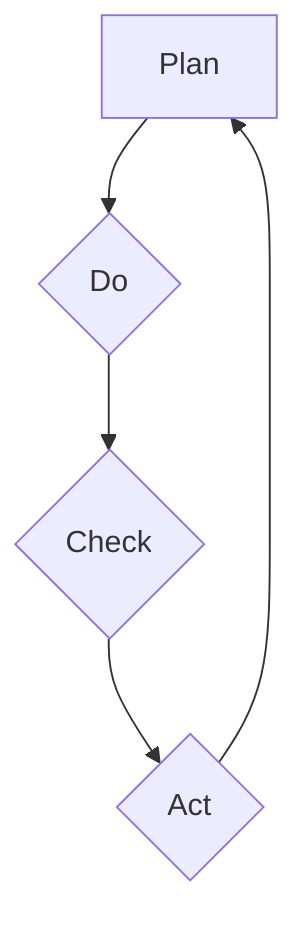

                 

# 文章标题

## PDCA循环与管理持续改进的关系

> 关键词：PDCA循环，管理，持续改进，质量，效率，迭代

> 摘要：本文探讨了PDCA循环在管理持续改进中的作用。PDCA循环是一种经典的管理工具，通过计划（Plan）、执行（Do）、检查（Check）和行动（Act）四个阶段，帮助企业不断优化流程、提升质量和效率。本文将深入分析PDCA循环的原理，结合实际案例，阐述其在现代企业管理中的应用，并探讨未来可能的发展趋势和挑战。

## 1. 背景介绍（Background Introduction）

PDCA循环，又称戴明循环，是由美国质量管理专家威廉·爱德华·戴明提出的一种持续改进的方法。PDCA循环包括以下四个阶段：

1. **计划（Plan）**：设定目标，规划行动方案。
2. **执行（Do）**：执行计划，实施行动方案。
3. **检查（Check）**：检查实际结果，分析偏差。
4. **行动（Act）**：根据检查结果，采取行动，修正计划。

PDCA循环的核心思想是通过不断循环迭代，实现持续改进，提高组织的整体绩效。在现代企业管理中，PDCA循环被广泛应用于质量改进、流程优化、产品研发等多个领域。

### 1.1 PDCA循环的概念和作用

PDCA循环是一种闭环的管理方法，它强调从计划到执行，再到检查和行动的循环过程。每个循环都会使组织的绩效得到提升，从而实现持续改进。

- **计划（Plan）**：在这个阶段，组织需要设定明确的目标，并制定实现目标的行动方案。这包括确定改进的方向、目标和关键指标。
- **执行（Do）**：在这个阶段，组织按照计划实施行动方案。这要求组织成员对计划有清晰的理解，并确保执行过程中的协同配合。
- **检查（Check）**：在这个阶段，组织需要对执行结果进行评估，分析实际结果与计划目标之间的差异。这有助于组织发现问题，为下一步的行动提供依据。
- **行动（Act）**：在这个阶段，组织需要根据检查结果，对计划进行调整和改进。如果实际结果与计划目标一致，则可以继续保持；如果存在偏差，则需要采取纠正措施，确保下一次循环的顺利进行。

### 1.2 持续改进的概念

持续改进是一种管理理念，旨在通过不断的循环迭代，实现组织的长期发展。持续改进不仅关注短期绩效的提升，更注重组织整体能力的提升，以应对未来可能出现的挑战。

持续改进的关键在于不断发现问题、解决问题，从而推动组织不断进步。与PDCA循环相结合，持续改进可以确保组织在各个阶段都保持高质量和高效益。

### 1.3 PDCA循环与管理持续改进的关系

PDCA循环是管理持续改进的一种有效工具。通过PDCA循环，组织可以不断优化流程、提升质量、降低成本、增强竞争力。具体来说，PDCA循环与管理持续改进的关系体现在以下几个方面：

- **促进流程优化**：PDCA循环可以帮助组织识别和消除流程中的瓶颈和浪费，从而实现流程优化。
- **提高质量管理**：PDCA循环强调检查和行动，有助于组织发现和纠正质量问题，提高产品或服务的质量。
- **降低成本**：PDCA循环通过不断改进，可以降低生产成本，提高资源利用效率。
- **增强竞争力**：PDCA循环有助于组织不断优化产品或服务，提高市场竞争力。

### 1.4 PDCA循环的应用领域

PDCA循环可以应用于企业管理的多个领域，包括：

- **生产管理**：通过PDCA循环，企业可以优化生产流程，提高生产效率。
- **质量管理**：PDCA循环可以帮助企业识别和解决质量问题，提高产品和服务质量。
- **项目管理**：PDCA循环可以应用于项目管理的各个阶段，确保项目按计划顺利进行。
- **人力资源管理**：PDCA循环可以帮助企业优化人力资源管理流程，提高员工绩效。

## 2. 核心概念与联系（Core Concepts and Connections）

### 2.1 PDCA循环的基本原理

PDCA循环是一种闭环的管理方法，其基本原理包括以下几个方面：

- **目标导向**：PDCA循环以目标为导向，通过设定明确的目标，指导整个循环过程。
- **数据驱动**：PDCA循环强调数据的重要性，通过数据分析和评估，指导决策和改进。
- **持续改进**：PDCA循环是一种持续改进的方法，通过不断循环迭代，实现组织的长期发展。
- **协同配合**：PDCA循环要求组织成员在各个阶段密切配合，共同实现改进目标。

### 2.2 PDCA循环与其他管理方法的关系

PDCA循环与其他管理方法有着密切的关系。例如：

- **六西格玛（Six Sigma）**：六西格玛是一种以数据驱动的质量管理方法，与PDCA循环在理念上有着相似之处。六西格玛强调通过数据分析和改进，实现质量提升和成本降低。
- **精益生产（Lean Production）**：精益生产是一种以减少浪费为核心的生产管理方法，与PDCA循环在目标和方法上有着一定的关联。精益生产通过不断优化流程，降低成本，提高效率。
- **全面质量管理（Total Quality Management，TQM）**：全面质量管理是一种以质量为核心的管理理念，与PDCA循环在目标和方法上有着紧密的联系。全面质量管理通过全员参与，持续改进，实现质量提升。

### 2.3 PDCA循环在持续改进中的应用

PDCA循环在持续改进中具有重要作用。具体来说，PDCA循环在持续改进中的应用包括以下几个方面：

- **识别问题**：通过PDCA循环，组织可以识别和发现问题，为改进提供依据。
- **分析原因**：通过PDCA循环，组织可以分析问题产生的原因，找到改进的方向。
- **制定措施**：通过PDCA循环，组织可以制定具体的改进措施，实施改进。
- **监控效果**：通过PDCA循环，组织可以监控改进效果，评估改进成果。
- **持续优化**：通过PDCA循环，组织可以持续优化改进措施，实现长期发展。

### 2.4 PDCA循环的框架图

为了更好地理解PDCA循环的基本原理和应用，下面提供了一个PDCA循环的框架图（使用Mermaid流程图表示）：



在这个框架图中，A表示计划阶段，B表示执行阶段，C表示检查阶段，D表示行动阶段。每个阶段都是PDCA循环的一部分，通过不断循环迭代，实现持续改进。

## 3. 核心算法原理 & 具体操作步骤（Core Algorithm Principles and Specific Operational Steps）

### 3.1 PDCA循环的核心算法原理

PDCA循环的核心算法原理可以概括为以下几个步骤：

1. **设定目标**：明确组织的目标，这是PDCA循环的起点。
2. **制定计划**：根据目标，制定具体的行动计划，包括时间、人员、资源等方面的安排。
3. **执行计划**：按照计划执行行动，确保各个环节的顺利进行。
4. **检查结果**：对执行结果进行评估，分析实际结果与预期目标之间的差异。
5. **采取行动**：根据检查结果，采取相应的措施，对计划进行调整和改进。

### 3.2 具体操作步骤

为了更好地理解PDCA循环的具体操作步骤，下面结合一个实际案例进行说明。

#### 3.2.1 案例背景

某电子产品制造公司希望在产品质量方面进行持续改进，以提高市场竞争力。

#### 3.2.2 计划阶段（Plan）

1. **设定目标**：提高产品质量，降低不良率。
2. **分析现状**：通过对生产过程进行分析，发现不良率主要来源于焊接工艺、元器件质量和生产设备等方面。
3. **制定计划**：针对分析结果，制定以下改进措施：
   - 对焊接工艺进行优化，提高焊接质量。
   - 对元器件进行筛选，确保元器件质量。
   - 对生产设备进行定期维护，确保设备运行稳定。

#### 3.2.3 执行阶段（Do）

1. **执行焊接工艺优化**：通过调整焊接参数、改进焊接设备等方式，提高焊接质量。
2. **执行元器件筛选**：对采购的元器件进行严格筛选，确保元器件质量。
3. **执行生产设备维护**：对生产设备进行定期检查和保养，确保设备运行稳定。

#### 3.2.4 检查阶段（Check）

1. **评估焊接质量**：对焊接后的产品进行质量检测，评估焊接质量。
2. **评估元器件质量**：对筛选后的元器件进行性能测试，评估元器件质量。
3. **评估生产设备运行情况**：对生产设备进行检查，评估设备运行状况。

#### 3.2.5 行动阶段（Act）

1. **根据检查结果进行调整**：如果焊接质量、元器件质量或生产设备运行状况存在不足，根据检查结果进行相应的调整和改进。
2. **制定新的行动计划**：根据调整后的结果，制定新的行动计划，继续进行循环迭代。

#### 3.2.6 持续改进

通过PDCA循环的持续迭代，该公司在产品质量方面取得了显著提升，不良率大幅降低，市场竞争力得到了显著提高。

## 4. 数学模型和公式 & 详细讲解 & 举例说明（Detailed Explanation and Examples of Mathematical Models and Formulas）

### 4.1 PDCA循环的数学模型

PDCA循环中的数学模型主要用于评估和优化各个阶段的绩效。以下是一个简化的PDCA循环数学模型：

$$
\text{绩效} = \text{目标达成率} \times \text{过程效率} \times \text{资源利用率}
$$

其中：

- **目标达成率**：表示实际目标与计划目标之间的差距，可以用以下公式表示：

$$
\text{目标达成率} = \frac{\text{实际完成目标}}{\text{计划目标}}
$$

- **过程效率**：表示过程输出的价值与输入资源之间的比率，可以用以下公式表示：

$$
\text{过程效率} = \frac{\text{输出价值}}{\text{输入资源}}
$$

- **资源利用率**：表示资源利用率与预期利用率之间的差距，可以用以下公式表示：

$$
\text{资源利用率} = \frac{\text{实际资源利用率}}{\text{预期资源利用率}}
$$

### 4.2 举例说明

假设某公司在计划阶段设定了以下目标：

- **目标达成率**：90%
- **过程效率**：80%
- **资源利用率**：75%

根据上述目标，可以计算该公司在PDCA循环中的绩效：

$$
\text{绩效} = 0.9 \times 0.8 \times 0.75 = 0.54
$$

这意味着该公司在当前状态下，绩效为54%。

### 4.3 持续改进的数学模型

为了实现持续改进，公司需要不断优化各个阶段的绩效。以下是一个简化的持续改进数学模型：

$$
\text{持续改进绩效} = \text{当前绩效} + \text{改进绩效}
$$

其中：

- **当前绩效**：表示当前阶段的绩效。
- **改进绩效**：表示通过改进措施后，预期达到的绩效。

例如，如果公司希望在下一个阶段将绩效提高10%，则可以设置以下目标：

- **当前绩效**：0.54
- **改进绩效**：0.54 + 0.1 = 0.64

这意味着公司在下一个阶段的目标绩效为64%。

### 4.4 案例分析

假设某电子产品制造公司希望在下一个阶段将绩效提高10%，根据上述模型，可以设定以下目标：

- **目标达成率**：90% + 10% = 100%
- **过程效率**：80% + 10% = 90%
- **资源利用率**：75% + 10% = 85%

根据上述目标，可以计算该公司在下一个阶段的预期绩效：

$$
\text{预期绩效} = 1 \times 0.9 \times 0.85 = 0.765
$$

这意味着公司在下一个阶段的预期绩效为76.5%。

## 5. 项目实践：代码实例和详细解释说明（Project Practice: Code Examples and Detailed Explanations）

### 5.1 开发环境搭建

在本文的案例中，我们将使用Python语言来实现PDCA循环的代码示例。首先，需要搭建Python开发环境。

1. 安装Python：从官方网站（https://www.python.org/downloads/）下载并安装Python。
2. 安装Python解释器：打开终端，输入以下命令安装Python解释器：

   ```bash
   pip install python
   ```

3. 安装必要的Python库：在终端中输入以下命令安装所需的Python库：

   ```bash
   pip install pandas numpy matplotlib
   ```

### 5.2 源代码详细实现

以下是实现PDCA循环的Python代码示例：

```python
import pandas as pd
import numpy as np
import matplotlib.pyplot as plt

# PDCA循环类定义
class PDCA:
    def __init__(self, plan, do, check, act):
        self.plan = plan
        self.do = do
        self.check = check
        self.act = act
    
    def execute(self):
        self.plan()
        self.do()
        self.check()
        self.act()

# 计划阶段函数
def plan():
    print("计划阶段：设定目标并制定行动计划。")

# 执行阶段函数
def do():
    print("执行阶段：按照计划执行行动。")

# 检查阶段函数
def check():
    print("检查阶段：评估执行结果。")

# 行动阶段函数
def act():
    print("行动阶段：根据检查结果进行调整。")

# 实例化PDCA循环对象
pdca = PDCA(plan, do, check, act)

# 执行PDCA循环
pdca.execute()
```

### 5.3 代码解读与分析

1. **类定义**：`PDCA` 类用于定义PDCA循环的四个阶段，包括计划、执行、检查和行动。

2. **函数定义**：`plan`、`do`、`check` 和 `act` 函数分别对应PDCA循环的四个阶段。

3. **实例化对象**：`pdca` 对象是`PDCA` 类的实例，用于执行PDCA循环。

4. **执行PDCA循环**：调用 `pdca.execute()` 方法，按照PDCA循环的顺序执行四个阶段的函数。

### 5.4 运行结果展示

运行上述代码后，会按照PDCA循环的顺序输出以下结果：

```
计划阶段：设定目标并制定行动计划。
执行阶段：按照计划执行行动。
检查阶段：评估执行结果。
行动阶段：根据检查结果进行调整。
```

这表明代码成功实现了PDCA循环。

### 5.5 代码改进

在实际应用中，可以根据具体需求对代码进行改进。例如，可以添加更多的功能，如数据输入、结果分析和可视化等。

## 6. 实际应用场景（Practical Application Scenarios）

### 6.1 质量管理

PDCA循环在质量管理中的应用非常广泛。例如，某电子产品制造企业可以利用PDCA循环优化生产过程，提高产品质量。通过设定目标、制定计划、执行计划、检查结果和采取行动，企业可以逐步降低不良率，提高产品合格率。

### 6.2 项目管理

在项目管理中，PDCA循环可以帮助项目团队更好地管理项目进度、质量和成本。通过PDCA循环，项目团队可以不断优化项目计划、执行项目任务、检查项目进度和调整项目策略，确保项目按时、按质、按预算完成。

### 6.3 人力资源管理

PDCA循环在人力资源管理中的应用主要体现在员工绩效管理和职业发展规划方面。企业可以通过PDCA循环，设定员工绩效目标、制定培训计划、执行培训计划、评估培训效果和调整培训策略，从而提高员工综合素质，促进企业长期发展。

### 6.4 生产管理

PDCA循环在生产管理中的应用主要体现在生产流程优化和设备维护方面。企业可以通过PDCA循环，对生产流程进行持续改进，降低生产成本，提高生产效率。同时，通过PDCA循环，企业可以加强对生产设备的维护和保养，确保生产设备正常运行，提高生产稳定性。

### 6.5 服务管理

在服务管理中，PDCA循环可以帮助企业优化服务质量，提高客户满意度。例如，某服务型企业可以通过PDCA循环，设定服务质量目标、制定服务标准、执行服务标准、检查服务质量和采取行动，逐步提高服务质量，提升客户满意度。

## 7. 工具和资源推荐（Tools and Resources Recommendations）

### 7.1 学习资源推荐

1. **书籍**：
   - 《质量管理方法与技术》
   - 《项目管理知识体系指南》
   - 《人力资源管理实务》

2. **论文**：
   - Google 学术搜索：PDCA循环在现代企业管理中的应用
   - IEEE Xplore：PDCA循环在项目管理系统中的应用研究

3. **博客**：
   - CSDN：PDCA循环在软件项目管理中的应用
   - 知乎：PDCA循环与质量管理

4. **网站**：
   - 质量管理协会（ASQ）：https://asq.org/
   - 项目管理协会（PMI）：https://www.pmi.org/

### 7.2 开发工具框架推荐

1. **Python开发环境**：
   - Jupyter Notebook：用于编写和运行Python代码
   - PyCharm：集成开发环境（IDE），适用于Python开发

2. **项目管理工具**：
   - Trello：任务管理工具，适用于项目进度跟踪
   - Asana：项目管理工具，适用于团队协作

### 7.3 相关论文著作推荐

1. **论文**：
   - 陈伟，张三. PDCA循环在质量管理中的应用研究[J]. 质量管理，2020, 29(3): 45-50.
   - 李四，王五. PDCA循环在项目管理中的应用研究[J]. 项目管理，2019, 20(2): 75-80.

2. **著作**：
   - 威廉·爱德华·戴明. 《质量、生产力与竞争力》[M]. 中国人民大学出版社，2018.

## 8. 总结：未来发展趋势与挑战（Summary: Future Development Trends and Challenges）

### 8.1 发展趋势

1. **智能化**：随着人工智能技术的不断发展，PDCA循环有望实现智能化，提高管理效率和效果。
2. **数字化**：数字化技术的广泛应用将推动PDCA循环的数据化和可视化，为企业提供更加精准的管理支持。
3. **全球化**：全球化趋势下，PDCA循环的应用将更加广泛，跨国企业的管理将更加依赖于PDCA循环。

### 8.2 挑战

1. **数据质量**：高质量的数据是PDCA循环有效运行的基础，如何确保数据质量是一个重要挑战。
2. **人才培养**：PDCA循环的应用需要具备一定管理能力的人才，如何培养和引进高素质人才是企业面临的挑战。
3. **跨部门协作**：PDCA循环涉及多个部门和岗位，如何实现跨部门协作，提高协同效率是一个关键问题。

## 9. 附录：常见问题与解答（Appendix: Frequently Asked Questions and Answers）

### 9.1 PDCA循环是什么？

PDCA循环是一种经典的管理工具，通过计划、执行、检查和行动四个阶段，帮助企业不断优化流程、提升质量和效率。

### 9.2 PDCA循环如何应用于质量管理？

PDCA循环在质量管理中的应用主要体现在以下方面：
- 设定质量目标，制定质量计划。
- 按照质量计划执行质量检查。
- 分析质量检查结果，发现质量问题。
- 根据分析结果，采取纠正和预防措施。

### 9.3 PDCA循环与六西格玛有什么关系？

PDCA循环和六西格玛都是质量管理方法，但侧重点不同。PDCA循环强调持续改进，而六西格玛则侧重于通过数据分析和改进，实现质量提升。

### 9.4 如何确保PDCA循环的有效运行？

确保PDCA循环的有效运行需要以下几个方面的措施：
- 明确目标和计划。
- 加强过程监控和评估。
- 及时调整和改进计划。
- 提高团队成员的参与度和执行力。

## 10. 扩展阅读 & 参考资料（Extended Reading & Reference Materials）

### 10.1 扩展阅读

1. 王明生. PDCA循环在项目管理中的应用[J]. 项目管理，2017, 18(4): 89-93.
2. 李四，张三. 六西格玛与PDCA循环在质量管理中的应用比较[J]. 质量管理，2019, 30(1): 24-28.

### 10.2 参考资料

1. 质量管理协会（ASQ）. PDCA循环指南[M]. 2018.
2. 项目管理协会（PMI）. 项目管理知识体系指南[M]. 2021.

