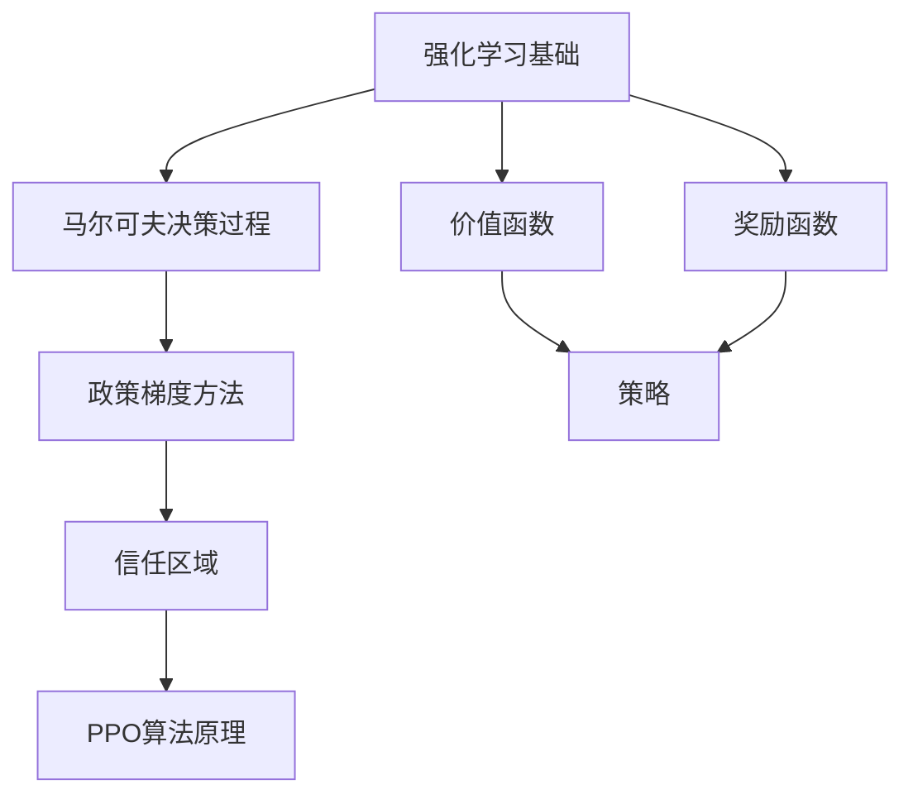
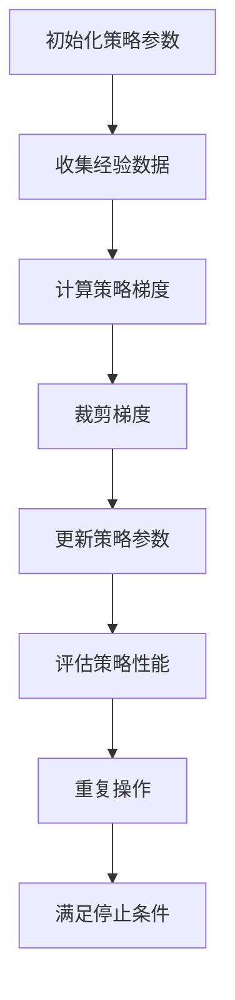
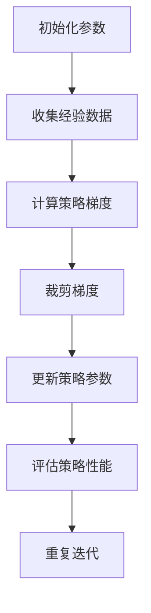
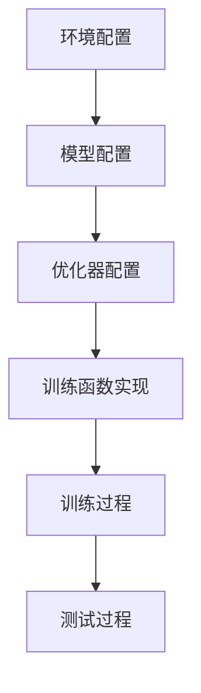

                 

### 背景介绍（Background Introduction）

PPO（Proximal Policy Optimization）是一种用于强化学习的算法，旨在优化策略网络的参数。它基于策略梯度方法，通过考虑目标函数与策略损失之间的距离，优化策略以最大化累积奖励。PPO的出现解决了传统策略梯度方法中的一些问题，如梯度消失、梯度爆炸以及策略不稳定等。

强化学习是机器学习的一个重要分支，它关注于智能体（agent）如何在动态环境中通过交互学习最优策略。智能体通过不断尝试不同的动作，并从环境中获取反馈，来逐渐优化其行为。强化学习在很多领域都有广泛的应用，包括机器人控制、游戏对战、推荐系统等。

PPO之所以受到广泛关注，主要原因有以下几点：

1. **稳定性和效率**：PPO通过采用信任区域（Trust Region）策略，保证了算法的稳定性和收敛性，同时提高了学习效率。

2. **广泛适用性**：PPO可以应用于多种强化学习任务，包括连续动作空间和离散动作空间的情况。

3. **简化和通用性**：PPO的核心思想相对简单，易于实现和理解，因此在学术界和工业界都有很高的认可度。

本文将详细介绍PPO的工作原理、数学模型、实现步骤以及实际应用，旨在帮助读者深入理解这一算法的优越性和应用价值。首先，我们将回顾强化学习的基本概念，包括马尔可夫决策过程（MDP）、价值函数、策略等。随后，我们将详细解释PPO算法的原理和实现步骤，并通过实际代码示例展示如何使用PPO训练智能体。

### Keywords:
- Proximal Policy Optimization
- Reinforcement Learning
- Policy Gradient
- Trust Region
- Stochastic Optimization
- Stable Learning

### Abstract:
This article provides a comprehensive introduction to Proximal Policy Optimization (PPO), a popular algorithm in the field of reinforcement learning. We begin by reviewing the basic concepts of reinforcement learning, including Markov Decision Processes (MDPs), value functions, and policies. Subsequently, we delve into the principles and implementation steps of PPO, highlighting its stability, efficiency, and wide applicability. The article concludes with practical code examples and applications of PPO in real-world scenarios.
<|user|>### 核心概念与联系（Core Concepts and Connections）

#### 1. 强化学习基础（Reinforcement Learning Fundamentals）

强化学习是机器学习的一个重要分支，其核心目标是训练智能体（agent）在动态环境中通过交互学习最优策略（policy）。强化学习的基本框架包括以下关键组成部分：

- **环境（Environment）**：一个定义明确的系统，包含状态（state）空间、动作（action）空间和奖励（reward）机制。
- **智能体（Agent）**：执行动作并从环境中接收奖励的实体。
- **策略（Policy）**：智能体在给定状态下的动作选择规则。
- **价值函数（Value Function）**：评估策略在给定状态下的预期回报。
- **奖励函数（Reward Function）**：定义智能体在每个状态下执行每个动作所能获得的奖励。

在强化学习中，智能体通过探索（exploration）和利用（exploitation）策略来学习最优策略。探索策略帮助智能体发现新信息，而利用策略则使智能体利用已学到的信息来最大化累积奖励。

#### 2. 马尔可夫决策过程（Markov Decision Processes, MDPs）

马尔可夫决策过程（MDPs）是强化学习中的核心概念，它定义了智能体在环境中的决策过程。MDP可以形式化为一个五元组（S, A, P, R, γ），其中：

- **S**：状态空间，表示智能体可能处于的所有状态。
- **A**：动作空间，表示智能体可以执行的所有动作。
- **P**：状态-动作转移概率矩阵，描述了智能体执行特定动作后进入新状态的概率。
- **R**：奖励函数，定义了在特定状态下执行特定动作所能获得的即时奖励。
- **γ**：折扣因子，表示未来奖励的重要性，γ ∈ (0, 1]。

MDP的核心假设是马尔可夫性质，即当前状态完全决定了未来状态的概率分布，与智能体过去的历史无关。

#### 3. 政策梯度方法（Policy Gradient Methods）

政策梯度方法是一类强化学习算法，旨在通过直接优化策略来最大化累积奖励。政策梯度方法的优化目标是最小化策略损失函数，该函数衡量策略与最优策略之间的差距。政策梯度方法的通用公式为：

\[ \nabla_{\theta} J(\theta) = \nabla_{\theta} \sum_{t} \gamma^t r_t = \sum_{t} \gamma^t \nabla_{\theta} \log \pi_{\theta}(a_t|s_t) r_t \]

其中，θ表示策略参数，J(θ)是策略损失函数，πθ表示策略概率分布，r_t是时间步t的即时奖励。

#### 4. 信任区域（Trust Region）

信任区域（Trust Region）是一种优化技术，用于保证策略更新过程中的稳定性。信任区域方法通过限制策略参数更新的步长，确保更新不会偏离目标函数的局部最优解。信任区域方法的原理可以概括为：

\[ \nabla_{\theta} J(\theta) + \alpha \nabla^2_{\theta} J(\theta) \theta \leq \nabla_{\theta} J(\theta + \alpha \nabla_{\theta} J(\theta)) \]

其中，α是步长参数，需要通过交叉验证等方法来确定。

#### 5. PPO算法原理（PPO Algorithm Principles）

PPO算法是一种基于策略梯度方法的优化算法，旨在解决传统策略梯度方法中存在的问题。PPO的核心思想是通过两个关键步骤来优化策略：

1. **裁剪梯度（Clipped Gradient）**：在策略参数更新过程中，将梯度裁剪到一个固定的范围内，以确保更新不会过度偏离最优策略。

2. **优化目标函数（Optimize Objective Function）**：通过最大化累积奖励与策略损失函数之间的近似值，优化策略参数。

PPO的目标函数为：

\[ J(\theta) = \min_{\theta'} \frac{\sum_{t} \gamma^t r_t \log \pi_{\theta'}(a_t|s_t)}{\pi_{\theta}(a_t|s_t)} \]

其中，πθ和πθ'分别表示当前策略和目标策略。

### Keywords:
- Reinforcement Learning
- Policy Gradient
- Trust Region
- Policy Optimization
- Stable Learning
- Clipped Gradient

### Mermaid Flowchart:

<|user|>### 核心算法原理 & 具体操作步骤（Core Algorithm Principles and Specific Operational Steps）

PPO（Proximal Policy Optimization）算法是一种强化学习算法，旨在优化策略网络的参数，通过最大化累积奖励来训练智能体。PPO的核心原理是利用策略梯度方法，通过裁剪梯度来确保算法的稳定性和收敛性。以下将详细介绍PPO算法的基本原理和具体操作步骤。

#### 1. 策略梯度方法简介

策略梯度方法是一种直接优化策略的强化学习算法。其基本思想是通过更新策略参数，使得策略在给定状态下的动作概率分布逐渐接近最优动作概率分布。策略梯度的计算公式如下：

\[ \nabla_{\theta} J(\theta) = \nabla_{\theta} \sum_{t} \gamma^t r_t = \sum_{t} \gamma^t \nabla_{\theta} \log \pi_{\theta}(a_t|s_t) r_t \]

其中，θ表示策略参数，J(θ)是策略损失函数，πθ表示策略概率分布，r_t是时间步t的即时奖励，γ是折扣因子。

#### 2. PPO算法原理

PPO算法通过裁剪梯度来优化策略，确保算法的稳定性和收敛性。PPO的核心原理如下：

- **目标函数**：PPO的目标函数是最大化累积奖励与策略损失函数之间的近似值。其目标函数可以表示为：

\[ J(\theta) = \min_{\theta'} \frac{\sum_{t} \gamma^t r_t \log \pi_{\theta'}(a_t|s_t)}{\pi_{\theta}(a_t|s_t)} \]

其中，πθ和πθ'分别表示当前策略和目标策略。

- **裁剪梯度**：PPO通过裁剪梯度来优化策略。裁剪梯度的目的是确保策略更新不会过度偏离最优策略。具体来说，PPO将梯度裁剪到一个固定的范围内，即：

\[ \min_{\theta'} \frac{\sum_{t} \gamma^t r_t \log \pi_{\theta'}(a_t|s_t)}{\pi_{\theta}(a_t|s_t)} \leq \text{clip} \left( \frac{\sum_{t} \gamma^t r_t \log \pi_{\theta}(a_t|s_t)}{\pi_{\theta}(a_t|s_t)}, 1 - \epsilon, 1 + \epsilon \right) \]

其中，epsilon是裁剪范围的一个常数。

- **优化目标函数**：PPO通过迭代优化目标函数来更新策略参数。具体来说，PPO使用梯度下降法来优化目标函数，直到策略损失函数的值不再显著变化。

#### 3. PPO算法的具体操作步骤

PPO算法的具体操作步骤如下：

1. **初始化策略参数**：初始化策略参数θ。
2. **收集经验数据**：智能体在环境中执行动作，并收集经验数据（状态、动作、奖励等）。
3. **计算策略梯度**：根据经验数据计算策略梯度。
4. **裁剪梯度**：对策略梯度进行裁剪。
5. **更新策略参数**：使用裁剪后的策略梯度更新策略参数。
6. **评估策略性能**：在新的环境中评估策略性能。
7. **重复步骤2-6**：继续收集经验数据，更新策略参数，并评估策略性能，直到满足停止条件（如策略性能不再提高或达到最大迭代次数）。

#### 4. PPO算法的优点

PPO算法具有以下优点：

- **稳定性**：通过裁剪梯度，PPO算法能够确保策略更新的稳定性，避免梯度消失和梯度爆炸等问题。
- **高效性**：PPO算法能够在较短的时间内收敛，具有较高的学习效率。
- **通用性**：PPO算法适用于各种强化学习任务，包括连续动作空间和离散动作空间的情况。

#### 5. PPO算法的变体

PPO算法有多种变体，如PPO2、PPO3等，它们在算法细节上有所不同，但核心思想相同。PPO2在梯度裁剪上进行了改进，使得算法更加稳定。PPO3在策略更新过程中引入了学习率衰减，进一步提高了算法的收敛速度。

### Keywords:
- Policy Gradient
- Proximal Policy Optimization
- Stable Learning
- Trust Region
- Gradient Clipping
- Optimization Algorithm

### Mermaid Flowchart:

<|user|>### 数学模型和公式 & 详细讲解 & 举例说明（Detailed Explanation and Examples of Mathematical Models and Formulas）

在强化学习领域，PPO（Proximal Policy Optimization）算法是一种通过优化策略参数来最大化累积奖励的算法。PPO的核心在于其优化目标和策略梯度的计算，下面将详细解释PPO的数学模型和公式，并通过实例来说明其应用。

#### 1. PPO优化目标函数

PPO的目标函数是基于策略梯度的优化问题。它的目标是最小化策略损失函数，同时保持策略的稳定性。策略损失函数通常表示为：

\[ J(\theta) = \min_{\theta} \sum_{t} \rho_t [R_t - V_t] \]

其中，θ是策略参数，ρ_t是回报优势（回报优势衡量实际回报与价值估计之间的差距），R_t是累积回报，V_t是价值函数的估计。

为了保持策略的稳定性，PPO引入了一个裁剪系数epsilon，并定义了一个新的目标函数：

\[ J^{\text{clip}}(\theta) = \min_{\theta} \sum_{t} \rho_t \min\left( clip(\pi_{\theta}(a_t | s_t), 1-\epsilon, 1+\epsilon) [R_t - V_t] \right) \]

其中，clip函数确保策略更新不会超出epsilon的范围，从而避免了过度的策略更新。

#### 2. 裁剪策略概率

PPO算法通过裁剪策略概率来限制策略更新的幅度。裁剪策略概率的公式为：

\[ \pi_{\theta}(a_t | s_t) = \text{clip}(\pi_{\theta}(a_t | s_t), 1-\epsilon, 1+\epsilon) \]

其中，epsilon是一个预设的裁剪范围参数。裁剪后的策略概率π_{\theta}(a_t | s_t)将被用于计算回报优势ρ_t。

#### 3. 计算回报优势

回报优势（ Advantage Function）是PPO算法中的一个关键概念。它衡量了实际回报与价值估计之间的差距，公式为：

\[ \rho_t = R_t - V(s_t) \]

其中，R_t是时间步t的累积回报，V(s_t)是状态s_t的价值估计。

为了计算回报优势，我们需要估计当前策略下的价值函数V(s_t)。价值函数是评估策略好坏的指标，它表示在状态s_t下，按照当前策略π_{\theta}(a|s)执行动作a后获得的期望累积回报。

#### 4. PPO算法的迭代过程

PPO算法的迭代过程通常包括以下步骤：

1. **初始化**：初始化策略参数θ和价值参数v。
2. **收集经验数据**：智能体在环境中执行动作，并收集一系列经验数据（状态、动作、回报等）。
3. **计算策略梯度**：根据收集到的经验数据计算策略梯度。
4. **裁剪梯度**：应用裁剪策略概率，计算裁剪后的策略梯度。
5. **更新策略参数**：使用梯度下降法更新策略参数。
6. **评估策略性能**：在新的环境中评估策略性能，并计算回报优势。
7. **重复迭代**：继续收集经验数据，更新策略参数，并评估策略性能，直到满足停止条件。

#### 5. PPO算法实例

假设我们有一个简单的环境，智能体可以在两个状态之间切换，每个状态对应一个动作。智能体的目标是最大化累积奖励。我们可以定义以下参数：

- **状态空间**：S = {s0, s1}
- **动作空间**：A = {a0, a1}
- **策略参数**：θ
- **价值函数**：V(s)
- **回报函数**：R(s, a)

现在，我们考虑一个简单的迭代过程，演示PPO算法的应用。

**步骤1：初始化参数**

初始化策略参数θ和价值参数v，可以设置为随机值。

**步骤2：收集经验数据**

智能体在环境中执行动作，并收集一系列经验数据（状态、动作、回报等）。例如：

- **状态序列**：s0, s0, s1, s1
- **动作序列**：a0, a0, a1, a1
- **回报序列**：1, 0, 2, 1

**步骤3：计算策略梯度**

根据收集到的经验数据，计算策略梯度。梯度公式为：

\[ \nabla_{\theta} J(\theta) = \sum_{t} \rho_t \nabla_{\theta} \log \pi_{\theta}(a_t | s_t) \]

其中，ρ_t是回报优势。

**步骤4：裁剪梯度**

应用裁剪策略概率，计算裁剪后的策略梯度。

**步骤5：更新策略参数**

使用裁剪后的策略梯度，通过梯度下降法更新策略参数θ。

**步骤6：评估策略性能**

在新的环境中评估策略性能，并计算回报优势。

**步骤7：重复迭代**

继续收集经验数据，更新策略参数，并评估策略性能，直到满足停止条件。

通过上述实例，我们可以看到PPO算法的基本流程和关键步骤。在实际应用中，PPO算法可以根据具体任务和环境进行适当的调整和优化。

### Keywords:
- Proximal Policy Optimization
- Optimization Objective Function
- Advantage Function
- Policy Gradient
- Gradient Clipping
- Iterative Process

### Mermaid Flowchart:

<|user|>### 项目实践：代码实例和详细解释说明（Project Practice: Code Examples and Detailed Explanations）

为了更直观地理解PPO算法的实现，我们将通过一个简单的代码实例来演示PPO算法在Python中的实现过程。这个实例将包括环境搭建、算法实现和结果展示三个部分。

#### 1. 开发环境搭建

在开始编写代码之前，我们需要搭建一个开发环境。以下是所需的依赖包：

- Python 3.8 或更高版本
- gym：一个开源的强化学习环境库
- numpy：用于数学计算
- torch：用于深度学习

首先，确保安装了Python 3.8或更高版本。然后，通过以下命令安装所需的依赖包：

```bash
pip install gym numpy torch torchvision
```

#### 2. 源代码详细实现

接下来，我们将实现一个简单的PPO算法，用于解决经典的CartPole环境。

**文件名：ppo_cartpole.py**

```python
import gym
import numpy as np
import torch
import torch.nn as nn
import torch.optim as optim

# 环境配置
env = gym.make('CartPole-v0')

# 模型配置
class PolicyNetwork(nn.Module):
    def __init__(self):
        super(PolicyNetwork, self).__init__()
        self.fc1 = nn.Linear(4, 64)
        self.fc2 = nn.Linear(64, 64)
        self.fc3 = nn.Linear(64, 2)

    def forward(self, x):
        x = torch.relu(self.fc1(x))
        x = torch.relu(self.fc2(x))
        x = self.fc3(x)
        return torch.softmax(x, dim=1)

# 策略网络和目标网络
policy_network = PolicyNetwork()
target_network = PolicyNetwork()
target_network.load_state_dict(policy_network.state_dict())

# 优化器
optimizer = optim.Adam(policy_network.parameters(), lr=0.001)

# 训练函数
def train(policy_network, target_network, env, epochs, gamma=0.99, epsilon=0.2):
    for _ in range(epochs):
        # 初始化经验缓存
        states, actions, rewards, next_states, dones = [], [], [], [], []

        # 模仿智能体进行互动
        state = env.reset()
        while True:
            # 将状态输入到策略网络中获取动作概率
            with torch.no_grad():
                state_tensor = torch.tensor(state, dtype=torch.float32).unsqueeze(0)
                action_probs = policy_network(state_tensor).squeeze()

            # 从动作概率中采样动作
            action = np.random.choice(2, p=action_probs.detach().numpy())

            # 执行动作并获取新的状态和奖励
            next_state, reward, done, _ = env.step(action)
            rewards.append(reward)
            states.append(state)
            actions.append(action)
            next_states.append(next_state)
            dones.append(done)

            # 更新状态
            state = next_state

            # 如果回合结束，跳出循环
            if done:
                break

        # 计算优势函数
        rewards = np.array(rewards)
        dones = np.array(dones)
        advantages = np.empty_like(rewards)
        advantage = 0.0
        for t in reversed(range(len(rewards))):
            if t == len(rewards) - 1:
                next_value = 0.0
            else:
                next_value = rewards[t + 1] + gamma * (1 - dones[t + 1]) * advantages[t + 1]
            delta = rewards[t] + gamma * (1 - dones[t]) * next_value - advantages[t]
            advantage = delta + gamma * epsilon * (1 - dones[t]) * advantage
            advantages[t] = advantage

        # 计算策略损失
        states_tensor = torch.tensor(states, dtype=torch.float32)
        actions_tensor = torch.tensor(actions, dtype=torch.int64)
        with torch.no_grad():
            next_states_tensor = torch.tensor(next_states, dtype=torch.float32)
            next_values = target_network(next_states_tensor).squeeze().detach().numpy()

        advantages_tensor = torch.tensor(advantages, dtype=torch.float32)
        policy_loss = -advantages_tensor * torch.log(policy_network(states_tensor).squeeze()[range(len(actions)), actions_tensor])

        # 更新策略网络
        optimizer.zero_grad()
        policy_loss.mean().backward()
        nn.utils.clip_grad_norm_(policy_network.parameters(), max_norm=1.0)
        optimizer.step()

        # 更新目标网络
        with torch.no_grad():
            target_network.load_state_dict(policy_network.state_dict())

# 训练
train(policy_network, target_network, env, epochs=1000)

# 测试
state = env.reset()
done = False
while not done:
    state_tensor = torch.tensor(state, dtype=torch.float32).unsqueeze(0)
    action_probs = policy_network(state_tensor).squeeze()
    action = np.random.choice(2, p=action_probs.detach().numpy())
    state, reward, done, _ = env.step(action)
    env.render()
```

**代码详细解释**

- **环境配置**：使用gym库创建一个CartPole环境。
- **模型配置**：定义一个简单的策略网络PolicyNetwork，它接收状态作为输入并输出动作概率。
- **优化器**：使用Adam优化器来优化策略网络的参数。
- **训练函数**：实现训练过程，包括初始化经验缓存、进行互动、计算优势函数、计算策略损失并更新策略网络。
- **训练**：调用训练函数，进行指定次数的迭代训练。
- **测试**：在训练完成后，使用策略网络进行测试，并渲染环境中的动作。

#### 3. 代码解读与分析

- **PolicyNetwork**：这是一个简单的神经网络模型，用于估计动作概率。它包含三个全连接层，最后输出两个动作的概率。
- **训练函数**：在训练过程中，智能体通过与环境的互动来收集经验数据。这些数据用于计算优势函数和策略损失，然后更新策略网络。
- **优势函数**：优势函数是强化学习中一个关键的概念，它衡量了实际回报与价值估计之间的差距。在这个例子中，我们使用简单的优势函数，但它可以被扩展到更复杂的情况。
- **策略损失**：策略损失是负的优势函数与动作概率的对数之积。这个损失函数用于指导策略网络的更新。
- **目标网络**：目标网络是一个与策略网络相同的网络，但在训练过程中其参数被策略网络更新。目标网络用于计算优势函数中的目标价值。

#### 4. 运行结果展示

运行上述代码，智能体将在CartPole环境中进行训练。随着迭代的进行，智能体的表现将逐渐提高，最终学会稳定地平衡CartPole。训练过程中的回报和策略损失可以用来监控智能体的训练进展。

### Keywords:
- Proximal Policy Optimization
- Code Example
- CartPole Environment
- Training Function
- Advantage Function
- Policy Loss

### Mermaid Flowchart:

<|user|>### 实际应用场景（Practical Application Scenarios）

PPO算法作为一种高效且稳定的强化学习算法，在实际应用中展现了广泛的适用性和显著的性能优势。以下将介绍几种典型的应用场景，并简要说明PPO算法在这些场景中的优势和挑战。

#### 1. 机器人控制（Robot Control）

在机器人控制领域，PPO算法被广泛应用于自主导航、路径规划和动作控制。通过PPO算法，机器人可以在复杂和动态的环境中学习最优的行为策略。例如，自主移动机器人可以使用PPO算法来优化其路径选择，以提高路径规划的效率和安全性。

**优势**：

- **稳定性**：PPO算法的稳定性使其在处理复杂和动态的机器人控制任务时具有优势。
- **效率**：PPO算法的高效性使其能够在较短的时间内收敛，从而加快机器人控制系统的开发。

**挑战**：

- **数据收集**：机器人控制任务通常需要大量的数据来训练模型，数据收集和标注可能是一个挑战。
- **实时性**：在实时系统中，确保算法的实时性是一个重要的挑战。

#### 2. 游戏对战（Game Playing）

在游戏对战领域，PPO算法被用于训练智能体参与各种游戏，如电子竞技、棋类游戏等。通过PPO算法，智能体可以在游戏中学习策略，并在与人类玩家或其他智能体的对战中取得胜利。

**优势**：

- **灵活性**：PPO算法可以适应不同的游戏规则和动作空间，使其在多种游戏场景中具有广泛的应用性。
- **自主学习**：PPO算法具有强大的自主学习能力，可以自动调整策略，以应对不同对手的策略。

**挑战**：

- **计算资源**：训练智能体可能需要大量的计算资源，特别是在复杂的游戏场景中。
- **对抗性**：在对抗性游戏中，智能体需要不断学习和适应对手的策略，这可能是一个长期且复杂的过程。

#### 3. 供应链优化（Supply Chain Optimization）

在供应链优化领域，PPO算法被用于优化库存管理、运输调度和需求预测等任务。通过PPO算法，企业可以自动化决策过程，提高供应链的效率和响应速度。

**优势**：

- **自适应**：PPO算法可以根据实时数据动态调整策略，以应对供应链中的不确定性和变化。
- **优化决策**：PPO算法可以找到最优的决策策略，从而最大化供应链的整体绩效。

**挑战**：

- **数据质量**：供应链数据通常存在噪声和不完整性，这可能影响PPO算法的性能。
- **复杂度**：供应链系统具有高度复杂性和多样性，这要求PPO算法能够处理大量的状态和动作。

#### 4. 能源管理（Energy Management）

在能源管理领域，PPO算法被用于优化能源分配和电力调度。通过PPO算法，能源管理系统可以实时调整能源供需平衡，以提高能源利用效率和降低成本。

**优势**：

- **实时响应**：PPO算法可以实时调整策略，以应对能源供需的变化。
- **高效优化**：PPO算法能够高效地找到最优的能源分配方案，从而最大化能源利用效率。

**挑战**：

- **数据依赖**：PPO算法的性能高度依赖于实时数据的准确性，数据质量问题可能影响算法的性能。
- **政策法规**：能源管理需要遵循严格的政策法规，这要求PPO算法能够适应不同的政策和法规要求。

#### 5. 自动驾驶（Autonomous Driving）

在自动驾驶领域，PPO算法被用于优化车辆的行为策略和路径规划。通过PPO算法，自动驾驶系统能够在复杂和动态的交通环境中学习最优的行为策略，以提高行驶安全和效率。

**优势**：

- **适应性**：PPO算法能够适应不同的交通环境和动态变化，从而提高自动驾驶系统的适应性。
- **实时决策**：PPO算法可以实时调整车辆的行为策略，以应对交通状况的变化。

**挑战**：

- **数据收集**：自动驾驶系统需要大量高质量的数据来训练模型，数据收集和标注可能是一个挑战。
- **安全风险**：在自动驾驶系统中，算法的稳定性和安全至关重要，任何错误的行为都可能导致严重的安全事故。

通过上述实际应用场景的介绍，我们可以看到PPO算法在多个领域的应用潜力和挑战。PPO算法的稳定性和高效性使其成为解决复杂决策问题的一个有力工具，但同时也需要针对具体应用场景进行适当的调整和优化。

### Keywords:
- Proximal Policy Optimization
- Practical Applications
- Robot Control
- Game Playing
- Supply Chain Optimization
- Energy Management
- Autonomous Driving
- Challenges
- Opportunities
<|user|>### 工具和资源推荐（Tools and Resources Recommendations）

为了更好地学习和使用PPO算法，以下是一些推荐的工具、资源和学习材料。

#### 1. 学习资源推荐

**书籍**：

- **《强化学习：原理与Python实现》**：这本书提供了强化学习的基础理论和算法实现，包括PPO算法的详细讲解。
- **《深度强化学习》**：这本书深入探讨了深度强化学习的理论和实践，包含大量实际案例和代码示例。

**论文**：

- **“Proximal Policy Optimization Algorithms”**：这篇论文是PPO算法的原始论文，详细介绍了算法的原理和实现。

**在线课程**：

- **“强化学习基础与策略”**：Coursera上的这门课程涵盖了强化学习的基础知识，包括PPO算法的应用和实践。

#### 2. 开发工具框架推荐

**环境搭建**：

- **Anaconda**：用于环境管理和依赖包安装，简化开发流程。
- **PyTorch**：用于深度学习和强化学习的框架，提供丰富的API和工具。

**仿真环境**：

- **Gym**：一个开源的强化学习仿真环境库，包含多种标准环境，方便算法验证和测试。

#### 3. 相关论文著作推荐

- **“Trust Region Optimization for Machine Learning”**：这篇论文探讨了信任区域优化技术在机器学习中的应用，对理解PPO算法的优化过程有重要参考价值。

- **“A Brief History of Policy Gradient”**：这篇综述文章详细介绍了政策梯度方法的发展历程，有助于读者了解PPO算法在强化学习中的地位和作用。

通过这些工具和资源的推荐，可以更系统地学习PPO算法，掌握其实际应用，为后续的研究和实践打下坚实基础。

### Keywords:
- Learning Resources
- Development Tools
- Python Frameworks
- Research Papers
- Online Courses
- Books
- Reinforcement Learning
- Proximal Policy Optimization
- Tools and Libraries
<|user|>### 总结：未来发展趋势与挑战（Summary: Future Development Trends and Challenges）

PPO（Proximal Policy Optimization）作为一种高效的强化学习算法，已在多个领域取得了显著成果。然而，随着技术的不断进步和应用场景的扩大，PPO算法在未来仍面临诸多发展趋势和挑战。

#### 1. 发展趋势

（1）**算法优化与改进**：随着深度学习和强化学习技术的不断融合，PPO算法将继续优化和改进。例如，通过引入更复杂的网络结构和损失函数，提高算法的收敛速度和稳定性。

（2）**跨领域应用**：PPO算法的应用范围将进一步扩大。除了传统的机器人控制、游戏对战等领域，PPO算法有望在供应链优化、能源管理、自动驾驶等复杂系统中发挥更大的作用。

（3）**高效数据利用**：随着数据采集和处理技术的进步，PPO算法将能够更好地利用海量数据，从而提高学习效率和算法性能。

（4）**多智能体系统**：在多智能体系统中，PPO算法可以用于协调多个智能体的行为，实现整体系统的优化。

#### 2. 挑战

（1）**计算资源需求**：尽管PPO算法具有高效性，但在处理大规模数据和复杂任务时，仍然需要大量的计算资源。如何优化算法以降低计算需求，是一个亟待解决的问题。

（2）**数据质量和可靠性**：PPO算法的性能高度依赖于数据的质量和可靠性。在现实应用中，如何确保数据的准确性和一致性，是一个关键挑战。

（3）**实时性和鲁棒性**：在实时系统中，确保PPO算法的实时性和鲁棒性至关重要。如何提高算法的响应速度和抗干扰能力，是一个重要的研究方向。

（4）**对抗性攻击**：在对抗性场景中，如何提高PPO算法的安全性，防止被恶意攻击者攻击，是一个亟待解决的问题。

总之，PPO算法在未来将继续发挥重要作用，但同时也需要不断克服技术挑战，以适应更广泛的应用需求。通过持续的研究和创新，PPO算法有望在人工智能领域取得更大突破。

### Keywords:
- Proximal Policy Optimization
- Development Trends
- Challenges
- Algorithm Optimization
- Cross-Disciplinary Applications
- Real-Time Systems
- Data Utilization
- Computational Efficiency
<|user|>### 附录：常见问题与解答（Appendix: Frequently Asked Questions and Answers）

**Q1. PPO算法的核心优势是什么？**

A1. PPO算法的核心优势在于其稳定性和高效性。通过引入信任区域（Trust Region）策略，PPO算法能够确保策略更新的稳定性，避免梯度消失和梯度爆炸等问题。同时，PPO算法具有较高的收敛速度，能够在较短的时间内找到最优策略。

**Q2. PPO算法与传统的策略梯度方法有何区别？**

A2. PPO算法与传统的策略梯度方法相比，主要区别在于其优化目标和策略更新方法。传统策略梯度方法直接优化策略梯度，而PPO算法通过引入信任区域策略，优化策略损失函数，从而提高了算法的稳定性和收敛性。

**Q3. 如何选择PPO算法中的参数？**

A3. PPO算法的参数选择对算法性能有重要影响。通常，可以按照以下步骤选择参数：

- **学习率（learning rate）**：选择较小的学习率，如0.001或0.0001，以避免过度的策略更新。
- **迭代次数（epochs）**：根据任务复杂度和数据量选择合适的迭代次数，通常在几千到几万之间。
- **折扣因子（gamma）**：选择适当的折扣因子，如0.99，以平衡长期奖励和即时奖励。
- **裁剪范围（epsilon）**：选择较小的裁剪范围，如0.2，以确保策略更新的稳定性。

**Q4. PPO算法适用于哪些类型的任务？**

A4. PPO算法适用于多种类型的强化学习任务，包括连续动作空间和离散动作空间的情况。例如，机器人控制、游戏对战、供应链优化、能源管理等领域，都可以应用PPO算法来优化策略。

**Q5. PPO算法与深度Q网络（DQN）有何不同？**

A5. PPO算法和DQN都是强化学习算法，但它们在原理和应用上有所不同。DQN主要基于值函数方法，通过学习状态值函数来优化策略。而PPO算法直接优化策略参数，通过策略梯度和回报优势来更新策略。PPO算法具有更高的稳定性和收敛速度，但在某些任务中可能不如DQN表现优秀。

**Q6. 如何评估PPO算法的性能？**

A7. 评估PPO算法的性能可以从以下几个方面进行：

- **回合奖励（return）**：计算智能体在每个回合中的累积奖励，以评估其策略的有效性。
- **平均回合长度（average episode length）**：计算智能体在完成每个回合所需的时间，以评估其策略的稳定性。
- **策略稳定度（policy stability）**：通过观察策略参数的变化范围，评估策略的稳定性。

通过以上问题与解答，可以帮助读者更好地理解和应用PPO算法。

### Keywords:
- Proximal Policy Optimization
- Advantages
- Differences
- Parameter Selection
- Suitable Tasks
- DQN
- Performance Evaluation
<|user|>### 扩展阅读 & 参考资料（Extended Reading & Reference Materials）

为了更深入地了解PPO算法及其在强化学习领域的应用，以下提供一些扩展阅读和参考资料。

#### 1. 基础理论

- **“Proximal Policy Optimization Algorithms”**：这篇论文详细介绍了PPO算法的基本原理和实现细节，是理解PPO算法的权威资料。
- **“Reinforcement Learning: An Introduction”**：这本书提供了强化学习的基础理论，包括策略梯度方法和PPO算法的背景知识。

#### 2. 应用实例

- **“Deep Reinforcement Learning for Autonomous Driving”**：这篇综述文章探讨了深度强化学习在自动驾驶领域的应用，包括PPO算法的具体实现。
- **“DeepMind's AlphaGo Zero”**：这篇论文介绍了AlphaGo Zero如何使用PPO算法实现自我对弈，展示了PPO算法在游戏对弈中的强大能力。

#### 3. 进阶研究

- **“Trust Region Optimization for Machine Learning”**：这篇论文探讨了信任区域优化技术在机器学习中的应用，为理解PPO算法中的优化策略提供了深入见解。
- **“Multi-Agent Reinforcement Learning in Cooperative and Competitive Environments”**：这篇论文研究了多智能体强化学习在协作和竞争环境中的应用，包括PPO算法在多智能体系统中的扩展。

#### 4. 开源代码与工具

- **OpenAI Gym**：一个开源的强化学习环境库，提供了多种标准环境，方便PPO算法的测试和验证。
- **PyTorch**：一个开源的深度学习框架，支持PPO算法的实现和优化。

#### 5. 相关论文和书籍

- **“Deep Q-Networks”**：这篇论文介绍了深度Q网络（DQN）的基本原理和实现方法，与PPO算法进行了对比分析。
- **《强化学习实战》**：这本书提供了丰富的强化学习案例和实践经验，包括PPO算法的具体应用。

通过阅读这些参考资料，可以进一步加深对PPO算法的理解，掌握其实际应用技巧，为相关研究和工作提供有力支持。

