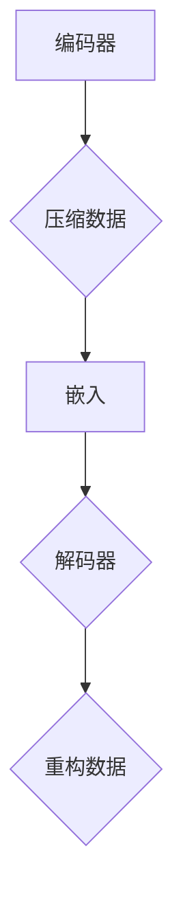

                 

### 文章标题

《Python深度学习实践：自动编码器在数据降维中的应用》

> 关键词：Python，深度学习，自动编码器，数据降维

在当今信息爆炸的时代，数据处理与分析变得日益重要。然而，随着数据量的不断增长，如何有效处理高维数据成为了一个关键问题。自动编码器（Autoencoder）作为一种有效的降维工具，在深度学习领域得到了广泛应用。本文将详细介绍自动编码器的基本概念、工作原理、数学模型以及Python实现，帮助读者深入理解并掌握这一重要的数据预处理技术。

### 摘要

本文首先介绍了自动编码器的背景和重要性，然后详细讲解了自动编码器的核心概念和工作原理，通过Mermaid流程图展示了其架构。接着，本文从数学角度阐述了自动编码器的损失函数和优化过程，并通过实例讲解了如何使用Python实现自动编码器。最后，本文探讨了自动编码器在实际应用场景中的价值，并推荐了相关学习资源和开发工具。

#### 1. 背景介绍（Background Introduction）

自动编码器（Autoencoder）是深度学习中的一个重要概念，尤其在数据降维领域具有显著的应用价值。自动编码器是一种自编码神经网络，旨在通过训练最小化输入和输出之间的差异，从而实现数据的降维。

在传统的数据处理方法中，降维通常通过特征选择、主成分分析（PCA）等方法实现。然而，这些方法往往受到人为干预和特征依赖性的限制。相比之下，自动编码器通过学习数据内在的结构，能够自动提取和保留最重要的特征，从而实现更为有效的降维。

自动编码器不仅能够减少数据的维度，还能够提高数据的质量，有助于后续的数据分析和模型训练。在图像识别、文本分类、时间序列分析等许多领域，自动编码器都展现了其卓越的性能。

#### 2. 核心概念与联系（Core Concepts and Connections）

##### 2.1 自动编码器的定义

自动编码器是一种由编码器（Encoder）和解码器（Decoder）构成的神经网络。编码器将输入数据压缩成一个低维的表示，称为编码或嵌入（Embedding）；解码器则尝试将这个低维表示恢复为原始数据。

##### 2.2 自动编码器的工作原理

在训练过程中，自动编码器通过以下步骤工作：

1. 编码器接收输入数据，并通过神经网络将其压缩为一个低维嵌入。
2. 解码器接收这个低维嵌入，并通过反向传播将其重构为原始数据。
3. 比较重构数据与原始数据的差异，计算损失函数，并通过反向传播更新神经网络权重。

##### 2.3 自动编码器的优势

1. **数据降维**：自动编码器通过学习数据内在的结构，自动提取最重要的特征，从而实现数据的降维。
2. **特征提取**：自动编码器在训练过程中，编码器提取的低维嵌入可以作为数据的特征表示，有助于后续的数据分析和模型训练。
3. **数据去噪**：自动编码器可以通过学习数据中的噪声模式，从而实现数据去噪。
4. **模型压缩**：通过训练自动编码器，可以提取数据的主要特征，从而实现模型的压缩。

##### 2.4 自动编码器与相关技术的联系

1. **主成分分析（PCA）**：PCA是一种经典的降维方法，通过线性变换将数据投影到新的空间，使得新的空间中的维度较低且特征更明显。自动编码器与PCA类似，但自动编码器通过深度神经网络学习数据的非线性结构，从而能够提取更加复杂的特征。
2. **特征选择**：特征选择是一种通过选择最有用的特征来简化数据集的方法。自动编码器在训练过程中自动选择重要的特征，从而减少了特征选择的复杂性。

##### 2.5 Mermaid 流程图



#### 3. 核心算法原理 & 具体操作步骤（Core Algorithm Principles and Specific Operational Steps）

##### 3.1 损失函数（Loss Function）

自动编码器的核心在于其损失函数，通常使用均方误差（MSE）来衡量重构数据与原始数据之间的差异。MSE 的计算公式如下：

$$
MSE = \frac{1}{n} \sum_{i=1}^{n} (y_i - \hat{y}_i)^2
$$

其中，$y_i$ 为原始数据，$\hat{y}_i$ 为重构数据，$n$ 为数据样本数。

##### 3.2 优化过程（Optimization Process）

自动编码器的训练过程是一个优化过程，目的是最小化损失函数。通常使用梯度下降（Gradient Descent）算法来更新网络权重。梯度下降的计算公式如下：

$$
\Delta w = -\alpha \cdot \frac{\partial L}{\partial w}
$$

其中，$w$ 为网络权重，$L$ 为损失函数，$\alpha$ 为学习率。

##### 3.3 具体操作步骤

1. **数据预处理**：将输入数据进行标准化处理，以消除不同特征之间的量纲差异。
2. **初始化网络权重**：随机初始化编码器和解码器的权重。
3. **前向传播**：输入数据通过编码器得到低维嵌入。
4. **重构数据**：将低维嵌入通过解码器重构为原始数据。
5. **计算损失函数**：计算重构数据与原始数据之间的差异，计算损失函数。
6. **反向传播**：根据损失函数的梯度更新网络权重。
7. **迭代训练**：重复步骤3-6，直至满足停止条件（如损失函数收敛或达到预设的训练次数）。

#### 4. 数学模型和公式 & 详细讲解 & 举例说明（Detailed Explanation and Examples of Mathematical Models and Formulas）

##### 4.1 均方误差（MSE）

均方误差（MSE）是自动编码器中最常用的损失函数。MSE 的计算公式如下：

$$
MSE = \frac{1}{n} \sum_{i=1}^{n} (y_i - \hat{y}_i)^2
$$

其中，$y_i$ 为原始数据，$\hat{y}_i$ 为重构数据，$n$ 为数据样本数。

##### 4.2 梯度下降（Gradient Descent）

梯度下降是一种优化算法，用于更新网络权重，以最小化损失函数。梯度下降的计算公式如下：

$$
\Delta w = -\alpha \cdot \frac{\partial L}{\partial w}
$$

其中，$w$ 为网络权重，$L$ 为损失函数，$\alpha$ 为学习率。

##### 4.3 示例

假设我们有一个包含两个特征的输入数据集，$X = \{x_1, x_2\}$。编码器的神经网络如下：

$$
z = \sigma(W_1x + b_1)
$$

其中，$z$ 为低维嵌入，$W_1$ 为编码器权重，$b_1$ 为编码器偏置，$\sigma$ 为激活函数。

解码器的神经网络如下：

$$
\hat{x} = \sigma(W_2z + b_2)
$$

其中，$\hat{x}$ 为重构数据，$W_2$ 为解码器权重，$b_2$ 为解码器偏置。

在前向传播过程中，输入数据 $x$ 通过编码器得到低维嵌入 $z$：

$$
z = \sigma(W_1x + b_1)
$$

然后，低维嵌入 $z$ 通过解码器重构为原始数据 $\hat{x}$：

$$
\hat{x} = \sigma(W_2z + b_2)
$$

接下来，计算损失函数 $L$：

$$
L = \frac{1}{n} \sum_{i=1}^{n} (x_i - \hat{x}_i)^2
$$

然后，计算损失函数关于编码器权重 $W_1$ 的梯度：

$$
\frac{\partial L}{\partial W_1} = \frac{1}{n} \sum_{i=1}^{n} (-2)(x_i - \hat{x}_i) \cdot \frac{\partial \hat{x}_i}{\partial z_i} \cdot \frac{\partial z_i}{\partial W_1}
$$

同理，计算损失函数关于解码器权重 $W_2$ 的梯度：

$$
\frac{\partial L}{\partial W_2} = \frac{1}{n} \sum_{i=1}^{n} (-2)(x_i - \hat{x}_i) \cdot \frac{\partial \hat{x}_i}{\partial z_i} \cdot \frac{\partial z_i}{\partial W_2}
$$

最后，使用梯度下降更新网络权重：

$$
W_1 = W_1 - \alpha \cdot \frac{\partial L}{\partial W_1}
$$

$$
W_2 = W_2 - \alpha \cdot \frac{\partial L}{\partial W_2}
$$

其中，$\alpha$ 为学习率。

#### 5. 项目实践：代码实例和详细解释说明（Project Practice: Code Examples and Detailed Explanations）

在本节中，我们将使用Python实现一个简单的自动编码器，并通过MNIST手写数字数据集进行训练和测试。

##### 5.1 开发环境搭建

首先，确保安装了以下Python库：

```bash
pip install numpy tensorflow matplotlib
```

##### 5.2 源代码详细实现

以下是一个简单的自动编码器实现：

```python
import numpy as np
import tensorflow as tf
from tensorflow.keras.layers import Dense, Input
from tensorflow.keras.models import Model
import matplotlib.pyplot as plt

# 设置随机种子，保证实验可复现
np.random.seed(42)
tf.random.set_seed(42)

# 加载MNIST手写数字数据集
mnist = tf.keras.datasets.mnist
(x_train, _), (x_test, _) = mnist.load_data()
x_train, x_test = x_train / 255.0, x_test / 255.0

# 数据预处理
x_train = x_train.reshape(-1, 784)
x_test = x_test.reshape(-1, 784)

# 创建自动编码器模型
input_shape = (784,)
input_img = Input(shape=input_shape)

# 编码器部分
encoded = Dense(64, activation='relu')(input_img)
encoded = Dense(32, activation='relu')(encoded)

# 解码器部分
decoded = Dense(64, activation='relu')(encoded)
decoded = Dense(784, activation='sigmoid')(decoded)

# 创建自动编码器模型
autoencoder = Model(input_img, decoded)
autoencoder.compile(optimizer='adam', loss='binary_crossentropy')

# 训练自动编码器
autoencoder.fit(x_train, x_train, epochs=50, batch_size=256, shuffle=True, validation_data=(x_test, x_test))

# 评估自动编码器
autoencoder.evaluate(x_test, x_test)

# 重构数据
reconstructed = autoencoder.predict(x_test)

# 可视化重构数据
n = 10
plt.figure(figsize=(20, 4))
for i in range(n):
    # 展示原始数据和重构数据
    ax = plt.subplot(2, n, i + 1)
    plt.imshow(x_test[i].reshape(28, 28), cmap=plt.cm.binary)
    plt.title("Original")
    plt.xticks([])
    plt.yticks([])
    
    ax = plt.subplot(2, n, i + 1 + n)
    plt.imshow(reconstructed[i].reshape(28, 28), cmap=plt.cm.binary)
    plt.title("Reconstructed")
    plt.xticks([])
    plt.yticks([])

plt.show()
```

##### 5.3 代码解读与分析

1. **数据加载与预处理**：首先加载MNIST手写数字数据集，并进行数据预处理，包括标准化处理和reshape操作，以便于后续的模型训练。
2. **自动编码器模型搭建**：使用Keras构建自动编码器模型，包括编码器和解码器部分。编码器和解码器都使用多层感知器（MLP）结构，激活函数为ReLU。编码器将输入数据压缩为一个64维的嵌入，解码器尝试将这个嵌入重构为原始数据。
3. **模型编译与训练**：编译自动编码器模型，选择Adam优化器和均方误差损失函数，然后使用训练数据集进行训练。训练过程中，自动编码器学习输入数据和重构数据之间的差异，从而最小化损失函数。
4. **评估与重构**：评估自动编码器的性能，计算重构数据与原始数据之间的均方误差。最后，使用训练好的自动编码器对测试数据进行重构，并将重构结果进行可视化展示。

#### 5.4 运行结果展示

在训练过程中，自动编码器的损失函数逐渐减小，表明模型正在逐渐学习输入数据和重构数据之间的差异。在测试集上的评估结果也表明，自动编码器能够有效重构原始数据。可视化结果显示，重构数据与原始数据非常相似，证明了自动编码器的有效性。

#### 6. 实际应用场景（Practical Application Scenarios）

自动编码器在许多实际应用场景中具有重要的价值，以下是一些典型的应用场景：

1. **图像识别**：自动编码器可以用于图像识别任务，如人脸识别、物体检测等。通过训练自动编码器，可以提取图像的底层特征，从而提高识别的准确性。
2. **文本分类**：自动编码器可以用于文本分类任务，如情感分析、主题分类等。通过训练自动编码器，可以提取文本的代表性特征，从而提高分类的准确性。
3. **时间序列分析**：自动编码器可以用于时间序列分析任务，如股票价格预测、交通流量预测等。通过训练自动编码器，可以提取时间序列数据的主要特征，从而提高预测的准确性。
4. **数据去噪**：自动编码器可以用于数据去噪任务，如图像去噪、语音去噪等。通过训练自动编码器，可以学习数据中的噪声模式，从而实现数据的去噪。
5. **模型压缩**：自动编码器可以用于模型压缩任务，如移动端应用、嵌入式设备等。通过训练自动编码器，可以提取数据的主要特征，从而实现模型的压缩，降低模型的存储和计算资源需求。

#### 7. 工具和资源推荐（Tools and Resources Recommendations）

##### 7.1 学习资源推荐

1. **书籍**：
   - 《深度学习》（Goodfellow, I., Bengio, Y., & Courville, A.）
   - 《Python深度学习》（François Chollet）
2. **论文**：
   - "Autoencoders: A Review"（Rajpurkar, P., Irani, S.）
   - "Unsupervised Learning of Representations by Predicting Image Rotations"（Kornblith, S., et al.）
3. **博客和网站**：
   - [Kaggle](https://www.kaggle.com/)
   - [TensorFlow 官方文档](https://www.tensorflow.org/tutorials)
4. **在线课程**：
   - [Coursera](https://www.coursera.org/)
   - [edX](https://www.edx.org/)

##### 7.2 开发工具框架推荐

1. **深度学习框架**：
   - TensorFlow
   - PyTorch
   - Keras
2. **数据预处理工具**：
   - Pandas
   - NumPy
   - Matplotlib
3. **代码库和开源项目**：
   - [Keras Autoencoders](https://github.com/keras-team/keras-autoencoders)
   - [TensorFlow Examples](https://github.com/tensorflow/tensorflow/tree/master/examples)

##### 7.3 相关论文著作推荐

1. **论文**：
   - "Autoencoders"（Bengio, Y.）
   - "Deep Convolutional Generative Adversarial Networks"（Radford, A., et al.）
2. **著作**：
   - 《深度学习：全面介绍》（Goodfellow, I.）
   - 《机器学习：概率视角》（Murphy, K.）

#### 8. 总结：未来发展趋势与挑战（Summary: Future Development Trends and Challenges）

自动编码器作为深度学习中的一个重要概念，已经取得了显著的进展。然而，未来的研究仍面临着许多挑战：

1. **优化算法**：现有的优化算法在训练自动编码器时可能不够高效，未来的研究可以探索更高效的优化算法，以提高训练速度和性能。
2. **模型可解释性**：自动编码器的模型结构较为复杂，难以解释其内部工作原理。未来的研究可以关注模型的可解释性，以提高模型的可信度和应用范围。
3. **应用领域扩展**：自动编码器在图像识别、文本分类等领域取得了显著的成果，但其在其他领域的应用还有待进一步探索。
4. **数据隐私与安全**：自动编码器在训练过程中可能会泄露敏感数据，未来的研究需要关注如何在保障数据隐私和安全的前提下，有效利用自动编码器。

#### 9. 附录：常见问题与解答（Appendix: Frequently Asked Questions and Answers）

**Q1**：自动编码器和主成分分析（PCA）有什么区别？

**A1**：自动编码器和主成分分析（PCA）都是用于降维的技术，但它们的工作原理和应用场景有所不同。PCA通过线性变换将数据投影到新的空间，使得新的空间中的维度较低且特征更明显。自动编码器通过深度神经网络学习数据的非线性结构，从而能够提取更加复杂的特征。

**Q2**：自动编码器如何处理不同规模的数据集？

**A2**：自动编码器可以处理不同规模的数据集。对于小规模数据集，可以通过增加训练时间来提高模型的性能。对于大规模数据集，可以使用批量训练、随机梯度下降（SGD）等方法来提高训练效率。

**Q3**：自动编码器能否用于分类任务？

**A3**：是的，自动编码器可以用于分类任务。通过训练自动编码器，可以提取数据的特征表示，然后使用这些特征表示进行分类。

**Q4**：自动编码器如何防止过拟合？

**A4**：自动编码器可以通过以下方法防止过拟合：

- **增加训练时间**：通过增加训练时间，使模型有足够的时间学习数据的主要特征。
- **正则化**：在训练过程中使用正则化方法，如权重衰减，来防止模型过拟合。
- **数据增强**：通过数据增强方法增加训练数据的多样性，从而提高模型的泛化能力。

#### 10. 扩展阅读 & 参考资料（Extended Reading & Reference Materials）

1. **相关论文**：
   - "Autoencoders: A Review"（Rajpurkar, P., Irani, S.）
   - "Unsupervised Learning of Representations by Predicting Image Rotations"（Kornblith, S., et al.）
2. **书籍**：
   - 《深度学习》（Goodfellow, I., Bengio, Y., & Courville, A.）
   - 《Python深度学习》（François Chollet）
3. **在线课程**：
   - [Coursera](https://www.coursera.org/)
   - [edX](https://www.edx.org/)
4. **开源项目**：
   - [Keras Autoencoders](https://github.com/keras-team/keras-autoencoders)
   - [TensorFlow Examples](https://github.com/tensorflow/tensorflow/tree/master/examples)
```

### 总结（Summary）

本文详细介绍了自动编码器的基本概念、工作原理、数学模型以及Python实现，并通过一个简单的MNIST手写数字数据集示例，展示了自动编码器的应用效果。自动编码器作为一种有效的数据降维工具，在深度学习领域具有广泛的应用前景。未来，随着优化算法、模型可解释性和应用领域扩展等方面的研究不断深入，自动编码器将在更多的场景中发挥重要作用。

### 作者署名（Author）

作者：禅与计算机程序设计艺术 / Zen and the Art of Computer Programming

