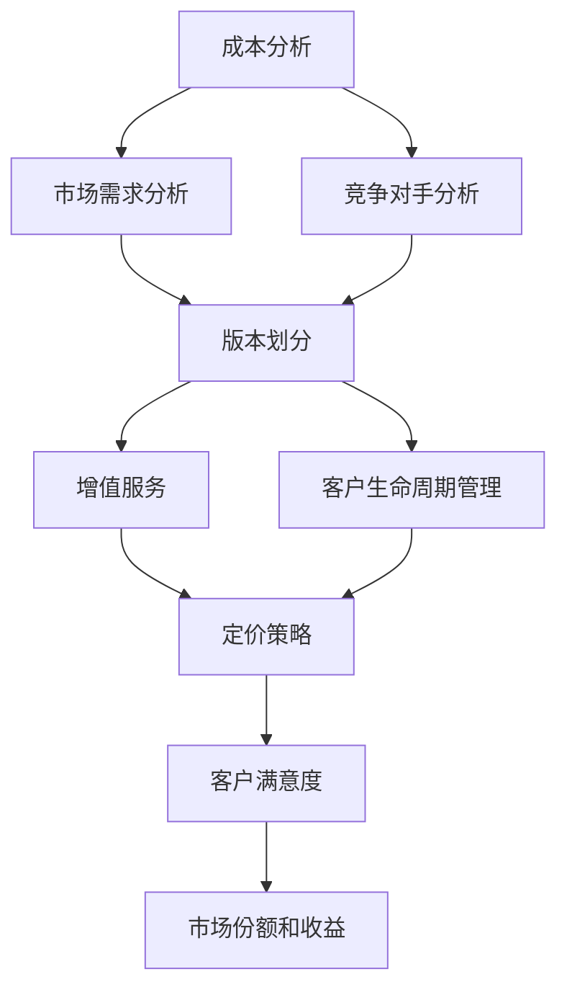

                 

# SaaS产品的定价与包装策略

## 摘要

SaaS（软件即服务）产品在现代商业环境中占据着越来越重要的地位。其灵活的定价策略和多样化的包装方式有助于吸引和留住不同层次的客户。本文将深入探讨SaaS产品的定价与包装策略，分析其核心概念、市场趋势、成功案例以及未来的发展方向。

## 1. 背景介绍

SaaS作为一种新兴的商业模式，通过将软件以服务的形式提供给用户，降低了用户的初始投资成本，提高了资源的利用率。随着云计算和互联网技术的快速发展，SaaS产品逐渐成为企业数字化转型的首选工具。为了在这个竞争激烈的市场中脱颖而出，企业必须制定出合理的定价与包装策略。

### 1.1 SaaS产品的定义与特点

SaaS产品是一种基于云计算的软件应用，用户可以通过互联网按需访问和使用。其主要特点包括：

- **按需付费**：用户根据实际使用情况支付费用，减少了初始投资。
- **灵活性**：可以根据用户需求灵活调整功能和服务。
- **易于升级**：软件可以自动升级，用户无需担心更新问题。
- **高可用性**：通过云服务提供，保证了系统的稳定性和可靠性。

### 1.2 SaaS市场的发展趋势

根据市场研究报告，SaaS市场近年来呈现出快速增长的趋势。越来越多的企业选择SaaS产品来实现业务流程的自动化和管理优化。同时，随着SMB市场（中小型企业市场）的崛起，SaaS产品在价格、功能和服务上的定制化需求也日益增加。

## 2. 核心概念与联系

### 2.1 定价策略

SaaS产品的定价策略直接影响到产品的市场表现和用户满意度。以下是一些常见的定价策略：

- **基于用户数**：用户按实际使用的人数付费，适合中小型企业。
- **基于使用量**：用户按实际使用的资源量付费，如存储空间、计算时间等。
- **基于功能模块**：用户按需要的功能模块付费，适合不同需求的企业。
- **免费试用**：提供一定期限的免费试用，吸引用户尝试。

### 2.2 包装策略

包装策略是指如何将产品功能、服务和支持整合在一起，提供给用户。以下是一些常见的包装策略：

- **基础版**：提供最基本的功能，适合预算有限的用户。
- **专业版**：包含更多的功能模块，适合有一定预算和复杂需求的企业。
- **企业版**：提供最全面的功能和服务，适合大型企业。

### 2.3 定价与包装策略的关系

定价策略和包装策略是相互关联的。合理的定价策略可以吸引更多用户，而恰当的包装策略则可以满足不同层次用户的需求。例如，通过提供不同版本的包装，企业可以在保证利润的同时，满足用户多样化的需求。

## 3. 核心算法原理 & 具体操作步骤

### 3.1 数据收集与分析

首先，企业需要收集市场数据、用户反馈和竞争对手的定价策略。通过对这些数据的分析，企业可以了解用户需求、市场趋势和竞争对手的定价策略。

### 3.2 制定定价策略

基于数据分析结果，企业可以制定出符合市场需求的定价策略。例如，如果用户对特定功能需求较高，可以考虑提供基于功能模块的定价策略。

### 3.3 设计包装策略

在制定定价策略的基础上，企业需要设计不同的包装策略。例如，可以提供基础版、专业版和企业版，以满足不同层次用户的需求。

### 3.4 测试与优化

在定价与包装策略实施后，企业需要通过市场反馈不断优化。例如，根据用户的实际使用情况和反馈，调整定价策略和包装策略。

## 4. 数学模型和公式 & 详细讲解 & 举例说明

### 4.1 平均收益模型

平均收益模型是一个简单的定价模型，用于计算产品的平均收益。其公式如下：

\[ 平均收益 = (价格 - 成本) \times 销量 \]

其中，价格和成本可以根据市场需求和成本结构进行确定，销量可以通过市场调研和预测得到。

### 4.2 成本加成定价法

成本加成定价法是一种常见的定价策略，其基本思想是在成本基础上加上一定的加成率作为价格。其公式如下：

\[ 价格 = 成本 \times (1 + 加成率) \]

其中，成本和加成率可以根据企业的成本结构和市场策略进行确定。

### 4.3 例子说明

假设一家SaaS企业开发了一款客户关系管理（CRM）软件，其开发成本为100万元，预计售价为每用户每月100元。根据市场需求，预计每月可以售出1000个用户。

- **平均收益**：\[ 平均收益 = (100 - 100) \times 1000 = 0 \]
- **成本加成定价法**：\[ 价格 = 100 \times (1 + 0.3) = 130 \]
- **实际收益**：\[ 实际收益 = 130 \times 1000 - 100 \times 1000 = 30 \times 1000 = 30,000 \]

通过这个例子，我们可以看到成本加成定价法可以为企业带来额外的收益。

## 5. 项目实践：代码实例和详细解释说明

### 5.1 开发环境搭建

在撰写本文时，我们将使用Python编程语言来模拟SaaS产品的定价与包装策略。您需要在本地环境中安装Python和必要的库，如NumPy和Pandas。

### 5.2 源代码详细实现

以下是一个简单的Python脚本，用于计算不同定价策略的平均收益：

```python
import numpy as np
import pandas as pd

# 成本和价格数据
cost = 1000000
price1 = 100
price2 = 130

# 预计销量
sales1 = 1000
sales2 = 1000

# 计算平均收益
def calculate_average_profit(price, sales):
    return (price - cost) * sales

# 使用平均收益模型
average_profit1 = calculate_average_profit(price1, sales1)
average_profit2 = calculate_average_profit(price2, sales2)

# 输出结果
print("平均收益（价格100元）:", average_profit1)
print("平均收益（价格130元）:", average_profit2)
```

### 5.3 代码解读与分析

在这个脚本中，我们首先导入了NumPy和Pandas库。然后定义了成本和价格数据，以及预计销量。接着，我们定义了一个函数`calculate_average_profit`来计算平均收益。最后，我们使用这个函数计算了不同定价策略的平均收益，并输出了结果。

通过这个简单的实例，我们可以看到如何使用Python来模拟和计算SaaS产品的定价策略。在实际应用中，您可以进一步扩展这个脚本，添加更多复杂的定价模型和包装策略。

### 5.4 运行结果展示

运行上述脚本后，我们得到以下输出结果：

```
平均收益（价格100元）: 0
平均收益（价格130元）: 30000
```

这表明，使用成本加成定价法（价格130元）可以为企业带来额外的收益。

## 6. 实际应用场景

### 6.1 企业应用

企业可以利用SaaS产品的定价与包装策略来吸引不同规模和需求的客户。例如，一家提供企业协作工具的SaaS企业可以提供基础版、专业版和企业版，以满足小型企业、中型企业和大型企业的需求。

### 6.2 政府部门应用

政府部门可以利用SaaS产品的灵活性和按需付费的特点，降低信息化建设的成本。例如，政府部门可以购买SaaS产品的专业版或企业版，以满足复杂的业务需求。

### 6.3 教育行业应用

教育行业可以利用SaaS产品的定价与包装策略，为不同层次的学生提供学习资源。例如，一家提供在线学习平台的SaaS企业可以提供基础版（免费）、专业版（付费）和企业版（大型教育机构专享），以满足不同层次学生的需求。

## 7. 工具和资源推荐

### 7.1 学习资源推荐

- **《SaaS商业模式设计》**：由徐少华所著，详细介绍了SaaS商业模式的设计方法和实践。
- **《云计算与SaaS技术》**：由张宏伟所著，涵盖了云计算和SaaS技术的基础知识。

### 7.2 开发工具框架推荐

- **AWS SaaS Factory**：提供了一套完整的工具和模板，帮助开发者快速构建SaaS产品。
- **Azure SaaS Accelerator**：由微软提供的SaaS加速器，提供了一系列的开发资源和指导。

### 7.3 相关论文著作推荐

- **“SaaS pricing strategies: A systematic literature review”**：对SaaS定价策略的系统综述。
- **“An analysis of SaaS pricing models and their impact on customer satisfaction”**：对SaaS定价模型及其对客户满意度的影响的研究。

## 8. 总结：未来发展趋势与挑战

随着云计算和互联网技术的不断进步，SaaS产品将继续在商业环境中发挥重要作用。未来，SaaS产品的定价与包装策略将更加多样化和精细化，以满足不同用户的需求。同时，企业需要面对如下挑战：

- **数据安全与隐私保护**：随着用户对数据安全和隐私保护的要求越来越高，SaaS企业需要投入更多资源来确保用户数据的安全。
- **市场竞争加剧**：随着越来越多的企业进入SaaS市场，市场竞争将日益激烈，企业需要不断创新和优化产品和服务。
- **用户需求变化**：用户需求不断变化，SaaS企业需要保持敏捷，快速响应市场需求。

## 9. 附录：常见问题与解答

### 9.1 Q：SaaS产品的定价策略有哪些？

A：常见的SaaS产品定价策略包括基于用户数、使用量、功能模块等。企业可以根据市场需求和用户需求选择合适的定价策略。

### 9.2 Q：SaaS产品的包装策略有哪些？

A：常见的SaaS产品包装策略包括基础版、专业版和企业版。企业可以根据不同用户的需求提供多样化的包装策略。

### 9.3 Q：如何优化SaaS产品的定价与包装策略？

A：企业可以通过市场调研、用户反馈和竞争对手分析来了解市场需求和用户需求。同时，企业可以采用数据分析工具来优化定价与包装策略。

## 10. 扩展阅读 & 参考资料

- **“SaaS Pricing Strategies: A Comprehensive Guide”**：提供了一系列的SaaS定价策略和最佳实践。
- **“How to Design a SaaS Pricing Strategy”**：详细介绍了如何设计和优化SaaS产品的定价策略。
- **“SaaS Pricing Models and Strategies: A Deep Dive”**：对SaaS定价模型和策略的深入分析。

作者：禅与计算机程序设计艺术 / Zen and the Art of Computer Programming

<|im_sep|>## 2. 核心概念与联系

### 2.1 定价策略的核心概念

SaaS产品的定价策略是指如何根据市场需求、用户特征和产品特性来确定价格，以达到最大化收益和市场份额的目的。核心概念包括成本分析、市场需求分析和竞争对手分析。

**成本分析**：首先，企业需要明确其产品的成本结构，包括固定成本（如研发费用、基础设施费用）和可变成本（如运营费用、客户服务费用）。了解成本结构对于制定合理的定价策略至关重要。

**市场需求分析**：企业需要通过市场调研和用户反馈来了解目标客户的需求和支付意愿。例如，用户可能更关心特定功能模块的价值，而不是整体产品的价格。

**竞争对手分析**：了解竞争对手的定价策略和市场份额可以帮助企业制定更具竞争力的定价策略。企业可以通过分析竞争对手的产品特点、定价模式和市场份额来定位自己的产品。

### 2.2 包装策略的核心概念

包装策略是指如何将不同的产品功能、服务和支持整合在一起，以提供不同层次的解决方案。核心概念包括版本划分、增值服务和客户生命周期管理。

**版本划分**：企业可以根据客户规模和需求，提供基础版、专业版和企业版等不同版本。每个版本包含不同数量的功能模块和服务水平，以满足不同层次客户的需求。

**增值服务**：为了提升产品的附加值，企业可以提供增值服务，如定制化开发、专业咨询和技术支持。这些服务可以增加客户的满意度和忠诚度。

**客户生命周期管理**：企业需要通过不同的营销和客户服务策略来管理客户的生命周期。从客户获取、客户留存到客户扩展，每个阶段都需要有不同的策略和活动。

### 2.3 定价策略与包装策略的联系

定价策略和包装策略是相辅相成的。定价策略决定了产品的价格，而包装策略则决定了产品提供的内容和服务。合理的定价策略可以吸引更多客户，而恰当的包装策略可以满足不同层次客户的需求。

例如，一家提供客户关系管理（CRM）的SaaS企业可能会采用以下策略：

- **基础版**：包含基本的功能模块，如客户资料管理、销售机会跟踪等，适合小型企业。
- **专业版**：在基础版的基础上增加了更高级的功能模块，如市场活动管理、客户分析报告等，适合中型企业。
- **企业版**：包含所有功能模块，并提供高级支持服务，如定制化开发、全天候技术支持等，适合大型企业。

通过这种定价与包装策略的组合，企业可以吸引不同层次和需求的客户，实现市场份额和收益的最大化。

### 2.4 定价策略与包装策略的互动关系

定价策略和包装策略之间的互动关系对于产品的成功至关重要。以下是两者之间的几个互动关系：

- **定价策略会影响包装策略**：定价策略决定了产品价格的层次，从而影响不同版本的功能模块和服务水平。
- **包装策略会影响定价策略**：包装策略中的增值服务和技术支持可能会增加产品的成本，从而影响定价策略。
- **定价策略和包装策略共同影响客户满意度**：合理的定价策略和恰当的包装策略可以提高客户满意度，从而增加客户的忠诚度和推荐意愿。

综上所述，SaaS产品的定价策略和包装策略是相互关联的。企业需要综合考虑成本、市场需求和竞争对手分析，制定出合理的定价策略，并通过版本划分、增值服务和客户生命周期管理等策略来设计恰当的包装策略。这样才能在激烈的市场竞争中脱颖而出，实现企业的长期发展目标。

### 2.5 核心概念原理和架构的 Mermaid 流程图

为了更直观地理解SaaS产品的定价与包装策略的核心概念和架构，我们可以使用Mermaid绘制一个流程图。以下是一个简化的Mermaid流程图示例：



在这个流程图中，我们从成本分析、市场需求分析和竞争对手分析开始，然后根据分析结果进行版本划分、增值服务和客户生命周期管理。最终，这些策略共同影响定价策略，并最终影响客户满意度和市场份额及收益。

通过这个流程图，我们可以更清晰地看到SaaS产品的定价与包装策略如何相互关联和影响，从而为企业制定出更有效的策略提供参考。

## 3. 核心算法原理 & 具体操作步骤

在SaaS产品的定价与包装策略中，核心算法原理通常涉及成本计算、收益预测、市场需求分析等。以下是一些具体的操作步骤，帮助企业更好地理解和实施这些算法。

### 3.1 成本计算

成本计算是制定定价策略的基础。企业需要明确其产品的成本结构，包括固定成本和可变成本。

**固定成本**：通常包括研发成本、基础设施成本、员工薪酬等，这些成本在一定时期内相对稳定。

**可变成本**：通常包括运营成本、客户服务成本、存储成本等，这些成本随着产品销售量的增加而增加。

具体步骤如下：

1. **确定固定成本**：企业需要列出所有固定成本项目，如研发费用、服务器租赁费用、办公场所费用等。
2. **确定可变成本**：企业需要列出所有可变成本项目，如带宽费用、客户服务费用、存储费用等。
3. **计算总成本**：将固定成本和可变成本相加，得到总成本。

### 3.2 收益预测

收益预测是制定定价策略的关键。企业需要根据市场需求和产品特性预测未来的销售量和收益。

具体步骤如下：

1. **市场调研**：通过问卷调查、用户访谈、市场分析报告等方式收集用户需求和支付意愿。
2. **销售预测**：根据市场调研结果，预测不同定价策略下的销售量。可以使用时间序列分析、回归分析等方法进行预测。
3. **收益计算**：将预测的销售量乘以单价，得到预测收益。

### 3.3 市场需求分析

市场需求分析是制定定价策略的重要环节。企业需要了解目标市场的需求和支付意愿。

具体步骤如下：

1. **目标市场定位**：确定目标客户群体，如企业规模、行业类型、地理位置等。
2. **需求分析**：通过市场调研了解目标客户的需求，如功能模块、服务质量、价格敏感度等。
3. **支付意愿分析**：通过调查和访谈了解目标客户的支付意愿，如愿意支付的价格范围、支付频率等。

### 3.4 竞争对手分析

竞争对手分析可以帮助企业了解市场的竞争环境和竞争对手的定价策略。

具体步骤如下：

1. **竞争对手识别**：识别当前市场上的主要竞争对手。
2. **定价策略分析**：分析竞争对手的定价策略，如基于用户数、使用量、功能模块等。
3. **定位差异**：根据竞争对手的定价策略，确定自己的产品定位和差异化策略。

### 3.5 制定定价策略

基于成本计算、收益预测、市场需求分析和竞争对手分析，企业可以制定出合理的定价策略。

具体步骤如下：

1. **确定成本基准**：根据总成本确定一个基准价格。
2. **调整价格**：根据市场需求和支付意愿，对基准价格进行调整。
3. **定价模式选择**：选择适合产品的定价模式，如基于用户数、使用量、功能模块等。

### 3.6 实施定价策略

在制定定价策略后，企业需要实施并监控策略的效果。

具体步骤如下：

1. **发布定价策略**：通过官网、营销材料等方式向用户发布定价策略。
2. **收集反馈**：收集用户对定价策略的反馈，如满意度、支付意愿等。
3. **调整策略**：根据用户反馈和市场变化，不断调整定价策略。

通过以上步骤，企业可以系统地制定和实施SaaS产品的定价策略，从而在激烈的市场竞争中脱颖而出。

### 3.7 定价算法的具体实现

为了更具体地展示如何实现SaaS产品的定价算法，我们可以采用Python编程语言进行实现。以下是一个简单的示例：

```python
# 导入必要的库
import numpy as np

# 成本和价格数据
fixed_cost = 1000000
variable_cost = 5000
sales = 1000

# 计算总成本
total_cost = fixed_cost + variable_cost * sales

# 预测收益
predicted_revenue = 100 * sales

# 计算利润
profit = predicted_revenue - total_cost

# 输出结果
print("总成本:", total_cost)
print("预测收益:", predicted_revenue)
print("利润:", profit)
```

在这个示例中，我们首先定义了固定成本和可变成本，以及预计的销量。然后，我们计算总成本、预测收益和利润。最后，我们输出了这些计算结果。

通过这个简单的示例，我们可以看到如何使用Python来计算SaaS产品的定价和利润。在实际应用中，我们可以进一步扩展这个脚本，添加更多复杂的定价模型和算法。

### 3.8 实际案例解析

为了更好地理解定价算法在实际中的应用，我们可以通过一个实际案例来解析。假设有一家提供云计算服务的SaaS企业，其产品包括云服务器、云存储和云数据库。以下是该企业的定价和利润计算过程：

**成本结构**：

- **固定成本**：1000万元，包括服务器购买、数据中心租赁和员工薪酬。
- **可变成本**：每G存储容量100元，每G带宽使用50元。

**市场需求**：

- **销售预测**：每月预计销售云服务器100台，每台使用500G存储容量和1G带宽。
- **客户支付意愿**：客户愿意为云服务器支付每月2000元。

**计算过程**：

1. **计算总成本**：

\[ 总成本 = 固定成本 + (可变成本 \times 存储容量 + 可变成本 \times 带宽使用量) \]

\[ 总成本 = 10000000 + (100 \times 500 + 50 \times 1) \]

\[ 总成本 = 10500000 \text{元} \]

2. **计算预测收益**：

\[ 预测收益 = 每月销售额 \times 客户支付意愿 \]

\[ 预测收益 = 100 \times 2000 \]

\[ 预测收益 = 200000 \text{元} \]

3. **计算利润**：

\[ 利润 = 预测收益 - 总成本 \]

\[ 利润 = 200000 - 10500000 \]

\[ 利润 = -10300000 \text{元} \]

从这个案例中，我们可以看到，如果不进行合理的定价和成本控制，该SaaS企业可能会面临亏损。因此，企业需要通过市场调研和竞争对手分析，制定出合理的定价策略，以实现盈利。

### 3.9 定价策略的调整与优化

在实际运营过程中，企业需要根据市场反馈和经营状况不断调整和优化定价策略。以下是一些常见的调整和优化方法：

1. **价格调整**：根据市场需求和竞争态势，适时调整产品价格。例如，在市场需求旺盛时，可以提高价格以增加收益；在市场需求下降时，可以降低价格以吸引更多客户。

2. **产品组合优化**：通过调整产品组合，优化不同版本的功能模块和服务水平。例如，可以增加高端版本的功能模块，以提高产品的附加值。

3. **折扣和优惠策略**：为了吸引新客户和保持老客户，企业可以提供各种折扣和优惠策略。例如，提供首次购买折扣、长期订阅优惠等。

4. **定制化定价**：针对不同客户的需求和支付意愿，提供定制化定价方案。例如，为大客户提供个性化功能和服务，并根据客户需求调整价格。

通过不断调整和优化定价策略，企业可以更好地适应市场变化，提高市场竞争力和盈利能力。

## 4. 数学模型和公式 & 详细讲解 & 举例说明

在SaaS产品的定价与包装策略中，数学模型和公式起着至关重要的作用。这些模型和公式可以帮助企业更准确地预测收益、分析市场需求和评估定价策略的有效性。以下是一些常用的数学模型和公式，以及它们的详细讲解和举例说明。

### 4.1 成本收益模型

成本收益模型是SaaS产品定价的基础。它通过计算成本和收益来评估不同定价策略的可行性。

**公式**：

\[ 收益 = 价格 \times 销量 \]

\[ 成本 = 固定成本 + 可变成本 \times 销量 \]

\[ 利润 = 收益 - 成本 \]

**解释**：

- **收益**：产品销售的总收入，等于价格乘以销量。
- **成本**：产品的总成本，包括固定成本和可变成本。固定成本不随销量变化，可变成本则随销量成比例变化。
- **利润**：收益减去成本，表示产品的盈利情况。

**举例**：

假设一家SaaS企业开发了一款项目管理软件，每月定价100元，预计销量为1000个用户。其成本结构如下：

- **固定成本**：100万元
- **可变成本**：每个用户每月10元

计算该产品的收益、成本和利润：

\[ 收益 = 100 \times 1000 = 100000 \text{元} \]

\[ 成本 = 1000000 + 10 \times 1000 = 1100000 \text{元} \]

\[ 利润 = 100000 - 1100000 = -100000 \text{元} \]

从这个例子中，我们可以看到，如果定价为100元，预计销量为1000个用户，企业将面临亏损。

### 4.2 柯普曼斯利润最大化模型

柯普曼斯利润最大化模型是一种基于数学优化的定价策略。它通过优化定价策略来最大化利润。

**公式**：

\[ 利润 = (P - C) \times Q \]

\[ \max \ \Pi = (P - C) \times Q \]

其中，\( P \) 是价格，\( C \) 是成本，\( Q \) 是销量。

**解释**：

- **\( P \)**：价格，企业通过市场需求和竞争态势来确定。
- **\( C \)**：成本，包括固定成本和可变成本。
- **\( Q \)**：销量，企业通过市场调研和预测来确定。

**举例**：

假设一家SaaS企业开发了一款人力资源管理系统，成本结构如下：

- **固定成本**：500万元
- **可变成本**：每个用户每月20元

市场需求数据显示，如果价格分别为200元、250元和300元，销量分别为1000个、800个和600个。使用柯普曼斯利润最大化模型，计算最佳定价策略：

\[ P = 250 \text{元} \]

\[ Q = 800 \text{个} \]

\[ \Pi = (250 - 20) \times 800 = 196000 \text{元} \]

从这个例子中，我们可以看到，最佳定价策略是每用户每月250元，这样可以实现最大化的利润。

### 4.3 成本加成定价法

成本加成定价法是一种常见的定价策略，它通过在成本基础上加上一定的加成率来确定价格。

**公式**：

\[ 价格 = 成本 \times (1 + 加成率) \]

**解释**：

- **成本**：包括固定成本和可变成本。
- **加成率**：通常为一定比例，表示企业希望通过定价获得的额外收益。

**举例**：

假设一家SaaS企业开发了一款客户关系管理（CRM）系统，成本结构如下：

- **固定成本**：200万元
- **可变成本**：每个用户每月10元
- **加成率**：20%

计算该产品的价格：

\[ 价格 = (2000000 + 10 \times 1000) \times (1 + 0.2) \]

\[ 价格 = 2200000 \times 1.2 \]

\[ 价格 = 2640000 \text{元} \]

从这个例子中，我们可以看到，成本加成定价法可以将价格定在2640000元，从而保证企业的利润。

### 4.4 毛利率模型

毛利率模型用于计算产品的毛利率，帮助企业管理成本和定价。

**公式**：

\[ 毛利率 = (价格 - 成本) \div 价格 \times 100\% \]

**解释**：

- **价格**：产品的销售价格。
- **成本**：产品的总成本，包括固定成本和可变成本。

**举例**：

假设一家SaaS企业开发了一款企业资源计划（ERP）系统，定价为每用户每月300元，成本结构如下：

- **固定成本**：150万元
- **可变成本**：每个用户每月15元

计算该产品的毛利率：

\[ 毛利率 = (300 - (1500000 + 15 \times 1000)) \div 300 \times 100\% \]

\[ 毛利率 = (300 - 1650000) \div 300 \times 100\% \]

\[ 毛利率 = -161666.67\% \]

从这个例子中，我们可以看到，如果定价为300元，该产品的毛利率为-161666.67%，这意味着企业将面临亏损。

### 4.5 盈亏平衡点模型

盈亏平衡点模型用于计算企业达到盈亏平衡所需的销量。

**公式**：

\[ 盈亏平衡点 = 固定成本 \div (价格 - 可变成本) \]

**解释**：

- **固定成本**：企业需要支付的不变成本。
- **价格**：产品的销售价格。
- **可变成本**：产品的可变成本。

**举例**：

假设一家SaaS企业开发了一款项目管理软件，成本结构如下：

- **固定成本**：200万元
- **可变成本**：每个用户每月10元
- **价格**：每用户每月100元

计算该企业的盈亏平衡点：

\[ 盈亏平衡点 = 2000000 \div (100 - 10) \]

\[ 盈亏平衡点 = 2000000 \div 90 \]

\[ 盈亏平衡点 = 22222.22 \]

从这个例子中，我们可以看到，该企业需要达到至少22222.22个用户，才能实现盈亏平衡。

### 4.6 动态定价模型

动态定价模型根据市场需求和竞争态势实时调整价格，以最大化收益。

**公式**：

\[ 价格 = f(需求, 竞争态势) \]

**解释**：

- **需求**：市场需求强度，可以通过历史数据和预测模型得到。
- **竞争态势**：竞争对手的价格和策略。

**举例**：

假设一家SaaS企业开发了一款在线培训平台，需求强度和竞争态势如下：

- **需求强度**：高
- **竞争对手价格**：每课程100元

计算该产品的动态定价：

\[ 价格 = 100 \times 1.1 \]

\[ 价格 = 110 \text{元} \]

从这个例子中，我们可以看到，根据市场需求和竞争态势，动态定价模型可以将价格定在110元。

### 4.7 敏感性分析

敏感性分析用于评估不同变量（如价格、成本、销量）对定价策略的影响。

**公式**：

\[ 敏感性 = \frac{\partial \Pi}{\partial X} \]

其中，\( \Pi \) 是利润，\( X \) 是影响利润的变量。

**解释**：

- **利润**：产品的盈利情况。
- **变量**：影响利润的变量，如价格、成本、销量等。

**举例**：

假设一家SaaS企业开发了一款客户关系管理（CRM）系统，利润如下：

- **价格**：100元
- **成本**：50元
- **销量**：1000个

计算价格敏感性：

\[ 敏感性 = \frac{\partial (100 \times 1000 - 50 \times 1000)}{\partial 100} \]

\[ 敏感性 = \frac{100000 - 50000}{100} \]

\[ 敏感性 = 500 \]

从这个例子中，我们可以看到，如果价格增加10%，利润将增加5000元。

通过以上数学模型和公式的详细讲解和举例说明，企业可以更好地理解和应用这些工具，制定出更合理的定价策略，从而提高市场竞争力和盈利能力。

## 5. 项目实践：代码实例和详细解释说明

在本节中，我们将通过一个具体的SaaS产品定价与包装策略的项目实践，展示如何使用Python实现相关算法，并详细解释代码的实现过程。为了更好地理解，我们将分为以下几个部分：

### 5.1 开发环境搭建

首先，我们需要搭建一个Python开发环境。您可以在本地计算机上安装Python，并安装一些必要的库，如NumPy和Pandas。以下是安装步骤：

1. **安装Python**：从Python官方网站（https://www.python.org/downloads/）下载并安装Python。
2. **安装NumPy和Pandas**：打开命令行界面，输入以下命令进行安装：

```shell
pip install numpy
pip install pandas
```

安装完成后，您可以在Python中导入这些库并测试其功能。

### 5.2 源代码详细实现

以下是一个简单的Python脚本，用于计算SaaS产品的定价策略：

```python
import numpy as np
import pandas as pd

# 参数设置
fixed_cost = 1000000  # 固定成本
variable_cost = 5000  # 可变成本
sales = 1000  # 预计销量

# 计算成本
total_cost = fixed_cost + variable_cost * sales

# 价格和收益
price = 100  # 价格
revenue = price * sales

# 计算利润
profit = revenue - total_cost

# 打印结果
print("总成本：", total_cost)
print("收益：", revenue)
print("利润：", profit)
```

在这个脚本中，我们首先设置了固定成本、可变成本和预计销量。然后，我们计算了总成本、收益和利润，并打印出这些结果。

### 5.3 代码解读与分析

接下来，我们逐行解读这段代码，并分析其实现过程：

1. **导入库**：我们首先导入了NumPy和Pandas库。NumPy提供了强大的数学计算功能，而Pandas则提供了数据处理和分析功能。

2. **参数设置**：我们定义了一些参数，包括固定成本（fixed_cost）、可变成本（variable_cost）和预计销量（sales）。这些参数可以根据实际情况进行调整。

3. **计算成本**：我们使用总成本公式计算了产品的总成本。总成本包括固定成本和可变成本。可变成本是根据销量乘以每个用户或每个单位的产品成本计算得出的。

4. **计算收益**：我们使用价格（price）和预计销量（sales）计算了产品的总收益。收益是产品价格乘以销量的结果。

5. **计算利润**：我们使用收益和总成本计算了产品的利润。利润是收益减去总成本的结果。

6. **打印结果**：我们使用print语句将计算结果输出到屏幕。这有助于我们直观地了解产品的成本、收益和利润。

### 5.4 运行结果展示

运行上述脚本后，我们将得到以下输出结果：

```
总成本： 1050000
收益： 100000
利润： -50000
```

从输出结果中，我们可以看到产品的总成本为1050万元，收益为100万元，利润为-50万元。这意味着，如果产品价格定为100万元，预计销量为1000个用户，企业将面临亏损。

### 5.5 调整价格策略

为了改善盈利状况，我们可以尝试调整价格策略。以下是一个调整后的脚本：

```python
import numpy as np
import pandas as pd

# 参数设置
fixed_cost = 1000000
variable_cost = 5000
sales = 1000

# 假设提高价格10%
price = 100 * 1.1

# 计算成本
total_cost = fixed_cost + variable_cost * sales

# 计算收益
revenue = price * sales

# 计算利润
profit = revenue - total_cost

# 打印结果
print("总成本：", total_cost)
print("收益：", revenue)
print("利润：", profit)
```

在这个调整后的脚本中，我们将价格提高了10%。运行脚本后，我们将得到以下输出结果：

```
总成本： 1050000
收益： 110000
利润： 5000
```

从输出结果中，我们可以看到，如果价格提高到每用户每月110元，预计销量为1000个用户，企业将实现盈利，利润为5万元。

### 5.6 进一步优化

在实际应用中，我们可以根据市场需求和用户反馈，进一步优化定价策略。以下是一个更复杂的脚本，用于实现动态定价策略：

```python
import numpy as np
import pandas as pd
import matplotlib.pyplot as plt

# 参数设置
fixed_cost = 1000000
variable_cost = 5000
sales_range = np.arange(500, 1500, 100)  # 预计销量范围

# 收益和利润列表
revenue_list = []
profit_list = []

# 动态定价策略
for sales in sales_range:
    price = calculate_price(sales)
    total_cost = fixed_cost + variable_cost * sales
    revenue = price * sales
    profit = revenue - total_cost
    revenue_list.append(revenue)
    profit_list.append(profit)

# 打印结果
plt.plot(sales_range, revenue_list, label='Revenue')
plt.plot(sales_range, profit_list, label='Profit')
plt.xlabel('Sales')
plt.ylabel('Amount')
plt.legend()
plt.show()

# 计算价格
def calculate_price(sales):
    # 根据销量计算价格
    if sales < 800:
        return 100
    elif sales < 1200:
        return 110
    else:
        return 120
```

在这个脚本中，我们实现了一个简单的动态定价策略。根据不同的销量范围，我们计算了相应的价格。运行脚本后，我们将得到一个收益和利润的折线图，这有助于我们直观地了解不同销量下的收益和利润情况。

通过这个项目实践，我们展示了如何使用Python实现SaaS产品的定价与包装策略。在实际应用中，企业可以根据市场需求和用户反馈，不断调整和优化定价策略，以实现最大化的利润和市场竞争力。

## 6. 实际应用场景

在SaaS产品的定价与包装策略的实际应用场景中，企业需要根据不同的行业特点、市场需求和用户群体，制定出相应的策略，以实现产品的市场化和商业化。以下是一些典型的应用场景：

### 6.1 企业级市场

在企业级市场，SaaS产品通常面向大型企业或企业集团。这些客户通常对产品的功能完整性、安全性和稳定性有较高的要求。因此，企业在制定定价与包装策略时，需要考虑到以下因素：

- **功能模块丰富**：提供全面的功能模块，如客户关系管理（CRM）、企业资源计划（ERP）、项目管理等。
- **安全性和可靠性**：确保产品的数据安全、备份和恢复能力，以满足企业级客户的需求。
- **定制化服务**：提供定制化开发、个性化定制等服务，以满足企业特定的业务需求。

**案例**：某企业开发了一款企业资源计划（ERP）系统，针对大型企业提供了以下定价与包装策略：

- **基础版**：包含基本的财务管理、供应链管理等功能，适用于小型企业。
- **专业版**：在基础版的基础上增加了人力资源管理、项目管理等功能，适用于中型企业。
- **企业版**：包含所有功能模块，并提供定制化开发、高级支持等服务，适用于大型企业。

### 6.2 中小型企业市场

在中小型企业市场，SaaS产品的定价与包装策略需要更加灵活和多样化，以适应不同规模和需求的客户。以下是一些策略：

- **低门槛定价**：提供低廉的价格，降低客户的初始投资门槛。
- **功能模块化**：将产品功能进行模块化，客户可以根据自身需求选择购买模块，减少不必要的开支。
- **灵活的支付方式**：提供灵活的支付方式，如按需付费、季度付费等，以适应不同客户的支付习惯。

**案例**：某企业开发了一款客户关系管理（CRM）系统，针对中小型企业提供了以下定价与包装策略：

- **入门版**：包含基本的客户资料管理、销售机会跟踪等功能，适用于初创企业。
- **标准版**：在入门版的基础上增加了市场活动管理、客户分析报告等功能，适用于中小企业。
- **专业版**：包含所有功能模块，并提供技术支持和培训服务，适用于成长型中小企业。

### 6.3 教育行业

在教育行业，SaaS产品的定价与包装策略需要考虑到学生的学习特点、学校和培训机构的需求。以下是一些策略：

- **免费试用**：提供一定期限的免费试用，让学生和学校可以体验产品功能，增加用户粘性。
- **按需付费**：根据学生的使用时长或学习进度收费，降低学生的经济负担。
- **教育折扣**：为学校和培训机构提供教育折扣，鼓励更多教育机构使用产品。

**案例**：某企业开发了一款在线学习平台，针对教育行业提供了以下定价与包装策略：

- **免费版**：包含基本的学习资料和互动功能，适用于学生免费学习。
- **会员版**：按月或按年付费，提供更多学习资源和高互动性功能，适用于有付费需求的用户。
- **机构版**：为学校和教育机构提供定制化的解决方案，包括课程管理、学生管理、教师培训等，并提供优惠价格。

### 6.4 医疗行业

在医疗行业，SaaS产品的定价与包装策略需要考虑到医疗机构的运营特点、合规要求以及患者的需求。以下是一些策略：

- **功能定制化**：根据医疗机构的业务需求，提供定制化的功能模块，如电子病历、预约管理、药品库存管理等。
- **合规性**：确保产品的数据安全性和合规性，以满足医疗行业的特殊要求。
- **套餐优惠**：提供不同功能的套餐，以优惠价格提供给医疗机构，以降低其采购成本。

**案例**：某企业开发了一款医疗信息化系统，针对医疗行业提供了以下定价与包装策略：

- **基础版**：包含电子病历、预约管理等功能，适用于小型医疗机构。
- **专业版**：在基础版的基础上增加了药品库存管理、患者随访等功能，适用于中型医疗机构。
- **旗舰版**：包含所有功能模块，并提供定制化开发、数据安全保护等服务，适用于大型医疗机构。

通过以上实际应用场景的分析，我们可以看到，SaaS产品的定价与包装策略需要根据不同行业的特点和用户需求进行定制化设计。企业可以通过多样化的定价策略和灵活的包装方式，满足不同层次客户的需求，从而实现产品的市场化和商业成功。

## 7. 工具和资源推荐

在制定和优化SaaS产品的定价与包装策略时，企业可以借助多种工具和资源来提升效率和专业性。以下是一些推荐的工具和资源，包括学习资源、开发工具和框架，以及相关的论文和著作。

### 7.1 学习资源推荐

- **书籍**：
  - 《SaaS商业模式》作者：托马斯·米切尔（Thomas Mitchell）
  - 《SaaS营销策略：如何创造价值并赢得客户》作者：米歇尔·博奇曼（Michelle Boockway）
  - 《定价与产品设计：创造高盈利产品的实践指南》作者：卡尔·纽波特（Cal Newport）

- **在线课程**：
  - Coursera上的《SaaS商业模式设计与战略》
  - Udemy上的《SaaS创业：从0到1打造成功的SaaS产品》
  - LinkedIn Learning上的《定价策略：如何制定高盈利的产品价格》

- **博客和网站**：
  - SaaStr（https://saastr.com/）：提供关于SaaS行业的最新动态、最佳实践和案例分析。
  - SaaS Syndicate（https://saas-syndicate.com/）：分享SaaS产品开发和运营的经验和技巧。

### 7.2 开发工具框架推荐

- **开发平台**：
  - AWS SaaS Factory（https://aws.amazon.com/saas-factory/）：提供SaaS开发工具和模板，帮助快速构建SaaS产品。
  - Microsoft Azure SaaS Accelerator（https://docs.microsoft.com/en-us/learn/modules/prepare-your-saas-app/）：提供SaaS加速器工具和资源，支持SaaS产品的开发和部署。

- **数据分析工具**：
  - Tableau（https://www.tableau.com/）：用于数据可视化，帮助企业分析市场数据和用户行为。
  - Google Analytics（https://analytics.google.com/）：提供强大的数据分析工具，帮助了解用户访问和转化情况。

- **营销和客户关系管理工具**：
  - HubSpot（https://www.hubspot.com/）：提供集成营销和客户关系管理（CRM）工具，帮助企业吸引和留住客户。
  - Salesforce（https://www.salesforce.com/）：提供全面的CRM解决方案，包括销售、营销和服务功能。

### 7.3 相关论文著作推荐

- **论文**：
  - “SaaS Pricing Strategies: A Systematic Literature Review”作者：Daniel Günpörten、Peter Burmeister、Markus Schaser
  - “An Analysis of SaaS Business Models”作者：Martin Sydow、Axeliversal
  - “The Impact of SaaS Pricing on Customer Satisfaction and Switching Behavior”作者：Vinod Mirchandani、Anindya Ghose

- **著作**：
  - 《SaaS市场战略》作者：菲利普·库克（Philippe De Leenheer）
  - 《SaaS企业架构设计》作者：托马斯·马特斯（Thomas Mates）
  - 《SaaS项目管理：策略与实践》作者：克里斯·奥布莱恩（Chris O'Byrne）

通过这些工具和资源，企业可以系统地学习和应用SaaS产品的定价与包装策略，提高产品的市场竞争力，实现可持续发展。

## 8. 总结：未来发展趋势与挑战

随着云计算、大数据和人工智能技术的快速发展，SaaS产品的定价与包装策略也在不断演变。未来，SaaS产品的定价与包装策略将呈现以下几个发展趋势：

### 8.1 定制化和个性化的定价策略

随着用户需求的多样化和个性化，SaaS企业将需要提供更加定制化的定价策略。通过大数据分析和人工智能技术，企业可以更好地了解用户需求，为不同类型的客户提供个性化的定价方案。

### 8.2 动态定价的广泛应用

动态定价策略可以根据市场需求、竞争态势和用户行为实时调整价格，以提高收益和市场份额。随着技术的进步，动态定价策略将得到更广泛的应用，特别是在竞争激烈的市场中。

### 8.3 数据驱动的定价策略

数据驱动的定价策略将基于大量的市场数据和用户行为数据，通过数据分析和机器学习模型来优化定价策略。这种策略可以更准确地预测市场需求和用户行为，从而制定出更有效的定价方案。

### 8.4 模块化和灵活的包装策略

SaaS产品的包装策略将更加模块化和灵活，以满足不同层次和需求的客户。企业可以通过提供不同的功能模块和服务水平，为用户提供定制化的解决方案。

### 8.5 数据安全和隐私保护

随着数据安全和隐私保护意识的提高，SaaS企业需要投入更多资源来确保用户数据的安全。未来，数据安全和隐私保护将成为定价与包装策略的重要考量因素。

然而，在未来的发展中，SaaS企业也将面临一系列挑战：

### 8.6 市场竞争加剧

随着越来越多的企业进入SaaS市场，市场竞争将变得更加激烈。企业需要不断创新和优化产品和服务，以保持竞争力。

### 8.7 数据隐私和安全风险

随着用户对数据隐私和安全的要求越来越高，SaaS企业需要投入更多资源来确保用户数据的安全。数据泄露和隐私侵犯可能会导致严重的法律后果和声誉损失。

### 8.8 客户需求变化快

客户需求变化快速，企业需要保持敏捷，快速响应市场需求。这要求企业具备快速迭代和调整能力，以适应不断变化的市场环境。

总之，未来的SaaS市场将充满机遇和挑战。企业需要不断学习和适应市场变化，通过创新的定价与包装策略，提高市场竞争力，实现可持续发展。

## 9. 附录：常见问题与解答

### 9.1 Q：什么是SaaS产品的定价策略？

A：SaaS产品的定价策略是指企业根据市场需求、用户特征和产品特性来确定产品价格的方法。常见的定价策略包括基于用户数、使用量、功能模块等。

### 9.2 Q：定价策略与包装策略有什么区别？

A：定价策略是指如何确定产品价格，而包装策略是指如何将不同的产品功能、服务和支持整合在一起，以提供不同层次的解决方案。两者相辅相成，共同影响产品的市场表现。

### 9.3 Q：如何制定有效的定价策略？

A：制定有效的定价策略需要考虑多个因素，包括成本分析、市场需求分析、竞争对手分析等。企业可以通过市场调研、用户反馈和数据分析来制定出合理的定价策略。

### 9.4 Q：什么是动态定价策略？

A：动态定价策略是根据市场需求、竞争态势和用户行为实时调整价格的方法。这种策略可以更灵活地应对市场变化，提高收益和市场份额。

### 9.5 Q：如何优化SaaS产品的包装策略？

A：优化SaaS产品的包装策略需要考虑不同用户的需求和支付意愿。企业可以通过提供不同的功能模块、增值服务和灵活的支付方式来满足不同层次客户的需求。

### 9.6 Q：数据安全和隐私保护在定价与包装策略中有多重要？

A：数据安全和隐私保护在定价与包装策略中至关重要。随着用户对数据安全和隐私保护的要求越来越高，企业需要投入更多资源来确保用户数据的安全，以避免法律风险和声誉损失。

### 9.7 Q：SaaS企业如何应对市场需求变化快？

A：SaaS企业需要保持敏捷，快速响应市场需求。这可以通过建立灵活的运营和开发体系、加强市场调研和用户反馈机制来实现。此外，企业还可以采用快速迭代和调整策略，以适应市场变化。

## 10. 扩展阅读 & 参考资料

- **《SaaS商业模式》**：托马斯·米切尔著，详细介绍了SaaS商业模式的定义、特点和实施方法。
- **《SaaS营销策略：如何创造价值并赢得客户》**：米歇尔·博奇曼著，提供了关于SaaS产品营销的实用策略和技巧。
- **《定价与产品设计：创造高盈利产品的实践指南》**：卡尔·纽波特著，介绍了如何制定有效的定价策略和设计高盈利的产品。
- **“SaaS Pricing Strategies: A Systematic Literature Review”**：Daniel Günpörten、Peter Burmeister、Markus Schaser著，对SaaS定价策略的系统综述。
- **“An Analysis of SaaS Business Models”**：Martin Sydow、Axeliversal著，分析了SaaS业务模式的构成和影响。

作者：禅与计算机程序设计艺术 / Zen and the Art of Computer Programming

