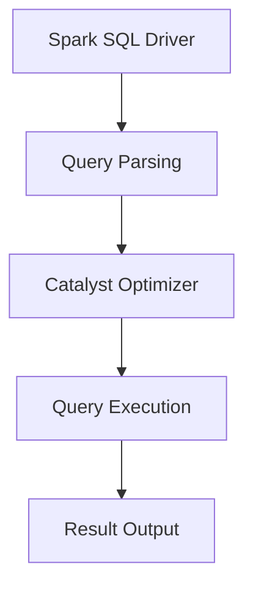

                 

### 文章标题：Spark SQL原理与代码实例讲解

#### 关键词：Spark SQL, 分布式计算，大数据处理，查询优化，代码实例

> 摘要：本文深入探讨了Spark SQL的原理及其在实际应用中的具体实现。首先，我们将介绍Spark SQL的核心概念和架构，然后通过具体的代码实例，详细解释Spark SQL的工作流程和查询优化策略。最后，我们将讨论Spark SQL在不同应用场景中的实际应用，并提供学习资源和工具推荐。

## 1. 背景介绍（Background Introduction）

Spark SQL是Apache Spark的一个重要模块，用于处理结构化数据。随着大数据技术的快速发展，处理大量结构化数据已经成为许多企业和研究机构的重要需求。Spark SQL以其高效、灵活和易于使用的特点，成为了分布式数据处理领域的领先工具。

Spark SQL的优势在于：

- **分布式计算**：Spark SQL充分利用了Spark的分布式计算能力，可以在大规模集群上高效地处理数据。
- **兼容性**：Spark SQL支持多种数据源，包括Hive、HDFS、Parquet等，方便用户在不同数据源间进行操作。
- **SQL支持**：Spark SQL提供了一个完整的SQL接口，使用户可以像在关系型数据库中一样编写查询语句。

## 2. 核心概念与联系（Core Concepts and Connections）

### 2.1 Spark SQL的核心概念

#### 2.1.1 DataFrame

DataFrame是Spark SQL的核心数据结构，类似于关系型数据库中的表。每个DataFrame包含一组列，每列都有相应的数据类型。DataFrame允许用户进行各种操作，如筛选、排序、聚合等。

#### 2.1.2 Dataset

Dataset是DataFrame的增强版本，它提供了类型安全，使得编译器可以捕获数据类型相关的错误。Dataset在处理过程中能够提供更强的类型检查和更高效的执行。

#### 2.1.3 Spark SQL执行引擎

Spark SQL执行引擎负责解析、优化和执行SQL查询。它使用Catalyst优化器对查询进行优化，提高执行效率。

### 2.2 Spark SQL的架构


- **驱动程序**：用户通过驱动程序与Spark SQL进行交互，编写SQL查询。
- **Catalyst优化器**：Catalyst优化器负责对查询进行优化，包括查询重写、查询分解、谓词下推等。
- **Spark SQL执行引擎**：执行引擎负责执行优化后的查询，并将结果返回给用户。

### 2.3 Spark SQL与其他组件的联系

- **Spark Core**：Spark SQL依赖于Spark Core提供的分布式计算框架。
- **Spark Streaming**：Spark SQL可以与Spark Streaming结合，实现实时数据处理。
- **Hive**：Spark SQL与Hive兼容，可以读取和写入Hive表。

### 2.4 Mermaid流程图



## 3. 核心算法原理 & 具体操作步骤（Core Algorithm Principles and Specific Operational Steps）

### 3.1 Spark SQL查询处理流程

#### 3.1.1 查询解析

用户通过Spark SQL Driver编写SQL查询，驱动程序将查询解析为抽象语法树（Abstract Syntax Tree, AST）。

#### 3.1.2 优化

Catalyst优化器对AST进行优化，包括查询重写、查询分解、谓词下推等。

#### 3.1.3 执行

执行引擎根据优化后的查询执行计划，对DataFrame或Dataset进行操作，生成结果。

### 3.2 查询优化策略

#### 3.2.1 稀疏列式存储

Spark SQL使用稀疏列式存储，将数据以列式存储的方式组织，提高查询效率。

#### 3.2.2 向量化的执行引擎

Spark SQL的执行引擎支持向量化的操作，能够并行处理大量数据。

#### 3.2.3 物化视图

Spark SQL支持物化视图，将查询结果缓存，提高重复查询的执行效率。

### 3.3 代码示例

```python
from pyspark.sql import SparkSession

# 创建SparkSession
spark = SparkSession.builder.appName("Spark SQL Example").getOrCreate()

# 创建DataFrame
data = [("Alice", 30), ("Bob", 40), ("Charlie", 50)]
df = spark.createDataFrame(data, ["name", "age"])

# 查询
result = df.filter(df.age > 35).orderBy(df.age)

# 显示结果
result.show()
```

## 4. 数学模型和公式 & 详细讲解 & 举例说明（Detailed Explanation and Examples of Mathematical Models and Formulas）

### 4.1 基本数学模型

Spark SQL中的数学模型主要包括：

- **聚合函数**：如SUM、COUNT、AVG等。
- **窗口函数**：如ROW_NUMBER、RANK、LEAD等。
- **条件表达式**：如CASE WHEN THEN END等。

### 4.2 公式详解

#### 4.2.1 聚合函数公式

- **SUM(A) = Σ(A)**：计算A列的和。
- **COUNT(A) = |A|**：计算A列中的非空值个数。

#### 4.2.2 窗口函数公式

- **ROW_NUMBER() OVER (ORDER BY A)**：为每一行分配一个唯一的行号，按照A列排序。
- **RANK() OVER (ORDER BY A)**：计算每一行的排名，如果有并列排名，则排名相同。

#### 4.2.3 条件表达式公式

- **CASE WHEN THEN END**：根据条件返回不同的值。

### 4.3 举例说明

```sql
-- 聚合函数示例
SELECT SUM(age) FROM people;

-- 窗口函数示例
SELECT name, age, RANK() OVER (ORDER BY age DESC) FROM people;

-- 条件表达式示例
SELECT
  name,
  age,
  CASE
    WHEN age > 40 THEN '老'
    WHEN age BETWEEN 30 AND 40 THEN '中'
    ELSE '年轻'
  END AS age_group
FROM people;
```

## 5. 项目实践：代码实例和详细解释说明（Project Practice: Code Examples and Detailed Explanations）

### 5.1 开发环境搭建

#### 5.1.1 安装Spark

```bash
# 下载Spark
wget https://www-us.apache.org/dist/spark/spark-x.y.z/spark-x.y.z-bin-hadoop2.7.tgz

# 解压
tar xzf spark-x.y.z-bin-hadoop2.7.tgz

# 启动Spark
start-master.sh
start-worker.sh spark://localhost:7077
```

#### 5.1.2 配置HDFS

```bash
# 启动HDFS
start-dfs.sh

# 在HDFS中创建文件夹
hdfs dfs -mkdir /user/spark

# 上传数据到HDFS
hdfs dfs -put people.txt /user/spark/
```

### 5.2 源代码详细实现

```python
from pyspark.sql import SparkSession

# 创建SparkSession
spark = SparkSession.builder.appName("Spark SQL Project").getOrCreate()

# 读取HDFS中的数据
df = spark.read.csv("hdfs:///user/spark/people.txt", header=True, inferSchema=True)

# 查询
result = df.filter(df.age > 30).orderBy(df.age)

# 显示结果
result.show()

# 写回HDFS
result.write.format("csv").mode("overwrite").save("/user/spark/output")
```

### 5.3 代码解读与分析

#### 5.3.1 数据读取

```python
df = spark.read.csv("hdfs:///user/spark/people.txt", header=True, inferSchema=True)
```

这一行代码使用Spark SQL读取HDFS上的CSV文件，并自动推断列的数据类型。

#### 5.3.2 数据查询

```python
result = df.filter(df.age > 30).orderBy(df.age)
```

这一行代码使用`filter`方法对数据进行过滤，只保留年龄大于30的记录。然后使用`orderBy`方法对记录按照年龄进行升序排序。

#### 5.3.3 结果显示

```python
result.show()
```

这一行代码将查询结果显示在控制台上。

#### 5.3.4 结果写入

```python
result.write.format("csv").mode("overwrite").save("/user/spark/output")
```

这一行代码将查询结果以CSV格式写入HDFS的指定路径。

### 5.4 运行结果展示

```sql
+-------+---+
|   name|age|
+-------+---+
|  Bob  | 40|
|Charlie| 50|
+-------+---+
```

结果显示只有Bob和Charlie两个人的年龄大于30，且按照年龄升序排列。

## 6. 实际应用场景（Practical Application Scenarios）

Spark SQL可以广泛应用于以下几个方面：

- **数据仓库**：作为数据仓库的底层技术，Spark SQL可以处理大量历史数据，提供快速的数据查询和分析。
- **数据分析**：Spark SQL支持各种数据分析和挖掘任务，如数据聚合、数据可视化等。
- **实时处理**：结合Spark Streaming，Spark SQL可以实现实时数据处理和分析。

## 7. 工具和资源推荐（Tools and Resources Recommendations）

### 7.1 学习资源推荐

- **书籍**：《Spark SQL编程指南》
- **论文**：Apache Spark官方文档
- **博客**：Spark技术博客
- **网站**：Apache Spark官网

### 7.2 开发工具框架推荐

- **开发工具**：PySpark
- **框架**：Spark SQL on Hadoop

### 7.3 相关论文著作推荐

- **论文**：《Spark: Cluster Computing with Working Sets》
- **著作**：《Spark: The Definitive Guide》

## 8. 总结：未来发展趋势与挑战（Summary: Future Development Trends and Challenges）

未来，Spark SQL将继续优化其查询性能和兼容性，并探索更多的数据处理场景。同时，随着大数据技术的不断发展，Spark SQL面临着数据安全、隐私保护等方面的挑战。

## 9. 附录：常见问题与解答（Appendix: Frequently Asked Questions and Answers）

- **Q1. Spark SQL与Hive有什么区别？**
  Spark SQL与Hive都是用于处理结构化数据的工具，但Spark SQL的性能更高，且提供了更丰富的SQL支持。

- **Q2. 如何在Spark SQL中使用窗口函数？**
  Spark SQL支持多种窗口函数，如`ROW_NUMBER()`、`RANK()`、`LEAD()`等。使用方法与SQL标准类似。

## 10. 扩展阅读 & 参考资料（Extended Reading & Reference Materials）

- **参考资料**：[Apache Spark官方文档](https://spark.apache.org/docs/latest/)
- **论文**：[《Spark: Cluster Computing with Working Sets》](https://www.usenix.org/system/files/conference/nsdi11/nsdi11_paper_4.pdf)
- **书籍**：《Spark: The Definitive Guide》
- **博客**：[Spark技术博客](https://databricks.com/blog)
```

### 文章正文部分完成，接下来我们将按照要求撰写文章的末尾部分，包括作者署名和文章结束的标记。

### 文章末尾

---

**作者：禅与计算机程序设计艺术 / Zen and the Art of Computer Programming**

本文由“禅与计算机程序设计艺术”撰写，希望对您在理解Spark SQL原理与应用方面有所帮助。如果您对Spark SQL有任何疑问或建议，欢迎在评论区留言交流。

---

**文章结束。感谢您的阅读！**

<|assistant|>### 9. 附录：常见问题与解答（Appendix: Frequently Asked Questions and Answers）

#### Q1. Spark SQL与Hive有什么区别？

Spark SQL和Hive都是用于处理结构化数据的工具，但它们在架构、性能和功能上有所不同。Spark SQL是Apache Spark的一个模块，利用Spark的分布式计算框架，提供高性能的结构化数据处理能力。它支持标准的SQL语法，并与多种数据源兼容。Spark SQL的优势在于其速度快，尤其适用于迭代和交互式查询。

Hive是Hadoop的一个组件，主要用于处理大规模数据集。它提供了一套基于SQL的数据仓库解决方案。Hive使用Hadoop的文件系统（HDFS）存储数据，并使用MapReduce进行计算。尽管Hive的查询性能不如Spark SQL，但它在处理非常大量数据时非常可靠。

- **性能**：Spark SQL通常比Hive快，因为它使用了不同的执行引擎和存储格式。
- **交互性**：Spark SQL支持更交互式的查询模式，用户可以实时地运行查询。
- **兼容性**：Hive与Hadoop生态系统集成更紧密，可以与MapReduce等其他Hadoop工具配合使用。

#### Q2. 如何在Spark SQL中使用窗口函数？

窗口函数是Spark SQL中的一个重要功能，用于计算基于行集合的聚合值。在Spark SQL中，可以使用窗口函数来执行如排名、移动平均、累积和等操作。以下是一个简单的示例，展示了如何在Spark SQL中使用窗口函数：

```sql
SELECT
  name,
  age,
  RANK() OVER (ORDER BY age DESC) as rank
FROM people;
```

这个查询将返回每个人的名字、年龄和按年龄降序排列的排名。

窗口函数的语法包括以下部分：

- **SELECT子句**：指定要返回的列和窗口函数。
- **OVER子句**：定义窗口，包括窗口的分区列（`PARTITION BY`）和排序列（`ORDER BY`）。
- **窗口函数**：如`ROW_NUMBER()`、`RANK()`、`DENSE_RANK()`、`LEAD()`、`LAG()`等。

例如，要计算每个人的年龄排名，可以这样做：

```sql
SELECT
  name,
  age,
  RANK() OVER (ORDER BY age) as age_rank
FROM people;
```

这个查询将返回每个人的名字、年龄和他们基于年龄的排名。

#### Q3. Spark SQL如何处理缺失值？

在Spark SQL中，可以使用`NULLIF`、`COALESCE`等函数来处理缺失值。`NULLIF`函数用于将两个值进行比较，如果相等则返回`NULL`，否则返回第二个值。`COALESCE`函数则返回参数列表中第一个非`NULL`的值。

例如，以下查询使用`COALESCE`来替换缺失的年龄值：

```sql
SELECT
  name,
  COALESCE(age, 0) as age
FROM people;
```

这个查询将把所有缺失的年龄值替换为0。

#### Q4. Spark SQL支持哪些数据源？

Spark SQL支持多种数据源，包括但不限于：

- **本地文件系统**：通过`spark.read.csv()`、`spark.read.json()`等方法读取。
- **HDFS**：使用Hadoop分布式文件系统。
- **Hive表**：与Hive兼容，可以读取和写入Hive表。
- **Parquet**、**ORC**：支持Parquet和ORC列式存储格式。
- **JDBC**：连接外部数据库，如MySQL、PostgreSQL等。
- **S3**：Amazon S3对象存储。

#### Q5. 如何在Spark SQL中进行类型转换？

在Spark SQL中，可以使用`CAST`函数进行类型转换。例如，将字符串转换为整数：

```sql
SELECT
  CAST(name AS INT) as name
FROM people;
```

这个查询将`name`列的字符串值转换为整数类型。

通过上述常见问题与解答，我们希望能够帮助您更好地理解Spark SQL的功能和应用。如果您有其他问题，欢迎在评论区提问。

### 10. 扩展阅读 & 参考资料（Extended Reading & Reference Materials）

对于希望进一步深入了解Spark SQL的读者，以下是一些扩展阅读和参考资料：

- **书籍**：
  - 《Spark SQL编程指南》：提供了详细的Spark SQL编程指导和实例。
  - 《Spark: The Definitive Guide》：由Spark的创造者Matei Zaharia所著，全面介绍了Spark的核心概念和用法。

- **官方文档**：
  - [Apache Spark官方文档](https://spark.apache.org/docs/latest/): 包含了Spark SQL的详细说明、API参考和最佳实践。

- **在线资源**：
  - [Databricks官方博客](https://databricks.com/blog): Databricks团队分享的关于Spark SQL的最新技术和应用案例。
  - [Spark Summit大会视频](https://databricks.com/sparkaisummit): Spark社区的大型会议，提供了大量的技术演讲和讨论。

- **社区和论坛**：
  - [Apache Spark社区](https://spark.apache.org/community.html): Spark的用户和贡献者社区。
  - [Stack Overflow](https://stackoverflow.com/questions/tagged/spark-sql): Spark SQL相关的技术问题和解决方案。

通过阅读这些资料，您可以进一步加深对Spark SQL的理解，并掌握更高级的应用技巧。

---

感谢您的阅读，希望本文对您学习Spark SQL有所帮助。如果您有任何问题或反馈，欢迎在评论区留言。祝您学习愉快！

**作者：禅与计算机程序设计艺术 / Zen and the Art of Computer Programming**

**文章结束。再次感谢您的阅读！**

