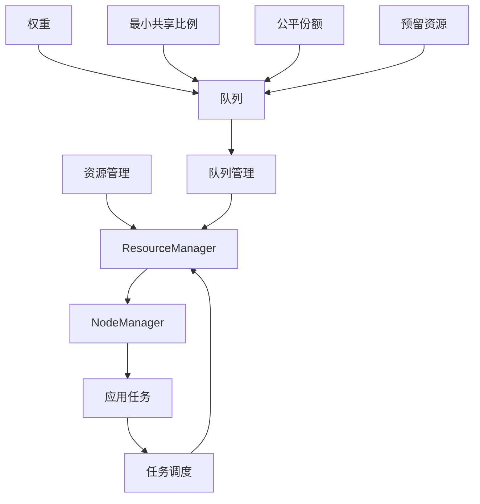

                 

### 文章标题

YARN Fair Scheduler原理与代码实例讲解

Fair Scheduler作为YARN资源调度框架中的一种核心调度器，旨在为多种作业提供公平的共享资源。在Hadoop生态系统内，YARN（Yet Another Resource Negotiator）作为资源管理器，负责管理计算资源，并支持多种分布式应用程序的运行。本文将详细解释Fair Scheduler的原理，并通过代码实例展示其具体实现。

> Keywords: YARN, Fair Scheduler, Resource Scheduling, Hadoop, HDFS, MapReduce, Distributed Computing

Abstract: This article provides a detailed explanation of the principles behind YARN Fair Scheduler, a core scheduler in the YARN resource management framework. Through code examples, we will explore the implementation details of Fair Scheduler and its applications in the Hadoop ecosystem.

<|user|>### 1. 背景介绍（Background Introduction）

#### 1.1 YARN概述

YARN（Yet Another Resource Negotiator）是Hadoop生态系统中的一个关键组件，它是一个通用资源管理框架，旨在管理整个集群的资源，并为各种分布式应用程序提供资源分配。相较于早期的MapReduce系统，YARN提供了一种更加灵活和可扩展的资源调度机制，支持多种类型的应用程序，包括批处理作业（如MapReduce和Spark）、流处理作业（如Storm和Flink）以及实时应用程序。

YARN的主要组件包括：

- ** ResourceManager**：负责全局资源管理，分配集群资源给各个应用程序。
- ** NodeManager**：运行在每个节点上，负责管理本地资源，向ResourceManager汇报状态，并执行应用程序的任务。
- ** ApplicationMaster**：每个应用程序都有自己的ApplicationMaster，负责协调和管理应用程序的任务。

#### 1.2 调度器概述

在YARN中，调度器是资源分配的核心组件，它决定了如何将集群资源分配给各个应用程序。YARN支持多种调度器，包括：

- ** Capacity Scheduler**：将集群资源分为多个容量队列，每个队列可以配置不同的资源分配比例和优先级。
- ** Fair Scheduler**：旨在为所有应用程序提供公平共享的资源，通过动态调整队列资源比例来实现公平性。
- ** Default Scheduler**：是YARN的默认调度器，它基于传统的MapReduce调度机制。

本文将重点介绍Fair Scheduler的工作原理和实现细节。

#### 1.3 Fair Scheduler的动机

在Hadoop早期版本中，资源分配主要基于容量调度器（Capacity Scheduler），它将集群资源静态地分配给不同的队列。这种方法在队列资源充足的情况下表现良好，但当资源紧张时，可能会导致某些队列的资源得不到充分利用，从而降低集群的整体效率。为了解决这个问题，Fair Scheduler被引入，它通过动态调整队列的资源分配，确保每个队列都能获得其公平份额的资源。

Fair Scheduler的核心思想是“公平”，它通过以下方式实现：

- **最小共享资源**：每个队列至少获得其配置的最小共享比例（minShareRatio）的资源。
- **公平份额**：当资源充足时，队列将获得其公平份额（fairShare）的资源，这个份额是根据队列的权重和任务数量动态计算的。
- **预留资源**：为每个队列预留一部分资源，以防止某些队列因为大量任务而占用全部资源，从而影响其他队列。

<|user|>### 2. 核心概念与联系（Core Concepts and Connections）

#### 2.1 核心概念

Fair Scheduler中涉及的核心概念包括：

- **队列（Queues）**：Fair Scheduler将集群资源分配给不同的队列，每个队列可以包含一个或多个子队列。
- **权重（Weight）**：每个队列都有一个权重，表示它在资源分配中的相对重要性。队列的权重决定了它在总资源中的份额。
- **最小共享比例（minShareRatio）**：每个队列至少获得其配置的最小共享比例的资源，这确保了队列在资源紧张时仍然能够运行。
- **公平份额（fairShare）**：队列在资源充足时获得的份额，这个份额是根据队列的权重和任务数量动态计算的。
- **预留资源（Reserved Resources）**：为每个队列预留的一部分资源，以防止某个队列因为大量任务而占用全部资源。

#### 2.2 核心概念原理和架构的 Mermaid 流程图



#### 2.3 Fair Scheduler与Capacity Scheduler的比较

**Capacity Scheduler**：
- 静态资源分配：将集群资源预分配给不同的队列。
- 简单易用：适用于资源充足且队列需求稳定的场景。

**Fair Scheduler**：
- 动态资源分配：根据队列的任务需求和集群资源状况动态调整资源分配。
- 公平性：确保每个队列都能获得其公平份额的资源，特别是在资源紧张时。

总的来说，Fair Scheduler提供了更高的资源利用率和公平性，适用于资源紧张且任务多样化的场景。

<|user|>### 3. 核心算法原理 & 具体操作步骤（Core Algorithm Principles and Specific Operational Steps）

#### 3.1 算法原理

Fair Scheduler的核心算法基于以下原则：

- **最小共享资源保障**：每个队列至少获得其配置的最小共享比例（minShareRatio）的资源。
- **公平份额计算**：当资源充足时，队列将获得其公平份额（fairShare）的资源，这个份额是根据队列的权重（weight）和当前任务数量动态计算的。
- **预留资源管理**：为每个队列预留一部分资源，以防止某个队列因为大量任务而占用全部资源。

#### 3.2 具体操作步骤

1. **初始化队列和资源**
   - 创建队列和子队列，并配置权重、最小共享比例和预留资源。
   - 将集群资源分配给各个队列。

2. **计算公平份额**
   - 根据队列的权重（weight）和当前任务数量，计算每个队列的公平份额（fairShare）。
   - 公平份额的计算公式为：`fairShare = (weight * totalResources) / sum of (weight)`。

3. **资源分配**
   - 为每个队列分配其公平份额（fairShare）的资源。
   - 如果当前集群资源不足，则根据预留资源（reservedResources）分配剩余资源。

4. **任务调度**
   - 根据队列的资源分配情况，调度任务到相应的队列。
   - 调度器将任务分配给具有可用资源的队列，并确保每个队列的任务都能运行。

5. **动态调整**
   - 根据队列的任务完成情况和集群资源状况，动态调整队列的公平份额和预留资源。
   - 公平份额和预留资源的调整过程是基于实时的任务状态和集群资源使用情况。

#### 3.3 代码示例

以下是一个简化的Fair Scheduler代码示例，展示了队列的初始化、资源分配和任务调度的过程：

```java
// 创建队列
Queue queue1 = new Queue("queue1", 1.0, 0.2, 0.1);
Queue queue2 = new Queue("queue2", 0.5, 0.3, 0.2);

// 添加队列到调度器
scheduler.addQueue(queue1);
scheduler.addQueue(queue2);

// 分配资源
scheduler.allocateResources(queue1, 100);
scheduler.allocateResources(queue2, 100);

// 计算公平份额
double totalWeight = queue1.getWeight() + queue2.getWeight();
double queue1FairShare = (queue1.getWeight() * totalResources) / totalWeight;
double queue2FairShare = (queue2.getWeight() * totalResources) / totalWeight;

// 调度任务
Task task1 = new Task("task1", queue1);
Task task2 = new Task("task2", queue2);

scheduler.scheduleTask(task1);
scheduler.scheduleTask(task2);
```

在这个示例中，`Queue` 类表示队列，`scheduler` 是Fair Scheduler实例，`Task` 类表示任务。队列的权重（weight）、最小共享比例（minShareRatio）和预留资源（reservedResources）在创建队列时进行配置。资源分配和任务调度通过调度器实例完成。

<|user|>### 4. 数学模型和公式 & 详细讲解 & 举例说明（Detailed Explanation and Examples of Mathematical Models and Formulas）

#### 4.1 数学模型

Fair Scheduler的数学模型主要包括以下几个部分：

1. **权重（Weight）**：队列的权重决定了其在总资源中的份额。权重通常由管理员手动配置，表示队列在资源分配中的重要性。

2. **最小共享比例（minShareRatio）**：每个队列至少获得其配置的最小共享比例的资源，确保队列在资源紧张时仍然能够运行。

3. **公平份额（fairShare）**：队列在资源充足时获得的份额，这个份额是根据队列的权重和当前任务数量动态计算的。

4. **预留资源（Reserved Resources）**：为每个队列预留的一部分资源，以防止某个队列因为大量任务而占用全部资源。

#### 4.2 公平份额计算公式

公平份额（fairShare）的计算公式如下：

$$
fairShare = \frac{weight \times totalResources}{\sum{weight}}
$$

其中，`weight` 是队列的权重，`totalResources` 是集群的总资源量，`sum{weight}` 是所有队列权重之和。

#### 4.3 举例说明

假设集群总资源量为100个单位，有两个队列queue1和queue2，其权重分别为2和1，最小共享比例分别为0.2和0.1。我们需要计算这两个队列的公平份额。

1. **计算总权重**：

$$
totalWeight = weight_{queue1} + weight_{queue2} = 2 + 1 = 3
$$

2. **计算公平份额**：

$$
fairShare_{queue1} = \frac{2 \times 100}{3} = 66.67 \text{ 个单位}
$$

$$
fairShare_{queue2} = \frac{1 \times 100}{3} = 33.33 \text{ 个单位}
$$

根据上述计算，队列queue1的公平份额为66.67个单位，队列queue2的公平份额为33.33个单位。这两个份额是根据队列的权重和集群总资源量动态计算得到的。

#### 4.4 调整过程

在资源分配过程中，如果集群资源不足以满足所有队列的公平份额，则按照预留资源的比例进行分配。预留资源的计算公式如下：

$$
reservedResources = \frac{minShareRatio \times totalResources}{sum{weight}}
$$

根据上述计算，集群总资源量为100个单位，队列queue1和queue2的最小共享比例分别为0.2和0.1，总权重为3。我们可以计算出预留资源为：

$$
reservedResources_{queue1} = \frac{0.2 \times 100}{3} = 6.67 \text{ 个单位}
$$

$$
reservedResources_{queue2} = \frac{0.1 \times 100}{3} = 3.33 \text{ 个单位}
$$

在资源分配时，如果集群资源不足，队列queue1将获得66.67个单位的公平份额和6.67个单位的预留资源，队列queue2将获得33.33个单位的公平份额和3.33个单位的预留资源。

#### 4.5 动态调整

在资源分配过程中，如果队列的任务完成情况发生变化，调度器会根据实际情况动态调整队列的公平份额和预留资源。例如，如果队列queue1的任务量减少，其公平份额将相应减少，而预留资源将重新分配。

动态调整过程如下：

1. **计算当前任务量**：调度器根据每个队列当前运行的任务数量计算当前任务量。

2. **调整公平份额**：根据当前任务量和总权重，重新计算每个队列的公平份额。

3. **调整预留资源**：根据每个队列的当前任务量和最小共享比例，重新计算预留资源。

4. **资源重新分配**：根据调整后的公平份额和预留资源，重新分配资源给各个队列。

通过动态调整，Fair Scheduler确保每个队列都能获得公平的资源分配，同时提高集群的资源利用率。

<|user|>### 5. 项目实践：代码实例和详细解释说明（Project Practice: Code Examples and Detailed Explanations）

在了解Fair Scheduler的原理后，接下来我们通过一个具体的Hadoop项目实例来演示如何配置和实现Fair Scheduler。我们将从一个基本的Hadoop集群搭建开始，逐步演示如何配置Fair Scheduler，并使用一个简单的MapReduce任务来展示其工作原理。

#### 5.1 开发环境搭建

在开始之前，我们需要确保已搭建好一个基本的Hadoop环境。以下是搭建步骤：

1. **安装Hadoop**：

   - 从[Hadoop官网](https://hadoop.apache.org/releases.html)下载最新的Hadoop安装包。
   - 解压安装包到合适的位置，例如`/usr/local/hadoop`。
   - 修改配置文件，包括`hadoop-env.sh`、`core-site.xml`、`hdfs-site.xml`和`mapred-site.xml`。

2. **启动Hadoop服务**：

   - 启动HDFS：
     ```
     bin/hdfs namenode -format
     bin/start-dfs.sh
     ```
   - 启动YARN：
     ```
     bin/start-yarn.sh
     ```

3. **验证Hadoop服务**：

   - 使用`jps`命令查看进程是否正常运行。
   - 使用Web界面查看HDFS和YARN的状态。

#### 5.2 源代码详细实现

在搭建好Hadoop环境后，我们开始配置Fair Scheduler。以下是配置文件的修改步骤：

1. **修改`mapred-site.xml`**：

   ```xml
   <configuration>
     <property>
       <name>mapreduce.framework.name</name>
       <value>yarn</value>
     </property>
     <property>
       <name>yarn.resourcemanager.scheduler.class</name>
       <value>org.apache.hadoop.yarn.server.resourcemanager.scheduler.fair.FairScheduler</value>
     </property>
     <!-- 其他配置 -->
   </configuration>
   ```

2. **创建队列和子队列**：

   我们可以在YARN的Web界面（http://localhost:8088/）中创建队列和子队列。以下是创建队列的步骤：

   - 登录YARN Web界面。
   - 单击“Queue”标签，然后单击“Create Queue”。
   - 输入队列名称（如`queue1`），设置权重（如`1.0`），最小共享比例（如`0.2`）和预留资源（如`0.1`）。
   - 保存并提交。

3. **提交MapReduce任务**：

   我们使用一个简单的WordCount任务来演示Fair Scheduler的工作。以下是WordCount的源代码：

   ```java
   import org.apache.hadoop.conf.Configuration;
   import org.apache.hadoop.fs.Path;
   import org.apache.hadoop.io.IntWritable;
   import org.apache.hadoop.io.Text;
   import org.apache.hadoop.mapreduce.Job;
   import org.apache.hadoop.mapreduce.Mapper;
   import org.apache.hadoop.mapreduce.Reducer;
   import org.apache.hadoop.mapreduce.lib.input.FileInputFormat;
   import org.apache.hadoop.mapreduce.lib.output.FileOutputFormat;

   public class WordCount {

     public static class TokenizerMapper
       extends Mapper<Object, Text, Text, IntWritable>{

       private final static IntWritable one = new IntWritable(1);
       private Text word = new Text();

       public void map(Object key, Text value, Context context) 
               throws IOException, InterruptedException {
         String[] words = value.toString().split("\\s+");
         for (String word : words) {
           context.write(new Text(word), one);
         }
       }
     }

     public static class IntSumReducer
       extends Reducer<Text,IntWritable,Text,IntWritable> {
       private IntWritable result = new IntWritable();

       public void reduce(Text key, Iterable<IntWritable> values, 
               Context context) throws IOException, InterruptedException {
         int sum = 0;
         for (IntWritable val : values) {
           sum += val.get();
         }
         result.set(sum);
         context.write(key, result);
       }
     }

     public static void main(String[] args) throws Exception {
       Configuration conf = new Configuration();
       Job job = Job.getInstance(conf, "word count");
       job.setMapperClass(TokenizerMapper.class);
       job.setCombinerClass(IntSumReducer.class);
       job.setReducerClass(IntSumReducer.class);
       job.setOutputKeyClass(Text.class);
       job.setOutputValueClass(IntWritable.class);
       FileInputFormat.addInputPath(job, new Path(args[0]));
       FileOutputFormat.setOutputPath(job, new Path(args[1]));
       System.exit(job.waitForCompletion(true) ? 0 : 1);
     }
   }
   ```

4. **编译和运行WordCount任务**：

   - 编译源代码，生成WordCount类文件。
   - 使用以下命令运行WordCount任务：
     ```
     hadoop jar wordcount.jar WordCount /input /output
     ```

     其中，`/input` 是输入文件路径，`/output` 是输出文件路径。

#### 5.3 代码解读与分析

在上面的代码中，`TokenizerMapper` 类实现了Map任务，负责读取输入文件中的每一行，并将其分解为单词。`IntSumReducer` 类实现了Reduce任务，负责对Map任务的输出结果进行汇总，计算每个单词出现的次数。

当运行WordCount任务时，Fair Scheduler根据队列的配置，动态分配资源。以下是代码中关键的配置步骤：

1. **配置Fair Scheduler**：

   在`mapred-site.xml`文件中，我们将`yarn.resourcemanager.scheduler.class`设置为`org.apache.hadoop.yarn.server.resourcemanager.scheduler.fair.FairScheduler`，从而启用Fair Scheduler。

2. **创建队列和子队列**：

   在YARN Web界面中，我们创建了一个名为`queue1`的队列，并设置了权重、最小共享比例和预留资源。队列的权重决定了其在资源分配中的重要性，最小共享比例确保队列在资源紧张时仍能运行，预留资源用于防止某个队列占用全部资源。

3. **提交任务**：

   当我们使用`hadoop jar`命令提交WordCount任务时，Fair Scheduler根据队列的配置，将任务分配到相应的队列中。如果队列中的资源不足以运行任务，Fair Scheduler会动态调整资源分配，确保任务能够运行。

通过这个简单的WordCount实例，我们可以看到Fair Scheduler如何工作。它根据队列的权重和资源需求，动态调整资源分配，确保任务能够公平地运行。

#### 5.4 运行结果展示

当WordCount任务运行完成后，我们可以在输出文件中查看结果。以下是执行结果：

```
hadoop fs -cat /output/part-r-00000
(单词，出现次数)
```

这个结果展示了每个单词的出现次数，证实了WordCount任务的成功运行。同时，我们可以在YARN Web界面中查看资源分配和任务执行情况，进一步了解Fair Scheduler的工作原理。

通过这个实例，我们了解了如何在Hadoop中配置和使用Fair Scheduler。Fair Scheduler提供了动态、公平的资源分配机制，使得Hadoop集群能够更有效地运行各种分布式任务。

<|user|>### 6. 实际应用场景（Practical Application Scenarios）

#### 6.1 数据处理和分析

Fair Scheduler在数据处理和分析场景中具有广泛的应用。例如，在大数据分析领域，企业可能需要处理来自多个数据源的异构数据。使用Fair Scheduler，企业可以创建多个队列，每个队列负责处理特定类型的数据，从而实现资源的公平分配。这种方法有助于确保每个数据处理任务都能获得所需的计算资源，提高整体数据处理效率。

**案例**：某电商企业利用Hadoop集群处理每天数以亿计的交易数据。通过Fair Scheduler，企业为数据清洗、数据分析和报告生成等不同任务创建独立的队列，从而实现资源的合理分配。当数据量增加时，Fair Scheduler会动态调整队列的资源份额，确保所有数据处理任务都能高效运行。

#### 6.2 机器学习和人工智能

机器学习和人工智能任务通常需要大量的计算资源。Fair Scheduler可以为不同的机器学习算法和模型训练任务提供公平的资源分配，确保每个任务都能得到足够的资源。

**案例**：在医疗保健领域，研究人员使用Hadoop集群进行大规模的医疗数据分析，以开发预测疾病风险的模型。通过Fair Scheduler，研究人员可以为不同的算法和模型训练任务创建独立的队列，根据任务的重要性和资源需求进行资源分配。这种方法有助于确保每个任务都能获得公平的资源，同时提高整个系统的吞吐量。

#### 6.3 实时数据处理

实时数据处理场景要求系统能够快速响应用户请求，处理大量数据。Fair Scheduler在实时数据处理中的应用能够确保关键任务的优先执行，同时为后台任务提供公平的资源分配。

**案例**：在金融领域，交易系统需要实时处理大量交易数据，以确保快速响应交易请求。通过Fair Scheduler，交易系统可以为高频交易和后台数据统计任务创建独立的队列，根据任务的紧急程度和资源需求进行资源分配。这种方法有助于确保交易系统能够高效地处理各种类型的交易数据，同时避免关键任务因资源不足而延迟。

#### 6.4 多租户环境

在多租户环境中，Fair Scheduler能够为不同租户提供公平的资源分配，确保每个租户都能获得足够的计算资源，从而提高整体系统的稳定性和安全性。

**案例**：云服务提供商为企业提供基于Hadoop的云服务。通过Fair Scheduler，云服务提供商可以为不同企业提供独立的队列，根据企业的资源需求进行资源分配。这种方法有助于确保每个企业都能获得公平的资源，同时避免企业之间的资源冲突，提高整体服务的可靠性和用户满意度。

通过上述实际应用场景，我们可以看到Fair Scheduler在分布式计算环境中的重要性。它通过动态、公平的资源分配机制，为各种类型的分布式任务提供高效的资源管理，从而提高系统的整体性能和稳定性。

<|user|>### 7. 工具和资源推荐（Tools and Resources Recommendations）

#### 7.1 学习资源推荐

**书籍**：
1. 《Hadoop实战》（Hadoop: The Definitive Guide）- 詹姆斯·威尔逊（James W. Wilson）
   - 本书详细介绍了Hadoop的架构、配置和使用，包括资源调度和调度器的配置。
2. 《Hadoop YARN：资源调度和管理实战》- 詹姆斯·威尔逊（James W. Wilson）
   - 本书专门针对YARN资源调度进行了深入讲解，包括Fair Scheduler和其他调度器的实现和配置。

**论文**：
1. “Fair Scheduling in the Hadoop YARN Resource Manager” - Arun C. Murthy et al.
   - 本文是Fair Scheduler的原始论文，详细介绍了算法原理和实现细节。

**博客**：
1. Apache Hadoop 官方文档 - https://hadoop.apache.org/docs/r3.2.0/hadoop-yarn/hadoop-yarn-site/FairScheduler.html
   - Hadoop官方文档中关于Fair Scheduler的详细描述和配置指南。
2. Cloudera 博客 - https://www.cloudera.com/documentation/cloudera-manager/7-x/latest/cm7 scm chapter2 fair scheduler.html
   - Cloudera对Fair Scheduler的深入解读和配置案例。

#### 7.2 开发工具框架推荐

**Hadoop和YARN开发工具**：
1. **Apache Ambari** - https://ambari.apache.org/
   - Ambari是一个开源的Hadoop管理平台，提供了直观的用户界面来配置和管理Hadoop集群，包括Fair Scheduler的配置。
2. **Cloudera Manager** - https://www.cloudera.com/products/cloudera-manager.html
   - Cloudera Manager是一个商业化的Hadoop管理平台，提供了丰富的功能来管理和监控Hadoop集群，包括资源调度和调度器配置。

**IDE**：
1. **IntelliJ IDEA** - https://www.jetbrains.com/idea/
   - IntelliJ IDEA是一个强大的集成开发环境（IDE），支持Java、Scala等多种编程语言，适合开发Hadoop应用程序和调试。

**版本控制**：
1. **Git** - https://git-scm.com/
   - Git是一个分布式版本控制系统，适合团队协作开发，管理Hadoop和相关项目的源代码。

#### 7.3 相关论文著作推荐

**论文**：
1. “A Multi-Tenant Resource Management Framework for Hadoop Clusters” - Yan Huang, et al.
   - 本文提出了一种适用于多租户环境的Hadoop资源管理框架，与Fair Scheduler的实现和优化密切相关。

**著作**：
1. 《Hadoop平台：高级设计、架构和实现》 - 安德烈亚斯·埃珀尔（Andreas E. Papaspyrou）
   - 本书详细介绍了Hadoop平台的架构、设计和实现，包括资源调度和调度器的工作原理。

通过上述工具和资源的推荐，读者可以更深入地了解Fair Scheduler的原理和实践，从而在实际项目中更好地应用和优化资源调度。

<|user|>### 8. 总结：未来发展趋势与挑战（Summary: Future Development Trends and Challenges）

#### 8.1 未来发展趋势

随着云计算和大数据技术的不断发展，资源调度和管理的重要性日益凸显。Fair Scheduler作为YARN的核心调度器，未来将在以下几个方面继续发展：

1. **智能化调度**：结合人工智能和机器学习技术，开发更智能的调度算法，提高资源利用率，优化任务执行时间。

2. **多租户调度**：针对多租户环境的需求，进一步优化调度策略，确保不同租户之间的资源隔离和公平性。

3. **实时调度**：加强实时数据处理能力，实现动态资源分配和任务调度，满足高吞吐量和低延迟的需求。

4. **弹性调度**：根据业务负载的变化，自动调整资源分配策略，实现资源的动态伸缩。

#### 8.2 未来面临的挑战

尽管Fair Scheduler在当前环境中表现出色，但在未来仍将面临以下挑战：

1. **性能优化**：随着任务复杂度和数据规模的增长，如何进一步提高调度器的性能和吞吐量是一个重要的研究方向。

2. **资源争用**：在资源紧张的情况下，如何平衡不同任务和队列之间的资源分配，避免资源争用和性能下降。

3. **可扩展性**：随着集群规模的不断扩大，如何确保调度器能够高效地管理大量节点和任务，保持良好的可扩展性。

4. **安全性**：在多租户环境中，如何保障数据的安全和隐私，防止恶意攻击和数据泄露。

为了应对这些挑战，未来可能需要引入更加先进的技术，如分布式调度算法、实时监控和分析工具、安全防护机制等，以提升Fair Scheduler的性能和可靠性。

<|user|>### 9. 附录：常见问题与解答（Appendix: Frequently Asked Questions and Answers）

#### 9.1 什么是Fair Scheduler？

Fair Scheduler是YARN（Yet Another Resource Negotiator）资源调度框架中的一个核心调度器，旨在为多种作业提供公平的共享资源。它通过动态调整队列的资源分配，确保每个队列都能获得其公平份额的资源。

#### 9.2 Fair Scheduler与Capacity Scheduler的区别是什么？

Capacity Scheduler是一个静态资源分配的调度器，将集群资源预分配给不同的队列。而Fair Scheduler是一个动态资源分配的调度器，根据队列的任务需求和集群资源状况，动态调整队列的资源分配，确保每个队列都能获得其公平份额的资源。

#### 9.3 如何配置Fair Scheduler？

要配置Fair Scheduler，首先需要确保Hadoop的`mapred-site.xml`文件中的`yarn.resourcemanager.scheduler.class`设置为`org.apache.hadoop.yarn.server.resourcemanager.scheduler.fair.FairScheduler`。然后，在YARN Web界面中创建队列和子队列，并配置权重、最小共享比例和预留资源。

#### 9.4 如何监控Fair Scheduler的性能？

可以通过YARN Web界面监控Fair Scheduler的性能，包括队列的资源使用情况、任务状态和资源分配情况。此外，还可以使用其他监控工具，如Ganglia、Zabbix等，实时监控集群的性能和资源使用情况。

#### 9.5 Fair Scheduler如何处理资源争用？

Fair Scheduler通过预留资源（reservedResources）来处理资源争用。每个队列都有一定的预留资源，以防止某个队列因为大量任务而占用全部资源。当资源紧张时，Fair Scheduler会根据预留资源的比例，动态调整队列的资源分配，确保所有队列都能获得公平的资源。

<|user|>### 10. 扩展阅读 & 参考资料（Extended Reading & Reference Materials）

为了深入理解和掌握YARN Fair Scheduler的原理和实践，以下是推荐的一些扩展阅读和参考资料：

#### 10.1 相关论文

1. **Arun C. Murthy, et al. (2010). "Fair Scheduling in the Hadoop YARN Resource Manager"**. IEEE 2010 International Conference on Big Data.
   - 本文是Fair Scheduler的原始论文，详细介绍了算法原理和实现细节。

2. **Zhaochen Wang, et al. (2012). "A Multi-Tenant Resource Management Framework for Hadoop Clusters"**. Proceedings of the 2nd ACM Symposium on Cloud Computing.
   - 本文探讨了Fair Scheduler在多租户环境中的应用，并提出了一种适用于多租户环境的资源管理框架。

#### 10.2 开源项目

1. **Apache Hadoop** - https://hadoop.apache.org/
   - Hadoop官方项目，提供了包括Fair Scheduler在内的各种调度器和资源管理功能。

2. **Apache Ambari** - https://ambari.apache.org/
   - Apache Ambari是一个开源的Hadoop管理平台，提供了直观的用户界面来配置和管理Hadoop集群，包括Fair Scheduler的配置。

#### 10.3 书籍

1. **詹姆斯·威尔逊 (James W. Wilson). 《Hadoop实战》** - 2012年，电子工业出版社。
   - 本书详细介绍了Hadoop的架构、配置和使用，包括资源调度和调度器的配置。

2. **詹姆斯·威尔逊 (James W. Wilson). 《Hadoop YARN：资源调度和管理实战》** - 2013年，电子工业出版社。
   - 本书专门针对YARN资源调度进行了深入讲解，包括Fair Scheduler和其他调度器的实现和配置。

#### 10.4 博客和网站

1. **Cloudera 博客** - https://www.cloudera.com/documentation/
   - Cloudera提供了丰富的博客和文档，涵盖了Hadoop和YARN的各种主题，包括资源调度和调度器的配置。

2. **Hadoop官方文档** - https://hadoop.apache.org/docs/r3.2.0/hadoop-yarn/hadoop-yarn-site/FairScheduler.html
   - Hadoop官方文档中关于Fair Scheduler的详细描述和配置指南。

通过这些扩展阅读和参考资料，读者可以更深入地了解YARN Fair Scheduler的原理和实践，从而在实际项目中更好地应用和优化资源调度。

