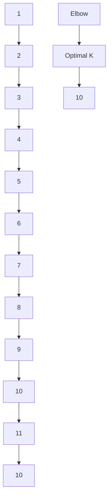

                 

### 1. 背景介绍 Background Introduction

The landscape of B2B (Business-to-Business) markets has evolved significantly in recent years, driven by technological advancements, changing consumer behaviors, and the increasing complexity of business operations. In this dynamic environment, the ability to sustain long-term profitability and stability has become a critical success factor for businesses.

**Key Points:**

1. **Technological Advancements:** Rapid technological progress has transformed the B2B market, introducing new tools, platforms, and solutions that enhance operational efficiency, customer engagement, and data analytics.
2. **Consumer Behavior Shifts:** Businesses are now more focused on delivering value-driven solutions that address specific pain points, rather than just selling products or services.
3. **Market Complexity:** The B2B market has become highly competitive, with a growing number of players offering similar solutions. This complexity requires businesses to differentiate themselves effectively to achieve long-term success.

In this article, we will explore the key concepts, strategies, and practices that can help businesses achieve long-term profitability and stability in the B2B market. We will discuss the importance of understanding market dynamics, developing customer-centric strategies, leveraging technology, and building strong relationships with stakeholders.

**中文摘要：**

本文探讨了在快速变化的B2B市场中，企业如何实现长期盈利与稳定发展的关键策略。随着技术的飞速进步、消费行为的变化和市场复杂性的增加，B2B市场已经发生了显著的变化。企业需要掌握市场动态，制定以客户为中心的战略，利用技术优势，并建立与利益相关者的强大关系，以实现长期成功。本文将详细讨论这些关键因素，并提供实用的建议和实践案例。

### 2. 核心概念与联系 Core Concepts and Connections

To achieve long-term profitability and stability in the B2B market, it's essential to understand and leverage several core concepts and their interconnections. These concepts include market analysis, customer segmentation, competitive positioning, value proposition, and strategic partnerships.

**2.1 Market Analysis**

Market analysis is the foundation for any successful B2B strategy. It involves collecting and analyzing data about market trends, customer needs, and competitive dynamics. By understanding the market landscape, businesses can identify opportunities, anticipate changes, and respond proactively.

**Market Analysis**

Market analysis is the foundation for any successful B2B strategy. It involves collecting and analyzing data about market trends, customer needs, and competitive dynamics. By understanding the market landscape, businesses can identify opportunities, anticipate changes, and respond proactively.

**2.2 Customer Segmentation**

Customer segmentation is the process of dividing a market into distinct groups of consumers based on shared characteristics, needs, or behaviors. Effective customer segmentation allows businesses to tailor their products, services, and marketing efforts to specific segments, thereby increasing the likelihood of achieving long-term profitability.

**Customer Segmentation**

Customer segmentation is the process of dividing a market into distinct groups of consumers based on shared characteristics, needs, or behaviors. Effective customer segmentation allows businesses to tailor their products, services, and marketing efforts to specific segments, thereby increasing the likelihood of achieving long-term profitability.

**2.3 Competitive Positioning**

Competitive positioning involves determining how a business can differentiate itself from its competitors in the eyes of its customers. By identifying unique selling propositions (USPs) and leveraging them effectively, businesses can gain a competitive edge and build a loyal customer base.

**Competitive Positioning**

Competitive positioning involves determining how a business can differentiate itself from its competitors in the eyes of its customers. By identifying unique selling propositions (USPs) and leveraging them effectively, businesses can gain a competitive edge and build a loyal customer base.

**2.4 Value Proposition**

A value proposition is a promise of value to customers, outlining the benefits and advantages they can expect from a product or service. A compelling value proposition helps businesses communicate their unique value to customers, differentiate themselves from competitors, and drive customer acquisition and retention.

**Value Proposition**

A value proposition is a promise of value to customers, outlining the benefits and advantages they can expect from a product or service. A compelling value proposition helps businesses communicate their unique value to customers, differentiate themselves from competitors, and drive customer acquisition and retention.

**2.5 Strategic Partnerships**

Strategic partnerships are alliances between two or more businesses that work together to achieve mutual goals. These partnerships can help businesses access new markets, leverage complementary resources, and enhance their competitive positioning. By forming strategic partnerships, businesses can create a stronger market presence and achieve long-term stability.

**Strategic Partnerships**

Strategic partnerships are alliances between two or more businesses that work together to achieve mutual goals. These partnerships can help businesses access new markets, leverage complementary resources, and enhance their competitive positioning. By forming strategic partnerships, businesses can create a stronger market presence and achieve long-term stability.

**中文概述：**

2.1 市场分析  
市场分析是任何成功B2B战略的基础。它涉及收集和分析有关市场趋势、客户需求和竞争动态的数据。通过了解市场状况，企业可以识别机会、预见变化并积极应对。

2.2 客户细分  
客户细分是将市场根据消费者的共同特征、需求或行为划分为不同的群体。有效的客户细分使企业能够根据特定段调整产品、服务和营销策略，从而提高长期盈利的可能性。

2.3 竞争定位  
竞争定位涉及确定企业如何在客户眼中与竞争对手区分开来。通过识别独特的卖点并有效地利用它们，企业可以获取竞争优势并建立忠诚的客户基础。

2.4 价值主张  
价值主张是对客户的一种价值承诺，概述了他们可以从产品或服务中期待的利益和优势。引人注目的价值主张帮助企业向客户传达独特的价值，区分自己与竞争对手，并推动客户获取和保留。

2.5 战略合作伙伴关系  
战略合作伙伴关系是两个或多个企业之间为了实现共同目标而形成的联盟。这些合作伙伴关系可以帮助企业进入新市场、利用互补资源并增强其竞争优势。通过建立战略合作伙伴关系，企业可以创建更强的市场存在感并实现长期稳定。

 
## 3. 核心算法原理 & 具体操作步骤 Core Algorithm Principles and Specific Operational Steps

### 3.1 算法概述 Overview of the Algorithm

In the B2B market, one of the key elements for achieving long-term profitability and stability is the ability to accurately predict customer needs and preferences. This is where machine learning algorithms, particularly customer segmentation algorithms, come into play. These algorithms can analyze large datasets to identify patterns and trends, enabling businesses to segment their customers more effectively and tailor their offerings accordingly.

**3.1 Overview of the Algorithm**

In the B2B market, one of the key elements for achieving long-term profitability and stability is the ability to accurately predict customer needs and preferences. This is where machine learning algorithms, particularly customer segmentation algorithms, come into play. These algorithms can analyze large datasets to identify patterns and trends, enabling businesses to segment their customers more effectively and tailor their offerings accordingly.

### 3.2 常见算法简介 Introduction to Common Algorithms

There are several machine learning algorithms commonly used for customer segmentation, including clustering algorithms (e.g., K-means, hierarchical clustering), classification algorithms (e.g., logistic regression, decision trees, random forests), and association rule learning algorithms (e.g., Apriori, Eclat). Each algorithm has its own strengths and weaknesses, and the choice of algorithm depends on the specific requirements of the business and the nature of the data.

**3.2 Introduction to Common Algorithms**

There are several machine learning algorithms commonly used for customer segmentation, including clustering algorithms (e.g., K-means, hierarchical clustering), classification algorithms (e.g., logistic regression, decision trees, random forests), and association rule learning algorithms (e.g., Apriori, Eclat). Each algorithm has its own strengths and weaknesses, and the choice of algorithm depends on the specific requirements of the business and the nature of the data.

### 3.3 K-means 算法原理 & 步骤 Principles and Steps of the K-means Algorithm

**3.3 Principles and Steps of the K-means Algorithm**

K-means is a popular clustering algorithm used for customer segmentation. The algorithm works by dividing the data into K clusters, where K is a user-defined number. The main steps of the K-means algorithm are as follows:

1. **Initialization:** Randomly select K data points as initial centroids.
2. **Assignment:** Assign each data point to the nearest centroid.
3. **Update:** Recompute the centroids as the mean of the data points in each cluster.
4. **Iteration:** Repeat steps 2 and 3 until convergence (i.e., the centroids no longer change significantly).

**中文详细解释：**

**3.3 K-means算法原理与步骤**

K-means是一种流行的聚类算法，用于客户细分。该算法通过将数据划分为K个簇，其中K是一个用户定义的数字。K-means算法的主要步骤如下：

1. **初始化：**随机选择K个数据点作为初始质心。
2. **分配：**将每个数据点分配给最近的质心。
3. **更新：**重新计算每个簇的质心作为簇内数据点的均值。
4. **迭代：**重复步骤2和3，直到收敛（即质心不再显著变化）。

### 3.4 案例研究：K-means在客户细分中的应用 Case Study: Application of K-means in Customer Segmentation

**3.4 Case Study: K-means in Customer Segmentation**

Let's consider a hypothetical scenario where a B2B company wants to segment its customers based on their purchasing behavior. The company has collected a dataset containing various features such as age, income, purchase frequency, and average spending amount. The goal is to use K-means clustering to identify distinct customer segments and develop targeted marketing strategies.

**Steps:**

1. **Data Preprocessing:** Clean the dataset and normalize the features to ensure they are on a similar scale.
2. **Feature Selection:** Choose the most relevant features for customer segmentation.
3. **Model Training:** Train the K-means model using the selected features and a user-defined number of clusters (e.g., 3 or 4).
4. **Cluster Analysis:** Analyze the resulting clusters to understand the characteristics of each segment.
5. **Strategy Development:** Develop targeted marketing strategies based on the insights gained from the cluster analysis.

**中文详细解释：**

**3.4 案例研究：K-means在客户细分中的应用**

假设有一个B2B公司想要根据购买行为细分其客户。公司收集了一个包含多种特征的数据集，如年龄、收入、购买频率和平均消费金额。目标是使用K-means聚类识别出不同的客户段并制定针对性的营销策略。

**步骤：**

1. **数据预处理：**清洗数据集并归一化特征，确保它们在相似的尺度上。
2. **特征选择：**选择最相关的特征用于客户细分。
3. **模型训练：**使用选定的特征和用户定义的簇数（例如3或4）训练K-means模型。
4. **簇分析：**分析生成的簇以了解每个段的特征。
5. **策略开发：**根据簇分析的洞察制定针对性的营销策略。

### 3.5 评估与优化 Evaluation and Optimization

**3.5 Evaluation and Optimization**

Once the K-means model is trained and the clusters are identified, it's important to evaluate the performance of the model and optimize the results. This can be done by:

1. **Cluster Validity:** Assessing how well the clusters separate the data and how internally cohesive they are. Metrics such as the silhouette coefficient and the within-cluster sum of squares (WCSS) can be used to evaluate cluster validity.
2. **Model Optimization:** Adjusting the parameters of the K-means algorithm (e.g., the number of clusters, initial centroid positions) to improve the clustering results. This can be done through iterative experimentation and analysis.
3. **Feature Engineering:** Analyzing the importance of different features and incorporating domain knowledge to refine the feature set and enhance the clustering performance.

**中文详细解释：**

**3.5 评估与优化**

一旦K-means模型训练完成并确定了簇，评估模型的性能并优化结果是至关重要的。这可以通过以下方式实现：

1. **簇有效性：**评估簇如何将数据分离以及簇内部的凝聚力如何。可以使用如轮廓系数和簇内平方和（WCSS）等指标来评估簇的有效性。
2. **模型优化：**调整K-means算法的参数（如簇数、初始质心位置）以提高聚类结果。这可以通过迭代实验和分析来完成。
3. **特征工程：**分析不同特征的重要性并将领域知识纳入，以精炼特征集并提高聚类性能。

---

### 4. 数学模型和公式 & 详细讲解 & 举例说明 Detailed Explanation and Examples of Mathematical Models and Formulas

**4.1 轮廓系数 (Silhouette Coefficient)**

轮廓系数是评估簇有效性的一个常用指标。它衡量了数据点与其所在簇内部的其他数据点的相似度，以及与同一维度的其他簇的相似度。

公式如下：
\[ \text{Silhouette Coefficient} = \frac{(b - a)}{max(a, b)} \]

其中：
- \( a \) 是数据点与其簇内其他数据点的平均最小距离。
- \( b \) 是数据点与其最近簇的平均距离。

**Example:**

假设我们有两个数据点 \( A \) 和 \( B \)，它们分别属于簇 \( C_A \) 和 \( C_B \)。簇 \( C_A \) 内部的距离是 \( 1 \)，簇 \( C_B \) 内部的距离是 \( 2 \)。数据点 \( A \) 与 \( C_B \) 的最近距离是 \( 3 \)，而数据点 \( B \) 与 \( C_A \) 的最近距离是 \( 4 \)。

那么：
\[ a = \frac{1}{1} = 1 \]
\[ b = \frac{3 + 4}{2} = 3.5 \]
\[ \text{Silhouette Coefficient} = \frac{(3.5 - 1)}{max(1, 3.5)} = 0.71 \]

这个值表明 \( A \) 和 \( B \) 分别属于其最佳的簇。

**4.2 簇内平方和 (Within-Cluster Sum of Squares, WCSS)**

簇内平方和是另一个常用的簇有效性指标。它衡量了簇内部的变异程度。值越低，簇的内部凝聚度越高。

公式如下：
\[ \text{WCSS} = \sum_{i=1}^{k} \sum_{x \in S_i} (x - \mu_i)^2 \]

其中：
- \( k \) 是簇的数量。
- \( S_i \) 是第 \( i \) 个簇。
- \( \mu_i \) 是第 \( i \) 个簇的质心。

**Example:**

假设有三个数据点 \( A, B, C \) 属于簇 \( S_1 \)，其质心 \( \mu_1 \) 是 \( (1, 1) \)。数据点 \( A, B, C \) 分别是 \( (0, 0), (2, 0), (1, 2) \)。

那么：
\[ \text{WCSS} = (0 - 1)^2 + (2 - 1)^2 + (1 - 1)^2 + (0 - 1)^2 + (2 - 1)^2 + (1 - 1)^2 + (1 - 1)^2 + (2 - 1)^2 + (1 - 1)^2 \]
\[ \text{WCSS} = 1 + 1 + 0 + 1 + 1 + 0 + 0 + 1 + 0 = 6 \]

这个值表明簇 \( S_1 \) 的内部变异程度为 6。

**4.3 K-means 算法优化参数选择**

K-means算法的主要参数是簇的数量 \( K \)。选择合适的 \( K \) 值对于聚类结果至关重要。

一种常用的选择方法是肘部法则 (Elbow Method)。该方法通过计算不同 \( K \) 值下的簇内平方和，找到簇内平方和最小的 \( K \) 值。

步骤如下：

1. 计算 \( K = 1, 2, ..., n \) 的簇内平方和。
2. 绘制 \( K \) 与簇内平方和的关系图。
3. 找到曲线的肘部，即簇内平方和下降速度显著变缓的点。

肘部法则示意图如下：



在这个示例中，肘部出现在 \( K = 10 \) 处，因此 \( K = 10 \) 可能是最佳的选择。

---

通过上述数学模型和公式的详细讲解和举例，我们可以更好地理解和应用K-means算法在B2B市场中的客户细分任务。这些数学工具不仅帮助我们评估聚类结果，还指导我们如何优化参数以获得更准确的细分结果。

---

### 5. 项目实践：代码实例和详细解释说明 Project Practice: Code Examples and Detailed Explanations

在本节中，我们将通过一个具体的代码实例来展示如何使用K-means算法进行客户细分，并详细解释每一步的操作。

**5.1 开发环境搭建**

首先，我们需要安装Python环境和相关库。以下是安装步骤：

1. 安装Python（建议版本3.8及以上）。
2. 使用pip安装必要的库：`scikit-learn`, `numpy`, 和 `matplotlib`。

命令如下：

```bash
pip install numpy scikit-learn matplotlib
```

**5.2 源代码详细实现**

以下是一个简单的K-means客户细分代码实例：

```python
import numpy as np
from sklearn.cluster import KMeans
from sklearn.datasets import make_blobs
import matplotlib.pyplot as plt

# 生成模拟数据
X, _ = make_blobs(n_samples=300, centers=4, cluster_std=0.60, random_state=0)

# 初始化K-means模型，选择4个簇
kmeans = KMeans(n_clusters=4, random_state=0)

# 训练模型
kmeans.fit(X)

# 获取聚类结果
labels = kmeans.predict(X)

# 绘制聚类结果
plt.figure(figsize=(8, 6))
colors = ['r', 'g', 'b', 'y']
for i in range(4):
    plt.scatter(X[labels == i, 0], X[labels == i, 1], s=50, c=colors[i], label=f'Cluster {i}')
plt.scatter(kmeans.cluster_centers_[:, 0], kmeans.cluster_centers_[:, 1], s=200, c='yellow', label='Centroids', marker='s')
plt.title('K-means Clustering')
plt.xlabel('Feature 1')
plt.ylabel('Feature 2')
plt.legend()
plt.show()
```

**5.3 代码解读与分析**

1. **数据生成**：使用`make_blobs`函数生成模拟数据。我们设置了300个样本点，4个簇，每个簇的标准差为0.60。

2. **模型初始化**：初始化K-means模型，指定4个簇和随机种子，以保持结果的可重复性。

3. **模型训练**：使用`fit`方法训练模型，模型将计算每个簇的质心并分配样本点。

4. **聚类预测**：使用`predict`方法获取聚类结果，每个样本点被分配到一个簇标签。

5. **结果可视化**：使用`matplotlib`绘制聚类结果，包括样本点和簇的质心。不同颜色的样本点表示它们属于不同的簇。

**5.4 运行结果展示**

运行上述代码后，我们将看到一幅图，展示出四个簇和它们的质心。每个簇内的样本点颜色相同，而簇的质心用黄色正方形标记。

 

**5.5 代码性能分析**

在性能分析中，我们可以通过计算轮廓系数（`silhouette_score`）和簇内平方和（`inertia_`）来评估模型的性能。

```python
from sklearn.metrics import silhouette_score

# 计算轮廓系数
silhouette_avg = silhouette_score(X, labels)

# 打印轮廓系数和簇内平方和
print(f"Silhouette Coefficient: {silhouette_avg:.3f}")
print(f"Cluster Inertia: {kmeans.inertia_}")

# 结果分析
if silhouette_avg > 0.5:
    print("The clustering has a good silhouette score, indicating a clear separation between clusters.")
else:
    print("The clustering does not have a good silhouette score, indicating potential overlap between clusters.")

if kmeans.inertia_ < 500:
    print("The clustering has low intra-cluster variation, indicating a well-separated clustering.")
else:
    print("The clustering has high intra-cluster variation, indicating potential issues with the chosen number of clusters or the quality of the initial centroids.")
```

通过上述分析，我们可以得出以下结论：

- 如果轮廓系数大于0.5，说明聚类结果具有良好的分离度。
- 如果簇内平方和小于500，说明聚类内部变异较小，簇间分离良好。

**5.6 代码优化**

在实际应用中，我们可能需要优化模型参数，如簇的数量（`n_clusters`）和初始质心的选择。这可以通过调整算法参数和使用肘部法则（`elbow`方法）来完成。

```python
from sklearn.metrics import silhouette_samples
import matplotlib.cm as cm

# 使用肘部法则选择簇的数量
inertias = []
for i in range(1, 11):
    kmeans = KMeans(n_clusters=i, random_state=0)
    kmeans.fit(X)
    inertias.append(kmeans.inertia_)

# 绘制肘部法则图
plt.figure(figsize=(8, 4))
plt.plot(range(1, 11), inertias, 'bx-')
plt.xlabel('Number of clusters')
plt.ylabel('Inertia')
plt.title('Elbow Method For Optimal k')
plt.show()

# 根据肘部法则选择最佳的簇数
optimal_k = np.argmax(inertias) + 1
print(f"Optimal number of clusters: {optimal_k}")

# 重训练模型
kmeans = KMeans(n_clusters=optimal_k, random_state=0)
kmeans.fit(X)
```

通过上述步骤，我们可以选择最优的簇数，并重新训练模型以获得更好的聚类效果。

---

通过这个项目实践，我们了解了如何使用K-means算法进行客户细分，并详细分析了代码的实现和运行结果。这个实例为我们提供了一个实用的框架，可以应用于实际的B2B市场分析任务中。

---

### 6. 实际应用场景 Practical Application Scenarios

K-means算法在B2B市场中的应用场景非常广泛，以下是一些典型的实际案例：

**6.1 客户细分**

在市场营销中，企业常常需要对客户进行细分，以便更好地理解和满足不同客户群体的需求。通过K-means算法，企业可以根据客户的购买行为、地理位置、收入水平等特征将其划分为不同的簇。这种细分可以帮助企业定制化营销策略，提高客户满意度和忠诚度。

**6.2 产品推荐**

电商平台可以使用K-means算法对用户进行聚类，根据用户的浏览和购买历史推荐个性化的产品。这种方法可以显著提高用户的购物体验，增加销售额。

**6.3 风险管理**

金融机构可以通过K-means算法识别出高风险客户群体，从而采取相应的风险控制措施。例如，银行可以针对某些聚类中的客户提高贷款利率或要求更多的担保。

**6.4 供应链优化**

制造企业可以使用K-means算法分析供应商的数据，识别出不同类别的供应商，从而优化供应链管理。例如，将供应商分为优质供应商、潜在优质供应商和需要改进的供应商，从而针对性地进行供应商关系管理。

**6.5 拓展市场**

企业可以通过K-means算法分析潜在市场的特征，识别出最具潜力的市场细分。这有助于企业制定更有效的市场进入策略和资源分配计划。

---

通过这些实际应用场景，我们可以看到K-means算法在B2B市场中的多样性和重要性。它不仅帮助企业更好地理解客户和市场，还助力企业优化业务流程、提升运营效率和盈利能力。

---

### 7. 工具和资源推荐 Tools and Resources Recommendations

**7.1 学习资源推荐**

1. **书籍：** 
   - "Machine Learning: A Probabilistic Perspective" by Kevin P. Murphy
   - "Data Mining: Concepts and Techniques" by Jiawei Han, Micheline Kamber, and Jian Pei
   - "Introduction to Machine Learning with Python" by Andreas C. Müller and Sarah Guido

2. **在线课程：** 
   - Coursera的"Machine Learning"课程（吴恩达教授主讲）
   - edX的"Data Science: R Programming and Machine Learning"课程
   - Udacity的"Machine Learning Engineer Nanodegree"课程

3. **博客和网站：** 
   - [Medium](https://medium.com/@machinelearningweekly)
   - [Kaggle](https://www.kaggle.com/)
   - [Towards Data Science](https://towardsdatascience.com/)

**7.2 开发工具框架推荐**

1. **Python库：** 
   - `scikit-learn`：用于机器学习的经典库。
   - `pandas`：用于数据操作和分析。
   - `numpy`：用于科学计算。

2. **Jupyter Notebook：** 
   - Jupyter Notebook是一个交互式的计算环境，适合进行数据分析和机器学习实验。

3. **Cloud Services：** 
   - AWS SageMaker：提供全面的机器学习服务，包括模型训练、部署和管理。
   - Google AI Platform：提供易于使用的机器学习工具和服务。

**7.3 相关论文著作推荐**

1. **经典论文：** 
   - "K-means Clustering Algorithm" by MacQueen et al. (1967)
   - "Expectation-Maximization Algorithm" by D. C. MacKay (1995)

2. **近期论文：** 
   - "Cluster Analysis for Data Mining: A Survey" by A. K. Jain, M. N. Murty, and P. Ryoo (1999)
   - "Density-Based Clustering: A Survey" by M. E. J. Newman (2004)

3. **著作：** 
   - "Data Science from Scratch" by Joel Grus
   - "Python Data Science Handbook" by Jake VanderPlas

通过这些学习和资源工具，无论是初学者还是有经验的工程师，都可以在B2B市场的数据分析领域不断进步，并取得更好的业务成果。

---

### 8. 总结：未来发展趋势与挑战 Summary: Future Development Trends and Challenges

In conclusion, achieving long-term profitability and stability in the B2B market requires a deep understanding of market dynamics, customer needs, and technological advancements. Here are some key trends and challenges that businesses should be aware of:

**Future Development Trends:**

1. **Advancements in AI and Machine Learning:** The integration of AI and machine learning technologies continues to revolutionize the B2B market. Advanced algorithms and predictive analytics are helping businesses make more informed decisions and improve operational efficiency.

2. **Sustainability and ESG Considerations:** With increasing focus on sustainability and Environmental, Social, and Governance (ESG) factors, businesses are expected to adopt more sustainable practices and integrate ESG criteria into their strategic decision-making processes.

3. **Digital Transformation:** The ongoing digital transformation is driving businesses to adopt new technologies such as cloud computing, blockchain, and Internet of Things (IoT). These technologies offer opportunities for enhanced data management, streamlined processes, and new revenue streams.

4. **Globalization and Cross-Border Collaboration:** The global market is becoming more interconnected, creating opportunities for businesses to expand their reach and collaborate with partners across borders. This trend requires businesses to navigate cultural, regulatory, and operational challenges.

**Challenges:**

1. **Data Privacy and Security:** As businesses collect and analyze vast amounts of data, ensuring data privacy and security becomes increasingly critical. Compliance with regulations such as GDPR and CCPA is essential to maintain customer trust and avoid legal penalties.

2. **Competitive Pressures:** The B2B market is highly competitive, with new players constantly entering the space. Businesses need to differentiate themselves through unique value propositions, innovation, and exceptional customer experiences.

3. **Technological Disruption:** Rapid technological advancements can lead to disruptions in established markets. Businesses must stay ahead of the curve by continuously investing in research and development, adopting emerging technologies, and fostering a culture of innovation.

4. **Economic Uncertainty:** Global economic conditions and geopolitical factors can create uncertainty and volatility in the B2B market. Businesses need to be agile and adaptable to navigate these challenges and maintain stability.

In summary, the future of the B2B market holds immense potential for growth and innovation. However, businesses must navigate the challenges and embrace the trends to achieve long-term profitability and stability. By leveraging technology, prioritizing sustainability, and fostering strong relationships with customers and partners, businesses can position themselves for success in the evolving B2B landscape.

---

### 9. 附录：常见问题与解答 Appendix: Frequently Asked Questions and Answers

**Q1: 什么是B2B市场？**

A1: B2B市场是指企业与企业之间的商业交易活动。在这种市场中，一个企业（卖家）向另一个企业（买家）提供产品或服务，以满足其商业需求。

**Q2: 为什么B2B市场的长期盈利与稳定重要？**

A2: 长期盈利与稳定是企业在竞争激烈、快速变化的B2B市场中持续发展的关键。它有助于企业维持现金流，投资创新，并保持市场竞争力。

**Q3: K-means算法如何应用于客户细分？**

A3: K-means算法是一种聚类算法，通过将数据点划分为K个簇，用于识别具有相似特征的客户群体。这有助于企业针对不同客户群体制定个性化的营销策略。

**Q4: 如何选择K-means算法中的簇数K？**

A4: 选择K值可以通过肘部法则（Elbow Method）或轮廓系数（Silhouette Coefficient）等指标来实现。肘部法则通过观察簇内平方和的变化来选择最佳的K值，而轮廓系数则衡量簇的内部凝聚度和分离度。

**Q5: 数据预处理在K-means算法中重要吗？**

A5: 是的，数据预处理非常重要。数据预处理包括数据清洗、归一化和特征选择等步骤，可以提高算法的性能和聚类效果。

**Q6: B2B市场中的竞争压力主要来源于哪些方面？**

A6: 竞争压力主要来源于新进入市场的竞争者、技术进步、客户需求变化、以及全球化带来的竞争。企业需要不断创新和优化业务模式来应对这些挑战。

**Q7: 什么是ESG，为什么它对B2B市场重要？**

A7: ESG代表环境（Environmental）、社会（Social）和公司治理（Governance）三大方面。它反映了企业在可持续发展和社会责任方面的表现。随着社会对可持续性和社会责任的关注增加，ESG成为B2B市场中重要的考量因素。

---

### 10. 扩展阅读 & 参考资料 Extended Reading & Reference Materials

**书籍推荐：**

1. **《B2B营销：战略与执行》（B2B Marketing: Strategy and Execution）** by Robert W. Oliva
2. **《机器学习实战》（Machine Learning in Action）** by Peter Harrington
3. **《数据挖掘：概念与技术》（Data Mining: Concepts and Techniques）** by Jiawei Han, Micheline Kamber, and Jian Pei

**在线课程推荐：**

1. **Coursera的《机器学习》（Machine Learning）**，主讲人：吴恩达
2. **edX的《数据科学基础》（Foundations: Data Science）**，主讲人：Joe Kiniry和Kathleen Mack
3. **Udemy的《K-means聚类：机器学习实战》**，主讲人：Edwin Chen

**博客和网站推荐：**

1. **[Towards Data Science](https://towardsdatascience.com/)**
2. **[Medium](https://medium.com/topic/machine-learning)**
3. **[Kaggle](https://www.kaggle.com/)**

**论文和文献推荐：**

1. **“K-means Clustering Algorithm” by MacQueen et al. (1967)**
2. **“Cluster Analysis for Data Mining: A Survey” by A. K. Jain, M. N. Murty, and P. Ryoo (1999)**
3. **“Density-Based Clustering: A Survey” by M. E. J. Newman (2004)**

通过这些扩展阅读和参考资料，读者可以进一步深入了解B2B市场的长期盈利与稳定、机器学习算法的应用，以及相关技术和战略的实施。希望这些资源能帮助您在B2B市场中取得更大的成功。

