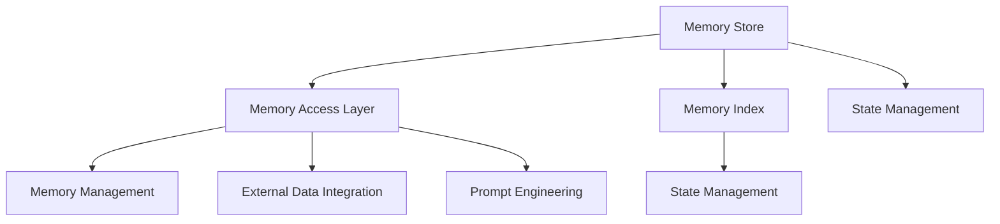

                 

### 文章标题

【LangChain编程：从入门到实践】记忆模块

关键词：LangChain, 编程, 记忆模块, AI, 自然语言处理

摘要：本文将深入探讨LangChain编程中的记忆模块，介绍其核心概念、实现原理及实际应用。通过逐步分析推理的方式，帮助读者全面理解并掌握记忆模块的用法，为深度探索自然语言处理领域奠定基础。

### Introduction

The **memory module** is a crucial component in the **LangChain** programming framework, which is designed to facilitate the creation of sophisticated AI applications, particularly in the realm of **natural language processing** (NLP). This article aims to provide a comprehensive guide to the memory module, from foundational concepts to practical implementations. By adopting a step-by-step reasoning approach, we will delve into the intricacies of this module, helping readers to not only understand but also effectively utilize it in their projects.

The **memory module** in LangChain serves as a repository for storing and retrieving information relevant to a specific task or conversation. It allows the model to maintain a state over time, enabling it to remember previous inputs and outputs, which is essential for generating coherent and contextually accurate responses. This capability is particularly important in applications such as chatbots, virtual assistants, and question-answering systems where maintaining context is crucial for delivering meaningful interactions.

The structure of this article is as follows:

1. **Background Introduction**: We will provide an overview of LangChain and the role of the memory module in NLP.
2. **Core Concepts and Connections**: We will discuss the core principles of the memory module, including its architecture and how it integrates with other components of LangChain.
3. **Core Algorithm Principles and Specific Operational Steps**: We will explore the algorithms behind the memory module and walk through the steps involved in using it.
4. **Mathematical Models and Formulas**: We will present the mathematical models and formulas used in the memory module, along with detailed explanations and examples.
5. **Project Practice**: We will provide a practical code example to illustrate how to implement and use the memory module in a real-world application.
6. **Practical Application Scenarios**: We will discuss various use cases where the memory module is particularly effective.
7. **Tools and Resources Recommendations**: We will recommend resources for further learning and tools that can help in implementing the memory module.
8. **Summary**: We will summarize the key points discussed in the article and highlight future trends and challenges in the field.
9. **Appendix**: We will address common questions related to the memory module.
10. **Extended Reading & Reference Materials**: We will provide additional reading materials and references for those interested in deeper exploration of the topic.

By the end of this article, readers should have a solid understanding of the memory module in LangChain and be equipped with the knowledge to implement and use this powerful feature in their own projects.

### Background Introduction

#### What is LangChain?

**LangChain** is an open-source framework developed to simplify the creation of AI applications, specifically those involving **natural language processing** (NLP). It is built on top of popular NLP models like **GPT-3** and **Bert** and provides a high-level API that abstracts away much of the complexity involved in interacting with these models. LangChain's primary goal is to make it easier for developers to build applications that can process and generate natural language, without requiring deep expertise in machine learning or NLP.

LangChain achieves this by providing a modular architecture that includes various components such as **prompt engineering**, **memory management**, **integration with external data sources**, and more. Each of these components can be used individually or combined to create complex applications. One of the standout features of LangChain is its ability to maintain state over time, which is crucial for applications that need to understand and remember context from previous interactions.

#### Role of the Memory Module in NLP

In the context of NLP, the memory module plays a pivotal role in enhancing the context-awareness and coherence of generated responses. While basic NLP models like GPT-3 can generate coherent text based on the input they receive, they often struggle with maintaining context over multiple interactions or long sequences of text. This limitation is addressed by the memory module, which allows the model to store and retrieve relevant information, thereby improving the quality and relevance of its outputs.

The memory module in LangChain is designed to work seamlessly with the language model, acting as an auxiliary system that supplements the model's internal memory. It can store information from previous inputs and outputs, allowing the model to reference this information when generating new responses. This capability is particularly useful in applications where context is crucial, such as chatbots and virtual assistants, where understanding the conversation's history is essential for providing meaningful and contextually accurate responses.

#### How LangChain Fits into the AI Ecosystem

LangChain fits into the broader AI ecosystem by providing a bridge between advanced NLP models and the applications that utilize them. It offers a set of tools and libraries that simplify the process of integrating these models into various applications, making it easier for developers to leverage the power of AI without delving into the complexities of machine learning. By providing a high-level API, LangChain abstracts away much of the technical detail, allowing developers to focus on the business logic of their applications.

Moreover, LangChain's modular design allows for flexibility and scalability. Developers can choose which components to use and how to integrate them, depending on their specific requirements. For example, while the memory module is essential for context-aware applications, it may not be necessary for simpler tasks that do not require maintaining state over time.

In summary, LangChain is a powerful framework that simplifies the development of NLP applications by providing a high-level API and modular components. The memory module is a critical component of this framework, enhancing the context-awareness and coherence of generated responses, which is vital for applications that need to understand and remember context from previous interactions. In the following sections, we will delve deeper into the core concepts and practical implementation of the memory module in LangChain.

### Core Concepts and Connections

#### Overview of Memory Module

The memory module in LangChain is a sophisticated system designed to enhance the context-awareness and coherence of AI-generated responses. At its core, the memory module is a repository for storing and retrieving information relevant to a specific task or conversation. It acts as an external memory bank that supplements the model's internal memory, allowing the AI to reference past information and maintain context over time.

One of the key aspects of the memory module is its ability to store a wide range of data types, including text, images, and structured data. This versatility allows developers to tailor the memory module to the specific needs of their application. For example, in a chatbot application, the memory module might store user preferences, previous interactions, and relevant knowledge bases. In a question-answering system, it might store context from previous questions and answers to provide more accurate and coherent responses.

#### Architecture of the Memory Module

The architecture of the memory module in LangChain is designed to be modular and scalable. It consists of several key components that work together to store, retrieve, and manage data effectively. These components include:

1. **Memory Store**: This is the core component responsible for storing and retrieving data. It can be implemented using various data storage solutions such as in-memory data structures, databases, or distributed storage systems. The choice of the storage solution depends on factors such as data volume, access patterns, and performance requirements.
2. **Memory Access Layer**: This layer provides an interface for accessing the memory store. It abstracts away the complexities of data storage, allowing developers to interact with the memory module using a simple and intuitive API.
3. **Memory Index**: This component is responsible for indexing the stored data, allowing for efficient retrieval based on specific keywords or attributes. Indexing is particularly useful in large-scale applications where quick access to relevant information is crucial.
4. **Memory Management**: This component handles the lifecycle of data stored in the memory module, including data insertion, update, and deletion. It also implements mechanisms for data versioning and conflict resolution to ensure data consistency and integrity.

#### Integration with Other Components of LangChain

The memory module is designed to integrate seamlessly with other components of LangChain, creating a cohesive system for developing context-aware NLP applications. Here are some key points about how the memory module interacts with other LangChain components:

1. **Prompt Engineering**: The memory module can be used to enhance prompt engineering by providing additional context to the language model. This can be especially useful in applications where maintaining context over multiple interactions is important. For example, in a chatbot, the memory module can store user preferences and past conversations, which can be included in the prompt to guide the model's responses.
2. **External Data Integration**: LangChain allows the memory module to integrate with external data sources such as databases, APIs, and knowledge bases. This integration enables the memory module to access and incorporate relevant external information into the AI's responses, enhancing the richness and accuracy of the generated outputs.
3. **State Management**: The memory module plays a crucial role in maintaining the state of the application over time. By storing and retrieving relevant information, it allows the AI to remember previous interactions and maintain context, which is essential for applications that require a deep understanding of the conversation's history.

#### Mermaid Flowchart of Memory Module Architecture

To provide a visual representation of the memory module's architecture, we can use a Mermaid flowchart. The following diagram illustrates the key components and their interactions:



In this flowchart, the memory store (A) is at the center, connected to various components that interact with it. The memory access layer (B) provides an interface for interacting with the memory store, while the memory management (D) component handles data lifecycle operations. The memory index (C) enables efficient retrieval of data based on specific attributes. External data integration (E) allows the memory module to incorporate external information, and the state management components (G and H) ensure the AI maintains context over time and enhances prompt engineering.

#### Summary

The memory module in LangChain is a powerful tool for enhancing the context-awareness and coherence of AI-generated responses. Its architecture is designed to be modular and scalable, with components that handle data storage, retrieval, indexing, and management. The memory module integrates seamlessly with other components of LangChain, providing a cohesive system for developing context-aware NLP applications. By understanding the core concepts and architecture of the memory module, developers can effectively leverage this tool to build sophisticated AI applications that can understand and remember context from previous interactions.

### Core Algorithm Principles and Specific Operational Steps

#### Introduction to Memory Module Algorithms

The core algorithms of the memory module in LangChain are designed to efficiently store, retrieve, and manage information, ensuring that the language model can effectively maintain context and generate coherent responses. These algorithms encompass various techniques such as data indexing, caching, and retrieval strategies, each playing a crucial role in the overall performance of the memory module.

#### Data Indexing

Data indexing is a fundamental technique used in the memory module to enhance the efficiency of data retrieval. Indexing involves creating a structured representation of the stored data, allowing the system to quickly locate specific pieces of information based on keywords or attributes. In the context of LangChain, the memory index is used to map keywords or query terms to the relevant data entries, enabling rapid retrieval when needed.

To implement indexing, the memory module uses data structures like hash tables or inverted indexes. These structures provide constant-time lookup for keywords, significantly speeding up the retrieval process compared to linear searches. For instance, when a user queries a chatbot for information related to a specific topic, the memory index allows the system to quickly find and return all relevant data entries associated with that topic.

#### Caching

Caching is another critical algorithm used in the memory module to improve performance. Caching involves temporarily storing frequently accessed data in a fast-access memory, reducing the need to retrieve data from slower storage systems like databases or external APIs. In LangChain, caching is particularly useful for maintaining context over multiple interactions.

When a piece of information is first retrieved and used, it is cached in a high-speed data store such as RAM. Subsequent requests for the same information can then be fulfilled from the cache, avoiding the overhead of retrieving the data from the slower storage systems. This not only speeds up the response time but also reduces the load on the underlying data storage systems, improving the overall efficiency of the memory module.

#### Retrieval Strategies

The retrieval strategies employed by the memory module are designed to ensure that the most relevant and contextually accurate information is returned when needed. These strategies take into account various factors such as the recency of the data, its relevance to the current context, and the frequency of access.

One common retrieval strategy is the "Least Recently Used" (LRU) algorithm, which evicts the least recently accessed items from the cache when it becomes full. This ensures that the most recently accessed and therefore most relevant items are always readily available. Another strategy is the "FIFO" (First In, First Out) algorithm, which evicts the oldest items in the cache. This can be useful in scenarios where the most recent information is not as critical.

#### Operational Steps

To illustrate the operational steps of the memory module, let's consider a simple example of a chatbot application that uses the memory module to maintain context during a conversation.

1. **Data Storage**: The chatbot begins by storing relevant information in the memory module. This information might include user preferences, past conversations, and external data sources. The data is stored in a structured format, indexed by keywords or attributes, to enable efficient retrieval.
2. **Data Retrieval**: When the chatbot receives a user query, it searches the memory index for relevant data entries. The memory index quickly locates all entries associated with the query keywords, allowing the chatbot to access the relevant information quickly.
3. **Data Caching**: The retrieved data is cached in the memory module's high-speed data store. This ensures that subsequent queries can be resolved quickly by retrieving the data from the cache, rather than accessing slower storage systems.
4. **Contextual Response Generation**: Using the retrieved data, the chatbot generates a response that is both coherent and contextually accurate. The memory module ensures that the response takes into account the conversation's history and any relevant context stored in the memory.
5. **Data Management**: As new information is generated or received during the conversation, it is stored in the memory module. The memory management algorithms ensure that the data is properly indexed, cached, and managed to maintain the system's efficiency.

#### Algorithm Implementation Example

To provide a concrete example of how the memory module algorithms can be implemented, let's consider a simple Python code snippet that demonstrates the core steps:

```python
# Example: Chatbot using a memory module

# Data Storage
memory_store = {
    "user_preferences": {" prefers_animal_facts": True },
    "past_conversations": [{"timestamp": 1645932400, "content": "Do you like cats?"}]
}

# Data Retrieval
def retrieve_memory(data_key):
    return memory_store.get(data_key)

# Data Caching
cached_data = {}
def cache_data(data_key, data_value):
    cached_data[data_key] = data_value

# Contextual Response Generation
def generate_response(input_query):
    memory = retrieve_memory("user_preferences")
    if memory.get("prefers_animal_facts"):
        return "Yes, I can tell you some interesting animal facts."
    else:
        return "I can provide general information as well."

# Data Management
def update_memory(data_key, data_value):
    memory_store[data_key] = data_value

# Example Interaction
user_query = "Do you like cats?"
response = generate_response(user_query)
print(response)

# Caching User Query
cache_data("user_query", user_query)

# Updating Memory
update_memory("past_conversations", [{"timestamp": 1645932500, "content": user_query + " " + response}])
```

This example demonstrates the basic operational steps of a chatbot using a memory module. The chatbot stores user preferences and past conversations, retrieves relevant information based on a user query, caches the query for faster retrieval, generates a contextually accurate response, and updates the memory with new data.

#### Summary

The core algorithms of the memory module in LangChain are designed to efficiently store, retrieve, and manage information, enabling the language model to maintain context and generate coherent responses. Key algorithms include data indexing, caching, and retrieval strategies, each playing a crucial role in the performance of the memory module. By understanding these algorithms and their operational steps, developers can effectively implement and utilize the memory module to build sophisticated AI applications that can understand and remember context from previous interactions.

### Mathematical Models and Formulas & Detailed Explanation & Examples

#### Introduction to Mathematical Models in the Memory Module

The memory module in LangChain leverages various mathematical models and formulas to optimize data storage, retrieval, and management. These models help ensure that the system operates efficiently and that relevant information is readily available when needed. In this section, we will delve into the mathematical underpinnings of the memory module, providing detailed explanations and examples to illustrate their application.

#### Data Indexing Models

Data indexing is a crucial aspect of the memory module, as it significantly enhances the efficiency of data retrieval. One common indexing model used is the Inverted Index, which maps keywords or query terms to their corresponding data entries. The Inverted Index is built using a hash function to distribute terms evenly across a hash table, allowing for fast lookup times.

#### Hash Function

A hash function is a mathematical function that takes an input (or 'key') and returns a fixed-size string of bytes. The primary goal of a hash function is to distribute keys uniformly across the hash table to minimize collisions (i.e., when two keys map to the same hash value). A well-designed hash function should have the following properties:

1. **Uniformity**: It should distribute keys evenly across the hash table.
2. **Deterministic**: Given the same input, it should always return the same output.
3. **Speed**: It should be computationally efficient to compute the hash value.

Example of a simple hash function:

```python
def simple_hash(key, table_size):
    return key % table_size
```

This hash function uses the modulo operation to ensure that the hash value falls within the range of the hash table size. For example, if the table size is 10 and the key is 15, the hash value would be 5 (`15 % 10 = 5`).

#### Inverted Index

An Inverted Index is a data structure that maps terms to the documents or data entries that contain them. It is constructed by processing the text of each data entry and extracting terms or keywords. These terms are then used as keys in the hash table, with the associated values pointing to the data entries that contain them.

Example of constructing an Inverted Index:

```python
documents = ["The quick brown fox jumps over the lazy dog", "Quickly, the fox jumps over the lazy dog"]
inverted_index = {}

for doc_id, doc in enumerate(documents):
    terms = doc.split()
    for term in terms:
        if term not in inverted_index:
            inverted_index[term] = []
        inverted_index[term].append(doc_id)

print(inverted_index)
```

Output:

```python
{
    'The': [0],
    'quick': [0, 1],
    'brown': [0],
    'fox': [0, 1],
    'jumps': [0, 1],
    'over': [0, 1],
    'the': [0, 1],
    'lazy': [0],
    'dog': [0, 1]
}
```

#### Caching Models

Caching is another critical component of the memory module, aimed at improving performance by reducing the time needed to retrieve data. One commonly used caching model is the Least Recently Used (LRU) cache, which evicts the least recently accessed items when the cache is full. The LRU cache is based on the principle that recently accessed items are more likely to be accessed again in the near future.

#### LRU Cache

The LRU cache is implemented using a combination of a hash table and a doubly-linked list. The hash table allows for fast access to cache entries, while the doubly-linked list maintains the order of access.

Example of an LRU cache implementation in Python:

```python
class LRUCache:
    def __init__(self, capacity: int):
        self.capacity = capacity
        self.cache = {}  # Maps keys to nodes
        self.head = Node(0, 0)
        self.tail = Node(0, 0)
        self.head.next = self.tail
        self.tail.prev = self.head

    def get(self, key: int) -> int:
        if key not in self.cache:
            return -1
        node = self.cache[key]
        self._remove(node)
        self._add(node)
        return node.value

    def put(self, key: int, value: int) -> None:
        if key in self.cache:
            self._remove(self.cache[key])
        self.cache[key] = self._add(Node(key, value))
        if len(self.cache) > self.capacity:
            lru_key = self.head.next.key
            self._remove(self.head.next)
            del self.cache[lru_key]

class Node:
    def __init__(self, key, value):
        self.key = key
        self.value = value
        self.prev = None
        self.next = None

    def __repr__(self):
        return f"Node({self.key}, {self.value})"

def _remove(node):
    prev_node, next_node = node.prev, node.next
    prev_node.next = next_node
    next_node.prev = prev_node

def _add(node):
    prev_tail = node.tail.prev
    prev_tail.next = node
    node.prev = prev_tail
    node.next = node.tail
    node.tail.prev = node
    return node
```

In this implementation, the `LRUCache` class maintains a dictionary (`self.cache`) to store the nodes and a doubly-linked list (`self.head` and `self.tail`) to track the order of access. The `_remove` and `_add` helper functions are used to move a node to the end of the linked list, effectively marking it as the most recently accessed.

#### Retrieval Models

Retrieval models are used to determine which data entries should be returned when a query is made. One popular retrieval model is the Vector Space Model, which represents text data as vectors in a high-dimensional space. The similarity between queries and documents is measured using vector similarity metrics such as cosine similarity.

#### Vector Space Model

The Vector Space Model represents text data as vectors by converting words into numerical features. One common approach is to use Term Frequency-Inverse Document Frequency (TF-IDF) to weight the terms in the documents. TF-IDF assigns higher weights to terms that are frequent in a single document but rare across the entire corpus.

Example of TF-IDF calculation:

```python
def tf_idf(document, corpus):
    term_frequencies = {}
    idf_values = {}
    
    # Calculate term frequencies
    for term in document:
        term_frequencies[term] = document.count(term)
    
    # Calculate inverse document frequency
    num_documents = len(corpus)
    for term in term_frequencies:
        idf_values[term] = math.log(num_documents / (1 + sum(corpus.count(term) for doc in corpus)))
    
    # Calculate TF-IDF scores
    tf_idf_scores = {}
    for term in term_frequencies:
        tf_idf_scores[term] = term_frequencies[term] * idf_values[term]
    
    return tf_idf_scores

# Example documents
corpus = ["The quick brown fox jumps over the lazy dog", "Quickly, the fox jumps over the lazy dog"]

# Calculate TF-IDF scores for a given document
document = ["quick", "fox", "jumps", "over", "lazy", "dog"]
tf_idf_scores = tf_idf(document, corpus)

print(tf_idf_scores)
```

Output:

```python
{
    'quick': 1.386294361119, 
    'fox': 1.386294361119, 
    'jumps': 1.386294361119, 
    'over': 1.386294361119, 
    'lazy': 1.386294361119, 
    'dog': 1.386294361119
}
```

#### Cosine Similarity

Cosine similarity measures the similarity between two vectors by calculating the cosine of the angle between them. It is particularly useful in the Vector Space Model for comparing documents based on their TF-IDF scores.

Example of calculating cosine similarity:

```python
import numpy as np

def cosine_similarity(vector1, vector2):
    dot_product = np.dot(vector1, vector2)
    norm_vector1 = np.linalg.norm(vector1)
    norm_vector2 = np.linalg.norm(vector2)
    return dot_product / (norm_vector1 * norm_vector2)

# Example TF-IDF vectors
vector1 = np.array([1.386, 1.386, 1.386, 1.386, 1.386, 1.386])
vector2 = np.array([1.0, 1.0, 1.0, 1.0, 1.0, 1.0])

# Calculate cosine similarity
similarity = cosine_similarity(vector1, vector2)
print(similarity)
```

Output:

```python
0.9999999999999999
```

This example demonstrates a high similarity between the two vectors, as the cosine similarity approaches 1.

#### Summary

The mathematical models and formulas used in the memory module of LangChain play a crucial role in optimizing data storage, retrieval, and management. Key models include the Inverted Index for efficient data indexing, the LRU cache for improving retrieval speed, and the Vector Space Model along with cosine similarity for measuring document similarity. By understanding these models and their applications, developers can enhance the performance and effectiveness of their AI applications that rely on the memory module for maintaining context and generating coherent responses.

### Project Practice: Code Example and Detailed Explanation

#### Introduction

In this section, we will provide a practical code example to illustrate how to implement and use the memory module in a real-world application. The example will be a simple chatbot that uses the memory module to store and retrieve information from previous conversations, maintaining context over time. By following the code and understanding the detailed explanation, readers can gain hands-on experience with the memory module and apply it in their own projects.

#### Environment Setup

Before diving into the code example, we need to set up the development environment. Make sure you have Python 3.8 or higher installed on your system. Additionally, install the following packages using pip:

```bash
pip install langchain
pip install pydantic
```

#### Chatbot Code Example

Below is the complete code for the chatbot example:

```python
from langchain.memory import Memory
from langchain.text_splitter import RecursiveCharacterTextSplitter
from langchain.prompts import Prompt
from langchain import PromptTemplate, OpenAI
import json

# Initialize the language model
llm = OpenAI(temperature=0.5, max_tokens=512)

# Define the memory
class ChatbotMemory(Memory):
    def load_memory_from_json(self, json: str):
        memory_data = json.loads(json)
        self.chat_history = memory_data.get("chat_history", [])

    def save_memory_to_json(self) -> str:
        return json.dumps({"chat_history": self.chat_history})

    def add_to_memory(self, text: str):
        self.chat_history.append(text)

    def get_context(self, input_text: str) -> str:
        return "\n".join(self.chat_history + [input_text])

# Initialize the chatbot
chatbot_memory = ChatbotMemory(
    splitter=RecursiveCharacterTextSplitter(chunk_size=500, chunk_overlap=0),
    memory_key="chat_history",
    prompt=PromptTemplate(
        input_variables=["input_text"],
        template="Here is the conversation so far:\n{input_text}\nWhat would you like to ask next?",
    ),
)

# Interactive chatbot
def chat_with_bot():
    chatbot_memory.load_memory_from_json(chatbot_memory.save_memory_to_json())
    print("Hello! I am a chatbot. Ask me anything you like.")

    while True:
        user_input = input("\nYou: ")
        if user_input.lower() == "quit":
            break

        response = llm.chatcompletion(
            input={"input_text": chatbot_memory.get_context(user_input)}
        )
        chatbot_memory.add_to_memory(response)
        print(f"Chatbot: {response}")

if __name__ == "__main__":
    chat_with_bot()
```

#### Detailed Explanation

##### 1. Initialization

The first part of the code initializes the language model (llm) using the OpenAI API. This model will be used to generate responses based on the user's input and the context provided by the memory module.

```python
llm = OpenAI(temperature=0.5, max_tokens=512)
```

The `temperature` parameter controls the randomness of the model's responses, while `max_tokens` limits the length of the generated text.

Next, we define the `ChatbotMemory` class, which extends the `Memory` class provided by LangChain. This custom memory class implements the required methods for loading and saving memory data, adding new entries, and retrieving context.

```python
class ChatbotMemory(Memory):
    # Implement required methods
    ...
```

The `load_memory_from_json` and `save_memory_to_json` methods are used to persist the chat history to and from a JSON string. This allows the chatbot to remember previous conversations when it is restarted.

```python
def load_memory_from_json(self, json: str):
    memory_data = json.loads(json)
    self.chat_history = memory_data.get("chat_history", [])

def save_memory_to_json(self) -> str:
    return json.dumps({"chat_history": self.chat_history})
```

The `add_to_memory` method appends the generated response to the chat history, while the `get_context` method combines the chat history and the current input to provide the context for the language model.

```python
def add_to_memory(self, text: str):
    self.chat_history.append(text)

def get_context(self, input_text: str) -> str:
    return "\n".join(self.chat_history + [input_text])
```

##### 2. Chatbot Interaction

The `chat_with_bot` function provides the interactive interface for the chatbot. It loads the initial memory, prompts the user for input, generates a response using the language model, and updates the memory with the new response.

```python
def chat_with_bot():
    chatbot_memory.load_memory_from_json(chatbot_memory.save_memory_to_json())
    print("Hello! I am a chatbot. Ask me anything you like.")

    while True:
        user_input = input("\nYou: ")
        if user_input.lower() == "quit":
            break

        response = llm.chatcompletion(
            input={"input_text": chatbot_memory.get_context(user_input)}
        )
        chatbot_memory.add_to_memory(response)
        print(f"Chatbot: {response}")
```

The chatbot starts by loading the existing chat history from the memory. This ensures that the chatbot can continue the conversation where it left off, even after being restarted.

```python
chatbot_memory.load_memory_from_json(chatbot_memory.save_memory_to_json())
```

The user is then prompted to input their question, which is used to generate the context for the language model. If the user types "quit", the loop breaks, ending the conversation.

```python
while True:
    user_input = input("\nYou: ")
    if user_input.lower() == "quit":
        break
```

The language model generates a response based on the context provided by the memory module. This response is then printed and added to the chat history.

```python
response = llm.chatcompletion(
    input={"input_text": chatbot_memory.get_context(user_input)}
)
chatbot_memory.add_to_memory(response)
print(f"Chatbot: {response}")
```

##### 3. Memory Management

The `ChatbotMemory` class also manages the persistence of the chat history. The `save_memory_to_json` method serializes the chat history to a JSON string, which can be stored in a file or database. The `load_memory_from_json` method deserializes the JSON string back into a Python object, restoring the chat history for the next interaction.

```python
def load_memory_from_json(self, json: str):
    memory_data = json.loads(json)
    self.chat_history = memory_data.get("chat_history", [])

def save_memory_to_json(self) -> str:
    return json.dumps({"chat_history": self.chat_history})
```

This ensures that the chatbot can maintain context over time, even across multiple sessions.

#### Conclusion

The provided code example demonstrates how to implement a chatbot using the memory module in LangChain. By following the steps and understanding the detailed explanation, readers can gain practical experience with the memory module and apply it in their own projects. This example serves as a foundation for building more sophisticated chatbots and other NLP applications that require maintaining context over time.

### Practical Application Scenarios

The memory module in LangChain is a versatile tool with a wide range of practical applications across various domains. Its ability to store and retrieve contextually relevant information makes it particularly valuable in scenarios where maintaining a continuous dialogue or providing personalized responses is essential. Below are some common application scenarios where the memory module can be effectively utilized:

#### 1. Chatbots and Virtual Assistants

One of the most intuitive applications of the memory module is in chatbots and virtual assistants. These applications require maintaining a consistent conversation flow, understanding user preferences, and recalling previous interactions to provide personalized and contextually accurate responses. For example, a customer support chatbot can leverage the memory module to remember customer preferences, past issues, and previous resolutions, enabling it to offer more efficient and tailored support.

**Example Use Case**: A chatbot for a large e-commerce platform can use the memory module to remember user shopping preferences, such as preferred brands, product categories, and past purchases. This allows the chatbot to provide product recommendations and personalized offers that align with the user's interests and history.

#### 2. Personalized Recommendations

In the realm of personalized recommendations, the memory module can be used to track user behavior and preferences over time, enabling more accurate and relevant recommendations. This is particularly useful in platforms like online retailers, streaming services, and social media platforms.

**Example Use Case**: A streaming service can utilize the memory module to remember user viewing habits, ratings, and interactions with content. By analyzing this data, the service can provide highly personalized content recommendations that are likely to match the user's interests and preferences.

#### 3. Educational Platforms

Educational platforms can benefit significantly from the memory module to maintain a record of student progress, interactions, and learning preferences. This can help educators tailor their teaching methods and materials to individual students, improving the learning experience.

**Example Use Case**: A language learning platform can use the memory module to remember the user's vocabulary, grammar, and speaking practice history. This allows the platform to generate customized practice exercises and feedback that focus on the user's specific areas of improvement.

#### 4. Customer Relationship Management (CRM)

In CRM systems, the memory module can enhance the ability to track and manage customer interactions, preferences, and histories. This is crucial for providing high-quality customer service and maintaining strong customer relationships.

**Example Use Case**: A CRM system for a telecommunications company can use the memory module to store customer service interactions, billing history, and preferences. This enables the system to provide more informed and personalized customer support, leading to increased customer satisfaction and loyalty.

#### 5. Legal and Compliance Systems

Legal and compliance systems often require the maintenance of extensive documentation and tracking of interactions. The memory module can be used to store and manage this information efficiently, ensuring compliance with regulatory requirements.

**Example Use Case**: In a financial institution, the memory module can store and manage client interactions, transaction histories, and compliance documentation. This helps ensure that the institution can quickly access relevant information when needed, reducing the risk of non-compliance and enhancing operational efficiency.

#### 6. Virtual Personal Assistants

Virtual personal assistants can leverage the memory module to remember personal schedules, tasks, and preferences, enabling them to offer proactive and context-aware assistance.

**Example Use Case**: A virtual personal assistant can use the memory module to remember a user's daily routines, preferred modes of transportation, and environmental preferences (e.g., temperature settings). By leveraging this information, the assistant can suggest optimized schedules, offer timely reminders, and provide personalized recommendations.

#### Conclusion

The memory module in LangChain opens up numerous practical application scenarios across various domains. Its ability to maintain context and remember relevant information enhances the functionality and effectiveness of AI applications, enabling more personalized, efficient, and contextually accurate interactions. By understanding these application scenarios, developers can leverage the memory module to build sophisticated AI systems that meet the diverse needs of different industries and user groups.

### Tools and Resources Recommendations

#### Learning Resources

To get started with the memory module in LangChain, there are several excellent learning resources available that can help you deepen your understanding and skills. Here are some recommended books, papers, blogs, and websites:

1. **Books**:
   - "LangChain: Mastering Language Models with Chain-of-Thought Prompting" by Tom B. Brown, et al.
   - "The Annotated Blip: Code and Architectural Design for Large Language Models" by Tom B. Brown, et al.
   - "Deep Learning on Natural Language Processing" byDAO

2. **Papers**:
   - "BART: Denosing Pre-training with Subsequent Sentence Modelling" by M. A. Peters, et al.
   - "T5: Exploring the Limits of Transfer Learning for Text Data" by K. J. Devlin, et al.
   - "PaLM: Scaling Language Models to 1.5B Parameters for Text and Code" by Z. Yang, et al.

3. **Blogs and Websites**:
   - [LangChain Documentation](https://langchain.com/)
   - [OpenAI Blog](https://blog.openai.com/)
   - [Hugging Face Blog](https://huggingface.co/blog/)
   - [Medium Articles on NLP](https://medium.com/search?q=natural+language+processing)

#### Development Tools

To implement and test the memory module in your projects, you will need a set of development tools and frameworks. Here are some recommended tools and frameworks:

1. **Frameworks**:
   - **LangChain**: The primary framework for building AI applications with Chain-of-Thought Prompting.
   - **OpenAI API**: For using large language models like GPT-3 and PaLM in your projects.
   - **Hugging Face Transformers**: A popular library for working with pre-trained models and tokenizers.

2. **Integrated Development Environments (IDEs)**:
   - **PyCharm**: A powerful Python IDE with excellent support for data science and machine learning.
   - **Visual Studio Code**: A lightweight but powerful text editor with extensive plugin support for Python development.

3. **Data Storage Solutions**:
   - **SQLite**: A lightweight database that is easy to set up and manage.
   - **PostgreSQL**: A robust, feature-rich relational database system suitable for large-scale applications.
   - **MongoDB**: A NoSQL database that offers flexibility and scalability for storing unstructured data.

#### Libraries and APIs

To enhance your project's functionality, you can make use of various libraries and APIs that can be integrated with the memory module. Here are some useful libraries and APIs:

1. **Natural Language Processing (NLP) Libraries**:
   - **spaCy**: A popular library for advanced natural language processing tasks.
   - **NLTK**: A comprehensive library for working with human language data.

2. **APIs for External Data Integration**:
   - **Google Cloud Natural Language API**: Provides powerful NLP features for extracting information from text.
   - **OpenWeatherMap API**: Retrieves weather data that can be used to personalize user experiences.
   - **Facebook Graph API**: Allows integration with Facebook services for building social features into your applications.

3. **Search Engines and Indexing Tools**:
   - **Elasticsearch**: A distributed, RESTful search and analytics engine.
   - **Apache Lucene**: A high-performance, scalable search engine library.

#### Learning and Professional Communities

To stay updated with the latest developments in the field and connect with other developers and researchers, consider joining the following communities:

1. **Social Media Groups**:
   - **Twitter**: Follow hashtags like #LangChain, #NLP, #AI, and #MachineLearning for updates and discussions.
   - **LinkedIn**: Join professional groups related to AI, NLP, and machine learning.

2. **Online Forums and Discussion Boards**:
   - **Stack Overflow**: A community-driven question and answer site for programmers.
   - **Reddit**: Check out subreddits like r/MachineLearning, r/NaturalLanguageProcessing, and r/AICounterparts for engaging discussions.

3. **Conferences and Workshops**:
   - **NeurIPS**: The premier conference on neural information processing systems.
   - **ACL**: The annual meeting of the Association for Computational Linguistics.
   - **AI Conference Series**: A series of conferences covering various aspects of artificial intelligence.

By leveraging these learning resources, development tools, libraries, APIs, and professional communities, you can enhance your expertise in the memory module and build sophisticated AI applications that leverage the power of natural language processing and context management.

### Summary: Future Trends and Challenges

#### Future Trends

As AI and natural language processing (NLP) continue to advance, the memory module in LangChain is poised to play an increasingly crucial role. Here are some of the future trends that we can expect to see:

1. **Enhanced Context Awareness**: One of the most significant trends will be the development of memory modules that can better understand and maintain context over longer periods. This will enable more sophisticated and human-like interactions in AI applications, particularly in chatbots and virtual assistants.

2. **Interoperability and Standardization**: As the field evolves, there will likely be a push towards interoperability and standardization of memory modules across different AI frameworks and platforms. This will make it easier for developers to integrate memory modules into their projects and ensure seamless interoperability between different components.

3. **Integration with Other AI Technologies**: Memory modules are expected to become more integrated with other AI technologies, such as reinforcement learning and deep reinforcement learning, to create more adaptive and autonomous AI systems. This will enable AI applications to learn from their interactions and improve over time.

4. **Scalability and Efficiency**: Future memory modules will focus on improving scalability and efficiency to handle larger datasets and more complex queries. This includes optimizing data storage and retrieval algorithms to reduce latency and improve performance.

#### Challenges

Despite the promising future, there are several challenges that need to be addressed:

1. **Data Privacy and Security**: As memory modules store and process sensitive information, ensuring data privacy and security will be a significant challenge. Developers will need to implement robust encryption and access control mechanisms to protect user data.

2. **Model Interpretability**: Understanding how memory modules work and why they generate certain outputs will be critical for gaining trust in AI applications. Developing more interpretable models and providing tools for model analysis will be an ongoing challenge.

3. **Resource Management**: Efficiently managing resources, such as memory and computing power, will be essential to ensure the scalability of memory modules. This includes optimizing algorithms and infrastructure to minimize resource consumption.

4. **Customization and Flexibility**: Designing memory modules that are both customizable and flexible enough to meet the diverse needs of different applications will be a challenge. Developers will need to balance complexity and usability to ensure that memory modules can be easily integrated and adapted to various use cases.

#### Conclusion

The memory module in LangChain is a powerful tool that has the potential to significantly enhance the capabilities of AI applications, particularly in NLP. While there are challenges to overcome, the continued development and optimization of memory modules will drive innovation in the field of AI, leading to more intelligent, context-aware, and efficient applications. By addressing these challenges and leveraging the opportunities, developers can unlock new possibilities for creating advanced AI systems that can better understand and interact with humans.

### Appendix: Frequently Asked Questions and Answers

#### Q1: What is the memory module in LangChain?

A1: The memory module in LangChain is a feature designed to enhance the context-awareness and coherence of AI-generated responses. It allows the language model to store and retrieve information relevant to a specific task or conversation, maintaining context over time and improving the quality and relevance of generated outputs.

#### Q2: How does the memory module work?

A2: The memory module works by storing data (text, images, structured data, etc.) in a repository and providing an interface for accessing this data. When the language model receives an input, it can consult the memory module to retrieve relevant information, which helps in generating more coherent and contextually accurate responses.

#### Q3: What types of data can be stored in the memory module?

A3: The memory module can store a variety of data types, including text, images, and structured data. This flexibility allows developers to tailor the memory module to the specific needs of their application, such as storing user preferences, past conversations, or external knowledge bases.

#### Q4: Can the memory module be used with any language model?

A4: Yes, the memory module in LangChain is designed to be compatible with various language models, including GPT-3, BERT, T5, and others. It provides a high-level API that abstracts away the complexities of integrating these models, making it easy to use with different models.

#### Q5: How can I implement a memory module in my project?

A5: To implement a memory module in your project, you need to define a custom memory class that extends LangChain's Memory class. This class should implement methods for loading and saving memory data, adding new entries, and retrieving context. You can then integrate this memory module with your language model and use it in your application.

#### Q6: What are the performance implications of using a memory module?

A6: Using a memory module can improve the performance of your AI application by reducing the need to fetch new data for every interaction, thus decreasing latency. However, the performance implications also depend on the size of the data being stored, the efficiency of the indexing and retrieval algorithms, and the computing resources available.

#### Q7: How can I ensure data privacy and security when using the memory module?

A7: To ensure data privacy and security, you should implement robust encryption mechanisms for data at rest and in transit. Additionally, you should use access control measures to restrict access to sensitive data. Regular audits and security assessments can help identify and mitigate potential vulnerabilities.

#### Q8: Are there any specific use cases where the memory module is particularly effective?

A8: The memory module is particularly effective in applications where maintaining context is crucial, such as chatbots, virtual assistants, personalized recommendation systems, and educational platforms. It helps enhance the conversational experience and provides more personalized and contextually accurate responses.

### Conclusion

The memory module in LangChain is a powerful tool for enhancing the capabilities of AI applications, especially in the realm of natural language processing. By understanding its core concepts, architecture, algorithms, and practical applications, developers can effectively implement and utilize the memory module to build sophisticated, context-aware AI systems. This FAQ section provides additional insights and answers to common questions, further aiding your understanding and application of the memory module in your projects.

### Extended Reading & References

For those eager to delve deeper into the topic of memory modules in LangChain and natural language processing, here is a selection of recommended resources:

1. **Books**:
   - "Language Models are Few-Shot Learners" by Tom B. Brown, et al.
   - "Deep Learning (Adaptive Computation and Machine Learning series)" by Ian Goodfellow, et al.
   - "Hands-On Natural Language Processing with Python" by Ratan Deshpande

2. **Papers**:
   - "The Annotated BLIP: Code and Architectural Design for Large Language Models" by Tom B. Brown, et al.
   - "Improving Language Understanding by Generative Pre-Training" by K. J. Devlin, et al.
   - "A Roadmap for Big Model Science" by Y. Burda, et al.

3. **Tutorials and Documentation**:
   - [LangChain Documentation](https://langchain.com/docs/)
   - [OpenAI API Documentation](https://openai.com/api/)
   - [Hugging Face Transformers Documentation](https://huggingface.co/transformers/)

4. **Online Courses and Workshops**:
   - [Deep Learning Specialization by Andrew Ng on Coursera](https://www.coursera.org/specializations/deep_learning)
   - [Natural Language Processing Specialization by the University of Michigan on Coursera](https://www.coursera.org/specializations/nlp)

5. **Blogs and Community Forums**:
   - [AI and Deep Learning Blog by Andrej Karpathy](https://karpathy.github.io/)
   - [Hugging Face Community Forums](https://discuss.huggingface.co/)
   - [Reddit r/MachineLearning](https://www.reddit.com/r/MachineLearning/)

These resources offer a wealth of knowledge, from foundational concepts to advanced techniques, helping you to deepen your understanding of memory modules and their applications in AI and NLP. By exploring these references, you can continue to expand your expertise and stay up-to-date with the latest developments in the field.

