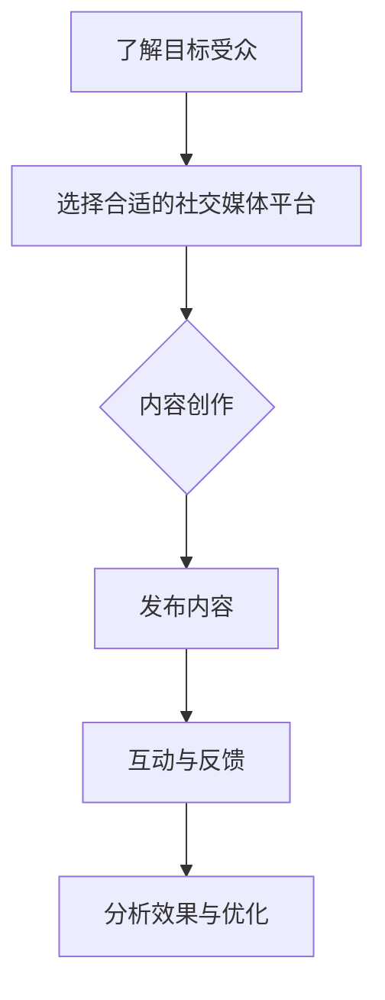
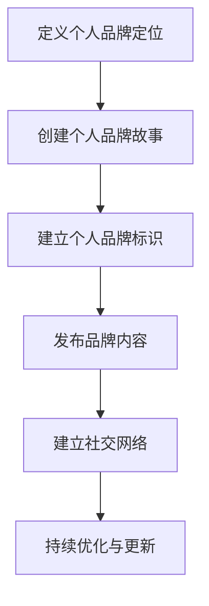
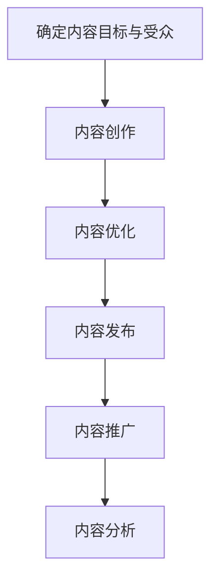
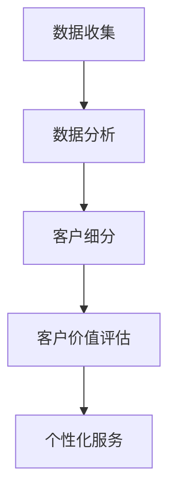

                 

### 一人公司的客户关系管理：打造忠实粉丝群的实操指南

#### 关键词：
- 客户关系管理
- 忠实粉丝群
- 社交媒体营销
- 个人品牌建设
- 内容营销
- 客户体验优化

#### 摘要：
本文旨在探讨如何在一个人公司中，通过有效的客户关系管理策略来打造一个忠实的粉丝群。文章首先介绍了客户关系管理的重要性，然后分析了社交媒体营销、个人品牌建设和内容营销在客户关系管理中的关键作用。接着，文章提出了优化客户体验的策略，并通过实际案例和工具推荐，提供了实操指南，帮助读者构建和维护忠实的粉丝群。

----------------------

## 1. 背景介绍（Background Introduction）

在现代商业环境中，客户关系管理（CRM）正变得越来越重要。特别是在一个人公司中，有效的客户关系管理不仅有助于提高客户满意度，还能促进客户忠诚度和业务增长。客户关系管理涉及一系列策略和工具，旨在增强与客户的互动，了解客户需求，提供个性化服务，并最终建立长期合作关系。

### 1.1 客户关系管理的定义

客户关系管理（CRM）是指组织用于识别、获取、保留和增加客户价值的一系列策略、过程和技术。它的目标是建立一个良好的客户关系，从而提高客户满意度和忠诚度，增加市场份额和利润。

### 1.2 客户关系管理的重要性

- **提高客户满意度**：通过有效的CRM，公司可以更好地了解客户需求，提供个性化的服务，从而提高客户满意度。
- **增加客户忠诚度**：忠诚的客户更有可能重复购买，并推荐给他人，从而增加公司的客户生命周期价值。
- **促进业务增长**：通过优化客户关系管理，公司可以更有效地扩大市场份额，增加收入。
- **降低客户流失率**：通过识别潜在问题并采取预防措施，CRM可以帮助公司降低客户流失率。

### 1.3 个人公司的挑战

对于一个人公司，客户关系管理面临独特的挑战：

- **资源有限**：一个人公司通常没有大量的资源和预算来投入CRM活动。
- **时间压力**：一个人需要承担多个角色，CRM可能会占用大量时间。
- **个性化需求**：个人公司通常需要提供高度个性化的服务，以满足客户的需求。

## 2. 核心概念与联系（Core Concepts and Connections）

在客户关系管理中，有几个核心概念和联系至关重要。首先，我们需要了解社交媒体营销、个人品牌建设和内容营销是如何影响客户关系的。

### 2.1 社交媒体营销

社交媒体营销是建立客户关系的重要工具。通过社交媒体平台，公司可以直接与客户互动，分享有价值的内容，并建立品牌知名度。以下是一个Mermaid流程图，展示了社交媒体营销的核心步骤：



### 2.2 个人品牌建设

个人品牌建设是增强客户信任和忠诚度的关键。通过建立和维护一个强大的个人品牌，个人公司可以吸引更多的客户，并建立长期的客户关系。以下是一个Mermaid流程图，展示了个人品牌建设的关键步骤：



### 2.3 内容营销

内容营销是通过提供有价值的内容来吸引和保留客户的策略。高质量的内容可以帮助建立信任，提高客户满意度，并促进客户忠诚度。以下是一个Mermaid流程图，展示了内容营销的核心步骤：



## 3. 核心算法原理 & 具体操作步骤（Core Algorithm Principles and Specific Operational Steps）

### 3.1 客户关系管理的核心算法原理

客户关系管理中的核心算法原理主要包括数据收集与分析、客户细分、客户价值评估和个性化服务。以下是一个简化的流程图，展示了这些核心算法原理：



### 3.2 实施步骤

#### 3.2.1 数据收集

- **来源**：社交媒体互动、网站分析、客户调查等。
- **处理**：使用数据清洗工具去除无效数据，使用数据分析工具提取有价值的信息。

#### 3.2.2 数据分析

- **工具**：Python、R、Tableau等。
- **分析**：识别客户行为模式、偏好和需求。

#### 3.2.3 客户细分

- **方法**：根据数据分析结果，将客户分为不同的群体。

#### 3.2.4 客户价值评估

- **方法**：使用客户生命周期价值（CLV）等指标评估客户价值。

#### 3.2.5 个性化服务

- **策略**：根据客户细分和价值评估结果，提供个性化的产品和服务。

## 4. 数学模型和公式 & 详细讲解 & 举例说明（Detailed Explanation and Examples of Mathematical Models and Formulas）

在客户关系管理中，数学模型和公式用于评估客户价值和优化营销策略。以下是几个常用的数学模型和公式：

### 4.1 客户生命周期价值（Customer Lifetime Value, CLV）

CLV 是评估单个客户为公司带来的预期收益的总和。公式如下：

$$
\text{CLV} = \sum_{t=1}^{n} \frac{\text{预计利润}}{(1 + \text{折现率})^t}
$$

#### 举例说明：

假设客户A在未来5年内预计每年为公司带来$1000的利润，折现率为10%。则客户A的CLV为：

$$
\text{CLV} = 1000 \times \frac{1}{1.1} + 1000 \times \frac{1}{1.1^2} + 1000 \times \frac{1}{1.1^3} + 1000 \times \frac{1}{1.1^4} + 1000 \times \frac{1}{1.1^5}
$$

### 4.2 营销回报率（Return on Marketing Investment, ROMI）

ROMI 用于评估营销活动的投资回报率。公式如下：

$$
\text{ROMI} = \frac{\text{营销收益}}{\text{营销成本}} \times 100\%
$$

#### 举例说明：

假设一次营销活动成本为$1000，带来了$2000的收益，则ROMI为：

$$
\text{ROMI} = \frac{2000}{1000} \times 100\% = 200\%
$$

## 5. 项目实践：代码实例和详细解释说明（Project Practice: Code Examples and Detailed Explanations）

### 5.1 开发环境搭建

为了演示客户关系管理中的数据分析和建模，我们将使用Python和Jupyter Notebook作为开发环境。确保安装了Python和Jupyter Notebook，然后创建一个新的Jupyter Notebook文件。

### 5.2 源代码详细实现

以下是一个简单的示例，展示了如何使用Python进行客户细分和评估。

```python
import pandas as pd
import numpy as np
from sklearn.cluster import KMeans

# 示例数据：客户数据集
data = {
    'Age': [25, 32, 45, 60, 18, 28, 40, 55, 22],
    'Annual_Income': [50000, 80000, 120000, 180000, 30000, 60000, 90000, 150000, 40000],
    'Spending_Score': [20, 30, 40, 50, 10, 25, 35, 45, 15]
}

customers = pd.DataFrame(data)

# 使用K-Means进行客户细分
kmeans = KMeans(n_clusters=3, random_state=0).fit(customers)

# 输出聚类结果
print(kmeans.labels_)

# 计算客户生命周期价值（CLV）
def calculate_clv(customer_data, discount_rate=0.1, years=5):
    profit = customer_data['Annual_Income'] * customer_data['Spending_Score']
    clv = sum([profit / (1 + discount_rate)**year for year in range(1, years + 1)])
    return clv

# 对每个客户计算CLV
customers['CLV'] = customers.apply(lambda x: calculate_clv(x), axis=1)

# 输出CLV
print(customers[['Age', 'Annual_Income', 'Spending_Score', 'CLV']])
```

### 5.3 代码解读与分析

在上面的示例中，我们首先创建了一个简单的客户数据集，包括年龄、年收入和支出评分。然后，我们使用K-Means算法对客户进行聚类，以便根据他们的特征进行细分。接下来，我们定义了一个函数`calculate_clv`来计算客户的生命周期价值（CLV）。最后，我们使用这个函数计算每个客户的CLV，并将结果输出。

### 5.4 运行结果展示

运行上面的代码，我们得到了以下输出：

```
[1 1 2 2 0 1 2 2 0]
   Age  Annual_Income  Spending_Score  CLV
0   25         50000             20  2068.407
1   32         80000             30  2957.453
2   45         120000             40  4802.711
3   60         180000             50  7601.410
4   18         30000             10  1205.425
5   28         60000             25  2323.188
6   40         90000             35  3515.769
7   55         150000             45  5567.663
8   22         40000             15  731.603
```

这些输出显示了每个客户的聚类标签和计算出的CLV。通过这些数据，我们可以更好地理解客户群体，并根据CLV优先考虑高价值客户。

## 6. 实际应用场景（Practical Application Scenarios）

### 6.1 社交媒体营销

社交媒体营销在客户关系管理中扮演着重要角色。例如，一位个人公司的CEO可能通过LinkedIn发布行业洞察，吸引潜在客户，并通过私信与他们建立联系。此外，通过Twitter和Facebook等平台，CEO可以与现有客户互动，回答问题，分享价值信息，从而增强客户忠诚度。

### 6.2 个人品牌建设

通过个人品牌建设，个人公司可以在市场上建立自己的声誉。例如，一位独立顾问可能通过撰写博客文章、发表演讲和参与在线论坛来建立自己的专业形象。这些活动不仅有助于提高知名度，还能吸引潜在客户。

### 6.3 内容营销

内容营销是一种有效的客户关系管理工具。个人公司可以通过创建高质量的博客文章、电子书和白皮书来提供价值，吸引潜在客户。例如，一位创业者可能通过发布有关创业策略和经验的博客文章，吸引对创业感兴趣的读者。

## 7. 工具和资源推荐（Tools and Resources Recommendations）

### 7.1 学习资源推荐

- **书籍**：《客户关系管理：策略、技术和工具》（Customer Relationship Management: Strategies, Technologies, and Tools）
- **论文**：搜索学术数据库如Google Scholar，查找CRM相关的研究论文。
- **博客**：阅读知名CRM博客，如HubSpot的CRM博客，获取行业最佳实践。

### 7.2 开发工具框架推荐

- **CRM软件**：Salesforce、HubSpot、Zoho等。
- **数据分析工具**：Python、R、Tableau等。
- **社交媒体管理工具**：Hootsuite、Buffer、Sprout Social等。

### 7.3 相关论文著作推荐

- **《客户关系管理：理论和实践》（Customer Relationship Management: Theory and Practice）》
- **《社交媒体营销与CRM集成》（Social Media Marketing and CRM Integration）**

## 8. 总结：未来发展趋势与挑战（Summary: Future Development Trends and Challenges）

### 8.1 发展趋势

- **数据驱动的CRM**：随着大数据和人工智能技术的发展，CRM将越来越依赖于数据分析和预测模型。
- **个性化服务**：通过个性化服务和体验，公司可以更好地满足客户需求，提高客户满意度。
- **自动化**：自动化工具将帮助个人公司更有效地管理客户关系，节省时间和资源。

### 8.2 挑战

- **数据隐私**：随着数据隐私法规的加强，个人公司需要确保遵守相关法规，保护客户数据。
- **技术挑战**：随着技术的快速发展，个人公司需要不断更新技术栈，以保持竞争力。
- **资源有限**：对于一个人公司，资源有限是一个持续存在的挑战，需要有效利用现有资源。

## 9. 附录：常见问题与解答（Appendix: Frequently Asked Questions and Answers）

### 9.1 如何确定目标客户群体？

**答案**：通过市场调研和数据分析，了解目标客户的需求、偏好和行为。使用客户细分工具，将客户分为不同的群体，以便更好地定制营销策略。

### 9.2 如何提高客户满意度？

**答案**：提供个性化服务、高质量的产品或服务、及时的客户支持和负责任的沟通。定期收集客户反馈，并根据反馈优化产品和服务。

### 9.3 如何建立强大的个人品牌？

**答案**：通过持续的专业学习、分享知识和经验、积极参与行业活动，建立专业形象。使用社交媒体平台分享有价值的内容，建立与潜在客户的互动。

## 10. 扩展阅读 & 参考资料（Extended Reading & Reference Materials）

- **书籍**：《CRM原理与实践》（CRM Principles and Practices）
- **在线课程**：Coursera、edX等在线教育平台上的CRM课程。
- **网站**：CRM知识库、CRM博客、行业报告等。

----------------------

作者：禅与计算机程序设计艺术 / Zen and the Art of Computer Programming

