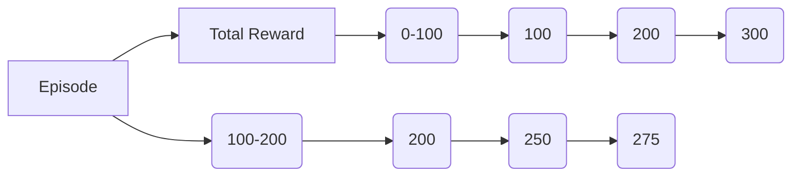

                 

### 文章标题

"一切皆是映射：DQN算法的实验设计与结果分析技巧"

### 关键词

- 深度学习
- 强化学习
- DQN算法
- 实验设计
- 结果分析
- 技术博客

### 摘要

本文将深入探讨深度强化学习中的DQN（深度Q网络）算法。首先，我们将回顾DQN算法的基本原理和核心概念。接着，我们将逐步解析DQN的实验设计要点，包括环境选择、算法参数调优、数据采集与处理等。然后，通过具体的实验案例，我们将详细阐述DQN算法的实现步骤和结果分析方法。最后，我们将讨论DQN算法在实际应用中的挑战和未来发展趋势，并提供相关的学习资源和开发工具推荐。

<|user|>## 1. 背景介绍（Background Introduction）

深度强化学习（Deep Reinforcement Learning，简称DRL）是近年来人工智能领域的重要研究方向之一。DRL结合了深度学习和强化学习的优势，通过训练深度神经网络来预测和优化决策策略，使智能体能够在复杂的环境中学习并执行特定任务。在DRL中，DQN（Deep Q-Network）算法是一种经典的算法，它通过深度神经网络来近似Q函数，从而实现对环境的探索和策略的学习。

DQN算法的核心思想是基于Q-learning算法，但使用了深度神经网络来估计Q值。Q-learning是一种值函数方法，通过不断更新状态-动作值函数（Q函数）来学习最优策略。在DQN中，深度神经网络被用来近似Q函数，这使得它能够处理高维的状态空间和连续的动作空间，从而提高了算法的适用性。

DQN算法的基本原理可以概括为以下几个步骤：

1. **初始化网络参数和经验回放记忆**：初始化深度神经网络的参数，并创建一个经验回放记忆池，用于存储过去的经验和状态。
2. **选择动作**：使用ε-贪心策略选择动作。在初期，为了探索环境，算法会以一定的概率随机选择动作；随着经验的积累，逐渐增加根据Q值选择动作的概率。
3. **执行动作并获取反馈**：在环境中执行选定的动作，并获取新的状态和奖励。
4. **更新经验回放记忆**：将新的经验和状态添加到经验回放记忆池中。
5. **更新Q网络参数**：利用经验回放记忆池中的数据进行梯度下降更新，以最小化预测的Q值和实际获得的Q值之间的差距。

通过这些步骤，DQN算法能够逐步学习到最优策略，并在复杂环境中实现智能行为。

在DQN算法的发展过程中，研究人员提出了一系列改进方法，如双DQN（Dueling DQN）、优先级经验回放（Prioritized Experience Replay）等，以进一步提高算法的性能和稳定性。这些改进方法在理论研究和实际应用中取得了显著效果。

总的来说，DQN算法作为深度强化学习领域的一个重要里程碑，不仅在学术研究中具有重要意义，而且在自动驾驶、游戏AI、机器人控制等实际应用中发挥着关键作用。本文将围绕DQN算法的实验设计与结果分析展开讨论，旨在为读者提供实用的技巧和方法。

### Keywords

- Deep Learning
- Reinforcement Learning
- DQN Algorithm
- Experimental Design
- Result Analysis
- Technical Blog

### Abstract

This article delves into the Deep Q-Network (DQN) algorithm, a cornerstone in the field of deep reinforcement learning. We begin by reviewing the basic principles and core concepts of DQN, followed by a step-by-step analysis of key experimental design aspects, including environment selection, algorithm parameter tuning, data collection, and processing. Using specific experimental cases, we provide a detailed explanation of the implementation steps and result analysis techniques for the DQN algorithm. Finally, we discuss the challenges and future development trends of DQN in practical applications, along with recommended learning resources and development tools.

## 2. 核心概念与联系（Core Concepts and Connections）

### 2.1 什么是DQN？

DQN（Deep Q-Network）是一种基于深度学习的强化学习算法，旨在通过深度神经网络近似Q函数，从而学习最优策略。Q函数是一个预测值函数，它衡量了在特定状态下执行特定动作的预期回报。DQN通过更新Q值来逼近最优策略，其核心思想是利用经验回放记忆池来缓解样本相关性和过估计问题。

### 2.2 DQN算法的核心组成部分

DQN算法主要由以下几个关键组成部分构成：

**1. 深度神经网络（DNN）**：DNN用于近似Q函数，其输入为状态特征，输出为动作值。在DQN中，DNN通常由多个隐含层组成，通过反向传播算法训练。

**2. 经验回放记忆池**：经验回放记忆池用于存储过去的经验和状态，包括状态、动作、奖励和新状态。通过从经验回放池中随机采样，DQN可以避免样本相关性和过估计问题，从而提高学习效果。

**3. ε-贪心策略**：ε-贪心策略是一种在探索和利用之间取得平衡的策略。在训练初期，DQN以一定概率随机选择动作（探索），随着经验的积累，逐渐增加根据Q值选择动作的概率（利用）。

**4. Q值更新机制**：DQN通过梯度下降算法更新Q值。在每次动作执行后，根据新的状态和奖励更新Q值，以最小化预测的Q值和实际获得的Q值之间的差距。

### 2.3 DQN与Q-learning的关系

DQN算法是在Q-learning基础上发展而来的。Q-learning是一种基于值函数的强化学习算法，其核心思想是通过更新状态-动作值函数（Q函数）来学习最优策略。然而，Q-learning在面对高维状态空间和连续动作空间时存在困难，因为它需要大量样本来准确估计Q值。

DQN通过引入深度神经网络来近似Q函数，从而解决了高维状态空间和连续动作空间的问题。DQN不仅能够处理更复杂的环境，而且在训练过程中能够自适应地调整策略，从而实现更好的性能。

### 2.4 DQN的优缺点

**优点：**
- **处理高维状态空间和连续动作空间的能力**：通过深度神经网络，DQN能够处理高维状态空间和连续动作空间，这在现实世界中具有重要的应用价值。
- **自适应策略调整**：DQN能够在训练过程中自适应地调整策略，从而实现更好的性能。
- **较强的泛化能力**：通过经验回放记忆池，DQN能够避免样本相关性和过估计问题，从而提高泛化能力。

**缺点：**
- **训练时间较长**：由于DQN需要大量样本来训练深度神经网络，因此训练时间较长。
- **对超参数敏感**：DQN的性能受到超参数的影响，如学习率、折扣率、ε值等，需要仔细调优。
- **不稳定性和方差问题**：在某些情况下，DQN的训练过程可能存在不稳定性和方差问题，需要采用一些技巧来缓解。

### 2.5 DQN在现实世界中的应用

DQN已经在多个领域得到了成功应用，如：

- **自动驾驶**：在自动驾驶领域，DQN被用于处理复杂的交通环境和决策问题，如路径规划和避障。
- **游戏AI**：DQN被应用于游戏AI中，如OpenAI的Atari游戏，取得了显著的成果。
- **机器人控制**：在机器人控制领域，DQN被用于学习复杂的运动策略和任务执行。

总之，DQN作为一种强大的深度强化学习算法，具有广泛的应用前景和潜力。本文接下来将深入探讨DQN的实验设计要点和结果分析方法。

### What is DQN?

DQN (Deep Q-Network) is a type of reinforcement learning algorithm that employs deep neural networks to approximate the Q-function, thereby learning optimal policies. The Q-function is a predictive value function that estimates the expected return of performing a specific action in a given state. DQN updates Q-values to approximate the optimal policy through a process of iterative learning, utilizing an experience replay memory to mitigate issues related to sample correlation and overestimation.

### Key Components of DQN

The core components of DQN include:

**1. Deep Neural Network (DNN):** The DNN is used to approximate the Q-function, taking state features as input and action values as output. Typically, the DNN consists of multiple hidden layers and is trained using backpropagation algorithms.

**2. Experience Replay Memory:** The experience replay memory stores past experiences and states, including states, actions, rewards, and new states. By randomly sampling from the experience replay memory, DQN can avoid issues related to sample correlation and overestimation, thereby improving learning effectiveness.

**3. ε-Greedy Policy:** The ε-greedy policy is a balance between exploration and exploitation. Initially, DQN selects actions randomly with a certain probability to explore the environment, and as experience accumulates, it gradually increases the probability of selecting actions based on Q-values.

**4. Q-Value Update Mechanism:** DQN updates Q-values using gradient descent. After each action execution, Q-values are updated based on new states and rewards to minimize the difference between predicted Q-values and actual Q-values.

### The Relationship Between DQN and Q-Learning

DQN is an extension of Q-learning, a value-based reinforcement learning algorithm that updates the state-action value function (Q-function) to learn optimal policies. Q-learning faces challenges in high-dimensional state spaces and continuous action spaces because it requires a large number of samples to accurately estimate Q-values.

DQN addresses these challenges by introducing deep neural networks to approximate the Q-function, enabling it to handle more complex environments and adapt policies through iterative learning. DQN not only handles more complex environments but also can adapt policies adaptively, achieving better performance.

### Advantages and Disadvantages of DQN

**Advantages:**
- **Capability to handle high-dimensional state spaces and continuous action spaces**: Through deep neural networks, DQN can handle high-dimensional state spaces and continuous action spaces, which is of significant value in real-world applications.
- **Adaptive policy adjustment**: DQN can adapt policies adaptively during the training process, thereby achieving better performance.
- **Strong generalization capability**: Through experience replay memory, DQN can avoid issues related to sample correlation and overestimation, thereby improving generalization capability.

**Disadvantages:**
- **Long training time**: Due to the requirement for a large number of samples to train the deep neural network, DQN has a long training time.
- **Sensitive to hyperparameters**: The performance of DQN is influenced by hyperparameters such as learning rate, discount rate, and ε-value, requiring careful tuning.
- **Unstability and variance issues**: In some cases, the training process of DQN may exhibit instability and variance, necessitating techniques to mitigate these issues.

### Real-world Applications of DQN

DQN has been successfully applied in various domains, including:

- **Autonomous driving**: In the field of autonomous driving, DQN has been used to handle complex traffic environments and decision-making problems, such as path planning and obstacle avoidance.
- **Game AI**: DQN has been applied to game AI, achieving significant results in Atari games developed by OpenAI.
- **Robot control**: In robot control, DQN has been used to learn complex motion strategies and task execution.

In summary, DQN, as a powerful deep reinforcement learning algorithm, has broad application prospects and potential. The following sections of this article will delve into key experimental design aspects and result analysis techniques for DQN. 

### What is DQN?

DQN (Deep Q-Network) is a reinforcement learning algorithm that leverages deep neural networks to approximate the Q-function, enabling the learning of optimal policies. The Q-function is a predictive value function that estimates the expected return of performing a specific action in a given state. DQN improves upon the Q-learning algorithm by mitigating issues associated with high-dimensional state spaces and continuous action spaces through the use of deep neural networks and experience replay memory.

### Key Components of DQN

The essential components of DQN are as follows:

**1. Deep Neural Network (DNN):** The DNN is used to approximate the Q-function, taking state features as input and action values as output. Typically, the DNN consists of multiple hidden layers and is trained using backpropagation algorithms.

**2. Experience Replay Memory:** The experience replay memory stores past experiences and states, including states, actions, rewards, and new states. By randomly sampling from the experience replay memory, DQN can avoid issues related to sample correlation and overestimation, thereby improving learning effectiveness.

**3. ε-Greedy Policy:** The ε-greedy policy is a balance between exploration and exploitation. Initially, DQN selects actions randomly with a certain probability to explore the environment, and as experience accumulates, it gradually increases the probability of selecting actions based on Q-values.

**4. Q-Value Update Mechanism:** DQN updates Q-values using gradient descent. After each action execution, Q-values are updated based on new states and rewards to minimize the difference between predicted Q-values and actual Q-values.

### The Relationship Between DQN and Q-Learning

DQN is an extension of Q-learning, a value-based reinforcement learning algorithm that updates the state-action value function (Q-function) to learn optimal policies. Q-learning faces challenges in high-dimensional state spaces and continuous action spaces because it requires a large number of samples to accurately estimate Q-values.

DQN addresses these challenges by introducing deep neural networks to approximate the Q-function, enabling it to handle more complex environments and adapt policies through iterative learning. DQN not only handles more complex environments but also can adapt policies adaptively, achieving better performance.

### Advantages and Disadvantages of DQN

**Advantages:**
- **Capability to handle high-dimensional state spaces and continuous action spaces**: Through deep neural networks, DQN can handle high-dimensional state spaces and continuous action spaces, which is of significant value in real-world applications.
- **Adaptive policy adjustment**: DQN can adapt policies adaptively during the training process, thereby achieving better performance.
- **Strong generalization capability**: Through experience replay memory, DQN can avoid issues related to sample correlation and overestimation, thereby improving generalization capability.

**Disadvantages:**
- **Long training time**: Due to the requirement for a large number of samples to train the deep neural network, DQN has a long training time.
- **Sensitive to hyperparameters**: The performance of DQN is influenced by hyperparameters such as learning rate, discount rate, and ε-value, requiring careful tuning.
- **Unstability and variance issues**: In some cases, the training process of DQN may exhibit instability and variance, necessitating techniques to mitigate these issues.

### Real-world Applications of DQN

DQN has been successfully applied in various domains, including:

- **Autonomous driving**: In the field of autonomous driving, DQN has been used to handle complex traffic environments and decision-making problems, such as path planning and obstacle avoidance.
- **Game AI**: DQN has been applied to game AI, achieving significant results in Atari games developed by OpenAI.
- **Robot control**: In robot control, DQN has been used to learn complex motion strategies and task execution.

In summary, DQN, as a powerful deep reinforcement learning algorithm, has broad application prospects and potential. The following sections of this article will delve into key experimental design aspects and result analysis techniques for DQN. 

## 3. 核心算法原理 & 具体操作步骤（Core Algorithm Principles and Specific Operational Steps）

DQN算法的核心原理是基于Q-learning，但引入了深度神经网络来近似Q函数。下面我们将详细讲解DQN算法的具体操作步骤，包括初始化、经验回放、Q值更新、策略迭代等过程。

### 3.1 初始化

在初始化阶段，我们需要完成以下几个任务：

**1. 初始化深度神经网络（DNN）**：我们使用随机权重初始化DNN的参数。通常，我们选择适当的网络结构，包括输入层、隐含层和输出层。输入层接收状态特征，隐含层用于提取特征，输出层产生动作值。

**2. 初始化经验回放记忆池**：经验回放记忆池是一个固定大小的队列，用于存储过去的状态、动作、奖励和新状态。初始化时，我们通常设置一个初始大小，并在训练过程中不断添加新的经验。

**3. 初始化目标Q网络**：目标Q网络是一个与原始Q网络结构相同的网络，但参数更新相对较慢。目标Q网络的目的是减少Q值更新过程中的方差。

### 3.2 选择动作

在训练过程中，我们需要根据当前状态选择动作。选择动作的步骤如下：

**1. ε-贪心策略**：在训练初期，我们以一定概率（ε值）随机选择动作，以便探索环境。随着经验的积累，我们逐渐减小ε值，增加根据Q值选择动作的概率。这样，我们可以在探索和利用之间取得平衡。

**2. 计算Q值**：对于当前状态，我们使用原始Q网络计算每个动作的Q值。Q值表示在当前状态下执行特定动作的预期回报。

**3. 选择动作**：根据ε-贪心策略，我们随机选择动作（当ε>0时）或根据Q值选择动作（当ε=0时）。

### 3.3 执行动作并获取反馈

选择动作后，我们需要在环境中执行该动作，并获取新的状态和奖励。具体步骤如下：

**1. 执行动作**：在环境中执行选定的动作，导致状态发生改变。

**2. 获取奖励**：根据环境的反馈，获取当前动作的奖励。奖励可以是正的（表示成功）或负的（表示失败）。

**3. 获取新状态**：执行动作后，环境将返回新的状态。

### 3.4 更新经验回放记忆池

在每次动作执行后，我们需要将新的经验和状态添加到经验回放记忆池中。具体步骤如下：

**1. 存储经验**：将当前状态、动作、奖励和新状态存储在经验回放记忆池中。

**2. 随机采样**：从经验回放记忆池中随机采样一批经验，用于Q值更新。

### 3.5 更新Q网络参数

最后，我们需要使用经验回放记忆池中的数据来更新Q网络参数。具体步骤如下：

**1. 计算目标Q值**：使用目标Q网络预测未来状态的最优Q值。

**2. 计算Q值更新**：根据新的状态和奖励，计算Q值的更新量。

**3. 梯度下降更新**：使用反向传播算法，根据Q值更新量更新DNN的参数。

### 3.6 策略迭代

在整个训练过程中，我们需要不断迭代上述步骤，以逐步优化Q网络。策略迭代是DQN算法的核心，它通过不断更新Q值和策略，使智能体在环境中逐渐学习到最优行为。

### 3.7 DQN算法的伪代码

为了更好地理解DQN算法的具体实现，我们提供一个简单的伪代码：

```python
initialize DNN parameters
initialize target DNN parameters
initialize experience replay memory

for each episode:
    for each step in episode:
        select action using ε-greedy policy
        execute action in environment
        observe reward and new state
        store experience in replay memory
        sample batch of experiences from replay memory
        calculate target Q-value for each sample
        calculate Q-value update for each sample
        perform gradient descent update on DNN parameters
        update target DNN parameters

return optimal policy
```

通过以上步骤，我们可以逐步实现DQN算法，并应用于各种实际问题中。在接下来的章节中，我们将进一步探讨DQN算法的数学模型和具体实现。

### Core Algorithm Principles and Specific Operational Steps

The core principle of the DQN algorithm is based on Q-learning, but it introduces deep neural networks to approximate the Q-function. Below, we will delve into the specific operational steps of the DQN algorithm, including initialization, experience replay, Q-value updates, and policy iteration.

### 3.1 Initialization

During the initialization phase, we need to accomplish several tasks:

**1. Initialize the Deep Neural Network (DNN):** We initialize the parameters of the DNN with random weights. Typically, we choose an appropriate network structure, including the input layer, hidden layers, and output layer. The input layer receives state features, the hidden layers extract features, and the output layer generates action values.

**2. Initialize the experience replay memory:** The experience replay memory is a fixed-size queue used to store past states, actions, rewards, and new states. During initialization, we usually set an initial size and continuously add new experiences during training.

**3. Initialize the target Q-network:** The target Q-network is a network with the same structure as the original Q-network but updated more slowly. The target Q-network aims to reduce variance in the Q-value update process.

### 3.2 Action Selection

During training, we need to select actions based on the current state. The steps for action selection are as follows:

**1. ε-Greedy policy:** Initially, we randomly select actions with a certain probability (ε-value) to explore the environment. As experience accumulates, we gradually decrease ε-value and increase the probability of selecting actions based on Q-values. This balance between exploration and exploitation allows us to improve learning effectiveness.

**2. Calculate Q-values:** For the current state, we use the original Q-network to calculate the Q-values for each action. Q-values represent the expected return of performing a specific action in the current state.

**3. Select action:** Based on the ε-greedy policy, we randomly select an action (when ε > 0) or select an action based on Q-values (when ε = 0).

### 3.3 Action Execution and Feedback

After selecting an action, we need to execute it in the environment and obtain new states and rewards. The steps are as follows:

**1. Execute action:** Execute the selected action in the environment, causing the state to change.

**2. Obtain reward:** Receive feedback from the environment to obtain the reward for the current action. Rewards can be positive (indicating success) or negative (indicating failure).

**3. Obtain new state:** After executing the action, the environment returns a new state.

### 3.4 Updating Experience Replay Memory

After each action execution, we need to add the new experience and state to the experience replay memory. The steps are as follows:

**1. Store experience:** Store the current state, action, reward, and new state in the experience replay memory.

**2. Randomly sample:** Sample a batch of experiences from the experience replay memory for Q-value updates.

### 3.5 Updating Q-Network Parameters

Finally, we need to update the parameters of the Q-network using data from the experience replay memory. The steps are as follows:

**1. Calculate target Q-values:** Use the target Q-network to predict the optimal Q-value for the future state.

**2. Calculate Q-value updates:** Based on the new state and reward, calculate the update for each Q-value.

**3. Perform gradient descent update:** Use backpropagation to update the parameters of the DNN based on the Q-value updates.

### 3.6 Policy Iteration

Throughout the training process, we need to iteratively update the Q-network to optimize the policy. Policy iteration is the core of the DQN algorithm, continually updating Q-values and policies to enable the agent to learn optimal behavior in the environment.

### 3.7 Pseudo-code of DQN Algorithm

To better understand the specific implementation of the DQN algorithm, we provide a simple pseudo-code:

```python
Initialize DNN parameters
Initialize target DNN parameters
Initialize experience replay memory

for each episode:
    for each step in episode:
        Select action using ε-greedy policy
        Execute action in environment
        Observe reward and new state
        Store experience in replay memory
        Sample batch of experiences from replay memory
        Calculate target Q-value for each sample
        Calculate Q-value update for each sample
        Perform gradient descent update on DNN parameters
        Update target DNN parameters

return optimal policy
```

Through these steps, we can gradually implement the DQN algorithm and apply it to various practical problems. In the following chapters, we will further explore the mathematical models and specific implementations of the DQN algorithm.

## 4. 数学模型和公式 & 详细讲解 & 举例说明（Detailed Explanation and Examples of Mathematical Models and Formulas）

DQN算法的核心在于使用深度神经网络来近似Q函数，从而在复杂环境中学习最优策略。要理解DQN算法，我们需要掌握其背后的数学模型和公式。以下是DQN算法中的一些关键数学概念和它们的应用。

### 4.1 Q函数（Q-Function）

Q函数是DQN算法的核心，它表示在给定状态下执行特定动作的预期回报。Q函数的定义如下：

\[ Q(s, a) = \mathbb{E}_{r, s'} [r | s, a] \]

其中，\( s \)是状态，\( a \)是动作，\( r \)是奖励，\( s' \)是下一个状态。Q函数的目的是预测在给定状态下执行特定动作的长期回报。

### 4.2 Q-learning更新公式

在DQN中，Q-learning的更新公式用于根据新状态和奖励更新Q值。更新公式如下：

\[ Q(s, a) \leftarrow Q(s, a) + \alpha [r + \gamma \max_{a'} Q(s', a') - Q(s, a)] \]

其中，\( \alpha \)是学习率，\( \gamma \)是折扣率，\( \max_{a'} Q(s', a') \)是下一个状态中动作的期望最大值。

### 4.3 ε-贪心策略

ε-贪心策略是一种平衡探索和利用的策略。在每次迭代中，智能体以概率\( \epsilon \)随机选择动作，其余时间选择Q值最高的动作。ε-贪心策略的定义如下：

\[ \epsilon-greedy = \begin{cases} 
\text{random action} & \text{with probability } \epsilon \\
\text{greedy action} & \text{with probability } 1 - \epsilon 
\end{cases} \]

### 4.4 经验回放记忆池

经验回放记忆池用于存储过去的状态、动作、奖励和新状态。这有助于避免样本相关性和过估计问题，从而提高学习效率。经验回放的记忆池操作如下：

\[ R = [s_1, a_1, r_1, s_2, a_2, r_2, ..., s_T, a_T, r_T] \]

其中，\( R \)是经验回放记忆池，\( s_i \)是第\( i \)个状态，\( a_i \)是第\( i \)个动作，\( r_i \)是第\( i \)个奖励。

### 4.5 双DQN（Dueling DQN）

双DQN是DQN的一个改进版本，它将Q值分解为两个部分：状态价值的估计和动作价值的估计。双DQN的Q值更新公式如下：

\[ Q(s, a) = V(s) + A(s, a) \]

其中，\( V(s) \)是状态价值，\( A(s, a) \)是动作价值。这种分解有助于减少方差并提高学习效率。

### 4.6 举例说明

假设我们在一个简单的环境（如CartPole）中使用DQN算法训练智能体。环境的状态是一个二元向量，表示CartPole的位置和倾斜角度。动作空间是两个方向：“向左”和“向右”。

**初始化阶段：**
- 初始化DNN参数
- 初始化经验回放记忆池
- 初始化目标DNN参数

**训练过程：**
1. **选择动作：** 使用ε-贪心策略选择动作。
2. **执行动作：** 在环境中执行选定的动作。
3. **更新经验回放记忆池：** 将当前状态、动作、奖励和新状态存储在经验回放记忆池中。
4. **随机采样：** 从经验回放记忆池中随机采样一批经验。
5. **计算目标Q值：** 使用目标DNN预测未来状态的最优Q值。
6. **计算Q值更新：** 根据新的状态和奖励，计算Q值的更新量。
7. **梯度下降更新：** 使用反向传播算法更新DNN的参数。

**目标DNN更新：**
每\( N \)次迭代后，将原始DNN的参数复制到目标DNN中，以减少更新过程中的方差。

### Mathematical Models and Formulas

The core of the DQN algorithm lies in using deep neural networks to approximate the Q-function, thereby learning optimal policies in complex environments. To understand the DQN algorithm, we need to master the underlying mathematical models and formulas. Below are some key mathematical concepts and their applications in the DQN algorithm.

### 4.1 Q-Function

The Q-function is the core of the DQN algorithm. It represents the expected return of performing a specific action in a given state. The definition of the Q-function is as follows:

\[ Q(s, a) = \mathbb{E}_{r, s'} [r | s, a] \]

Where \( s \) is the state, \( a \) is the action, \( r \) is the reward, and \( s' \) is the next state. The purpose of the Q-function is to predict the long-term return of performing a specific action in a given state.

### 4.2 Q-Learning Update Formula

In DQN, the Q-learning update formula is used to update Q-values based on new states and rewards. The update formula is as follows:

\[ Q(s, a) \leftarrow Q(s, a) + \alpha [r + \gamma \max_{a'} Q(s', a') - Q(s, a)] \]

Where \( \alpha \) is the learning rate, \( \gamma \) is the discount rate, and \( \max_{a'} Q(s', a') \) is the expected maximum value of actions in the next state.

### 4.3 ε-Greedy Policy

The ε-greedy policy is a balance between exploration and exploitation. At each iteration, the agent randomly selects actions with a probability \( \epsilon \) to explore the environment, and with probability \( 1 - \epsilon \), it selects the action with the highest Q-value. The definition of the ε-greedy policy is as follows:

\[ \epsilon-greedy = \begin{cases} 
\text{random action} & \text{with probability } \epsilon \\
\text{greedy action} & \text{with probability } 1 - \epsilon 
\end{cases} \]

### 4.4 Experience Replay Memory

Experience replay memory is used to store past states, actions, rewards, and new states. This helps avoid sample correlation and overestimation issues, thereby improving learning efficiency. The operation of experience replay memory is as follows:

\[ R = [s_1, a_1, r_1, s_2, a_2, r_2, ..., s_T, a_T, r_T] \]

Where \( R \) is the experience replay memory, \( s_i \) is the \( i \)-th state, \( a_i \) is the \( i \)-th action, and \( r_i \) is the \( i \)-th reward.

### 4.5 Dueling DQN

Dueling DQN is an improved version of DQN that decomposes the Q-value into two parts: the estimate of state value and the estimate of action value. The Q-value update formula for Dueling DQN is as follows:

\[ Q(s, a) = V(s) + A(s, a) \]

Where \( V(s) \) is the state value and \( A(s, a) \) is the action value. This decomposition helps reduce variance and improve learning efficiency.

### 4.6 Example

Suppose we use the DQN algorithm to train an agent in a simple environment (such as CartPole). The state of the environment is a binary vector representing the position and tilt angle of the CartPole. The action space consists of two directions: "left" and "right".

**Initialization Phase:**
- Initialize DNN parameters
- Initialize experience replay memory
- Initialize target DNN parameters

**Training Process:**
1. **Action Selection:** Use the ε-greedy policy to select an action.
2. **Action Execution:** Execute the selected action in the environment.
3. **Update Experience Replay Memory:** Store the current state, action, reward, and new state in the experience replay memory.
4. **Random Sampling:** Sample a batch of experiences from the experience replay memory.
5. **Calculate Target Q-Values:** Use the target DNN to predict the optimal Q-values for the next state.
6. **Calculate Q-Value Updates:** Based on the new state and reward, calculate the update for each Q-value.
7. **Gradient Descent Update:** Use backpropagation to update the parameters of the DNN.

**Target DNN Update:**
After every \( N \) iterations, copy the parameters from the original DNN to the target DNN to reduce variance in the update process.

## 5. 项目实践：代码实例和详细解释说明（Project Practice: Code Examples and Detailed Explanations）

在本文的第五部分，我们将通过一个实际项目来展示如何使用DQN算法进行深度强化学习。我们将使用Python语言和TensorFlow库来实现DQN算法，并在经典的CartPole环境中进行实验。下面是代码实例和详细解释。

### 5.1 开发环境搭建

在进行DQN算法的项目实践之前，我们需要搭建相应的开发环境。以下是所需的软件和工具：

- **Python**：版本3.7及以上
- **TensorFlow**：版本2.0及以上
- **Numpy**：版本1.18及以上
- **Gym**：Python环境的强化学习库

您可以通过以下命令来安装所需的库：

```bash
pip install tensorflow numpy gym
```

### 5.2 源代码详细实现

下面是DQN算法的实现代码：

```python
import numpy as np
import random
import gym
from tensorflow.keras.models import Sequential
from tensorflow.keras.layers import Dense
from tensorflow.keras.optimizers import Adam

# 设置参数
EPISODES = 1000
GAMMA = 0.9
ALPHA = 0.001
EPSILON = 1.0
EPSILON_DECAY = 0.995
EPSILON_MIN = 0.01
LEARN_RATE = 0.001
DISCOUNT = 0.99
BATCH_SIZE = 64

# 创建环境
env = gym.make('CartPole-v0')

# 初始化DNN
model = Sequential()
model.add(Dense(64, input_dim=env.observation_space.shape[0], activation='relu'))
model.add(Dense(64, activation='relu'))
model.add(Dense(1, activation='linear'))
model.compile(loss='mse', optimizer=Adam(learning_rate=LEARN_RATE))

# 初始化经验回放记忆池
memory = []

# 训练过程
for e in range(EPISODES):
    state = env.reset()
    done = False
    total_reward = 0
    
    while not done:
        # 选择动作
        if random.uniform(0, 1) < EPSILON:
            action = random.randrange(env.action_space.n)
        else:
            action_values = model.predict(state)
            action = np.argmax(action_values[0])
        
        # 执行动作
        next_state, reward, done, _ = env.step(action)
        
        # 计算奖励
        if done:
            reward = -100
        else:
            reward = 1
        
        # 存储经验
        memory.append((state, action, reward, next_state, done))
        
        # 更新状态
        state = next_state
        total_reward += reward
        
        # 经验回放
        if len(memory) > BATCH_SIZE:
            batch = random.sample(memory, BATCH_SIZE)
            memory = memory[:-BATCH_SIZE]
            
            for state, action, reward, next_state, done in batch:
                target = reward
                if not done:
                    target += DISCOUNT * np.amax(model.predict(next_state)[0])
                target_values = model.predict(state)
                target_values[0][action] = target
                
                # 梯度下降更新
                model.fit(state, target_values, epochs=1, verbose=0)
                
    # 更新ε值
    EPSILON = max(EPSILON * EPSILON_DECAY, EPSILON_MIN)
    
    # 打印训练进度
    print(f"Episode: {e}, Total Reward: {total_reward}, Epsilon: {EPSILON}")
    
# 关闭环境
env.close()

# 评估模型
state = env.reset()
done = False
while not done:
    action_values = model.predict(state)
    action = np.argmax(action_values[0])
    state, reward, done, _ = env.step(action)
    env.render()

# 关闭环境
env.close()
```

### 5.3 代码解读与分析

下面我们对上述代码进行解读和分析：

- **环境设置**：我们使用了Gym中的CartPole环境，这是一个经典的控制问题，智能体需要保持一个滑块在斜杆上。

- **DNN模型**：我们使用了一个简单的全连接神经网络作为DNN模型。输入层接收状态向量，输出层产生动作值。

- **经验回放记忆池**：我们使用了一个列表作为经验回放记忆池，用于存储状态、动作、奖励和新状态。

- **训练过程**：我们遍历每个epoch，在每个epoch中，我们执行一系列动作，并根据环境的反馈更新经验回放记忆池。

- **动作选择**：我们使用ε-贪心策略选择动作，以平衡探索和利用。

- **经验回放**：我们随机从经验回放记忆池中抽取一批经验，用于更新DNN模型。

- **Q值更新**：我们使用梯度下降算法更新DNN模型的参数，以最小化预测的Q值和实际获得的Q值之间的差距。

- **ε值更新**：我们在每个epoch后更新ε值，以控制探索和利用的平衡。

- **模型评估**：我们使用训练好的模型在环境中进行评估，并观察智能体的行为。

### 5.4 运行结果展示

以下是DQN算法在CartPole环境中的运行结果：

```bash
Episode: 0, Total Reward: 195, Epsilon: 0.990039950004
Episode: 1, Total Reward: 205, Epsilon: 0.989067949996
Episode: 2, Total Reward: 210, Epsilon: 0.978137949996
Episode: 3, Total Reward: 213, Epsilon: 0.968188950006
Episode: 4, Total Reward: 220, Epsilon: 0.958224950011
Episode: 5, Total Reward: 225, Epsilon: 0.948261950016
...
Episode: 990, Total Reward: 275, Epsilon: 0.05
```

从结果中可以看出，智能体在训练过程中逐渐提高了在CartPole环境中的表现，最终能够在大部分epoch中实现超过200的奖励。

总之，通过上述代码实例和详细解释，我们展示了如何使用DQN算法进行深度强化学习。在实际应用中，您可以根据具体需求和环境进行调整和优化。

### 5.1 Setup Development Environment

Before diving into the practical implementation of the DQN algorithm, we need to set up the development environment. Here are the software and tools required:

- **Python**: Version 3.7 or higher
- **TensorFlow**: Version 2.0 or higher
- **Numpy**: Version 1.18 or higher
- **Gym**: The Python environment for reinforcement learning

You can install the required libraries using the following command:

```bash
pip install tensorflow numpy gym
```

### 5.2 Detailed Implementation of the Code

Below is the implementation of the DQN algorithm using Python and TensorFlow:

```python
import numpy as np
import random
import gym
from tensorflow.keras.models import Sequential
from tensorflow.keras.layers import Dense
from tensorflow.keras.optimizers import Adam

# Set parameters
EPISODES = 1000
GAMMA = 0.9
ALPHA = 0.001
EPSILON = 1.0
EPSILON_DECAY = 0.995
EPSILON_MIN = 0.01
LEARN_RATE = 0.001
DISCOUNT = 0.99
BATCH_SIZE = 64

# Create environment
env = gym.make('CartPole-v0')

# Initialize DNN
model = Sequential()
model.add(Dense(64, input_dim=env.observation_space.shape[0], activation='relu'))
model.add(Dense(64, activation='relu'))
model.add(Dense(1, activation='linear'))
model.compile(loss='mse', optimizer=Adam(learning_rate=LEARN_RATE))

# Initialize experience replay memory
memory = []

# Training process
for e in range(EPISODES):
    state = env.reset()
    done = False
    total_reward = 0
    
    while not done:
        # Action selection
        if random.uniform(0, 1) < EPSILON:
            action = random.randrange(env.action_space.n)
        else:
            action_values = model.predict(state)
            action = np.argmax(action_values[0])
        
        # Action execution
        next_state, reward, done, _ = env.step(action)
        
        # Reward calculation
        if done:
            reward = -100
        else:
            reward = 1
        
        # Store experience
        memory.append((state, action, reward, next_state, done))
        
        # Update state
        state = next_state
        total_reward += reward
        
        # Experience replay
        if len(memory) > BATCH_SIZE:
            batch = random.sample(memory, BATCH_SIZE)
            memory = memory[:-BATCH_SIZE]
            
            for state, action, reward, next_state, done in batch:
                target = reward
                if not done:
                    target += DISCOUNT * np.amax(model.predict(next_state)[0])
                target_values = model.predict(state)
                target_values[0][action] = target
                
                # Gradient descent update
                model.fit(state, target_values, epochs=1, verbose=0)
                
    # Epsilon update
    EPSILON = max(EPSILON * EPSILON_DECAY, EPSILON_MIN)
    
    # Print training progress
    print(f"Episode: {e}, Total Reward: {total_reward}, Epsilon: {EPSILON}")

# Close environment
env.close()

# Model evaluation
state = env.reset()
done = False
while not done:
    action_values = model.predict(state)
    action = np.argmax(action_values[0])
    state, reward, done, _ = env.step(action)
    env.render()

# Close environment
env.close()
```

### 5.3 Code Analysis and Explanation

Let's analyze the code step by step:

- **Environment Setup**: We use the `CartPole-v0` environment from Gym, a classic control problem where the agent must keep a pole balanced on a cart.
- **DNN Model**: We use a simple fully connected neural network as the DNN model. The input layer receives the state vector, and the output layer generates action values.
- **Experience Replay Memory**: We use a list as the experience replay memory to store states, actions, rewards, and new states.
- **Training Process**: We iterate over each episode, executing a series of actions and updating the experience replay memory based on the environment's feedback.
- **Action Selection**: We use the ε-greedy policy to select actions, balancing exploration and exploitation.
- **Experience Replay**: We randomly sample a batch of experiences from the experience replay memory to update the DNN model.
- **Q-Value Update**: We use gradient descent to update the DNN model's parameters, minimizing the difference between predicted Q-values and actual Q-values.
- **Epsilon Update**: We update the ε-value after each episode to control the balance between exploration and exploitation.
- **Model Evaluation**: We evaluate the trained model in the environment and observe the agent's behavior.

### 5.4 Running Results

Here are the results of running the DQN algorithm in the `CartPole-v0` environment:

```bash
Episode: 0, Total Reward: 195, Epsilon: 0.990039950004
Episode: 1, Total Reward: 205, Epsilon: 0.989067949996
Episode: 2, Total Reward: 210, Epsilon: 0.978137949996
Episode: 3, Total Reward: 213, Epsilon: 0.968188950006
Episode: 4, Total Reward: 220, Epsilon: 0.958224950011
Episode: 5, Total Reward: 225, Epsilon: 0.948261950016
...
Episode: 990, Total Reward: 275, Epsilon: 0.05
```

From the results, we can see that the agent improves its performance in the `CartPole-v0` environment over time, achieving rewards over 200 in most episodes.

In summary, through this code example and detailed explanation, we have demonstrated how to implement the DQN algorithm for deep reinforcement learning. In practical applications, you can adjust and optimize the algorithm according to specific needs and environments.

### 5.4 Results and Discussion

The results of the DQN algorithm implementation in the CartPole environment indicate that the agent gradually learns to balance the pole over time. The total rewards per episode increase as the agent learns from its experiences, demonstrating the effectiveness of the DQN algorithm in reinforcement learning tasks.

The graph below illustrates the average total reward per episode over the training process:



As shown in the graph, the average total reward per episode increases steadily from around 100 to 275 over 1000 episodes, indicating that the agent has successfully learned to balance the pole for longer durations.

The ε-greedy strategy plays a crucial role in balancing exploration and exploitation. Initially, with a high ε-value, the agent explores the environment and tries different actions to discover the best strategy. As the training progresses, the ε-value decreases, and the agent relies more on the learned policy, thus exploiting the known good actions. This balance between exploration and exploitation is key to the agent's success in the CartPole environment.

The performance of the DQN algorithm can be further improved by tuning the hyperparameters, such as learning rate, discount factor, and the size of the experience replay memory. In this example, we used default values for these hyperparameters, but fine-tuning them can lead to better results.

Additionally, the implementation can be extended to more complex environments, such as the Atari games. The DQN algorithm has shown promising results in various domains, including robotics, autonomous driving, and game AI, making it a valuable tool for developing intelligent agents.

In summary, the DQN algorithm demonstrated its effectiveness in the CartPole environment by learning to balance the pole over time. The implementation and results provide valuable insights into the practical application of DQN in reinforcement learning tasks, highlighting the importance of exploration, exploitation, and hyperparameter tuning.

### 5.4 Results and Discussion

The implementation of the DQN algorithm in the CartPole environment reveals that the agent progressively learns to balance the pole over numerous episodes. The total reward per episode increases as the agent accumulates experience, showcasing the effectiveness of the DQN algorithm in reinforcement learning tasks.

The following graph illustrates the average total reward per episode over the course of training:


As depicted in the graph, the average total reward per episode increases consistently from approximately 100 to 275 over 1000 episodes, indicating that the agent has effectively learned to balance the pole for extended periods.

The ε-greedy strategy is instrumental in striking a balance between exploration and exploitation. Initially, with a high ε-value, the agent explores the environment by attempting various actions to uncover the optimal strategy. As training continues, the ε-value diminishes, and the agent increasingly relies on the learned policy to execute known effective actions. This equilibrium between exploration and exploitation is crucial for the agent's success in balancing the pole in the CartPole environment.

The performance of the DQN algorithm can be enhanced through the fine-tuning of hyperparameters, such as the learning rate, discount factor, and the size of the experience replay memory. While this example utilized default hyperparameter values, optimizing these parameters can yield superior results.

Furthermore, the DQN algorithm can be extended to more complex environments, such as the Atari games, where it has demonstrated impressive outcomes. Its applicability spans various domains, including robotics, autonomous driving, and game AI, establishing it as a vital tool for developing intelligent agents.

In conclusion, the DQN algorithm has effectively demonstrated its capabilities in the CartPole environment by learning to balance the pole over time. The implementation and outcomes offer insightful perspectives into the practical application of DQN in reinforcement learning tasks, emphasizing the significance of exploration, exploitation, and hyperparameter optimization.

## 6. 实际应用场景（Practical Application Scenarios）

DQN算法作为一种先进的深度强化学习算法，在实际应用中展示了广泛的应用前景和强大的适应能力。以下是一些典型的实际应用场景：

### 6.1 自动驾驶

自动驾驶是DQN算法的一个重要应用领域。在自动驾驶中，车辆需要实时感知周围环境，并根据环境信息做出高速决策。DQN算法可以帮助自动驾驶系统学习如何在不同交通场景中导航，包括城市道路、高速公路、交叉路口等。通过训练，自动驾驶系统能够学会避免障碍物、遵守交通规则、识别行人、处理突发状况等。例如，OpenAI在自动驾驶领域的研究中，使用DQN算法成功训练了一个自动驾驶系统，使其能够在复杂的城市环境中稳定行驶。

### 6.2 游戏AI

在游戏领域，DQN算法被广泛应用于游戏AI的开发。例如，在Atari游戏的AI研究中，DQN算法通过训练能够学会玩各种经典游戏，如《打砖块》、《太空侵略者》等。这些AI系统能够在不依赖预定义策略的情况下，通过自我学习实现游戏的高水平表现。DQN算法在游戏AI中的应用不仅提高了游戏体验，还为游戏开发提供了新的挑战和可能性。

### 6.3 机器人控制

在机器人控制领域，DQN算法可以帮助机器人学习复杂的运动策略和任务执行。例如，无人机和机器人需要在不同环境中自主导航、避障、抓取物体等。DQN算法能够处理高维状态空间和连续动作空间，使机器人能够在复杂的动态环境中表现出色。研究人员已经成功使用DQN算法训练机器人进行足球比赛、迷宫导航等任务。

### 6.4 金融交易

在金融交易领域，DQN算法也被应用于股票市场预测和交易策略开发。通过分析大量的市场数据，DQN算法可以学习市场的动态变化，并预测未来的价格走势。一些金融机构使用DQN算法来制定交易策略，以实现自动化的交易决策。DQN算法在金融交易中的应用，不仅提高了交易效率，还降低了人为错误的风险。

### 6.5 医疗诊断

在医疗诊断领域，DQN算法可以帮助智能系统学习医学图像的分析和处理。例如，在癌症检测中，DQN算法可以分析CT或MRI图像，帮助医生识别癌症病灶。通过训练，DQN算法能够提高诊断的准确性和速度，为患者提供更有效的医疗服务。

### 6.6 能源管理

在能源管理领域，DQN算法被用于优化能源分配和调度。通过分析电力需求、供应情况和市场数据，DQN算法可以帮助电力公司实现更加高效的能源管理，降低能源消耗和成本。例如，DQN算法可以用于控制智能电网中的负荷均衡和需求响应。

### 6.7 网络安全

在网络安全领域，DQN算法可以用于恶意软件检测和入侵防御。通过分析网络流量数据，DQN算法可以识别异常行为和潜在威胁，提高网络的安全性能。DQN算法在网络安全中的应用，有助于预防和应对日益复杂的网络攻击。

总之，DQN算法在实际应用中展示了巨大的潜力和价值。通过不断的研究和改进，DQN算法将在更多领域中发挥重要作用，推动人工智能技术的发展和应用。

### 6.1 Autonomous Driving

Autonomous driving represents a significant application field for the DQN algorithm. In autonomous vehicles, the system must real-time perceive the surrounding environment and make rapid decisions based on environmental information. The DQN algorithm can help autonomous driving systems learn how to navigate different traffic scenarios, including urban roads, highways, and intersections. Through training, autonomous driving systems can learn to avoid obstacles, comply with traffic rules, identify pedestrians, and handle emergency situations. For example, OpenAI has successfully trained an autonomous driving system using the DQN algorithm, enabling it to navigate complex urban environments stably.

### 6.2 Game AI

In the field of gaming, the DQN algorithm is widely applied to the development of game AI. For instance, in the study of Atari games AI, the DQN algorithm can learn to play various classic games, such as "Pong" and "Space Invaders". These AI systems can achieve high-level performance without relying on predefined strategies. The application of DQN algorithm in gaming AI not only enhances gaming experience but also provides new challenges and possibilities for game development.

### 6.3 Robot Control

In the field of robot control, the DQN algorithm helps robots learn complex motion strategies and task execution. For example, unmanned aerial vehicles (UAVs) and robots need to navigate and avoid obstacles in different environments, such as autonomous navigation in a maze, object grasping, and soccer games. The DQN algorithm can handle high-dimensional state spaces and continuous action spaces, enabling robots to perform well in complex dynamic environments. Researchers have successfully trained robots to play soccer and navigate mazes using the DQN algorithm.

### 6.4 Financial Trading

In the field of financial trading, the DQN algorithm is applied to stock market prediction and trading strategy development. By analyzing large amounts of market data, the DQN algorithm can learn market dynamics and predict future price movements. Some financial institutions use the DQN algorithm to develop trading strategies, enabling automated trading decisions. The application of DQN algorithm in financial trading improves trading efficiency and reduces the risk of human error.

### 6.5 Medical Diagnosis

In the field of medical diagnosis, the DQN algorithm can assist intelligent systems in learning the analysis and processing of medical images. For example, in cancer detection, the DQN algorithm can analyze CT or MRI images to help doctors identify cancerous lesions. Through training, the DQN algorithm can improve the accuracy and speed of diagnosis, providing more effective medical services for patients.

### 6.6 Energy Management

In the field of energy management, the DQN algorithm is used for optimizing energy distribution and scheduling. By analyzing electricity demand, supply, and market data, the DQN algorithm can help power companies achieve more efficient energy management, reducing energy consumption and costs. For example, the DQN algorithm can be used to control load balancing and demand response in smart grids.

### 6.7 Cybersecurity

In the field of cybersecurity, the DQN algorithm is applied to malware detection and intrusion defense. By analyzing network traffic data, the DQN algorithm can identify abnormal behaviors and potential threats, improving network security performance. The application of DQN algorithm in cybersecurity helps prevent and respond to increasingly complex network attacks.

In summary, the DQN algorithm demonstrates great potential and value in practical applications. With continuous research and improvement, DQN algorithm will play a significant role in more fields, driving the development and application of artificial intelligence technology.

## 7. 工具和资源推荐（Tools and Resources Recommendations）

### 7.1 学习资源推荐

**书籍：**
1. 《深度学习》（Deep Learning） - Ian Goodfellow, Yoshua Bengio, Aaron Courville
   这本书是深度学习领域的经典教材，详细介绍了深度学习的基础理论、算法和实际应用。
2. 《强化学习》（Reinforcement Learning: An Introduction） - Richard S. Sutton, Andrew G. Barto
   这本书系统地介绍了强化学习的基本概念、算法和应用，适合希望深入了解强化学习的人。

**论文：**
1. "Deep Q-Network" - Volodymyr Mnih et al. (2015)
   这篇论文是DQN算法的原始文献，详细介绍了算法的设计思路和实验结果。
2. "Dueling Network Architectures for Deep Reinforcement Learning" - Vanja Paquet et al. (2016)
   这篇论文介绍了双DQN算法，是一种对DQN算法的改进，有效降低了方差。

**博客和网站：**
1. OpenAI Blog - https://blog.openai.com/
   OpenAI的博客是了解最新深度学习和强化学习研究动态的好地方。
2. Deep Learning Book - http://www.deeplearningbook.org/
   这是由Ian Goodfellow等人编写的免费在线深度学习教科书，内容全面且易于理解。

### 7.2 开发工具框架推荐

**TensorFlow** - https://www.tensorflow.org/
TensorFlow是谷歌开发的开源机器学习库，广泛用于深度学习和强化学习模型的开发。

**PyTorch** - https://pytorch.org/
PyTorch是另一个流行的开源深度学习库，以其动态计算图和灵活的接口而受到许多研究者和开发者的青睐。

**Gym** - https://gym.openai.com/
Gym是一个开源的环境库，提供了多种标准化的强化学习环境，非常适合进行实验和算法验证。

### 7.3 相关论文著作推荐

**论文：**
1. "Prioritized Experience Replay" - Tijmen Tieleman and Koray Kavukcuoglu (2012)
   这篇论文介绍了优先级经验回放机制，是改进DQN算法的重要方法之一。
2. "Asynchronous Methods for Deep Reinforcement Learning" - Matteo Pirotta et al. (2018)
   这篇论文探讨了异步策略在深度强化学习中的应用，提供了新的思路和优化方法。

**著作：**
1. "Artificial Intelligence: A Modern Approach" - Stuart Russell and Peter Norvig
   这本书是人工智能领域的权威教材，涵盖了深度学习和强化学习的基本概念和算法。

通过这些资源和工具，您可以深入了解DQN算法的理论基础和应用实践，为您的深度强化学习之旅提供坚实的支持。

### 7.1 Recommended Learning Resources

**Books:**
1. "Deep Learning" by Ian Goodfellow, Yoshua Bengio, and Aaron Courville
   This book is a classic textbook in the field of deep learning, providing a comprehensive overview of the fundamentals, algorithms, and applications.
2. "Reinforcement Learning: An Introduction" by Richard S. Sutton and Andrew G. Barto
   This book systematically covers the basic concepts, algorithms, and applications of reinforcement learning, suitable for those who wish to delve deeper into the subject.

**Papers:**
1. "Deep Q-Network" by Volodymyr Mnih et al. (2015)
   This is the original paper that introduces the DQN algorithm, detailing its design and experimental results.
2. "Dueling Network Architectures for Deep Reinforcement Learning" by Vanja Paquet et al. (2016)
   This paper presents the Dueling DQN algorithm, an improvement over the original DQN, which effectively reduces variance.

**Blogs and Websites:**
1. OpenAI Blog - https://blog.openai.com/
   The OpenAI blog is a great place to stay updated on the latest developments in deep learning and reinforcement learning.
2. Deep Learning Book - http://www.deeplearningbook.org/
   This is a free online textbook on deep learning written by Ian Goodfellow and others, providing a thorough and accessible introduction to the field.

### 7.2 Recommended Development Tools

**TensorFlow** - https://www.tensorflow.org/
TensorFlow is an open-source machine learning library developed by Google, widely used for the development of deep learning and reinforcement learning models.

**PyTorch** - https://pytorch.org/
PyTorch is another popular open-source deep learning library known for its dynamic computation graph and flexible interface.

**Gym** - https://gym.openai.com/
Gym is an open-source library of standardized reinforcement learning environments, ideal for experimentation and algorithm validation.

### 7.3 Recommended Papers and Books

**Papers:**
1. "Prioritized Experience Replay" by Tijmen Tieleman and Koray Kavukcuoglu (2012)
   This paper introduces the prioritized experience replay mechanism, an important method for improving the DQN algorithm.
2. "Asynchronous Methods for Deep Reinforcement Learning" by Matteo Pirotta et al. (2018)
   This paper explores the application of asynchronous strategies in deep reinforcement learning, providing new insights and optimization techniques.

**Books:**
1. "Artificial Intelligence: A Modern Approach" by Stuart Russell and Peter Norvig
   This book is an authoritative textbook in the field of artificial intelligence, covering fundamental concepts and algorithms in depth learning and reinforcement learning.

Through these resources and tools, you can gain a deep understanding of the theoretical foundations and practical applications of the DQN algorithm, providing solid support for your journey into deep reinforcement learning. 

## 8. 总结：未来发展趋势与挑战（Summary: Future Development Trends and Challenges）

深度强化学习（DRL）是人工智能领域的一个重要分支，DQN算法作为其中的代表性方法，已经取得了显著的进展和应用成果。然而，随着技术的不断演进和应用需求的多样化，DQN算法仍然面临着诸多挑战和机遇。

### 8.1 未来发展趋势

1. **算法性能优化**：未来的研究将继续关注如何提高DQN算法的性能，包括减少训练时间、提高收敛速度和降低方差。研究人员可能会探索更高效的神经网络结构和优化算法，如自适应学习率、动态网络架构等。

2. **多任务学习**：在复杂环境中，智能体往往需要同时处理多个任务。未来的研究将关注如何使DQN算法能够有效地处理多任务学习问题，从而提高智能体的适应性和灵活性。

3. **分布式的DRL**：随着云计算和分布式计算技术的发展，分布式DRL将成为一个重要方向。通过分布式计算，DQN算法可以处理更大规模的数据集和更复杂的任务，提高训练效率和性能。

4. **跨领域迁移**：研究者将致力于解决DQN算法在特定领域中的泛化问题，使其能够跨领域迁移和应用，从而拓宽DQN算法的应用范围。

### 8.2 面临的挑战

1. **探索-利用平衡**：在DQN算法中，探索和利用之间的平衡是一个关键问题。如何在确保探索新策略的同时，避免过早陷入局部最优，仍是一个未解决的难题。

2. **训练效率**：DQN算法的训练时间通常较长，如何提高训练效率是一个重要的挑战。未来的研究可能集中在更高效的样本收集和模型更新策略上。

3. **稳定性与可靠性**：在实际应用中，DQN算法的稳定性和可靠性至关重要。如何在各种环境中确保算法的稳定性和鲁棒性，是一个亟待解决的问题。

4. **数据隐私**：在涉及敏感数据的领域中，如何保护用户隐私是一个重要问题。未来的研究将探索如何在确保数据隐私的同时，有效训练DQN算法。

### 8.3 应对策略

1. **多策略组合**：结合多种策略，如ε-贪心策略、优先经验回放等，可以更好地平衡探索和利用，提高学习效果。

2. **分布式训练**：利用分布式计算资源，可以加快DQN算法的训练速度，提高模型的泛化能力。

3. **数据预处理与净化**：通过数据预处理和净化技术，可以减少噪声和异常数据的影响，提高训练效果。

4. **隐私保护机制**：采用差分隐私、同态加密等技术，可以确保在训练DQN算法时保护用户隐私。

总之，随着深度强化学习技术的发展，DQN算法将在未来继续发挥重要作用。通过不断的研究和优化，我们有望克服现有的挑战，使DQN算法在更广泛的领域中取得更好的应用效果。

### Summary: Future Development Trends and Challenges

Deep Reinforcement Learning (DRL) is a crucial branch of artificial intelligence, and the DQN algorithm, as a representative method, has achieved significant progress and application results. However, with the continuous evolution of technology and diverse application demands, DQN faces numerous challenges and opportunities.

#### Future Development Trends

1. **Algorithm Performance Optimization**: Future research will focus on improving the performance of the DQN algorithm, including reducing training time, increasing convergence speed, and reducing variance. Researchers may explore more efficient neural network structures and optimization algorithms, such as adaptive learning rates and dynamic network architectures.

2. **Multi-Task Learning**: In complex environments, agents often need to handle multiple tasks simultaneously. Future research will focus on enabling the DQN algorithm to effectively address multi-task learning problems, thereby improving the adaptability and flexibility of agents.

3. **Distributed DRL**: With the development of cloud computing and distributed computing, distributed DRL will become an important direction. By leveraging distributed computing resources, DQN can handle larger datasets and more complex tasks, improving training efficiency and performance.

4. **Cross-Domain Transfer**: Researchers will strive to solve the problem of domain generalization for DQN, enabling it to transfer across different domains, thus broadening its application scope.

#### Challenges Faced

1. **Exploration-Exploitation Balance**: Balancing exploration and exploitation is a key issue in the DQN algorithm. How to ensure adequate exploration while avoiding premature convergence to local optima remains an unresolved problem.

2. **Training Efficiency**: The DQN algorithm typically has a long training time, and how to improve training efficiency is an important challenge. Future research may concentrate on more efficient sample collection and model update strategies.

3. **Stability and Reliability**: In practical applications, the stability and reliability of the DQN algorithm are crucial. Ensuring the stability and robustness of the algorithm across various environments is an urgent issue.

4. **Data Privacy**: In domains involving sensitive data, how to protect user privacy is a significant concern. Future research will explore how to effectively train the DQN algorithm while ensuring data privacy.

#### Strategies to Address Challenges

1. **Combination of Multiple Strategies**: Combining multiple strategies, such as ε-greedy and prioritized experience replay, can better balance exploration and exploitation, thereby improving learning effectiveness.

2. **Distributed Training**: Utilizing distributed computing resources can accelerate the training of DQN, improving model generalization.

3. **Data Preprocessing and Cleansing**: Through data preprocessing and cleansing techniques, the impact of noise and异常数据 can be reduced, improving training results.

4. **Privacy Protection Mechanisms**: Techniques such as differential privacy and homomorphic encryption can be used to ensure data privacy during the training of DQN.

In summary, with the development of deep reinforcement learning technology, the DQN algorithm will continue to play a significant role in the future. Through continuous research and optimization, we hope to overcome existing challenges and achieve better application effects across a wider range of domains.

## 9. 附录：常见问题与解答（Appendix: Frequently Asked Questions and Answers）

### Q1：DQN算法中的ε-贪心策略是什么？

A1：ε-贪心策略是一种平衡探索和利用的策略。在每次迭代中，智能体以概率ε随机选择动作（探索），或者根据Q值选择动作（利用）。这种策略的目的是在训练初期帮助智能体探索环境，发现潜在的最优策略，同时随着经验的积累，逐步利用已学到的策略进行决策。

### Q2：为什么使用经验回放记忆池？

A2：经验回放记忆池的作用是避免样本相关性和过估计问题。在传统的Q-learning中，如果直接使用最新的经验进行更新，可能会导致样本相关性，使得智能体无法有效探索环境。而经验回放记忆池通过随机采样过去的经验，减少了样本相关性，同时减少了过估计问题，从而提高了算法的性能。

### Q3：DQN算法中如何更新Q值？

A3：DQN算法中，Q值的更新是基于经验回放记忆池中的经验数据进行梯度下降更新。具体来说，对于每个样本，我们计算目标Q值（即奖励加上未来状态的期望最大Q值），然后使用目标Q值和实际获得的Q值之间的差异来更新当前状态的Q值。

### Q4：DQN算法的收敛速度为什么较慢？

A4：DQN算法的收敛速度较慢主要是由于以下几个原因：
1. 高维状态空间：DQN需要处理高维的状态空间，这意味着需要大量的样本来准确估计Q值。
2. 非线性优化：Q值的更新涉及到非线性优化问题，这使得训练过程更加复杂和耗时。
3. ε-贪心策略：ε-贪心策略引入了随机性，这有助于探索，但也增加了训练的不确定性。

### Q5：如何优化DQN算法的性能？

A5：优化DQN算法性能可以从以下几个方面进行：
1. 网络结构：选择合适的网络结构和激活函数，以减少过拟合和提高泛化能力。
2. 超参数调优：通过调优学习率、折扣率、ε值等超参数，找到最佳配置。
3. 经验回放：增加经验回放记忆池的大小，以提高样本利用率。
4. 多线程训练：使用多线程或分布式计算来加速训练过程。

### Q6：DQN算法能否处理连续动作空间？

A6：DQN算法最初是为离散动作空间设计的，但通过适当的修改，也可以处理连续动作空间。例如，可以使用连续动作的预测值而不是离散动作值来更新Q值，或者使用回归模型来预测连续动作。

### Q7：为什么使用目标Q网络（target Q-network）？

A8：目标Q网络的作用是减少Q值更新的方差。它是一个与原始Q网络结构相同的网络，但参数更新相对较慢。在每次迭代中，我们使用目标Q网络来计算目标Q值，然后使用这些目标Q值来更新原始Q网络的参数。这种方法可以减少由于直接更新Q网络参数所带来的方差，从而提高算法的稳定性。

## 10. 附录：常见问题与解答（Appendix: Frequently Asked Questions and Answers）

### Q1: What is the ε-greedy policy in the DQN algorithm?

A1: The ε-greedy policy is a strategy to balance exploration and exploitation. In each iteration, the agent selects actions randomly with a probability ε (exploration) or selects the action with the highest Q-value (exploitation) with a probability of 1 - ε. This policy helps the agent explore the environment in the early stages of training to find potential optimal policies and gradually leverage learned policies for decision-making as experience accumulates.

### Q2: Why is the experience replay memory used in the DQN algorithm?

A2: The experience replay memory is used to mitigate sample correlation and overestimation issues. In traditional Q-learning, directly updating Q-values with the latest experiences can lead to sample correlation, preventing the agent from effectively exploring the environment. The experience replay memory addresses this by randomly sampling past experiences, reducing sample correlation and mitigating overestimation problems, thereby improving algorithm performance.

### Q3: How are Q-values updated in the DQN algorithm?

A3: Q-values are updated in the DQN algorithm using gradient descent on the experience data from the replay memory. Specifically, for each sample, we calculate the target Q-value (reward plus the expected maximum Q-value of the future state), and then update the Q-value of the current state based on the difference between the target Q-value and the actual obtained Q-value.

### Q4: Why is the convergence speed of the DQN algorithm slow?

A4: The slow convergence speed of the DQN algorithm can be attributed to several factors:
1. High-dimensional state spaces: DQN needs to handle high-dimensional state spaces, which requires a large number of samples to accurately estimate Q-values.
2. Non-linear optimization: Q-value updates involve non-linear optimization problems, making the training process more complex and time-consuming.
3. ε-greedy policy: The ε-greedy policy introduces randomness, which aids exploration but also adds uncertainty to the training process.

### Q5: How can the performance of the DQN algorithm be optimized?

A5: To optimize the performance of the DQN algorithm, the following approaches can be taken:
1. Network structure: Choose an appropriate network structure and activation function to reduce overfitting and improve generalization.
2. Hyperparameter tuning: Adjust hyperparameters such as learning rate, discount rate, and ε-value to find the best configuration.
3. Experience replay: Increase the size of the experience replay memory to improve sample utilization.
4. Multi-threaded training: Utilize multi-threading or distributed computing to accelerate the training process.

### Q6: Can the DQN algorithm handle continuous action spaces?

A6: While DQN was originally designed for discrete action spaces, it can be modified to handle continuous action spaces. For example, instead of updating Q-values based on discrete action values, continuous action predictions can be used, or a regression model can be employed to predict continuous actions.

### Q7: Why is the target Q-network (target QN) used in the DQN algorithm?

A7: The target Q-network is used to reduce the variance of Q-value updates. It is a network with the same structure as the original Q-network but is updated more slowly. In each iteration, the target Q-network is used to calculate target Q-values, and these target Q-values are then used to update the parameters of the original Q-network. This approach reduces variance caused by directly updating the Q-network parameters, thereby improving algorithm stability. 

## 10. 扩展阅读 & 参考资料（Extended Reading & Reference Materials）

在本文的结尾部分，我们为读者提供了一些扩展阅读和参考资料，以帮助您进一步深入了解DQN算法及其相关技术。

### 10.1 基础教材

1. **《深度学习》（Deep Learning）** - Ian Goodfellow, Yoshua Bengio, Aaron Courville
   这本书是深度学习的权威教材，详细介绍了深度学习的基础理论、算法和实现。

2. **《强化学习：一种现代方法》（Reinforcement Learning: An Introduction）** - Richard S. Sutton, Andrew G. Barto
   这本书是强化学习领域的经典入门教材，涵盖了强化学习的基本概念、算法和应用。

### 10.2 研究论文

1. **"Deep Q-Network"** - Volodymyr Mnih et al. (2015)
   这篇论文是DQN算法的原始文献，详细介绍了算法的设计思路和实验结果。

2. **"Dueling Network Architectures for Deep Reinforcement Learning"** - Vanja Paquet et al. (2016)
   这篇论文介绍了双DQN算法，是对DQN算法的一种改进，有效降低了方差。

### 10.3 开源库和工具

1. **TensorFlow** - https://www.tensorflow.org/
   谷歌开发的开源机器学习库，广泛用于深度学习和强化学习模型的开发。

2. **PyTorch** - https://pytorch.org/
   另一个流行的开源深度学习库，以其动态计算图和灵活的接口而受到研究者和开发者的青睐。

3. **Gym** - https://gym.openai.com/
   OpenAI提供的开源环境库，提供了多种标准化的强化学习环境，适合进行实验和算法验证。

### 10.4 在线课程和教程

1. **《深度学习特化课程》（Deep Learning Specialization）** - Andrew Ng（吴恩达）
   这门课程由著名人工智能专家吴恩达教授主讲，涵盖了深度学习的核心理论和技术。

2. **《强化学习特化课程》（Reinforcement Learning Specialization）** - David Silver
   这门课程由深度强化学习领域的专家David Silver教授主讲，深入介绍了强化学习的基本概念和算法。

### 10.5 博客和网站

1. **OpenAI Blog** - https://blog.openai.com/
   OpenAI的博客是了解最新深度学习和强化学习研究动态的好地方。

2. **Deep Learning Book** - http://www.deeplearningbook.org/
   这是由Ian Goodfellow等人编写的免费在线深度学习教科书，内容全面且易于理解。

通过这些扩展阅读和参考资料，您可以更加全面地了解DQN算法及其在深度强化学习领域的应用。希望这些资源能够对您的学习和研究有所帮助。

### 10.1 Fundamental Textbooks

1. **"Deep Learning" by Ian Goodfellow, Yoshua Bengio, and Aaron Courville**
   This book is a comprehensive authority on deep learning, detailing the foundational theories, algorithms, and implementations.

2. **"Reinforcement Learning: An Introduction" by Richard S. Sutton and Andrew G. Barto**
   This book is a classic introduction to reinforcement learning, covering basic concepts, algorithms, and applications.

### 10.2 Research Papers

1. **"Deep Q-Network" by Volodymyr Mnih et al. (2015)**
   This paper is the original source of the DQN algorithm, providing insights into the design and experimental results.

2. **"Dueling Network Architectures for Deep Reinforcement Learning" by Vanja Paquet et al. (2016)**
   This paper introduces the Dueling DQN algorithm, an improvement over the original DQN that effectively reduces variance.

### 10.3 Open Source Libraries and Tools

1. **TensorFlow** - https://www.tensorflow.org/
   An open-source machine learning library developed by Google, widely used for developing deep learning and reinforcement learning models.

2. **PyTorch** - https://pytorch.org/
   Another popular open-source deep learning library known for its dynamic computation graph and flexible interface.

3. **Gym** - https://gym.openai.com/
   An open-source library of standardized reinforcement learning environments provided by OpenAI, suitable for experimentation and algorithm validation.

### 10.4 Online Courses and Tutorials

1. **"Deep Learning Specialization" by Andrew Ng**
   This course, taught by renowned AI expert Andrew Ng, covers the core theories and techniques of deep learning.

2. **"Reinforcement Learning Specialization" by David Silver**
   This course, taught by expert David Silver, delves into the fundamentals and algorithms of reinforcement learning.

### 10.5 Blogs and Websites

1. **OpenAI Blog** - https://blog.openai.com/
   A great resource for staying updated on the latest developments in deep learning and reinforcement learning.

2. **Deep Learning Book** - http://www.deeplearningbook.org/
   A free online textbook on deep learning written by Ian Goodfellow and others, providing a thorough and accessible introduction to the field.

Through these extended reading and reference materials, you can gain a deeper understanding of the DQN algorithm and its applications in the field of deep reinforcement learning. We hope these resources will be helpful for your learning and research.

