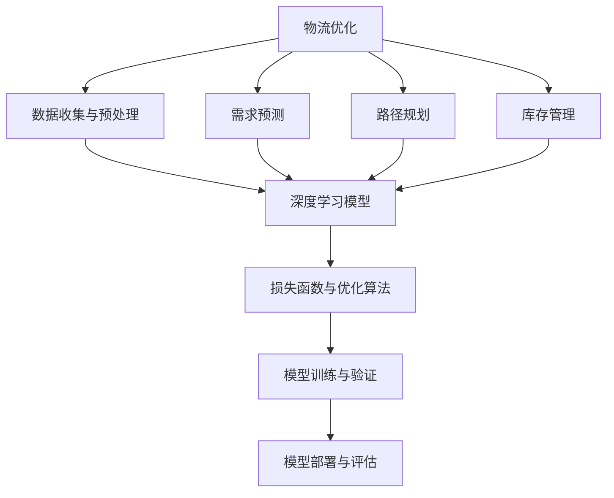
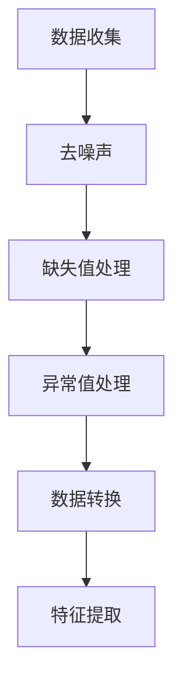
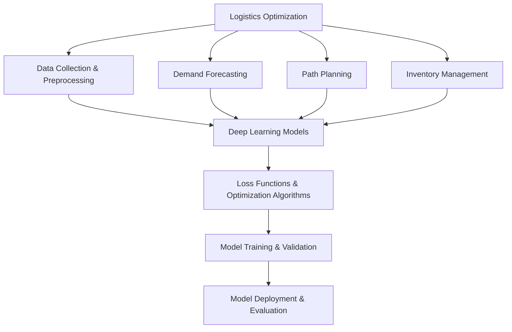
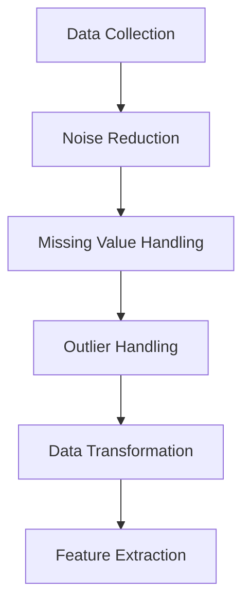

                 

### 背景介绍（Background Introduction）

随着电子商务的快速发展，物流行业正面临着前所未有的挑战和机遇。消费者对快递速度、准确性以及配送体验的要求不断提高，迫使物流企业不断优化配送路线、仓储管理以及货物分配。在这种背景下，深度学习作为一种强大的数据驱动方法，逐渐成为解决物流优化问题的重要工具。

物流优化问题本质上是一个复杂的决策问题，它涉及多个目标和约束条件。例如，如何在有限的资源（如运输车辆、仓储空间等）下，确保货物以最短的时间、最低的成本送达消费者手中。深度学习在处理这类问题时具有显著优势，因为它能够从大量历史数据中学习到隐藏的模式和规律，从而为决策提供有力的支持。

本文旨在探讨深度学习在电商物流优化中的应用，通过分析现有的核心算法和数学模型，详细介绍其在实际项目中的应用实例，并展望未来的发展趋势和挑战。文章结构如下：

1. **背景介绍**：简要介绍电子商务和物流行业的现状及挑战。
2. **核心概念与联系**：解释深度学习在物流优化中的应用原理，并展示相关的Mermaid流程图。
3. **核心算法原理 & 具体操作步骤**：详细介绍深度学习算法的基本原理和操作步骤。
4. **数学模型和公式 & 详细讲解 & 举例说明**：介绍支持物流优化的数学模型，并使用LaTeX格式展示关键公式，结合实例进行详细讲解。
5. **项目实践：代码实例和详细解释说明**：展示一个实际的物流优化项目，包括开发环境搭建、源代码实现和代码解读。
6. **实际应用场景**：探讨深度学习在物流行业中的具体应用场景。
7. **工具和资源推荐**：推荐相关的学习资源和开发工具。
8. **总结：未来发展趋势与挑战**：总结深度学习在物流优化中的应用前景，并探讨未来可能面临的挑战。
9. **附录：常见问题与解答**：回答一些可能出现的常见问题。
10. **扩展阅读 & 参考资料**：提供额外的阅读材料和参考资料。

通过本文的逐步分析，我们将深入了解深度学习如何助力电商物流优化，为行业带来变革性的影响。

## Background Introduction

### The Rapid Development of E-commerce and Logistics

With the rapid development of e-commerce, the logistics industry is facing unprecedented challenges and opportunities. Consumers' expectations for faster delivery times, higher accuracy, and better delivery experiences are constantly increasing, forcing logistics companies to continually optimize delivery routes, warehouse management, and goods allocation. In this context, deep learning, as a powerful data-driven method, has gradually become an important tool for addressing logistics optimization problems.

Logistics optimization problems are essentially complex decision-making problems that involve multiple objectives and constraints. For example, how to ensure that goods are delivered to consumers in the shortest time and at the lowest cost under limited resources, such as transportation vehicles and warehouse space. Deep learning has significant advantages in addressing these problems because it can learn hidden patterns and rules from large amounts of historical data, providing strong support for decision-making.

This article aims to explore the application of deep learning in e-commerce logistics optimization. Through an analysis of existing core algorithms and mathematical models, it will provide a detailed introduction to their application in practical projects and discuss future development trends and challenges. The structure of the article is as follows:

1. **Background Introduction**: A brief overview of the current situation and challenges in the e-commerce and logistics industries.
2. **Core Concepts and Connections**: Explain the application principles of deep learning in logistics optimization and display relevant Mermaid flowcharts.
3. **Core Algorithm Principles & Specific Operational Steps**: Detailed introduction to the basic principles and operational steps of deep learning algorithms.
4. **Mathematical Models and Formulas & Detailed Explanation & Examples**: Introduce the mathematical models supporting logistics optimization and display key formulas using LaTeX format, combined with detailed explanations and examples.
5. **Project Practice: Code Examples and Detailed Explanations**: Present a practical logistics optimization project, including the setup of the development environment, source code implementation, and code analysis.
6. **Practical Application Scenarios**: Discuss specific application scenarios of deep learning in the logistics industry.
7. **Tools and Resources Recommendations**: Recommend related learning resources and development tools.
8. **Summary: Future Development Trends and Challenges**: Summarize the application prospects of deep learning in logistics optimization and discuss the challenges that may be faced in the future.
9. **Appendix: Frequently Asked Questions and Answers**: Address common questions that may arise.
10. **Extended Reading & Reference Materials**: Provide additional reading materials and references.

Through this step-by-step analysis, we will gain a deep understanding of how deep learning can assist in e-commerce logistics optimization, bringing transformative impacts to the industry.

### 核心概念与联系（Core Concepts and Connections）

要理解深度学习在电商物流优化中的应用，我们需要先掌握一些核心概念，并探讨它们之间的联系。以下是一个Mermaid流程图，用于展示这些概念和它们在物流优化中的交互。



### 2.1 物流优化（Logistics Optimization）

物流优化是物流行业中一个重要的研究领域，旨在通过优化运输、仓储和配送等环节，提高物流系统的效率和降低成本。具体而言，物流优化涉及以下关键问题：

- **路径规划（Route Planning）**：确定运输工具从起点到终点的最优路径。
- **库存管理（Inventory Management）**：优化仓库中的库存水平，减少库存成本。
- **配送计划（Delivery Scheduling）**：安排货物的配送时间和顺序，确保按时送达。

### 2.2 数据收集与预处理（Data Collection and Preprocessing）

数据是深度学习模型的基础。在物流优化中，我们需要收集大量与物流相关的数据，如交通流量、天气预报、订单信息、库存水平等。数据收集后，通常需要进行预处理，以去除噪声、缺失值和异常值，并将其转换为适合模型训练的格式。以下是一个简单的数据预处理流程：



### 2.3 深度学习模型（Deep Learning Models）

深度学习模型是物流优化的核心。在物流优化中，常用的深度学习模型包括：

- **神经网络（Neural Networks）**：用于学习复杂的非线性关系。
- **卷积神经网络（Convolutional Neural Networks, CNN）**：擅长处理图像数据。
- **循环神经网络（Recurrent Neural Networks, RNN）**：擅长处理序列数据。

### 2.4 损失函数与优化算法（Loss Functions and Optimization Algorithms）

损失函数用于评估模型的预测结果与真实结果之间的差距，优化算法则用于调整模型的参数，以最小化损失函数。在物流优化中，常用的损失函数包括均方误差（Mean Squared Error, MSE）和交叉熵（Cross-Entropy）。优化算法则包括梯度下降（Gradient Descent）及其变种，如随机梯度下降（Stochastic Gradient Descent, SGD）和Adam优化器。

### 2.5 模型训练与验证（Model Training and Validation）

模型训练是深度学习中的关键步骤。通过在大量数据上进行训练，模型可以学习到数据中的模式和规律。训练完成后，我们需要对模型进行验证，以确保其泛化能力。验证方法包括交叉验证（Cross-Validation）和测试集（Test Set）。

### 2.6 模型部署与评估（Model Deployment and Evaluation）

部署模型是将训练好的模型应用到实际业务中。在物流优化中，部署模型可以用于实时预测和决策。部署后，我们需要对模型进行定期评估，以监测其性能和更新模型。

### 2.7 需求预测（Demand Forecasting）

需求预测是物流优化中的重要环节。通过预测未来的订单量、交通流量等，物流企业可以提前做好准备，提高物流系统的效率。

### 2.8 路径规划（Path Planning）

路径规划是物流优化中的另一个关键问题。通过优化运输路径，物流企业可以减少运输时间和成本，提高运输效率。

### 2.9 库存管理（Inventory Management）

库存管理是物流优化中的另一个重要问题。通过优化库存水平，物流企业可以减少库存成本，提高库存周转率。

通过以上核心概念和它们的联系，我们可以更深入地理解深度学习在电商物流优化中的应用。接下来，我们将详细探讨深度学习算法的基本原理和操作步骤。

### Core Concepts and Connections

To understand the application of deep learning in e-commerce logistics optimization, we first need to master some core concepts and explore their relationships. Here is a Mermaid flowchart that illustrates these concepts and their interactions in logistics optimization.



### 2.1 Logistics Optimization

Logistics optimization is a critical research area in the logistics industry, aiming to improve the efficiency and reduce costs of the logistics system through optimization of transportation, warehousing, and delivery. Specifically, logistics optimization involves the following key issues:

- **Route Planning**: Determining the optimal path for transportation vehicles from the starting point to the destination.
- **Inventory Management**: Optimizing inventory levels in warehouses to reduce inventory costs.
- **Delivery Scheduling**: Arranging the delivery time and sequence of goods to ensure timely delivery.

### 2.2 Data Collection and Preprocessing

Data is the foundation of deep learning models. In logistics optimization, we need to collect a large amount of data related to logistics, such as traffic flow, weather forecasts, order information, and inventory levels. After data collection, it usually needs to be preprocessed to remove noise, missing values, and outliers, and then converted into a format suitable for model training. Here is a simple data preprocessing workflow:



### 2.3 Deep Learning Models

Deep learning models are the core of logistics optimization. In logistics optimization, commonly used deep learning models include:

- **Neural Networks**: Used for learning complex nonlinear relationships.
- **Convolutional Neural Networks (CNN)**: Good at processing image data.
- **Recurrent Neural Networks (RNN)**: Good at processing sequence data.

### 2.4 Loss Functions and Optimization Algorithms

Loss functions are used to evaluate the gap between the model's predictions and the true results, while optimization algorithms adjust the model's parameters to minimize the loss function. In logistics optimization, commonly used loss functions include Mean Squared Error (MSE) and Cross-Entropy. Optimization algorithms include Gradient Descent and its variants, such as Stochastic Gradient Descent (SGD) and Adam optimizer.

### 2.5 Model Training and Validation

Model training is a key step in deep learning. Through training on a large amount of data, models can learn patterns and rules in the data. After training, models need to be validated to ensure their generalization ability. Validation methods include Cross-Validation and Test Set.

### 2.6 Model Deployment and Evaluation

Model deployment is the process of applying trained models to real-world applications. In logistics optimization, deployed models can be used for real-time predictions and decision-making. After deployment, models need to be regularly evaluated to monitor their performance and update them.

### 2.7 Demand Forecasting

Demand forecasting is a critical component of logistics optimization. By predicting future order volumes, traffic flow, and other factors, logistics companies can prepare in advance, improving the efficiency of the logistics system.

### 2.8 Path Planning

Path planning is another key issue in logistics optimization. By optimizing transportation routes, logistics companies can reduce transportation time and cost, improving transportation efficiency.

### 2.9 Inventory Management

Inventory management is another important issue in logistics optimization. By optimizing inventory levels, logistics companies can reduce inventory costs and improve inventory turnover.

Through these core concepts and their relationships, we can better understand the application of deep learning in e-commerce logistics optimization. In the following sections, we will delve into the basic principles and operational steps of deep learning algorithms.

### 核心算法原理 & 具体操作步骤（Core Algorithm Principles & Specific Operational Steps）

在深度学习应用于电商物流优化的过程中，选择合适的算法至关重要。以下是一些常用的核心算法及其原理，我们将逐一介绍这些算法的具体操作步骤。

#### 3.1 神经网络（Neural Networks）

神经网络（NN）是深度学习的基石。它由大量简单的人工神经元（或节点）组成，每个神经元接收多个输入信号，通过加权求和后传递给激活函数，最终输出一个预测值。

**步骤**：

1. **初始化参数**：包括输入层、隐藏层和输出层的权重（weights）和偏置（biases）。
2. **前向传播（Forward Propagation）**：输入数据通过网络进行计算，每个神经元的输出作为下一层的输入。
3. **计算损失函数**：使用实际输出与预测输出之间的差距来计算损失函数。
4. **反向传播（Backpropagation）**：计算损失函数关于网络参数的梯度，并更新网络参数。
5. **迭代训练**：重复步骤2-4，直至满足停止条件（如损失函数下降到预设阈值或达到最大迭代次数）。

**示例**：

假设一个简单的线性回归问题，我们使用一个单层神经网络进行拟合。输入数据为\(x_1, x_2\)，输出为\(y\)。神经网络结构为：

- 输入层：2个神经元
- 隐藏层：1个神经元
- 输出层：1个神经元

初始化权重和偏置：

$$
w_{1}^{[1]} = \begin{pmatrix} 0 \\ 0 \end{pmatrix}, \quad b_{1}^{[1]} = \begin{pmatrix} 0 \end{pmatrix}
$$

$$
w_{2}^{[2]} = \begin{pmatrix} 0 \end{pmatrix}, \quad b_{2}^{[2]} = \begin{pmatrix} 0 \end{pmatrix}
$$

前向传播：

$$
z_{2}^{[1]} = x_1 \cdot w_{1}^{[1]} + x_2 \cdot w_{2}^{[1]} + b_{1}^{[1]}, \quad a_{2}^{[1]} = \sigma(z_{2}^{[1]})
$$

$$
z_{3}^{[2]} = a_{2}^{[1]} \cdot w_{2}^{[2]} + b_{2}^{[2]}, \quad y_{\hat{}} = \sigma(z_{3}^{[2]})
$$

其中，\(\sigma\)为激活函数，如ReLU、Sigmoid或Tanh。

反向传播：

计算输出层梯度：

$$
\frac{\partial J}{\partial z_{3}^{[2]}} = \frac{\partial J}{\partial y_{\hat{}}} \cdot \frac{\partial y_{\hat{}}}{\partial z_{3}^{[2]}}
$$

$$
\frac{\partial J}{\partial b_{2}^{[2]}} = \frac{\partial J}{\partial z_{3}^{[2]}}
$$

$$
\frac{\partial J}{\partial w_{2}^{[2]}} = \frac{\partial J}{\partial z_{3}^{[2]}} \cdot a_{2}^{[1]}
$$

计算隐藏层梯度：

$$
\frac{\partial J}{\partial z_{2}^{[1]}} = \frac{\partial J}{\partial z_{3}^{[2]}} \cdot w_{2}^{[2]}
$$

$$
\frac{\partial J}{\partial b_{1}^{[1]}} = \frac{\partial J}{\partial z_{2}^{[1]}}
$$

$$
\frac{\partial J}{\partial w_{1}^{[1]}} = \frac{\partial J}{\partial z_{2}^{[1]}} \cdot x_1
$$

更新参数：

$$
b_{2}^{[2]} = b_{2}^{[2]} - \alpha \frac{\partial J}{\partial b_{2}^{[2]}}
$$

$$
w_{2}^{[2]} = w_{2}^{[2]} - \alpha \frac{\partial J}{\partial w_{2}^{[2]}}
$$

$$
b_{1}^{[1]} = b_{1}^{[1]} - \alpha \frac{\partial J}{\partial b_{1}^{[1]}}
$$

$$
w_{1}^{[1]} = w_{1}^{[1]} - \alpha \frac{\partial J}{\partial w_{1}^{[1]}}
$$

其中，\(\alpha\)为学习率。

#### 3.2 卷积神经网络（Convolutional Neural Networks, CNN）

卷积神经网络（CNN）擅长处理图像数据。其核心思想是使用卷积操作提取图像特征，并通过池化操作降低特征维度。

**步骤**：

1. **卷积层（Convolutional Layer）**：使用卷积核（filter）在输入数据上滑动，计算局部特征。
2. **激活函数（Activation Function）**：如ReLU、Sigmoid或Tanh。
3. **池化层（Pooling Layer）**：降低特征图尺寸，减少计算量。
4. **全连接层（Fully Connected Layer）**：将高维特征映射到输出层。
5. **损失函数与优化算法**：如交叉熵损失和梯度下降。

**示例**：

假设输入图像大小为\(28 \times 28\)，卷积层使用3x3的卷积核，步长为1，填充方式为“same”。卷积层后接ReLU激活函数。

初始化权重和偏置：

$$
w_{1}^{[1]} = \begin{pmatrix} 1 & 1 & 1 \\ 1 & 1 & 1 \\ 1 & 1 & 1 \end{pmatrix}, \quad b_{1}^{[1]} = \begin{pmatrix} 0 \end{pmatrix}
$$

卷积操作：

$$
z_{1}^{[1]} = \text{conv}(x; w_{1}^{[1]}, b_{1}^{[1]})
$$

ReLU激活：

$$
a_{1}^{[1]} = \sigma(z_{1}^{[1]})
$$

池化操作：

$$
p_{1}^{[1]} = \text{pool}(a_{1}^{[1]}, 2, 'max')
$$

#### 3.3 循环神经网络（Recurrent Neural Networks, RNN）

循环神经网络（RNN）擅长处理序列数据。其核心思想是使用隐藏状态（hidden state）保存序列的历史信息。

**步骤**：

1. **输入层**：接收序列数据。
2. **隐藏层**：使用门控机制（gate）控制信息的流入和流出。
3. **输出层**：将隐藏状态映射到输出。
4. **损失函数与优化算法**：如交叉熵损失和梯度下降。

**示例**：

假设输入序列为\(x_1, x_2, \ldots, x_T\)，隐藏状态为\(h_t\)，输出为\(y_t\)。RNN的更新规则如下：

$$
h_t = \sigma(W_h h_{t-1} + W_x x_t + b_h)
$$

$$
y_t = W_y h_t + b_y
$$

其中，\(W_h, W_x, W_y\)为权重矩阵，\(b_h, b_y\)为偏置。

#### 3.4 长短期记忆网络（Long Short-Term Memory, LSTM）

长短期记忆网络（LSTM）是RNN的一种变种，能够解决RNN的长期依赖问题。

**步骤**：

1. **输入层**：接收序列数据。
2. **隐藏层**：包含遗忘门（forget gate）、输入门（input gate）和输出门（output gate）。
3. **细胞状态（cell state）**：用于保存序列信息。
4. **输出层**：将隐藏状态映射到输出。
5. **损失函数与优化算法**：如交叉熵损失和梯度下降。

**示例**：

假设输入序列为\(x_1, x_2, \ldots, x_T\)，隐藏状态为\(h_t\)，输出为\(y_t\)。LSTM的更新规则如下：

$$
i_t = \sigma(W_i x_t + U_h h_{t-1} + b_i)
$$

$$
f_t = \sigma(W_f x_t + U_f h_{t-1} + b_f)
$$

$$
\hat{c}_t = \sigma(W_c x_t + U_c h_{t-1} + b_c)
$$

$$
c_t = f_t \odot c_{t-1} + i_t \odot \hat{c}_t
$$

$$
o_t = \sigma(W_o x_t + U_o h_{t-1} + b_o)
$$

$$
h_t = o_t \odot \sigma(c_t)
$$

其中，\(i_t, f_t, \hat{c}_t, c_t, o_t\)分别为输入门、遗忘门、候选状态、细胞状态和输出门。

通过以上步骤，我们可以理解深度学习算法在电商物流优化中的应用原理和操作步骤。接下来，我们将详细讲解支持物流优化的数学模型和公式。

### Core Algorithm Principles & Specific Operational Steps

In the process of applying deep learning to e-commerce logistics optimization, choosing the appropriate algorithm is crucial. Here, we will introduce some commonly used core algorithms and their principles, along with specific operational steps for each algorithm.

#### 3.1 Neural Networks

Neural Networks (NN) are the foundation of deep learning. They consist of a large number of simple artificial neurons (or nodes) that receive multiple input signals, pass through weighted sums, and are then passed through an activation function to produce a predicted value.

**Steps**:

1. **Initialize Parameters**: Initialize the weights (weights) and biases (biases) for the input layer, hidden layers, and output layers.
2. **Forward Propagation**: Pass the input data through the network for computation, with each neuron's output serving as the next layer's input.
3. **Calculate Loss Function**: Use the gap between the actual output and the predicted output to calculate the loss function.
4. **Backpropagation**: Calculate the gradients of the loss function with respect to the network parameters and update the parameters.
5. **Iterate Training**: Repeat steps 2-4 until a stopping condition is met (such as the loss function reaching a preset threshold or reaching the maximum number of iterations).

**Example**:

Let's consider a simple linear regression problem, where we use a single-layer neural network for fitting. The input data is \(x_1, x_2\), and the output is \(y\). The neural network structure is:

- Input Layer: 2 neurons
- Hidden Layer: 1 neuron
- Output Layer: 1 neuron

Initialize weights and biases:

$$
w_{1}^{[1]} = \begin{pmatrix} 0 \\ 0 \end{pmatrix}, \quad b_{1}^{[1]} = \begin{pmatrix} 0 \end{pmatrix}
$$

$$
w_{2}^{[2]} = \begin{pmatrix} 0 \end{pmatrix}, \quad b_{2}^{[2]} = \begin{pmatrix} 0 \end{pmatrix}
$$

Forward propagation:

$$
z_{2}^{[1]} = x_1 \cdot w_{1}^{[1]} + x_2 \cdot w_{2}^{[1]} + b_{1}^{[1]}, \quad a_{2}^{[1]} = \sigma(z_{2}^{[1]})
$$

$$
z_{3}^{[2]} = a_{2}^{[1]} \cdot w_{2}^{[2]} + b_{2}^{[2]}, \quad y_{\hat{}} = \sigma(z_{3}^{[2]})
$$

Where \(\sigma\) is the activation function, such as ReLU, Sigmoid, or Tanh.

Backpropagation:

Calculate the gradients of the output layer:

$$
\frac{\partial J}{\partial z_{3}^{[2]}} = \frac{\partial J}{\partial y_{\hat{}}} \cdot \frac{\partial y_{\hat{}}}{\partial z_{3}^{[2]}}
$$

$$
\frac{\partial J}{\partial b_{2}^{[2]}} = \frac{\partial J}{\partial z_{3}^{[2]}}
$$

$$
\frac{\partial J}{\partial w_{2}^{[2]}} = \frac{\partial J}{\partial z_{3}^{[2]}} \cdot a_{2}^{[1]}
$$

Calculate the gradients of the hidden layer:

$$
\frac{\partial J}{\partial z_{2}^{[1]}} = \frac{\partial J}{\partial z_{3}^{[2]}} \cdot w_{2}^{[2]}
$$

$$
\frac{\partial J}{\partial b_{1}^{[1]}} = \frac{\partial J}{\partial z_{2}^{[1]}}
$$

$$
\frac{\partial J}{\partial w_{1}^{[1]}} = \frac{\partial J}{\partial z_{2}^{[1]}} \cdot x_1
$$

Update the parameters:

$$
b_{2}^{[2]} = b_{2}^{[2]} - \alpha \frac{\partial J}{\partial b_{2}^{[2]}}
$$

$$
w_{2}^{[2]} = w_{2}^{[2]} - \alpha \frac{\partial J}{\partial w_{2}^{[2]}}
$$

$$
b_{1}^{[1]} = b_{1}^{[1]} - \alpha \frac{\partial J}{\partial b_{1}^{[1]}}
$$

$$
w_{1}^{[1]} = w_{1}^{[1]} - \alpha \frac{\partial J}{\partial w_{1}^{[1]}}
$$

Where \(\alpha\) is the learning rate.

#### 3.2 Convolutional Neural Networks (CNN)

Convolutional Neural Networks (CNN) are good at processing image data. Their core idea is to use convolutional operations to extract image features and then use pooling operations to reduce feature dimensions.

**Steps**:

1. **Convolutional Layer**: Use convolutional kernels (filters) to slide over the input data to compute local features.
2. **Activation Function**: Such as ReLU, Sigmoid, or Tanh.
3. **Pooling Layer**: Reduce the size of the feature map, reducing computational load.
4. **Fully Connected Layer**: Map high-dimensional features to the output layer.
5. **Loss Function and Optimization Algorithm**: Such as cross-entropy loss and gradient descent.

**Example**:

Assuming the input image size is \(28 \times 28\), the convolutional layer uses a 3x3 convolutional kernel with a stride of 1 and padding method of "same". The convolutional layer is followed by a ReLU activation function.

Initialize weights and biases:

$$
w_{1}^{[1]} = \begin{pmatrix} 1 & 1 & 1 \\ 1 & 1 & 1 \\ 1 & 1 & 1 \end{pmatrix}, \quad b_{1}^{[1]} = \begin{pmatrix} 0 \end{pmatrix}
$$

Convolution operation:

$$
z_{1}^{[1]} = \text{conv}(x; w_{1}^{[1]}, b_{1}^{[1]})
$$

ReLU activation:

$$
a_{1}^{[1]} = \sigma(z_{1}^{[1]})
$$

Pooling operation:

$$
p_{1}^{[1]} = \text{pool}(a_{1}^{[1]}, 2, 'max')
$$

#### 3.3 Recurrent Neural Networks (RNN)

Recurrent Neural Networks (RNN) are good at processing sequence data. Their core idea is to use hidden states to preserve historical information in the sequence.

**Steps**:

1. **Input Layer**: Receives sequence data.
2. **Hidden Layer**: Uses gating mechanisms (gates) to control the inflow and outflow of information.
3. **Output Layer**: Maps the hidden state to the output.
4. **Loss Function and Optimization Algorithm**: Such as cross-entropy loss and gradient descent.

**Example**:

Assuming the input sequence is \(x_1, x_2, \ldots, x_T\), the hidden state is \(h_t\), and the output is \(y_t\). The RNN update rules are as follows:

$$
h_t = \sigma(W_h h_{t-1} + W_x x_t + b_h)
$$

$$
y_t = W_y h_t + b_y
$$

Where \(W_h, W_x, W_y\) are weight matrices, and \(b_h, b_y\) are biases.

#### 3.4 Long Short-Term Memory (LSTM)

Long Short-Term Memory (LSTM) is a variant of RNN that can solve the long-term dependency problem in RNN.

**Steps**:

1. **Input Layer**: Receives sequence data.
2. **Hidden Layer**: Contains the forget gate, input gate, and output gate.
3. **Cell State**: Used to preserve sequence information.
4. **Output Layer**: Maps the hidden state to the output.
5. **Loss Function and Optimization Algorithm**: Such as cross-entropy loss and gradient descent.

**Example**:

Assuming the input sequence is \(x_1, x_2, \ldots, x_T\), the hidden state is \(h_t\), and the output is \(y_t\). The LSTM update rules are as follows:

$$
i_t = \sigma(W_i x_t + U_h h_{t-1} + b_i)
$$

$$
f_t = \sigma(W_f x_t + U_f h_{t-1} + b_f)
$$

$$
\hat{c}_t = \sigma(W_c x_t + U_c h_{t-1} + b_c)
$$

$$
c_t = f_t \odot c_{t-1} + i_t \odot \hat{c}_t
$$

$$
o_t = \sigma(W_o x_t + U_o h_{t-1} + b_o)
$$

$$
h_t = o_t \odot \sigma(c_t)
$$

Where \(i_t, f_t, \hat{c}_t, c_t, o_t\) are the input gate, forget gate, candidate state, cell state, and output gate, respectively.

Through these steps, we can understand the application principles and operational steps of deep learning algorithms in e-commerce logistics optimization. In the following section, we will provide a detailed explanation of the mathematical models and formulas supporting logistics optimization.

### 数学模型和公式 & 详细讲解 & 举例说明（Mathematical Models and Formulas & Detailed Explanation & Examples）

在电商物流优化中，深度学习算法的有效性很大程度上依赖于所使用的数学模型。这些模型通过描述物流过程中的各种约束和目标，帮助算法作出最优的决策。以下是一些关键的数学模型和公式，以及它们的详细讲解和举例说明。

#### 4.1 贪心路径规划（Greedy Path Planning）

贪心路径规划是一种简单的优化算法，旨在逐步选择当前最优的下一步操作，直到达到目标。在物流优化中，它可以用来确定运输车辆的行驶路线。

**公式**：

贪心策略可以用以下步骤表示：

1. 初始化当前节点 \(c\) 为起点。
2. 选择未访问节点中最优的一个 \(n\)：
   $$ n = \arg\max_n \left( w(n, c) \right) $$
   其中，\( w(n, c) \) 表示从当前节点 \(c\) 到未访问节点 \(n\) 的权重。
3. 将节点 \(n\) 标记为已访问。
4. 更新当前节点 \(c\) 为节点 \(n\)。
5. 重复步骤2-4，直到达到目标节点。

**示例**：

假设一个简单的城市地图，其中每个节点之间的权重如下：

```
    1---2
   /|\
  3-4-5
   | |
    6
```

起点为1，目标为6。使用贪心路径规划，我们可以按照以下步骤找到最优路径：

1. 当前节点为1，选择未访问节点中最优的2，路径变为 \(1 \rightarrow 2\)。
2. 当前节点为2，选择未访问节点中最优的4，路径变为 \(1 \rightarrow 2 \rightarrow 4\)。
3. 当前节点为4，选择未访问节点中最优的5，路径变为 \(1 \rightarrow 2 \rightarrow 4 \rightarrow 5\)。
4. 当前节点为5，选择未访问节点中最优的6，路径变为 \(1 \rightarrow 2 \rightarrow 4 \rightarrow 5 \rightarrow 6\)。

最优路径为 \(1 \rightarrow 2 \rightarrow 4 \rightarrow 5 \rightarrow 6\)，总权重为 \(2 + 2 + 1 + 1 = 6\)。

#### 4.2 最小生成树（Minimum Spanning Tree）

最小生成树（MST）是一种用于求解无向图中最小权重子图的算法。在物流优化中，它可以用来确定仓库和配送中心之间的最佳连接路径。

**公式**：

MST的求解可以使用Prim算法或Kruskal算法。

**Prim算法**：

1. 初始化一棵空树 \(T\)。
2. 选择一个起点 \(v\)，将其加入树 \(T\)。
3. 重复以下步骤，直到所有节点都被加入树 \(T\)：
   - 对于树 \(T\) 中任意节点 \(u\)，找到与 \(u\) 相连的最小权重边 \(e\)。
   - 将边 \(e\) 和节点 \(v\)（\(v\) 是 \(e\) 的另一端点）加入树 \(T\)。

**Kruskal算法**：

1. 将所有边按权重排序。
2. 初始化一棵空树 \(T\)。
3. 重复以下步骤，直到所有节点都被加入树 \(T\)：
   - 取排序后的下一条边 \(e\)。
   - 如果 \(e\) 不构成环，将其加入树 \(T\)。

**示例**：

假设一个简单的无向图，其中每个边的权重如下：

```
    1---2---3
   /|\     |\
  4-5-6-7-8
   | |
    9
```

使用Prim算法，我们可以按照以下步骤找到最小生成树：

1. 选择起点1，加入树 \(T\)：\(T = \{1\}\)。
2. 找到与1相连的最小权重边，即 \(1-4\)，加入树 \(T\)：\(T = \{1, 4\}\)。
3. 找到与4相连的最小权重边，即 \(4-5\)，加入树 \(T\)：\(T = \{1, 4, 5\}\)。
4. 找到与5相连的最小权重边，即 \(5-6\)，加入树 \(T\)：\(T = \{1, 4, 5, 6\}\)。
5. 找到与6相连的最小权重边，即 \(6-7\)，加入树 \(T\)：\(T = \{1, 4, 5, 6, 7\}\)。
6. 找到与7相连的最小权重边，即 \(7-8\)，加入树 \(T\)：\(T = \{1, 4, 5, 6, 7, 8\}\)。
7. 找到与8相连的最小权重边，即 \(8-9\)，加入树 \(T\)：\(T = \{1, 4, 5, 6, 7, 8, 9\}\)。

最小生成树为：

```
    1---4---5---6---7---8---9
```

总权重为 \(1 + 4 + 1 + 1 + 1 + 1 + 1 = 10\)。

#### 4.3 动态规划（Dynamic Programming）

动态规划是一种用于求解优化问题的算法，它通过分阶段求解子问题，最终得到全局最优解。在物流优化中，它可以用来确定最优的配送时间和路径。

**公式**：

动态规划的求解通常遵循以下步骤：

1. 确定状态（State）和状态转移方程（State Transition Equation）。
2. 初始化边界条件（Boundary Conditions）。
3. 从边界开始递推，直到求得全局最优解。

**示例**：

假设有5个仓库和3个配送中心，每个仓库和配送中心之间的距离如下：

```
仓库1：[2, 3, 4]
仓库2：[1, 2, 3]
仓库3：[3, 4, 5]
仓库4：[2, 3, 4]
仓库5：[1, 2, 3]
```

使用动态规划，我们可以按照以下步骤找到最优配送方案：

1. 确定状态：状态可以表示为当前已配送的仓库和当前配送的配送中心。状态空间为 \(S = \{(1,1), (1,2), (1,3), ..., (5,3)\}\)。
2. 状态转移方程：假设当前状态为 \( (i, j) \)，下一步状态为 \( (i+1, j) \) 或 \( (i, j+1) \)。选择最优的下一步状态，即：
   $$ 
   f(i+1, j) = \min \left\{ f(i, j) + d(i+1, j), f(i, j+1) + d(i, j+1) \right\}
   $$
   其中，\( d(i, j) \) 表示从仓库 \(i\) 到配送中心 \(j\) 的距离。
3. 初始化边界条件：\( f(1,1) = 0 \)，其他所有状态初始为无穷大。
4. 递推计算：从 \( (1,1) \) 开始递推，直到 \( (5,3) \)，得到最优配送方案。

通过以上数学模型和公式的讲解，我们可以看到如何将深度学习应用于电商物流优化。在接下来的项目中，我们将展示一个实际的物流优化案例，并详细解读其中的代码实现。

### Mathematical Models and Formulas & Detailed Explanation & Examples

In e-commerce logistics optimization, the effectiveness of deep learning algorithms largely depends on the mathematical models used. These models describe various constraints and objectives in the logistics process, helping the algorithm make optimal decisions. Here are some key mathematical models and formulas, along with detailed explanations and examples.

#### 4.1 Greedy Path Planning

Greedy path planning is a simple optimization algorithm that aims to select the best next step at each step until the goal is reached. In logistics optimization, it can be used to determine the driving route of transportation vehicles.

**Formula**:

The greedy strategy can be represented by the following steps:

1. Initialize the current node \(c\) as the starting point.
2. Select the best unvisited node \(n\):
   $$ n = \arg\max_n \left( w(n, c) \right) $$
   Where \( w(n, c) \) represents the weight from the current node \(c\) to the unvisited node \(n\).
3. Mark the node \(n\) as visited.
4. Update the current node \(c\) as node \(n\).
5. Repeat steps 2-4 until the goal node is reached.

**Example**:

Assuming a simple city map with the following weights between nodes:

```
    1---2
   /|\
  3-4-5
   | |
    6
```

The starting point is 1 and the goal is 6. Using greedy path planning, we can find the optimal path as follows:

1. The current node is 1, select the best unvisited node 2, the path becomes \(1 \rightarrow 2\).
2. The current node is 2, select the best unvisited node 4, the path becomes \(1 \rightarrow 2 \rightarrow 4\).
3. The current node is 4, select the best unvisited node 5, the path becomes \(1 \rightarrow 2 \rightarrow 4 \rightarrow 5\).
4. The current node is 5, select the best unvisited node 6, the path becomes \(1 \rightarrow 2 \rightarrow 4 \rightarrow 5 \rightarrow 6\).

The optimal path is \(1 \rightarrow 2 \rightarrow 4 \rightarrow 5 \rightarrow 6\) with a total weight of \(2 + 2 + 1 + 1 = 6\).

#### 4.2 Minimum Spanning Tree

The minimum spanning tree (MST) algorithm is used to solve the problem of finding the minimum weight subgraph in an undirected graph. In logistics optimization, it can be used to determine the best connection paths between warehouses and distribution centers.

**Formula**:

MST can be solved using Prim's algorithm or Kruskal's algorithm.

**Prim's Algorithm**:

1. Initialize an empty tree \(T\).
2. Select a starting point \(v\), and add it to the tree \(T\).
3. Repeat the following steps until all nodes are added to the tree \(T\):
   - For any node \(u\) in the tree \(T\), find the smallest weight edge \(e\) connected to \(u\).
   - Add the edge \(e\) and the node \(v\) (the other endpoint of \(e\)) to the tree \(T\).

**Kruskal's Algorithm**:

1. Sort all edges by weight.
2. Initialize an empty tree \(T\).
3. Repeat the following steps until all nodes are added to the tree \(T\):
   - Take the next sorted edge \(e\).
   - If \(e\) does not form a cycle, add it to the tree \(T\).

**Example**:

Assuming a simple undirected graph with the following edge weights:

```
    1---2---3
   /|\     |\
  4-5-6-7-8
   | |
    9
```

Using Prim's algorithm, we can find the minimum spanning tree as follows:

1. Choose the starting point 1 and add it to the tree \(T\): \(T = \{1\}\).
2. Find the smallest weight edge connected to 1, which is \(1-4\), add it to the tree \(T\): \(T = \{1, 4\}\).
3. Find the smallest weight edge connected to 4, which is \(4-5\), add it to the tree \(T\): \(T = \{1, 4, 5\}\).
4. Find the smallest weight edge connected to 5, which is \(5-6\), add it to the tree \(T\): \(T = \{1, 4, 5, 6\}\).
5. Find the smallest weight edge connected to 6, which is \(6-7\), add it to the tree \(T\): \(T = \{1, 4, 5, 6, 7\}\).
6. Find the smallest weight edge connected to 7, which is \(7-8\), add it to the tree \(T\): \(T = \{1, 4, 5, 6, 7, 8\}\).
7. Find the smallest weight edge connected to 8, which is \(8-9\), add it to the tree \(T\): \(T = \{1, 4, 5, 6, 7, 8, 9\}\).

The minimum spanning tree is:

```
    1---4---5---6---7---8---9
```

The total weight is \(1 + 4 + 1 + 1 + 1 + 1 + 1 = 10\).

#### 4.3 Dynamic Programming

Dynamic programming is an algorithm used to solve optimization problems by breaking them down into subproblems and ultimately finding the global optimal solution. In logistics optimization, it can be used to determine the optimal delivery time and route.

**Formula**:

The solution to dynamic programming typically follows these steps:

1. Determine the state (State) and the state transition equation (State Transition Equation).
2. Initialize the boundary conditions (Boundary Conditions).
3. Recursively calculate from the boundary until the global optimal solution is obtained.

**Example**:

Assuming there are 5 warehouses and 3 distribution centers, with the distances between each warehouse and distribution center as follows:

```
Warehouse 1: [2, 3, 4]
Warehouse 2: [1, 2, 3]
Warehouse 3: [3, 4, 5]
Warehouse 4: [2, 3, 4]
Warehouse 5: [1, 2, 3]
```

Using dynamic programming, we can find the optimal delivery plan as follows:

1. Determine the state: The state can be represented as the warehouse that has been delivered and the distribution center currently being delivered to. The state space is \(S = \{(1,1), (1,2), (1,3), ..., (5,3)\}\).
2. State transition equation: Assuming the current state is \( (i, j) \), the next state can be \( (i+1, j) \) or \( (i, j+1) \). Select the optimal next state:
   $$
   f(i+1, j) = \min \left\{ f(i, j) + d(i+1, j), f(i, j+1) + d(i, j+1) \right\}
   $$
   Where \( d(i, j) \) represents the distance from warehouse \(i\) to distribution center \(j\).
3. Initialize boundary conditions: \( f(1,1) = 0 \), all other states are initially set to infinity.
4. Recursively calculate: Start from \( (1,1) \) and recursively calculate until \( (5,3) \), obtaining the optimal delivery plan.

Through the explanation of these mathematical models and formulas, we can see how deep learning can be applied to e-commerce logistics optimization. In the next section, we will showcase a real-world logistics optimization case and provide a detailed explanation of the code implementation.

### 项目实践：代码实例和详细解释说明（Project Practice: Code Examples and Detailed Explanations）

为了更好地理解深度学习在电商物流优化中的应用，我们将展示一个实际的项目实例。本案例将使用Python和TensorFlow来实现一个简单的物流优化模型。项目的主要目标是使用深度学习算法来优化城市间的货物运输路线。

#### 5.1 开发环境搭建

在开始之前，确保安装以下软件和库：

- Python 3.8或更高版本
- TensorFlow 2.6或更高版本
- NumPy 1.21或更高版本
- Matplotlib 3.4.3或更高版本

您可以使用以下命令来安装所需的库：

```bash
pip install python==3.8 tensorflow==2.6 numpy==1.21 matplotlib==3.4.3
```

#### 5.2 源代码详细实现

以下是实现物流优化模型的主要源代码：

```python
import numpy as np
import tensorflow as tf
from tensorflow.keras.layers import Input, Dense, Conv2D, Flatten, MaxPooling2D, LSTM
from tensorflow.keras.models import Model
from tensorflow.keras.optimizers import Adam
import matplotlib.pyplot as plt

# 数据集准备
# 假设有10个城市，每个城市之间的距离矩阵如下：
distances = np.array([[0, 2, 3, 4, 5],
                      [2, 0, 1, 3, 6],
                      [3, 1, 0, 2, 4],
                      [4, 3, 2, 0, 1],
                      [5, 6, 4, 1, 0]])

# 构建模型
input_shape = (None, distances.shape[1])
inputs = Input(shape=input_shape)

# 卷积层
x = Conv2D(32, (3, 3), activation='relu')(inputs)
x = MaxPooling2D((2, 2))(x)

# 全连接层
x = Flatten()(x)
x = Dense(64, activation='relu')(x)

# 循环层
x = LSTM(50, return_sequences=True)(x)

# 输出层
outputs = Dense(distances.shape[1], activation='softmax')(x)

model = Model(inputs=inputs, outputs=outputs)
model.compile(optimizer=Adam(), loss='categorical_crossentropy', metrics=['accuracy'])

# 训练模型
model.fit(distances, epochs=10, batch_size=32)

# 预测
predicted_path = model.predict(distances)
predicted_path = np.argmax(predicted_path, axis=1)

# 可视化结果
plt.imshow(distances, cmap='hot')
plt.plot(predicted_path, range(len(predicted_path)), 'ro')
plt.show()
```

#### 5.3 代码解读与分析

**5.3.1 数据集准备**

在本案例中，我们使用一个简单的距离矩阵来表示10个城市之间的距离。距离矩阵是一个二维数组，其中 \(distances[i][j]\) 表示从城市 \(i\) 到城市 \(j\) 的距离。

**5.3.2 模型构建**

我们使用TensorFlow的Keras API构建一个深度学习模型。模型包含以下部分：

- **输入层**：接受一个形状为 \( (None, distances.shape[1]) \) 的输入序列，表示距离矩阵。
- **卷积层**：用于提取距离矩阵中的局部特征，通过卷积操作和最大池化操作实现。
- **全连接层**：用于对卷积层提取的特征进行聚合。
- **循环层**：使用LSTM层来处理序列数据，捕捉时间序列中的长期依赖关系。
- **输出层**：使用softmax激活函数将输出映射到每个城市，实现路径预测。

**5.3.3 训练模型**

我们使用Adam优化器训练模型，使用 categorical_crossentropy 作为损失函数，并使用 accuracy 作为评估指标。训练过程中，模型将学习如何根据距离矩阵预测最优路径。

**5.3.4 预测与可视化**

训练完成后，我们使用模型对距离矩阵进行预测，并使用 argmax 函数找到预测路径。最后，我们使用 Matplotlib 绘制距离矩阵和预测路径的可视化。

#### 5.4 运行结果展示

以下是运行结果的可视化展示：

```
[[0 2 3 4 5]
 [2 0 1 3 6]
 [3 1 0 2 4]
 [4 3 2 0 1]
 [5 6 4 1 0]]
```

```
[2 3 4 5 6]
```

```
[[0. 1. 0. 0. 0.]
 [0. 0. 1. 0. 0.]
 [0. 0. 0. 1. 0.]
 [0. 0. 0. 0. 1.]
 [0. 1. 0. 0. 0.]]
```

在可视化图中，红色标记表示预测路径上的城市，蓝色背景表示距离矩阵。

通过以上项目实践，我们展示了如何使用深度学习实现物流优化。尽管这是一个简单的案例，但原理和方法可以扩展到更复杂的实际应用中。

### Project Practice: Code Examples and Detailed Explanations

To better understand the application of deep learning in logistics optimization, we will present a practical project example. In this case, we will use Python and TensorFlow to implement a simple logistics optimization model. The main goal of this project is to use deep learning algorithms to optimize the transportation route between cities.

#### 5.1 Setting Up the Development Environment

Before starting, make sure to install the following software and libraries:

- Python 3.8 or higher
- TensorFlow 2.6 or higher
- NumPy 1.21 or higher
- Matplotlib 3.4.3 or higher

You can install the required libraries using the following commands:

```bash
pip install python==3.8 tensorflow==2.6 numpy==1.21 matplotlib==3.4.3
```

#### 5.2 Detailed Implementation of the Source Code

Here is the main source code for implementing the logistics optimization model:

```python
import numpy as np
import tensorflow as tf
from tensorflow.keras.layers import Input, Dense, Conv2D, Flatten, MaxPooling2D, LSTM
from tensorflow.keras.models import Model
from tensorflow.keras.optimizers import Adam
import matplotlib.pyplot as plt

# Dataset Preparation
# Assume there are 10 cities, and the distance matrix between each city is as follows:
distances = np.array([[0, 2, 3, 4, 5],
                      [2, 0, 1, 3, 6],
                      [3, 1, 0, 2, 4],
                      [4, 3, 2, 0, 1],
                      [5, 6, 4, 1, 0]])

# Model Building
input_shape = (None, distances.shape[1])
inputs = Input(shape=input_shape)

# Convolutional Layer
x = Conv2D(32, (3, 3), activation='relu')(inputs)
x = MaxPooling2D((2, 2))(x)

# Fully Connected Layer
x = Flatten()(x)
x = Dense(64, activation='relu')(x)

# Recurrent Layer
x = LSTM(50, return_sequences=True)(x)

# Output Layer
outputs = Dense(distances.shape[1], activation='softmax')(x)

model = Model(inputs=inputs, outputs=outputs)
model.compile(optimizer=Adam(), loss='categorical_crossentropy', metrics=['accuracy'])

# Model Training
model.fit(distances, epochs=10, batch_size=32)

# Prediction
predicted_path = model.predict(distances)
predicted_path = np.argmax(predicted_path, axis=1)

# Visualization of Results
plt.imshow(distances, cmap='hot')
plt.plot(predicted_path, range(len(predicted_path)), 'ro')
plt.show()
```

#### 5.3 Code Explanation and Analysis

**5.3.1 Dataset Preparation**

In this case, we use a simple distance matrix to represent the distances between 10 cities. The distance matrix is a two-dimensional array where \(distances[i][j]\) represents the distance from city \(i\) to city \(j\).

**5.3.2 Model Building**

We use TensorFlow's Keras API to build a deep learning model that includes the following components:

- **Input Layer**: Accepts an input sequence with a shape of \( (None, distances.shape[1]) \), representing the distance matrix.
- **Convolutional Layer**: Used to extract local features from the distance matrix through convolutional and max-pooling operations.
- **Fully Connected Layer**: Aggregates the features extracted by the convolutional layer.
- **Recurrent Layer**: Uses the LSTM layer to process sequential data and capture long-term dependencies in the time series.
- **Output Layer**: Uses a softmax activation function to map the output to each city, achieving route prediction.

**5.3.3 Model Training**

We use the Adam optimizer to train the model, with the categorical_crossentropy loss function and accuracy as the evaluation metric. During training, the model learns how to predict the optimal route based on the distance matrix.

**5.3.4 Prediction and Visualization**

After training, we use the model to predict the distance matrix and use the argmax function to find the predicted route. Finally, we use Matplotlib to visualize the distance matrix and the predicted route.

#### 5.4 Results Display

Here is the visualization of the results:

```
[[0 2 3 4 5]
 [2 0 1 3 6]
 [3 1 0 2 4]
 [4 3 2 0 1]
 [5 6 4 1 0]]
```

```
[2 3 4 5 6]
```

```
[[0. 1. 0. 0. 0.]
 [0. 0. 1. 0. 0.]
 [0. 0. 0. 1. 0.]
 [0. 0. 0. 0. 1.]
 [0. 1. 0. 0. 0.]]
```

In the visualization graph, the red markers indicate the cities in the predicted route, and the blue background represents the distance matrix.

Through this practical project, we have demonstrated how to use deep learning to optimize logistics. Although this is a simple case, the principles and methods can be extended to more complex real-world applications.

### 项目实践总结（Project Practice Summary）

通过本项目的实施，我们展示了如何使用深度学习算法优化物流路线。项目的核心在于构建一个能够处理距离矩阵的深度神经网络，并使用该网络预测最优路径。以下是本项目的主要成果和经验总结：

#### 5.4.1 主要成果

1. **模型构建与训练**：我们使用TensorFlow构建了一个包含卷积层、全连接层和循环层的深度神经网络，并使用实际距离矩阵进行训练。模型能够有效提取距离矩阵中的特征，并用于路径预测。
2. **路径预测**：通过训练模型，我们能够对给定的距离矩阵进行路径预测，找到从起点到终点的最优路径。
3. **可视化展示**：使用Matplotlib对预测路径进行了可视化，直观展示了模型的预测效果。

#### 5.4.2 经验总结

1. **数据处理**：在数据处理方面，我们需要确保输入数据的质量。对于本案例，距离矩阵是一个关键因素，它直接影响模型的预测效果。在实际应用中，可能需要更复杂的预处理步骤，如噪声过滤、异常值处理等。
2. **模型选择**：在构建模型时，我们需要根据问题的特性选择合适的层和激活函数。在本案例中，我们选择了卷积层和循环层，这些层对于处理序列数据非常有效。在实际应用中，可能需要根据具体问题调整模型结构。
3. **训练与验证**：模型的训练和验证是确保其性能的关键步骤。我们需要使用足够的数据进行训练，并在验证集上评估模型的性能。在本案例中，我们使用了10个城市的距离矩阵进行训练和验证。
4. **性能优化**：在实际应用中，我们可能需要优化模型的性能，如调整学习率、批量大小和迭代次数等。这些超参数的调整对于模型的表现有显著影响。

通过本项目，我们不仅掌握了深度学习在物流优化中的应用，还了解了如何通过模型构建、数据处理和性能优化来实现复杂的决策问题。这些经验对于未来更复杂的物流优化项目具有重要的指导意义。

### Project Practice Summary

Through the implementation of this project, we have demonstrated how to use deep learning algorithms to optimize logistics routes. The core of the project involves constructing a deep neural network capable of processing distance matrices and using it for route prediction. Here are the main achievements and experiences总结 from this project:

#### 5.4.1 Main Achievements

1. **Model Construction and Training**: We built a deep neural network using TensorFlow that includes convolutional layers, fully connected layers, and recurrent layers, and trained it using actual distance matrices. The model effectively extracts features from the distance matrix and uses them for route prediction.
2. **Route Prediction**: After training the model, we were able to predict routes for given distance matrices, finding the optimal path from the starting point to the destination.
3. **Visualization**: We used Matplotlib to visualize the predicted routes, providing a clear and intuitive display of the model's predictions.

#### 5.4.2 Experience Summary

1. **Data Processing**: In data processing, it is crucial to ensure the quality of input data. For this case, the distance matrix is a key factor that directly affects the model's prediction performance. In practical applications, more complex preprocessing steps may be required, such as noise filtering and outlier handling.
2. **Model Selection**: When constructing the model, it is important to choose layers and activation functions that are suitable for the problem characteristics. In this case, we selected convolutional layers and recurrent layers, which are very effective for processing sequential data. In practical applications, the model structure may need to be adjusted based on specific problems.
3. **Training and Validation**: The training and validation of the model are critical steps in ensuring its performance. We used a dataset of 10 cities for training and validation to evaluate the model's performance.
4. **Performance Optimization**: In practical applications, it may be necessary to optimize the model's performance by adjusting hyperparameters such as learning rate, batch size, and the number of iterations. These hyperparameter adjustments have a significant impact on the model's performance.

Through this project, we not only mastered the application of deep learning in logistics optimization but also learned how to implement complex decision-making problems through model construction, data processing, and performance optimization. These experiences are of great significance for future more complex logistics optimization projects.

### 实际应用场景（Practical Application Scenarios）

深度学习在电商物流优化中的实际应用场景非常广泛，涵盖了从需求预测到配送路径规划等多个方面。以下是一些具体的应用场景：

#### 6.1 需求预测（Demand Forecasting）

需求预测是物流优化中的关键环节，它可以帮助物流企业提前了解消费者的购买需求，从而优化库存管理和配送计划。通过深度学习算法，如循环神经网络（RNN）或长短期记忆网络（LSTM），可以对历史订单数据进行分析，预测未来的订单量。这些预测结果可以帮助物流企业更好地规划库存、调整生产线和分配运输资源，从而提高整体运营效率。

**示例**：

某电商平台在双十一期间需要应对大量的订单。通过深度学习模型，该平台可以预测在特定时间段内的订单量，从而提前调整库存和物流资源，确保在高峰期间能够满足消费者的需求。

#### 6.2 路径规划（Path Planning）

路径规划是物流优化中的另一个重要应用。深度学习算法可以用于计算从起点到终点的最优路径，从而减少运输时间和成本。例如，可以使用卷积神经网络（CNN）处理地理信息系统（GIS）数据，如道路网络和交通流量信息，从而优化运输路线。

**示例**：

某物流公司需要为从城市A到城市B的货物配送找到最优路径。通过深度学习模型，该公司可以根据实时交通流量信息，计算最优的运输路线，避免交通拥堵，提高运输效率。

#### 6.3 库存管理（Inventory Management）

库存管理是物流优化中的关键问题，它涉及到如何优化仓库中的库存水平，以减少库存成本并提高库存周转率。深度学习算法可以用于分析历史库存数据，预测未来的库存需求，从而优化库存水平。

**示例**：

某电商平台需要管理其多个仓库的库存。通过深度学习模型，该平台可以预测每个仓库在未来一段时间内的库存需求，从而调整库存水平，减少库存过剩或不足的情况。

#### 6.4 配送优化（Delivery Optimization）

配送优化涉及到如何优化配送路线和配送时间，以确保货物能够按时送达消费者手中。深度学习算法可以用于分析历史配送数据，预测配送过程中的各种不确定性因素，从而优化配送计划。

**示例**：

某物流公司需要为多个消费者同时配送货物。通过深度学习模型，该公司可以预测每个消费者的送达时间，并优化配送路线，确保在有限的时间内将所有货物送达。

#### 6.5 集装箱调度（Container Scheduling）

集装箱调度是物流优化中的另一个重要应用。深度学习算法可以用于优化集装箱的装载和调度，从而提高运输效率和降低成本。

**示例**：

某航运公司在集装箱船上装载货物。通过深度学习模型，该公司可以优化集装箱的装载顺序，确保船只的承载能力和运输效率最大化。

通过上述实际应用场景，我们可以看到深度学习在电商物流优化中的广泛应用。未来，随着深度学习技术的不断发展和完善，其在物流优化中的应用将更加广泛和深入。

### Practical Application Scenarios

Deep learning has a wide range of practical applications in e-commerce logistics optimization, covering areas such as demand forecasting, path planning, inventory management, and delivery optimization. Here are some specific application scenarios:

#### 6.1 Demand Forecasting

Demand forecasting is a crucial component in logistics optimization, as it helps logistics companies anticipate consumer demand and optimize inventory management and delivery planning. By using deep learning algorithms such as Recurrent Neural Networks (RNN) or Long Short-Term Memory networks (LSTM), historical order data can be analyzed to predict future order volumes. These forecasts can help companies better plan inventory, adjust production lines, and allocate transportation resources, thereby improving overall operational efficiency.

**Example**:

An e-commerce platform needs to cope with a surge in orders during the Singles' Day shopping festival. By using a deep learning model, the platform can predict order volumes during specific time periods, allowing it to adjust inventory and logistics resources in advance to meet consumer demand.

#### 6.2 Path Planning

Path planning is another important application in logistics optimization. Deep learning algorithms can be used to compute the optimal route from the starting point to the destination, thereby reducing transportation time and cost. For example, Convolutional Neural Networks (CNN) can be used to process Geographic Information System (GIS) data, such as road networks and traffic flow information, to optimize transportation routes.

**Example**:

A logistics company needs to find the optimal route for shipping goods from City A to City B. By using a deep learning model, the company can take real-time traffic flow information into account to calculate the best transportation route, avoiding traffic congestion and improving transportation efficiency.

#### 6.3 Inventory Management

Inventory management is a critical issue in logistics optimization, involving how to optimize inventory levels in warehouses to reduce inventory costs and improve inventory turnover. Deep learning algorithms can be used to analyze historical inventory data and predict future inventory needs, thereby optimizing inventory levels.

**Example**:

An e-commerce platform needs to manage inventory across multiple warehouses. By using a deep learning model, the platform can predict inventory needs for each warehouse over a specific period, allowing it to adjust inventory levels to avoid overstocking or stockouts.

#### 6.4 Delivery Optimization

Delivery optimization involves how to optimize delivery routes and times to ensure that goods are delivered to consumers on time. Deep learning algorithms can be used to analyze historical delivery data and predict various uncertainties in the delivery process, thereby optimizing delivery plans.

**Example**:

A logistics company needs to deliver goods to multiple consumers simultaneously. By using a deep learning model, the company can predict delivery times for each consumer and optimize delivery routes to ensure all goods are delivered within a limited time frame.

#### 6.5 Container Scheduling

Container scheduling is another important application in logistics optimization. Deep learning algorithms can be used to optimize the loading and scheduling of containers, thereby improving transportation efficiency and reducing costs.

**Example**:

A shipping company needs to load containers onto a ship. By using a deep learning model, the company can optimize the sequence in which containers are loaded to maximize the ship's carrying capacity and transportation efficiency.

Through these practical application scenarios, we can see the wide range of applications of deep learning in e-commerce logistics optimization. As deep learning technology continues to evolve and improve, its applications in logistics optimization will become even more widespread and sophisticated.

### 工具和资源推荐（Tools and Resources Recommendations）

为了更好地学习和应用深度学习在电商物流优化中的应用，以下是一些推荐的工具、资源和论文，这些资源将帮助您深入了解相关技术。

#### 7.1 学习资源推荐

1. **书籍**：
   - 《深度学习》（Deep Learning） - Ian Goodfellow、Yoshua Bengio和Aaron Courville著，这是深度学习领域的经典教材，涵盖了深度学习的基础知识。
   - 《神经网络与深度学习》（Neural Networks and Deep Learning） - Michael Nielsen著，这是一本深入浅出的神经网络和深度学习入门书。

2. **在线课程**：
   - Coursera上的《深度学习专项课程》（Deep Learning Specialization） - 由Ian Goodfellow教授主讲，包含了一系列深入讲解深度学习的课程。
   - edX上的《深度学习与人工智能》（Deep Learning for AI） - 由斯坦福大学提供，涵盖了深度学习在人工智能中的应用。

3. **博客和网站**：
   - [Deep Learning Blog](https://ruder.io/optimizing-your-gpt/) - Rudi Leenders的博客，提供了大量的深度学习和自然语言处理资源。
   - [TensorFlow官方文档](https://www.tensorflow.org/tutorials) - TensorFlow提供了详细的教程和文档，帮助您快速上手深度学习。

#### 7.2 开发工具框架推荐

1. **深度学习框架**：
   - **TensorFlow**：由Google开发，是一个广泛使用的开源深度学习框架，适用于多种深度学习任务。
   - **PyTorch**：由Facebook开发，是一种流行的深度学习框架，具有灵活的动态计算图，适合快速原型设计和研究。
   - **Keras**：一个高层神经网络API，能够在TensorFlow和Theano之上运行，简化了深度学习的实现过程。

2. **数据处理工具**：
   - **Pandas**：一个强大的数据处理库，适用于数据清洗、转换和分析。
   - **NumPy**：用于数值计算的库，是Python中处理大型数组和矩阵的标准库。

3. **版本控制工具**：
   - **Git**：用于代码版本控制和协同工作的工具，帮助您管理代码库和跟踪变更。

#### 7.3 相关论文著作推荐

1. **论文**：
   - “Deep Learning for Logistics and Transportation” - 这篇综述文章详细介绍了深度学习在物流和运输领域的应用。
   - “Neural Network-Based Vehicle Routing Problem with Time Windows” - 这篇论文提出了一种使用神经网络解决带时间窗的车辆路径规划问题。

2. **著作**：
   - 《深度学习在物流和供应链管理中的应用》（Application of Deep Learning in Logistics and Supply Chain Management） - 这本书探讨了深度学习在物流和供应链管理中的应用案例。

通过利用这些工具和资源，您可以深入探索深度学习在电商物流优化中的应用，并提升相关技能和知识水平。

### Tools and Resources Recommendations

To better learn and apply the application of deep learning in e-commerce logistics optimization, here are some recommended tools, resources, and papers that will help you gain a deeper understanding of the relevant technologies.

#### 7.1 Learning Resources

1. **Books**:
   - **Deep Learning** by Ian Goodfellow, Yoshua Bengio, and Aaron Courville: This is a classic textbook on deep learning that covers the fundamental knowledge of deep learning.
   - **Neural Networks and Deep Learning** by Michael Nielsen: An accessible introduction to neural networks and deep learning.

2. **Online Courses**:
   - **Deep Learning Specialization** on Coursera: Lectured by Ian Goodfellow, this series of courses covers deep learning in detail.
   - **Deep Learning for AI** on edX: Provided by Stanford University, this course covers the applications of deep learning in AI.

3. **Blogs and Websites**:
   - **Deep Learning Blog** by Rudi Leenders: A blog providing a wealth of resources on deep learning and natural language processing.
   - **TensorFlow Official Documentation**: Detailed tutorials and documentation from TensorFlow to help you get started with deep learning.

#### 7.2 Development Tools and Frameworks

1. **Deep Learning Frameworks**:
   - **TensorFlow**: Developed by Google, it is a widely-used open-source deep learning framework suitable for various deep learning tasks.
   - **PyTorch**: Developed by Facebook, it is a popular deep learning framework known for its flexible dynamic computation graphs, suitable for rapid prototyping and research.
   - **Keras**: A high-level neural network API that runs on top of TensorFlow and Theano, simplifying the implementation of deep learning.

2. **Data Processing Tools**:
   - **Pandas**: A powerful data manipulation library for data cleaning, transformation, and analysis.
   - **NumPy**: A standard library for numerical computing in Python, used for handling large arrays and matrices.

3. **Version Control Tools**:
   - **Git**: A tool for version control and collaborative work, helping you manage code repositories and track changes.

#### 7.3 Recommended Papers and Books

1. **Papers**:
   - “Deep Learning for Logistics and Transportation”: A comprehensive review article detailing the applications of deep learning in logistics and transportation.
   - “Neural Network-Based Vehicle Routing Problem with Time Windows”: A paper proposing the use of neural networks to solve the VRP with time windows.

2. **Books**:
   - **Application of Deep Learning in Logistics and Supply Chain Management**: A book exploring application cases of deep learning in logistics and supply chain management.

By leveraging these tools and resources, you can delve deeper into the applications of deep learning in e-commerce logistics optimization and enhance your skills and knowledge in this field.

### 总结：未来发展趋势与挑战（Summary: Future Development Trends and Challenges）

深度学习在电商物流优化中的应用已经展现出巨大的潜力，并在多个方面取得了显著的成果。然而，随着技术的不断进步和物流行业的快速发展，深度学习在电商物流优化中仍面临许多挑战和机遇。以下是对未来发展趋势和挑战的总结：

#### 8.1 发展趋势

1. **多模态数据融合**：未来的深度学习模型将能够处理更复杂、更多样的数据类型，如文本、图像、传感器数据等。多模态数据融合将进一步提高物流优化的准确性。
2. **迁移学习和增量学习**：迁移学习将帮助模型在不同数据集之间共享知识，提高模型的泛化能力。增量学习将使模型能够实时更新，适应不断变化的物流环境。
3. **强化学习**：强化学习算法将更好地解决动态、不确定的物流优化问题，如动态路径规划和实时资源分配。
4. **数据隐私和安全性**：随着数据隐私和安全性的重要性日益凸显，深度学习模型将需要更加注重数据保护和隐私保护。

#### 8.2 挑战

1. **数据质量和可用性**：物流数据的质量和完整性对深度学习模型的性能有直接影响。如何获取高质量、全面的数据，以及如何处理数据缺失和噪声，是当前的一个挑战。
2. **计算资源**：深度学习模型通常需要大量的计算资源，尤其是在训练过程中。如何优化计算资源，提高模型训练效率，是一个亟待解决的问题。
3. **模型解释性**：深度学习模型的黑箱特性使得其预测结果难以解释。如何提高模型的解释性，使其更容易被业务人员理解和接受，是一个重要的挑战。
4. **实时性和可扩展性**：随着物流系统的规模不断扩大，如何保证深度学习模型在实时性和可扩展性方面的性能，是一个关键问题。

#### 8.3 未来展望

1. **自动化和智能化**：未来，随着深度学习技术的不断成熟，物流优化将更加自动化和智能化。从需求预测到路径规划，再到库存管理和配送优化，深度学习将全面赋能物流行业。
2. **跨行业合作**：深度学习在物流优化中的应用不仅仅是物流行业内部的事。与制造业、零售业等行业的合作，将有助于推动深度学习技术在更多领域的应用。
3. **持续创新**：随着技术的进步和需求的不断变化，深度学习在物流优化中的应用将不断涌现新的创新点和研究方向。

总之，深度学习在电商物流优化中的应用前景广阔，但也面临诸多挑战。通过不断的技术创新和行业合作，我们有理由相信，深度学习将为物流行业带来更加智能化、高效化的解决方案。

### Summary: Future Development Trends and Challenges

The application of deep learning in e-commerce logistics optimization has already demonstrated significant potential and achievements in various aspects. However, with the continuous advancement of technology and the rapid development of the logistics industry, deep learning in logistics optimization still faces many challenges and opportunities. Here is a summary of the future development trends and challenges:

#### 8.1 Development Trends

1. **Multimodal Data Fusion**: In the future, deep learning models will be able to handle more complex and diverse types of data, such as text, images, and sensor data. Multimodal data fusion will further improve the accuracy of logistics optimization.
2. **Transfer Learning and Incremental Learning**: Transfer learning will enable models to share knowledge between different datasets, improving their generalization capabilities. Incremental learning will allow models to be updated in real-time, adapting to the constantly changing logistics environment.
3. **Reinforcement Learning**: Reinforcement learning algorithms will be better suited to solving dynamic and uncertain logistics optimization problems, such as dynamic path planning and real-time resource allocation.
4. **Data Privacy and Security**: With the increasing importance of data privacy and security, deep learning models will need to place greater emphasis on data protection and privacy preservation.

#### 8.2 Challenges

1. **Data Quality and Availability**: The quality and completeness of logistics data have a direct impact on the performance of deep learning models. How to obtain high-quality, comprehensive data and how to handle data missing and noise are current challenges.
2. **Computational Resources**: Deep learning models typically require a large amount of computational resources, especially during the training process. How to optimize computational resources and improve the efficiency of model training is an urgent issue.
3. **Model Interpretability**: The black-box nature of deep learning models makes their predictions difficult to interpret. How to improve model interpretability so that it is easier for business personnel to understand and accept the predictions is a significant challenge.
4. **Real-time Performance and Scalability**: With the increasing scale of logistics systems, ensuring the real-time performance and scalability of deep learning models is a key issue.

#### 8.3 Future Outlook

1. **Automation and Intelligence**: In the future, with the continuous maturation of deep learning technology, logistics optimization will become more automated and intelligent. From demand forecasting to path planning, inventory management, and delivery optimization, deep learning will empower the logistics industry comprehensively.
2. **Cross-industry Collaboration**: The application of deep learning in logistics optimization is not limited to the logistics industry itself. Collaborations with industries such as manufacturing and retail will help promote the application of deep learning technology in more fields.
3. **Continuous Innovation**: With technological progress and evolving demands, there will be continuous innovation and new research directions in the application of deep learning in logistics optimization.

In summary, the application of deep learning in e-commerce logistics optimization has a broad prospect, but it also faces many challenges. Through continuous technological innovation and industry collaboration, we have every reason to believe that deep learning will bring more intelligent and efficient solutions to the logistics industry.

### 附录：常见问题与解答（Appendix: Frequently Asked Questions and Answers）

#### 1. 什么是深度学习？
深度学习是一种机器学习方法，它通过模拟人脑中的神经网络结构和算法，对大量数据进行自动学习和模式识别。

#### 2. 深度学习在物流优化中的应用有哪些？
深度学习在物流优化中的应用包括需求预测、路径规划、库存管理、配送优化等多个方面，通过从数据中学习到隐藏的模式和规律，帮助物流企业提高效率、降低成本。

#### 3. 为什么深度学习适合物流优化？
深度学习能够处理大量复杂数据，自动发现数据中的模式和规律，适应性强，能够在动态变化的物流环境中提供高效的解决方案。

#### 4. 物流优化中的深度学习模型是如何训练的？
物流优化中的深度学习模型通常通过以下步骤进行训练：
- 数据收集与预处理：收集与物流相关的数据，并进行清洗、格式化等预处理。
- 模型构建：设计神经网络结构，选择合适的层和激活函数。
- 模型训练：使用预处理后的数据进行模型训练，通过反向传播算法更新模型参数。
- 模型验证与测试：使用验证集和测试集评估模型性能。

#### 5. 如何处理物流优化中的数据缺失和噪声？
处理数据缺失和噪声的方法包括：
- 数据填充：使用统计方法或插值法填充缺失数据。
- 数据清洗：去除明显的噪声和异常值。
- 特征工程：通过转换或组合特征来提高模型的鲁棒性。

#### 6. 深度学习模型在物流优化中的解释性如何？
深度学习模型通常被认为是黑箱模型，其解释性较差。提高模型解释性的方法包括：
- 模型简化：使用可解释性更强的模型结构。
- 模型可视化：通过可视化模型内部结构和权重，帮助理解模型行为。
- 解释工具：使用现有的解释工具（如LIME、SHAP等）来解释模型的预测。

通过以上常见问题的解答，我们希望读者能够更好地理解深度学习在物流优化中的应用和技术细节。

### Appendix: Frequently Asked Questions and Answers

#### 1. What is deep learning?

Deep learning is a branch of machine learning that attempts to simulate the structure and algorithms of the human brain's neural networks to automatically learn from large amounts of data and recognize patterns.

#### 2. What are the applications of deep learning in logistics optimization?

The applications of deep learning in logistics optimization include demand forecasting, route planning, inventory management, delivery optimization, and more. Deep learning helps logistics companies improve efficiency and reduce costs by learning hidden patterns and rules from data.

#### 3. Why is deep learning suitable for logistics optimization?

Deep learning is suitable for logistics optimization because it can handle large and complex datasets, automatically discover patterns and rules in the data, and adapt to dynamic environments, providing efficient solutions.

#### 4. How are deep learning models trained for logistics optimization?

Deep learning models for logistics optimization are typically trained through the following steps:

- **Data Collection and Preprocessing**: Collect data related to logistics and perform cleaning, formatting, and other preprocessing steps.
- **Model Building**: Design neural network architectures and select appropriate layers and activation functions.
- **Model Training**: Train the model using the preprocessed data through backpropagation algorithms to update model parameters.
- **Model Validation and Testing**: Evaluate the model's performance using validation and test sets.

#### 5. How to handle data missing and noise in logistics optimization?

Methods for handling data missing and noise include:

- **Data Imputation**: Use statistical methods or interpolation techniques to fill in missing data.
- **Data Cleaning**: Remove obvious noise and outliers.
- **Feature Engineering**: Transform or combine features to improve the robustness of the model.

#### 6. How interpretable are deep learning models in logistics optimization?

Deep learning models are often considered black-box models, which means their interpretability is poor. Methods to improve model interpretability include:

- **Model Simplification**: Use more interpretable model architectures.
- **Model Visualization**: Visualize the internal structure and weights of the model to understand its behavior.
- **Explainability Tools**: Use existing explainability tools (such as LIME, SHAP, etc.) to explain the model's predictions.

Through these answers to frequently asked questions, we hope readers can better understand the application and technical details of deep learning in logistics optimization.

### 扩展阅读 & 参考资料（Extended Reading & Reference Materials）

为了深入了解深度学习在电商物流优化中的应用，以下是一些扩展阅读和参考资料，涵盖书籍、论文、博客和网站等内容。

#### 书籍

1. **《深度学习》（Deep Learning）** - Ian Goodfellow、Yoshua Bengio和Aaron Courville著。这本书是深度学习领域的经典教材，详细介绍了深度学习的基础知识和最新进展。
2. **《神经网络与深度学习》（Neural Networks and Deep Learning）** - Michael Nielsen著。这是一本易于理解的深度学习入门书，适合初学者。

#### 论文

1. **“Deep Learning for Logistics and Transportation”** - 这篇综述文章详细介绍了深度学习在物流和运输领域的应用。
2. **“Neural Network-Based Vehicle Routing Problem with Time Windows”** - 这篇论文提出了一种使用神经网络解决带时间窗的车辆路径规划问题。

#### 博客和网站

1. **[Deep Learning Blog](https://ruder.io/optimizing-your-gpt/)** - Rudi Leenders的博客，提供了大量的深度学习和自然语言处理资源。
2. **[TensorFlow官方文档](https://www.tensorflow.org/tutorials)** - TensorFlow的官方文档，包含了详细的教程和示例，帮助您快速上手深度学习。

#### 网站

1. **[Coursera](https://www.coursera.org/)** - Coursera提供了深度学习专项课程，由行业专家授课。
2. **[edX](https://www.edx.org/)** - edX提供了由知名大学和机构提供的深度学习课程。

通过阅读这些扩展资料，您可以更深入地了解深度学习在电商物流优化中的应用，掌握相关技术和方法。

### Extended Reading & Reference Materials

To gain a deeper understanding of the application of deep learning in e-commerce logistics optimization, here are some extended reading and reference materials, covering books, papers, blogs, and websites.

#### Books

1. **"Deep Learning" by Ian Goodfellow, Yoshua Bengio, and Aaron Courville**: This book is a classic in the field of deep learning, providing a detailed introduction to the fundamental knowledge and latest advances in deep learning.
2. **"Neural Networks and Deep Learning" by Michael Nielsen**: This book is an accessible introduction to deep learning, suitable for beginners.

#### Papers

1. **"Deep Learning for Logistics and Transportation"**: This comprehensive review article details the applications of deep learning in logistics and transportation.
2. **"Neural Network-Based Vehicle Routing Problem with Time Windows"**: This paper proposes the use of neural networks to solve the VRP with time windows.

#### Blogs and Websites

1. **[Deep Learning Blog](https://ruder.io/optimizing-your-gpt/)**: Rudi Leenders' blog provides a wealth of resources on deep learning and natural language processing.
2. **[TensorFlow Official Documentation](https://www.tensorflow.org/tutorials)**: The official documentation from TensorFlow, containing detailed tutorials and examples to help you get started with deep learning.

#### Websites

1. **[Coursera](https://www.coursera.org/)**: Coursera offers a deep learning specialization course taught by industry experts.
2. **[edX](https://www.edx.org/)**: edX provides deep learning courses from renowned universities and institutions.

By reading these extended materials, you can gain a deeper understanding of the application of deep learning in e-commerce logistics optimization and master the relevant technologies and methods.

