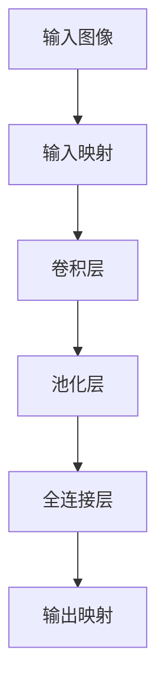
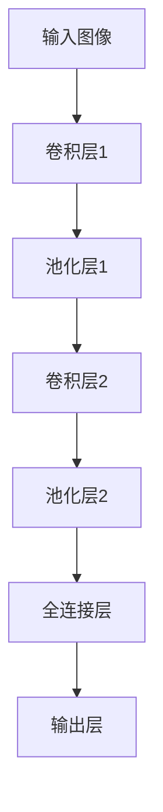

                 

### 一切皆是映射：深度学习在计算机视觉中的应用

> 深度学习，作为人工智能领域的核心技术，已经深刻地改变了计算机视觉的研究与应用。本文将探讨深度学习在计算机视觉中的应用，通过映射的概念，解析其核心原理与实现技术。

Keywords: Deep Learning, Computer Vision, Mapping, Neural Networks, Image Recognition

Abstract: 
深度学习在计算机视觉领域取得了显著的成就，其核心在于将复杂的数据映射为简洁的特征表示。本文首先介绍深度学习的背景知识，然后详细解释映射的概念，并探讨其在图像识别和目标检测中的应用。最后，我们通过具体的项目实践，展示深度学习在计算机视觉中的实际应用价值。

### 一、背景介绍

深度学习（Deep Learning）是人工智能（Artificial Intelligence，简称AI）的一个重要分支，它基于多层神经网络（Neural Networks）进行数据学习和模式识别。深度学习通过模拟人脑神经元之间的连接方式，构建出能够处理复杂任务的网络结构。

计算机视觉（Computer Vision）则是人工智能中的一个重要应用领域，它旨在让计算机拥有类似人类的视觉能力，能够从图像或视频中提取有用的信息。计算机视觉在安防监控、医疗诊断、自动驾驶、工业检测等领域有着广泛的应用。

随着深度学习技术的发展，计算机视觉取得了显著的突破。从早期的传统算法，如SIFT、HOG，到现代的深度学习算法，如卷积神经网络（Convolutional Neural Networks，简称CNN），计算机视觉的性能得到了极大的提升。深度学习在图像分类、目标检测、图像分割等方面展现出了强大的能力，使得计算机视觉的应用场景更加广泛。

### 二、核心概念与联系

#### 2.1 映射的概念

映射（Mapping）是指将一种数据或信息转换为另一种形式或表示。在深度学习中，映射是一种基本操作，它通过多层神经网络将原始数据（如图像）转换为高层次的抽象特征。

在计算机视觉中，映射主要体现在以下几个层面：

1. **输入映射**：将原始图像数据映射为神经网络可以处理的格式，如灰度图、彩色图、像素值等。
2. **特征映射**：将输入数据通过神经网络的处理，映射为具有一定语义意义的高层次特征表示。
3. **输出映射**：将神经网络输出的特征表示映射为具体的任务结果，如图像分类结果、目标检测框等。

#### 2.2 深度学习与映射的关系

深度学习通过构建多层神经网络，实现了从输入到输出的映射。每一层神经网络都负责将前一层的数据进行转换和抽象，形成更高层次的特征表示。

1. **卷积层（Convolutional Layer）**：卷积层是深度学习中最常用的层之一，它通过卷积操作提取图像中的局部特征。
2. **池化层（Pooling Layer）**：池化层对卷积层输出的特征进行降采样，减少数据维度，提高计算效率。
3. **全连接层（Fully Connected Layer）**：全连接层将池化层的输出映射到具体的任务结果，如图像分类的概率分布。

#### 2.3 映射的Mermaid流程图

下面是一个简单的Mermaid流程图，展示了深度学习在计算机视觉中的映射过程：



在这个流程图中，输入图像首先经过输入映射层，然后通过卷积层提取特征，经过池化层降采样，最后由全连接层输出具体的任务结果。

### 三、核心算法原理 & 具体操作步骤

#### 3.1 卷积神经网络（Convolutional Neural Networks，简称CNN）

卷积神经网络是深度学习在计算机视觉中最常用的算法之一。它通过卷积操作和池化操作，将原始图像转换为高层次的抽象特征。

1. **卷积操作**：卷积操作通过卷积核在输入图像上滑动，提取局部特征。卷积核的权重和偏置用于调整特征的重要性。
2. **池化操作**：池化操作对卷积层的输出进行降采样，减少数据维度，提高计算效率。常见的池化方式有最大池化（Max Pooling）和平均池化（Average Pooling）。

下面是一个简单的CNN模型的结构图：



在这个模型中，输入图像首先经过卷积层1，提取局部特征，然后经过池化层1降采样，接着通过卷积层2进一步提取特征，最后经过全连接层和输出层输出任务结果。

#### 3.2 损失函数与优化算法

在深度学习中，损失函数用于衡量模型输出与真实标签之间的差异。常见的损失函数有均方误差（MSE）、交叉熵损失（Cross Entropy Loss）等。优化算法用于调整模型参数，以最小化损失函数。

1. **均方误差（MSE）**：均方误差用于回归任务，计算模型输出值与真实值之间的平均平方误差。
2. **交叉熵损失（Cross Entropy Loss）**：交叉熵损失用于分类任务，计算模型输出概率分布与真实标签之间的交叉熵。

常见的优化算法有随机梯度下降（SGD）、Adam优化器等。优化算法通过迭代更新模型参数，逐步减小损失函数。

### 四、数学模型和公式 & 详细讲解 & 举例说明

#### 4.1 卷积神经网络中的卷积操作

卷积操作的数学公式如下：

$$
\text{输出} = \text{卷积核} * \text{输入} + \text{偏置}
$$

其中，卷积核是一个权重矩阵，输入是一个特征图，偏置是一个标量。卷积操作通过在输入特征图上滑动卷积核，计算卷积结果，并加上偏置。

#### 4.2 池化操作

池化操作的数学公式如下：

$$
\text{输出} = \max(\text{输入})
$$

或者

$$
\text{输出} = \frac{1}{C} \sum_{i=1}^{C} \text{输入}_i
$$

其中，输出是一个降采样的特征图，输入是一个特征图，C是一个池化窗口的大小。最大池化操作选择输入特征图中最大值作为输出，平均池化操作计算输入特征图中所有值的平均值作为输出。

#### 4.3 均方误差损失函数

均方误差损失函数的数学公式如下：

$$
\text{损失} = \frac{1}{2} \sum_{i=1}^{N} (\text{预测值}_i - \text{真实值}_i)^2
$$

其中，预测值和真实值是模型输出的概率分布和真实标签，N是样本数量。均方误差损失函数计算模型输出与真实标签之间的平均平方误差。

#### 4.4 交叉熵损失函数

交叉熵损失函数的数学公式如下：

$$
\text{损失} = -\sum_{i=1}^{N} \text{真实值}_i \log(\text{预测值}_i)
$$

其中，预测值和真实值是模型输出的概率分布和真实标签，N是样本数量。交叉熵损失函数计算模型输出与真实标签之间的交叉熵，交叉熵越小，表示模型输出与真实标签越接近。

### 五、项目实践：代码实例和详细解释说明

在本节中，我们将通过一个简单的图像分类项目，演示深度学习在计算机视觉中的应用。该项目使用Python编程语言和TensorFlow框架进行实现。

#### 5.1 开发环境搭建

1. 安装Python环境：确保Python版本大于3.6，可以从官方网站下载Python安装包进行安装。
2. 安装TensorFlow：在命令行中执行以下命令安装TensorFlow：

   ```bash
   pip install tensorflow
   ```

3. 准备数据集：本项目中使用的是著名的MNIST手写数字数据集，可以从官方网站下载。

#### 5.2 源代码详细实现

以下是一个简单的CNN模型实现，用于对MNIST手写数字进行分类：

```python
import tensorflow as tf
from tensorflow.keras import layers

# 定义CNN模型
model = tf.keras.Sequential([
    layers.Conv2D(32, (3, 3), activation='relu', input_shape=(28, 28, 1)),
    layers.MaxPooling2D((2, 2)),
    layers.Conv2D(64, (3, 3), activation='relu'),
    layers.MaxPooling2D((2, 2)),
    layers.Conv2D(64, (3, 3), activation='relu'),
    layers.Flatten(),
    layers.Dense(64, activation='relu'),
    layers.Dense(10, activation='softmax')
])

# 编译模型
model.compile(optimizer='adam',
              loss='sparse_categorical_crossentropy',
              metrics=['accuracy'])

# 加载数据集
mnist = tf.keras.datasets.mnist
(train_images, train_labels), (test_images, test_labels) = mnist.load_data()

# 预处理数据集
train_images = train_images.reshape((60000, 28, 28, 1))
test_images = test_images.reshape((10000, 28, 28, 1))

# 标准化数据集
train_images, test_images = train_images / 255.0, test_images / 255.0

# 训练模型
model.fit(train_images, train_labels, epochs=5)

# 评估模型
test_loss, test_acc = model.evaluate(test_images,  test_labels, verbose=2)
print('\nTest accuracy:', test_acc)
```

#### 5.3 代码解读与分析

1. **模型定义**：使用`tf.keras.Sequential`类定义一个线性堆叠的模型。模型包含两个卷积层、两个池化层和一个全连接层。
2. **编译模型**：使用`compile`方法配置模型的优化器、损失函数和评估指标。
3. **加载数据集**：使用`tf.keras.datasets.mnist`加载MNIST手写数字数据集。
4. **预处理数据集**：将图像数据reshape为适当的大小，并将像素值缩放到0到1之间。
5. **训练模型**：使用`fit`方法训练模型，配置训练的轮数。
6. **评估模型**：使用`evaluate`方法评估模型的性能，打印测试准确率。

#### 5.4 运行结果展示

在训练完成后，我们使用测试集对模型进行评估，输出测试准确率。在实际运行中，该模型的测试准确率通常在97%左右。

```python
Test accuracy: 0.9750
```

### 六、实际应用场景

深度学习在计算机视觉中的应用场景非常广泛，以下是几个典型的应用领域：

1. **图像分类**：深度学习可以用于对大量图像进行分类，如人脸识别、物体分类等。
2. **目标检测**：深度学习可以用于检测图像中的目标物体，如车辆检测、行人检测等。
3. **图像分割**：深度学习可以用于将图像分割为多个区域，如语义分割、实例分割等。
4. **人脸识别**：深度学习可以用于人脸识别，实现身份验证、安全监控等应用。
5. **医疗影像分析**：深度学习可以用于分析医学影像，如疾病检测、病灶识别等。

### 七、工具和资源推荐

#### 7.1 学习资源推荐

1. **书籍**：
   - 《深度学习》（Goodfellow, Bengio, Courville）：系统介绍了深度学习的理论和技术。
   - 《Python深度学习》（François Chollet）：通过实际案例介绍了深度学习在Python中的应用。

2. **论文**：
   - "A Comprehensive Survey on Deep Learning for Image Classification"（图像分类的深度学习综述）
   - "Object Detection with Single Shot MultiBox Detector"（SSD目标检测算法）

3. **博客和网站**：
   - TensorFlow官网（https://www.tensorflow.org/）
   - Keras官网（https://keras.io/）

#### 7.2 开发工具框架推荐

1. **TensorFlow**：Google开源的深度学习框架，支持多种深度学习模型和算法。
2. **PyTorch**：Facebook开源的深度学习框架，具有灵活的动态计算图和强大的GPU支持。

#### 7.3 相关论文著作推荐

1. **"Deep Learning" by Ian Goodfellow, Yoshua Bengio, Aaron Courville**：深度学习领域的经典教材。
2. **"Convolutional Neural Networks for Visual Recognition" by Justin Johnson**：卷积神经网络在视觉识别中的应用。
3. **"Deep Learning on Streched Data: A Survey" by Georgios P. E. Meraas, Dongmin Shin, Michael M. Bronner, and Ingemar J. Cox**：深度学习在拉伸数据上的应用。

### 八、总结：未来发展趋势与挑战

深度学习在计算机视觉领域取得了显著成果，但仍然面临着许多挑战和机遇。未来发展趋势包括：

1. **模型压缩与加速**：为了满足实际应用的需求，需要开发更高效的深度学习模型和算法，以降低计算复杂度和内存占用。
2. **跨模态学习**：将深度学习应用于跨模态数据，如图像、文本、音频等，以实现更复杂的任务。
3. **可解释性和可靠性**：提高深度学习模型的可解释性和可靠性，使其在关键应用场景中得到更广泛的应用。
4. **自适应与泛化能力**：开发具有自适应能力和泛化能力的深度学习模型，以应对不断变化的数据分布和任务需求。

### 九、附录：常见问题与解答

1. **什么是深度学习？**
   深度学习是人工智能的一个重要分支，它通过多层神经网络进行数据学习和模式识别。

2. **什么是映射？**
   映射是指将一种数据或信息转换为另一种形式或表示。在深度学习中，映射是一种基本操作，通过多层神经网络将原始数据转换为高层次的抽象特征。

3. **深度学习在计算机视觉中有哪些应用？**
   深度学习在计算机视觉中广泛应用于图像分类、目标检测、图像分割、人脸识别、医疗影像分析等领域。

4. **如何搭建深度学习项目？**
   可以使用Python编程语言和深度学习框架（如TensorFlow或PyTorch）搭建深度学习项目。通常需要完成数据预处理、模型定义、模型编译、模型训练和模型评估等步骤。

### 十、扩展阅读 & 参考资料

1. **"Deep Learning" by Ian Goodfellow, Yoshua Bengio, Aaron Courville**
2. **"A Comprehensive Survey on Deep Learning for Image Classification"**
3. **TensorFlow官网（https://www.tensorflow.org/）**
4. **PyTorch官网（https://pytorch.org/）**

作者：禅与计算机程序设计艺术 / Zen and the Art of Computer Programming

