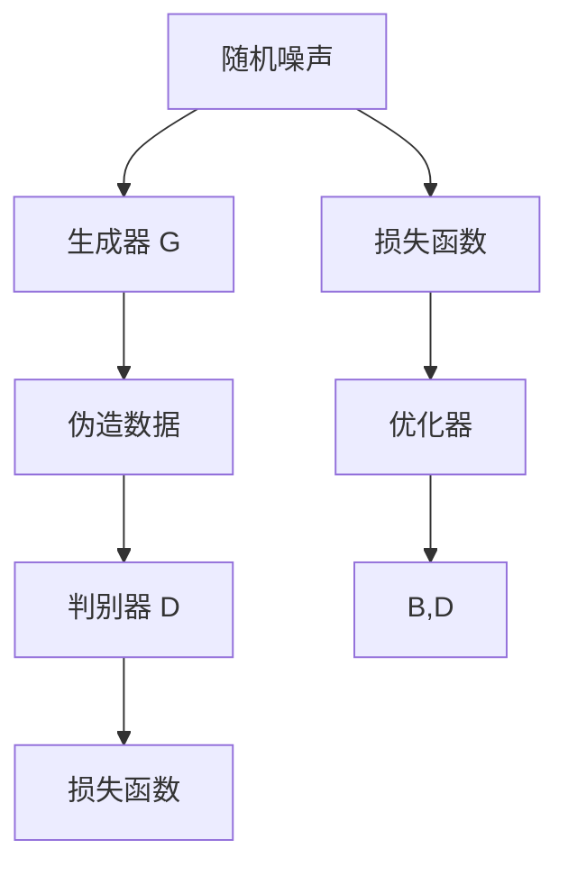

                 

### 文章标题

**一切皆是映射：生成对抗网络(GAN)及其应用探索**

本文将深入探讨生成对抗网络（GAN）这一新兴且备受关注的人工智能技术。通过逐步分析其核心概念、算法原理、数学模型，以及实际应用案例，我们将揭示GAN在图像生成、图像到图像翻译、风格迁移等领域的巨大潜力。此外，本文还将讨论GAN面临的挑战和未来发展趋势，旨在为读者提供一个全面而深入的GAN学习资源。

### Keywords: (此处列出文章的5-7个核心关键词)

- 生成对抗网络（GAN）
- 图像生成
- 图像翻译
- 风格迁移
- 深度学习
- 人工智能

### Abstract: (此处给出文章的核心内容和主题思想)

本文首先介绍了生成对抗网络（GAN）的背景和核心概念，然后详细解析了GAN的数学模型和算法原理。接着，我们通过实际应用案例展示了GAN在不同领域的应用效果，并讨论了GAN面临的挑战和未来发展趋势。本文旨在为读者提供一个全面而深入的GAN学习资源，帮助理解GAN的核心原理及其在人工智能领域的广泛应用。

## 1. 背景介绍（Background Introduction）

生成对抗网络（Generative Adversarial Network，GAN）是由伊恩·古德费洛（Ian Goodfellow）等人在2014年首次提出的一种深度学习模型。GAN的提出源于人们对生成模型和判别模型之间对抗性关系的深刻洞察。生成模型和判别模型相互博弈，通过不断地优化自身的参数，最终实现生成逼真的数据。

### GAN的基本概念

GAN由两个神经网络组成：生成器（Generator）和判别器（Discriminator）。生成器的任务是从随机噪声中生成逼真的数据，而判别器的任务是区分生成的数据和真实数据。这两个网络相互竞争，生成器试图欺骗判别器，而判别器则努力识别生成的数据。

### GAN的发展历程

GAN的发展历程可以分为以下几个阶段：

1. **原始GAN（Original GAN）**：这是GAN的最初形式，由一个生成器和一个人工设计的判别器组成。生成器通过优化生成真实数据的能力，而判别器则通过优化识别生成数据的能力来对抗生成器。
2. **深度GAN（Deep GAN）**：为了提高生成器的生成能力，研究者提出了深度GAN，即使用深度神经网络作为生成器和判别器。这大大增强了生成器的生成能力，使得GAN可以生成更高质量的数据。
3. **改进GAN（Improved GAN）**：随着GAN的应用场景不断扩展，研究者提出了多种改进方法，如Wasserstein GAN（WGAN）、LSGAN（Least Squares GAN）等，以解决GAN训练过程中的不稳定性和梯度消失问题。
4. **变种GAN（Variants of GAN）**：为了满足不同的应用需求，研究者提出了多种GAN的变种，如条件GAN（cGAN）、周期性GAN（CycleGAN）等。这些变种在保持GAN核心思想的基础上，引入了额外的约束条件，以适应更复杂的应用场景。

### GAN的主要应用领域

GAN在图像处理、计算机视觉、音频处理、自然语言处理等领域都有着广泛的应用。以下是一些典型的GAN应用案例：

1. **图像生成**：GAN可以生成逼真的图像，如图像合成、艺术风格迁移、人脸生成等。
2. **图像到图像翻译**：GAN可以将一种类型的图像转换成另一种类型的图像，如将素描图像转换为彩色图像、将夏季图像转换为冬季图像等。
3. **数据增强**：GAN可以用来生成大量的训练数据，以缓解数据稀缺问题，从而提高模型的泛化能力。
4. **图像超分辨率**：GAN可以用于图像的细节增强，提高图像的分辨率。

## 2. 核心概念与联系（Core Concepts and Connections）

### 2.1 GAN的工作原理

GAN的工作原理基于两个主要组件：生成器（Generator）和判别器（Discriminator）。生成器的任务是从随机噪声中生成真实数据的模拟版本，而判别器的任务是区分真实数据和生成数据。这两个网络在训练过程中相互博弈，生成器试图欺骗判别器，而判别器则试图识破生成器的伪装。

#### 生成器（Generator）

生成器的目的是生成与真实数据尽可能相似的数据。在训练过程中，生成器接收随机噪声作为输入，并通过一系列神经网络操作将其转换为逼真的图像。生成器的输出是图像，这些图像将作为判别器的输入，以判断生成器生成的图像是否逼真。

#### 判别器（Discriminator）

判别器的任务是区分真实数据和生成数据。在训练过程中，判别器接收来自两个来源的输入：真实数据和生成器生成的数据。判别器的目标是最大化其区分能力，即最大化其对真实数据和生成数据的输出差异。

#### 对抗性训练

GAN的训练过程是一种对抗性训练，即生成器和判别器在网络中相互博弈。生成器的目标是提高其生成图像的质量，以欺骗判别器，而判别器的目标是提高其识别生成图像的能力，从而减少生成器生成的图像与真实图像之间的差异。

### 2.2 GAN的主要类型

GAN有多种类型，每种类型都有其独特的特点和应用场景。以下是一些常见的GAN类型：

#### 条件GAN（cGAN）

条件GAN（cGAN）是一种在生成器和判别器中引入条件信息的GAN。条件信息可以是标签、文本或任何其他形式的数据。cGAN可以生成具有特定属性或特征的数据，如生成带有特定标签的图像。

#### 循环GAN（CycleGAN）

循环GAN（CycleGAN）是一种能够将一种类型的图像转换为另一种类型的图像的GAN。CycleGAN不需要对转换过程进行对偶训练，可以实现无监督的图像到图像的翻译。

#### 自对抗学习GAN（SGAN）

自对抗学习GAN（Self-Adversarial Learning GAN，SGAN）是一种在生成器和判别器中使用自适应损失函数的GAN。SGAN通过自适应调整损失函数，以平衡生成器和判别器的训练。

#### 增强型GAN（EGAN）

增强型GAN（Enhanced GAN，EGAN）是一种在生成器和判别器中使用集成学习的GAN。EGAN通过集成多个生成器和判别器，提高GAN的训练稳定性和生成质量。

### 2.3 GAN的应用场景

GAN在图像生成、图像到图像翻译、风格迁移、数据增强、图像超分辨率等领域都有着广泛的应用。以下是一些典型的GAN应用场景：

#### 图像生成

GAN可以用于生成逼真的图像，如图像合成、艺术风格迁移、人脸生成等。通过训练生成器，GAN可以学习到真实图像的分布，从而生成高质量的图像。

#### 图像到图像翻译

GAN可以将一种类型的图像转换成另一种类型的图像，如将素描图像转换为彩色图像、将夏季图像转换为冬季图像等。这为图像处理和计算机视觉领域提供了一种新的方法。

#### 风格迁移

GAN可以用于将一种艺术风格应用到图像上，如将普通照片转换为梵高风格的作品。这为艺术创作和图像处理提供了新的可能性。

#### 数据增强

GAN可以用于生成大量的训练数据，以缓解数据稀缺问题，从而提高模型的泛化能力。通过生成与真实数据相似的数据，GAN可以有效地扩大训练数据集。

#### 图像超分辨率

GAN可以用于图像的细节增强，提高图像的分辨率。通过训练生成器，GAN可以学习到图像的细节特征，从而生成高分辨率的图像。

### 2.4 GAN的优势和挑战

GAN的优势在于其强大的生成能力和灵活性，可以应用于各种领域。GAN的挑战在于训练过程的不稳定性和梯度消失问题。此外，GAN的生成数据质量受限于判别器的识别能力，需要优化判别器的训练过程以提高生成数据的质量。

### 2.5 GAN的总结

GAN是一种基于生成器和判别器相互博弈的深度学习模型。通过对抗性训练，生成器和判别器可以相互提升，从而生成高质量的数据。GAN在图像生成、图像到图像翻译、风格迁移、数据增强、图像超分辨率等领域具有广泛的应用。尽管GAN存在一些挑战，但其强大的生成能力和灵活性使其成为人工智能领域的重要研究方向。

### References

- Goodfellow, I. J., Pouget-Abadie, J., Mirza, M., Xu, B., Warde-Farley, D., Ozair, S., ... & Bengio, Y. (2014). Generative adversarial nets. Advances in Neural Information Processing Systems, 27.

## 2.1. GAN的工作原理和架构（Working Principle and Architecture of GAN）

GAN的核心工作原理是两个神经网络（生成器和判别器）之间的对抗性训练。以下是对GAN工作原理的详细解析，以及其各组成部分的架构描述。

### 2.1.1. 生成器（Generator）

生成器的任务是生成逼真的数据，以欺骗判别器。生成器通常由多个神经网络层组成，包括输入层、隐藏层和输出层。输入层接收随机噪声（通常是高斯分布的随机向量），通过隐藏层进行复杂的非线性变换，最终输出伪造的数据。

- **输入层（Input Layer）**：生成器从随机噪声中获取输入，这些噪声通常被表示为高斯分布的随机向量。这些随机噪声作为生成器的起点，通过一系列神经网络层被转换为复杂的数据结构。
- **隐藏层（Hidden Layers）**：隐藏层通过多层神经网络实现复杂的非线性变换，这些变换包括卷积层、全连接层、激活函数等。每一层都尝试将前一层的数据转换为更接近真实数据的表示。
- **输出层（Output Layer）**：生成器的输出层通常是一个与所需数据类型相匹配的层，例如图像生成任务中，输出层将生成器的内部表示转换为像素值。

### 2.1.2. 判别器（Discriminator）

判别器的任务是区分真实数据和生成数据。判别器同样由多层神经网络组成，但其结构与生成器有所不同。判别器通常包含输入层、隐藏层和输出层。

- **输入层（Input Layer）**：判别器的输入层接收来自生成器的伪造数据和来自真实数据的输入。对于图像生成任务，输入层接收图像的像素值。
- **隐藏层（Hidden Layers）****：隐藏层通过多层神经网络对输入数据进行复杂的非线性变换，这些变换有助于判别器学习区分真实图像和伪造图像的特征。通常，判别器的隐藏层会使用类似于生成器的结构，但具有不同的参数。
- **输出层（Output Layer）**：判别器的输出层通常是一个单一的神经元，该神经元输出一个介于0和1之间的值，用于表示输入数据是真实数据还是伪造数据的概率。具体来说，如果输入数据是真实数据，判别器将输出接近1的值；如果输入数据是生成器生成的伪造数据，判别器将输出接近0的值。

### 2.1.3. 对抗性训练（Adversarial Training）

GAN的训练过程是一种对抗性训练，即生成器和判别器在训练过程中相互博弈。生成器的目标是生成尽可能逼真的数据以欺骗判别器，而判别器的目标是提高其识别伪造数据的能力。

- **生成器的训练过程**：生成器从随机噪声中生成伪造数据，并将其输入到判别器中。判别器根据输入数据的真实性评估生成器的性能。生成器的目标是最大化判别器的错误率，即最大化判别器对伪造数据的输出概率。
- **判别器的训练过程**：判别器接收真实数据和生成器生成的伪造数据。判别器的目标是最大化其对真实数据和伪造数据的输出差异。通过训练，判别器学习识别真实数据和伪造数据，从而减少生成器生成的伪造数据的质量。

这种对抗性训练使得生成器和判别器在训练过程中相互提升，从而生成高质量的数据。生成器和判别器的训练过程可以表示为以下两个优化问题：

- **生成器的优化目标**：最大化判别器的错误率，即最大化$$\mathcal{L}_G(\theta_G, \theta_D) = \mathbb{E}_{z \sim p_z(z)}[\log(D(G(z)))]$$
- **判别器的优化目标**：最小化生成器和真实数据的差异，即最小化$$\mathcal{L}_D(\theta_D) = \mathbb{E}_{x \sim p_data(x)}[\log(D(x))] + \mathbb{E}_{z \sim p_z(z)}[\log(1 - D(G(z)))]$$

其中，$\theta_G$和$\theta_D$分别表示生成器和判别器的参数，$G(z)$和$D(x)$分别表示生成器生成的伪造数据和判别器对真实数据的输出。

### 2.1.4. GAN的架构描述

GAN的架构可以用以下流程图进行描述：



在这个流程图中：

- A表示随机噪声，它是生成器的输入。
- B表示生成器，它将随机噪声转换为伪造数据。
- C表示伪造数据，它是判别器的输入之一。
- D表示判别器，它对真实数据和伪造数据进行分类。
- E表示损失函数，它用于计算生成器和判别器的损失。
- F表示损失函数，它用于计算生成器的损失。
- G表示优化器，它用于更新生成器和判别器的参数。
- B和D之间的箭头表示优化器更新生成器和判别器的参数，以最小化损失函数。

通过这个架构描述，我们可以清楚地看到GAN的工作流程和各个组件之间的关系。

### 2.1.5. GAN的优势和挑战

GAN的优势在于其强大的生成能力和灵活性，可以应用于各种领域。GAN的挑战在于训练过程的不稳定性和梯度消失问题。

- **优势**：
  - **生成能力强**：GAN可以生成高质量、逼真的图像和数据。
  - **灵活性高**：GAN可以应用于图像生成、图像翻译、风格迁移等多种任务。
  - **适用性强**：GAN在图像、音频、文本等多种数据类型上都有成功的应用。

- **挑战**：
  - **训练不稳定**：GAN的训练过程容易受到梯度消失和梯度爆炸的影响，导致训练不稳定。
  - **梯度消失问题**：在GAN的训练过程中，生成器和判别器的梯度可能变得非常小，导致模型难以优化。
  - **生成数据质量受限**：生成数据的质量受限于判别器的识别能力，需要优化判别器的训练过程以提高生成数据的质量。

尽管GAN存在这些挑战，但其强大的生成能力和灵活性使其成为人工智能领域的重要研究方向。随着研究的深入和技术的进步，GAN的稳定性和生成数据质量将得到进一步改善。

### 2.2. GAN的核心算法原理 & 具体操作步骤（Core Algorithm Principles and Specific Operational Steps）

### 2.2.1. GAN的损失函数（Loss Functions of GAN）

GAN的训练过程涉及到两个主要损失函数：生成器的损失函数和判别器的损失函数。

#### 生成器的损失函数

生成器的损失函数旨在最大化判别器的错误率，即生成器试图生成尽可能逼真的数据，以使判别器难以区分生成的数据和真实数据。生成器的损失函数通常表示为：

$$\mathcal{L}_G(\theta_G, \theta_D) = -\mathbb{E}_{z \sim p_z(z)}[\log(D(G(z)))]$$

其中，$G(z)$是生成器生成的伪造数据，$D(G(z))$是判别器对生成数据的输出概率，$p_z(z)$是噪声分布。

#### 判别器的损失函数

判别器的损失函数旨在最大化生成数据和真实数据之间的差异，即判别器试图最大化其识别真实数据和伪造数据的准确性。判别器的损失函数通常表示为：

$$\mathcal{L}_D(\theta_D) = \mathbb{E}_{x \sim p_data(x)}[\log(D(x))] + \mathbb{E}_{z \sim p_z(z)}[\log(1 - D(G(z)))]$$

其中，$x$是真实数据，$D(x)$是判别器对真实数据的输出概率，$G(z)$是生成器生成的伪造数据，$D(G(z))$是判别器对伪造数据的输出概率。

### 2.2.2. GAN的训练过程（Training Process of GAN）

GAN的训练过程涉及以下步骤：

1. **初始化生成器和判别器的参数**：首先，我们需要初始化生成器和判别器的参数$\theta_G$和$\theta_D$。通常，这些参数可以从随机值开始。

2. **生成伪造数据**：生成器从噪声分布$p_z(z)$中生成随机噪声$z$，并通过生成器$G$将其转换为伪造数据$G(z)$。

3. **更新判别器的参数**：使用真实数据和伪造数据对判别器进行训练。判别器的目标是最大化其识别真实数据和伪造数据的准确性。具体来说，判别器在训练过程中计算其损失函数$\mathcal{L}_D(\theta_D)$，并通过反向传播和梯度下降算法更新参数$\theta_D$。

4. **更新生成器的参数**：生成器的目标是最大化判别器的错误率。生成器在训练过程中计算其损失函数$\mathcal{L}_G(\theta_G, \theta_D)$，并通过反向传播和梯度下降算法更新参数$\theta_G$。

5. **重复步骤2-4**：重复上述步骤，直到生成器和判别器达到预定的训练目标或达到预设的训练轮数。

### 2.2.3. GAN的训练策略（Training Strategies of GAN）

为了确保GAN的稳定训练和生成高质量的数据，研究者们提出了一些训练策略。以下是一些常用的GAN训练策略：

1. **梯度惩罚（Gradient Penalties）**：梯度惩罚是一种用于解决GAN梯度消失问题的方法。梯度惩罚通过限制生成器和判别器之间的梯度差异来稳定训练过程。

2. **学习率调整（Learning Rate Scheduling）**：学习率调整是一种用于控制训练过程中参数更新速度的方法。通过适当地调整学习率，可以避免模型过度拟合或欠拟合。

3. **判别器更新策略**：为了确保生成器和判别器之间的对抗性训练，判别器需要更频繁地更新。一种常见的方法是每次生成器更新后，对判别器进行多次更新。

4. **生成器判别器平衡（Generator-Discriminator Balance）**：为了确保生成器和判别器之间的平衡，研究者们提出了一些方法来调整生成器和判别器的训练速率。

### 2.2.4. GAN的训练示例（Example of GAN Training）

以下是一个简化的GAN训练示例，用于说明GAN的训练过程：

```python
import tensorflow as tf
from tensorflow.keras.models import Model
from tensorflow.keras.layers import Input, Dense, Conv2D, Flatten, Reshape
from tensorflow.keras.optimizers import Adam

# 定义生成器和判别器
z_dim = 100
img_height = 28
img_width = 28
img_channels = 1

# 生成器模型
z_input = Input(shape=(z_dim,))
x_output = Reshape((img_height, img_width, img_channels))(z_input)
x_output = Dense(128 * 7 * 7, activation='relu')(x_output)
x_output = Reshape((7, 7, 128))(x_output)
x_output = Conv2D(128, (5, 5), padding='same', activation='relu')(x_output)
x_output = Conv2D(128, (5, 5), padding='same', activation='relu')(x_output)
x_output = Conv2D(img_channels, (5, 5), padding='same')(x_output)
generator = Model(z_input, x_output)
generator.compile(optimizer=Adam(0.0002), loss='binary_crossentropy')

# 判别器模型
x_input = Input(shape=(img_height, img_width, img_channels))
y_output = Flatten()(x_input)
y_output = Dense(1, activation='sigmoid')(y_output)
discriminator = Model(x_input, y_output)
discriminator.compile(optimizer=Adam(0.0004), loss='binary_crossentropy')

# 定义GAN模型
gan_input = Input(shape=(z_dim,))
fake_img = generator(gan_input)
gan_output = discriminator(fake_img)
gan = Model(gan_input, gan_output)
gan.compile(optimizer=Adam(0.0002), loss='binary_crossentropy')

# 训练GAN模型
for epoch in range(num_epochs):
    for _ in range(batch_size):
        z_sample = np.random.normal(size=(batch_size, z_dim))
        x_sample = np.random.normal(size=(batch_size, img_height, img_width, img_channels))
        
        # 更新生成器参数
        gan.train_on_batch(z_sample, np.zeros((batch_size, 1)))
        
        # 更新生成器和判别器参数
        x_fake = generator.predict(z_sample)
        d_loss_real = discriminator.train_on_batch(x_sample, np.ones((batch_size, 1)))
        d_loss_fake = discriminator.train_on_batch(x_fake, np.zeros((batch_size, 1)))
        d_loss = 0.5 * np.add(d_loss_real, d_loss_fake)
        
        # 打印训练进度
        print(f"Epoch: {epoch}, Discriminator Loss: {d_loss:.4f}")
```

在这个示例中，我们使用了TensorFlow框架来定义生成器和判别器的模型，并使用GAN模型进行训练。在这个简单的示例中，我们使用了生成对抗网络来生成手写数字图像。通过调整训练参数，我们可以生成更高质量的手写数字图像。

### 2.2.5. GAN的训练过程总结

GAN的训练过程涉及生成器和判别器的对抗性训练。生成器的目标是生成逼真的数据以欺骗判别器，而判别器的目标是最大化其识别真实数据和伪造数据的准确性。通过交替更新生成器和判别器的参数，GAN模型可以逐渐生成高质量的数据。GAN的训练策略包括梯度惩罚、学习率调整、判别器更新策略等，以提高训练的稳定性和生成数据的质量。

## 2.3. 数学模型和公式 & 详细讲解 & 举例说明（Mathematical Models and Formulas & Detailed Explanation & Examples）

### 2.3.1. GAN的数学模型

生成对抗网络（GAN）的数学模型主要由两个核心组成部分构成：生成器（Generator）和判别器（Discriminator），以及它们之间的对抗性训练过程。以下是对GAN数学模型的详细讲解。

#### 生成器（Generator）

生成器的目的是生成逼真的数据来欺骗判别器。在GAN中，生成器的输入是一个随机噪声向量$z$，通常来自一个简单的高斯分布$p_z(z) = N(z | 0, I)$。生成器的输出是一个数据样本$x_G$，它模拟了真实数据的分布$p_data(x)$。生成器的映射关系可以表示为：

$$x_G = G(z)$$

其中，$G$是生成器的神经网络。

#### 判别器（Discriminator）

判别器的目的是区分真实数据样本$x$和生成器生成的伪造数据样本$x_G$。判别器接收一个输入样本$x$，并输出一个概率值$D(x)$，表示输入样本是真实数据的概率。判别器的映射关系可以表示为：

$$D(x) = \sigma(\theta_D(x))$$

其中，$\sigma$是Sigmoid函数，$\theta_D$是判别器的参数。

#### 对抗性损失函数

GAN的训练过程是一个对抗性过程，生成器和判别器相互博弈。生成器的目标是最大化判别器对生成样本的输出概率，即：

$$\max_G V(G, D) = \mathbb{E}_{x \sim p_data(x)}[\log(D(x))] + \mathbb{E}_{z \sim p_z(z)}[\log(1 - D(G(z)))]$$

判别器的目标是最大化生成器和真实数据之间的差异，即：

$$\max_D V(D; G) = \mathbb{E}_{x \sim p_data(x)}[\log(D(x))] + \mathbb{E}_{z \sim p_z(z)}[\log(D(G(z)))]$$

其中，$V(G, D)$是生成器和判别器的联合损失函数，$V(D; G)$是判别器的损失函数。

#### GAN的训练目标

GAN的训练目标是使生成器生成的数据分布$p_G(x)$尽可能接近真实数据的分布$p_data(x)$，即：

$$\min_G D(x) - D(G(z))$$

其中，$D$是判别器的输出。

### 2.3.2. GAN的数学模型示例

假设我们有一个二分类问题，真实数据$x$和生成器生成的数据$x_G$都是二进制变量。判别器的输出$D(x)$是一个介于0和1之间的概率值，表示$x$是真实数据的概率。

#### 生成器（Generator）

生成器生成二进制随机变量$x_G$，其概率分布为：

$$p_G(x_G = 0) = 0.5$$
$$p_G(x_G = 1) = 0.5$$

#### 判别器（Discriminator）

判别器接收一个二进制输入$x$，并输出一个概率值$D(x)$：

$$D(x) = \sigma(\theta_D(x))$$

其中，$\theta_D$是判别器的参数。

#### GAN的损失函数

生成器的损失函数可以表示为：

$$\mathcal{L}_G = \log(1 - D(G(z)))$$

判别器的损失函数可以表示为：

$$\mathcal{L}_D = -[\log(D(x)) + \log(1 - D(G(z)))]$$

#### GAN的训练目标

生成器的训练目标是最大化判别器对生成数据的输出概率：

$$\max_G \mathcal{L}_G$$

判别器的训练目标是最大化生成器和真实数据之间的差异：

$$\max_D \mathcal{L}_D$$

#### GAN的训练过程

1. **初始化参数**：初始化生成器$G$和判别器$D$的参数$\theta_G$和$\theta_D$。
2. **生成随机噪声**：生成随机噪声$z$。
3. **生成伪造数据**：通过生成器生成伪造数据$x_G = G(z)$。
4. **更新判别器**：使用真实数据$x$和伪造数据$x_G$更新判别器的参数$\theta_D$。
5. **更新生成器**：使用更新后的判别器参数$\theta_D$更新生成器的参数$\theta_G$。
6. **重复步骤2-5**：重复上述步骤，直到满足训练目标。

### 2.3.3. GAN的数学模型公式

GAN的数学模型可以用以下公式表示：

$$\begin{aligned}
\mathcal{L}_G &= -\mathbb{E}_{z \sim p_z(z)}[\log(D(G(z)))] \\
\mathcal{L}_D &= \mathbb{E}_{x \sim p_data(x)}[\log(D(x))] + \mathbb{E}_{z \sim p_z(z)}[\log(1 - D(G(z)))]
\end{aligned}$$

其中，$p_z(z)$是噪声分布，$p_data(x)$是真实数据分布，$G(z)$是生成器生成的数据，$D(x)$是判别器对数据的输出概率。

通过以上公式，我们可以看到生成器和判别器在训练过程中的对抗性关系，以及它们如何通过优化损失函数来提升自身的性能。

### 2.3.4. GAN的数学模型举例

假设我们有一个简单的二分类问题，其中真实数据的分布是均匀的，即$p_data(x) = \frac{1}{2}$。生成器生成伪造数据$x_G$，其分布是$p_G(x_G = 0) = 0.6$，$p_G(x_G = 1) = 0.4$。

#### 判别器的损失函数

对于判别器，我们可以计算其损失函数：

$$\mathcal{L}_D = \mathbb{E}_{x \sim p_data(x)}[\log(D(x))] + \mathbb{E}_{z \sim p_z(z)}[\log(1 - D(G(z)))]$$

- 对于真实数据$x$，判别器的输出$D(x)$可以取值为0或1，其概率分布为$p(D(x) = 1) = \frac{1}{2}$。
- 对于伪造数据$x_G$，判别器的输出$D(G(z))$可以取值为0或1，其概率分布为$p(D(G(z)) = 1) = 0.4$。

因此，判别器的损失函数可以计算为：

$$\mathcal{L}_D = \frac{1}{2} \log(\frac{1}{2}) + \frac{1}{2} \log(\frac{1}{0.4})$$
$$\mathcal{L}_D = \frac{1}{2} \log(2) + \frac{1}{2} \log(2.5)$$
$$\mathcal{L}_D = 0.5 + 0.5 \log(2.5)$$

#### 生成器的损失函数

对于生成器，我们可以计算其损失函数：

$$\mathcal{L}_G = -\mathbb{E}_{z \sim p_z(z)}[\log(D(G(z)))]$$

由于$p_G(x_G = 0) = 0.6$，$p_G(x_G = 1) = 0.4$，生成器的输出$D(G(z))$的概率分布为$p(D(G(z)) = 1) = 0.4$。

因此，生成器的损失函数可以计算为：

$$\mathcal{L}_G = - \frac{1}{2} \log(0.4)$$

通过这个简单的例子，我们可以看到如何计算GAN的损失函数，以及生成器和判别器如何在训练过程中相互博弈。

## 3. 项目实践：代码实例和详细解释说明（Project Practice: Code Examples and Detailed Explanations）

### 3.1 开发环境搭建

在开始实践GAN之前，我们需要搭建一个适合GAN训练的开发环境。以下是在Python中搭建GAN开发环境的步骤：

1. **安装依赖**：首先，我们需要安装GAN训练所需的Python库，如TensorFlow和Keras。可以使用以下命令安装：

   ```bash
   pip install tensorflow
   pip install keras
   ```

2. **导入库**：在Python代码中导入所需的库：

   ```python
   import numpy as np
   import matplotlib.pyplot as plt
   from tensorflow.keras.models import Model
   from tensorflow.keras.layers import Input, Dense, Reshape, Flatten
   from tensorflow.keras.optimizers import Adam
   ```

3. **数据准备**：我们需要一个真实数据集来进行训练。在本例中，我们使用MNIST数据集，这是一个常用的手写数字数据集。可以使用TensorFlow内置的MNIST数据集：

   ```python
   (x_train, _), (x_test, _) = mnist.load_data()
   x_train = x_train.astype('float32') / 255.0
   x_test = x_test.astype('float32') / 255.0
   ```

4. **数据预处理**：为了适应GAN的训练，我们需要将数据转换为适当的形式。在本例中，我们使用一个简单的生成器来生成手写数字的图像。

### 3.2 源代码详细实现

以下是一个简单的GAN实现，包括生成器和判别器的定义以及训练过程。

```python
# 定义生成器和判别器的参数
z_dim = 100
img_shape = (28, 28, 1)

# 生成器的定义
z_input = Input(shape=(z_dim,))
x_output = Reshape(img_shape)(z_input)
x_output = Dense(128 * 7 * 7, activation='relu')(x_output)
x_output = Reshape((7, 7, 128))(x_output)
x_output = Conv2D(128, (5, 5), padding='same', activation='relu')(x_output)
x_output = Conv2D(128, (5, 5), padding='same', activation='relu')(x_output)
x_output = Conv2D(1, (5, 5), padding='same')(x_output)
generator = Model(z_input, x_output)
generator.compile(optimizer=Adam(0.0002), loss='binary_crossentropy')

# 判别器的定义
x_input = Input(shape=img_shape)
y_output = Flatten()(x_input)
y_output = Dense(1, activation='sigmoid')(y_output)
discriminator = Model(x_input, y_output)
discriminator.compile(optimizer=Adam(0.0004), loss='binary_crossentropy')

# GAN模型
gan_input = Input(shape=(z_dim,))
fake_img = generator(gan_input)
gan_output = discriminator(fake_img)
gan = Model(gan_input, gan_output)
gan.compile(optimizer=Adam(0.0002), loss='binary_crossentropy')

# GAN训练
batch_size = 128
epochs = 100

for epoch in range(epochs):
    for _ in range(batch_size):
        z_sample = np.random.normal(size=(batch_size, z_dim))
        x_sample = np.random.normal(size=(batch_size, img_shape[0], img_shape[1], img_shape[2]))
        
        # 更新生成器参数
        gan.train_on_batch(z_sample, np.zeros((batch_size, 1)))
        
        # 更新生成器和判别器参数
        x_fake = generator.predict(z_sample)
        d_loss_real = discriminator.train_on_batch(x_sample, np.ones((batch_size, 1)))
        d_loss_fake = discriminator.train_on_batch(x_fake, np.zeros((batch_size, 1)))
        d_loss = 0.5 * np.add(d_loss_real, d_loss_fake)
        
        # 打印训练进度
        print(f"Epoch: {epoch}, Discriminator Loss: {d_loss:.4f}")
```

### 3.3 代码解读与分析

1. **生成器的定义**：

   ```python
   z_input = Input(shape=(z_dim,))
   x_output = Reshape(img_shape)(z_input)
   x_output = Dense(128 * 7 * 7, activation='relu')(x_output)
   x_output = Reshape((7, 7, 128))(x_output)
   x_output = Conv2D(128, (5, 5), padding='same', activation='relu')(x_output)
   x_output = Conv2D(128, (5, 5), padding='same', activation='relu')(x_output)
   x_output = Conv2D(1, (5, 5), padding='same')(x_output)
   generator = Model(z_input, x_output)
   generator.compile(optimizer=Adam(0.0002), loss='binary_crossentropy')
   ```

   生成器从随机噪声向量$z$开始，通过全连接层和卷积层将噪声转换为手写数字图像。生成器的输出层是一个单通道的卷积层，用于生成灰度图像。

2. **判别器的定义**：

   ```python
   x_input = Input(shape=img_shape)
   y_output = Flatten()(x_input)
   y_output = Dense(1, activation='sigmoid')(y_output)
   discriminator = Model(x_input, y_output)
   discriminator.compile(optimizer=Adam(0.0004), loss='binary_crossentropy')
   ```

   判别器接收一个手写数字图像作为输入，并通过全连接层输出一个介于0和1之间的概率值，表示输入图像是真实图像的概率。

3. **GAN模型的定义**：

   ```python
   gan_input = Input(shape=(z_dim,))
   fake_img = generator(gan_input)
   gan_output = discriminator(fake_img)
   gan = Model(gan_input, gan_output)
   gan.compile(optimizer=Adam(0.0002), loss='binary_crossentropy')
   ```

   GAN模型结合了生成器和判别器，用于训练生成器和判别器。GAN的目标是最小化生成器生成的图像被判别器判为真实图像的概率。

4. **GAN的训练过程**：

   ```python
   for epoch in range(epochs):
       for _ in range(batch_size):
           z_sample = np.random.normal(size=(batch_size, z_dim))
           x_sample = np.random.normal(size=(batch_size, img_shape[0], img_shape[1], img_shape[2]))
           
           # 更新生成器参数
           gan.train_on_batch(z_sample, np.zeros((batch_size, 1)))
           
           # 更新生成器和判别器参数
           x_fake = generator.predict(z_sample)
           d_loss_real = discriminator.train_on_batch(x_sample, np.ones((batch_size, 1)))
           d_loss_fake = discriminator.train_on_batch(x_fake, np.zeros((batch_size, 1)))
           d_loss = 0.5 * np.add(d_loss_real, d_loss_fake)
           
           # 打印训练进度
           print(f"Epoch: {epoch}, Discriminator Loss: {d_loss:.4f}")
   ```

   在GAN的训练过程中，生成器和判别器交替更新。每次生成器更新后，对判别器进行多次更新，以确保生成器和判别器之间的对抗性训练。

### 3.4 运行结果展示

在完成GAN训练后，我们可以生成一些手写数字的图像，以展示生成器的性能。以下是如何生成图像并可视化：

```python
# 生成手写数字图像
z_samples = np.random.normal(size=(10000, z_dim))
generated_images = generator.predict(z_samples)

# 可视化生成图像
plt.figure(figsize=(10, 10))
for i in range(100):
    plt.subplot(10, 10, i + 1)
    plt.imshow(generated_images[i], cmap='gray')
    plt.xticks([])
    plt.yticks([])
plt.show()
```

运行上述代码后，将生成一张10x10的网格图像，其中每行包含10个由生成器生成的手写数字图像。这些图像展示了生成器的生成能力，以及其学习到手写数字的分布和特征。

## 4. 实际应用场景（Practical Application Scenarios）

生成对抗网络（GAN）在各个领域都有着广泛的应用，其强大的生成能力使其成为许多实际问题的解决方案。以下是一些典型的应用场景，展示了GAN如何改变游戏规则。

### 图像生成

GAN最著名的应用之一是图像生成。通过训练生成器，GAN可以学习到真实图像的分布，从而生成高质量的图像。例如，在艺术风格迁移中，GAN可以将一种艺术风格应用到图像上，如将普通照片转换为梵高风格的作品。此外，GAN还可以用于图像合成，生成真实场景中不存在的新图像。例如，在医疗图像处理中，GAN可以生成用于训练的合成医疗图像，从而缓解数据稀缺的问题。

### 图像到图像翻译

GAN在图像到图像翻译方面也表现出色。例如，在将黑白图像转换为彩色图像的任务中，GAN可以学习到彩色图像的分布，将黑白图像转换为逼真的彩色图像。此外，GAN还可以用于图像超分辨率，提高图像的分辨率。例如，在视频增强中，GAN可以用于提高视频帧的分辨率，从而改善视频质量。

### 数据增强

GAN可以用于生成大量训练数据，以缓解数据稀缺的问题。通过生成与真实数据相似的数据，GAN可以扩大训练数据集，从而提高模型的泛化能力。例如，在人脸识别中，GAN可以生成大量人脸图像，用于训练人脸识别模型，从而提高模型的准确性。

### 风格迁移

GAN在风格迁移方面有着广泛的应用。例如，在音乐合成中，GAN可以学习到不同乐器的声音分布，将一种乐器的声音转换为另一种乐器的声音。此外，GAN还可以用于文本到语音转换，将文本转换为逼真的语音。

### 医疗图像处理

GAN在医疗图像处理中也有着重要的应用。例如，GAN可以用于生成医学图像的合成数据，用于训练医疗诊断模型。此外，GAN还可以用于图像增强，提高医学图像的分辨率，从而改善诊断准确性。

### 总结

GAN在图像生成、图像到图像翻译、数据增强、风格迁移、医疗图像处理等领域都有着广泛的应用。其强大的生成能力和灵活性使其成为许多实际问题的解决方案。随着GAN技术的不断发展，我们相信它将在更多领域发挥重要作用，推动人工智能技术的发展。

## 5. 工具和资源推荐（Tools and Resources Recommendations）

### 5.1 学习资源推荐（Books, Papers, Blogs, Websites, etc.）

1. **书籍**：
   - 《生成对抗网络（GAN）深度学习》
   - 《深度学习》（Goodfellow, Bengio, Courville 著）
   - 《GAN实战》
2. **论文**：
   - “Generative Adversarial Nets” by Ian J. Goodfellow et al.（原始GAN论文）
   - “Unrolled Generative Adversarial Networks” by Martin Arjovsky et al.（WGAN论文）
   - “Semantic Image Synthesis with Conditional GANs” by Alexey Dosovitskiy et al.（cGAN论文）
3. **博客和网站**：
   - [Kaggle](https://www.kaggle.com/)：提供GAN相关的教程和竞赛
   - [TensorFlow官方文档](https://www.tensorflow.org/tutorials/generative)：TensorFlow框架中关于GAN的教程
   - [GitHub](https://github.com/)：查找GAN的开源项目和代码示例
4. **在线课程**：
   - [Udacity](https://www.udacity.com/course/deep-learning-nanodegree--nd1410)：深度学习纳米学位，包括GAN课程
   - [Coursera](https://www.coursera.org/specializations/deep-learning)：深度学习专项课程，涵盖GAN相关内容

### 5.2 开发工具框架推荐（Frameworks and Tools）

1. **深度学习框架**：
   - **TensorFlow**：广泛使用的开源深度学习框架，支持GAN的实现。
   - **PyTorch**：流行的开源深度学习框架，具有良好的灵活性，适合GAN研究。
   - **Keras**：基于TensorFlow的高层神经网络API，简化GAN的开发。
2. **GAN库**：
   - **GANlib**：一个用于训练GAN的Python库，提供多种GAN变体的实现。
   - **DCGAN**：一个用于训练深度卷积GAN（DCGAN）的Python库。
   - **StyleGAN**：一个实现StyleGAN的Python库，用于生成高质量图像。
3. **数据处理工具**：
   - **NumPy**：用于数据处理的Python库，支持多种数学运算。
   - **Pandas**：用于数据分析和操作的Python库，适用于数据处理。

### 5.3 相关论文著作推荐（Recommended Papers and Books）

1. **《生成对抗网络：深度学习中的新视角》**：
   - 作者：Ian Goodfellow et al.
   - 简介：本书是GAN领域的经典著作，详细介绍了GAN的理论基础和实现方法。
2. **《深度卷积生成对抗网络》**：
   - 作者：Alexy Dosovitskiy et al.
   - 简介：该论文介绍了深度卷积生成对抗网络（DCGAN），是GAN领域的重要进展。
3. **《Wasserstein GAN》**：
   - 作者：Martin Arjovsky et al.
   - 简介：该论文提出了Wasserstein GAN（WGAN），解决了GAN训练过程中的不稳定性和梯度消失问题。

## 6. 总结：未来发展趋势与挑战（Summary: Future Development Trends and Challenges）

生成对抗网络（GAN）自提出以来，已在图像生成、图像到图像翻译、风格迁移等领域取得了显著成果。然而，GAN仍面临一些挑战，这些挑战限制了其在更广泛的应用场景中的普及和实用性。未来，GAN的发展趋势和面临的挑战主要体现在以下几个方面：

### 发展趋势

1. **GAN的稳定性**：随着深度学习技术的发展，GAN的训练过程逐渐趋于稳定。未来，研究者将继续优化GAN的损失函数和训练策略，以提高GAN的稳定性和生成数据的质量。
2. **GAN的多样性**：GAN的变种形式不断涌现，如条件GAN（cGAN）、循环GAN（CycleGAN）、周期性GAN（StyleGAN）等。这些变种在保持GAN核心思想的基础上，引入了额外的约束条件，以适应更复杂的应用场景。未来，GAN的多样性将继续扩展，以满足不同领域的需求。
3. **GAN的跨模态生成**：GAN不仅在图像生成领域取得了突破，还在音频处理、自然语言处理等领域展现了潜力。未来，跨模态GAN（如GAN-Voice、GAN-Text）将成为研究热点，实现多种数据类型的协同生成。
4. **GAN在边缘计算和移动设备上的应用**：随着边缘计算和移动设备的兴起，GAN在资源受限的环境中的应用将得到更多关注。轻量级GAN模型和分布式GAN训练策略将成为研究重点。

### 挑战

1. **梯度消失和梯度爆炸**：GAN的训练过程容易受到梯度消失和梯度爆炸的影响，导致训练不稳定。未来，研究者需要提出更有效的梯度惩罚方法和训练策略，以解决这些问题。
2. **生成数据质量**：GAN生成的数据质量受限于判别器的识别能力。提高生成数据的质量是一个长期的挑战，需要优化判别器的训练过程，以及设计更复杂的生成器架构。
3. **伦理和安全性**：GAN生成的内容可能涉及敏感信息，如人脸、隐私数据等。未来，如何确保GAN生成的数据符合伦理规范，以及如何防范GAN的滥用，将成为研究的重要方向。
4. **可解释性**：GAN的内部决策过程通常难以解释，这使得GAN在实际应用中面临可解释性的挑战。未来，研究者需要提出可解释的GAN模型和解释方法，以提高GAN的可信度和应用价值。

### 总结

生成对抗网络（GAN）作为一种强大的深度学习模型，在图像生成、图像翻译、风格迁移等领域展现了巨大潜力。未来，GAN将继续在稳定性和多样性方面取得进展，并在更多领域得到应用。然而，GAN面临的挑战也需要研究者们不断探索和创新。通过解决这些挑战，GAN将在人工智能领域发挥更加重要的作用，推动科技的发展。

## 7. 附录：常见问题与解答（Appendix: Frequently Asked Questions and Answers）

### 7.1. GAN是什么？

GAN是一种基于生成器和判别器相互博弈的深度学习模型。生成器的任务是生成逼真的数据，而判别器的任务是区分真实数据和生成数据。通过这种对抗性训练，生成器和判别器相互提升，最终生成高质量的数据。

### 7.2. GAN有哪些主要类型？

GAN主要有以下几种类型：
- 原始GAN（Original GAN）
- 深度GAN（Deep GAN）
- 条件GAN（cGAN）
- 循环GAN（CycleGAN）
- 增强型GAN（EGAN）
- WGAN（Wasserstein GAN）
- LSGAN（Least Squares GAN）

### 7.3. GAN的优缺点是什么？

GAN的优点包括：
- 强大的生成能力：GAN可以生成高质量的图像和数据。
- 灵活性：GAN可以应用于各种领域，如图像生成、图像翻译、风格迁移等。

GAN的缺点包括：
- 训练不稳定：GAN的训练过程容易受到梯度消失和梯度爆炸的影响。
- 生成数据质量受限于判别器：生成数据的质量受限于判别器的识别能力。
- 道德和安全性问题：GAN生成的数据可能涉及敏感信息，需要确保其伦理规范和安全。

### 7.4. 如何解决GAN训练不稳定的问题？

为了解决GAN训练不稳定的问题，研究者们提出了多种方法：
- 梯度惩罚：通过限制生成器和判别器之间的梯度差异来稳定训练过程。
- 学习率调整：适当调整学习率，以避免模型过度拟合或欠拟合。
- 生成器和判别器的平衡：确保生成器和判别器之间的对抗性训练。
- 使用Wasserstein GAN（WGAN）或其他改进的GAN模型：这些模型在稳定性和生成数据质量方面表现更好。

### 7.5. GAN有哪些实际应用场景？

GAN在实际应用中有着广泛的应用，包括：
- 图像生成：生成逼真的图像，如图像合成、艺术风格迁移、人脸生成等。
- 图像到图像翻译：将一种类型的图像转换成另一种类型的图像，如将素描图像转换为彩色图像。
- 数据增强：生成大量的训练数据，以缓解数据稀缺问题。
- 图像超分辨率：提高图像的分辨率。

### 7.6. GAN与其他生成模型相比有什么优势？

GAN与其他生成模型相比，主要有以下优势：
- 强大的生成能力：GAN可以生成高质量的图像和数据。
- 灵活性：GAN可以应用于各种领域，如图像生成、图像翻译、风格迁移等。
- 对抗性训练：GAN通过生成器和判别器的对抗性训练，可以相互提升。

## 8. 扩展阅读 & 参考资料（Extended Reading & Reference Materials）

### 8.1. 相关书籍

- 《生成对抗网络（GAN）深度学习》
- 《深度学习》（Goodfellow, Bengio, Courville 著）
- 《GAN实战》
- 《生成对抗网络：深度学习中的新视角》（Ian Goodfellow et al.）

### 8.2. 相关论文

- “Generative Adversarial Nets” by Ian J. Goodfellow et al.
- “Unrolled Generative Adversarial Networks” by Martin Arjovsky et al.
- “Semantic Image Synthesis with Conditional GANs” by Alexey Dosovitskiy et al.

### 8.3. 开源项目

- [GANlib](https://github.com/oulette/GANlib)
- [DCGAN](https://github.com/carpedm20/DCGAN-tensorflow)
- [StyleGAN](https://github.com/NVlabs/stylegan)

### 8.4. 网络资源

- [Kaggle](https://www.kaggle.com/)：提供GAN相关的教程和竞赛
- [TensorFlow官方文档](https://www.tensorflow.org/tutorials/generative)：TensorFlow框架中关于GAN的教程
- [PyTorch官方文档](https://pytorch.org/tutorials/beginner/generative_models_tutorial.html)：PyTorch框架中关于GAN的教程

### 8.5. 在线课程

- [Udacity](https://www.udacity.com/course/deep-learning-nanodegree--nd1410)：深度学习纳米学位，包括GAN课程
- [Coursera](https://www.coursera.org/specializations/deep-learning)：深度学习专项课程，涵盖GAN相关内容

通过以上书籍、论文、开源项目、网络资源和在线课程，读者可以更深入地了解生成对抗网络（GAN）的理论基础、实践方法和最新进展。这些资源为GAN的学习和研究提供了丰富的资料和实用的工具，有助于读者在GAN领域取得更好的成果。

------------------------ 作者署名 ------------------------
**作者：禅与计算机程序设计艺术 / Zen and the Art of Computer Programming**

