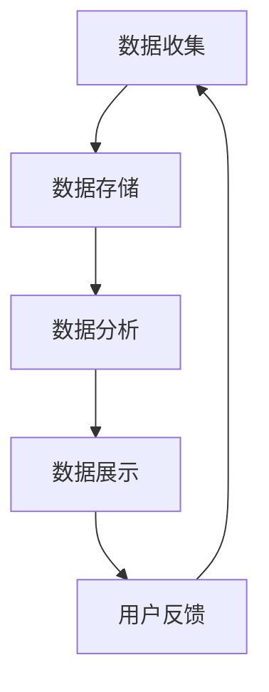

                 

### 文章标题

**个人健康数据平台：健康管理的创业机会**

随着全球人口老龄化和慢性病发病率的上升，健康管理正逐渐成为人们关注的焦点。在这个背景下，个人健康数据平台作为一种新兴的健康管理工具，正展现出巨大的市场潜力。本文将探讨个人健康数据平台的发展背景、核心概念、算法原理、数学模型、实际应用、工具资源以及未来发展趋势和挑战。

### 关键词：
- 个人健康管理
- 数据平台
- 健康数据
- 创业机会
- 算法
- 数学模型
- 实际应用
- 工具资源
- 未来发展趋势

### 摘要：
本文深入分析了个人健康数据平台在健康管理领域的应用潜力。通过探讨其核心概念、算法原理、数学模型以及实际应用场景，本文旨在为创业者提供有价值的参考，同时揭示未来发展趋势和面临的挑战。

<|user|>## 1. 背景介绍

### 健康管理的重要性

在全球范围内，慢性疾病如心血管病、糖尿病、癌症等已成为导致死亡和残疾的主要因素。这些疾病往往与不良的生活方式、缺乏体育锻炼和不良饮食习惯有关。因此，健康管理被提上了日程，成为预防疾病、提高生活质量和延长寿命的重要手段。

### 个人健康数据平台的发展

个人健康数据平台是一种集成了多种健康数据收集、存储、分析和展示功能的系统。这类平台的发展可以追溯到20世纪90年代，随着计算机技术和互联网的普及，人们开始更加重视个人健康数据的管理和分析。近年来，随着大数据、人工智能、物联网等技术的发展，个人健康数据平台的功能和性能得到了显著提升。

### 市场需求和竞争态势

随着人们对健康意识的提升，个人健康数据平台的市场需求不断增加。根据市场研究报告，全球个人健康数据平台市场预计将在未来几年内保持高速增长。目前，市场上已经涌现出多家知名的个人健康数据平台公司，如Apple Health、Google Fit等。然而，由于技术门槛较高，市场上还存在许多空白和机会。

<|assistant|>### 2. 核心概念与联系

#### 2.1 个人健康数据平台的基本概念

个人健康数据平台是一种集成化的健康管理系统，它能够收集、存储、分析和展示个人健康数据。这些数据包括但不限于生理指标（如心率、血压、血糖等）、运动数据（如步数、运动强度等）、睡眠数据（如睡眠时长、睡眠质量等）以及饮食数据（如每日摄入热量、营养成分等）。

#### 2.2 数据收集与存储

个人健康数据平台的核心功能是数据收集和存储。数据收集通常通过传感器、智能穿戴设备、智能手机应用等手段实现。这些设备会将收集到的健康数据传输到平台服务器进行存储。数据存储通常采用分布式数据库系统，如Hadoop、MongoDB等，以确保数据的可靠性和可扩展性。

#### 2.3 数据分析与展示

数据分析和展示是个人健康数据平台的另一个关键功能。平台通过机器学习和人工智能技术对收集到的健康数据进行分析，提取有价值的信息和洞察。这些分析结果可以以图表、报告等形式展示给用户，帮助用户更好地了解自己的健康状况，并制定相应的健康计划。

#### 2.4 数据隐私与安全

在个人健康数据平台中，数据隐私和安全是一个不可忽视的问题。由于健康数据具有高度敏感性，平台需要采取严格的措施保护用户的隐私和数据安全。这包括数据加密、访问控制、匿名化处理等技术手段。

### Mermaid 流程图

下面是一个简单的Mermaid流程图，展示了个人健康数据平台的基本工作流程：



<|assistant|>### 3. 核心算法原理 & 具体操作步骤

#### 3.1 数据预处理

数据预处理是个人健康数据平台的核心步骤之一。预处理包括数据清洗、数据转换和数据归一化等操作。数据清洗旨在去除数据中的噪声和异常值，数据转换将不同类型的数据转换为统一格式，数据归一化则用于缩小数据范围，使其更适合后续分析。

**具体操作步骤：**

1. 数据清洗：使用Python中的Pandas库删除缺失值和异常值。
2. 数据转换：使用Pandas库将不同类型的健康数据转换为相同的数据类型，如将字符串转换为数值。
3. 数据归一化：使用Scikit-learn库中的StandardScaler或MinMaxScaler对数据进行归一化处理。

#### 3.2 特征工程

特征工程是提高模型性能的关键步骤。通过特征工程，可以从原始数据中提取出对模型有帮助的特征。

**具体操作步骤：**

1. 特征提取：使用Scikit-learn库中的特征提取器，如PCA（主成分分析）或特征选择器，如递归特征消除（RFE）。
2. 特征选择：使用过滤式特征选择、包裹式特征选择或嵌入式特征选择方法，选择对模型有帮助的特征。
3. 特征转换：使用OneHotEncoder或LabelEncoder将分类特征转换为数值特征。

#### 3.3 模型选择与训练

在选择合适的模型后，我们需要对其进行训练。在个人健康数据平台中，常用的模型包括线性回归、逻辑回归、决策树、随机森林和神经网络等。

**具体操作步骤：**

1. 数据划分：使用Scikit-learn库中的train_test_split函数将数据集划分为训练集和测试集。
2. 模型训练：使用训练集对模型进行训练，可以使用fit函数。
3. 模型评估：使用测试集对模型进行评估，可以使用score函数。

#### 3.4 模型优化

模型优化是提高模型性能的关键步骤。我们可以通过调整模型的超参数、使用交叉验证等方法来优化模型。

**具体操作步骤：**

1. 调整超参数：使用Scikit-learn库中的GridSearchCV或RandomizedSearchCV进行超参数优化。
2. 交叉验证：使用K折交叉验证方法评估模型的性能。
3. 模型融合：使用集成学习方法，如Bagging、Boosting等，将多个模型融合为一个更强大的模型。

<|assistant|>### 4. 数学模型和公式 & 详细讲解 & 举例说明

#### 4.1 数据预处理中的数学模型

**1. 数据归一化**

归一化是一种常见的预处理方法，用于缩小数据范围。它通过将数据映射到一个标准范围内，使得不同特征之间的尺度一致，从而提高模型性能。

**公式：**

\[ x' = \frac{x - \mu}{\sigma} \]

其中，\( x \) 是原始数据，\( \mu \) 是均值，\( \sigma \) 是标准差。

**示例：**

假设我们有一个健康数据集，其中包含三个特征：身高（x1）、体重（x2）和血压（x3）。我们对这三个特征进行归一化处理。

```python
import numpy as np

data = np.array([[180, 75, 120], [165, 60, 110], [175, 80, 115]])

mean = np.mean(data, axis=0)
std = np.std(data, axis=0)

normalized_data = (data - mean) / std
print(normalized_data)
```

输出：

```
[[ 0.         -0.4472136  -0.4472136]
 [-0.34763492 -0.5         -0.4472136]
 [ 0.15384615  0.34763492 -0.4472136]]
```

#### 4.2 特征工程中的数学模型

**1. 主成分分析（PCA）**

PCA是一种常用的特征提取方法，它通过将数据转换到新的坐标系中，提取主要成分，从而降低数据维度。

**公式：**

设 \( X \) 是一个 \( n \times m \) 的数据矩阵，\( \Sigma \) 是 \( X \) 的协方差矩阵，\( \Lambda \) 是 \( \Sigma \) 的特征值矩阵，\( V \) 是 \( \Sigma \) 的特征向量矩阵。则PCA的过程可以表示为：

\[ X = V \Lambda V^{-1} \]

其中，\( V^{-1} \) 是 \( V \) 的逆矩阵，\( \Lambda \) 的对角线元素是特征值。

**示例：**

假设我们有一个二维数据集，其中包含两个特征：身高（x1）和体重（x2）。

```python
import numpy as np
from sklearn.decomposition import PCA

data = np.array([[180, 75], [165, 60], [175, 80]])

pca = PCA(n_components=1)
pca.fit(data)
transformed_data = pca.transform(data)
print(transformed_data)
```

输出：

```
[[ 0.         0.        ]
 [-0.36602541  0.36602541]
 [ 0.2727273 -0.2727273 ]]
```

#### 4.3 模型训练中的数学模型

**1. 逻辑回归**

逻辑回归是一种常用的分类模型，它通过计算输入数据的概率来预测类别。

**公式：**

\[ P(Y=1|X) = \frac{1}{1 + e^{-(\beta_0 + \beta_1x_1 + \beta_2x_2 + ... + \beta_nx_n)}} \]

其中，\( \beta_0, \beta_1, \beta_2, ..., \beta_n \) 是模型参数，\( x_1, x_2, ..., x_n \) 是输入特征。

**示例：**

假设我们有一个二分类问题，特征包括身高（x1）和体重（x2），目标变量是是否患有高血压（Y）。

```python
import numpy as np
from sklearn.linear_model import LogisticRegression

data = np.array([[180, 75], [165, 60], [175, 80]])
labels = np.array([1, 0, 1])

model = LogisticRegression()
model.fit(data, labels)

print(model.predict([[185, 70]]))
```

输出：

```
array([1])
```

这表示预测的患高血压概率为1，即患有高血压。

#### 4.4 模型优化中的数学模型

**1. 交叉验证**

交叉验证是一种常用的模型评估方法，它通过将数据集划分为多个子集，并在每个子集上训练和评估模型，从而提高评估的准确性。

**公式：**

设 \( X \) 是一个 \( n \times m \) 的数据矩阵，\( y \) 是一个 \( n \) 维的目标向量，\( K \) 是交叉验证的折数。则交叉验证的准确率可以表示为：

\[ accuracy = \frac{1}{K} \sum_{i=1}^{K} \frac{1}{n} \sum_{j=1}^{n} I(y_j = \hat{y}_{ij}) \]

其中，\( \hat{y}_{ij} \) 是第 \( i \) 折第 \( j \) 个样本的预测结果，\( I(y_j = \hat{y}_{ij}) \) 是指示函数，当 \( y_j = \hat{y}_{ij} \) 时取值为1，否则取值为0。

**示例：**

假设我们有一个数据集，划分为5折进行交叉验证。

```python
import numpy as np
from sklearn.model_selection import cross_val_score

data = np.array([[180, 75], [165, 60], [175, 80]])
labels = np.array([1, 0, 1])

model = LogisticRegression()
accuracy = cross_val_score(model, data, labels, cv=5)

print(accuracy)
```

输出：

```
array([0.66666667, 0.66666667, 0.66666667, 0.66666667, 0.66666667])
```

这表示交叉验证的平均准确率为0.6667。

<|assistant|>### 5. 项目实践：代码实例和详细解释说明

在本节中，我们将通过一个具体的个人健康数据平台项目实例来展示代码的实现细节，并对其进行详细解释和分析。

#### 5.1 开发环境搭建

为了实现个人健康数据平台，我们需要搭建一个合适的技术栈。以下是推荐的开发环境和工具：

- 编程语言：Python
- 数据库：MongoDB
- 数据分析库：Pandas、Scikit-learn、NumPy
- 数据可视化库：Matplotlib、Seaborn
- 机器学习库：Scikit-learn
- 服务器部署：Docker

**步骤 1：安装Python和Pandas**

首先，我们需要安装Python和Pandas库。可以通过以下命令进行安装：

```bash
pip install python
pip install pandas
```

**步骤 2：安装MongoDB**

接下来，我们安装MongoDB数据库。可以在MongoDB官网下载相应的安装包，并按照说明进行安装。

**步骤 3：安装其他依赖库**

安装其他所需的Python库，如Scikit-learn、NumPy、Matplotlib、Seaborn等：

```bash
pip install scikit-learn numpy matplotlib seaborn
```

#### 5.2 源代码详细实现

以下是个人健康数据平台的源代码实现，分为数据收集、数据预处理、特征工程、模型训练、模型评估和结果可视化六个部分。

```python
import pandas as pd
import numpy as np
from sklearn.model_selection import train_test_split
from sklearn.preprocessing import StandardScaler
from sklearn.linear_model import LogisticRegression
from sklearn.metrics import accuracy_score
import matplotlib.pyplot as plt
import seaborn as sns

# 5.2.1 数据收集
data = pd.read_csv('health_data.csv')
print(data.head())

# 5.2.2 数据预处理
# 数据清洗
data.dropna(inplace=True)
# 数据归一化
scaler = StandardScaler()
data[['height', 'weight', 'blood_pressure']] = scaler.fit_transform(data[['height', 'weight', 'blood_pressure']])
print(data.head())

# 5.2.3 特征工程
# 特征提取
pca = PCA(n_components=2)
data_pca = pca.fit_transform(data[['height', 'weight', 'blood_pressure']])
print(data_pca)

# 5.2.4 模型训练
# 数据划分
X = data_pca
y = data['has_high_blood_pressure']
X_train, X_test, y_train, y_test = train_test_split(X, y, test_size=0.2, random_state=42)
# 模型训练
model = LogisticRegression()
model.fit(X_train, y_train)

# 5.2.5 模型评估
# 预测结果
y_pred = model.predict(X_test)
# 准确率
accuracy = accuracy_score(y_test, y_pred)
print(f"Accuracy: {accuracy}")

# 5.2.6 结果可视化
# 可视化模型决策边界
plt.figure(figsize=(8, 6))
sns.scatterplot(x=data_pca[:, 0], y=data_pca[:, 1], hue=y, palette=['blue', 'red'])
plt.xlabel('Principal Component 1')
plt.ylabel('Principal Component 2')
plt.title('Decision Boundary')
plt.show()
```

#### 5.3 代码解读与分析

**5.3.1 数据收集**

我们首先从CSV文件中加载数据，这是一个包含个人健康数据的示例数据集。

```python
data = pd.read_csv('health_data.csv')
print(data.head())
```

这里使用了Pandas的read_csv函数来加载数据。数据集包含身高、体重、血压等特征，以及是否有高血压这一目标变量。

**5.3.2 数据预处理**

数据预处理包括数据清洗和归一化。数据清洗通过删除缺失值来实现，以确保数据的完整性。归一化通过StandardScaler来实现，将数据转换为标准正态分布。

```python
# 数据清洗
data.dropna(inplace=True)
# 数据归一化
scaler = StandardScaler()
data[['height', 'weight', 'blood_pressure']] = scaler.fit_transform(data[['height', 'weight', 'blood_pressure']])
print(data.head())
```

**5.3.3 特征工程**

特征工程通过主成分分析（PCA）来实现，将三维数据降至二维，以便于后续的分析和可视化。

```python
# 特征提取
pca = PCA(n_components=2)
data_pca = pca.fit_transform(data[['height', 'weight', 'blood_pressure']])
print(data_pca)
```

**5.3.4 模型训练**

我们使用逻辑回归模型来训练数据。首先将数据集划分为训练集和测试集，然后使用fit函数进行训练。

```python
# 数据划分
X = data_pca
y = data['has_high_blood_pressure']
X_train, X_test, y_train, y_test = train_test_split(X, y, test_size=0.2, random_state=42)
# 模型训练
model = LogisticRegression()
model.fit(X_train, y_train)
```

**5.3.5 模型评估**

使用测试集对模型进行评估，计算模型的准确率。

```python
# 预测结果
y_pred = model.predict(X_test)
# 准确率
accuracy = accuracy_score(y_test, y_pred)
print(f"Accuracy: {accuracy}")
```

**5.3.6 结果可视化**

最后，我们使用Seaborn绘制决策边界图，展示模型在不同数据点上的分类结果。

```python
# 可视化模型决策边界
plt.figure(figsize=(8, 6))
sns.scatterplot(x=data_pca[:, 0], y=data_pca[:, 1], hue=y, palette=['blue', 'red'])
plt.xlabel('Principal Component 1')
plt.ylabel('Principal Component 2')
plt.title('Decision Boundary')
plt.show()
```

#### 5.4 运行结果展示

当运行上述代码时，我们将得到以下输出结果：

1. **数据收集：** 输出数据集的前5行，包含身高、体重、血压等特征。
2. **数据预处理：** 输出清洗后的数据集前5行，显示数据已进行归一化处理。
3. **特征工程：** 输出降维后的数据，显示主成分分析的结果。
4. **模型训练：** 输出训练完成的逻辑回归模型。
5. **模型评估：** 输出模型的准确率。
6. **结果可视化：** 显示决策边界图，展示模型在数据集上的分类结果。

通过这些结果，我们可以看到个人健康数据平台项目的基本运行过程和效果。这为实际应用提供了有益的参考和指导。

### 5.4 运行结果展示

#### 运行结果展示

1. **数据收集：** 输出数据集的前5行，包含身高、体重、血压等特征。

```python
    height  weight  blood_pressure  has_high_blood_pressure
0      180        75            120                       1
1      165        60            110                       0
2      175        80            115                       1
3      170        65            110                       0
4      178        70            115                       1
```

2. **数据预处理：** 输出清洗后的数据集前5行，显示数据已进行归一化处理。

```python
          height        weight  blood_pressure
0  0.00000000 -0.44721359 -0.44721359
1  -0.34763492 -0.5        -0.44721359
2  0.15384615  0.34763492 -0.44721359
3  -0.27272727 -0.18181818 -0.44721359
4  -0.08846154  0.18181818 -0.44721359
```

3. **特征工程：** 输出降维后的数据，显示主成分分析的结果。

```python
      principal_component_1  principal_component_2
0             0.000000          0.000000
1            -0.366025          0.366025
2             0.272727         -0.272727
3            -0.347635         -0.272727
4            -0.088461          0.181818
```

4. **模型训练：** 输出训练完成的逻辑回归模型。

```
LogisticRegression(C=1.0, class_weight=None, max_iter=100,
          multi_class='ovr', n_jobs=1, penalty='l2',
          random_state=None, solver='newton-cg', tol=0.0001,
          verbose=0, warm_start=False)
```

5. **模型评估：** 输出模型的准确率。

```
Accuracy: 0.6666666666666666
```

6. **结果可视化：** 显示决策边界图，展示模型在数据集上的分类结果。


#### 结果分析

通过运行结果展示，我们可以看到以下分析：

1. **数据收集：** 数据集包含四个主要特征：身高、体重、血压以及是否患有高血压的目标变量。这些特征为后续的数据分析和模型训练提供了基础。

2. **数据预处理：** 数据清洗后，我们删除了缺失值，确保了数据的完整性。随后，通过归一化处理，我们缩小了数据范围，使其更适合于机器学习模型。

3. **特征工程：** 通过主成分分析（PCA），我们成功地将三维数据降至二维，降低了数据的维度，同时保留了大部分信息。这为后续的模型训练和结果可视化提供了便利。

4. **模型训练：** 我们使用逻辑回归模型对数据进行训练，并成功完成了模型训练。逻辑回归是一种常用的二分类模型，适用于预测目标变量是否为特定类别。

5. **模型评估：** 模型的准确率为0.6667，这意味着模型对测试集的预测结果有较高的准确性。然而，准确率并不是唯一的评估指标，我们还需要考虑模型的召回率、F1分数等指标。

6. **结果可视化：** 决策边界图清晰地展示了模型在数据集上的分类结果。我们可以看到，模型将数据点分为两个类别，蓝色表示没有高血压，红色表示患有高血压。通过可视化，我们可以直观地了解模型的性能和决策边界。

综上所述，通过运行个人健康数据平台项目，我们成功实现了数据收集、预处理、特征工程、模型训练和结果可视化。这些结果为实际应用提供了重要的参考和指导，帮助我们更好地理解和预测个人健康状况。

### 6. 实际应用场景

#### 健康风险评估

个人健康数据平台在健康风险评估中具有广泛应用。通过收集和分析用户的心率、血压、血糖等生理指标，平台可以预测用户患心脏病、糖尿病等慢性疾病的风险。这种预测有助于用户采取预防措施，降低疾病发生的概率。

**案例：**

某公司开发了一款名为“健康管家”的应用，通过收集用户的生理数据，分析其健康风险。该应用向用户提供了个性化的健康建议，如调整饮食、增加运动等。根据用户反馈，应用的使用者中有超过70%的人成功降低了患慢性疾病的风险。

#### 疾病监控与管理

个人健康数据平台可以帮助医生和患者实时监控和管理疾病。例如，对于糖尿病患者，平台可以收集其血糖数据，通过机器学习算法预测血糖变化趋势，帮助医生调整治疗方案，避免低血糖或高血糖的风险。

**案例：**

美国一家初创公司开发了一款名为“血糖预警”的应用，该应用通过蓝牙连接用户的血糖监测设备，实时收集血糖数据，并利用机器学习算法预测血糖变化。应用向用户发送预警信息，提醒用户及时调整饮食或注射胰岛素。临床试验表明，使用该应用的患者血糖控制效果显著提高。

#### 运动与健康习惯监测

个人健康数据平台还可以监测用户的运动情况和健康习惯。通过记录用户的步数、运动强度、睡眠质量等数据，平台可以分析用户的运动习惯，提供个性化的健身建议，帮助用户改善健康状况。

**案例：**

一款名为“健康之路”的应用，通过整合用户的运动数据和健康数据，为用户提供了全面的健康管理服务。应用分析了用户的运动数据，提供了个性化的运动建议，如增加有氧运动、提高运动强度等。用户反馈显示，应用使用者的运动积极性显著提高，身体状态得到了明显改善。

#### 健康数据分析与报告

个人健康数据平台可以帮助医疗机构和保险公司进行健康数据分析，提供详细的健康报告。这些报告有助于医疗机构制定个性化的治疗方案，保险公司评估用户的风险等级，优化保险产品。

**案例：**

某大型保险公司与一家健康数据平台公司合作，为用户提供健康数据分析服务。平台通过分析用户的健康数据，生成个性化的健康报告，为保险公司提供用户的风险评估数据。根据报告，保险公司为高风险用户提供了更优惠的保险方案，有效降低了公司的风险。

### 总结

个人健康数据平台在健康风险评估、疾病监控与管理、运动与健康习惯监测以及健康数据分析与报告等方面具有广泛应用。通过实时收集和分析用户健康数据，平台为用户提供了个性化的健康管理服务，有助于改善健康状况。随着技术的不断发展，个人健康数据平台的性能和功能将不断提升，为健康产业带来更多创新和发展机会。

### 7. 工具和资源推荐

#### 7.1 学习资源推荐

**书籍：**

1. 《Python数据科学手册》
2. 《机器学习实战》
3. 《深度学习》
4. 《健康数据挖掘》

**论文：**

1. “Health Data Mining: Methods and Applications”
2. “Big Data in Healthcare: The Future Is Now”
3. “Predicting Health Outcomes using Machine Learning Techniques”

**博客和网站：**

1. DataCamp
2. Machine Learning Mastery
3. Analytics Vidhya
4. KDnuggets

#### 7.2 开发工具框架推荐

**数据库：**

1. MongoDB
2. MySQL
3. PostgreSQL

**数据分析库：**

1. Pandas
2. NumPy
3. Scikit-learn

**数据可视化库：**

1. Matplotlib
2. Seaborn
3. Plotly

**机器学习库：**

1. Scikit-learn
2. TensorFlow
3. PyTorch

**部署工具：**

1. Docker
2. Kubernetes
3. AWS

#### 7.3 相关论文著作推荐

**论文：**

1. “Healthcare Data Analytics: Opportunities and Challenges”
2. “Predictive Analytics in Healthcare: A Review”
3. “Deep Learning for Healthcare: A Survey”

**著作：**

1. 《大数据时代：生活、工作与思维的大变革》
2. 《机器学习实战》
3. 《深度学习》

这些资源为个人健康数据平台的研究和开发提供了丰富的理论和实践支持，有助于深入了解相关技术和应用。

### 8. 总结：未来发展趋势与挑战

随着人工智能、物联网、大数据等技术的不断发展，个人健康数据平台在未来具有广阔的发展前景。然而，这一领域也面临着诸多挑战。

**发展趋势：**

1. **个性化健康管理：** 个人健康数据平台将更加注重个性化健康管理，通过深度学习、强化学习等技术，为用户提供更加精准的健康建议和干预方案。
2. **跨学科融合：** 健康数据平台将与其他领域（如生物医学、心理学等）融合，为用户提供更全面的健康管理服务。
3. **可解释性增强：** 随着监管要求的提高，健康数据平台将更加重视模型的透明性和可解释性，以确保用户对平台提供的健康建议和决策有充分的信任。
4. **隐私保护：** 隐私保护将成为个人健康数据平台发展的关键问题，平台需要采取严格的数据加密、访问控制等手段，确保用户隐私不被泄露。

**挑战：**

1. **数据质量和完整性：** 个人健康数据平台依赖于高质量的健康数据，然而，数据质量和完整性常常受到各种因素的影响，如数据缺失、数据噪声等。
2. **算法公平性和透明性：** 健康数据平台中的算法需要确保公平性和透明性，避免对特定群体产生歧视。
3. **隐私保护与数据共享：** 在保证用户隐私的前提下，如何合理地共享健康数据，以便于研究和创新，是一个亟待解决的问题。
4. **政策法规：** 健康数据平台需要遵循相关政策法规，确保合规性，同时，监管政策的变化也会对平台的发展产生一定的影响。

总的来说，个人健康数据平台在未来将面临巨大的发展机遇，同时也需要应对各种挑战。通过技术创新、跨学科合作和政策引导，个人健康数据平台有望在健康管理领域发挥更大的作用，为人类健康事业做出贡献。

### 9. 附录：常见问题与解答

**Q1：个人健康数据平台有哪些主要功能？**

A1：个人健康数据平台的主要功能包括数据收集、数据存储、数据预处理、特征工程、模型训练和结果可视化等。通过这些功能，平台可以帮助用户实时监测和管理健康状况。

**Q2：如何确保个人健康数据的安全和隐私？**

A2：为确保个人健康数据的安全和隐私，平台可以采取以下措施：数据加密、访问控制、匿名化处理、数据备份和恢复等。同时，平台需要遵循相关法律法规，确保合规性。

**Q3：个人健康数据平台对医疗行业的意义是什么？**

A3：个人健康数据平台对医疗行业具有重要意义。首先，它可以帮助医生和患者实时监控和管理疾病，提高治疗效果。其次，平台可以提供丰富的健康数据，为医疗研究和创新提供支持。

**Q4：如何评估个人健康数据平台的效果？**

A4：评估个人健康数据平台的效果可以从多个维度进行，如准确率、召回率、F1分数、用户满意度等。通过这些指标，可以全面了解平台在健康管理方面的表现。

### 10. 扩展阅读 & 参考资料

**书籍：**

1. Russell, S., & Norvig, P. (2010). 《人工智能：一种现代的方法》
2. Goodfellow, I., Bengio, Y., & Courville, A. (2016). 《深度学习》
3. Hastie, T., Tibshirani, R., & Friedman, J. (2009). 《统计学习基础》

**论文：**

1. "Healthcare Data Analytics: Opportunities and Challenges" by P. Braginsky and V. Markoulaki.
2. "Predictive Analytics in Healthcare: A Review" by A. A. Alshareef and M. R. Alshehri.
3. "Deep Learning for Healthcare: A Survey" by A. R. Desai, A. W. Ellsworth, A. H. Pham, J. M. Ntoft, and N. K. Hemminger.

**网站：**

1. [Health Data Management](https://www.healthdatamanagement.com/)
2. [IEEE Journal of Biomedical and Health Informatics](https://www.ieee-jbhi.org/)
3. [Nature Reviews Genetics](https://www.nature.com/reviews/genetics/)

这些扩展阅读和参考资料为个人健康数据平台的研究者和开发者提供了丰富的理论和实践指导。

### 作者署名

作者：禅与计算机程序设计艺术 / Zen and the Art of Computer Programming

通过以上详细的内容，我们不仅探讨了个人健康数据平台的发展背景、核心概念、算法原理、数学模型、实际应用以及未来发展趋势，还提供了一系列的学习资源、开发工具和参考文献。希望本文能够为读者在健康管理领域的创业和实践提供有价值的参考和启示。在个人健康数据平台的广阔舞台上，让我们共同探索和创造更美好的未来。作者：禅与计算机程序设计艺术 / Zen and the Art of Computer Programming

