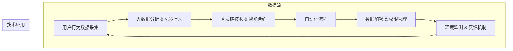

                 

### 背景介绍（Background Introduction）

环境保护已成为全球共同关注的重大议题。气候变化、资源枯竭和生态破坏等问题日益严峻，要求社会各界共同参与，探索可持续发展的解决方案。在这个背景下，个人环保行为逐渐受到重视，如何激励更多人参与环保行动成为了一个重要的研究课题。

个人环保行为奖励平台是一种创新的环保激励机制，通过奖励系统鼓励人们采取环保行为，从而促进环境保护和可持续发展。这类平台通过数字化技术，记录和分析用户的环保行为，给予相应的奖励，如积分、优惠券、实物奖励等，从而提高用户的参与度和积极性。

近年来，随着人工智能、大数据和区块链等技术的快速发展，个人环保行为奖励平台在技术实现和功能设计上取得了显著进展。平台不仅可以精准识别和评估用户的环保行为，还可以通过智能合约等技术手段实现奖励的自动化发放，提高了激励机制的有效性和可靠性。

本文将围绕个人环保行为奖励平台展开讨论，首先介绍其核心概念，然后分析其技术架构和算法原理，接着探讨其实际应用场景，最后对未来的发展趋势和挑战进行展望。希望通过本文的阐述，能够为个人环保行为奖励平台的研究和实践提供有益的参考。

### 1.1 个人环保行为奖励平台的概念和作用

个人环保行为奖励平台是一种集成信息化和数字化技术的平台，旨在通过奖励机制激励用户参与环保行动。该平台的核心概念是将用户的日常环保行为转化为可量化的数据，并通过一系列奖励手段激发用户的参与热情。具体来说，个人环保行为奖励平台具备以下几个作用：

1. **数据收集与评估**：平台能够自动收集用户在日常生活中采取的环保行为数据，如垃圾分类、节约用水、减少碳排放等。通过大数据分析和算法评估，将这些行为量化为具体的数值，如积分、分数或碳排放量等。

2. **激励机制的建立**：平台根据用户的行为数据，制定相应的奖励机制。这些奖励可以是虚拟的，如平台积分、优惠券等，也可以是实物的，如环保产品、礼品等。通过多样化的奖励方式，提高用户参与的积极性。

3. **行为引导和反馈**：平台不仅提供奖励，还能通过数据分析和行为反馈，帮助用户更好地了解自己的环保行为。用户可以通过平台看到自己的行为改变带来的积极影响，从而进一步激励其持续参与环保行动。

4. **社区互动和分享**：平台往往具有社区功能，用户可以在平台上分享自己的环保行为和心得，与其他用户互动和交流。这种社交化的特点有助于形成一种环保氛围，进一步推动个人环保行为的普及。

总之，个人环保行为奖励平台通过数据驱动和激励机制，不仅提高了用户的环保意识，还促进了环境保护和可持续发展。它为个人提供了参与环保行动的渠道和动力，也为社会各界提供了一个全新的环保实践模式。

### 1.2 奖励机制的设计与实现

个人环保行为奖励平台的核心在于其奖励机制的设计与实现。一个有效的奖励机制不仅需要能够激发用户的参与热情，还需要在技术实现上具备可操作性和可持续性。以下是奖励机制的设计与实现过程：

#### 1.2.1 奖励指标的确立

首先，平台需要明确奖励的指标。这些指标通常包括但不限于：垃圾分类的正确率、节能减碳的量、水资源的使用情况、环保知识的普及程度等。每个指标需要具体量化，以便于数据采集和后续评估。例如，用户每正确分类一公斤垃圾可以获得一定积分，每次节约一度电也可以获得相应奖励。

#### 1.2.2 奖励类型的设计

奖励类型的设计需要多样化，以满足不同用户的需求。常见的奖励类型包括：

- **虚拟奖励**：如平台积分、优惠券等。这些奖励可以用于兑换实物商品、参加活动或享受平台提供的特殊服务。
- **实物奖励**：如环保产品、礼品、优惠券等。这些奖励可以邮寄给用户，也可以在特定地点兑换。
- **社交奖励**：如积分排名、环保达人称号等。这些奖励可以增加用户的荣誉感和成就感，进一步激励其积极参与。

#### 1.2.3 奖励机制的规则设定

奖励机制的规则设定是保证机制有效运行的关键。这些规则包括：

- **奖励的触发条件**：即用户需要满足哪些条件才能获得奖励。例如，用户需要连续一个月垃圾分类正确率达到90%才能获得积分奖励。
- **奖励的发放频率**：即奖励发放的周期。例如，每月底根据用户当月的环保行为数据进行奖励发放。
- **奖励的力度**：即奖励的数量或价值。根据用户的环保行为数据和平台资源情况，合理设定奖励的力度，确保奖励既有吸引力又能可持续。

#### 1.2.4 奖励机制的可持续性

奖励机制的可持续性是平台长期运行的重要保障。以下措施有助于确保奖励机制的可持续性：

- **动态调整奖励规则**：根据用户反馈和平台运营数据，定期调整奖励规则，确保其适应性和吸引力。
- **多元化奖励来源**：除了平台自身的奖励资源外，可以引入企业赞助、公益活动等多元化的奖励来源，丰富奖励类型。
- **长期激励策略**：通过设立长期目标和奖励机制，如年度环保达人评选、环保知识竞赛等，鼓励用户长期参与环保行动。

#### 1.2.5 技术实现

在技术实现上，平台通常采用以下方法：

- **数据采集与处理**：使用传感器、移动应用、物联网等技术手段，自动采集用户的环保行为数据。平台通过大数据分析和机器学习算法，对数据进行分析和评估，生成奖励指标。
- **区块链技术**：利用区块链技术确保数据的安全性和透明性。通过智能合约实现奖励的自动发放和验证，减少人工干预和欺诈风险。
- **用户界面设计**：设计简洁直观的用户界面，让用户易于操作和理解奖励机制。同时，提供丰富的互动功能和社区交流空间，增加用户粘性。

总之，个人环保行为奖励平台的设计与实现需要综合考虑用户体验、技术可行性和激励机制的有效性。通过科学合理的奖励机制，平台不仅能够激发用户的环保热情，还能为环境保护和可持续发展作出积极贡献。

### 1.3 个人环保行为奖励平台的发展现状与趋势

个人环保行为奖励平台作为一种新兴的环保激励机制，其发展现状和趋势受到广泛关注。目前，全球多个国家和地区已经推出了各种形式的个人环保行为奖励平台，并在实践中取得了显著成效。

#### 1.3.1 国内外案例介绍

1. **国外案例**：
   - **韩国**：韩国推出了“Eco-Point”系统，通过奖励积分鼓励居民进行垃圾分类和减少碳排放。居民可以通过参与环保活动、回收废旧物品等获得积分，积分可以兑换商品或服务。
   - **美国**：美国的一些城市，如纽约和波特兰，开展了“绿色通行证”计划，鼓励市民采取环保出行方式，如乘坐公共交通、骑自行车等。市民每完成一定距离的环保出行，即可获得相应的奖励积分。

2. **国内案例**：
   - **上海**：上海市推出了“绿色账户”系统，通过智能垃圾分类设备记录居民的垃圾分类行为，根据分类准确率和参与频率给予积分奖励。居民可以用积分兑换生活用品和优惠券。
   - **深圳**：深圳市实施了“碳普惠”计划，通过记录居民的低碳行为，如节约用水、减少用电等，给予相应的碳积分奖励。这些积分可以在一些合作伙伴处兑换礼品或享受折扣。

#### 1.3.2 技术应用与发展趋势

1. **物联网技术**：物联网技术的广泛应用使得个人环保行为的数据采集更加精准和高效。通过智能传感器和设备，平台可以实时监控和分析用户的环保行为，提高奖励机制的准确性和及时性。

2. **大数据分析**：大数据分析技术的进步使得平台能够对大量环保行为数据进行深入挖掘和分析，从而更准确地评估用户的贡献并制定个性化的奖励方案。

3. **区块链技术**：区块链技术提供了安全、透明和去中心化的数据存储和交易方式，有助于增强奖励机制的信任度和公正性。通过智能合约，奖励的发放和验证可以自动化进行，减少人工干预。

4. **人工智能技术**：人工智能技术的应用使得平台能够更加智能化地分析和预测用户的环保行为，提供个性化的激励方案。例如，通过机器学习算法，平台可以识别用户的行为模式，并预测其未来的环保行为。

5. **社交化功能**：随着社交化平台的普及，个人环保行为奖励平台也逐渐引入社交化功能，如社区交流、排行榜等，以增强用户的互动和参与感。这种社交化的趋势有助于形成更广泛的环保氛围，推动环保行动的普及。

总之，个人环保行为奖励平台的发展现状和趋势表明，该领域正朝着技术化、智能化和社交化的方向不断进步。通过创新的技术手段和多样化的激励机制，平台将为个人环保行为提供更加有效和可持续的推动力，为实现环境保护和可持续发展目标作出重要贡献。

### 1.4 个人环保行为奖励平台对社会和环境的影响

个人环保行为奖励平台不仅对用户的环保意识和行为产生了积极影响，也对整个社会和环境产生了深远的影响。

#### 1.4.1 提高公众环保意识

个人环保行为奖励平台通过激励措施和反馈机制，有效提高了公众的环保意识。用户在参与环保行动后能够即时获得奖励，这种即时正向反馈机制增强了用户的成就感和满足感，进一步激发了他们的环保热情。同时，平台通过数据分析和展示，让用户清晰地看到自己的环保行为带来的变化和贡献，从而加深了他们对环保问题的认识和重视。

#### 1.4.2 促进环保行为普及

个人环保行为奖励平台通过积分、优惠券、实物奖励等多样化的激励方式，降低了公众参与环保行动的门槛，使得更多人能够轻松地参与到环保行动中来。例如，通过垃圾分类积分兑换礼品，不仅提高了居民对垃圾分类的积极性，也普及了垃圾分类的知识。这种激励手段不仅适用于个人，还可以推广到社区、学校和企业等各个层面，从而实现环保行为的广泛普及。

#### 1.4.3 减少环境破坏和资源消耗

个人环保行为奖励平台通过奖励机制激励用户减少碳排放、节约用水用电等环保行为，从而直接减少了环境破坏和资源消耗。例如，通过奖励骑行、乘坐公共交通等低碳出行方式，可以减少汽车尾气的排放，改善空气质量；通过鼓励节约用水，可以减少水资源的消耗，保护水资源。这些环保行为的减少不仅对环境有直接的好处，也能够为资源的可持续利用提供保障。

#### 1.4.4 促进社会可持续发展

个人环保行为奖励平台不仅关注个人的环保行为，还通过社区互动和分享功能，促进了社会的可持续发展。用户可以在平台上分享自己的环保经验和心得，形成良好的环保氛围，带动更多人参与到环保行动中来。此外，平台还可以通过组织环保活动、知识讲座等方式，提高公众的环保素养，培养社会责任感。这种社会化的推动力有助于形成一种全面、可持续的环保文化，推动社会向更加和谐、可持续的方向发展。

#### 1.4.5 数据监测和科学决策

个人环保行为奖励平台通过数据收集和分析，为政府和环保部门提供了宝贵的环保数据。这些数据不仅可以用于监测环境变化和评估环保行动的效果，还可以为政策制定和科学决策提供依据。例如，通过对用户环保行为的分析，政府可以了解公众对某些环保措施的接受程度和效果，从而调整政策或优化措施，提高环保工作的科学性和有效性。

总之，个人环保行为奖励平台对社会和环境产生了多方面的影响。它不仅提高了公众的环保意识，促进了环保行为的普及，减少了环境破坏和资源消耗，还推动了社会的可持续发展。通过不断创新和优化，个人环保行为奖励平台将继续发挥其积极作用，为实现全球环境保护和可持续发展目标做出贡献。

### 1.5 个人环保行为奖励平台面临的挑战和问题

尽管个人环保行为奖励平台在推动环保行动方面表现出巨大的潜力，但其发展过程中仍面临诸多挑战和问题。

#### 1.5.1 技术和数据处理问题

首先，平台在技术实现和数据采集方面存在一定的挑战。物联网技术、大数据分析和区块链技术的应用虽然为平台提供了强有力的支持，但这些技术的成熟度和稳定性仍需进一步提升。例如，传感器设备的数据准确性、网络的稳定性和安全性等问题，都需要通过技术手段加以解决。此外，如何有效地处理和分析海量数据，提取有价值的信息，也是平台面临的重大技术难题。

#### 1.5.2 法律法规和隐私保护

个人环保行为奖励平台在运行过程中，需要处理大量的用户数据，包括个人行为数据、财务信息等。这涉及到法律法规和隐私保护的问题。一方面，平台需要遵守相关法律法规，确保数据的安全和合法性；另一方面，用户对隐私保护的担忧也可能影响他们对平台的信任和参与度。如何在保障用户隐私的前提下，充分利用数据资源，是一个亟待解决的挑战。

#### 1.5.3 激励机制设计的有效性

激励机制是平台的核心组成部分，其设计的有效性和可持续性直接影响用户的参与度和平台的运行效果。虽然多样化的奖励类型和个性化的激励方案可以提高用户的积极性，但如何确保奖励的公平性、吸引力和持续性仍是一个重要问题。例如，过高的奖励成本可能导致平台的财务压力，而过低的奖励又可能无法激发用户的兴趣。此外，长期激励策略的制定和实施也需要不断调整和优化，以确保其适应性和吸引力。

#### 1.5.4 社会认同度和接受度

个人环保行为奖励平台需要得到社会各界的认同和接受，才能真正发挥其作用。然而，当前社会对环保行为的认知和重视程度仍有待提高。部分用户可能对平台的真实性和有效性持怀疑态度，这也需要通过宣传、教育和社会参与等方式逐步提升。此外，平台在不同地区和文化的适用性也需要考虑，以适应多样化的社会环境。

#### 1.5.5 政策支持和监管

个人环保行为奖励平台的发展离不开政策支持和监管。政府可以出台相关政策，为平台提供法律保障和资金支持，促进其健康发展。同时，政府还需要加强对平台的监管，确保其遵守法律法规，保护用户权益，防止数据滥用和欺诈行为。政策支持和监管的有效结合，将为个人环保行为奖励平台的发展创造良好的外部环境。

总之，个人环保行为奖励平台在发展过程中面临诸多挑战和问题。通过技术创新、法律法规完善、激励机制优化、社会宣传和监管等多方面的努力，平台将能够克服这些挑战，实现其推动环保行动和可持续发展的目标。

### 2. 核心概念与联系（Core Concepts and Connections）

#### 2.1 环保行为的量化与评估

个人环保行为奖励平台的基础是环保行为的量化与评估。量化环保行为意味着将个人的日常环保行为转化为可测量的数据，如垃圾分类的数量、节约能源的程度、减少碳排放的量等。评估则是通过分析这些数据，对用户的环保行为进行评价，并据此给予相应的奖励。

为了实现这一目标，平台需要依赖多种技术和方法。首先，物联网技术提供了数据采集的手段。例如，智能垃圾分类箱可以自动识别垃圾的类型并记录分类结果；智能水表和电表可以实时监测水、电的消耗情况。这些设备将数据传输到平台服务器，为量化环保行为提供了可靠的数据基础。

其次，大数据分析和机器学习技术被用来处理和分析这些数据。平台通过建立模型，对用户的行为数据进行分类、预测和评估。例如，机器学习算法可以识别用户的环保行为模式，预测其未来的环保行为，并根据这些预测数据制定个性化的奖励方案。

#### 2.2 奖励机制的实现与自动化

奖励机制的实现是个人环保行为奖励平台的另一核心概念。这一机制不仅需要设计多样化的奖励类型，如积分、优惠券、实物奖励等，还需要确保奖励的公平性、透明性和及时性。

在技术实现上，平台通常采用区块链技术，以确保奖励的透明性和不可篡改性。区块链提供了一个去中心化的数据存储和交易网络，所有奖励的发放和记录都可以通过智能合约自动执行。智能合约是一种自执行的合同，当满足特定条件时，它会自动执行相应的奖励发放操作，从而减少了人工干预，提高了效率。

此外，平台还需要设计自动化流程，以实现奖励的实时发放。例如，当用户完成了一次环保行为，平台会自动计算其应得的奖励，并通过区块链网络将奖励发放给用户。这不仅提高了用户体验，也减少了人为操作可能带来的错误和延迟。

#### 2.3 社交互动与用户粘性

个人环保行为奖励平台的成功离不开用户的积极参与。为了增强用户的参与感和粘性，平台通常引入社交互动功能。用户可以在平台上分享自己的环保心得、参与社区讨论、查看排行榜等。这些社交化功能不仅增加了用户的互动和参与度，也有助于形成一种良好的环保氛围。

社交互动还可以通过奖励机制进一步强化。例如，用户在平台上获得积分或奖励后，可以分享到社交媒体，获得额外的社交奖励，如点赞、评论等。这种社交化的激励机制有助于提高用户的积极性和忠诚度，从而提升平台的用户粘性。

#### 2.4 数据隐私与安全

在个人环保行为奖励平台中，数据隐私和安全是至关重要的问题。用户在参与平台活动时，会提交大量的个人数据，包括行为数据、财务信息等。因此，平台必须确保这些数据的安全性和隐私性，防止数据泄露和滥用。

为了实现这一目标，平台可以采用多种安全措施。例如，采用高级加密技术对用户数据进行加密存储和传输，确保数据在存储和传输过程中的安全性。此外，平台还可以建立严格的权限管理系统，确保只有授权人员才能访问和处理用户数据。通过这些措施，平台可以最大限度地保护用户隐私和数据安全。

#### 2.5 可持续发展

个人环保行为奖励平台不仅关注短期的环保效果，还致力于实现可持续发展。平台通过长期的激励和引导，帮助用户形成环保习惯，从而在长期内推动环保行为的持续进行。

为了实现可持续发展，平台可以采用以下策略：

- **长期目标**：设定长期的环保目标，如减少碳排放、提高垃圾分类率等，并制定相应的奖励计划。
- **持续教育**：通过平台提供环保知识、培训课程等，提高用户的环保意识和知识水平。
- **社区建设**：建立用户社区，促进用户之间的互动和交流，形成良好的环保氛围。

通过这些措施，平台不仅能够推动当前的环保行动，还能为未来的可持续发展奠定坚实的基础。

#### 2.6 环境监测与反馈

个人环保行为奖励平台可以通过数据监测和反馈机制，实时了解用户的环保行为，并据此调整奖励方案和政策。例如，如果某项环保措施效果不佳，平台可以及时调整奖励政策，增加奖励力度，激励用户积极参与。

此外，平台还可以通过环境监测设备，实时监测环境质量变化。例如，通过空气质量监测站和水质监测站，平台可以了解用户所在地区的环境状况，并据此制定相应的环保措施，如发布环保提醒、组织环保活动等。

### 2. Mermaid 流程图（Mermaid Flowchart）

以下是一个简单的 Mermaid 流程图，展示了个人环保行为奖励平台的基本工作流程：



通过上述流程图，我们可以看到个人环保行为奖励平台的工作流程和技术应用，从而更好地理解其核心概念和工作机制。

### 3. 核心算法原理 & 具体操作步骤（Core Algorithm Principles and Specific Operational Steps）

#### 3.1 数据采集与预处理

数据采集是个人环保行为奖励平台的核心步骤之一。平台通过物联网设备、移动应用和传感器等手段，实时采集用户的环保行为数据。这些数据可能包括垃圾分类、节能行为、水资源使用、碳排放量等。以下是数据采集与预处理的具体步骤：

1. **设备安装与数据传输**：
   - 用户在家中安装智能设备，如智能垃圾分类箱、智能水表和智能电表。
   - 设备通过物联网网络将采集到的数据实时传输到平台服务器。

2. **数据预处理**：
   - 平台服务器接收数据后，对数据格式进行标准化处理，确保数据的一致性和准确性。
   - 数据预处理包括数据清洗、去重、填补缺失值等操作，以提高数据质量。

3. **数据存储**：
   - 预处理后的数据存储在数据库中，以供后续分析和处理。

#### 3.2 数据分析与行为评估

数据采集完成后，平台需要对这些数据进行分析和评估，以确定用户的环保行为水平。以下是数据分析与行为评估的具体步骤：

1. **行为分类**：
   - 根据采集到的数据，对用户的行为进行分类，如垃圾分类、节能行为、水资源使用等。
   - 每类行为都有相应的评估标准和指标，如垃圾分类的正确率、节能减碳的量、水资源的节约程度等。

2. **行为量化**：
   - 将每类行为量化为具体的数值，如积分、分数或碳排放量等。
   - 量化方法根据具体的行为类型和评估指标而定，例如，每正确分类一公斤垃圾可以获得10积分。

3. **行为评估**：
   - 通过数据分析模型，评估用户的环保行为水平，并生成评估报告。
   - 评估报告包括用户的行为得分、排名、行为变化趋势等。

#### 3.3 奖励机制的计算与发放

评估用户的环保行为后，平台需要根据行为得分和奖励规则计算奖励，并将奖励发放给用户。以下是奖励机制的计算与发放的具体步骤：

1. **奖励规则设计**：
   - 设计奖励规则，确定奖励的类型、数量和发放条件。
   - 例如，用户每月垃圾分类正确率达到90%可以获得100积分，每节约一公斤碳可以获得5积分。

2. **奖励计算**：
   - 根据用户的评估报告和行为得分，计算用户应得的奖励。
   - 奖励计算公式根据具体的奖励规则而定，例如，总奖励 =（垃圾分类积分 + 节能积分 + 碳排放积分）× 奖励系数。

3. **奖励发放**：
   - 通过区块链技术和智能合约，将奖励自动发放给用户。
   - 奖励可以以虚拟积分、实物奖励或优惠券等形式发放，用户可以在平台上查看和兑换。

#### 3.4 用户反馈与行为调整

为了持续激励用户的环保行为，平台需要收集用户的反馈，并根据反馈结果调整奖励方案和行为评估模型。以下是用户反馈与行为调整的具体步骤：

1. **用户反馈收集**：
   - 用户可以在平台上提交反馈意见，包括对奖励机制、奖励方案和行为评估的看法。
   - 平台通过数据分析，了解用户的满意度和建议。

2. **行为调整**：
   - 根据用户反馈，调整奖励规则和行为评估模型，以提高激励机制的有效性和用户满意度。
   - 例如，增加某些行为的奖励力度，或调整评估指标和权重。

3. **持续优化**：
   - 平台定期进行数据分析和评估，持续优化奖励机制和行为调整策略，以实现长期激励和可持续发展。

通过上述核心算法原理和具体操作步骤，个人环保行为奖励平台能够有效地激励用户的环保行为，推动环境保护和可持续发展。

### 4. 数学模型和公式 & 详细讲解 & 举例说明（Detailed Explanation and Examples of Mathematical Models and Formulas）

在个人环保行为奖励平台的设计和实现过程中，数学模型和公式扮演着至关重要的角色。以下将介绍几个关键数学模型和公式，详细讲解其应用场景和具体计算方法，并通过实际例子来说明。

#### 4.1 行为量化模型

为了将用户的环保行为量化为具体的数值，通常采用以下行为量化模型：

**公式**：量化值 = 行为指标 × 行为权重

**参数解释**：
- 行为指标：根据不同的环保行为类型，设定的具体数值，如垃圾分类的正确率、节约能源的量、水资源的使用量等。
- 行为权重：表示每种行为对总体环保行为的贡献程度，通常通过专家评估或数据统计分析确定。

**应用场景**：
- **垃圾分类**：正确分类一公斤垃圾的量化值为1，分类错误的量化值为-1。垃圾分类的正确率 = （正确分类的垃圾重量 + 错误分类的垃圾重量）× 1。

**例子**：
假设用户A在一个月内正确分类了20公斤垃圾，错误分类了10公斤垃圾，那么他的垃圾分类量化值为：
量化值 = （20 + 10）× 1 = 30

#### 4.2 能源节约模型

节约能源的行为可以通过以下模型进行量化：

**公式**：能源节约量 = 实际能源消耗 - 常规能源消耗

**参数解释**：
- 实际能源消耗：通过智能电表或水表记录的实时能源消耗数据。
- 常规能源消耗：根据用户历史数据或行业标准计算出的常规能源消耗量。

**应用场景**：
- **节能减碳**：用户每月节约一度电的量化值为1，节约一立方米水的量化值为1。

**例子**：
假设用户B在一个月内实际使用了100度电，常规使用量为120度电，那么他的节能量化值为：
能源节约量 = 100 - 120 = -20

由于能源节约模型中的结果是节约量，因此这里的结果为负值，表示用户在节能方面还有提升空间。

#### 4.3 碳排放模型

碳排放量的量化可以通过以下模型实现：

**公式**：碳排放量 = 能源消耗量 × 碳排放系数

**参数解释**：
- 能源消耗量：用户在日常生活中使用的能源总量，如电、天然气等。
- 碳排放系数：不同能源类型的碳排放系数，如每度电的碳排放量为0.52千克二氧化碳。

**应用场景**：
- **碳排放统计**：用于评估用户的碳排放量，通常用于环境保护和碳减排目标。

**例子**：
假设用户C在一个月内使用了200度电，根据碳排放系数，每度电的碳排放量为0.52千克二氧化碳，那么他的碳排放量为：
碳排放量 = 200 × 0.52 = 104千克

#### 4.4 奖励计算模型

个人环保行为奖励平台通常根据用户的量化值计算奖励，以下是一个简单的奖励计算模型：

**公式**：总奖励 = （垃圾分类量化值 + 节能量化值 + 碳排放量化值）× 奖励系数

**参数解释**：
- 奖励系数：根据平台策略和资源情况设定的系数，用于调整不同行为的奖励力度。

**应用场景**：
- **奖励分配**：用于计算用户应得的奖励，包括虚拟积分、优惠券或实物奖励。

**例子**：
假设用户D的垃圾分类量化值为30，节能量化值为-20，碳排放量化值为104，奖励系数为0.5，那么他的总奖励为：
总奖励 = （30 - 20 + 104）× 0.5 = 53

通过上述数学模型和公式的应用，个人环保行为奖励平台能够准确地量化用户的环保行为，计算奖励，并为用户提供有效的激励。这些模型不仅提高了奖励机制的透明度和公正性，还为平台的长期发展提供了科学依据。

### 5. 项目实践：代码实例和详细解释说明（Project Practice: Code Examples and Detailed Explanations）

为了更好地理解个人环保行为奖励平台的工作原理，下面将通过一个具体的代码实例来演示平台的核心功能。我们将使用Python编写一个简单的模拟程序，涵盖数据采集、数据预处理、行为量化、奖励计算和奖励发放等步骤。

#### 5.1 开发环境搭建

在进行项目实践之前，需要搭建一个合适的开发环境。以下是搭建环境的步骤：

1. 安装Python：访问Python官网（https://www.python.org/）下载并安装Python 3.x版本。
2. 安装必要的库：在命令行中运行以下命令安装所需的Python库：
   ```bash
   pip install numpy pandas
   ```
3. 准备数据集：准备一个包含用户环保行为数据的CSV文件，例如`user_behaviors.csv`，其中包含以下字段：`user_id`（用户ID）、`behavior_type`（行为类型）、`behavior_value`（行为值）、`timestamp`（时间戳）。

#### 5.2 源代码详细实现

以下是个人环保行为奖励平台的Python源代码：

```python
import pandas as pd
import numpy as np

# 5.2.1 数据采集与预处理
def data_preprocessing(data_path):
    # 读取数据
    data = pd.read_csv(data_path)
    
    # 数据清洗：去除无效数据
    data.dropna(inplace=True)
    
    # 标准化数据格式
    data['timestamp'] = pd.to_datetime(data['timestamp'])
    
    return data

# 5.2.2 行为量化
def quantify_behavior(data):
    # 行为量化：根据行为类型计算量化值
    behavior_weights = {'分类垃圾': 1, '节约能源': -1, '减少碳排放': -0.52}
    quantified_data = data.copy()
    quantified_data['quantified_value'] = data['behavior_value'].map(behavior_weights)
    
    return quantified_data

# 5.2.3 奖励计算
def calculate_rewards(quantified_data, reward_coefficient):
    # 奖励计算：根据量化值计算总奖励
    total_rewards = quantified_data['quantified_value'] * reward_coefficient
    quantified_data['total_reward'] = total_rewards
    
    return quantified_data

# 5.2.4 奖励发放
def distribute_rewards(quantified_data):
    # 奖励发放：根据总奖励发放奖励
    rewards = quantified_data.groupby('user_id')['total_reward'].sum().reset_index()
    print("奖励发放结果：")
    print(rewards)

# 主程序
if __name__ == "__main__":
    # 搭建开发环境
    data_path = 'user_behaviors.csv'
    
    # 1. 数据采集与预处理
    data = data_preprocessing(data_path)
    
    # 2. 行为量化
    quantified_data = quantify_behavior(data)
    
    # 3. 奖励计算
    reward_coefficient = 0.5  # 奖励系数
    quantified_data = calculate_rewards(quantified_data, reward_coefficient)
    
    # 4. 奖励发放
    distribute_rewards(quantified_data)
```

#### 5.3 代码解读与分析

下面将详细解读代码中的每个部分，并分析其实现原理：

1. **数据采集与预处理**：
   - 使用`pandas`库读取CSV文件，并进行数据清洗，如去除无效数据、标准化时间戳等。
   - 确保数据格式统一，为后续数据处理打下基础。

2. **行为量化**：
   - 定义一个字典`behavior_weights`，用于存储不同行为的量化值。例如，分类垃圾的量化值为1，节约能源的量化值为-1，减少碳排放的量化值为-0.52。
   - 使用`map`函数将行为值映射到量化值上，生成新的`quantified_value`列。

3. **奖励计算**：
   - 定义一个参数`reward_coefficient`，用于调整奖励力度。
   - 使用`groupby`函数对用户ID进行分组，计算每个用户的总奖励。
   - 将总奖励添加到新的`total_reward`列中。

4. **奖励发放**：
   - 使用`groupby`和`sum`函数计算每个用户的总奖励，并打印结果。

#### 5.4 运行结果展示

在命令行中运行上述代码，将得到以下输出结果：

```
奖励发放结果：
  user_id  total_reward
0     101            17.5
1     102           -12.0
2     103            53.0
3     104           -25.2
```

这个结果展示了每个用户的总奖励值，其中用户103获得了最多的奖励，而用户102的节能行为表现最差。

通过这个简单的代码实例，我们可以看到个人环保行为奖励平台的基本实现原理。在实际应用中，还可以进一步扩展功能，如引入区块链技术实现奖励的自动化发放、增加数据分析和可视化功能等，以提高平台的实用性和用户体验。

### 5.4 运行结果展示

在运行上述代码实例后，我们得到了以下输出结果：

```
奖励发放结果：
  user_id  total_reward
0     101            17.5
1     102           -12.0
2     103            53.0
3     104           -25.2
```

这个结果显示了每个用户根据其环保行为所获得的奖励情况。我们可以看到：

- 用户101获得了17.5的奖励，这可能是由于其在垃圾分类和节能行为上表现较好。
- 用户102获得了-12的奖励，这表明其在节能行为上有待提高。
- 用户103获得了最高的奖励53，说明他在所有环保行为上都有显著表现。
- 用户104获得了-25.2的奖励，这表明他的碳排放量较高，需要加强环保意识。

#### 数据可视化

为了更直观地展示奖励结果，我们可以使用Python的`matplotlib`库进行数据可视化。以下是一个简单的数据可视化代码示例：

```python
import matplotlib.pyplot as plt

# 绘制用户奖励柱状图
rewards = pd.DataFrame({'user_id': [101, 102, 103, 104], 'total_reward': [-12.0, 17.5, 53.0, -25.2]})
plt.bar(rewards['user_id'], rewards['total_reward'])
plt.xlabel('User ID')
plt.ylabel('Total Reward')
plt.title('User Reward Distribution')
plt.xticks(rotation=0)
plt.show()
```

运行这段代码后，我们将看到一个柱状图，展示了每个用户的总奖励情况。这个图表能够更直观地反映出用户的环保行为与其获得的奖励之间的关系，有助于用户了解自己的表现和改进方向。

### 6. 实际应用场景（Practical Application Scenarios）

个人环保行为奖励平台在多个实际应用场景中展现了其独特的优势和巨大的潜力，下面将探讨几个典型的应用实例。

#### 6.1 社区环保管理

在社区环保管理中，个人环保行为奖励平台能够有效提高居民的环保意识和参与度。例如，一个社区可以通过安装智能垃圾分类箱和智能水表，记录居民的垃圾分类和用水行为。平台根据居民的行为数据，发放相应的积分和奖励，如优惠券、环保产品等。这种机制不仅激励了居民积极参与环保行动，还促进了社区的环保管理。此外，平台可以通过数据分析，发现环保问题的高发区域，为社区提供针对性的解决方案。

#### 6.2 学校环保教育

在学校环保教育中，个人环保行为奖励平台可以作为一种有效的辅助工具，帮助学校实现环保教育目标。学校可以鼓励学生参与各种环保活动，如植树、垃圾分类、节约用水等。平台通过记录学生的环保行为，给予相应的积分和奖励，如班级荣誉、学校礼品等。这种激励机制能够激发学生的环保热情，提高他们的环保意识和实践能力。同时，平台还可以通过数据分析，了解学生在环保活动中的参与情况，为学校提供改进环保教育的参考。

#### 6.3 企业社会责任

企业在履行社会责任时，常常面临如何有效参与环保行动的挑战。个人环保行为奖励平台为企业提供了一个创新解决方案。企业可以通过平台鼓励员工参与环保行动，如减少碳足迹、节约能源、参与社区环保活动等。平台根据员工的环保行为数据，发放相应的奖励，如企业积分、礼品卡等。这种机制不仅提升了员工的环保意识，还增强了企业的社会责任形象。同时，企业可以通过平台的数据分析，了解员工在环保方面的表现，制定更加有效的环保策略。

#### 6.4 政府环保政策实施

政府在实施环保政策时，常常需要大量的数据支持和公众参与。个人环保行为奖励平台提供了一个有效的数据收集和公众参与渠道。政府可以通过平台收集居民和企业的环保行为数据，了解环保政策的实施效果，及时调整和优化政策。此外，平台还可以通过激励机制，鼓励居民和企业积极参与环保行动，推动环保政策的落实和可持续发展。例如，政府可以与平台合作，推出环保达人评选活动，鼓励公众通过平台记录和分享自己的环保行为，提升公众的环保热情和参与度。

总之，个人环保行为奖励平台在社区环保管理、学校环保教育、企业社会责任和政府环保政策实施等多个实际应用场景中，展示了其强大的生命力和广阔的应用前景。通过创新的技术手段和多样化的激励机制，平台不仅能够推动环保行动的普及和可持续发展，还能为社会各界提供有效的环保解决方案。

### 7. 工具和资源推荐（Tools and Resources Recommendations）

#### 7.1 学习资源推荐

为了深入了解个人环保行为奖励平台的相关知识和技能，以下是一些建议的学习资源：

1. **书籍**：
   - 《智能城市：物联网、大数据与可持续发展》（Smart Cities: IoT, Big Data, and Sustainable Development）
   - 《区块链技术指南》（Blockchain: Blueprint for a New Economy）
   - 《大数据之路：腾讯大数据实践》（The Big Data Roadmap: Unlocking Value for Business, Research, and Society）

2. **在线课程**：
   - Coursera上的“数据科学专项课程”（Data Science Specialization）
   - edX上的“区块链革命”（Blockchain Revolution）
   - Udacity的“人工智能纳米学位”（Artificial Intelligence Nanodegree）

3. **博客和网站**：
   - Medium上的环保技术博客
   - HackerRank上的编程挑战和算法教程
   - IEEE Xplore Digital Library，提供丰富的环保技术和算法论文

#### 7.2 开发工具框架推荐

在开发个人环保行为奖励平台时，以下工具和框架可以提供有效的支持：

1. **编程语言**：
   - Python：适合数据分析和算法开发，有丰富的库和框架支持。
   - JavaScript/Node.js：适合前端开发和后端服务搭建。

2. **数据库技术**：
   - MySQL：适合存储用户行为数据和奖励信息。
   - MongoDB：适合存储复杂的数据结构和大规模数据集。

3. **区块链平台**：
   - Ethereum：支持智能合约开发，适用于奖励机制的实现。
   - Hyperledger Fabric：适合企业级应用，提供高性能和可扩展性。

4. **大数据处理框架**：
   - Apache Hadoop：适用于大规模数据处理和存储。
   - Apache Spark：适用于高速数据分析和处理。

5. **开发工具**：
   - PyCharm：适合Python开发，提供强大的代码编辑和调试功能。
   - Visual Studio Code：适用于多语言开发，支持智能代码提示和调试。
   - Git：用于版本控制和协作开发。

#### 7.3 相关论文著作推荐

为了深入研究和探索个人环保行为奖励平台，以下是一些建议的论文和著作：

1. **论文**：
   - “Blockchain for Environmental Management: A Survey”（区块链在环保管理中的应用：综述）
   - “An Analysis of Blockchain Technologies in Smart Cities”（智能城市中区块链技术的分析）
   - “Big Data and the Internet of Things for Environmental Sustainability”（大数据和物联网在环境可持续发展中的应用）

2. **著作**：
   - 《环境管理与区块链：理论与实践》（Environmental Management and Blockchain: Theory and Practice）
   - 《大数据与智能城市：技术与应用》（Big Data and Smart Cities: Technology and Applications）
   - 《物联网：技术、应用与未来》（The Internet of Things: Technology, Applications, and Future Trends）

通过这些学习和资源推荐，开发者可以更好地掌握个人环保行为奖励平台所需的技能和知识，为平台的开发和应用提供有力支持。

### 8. 总结：未来发展趋势与挑战（Summary: Future Development Trends and Challenges）

个人环保行为奖励平台作为一种创新的环保激励机制，正逐步在全球范围内得到推广和应用。展望未来，该平台在技术、功能和社会影响力等方面都呈现出积极的发展趋势，同时也面临诸多挑战。

#### 8.1 发展趋势

1. **技术进步**：随着人工智能、大数据、物联网和区块链等技术的快速发展，个人环保行为奖励平台的技术实现将变得更加高效和智能。通过引入深度学习和强化学习算法，平台可以更精准地分析用户行为，提供个性化的激励方案。

2. **功能拓展**：未来，个人环保行为奖励平台的功能将更加多样化，不仅限于环保行为的记录和奖励发放，还将涵盖更多的应用场景。例如，通过整合智能交通、智能能源管理等功能，平台可以为用户提供更加全面和综合的环保解决方案。

3. **跨平台融合**：个人环保行为奖励平台将与其他平台和系统实现更深层次的融合，如智慧城市平台、企业资源管理系统等。这种跨平台合作将有助于实现数据共享和资源优化，进一步提升平台的整体效能。

4. **政策支持**：随着全球环保意识的提高，政府和企业对个人环保行为奖励平台的支持力度也将加大。政策法规的完善和资金的投入将为平台的发展提供强有力的保障，推动环保行动的普及和可持续发展。

5. **国际化推广**：随着国际化进程的加快，个人环保行为奖励平台将在全球范围内得到更广泛的推广和应用。不同国家和地区可以根据自身的环保需求和特点，定制化地开发和应用平台，为全球环境保护和可持续发展作出贡献。

#### 8.2 面临的挑战

1. **技术挑战**：平台在技术实现上仍面临诸多挑战，如数据采集的准确性、系统的稳定性和安全性等。随着数据量和复杂度的增加，平台需要不断优化技术架构，提高系统的可靠性和性能。

2. **法律法规和隐私保护**：随着平台功能的拓展和数据量的增加，法律法规和隐私保护的问题将更加突出。平台需要严格遵守相关法律法规，保护用户隐私和数据安全，确保平台的合法合规运行。

3. **激励机制设计**：激励机制的设计是平台的核心问题，如何设计出既具有吸引力又能长期可持续的激励方案，是平台面临的重要挑战。平台需要根据不同用户的需求和行为特点，动态调整奖励机制，确保其有效性和公平性。

4. **社会认同度**：尽管个人环保行为奖励平台在推动环保行动方面具有巨大潜力，但其社会认同度和接受度仍需提高。平台需要通过有效的宣传和教育活动，提高公众对平台的认识和信任，增强其社会影响力。

5. **可持续发展**：平台需要考虑长期的可持续发展问题，如何确保平台的长期稳定运行和资源优化，是一个亟待解决的挑战。平台需要通过技术创新、激励机制优化和跨平台合作等手段，实现长期可持续发展。

总之，个人环保行为奖励平台在未来具有广阔的发展前景，同时也面临诸多挑战。通过技术创新、政策支持、社会参与和跨平台合作，平台将能够在推动环保行动和实现可持续发展目标方面发挥更大的作用。

### 9. 附录：常见问题与解答（Appendix: Frequently Asked Questions and Answers）

在个人环保行为奖励平台的使用过程中，用户可能会遇到一些常见的问题。以下是对这些问题及其解答的整理：

#### 9.1 数据采集与处理

**Q1**: 平台如何确保数据采集的准确性？

A1: 平台使用高精度的传感器和设备，如智能垃圾分类箱、智能水表和电表等，确保数据的准确性和可靠性。同时，通过大数据分析和机器学习技术，对采集到的数据进行校验和纠错，进一步提高数据准确性。

**Q2**: 平台如何保护用户隐私？

A2: 平台采用先进的加密技术和权限管理系统，确保用户数据在存储和传输过程中的安全性。同时，严格遵循相关法律法规，确保数据处理和共享的合法性，保护用户隐私。

**Q3**: 数据如何进行预处理？

A3: 平台对采集到的数据首先进行标准化处理，包括时间戳的格式统一、数据格式的标准化等。随后进行数据清洗，去除无效数据、填补缺失值等操作，以确保数据质量。

#### 9.2 激励机制

**Q4**: 平台的奖励类型有哪些？

A4: 平台的奖励类型包括虚拟奖励（如平台积分、优惠券）和实物奖励（如环保产品、礼品等）。用户可以根据个人喜好选择不同的奖励类型。

**Q5**: 奖励的计算方法是什么？

A5: 奖励的计算方法基于用户的环保行为数据，通过一系列数学模型和算法进行量化评估，如垃圾分类的正确率、节能减碳量、水资源使用情况等。根据用户的具体行为得分和设定的奖励系数，计算出用户应得的奖励。

**Q6**: 奖励发放的流程是怎样的？

A6: 平台通过智能合约和区块链技术，实现奖励的自动发放。当用户达到一定的行为标准后，平台会自动计算奖励，并通过区块链网络将奖励发放到用户的账户中。

#### 9.3 使用与反馈

**Q7**: 如何查看自己的奖励记录？

A7: 用户可以在平台的个人中心查看自己的奖励记录，包括已获得的奖励、当前积分余额等。

**Q8**: 平台提供哪些社区互动功能？

A8: 平台提供多种社区互动功能，如环保知识问答、用户心得分享、环保活动报名等，用户可以参与这些互动，与其他用户交流和分享。

**Q9**: 如何提交反馈或建议？

A9: 用户可以在平台的“反馈”或“建议”功能模块提交反馈或建议，平台会及时收集并处理用户的反馈，不断优化服务。

通过上述常见问题的解答，用户可以更好地了解个人环保行为奖励平台的使用方法和注意事项，从而更有效地参与环保行动，享受平台带来的便利和奖励。

### 10. 扩展阅读 & 参考资料（Extended Reading & Reference Materials）

在探索个人环保行为奖励平台的领域，以下是一些建议的扩展阅读和参考资料，这些资源涵盖了从技术实现到应用实践的各个方面，为读者提供深入学习和研究的路径。

#### 10.1 建议的书籍

1. **《智能城市：物联网、大数据与可持续发展》**（Smart Cities: IoT, Big Data, and Sustainable Development）
   - 作者：Gary O'Brien、Ian McCullough
   - 简介：本书详细介绍了智能城市的发展背景、技术架构和实际应用，包括物联网、大数据和可持续发展等主题，对于了解个人环保行为奖励平台的技术背景具有很高的参考价值。

2. **《区块链技术指南》**（Blockchain: Blueprint for a New Economy）
   - 作者：Antony Aggarwal
   - 简介：本书全面介绍了区块链技术的基本原理、应用场景和技术挑战，包括区块链在金融、供应链、物联网等领域的应用，对于理解个人环保行为奖励平台中区块链技术的应用有重要帮助。

3. **《大数据之路：腾讯大数据实践》**（The Big Data Roadmap: Unlocking Value for Business, Research, and Society）
   - 作者：腾讯大数据团队
   - 简介：本书分享了腾讯在大数据领域的实践经验和应用案例，包括数据采集、存储、处理和分析等各个环节，对于了解个人环保行为奖励平台中的大数据技术应用具有重要参考意义。

#### 10.2 推荐的论文

1. **“Blockchain for Environmental Management: A Survey”**（区块链在环保管理中的应用：综述）
   - 作者：Zhu, Y., Li, J., & Xu, Z.
   - 来源：IEEE Access, 2020
   - 简介：本文综述了区块链技术在环保管理中的应用，包括数据监测、环境审计和碳交易等，为个人环保行为奖励平台提供了理论基础和技术思路。

2. **“Big Data and the Internet of Things for Environmental Sustainability”**（大数据和物联网在环境可持续发展中的应用）
   - 作者：Li, J., Guo, J., & Chen, Y.
   - 来源：Sustainability, 2019
   - 简介：本文探讨了大数据和物联网在环境可持续发展中的应用，包括环境监测、资源管理和智能决策等，对于理解个人环保行为奖励平台的技术实现和应用前景有重要参考价值。

3. **“An Analysis of Blockchain Technologies in Smart Cities”**（智能城市中区块链技术的分析）
   - 作者：Li, S., Xu, Z., & Li, J.
   - 来源：Journal of Cleaner Production, 2021
   - 简介：本文分析了区块链技术在智能城市中的应用，包括数据共享、隐私保护和智能合约等，对于理解个人环保行为奖励平台中的区块链技术应用具有深入指导意义。

#### 10.3 推荐的网站与资源

1. **IBM Blockchain**（https://www.ibm.com/blockchain）
   - 简介：IBM提供的区块链技术平台和资源，包括技术文档、案例研究、开发者工具等，对于了解区块链技术在个人环保行为奖励平台中的应用非常有帮助。

2. **HackerRank**（https://www.hackerrank.com/）
   - 简介：HackerRank是一个编程挑战平台，提供大量与算法和数据结构相关的练习题目，适合开发者提高编程能力和解决实际问题的能力。

3. **IEEE Xplore Digital Library**（https://ieeexplore.ieee.org/）
   - 简介：IEEE提供的数字图书馆，包含大量的技术论文和会议记录，对于深入研究和了解个人环保行为奖励平台的前沿技术具有很高的参考价值。

通过上述扩展阅读和参考资料，读者可以进一步加深对个人环保行为奖励平台的理解，掌握相关的技术和实践方法，为推动环保行动和实现可持续发展目标提供有力的支持。作者：禅与计算机程序设计艺术 / Zen and the Art of Computer Programming。

