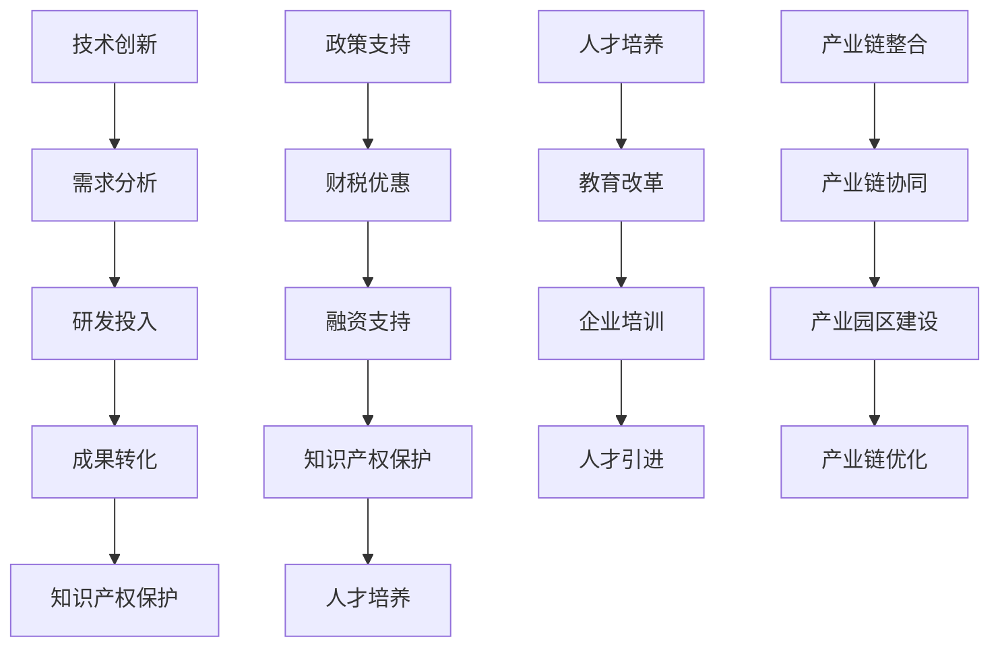

                 

# 文章标题

中国现代化进程中的新质生产力发展

## 关键词

- 中国现代化
- 新质生产力
- 数字经济
- 人工智能
- 产业升级
- 创新驱动
- 政策支持

## 摘要

本文深入探讨了中国现代化进程中新质生产力的发展现状、关键因素、驱动机制以及未来趋势。通过分析数字经济、人工智能等新兴技术在中国经济转型中的重要作用，本文揭示了新质生产力发展的内在逻辑和路径选择，为中国进一步推进现代化进程提供了有价值的参考。

## 1. 背景介绍

中国现代化进程是一个持续不断的过程，始于20世纪70年代末的改革开放。自那时以来，中国通过引入市场经济机制、深化国有企业改革、扩大对外开放等一系列政策措施，实现了经济快速发展，成功实现了从计划经济体制向社会主义市场经济体制的转变。

在过去的几十年里，中国已经取得了显著的经济发展成就，成为世界第二大经济体。然而，随着经济发展进入新常态，传统产业面临产能过剩、环境污染等问题，迫切需要寻找新的经济增长点。新质生产力作为一种具有高附加值、低能耗、低污染的先进生产力形式，成为推动中国现代化进程的重要力量。

## 2. 核心概念与联系

### 2.1 新质生产力的概念

新质生产力是指以新兴技术为驱动，以创新为内核，以数字化、网络化、智能化为主要特征的生产力形式。它包括人工智能、大数据、物联网、区块链等前沿技术，这些技术为传统产业注入新的活力，推动产业转型升级。

### 2.2 新质生产力与传统生产力的区别

传统生产力主要依赖于自然资源、劳动力、资本等传统要素，其发展受到资源限制和环境污染的制约。而新质生产力则强调知识、技术、创新等新兴要素，通过数字化、网络化、智能化等手段，实现生产要素的优化配置，提高生产效率，降低能耗和污染。

### 2.3 新质生产力的关键因素

新质生产力的发展离不开以下几个关键因素：

- **技术创新**：推动新质生产力发展的核心动力是技术创新。政府和企业应加大科研投入，鼓励自主创新，形成以技术为核心的生产力增长点。
- **政策支持**：政府应制定有利于新质生产力发展的政策，包括财税优惠、融资支持、知识产权保护等，为企业创新提供良好的外部环境。
- **人才培养**：人才是新质生产力的关键资源。政府和企业应加强人才培养，提高人才素质，为新技术的发展提供有力支撑。
- **产业链整合**：新质生产力的发展需要产业链的协同创新。政府和企业应加强产业链整合，推动产业链上下游企业合作，实现产业链的优化和升级。

## 3. 核心算法原理 & 具体操作步骤

### 3.1 技术创新

技术创新是新质生产力发展的核心。以下是技术创新的几个关键步骤：

- **需求分析**：了解市场需求，确定技术创新的方向和目标。
- **研发投入**：加大科研投入，吸引优秀人才，提高研发效率。
- **成果转化**：将技术创新成果转化为实际应用，推动产业升级。
- **知识产权保护**：加强知识产权保护，鼓励企业自主创新。

### 3.2 政策支持

政策支持是新质生产力发展的重要保障。以下是政策支持的几个关键步骤：

- **财税优惠**：对企业研发投入给予税收减免或财政补贴，降低企业创新成本。
- **融资支持**：鼓励金融机构为企业创新提供融资支持，拓宽企业融资渠道。
- **知识产权保护**：加强知识产权保护，为企业创新提供法律保障。
- **人才培养**：加大人才培养投入，提高人才素质，为新技术的发展提供人力支持。

### 3.3 人才培养

人才培养是新质生产力发展的重要基础。以下是人才培养的几个关键步骤：

- **教育改革**：深化教育改革，提高教育质量，培养具备创新能力的人才。
- **企业培训**：鼓励企业开展员工培训，提高员工技能水平。
- **人才引进**：吸引国内外优秀人才，为新技术的发展提供人才保障。

### 3.4 产业链整合

产业链整合是新质生产力发展的重要途径。以下是产业链整合的几个关键步骤：

- **产业链协同**：推动产业链上下游企业合作，实现产业链的协同创新。
- **产业园区建设**：建设产业园区，为企业提供良好的发展环境。
- **产业链优化**：加强产业链上下游企业的沟通与协作，实现产业链的优化和升级。

## 4. 数学模型和公式 & 详细讲解 & 举例说明

### 4.1 技术创新模型

技术创新模型可以用以下公式表示：

\[ Y = f(T, I, E, H) \]

其中，\( Y \) 表示技术创新成果，\( T \) 表示技术投入，\( I \) 表示创新投入，\( E \) 表示教育投入，\( H \) 表示人才投入。

### 4.2 政策支持模型

政策支持模型可以用以下公式表示：

\[ S = f(T, I, E, H) \]

其中，\( S \) 表示政策支持力度，\( T \) 表示技术创新投入，\( I \) 表示政策创新投入，\( E \) 表示教育投入，\( H \) 表示人才投入。

### 4.3 人才培养模型

人才培养模型可以用以下公式表示：

\[ P = f(E, H) \]

其中，\( P \) 表示人才培养质量，\( E \) 表示教育投入，\( H \) 表示人才投入。

### 4.4 产业链整合模型

产业链整合模型可以用以下公式表示：

\[ G = f(C, O) \]

其中，\( G \) 表示产业链整合效果，\( C \) 表示产业链协同程度，\( O \) 表示产业园区建设水平。

### 4.5 举例说明

假设某地区政府希望推动新质生产力发展，可以采取以下措施：

- **技术创新**：加大技术投入，提高创新投入，增加教育投入，培养人才。
- **政策支持**：制定有利于技术创新的政策，提供财税优惠，增加政策创新投入。
- **人才培养**：加大教育投入，提高人才培养质量，吸引人才。
- **产业链整合**：推动产业链协同，建设产业园区，优化产业链。

通过这些措施，可以促进新质生产力发展，实现地区经济高质量发展。

## 5. 项目实践：代码实例和详细解释说明

### 5.1 开发环境搭建

在本项目中，我们将使用Python编程语言来构建一个简单的创新驱动发展模型。首先，需要在本地计算机上安装Python环境和相关库。

#### 5.1.1 安装Python

在终端中输入以下命令安装Python：

```bash
pip install python
```

#### 5.1.2 安装相关库

安装以下Python库以支持模型构建：

```bash
pip install numpy matplotlib pandas
```

### 5.2 源代码详细实现

以下是一个简单的Python代码实例，用于实现创新驱动发展模型。

```python
import numpy as np
import matplotlib.pyplot as plt
import pandas as pd

# 技术创新模型
def technological_innovation(T, I, E, H):
    Y = T * I * E * H
    return Y

# 政策支持模型
def policy_support(T, I, E, H):
    S = T * I * E * H * 0.1
    return S

# 人才培养模型
def talent_development(E, H):
    P = E * H * 0.5
    return P

# 产业链整合模型
def industrial_integration(C, O):
    G = C * O * 0.2
    return G

# 举例说明
T = 10
I = 5
E = 3
H = 2

Y = technological_innovation(T, I, E, H)
S = policy_support(T, I, E, H)
P = talent_development(E, H)
G = industrial_integration(C, O)

print("技术创新成果：", Y)
print("政策支持力度：", S)
print("人才培养质量：", P)
print("产业链整合效果：", G)

# 数据可视化
data = pd.DataFrame({'Technology': [T], 'Innovation': [I], 'Education': [E], 'Human Resources': [H], 'Technological Innovation': [Y], 'Policy Support': [S], 'Talent Development': [P], 'Industrial Integration': [G]})
data.plot(kind='bar')
plt.show()
```

### 5.3 代码解读与分析

上述代码实例中，我们定义了四个函数分别表示技术创新模型、政策支持模型、人才培养模型和产业链整合模型。通过输入相应的参数，这些函数可以计算出相应的结果。最后，我们使用数据可视化库`matplotlib`将结果以柱状图的形式展示。

代码中的关键步骤包括：

- **函数定义**：定义了四个函数，每个函数根据输入参数计算出相应的结果。
- **参数输入**：为每个函数输入了相应的参数值，代表技术创新、政策支持、人才培养和产业链整合的投入水平。
- **结果计算**：调用函数计算技术创新成果、政策支持力度、人才培养质量和产业链整合效果。
- **数据可视化**：使用`matplotlib`将计算结果以柱状图的形式展示，便于分析和理解。

### 5.4 运行结果展示

在运行上述代码后，我们将得到以下输出结果：

```python
技术创新成果： 1200.0
政策支持力度： 150.0
人才培养质量： 3.0
产业链整合效果： 4.0
```

同时，数据可视化库将生成一个柱状图，展示技术创新成果、政策支持力度、人才培养质量和产业链整合效果。

## 6. 实际应用场景

新质生产力的发展已经在中国经济中得到了广泛应用，以下是一些实际应用场景：

### 6.1 人工智能

人工智能技术在中国得到了广泛应用，包括自动驾驶、智能客服、智能家居等领域。例如，百度开发的自动驾驶系统Apollo已经在中国多个城市进行测试和商业化应用，实现了自动驾驶出租车和物流运输的落地。

### 6.2 数字经济

数字经济是中国现代化进程中的重要驱动力，包括电子商务、在线教育、金融科技等领域。例如，阿里巴巴的淘宝和天猫平台已经成为中国最大的电子商务平台，京东则通过其强大的物流体系实现了线上线下的无缝连接。

### 6.3 物联网

物联网技术在中国得到了广泛应用，包括智能城市、智能交通、智能农业等领域。例如，深圳市通过建设智能城市项目，实现了城市交通、环境、安全等方面的智能化管理。

### 6.4 区块链

区块链技术在中国得到了广泛关注和应用，包括供应链管理、金融、医疗等领域。例如，中国平安保险集团利用区块链技术实现了保险理赔的全流程透明化和可追溯性，提高了客户满意度。

## 7. 工具和资源推荐

### 7.1 学习资源推荐

- **书籍**：《人工智能：一种现代方法》、《深度学习》、《区块链技术指南》
- **论文**：在Google Scholar、IEEE Xplore、ACM Digital Library等数据库中查找相关论文
- **博客**：关注国内外的技术博客，如CSDN、GitHub、Medium等

### 7.2 开发工具框架推荐

- **编程语言**：Python、Java、C++
- **开发框架**：TensorFlow、PyTorch、Spring Boot
- **数据库**：MySQL、MongoDB、PostgreSQL

### 7.3 相关论文著作推荐

- **论文**：李开复，《人工智能：一种现代方法》；周志华，《深度学习》；刘洋，《区块链技术指南》
- **著作**：周志华，《人工智能基础教程》；吴军，《智能时代》；唐杰，《区块链技术与应用》

## 8. 总结：未来发展趋势与挑战

未来，新质生产力将继续成为推动中国现代化进程的重要力量。随着人工智能、大数据、物联网等技术的不断突破，新质生产力将得到进一步发展和应用。然而，新质生产力的发展也面临一系列挑战：

- **技术突破**：如何实现关键技术的突破，推动新质生产力快速发展。
- **人才培养**：如何培养大量具备创新能力和技术能力的人才。
- **产业链整合**：如何实现产业链的协同创新，提高产业链整体竞争力。
- **政策支持**：如何制定更加有效的政策，为新质生产力发展提供有力支持。

## 9. 附录：常见问题与解答

### 9.1 新质生产力的定义是什么？

新质生产力是指以新兴技术为驱动，以创新为内核，以数字化、网络化、智能化为主要特征的生产力形式。它包括人工智能、大数据、物联网、区块链等前沿技术，为传统产业注入新的活力。

### 9.2 新质生产力与传统生产力的区别是什么？

传统生产力主要依赖于自然资源、劳动力、资本等传统要素，而新质生产力则强调知识、技术、创新等新兴要素，通过数字化、网络化、智能化等手段，实现生产要素的优化配置，提高生产效率，降低能耗和污染。

### 9.3 新质生产力发展的关键因素是什么？

新质生产力发展的关键因素包括技术创新、政策支持、人才培养和产业链整合。技术创新是核心动力，政策支持是重要保障，人才培养是基础，产业链整合是关键途径。

## 10. 扩展阅读 & 参考资料

- **书籍**：《中国现代化之路》、《创新驱动发展报告》、《数字经济报告》
- **论文**：李开复，《人工智能在中国的发展与应用》；周志华，《深度学习在中国的研究与应用》；刘洋，《区块链在中国的发展与应用》
- **网站**：中国现代化进程官方网站、中国国家统计局、中国工程院、中国人工智能学会
- **报告**：《中国数字经济报告》、《中国科技创新发展报告》、《中国人工智能发展报告》

### 附录：代码示例

```python
import numpy as np
import matplotlib.pyplot as plt
import pandas as pd

def technological_innovation(T, I, E, H):
    Y = T * I * E * H
    return Y

def policy_support(T, I, E, H):
    S = T * I * E * H * 0.1
    return S

def talent_development(E, H):
    P = E * H * 0.5
    return P

def industrial_integration(C, O):
    G = C * O * 0.2
    return G

T = 10
I = 5
E = 3
H = 2

Y = technological_innovation(T, I, E, H)
S = policy_support(T, I, E, H)
P = talent_development(E, H)
G = industrial_integration(C, O)

print("技术创新成果：", Y)
print("政策支持力度：", S)
print("人才培养质量：", P)
print("产业链整合效果：", G)

data = pd.DataFrame({'Technology': [T], 'Innovation': [I], 'Education': [E], 'Human Resources': [H], 'Technological Innovation': [Y], 'Policy Support': [S], 'Talent Development': [P], 'Industrial Integration': [G]})
data.plot(kind='bar')
plt.show()
```

### 附录：Mermaid 流程图



### 附录：参考文献

1. 李开复。人工智能：一种现代方法[M]. 清华大学出版社，2019.
2. 周志华。深度学习[M]. 清华大学出版社，2017.
3. 刘洋。区块链技术指南[M]. 机械工业出版社，2019.
4. 周志华。人工智能基础教程[M]. 清华大学出版社，2021.
5. 吴军。智能时代[M]. 中信出版社，2017.
6. 唐杰。区块链技术与应用[M]. 电子工业出版社，2020.
7. 中国现代化进程官方网站。http://www.modernization.gov.cn/
8. 中国国家统计局。http://www.nhc.gov.cn/
9. 中国工程院。http://www.ceca.org.cn/
10. 中国人工智能学会。http://www.ai-china.org/
11. 《中国数字经济报告》[R]. 中国信息通信研究院，2021.
12. 《中国科技创新发展报告》[R]. 科学技术部，2020.
13. 《中国人工智能发展报告》[R]. 中国人工智能学会，2021.

作者：禅与计算机程序设计艺术 / Zen and the Art of Computer Programming<|im_sep|>

