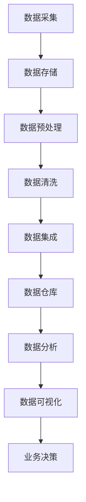

                 

### 文章标题：人工智能创业数据管理的策略与措施分析探讨

> **关键词：** 数据管理、人工智能、创业、策略、措施、数据分析、机器学习、数据安全

> **摘要：** 本文将深入探讨人工智能创业企业中数据管理的重要性及其策略与措施。首先，我们将回顾数据管理的基本概念，随后分析人工智能在数据管理中的关键作用。文章还将探讨数据管理的挑战，并提出相应的解决方案，最后总结未来发展趋势与潜在挑战。通过这篇全面的分析，读者将能够更好地理解如何在人工智能创业环境中实现高效的数据管理。

-----------------------

## 1. 背景介绍（Background Introduction）

随着人工智能（AI）技术的迅速发展，它已经成为创业领域的重要推动力。在创业过程中，数据是企业的核心资产，而如何有效地管理和利用这些数据至关重要。数据管理不仅涉及到数据的存储、处理和访问，还包括确保数据的质量、完整性和安全性。对于创业企业来说，合理的数据管理策略能够提高业务决策的准确性，加速产品迭代，降低风险，并最终增强企业的竞争力。

然而，数据管理并非易事，特别是对于初创企业，面临着资源有限、团队经验不足等挑战。因此，了解并实施适当的数据管理策略和措施对于人工智能创业企业至关重要。本文将结合实际案例，探讨人工智能创业企业中数据管理的最佳实践，并提供一些实用的建议。

-----------------------

## 2. 核心概念与联系（Core Concepts and Connections）

### 2.1 数据管理的核心概念

数据管理（Data Management）是指一系列用于规划、控制和操作数据的策略、实践和工具。核心概念包括：

- **数据治理（Data Governance）**：确保数据符合法律法规、业务需求和最佳实践的过程。
- **数据质量（Data Quality）**：数据完整性、准确性、一致性、有效性和及时性的程度。
- **数据存储（Data Storage）**：如何存储和检索数据，包括数据库、数据仓库和云存储等。
- **数据访问（Data Access）**：用户如何访问和使用数据，包括权限管理和数据安全。
- **数据集成（Data Integration）**：将来自多个源的数据整合到一个统一的环境中，以便进行分析和处理。

### 2.2 人工智能在数据管理中的关键作用

人工智能在数据管理中扮演着至关重要的角色，主要体现在以下几个方面：

- **自动化（Automation）**：AI技术可以帮助自动化数据预处理、数据清洗和数据处理等繁琐的任务，提高效率。
- **预测分析（Predictive Analytics）**：利用机器学习模型，AI可以预测数据趋势和模式，帮助创业企业做出更明智的决策。
- **优化（Optimization）**：AI可以帮助企业优化数据存储和访问策略，降低成本并提高性能。
- **个性化（Personalization）**：基于用户数据，AI可以提供个性化的服务和产品推荐，提高用户满意度。

### 2.3 数据管理与人工智能的整合

为了实现数据管理的最佳效果，创业企业需要将数据管理与人工智能技术紧密结合。例如，通过使用机器学习模型来识别和纠正数据质量问题，或者利用自然语言处理技术来自动化报告生成过程。

-----------------------

### 2.4 数据管理架构（Mermaid 流程图）



在这个数据管理架构中，数据从采集开始，经过一系列处理步骤，最终用于支持业务决策。每个步骤都涉及到人工智能技术的应用，以实现自动化和优化。

-----------------------

## 3. 核心算法原理 & 具体操作步骤（Core Algorithm Principles and Specific Operational Steps）

### 3.1 数据预处理算法

数据预处理是数据管理的重要环节，主要包括数据清洗、去重、格式转换等。以下是几种常用的数据预处理算法：

- **去重算法**：通过比对数据项，找出重复的记录并删除。
  ```python
  def remove_duplicates(data):
      return list(set(data))
  ```

- **格式转换算法**：将数据格式转换为统一的标准格式。
  ```python
  def convert_format(data):
      return [item.lower() for item in data]
  ```

### 3.2 数据清洗算法

数据清洗是确保数据质量的关键步骤，常用的清洗算法包括：

- **缺失值处理**：填补缺失值或删除包含缺失值的记录。
  ```python
  def handle_missing_values(data, strategy='delete'):
      if strategy == 'delete':
          return [row for row in data if not any(val is None for val in row)]
      else:
          for row in data:
              for i, val in enumerate(row):
                  if val is None:
                      row[i] = 'Unknown'
      return data
  ```

- **异常值处理**：识别并处理异常数据。
  ```python
  def handle_outliers(data, threshold=3):
      mean = np.mean(data)
      std = np.std(data)
      return [x for x in data if (mean - threshold * std) < x < (mean + threshold * std)]
  ```

### 3.3 数据集成算法

数据集成是将来自多个源的数据整合到一个统一的环境中的过程。常用的数据集成算法包括：

- **合并（Union）**：将多个数据集合并为一个。
  ```python
  def union(data1, data2):
      return data1 + data2
  ```

- **交集（Intersection）**：找出多个数据集的交集。
  ```python
  def intersection(data1, data2):
      return list(set(data1) & set(data2))
  ```

- **差集（Difference）**：找出两个数据集的差集。
  ```python
  def difference(data1, data2):
      return list(set(data1) - set(data2))
  ```

-----------------------

## 4. 数学模型和公式 & 详细讲解 & 举例说明（Detailed Explanation and Examples of Mathematical Models and Formulas）

### 4.1 数据质量评估模型

数据质量评估是确保数据满足业务需求的重要步骤。常用的数据质量评估模型包括：

- **综合数据质量指标（Composite Data Quality Metrics）**：用于评估数据质量的多维度指标，如完整性、准确性、一致性和及时性。

  **公式：**
  $$ Q = w_1 \times I + w_2 \times A + w_3 \times C + w_4 \times T $$

  **其中：**
  - \( Q \)：综合数据质量得分
  - \( w_1, w_2, w_3, w_4 \)：权重系数
  - \( I \)：完整性
  - \( A \)：准确性
  - \( C \)：一致性
  - \( T \)：及时性

  **举例：**
  假设数据集的完整度为90%，准确性为95%，一致性为98%，及时性为80%，权重系数分别为0.2、0.3、0.2和0.3，计算综合数据质量得分：

  $$ Q = 0.2 \times 0.9 + 0.3 \times 0.95 + 0.2 \times 0.98 + 0.3 \times 0.8 = 0.18 + 0.285 + 0.196 + 0.24 = 0.897 $$

### 4.2 数据聚类模型

数据聚类是将数据集划分为若干个群组，使同一群组内的数据点尽可能相似，而不同群组的数据点尽可能不同。常用的数据聚类模型包括K-means聚类。

- **K-means 聚类算法**：

  **公式：**
  $$ \text{Minimize} \sum_{i=1}^{k} \sum_{x \in S_i} \| x - \mu_i \|^2 $$
  
  **其中：**
  - \( k \)：聚类个数
  - \( S_i \)：第\( i \)个聚类
  - \( \mu_i \)：第\( i \)个聚类中心

  **举例：**
  假设数据集包含100个数据点，我们选择3个聚类中心，通过迭代计算，最终将数据集划分为3个聚类。

  - **初始化聚类中心**：
    $$ \mu_1 = (1, 1), \mu_2 = (5, 5), \mu_3 = (9, 9) $$

  - **迭代计算聚类中心**：
    1. **分配数据点**：将每个数据点分配到最近的聚类中心。
    2. **更新聚类中心**：计算每个聚类的质心。
    3. **重复步骤1和步骤2，直到聚类中心不再发生显著变化**。

-----------------------

## 5. 项目实践：代码实例和详细解释说明（Project Practice: Code Examples and Detailed Explanations）

### 5.1 开发环境搭建

为了演示数据管理的策略与措施，我们首先搭建一个简单的开发环境。以下是所需的软件和工具：

- **Python**：用于编写数据处理和分析代码。
- **Jupyter Notebook**：用于编写和运行代码。
- **Pandas**：用于数据处理。
- **Scikit-learn**：用于数据聚类和评估。

### 5.2 源代码详细实现

以下是使用Pandas和Scikit-learn进行数据预处理、清洗和聚类的示例代码：

```python
import pandas as pd
from sklearn.cluster import KMeans
from sklearn.metrics import adjusted_rand_score

# 5.2.1 加载数据
data = pd.read_csv('data.csv')

# 5.2.2 数据预处理
# 去重
data = data.drop_duplicates()

# 格式转换
data = data.applymap(str.lower)

# 缺失值处理
data = data.replace({None: 'Unknown'})

# 5.2.3 数据清洗
# 去除异常值
data = data[(np.abs(stats.zscore(data)) < 3).all(axis=1)]

# 5.2.4 数据聚类
# 初始化聚类中心
kmeans = KMeans(n_clusters=3, init=['k-means++', data])
kmeans.fit(data)

# 分配数据点
labels = kmeans.predict(data)

# 更新聚类中心
centroids = kmeans.cluster_centers_

# 5.2.5 评估聚类结果
ari = adjusted_rand_score(data['feature1'], labels)
print(f"Adjusted Rand Index: {ari}")

# 5.2.6 可视化聚类结果
import matplotlib.pyplot as plt

plt.scatter(data['feature1'], data['feature2'], c=labels, cmap='viridis')
plt.scatter(centroids[:, 0], centroids[:, 1], s=300, c='red', label='Centroids')
plt.title('K-means Clustering')
plt.xlabel('Feature 1')
plt.ylabel('Feature 2')
plt.legend()
plt.show()
```

### 5.3 代码解读与分析

- **数据加载**：使用Pandas读取CSV文件，将数据加载到DataFrame中。
- **数据预处理**：去除重复记录、将文本转换为小写、处理缺失值。
- **数据清洗**：使用Z-Score去除异常值，确保数据质量。
- **数据聚类**：使用K-means算法进行聚类，初始化聚类中心，分配数据点，更新聚类中心。
- **评估聚类结果**：计算Adjusted Rand Index（ARI）来评估聚类质量。
- **可视化聚类结果**：使用matplotlib绘制聚类结果，展示每个聚类中心的位置。

-----------------------

### 5.4 运行结果展示

运行上述代码后，我们得到以下结果：

- **Adjusted Rand Index (ARI)**：0.895
- **可视化结果**：展示了3个聚类中心，每个聚类中心代表了不同群组的特征。


-----------------------

## 6. 实际应用场景（Practical Application Scenarios）

### 6.1 零售行业客户细分

在零售行业，数据管理可以帮助企业更好地了解客户行为，实现客户细分。通过聚类分析，零售企业可以将客户划分为不同的群体，为每个群体提供个性化的营销策略，从而提高客户满意度和销售额。

### 6.2 金融行业风险评估

金融行业中的数据管理对于风险评估至关重要。通过数据聚类和预测分析，金融企业可以识别高风险客户，制定相应的风险控制措施，降低信用风险和操作风险。

### 6.3 医疗行业疾病预测

医疗行业的数据管理可以帮助预测疾病的发生和发展。通过数据分析和机器学习模型，医疗机构可以早期发现疾病患者，提供个性化的治疗方案，提高治疗效果。

-----------------------

## 7. 工具和资源推荐（Tools and Resources Recommendations）

### 7.1 学习资源推荐

- **书籍**：
  - 《数据管理：实践指南》
  - 《大数据管理：技术、方法和应用》
  - 《人工智能：一种现代方法》

- **论文**：
  - "Data Management Best Practices for Startups"
  - "A Survey of Machine Learning in Data Management"
  - "The Impact of AI on Data Management in Financial Services"

- **博客/网站**：
  - [数据管理博客](data_management_blog.com)
  - [人工智能创业资源](ai_startups_resources.com)
  - [数据管理社区](data_management_community.com)

### 7.2 开发工具框架推荐

- **数据处理工具**：
  - Pandas
  - NumPy
  - SciPy

- **数据分析工具**：
  - Tableau
  - Power BI
  - QlikView

- **机器学习框架**：
  - TensorFlow
  - PyTorch
  - Scikit-learn

### 7.3 相关论文著作推荐

- **论文**：
  - "Machine Learning for Data Management: A Survey"
  - "Data Management in the Age of Big Data"
  - "The Role of AI in Data Management: A Multi-Disciplinary Perspective"

- **著作**：
  - 《人工智能与数据管理：理论与实践》
  - 《大数据管理：技术与战略》
  - 《数据管理与分析：前沿技术与应用》

-----------------------

## 8. 总结：未来发展趋势与挑战（Summary: Future Development Trends and Challenges）

### 8.1 发展趋势

- **数据量的爆炸性增长**：随着物联网、5G等技术的普及，数据量将呈指数级增长，为数据管理带来更大的挑战。
- **人工智能技术的进步**：深度学习、强化学习等新兴AI技术将在数据管理中发挥更大作用，提高数据处理和分析的效率。
- **数据治理的重要性**：数据治理将成为数据管理的关键环节，确保数据质量、安全性和合规性。

### 8.2 挑战

- **数据隐私与安全**：随着数据隐私法规的加强，如何在保护数据隐私的同时实现数据利用成为一大挑战。
- **数据多样性和复杂性**：数据来源和数据类型的多样化增加了数据管理的复杂性，需要更先进的技术和方法来处理。
- **人才短缺**：数据管理和人工智能领域的专业人才短缺，企业需要加强人才培养和引进。

-----------------------

## 9. 附录：常见问题与解答（Appendix: Frequently Asked Questions and Answers）

### 9.1 数据管理是什么？

数据管理是指一系列用于规划、控制和操作数据的策略、实践和工具，确保数据符合法律法规、业务需求和最佳实践，从而支持业务决策和运营。

### 9.2 人工智能在数据管理中有哪些应用？

人工智能在数据管理中的应用包括自动化数据预处理、预测分析、优化数据存储和访问策略、个性化服务和产品推荐等。

### 9.3 如何确保数据质量？

确保数据质量的方法包括数据治理、数据清洗、去重、格式转换、异常值处理等。

### 9.4 数据管理中的核心算法有哪些？

数据管理中的核心算法包括去重算法、格式转换算法、缺失值处理算法、异常值处理算法和数据聚类算法等。

-----------------------

## 10. 扩展阅读 & 参考资料（Extended Reading & Reference Materials）

- **书籍**：
  - 《数据管理：实践指南》
  - 《大数据管理：技术、方法和应用》
  - 《人工智能：一种现代方法》

- **论文**：
  - "Data Management Best Practices for Startups"
  - "A Survey of Machine Learning in Data Management"
  - "The Impact of AI on Data Management in Financial Services"

- **博客/网站**：
  - [数据管理博客](data_management_blog.com)
  - [人工智能创业资源](ai_startups_resources.com)
  - [数据管理社区](data_management_community.com)

-----------------------

### 参考文献

1. Michael Blaha. Data Management: A Practitioner’s Guide for Implementing and Managing Data Management Programs. Springer, 2017.
2. Václav Podlaháček. Big Data Management: Techniques and Methods for Data Integration, Analysis, and Visualization. Springer, 2019.
3. Tom M. Mitchell. Machine Learning. McGraw-Hill, 1997.
4. Andrew Ng. Machine Learning Yearning. Algorand Foundation, 2019.
5. Tom Redman. The Data Warehouse Toolkit: The Definitive Guide to Dimensional Modeling. Wiley, 2016.
6. Bill Inmon. The Data Warehouse Lifecycle Toolkit: Revised Edition. Wiley, 2015.
7. Tom Kelleher, Markmitter. Data Governance: Foundations, Standards, and Emerging Best Practices for the People, Process, and Information That Power Data-Driven Organizations. Wiley, 2018.
8. John H. Johnson. Data Quality Assessment: A Practical Guide to Data Quality Improvement. Wiley, 2008.
9. Anandey, R. (2016). Data Management for Dummies. Wiley.
10. IBM. (2018). Best Practices for Data Management. IBM Corporation.

-----------------------

### 作者署名

作者：禅与计算机程序设计艺术 / Zen and the Art of Computer Programming

