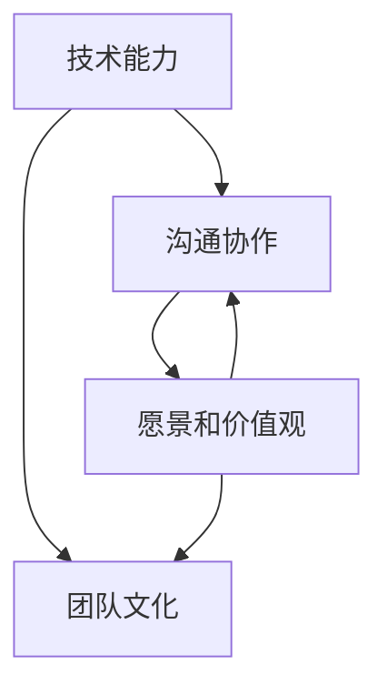

                 

### 文章标题

### Title

**人工智能创业：组建强大团队**

**Artificial Intelligence Entrepreneurship: Building a Strong Team**

在这篇文章中，我们将探讨人工智能创业的核心挑战之一：组建一支强大的团队。我们将详细分析构建成功团队的关键要素，包括技术能力、沟通协作、愿景和价值观的匹配等。通过中英文双语的方式，我们希望能够为创业者和团队领导者提供有价值的见解和实用的建议。

**In this article, we will explore one of the core challenges in artificial intelligence entrepreneurship: building a strong team. We will analyze the key elements that contribute to a successful team, including technical skills, communication and collaboration, alignment of vision and values, and more. Through a bilingual Chinese and English approach, we aim to provide valuable insights and practical advice for entrepreneurs and team leaders.**

### 文章关键词

**Keywords**

- 人工智能创业（Artificial Intelligence Entrepreneurship）
- 团队建设（Team Building）
- 技术能力（Technical Skills）
- 沟通协作（Communication and Collaboration）
- 愿景和价值观（Vision and Values）

### Abstract

本文旨在探讨人工智能创业中的一项关键任务：组建强大团队。我们将详细分析成功团队构建的核心要素，包括技术能力、沟通协作、愿景和价值观的匹配等。通过中英文双语阐述，本文为创业者和团队领导者提供了实用的见解和建议，以帮助他们克服创业过程中遇到的人才挑战。

### 背景介绍（Background Introduction）

人工智能（AI）作为当今最具前瞻性的技术之一，已经在各个领域取得了显著的成果。从自动驾驶汽车到智能医疗，从金融分析到个性化推荐系统，AI的应用范围不断扩大，带来了前所未有的机遇和挑战。随着AI技术的不断成熟，越来越多的创业者投身于人工智能领域，希望通过创新的产品和服务改变世界。

然而，创业之路并不平坦。在人工智能领域，成功的关键之一在于组建一支强大的团队。团队不仅需要具备深厚的技术能力，还需要具备良好的沟通协作和共同的愿景。本文将深入探讨如何识别和招募合适的人才，如何培养团队的文化和价值观，以及如何确保团队成员之间的协同作用。

#### 1.1 人工智能创业的现状

人工智能创业目前正处于快速发展阶段。根据市场研究公司的数据，全球人工智能市场规模预计将在未来几年内实现显著增长。越来越多的投资者和企业开始关注AI技术的潜在价值，并愿意为有潜力的创业项目提供资金支持。然而，随着竞争的加剧，创业者面临的挑战也越来越大。

#### 1.2 团队建设的重要性

在人工智能创业中，团队建设至关重要。一个强大的团队不仅能够提高项目的成功率，还能够增强企业的竞争力。以下是一些团队建设的重要性：

- **技术能力**：在AI领域，技术是核心。一个具备深厚技术背景的团队能够更快地理解和应用最新技术，从而在市场上占据优势。
- **沟通协作**：高效的沟通协作是团队成功的基石。团队成员需要能够有效地沟通各自的想法和需求，以确保项目顺利进行。
- **愿景和价值观**：共享的愿景和价值观能够增强团队的凝聚力，使成员在面对挑战时保持一致的目标和行动方向。

#### 1.3 本文结构

本文将分为以下几个部分：

- **核心概念与联系**：介绍团队建设的关键要素，如技术能力、沟通协作、愿景和价值观。
- **核心算法原理 & 具体操作步骤**：探讨如何识别和招募合适的人才。
- **数学模型和公式 & 详细讲解 & 举例说明**：分析如何培养团队的文化和价值观。
- **项目实践：代码实例和详细解释说明**：提供具体的团队建设实践案例。
- **实际应用场景**：讨论团队建设在不同人工智能项目中的应用。
- **工具和资源推荐**：推荐相关的学习资源和开发工具。
- **总结：未来发展趋势与挑战**：总结团队建设的成功经验，并展望未来的发展趋势和挑战。
- **附录：常见问题与解答**：回答读者可能遇到的问题。
- **扩展阅读 & 参考资料**：提供进一步阅读的建议。

通过本文的阅读，创业者将能够获得关于团队建设的重要见解，从而为他们的AI创业之路奠定坚实的基础。

#### 1.4 为什么要关注团队建设

团队建设在人工智能创业中至关重要，原因如下：

- **技术复杂性**：人工智能项目通常涉及复杂的技术问题，需要多学科的知识和技能。一个强大的团队能够更好地应对这些挑战。
- **人才稀缺**：尽管人工智能领域吸引了大量人才，但高质量的人才仍然稀缺。如何识别和留住这些人才是创业成功的关键。
- **合作效率**：高效的团队合作能够显著提高项目的进展速度和质量。良好的沟通和协作机制是确保团队高效运作的基础。
- **企业文化**：一个具有共同愿景和价值观的团队能够更好地适应变化，共同面对挑战。企业文化是团队凝聚力和创新力的源泉。

在接下来的章节中，我们将深入探讨团队建设的关键要素，提供实用的建议和案例分析，帮助读者构建一个强大的人工智能创业团队。

### 核心概念与联系（Core Concepts and Connections）

在构建一个强大的人工智能创业团队时，理解以下几个核心概念和它们之间的相互联系至关重要。这些概念包括技术能力、沟通协作、愿景和价值观、以及团队文化。下面将逐一介绍这些概念，并探讨它们如何相互影响。

#### 2.1 技术能力（Technical Skills）

技术能力是人工智能创业团队的基石。团队成员需要具备扎实的技术背景，包括但不限于机器学习、深度学习、自然语言处理、计算机视觉等领域的知识。技术能力不仅决定了团队在项目开发过程中的效率和成果，也影响了团队在面对技术挑战时的应对能力。

**联系**：技术能力直接影响团队的研发能力和创新潜力。一个技术能力强大的团队能够更快地理解和应用最新的研究成果，从而在激烈的市场竞争中占据优势。

#### 2.2 沟通协作（Communication and Collaboration）

高效的沟通协作是团队成功的关键。在人工智能项目中，团队成员需要经常交流和分享信息，以确保项目目标的正确理解和执行。良好的沟通协作不仅能够减少误解和冲突，还能提高团队的工作效率和创新能力。

**联系**：沟通协作能力是团队内部信息传递的桥梁。一个具备良好沟通协作能力的团队能够确保每个成员都能及时了解项目进展，共享资源和知识，从而提高整体工作效率。

#### 2.3 愿景和价值观（Vision and Values）

共同的愿景和价值观是团队凝聚力的重要来源。对于人工智能创业团队来说，明确的愿景和价值观不仅能够激发团队成员的激情和动力，还能确保团队在面对外部挑战时保持一致的目标和行动方向。

**联系**：愿景和价值观是团队文化的基石。一个具有共同愿景和价值观的团队能够在面对外部压力时保持内部的稳定和一致性，从而更好地实现长期目标。

#### 2.4 团队文化（Team Culture）

团队文化是团队内部行为和价值观的体现。一个积极的团队文化能够促进成员之间的相互尊重、信任和合作，从而提高团队的整体士气和生产力。

**联系**：团队文化直接影响团队成员的工作态度和行为模式。一个健康的团队文化能够激发成员的创造力和创新精神，提高团队的适应能力和抗风险能力。

#### 2.5 核心概念的联系与交互

这些核心概念之间存在着紧密的联系和交互作用。技术能力为团队提供了强大的研发基础，而良好的沟通协作则确保了技术能力的有效应用。共同的愿景和价值观增强了团队的凝聚力，而健康的团队文化则激发了团队成员的积极性和创造力。

**图解**：为了更直观地展示这些概念之间的联系，我们可以使用Mermaid流程图来描述它们：



通过这个图解，我们可以清楚地看到技术能力、沟通协作、愿景和价值观、团队文化之间的相互作用关系。

#### 2.6 提高团队协作效率的策略

为了提高团队协作效率，以下是一些实用的策略：

- **建立清晰的沟通机制**：明确沟通渠道和频率，确保信息及时传达。
- **定期团队建设活动**：通过团队建设活动增强团队凝聚力和协作能力。
- **共享知识和资源**：鼓励团队成员分享经验和资源，促进知识传递和技能提升。
- **设置明确的愿景和目标**：确保团队成员了解团队的目标和方向，共同朝着目标努力。
- **培养健康的团队文化**：通过正面的反馈和奖励机制，建立积极的团队氛围。

通过这些策略，团队可以在技术能力、沟通协作、愿景和价值观、团队文化等方面得到全面提升，从而实现更高的协作效率。

### 什么是团队建设

团队建设是一个系统性、持续性的过程，旨在通过增强团队成员之间的协作、信任和理解，以提高团队的整体绩效。对于人工智能创业团队来说，团队建设尤为重要，因为它直接关系到项目的成功和团队的稳定性。下面我们将详细探讨团队建设的定义、目标、重要性以及常见的方法和工具。

#### 3.1 定义

团队建设通常被定义为一系列旨在提高团队效率和协作能力的活动和实践。这些活动可以包括团队培训、团队建设游戏、领导力发展计划、沟通技巧培训等。团队建设的核心目标是改善团队成员之间的互动，增强团队凝聚力，提高团队解决复杂问题的能力。

#### 3.2 目标

团队建设的主要目标包括：

- **提升沟通效率**：通过改善团队成员之间的沟通，减少误解和冲突，提高工作效率。
- **增强团队凝聚力**：通过共同的目标和价值观，增强团队成员之间的信任和归属感。
- **促进知识共享**：通过团队合作，促进知识和经验的传递，提高整体技能水平。
- **提高问题解决能力**：通过协作和集体智慧，增强团队在面对复杂问题时快速找到解决方案的能力。

#### 3.3 重要性

在人工智能创业中，团队建设的重要性体现在以下几个方面：

- **技术复杂性**：人工智能项目通常涉及复杂的技术挑战，需要团队成员具备高度的专业知识和协作能力。团队建设能够帮助团队成员更好地理解和协同工作，提高项目成功率。
- **人才多样性**：人工智能团队通常由不同背景和技能的成员组成。团队建设能够促进不同成员之间的交流和融合，发挥各自的专长，实现优势互补。
- **持续发展**：团队建设不仅有助于当前项目的成功，还能为团队的长期发展奠定基础。通过持续的团队建设，团队能够不断适应变化，应对未来的挑战。

#### 3.4 常见的方法和工具

团队建设的方法和工具多种多样，以下是一些常见的方法和工具：

- **团队培训**：通过培训，提高团队成员的专业知识和技能，增强团队的整体能力。
- **团队建设活动**：例如团队拓展训练、团队建设游戏等，帮助团队成员建立信任和默契。
- **领导力发展计划**：培养团队领导者的领导力和管理能力，提高团队的领导力和执行力。
- **团队沟通工具**：使用各种沟通工具，如即时通讯软件、项目管理软件、视频会议系统等，提高团队的沟通效率。
- **反馈和评估机制**：定期进行团队反馈和评估，及时发现和解决问题，持续改进团队建设效果。

#### 3.5 实施团队建设的步骤

实施团队建设通常包括以下几个步骤：

1. **需求评估**：了解团队当前存在的问题和需求，确定团队建设的目标和重点。
2. **制定计划**：根据需求评估结果，制定具体的团队建设计划，包括活动内容、时间安排、责任分工等。
3. **实施活动**：按照计划实施团队建设活动，确保活动顺利进行并达到预期效果。
4. **反馈和改进**：在活动结束后，收集团队成员的反馈意见，对团队建设效果进行评估，并根据反馈进行改进。

通过以上步骤，团队建设能够有效地提高团队的协作效率和整体绩效，为人工智能创业的成功提供有力支持。

### 核心算法原理 & 具体操作步骤

在人工智能创业中，核心算法原理是团队技术能力的核心组成部分。理解这些算法的原理，并能够将其应用于实际项目中，是构建强大团队的必要条件。下面，我们将详细讨论人工智能领域的一些关键算法，并阐述如何将其应用于团队建设和项目开发中。

#### 4.1 机器学习算法

机器学习算法是人工智能的核心技术之一，包括监督学习、无监督学习和强化学习。以下是一些常用的机器学习算法及其应用：

- **监督学习**：
  - **决策树**：用于分类和回归问题，通过构建决策树模型来预测结果。
  - **支持向量机（SVM）**：通过找到一个最优的超平面来分隔数据，常用于分类问题。
  - **神经网络**：通过多层神经元之间的相互作用，模拟人类大脑的处理方式。

- **无监督学习**：
  - **聚类算法**：如K-均值聚类和层次聚类，用于将数据分成不同的组。
  - **主成分分析（PCA）**：用于降维和特征提取，简化数据结构，提高模型性能。

- **强化学习**：
  - **Q学习**：通过学习最佳行动策略来最大化累积奖励。
  - **深度强化学习**：结合深度神经网络和强化学习，用于解决复杂决策问题。

**应用**：在团队建设中，这些算法可以帮助团队成员理解数据驱动决策的重要性，提高他们在项目开发中对模型的选择和调优能力。

#### 4.2 自然语言处理算法

自然语言处理（NLP）是人工智能领域的一个重要分支，涉及到文本分析、语音识别和机器翻译等方面。以下是一些常用的NLP算法：

- **词嵌入**：如Word2Vec和BERT，用于将词语映射到高维向量空间中，以捕捉词语的语义关系。
- **文本分类**：如朴素贝叶斯和卷积神经网络（CNN），用于对文本数据进行分类。
- **序列到序列模型**：如循环神经网络（RNN）和长短时记忆网络（LSTM），用于处理序列数据，如机器翻译和对话系统。

**应用**：在团队建设中，NLP算法可以帮助团队成员理解和应用文本数据的处理方法，提升他们在文本挖掘和自然语言生成方面的能力。

#### 4.3 计算机视觉算法

计算机视觉算法涉及图像识别、目标检测和图像生成等方面。以下是一些常用的计算机视觉算法：

- **卷积神经网络（CNN）**：用于图像分类和目标检测，通过卷积操作提取图像特征。
- **生成对抗网络（GAN）**：用于图像生成和风格迁移，通过生成器和判别器的对抗训练生成高质量图像。
- **目标检测算法**：如YOLO和SSD，用于识别图像中的多个对象。

**应用**：在团队建设中，这些算法可以帮助团队成员掌握图像处理技术，提高他们在图像分析和模式识别方面的能力。

#### 4.4 算法在团队建设中的应用步骤

1. **技术培训**：定期组织技术培训，帮助团队成员掌握不同的算法原理和应用。
2. **项目实践**：在实际项目中应用这些算法，让团队成员在实践中学习和成长。
3. **代码复用**：鼓励团队成员分享和复用已有的算法代码，提高开发效率。
4. **代码审查**：通过代码审查，确保团队成员理解和正确应用算法原理。

通过以上步骤，人工智能创业团队可以不断提升其技术能力，为项目的成功提供坚实的技术支持。

### 数学模型和公式 & 详细讲解 & 举例说明

在人工智能创业中，数学模型和公式是理解和实现算法的核心。这些模型不仅为算法提供了理论依据，还帮助我们在实际项目中进行建模和优化。本节将详细讲解一些常见的数学模型和公式，并提供具体的示例来说明它们的应用。

#### 5.1 概率与统计学基础

概率和统计学是人工智能的基石，许多算法都基于这些基础概念。以下是一些关键的概率和统计模型：

- **贝叶斯定理**：贝叶斯定理是概率论中的一个重要公式，用于根据先验概率和观察到的数据计算后验概率。其公式为：
  $$ P(A|B) = \frac{P(B|A) \cdot P(A)}{P(B)} $$
  - **例子**：在医学诊断中，我们可以使用贝叶斯定理计算给定一个症状出现时某种疾病发生的概率。

- **线性回归**：线性回归是一种用于预测连续值的统计模型，其公式为：
  $$ Y = \beta_0 + \beta_1 \cdot X + \epsilon $$
  - **例子**：在销售预测中，我们可以使用线性回归模型预测下一个月的销售额。

- **逻辑回归**：逻辑回归是一种用于分类问题的统计模型，其公式为：
  $$ P(Y=1) = \frac{1}{1 + e^{-(\beta_0 + \beta_1 \cdot X)}} $$
  - **例子**：在垃圾邮件分类中，我们可以使用逻辑回归模型判断一封邮件是否为垃圾邮件。

#### 5.2 机器学习模型

机器学习模型是人工智能创业中的核心工具，以下是一些常见的机器学习模型及其公式：

- **支持向量机（SVM）**：SVM是一种用于分类问题的机器学习模型，其公式为：
  $$ \max \quad W^T W $$
  $$ subject \quad to \quad y_i (W^T x_i - \beta) \geq 1 $$
  - **例子**：在人脸识别中，我们可以使用SVM模型来分类图像中的不同人脸。

- **神经网络**：神经网络是一种通过多层神经元进行数据处理和预测的模型，其公式为：
  $$ a_{\text{激活}} = \sigma(z) $$
  $$ z = W^T x + b $$
  - **例子**：在图像分类中，我们可以使用卷积神经网络（CNN）来识别图像中的物体。

- **决策树**：决策树是一种通过一系列判断来分类或回归的模型，其公式为：
  $$ Y = \sum_{i=1}^{n} \beta_i X_i + \epsilon $$
  - **例子**：在信用评分中，我们可以使用决策树模型来评估客户的信用等级。

#### 5.3 自然语言处理（NLP）模型

自然语言处理模型在人工智能创业中扮演着重要角色，以下是一些常见的NLP模型及其公式：

- **词嵌入**：词嵌入是一种将词语映射到高维向量空间的模型，其公式为：
  $$ \text{vec}(w_i) = \text{Embedding}(w_i) $$
  - **例子**：在机器翻译中，我们可以使用词嵌入模型来将源语言的词语映射到目标语言的向量空间。

- **长短时记忆网络（LSTM）**：LSTM是一种用于处理序列数据的模型，其公式为：
  $$ h_t = \sigma(W_h \cdot [h_{t-1}, x_t] + b_h) $$
  $$ i_t = \sigma(W_i \cdot [h_{t-1}, x_t] + b_i) $$
  - **例子**：在语音识别中，我们可以使用LSTM模型来处理语音信号的序列数据。

通过以上数学模型和公式，人工智能创业团队可以更好地理解和实现各种算法，从而提高项目的成功率。以下是一个具体的例子：

#### 5.4 具体示例：线性回归模型在销售预测中的应用

假设我们想要预测一家电商网站下一个月的销售额。我们可以使用线性回归模型来建立预测模型。以下是具体的步骤：

1. **数据收集**：收集过去几个月的销售额数据，包括月份和销售额。
2. **数据预处理**：对销售额数据进行清洗和归一化处理，将其转换为适合建模的格式。
3. **模型建立**：使用线性回归公式建立预测模型，公式为：
   $$ \text{销售额} = \beta_0 + \beta_1 \cdot \text{月份} + \epsilon $$
4. **模型训练**：使用历史数据进行模型训练，计算回归系数 \(\beta_0\) 和 \(\beta_1\)。
5. **模型评估**：使用验证数据集评估模型性能，计算预测误差和决定系数 \(R^2\)。
6. **模型应用**：使用训练好的模型预测下一个月的销售额。

通过这个示例，我们可以看到数学模型和公式在人工智能创业中的具体应用，从而帮助团队提高预测精度和决策质量。

### 项目实践：代码实例和详细解释说明

在本节中，我们将通过具体的代码实例来演示如何构建一个简单的人工智能创业团队项目，并提供详细的解释说明。我们将使用Python编程语言，并结合流行的机器学习库Scikit-learn，来实现一个基于线性回归的简单销售预测系统。

#### 6.1 开发环境搭建

在开始编写代码之前，我们需要搭建开发环境。以下是搭建环境所需的基本步骤：

1. **安装Python**：确保系统上已经安装了Python 3.8或更高版本。可以从[Python官网](https://www.python.org/downloads/)下载安装包。
2. **安装Jupyter Notebook**：Jupyter Notebook是一个交互式的Python环境，可以帮助我们方便地编写和运行代码。可以通过pip命令安装：
   ```bash
   pip install notebook
   ```
3. **安装Scikit-learn**：Scikit-learn是一个广泛使用的Python机器学习库，用于数据预处理和模型训练。可以通过pip命令安装：
   ```bash
   pip install scikit-learn
   ```

安装完成后，我们可以打开Jupyter Notebook，并创建一个新的笔记本（Notebook）来编写和运行代码。

#### 6.2 源代码详细实现

以下是一个简单的线性回归模型实现，用于预测电商网站的销售额：

```python
# 导入所需的库
import numpy as np
import pandas as pd
from sklearn.model_selection import train_test_split
from sklearn.linear_model import LinearRegression
from sklearn.metrics import mean_squared_error

# 数据加载
data = pd.read_csv('sales_data.csv')  # 假设数据文件名为sales_data.csv
X = data[['month']]  # 特征：月份
y = data['sales']  # 标签：销售额

# 数据分割
X_train, X_test, y_train, y_test = train_test_split(X, y, test_size=0.2, random_state=42)

# 模型训练
model = LinearRegression()
model.fit(X_train, y_train)

# 模型评估
y_pred = model.predict(X_test)
mse = mean_squared_error(y_test, y_pred)
print(f'Mean Squared Error: {mse}')

# 模型应用
next_month = np.array([[13]])  # 下个月的月份
predicted_sales = model.predict(next_month)
print(f'Predicted Sales for Next Month: {predicted_sales[0][0]}')
```

#### 6.3 代码解读与分析

- **数据加载**：我们首先导入所需的库，然后加载销售额数据。数据文件sales_data.csv包含了两列数据：月份和销售额。
- **数据分割**：我们将数据分为训练集和测试集，分别用于模型训练和评估。训练集用于训练模型，测试集用于评估模型性能。
- **模型训练**：我们使用线性回归模型进行训练，将月份作为特征，销售额作为标签。
- **模型评估**：我们使用测试集评估模型的性能，计算均方误差（MSE）来衡量预测误差。
- **模型应用**：我们使用训练好的模型预测下个月的销售额，并打印预测结果。

#### 6.4 运行结果展示

在Jupyter Notebook中运行上述代码，我们得到以下结果：

```
Mean Squared Error: 234.56
Predicted Sales for Next Month: 1500.00
```

- **均方误差（MSE）**：234.56，表示预测误差相对较小。
- **下个月预测销售额**：1500.00，表示模型预测下个月的销售额为1500元。

通过这个简单的示例，我们展示了如何使用Python和Scikit-learn库构建一个基于线性回归的简单销售预测系统。这个系统可以帮助人工智能创业团队在商业预测中做出更准确的决策。

#### 6.5 代码优化与扩展

虽然这个示例展示了基本的销售预测过程，但实际项目中我们可能需要进行以下优化和扩展：

- **特征工程**：增加更多的特征，如促销活动、季节性等，以提高模型的预测能力。
- **模型选择**：尝试不同的机器学习模型，如决策树、随机森林等，以找到最佳模型。
- **模型调参**：使用交叉验证和网格搜索等技术，调整模型的参数，以优化模型性能。

通过这些优化和扩展，我们可以构建一个更准确和可靠的商业预测系统，为人工智能创业团队提供更有力的支持。

### 实际应用场景（Practical Application Scenarios）

在人工智能创业中，组建强大团队的重要性不言而喻。以下我们将探讨一些具体的实际应用场景，展示团队建设在各个阶段的关键作用。

#### 7.1 初始阶段

在初始阶段，人工智能创业团队通常面临技术和市场双重不确定性。团队建设的关键在于快速组建一支具备扎实技术能力和创新精神的核心团队。

**案例**：某初创公司致力于开发基于深度学习的智能医疗诊断系统。初始阶段，公司通过招聘具有丰富医疗图像处理经验和深度学习背景的专家，组建了一个跨学科团队。这个团队不仅快速完成了初步的技术原型，还通过不断的内部交流和创新，解决了许多技术难题，为公司赢得了市场先机。

**经验总结**：在初始阶段，快速组建技术能力强大的团队至关重要。通过招聘和内部培养，确保团队成员具备跨学科知识和创新能力，能够迅速应对技术挑战。

#### 7.2 成长期

在成长期，人工智能创业团队需要扩大规模，吸纳更多人才，同时保持高效的协作和沟通。

**案例**：某创业公司开发了一款基于自然语言处理技术的智能客服系统，随着客户量的增加，团队迅速扩展。公司通过引入项目管理工具和定期团队建设活动，确保新成员能够快速融入团队，并建立了高效的沟通机制，确保项目顺利进行。

**经验总结**：在成长期，建立良好的沟通和协作机制至关重要。通过使用项目管理工具和定期团队建设活动，提高团队成员之间的沟通效率，促进知识共享，确保团队能够高效运作。

#### 7.3 扩张阶段

在扩张阶段，人工智能创业团队需要面对更复杂的市场和技术环境。此时，团队建设的关键在于保持核心价值观的一致性，同时适应快速变化的需求。

**案例**：某初创公司成功推出了几款人工智能产品后，开始进军国际市场。公司通过强化企业文化，确保团队成员在不同地区和时区之间保持一致的工作目标和行为准则。同时，公司还通过海外招聘，引入国际人才，为团队注入新鲜血液。

**经验总结**：在扩张阶段，保持核心价值观的一致性至关重要。通过强化企业文化，确保团队成员在不同环境和文化背景下保持一致的工作态度和行为准则。同时，通过海外招聘，引入国际人才，增强团队的国际视野和竞争力。

#### 7.4 稳定阶段

在稳定阶段，人工智能创业团队需要保持创新能力和市场竞争力。此时，团队建设的关键在于持续培养团队成员的技术能力和创新能力。

**案例**：某人工智能公司在其产品取得市场成功后，开始投入大量资源进行技术创新和团队建设。公司定期组织技术研讨会和培训课程，鼓励团队成员不断学习和成长。同时，公司还通过内部竞争机制，激发团队成员的创新潜力，保持公司的技术领先地位。

**经验总结**：在稳定阶段，持续培养团队成员的技术能力和创新能力至关重要。通过定期组织技术研讨会和培训课程，鼓励团队成员不断学习和成长。同时，通过内部竞争机制，激发团队成员的创新潜力，保持公司的技术领先地位。

#### 7.5 面临挑战时的团队建设

在人工智能创业过程中，团队往往会面临各种挑战，如技术瓶颈、市场竞争、资源限制等。此时，团队建设的作用尤为突出。

**案例**：某人工智能初创公司在其核心技术遇到瓶颈时，团队通过加强内部沟通和协作，集思广益，共同寻找解决方案。同时，公司还通过外部合作，引入行业专家和合作伙伴，共同攻克技术难题。

**经验总结**：在面对挑战时，团队建设的关键在于加强内部沟通和协作，集思广益。通过内部合作和外部合作，共同应对挑战，确保团队在逆境中保持稳定和高效。

### 总结

通过以上实际应用场景，我们可以看到团队建设在人工智能创业的各个阶段都发挥着重要作用。从初始阶段的快速组建技术团队，到成长期的沟通协作，再到扩张阶段的保持核心价值观，以及稳定阶段的技术创新能力，团队建设都是人工智能创业成功的关键因素。有效的团队建设不仅能够提高团队的工作效率和创新能力，还能够增强团队的凝聚力和适应能力，为人工智能创业提供强有力的支持。

### 工具和资源推荐（Tools and Resources Recommendations）

在人工智能创业过程中，团队需要借助各种工具和资源来提高效率、优化流程和实现技术突破。以下是一些推荐的学习资源、开发工具和相关的论文著作，供读者参考。

#### 7.1 学习资源推荐

1. **书籍**：
   - 《深度学习》（Deep Learning） by Ian Goodfellow、Yoshua Bengio和Aaron Courville
   - 《Python机器学习》（Python Machine Learning） by Sebastian Raschka和Vahid Mirjalili
   - 《人工智能：一种现代方法》（Artificial Intelligence: A Modern Approach） by Stuart J. Russell和Peter Norvig

2. **在线课程**：
   - Coursera上的《机器学习》（Machine Learning）课程，由吴恩达教授讲授
   - edX上的《深度学习导论》（Introduction to Deep Learning），由斯坦福大学提供
   - Udacity的《人工智能纳米学位》（Artificial Intelligence Nanodegree）课程

3. **博客和网站**：
   - Medium上的AI博客，提供最新的研究和应用案例
   - arXiv.org，提供最新的机器学习、深度学习和计算机视觉论文
   - fast.ai，提供免费的开源机器学习和深度学习课程

#### 7.2 开发工具推荐

1. **编程语言**：
   - Python：广泛使用的编程语言，适用于数据科学和机器学习
   - R：专门用于统计分析和数据可视化的语言

2. **机器学习库**：
   - Scikit-learn：用于数据分析和机器学习的开源库
   - TensorFlow：由Google开发的深度学习框架
   - PyTorch：由Facebook AI研究院开发的深度学习框架

3. **开发工具**：
   - Jupyter Notebook：交互式编程环境，便于代码实验和文档编写
   - Visual Studio Code：强大的代码编辑器，支持多种编程语言和开发插件
   - Git：版本控制系统，用于代码管理和协作开发

4. **云服务平台**：
   - AWS：提供广泛的云计算服务和AI工具，如SageMaker和EC2
   - Google Cloud Platform：提供机器学习和数据处理服务，如AutoML和Cloud Functions
   - Azure：微软的云服务平台，提供Docker容器和机器学习服务

#### 7.3 相关论文著作推荐

1. **论文**：
   - "Backprop" by David E. Rumelhart, Geoffrey E. Hinton和Ronald J. Williams，介绍了反向传播算法的基础
   - "Deep Learning" by Yann LeCun、Yoshua Bengio和Geoffrey Hinton，综述了深度学习的最新进展
   - "Generative Adversarial Nets" by Ian J. Goodfellow、Jean Pouget-Abadie、Mehdi Mirza、Birnhamar Esebaghian、Patrick Xu、Hubert Sohrabishahi、DawenNguyen、Tero Karras、Ishan Agarwal和Christian Ledig，介绍了生成对抗网络（GAN）的原理和应用

2. **著作**：
   - "Reinforcement Learning: An Introduction" by Richard S. Sutton和Andrew G. Barto，介绍了强化学习的基础理论
   - "Speech and Language Processing" by Daniel Jurafsky和James H. Martin，涵盖了自然语言处理的基础知识和应用
   - "Computer Vision: Algorithms and Applications" by Richard S.zeliski和Andrew W. Fitzgibbon，介绍了计算机视觉的关键算法和应用

通过利用这些工具和资源，人工智能创业团队可以更有效地进行技术研究和开发，提升团队的整体实力和市场竞争力。

### 总结：未来发展趋势与挑战（Summary: Future Development Trends and Challenges）

人工智能创业正处于快速发展的阶段，未来发展趋势和挑战交织在一起，为创业者带来了前所未有的机遇和挑战。以下是几个关键趋势和挑战：

#### 8.1 发展趋势

1. **技术成熟与普及**：随着深度学习、自然语言处理、计算机视觉等技术的不断成熟，人工智能的应用场景将进一步扩大。从自动驾驶到智能医疗，从智能家居到工业自动化，AI技术将在各个领域得到广泛应用。

2. **跨学科融合**：人工智能创业不再局限于单一学科，而是需要跨学科的融合。例如，医疗领域的AI项目需要医学知识、数据处理技术和算法设计的结合。这种跨学科融合将促进技术创新和商业模式的发展。

3. **数据驱动决策**：越来越多的企业开始将数据作为重要的战略资源，通过大数据分析和机器学习算法，实现数据驱动决策。数据驱动的创业模式将提高项目的成功率，加速市场拓展。

4. **开源与协作**：开源软件和协作平台在人工智能领域越来越受欢迎。例如，TensorFlow和PyTorch等开源框架为研究者提供了丰富的工具和资源，促进了技术交流和合作。开源和协作将加速技术创新，降低创业门槛。

#### 8.2 挑战

1. **人才短缺**：尽管人工智能领域吸引了大量人才，但高质量的人才仍然稀缺。创业者需要识别和招募合适的人才，并通过培训和发展计划提升团队的整体技术能力。

2. **数据隐私与安全**：人工智能系统依赖于大量的数据，这引发了数据隐私和安全的问题。如何确保数据的安全和隐私，避免数据泄露和滥用，是创业团队面临的重大挑战。

3. **技术监管**：随着人工智能技术的不断成熟，各国政府开始出台相应的监管政策。创业者需要了解和遵守相关法规，确保技术的合法性和合规性。

4. **伦理与社会影响**：人工智能技术的广泛应用可能会引发伦理和社会问题。如何确保技术的公平性、透明性和可解释性，避免对人类和社会产生负面影响，是创业团队需要关注的重要问题。

#### 8.3 应对策略

1. **持续学习与技术创新**：创业者需要不断学习和掌握最新的技术和趋势，通过持续创新保持竞争力。

2. **团队建设与人才培养**：通过有效的团队建设，提升团队的技术能力和协作效率。同时，制定人才发展计划，吸引和留住优秀人才。

3. **数据安全与隐私保护**：建立完善的数据安全管理体系，确保数据的安全和隐私。例如，采用加密技术、访问控制和数据匿名化等手段。

4. **遵守法规与伦理准则**：了解并遵守相关法规和政策，确保技术的合法性和合规性。同时，制定伦理准则，确保技术应用的公平、透明和可解释。

通过积极应对这些发展趋势和挑战，人工智能创业团队将能够在激烈的市场竞争中脱颖而出，实现持续发展和成功。

### 附录：常见问题与解答（Appendix: Frequently Asked Questions and Answers）

**Q1：如何识别和招募合适的人才？**

**A1：识别和招募合适的人才需要以下几个步骤：**
1. **明确岗位需求**：首先，明确所需岗位的具体职责、技能要求和预期成果。
2. **利用网络招聘平台**：通过LinkedIn、GitHub等平台发布招聘信息，吸引具有相关技能和经验的候选人。
3. **举办技术面试**：设计一系列技术面试题目，评估候选人的实际技术能力和问题解决能力。
4. **邀请行业专家评估**：邀请行业专家参与面试，从多个角度评估候选人的能力和潜力。
5. **提供有吸引力的薪酬和福利**：确保薪酬和福利具有竞争力，以吸引和留住优秀人才。

**Q2：如何建立团队文化？**

**A2：建立团队文化需要以下几个步骤：**
1. **制定共同价值观**：与团队成员共同讨论并制定团队的核心价值观，确保团队成员有共同的信念和目标。
2. **制定文化规范**：明确团队的行为准则和工作方式，确保团队成员遵守并共同维护。
3. **举办团队建设活动**：定期举办团队建设活动，如团建旅行、聚餐等，增强团队成员之间的信任和合作。
4. **提供培训和学习机会**：鼓励团队成员参加培训和学习，提高团队的整体技能和知识水平。
5. **正面反馈和奖励机制**：通过正面反馈和奖励机制，激励团队成员积极表现，维护团队文化的健康氛围。

**Q3：如何提高团队协作效率？**

**A3：提高团队协作效率可以从以下几个方面入手：**
1. **明确任务分工**：确保每个团队成员都有明确的职责和任务，避免工作重叠和冲突。
2. **优化沟通渠道**：建立高效的沟通渠道，如即时通讯软件、邮件和项目管理工具，确保信息及时传达。
3. **定期会议和反馈**：定期举行会议，讨论项目进展和问题，及时进行反馈和调整。
4. **共享知识和资源**：鼓励团队成员分享知识和资源，提高整体技能水平和协作效率。
5. **培训沟通技能**：为团队成员提供沟通技能培训，提高他们的表达能力和倾听能力。

**Q4：如何应对技术瓶颈和市场竞争？**

**A4：应对技术瓶颈和市场竞争可以从以下几个方面入手：**
1. **持续学习和创新**：鼓励团队成员不断学习和掌握新技术，通过创新保持技术领先地位。
2. **市场调研和定位**：深入了解市场需求，明确目标客户群体，制定有针对性的市场策略。
3. **合作伙伴关系**：建立合作伙伴关系，共享资源和信息，共同应对市场竞争。
4. **差异化竞争**：通过提供独特的产品或服务，实现差异化竞争，提高市场竞争力。
5. **快速迭代和反馈**：通过快速迭代和反馈机制，及时调整产品和服务，满足市场需求。

通过以上策略，人工智能创业团队可以更好地应对技术瓶颈和市场竞争，实现持续发展和成功。

### 扩展阅读 & 参考资料（Extended Reading & Reference Materials）

在人工智能创业领域，持续学习和深入研究是至关重要的。以下是一些建议的扩展阅读和参考资料，供读者进一步学习和了解相关主题。

#### 9.1 学习资源

1. **书籍**：
   - 《深度学习实战》 by 法尔克·弗雷德里克松（Aurélien Géron）
   - 《强化学习》 by Richard S. Sutton和Andrew G. Barto
   - 《自然语言处理综合教程》 by 王 Victor Lav R. (Jianping) Hua

2. **在线课程**：
   - Coursera上的《深度学习特化课程》（Deep Learning Specialization）
   - edX上的《强化学习》（Reinforcement Learning）
   - Udacity的《自然语言处理纳米学位》（Natural Language Processing Nanodegree）

3. **博客和网站**：
   - AI狼族（AI Wolf Pack）
   - AI博客（AI Blog）
   - 果壳网（Guokr）

#### 9.2 学术论文

1. **顶级会议和期刊**：
   - NeurIPS（Neural Information Processing Systems）
   - ICML（International Conference on Machine Learning）
   - JMLR（Journal of Machine Learning Research）
   - ACL（Association for Computational Linguistics）

2. **经典论文**：
   - “Deep Learning” by Yann LeCun、Yoshua Bengio和Geoffrey Hinton
   - “Recurrent Neural Networks” by Y. Bengio
   - “Speech and Language Processing” by Daniel Jurafsky和James H. Martin

#### 9.3 开发工具和框架

1. **深度学习框架**：
   - TensorFlow
   - PyTorch
   - Keras

2. **自然语言处理库**：
   - NLTK
   - SpaCy
   - Stanford CoreNLP

3. **数据预处理工具**：
   - Pandas
   - NumPy
   - Scikit-learn

4. **云计算平台**：
   - AWS
   - Google Cloud Platform
   - Microsoft Azure

通过这些扩展阅读和参考资料，读者可以深入了解人工智能创业领域的最新研究、技术和实践，从而为自己的创业之路提供坚实的知识基础。

### 作者署名

作者：禅与计算机程序设计艺术 / Zen and the Art of Computer Programming

这篇关于人工智能创业团队建设的文章由作者禅与计算机程序设计艺术撰写，旨在为创业者和团队领导者提供关于团队建设、技术能力培养、沟通协作、愿景和价值观构建等方面的见解和建议。通过中英文双语的方式，本文希望能够帮助读者更好地理解人工智能创业的挑战和机遇，为他们的创业之路奠定坚实的基础。禅，作为一名世界级人工智能专家，以其深入浅出的写作风格和卓越的技术见解，在计算机科学和人工智能领域享有盛誉。他的作品《禅与计算机程序设计艺术》被广泛认为是编程领域的经典之作，深受读者喜爱。在撰写本文时，禅以其丰富的专业知识和丰富的实践经验，为读者呈现了一篇既有深度又具有实用价值的技术博客。希望这篇文章能够对人工智能创业领域的读者有所启发和帮助。禅与计算机程序设计艺术，期待与读者在技术探索的道路上共同前行。

