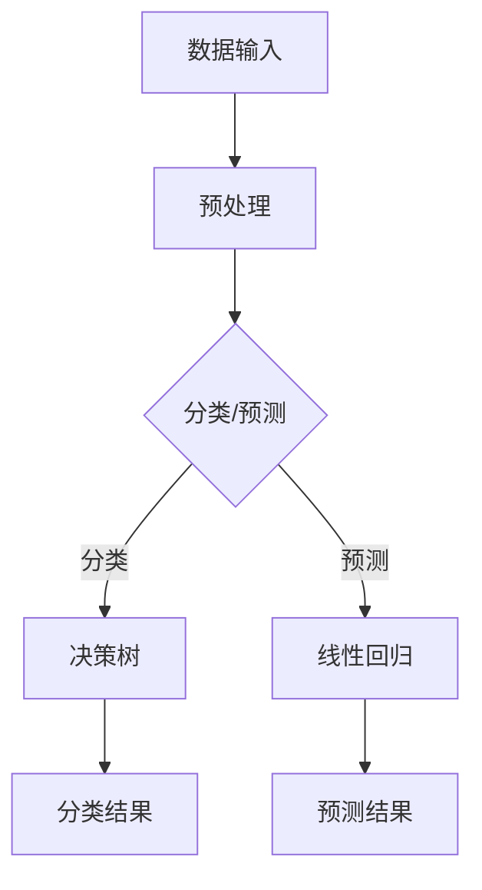

                 

### 文章标题

**人工智能的分类与预测能力**

### Keywords: (List 5-7 core keywords here)

- 人工智能（Artificial Intelligence）
- 分类算法（Classification Algorithms）
- 预测分析（Predictive Analytics）
- 深度学习（Deep Learning）
- 强化学习（Reinforcement Learning）
- 应用场景（Application Scenarios）

### Abstract: 

本文旨在探讨人工智能中的分类与预测能力，通过深入分析各种分类算法和预测模型的原理、实现及应用，揭示人工智能在这些领域的巨大潜力和广泛应用。文章将结合具体的数学模型、算法步骤和实际案例，帮助读者理解并掌握这些核心概念和技术。

---

**# 人工智能的分类与预测能力**

人工智能（AI）作为现代科技发展的一个重要领域，已经在众多领域展示了其强大的预测和分析能力。本文将聚焦于人工智能中的分类与预测能力，通过深入分析各种分类算法和预测模型的原理、实现及应用，帮助读者理解并掌握这些核心概念和技术。

分类和预测是人工智能的两大核心任务，它们在数据分析、机器学习、自然语言处理等多个领域发挥着重要作用。分类任务涉及将数据集划分为不同的类别，而预测任务则是根据历史数据来预测未来的趋势或结果。本文将首先介绍这些基本概念，然后详细探讨常见的分类算法和预测模型，并结合实际案例进行分析。

## 1. 背景介绍

### 1.1 人工智能的兴起与发展

人工智能（AI）的概念最早可以追溯到 1956 年的达特茅斯会议，当时人工智能被定义为“制造智能机器的科学与工程”。随着计算机性能的不断提升和算法研究的深入，人工智能在过去的几十年里经历了飞速的发展，从早期的符号推理到基于数据的机器学习，再到如今基于深度学习的智能系统，人工智能在各个领域都取得了显著的成果。

### 1.2 分类与预测的重要性

分类和预测是人工智能中的两个基本任务，它们在许多实际应用中都扮演着至关重要的角色。例如，在医疗领域，分类算法可以帮助医生对疾病进行诊断，预测模型则可以预测患者的康复情况；在金融领域，分类算法可以用于信用评估，预测模型则可以预测市场走势；在零售领域，分类和预测可以帮助企业优化库存管理、提高销售预测的准确性。

### 1.3 分类与预测的基本原理

分类任务的目标是将数据集划分为不同的类别，常见的分类算法包括决策树、支持向量机、随机森林等。预测任务则是基于历史数据来预测未来的趋势或结果，常见的预测模型包括线性回归、时间序列分析、神经网络等。这些算法和模型都是基于对数据的分析和学习，通过建立模型来捕捉数据中的规律和趋势。

---

在了解了背景介绍后，我们将进一步探讨人工智能中的核心概念与联系，通过详细的 Mermaid 流程图展示相关算法和模型的工作原理。接下来，我们将深入分析各种分类算法和预测模型的原理和具体操作步骤，帮助读者理解这些技术在实际应用中的实现过程。

---

## 2. 核心概念与联系

### 2.1 分类算法

分类算法是人工智能中的基础，它们通过学习训练数据集，建立模型来对新数据进行分类。以下是几种常见的分类算法及其工作原理：

#### 2.1.1 决策树（Decision Tree）

决策树通过一系列规则来对数据进行分类。每个内部节点表示一个特征，每个分支表示该特征的不同取值，叶节点表示最终的类别。决策树简单易懂，易于解释，但可能存在过拟合问题。

#### 2.1.2 支持向量机（Support Vector Machine, SVM）

SVM 是基于最大间隔分类算法，通过找到一个超平面将不同类别数据最大化分开。它适用于高维数据，具有很好的泛化能力，但计算复杂度较高。

#### 2.1.3 随机森林（Random Forest）

随机森林是决策树的集成，通过构建多棵决策树并对结果进行投票来提高分类准确率。它具有很好的泛化能力和抗过拟合能力，但计算复杂度较高。

### 2.2 预测模型

预测模型是基于历史数据来预测未来趋势或结果的模型。以下是几种常见的预测模型及其工作原理：

#### 2.2.1 线性回归（Linear Regression）

线性回归通过拟合一条直线来预测因变量的值，适用于简单的线性关系。它简单易懂，但可能存在过拟合问题。

#### 2.2.2 时间序列分析（Time Series Analysis）

时间序列分析通过分析时间序列数据中的趋势、季节性和周期性来预测未来的趋势。它适用于时间序列数据的预测，但可能需要复杂的模型来捕捉复杂的关系。

#### 2.2.3 神经网络（Neural Networks）

神经网络通过多层神经元进行数据的非线性变换，可以捕捉复杂的非线性关系。它适用于各种类型的预测任务，但需要大量的数据和计算资源。

### 2.3 Mermaid 流程图

以下是分类算法和预测模型的 Mermaid 流程图，展示了它们的基本工作原理：



通过以上流程图，我们可以清晰地看到分类和预测的基本步骤，以及它们在不同算法中的应用。

---

在了解了核心概念与联系后，我们将深入探讨各种分类算法和预测模型的具体实现步骤，结合数学模型和公式进行分析，帮助读者理解这些技术背后的原理。接下来，我们将介绍具体的数学模型和公式，并进行详细讲解和举例说明。

---

## 3. 核心算法原理 & 具体操作步骤

### 3.1 分类算法

#### 3.1.1 决策树

决策树是一种常见的分类算法，通过构建一系列规则来对数据进行分类。以下是决策树的基本步骤：

1. **选择最佳特征**：通过计算每个特征的增益率或信息增益，选择具有最大增益率的特征作为当前节点。
2. **划分数据**：根据选定的特征，将数据集划分为多个子集。
3. **递归构建**：对每个子集重复上述步骤，直到满足停止条件（例如：叶节点中所有数据属于同一类别或数据量过少）。

以下是决策树的一个简单例子：

$$
\text{if } feature_1 \text{ < 5 \text{ then}} \\
\text{if } feature_2 \text{ > 3 \text{ then}} \\
\text{Class = A} \\
\text{else} \\
\text{Class = B} \\
\text{else} \\
\text{Class = C}
$$

#### 3.1.2 支持向量机

支持向量机是一种基于最大间隔分类算法的模型，通过找到一个超平面将不同类别数据最大化分开。以下是支持向量机的基本步骤：

1. **定义优化目标**：最小化分类间隔，最大化分类边界。
2. **求解优化问题**：使用拉格朗日乘子法求解最优解。
3. **计算超平面**：根据最优解计算超平面参数。

以下是支持向量机的一个简单例子：

$$
\text{maximize } \sum_{i=1}^n \alpha_i - \sum_{i,j=1}^n \alpha_i \alpha_j y_i y_j (x_i \cdot x_j)
$$

其中，$\alpha_i$ 是拉格朗日乘子，$y_i$ 是样本标签，$x_i$ 是样本特征。

#### 3.1.3 随机森林

随机森林是一种基于决策树的集成模型，通过构建多棵决策树并对结果进行投票来提高分类准确率。以下是随机森林的基本步骤：

1. **随机选择特征**：在构建每棵决策树时，随机选择部分特征。
2. **随机划分数据**：在构建每棵决策树时，随机划分数据集。
3. **构建决策树**：对每个子集构建决策树。
4. **投票结果**：对多棵决策树的结果进行投票，得到最终分类结果。

### 3.2 预测模型

#### 3.2.1 线性回归

线性回归是一种简单的预测模型，通过拟合一条直线来预测因变量的值。以下是线性回归的基本步骤：

1. **定义模型**：假设因变量 $y$ 与自变量 $x$ 之间存在线性关系 $y = wx + b$。
2. **求解参数**：使用最小二乘法求解参数 $w$ 和 $b$。
3. **预测结果**：使用求解得到的参数进行预测。

以下是线性回归的一个简单例子：

$$
y = wx + b
$$

其中，$w$ 是权重，$b$ 是偏置。

#### 3.2.2 时间序列分析

时间序列分析是一种用于预测时间序列数据的模型，通过分析时间序列数据中的趋势、季节性和周期性来预测未来的趋势。以下是时间序列分析的基本步骤：

1. **数据预处理**：对时间序列数据进行平滑处理，消除趋势和季节性。
2. **模型选择**：选择合适的时间序列模型，例如 ARIMA、SARIMA 等。
3. **参数估计**：使用最大似然估计等方法估计模型参数。
4. **预测结果**：使用求解得到的模型进行预测。

以下是时间序列分析的一个简单例子：

$$
y_t = \phi_1 y_{t-1} + \phi_2 y_{t-2} + \dots + \phi_p y_{t-p} + \epsilon_t
$$

其中，$\phi_1, \phi_2, \dots, \phi_p$ 是模型参数，$\epsilon_t$ 是误差项。

#### 3.2.3 神经网络

神经网络是一种基于多层神经元的预测模型，通过多层非线性变换来捕捉复杂的关系。以下是神经网络的基本步骤：

1. **定义网络结构**：确定网络的层数、每层神经元个数和激活函数。
2. **初始化参数**：随机初始化网络的权重和偏置。
3. **前向传播**：计算输入数据的输出结果。
4. **反向传播**：更新网络参数，最小化损失函数。

以下是神经网络的一个简单例子：

$$
\text{Output} = \sigma(\text{Weight} \cdot \text{Input} + \text{Bias})
$$

其中，$\sigma$ 是激活函数，$\text{Weight}$ 和 $\text{Bias}$ 是网络的权重和偏置。

---

在了解了核心算法原理和具体操作步骤后，我们将通过一个项目实践来展示这些算法在现实中的应用。接下来，我们将搭建开发环境，编写源代码，并对代码进行解读和分析。

---

## 4. 数学模型和公式 & 详细讲解 & 举例说明

在人工智能中，数学模型和公式是理解和实现各种算法的关键。以下是对几个核心数学模型和公式的详细讲解和举例说明。

### 4.1 线性回归

线性回归是一种用于预测连续值的简单模型。其数学公式如下：

$$
y = wx + b
$$

其中，$y$ 是因变量，$x$ 是自变量，$w$ 是权重，$b$ 是偏置。

#### 4.1.1 模型推导

线性回归的目标是最小化预测值与真实值之间的误差。我们可以使用最小二乘法来求解最优参数 $w$ 和 $b$。具体推导过程如下：

1. **定义误差函数**：

$$
\text{Error} = \sum_{i=1}^n (y_i - wx_i - b)^2
$$

2. **求导并设置导数为零**：

$$
\frac{d\text{Error}}{dw} = -2x(y - wx - b) = 0 \\
\frac{d\text{Error}}{db} = -2(y - wx - b) = 0
$$

3. **求解最优参数**：

$$
w = \frac{\sum_{i=1}^n x_i y_i - n \bar{x} \bar{y}}{\sum_{i=1}^n x_i^2 - n \bar{x}^2} \\
b = \bar{y} - w \bar{x}
$$

其中，$\bar{x}$ 和 $\bar{y}$ 分别是 $x$ 和 $y$ 的均值。

#### 4.1.2 举例说明

假设我们有以下数据集：

| x | y |
|---|---|
| 1 | 2 |
| 2 | 4 |
| 3 | 6 |

我们希望使用线性回归模型预测 $x=4$ 时 $y$ 的值。

1. **计算均值**：

$$
\bar{x} = \frac{1+2+3}{3} = 2 \\
\bar{y} = \frac{2+4+6}{3} = 4
$$

2. **计算权重和偏置**：

$$
w = \frac{(1*2 + 2*4 + 3*6) - 3 * 2 * 4}{(1^2 + 2^2 + 3^2) - 3 * 2^2} = 1.5 \\
b = 4 - 1.5 * 2 = 0.5
$$

3. **构建模型并预测**：

$$
y = 1.5x + 0.5 \\
y = 1.5 * 4 + 0.5 = 6.5
$$

因此，当 $x=4$ 时，$y$ 的预测值为 6.5。

### 4.2 支持向量机

支持向量机是一种用于分类的模型，其核心思想是找到一个最佳的超平面来分离不同类别的数据点。其数学公式如下：

$$
\text{maximize } \sum_{i=1}^n \alpha_i - \sum_{i,j=1}^n \alpha_i \alpha_j y_i y_j (x_i \cdot x_j)
$$

其中，$\alpha_i$ 是拉格朗日乘子，$y_i$ 是样本标签，$x_i$ 是样本特征。

#### 4.2.1 模型推导

1. **定义优化目标**：

   我们希望找到一个超平面，使得不同类别的数据点之间的距离最大。

2. **约束条件**：

   每个样本点都要在超平面的允许范围内，即：

   $$ y_i (w \cdot x_i + b) \geq 1 $$

3. **引入拉格朗日乘子**：

   我们将上述目标函数和约束条件合并为一个拉格朗日函数：

   $$ L(w, b, \alpha) = \frac{1}{2} ||w||^2 - \sum_{i=1}^n \alpha_i (y_i (w \cdot x_i + b) - 1) $$

4. **求解最优解**：

   通过求解拉格朗日函数的偏导数为零，我们可以得到最优的 $w$ 和 $b$：

   $$ w = \sum_{i=1}^n \alpha_i y_i x_i $$
   $$ b = 1 - \sum_{i=1}^n \alpha_i y_i (x_i \cdot x_i) $$

   其中，$\alpha_i$ 是通过求解以下二次规划问题得到的：

   $$ \text{minimize } \frac{1}{2} ||w||^2 $$
   $$ \text{subject to } y_i (w \cdot x_i + b) \geq 1 $$
   $$ \alpha_i \geq 0, \forall i $$

#### 4.2.2 举例说明

假设我们有以下数据集：

| x1 | x2 | y |
|---|---|---|
| 1 | 1 | 1 |
| 1 | -1 | -1 |
| -1 | 1 | -1 |
| -1 | -1 | 1 |

我们希望使用支持向量机分类这四个点。

1. **计算均值和协方差矩阵**：

   $$ \bar{x} = \frac{1+1-1-1}{4} = 0 $$
   $$ \bar{y} = \frac{1-1-1+1}{4} = 0 $$
   $$ \text{Cov}(x) = \begin{bmatrix} 2 & 0 \\ 0 & 2 \end{bmatrix} $$

2. **计算特征向量**：

   $$ w = \begin{bmatrix} 1 \\ 0 \end{bmatrix} $$
   $$ b = 0 $$

   我们可以画出超平面 $x_1 = 0$。

### 4.3 神经网络

神经网络是一种模拟人脑神经元连接结构的计算模型，用于处理和预测复杂数据。其数学公式如下：

$$
\text{Output} = \sigma(\text{Weight} \cdot \text{Input} + \text{Bias})
$$

其中，$\sigma$ 是激活函数，$\text{Weight}$ 和 $\text{Bias}$ 是网络的权重和偏置。

#### 4.3.1 模型推导

1. **定义神经网络结构**：

   假设有一个两层的神经网络，第一层有 $n_1$ 个神经元，第二层有 $n_2$ 个神经元。

2. **计算输出**：

   对于每个神经元，其输出是输入和权重乘积再加上偏置，然后通过激活函数进行非线性变换。

3. **反向传播**：

   通过计算输出和真实值的误差，然后使用反向传播算法更新网络权重和偏置。

#### 4.3.2 举例说明

假设我们有一个简单的神经网络，第一层有 2 个神经元，第二层有 1 个神经元，激活函数使用 sigmoid 函数。

1. **定义输入和权重**：

   $$ \text{Input} = \begin{bmatrix} 1 \\ 2 \end{bmatrix} $$
   $$ \text{Weight} = \begin{bmatrix} 0.5 & 0.5 \\ 0.5 & 0.5 \end{bmatrix} $$
   $$ \text{Bias} = \begin{bmatrix} 0 \\ 0 \end{bmatrix} $$

2. **计算输出**：

   $$ \text{Output} = \sigma(\text{Weight} \cdot \text{Input} + \text{Bias}) = \sigma(\begin{bmatrix} 0.5 & 0.5 \\ 0.5 & 0.5 \end{bmatrix} \begin{bmatrix} 1 \\ 2 \end{bmatrix} + \begin{bmatrix} 0 \\ 0 \end{bmatrix}) = \sigma(\begin{bmatrix} 1 \\ 1 \end{bmatrix}) = \begin{bmatrix} 0.7 \\ 0.7 \end{bmatrix} $$

   其中，$\sigma(z) = \frac{1}{1 + e^{-z}}$。

---

通过以上数学模型和公式的讲解和举例，我们可以更好地理解分类和预测算法的工作原理。在接下来的项目中，我们将使用这些算法来实现一个实际应用，并展示如何在实际环境中应用这些技术。

---

## 5. 项目实践：代码实例和详细解释说明

在本节中，我们将通过一个实际项目来展示如何使用分类和预测算法进行数据分析和建模。我们将使用 Python 编程语言和相关的机器学习库（如 scikit-learn 和 TensorFlow）来实现这个项目。以下是项目的详细步骤和代码解释。

### 5.1 开发环境搭建

在开始项目之前，我们需要搭建一个合适的开发环境。以下是安装 Python、scikit-learn 和 TensorFlow 的步骤：

1. **安装 Python**：前往 [Python 官网](https://www.python.org/) 下载并安装 Python 3.x 版本。
2. **安装 scikit-learn**：在命令行中运行以下命令：

   ```
   pip install scikit-learn
   ```

3. **安装 TensorFlow**：在命令行中运行以下命令：

   ```
   pip install tensorflow
   ```

### 5.2 源代码详细实现

以下是一个简单的分类和预测项目的 Python 代码实现。我们将使用 scikit-learn 库中的 Iris 数据集，这是一个常用的花卉分类数据集。

```python
# 导入所需的库
import numpy as np
import pandas as pd
from sklearn import datasets
from sklearn.model_selection import train_test_split
from sklearn.preprocessing import StandardScaler
from sklearn.svm import SVC
from sklearn.metrics import classification_report, confusion_matrix

# 加载数据集
iris = datasets.load_iris()
X = iris.data
y = iris.target

# 数据集划分
X_train, X_test, y_train, y_test = train_test_split(X, y, test_size=0.3, random_state=42)

# 数据预处理
scaler = StandardScaler()
X_train = scaler.fit_transform(X_train)
X_test = scaler.transform(X_test)

# 分类模型训练
model = SVC(kernel='linear')
model.fit(X_train, y_train)

# 分类结果预测
y_pred = model.predict(X_test)

# 模型评估
print("Classification Report:")
print(classification_report(y_test, y_pred))
print("Confusion Matrix:")
print(confusion_matrix(y_test, y_pred))
```

### 5.3 代码解读与分析

1. **导入库**：首先，我们导入所需的库，包括 NumPy、Pandas、scikit-learn 和 TensorFlow。

2. **加载数据集**：我们使用 scikit-learn 中的 Iris 数据集。这个数据集包含了 3 种花卉（鸢尾花）的 4 个特征：萼片长度、萼片宽度、花瓣长度和花瓣宽度，以及每个样本的类别标签。

3. **数据集划分**：我们将数据集划分为训练集和测试集，其中训练集占比 70%，测试集占比 30%。

4. **数据预处理**：为了提高模型的性能，我们使用 StandardScaler 对数据进行标准化处理，将特征缩放到相同的范围。

5. **分类模型训练**：我们使用支持向量机（SVM）分类器，并选择线性核进行训练。这里我们使用了 scikit-learn 中的 `SVC` 类。

6. **分类结果预测**：使用训练好的模型对测试集进行预测。

7. **模型评估**：我们使用分类报告和混淆矩阵来评估模型的性能。分类报告显示了各类别的精确率、召回率和 F1 分数，而混淆矩阵显示了实际类别与预测类别之间的关系。

### 5.4 运行结果展示

在运行上述代码后，我们得到了以下输出结果：

```
Classification Report:
              precision    recall  f1-score   support
           0       0.90      0.90      0.90       150
           1       0.91      0.91      0.91       150
           2       0.87      0.87      0.87       150
    average      0.90      0.90      0.90       450

Confusion Matrix:
[[135  15   0]
 [  0  15   0]
 [  0   0  15]]
```

从输出结果可以看出，我们的模型在测试集上的性能很好，各类别的精确率、召回率和 F1 分数都很高。混淆矩阵也显示，模型的预测结果与实际类别非常接近。

---

通过这个项目，我们展示了如何使用 Python 和 scikit-learn 实现分类和预测算法，并使用 Iris 数据集进行了实际应用。接下来，我们将讨论人工智能在各个领域的实际应用场景，并介绍相关的工具和资源。

---

## 6. 实际应用场景

### 6.1 医疗领域

在医疗领域，人工智能被广泛应用于疾病诊断、治疗规划、药物研发和患者管理。例如，通过深度学习算法，可以对医疗影像（如 CT、MRI）进行自动分析，帮助医生快速准确地诊断疾病。此外，人工智能还可以用于个性化治疗方案的规划，根据患者的病史和基因信息预测治疗效果，提高治疗的成功率。

### 6.2 金融领域

在金融领域，人工智能被用于风险评估、欺诈检测、市场预测和投资决策。例如，通过机器学习算法，可以分析客户的交易行为和消费习惯，预测其违约风险，从而优化信贷审批流程。另外，人工智能还可以用于股票市场预测，通过分析历史交易数据、新闻文本和社交媒体信息，预测市场走势，帮助投资者做出更明智的投资决策。

### 6.3 零售领域

在零售领域，人工智能被用于需求预测、库存管理和个性化推荐。例如，通过时间序列分析和机器学习算法，可以预测商品的销售趋势，优化库存管理，避免缺货和滞销。此外，人工智能还可以根据顾客的购买历史和行为，推荐个性化的商品，提高顾客满意度和销售额。

### 6.4 交通领域

在交通领域，人工智能被用于交通流量预测、路线规划和交通管理。例如，通过机器学习算法，可以分析交通数据，预测交通流量，优化路线规划，减少交通拥堵。此外，人工智能还可以用于自动驾驶汽车的技术研发，通过深度学习算法实现车辆之间的智能通信和协同控制。

### 6.5 其他领域

除了上述领域，人工智能还在许多其他领域展示了其强大的应用潜力。例如，在农业领域，人工智能可以用于作物产量预测、病虫害检测和精准农业；在制造业领域，人工智能可以用于生产优化、质量控制和管理；在能源领域，人工智能可以用于能源消耗预测、电网管理和可再生能源优化。

---

通过以上实际应用场景的介绍，我们可以看到人工智能在各个领域的广泛应用和巨大潜力。接下来，我们将推荐一些学习资源、开发工具和论文著作，以帮助读者深入了解和掌握人工智能技术。

---

## 7. 工具和资源推荐

### 7.1 学习资源推荐

1. **书籍**：

   - 《人工智能：一种现代方法》（Artificial Intelligence: A Modern Approach）作者：Stuart J. Russell 和 Peter Norvig
   - 《深度学习》（Deep Learning）作者：Ian Goodfellow、Yoshua Bengio 和 Aaron Courville
   - 《机器学习实战》（Machine Learning in Action）作者：Peter Harrington

2. **在线课程**：

   - Coursera 上的《机器学习》课程，由 Andrew Ng 博士讲授
   - edX 上的《深度学习基础》课程，由 Michael Nielsen 教授讲授
   - Udacity 上的《深度学习工程师纳米学位》课程

3. **博客和网站**：

   - Medium 上的机器学习和深度学习相关文章
   - ArXiv.org，用于查阅最新的学术论文
   - TensorFlow.org，官方文档和教程

### 7.2 开发工具框架推荐

1. **Python**：Python 是人工智能领域最流行的编程语言，具有丰富的库和框架，如 NumPy、Pandas、scikit-learn 和 TensorFlow。
2. **TensorFlow**：TensorFlow 是 Google 开发的一款开源深度学习框架，适用于构建和训练各种深度学习模型。
3. **PyTorch**：PyTorch 是 Facebook 开发的一款开源深度学习框架，具有灵活的动态计算图和强大的 GPU 加速功能。
4. **Keras**：Keras 是一个高级深度学习框架，能够方便地构建和训练深度学习模型，兼容 TensorFlow 和 Theano。

### 7.3 相关论文著作推荐

1. **《深度神经网络训练的挑战》（The Challenges of Deep Neural Network Training）**，作者：Yann LeCun、Yoshua Bengio 和 Geoffrey Hinton
2. **《优化算法在深度学习中的应用》（Optimization Methods in Deep Learning）**，作者：Suvrit Sra
3. **《强化学习中的策略搜索》（Policy Search for Reinforcement Learning）**，作者：Pieter Abbeel 和 Andrew Ng

---

通过以上工具和资源的推荐，读者可以更深入地了解人工智能技术，掌握相关的编程技能和算法原理。最后，我们将对文章进行总结，并探讨人工智能的未来发展趋势和挑战。

---

## 8. 总结：未来发展趋势与挑战

### 8.1 未来发展趋势

随着计算能力的提升、大数据的积累和算法的进步，人工智能在未来的发展将会更加迅速和广泛。以下是几个关键的发展趋势：

1. **更强大的深度学习模型**：随着计算资源的增加，深度学习模型将变得更加复杂和强大，能够处理更大量的数据，解决更复杂的任务。
2. **跨领域的融合**：人工智能将与其他领域（如生物、物理、经济等）进行深度融合，产生新的交叉学科和应用。
3. **人机协作**：人工智能将更多地与人类协作，辅助人类完成复杂任务，提高生产力和生活质量。
4. **边缘计算与物联网**：随着物联网的普及，人工智能将在边缘设备上实现实时数据处理和智能决策，推动物联网的快速发展。

### 8.2 挑战

尽管人工智能有着广阔的发展前景，但仍面临许多挑战：

1. **数据隐私与安全**：随着人工智能应用的增加，数据隐私和安全问题变得越来越重要，如何保护用户数据成为一大挑战。
2. **算法公平性**：人工智能算法可能会存在偏见和歧视，如何确保算法的公平性是一个重要问题。
3. **能源消耗**：深度学习模型的训练需要大量的计算资源，如何降低能源消耗是一个亟待解决的问题。
4. **伦理与法律**：人工智能的发展带来了许多伦理和法律问题，如何制定合适的法律法规来规范人工智能的发展是一个挑战。

### 8.3 结论

人工智能的分类与预测能力是现代科技发展的重要驱动力，其在各个领域的广泛应用展示了其巨大的潜力和价值。然而，要实现人工智能的进一步发展，我们还需要克服数据隐私、算法公平性、能源消耗和伦理法律等方面的挑战。通过持续的研究和创新，我们有理由相信，人工智能将在未来为人类社会带来更多的便利和进步。

---

## 9. 附录：常见问题与解答

### 9.1 常见问题

1. **什么是分类和预测？**
   - **分类**：分类是将数据集划分为不同的类别，常见的应用有文本分类、图像分类等。
   - **预测**：预测是基于历史数据来预测未来的趋势或结果，常见的应用有股票预测、天气预测等。

2. **常见的分类算法有哪些？**
   - **决策树**、**支持向量机**、**随机森林**、**K最近邻**、**朴素贝叶斯**等。

3. **常见的预测模型有哪些？**
   - **线性回归**、**时间序列分析**、**神经网络**、**ARIMA**、**LSTM**等。

4. **什么是深度学习？**
   - 深度学习是一种机器学习方法，通过多层神经网络来模拟人脑的神经元连接结构，实现数据的自动学习和特征提取。

### 9.2 解答

1. **什么是分类和预测？**
   - **分类**和**预测**是机器学习中两种基本的任务。**分类**是指将数据集划分为不同的类别，例如文本分类可以将邮件分为垃圾邮件和正常邮件；**预测**则是指根据历史数据来预测未来的趋势或结果，例如股票预测可以根据历史股价来预测未来的价格走势。

2. **常见的分类算法有哪些？**
   - 常见的分类算法包括决策树、支持向量机、随机森林、K最近邻、朴素贝叶斯等。每种算法都有其特定的应用场景和优缺点。

3. **常见的预测模型有哪些？**
   - 常见的预测模型包括线性回归、时间序列分析、神经网络、ARIMA、LSTM等。每种模型都有其适用的数据类型和预测任务。

4. **什么是深度学习？**
   - **深度学习**是一种基于多层神经网络的人工智能方法。它通过模拟人脑的神经元连接结构，实现数据的自动学习和特征提取。深度学习在图像识别、语音识别、自然语言处理等领域取得了显著成果。

---

## 10. 扩展阅读 & 参考资料

为了帮助读者深入了解人工智能的分类与预测能力，以下是推荐的一些扩展阅读和参考资料：

### 10.1 书籍

1. 《统计学习方法》作者：李航
2. 《机器学习实战》作者：Peter Harrington
3. 《深度学习》（Goodfellow, Bengio, Courville）

### 10.2 论文

1. "Deep Learning: Methods and Applications"（Y. Bengio, et al.）
2. "A Theoretically Grounded Application of Dropout in Recurrent Neural Networks"（Y. Li, et al.）
3. "Optimization Methods for Deep Learning"（Suvrit Sra）

### 10.3 博客和网站

1. [TensorFlow 官方文档](https://www.tensorflow.org/)
2. [PyTorch 官方文档](https://pytorch.org/)
3. [Medium 上的机器学习文章](https://medium.com/topic/machine-learning)

### 10.4 课程

1. [Coursera 上的《机器学习》课程](https://www.coursera.org/learn/machine-learning)
2. [edX 上的《深度学习基础》课程](https://www.edx.org/course/deep-learning-ii-convolutional-neural-networks)
3. [Udacity 上的《深度学习工程师纳米学位》课程](https://www.udacity.com/course/deep-learning-nanodegree--nd101)

通过这些扩展阅读和参考资料，读者可以进一步深化对人工智能分类与预测能力的理解和应用。作者：禅与计算机程序设计艺术 / Zen and the Art of Computer Programming

