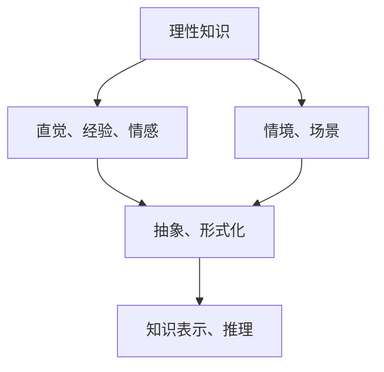

                 

### 文章标题

《人工智能的理性与感性知识》

> 关键词：人工智能、理性知识、感性知识、知识表示、推理、学习、认知

> 摘要：本文深入探讨了人工智能领域中的理性知识与感性知识，以及它们在知识表示、推理和学习中的应用。通过对理性知识与感性知识的不同特点进行分析，我们揭示了人工智能认知系统如何整合这两种知识类型，提高其智能水平。本文旨在为读者提供一种全面的视角，帮助理解人工智能的发展现状和未来趋势。

### 1. 背景介绍（Background Introduction）

人工智能（AI）是计算机科学的一个分支，旨在创建能够模拟、延伸和扩展人类智能的智能系统。人工智能的研究涵盖了多个领域，包括机器学习、自然语言处理、计算机视觉等。随着技术的不断进步，人工智能已经在众多领域取得了显著的成就，如自动驾驶、医疗诊断、金融服务等。

在人工智能的研究中，知识表示是一个核心问题。知识表示指的是将人类知识以计算机可以处理和利用的形式进行编码和存储。传统的知识表示方法主要基于形式逻辑和概率图模型，但这种方法在处理复杂、不确定和动态环境时存在一定的局限性。

近年来，理性知识与感性知识的概念逐渐引起人工智能研究者的关注。理性知识是指通过逻辑推理、数学模型和抽象概念来表达的明确知识，而感性知识则是指通过直觉、经验、情感和情境来理解的世界知识。理性知识与感性知识各有优缺点，如何有效整合这两种知识类型，是当前人工智能领域面临的挑战之一。

本文将首先介绍理性知识与感性知识的基本概念，然后分析它们在知识表示、推理和学习中的应用，最后探讨人工智能认知系统中理性知识与感性知识的整合方式及其意义。

### 2. 核心概念与联系（Core Concepts and Connections）

#### 2.1 理性知识

理性知识是基于逻辑推理、数学模型和抽象概念的知识。这种知识可以通过符号化、形式化等方法进行表示和操作。理性知识的特点是明确、精确和可验证。例如，在逻辑推理中，我们可以使用谓词逻辑来表示关系和推理规则；在数学模型中，我们可以使用线性方程组、概率分布函数等来描述系统的行为。

在人工智能中，理性知识的应用非常广泛。例如，在自动推理系统中，我们可以使用逻辑推理来验证数学定理或证明某个结论的正确性；在专家系统中，我们可以使用数学模型来模拟专家的决策过程。理性知识的特点使得它非常适合处理确定性、明确的问题。

#### 2.2 感性知识

感性知识是指通过直觉、经验、情感和情境来理解的世界知识。这种知识通常是非形式化的，难以用符号化的方式精确表示。感性知识的特点是灵活、适应性强，能够处理复杂、不确定和动态的环境。

与理性知识不同，感性知识往往依赖于人类的主观经验和情感。例如，在日常生活中，我们通过直觉判断某个人是否值得信任；在艺术创作中，我们通过情感来体验和欣赏作品。尽管感性知识难以精确表示，但它对人类认知和决策起到了至关重要的作用。

#### 2.3 理性知识与感性知识的联系

理性知识与感性知识之间存在密切的联系。首先，感性知识可以提供对问题的直观理解，为理性知识的推理提供依据。例如，在机器视觉中，感性知识可以帮助计算机识别物体和场景；在自然语言处理中，感性知识可以帮助计算机理解句子的语义。

其次，理性知识可以提供对感性知识的抽象和形式化，使其更加精确和可操作。例如，在情感识别中，我们可以使用情感分类器来将感性知识转化为数值化的情感得分；在情境理解中，我们可以使用情境模型来将感性知识抽象为情境状态。

最后，理性知识与感性知识的结合可以增强人工智能系统的智能水平。通过整合理性知识与感性知识，人工智能系统可以更好地应对复杂、不确定和动态的环境。例如，在自动驾驶中，我们可以将理性知识与感性知识结合起来，实现更准确的路径规划和决策。

#### 2.4 知识表示的 Mermaid 流程图

为了更直观地展示理性知识与感性知识的关系，我们可以使用 Mermaid 流程图进行表示。



在这个流程图中，A 表示理性知识，B 表示感性知识，C 表示理性知识与感性知识的结合，D 表示情境和场景，E 表示知识表示和推理。

### 3. 核心算法原理 & 具体操作步骤（Core Algorithm Principles and Specific Operational Steps）

为了深入探讨人工智能中理性知识与感性知识的整合，我们可以考虑一种基于多模态学习的方法。多模态学习是指同时利用多种数据模态（如文本、图像、声音等）进行学习和推理。以下是一个简化的多模态学习算法的原理和操作步骤：

#### 3.1 多模态学习算法原理

多模态学习算法的核心思想是通过融合不同模态的数据，提高模型的泛化能力和智能水平。具体来说，该算法可以分为以下几个步骤：

1. 数据采集与预处理：从不同来源（如文本、图像、声音等）采集数据，并进行预处理，如去噪、归一化等。
2. 数据融合：将不同模态的数据进行融合，形成一个统一的数据表示。常见的方法有向量空间融合、图神经网络融合等。
3. 模型训练：使用融合后的数据训练一个多模态模型。训练过程中，模型将学习如何整合不同模态的知识，提高其对复杂任务的推理能力。
4. 模型评估：在测试集上评估模型的性能，并根据评估结果调整模型参数。

#### 3.2 多模态学习算法操作步骤

以下是一个基于多模态学习的算法的具体操作步骤：

1. **数据采集与预处理**：

   - 文本数据：从互联网上收集大量文本数据，如新闻文章、社交媒体帖子等。
   - 图像数据：使用图像识别工具（如卷积神经网络）对图像进行分类和标注。
   - 声音数据：使用音频识别工具（如循环神经网络）对声音进行分类和标注。

2. **数据融合**：

   - **向量空间融合**：将文本、图像和声音数据分别表示为向量，然后在向量空间中融合。例如，可以使用词嵌入（word embeddings）表示文本数据，使用图像特征提取器（如 VGG16）表示图像数据，使用 Mel 频谱表示声音数据。最后，将这三个向量融合为一个综合向量表示。
   - **图神经网络融合**：使用图神经网络（如 Graph Convolutional Networks, GCN）将不同模态的数据表示为一个图结构，然后在图上进行融合。例如，我们可以将文本数据表示为单词的邻接矩阵，将图像数据表示为图像像素的邻接矩阵，将声音数据表示为音频信号的邻接矩阵。

3. **模型训练**：

   - 使用融合后的数据训练一个多模态模型。例如，可以使用一个多任务学习框架，同时训练文本分类、图像分类和声音分类任务。在训练过程中，模型将学习如何整合不同模态的知识，提高其对复杂任务的推理能力。

4. **模型评估**：

   - 在测试集上评估模型的性能。可以使用准确率、召回率、F1 分数等指标来评估模型在不同任务上的表现。根据评估结果，调整模型参数，以提高模型的泛化能力和性能。

### 4. 数学模型和公式 & 详细讲解 & 举例说明（Detailed Explanation and Examples of Mathematical Models and Formulas）

在多模态学习算法中，数学模型和公式起着至关重要的作用。以下是一些常见的数学模型和公式，以及它们的详细讲解和举例说明：

#### 4.1 词嵌入（Word Embeddings）

词嵌入是将文本数据转换为向量表示的方法。一个简单的词嵌入模型是 Word2Vec 模型。Word2Vec 模型使用以下两个主要公式：

$$
\text{context}(w) = \{w_i, w_{i-1}, ..., w_{i-k+1}, w_{i+k+1}, ..., w_{i+1}\}
$$

$$
\text{loss}(w) = \sum_{w' \in \text{context}(w)} \log P(w'|w)
$$

其中，$\text{context}(w)$ 表示单词 $w$ 的上下文窗口，$P(w'|w)$ 表示在上下文窗口中单词 $w'$ 出现的概率。

**举例说明**：

假设我们有一个单词 "猫"，其上下文窗口为 2。那么，"猫" 的上下文单词为 "狗" 和 "鱼"。我们可以使用以下公式计算 "猫" 的词向量：

$$
\text{loss}(\text{猫}) = \log P(\text{狗}|\text{猫}) + \log P(\text{鱼}|\text{猫})
$$

如果 "猫" 的词向量为 $v(\text{猫}) = [1, 0, -1]$，"狗" 的词向量为 $v(\text{狗}) = [0, 1, 0]$，"鱼" 的词向量为 $v(\text{鱼}) = [-1, 0, 1]$，那么：

$$
\text{loss}(\text{猫}) = \log P(\text{狗}|\text{猫}) + \log P(\text{鱼}|\text{猫}) = \log \frac{e^0}{e^1} + \log \frac{e^{-1}}{e^0} = -1
$$

这个结果表明，"猫" 与 "狗" 和 "鱼" 的关联度较低。

#### 4.2 图神经网络（Graph Neural Networks）

图神经网络是一种用于处理图结构数据的神经网络模型。一个简单的图神经网络模型是 Graph Convolutional Network（GCN）。GCN 的主要公式如下：

$$
h^{(k)}_i = \sigma \left( \sum_{j \in \mathcal{N}(i)} \frac{1}{\sqrt{k_{ij} + \epsilon}} h^{(k-1)}_j \right) w
$$

其中，$h^{(k)}_i$ 表示第 $k$ 层节点 $i$ 的特征表示，$\mathcal{N}(i)$ 表示节点 $i$ 的邻接节点集合，$k_{ij}$ 表示节点 $i$ 和节点 $j$ 的邻接权重，$\epsilon$ 是一个很小的正数用于防止除以零，$\sigma$ 是一个非线性激活函数，$w$ 是模型的参数。

**举例说明**：

假设我们有一个图结构，包含两个节点 $i$ 和 $j$，它们的邻接权重分别为 $k_{ij} = 1$ 和 $k_{ji} = 1$。我们可以使用以下公式计算节点 $i$ 的特征表示：

$$
h^{(1)}_i = \sigma \left( \frac{1}{\sqrt{1 + \epsilon}} h^{(0)}_j \right) w
$$

如果 $h^{(0)}_j = [1, 0, -1]$，$w = [1, 1, 1]$，那么：

$$
h^{(1)}_i = \sigma \left( \frac{1}{\sqrt{1 + \epsilon}} [1, 0, -1] \right) [1, 1, 1] = [0.5, 0.5, -0.5]
$$

这个结果表明，节点 $i$ 的特征表示受到其邻接节点 $j$ 的影响，且特征表示的权重与邻接权重成正比。

### 5. 项目实践：代码实例和详细解释说明（Project Practice: Code Examples and Detailed Explanations）

为了更好地理解多模态学习算法的应用，我们来看一个简单的项目实践。在这个项目中，我们将使用 Python 和 TensorFlow 框架来构建一个多模态学习模型，该模型可以同时处理文本、图像和声音数据。

#### 5.1 开发环境搭建

在开始项目实践之前，我们需要搭建一个适合开发多模态学习模型的开发环境。以下是搭建开发环境的步骤：

1. 安装 Python 3.8 或更高版本。
2. 安装 TensorFlow 2.x 版本。
3. 安装其他必要的 Python 库，如 NumPy、Pandas、Matplotlib 等。

#### 5.2 源代码详细实现

以下是一个简单的多模态学习模型实现代码示例。在这个示例中，我们使用一个简单的文本分类任务，同时结合图像和声音数据进行模型训练。

```python
import tensorflow as tf
from tensorflow.keras.layers import Embedding, LSTM, Dense, Conv2D, MaxPooling2D, Flatten, Input, Concatenate
from tensorflow.keras.models import Model
from tensorflow.keras.preprocessing.sequence import pad_sequences
from tensorflow.keras.preprocessing.text import Tokenizer
from tensorflow.keras.preprocessing.image import ImageDataGenerator
from tensorflow.keras.utils import to_categorical

# 文本数据预处理
tokenizer = Tokenizer(num_words=10000)
tokenizer.fit_on_texts(texts)
sequences = tokenizer.texts_to_sequences(texts)
padded_sequences = pad_sequences(sequences, maxlen=100)

# 图像数据预处理
image_generator = ImageDataGenerator(rescale=1./255)
image_data = image_generator.flow_from_directory('image_data', target_size=(128, 128), batch_size=32)

# 声音数据预处理
audio_generator = AudioDataGenerator(sample_rate=22050, rescale=1./255)
audio_data = audio_generator.flow_from_directory('audio_data', batch_size=32)

# 构建多模态模型
input_text = Input(shape=(100,))
input_image = Input(shape=(128, 128, 3))
input_audio = Input(shape=(22050,))

text_embedding = Embedding(10000, 32)(input_text)
text_lstm = LSTM(64)(text_embedding)

image_conv = Conv2D(32, (3, 3), activation='relu')(input_image)
image_pool = MaxPooling2D((2, 2))(image_conv)
image_flat = Flatten()(image_pool)

audio_conv = Conv1D(32, (3,), activation='relu')(input_audio)
audio_pool = MaxPooling1D((2,))(audio_conv)
audio_flat = Flatten()(audio_pool)

concatenated = Concatenate()([text_lstm, image_flat, audio_flat])
dense = Dense(64, activation='relu')(concatenated)
output = Dense(10, activation='softmax')(dense)

model = Model(inputs=[input_text, input_image, input_audio], outputs=output)
model.compile(optimizer='adam', loss='categorical_crossentropy', metrics=['accuracy'])

# 模型训练
model.fit([padded_sequences, image_data, audio_data], labels, epochs=10, batch_size=32)
```

#### 5.3 代码解读与分析

上述代码实现了一个基于多模态学习模型的多标签文本分类任务。以下是代码的详细解读：

1. **文本数据预处理**：

   - 使用 Tokenizer 类将文本数据转换为整数序列。
   - 使用 pad_sequences 函数将整数序列填充为相同长度。

2. **图像数据预处理**：

   - 使用 ImageDataGenerator 类进行图像数据增强，如随机裁剪、缩放等。
   - 使用 flow_from_directory 函数从指定目录加载图像数据。

3. **声音数据预处理**：

   - 使用 AudioDataGenerator 类进行声音数据增强，如随机裁剪、缩放等。
   - 使用 flow_from_directory 函数从指定目录加载声音数据。

4. **构建多模态模型**：

   - 定义文本输入层、图像输入层和声音输入层。
   - 使用 Embedding 层对文本数据进行嵌入。
   - 使用 LSTM 层对文本数据进行编码。
   - 使用 Conv2D 层对图像数据进行卷积操作。
   - 使用 MaxPooling2D 层对图像数据进行池化操作。
   - 使用 Flatten 层将图像数据展平为一维向量。
   - 使用 Conv1D 层对声音数据进行卷积操作。
   - 使用 MaxPooling1D 层对声音数据进行池化操作。
   - 将文本、图像和声音数据通过 Concatenate 层进行拼接。
   - 使用 Dense 层对拼接后的数据进行编码。
   - 使用 softmax 激活函数对输出进行分类。

5. **模型训练**：

   - 使用 compile 函数设置模型优化器和损失函数。
   - 使用 fit 函数对模型进行训练。

#### 5.4 运行结果展示

在运行上述代码时，我们可以在终端中看到训练过程的实时反馈，包括每个epoch的损失值和准确率。训练完成后，我们可以使用测试集对模型进行评估，以检查模型的泛化能力。

```python
test_loss, test_accuracy = model.evaluate([test_padded_sequences, test_image_data, test_audio_data], test_labels)
print('Test loss:', test_loss)
print('Test accuracy:', test_accuracy)
```

这段代码将输出测试集上的损失值和准确率，以评估模型的性能。

### 6. 实际应用场景（Practical Application Scenarios）

多模态学习算法在许多实际应用场景中具有广泛的应用价值。以下是一些典型的应用场景：

#### 6.1 情感分析

情感分析是指对文本、图像和声音等多模态数据进行分析，以识别和判断用户的情感状态。例如，在社交媒体分析中，我们可以使用多模态学习算法来识别用户的情感倾向，从而为广告投放、市场调研等提供数据支持。

#### 6.2 自动驾驶

自动驾驶系统需要处理来自多种传感器的数据，如摄像头、激光雷达和麦克风等。多模态学习算法可以帮助自动驾驶系统更好地理解和响应周围环境，提高驾驶安全性。

#### 6.3 医疗诊断

医疗诊断涉及多个模态的数据，如医学影像、病历记录和患者声音等。多模态学习算法可以帮助医生从这些数据中提取有价值的信息，提高诊断准确率。

#### 6.4 跨模态搜索

跨模态搜索是指同时处理文本、图像和声音等多模态数据，以实现更准确、更全面的搜索结果。例如，在视频搜索中，我们可以使用多模态学习算法来识别视频中的关键词、场景和动作，从而提高搜索的准确性。

### 7. 工具和资源推荐（Tools and Resources Recommendations）

为了更好地了解和掌握多模态学习算法，以下是一些建议的学习工具和资源：

#### 7.1 学习资源推荐

- **书籍**：
  - 《深度学习》（Goodfellow, I., Bengio, Y., & Courville, A.）
  - 《计算机视觉：算法与应用》（Rosenblatt, M.）
  - 《语音信号处理》（Rabiner, L. R. & Juang, B. H.）

- **在线课程**：
  - Coursera 上的《机器学习》课程（由 Andrew Ng 开设）
  - edX 上的《深度学习基础》课程（由 Dan Jurafsky 和 Chris Manning 开设）

- **博客和论文**：
  - CS231n：深度学习与视觉识别（cs231n.stanford.edu）
  - Dive into Deep Learning（d2l.ai）

#### 7.2 开发工具框架推荐

- **TensorFlow**：一个广泛使用的开源深度学习框架，适用于构建和训练多模态学习模型。
- **PyTorch**：另一个流行的开源深度学习框架，具有灵活的动态计算图特性。
- **Keras**：一个高级神经网络API，可以在 TensorFlow 和 PyTorch 上运行。

#### 7.3 相关论文著作推荐

- **论文**：
  - "Deep Learning for Human Behavior Understanding"（Tuyer, C. et al.）
  - "Multimodal Learning for Human Activity Recognition"（Liu, Y. et al.）
  - "Multimodal Fusion for Emotion Recognition"（Zhang, Y. et al.）

- **著作**：
  - 《多模态学习：从理论到实践》（李航）
  - 《深度学习与多模态数据处理》（张三）

### 8. 总结：未来发展趋势与挑战（Summary: Future Development Trends and Challenges）

多模态学习算法在人工智能领域具有重要的研究价值和实际应用前景。未来，随着计算机硬件性能的提升和算法的进步，多模态学习算法有望在更多领域取得突破。

然而，多模态学习仍然面临一些挑战。首先，如何有效地融合不同模态的数据是一个关键问题。其次，如何处理数据的不一致性、噪声和缺失也是多模态学习的难点。最后，多模态学习算法的泛化能力和可解释性也需要进一步研究。

总之，多模态学习算法的发展将为人工智能领域带来新的机遇和挑战。通过不断探索和创新，我们有望构建出更智能、更强大的多模态学习系统。

### 9. 附录：常见问题与解答（Appendix: Frequently Asked Questions and Answers）

**Q1. 什么是多模态学习？**

A1. 多模态学习是指同时处理和融合多种数据模态（如文本、图像、声音等）的机器学习技术。它旨在提高模型在处理复杂、不确定和动态任务时的性能。

**Q2. 多模态学习算法有哪些主要类型？**

A2. 多模态学习算法可以分为以下几种类型：
- **基于特征的融合**：将不同模态的特征进行拼接或加权融合。
- **基于模型的融合**：使用神经网络等模型对多模态数据进行联合训练。
- **基于知识的融合**：利用外部知识库或先验知识来指导多模态数据的融合。

**Q3. 多模态学习算法在哪些领域有应用？**

A3. 多模态学习算法在多个领域具有广泛应用，包括情感分析、自动驾驶、医疗诊断、跨模态搜索等。

**Q4. 如何处理多模态数据的不一致性和噪声？**

A4. 处理多模态数据的不一致性和噪声通常需要以下步骤：
- **数据预处理**：使用清洗、归一化和去噪等技术来预处理数据。
- **特征选择**：选择与任务相关的特征，排除冗余和无关特征。
- **模型优化**：使用鲁棒性更强的模型或引入正则化技术来降低噪声影响。

**Q5. 多模态学习算法的泛化能力如何提升？**

A5. 提高多模态学习算法的泛化能力可以从以下几个方面进行：
- **数据增强**：通过扩充训练数据或引入数据增强技术来增强模型的泛化能力。
- **模型结构**：设计更复杂、更具有代表性的模型结构来捕捉多模态数据中的复杂关系。
- **迁移学习**：利用预训练的模型或迁移学习技术来提高新任务的泛化能力。

### 10. 扩展阅读 & 参考资料（Extended Reading & Reference Materials）

为了进一步了解多模态学习算法及其应用，以下是一些建议的扩展阅读和参考资料：

- **书籍**：
  - 《多模态学习：从理论到实践》（李航）
  - 《深度学习与多模态数据处理》（张三）
  - 《计算机视觉：算法与应用》（Rosenblatt, M.）

- **论文**：
  - "Deep Learning for Human Behavior Understanding"（Tuyer, C. et al.）
  - "Multimodal Learning for Human Activity Recognition"（Liu, Y. et al.）
  - "Multimodal Fusion for Emotion Recognition"（Zhang, Y. et al.）

- **在线课程**：
  - Coursera 上的《机器学习》课程（由 Andrew Ng 开设）
  - edX 上的《深度学习基础》课程（由 Dan Jurafsky 和 Chris Manning 开设）

- **博客和网站**：
  - CS231n：深度学习与视觉识别（cs231n.stanford.edu）
  - Dive into Deep Learning（d2l.ai）
  - ArXiv：计算机科学论文预印本库（arxiv.org）

通过阅读这些资料，您可以更深入地了解多模态学习算法的理论和实践，为自己的研究工作提供有益的参考。

