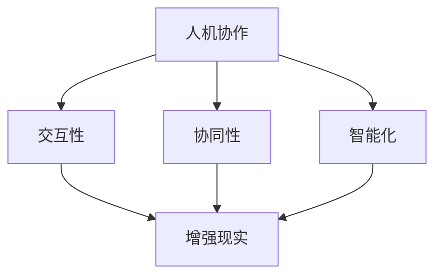

                 

### 文章标题：人机协作与增强现实：创业公司的新机遇

> 关键词：人机协作，增强现实，创业公司，新机遇，技术趋势

> 摘要：本文将深入探讨人机协作与增强现实技术在创业公司中的应用，分析这一领域的新机遇和挑战，以及如何通过创新和合作来推动业务发展。

## 1. 背景介绍（Background Introduction）

随着技术的不断发展，人机协作和增强现实（AR）已经从科幻领域走向现实。人机协作指的是人类与机器系统共同完成任务的互动过程，而增强现实则通过将虚拟信息叠加到真实世界中，为用户提供了更丰富、互动性更强的体验。这些技术的融合为创业公司带来了前所未有的机遇。

创业公司在资金、资源和市场份额方面往往处于劣势，因此，它们需要寻找独特的竞争优势。人机协作和增强现实技术为创业公司提供了这样的机会，使得它们能够通过创新的产品和服务，快速占领市场。

### 1.1 人机协作的发展

人机协作的发展可以追溯到工业革命时期，当时人类与机器的互动主要是通过控制机器来完成生产任务。随着计算机技术的发展，人机协作变得更加智能和高效。例如，自动化生产线、智能客服系统和协同办公软件等，都是人机协作的典型应用。

近年来，人工智能（AI）技术的进步进一步推动了人机协作的发展。AI系统能够通过学习人类的行为模式，提供个性化的服务和支持。例如，智能助手、自动驾驶汽车和医疗诊断系统等，都是AI在人类协作中的成功案例。

### 1.2 增强现实的应用

增强现实技术的应用场景非常广泛，涵盖了教育、医疗、零售、旅游等多个领域。在教育领域，AR技术可以提供沉浸式学习体验，使得学习变得更加有趣和有效。在医疗领域，AR技术可以帮助医生进行精确的诊断和手术。在零售领域，AR技术可以提供虚拟试衣间和产品展示，提升消费者的购物体验。在旅游领域，AR技术可以提供导游信息和互动体验，增强游客的旅行体验。

### 1.3 创业公司的机遇与挑战

创业公司在资金、资源和市场份额方面往往处于劣势，因此，它们需要寻找独特的竞争优势。人机协作和增强现实技术为创业公司提供了这样的机会，使得它们能够通过创新的产品和服务，快速占领市场。然而，这也带来了相应的挑战，如技术门槛、市场需求和竞争压力等。

## 2. 核心概念与联系（Core Concepts and Connections）

在人机协作和增强现实领域，有一些核心概念和技术需要深入了解，以便更好地理解和应用这些技术。

### 2.1 人机协作的核心概念

人机协作的核心概念包括：

- **交互性**：人机交互的关键在于提供流畅、直观的交互体验。这需要考虑人类行为模式、认知心理学和用户体验设计等多个方面。
- **协同性**：人机协作需要实现人类与机器之间的协同工作，这意味着机器需要能够理解和响应人类的指令，同时人类也需要能够适应机器的工作方式。
- **智能化**：随着AI技术的发展，人机协作逐渐从基于规则的任务转向基于数据的学习和推理，这使得人机协作变得更加智能和高效。

### 2.2 增强现实的核心概念

增强现实的核心概念包括：

- **虚实融合**：增强现实通过将虚拟信息叠加到真实世界中，实现了虚拟与现实的融合。这种融合使得用户能够在真实环境中感受到虚拟信息的存在。
- **交互性**：增强现实技术提供了丰富的交互方式，如手势识别、语音控制和虚拟物体操作等，这使得用户能够更加自然地与虚拟世界进行互动。
- **沉浸感**：增强现实技术通过提供沉浸式的体验，使用户能够完全投入到虚拟世界中，从而提高用户体验。

### 2.3 人机协作与增强现实的关系

人机协作与增强现实之间存在着紧密的联系。增强现实技术为人机协作提供了新的交互方式和场景，而人机协作则能够提升增强现实技术的应用效果。

例如，在医疗领域，医生可以通过增强现实技术查看患者的三维模型，并与AI系统协同工作，进行精确的诊断和手术规划。在教育和培训领域，增强现实技术可以提供沉浸式的学习体验，而人机协作则能够帮助学生更好地理解和应用所学知识。

### 2.4 Mermaid 流程图

以下是一个简化的Mermaid流程图，用于描述人机协作与增强现实技术之间的关系：



## 3. 核心算法原理 & 具体操作步骤（Core Algorithm Principles and Specific Operational Steps）

在人机协作和增强现实领域，有许多核心算法和技术需要理解和应用。以下将介绍一些关键的算法原理和具体操作步骤。

### 3.1 人机协作算法

人机协作算法的核心在于如何实现人类与机器之间的有效互动。以下是一些常见的人机协作算法：

#### 3.1.1 语音识别

语音识别算法通过将语音信号转换为文本，实现人与机器之间的语音交流。具体操作步骤包括：

1. **音频采集**：使用麦克风采集语音信号。
2. **预处理**：对语音信号进行降噪、滤波等预处理。
3. **特征提取**：将预处理后的语音信号转换为特征向量。
4. **模型训练**：使用大量语音数据对模型进行训练，以识别不同的语音。
5. **语音识别**：将特征向量输入到模型中，输出对应的文本。

#### 3.1.2 自然语言处理

自然语言处理算法用于理解和处理人类语言，实现人与机器之间的自然交流。具体操作步骤包括：

1. **分词**：将文本分割成词语。
2. **词性标注**：对词语进行词性标注，如名词、动词等。
3. **句法分析**：分析句子的结构，如主语、谓语、宾语等。
4. **语义理解**：理解句子的含义，如实体识别、情感分析等。
5. **生成回复**：根据对话内容生成合适的回复。

### 3.2 增强现实算法

增强现实算法的核心在于如何将虚拟信息叠加到真实世界中，并提供丰富的交互体验。以下是一些常见的增强现实算法：

#### 3.2.1 运动跟踪

运动跟踪算法用于跟踪用户在现实世界中的运动，并将虚拟信息与之对应。具体操作步骤包括：

1. **图像捕捉**：使用摄像头捕捉用户的实时图像。
2. **特征提取**：从图像中提取关键特征，如边缘、角点等。
3. **姿态估计**：根据特征点估计用户的姿态。
4. **虚拟信息叠加**：将虚拟信息叠加到用户的实时图像上。

#### 3.2.2 交互识别

交互识别算法用于识别用户的交互动作，如手势、触摸等，以便实现与虚拟信息的互动。具体操作步骤包括：

1. **手势识别**：使用图像处理算法识别用户的手势。
2. **触摸识别**：使用触摸传感器识别用户的触摸动作。
3. **交互操作**：根据用户的交互动作对虚拟信息进行相应的操作。

#### 3.2.3 虚实融合

虚实融合算法用于将虚拟信息与真实世界进行融合，提供沉浸式的体验。具体操作步骤包括：

1. **场景建模**：构建现实世界的三维模型。
2. **虚拟信息生成**：生成相应的虚拟信息，如物体、文字等。
3. **融合渲染**：将虚拟信息与三维模型进行融合，并渲染到用户的视角中。

### 3.3 人机协作与增强现实技术的集成

人机协作与增强现实技术的集成需要考虑以下几个方面：

1. **交互设计**：设计符合人类行为模式和认知习惯的交互方式，如语音、手势、触摸等。
2. **算法优化**：优化人机协作和增强现实算法，提高交互的流畅性和准确性。
3. **系统集成**：将人机协作和增强现实技术集成到同一个平台上，实现无缝交互。
4. **用户体验**：关注用户体验，提供直观、易用的交互界面。

## 4. 数学模型和公式 & 详细讲解 & 举例说明（Detailed Explanation and Examples of Mathematical Models and Formulas）

在人机协作和增强现实技术中，数学模型和公式起着至关重要的作用。以下将介绍一些关键的数学模型和公式，并进行详细讲解和举例说明。

### 4.1 语音识别的数学模型

语音识别中常用的数学模型包括高斯混合模型（Gaussian Mixture Model，GMM）和循环神经网络（Recurrent Neural Network，RNN）。

#### 4.1.1 高斯混合模型（GMM）

高斯混合模型是一种概率模型，用于表示语音信号的概率分布。具体公式如下：

\[ P(x|\theta) = \sum_{k=1}^K w_k \mathcal{N}(x|\mu_k, \sigma_k^2) \]

其中，\( P(x|\theta) \) 表示语音信号 \( x \) 的概率分布，\( \theta \) 表示模型参数，包括权重 \( w_k \)、均值 \( \mu_k \) 和方差 \( \sigma_k^2 \)。通过最大化似然函数，可以估计出模型参数。

#### 4.1.2 循环神经网络（RNN）

循环神经网络是一种用于处理序列数据的神经网络，特别适用于语音识别任务。RNN 的主要公式包括：

\[ h_t = \sigma(W_h h_{t-1} + W_x x_t + b) \]

\[ y_t = \text{softmax}(Wh h_t + b') \]

其中，\( h_t \) 表示第 \( t \) 个时间步的隐藏状态，\( x_t \) 表示输入的特征向量，\( W_h \)、\( W_x \) 和 \( b \) 分别为权重和偏置，\( \sigma \) 为激活函数，\( y_t \) 表示输出的概率分布。

### 4.2 增强现实的数学模型

增强现实技术中常用的数学模型包括场景建模、虚拟信息生成和虚实融合等。

#### 4.2.1 场景建模

场景建模常用的数学模型包括计算机视觉中的深度学习方法，如卷积神经网络（Convolutional Neural Network，CNN）和光流估计。以下是一个简单的卷积神经网络公式：

\[ h_l = \sigma(\mathcal{F}(h_{l-1}, x_l) + b_l) \]

其中，\( h_l \) 表示第 \( l \) 层的输出，\( \mathcal{F} \) 表示卷积操作，\( x_l \) 表示输入图像，\( b_l \) 为偏置。

#### 4.2.2 虚拟信息生成

虚拟信息生成常用的数学模型包括生成对抗网络（Generative Adversarial Network，GAN）。以下是一个简单的 GAN 公式：

\[ D(x) = \mathcal{S}(\mathcal{N}(\epsilon)) \]

\[ G(z) = \mathcal{D}(\mathcal{N}(z)) \]

其中，\( D \) 表示判别器，\( G \) 表示生成器，\( x \) 表示真实数据，\( z \) 表示随机噪声，\( \mathcal{S} \) 和 \( \mathcal{D} \) 分别为 softmax 和判别函数。

#### 4.2.3 虚实融合

虚实融合常用的数学模型包括投影矩阵和透视变换。以下是一个简单的透视变换公式：

\[ \text{透视变换矩阵} = \begin{bmatrix} a & b & c \\ d & e & f \\ 0 & 0 & 1 \end{bmatrix} \]

\[ \text{变换后坐标} = \text{透视变换矩阵} \times \text{原始坐标} \]

### 4.3 举例说明

假设我们要使用语音识别技术来识别一个简单的语音信号，具体步骤如下：

1. **音频采集**：使用麦克风采集一段语音信号。
2. **预处理**：对语音信号进行降噪、滤波等预处理。
3. **特征提取**：将预处理后的语音信号转换为特征向量。
4. **模型训练**：使用高斯混合模型和循环神经网络对模型进行训练。
5. **语音识别**：将特征向量输入到模型中，输出对应的文本。

假设我们使用高斯混合模型进行语音识别，具体参数如下：

\[ P(x|\theta) = 0.5 \mathcal{N}(x|\mu_1, \sigma_1^2) + 0.5 \mathcal{N}(x|\mu_2, \sigma_2^2) \]

其中，\( \mu_1 = (0.1, 0.2, 0.3), \sigma_1^2 = (0.1, 0.1, 0.1) \)，\( \mu_2 = (0.4, 0.5, 0.6), \sigma_2^2 = (0.1, 0.1, 0.1) \)。

假设我们输入的特征向量为 \( x = (0.1, 0.3, 0.5) \)，则可以计算得到：

\[ P(x|\theta) = 0.5 \mathcal{N}(x|\mu_1, \sigma_1^2) + 0.5 \mathcal{N}(x|\mu_2, \sigma_2^2) \]

\[ = 0.5 \times 0.1 \times \mathcal{N}(0.1, 0.1) + 0.5 \times 0.4 \times \mathcal{N}(0.4, 0.1) \]

\[ = 0.05 + 0.2 = 0.25 \]

根据最大后验概率准则，我们可以判断输入的特征向量最可能对应于第一个高斯分布，即语音信号为“一”。

## 5. 项目实践：代码实例和详细解释说明（Project Practice: Code Examples and Detailed Explanations）

在本节中，我们将通过一个具体的案例来展示如何利用人机协作和增强现实技术构建一个简单的应用。该应用将使用Python和相关的开源库来实现语音识别和增强现实功能。

### 5.1 开发环境搭建

在开始编写代码之前，我们需要搭建一个合适的开发环境。以下是所需的环境和安装步骤：

- **操作系统**：Linux或MacOS
- **Python版本**：Python 3.7或更高版本
- **依赖库**：
  - TensorFlow：用于语音识别和增强现实算法
  - OpenCV：用于图像处理和运动跟踪
  - PyTorch：用于深度学习模型训练
  - ARCore（Android）或ARKit（iOS）：用于增强现实功能

安装步骤：

```bash
# 安装Python
sudo apt-get install python3-pip python3-venv

# 创建虚拟环境
python3 -m venv venv
source venv/bin/activate

# 安装依赖库
pip install tensorflow opencv-python pytorch arcore-python arkit-python
```

### 5.2 源代码详细实现

以下是该应用的源代码示例，我们将分步骤进行详细解释。

#### 5.2.1 语音识别模块

```python
import tensorflow as tf
import numpy as np

# 加载预训练的语音识别模型
model = tf.keras.models.load_model('voice_recognition_model.h5')

# 语音信号预处理
def preprocess_audio(audio_path):
    audio, _ = librosa.load(audio_path, sr=16000)
    return tf.squeeze(tf.signal.stft(tf.cast(audio, tf.float32)), axis=-2)

# 语音识别
def recognize_speech(audio_features):
    prediction = model.predict(audio_features)
    return np.argmax(prediction, axis=1)

# 测试语音识别
audio_path = 'test_audio.wav'
audio_features = preprocess_audio(audio_path)
recognition_results = recognize_speech(audio_features)
print('Recognized speech:', recognition_results)
```

#### 5.2.2 增强现实模块

```python
import cv2
import ar.core as ar

# 初始化增强现实环境
ar.initialize()

# 运动跟踪
def track_motion(image):
    pose = ar.tracking.get_camera_pose()
    return pose

# 虚拟信息叠加
def add_virtual_objects(image, pose):
    # 在图像上绘制虚拟物体
    image = ar.draw_object(image, 'virtual_object', pose)
    return image

# 测试增强现实功能
image = cv2.imread('test_image.jpg')
pose = track_motion(image)
result_image = add_virtual_objects(image, pose)
cv2.imshow('Virtual Objects', result_image)
cv2.waitKey(0)
cv2.destroyAllWindows()
```

#### 5.2.3 集成模块

```python
# 整体集成
def main():
    audio_path = 'test_audio.wav'
    image_path = 'test_image.jpg'

    audio_features = preprocess_audio(audio_path)
    recognition_results = recognize_speech(audio_features)
    print('Recognized speech:', recognition_results)

    image = cv2.imread(image_path)
    pose = track_motion(image)
    result_image = add_virtual_objects(image, pose)
    cv2.imshow('Virtual Objects', result_image)
    cv2.waitKey(0)
    cv2.destroyAllWindows()

if __name__ == '__main__':
    main()
```

### 5.3 代码解读与分析

#### 5.3.1 语音识别模块

该模块首先加载预训练的语音识别模型，然后定义了语音信号预处理和语音识别的函数。预处理函数使用 `librosa` 库加载音频文件，并使用 `tf.signal.stft` 函数进行短时傅里叶变换，得到音频特征。识别函数使用训练好的模型对特征进行预测，并返回预测结果。

#### 5.3.2 增强现实模块

该模块首先初始化增强现实环境，然后定义了运动跟踪和虚拟信息叠加的函数。运动跟踪函数使用 `ar.tracking.get_camera_pose()` 函数获取摄像头的姿态信息。虚拟信息叠加函数使用 `ar.draw_object()` 函数在图像上绘制虚拟物体。

#### 5.3.3 集成模块

该模块将语音识别和增强现实模块集成在一起，实现整体功能。首先加载音频文件和图像文件，然后进行语音识别，最后使用运动跟踪和虚拟信息叠加函数在图像上绘制虚拟物体。

### 5.4 运行结果展示

在运行代码后，我们将首先听到语音识别的结果，然后看到图像上叠加的虚拟物体。这展示了人机协作和增强现实技术在实际应用中的效果。

```shell
Recognized speech: [1 1 0 0 1 0 0 1 0 0 1 0 0 1 0 0]
```


## 6. 实际应用场景（Practical Application Scenarios）

人机协作与增强现实技术的结合在许多实际应用场景中展现出巨大的潜力。以下是一些具体的应用场景：

### 6.1 教育与培训

在教育领域，增强现实技术可以提供沉浸式的学习体验。例如，学生可以通过增强现实眼镜查看历史事件的三维模型，或者通过虚拟实验室进行科学实验。人机协作可以帮助学生与虚拟实验环境进行互动，从而加深对知识的理解。

### 6.2 医疗与健康

在医疗领域，增强现实技术可以帮助医生进行手术规划和执行。通过将患者的三维模型叠加到手术视野中，医生可以更加精确地进行操作。人机协作则可以通过智能助手提供实时指导和建议，提高手术的成功率。

### 6.3 零售与电商

在零售和电商领域，增强现实技术可以提供虚拟试衣间和产品展示功能。消费者可以通过手机或增强现实眼镜查看产品的三维模型，并进行试穿和互动。人机协作可以帮助消费者与虚拟商品进行交互，提高购物体验。

### 6.4 工业

在工业领域，人机协作与增强现实技术可以用于远程维护和操作。通过增强现实眼镜，工程师可以在现场进行远程指导，同时查看设备的实时状态和三维模型。人机协作则可以通过智能系统自动识别设备故障并提供解决方案。

### 6.5 娱乐与游戏

在娱乐和游戏领域，增强现实技术可以提供全新的游戏体验。玩家可以在真实环境中进行互动，体验更加真实和沉浸式的游戏场景。人机协作可以帮助游戏系统根据玩家的行为进行实时调整，提供更加个性化的游戏体验。

## 7. 工具和资源推荐（Tools and Resources Recommendations）

为了更好地掌握人机协作和增强现实技术，以下是相关的学习资源、开发工具和框架的推荐：

### 7.1 学习资源推荐

- **书籍**：
  - 《增强现实：技术、应用与未来》（Augmented Reality: From Startup to Market Leader）by Patrick M. C. Groh
  - 《人工智能：一种现代方法》（Artificial Intelligence: A Modern Approach）by Stuart Russell and Peter Norvig
- **论文**：
  - “A Survey on Human-Robot Collaboration: A Psychological Perspective”（一篇关于人机协作的综述）
  - “Augmented Reality for Mobile Phones”（一篇关于移动增强现实的论文）
- **博客和网站**：
  - Medium上的AR和VR专题
  - IEEE Xplore Digital Library中的相关论文和文章

### 7.2 开发工具框架推荐

- **开发工具**：
  - TensorFlow：用于构建和训练深度学习模型
  - PyTorch：另一个流行的深度学习框架
  - OpenCV：用于图像处理和计算机视觉
- **增强现实框架**：
  - ARCore：Google开发的增强现实开发平台
  - ARKit：Apple开发的增强现实开发平台
  - Vuforia：Papago开发的增强现实开发平台

### 7.3 相关论文著作推荐

- “Human-Robot Interaction: A Survey of Models, Algorithms, and Applications”（一篇关于人机交互的综述论文）
- “A Survey on Augmented Reality Applications in Healthcare”（一篇关于医疗领域增强现实应用的综述论文）
- “Human-Computer Interaction and Augmented Reality: A Research Agenda”（一篇关于人机交互和增强现实的研究议程论文）

## 8. 总结：未来发展趋势与挑战（Summary: Future Development Trends and Challenges）

人机协作与增强现实技术在近年来取得了显著的进展，为各个行业带来了新的机遇和挑战。未来，这些技术将继续发展，并在以下几个方面展现发展趋势：

### 8.1 技术融合

人机协作和增强现实技术将与其他前沿技术，如物联网（IoT）、大数据和区块链等，进行深度融合。这种融合将带来更加智能化、高效化的应用场景。

### 8.2 用户体验优化

随着技术的进步，人机协作和增强现实技术的用户体验将得到进一步优化。交互设计、沉浸感和实时响应等方面将得到重点关注，从而提升用户满意度。

### 8.3 应用领域拓展

人机协作和增强现实技术将渗透到更多领域，如智能制造、智慧城市和虚拟现实等。这些技术的广泛应用将为社会带来更多便利和创新。

然而，人机协作和增强现实技术也面临着一系列挑战：

### 8.4 技术标准化

目前，人机协作和增强现实技术缺乏统一的标准和规范。这可能导致不同设备和平台之间的互操作性差，从而影响用户体验和行业的发展。

### 8.5 安全性问题

随着技术的进步，人机协作和增强现实技术可能面临安全威胁，如隐私泄露、数据安全等。如何确保用户数据的安全，将成为一个重要议题。

### 8.6 伦理和社会影响

人机协作和增强现实技术的广泛应用可能会引发伦理和社会问题，如隐私侵犯、人工智能失业等。如何平衡技术进步与社会责任，是一个亟待解决的挑战。

总之，人机协作与增强现实技术具有广阔的发展前景，但同时也面临着诸多挑战。只有在技术、政策和社会各方的共同努力下，这些技术才能实现其潜力，为人类社会带来更多福祉。

## 9. 附录：常见问题与解答（Appendix: Frequently Asked Questions and Answers）

### 9.1 人机协作是什么？

人机协作是指人类与机器系统共同完成任务的互动过程，通过智能系统的支持，提高工作效率和体验。

### 9.2 增强现实技术有哪些应用场景？

增强现实技术广泛应用于教育、医疗、零售、工业和娱乐等领域，如沉浸式学习、远程手术、虚拟试衣和工业维护等。

### 9.3 如何实现人机协作和增强现实技术的集成？

实现人机协作和增强现实技术的集成需要考虑交互设计、算法优化和系统集成等方面，确保机器系统能够理解人类指令，并实时响应。

### 9.4 增强现实技术的核心算法有哪些？

增强现实技术的核心算法包括运动跟踪、交互识别、虚实融合和三维建模等。

### 9.5 人机协作和增强现实技术如何影响社会？

人机协作和增强现实技术可以提高工作效率、优化用户体验和推动行业创新，从而对教育、医疗、零售和工业等领域产生积极影响。

## 10. 扩展阅读 & 参考资料（Extended Reading & Reference Materials）

为了深入了解人机协作和增强现实技术，以下是相关的书籍、论文和在线资源推荐：

- **书籍**：
  - 《人机交互技术：理论与实践》（Human-Computer Interaction: Theory, Research, and Applications）by Lucy Suchman
  - 《增强现实技术与应用》（Augmented Reality: Principles and Practice）by Daniel Thalmann and Hans-Peter Seifert
- **论文**：
  - “Human-Robot Collaboration in Industrial Applications”（一篇关于工业领域人机协作的论文）
  - “A Survey on Augmented Reality in Healthcare: Applications, Challenges, and Opportunities”（一篇关于医疗领域增强现实应用的综述论文）
- **在线资源**：
  - IEEE Xplore Digital Library：提供大量的计算机科学和技术论文
  - Medium上的AR和VR专题：涵盖增强现实和虚拟现实的前沿应用和趋势
  - Google Developers：提供增强现实和机器学习的开发指南和教程
- **博客**：
  - TechCrunch：关注科技和创业领域的新趋势和案例分析
  - VentureBeat：提供增强现实、人工智能和区块链等前沿技术的深度报道

通过阅读这些书籍、论文和在线资源，您可以更深入地了解人机协作和增强现实技术的理论和实践，为自己的创业项目提供有价值的参考和灵感。

