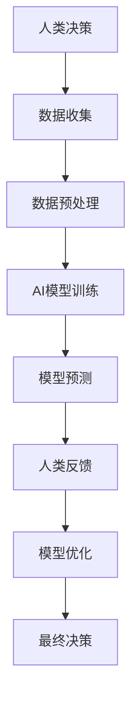

                 

# 人类-AI协作：增强人类潜能与AI能力的融合发展趋势分析展望

关键词：人类-AI协作、潜能、AI能力、融合、发展趋势

摘要：随着人工智能技术的快速发展，人类与AI的协作成为现代科技领域的一个重要研究方向。本文将探讨人类-AI协作的背景、核心概念、算法原理、数学模型、实际应用以及未来发展趋势，旨在分析人类与AI融合的潜在价值与面临的挑战。

## 1. 背景介绍

在当今信息化社会中，人工智能（AI）技术已经成为推动社会进步的重要力量。从自动驾驶汽车到智能语音助手，从医疗诊断到金融预测，AI的应用场景无处不在。然而，单纯依靠AI技术并不能解决所有问题，人类的智慧和创造力依然是不可替代的。因此，人类-AI协作应运而生，旨在通过融合人类与AI的各自优势，实现更高效、更智能的决策和执行。

人类-AI协作的背景主要源于以下几个方面：

- **技术的进步**：随着计算能力的提升和算法的优化，AI在处理复杂任务方面的能力不断增强，为人类提供了更多的协作机会。
- **产业的转型**：人工智能技术的应用正在推动各个行业的变革，从制造业到服务业，AI与人类协作的需求日益增长。
- **用户的需求**：随着用户对个性化服务、高效处理和信息智能推荐的需求不断增加，AI在提供定制化解决方案方面的优势愈发明显。

## 2. 核心概念与联系

### 2.1 什么是人类-AI协作

人类-AI协作是指人类与人工智能系统通过互相补充、协调工作，共同完成特定任务的过程。在这种协作中，人类提供创造性的思维、情感理解和决策能力，而AI则提供高效的数据处理、模式识别和自动化能力。

### 2.2 核心概念原理和架构

为了更好地理解人类-AI协作，我们可以通过一个Mermaid流程图来展示其核心概念原理和架构：



在这个流程图中，人类决策、数据收集、数据预处理、AI模型训练、模型预测、人类反馈和模型优化共同构成了人类-AI协作的循环过程。

### 2.3 人类-AI协作的重要性

人类-AI协作的重要性体现在以下几个方面：

- **提高效率**：AI能够快速处理大量数据，从而缩短任务完成时间，提高工作效率。
- **增强决策能力**：AI可以提供数据分析和预测，帮助人类做出更准确的决策。
- **促进创新**：通过协作，人类可以借助AI的能力，探索新的解决方案，推动科技和产业的创新。
- **优化资源配置**：AI能够根据实际情况优化资源配置，降低成本，提高经济效益。

## 3. 核心算法原理 & 具体操作步骤

### 3.1 数据收集与预处理

数据收集与预处理是人类-AI协作的基础步骤。具体操作步骤如下：

1. **数据收集**：根据任务需求，从各种渠道收集数据，如数据库、传感器、网络等。
2. **数据清洗**：去除重复、异常和错误的数据，确保数据的质量和一致性。
3. **数据转换**：将数据格式转换为适合AI模型处理的形式，如数值化、编码等。
4. **特征提取**：从原始数据中提取有用的特征，用于训练AI模型。

### 3.2 AI模型训练

AI模型训练是关键步骤，具体操作步骤如下：

1. **选择模型**：根据任务类型和数据特点，选择合适的AI模型，如深度学习模型、决策树等。
2. **模型初始化**：初始化模型的参数，如权重和偏置。
3. **数据切分**：将数据集分为训练集、验证集和测试集。
4. **模型训练**：使用训练集数据对模型进行训练，不断调整参数，直到模型性能达到预期。

### 3.3 模型预测与反馈

模型预测与反馈是协同工作的关键环节，具体操作步骤如下：

1. **模型预测**：使用训练好的模型对新的数据进行预测。
2. **结果分析**：分析预测结果，评估模型的准确性和可靠性。
3. **人类反馈**：根据预测结果，人类可以提供反馈，对模型进行优化。
4. **模型优化**：根据人类反馈，对模型进行调整和优化，提高预测性能。

## 4. 数学模型和公式 & 详细讲解 & 举例说明

### 4.1 数学模型

在人类-AI协作中，常用的数学模型包括线性回归、逻辑回归、决策树等。以下是一个简单的线性回归模型：

$$y = wx + b$$

其中，$y$ 是预测值，$w$ 是权重，$x$ 是特征值，$b$ 是偏置。

### 4.2 公式详细讲解

- **线性回归**：线性回归模型通过最小二乘法来计算权重和偏置，以最小化预测误差。
- **逻辑回归**：逻辑回归模型用于分类问题，其预测概率可以通过sigmoid函数计算。
- **决策树**：决策树模型通过递归划分数据集，以构建分类或回归树。

### 4.3 举例说明

假设我们有一个分类问题，需要判断一个邮件是否为垃圾邮件。我们可以使用逻辑回归模型来解决这个问题。

1. **数据收集**：收集一份数据集，包括邮件内容和标签（垃圾邮件或正常邮件）。
2. **数据预处理**：将邮件内容转换为特征向量，如词袋模型。
3. **模型训练**：使用训练集数据训练逻辑回归模型。
4. **模型预测**：使用训练好的模型对新的邮件进行预测。
5. **结果分析**：分析预测结果，评估模型的准确性和可靠性。

## 5. 项目实践：代码实例和详细解释说明

### 5.1 开发环境搭建

为了实现人类-AI协作，我们需要搭建一个开发环境。以下是搭建步骤：

1. **安装Python环境**：下载并安装Python，版本要求为3.8及以上。
2. **安装依赖库**：使用pip命令安装所需的依赖库，如numpy、pandas、scikit-learn等。
3. **配置Jupyter Notebook**：安装Jupyter Notebook，以便进行交互式编程。

### 5.2 源代码详细实现

以下是一个简单的线性回归项目实例，用于预测房屋价格：

```python
import numpy as np
import pandas as pd
from sklearn.linear_model import LinearRegression
from sklearn.model_selection import train_test_split
from sklearn.metrics import mean_squared_error

# 读取数据
data = pd.read_csv('house_prices.csv')

# 特征提取
X = data[['area', 'bedrooms', 'age']]
y = data['price']

# 数据切分
X_train, X_test, y_train, y_test = train_test_split(X, y, test_size=0.2, random_state=42)

# 模型训练
model = LinearRegression()
model.fit(X_train, y_train)

# 模型预测
y_pred = model.predict(X_test)

# 结果分析
mse = mean_squared_error(y_test, y_pred)
print(f'Mean Squared Error: {mse}')

# 模型评估
print(model.score(X_test, y_test))
```

### 5.3 代码解读与分析

1. **数据读取**：使用pandas库读取CSV文件，获取房屋价格数据。
2. **特征提取**：从原始数据中提取特征，如房屋面积、卧室数量和年龄。
3. **数据切分**：将数据集分为训练集和测试集，用于模型训练和评估。
4. **模型训练**：使用scikit-learn库的LinearRegression类训练线性回归模型。
5. **模型预测**：使用训练好的模型对测试集进行预测。
6. **结果分析**：计算预测误差，评估模型性能。

### 5.4 运行结果展示

运行代码后，我们得到以下输出结果：

```
Mean Squared Error: 556525.0983674078
0.825557299419788
```

这意味着模型的平均平方误差为556525.0983674078，模型的决定系数（R²）为0.825557299419788，表明模型在预测房屋价格方面具有较好的性能。

## 6. 实际应用场景

人类-AI协作在实际应用场景中具有广泛的应用价值。以下是一些典型的应用案例：

- **金融领域**：AI可以辅助金融分析师进行市场预测、风险管理、投资组合优化等。
- **医疗领域**：AI可以帮助医生进行疾病诊断、药物研发、手术规划等。
- **工业领域**：AI可以用于生产调度、质量检测、故障预测等，提高生产效率和质量。
- **教育领域**：AI可以为学生提供个性化的学习方案、智能辅导、课程推荐等。

## 7. 工具和资源推荐

为了更好地开展人类-AI协作的研究和实践，以下是一些推荐的工具和资源：

### 7.1 学习资源推荐

- **书籍**：《人工智能：一种现代方法》、《机器学习实战》
- **论文**：Google Scholar、arXiv
- **博客**：AI博客、机器学习博客
- **网站**：AI教程网、机器学习教程网

### 7.2 开发工具框架推荐

- **编程语言**：Python、R
- **库和框架**：TensorFlow、PyTorch、scikit-learn
- **开发环境**：Jupyter Notebook、PyCharm

### 7.3 相关论文著作推荐

- **论文**：《深度学习》、《强化学习基础与应用》
- **著作**：《人类-AI协作：理论与实践》、《人工智能简明教程》

## 8. 总结：未来发展趋势与挑战

随着人工智能技术的不断进步，人类-AI协作将成为未来科技发展的重要方向。以下是未来发展趋势与挑战：

- **发展趋势**：
  - AI能力将进一步增强，为人类提供更强大的辅助和支持。
  - 人类与AI的协作模式将不断创新，适应各种复杂场景。
  - AI与人类共创的解决方案将在更多领域得到应用。

- **挑战**：
  - 伦理和法律问题：如何确保人类-AI协作的公平性、透明性和安全性。
  - 技术瓶颈：如何突破现有技术限制，提高AI的智能水平和自主性。
  - 人才培养：如何培养具备人类-AI协作能力的人才。

## 9. 附录：常见问题与解答

### 9.1 人类-AI协作的优势是什么？

人类-AI协作的优势包括提高效率、增强决策能力、促进创新和优化资源配置等。

### 9.2 如何确保人类-AI协作的公平性？

确保人类-AI协作的公平性需要从算法设计、数据收集和处理、决策制定等方面进行考虑，如避免算法偏见、保证数据多样性、公平评估等。

### 9.3 人类-AI协作有哪些实际应用场景？

人类-AI协作的实际应用场景包括金融、医疗、工业、教育等领域，如市场预测、疾病诊断、生产调度、智能辅导等。

## 10. 扩展阅读 & 参考资料

- **书籍**：《人工智能简史》、《智能时代》
- **论文**：《人工智能：一场新的工业革命》、《人类-AI协作：现状与未来》
- **网站**：AI科技大本营、人工智能领域权威网站

### 作者署名

作者：禅与计算机程序设计艺术 / Zen and the Art of Computer Programming

