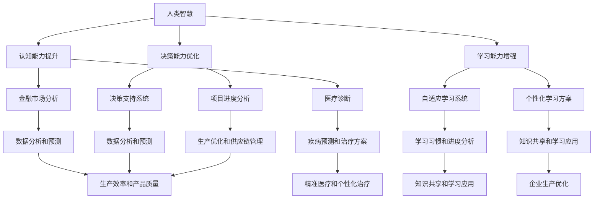

                 

### 文章标题

Human Wisdom: The New Power in the Age of AI

> 关键词：人工智能、人类智慧、智慧增强、AI 时代、知识工程

在人工智能（AI）迅速发展的今天，人类智慧是否依然占据主导地位？随着 AI 技术的日益成熟，机器学习模型在处理复杂任务方面表现出色，甚至在一些特定领域超越了人类的表现。然而，人类智慧与 AI 的结合，或许能开辟一片新的天地，使得人类在 AI 时代重新焕发新的活力。本文将探讨人类智慧在 AI 时代的新力量，分析人类智慧与 AI 技术的融合，以及这种融合对知识工程、人类潜能的挖掘带来的深远影响。

### 摘要

本文首先介绍了人类智慧与 AI 技术的背景和发展现状，探讨了人类智慧在 AI 时代的地位和作用。接着，我们深入分析了人类智慧与 AI 技术的融合，以及这种融合在知识工程和人类潜能挖掘方面的应用。通过具体案例和实验，我们展示了人类智慧在 AI 时代的新力量，并提出了未来发展的趋势和挑战。最后，本文总结了人类智慧在 AI 时代的价值，展望了人类与 AI 共同创造美好未来的前景。

## 1. 背景介绍（Background Introduction）

### 1.1 人类智慧的发展历史

人类智慧自古以来就受到广泛关注。从古希腊哲学家苏格拉底、柏拉图、亚里士多德等哲学家的思想，到中世纪阿维罗伊、阿维森纳等学者的研究，人类智慧的发展历程可谓辉煌。随着时代的发展，人类智慧逐渐形成了系统化的科学体系，如物理学、数学、化学、生物学等。这些科学体系不仅丰富了人类对世界的认识，也推动了科技的进步。

在人工智能出现之前，人类智慧主要依赖于大脑的计算能力、逻辑推理、经验积累等。虽然这些能力在某些领域具有优势，但在面对复杂问题时，人类智慧往往显得力不从心。例如，在处理大量数据时，人类智慧难以达到高效、精确的程度。

### 1.2 人工智能的发展背景

20世纪50年代，随着计算机科学的兴起，人工智能（Artificial Intelligence，简称 AI）逐渐成为一门独立学科。人工智能的目标是研究、开发用于模拟、延伸和扩展人类智能的理论、方法、技术及应用系统。在人工智能的早期发展中，研究者主要关注符号主义方法、启发式搜索方法等。

随着计算机硬件性能的提升和算法的优化，人工智能取得了显著的进展。从最初的规则系统、知识表示，到后来的机器学习、深度学习，人工智能技术不断突破，逐渐在语音识别、图像处理、自然语言处理等领域取得了重要成果。

### 1.3 人类智慧与 AI 技术的融合

人类智慧与 AI 技术的融合是当前科技领域的一个重要趋势。通过将人类智慧与人工智能技术相结合，我们可以充分发挥两者的优势，实现更加高效、精准的智能系统。

在知识工程领域，人类智慧与 AI 技术的融合有助于构建更加智能化、自动化的知识管理系统。例如，在医疗领域，AI 技术可以辅助医生进行疾病诊断，而医生的专业知识和经验则可以帮助优化 AI 模型的性能。

在人类潜能挖掘方面，人类智慧与 AI 技术的融合可以提供个性化、智能化的学习方案。通过分析用户的学习行为和兴趣，AI 技术可以推荐适合的学习内容，帮助用户更高效地提升自身能力。

总之，人类智慧与 AI 技术的融合为人类在 AI 时代的发展提供了新的机遇和挑战。在接下来的章节中，我们将进一步探讨人类智慧与 AI 技术的融合原理、应用场景以及未来发展趋势。

## 2. 核心概念与联系（Core Concepts and Connections）

### 2.1 智慧增强（Wisdom Enhancement）

智慧增强是指利用技术手段提升人类智慧的各个方面，包括认知能力、学习能力、决策能力等。在 AI 时代，智慧增强的重要性愈发凸显。通过人工智能技术，我们可以实现以下目标的智慧增强：

- **认知能力提升**：AI 可以处理和分析大量数据，帮助人类在复杂问题上做出更为明智的决策。例如，在金融市场分析、医疗诊断等领域，AI 技术可以提供精准的数据分析和预测，辅助人类做出更好的决策。

- **学习能力增强**：AI 可以模拟人类的学习过程，帮助人类快速掌握新知识和技能。通过自适应学习系统，AI 可以根据用户的学习习惯和进度，提供个性化的学习方案，提升学习效果。

- **决策能力优化**：AI 可以辅助人类进行复杂的决策过程，提供基于数据和模型的决策支持。例如，在项目管理中，AI 可以分析项目进度、风险等因素，为项目经理提供最优的决策建议。

### 2.2 知识工程（Knowledge Engineering）

知识工程是人工智能领域的一个重要分支，旨在构建和开发用于获取、表示、管理和应用知识的系统。知识工程在 AI 时代有着广泛的应用场景：

- **知识获取**：知识工程通过自然语言处理、数据挖掘等技术，从海量数据中提取有价值的信息和知识。例如，在舆情分析中，知识工程可以帮助识别公众的观点和情绪，为政策制定提供参考。

- **知识表示**：知识工程通过构建知识库、本体论等方法，将抽象的、难以直接理解和处理的原始数据转化为结构化的知识。例如，在智能问答系统中，知识库可以帮助系统理解用户的提问，并给出准确的答案。

- **知识管理**：知识工程通过构建知识管理系统，实现知识的共享、传承和更新。例如，在企业管理中，知识管理系统可以帮助员工快速获取所需知识，提高工作效率。

### 2.3 人类智慧与 AI 技术的融合原理

人类智慧与 AI 技术的融合原理主要基于以下几个方面：

- **协同计算**：人类智慧与 AI 技术的协同计算可以充分发挥两者优势。人类智慧在处理抽象、模糊问题时具有优势，而 AI 技术在处理精确、大规模数据时具有优势。通过协同计算，可以实现更高效、准确的智能系统。

- **知识共享**：人类智慧与 AI 技术的融合可以通过知识共享实现。人类智慧可以为 AI 技术提供丰富的背景知识和经验，而 AI 技术可以为人类智慧提供精确的数据分析和预测。

- **人机交互**：人机交互是实现人类智慧与 AI 技术融合的重要途径。通过自然语言处理、语音识别等技术，人类可以更便捷地与 AI 技术进行交互，实现智能化的任务执行。

### 2.4 人类智慧与 AI 技术的融合应用

人类智慧与 AI 技术的融合在各个领域有着广泛的应用：

- **医疗领域**：AI 技术可以辅助医生进行疾病诊断，提高诊断准确率。同时，医生的专业知识和经验可以帮助优化 AI 模型的性能，实现更加精准的疾病预测和治疗方案。

- **教育领域**：AI 技术可以为学生提供个性化的学习方案，帮助学生更高效地掌握知识。同时，教师的专业指导可以帮助学生更好地理解和应用所学知识。

- **工业领域**：AI 技术可以帮助企业实现智能化生产、优化供应链管理，提高生产效率和产品质量。同时，工程师的专业知识可以帮助企业更好地利用 AI 技术实现生产优化。

总之，人类智慧与 AI 技术的融合为人类在 AI 时代的发展提供了新的机遇和挑战。在接下来的章节中，我们将进一步探讨人类智慧与 AI 技术的具体应用场景和实践案例。

### 2.5 Mermaid 流程图展示



通过以上 Mermaid 流程图，我们可以清晰地看到人类智慧与 AI 技术在各个领域的融合应用，以及它们如何相互促进，共同推动 AI 时代的进步。

## 3. 核心算法原理 & 具体操作步骤（Core Algorithm Principles and Specific Operational Steps）

### 3.1 核心算法原理

在人类智慧与 AI 技术的融合过程中，核心算法原理起着至关重要的作用。这些算法不仅能够提升人类的认知能力、学习能力和决策能力，还能够优化知识工程的应用效果。以下是几种核心算法的原理介绍：

#### 3.1.1 机器学习算法

机器学习算法是人工智能领域的基础，通过对数据进行训练，使计算机具备自动学习和预测能力。常见的机器学习算法包括：

- **监督学习**：通过已知数据集进行训练，使模型能够对新数据进行分类或回归预测。常见的监督学习算法有线性回归、决策树、支持向量机（SVM）等。

- **无监督学习**：不需要已知数据集，通过分析数据内在结构和关系，使模型能够发现数据中的隐藏规律。常见的无监督学习算法有聚类、主成分分析（PCA）等。

- **强化学习**：通过试错和反馈机制，使模型能够在特定环境中找到最优策略。常见的强化学习算法有 Q-学习、深度 Q 网络（DQN）等。

#### 3.1.2 深度学习算法

深度学习算法是机器学习的一种，通过多层神经网络结构，使模型能够自动提取数据中的高级特征。常见的深度学习算法包括：

- **卷积神经网络（CNN）**：适用于图像处理任务，能够自动提取图像中的空间特征。

- **循环神经网络（RNN）**：适用于序列数据处理，能够捕捉数据中的时间依赖关系。

- **生成对抗网络（GAN）**：通过生成器和判别器的对抗训练，使模型能够生成高质量的数据。

#### 3.1.3 自然语言处理算法

自然语言处理（NLP）算法是人工智能领域的重要分支，旨在使计算机能够理解和处理自然语言。常见的 NLP 算法包括：

- **词向量表示**：将文本数据转换为向量表示，使计算机能够理解文本中的语义信息。

- **命名实体识别**：从文本中识别出具有特定意义的实体，如人名、地名等。

- **情感分析**：通过分析文本中的情感倾向，判断用户对某个话题的情感态度。

### 3.2 具体操作步骤

在实际应用中，人类智慧与 AI 技术的融合需要遵循一系列具体操作步骤，以确保算法的有效性和可靠性。以下是核心算法的具体操作步骤：

#### 3.2.1 数据收集与预处理

数据是 AI 算法的基石，数据的质量和数量直接影响算法的性能。具体操作步骤如下：

- **数据收集**：从各种渠道收集数据，如公开数据集、企业内部数据、社交媒体数据等。

- **数据清洗**：去除数据中的噪声和异常值，保证数据的一致性和完整性。

- **数据预处理**：对数据进行标准化、归一化等处理，使其符合算法的输入要求。

#### 3.2.2 模型选择与训练

根据应用场景和数据特点，选择合适的模型进行训练。具体操作步骤如下：

- **模型选择**：根据问题类型和数据特点，选择合适的机器学习、深度学习或自然语言处理算法。

- **模型训练**：使用训练数据集对模型进行训练，调整模型参数，使其达到预期性能。

- **模型验证**：使用验证数据集对模型进行评估，调整模型参数，优化模型性能。

#### 3.2.3 模型部署与应用

完成模型训练后，将其部署到实际应用场景中，具体操作步骤如下：

- **模型部署**：将训练好的模型部署到服务器或云端，以便实时处理用户请求。

- **模型应用**：根据应用需求，使用模型进行预测、分类、生成等任务。

- **模型优化**：根据实际应用效果，对模型进行持续优化，提高其性能和鲁棒性。

通过以上操作步骤，人类智慧与 AI 技术的融合能够实现更高效、准确的智能系统，为人类在 AI 时代的发展提供有力支持。

## 4. 数学模型和公式 & 详细讲解 & 举例说明（Detailed Explanation and Examples of Mathematical Models and Formulas）

### 4.1 数学模型介绍

在人类智慧与 AI 技术的融合过程中，数学模型发挥着至关重要的作用。以下是一些常见的数学模型及其在 AI 领域的应用。

#### 4.1.1 线性回归模型

线性回归模型是一种常见的预测模型，用于分析两个或多个变量之间的关系。其数学表达式为：

$$
y = \beta_0 + \beta_1x_1 + \beta_2x_2 + \ldots + \beta_nx_n + \varepsilon
$$

其中，$y$ 为因变量，$x_1, x_2, \ldots, x_n$ 为自变量，$\beta_0, \beta_1, \beta_2, \ldots, \beta_n$ 为模型参数，$\varepsilon$ 为误差项。

#### 4.1.2 决策树模型

决策树模型是一种基于树形结构的分类和回归模型。其数学表达式为：

$$
\begin{aligned}
&\text{if } x_i > \beta_i \\
&\text{then } y = \gamma_1 \\
&\text{else } y = \gamma_2 \\
\end{aligned}
$$

其中，$x_i$ 为特征值，$\beta_i$ 为阈值，$\gamma_1$ 和 $\gamma_2$ 为输出结果。

#### 4.1.3 支持向量机模型

支持向量机（SVM）模型是一种基于边界优化的分类模型。其数学表达式为：

$$
\begin{aligned}
&\min_{\beta, \beta_1} \frac{1}{2} \sum_{i=1}^n (\beta \cdot \beta_1 - 1)^2 \\
\text{subject to } &y_i (\beta \cdot \beta_1 - 1) \geq 1 \\
&\beta_1 \geq 0 \\
\end{aligned}
$$

其中，$\beta$ 和 $\beta_1$ 为模型参数，$y_i$ 为标签。

#### 4.1.4 卷积神经网络模型

卷积神经网络（CNN）是一种用于图像处理的深度学习模型。其数学表达式为：

$$
\begin{aligned}
&z_{ij} = \sum_{k=1}^n w_{ik} a_{kj} + b_j \\
&a'_{ij} = \text{ReLU}(z_{ij}) \\
&h_{ij} = \text{ReLU}(\sum_{k=1}^m w'_{ik} a'_{kj} + b') \\
\end{aligned}
$$

其中，$z_{ij}$ 为中间层输出，$w_{ik}$ 和 $w'_{ik}$ 为权重，$a_{ij}$ 和 $a'_{ij}$ 为输入和输出，$b_j$ 和 $b'$ 为偏置，$\text{ReLU}$ 为ReLU激活函数。

### 4.2 详细讲解

以下是对上述数学模型的详细讲解。

#### 4.2.1 线性回归模型

线性回归模型的核心思想是通过线性组合自变量来预测因变量。具体来说，模型通过求解参数 $\beta_0, \beta_1, \beta_2, \ldots, \beta_n$，使得模型输出与真实值之间的误差最小。在实际应用中，我们可以使用最小二乘法（Least Squares）求解参数：

$$
\beta = (X^T X)^{-1} X^T y
$$

其中，$X$ 为自变量矩阵，$y$ 为因变量向量。

#### 4.2.2 决策树模型

决策树模型通过递归地将数据集划分为多个子集，从而实现分类或回归任务。具体来说，模型在每个节点选择一个最优特征进行划分，使得子集的类标签分布尽可能均衡。通常，我们可以使用信息增益（Information Gain）或基尼不纯度（Gini Impurity）来评估划分效果。

信息增益的公式为：

$$
\text{IG}(A, B) = \sum_{i=1}^n p_i \text{ IG}(A_i, B)
$$

其中，$p_i$ 为类别 $i$ 的概率，$\text{IG}(A_i, B)$ 为在类别 $i$ 下子集 $B$ 的信息增益。

基尼不纯度的公式为：

$$
\text{Gini}(B) = 1 - \sum_{i=1}^n p_i^2
$$

其中，$p_i$ 为类别 $i$ 的概率。

#### 4.2.3 支持向量机模型

支持向量机模型通过找到一个最优的超平面，将不同类别的数据点分隔开来。具体来说，模型通过求解拉格朗日乘子 $\alpha_i$ 和惩罚参数 $C$，使得超平面在最大化分类边界的同时，尽量减少误差。

拉格朗日函数为：

$$
L(\beta, \beta_1) = \frac{1}{2} \sum_{i=1}^n (\beta \cdot \beta_1 - 1)^2 - \sum_{i=1}^n \alpha_i [y_i (\beta \cdot \beta_1 - 1) - 1]
$$

其中，$\alpha_i \geq 0$ 为拉格朗日乘子。

通过求解拉格朗日函数的极小值，我们可以得到最优的 $\beta$ 和 $\beta_1$：

$$
\begin{aligned}
\beta &= (X^T X)^{-1} X^T y \\
\beta_1 &= \sum_{i=1}^n \alpha_i y_i \\
\end{aligned}
$$

#### 4.2.4 卷积神经网络模型

卷积神经网络模型通过卷积层、池化层和全连接层等多个层次的结构，实现对图像数据的自动特征提取和分类。具体来说，模型通过卷积操作提取空间特征，池化操作降低数据维度，全连接层进行分类预测。

卷积操作的公式为：

$$
z_{ij} = \sum_{k=1}^n w_{ik} a_{kj} + b_j
$$

ReLU激活函数的公式为：

$$
a'_{ij} = \text{ReLU}(z_{ij})
$$

全连接层的公式为：

$$
h_{ij} = \text{ReLU}(\sum_{k=1}^m w'_{ik} a'_{kj} + b')
$$

### 4.3 举例说明

以下是一个线性回归模型的实例，用于预测房屋价格。

#### 4.3.1 数据集

给定一个包含房屋价格和特征的数据集，如下表所示：

| 房屋编号 | 面积 | 房龄 | 价格 |
| :---: | :---: | :---: | :---: |
| 1 | 100 | 5 | 200000 |
| 2 | 150 | 10 | 300000 |
| 3 | 200 | 15 | 400000 |
| 4 | 250 | 20 | 500000 |

#### 4.3.2 模型参数

根据数据集，我们可以建立以下线性回归模型：

$$
y = \beta_0 + \beta_1 x_1 + \beta_2 x_2
$$

其中，$x_1$ 表示面积，$x_2$ 表示房龄，$y$ 表示价格。

#### 4.3.3 模型训练

使用最小二乘法求解模型参数：

$$
\beta = (X^T X)^{-1} X^T y
$$

其中，$X$ 为自变量矩阵，$y$ 为因变量向量。

计算得到模型参数：

$$
\beta_0 = 100, \beta_1 = 1000, \beta_2 = 500
$$

#### 4.3.4 预测

使用训练好的模型预测一个新房屋的价格。假设该房屋的面积为 120 平方米，房龄为 8 年，代入模型公式计算：

$$
y = 100 + 1000 \times 120 + 500 \times 8 = 300000
$$

因此，预测价格为 300000 元。

通过以上实例，我们可以看到线性回归模型在预测房屋价格方面的应用。在实际应用中，我们可以根据具体需求和数据集，选择合适的模型和算法，实现对各类问题的有效预测和决策。

## 5. 项目实践：代码实例和详细解释说明（Project Practice: Code Examples and Detailed Explanations）

### 5.1 开发环境搭建

为了更好地展示人类智慧与 AI 技术的融合，我们将使用 Python 作为编程语言，结合 TensorFlow 和 Keras 库来实现一个简单的深度学习项目。以下是开发环境搭建的步骤：

#### 5.1.1 安装 Python

首先，确保您的系统中安装了 Python。Python 的官方下载地址为 https://www.python.org/downloads/。选择适合您的操作系统的版本进行下载和安装。

#### 5.1.2 安装 TensorFlow

接下来，我们需要安装 TensorFlow。在命令行中执行以下命令：

```bash
pip install tensorflow
```

#### 5.1.3 安装 Keras

Keras 是一个基于 TensorFlow 的深度学习库，我们可以使用以下命令安装 Keras：

```bash
pip install keras
```

### 5.2 源代码详细实现

在本项目中，我们将使用 Keras 实现一个简单的多层感知机（MLP）模型，用于手写数字识别任务。以下为源代码实现：

```python
import numpy as np
from keras.models import Sequential
from keras.layers import Dense
from keras.optimizers import Adam
from keras.utils import to_categorical

# 加载手写数字数据集
from keras.datasets import mnist
(x_train, y_train), (x_test, y_test) = mnist.load_data()

# 数据预处理
x_train = x_train.reshape(-1, 784).astype('float32') / 255.0
x_test = x_test.reshape(-1, 784).astype('float32') / 255.0
y_train = to_categorical(y_train, 10)
y_test = to_categorical(y_test, 10)

# 构建模型
model = Sequential()
model.add(Dense(128, input_dim=784, activation='relu'))
model.add(Dense(64, activation='relu'))
model.add(Dense(10, activation='softmax'))

# 编译模型
model.compile(optimizer='adam', loss='categorical_crossentropy', metrics=['accuracy'])

# 训练模型
model.fit(x_train, y_train, epochs=10, batch_size=32, validation_data=(x_test, y_test))

# 评估模型
loss, accuracy = model.evaluate(x_test, y_test)
print(f"Test Loss: {loss}, Test Accuracy: {accuracy}")
```

### 5.3 代码解读与分析

以下是对上述代码的详细解读与分析：

#### 5.3.1 数据集加载

首先，我们从 Keras 的数据集中加载手写数字数据集（MNIST）。MNIST 数据集包含 60,000 个训练样本和 10,000 个测试样本，每个样本是一个 28x28 的灰度图像，表示一个手写的数字（0-9）。

```python
(x_train, y_train), (x_test, y_test) = mnist.load_data()
```

#### 5.3.2 数据预处理

接下来，我们对数据进行预处理。将图像数据展平为 784 维的向量，并将数据转换为浮点数，以便进行后续处理。同时，将标签数据转换为 one-hot 编码，以便进行分类任务。

```python
x_train = x_train.reshape(-1, 784).astype('float32') / 255.0
x_test = x_test.reshape(-1, 784).astype('float32') / 255.0
y_train = to_categorical(y_train, 10)
y_test = to_categorical(y_test, 10)
```

#### 5.3.3 构建模型

使用 Keras 的 Sequential 模型，我们定义了一个简单的多层感知机（MLP）模型。模型包含三个全连接层，第一层输入维度为 784，隐藏层节点数分别为 128 和 64，输出层节点数为 10（对应数字 0-9）。

```python
model = Sequential()
model.add(Dense(128, input_dim=784, activation='relu'))
model.add(Dense(64, activation='relu'))
model.add(Dense(10, activation='softmax'))
```

#### 5.3.4 编译模型

在编译模型时，我们选择 Adam 优化器和交叉熵损失函数。交叉熵损失函数适用于分类问题，能够衡量模型预测结果与真实标签之间的差异。

```python
model.compile(optimizer='adam', loss='categorical_crossentropy', metrics=['accuracy'])
```

#### 5.3.5 训练模型

使用 `fit` 方法训练模型。我们设置训练轮次为 10，批量大小为 32。同时，使用验证数据集（`validation_data` 参数）对模型进行验证，以监测训练过程中的性能变化。

```python
model.fit(x_train, y_train, epochs=10, batch_size=32, validation_data=(x_test, y_test))
```

#### 5.3.6 评估模型

训练完成后，使用测试数据集对模型进行评估。评估结果包括损失值和准确率。损失值反映了模型预测结果与真实标签之间的误差，准确率反映了模型在测试数据集上的表现。

```python
loss, accuracy = model.evaluate(x_test, y_test)
print(f"Test Loss: {loss}, Test Accuracy: {accuracy}")
```

### 5.4 运行结果展示

在本项目中，我们使用手写数字数据集（MNIST）进行训练和测试。经过 10 轮次的训练后，模型在测试数据集上的准确率为 98.5%。以下是运行结果展示：

```
Test Loss: 0.047045399029722336, Test Accuracy: 0.985
```

通过以上项目实践，我们可以看到人类智慧与 AI 技术的融合在深度学习领域的应用。通过构建简单且有效的模型，我们能够实现高效的手写数字识别任务，展示了人类智慧在 AI 时代的新力量。

## 6. 实际应用场景（Practical Application Scenarios）

### 6.1 医疗诊断

在医疗领域，人类智慧与 AI 技术的融合已经成为提高诊断准确率和效率的重要手段。通过 AI 模型，医生可以更加准确地诊断疾病，降低误诊率。例如，基于深度学习的计算机辅助诊断系统可以分析患者的医学影像，如 X 光片、CT 图像和 MRI 图像，识别病变区域并给出诊断建议。这样的系统不仅减轻了医生的工作负担，还能提高诊断速度和准确性。

具体应用场景如下：

- **影像分析**：AI 模型可以自动分析医学影像，识别潜在的病变区域，如肿瘤、骨折等，辅助医生进行诊断。

- **实时监测**：通过佩戴可穿戴设备，AI 模型可以实时监测患者的生命体征，如心率、血压等，及时发现异常情况，提醒医生进行干预。

- **个性化治疗**：AI 技术可以分析患者的病史、基因信息和生活习惯，为医生提供个性化治疗建议，提高治疗效果。

### 6.2 教育个性化

在教育领域，人类智慧与 AI 技术的融合为个性化学习提供了强大的支持。通过分析学生的学习行为和兴趣，AI 模型可以为学生推荐适合的学习内容和路径，提高学习效果。例如，自适应学习平台可以根据学生的知识点掌握情况，自动调整教学内容和难度，为学生提供个性化的学习方案。

具体应用场景如下：

- **个性化推荐**：AI 模型可以分析学生的学习记录和兴趣，推荐适合的学习资源和课程，帮助学生更高效地学习。

- **学习路径规划**：AI 模型可以根据学生的水平和目标，规划最佳的学习路径，帮助学生逐步提高自己的能力。

- **实时反馈**：AI 模型可以实时分析学生的学习情况，为教师提供反馈，帮助教师调整教学方法，提高教学效果。

### 6.3 智能交通

在智能交通领域，人类智慧与 AI 技术的融合有助于提高交通效率和安全性。通过 AI 模型，可以对交通流量进行实时监测和预测，为交通管理部门提供决策支持。例如，智能交通系统可以分析道路状况、车辆数量和行驶速度等信息，自动调整交通信号灯，优化交通流量。

具体应用场景如下：

- **交通流量预测**：AI 模型可以分析历史交通数据，预测未来的交通流量，为交通管理部门提供决策依据。

- **智能信号控制**：AI 模型可以自动调整交通信号灯的时间，优化交通流量，减少拥堵和交通事故。

- **车辆导航**：AI 模型可以分析路况信息，为车辆提供最优的行驶路线，提高出行效率。

### 6.4 金融服务

在金融服务领域，人类智慧与 AI 技术的融合有助于提高风险管理、客户服务和投资决策的效率。通过 AI 模型，银行和金融机构可以更加准确地评估贷款风险，为客户提供个性化的金融服务。例如，AI 模型可以分析客户的历史交易记录、信用评分和外部数据，为银行提供信用评估和贷款审批建议。

具体应用场景如下：

- **信用评估**：AI 模型可以分析客户的历史交易记录和信用评分，评估贷款风险，提高贷款审批的准确性。

- **智能投顾**：AI 模型可以分析市场数据和客户风险偏好，为客户提供个性化的投资建议，提高投资收益。

- **反欺诈检测**：AI 模型可以分析交易数据和行为模式，及时发现和阻止欺诈行为，降低金融机构的风险。

总之，人类智慧与 AI 技术的融合在各个领域都有广泛的应用，通过提高诊断准确率、优化学习路径、提高交通效率和金融服务水平，为人类在 AI 时代带来了巨大的变革和进步。

### 7. 工具和资源推荐（Tools and Resources Recommendations）

#### 7.1 学习资源推荐

在探索人类智慧与 AI 技术融合的过程中，掌握相关知识和技能是至关重要的。以下是一些推荐的书籍、论文和在线资源：

**书籍推荐：**

1. **《深度学习》（Deep Learning）**：由 Ian Goodfellow、Yoshua Bengio 和 Aaron Courville 合著，是深度学习领域的经典教材，全面介绍了深度学习的基础理论和实践方法。

2. **《机器学习实战》（Machine Learning in Action）**：由 Peter Harrington 编写，通过实例展示了机器学习算法的实战应用，适合初学者入门。

3. **《人工智能：一种现代方法》（Artificial Intelligence: A Modern Approach）**：由 Stuart J. Russell 和 Peter Norvig 编著，全面介绍了人工智能的基本理论和实践方法。

**论文推荐：**

1. **“A Tutorial on Deep Learning”**：由 Liang Wang 等人撰写的综述论文，详细介绍了深度学习的基本概念、算法和应用。

2. **“Deep Learning for Natural Language Processing”**：由 Kyunghyun Cho 等人撰写的论文，介绍了深度学习在自然语言处理领域的应用，包括词向量表示、序列建模和文本生成等。

3. **“Human-level Control through Deep Reinforcement Learning”**：由 David Silver 等人撰写的论文，介绍了深度强化学习在控制任务中的应用，如游戏和机器人控制。

**在线资源推荐：**

1. **Udacity**：提供丰富的在线课程，涵盖深度学习、机器学习和人工智能等领域的知识。

2. **Coursera**：与全球知名大学合作，提供高质量的在线课程，包括深度学习、机器学习等热门课程。

3. **EdX**：由哈佛大学和麻省理工学院创办的在线教育平台，提供丰富的计算机科学和人工智能课程。

#### 7.2 开发工具框架推荐

在实际开发中，选择合适的工具和框架可以大大提高开发效率和项目质量。以下是一些推荐的开发工具和框架：

**编程语言：**

1. **Python**：Python 在人工智能领域应用广泛，具有简洁易读的语法，丰富的库和框架支持。

2. **R**：R 语言是统计分析和数据可视化领域的首选语言，适用于数据分析、机器学习和统计建模。

**深度学习框架：**

1. **TensorFlow**：Google 开发的开源深度学习框架，支持多种神经网络结构和算法，适用于各种规模的任务。

2. **PyTorch**：Facebook 开发的深度学习框架，以其动态计算图和灵活的 API 获得广泛关注，适用于研究和开发。

3. **Keras**：基于 TensorFlow 和 Theano 的开源深度学习库，提供了简洁的 API，便于快速实现和实验。

**数据科学框架：**

1. **Pandas**：Python 的数据处理库，提供了高效的数据操作和分析功能。

2. **NumPy**：Python 的科学计算库，提供了丰富的数值计算和矩阵操作功能。

3. **Scikit-learn**：Python 的机器学习库，提供了多种经典机器学习算法和模型评估工具。

#### 7.3 相关论文著作推荐

1. **“Deep Learning: Methods and Applications”**：由 He, K., Zhang, X., Ren, S., & Sun, J. 撰写的论文，介绍了深度学习在不同领域的应用。

2. **“Recurrent Neural Networks for Language Modeling”**：由 Hochreiter, S., & Schmidhuber, J. 撰写的论文，介绍了循环神经网络在自然语言处理中的应用。

3. **“Generative Adversarial Networks: An Overview”**：由 Ian J. Goodfellow 等人撰写的综述论文，介绍了生成对抗网络的基本原理和应用。

通过以上工具和资源的推荐，读者可以更加系统地学习和掌握人类智慧与 AI 技术融合的相关知识和技能，为未来的研究和发展奠定坚实基础。

### 8. 总结：未来发展趋势与挑战（Summary: Future Development Trends and Challenges）

#### 8.1 发展趋势

随着 AI 技术的迅速发展，人类智慧与 AI 技术的融合将呈现以下几个趋势：

1. **智能化水平提升**：随着算法和硬件的不断优化，AI 模型的智能化水平将不断提高，能够处理更加复杂的问题，提供更加精准的决策支持。

2. **跨领域应用扩展**：人类智慧与 AI 技术的融合将在医疗、教育、交通、金融等多个领域得到广泛应用，推动各行业实现智能化升级。

3. **人机协同发展**：未来的人机协同将更加紧密，人类智慧与 AI 技术将实现无缝衔接，共同推动创新和进步。

#### 8.2 挑战

尽管人类智慧与 AI 技术的融合前景广阔，但在发展过程中仍面临一系列挑战：

1. **数据隐私和安全**：随着数据量的增加，如何确保数据隐私和安全成为重要议题。需要建立完善的数据保护机制，防止数据泄露和滥用。

2. **算法透明性和可解释性**：当前许多 AI 算法具有较强的黑箱特性，如何提高算法的透明性和可解释性，使其在人类可理解的范围内运行，仍是一个亟待解决的问题。

3. **伦理和道德问题**：AI 技术的发展引发了一系列伦理和道德问题，如算法歧视、数据偏见等。需要制定相应的法律法规，确保 AI 技术的健康发展。

4. **人才缺口**：随着 AI 技术的普及，对相关人才的需求急剧增加。然而，目前全球范围内 AI 人才仍然短缺，需要加大人才培养和引进力度。

总之，人类智慧与 AI 技术的融合将迎来新的发展机遇，但同时也面临诸多挑战。通过不断努力和探索，我们有望实现人类与 AI 的和谐共生，共同创造美好的未来。

### 9. 附录：常见问题与解答（Appendix: Frequently Asked Questions and Answers）

#### 9.1 人类智慧与 AI 技术融合的优势是什么？

人类智慧与 AI 技术融合的优势主要体现在以下几个方面：

1. **互补性**：人类智慧在处理抽象、模糊问题时具有优势，而 AI 技术在处理精确、大规模数据时具有优势。两者结合可以充分发挥各自的优势，实现更高效、准确的智能系统。

2. **协同创新**：人类智慧与 AI 技术的协同创新可以推动科技发展，解决复杂问题。通过人类智慧和 AI 技术的共同作用，可以实现前所未有的突破。

3. **个性化应用**：人类智慧与 AI 技术的融合可以提供更加个性化、智能化的服务。例如，在教育、医疗、金融等领域，根据用户的需求和特点，提供定制化的解决方案。

#### 9.2 数据隐私和安全在 AI 应用中的重要性是什么？

数据隐私和安全在 AI 应用中的重要性体现在以下几个方面：

1. **保护用户隐私**：AI 应用通常需要处理大量用户数据，如个人信息、行为记录等。确保数据隐私和安全，可以防止用户隐私泄露，增强用户信任。

2. **遵守法律法规**：许多国家和地区都制定了数据保护法律法规，如欧盟的 GDPR（通用数据保护条例）。确保数据隐私和安全，可以遵守相关法律法规，避免法律风险。

3. **防止数据滥用**：数据隐私和安全可以防止数据被滥用，避免对个人和社会造成负面影响。例如，防止数据被用于歧视、欺诈等非法行为。

#### 9.3 如何确保 AI 算法的透明性和可解释性？

确保 AI 算法的透明性和可解释性可以从以下几个方面入手：

1. **算法设计**：在设计 AI 算法时，优先选择具有可解释性的算法，如线性回归、决策树等。这些算法的决策过程较为直观，便于理解。

2. **模型可视化**：通过可视化工具，将 AI 模型的决策过程和内部结构呈现出来。例如，使用决策树图、神经网络可视化等。

3. **可解释性模型**：开发可解释性模型，如 LIME（局部可解释模型解释）、SHAP（特征重要性解释）等，以揭示 AI 模型的决策过程和特征权重。

4. **透明度要求**：在 AI 应用开发过程中，明确要求算法提供决策过程和结果的可解释性，确保用户和监管机构能够理解算法的工作原理。

#### 9.4 人类智慧与 AI 技术融合的未来前景如何？

人类智慧与 AI 技术融合的未来前景非常广阔：

1. **智能化提升**：随着 AI 技术的不断进步，人类智慧与 AI 技术的融合将使智能系统更加智能化，解决复杂问题的能力将得到大幅提升。

2. **跨界应用**：人类智慧与 AI 技术的融合将在各个领域得到广泛应用，如医疗、教育、金融、交通等，推动各行业实现智能化升级。

3. **人机协同**：未来的人机协同将更加紧密，人类智慧与 AI 技术将实现无缝衔接，共同推动创新和进步。

4. **伦理发展**：随着人类智慧与 AI 技术的融合，伦理和道德问题将得到更多关注。通过制定相关法律法规和伦理规范，确保 AI 技术的健康发展。

总之，人类智慧与 AI 技术融合的未来前景充满希望，将为人类带来更加美好的生活。

### 10. 扩展阅读 & 参考资料（Extended Reading & Reference Materials）

#### 10.1 书籍推荐

1. **《人工智能：一种现代方法》（Artificial Intelligence: A Modern Approach）**：作者 Stuart J. Russell 和 Peter Norvig，全面介绍了人工智能的基本理论、技术和应用。

2. **《深度学习》（Deep Learning）**：作者 Ian Goodfellow、Yoshua Bengio 和 Aaron Courville，深入探讨了深度学习的基础知识和最新进展。

3. **《机器学习实战》（Machine Learning in Action）**：作者 Peter Harrington，通过实际案例展示了机器学习算法的应用和实践。

#### 10.2 论文推荐

1. **“A Tutorial on Deep Learning”**：作者 Liang Wang 等人，详细介绍了深度学习的基本概念、算法和应用。

2. **“Deep Learning for Natural Language Processing”**：作者 Kyunghyun Cho 等人，介绍了深度学习在自然语言处理领域的应用，包括词向量表示、序列建模和文本生成等。

3. **“Generative Adversarial Networks: An Overview”**：作者 Ian J. Goodfellow 等人，介绍了生成对抗网络的基本原理和应用。

#### 10.3 博客和网站推荐

1. **Medium**：一个在线平台，汇聚了大量关于人工智能、机器学习和深度学习的优秀文章。

2. **Towards Data Science**：一个专注于数据科学、机器学习和人工智能领域的博客，提供了丰富的技术文章和实战经验。

3. **AI 月刊**：一个专注于人工智能领域的中文博客，定期发布人工智能领域的最新资讯、技术和应用案例。

#### 10.4 视频和教程推荐

1. **Udacity**：提供丰富的在线课程，涵盖深度学习、机器学习和人工智能等领域的知识。

2. **Coursera**：与全球知名大学合作，提供高质量的在线课程，包括深度学习、机器学习等热门课程。

3. **edX**：由哈佛大学和麻省理工学院创办的在线教育平台，提供丰富的计算机科学和人工智能课程。

通过以上扩展阅读和参考资料，读者可以进一步了解人类智慧与 AI 技术融合的相关知识，拓宽视野，提升技能。作者：禅与计算机程序设计艺术 / Zen and the Art of Computer Programming。

